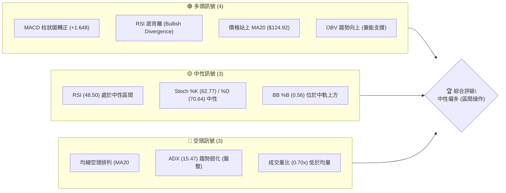
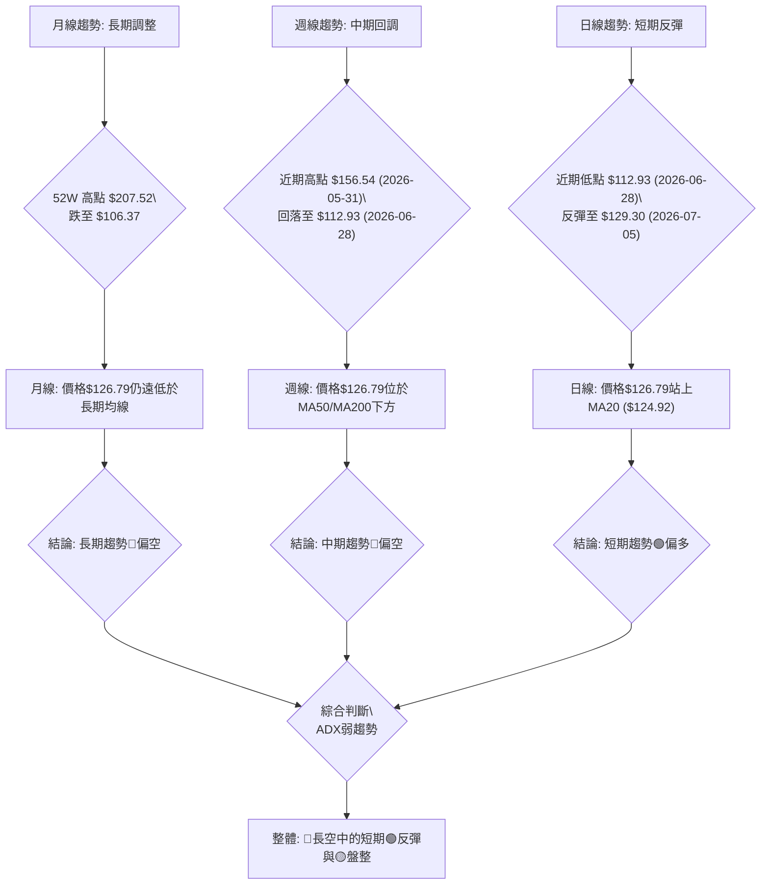
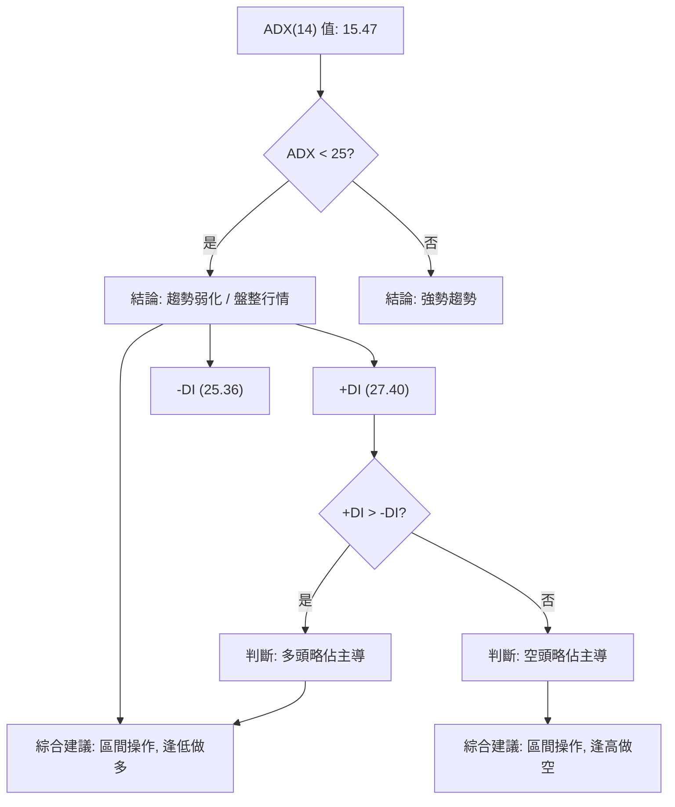
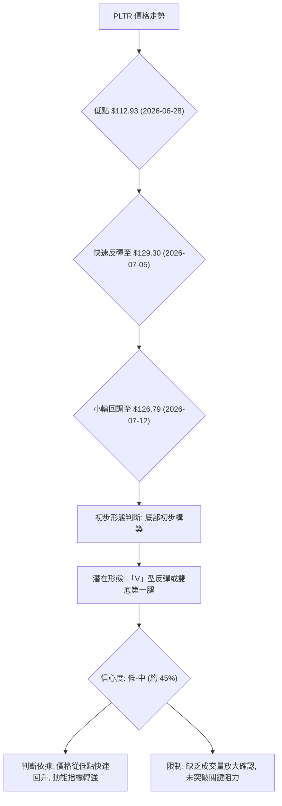
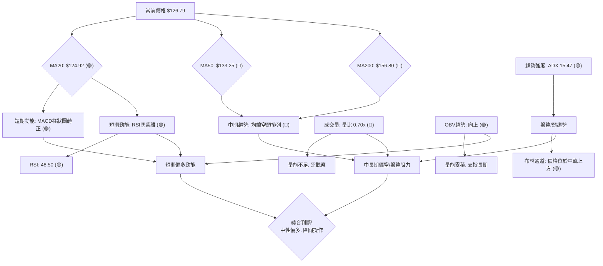
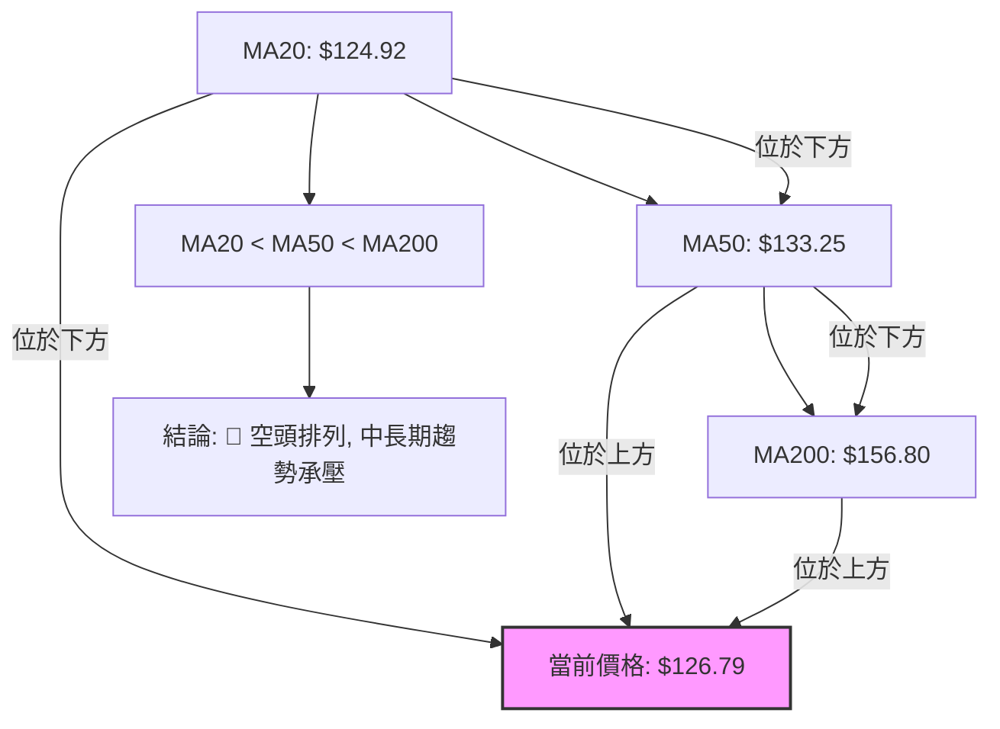
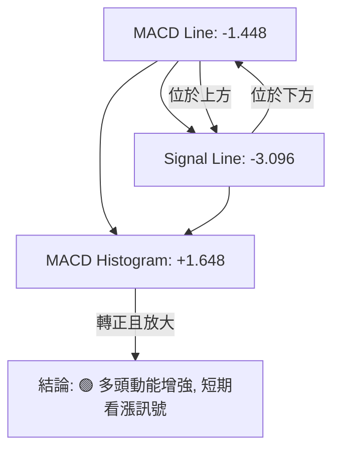
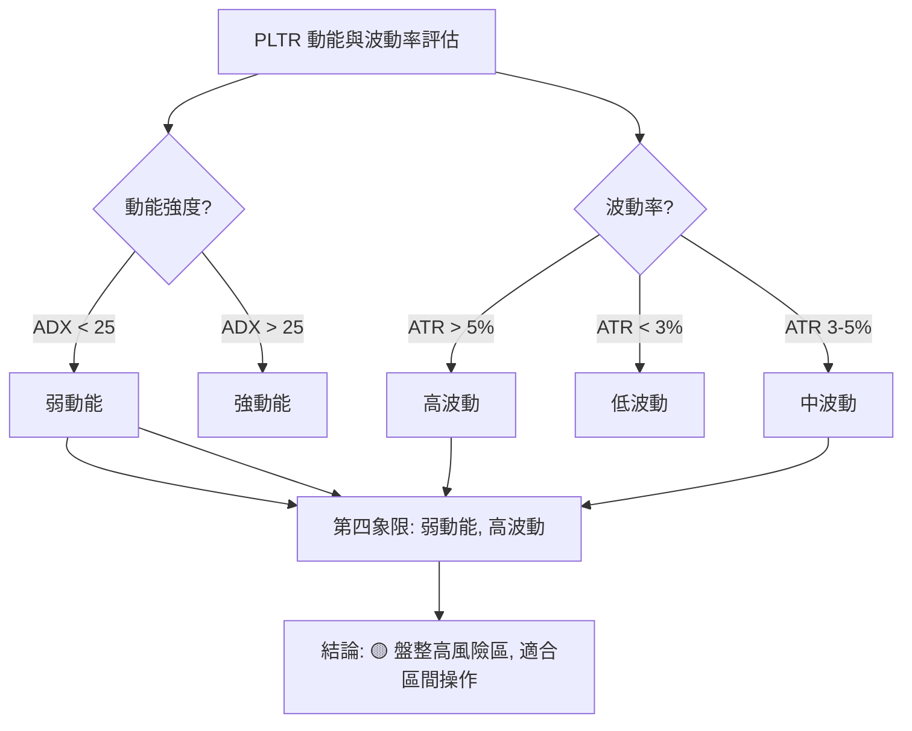
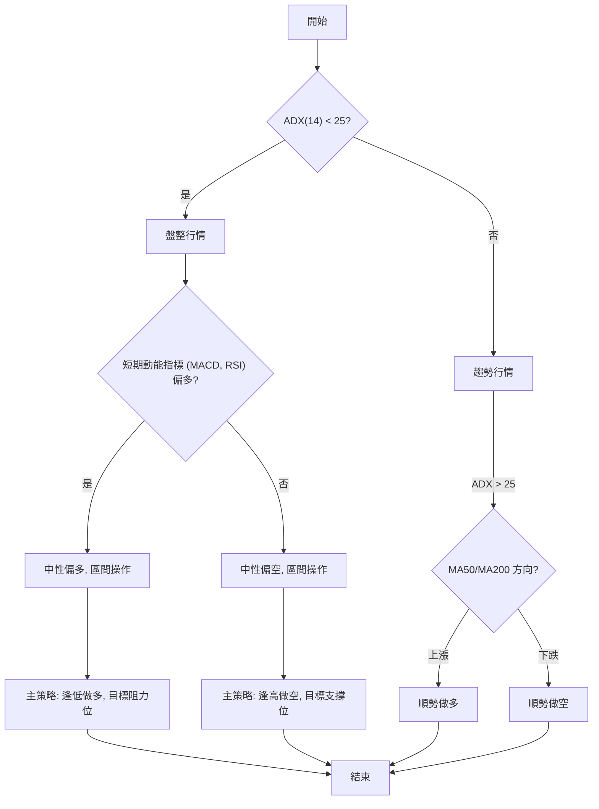
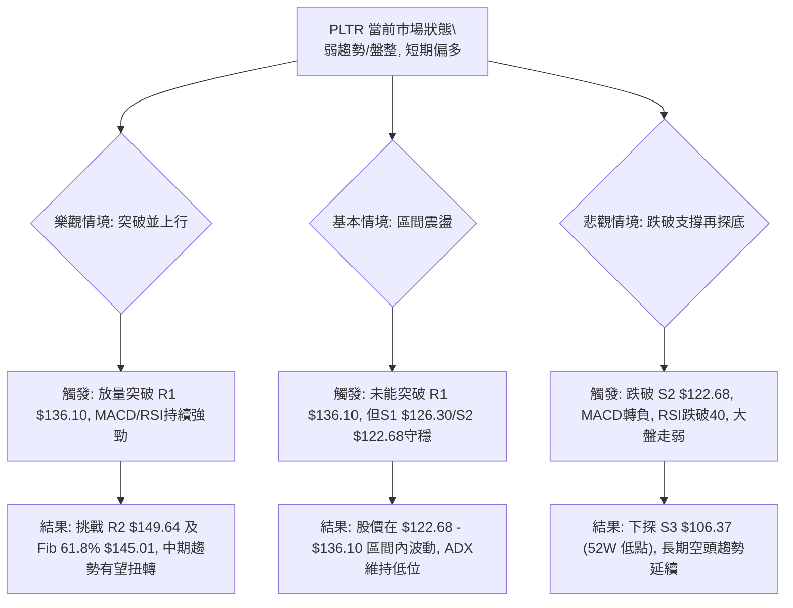

<details>
<summary>📊 靜態圖表 (點擊展開)</summary>

</details>

<html>
<head><meta charset="utf-8" /></head>
<body>
    <div style="height:500px; width:100%;">                        <script>window.PlotlyConfig = {MathJaxConfig: 'local'};</script>
        <script charset="utf-8" src="https://cdn.plot.ly/plotly-3.7.0.min.js" integrity="sha256-jvTGqxNp8AGWEcvNLVuKr+8j5dGe9Yw51LQkmDH+IYA=" crossorigin="anonymous"></script>                <div id="candlestick-chart" class="plotly-graph-div" style="height:100%; width:100%;"></div>            <script>                window.PLOTLYENV=window.PLOTLYENV || {};                                if (document.getElementById("candlestick-chart")) {                    Plotly.newPlot(                        "candlestick-chart",                        [{"close":{"dtype":"f8","bdata":"AAAAoJnRZkAAAACA63FmQAAAAADXY2ZAAAAAgD0yZkAAAAAghVtmQAAAAKBwzWZAAAAAYGYeZ0AAAACgmWFnQAAAAIA9omVAAAAAwPVwZkAAAACgcMVmQAAAAIDr8WZAAAAAQAovZ0AAAACAFO5lQAAAAGC4JmZAAAAAIK53ZkAAAAAA13NmQAAAAADXQ2ZAAAAAwMxEZkAAAABA4bJmQAAAAOBRsGZAAAAAIK7vZUAAAAAgXI9mQAAAAAApFGdAAAAAgMKlZ0AAAABAM7NnQAAAAIDr2WhAAAAAoJlRaEAAAABACg9pQAAAAIDC5WlAAAAAIK7XZ0AAAADAzHxnQAAAAKCZ4WVAAAAAgMI9ZkAAAAAghTNoQAAAAGC43mdAAAAAoHAFZ0AAAADgeoRlQAAAAOBRwGVAAAAAAABoZUAAAABgj+pkQAAAAKBwrWRAAAAAANd3Y0AAAABAM1tjQAAAAAAASGRAAAAAoJlxZEAAAADgo7hkQAAAAGBmDmVAAAAAIK7vZEAAAACAFFZlQAAAAGCPAmZAAAAAoHA9ZkAAAADgUbhmQAAAACCur2ZAAAAAQOG6ZkAAAADAHn1nQAAAAKBHcWdAAAAAgD3yZkAAAAAAAOhmQAAAAAAAeGdAAAAAoEcpZkAAAACAFDZnQAAAAAApLGhAAAAAIFw\u002faEAAAAAAKURoQAAAAKBwRWhAAAAAYLiWZ0AAAACAwgVnQAAAAEDhmmZAAAAAAAA4ZkAAAAAghftkQAAAAKBHwWVAAAAAYLh2ZkAAAACAwrVmQAAAACCFG2ZAAAAAIK4vZkAAAADAHm1mQAAAAGC4XmZAAAAAwMxMZkAAAACAPSJmQAAAAGC4XmVAAAAAwPUQZUAAAABgj6pkQAAAAMDMvGRAAAAAQDMzZUAAAABACu9kQAAAAGBmtmRAAAAAQDOrY0AAAAAghftiQAAAAEDhUmJAAAAA4FF4YkAAAAAAKbxjQAAAAKBHcWFAAAAA4FFAYEAAAADAzPxgQAAAAMAe3WFAAAAA4FFwYUAAAACAwvVgQAAAAAApJGBAAAAAwB5tYEAAAADgo6BgQAAAAAAp7GBAAAAA4HrcYEAAAAAgrudgQAAAAEAzU2BAAAAAQOEaYEAAAACAFMZgQAAAAIAU\u002fmBAAAAAgBQmYUAAAACgcCViQAAAAEAKZ2JAAAAAgBQmY0AAAACgcBVjQAAAAMAepWNAAAAAgMKNY0AAAADgeuRiQAAAAEAz82JAAAAAAAAwY0AAAABgZt5iQAAAAEAKF2NAAAAAYI9iY0AAAADgoxhjQAAAAIDCdWNAAAAAgMLVYkAAAABA4RpkQAAAAMD1WGNAAAAAYLheY0AAAACA63FiQAAAAIDr4WFAAAAAoJkxYUAAAADA9UhiQAAAACCuT2JAAAAAYLiOYkAAAACAwn1iQAAAAIA9wmJAAAAA4FGYYUAAAAAgrk9gQAAAAIDrAWBAAAAAANeLYEAAAABgZvZgQAAAAMDMxGFAAAAA4FHYYUAAAADgekxiQAAAAOB6PGJAAAAAQAo\u002fYkAAAAAA1xNjQAAAAIA9smFAAAAAQOHiYUAAAABAM+NhQAAAAIDCpWFAAAAAQAo\u002fYUAAAAAghWNhQAAAAIA9AmJAAAAAwPVAYkAAAADAHv1gQAAAAKBHuWBAAAAAoJkhYUAAAACgmTlhQAAAAOB6HGFAAAAAAAAAYUAAAACgmUFgQAAAACBct2BAAAAAIK6\u002fYEAAAADgeuRgQAAAAOBR6GBAAAAAwMwkYUAAAACgRy1hQAAAAAApHGFAAAAAQDMTYUAAAADgUZBgQAAAAEDh6mFAAAAAoEeRY0AAAADAzBRkQAAAAKBwBWNAAAAAYGbGYUAAAABgZrZhQAAAAMD18GBAAAAAQAoPYUAAAACAPYJgQAAAAGC4RmBAAAAAYI9iYEAAAAAgXP9fQAAAAGC41mBAAAAAAACoYEAAAAAAKVRgQAAAAEAKD2BAAAAAAADgXUAAAADAzCxdQAAAAAAAYFxAAAAAoEfRWkAAAAAghTtcQAAAAMDM7FxAAAAAQOEqXUAAAABguG5fQAAAAKCZKWBAAAAAoEeRYEAAAAAA18tgQAAAAEAKh2BAAAAAoEchYEAAAABgj7JfQA=="},"high":{"dtype":"f8","bdata":"AAAAAAA4Z0AAAABAMxtnQAAAAIA9CmdAAAAAANeDZkAAAAAgXK9mQAAAAOCj2GZAAAAAwPVIZ0AAAABgZoZnQAAAAEDhWmdAAAAAYGbeZkAAAACAwkVnQAAAAOBRCGdAAAAAANdzZ0AAAABAM2NnQAAAAEAKZ2ZAAAAAQOHKZkAAAABAMwtnQAAAAIA9GmdAAAAAQOGyZkAAAABA4eJmQAAAAMByzGZAAAAAYLjGZkAAAACA67FmQAAAAKBwRWdAAAAAYI8aaEAAAADA9fhnQAAAAEAz+2hAAAAAoHD1aEAAAACAwoVpQAAAAOCj8GlAAAAAYGZ2aEAAAACAPcpnQAAAAEDh4mdAAAAAYGZWZkAAAACAwl1oQAAAAKCZHWhAAAAAYI\u002fSZ0AAAABgZtZmQAAAAKBHKWZAAAAAIK7HZUAAAABgj5plQAAAAEAzM2VAAAAAgD3SZUAAAAAghcNjQAAAAKBwpWRAAAAAwMyUZEAAAAAg2QplQAAAAKCZGWVAAAAAQDMjZUAAAAAAAPhlQAAAAMAePWZAAAAAgBROZkAAAABg5cRmQAAAAAAp\u002fGZAAAAAQDPbZkAAAADgesxnQAAAAKCZgWdAAAAAwMxQZ0AAAADA9XhnQAAAAAAAkGdAAAAAAAB4Z0AAAABgj2pnQAAAAAAAYGhAAAAAACncaEAAAAAA12toQAAAAKBwZWhAAAAAQDOLaEAAAABgZmZnQAAAAABUF2dAAAAAwPWwZkAAAABAM6tmQAAAAIA9+mVAAAAAgBSGZkAAAADA9WhnQAAAAMAeNWdAAAAAQApXZkAAAAAAANBmQAAAAEAzo2ZAAAAA4CKzZkAAAABAM5NmQAAAAIDCzWZAAAAAQAp\u002fZUAAAAAgri9lQAAAAAAAIGVAAAAAAACAZUAAAABA4VJlQAAAAIAULmVAAAAAoHChZEAAAAAAKbRjQAAAAAAA4GJAAAAAwMzsYkAAAAAAf6JkQAAAAEAze2NAAAAAIFw\u002fYUAAAADg+zVhQAAAAADXO2JAAAAAgOsxYkAAAAAAAGhhQAAAAOB6\u002fGBAAAAAgOuxYEAAAACAPcpgQAAAAODQnmFAAAAAwB4FYUAAAABguAZhQAAAAKBHgWBAAAAAIK5HYEAAAABA4QJhQAAAAOBRMGFAAAAAQDNDYUAAAADgemRiQAAAAAAAcGJAAAAA4KNQY0AAAAAAKYxjQAAAAGBmLmRAAAAAgBTOY0AAAAAgBpVjQAAAAIBoJWNAAAAAACl8Y0AAAACA61FjQAAAACCFO2NAAAAAAACYY0AAAACAFJZjQAAAAMDMhGNAAAAAwMyUY0AAAABgjyJkQAAAAMDMTGRAAAAA4KMIZEAAAAAA1yNjQAAAAGC4PmJAAAAAANcDYkAAAAAghXtiQAAAAKCZiWJAAAAA4FGQYkAAAAAghdNiQAAAAOCjyGJAAAAAwPWIY0AAAACgR3FhQAAAAGBmJmBAAAAAoHDNYEAAAACAPUJhQAAAAGCP0mFAAAAAoJkxYkAAAADA9YhiQAAAAGBmZmJAAAAAANe7YkAAAACAwhVjQAAAAKBHyWJAAAAAYI\u002fqYUAAAACAPSJiQAAAAEAz+2FAAAAA4FF4YUAAAABgZoZhQAAAAIAUTmJAAAAA4Hq0YkAAAAAgXN9hQAAAAGBm9mBAAAAAYGaeYUAAAAAAKTxhQAAAAOB6JGFAAAAAgMItYUAAAAAgrh9hQAAAACBcz2BAAAAA4Hr0YEAAAACA6\u002f1gQAAAAEAKL2FAAAAAIK4nYUAAAACgmVFhQAAAAOCjYGFAAAAAgMJVYUAAAAAgXPdgQAAAAAAAIGJAAAAAoO24Y0AAAABgZnZkQAAAAKCZ8WNAAAAAgML1YkAAAAAA10tiQAAAAEAKv2FAAAAA4FE4YUAAAAAgrh9hQAAAAIDrpWBAAAAA4KNwYEAAAABA4WJgQAAAACBc32BAAAAAQOHSYEAAAABAMwNhQAAAAIDCbWBAAAAAANcbYEAAAAAAKTxeQAAAAAAAgF1AAAAAoJkJXEAAAADAHoVcQAAAAMAexV1AAAAAwMysXUAAAAAAAAhgQAAAAAApnGBAAAAAQDXCYEAAAADAzFxhQAAAAOB6jGBAAAAAgBQmYEAAAADA9YhgQA=="},"hovertemplate":"\u003cb\u003e%{x|%Y-%m-%d}\u003c\u002fb\u003e\u003cbr\u003e\u958b: $%{open:.2f}\u003cbr\u003e\u9ad8: $%{high:.2f}\u003cbr\u003e\u4f4e: $%{low:.2f}\u003cbr\u003e\u6536: $%{close:.2f}\u003cextra\u003e\u003c\u002fextra\u003e","low":{"dtype":"f8","bdata":"AAAA4FEgZkAAAAAA1yNmQAAAAKBHyWVAAAAAwB7dZUAAAADAHiVmQAAAAEAKR2ZAAAAAAABwZkAAAABgZt5mQAAAAOCjWGVAAAAAYI86ZkAAAACgcG1mQAAAAGBmpmZAAAAAYGZ+ZkAAAADA9bBlQAAAAGBmrmVAAAAAgD1aZUAAAADgowBmQAAAAGBmDmZAAAAAYGa+ZUAAAACAFC5mQAAAAMDMVGZAAAAAoHAtZUAAAADgUeBlQAAAAEAz22ZAAAAA4KNwZ0AAAADA9VhnQAAAACCuz2dAAAAAANdDaEAAAACgcL1oQAAAAIA9OmlAAAAAgOsxZ0AAAABguKZmQAAAAMD10GVAAAAAwB4dZUAAAADgo\u002fBmQAAAAAApZGdAAAAAwMyMZkAAAABgZFdlQAAAAAAAkGRAAAAAgML1ZEAAAAAAALBkQAAAAKBwTWRAAAAA4KNMY0AAAACA63FiQAAAAAAAoGNAAAAAgMKRY0AAAAAAKXxkQAAAAAAAvGRAAAAAANdjZEAAAABA4TJlQAAAAGCPGmVAAAAAgMLNZUAAAADAHiVmQAAAAKBHcWZAAAAAACmMZkAAAAAAANhmQAAAAGC4hmZAAAAAIFg1ZkAAAADA9YBmQAAAAECLpGZAAAAAAAAQZkAAAADgUbBmQAAAACBcV2dAAAAAgMINaEAAAAAghfdnQAAAAGCPGmhAAAAAANeTZ0AAAADgevRmQAAAAGBmlmZAAAAAAAAoZkAAAABAM8tkQAAAAKBHeWVAAAAA4KPYZUAAAADAHjVmQAAAAADXy2VAAAAAAADYZUAAAABA4QpmQAAAAOB6BGZAAAAAYGa+ZUAAAADA9RBmQAAAAOBRQGVAAAAAIK7HZEAAAAAghSNkQAAAAGBmnmRAAAAAoJnJZEAAAABgZupkQAAAAIAUlmRAAAAAIK6nY0AAAAAA12NiQAAAAMByJGJAAAAAoO1UYkAAAAAA1yNjQAAAAIDC9WBAAAAAgD0KYEAAAABAM4tgQAAAAADV2GBAAAAA4KM4YUAAAABgZp5gQAAAAADXo19AAAAAgOmOX0AAAABgj9JfQAAAAADX22BAAAAA4FFgYEAAAACgcGVgQAAAAMD12F9AAAAAIK6XX0AAAACAwiVgQAAAAAAplGBAAAAAIFy\u002fYEAAAADgo5BhQAAAAGBmRmFAAAAAgOuBYkAAAAAghbNiQAAAAKBHyWJAAAAAQAofY0AAAADgesRiQAAAAGCPqmJAAAAAIFzfYkAAAABgj5JiQAAAAKBw5WJAAAAAANcDY0AAAAAghRNjQAAAAAAA0GJAAAAAQOGiYkAAAAAgridjQAAAAOB69GJAAAAAIFxbY0AAAAAAAGhiQAAAAIDrsWFAAAAAoJkJYUAAAABACl9hQAAAAEAKD2JAAAAAIK4\u002fYUAAAAAgMVRiQAAAAGBmDmJAAAAAoHBlYUAAAABACg9gQAAAACCFq15AAAAAwMwkYEAAAAAAAMBgQAAAAIDC3WBAAAAAwPVwYUAAAACgmelhQAAAAGCP+mFAAAAAwPf\u002fYUAAAADAHm1iQAAAAKBwfWFAAAAAgMJdYUAAAADgUaBhQAAAAKBwjWFAAAAAgMLVYEAAAADAzBRhQAAAAOB6rGFAAAAAQDMnYkAAAABACtdgQAAAAMDMZGBAAAAAwPXYYEAAAADgo6BgQAAAAACsmGBAAAAAYLiuYEAAAAAAABhgQAAAAGBmLmBAAAAAoEeJYEAAAABgj2pgQAAAAEAzs2BAAAAAoHCNYEAAAACgcO1gQAAAAKCZyWBAAAAAoJmpYEAAAAAAKXRgQAAAAAAAoGBAAAAAoEc5YkAAAAAAKXxjQAAAAKCZuWJAAAAAAACoYUAAAABAtIhhQAAAAMDMwGBAAAAAwPXoYEAAAABgZtZfQAAAAKCZGWBAAAAAQOHKX0AAAACgmalfQAAAAGBmNmBAAAAAANczYEAAAACgcD1gQAAAAOCjQF9AAAAAwMzMXUAAAAAghQtdQAAAAAAAEFxAAAAAIK6XWkAAAACAFB5bQAAAAMDMrFxAAAAA4HqkXEAAAABgZtZdQAAAAMDM\u002fF9AAAAAwPWoX0AAAABguG5gQAAAAKBwrV9AAAAAANczX0AAAACgR3FfQA=="},"name":"\u50f9\u683c","open":{"dtype":"f8","bdata":"AAAA4FHQZkAAAADAHv1mQAAAAKCZ+WVAAAAAoJlhZkAAAADgenRmQAAAACBcX2ZAAAAAgD2qZkAAAABgZlZnQAAAAMDMTGdAAAAAgMJlZkAAAACA64lmQAAAAKCZ2WZAAAAAYI\u002fyZkAAAACgcCVnQAAAAIDCVWZAAAAAAAAAZkAAAADA9bRmQAAAAMD1uGZAAAAAAAA4ZkAAAAAgrm9mQAAAAIDrwWZAAAAAgMK9ZkAAAACAPe5lQAAAAAAp3GZAAAAAQAqfZ0AAAAAgXK9nQAAAAGCP4mdAAAAAoJnNaEAAAABgZuZoQAAAAKBwoWlAAAAAgD0CaEAAAAAAAKBnQAAAACCuf2dAAAAAwMykZUAAAACA6wlnQAAAAGC4ymdAAAAAYI\u002fSZ0AAAABA4bZmQAAAAEAz32RAAAAAwPVQZUAAAAAA1wtlQAAAAKCZ+WRAAAAAgD2CZUAAAADgUYBjQAAAAEAKr2NAAAAAgD0CZEAAAABAM9tkQAAAAOBR+GRAAAAAAACgZEAAAABA4TJlQAAAAOB6RGVAAAAAIK4LZkAAAAAgXEdmQAAAAGC4xmZAAAAAQAqfZkAAAABgZh5nQAAAAKCZGWdAAAAAgOs5Z0AAAABgjyJnQAAAAMD1tGZAAAAAQOF2Z0AAAADgUbBmQAAAACCuV2dAAAAAoEdhaEAAAABgZhpoQAAAAMAeJWhAAAAA4HpgaEAAAABAM1tnQAAAAEAzC2dAAAAAACmkZkAAAACgmalmQAAAAAAp3GVAAAAA4FH4ZUAAAACgmXlmQAAAACCuM2dAAAAA4KMgZkAAAACA6zVmQAAAAAAAXGZAAAAAAABEZkAAAABguFZmQAAAACCFa2ZAAAAAAAD0ZEAAAAAg3QxlQAAAAKCZHWVAAAAA4KPoZEAAAABguAZlQAAAACBc72RAAAAAwMyMZEAAAAAAKbRjQAAAAKCZwWJAAAAAgBTeYkAAAACgmaFkQAAAAMAebWNAAAAAgD0aYUAAAABgj+pgQAAAAGCPEmFAAAAAQOEeYkAAAADAzGBhQAAAACCF62BAAAAAoJn5X0AAAADgoxxgQAAAAOB6\u002fGBAAAAAgOuJYEAAAAAgrotgQAAAAKBHgWBAAAAAACkgYEAAAAAghVNgQAAAAEAKu2BAAAAAgD3CYEAAAADAzJhhQAAAAEAzw2FAAAAAgMKNYkAAAACAFB5jQAAAAIAUzmJAAAAAgBR2Y0AAAAAgrn9jQAAAAAAp7GJAAAAA4FEgY0AAAACgmSljQAAAAGBmDmNAAAAAwPUMY0AAAACAPV5jQAAAAEAzI2NAAAAAYGZmY0AAAAAgridjQAAAAIA9AmRAAAAAoHCtY0AAAACAwiFjQAAAAAApPGJAAAAA4KPoYUAAAADgo4BhQAAAAAAAYGJAAAAAIIXvYUAAAAAghYtiQAAAAGA5XGJAAAAA4HpYY0AAAADgo2xhQAAAACBcD2BAAAAAIFxHYEAAAAAAqs1gQAAAAKBHGWFAAAAAoEcJYkAAAACAFCpiQAAAAAAAIGJAAAAAgOtZYkAAAAAghYtiQAAAAGBmtmJAAAAAYLjeYUAAAAAAAKhhQAAAAKCZyWFAAAAA4FF4YUAAAABAM09hQAAAAAAA6GFAAAAAAAB4YkAAAACgcIlhQAAAAGC4tmBAAAAAQDPjYEAAAAAgrvtgQAAAAMAe3WBAAAAAQDMTYUAAAAAgMcBgQAAAAMDMNGBAAAAAoJmZYEAAAAAAAJBgQAAAAKBw5WBAAAAA4KPEYEAAAACgmflgQAAAAKCZLWFAAAAAwB4FYUAAAACgmalgQAAAAMAepWBAAAAAYGZ6YkAAAAAgXP9jQAAAAIAUlmNAAAAAYGa2YkAAAABguC5iQAAAAGBmimFAAAAAgML1YEAAAAAA19tgQAAAAGBmKmBAAAAAwPUYYEAAAACgR11gQAAAAOCjQGBAAAAAQOHSYEAAAADgUXhgQAAAAEDhWmBAAAAAIFxvX0AAAACgmQleQAAAACCuh1xAAAAA4FHYW0AAAABgj0JbQAAAAGC4Dl1AAAAAwMy8XEAAAABAMwNeQAAAACCuH2BAAAAAIFzPX0AAAAAgXLdgQAAAACCuL2BAAAAAgBTuX0AAAADgeoRgQA=="},"x":["2025-09-23T00:00:00-04:00","2025-09-24T00:00:00-04:00","2025-09-25T00:00:00-04:00","2025-09-26T00:00:00-04:00","2025-09-29T00:00:00-04:00","2025-09-30T00:00:00-04:00","2025-10-01T00:00:00-04:00","2025-10-02T00:00:00-04:00","2025-10-03T00:00:00-04:00","2025-10-06T00:00:00-04:00","2025-10-07T00:00:00-04:00","2025-10-08T00:00:00-04:00","2025-10-09T00:00:00-04:00","2025-10-10T00:00:00-04:00","2025-10-13T00:00:00-04:00","2025-10-14T00:00:00-04:00","2025-10-15T00:00:00-04:00","2025-10-16T00:00:00-04:00","2025-10-17T00:00:00-04:00","2025-10-20T00:00:00-04:00","2025-10-21T00:00:00-04:00","2025-10-22T00:00:00-04:00","2025-10-23T00:00:00-04:00","2025-10-24T00:00:00-04:00","2025-10-27T00:00:00-04:00","2025-10-28T00:00:00-04:00","2025-10-29T00:00:00-04:00","2025-10-30T00:00:00-04:00","2025-10-31T00:00:00-04:00","2025-11-03T00:00:00-05:00","2025-11-04T00:00:00-05:00","2025-11-05T00:00:00-05:00","2025-11-06T00:00:00-05:00","2025-11-07T00:00:00-05:00","2025-11-10T00:00:00-05:00","2025-11-11T00:00:00-05:00","2025-11-12T00:00:00-05:00","2025-11-13T00:00:00-05:00","2025-11-14T00:00:00-05:00","2025-11-17T00:00:00-05:00","2025-11-18T00:00:00-05:00","2025-11-19T00:00:00-05:00","2025-11-20T00:00:00-05:00","2025-11-21T00:00:00-05:00","2025-11-24T00:00:00-05:00","2025-11-25T00:00:00-05:00","2025-11-26T00:00:00-05:00","2025-11-28T00:00:00-05:00","2025-12-01T00:00:00-05:00","2025-12-02T00:00:00-05:00","2025-12-03T00:00:00-05:00","2025-12-04T00:00:00-05:00","2025-12-05T00:00:00-05:00","2025-12-08T00:00:00-05:00","2025-12-09T00:00:00-05:00","2025-12-10T00:00:00-05:00","2025-12-11T00:00:00-05:00","2025-12-12T00:00:00-05:00","2025-12-15T00:00:00-05:00","2025-12-16T00:00:00-05:00","2025-12-17T00:00:00-05:00","2025-12-18T00:00:00-05:00","2025-12-19T00:00:00-05:00","2025-12-22T00:00:00-05:00","2025-12-23T00:00:00-05:00","2025-12-24T00:00:00-05:00","2025-12-26T00:00:00-05:00","2025-12-29T00:00:00-05:00","2025-12-30T00:00:00-05:00","2025-12-31T00:00:00-05:00","2026-01-02T00:00:00-05:00","2026-01-05T00:00:00-05:00","2026-01-06T00:00:00-05:00","2026-01-07T00:00:00-05:00","2026-01-08T00:00:00-05:00","2026-01-09T00:00:00-05:00","2026-01-12T00:00:00-05:00","2026-01-13T00:00:00-05:00","2026-01-14T00:00:00-05:00","2026-01-15T00:00:00-05:00","2026-01-16T00:00:00-05:00","2026-01-20T00:00:00-05:00","2026-01-21T00:00:00-05:00","2026-01-22T00:00:00-05:00","2026-01-23T00:00:00-05:00","2026-01-26T00:00:00-05:00","2026-01-27T00:00:00-05:00","2026-01-28T00:00:00-05:00","2026-01-29T00:00:00-05:00","2026-01-30T00:00:00-05:00","2026-02-02T00:00:00-05:00","2026-02-03T00:00:00-05:00","2026-02-04T00:00:00-05:00","2026-02-05T00:00:00-05:00","2026-02-06T00:00:00-05:00","2026-02-09T00:00:00-05:00","2026-02-10T00:00:00-05:00","2026-02-11T00:00:00-05:00","2026-02-12T00:00:00-05:00","2026-02-13T00:00:00-05:00","2026-02-17T00:00:00-05:00","2026-02-18T00:00:00-05:00","2026-02-19T00:00:00-05:00","2026-02-20T00:00:00-05:00","2026-02-23T00:00:00-05:00","2026-02-24T00:00:00-05:00","2026-02-25T00:00:00-05:00","2026-02-26T00:00:00-05:00","2026-02-27T00:00:00-05:00","2026-03-02T00:00:00-05:00","2026-03-03T00:00:00-05:00","2026-03-04T00:00:00-05:00","2026-03-05T00:00:00-05:00","2026-03-06T00:00:00-05:00","2026-03-09T00:00:00-04:00","2026-03-10T00:00:00-04:00","2026-03-11T00:00:00-04:00","2026-03-12T00:00:00-04:00","2026-03-13T00:00:00-04:00","2026-03-16T00:00:00-04:00","2026-03-17T00:00:00-04:00","2026-03-18T00:00:00-04:00","2026-03-19T00:00:00-04:00","2026-03-20T00:00:00-04:00","2026-03-23T00:00:00-04:00","2026-03-24T00:00:00-04:00","2026-03-25T00:00:00-04:00","2026-03-26T00:00:00-04:00","2026-03-27T00:00:00-04:00","2026-03-30T00:00:00-04:00","2026-03-31T00:00:00-04:00","2026-04-01T00:00:00-04:00","2026-04-02T00:00:00-04:00","2026-04-06T00:00:00-04:00","2026-04-07T00:00:00-04:00","2026-04-08T00:00:00-04:00","2026-04-09T00:00:00-04:00","2026-04-10T00:00:00-04:00","2026-04-13T00:00:00-04:00","2026-04-14T00:00:00-04:00","2026-04-15T00:00:00-04:00","2026-04-16T00:00:00-04:00","2026-04-17T00:00:00-04:00","2026-04-20T00:00:00-04:00","2026-04-21T00:00:00-04:00","2026-04-22T00:00:00-04:00","2026-04-23T00:00:00-04:00","2026-04-24T00:00:00-04:00","2026-04-27T00:00:00-04:00","2026-04-28T00:00:00-04:00","2026-04-29T00:00:00-04:00","2026-04-30T00:00:00-04:00","2026-05-01T00:00:00-04:00","2026-05-04T00:00:00-04:00","2026-05-05T00:00:00-04:00","2026-05-06T00:00:00-04:00","2026-05-07T00:00:00-04:00","2026-05-08T00:00:00-04:00","2026-05-11T00:00:00-04:00","2026-05-12T00:00:00-04:00","2026-05-13T00:00:00-04:00","2026-05-14T00:00:00-04:00","2026-05-15T00:00:00-04:00","2026-05-18T00:00:00-04:00","2026-05-19T00:00:00-04:00","2026-05-20T00:00:00-04:00","2026-05-21T00:00:00-04:00","2026-05-22T00:00:00-04:00","2026-05-26T00:00:00-04:00","2026-05-27T00:00:00-04:00","2026-05-28T00:00:00-04:00","2026-05-29T00:00:00-04:00","2026-06-01T00:00:00-04:00","2026-06-02T00:00:00-04:00","2026-06-03T00:00:00-04:00","2026-06-04T00:00:00-04:00","2026-06-05T00:00:00-04:00","2026-06-08T00:00:00-04:00","2026-06-09T00:00:00-04:00","2026-06-10T00:00:00-04:00","2026-06-11T00:00:00-04:00","2026-06-12T00:00:00-04:00","2026-06-15T00:00:00-04:00","2026-06-16T00:00:00-04:00","2026-06-17T00:00:00-04:00","2026-06-18T00:00:00-04:00","2026-06-22T00:00:00-04:00","2026-06-23T00:00:00-04:00","2026-06-24T00:00:00-04:00","2026-06-25T00:00:00-04:00","2026-06-26T00:00:00-04:00","2026-06-29T00:00:00-04:00","2026-06-30T00:00:00-04:00","2026-07-01T00:00:00-04:00","2026-07-02T00:00:00-04:00","2026-07-06T00:00:00-04:00","2026-07-07T00:00:00-04:00","2026-07-08T00:00:00-04:00","2026-07-09T00:00:00-04:00","2026-07-10T00:00:00-04:00"],"type":"candlestick"},{"hovertemplate":"MA30: $%{y:.2f}\u003cextra\u003e\u003c\u002fextra\u003e","line":{"color":"#2196F3","dash":"dash","width":2},"mode":"lines","name":"MA30","x":["2025-09-23T00:00:00-04:00","2025-09-24T00:00:00-04:00","2025-09-25T00:00:00-04:00","2025-09-26T00:00:00-04:00","2025-09-29T00:00:00-04:00","2025-09-30T00:00:00-04:00","2025-10-01T00:00:00-04:00","2025-10-02T00:00:00-04:00","2025-10-03T00:00:00-04:00","2025-10-06T00:00:00-04:00","2025-10-07T00:00:00-04:00","2025-10-08T00:00:00-04:00","2025-10-09T00:00:00-04:00","2025-10-10T00:00:00-04:00","2025-10-13T00:00:00-04:00","2025-10-14T00:00:00-04:00","2025-10-15T00:00:00-04:00","2025-10-16T00:00:00-04:00","2025-10-17T00:00:00-04:00","2025-10-20T00:00:00-04:00","2025-10-21T00:00:00-04:00","2025-10-22T00:00:00-04:00","2025-10-23T00:00:00-04:00","2025-10-24T00:00:00-04:00","2025-10-27T00:00:00-04:00","2025-10-28T00:00:00-04:00","2025-10-29T00:00:00-04:00","2025-10-30T00:00:00-04:00","2025-10-31T00:00:00-04:00","2025-11-03T00:00:00-05:00","2025-11-04T00:00:00-05:00","2025-11-05T00:00:00-05:00","2025-11-06T00:00:00-05:00","2025-11-07T00:00:00-05:00","2025-11-10T00:00:00-05:00","2025-11-11T00:00:00-05:00","2025-11-12T00:00:00-05:00","2025-11-13T00:00:00-05:00","2025-11-14T00:00:00-05:00","2025-11-17T00:00:00-05:00","2025-11-18T00:00:00-05:00","2025-11-19T00:00:00-05:00","2025-11-20T00:00:00-05:00","2025-11-21T00:00:00-05:00","2025-11-24T00:00:00-05:00","2025-11-25T00:00:00-05:00","2025-11-26T00:00:00-05:00","2025-11-28T00:00:00-05:00","2025-12-01T00:00:00-05:00","2025-12-02T00:00:00-05:00","2025-12-03T00:00:00-05:00","2025-12-04T00:00:00-05:00","2025-12-05T00:00:00-05:00","2025-12-08T00:00:00-05:00","2025-12-09T00:00:00-05:00","2025-12-10T00:00:00-05:00","2025-12-11T00:00:00-05:00","2025-12-12T00:00:00-05:00","2025-12-15T00:00:00-05:00","2025-12-16T00:00:00-05:00","2025-12-17T00:00:00-05:00","2025-12-18T00:00:00-05:00","2025-12-19T00:00:00-05:00","2025-12-22T00:00:00-05:00","2025-12-23T00:00:00-05:00","2025-12-24T00:00:00-05:00","2025-12-26T00:00:00-05:00","2025-12-29T00:00:00-05:00","2025-12-30T00:00:00-05:00","2025-12-31T00:00:00-05:00","2026-01-02T00:00:00-05:00","2026-01-05T00:00:00-05:00","2026-01-06T00:00:00-05:00","2026-01-07T00:00:00-05:00","2026-01-08T00:00:00-05:00","2026-01-09T00:00:00-05:00","2026-01-12T00:00:00-05:00","2026-01-13T00:00:00-05:00","2026-01-14T00:00:00-05:00","2026-01-15T00:00:00-05:00","2026-01-16T00:00:00-05:00","2026-01-20T00:00:00-05:00","2026-01-21T00:00:00-05:00","2026-01-22T00:00:00-05:00","2026-01-23T00:00:00-05:00","2026-01-26T00:00:00-05:00","2026-01-27T00:00:00-05:00","2026-01-28T00:00:00-05:00","2026-01-29T00:00:00-05:00","2026-01-30T00:00:00-05:00","2026-02-02T00:00:00-05:00","2026-02-03T00:00:00-05:00","2026-02-04T00:00:00-05:00","2026-02-05T00:00:00-05:00","2026-02-06T00:00:00-05:00","2026-02-09T00:00:00-05:00","2026-02-10T00:00:00-05:00","2026-02-11T00:00:00-05:00","2026-02-12T00:00:00-05:00","2026-02-13T00:00:00-05:00","2026-02-17T00:00:00-05:00","2026-02-18T00:00:00-05:00","2026-02-19T00:00:00-05:00","2026-02-20T00:00:00-05:00","2026-02-23T00:00:00-05:00","2026-02-24T00:00:00-05:00","2026-02-25T00:00:00-05:00","2026-02-26T00:00:00-05:00","2026-02-27T00:00:00-05:00","2026-03-02T00:00:00-05:00","2026-03-03T00:00:00-05:00","2026-03-04T00:00:00-05:00","2026-03-05T00:00:00-05:00","2026-03-06T00:00:00-05:00","2026-03-09T00:00:00-04:00","2026-03-10T00:00:00-04:00","2026-03-11T00:00:00-04:00","2026-03-12T00:00:00-04:00","2026-03-13T00:00:00-04:00","2026-03-16T00:00:00-04:00","2026-03-17T00:00:00-04:00","2026-03-18T00:00:00-04:00","2026-03-19T00:00:00-04:00","2026-03-20T00:00:00-04:00","2026-03-23T00:00:00-04:00","2026-03-24T00:00:00-04:00","2026-03-25T00:00:00-04:00","2026-03-26T00:00:00-04:00","2026-03-27T00:00:00-04:00","2026-03-30T00:00:00-04:00","2026-03-31T00:00:00-04:00","2026-04-01T00:00:00-04:00","2026-04-02T00:00:00-04:00","2026-04-06T00:00:00-04:00","2026-04-07T00:00:00-04:00","2026-04-08T00:00:00-04:00","2026-04-09T00:00:00-04:00","2026-04-10T00:00:00-04:00","2026-04-13T00:00:00-04:00","2026-04-14T00:00:00-04:00","2026-04-15T00:00:00-04:00","2026-04-16T00:00:00-04:00","2026-04-17T00:00:00-04:00","2026-04-20T00:00:00-04:00","2026-04-21T00:00:00-04:00","2026-04-22T00:00:00-04:00","2026-04-23T00:00:00-04:00","2026-04-24T00:00:00-04:00","2026-04-27T00:00:00-04:00","2026-04-28T00:00:00-04:00","2026-04-29T00:00:00-04:00","2026-04-30T00:00:00-04:00","2026-05-01T00:00:00-04:00","2026-05-04T00:00:00-04:00","2026-05-05T00:00:00-04:00","2026-05-06T00:00:00-04:00","2026-05-07T00:00:00-04:00","2026-05-08T00:00:00-04:00","2026-05-11T00:00:00-04:00","2026-05-12T00:00:00-04:00","2026-05-13T00:00:00-04:00","2026-05-14T00:00:00-04:00","2026-05-15T00:00:00-04:00","2026-05-18T00:00:00-04:00","2026-05-19T00:00:00-04:00","2026-05-20T00:00:00-04:00","2026-05-21T00:00:00-04:00","2026-05-22T00:00:00-04:00","2026-05-26T00:00:00-04:00","2026-05-27T00:00:00-04:00","2026-05-28T00:00:00-04:00","2026-05-29T00:00:00-04:00","2026-06-01T00:00:00-04:00","2026-06-02T00:00:00-04:00","2026-06-03T00:00:00-04:00","2026-06-04T00:00:00-04:00","2026-06-05T00:00:00-04:00","2026-06-08T00:00:00-04:00","2026-06-09T00:00:00-04:00","2026-06-10T00:00:00-04:00","2026-06-11T00:00:00-04:00","2026-06-12T00:00:00-04:00","2026-06-15T00:00:00-04:00","2026-06-16T00:00:00-04:00","2026-06-17T00:00:00-04:00","2026-06-18T00:00:00-04:00","2026-06-22T00:00:00-04:00","2026-06-23T00:00:00-04:00","2026-06-24T00:00:00-04:00","2026-06-25T00:00:00-04:00","2026-06-26T00:00:00-04:00","2026-06-29T00:00:00-04:00","2026-06-30T00:00:00-04:00","2026-07-01T00:00:00-04:00","2026-07-02T00:00:00-04:00","2026-07-06T00:00:00-04:00","2026-07-07T00:00:00-04:00","2026-07-08T00:00:00-04:00","2026-07-09T00:00:00-04:00","2026-07-10T00:00:00-04:00"],"y":{"dtype":"f8","bdata":"AAAAAAAA+H8AAAAAAAD4fwAAAAAAAPh\u002fAAAAAAAA+H8AAAAAAAD4fwAAAAAAAPh\u002fAAAAAAAA+H8AAAAAAAD4fwAAAAAAAPh\u002fAAAAAAAA+H8AAAAAAAD4fwAAAAAAAPh\u002fAAAAAAAA+H8AAAAAAAD4fwAAAAAAAPh\u002fAAAAAAAA+H8AAAAAAAD4fwAAAAAAAPh\u002fAAAAAAAA+H8AAAAAAAD4fwAAAAAAAPh\u002fAAAAAAAA+H8AAAAAAAD4fwAAAAAAAPh\u002fAAAAAAAA+H8AAAAAAAD4fwAAAAAAAPh\u002fAAAAAAAA+H8AAAAAAAD4fwAAAKDT8mZAq6qqCpD7ZkCrqqpqdQRnQJqZmQkeAGdAZmZmVoAAZ0AiIiISPBBnQAAAABBYGWdAIiIiEoMYZ0BVVVWlmwhnQDMzM1OcCWdAVVVVVccAZ0BmZmYG8\u002fBmQImIiJiZ3WZAAAAAsOS9ZkDv7u4+7qdmQKuqqir5l2ZAd3d3N7SGZkDv7u4+7ndmQBEREbGdbWZA3t3dzT5iZkARERFhnlZmQBEREaHTUGZA3t3dLWtTZkBERES0yFRmQGZmZkZvUWZAd3d395pJZkC8u7t7zUdmQFVVVQXIO2ZAAAAAwBEwZkCrqqqKsx1mQLy7u9v5CGZAvLu7G6H6ZUAiIiKiRfhlQCIiIvLSC2ZAq6qqqvEcZkCamZmpfx1mQERERDTsIGZA3t3d7cMlZkBmZmammzJmQCIiIrLkOWZAERERodNAZkCrqqpaZEFmQAAAADCWSmZAvLu7OyZkZkC8u7ubxIBmQM3MzBxakGZAmpmZqTifZkCrqqpKxa1mQJqZmTn7uGZAERERYZ7EZkC8u7uLbMtmQCIiInL2xWZAmpmZWfK7ZkDe3d3da6pmQBEREcHKmWZAvLu7a7yMZkAAAADw7nZmQJqZmSmjX2ZAq6qqWqtDZkCrqqrKLyJmQN7d3V1I9mVAVVVVtcjWZUCamZm5HrllQAAAANCwf2VAzczMvHQ7ZUAAAAAQWP1kQKuqqqqqxmRAiYiIyC+SZEDNzMwMdF5kQGZmZsZLJ2RA3t3d3d31Y0CamZk5tNBjQImIiHh3p2NA7+7unqh3Y0CJiIhoH0ZjQImIiFjHFGNAZmZmpuLgYkAzMzOTprBiQO\u002fu7j7DgmJAvLu7K85WYkB3d3dXxzRiQM3MzLx0G2JAVVVV5RcLYkDv7u7elv1hQFVVVUVE9GFAq6qq+jfmYUDNzMzMzNRhQAAAAJDCxWFAERERQafBYUAzMzPDrsBhQJqZmak4x2FAMzMzgwfPYUBEREQklMlhQAAAAHDL2mFAmpmZudfwYUAiIiICcgtiQO\u002fu7k4bGGJAERERMZYoYkCamZk5QjViQKuqqgoeRGJAvLu7q6pKYkCJiIiIz1hiQN7d3U2pZGJAIiIi0iJzYkCJiIgIrIBiQERERKRwlWJAiYiImCeiYkAAAABANZ5iQLy7u3vNlWJAzczMTKmQYkC8u7tbj4ZiQImIiOgmgWJAIiIi0gZ2YkBmZmb2U29iQAAAAIBOY2JAmpmZOSZYYkDNzMxculliQBEREYEHT2JAERER4exDYkDv7u5OjTtiQN7d3R0+L2JAIiIi8v0cYkCrqqraaw5iQN7d3Y0JAmJAvLu7yxP9YUDv7u4+fOJhQDMzM5MYzGFAMzMz8\u002f24YUAiIiLSlK5hQAAAAAAAqGFA7+7uvlimYUAAAADgCJVhQKuqqopsh2FARERERP13YUDv7u6+WGphQAAAAKCMWmFAq6qq2rJWYUBmZmbWFV5hQJqZmUl+Z2FAzczMXAFsYUB3d3dHmmhhQKuqqjrfaWFAZmZmFpJ4YUBEREQEyIdhQAAAAOB6jmFAmpmZaXWKYUBmZmaGz35hQDMzMzNeeGFAAAAAgE5xYUAzMzOTimVhQJqZmQnXWWFAvLu7m31SYUAzMzMboUZhQLy7uzOlPGFAERERaQMvYUBmZmaeYSlhQAAAAOi0I2FA3t3dlfwQYUCJiIjgevpgQBEREdmH4WBAREREpOLCYEBVVVW9n7BgQBEREVlknWBAzczM1OqKYEBmZmZG4YBgQM3MzMyFemBAZmZm9pp1YECamZl5W3JgQLy7u\u002ftibWBAiYiImFJlYEAAAACoOF9gQA=="},"type":"scatter"},{"hovertemplate":"MA60: $%{y:.2f}\u003cextra\u003e\u003c\u002fextra\u003e","line":{"color":"#9C27B0","dash":"dash","width":2},"mode":"lines","name":"MA60","x":["2025-09-23T00:00:00-04:00","2025-09-24T00:00:00-04:00","2025-09-25T00:00:00-04:00","2025-09-26T00:00:00-04:00","2025-09-29T00:00:00-04:00","2025-09-30T00:00:00-04:00","2025-10-01T00:00:00-04:00","2025-10-02T00:00:00-04:00","2025-10-03T00:00:00-04:00","2025-10-06T00:00:00-04:00","2025-10-07T00:00:00-04:00","2025-10-08T00:00:00-04:00","2025-10-09T00:00:00-04:00","2025-10-10T00:00:00-04:00","2025-10-13T00:00:00-04:00","2025-10-14T00:00:00-04:00","2025-10-15T00:00:00-04:00","2025-10-16T00:00:00-04:00","2025-10-17T00:00:00-04:00","2025-10-20T00:00:00-04:00","2025-10-21T00:00:00-04:00","2025-10-22T00:00:00-04:00","2025-10-23T00:00:00-04:00","2025-10-24T00:00:00-04:00","2025-10-27T00:00:00-04:00","2025-10-28T00:00:00-04:00","2025-10-29T00:00:00-04:00","2025-10-30T00:00:00-04:00","2025-10-31T00:00:00-04:00","2025-11-03T00:00:00-05:00","2025-11-04T00:00:00-05:00","2025-11-05T00:00:00-05:00","2025-11-06T00:00:00-05:00","2025-11-07T00:00:00-05:00","2025-11-10T00:00:00-05:00","2025-11-11T00:00:00-05:00","2025-11-12T00:00:00-05:00","2025-11-13T00:00:00-05:00","2025-11-14T00:00:00-05:00","2025-11-17T00:00:00-05:00","2025-11-18T00:00:00-05:00","2025-11-19T00:00:00-05:00","2025-11-20T00:00:00-05:00","2025-11-21T00:00:00-05:00","2025-11-24T00:00:00-05:00","2025-11-25T00:00:00-05:00","2025-11-26T00:00:00-05:00","2025-11-28T00:00:00-05:00","2025-12-01T00:00:00-05:00","2025-12-02T00:00:00-05:00","2025-12-03T00:00:00-05:00","2025-12-04T00:00:00-05:00","2025-12-05T00:00:00-05:00","2025-12-08T00:00:00-05:00","2025-12-09T00:00:00-05:00","2025-12-10T00:00:00-05:00","2025-12-11T00:00:00-05:00","2025-12-12T00:00:00-05:00","2025-12-15T00:00:00-05:00","2025-12-16T00:00:00-05:00","2025-12-17T00:00:00-05:00","2025-12-18T00:00:00-05:00","2025-12-19T00:00:00-05:00","2025-12-22T00:00:00-05:00","2025-12-23T00:00:00-05:00","2025-12-24T00:00:00-05:00","2025-12-26T00:00:00-05:00","2025-12-29T00:00:00-05:00","2025-12-30T00:00:00-05:00","2025-12-31T00:00:00-05:00","2026-01-02T00:00:00-05:00","2026-01-05T00:00:00-05:00","2026-01-06T00:00:00-05:00","2026-01-07T00:00:00-05:00","2026-01-08T00:00:00-05:00","2026-01-09T00:00:00-05:00","2026-01-12T00:00:00-05:00","2026-01-13T00:00:00-05:00","2026-01-14T00:00:00-05:00","2026-01-15T00:00:00-05:00","2026-01-16T00:00:00-05:00","2026-01-20T00:00:00-05:00","2026-01-21T00:00:00-05:00","2026-01-22T00:00:00-05:00","2026-01-23T00:00:00-05:00","2026-01-26T00:00:00-05:00","2026-01-27T00:00:00-05:00","2026-01-28T00:00:00-05:00","2026-01-29T00:00:00-05:00","2026-01-30T00:00:00-05:00","2026-02-02T00:00:00-05:00","2026-02-03T00:00:00-05:00","2026-02-04T00:00:00-05:00","2026-02-05T00:00:00-05:00","2026-02-06T00:00:00-05:00","2026-02-09T00:00:00-05:00","2026-02-10T00:00:00-05:00","2026-02-11T00:00:00-05:00","2026-02-12T00:00:00-05:00","2026-02-13T00:00:00-05:00","2026-02-17T00:00:00-05:00","2026-02-18T00:00:00-05:00","2026-02-19T00:00:00-05:00","2026-02-20T00:00:00-05:00","2026-02-23T00:00:00-05:00","2026-02-24T00:00:00-05:00","2026-02-25T00:00:00-05:00","2026-02-26T00:00:00-05:00","2026-02-27T00:00:00-05:00","2026-03-02T00:00:00-05:00","2026-03-03T00:00:00-05:00","2026-03-04T00:00:00-05:00","2026-03-05T00:00:00-05:00","2026-03-06T00:00:00-05:00","2026-03-09T00:00:00-04:00","2026-03-10T00:00:00-04:00","2026-03-11T00:00:00-04:00","2026-03-12T00:00:00-04:00","2026-03-13T00:00:00-04:00","2026-03-16T00:00:00-04:00","2026-03-17T00:00:00-04:00","2026-03-18T00:00:00-04:00","2026-03-19T00:00:00-04:00","2026-03-20T00:00:00-04:00","2026-03-23T00:00:00-04:00","2026-03-24T00:00:00-04:00","2026-03-25T00:00:00-04:00","2026-03-26T00:00:00-04:00","2026-03-27T00:00:00-04:00","2026-03-30T00:00:00-04:00","2026-03-31T00:00:00-04:00","2026-04-01T00:00:00-04:00","2026-04-02T00:00:00-04:00","2026-04-06T00:00:00-04:00","2026-04-07T00:00:00-04:00","2026-04-08T00:00:00-04:00","2026-04-09T00:00:00-04:00","2026-04-10T00:00:00-04:00","2026-04-13T00:00:00-04:00","2026-04-14T00:00:00-04:00","2026-04-15T00:00:00-04:00","2026-04-16T00:00:00-04:00","2026-04-17T00:00:00-04:00","2026-04-20T00:00:00-04:00","2026-04-21T00:00:00-04:00","2026-04-22T00:00:00-04:00","2026-04-23T00:00:00-04:00","2026-04-24T00:00:00-04:00","2026-04-27T00:00:00-04:00","2026-04-28T00:00:00-04:00","2026-04-29T00:00:00-04:00","2026-04-30T00:00:00-04:00","2026-05-01T00:00:00-04:00","2026-05-04T00:00:00-04:00","2026-05-05T00:00:00-04:00","2026-05-06T00:00:00-04:00","2026-05-07T00:00:00-04:00","2026-05-08T00:00:00-04:00","2026-05-11T00:00:00-04:00","2026-05-12T00:00:00-04:00","2026-05-13T00:00:00-04:00","2026-05-14T00:00:00-04:00","2026-05-15T00:00:00-04:00","2026-05-18T00:00:00-04:00","2026-05-19T00:00:00-04:00","2026-05-20T00:00:00-04:00","2026-05-21T00:00:00-04:00","2026-05-22T00:00:00-04:00","2026-05-26T00:00:00-04:00","2026-05-27T00:00:00-04:00","2026-05-28T00:00:00-04:00","2026-05-29T00:00:00-04:00","2026-06-01T00:00:00-04:00","2026-06-02T00:00:00-04:00","2026-06-03T00:00:00-04:00","2026-06-04T00:00:00-04:00","2026-06-05T00:00:00-04:00","2026-06-08T00:00:00-04:00","2026-06-09T00:00:00-04:00","2026-06-10T00:00:00-04:00","2026-06-11T00:00:00-04:00","2026-06-12T00:00:00-04:00","2026-06-15T00:00:00-04:00","2026-06-16T00:00:00-04:00","2026-06-17T00:00:00-04:00","2026-06-18T00:00:00-04:00","2026-06-22T00:00:00-04:00","2026-06-23T00:00:00-04:00","2026-06-24T00:00:00-04:00","2026-06-25T00:00:00-04:00","2026-06-26T00:00:00-04:00","2026-06-29T00:00:00-04:00","2026-06-30T00:00:00-04:00","2026-07-01T00:00:00-04:00","2026-07-02T00:00:00-04:00","2026-07-06T00:00:00-04:00","2026-07-07T00:00:00-04:00","2026-07-08T00:00:00-04:00","2026-07-09T00:00:00-04:00","2026-07-10T00:00:00-04:00"],"y":{"dtype":"f8","bdata":"AAAAAAAA+H8AAAAAAAD4fwAAAAAAAPh\u002fAAAAAAAA+H8AAAAAAAD4fwAAAAAAAPh\u002fAAAAAAAA+H8AAAAAAAD4fwAAAAAAAPh\u002fAAAAAAAA+H8AAAAAAAD4fwAAAAAAAPh\u002fAAAAAAAA+H8AAAAAAAD4fwAAAAAAAPh\u002fAAAAAAAA+H8AAAAAAAD4fwAAAAAAAPh\u002fAAAAAAAA+H8AAAAAAAD4fwAAAAAAAPh\u002fAAAAAAAA+H8AAAAAAAD4fwAAAAAAAPh\u002fAAAAAAAA+H8AAAAAAAD4fwAAAAAAAPh\u002fAAAAAAAA+H8AAAAAAAD4fwAAAAAAAPh\u002fAAAAAAAA+H8AAAAAAAD4fwAAAAAAAPh\u002fAAAAAAAA+H8AAAAAAAD4fwAAAAAAAPh\u002fAAAAAAAA+H8AAAAAAAD4fwAAAAAAAPh\u002fAAAAAAAA+H8AAAAAAAD4fwAAAAAAAPh\u002fAAAAAAAA+H8AAAAAAAD4fwAAAAAAAPh\u002fAAAAAAAA+H8AAAAAAAD4fwAAAAAAAPh\u002fAAAAAAAA+H8AAAAAAAD4fwAAAAAAAPh\u002fAAAAAAAA+H8AAAAAAAD4fwAAAAAAAPh\u002fAAAAAAAA+H8AAAAAAAD4fwAAAAAAAPh\u002fAAAAAAAA+H8AAAAAAAD4f97d3b3mfWZAMzMzkxh7ZkBmZmaGXX5mQN7d3X34hWZAiYiIALmOZkDe3d3d3ZZmQCIiIiIinWZAAAAAgCOfZkDe3d2lm51mQKuqqoLAoWZAMzMze82gZkCJiIiwK5lmQEREROQXlGZA3t3ddQWRZkBVVVVtWZRmQLy7u6MplGZAiYiIcPaSZkDNzMzE2ZJmQFVVVXVMk2ZAd3d3l26TZkBmZmZ2BZFmQJqZmQlli2ZAvLu7w66HZkARERFJmn9mQLy7uwOddWZAmpmZsStrZkDe3d01Xl9mQHd3d5e1TWZAVVVVjd45ZkCrqqqq8R9mQM3MzByh\u002f2VAiYiI6LToZUDe3d0tsthlQBEREeHBxWVAvLu7MzOsZUDNzMzca41lQHd3d2\u002fLc2VAMzMz2\u002flbZUCamZnZh0hlQERERDyYMGVAd3d3v1gbZUAiIiJKDAllQERERNQG+WRAVVVVbeftZEAiIiICcuNkQKuqqrqQ0mRAAAAAqA3AZEDv7u7uNa9kQERERDzfnWRAZmZmRraNZECamZnxGYBkQHd3d5e1cGRAd3d3H4VjZEBmZmZeAVRkQDMzM4MHR2RAMzMzM3o5ZEBmZmbe3SVkQM3MzNyyEmRA3t3dTakCZEDv7u5Gb\u002fFjQLy7u4PA3mNAREREHOjSY0Dv7u5uWcFjQAAAACA+rWNAMzMzOyaWY0AREREJZYRjQM3MzPxib2NAzczM\u002fGJdY0AzMzMj20ljQImIiOi0NWNAzczMREQgY0ARERHhwRRjQDMzM2MQBmNAiYiIuGX1YkCJiIi4ZeNiQGZmZv4b1WJAd3d3H4XBYkCamZnpbadiQFVVVV1IjGJAREREvLtzYkCamZlZq11iQKuqqtJNTmJAvLu7W49AYkCrqqpqdTZiQKuqqmLJK2JAIiIiGi8fYkDNzMyUQxdiQImIiAhlCmJAEREREcoCYkAREREJHv5hQLy7u2M7+2FAq6qqugL2YUB3d3f\u002f\u002f+thQO\u002fu7n5q7mFAq6qqwvX2YUCJiIgg9\u002fZhQBEREfEZ8mFAIiIiEsrwYUDe3d2F6\u002fFhQFVVVQUP9mFAVVVVtYH4YUBEREQ07PZhQEREROwK9mFAMzMzC5D1YUC8u7tjgvVhQCIiIqL+92FAmpmZOW38YUAzMzOLJf5hQKuqquKl\u002fmFAzczMVFX+YUCamZnRlPdhQJqZmRGD9WFAREREdEz3YUBVVVX9jfthQAAAALDk+GFAmpmZ0U3xYUCamZnxROxhQCIiItqy42FAiYiIsJ3aYUARERHxi9BhQLy7u5OKxGFA7+7uxr23YUDv7u56hqphQM3MzGBXn2FAZmZmmguWYUCrqqru7oVhQJqZmb3md2FAiYiIRP1kYUBVVVXZh1RhQImIiOzDRGFAmpmZsZ00YUCrqqpO1CJhQN7d3XFoEmFAiYiIDHQBYUCrqqoCnfVgQGZmZjaJ6mBAiYiI6CbmYEAAAACoOOhgQKuqqqJw6mBAq6qq+qnoYEC8u7t36eNgQA=="},"type":"scatter"},{"hovertemplate":"MA200: $%{y:.2f}\u003cextra\u003e\u003c\u002fextra\u003e","line":{"color":"#FF6F00","dash":"solid","width":2},"mode":"lines","name":"MA200","x":["2025-09-23T00:00:00-04:00","2025-09-24T00:00:00-04:00","2025-09-25T00:00:00-04:00","2025-09-26T00:00:00-04:00","2025-09-29T00:00:00-04:00","2025-09-30T00:00:00-04:00","2025-10-01T00:00:00-04:00","2025-10-02T00:00:00-04:00","2025-10-03T00:00:00-04:00","2025-10-06T00:00:00-04:00","2025-10-07T00:00:00-04:00","2025-10-08T00:00:00-04:00","2025-10-09T00:00:00-04:00","2025-10-10T00:00:00-04:00","2025-10-13T00:00:00-04:00","2025-10-14T00:00:00-04:00","2025-10-15T00:00:00-04:00","2025-10-16T00:00:00-04:00","2025-10-17T00:00:00-04:00","2025-10-20T00:00:00-04:00","2025-10-21T00:00:00-04:00","2025-10-22T00:00:00-04:00","2025-10-23T00:00:00-04:00","2025-10-24T00:00:00-04:00","2025-10-27T00:00:00-04:00","2025-10-28T00:00:00-04:00","2025-10-29T00:00:00-04:00","2025-10-30T00:00:00-04:00","2025-10-31T00:00:00-04:00","2025-11-03T00:00:00-05:00","2025-11-04T00:00:00-05:00","2025-11-05T00:00:00-05:00","2025-11-06T00:00:00-05:00","2025-11-07T00:00:00-05:00","2025-11-10T00:00:00-05:00","2025-11-11T00:00:00-05:00","2025-11-12T00:00:00-05:00","2025-11-13T00:00:00-05:00","2025-11-14T00:00:00-05:00","2025-11-17T00:00:00-05:00","2025-11-18T00:00:00-05:00","2025-11-19T00:00:00-05:00","2025-11-20T00:00:00-05:00","2025-11-21T00:00:00-05:00","2025-11-24T00:00:00-05:00","2025-11-25T00:00:00-05:00","2025-11-26T00:00:00-05:00","2025-11-28T00:00:00-05:00","2025-12-01T00:00:00-05:00","2025-12-02T00:00:00-05:00","2025-12-03T00:00:00-05:00","2025-12-04T00:00:00-05:00","2025-12-05T00:00:00-05:00","2025-12-08T00:00:00-05:00","2025-12-09T00:00:00-05:00","2025-12-10T00:00:00-05:00","2025-12-11T00:00:00-05:00","2025-12-12T00:00:00-05:00","2025-12-15T00:00:00-05:00","2025-12-16T00:00:00-05:00","2025-12-17T00:00:00-05:00","2025-12-18T00:00:00-05:00","2025-12-19T00:00:00-05:00","2025-12-22T00:00:00-05:00","2025-12-23T00:00:00-05:00","2025-12-24T00:00:00-05:00","2025-12-26T00:00:00-05:00","2025-12-29T00:00:00-05:00","2025-12-30T00:00:00-05:00","2025-12-31T00:00:00-05:00","2026-01-02T00:00:00-05:00","2026-01-05T00:00:00-05:00","2026-01-06T00:00:00-05:00","2026-01-07T00:00:00-05:00","2026-01-08T00:00:00-05:00","2026-01-09T00:00:00-05:00","2026-01-12T00:00:00-05:00","2026-01-13T00:00:00-05:00","2026-01-14T00:00:00-05:00","2026-01-15T00:00:00-05:00","2026-01-16T00:00:00-05:00","2026-01-20T00:00:00-05:00","2026-01-21T00:00:00-05:00","2026-01-22T00:00:00-05:00","2026-01-23T00:00:00-05:00","2026-01-26T00:00:00-05:00","2026-01-27T00:00:00-05:00","2026-01-28T00:00:00-05:00","2026-01-29T00:00:00-05:00","2026-01-30T00:00:00-05:00","2026-02-02T00:00:00-05:00","2026-02-03T00:00:00-05:00","2026-02-04T00:00:00-05:00","2026-02-05T00:00:00-05:00","2026-02-06T00:00:00-05:00","2026-02-09T00:00:00-05:00","2026-02-10T00:00:00-05:00","2026-02-11T00:00:00-05:00","2026-02-12T00:00:00-05:00","2026-02-13T00:00:00-05:00","2026-02-17T00:00:00-05:00","2026-02-18T00:00:00-05:00","2026-02-19T00:00:00-05:00","2026-02-20T00:00:00-05:00","2026-02-23T00:00:00-05:00","2026-02-24T00:00:00-05:00","2026-02-25T00:00:00-05:00","2026-02-26T00:00:00-05:00","2026-02-27T00:00:00-05:00","2026-03-02T00:00:00-05:00","2026-03-03T00:00:00-05:00","2026-03-04T00:00:00-05:00","2026-03-05T00:00:00-05:00","2026-03-06T00:00:00-05:00","2026-03-09T00:00:00-04:00","2026-03-10T00:00:00-04:00","2026-03-11T00:00:00-04:00","2026-03-12T00:00:00-04:00","2026-03-13T00:00:00-04:00","2026-03-16T00:00:00-04:00","2026-03-17T00:00:00-04:00","2026-03-18T00:00:00-04:00","2026-03-19T00:00:00-04:00","2026-03-20T00:00:00-04:00","2026-03-23T00:00:00-04:00","2026-03-24T00:00:00-04:00","2026-03-25T00:00:00-04:00","2026-03-26T00:00:00-04:00","2026-03-27T00:00:00-04:00","2026-03-30T00:00:00-04:00","2026-03-31T00:00:00-04:00","2026-04-01T00:00:00-04:00","2026-04-02T00:00:00-04:00","2026-04-06T00:00:00-04:00","2026-04-07T00:00:00-04:00","2026-04-08T00:00:00-04:00","2026-04-09T00:00:00-04:00","2026-04-10T00:00:00-04:00","2026-04-13T00:00:00-04:00","2026-04-14T00:00:00-04:00","2026-04-15T00:00:00-04:00","2026-04-16T00:00:00-04:00","2026-04-17T00:00:00-04:00","2026-04-20T00:00:00-04:00","2026-04-21T00:00:00-04:00","2026-04-22T00:00:00-04:00","2026-04-23T00:00:00-04:00","2026-04-24T00:00:00-04:00","2026-04-27T00:00:00-04:00","2026-04-28T00:00:00-04:00","2026-04-29T00:00:00-04:00","2026-04-30T00:00:00-04:00","2026-05-01T00:00:00-04:00","2026-05-04T00:00:00-04:00","2026-05-05T00:00:00-04:00","2026-05-06T00:00:00-04:00","2026-05-07T00:00:00-04:00","2026-05-08T00:00:00-04:00","2026-05-11T00:00:00-04:00","2026-05-12T00:00:00-04:00","2026-05-13T00:00:00-04:00","2026-05-14T00:00:00-04:00","2026-05-15T00:00:00-04:00","2026-05-18T00:00:00-04:00","2026-05-19T00:00:00-04:00","2026-05-20T00:00:00-04:00","2026-05-21T00:00:00-04:00","2026-05-22T00:00:00-04:00","2026-05-26T00:00:00-04:00","2026-05-27T00:00:00-04:00","2026-05-28T00:00:00-04:00","2026-05-29T00:00:00-04:00","2026-06-01T00:00:00-04:00","2026-06-02T00:00:00-04:00","2026-06-03T00:00:00-04:00","2026-06-04T00:00:00-04:00","2026-06-05T00:00:00-04:00","2026-06-08T00:00:00-04:00","2026-06-09T00:00:00-04:00","2026-06-10T00:00:00-04:00","2026-06-11T00:00:00-04:00","2026-06-12T00:00:00-04:00","2026-06-15T00:00:00-04:00","2026-06-16T00:00:00-04:00","2026-06-17T00:00:00-04:00","2026-06-18T00:00:00-04:00","2026-06-22T00:00:00-04:00","2026-06-23T00:00:00-04:00","2026-06-24T00:00:00-04:00","2026-06-25T00:00:00-04:00","2026-06-26T00:00:00-04:00","2026-06-29T00:00:00-04:00","2026-06-30T00:00:00-04:00","2026-07-01T00:00:00-04:00","2026-07-02T00:00:00-04:00","2026-07-06T00:00:00-04:00","2026-07-07T00:00:00-04:00","2026-07-08T00:00:00-04:00","2026-07-09T00:00:00-04:00","2026-07-10T00:00:00-04:00"],"y":{"dtype":"f8","bdata":"AAAAAAAA+H8AAAAAAAD4fwAAAAAAAPh\u002fAAAAAAAA+H8AAAAAAAD4fwAAAAAAAPh\u002fAAAAAAAA+H8AAAAAAAD4fwAAAAAAAPh\u002fAAAAAAAA+H8AAAAAAAD4fwAAAAAAAPh\u002fAAAAAAAA+H8AAAAAAAD4fwAAAAAAAPh\u002fAAAAAAAA+H8AAAAAAAD4fwAAAAAAAPh\u002fAAAAAAAA+H8AAAAAAAD4fwAAAAAAAPh\u002fAAAAAAAA+H8AAAAAAAD4fwAAAAAAAPh\u002fAAAAAAAA+H8AAAAAAAD4fwAAAAAAAPh\u002fAAAAAAAA+H8AAAAAAAD4fwAAAAAAAPh\u002fAAAAAAAA+H8AAAAAAAD4fwAAAAAAAPh\u002fAAAAAAAA+H8AAAAAAAD4fwAAAAAAAPh\u002fAAAAAAAA+H8AAAAAAAD4fwAAAAAAAPh\u002fAAAAAAAA+H8AAAAAAAD4fwAAAAAAAPh\u002fAAAAAAAA+H8AAAAAAAD4fwAAAAAAAPh\u002fAAAAAAAA+H8AAAAAAAD4fwAAAAAAAPh\u002fAAAAAAAA+H8AAAAAAAD4fwAAAAAAAPh\u002fAAAAAAAA+H8AAAAAAAD4fwAAAAAAAPh\u002fAAAAAAAA+H8AAAAAAAD4fwAAAAAAAPh\u002fAAAAAAAA+H8AAAAAAAD4fwAAAAAAAPh\u002fAAAAAAAA+H8AAAAAAAD4fwAAAAAAAPh\u002fAAAAAAAA+H8AAAAAAAD4fwAAAAAAAPh\u002fAAAAAAAA+H8AAAAAAAD4fwAAAAAAAPh\u002fAAAAAAAA+H8AAAAAAAD4fwAAAAAAAPh\u002fAAAAAAAA+H8AAAAAAAD4fwAAAAAAAPh\u002fAAAAAAAA+H8AAAAAAAD4fwAAAAAAAPh\u002fAAAAAAAA+H8AAAAAAAD4fwAAAAAAAPh\u002fAAAAAAAA+H8AAAAAAAD4fwAAAAAAAPh\u002fAAAAAAAA+H8AAAAAAAD4fwAAAAAAAPh\u002fAAAAAAAA+H8AAAAAAAD4fwAAAAAAAPh\u002fAAAAAAAA+H8AAAAAAAD4fwAAAAAAAPh\u002fAAAAAAAA+H8AAAAAAAD4fwAAAAAAAPh\u002fAAAAAAAA+H8AAAAAAAD4fwAAAAAAAPh\u002fAAAAAAAA+H8AAAAAAAD4fwAAAAAAAPh\u002fAAAAAAAA+H8AAAAAAAD4fwAAAAAAAPh\u002fAAAAAAAA+H8AAAAAAAD4fwAAAAAAAPh\u002fAAAAAAAA+H8AAAAAAAD4fwAAAAAAAPh\u002fAAAAAAAA+H8AAAAAAAD4fwAAAAAAAPh\u002fAAAAAAAA+H8AAAAAAAD4fwAAAAAAAPh\u002fAAAAAAAA+H8AAAAAAAD4fwAAAAAAAPh\u002fAAAAAAAA+H8AAAAAAAD4fwAAAAAAAPh\u002fAAAAAAAA+H8AAAAAAAD4fwAAAAAAAPh\u002fAAAAAAAA+H8AAAAAAAD4fwAAAAAAAPh\u002fAAAAAAAA+H8AAAAAAAD4fwAAAAAAAPh\u002fAAAAAAAA+H8AAAAAAAD4fwAAAAAAAPh\u002fAAAAAAAA+H8AAAAAAAD4fwAAAAAAAPh\u002fAAAAAAAA+H8AAAAAAAD4fwAAAAAAAPh\u002fAAAAAAAA+H8AAAAAAAD4fwAAAAAAAPh\u002fAAAAAAAA+H8AAAAAAAD4fwAAAAAAAPh\u002fAAAAAAAA+H8AAAAAAAD4fwAAAAAAAPh\u002fAAAAAAAA+H8AAAAAAAD4fwAAAAAAAPh\u002fAAAAAAAA+H8AAAAAAAD4fwAAAAAAAPh\u002fAAAAAAAA+H8AAAAAAAD4fwAAAAAAAPh\u002fAAAAAAAA+H8AAAAAAAD4fwAAAAAAAPh\u002fAAAAAAAA+H8AAAAAAAD4fwAAAAAAAPh\u002fAAAAAAAA+H8AAAAAAAD4fwAAAAAAAPh\u002fAAAAAAAA+H8AAAAAAAD4fwAAAAAAAPh\u002fAAAAAAAA+H8AAAAAAAD4fwAAAAAAAPh\u002fAAAAAAAA+H8AAAAAAAD4fwAAAAAAAPh\u002fAAAAAAAA+H8AAAAAAAD4fwAAAAAAAPh\u002fAAAAAAAA+H8AAAAAAAD4fwAAAAAAAPh\u002fAAAAAAAA+H8AAAAAAAD4fwAAAAAAAPh\u002fAAAAAAAA+H8AAAAAAAD4fwAAAAAAAPh\u002fAAAAAAAA+H8AAAAAAAD4fwAAAAAAAPh\u002fAAAAAAAA+H8AAAAAAAD4fwAAAAAAAPh\u002fAAAAAAAA+H8AAAAAAAD4fwAAAAAAAPh\u002fAAAAAAAA+H\u002fXo3Bns5ljQA=="},"type":"scatter"}],                        {"template":{"data":{"barpolar":[{"marker":{"line":{"color":"rgb(17,17,17)","width":0.5},"pattern":{"fillmode":"overlay","size":10,"solidity":0.2}},"type":"barpolar"}],"bar":[{"error_x":{"color":"#f2f5fa"},"error_y":{"color":"#f2f5fa"},"marker":{"line":{"color":"rgb(17,17,17)","width":0.5},"pattern":{"fillmode":"overlay","size":10,"solidity":0.2}},"type":"bar"}],"carpet":[{"aaxis":{"endlinecolor":"#A2B1C6","gridcolor":"#506784","linecolor":"#506784","minorgridcolor":"#506784","startlinecolor":"#A2B1C6"},"baxis":{"endlinecolor":"#A2B1C6","gridcolor":"#506784","linecolor":"#506784","minorgridcolor":"#506784","startlinecolor":"#A2B1C6"},"type":"carpet"}],"choropleth":[{"colorbar":{"outlinewidth":0,"ticks":""},"type":"choropleth"}],"contourcarpet":[{"colorbar":{"outlinewidth":0,"ticks":""},"type":"contourcarpet"}],"contour":[{"colorbar":{"outlinewidth":0,"ticks":""},"colorscale":[[0.0,"#0d0887"],[0.1111111111111111,"#46039f"],[0.2222222222222222,"#7201a8"],[0.3333333333333333,"#9c179e"],[0.4444444444444444,"#bd3786"],[0.5555555555555556,"#d8576b"],[0.6666666666666666,"#ed7953"],[0.7777777777777778,"#fb9f3a"],[0.8888888888888888,"#fdca26"],[1.0,"#f0f921"]],"type":"contour"}],"heatmap":[{"colorbar":{"outlinewidth":0,"ticks":""},"colorscale":[[0.0,"#0d0887"],[0.1111111111111111,"#46039f"],[0.2222222222222222,"#7201a8"],[0.3333333333333333,"#9c179e"],[0.4444444444444444,"#bd3786"],[0.5555555555555556,"#d8576b"],[0.6666666666666666,"#ed7953"],[0.7777777777777778,"#fb9f3a"],[0.8888888888888888,"#fdca26"],[1.0,"#f0f921"]],"type":"heatmap"}],"histogram2dcontour":[{"colorbar":{"outlinewidth":0,"ticks":""},"colorscale":[[0.0,"#0d0887"],[0.1111111111111111,"#46039f"],[0.2222222222222222,"#7201a8"],[0.3333333333333333,"#9c179e"],[0.4444444444444444,"#bd3786"],[0.5555555555555556,"#d8576b"],[0.6666666666666666,"#ed7953"],[0.7777777777777778,"#fb9f3a"],[0.8888888888888888,"#fdca26"],[1.0,"#f0f921"]],"type":"histogram2dcontour"}],"histogram2d":[{"colorbar":{"outlinewidth":0,"ticks":""},"colorscale":[[0.0,"#0d0887"],[0.1111111111111111,"#46039f"],[0.2222222222222222,"#7201a8"],[0.3333333333333333,"#9c179e"],[0.4444444444444444,"#bd3786"],[0.5555555555555556,"#d8576b"],[0.6666666666666666,"#ed7953"],[0.7777777777777778,"#fb9f3a"],[0.8888888888888888,"#fdca26"],[1.0,"#f0f921"]],"type":"histogram2d"}],"histogram":[{"marker":{"pattern":{"fillmode":"overlay","size":10,"solidity":0.2}},"type":"histogram"}],"mesh3d":[{"colorbar":{"outlinewidth":0,"ticks":""},"type":"mesh3d"}],"parcoords":[{"line":{"colorbar":{"outlinewidth":0,"ticks":""}},"type":"parcoords"}],"pie":[{"automargin":true,"type":"pie"}],"scatter3d":[{"line":{"colorbar":{"outlinewidth":0,"ticks":""}},"marker":{"colorbar":{"outlinewidth":0,"ticks":""}},"type":"scatter3d"}],"scattercarpet":[{"marker":{"colorbar":{"outlinewidth":0,"ticks":""}},"type":"scattercarpet"}],"scattergeo":[{"marker":{"colorbar":{"outlinewidth":0,"ticks":""}},"type":"scattergeo"}],"scattergl":[{"marker":{"line":{"color":"#283442"}},"type":"scattergl"}],"scattermapbox":[{"marker":{"colorbar":{"outlinewidth":0,"ticks":""}},"type":"scattermapbox"}],"scattermap":[{"marker":{"colorbar":{"outlinewidth":0,"ticks":""}},"type":"scattermap"}],"scatterpolargl":[{"marker":{"colorbar":{"outlinewidth":0,"ticks":""}},"type":"scatterpolargl"}],"scatterpolar":[{"marker":{"colorbar":{"outlinewidth":0,"ticks":""}},"type":"scatterpolar"}],"scatter":[{"marker":{"line":{"color":"#283442"}},"type":"scatter"}],"scatterternary":[{"marker":{"colorbar":{"outlinewidth":0,"ticks":""}},"type":"scatterternary"}],"surface":[{"colorbar":{"outlinewidth":0,"ticks":""},"colorscale":[[0.0,"#0d0887"],[0.1111111111111111,"#46039f"],[0.2222222222222222,"#7201a8"],[0.3333333333333333,"#9c179e"],[0.4444444444444444,"#bd3786"],[0.5555555555555556,"#d8576b"],[0.6666666666666666,"#ed7953"],[0.7777777777777778,"#fb9f3a"],[0.8888888888888888,"#fdca26"],[1.0,"#f0f921"]],"type":"surface"}],"table":[{"cells":{"fill":{"color":"#506784"},"line":{"color":"rgb(17,17,17)"}},"header":{"fill":{"color":"#2a3f5f"},"line":{"color":"rgb(17,17,17)"}},"type":"table"}]},"layout":{"annotationdefaults":{"arrowcolor":"#f2f5fa","arrowhead":0,"arrowwidth":1},"autotypenumbers":"strict","coloraxis":{"colorbar":{"outlinewidth":0,"ticks":""}},"colorscale":{"diverging":[[0,"#8e0152"],[0.1,"#c51b7d"],[0.2,"#de77ae"],[0.3,"#f1b6da"],[0.4,"#fde0ef"],[0.5,"#f7f7f7"],[0.6,"#e6f5d0"],[0.7,"#b8e186"],[0.8,"#7fbc41"],[0.9,"#4d9221"],[1,"#276419"]],"sequential":[[0.0,"#0d0887"],[0.1111111111111111,"#46039f"],[0.2222222222222222,"#7201a8"],[0.3333333333333333,"#9c179e"],[0.4444444444444444,"#bd3786"],[0.5555555555555556,"#d8576b"],[0.6666666666666666,"#ed7953"],[0.7777777777777778,"#fb9f3a"],[0.8888888888888888,"#fdca26"],[1.0,"#f0f921"]],"sequentialminus":[[0.0,"#0d0887"],[0.1111111111111111,"#46039f"],[0.2222222222222222,"#7201a8"],[0.3333333333333333,"#9c179e"],[0.4444444444444444,"#bd3786"],[0.5555555555555556,"#d8576b"],[0.6666666666666666,"#ed7953"],[0.7777777777777778,"#fb9f3a"],[0.8888888888888888,"#fdca26"],[1.0,"#f0f921"]]},"colorway":["#636efa","#EF553B","#00cc96","#ab63fa","#FFA15A","#19d3f3","#FF6692","#B6E880","#FF97FF","#FECB52"],"font":{"color":"#f2f5fa"},"geo":{"bgcolor":"rgb(17,17,17)","lakecolor":"rgb(17,17,17)","landcolor":"rgb(17,17,17)","showlakes":true,"showland":true,"subunitcolor":"#506784"},"hoverlabel":{"align":"left"},"hovermode":"closest","mapbox":{"style":"dark"},"paper_bgcolor":"rgb(17,17,17)","plot_bgcolor":"rgb(17,17,17)","polar":{"angularaxis":{"gridcolor":"#506784","linecolor":"#506784","ticks":""},"bgcolor":"rgb(17,17,17)","radialaxis":{"gridcolor":"#506784","linecolor":"#506784","ticks":""}},"scene":{"xaxis":{"backgroundcolor":"rgb(17,17,17)","gridcolor":"#506784","gridwidth":2,"linecolor":"#506784","showbackground":true,"ticks":"","zerolinecolor":"#C8D4E3"},"yaxis":{"backgroundcolor":"rgb(17,17,17)","gridcolor":"#506784","gridwidth":2,"linecolor":"#506784","showbackground":true,"ticks":"","zerolinecolor":"#C8D4E3"},"zaxis":{"backgroundcolor":"rgb(17,17,17)","gridcolor":"#506784","gridwidth":2,"linecolor":"#506784","showbackground":true,"ticks":"","zerolinecolor":"#C8D4E3"}},"shapedefaults":{"line":{"color":"#f2f5fa"}},"sliderdefaults":{"bgcolor":"#C8D4E3","bordercolor":"rgb(17,17,17)","borderwidth":1,"tickwidth":0},"ternary":{"aaxis":{"gridcolor":"#506784","linecolor":"#506784","ticks":""},"baxis":{"gridcolor":"#506784","linecolor":"#506784","ticks":""},"bgcolor":"rgb(17,17,17)","caxis":{"gridcolor":"#506784","linecolor":"#506784","ticks":""}},"title":{"x":0.05},"updatemenudefaults":{"bgcolor":"#506784","borderwidth":0},"xaxis":{"automargin":true,"gridcolor":"#283442","linecolor":"#506784","ticks":"","title":{"standoff":15},"zerolinecolor":"#283442","zerolinewidth":2},"yaxis":{"automargin":true,"gridcolor":"#283442","linecolor":"#506784","ticks":"","title":{"standoff":15},"zerolinecolor":"#283442","zerolinewidth":2}}},"xaxis":{"rangeslider":{"visible":false},"title":{"text":"\u65e5\u671f"}},"font":{"size":11},"title":{"text":"PLTR  |  MA(30\u002f60\u002f200)  |  \u6700\u8fd1200\u4ea4\u6613\u65e5"},"yaxis":{"title":{"text":"\u80a1\u50f9 (USD)"}},"hovermode":"x unified","height":500},                        {"responsive": true}                    )                };            </script>        </div>
</body>
</html>

# PLTR 技術分析報告

> **報告日期**：2026-07-12 ｜ **語言**：繁體中文 ｜ **數據來源**：Yahoo Finance ｜ **當前價格**：$126.79

---

## 目錄

| 章節 | 內容 |
|------|------|
| [1. 技術面概覽](#1-技術面概覽) | 訊號儀表板、核心指標、評分卡 |
| [2. 趨勢分析](#2-趨勢分析) | 多時框趨勢、長中短期走勢 |
| [3. 圖表形態分析](#3-圖表形態分析) | 形態識別、K線組合、目標價 |
| [4. 支撐與阻力](#4-支撐與阻力) | 關鍵價位、斐波那契回調 |
| [5. 技術指標深度解讀](#5-技術指標深度解讀) | MA/RSI/MACD/布林/成交量 |
| [6. 動能與波動率](#6-動能與波動率) | 動能評估、ATR、Beta |
| [7. 多時框架總結](#7-多時框架總結) | 時框架評分矩陣 |
| [8. 交易策略建議](#8-交易策略建議) | 多空策略、風險報酬比 |
| [9. 風險提示與監控](#9-風險提示與監控) | 監控指標、風險場景 |

---

## 1. 技術面概覽

### 🎯 技術訊號儀表板

PLTR 目前正處於一個關鍵的轉折點，長期均線呈現空頭排列，但短期動能指標顯示出反彈跡象，且ADX指示趨勢不明顯，為盤整行情。



### 📊 核心指標速覽表

| 指標類別 | 指標名稱 | 當前數值 | 訊號 | 解讀 |
|----------|----------|----------|------|------|
| **價格** | 當前價格 | $126.79 | 🟡 | 位於52週區間的20.2%，近期從低點反彈 |
| **均線** | MA20 | $124.92 | 🟢 | 價格位於MA20上方，短期偏多 |
| **均線** | MA50 | $133.25 | 🔴 | 價格位於MA50下方，中期偏空 |
| **均線** | MA200 | $156.80 | 🔴 | 價格位於MA200下方，長期偏空 |
| **動能** | RSI(14) | 48.50 | 🟡 | 處於中性區間，但存在底背離 |
| **動能** | MACD | -1.448 | 🟢 | MACD柱狀圖轉正，顯示動能轉強 |
| **趨勢** | ADX(14) | 15.47 | 🟡 | 趨勢強度較弱，市場處於盤整或弱勢反彈 |
| **波動** | ATR(14) | $7.11 | 🟡 | 每日波動中等，約佔股價5.61% |
| **成交量** | 量比(20日) | 0.70x | 🔴 | 成交量低於均值，反彈動能需觀察 |

### 🏆 技術評分卡

```
╔══════════════════════════════════════════════════════════════╗
║              技術評分卡 — PLTR (2026-07-12)                    ║
╠══════════════════════════════════════════════════════════════╣
║ 趨勢強度      ███████░░░░░░░░░░░░░  35/100  🟡 (ADX<25, 弱趨勢)    ║
║ 動能指標      ███████████░░░░░░░░░  55/100  🟢 (MACD轉正, RSI底背離)║
║ 支撐穩定度    █████████████░░░░░░  65/100  🟢 (S1/S2/S3提供多重支撐)║
║ 成交量配合    ████████░░░░░░░░░░░░  40/100  🟡 (OBV向上,但近期量縮)║
║ 形態完整度    ██████░░░░░░░░░░░░░░  30/100  🟡 (初步反彈,形態未確認)║
║ 均線排列      ██████░░░░░░░░░░░░░░  30/100  🔴 (MA20<MA50<MA200,空頭)║
╠══════════════════════════════════════════════════════════════╣
║ 綜合評分      █████████░░░░░░░░░░░  45/100  🟡 中性偏多 (區間操作)  ║
╚══════════════════════════════════════════════════════════════╝
```
**評分說明**：
*   **趨勢強度 (35/100)**：ADX(14)僅15.47，遠低於25的趨勢門檻，顯示市場缺乏明確方向，處於盤整或弱勢反彈。+DI略高於-DI，多頭略佔優勢，但趨勢本身不強。
*   **動能指標 (55/100)**：MACD柱狀圖由負轉正，顯示多頭動能正在累積。RSI雖然在中性區間(48.50)，但存在底背離訊號，預示著潛在的反彈力量。這些都是短期看漲的積極信號。
*   **支撐穩定度 (65/100)**：當前價格$126.79緊貼S1 ($126.30)，下方S2 ($122.68)和S3 ($106.37)提供多重堅實支撐，為股價提供了較好的底部基礎。
*   **成交量配合 (40/100)**：OBV趨勢向上，表明長期有資金流入，對價格上漲構成支持。然而，近期成交量比僅0.70x，低於20日均量，顯示當前反彈的量能稍顯不足，需觀察後續量能是否能有效放大。
*   **形態完整度 (30/100)**：從提供的數據來看，股價在經歷大幅下跌後出現反彈，但尚未形成明確且高信心度的反轉形態（如雙底、頭肩底等），目前僅能視為初步的底部構築或超跌反彈。
*   **均線排列 (30/100)**：MA20 ($124.92) < MA50 ($133.25) < MA200 ($156.80)，典型的空頭排列，指示中長期趨勢仍處於下跌格局，對股價構成上行壓力。
*   **綜合評分 (45/100)**：整體而言，PLTR目前處於長期下降趨勢中的盤整階段。雖然短期動能指標顯示出看漲潛力（MACD轉正、RSI底背離），且下方有較強支撐，但趨勢強度不足、均線空頭排列、量能配合不佳，使得上行空間受到限制。因此，綜合評級為「中性偏多」，建議採取區間操作策略，等待更明確的趨勢訊號出現。

---

## 2. 趨勢分析

### 🌐 多時框趨勢分析

PLTR 的多時框架趨勢呈現複雜局面，長期處於調整，中期壓力顯現，但短期有築底反彈跡象。



### 📈 長期趨勢 — 12個月走勢圖（Unicode）

PLTR在過去一年經歷了從高點$200.47 (2025-10) 的大幅回調，最低觸及$116.67 (2026-06)，目前在低位區間震盪反彈。

```
PLTR 月線走勢圖（過去12個月）
價格軸 ($)
$210 ┤                                       ●(200.47)
$200 ┤                                      │
$190 ┤                                     │
$180 ┤                            ●(182.42) │
$170 ┤                                     ●(168.45)
$160 ┤                  ●(158.35)  ●(156.71)
$150 ┤                                    │
$140 ┤                                   ●(146.59) ●(146.28) ●(139.11)
$130 ┤                                                            ●(126.79)
$120 ┤                                                       ●(116.67)
$110 ┤                                                                   
$100 ┤                                                                   
     └───────────────────────────────────────────────────────────────────
      2025-07  2025-08  2025-09  2025-10  2025-11  2025-12  2026-01  2026-02  2026-03  2026-04  2026-05  2026-06  2026-07
```

**走勢特徵分析表格**：

| 階段 | 時間區間 | 價格區間 | 漲跌幅 | 走勢特徵 | 訊號 |
|------|----------|----------|--------|----------|------|
| **長期上漲** | 2024-07 ~ 2025-10 | $26.89 ~ $200.47 | +645% | 穩健上漲，伴隨少量回調，動能強勁。 | 🟢 |
| **高位盤整** | 2025-10 ~ 2026-01 | $146.59 ~ $200.47 | -27% | 達到歷史高點後開始震盪回落，多頭動能減弱。 | 🟡 |
| **中期下跌** | 2026-01 ~ 2026-06 | $116.67 ~ $146.59 | -20% | 價格持續走低，跌破關鍵支撐，空頭趨勢確立。 | 🔴 |
| **底部反彈** | 2026-06 ~ 2026-07 | $116.67 ~ $126.79 | +8.6% | 觸及52週低點後出現反彈，但量能不足，趨勢未明。 | 🟡 |

### 📊 中期趨勢（週線分析）

PLTR 的週線圖顯示，自2025年10月創下高點$200.47後，股價進入了明顯的回調階段。儘管在2026年5月曾反彈至$156.54，但未能突破關鍵阻力並再次回落，形成了較為明顯的下降通道。近期(2026-06-28)觸及$112.93的低點後，股價出現溫和反彈，但仍處於下降趨勢線下方。

```
PLTR 週線壓力與支撐示意圖
                 R3 ($152.68)
                  │
                  │
                 R2 ($149.64)
                  │
                  │
                 R1 ($136.10)
                  │
                  │
當前價格 $126.79 ───────
                  │
                  │
                 S1 ($126.30)
                  │
                  │
                 S2 ($122.68)
                  │
                  │
                 S3 ($106.37)
```
**分析**：
*   **下降趨勢線**：從2025年10月的高點$200.47和2026年5月的高點$156.54可以連接出一條下降趨勢線，對股價構成中期壓力。
*   **反彈動能**：近兩週從$112.93反彈至$126.79，顯示短期買盤介入，但上方R1 ($136.10)和MA50 ($133.25)構成強大阻力。
*   **成交量**：週成交量從2026-06-28的271M下降至2026-07-12的196M，反彈量能不足，中期趨勢反轉仍需觀察。

### ⚡ 趨勢強度評估（ADX 解讀）

ADX (Average Directional Index) 用於衡量趨勢的強度，而非方向。ADX 值高於25通常表示趨勢強勁，低於25則表示趨勢較弱或處於盤整。



**ADX 強度對照表**：

| ADX 數值 | 趨勢強度 | 市場解讀 | PLTR 當前狀態 |
|----------|----------|----------|-----------------|
| 0-25     | 弱趨勢/盤整 | 市場缺乏明確方向，多空拉鋸，適合區間操作。 | **15.47** 🟡：市場處於弱趨勢或盤整階段，不具備強勁的單邊趨勢。 |
| 25-50    | 中等趨勢 | 趨勢正在形成或維持中，可順勢操作。 | N/A |
| 50-75    | 強趨勢 | 趨勢非常強勁，動能十足。 | N/A |
| 75-100   | 極強趨勢 | 極端強勁的趨勢，通常不易維持。 | N/A |

**ADX 解讀**：
PLTR 當前的 ADX(14) 為 15.47，明確指示市場處於弱趨勢或盤整行情。這意味著股價在一個相對較窄的區間內波動，缺乏足夠的動能來支持一個持續的單邊趨勢。
儘管 ADX 數值較低，但 +DI (27.40) 略高於 -DI (25.36)，表明在當前弱勢中，多頭力量略佔上風。這與短期動能指標（如 MACD 柱狀圖轉正、RSI 底背離）相互印證，提示股價有在當前區間內震盪向上或築底反彈的潛力，但幅度可能有限，且容易遇到上方阻力。因此，當前的交易策略應以區間操作為主，而非追逐單邊趨勢。

---

## 3. 圖表形態分析

### 🔍 形態識別系統

從提供的月線和週線收盤價數據來看，PLTR 股價在2026年6月28日觸及$112.93的低點後，出現了一次較為迅速的反彈，隨後價格在$126-$129區間進行小幅回調。這種形態初步呈現出從低點反彈的特徵，但由於數據粒度（週線）和時間跨度相對較短，尚未形成經典且高信心度的反轉形態。目前更傾向於將其解讀為**底部初步構築**和**「V」型反彈的初始階段**。



**形態信心度表格**：

| 形態 | 信心度 | 判斷依據（引用數據） | 完成度 | 目標價（附計算式） |
|------|--------|----------------------|--------|--------------------|
| **V型底** | 45% | 2026-06-28低點 $112.93 後快速反彈至 $129.30 (2026-07-05)，MACD柱狀圖轉正 (+1.648)，RSI底背離。 | 50% | **頸線突破目標**：若能突破 $129.30 (近期高點)，形態高度約為 $129.30 - $112.93 = $16.37。目標價 = $129.30 + $16.37 = **$145.67**。 |
| **雙底** | 30% | 2026-06-28低點 $112.93為潛在的第一個底部，目前反彈後回調，需觀察是否在 $112.93 或更高位形成第二個底部。 | 20% | **訊號不足**：形態尚未形成，無法計算。 |
| **矩形整理** | 40% | 股價在 $112.93 至 $136.10 (R1) 之間震盪的可能性，ADX低於25支持盤整判斷。 | 60% | **區間上下沿**：上沿 $136.10，下沿 $112.93。 |

**說明**：
*   **V型底**：雖然價格從低點迅速反彈，但由於量能配合不佳（量比0.70x），且尚未突破關鍵阻力位，其反轉的持續性仍需觀察。目前更像是超跌後的技術性反彈。
*   **雙底**：目前僅有第一個底部，股價正在反彈後的調整階段，是否能形成第二個底部或更高低點，以及能否突破頸線，均需後續觀察。
*   **矩形整理**：在ADX指示弱趨勢的情況下，股價在一個區間內震盪整理的可能性較大。當前價格 $126.79 位於潛在區間 $112.93 - $136.10 內。

### 🕯️ 重要K線形態分析

從近20週的週線收盤數據來看，可以觀察到以下K線形態及其潛在意義：

| 月份 | 收盤價 | K線形態 | 解讀 | 訊號 |
|------|--------|---------|------|------|
| 2026-03-08 | $157.16 | **長陽線** | 股價從 $137.19 迅速拉升，RSI達81.7超買區，顯示強勁買盤。 | 🟢 |
| 2026-03-15 | $150.95 | **射擊之星/倒錘頭 (高位)** | 高位出現上影線，暗示上方賣壓沉重，RSI從高位回落。 | 🔴 |
| 2026-04-12 | $128.06 | **長陰線** | 股價大幅下跌，成交量放大，顯示空頭力量強勁。 | 🔴 |
| 2026-06-21 | $128.47 | **長陰線** | 股價再度大幅下跌，RSI跌至23.7超賣區，空頭力量達到極致。 | 🔴 |
| 2026-06-28 | $112.93 | **長陰線後迅速反彈 (底部) / 錘頭線 (日線)** | 雖然收盤價仍為陰線，但價格在極低位反彈，日線層面可能形成錘頭或啟明星，預示短期底部。 | 🟢 |
| 2026-07-05 | $129.30 | **長陽線** | 從前一週低點大幅反彈，MACD柱狀圖轉正，顯示多頭動能回歸。 | 🟢 |
| 2026-07-12 | $126.79 | **小陰線 (高位回調)** | 反彈後的小幅回調，量能縮減，多頭動能有所減弱，但整體仍處於反彈趨勢中。 | 🟡 |

### 📉 ASCII 走勢形態示意圖

以下示意圖展示了PLTR近期從低點反彈的走勢，並標示了潛在的「V」型底形態以及頸線位置。

```
PLTR 近期走勢形態示意圖 (週線)
價格 ($)
$130 ┤              ▲ (129.30 - 頸線)
$125 ┤              │     ● (126.79 - 現價)
$120 ┤              │   ／
$115 ┤              │ ／
$110 ┤─────────● (112.93 - V型底)
     └───────────────────────────────
      2026-06-21 2026-06-28 2026-07-05 2026-07-12
```
**形態分析**：
*   **V型底**：股價在2026-06-28跌至$112.93後，迅速反彈至2026-07-05的$129.30。這種快速的V型反轉顯示了底部買盤的強勁。
*   **頸線**：將2026-07-05的$129.30視為V型底的潛在頸線。突破此頸線將確認V型底形態的有效性。
*   **當前位置**：目前價格$126.79位於頸線下方，正在對反彈進行小幅回調，可以看作是對頸線的首次挑戰或蓄勢。

### 🎯 形態目標價計算

基於上述對**V型底**形態的初步判斷，我們可以計算其潛在目標價。

*   **形態低點**：$112.93 (2026-06-28)
*   **潛在頸線**：$129.30 (2026-07-05)
*   **形態高度** = 頸線價格 - 形態低點 = $129.30 - $112.93 = $16.37

**V型底形態目標價**：
*   **目標價** = 頸線價格 + 形態高度
*   **目標價** = $129.30 + $16.37 = **$145.67**

此目標價 $145.67 接近於斐波那契61.8%回調位 $145.01 和關鍵阻力位 R2 ($149.64) 的下方，顯示若V型底形態成功確認，股價有望挑戰這些中期阻力。然而，在確認突破頸線 $129.30 並伴隨放量之前，此目標價僅作為潛在參考。

---

## 4. 支撐與阻力

### 🗺️ 關鍵價位分布圖（Unicode）

PLTR 目前價格 $126.79 位於近期支撐 S1 $126.30 附近，上方有多重阻力，下方有多重支撐。斐波那契78.6%回調位 $128.02 也在當前價格區間，顯示此處為重要的多空爭奪區。

```
PLTR 價位結構分布圖
═══════════════════════════════════════════════════
$207.52 ║████████████████████████║ 52W 高點
$183.65 ║████████████████████████║ Fib 23.6%
$168.88 ║████████████████████████║ Fib 38.2%
$156.95 ║████████████████████████║ Fib 50.0% / MA200
$152.68 ║████████████████████████║ 強阻力 R3
$149.64 ║████████████████████    ║ 阻力 R2
$145.01 ║████████████████████████║ Fib 61.8%
$136.10 ║████████████████████████║ 關鍵阻力 R1 / MA50 ($133.25)
$128.02 ║▓▓▓▓▓▓▓▓▓▓▓▓▓▓▓▓▓▓▓▓▓▓▓▓║ Fib 78.6% ◄ 現價附近
$126.79 ╠════════════════════════╣ ◄ 現價
$126.30 ║▓▓▓▓▓▓▓▓▓▓▓▓▓▓▓▓        ║ 近期支撐 S1
$122.68 ║████████████████████████║ 強支撐 S2
$108.16 ║████████████████████████║ 布林下軌
$106.37 ║████████████████████████║ 強支撐 S3 / 52W 低點
═══════════════════════════════════════════════════
```

### 🚧 阻力位分析表

以下為PLTR的關鍵阻力位分析，這些價位是基於歷史波段高點聚類和斐波那契回調位識別的：

| 阻力級別 | 價位 | 形成原因 | 突破難度 | 重要性 |
|----------|------|----------|----------|--------|
| **R1 (關鍵阻力)** | $136.10 | 近期波段高點、多頭反彈壓力區。同時MA50 ($133.25)也在此附近形成動態阻力。 | 中等偏高 | 🟢🟢🟢 |
| **R2 (中期阻力)** | $149.64 | 過去波段高點聚類，斐波那契61.8%回調位 $145.01 也在此區間，形成更強阻力。 | 高 | 🟢🟢🟢🟢 |
| **R3 (強阻力)** | $152.68 | 歷史波段高點，接近MA200 ($156.80)和斐波那契50%回調位 $156.95，構成強大心理與技術阻力。 | 極高 | 🟢🟢🟢🟢🟢 |

**分析**：
R1 $136.10 是股價能否開啟更強勁反彈的短期試金石。突破 R1 意味著多頭力量增強，有望挑戰 R2。R2 $149.64 是一個重要的中期阻力，同時與 Fib 61.8% 重疊，突破此處才能有效扭轉中期下降趨勢。R3 $152.68 則代表了更強的長期阻力，是能否重回多頭格局的關鍵門檻。

### 🛡️ 支撐位分析表

以下為PLTR的關鍵支撐位分析，這些價位是基於歷史波段低點聚類和布林通道下軌識別的：

| 支撐級別 | 價位 | 形成原因 | 守住機率 | 重要性 |
|----------|------|----------|----------|--------|
| **S1 (近期支撐)** | $126.30 | 近期回調低點，與當前價格 $126.79 非常接近，MA20 ($124.92)也提供動態支撐。 | 中等偏高 | 🟢🟢🟢 |
| **S2 (強支撐)** | $122.68 | 過去波段低點聚類，若S1失守，此處將提供較強承接力。 | 高 | 🟢🟢🟢🟢 |
| **S3 (極強支撐)** | $106.37 | 52週低點，歷史堅實底部，同時接近布林通道下軌 $108.16，具備極強的心理和技術支撐作用。 | 極高 | 🟢🟢🟢🟢🟢 |

**分析**：
S1 $126.30 是短期多頭能否穩住陣腳的關鍵。若S1失守，股價可能回探S2 $122.68。S3 $106.37 則代表了PLTR的長期底部，是多頭的最後防線。若此處被有效跌破，將預示著更深層次的下跌風險。

### 📐 斐波那契回調位分析

PLTR 在過去52週從高點 $207.52 回調至低點 $106.37，我們將此區間作為斐波那契回調分析的基礎。

| 斐波那契比例 | 價位 | 相對於當前價格 | 解讀 |
|--------------|------|----------------|------|
| 0.0% (52W High)| $207.52 | +63.68% | 上行目標的極限，目前為強大阻力。 |
| 23.6%          | $183.65 | +44.85% | 較遠的阻力位，需突破多重關卡才能觸及。 |
| 38.2%          | $168.88 | +33.20% | 中期阻力，與MA200 ($156.80)接近。 |
| 50.0%          | $156.95 | +23.79% | 重要的心理阻力位，通常代表前一波跌勢的一半回補。 |
| 61.8%          | $145.01 | +14.37% | 黃金分割回調位，是判斷反彈力度的關鍵。接近R2 ($149.64)。 |
| **78.6%**      | **$128.02** | **+0.97%** | **當前價格 $126.79 緊鄰此回調位。此處為極度重要的多空爭奪區，若能站穩並突破，則短期反彈有望持續。** |
| 100.0% (52W Low)| $106.37 | -16.11% | 長期支撐位，與S3重合，為股價的堅實底部。 |

**分析**：
當前價格 $126.79 位於斐波那契 78.6% 回調位 $128.02 的下方，非常接近。這表明股價在經歷大幅下跌後，已經回吐了大部分漲幅，並在接近底部區域的關鍵回調位附近尋求支撐和反彈。
*   **站穩 $128.02 之上**：如果PLTR能夠有效站穩並突破 $128.02，將是一個積極的信號，暗示短期反彈動能增強，有望挑戰下一個斐波那契回調位 61.8% ($145.01) 以及R1 ($136.10)。
*   **未能突破 $128.02**：若股價在此處受阻並回落，則可能再次測試近期支撐位 S1 ($126.30) 甚至 S2 ($122.68)。
因此，$128.02 是當前判斷PLTR短期走勢的關鍵價位。

---

## 5. 技術指標深度解讀

### 🎛️ 指標訊號總覽

PLTR 的多個技術指標呈現出短期看多與中長期看空/盤整的複雜訊號。下方Mermaid圖展示了這些指標之間的關係與綜合判斷。



### 📈 移動平均線排列分析

PLTR 的移動平均線系統當前呈現典型的空頭排列，這在中長期趨勢判斷上是一個明確的看空訊號。

| 移動平均線 | 當前數值 | 相對於現價 ($126.79) | 趨勢判斷 | 訊號 |
|------------|----------|----------------------|----------|------|
| MA20 (短期) | $124.92 | 價格位於MA20上方 $1.87 | 短期支撐，短期偏多 | 🟢 |
| MA50 (中期) | $133.25 | 價格位於MA50下方 $6.46 | 中期阻力，中期偏空 | 🔴 |
| MA200 (長期) | $156.80 | 價格位於MA200下方 $30.01 | 長期阻力，長期偏空 | 🔴 |


**分析**：
*   **空頭排列**：MA20 < MA50 < MA200 的排列順序是典型的空頭排列，表明中長期下跌趨勢仍在持續。這對股價構成上行壓力，未來反彈可能在MA50或MA200附近遇到強勁阻力。
*   **短期突破MA20**：儘管中長期趨勢悲觀，但當前價格 $126.79 已經站上MA20 ($124.92)，這是一個積極的短期訊號，顯示近期買盤較為活躍，短期有反彈動能。MA20目前作為短期支撐。
*   **MA50與MA200的壓制**：MA50 ($133.25) 和MA200 ($156.80) 是股價反彈的主要障礙。MA50接近R1 ($136.10)，MA200接近R3 ($152.68) 和斐波那契50%回調位，這些價位將是多頭需要克服的重大挑戰。

### 📉 RSI(14) 分析

RSI (Relative Strength Index) 用於衡量股價上漲和下跌的力量，判斷股票是否超買或超賣。

**RSI 數值進度條**：
RSI(14): ▓▓▓▓▓▓▓▓▓▓▓▓▓▓▓▓▓▓▓▓▓▓▓▓▓▓▓▓▓▓▓▓▓▓▓▓▓▓▓▓▓▓▓▓▓▓▓▓░░░░░░░░░░░░░░░░░░░░░░░░░░░░░░░░░░░░░░░░░░░░░░░░░░░░ 48.50/100

**分析**：
*   **中性區間 (48.50)**：當前RSI數值為48.50，位於30-70的中性區間，既不超買也不超賣。這表示股價在短期內沒有過度上漲或下跌，為進一步的價格波動留下了空間。
*   **RSI 底背離 (Bullish Divergence)**：數據明確指出存在RSI底背離。這是一個重要的看漲訊號。底背離通常發生在股價創出新低（或接近新低）時，而RSI指標卻未能創出新低，反而出現上升趨勢。這表明儘管價格下跌，但下跌動能正在減弱，買盤力量正在積聚，預示著潛在的反彈或反轉。結合2026-06-28的低點 $112.93 和2026-07-05的反彈，RSI底背離提供了短期看漲的信心。

### 📊 MACD(12/26/9) 訊號解讀

MACD (Moving Average Convergence Divergence) 是一種趨勢跟蹤動量指標，通過比較兩條指數移動平均線來揭示股價的動量變化。

| MACD 指標 | 當前數值 | 訊號 | 解讀 |
|-----------|----------|------|------|
| MACD 線 | -1.448 | 🟢 | 位於訊號線上方，顯示短期動能轉強。 |
| Signal 線 | -3.096 | | 趨勢參考線。 |
| MACD 柱狀圖 | +1.648 | 🟢 | 由負轉正且持續放大，明確的買入訊號。 |


**分析**：
*   **MACD 柱狀圖轉正 (+1.648)**：這是最直接和強烈的看漲訊號。MACD柱狀圖由負值轉為正值，表示MACD線已經向上穿越了訊號線，形成了黃金交叉。這表明短期內多頭動能正在增強，是潛在的買入時機。
*   **MACD 線 (-1.448) 位於 Signal 線 (-3.096) 上方**：這進一步確認了黃金交叉的形成，顯示短期趨勢向上。
*   **整體負值**：儘管MACD線和訊號線都仍為負值，這表明股價仍處於較大的下降趨勢中，但短期內動能的轉變預示著可能出現反彈。

### 📦 布林通道分析

布林通道 (Bollinger Bands) 由中軌（20日均線）、上軌和下軌組成，用於衡量股價的波動範圍和相對位置。

```
PLTR 布林通道示意圖
═══════════════════════════════════════════════════
$141.68 ║████████████████████████║ BB 上軌 (壓力)
$130.00 ║                        ║
$126.79 ╠════════════════════════╣ ◄ 現價
$124.92 ║▓▓▓▓▓▓▓▓▓▓▓▓▓▓▓▓▓▓▓▓▓▓▓▓║ BB 中軌 (MA20 - 支撐/壓力)
$120.00 ║                        ║
$110.00 ║                        ║
$108.16 ║████████████████████████║ BB 下軌 (支撐)
═══════════════════════════════════════════════════
```
**分析**：
*   **價格與中軌**：當前價格 $126.79 位於布林通道中軌 (MA20) $124.92 之上。這是一個積極的短期訊號，表明股價短期偏強，中軌作為支撐。
*   **BB %B (0.56)**：此值表示股價位於中軌上方，且略靠近上軌，但尚未觸及。這表明股價在通道內偏強運行，但距離上軌仍有空間，未進入超買區。
*   **布林帶寬**：根據提供的數值，無法直接計算帶寬，但從上軌 $141.68 和下軌 $108.16 的距離來看，布林帶寬相對較大，顯示波動性仍在。
*   **趨勢判斷**：由於ADX指示弱趨勢/盤整，布林通道的上下軌可能作為短期交易的有效區間。價格在中軌上方運行，預示著短期內有望向上測試上軌。

### 💹 成交量分析（量價配合度）

成交量是判斷價格走勢是否具有真實性的重要指標。

| 成交量指標 | 當前數值 | 訊號 | 解讀 |
|------------|----------|------|------|
| 最新成交量 | 31,097,600 | 🔴 | 較20日均量低，反彈量能不足。 |
| 20日均量 | 44,660,925 | | 參考基準。 |
| 量比 | 0.70x | 🔴 | 遠低於1，顯示近期交易不活躍。 |
| OBV趨勢 | OBV > MA | 🟢 | 量能累積，支撐長期上漲。 |

**分析**：
*   **量能不足**：當前成交量為 31,097,600，遠低於20日均量 44,660,925，量比僅為0.70x。這表明近期股價的反彈是在相對較低的成交量下發生的。低量反彈通常被視為缺乏持續性的表現，可能暗示反彈力度有限，容易遇到阻力。
*   **OBV 與價格背離**：數據指出 "OBV趨勢: OBV > MA → 量能支撐上漲"。這是一個重要的積極訊號。OBV (On Balance Volume) 向上趨勢，即使在近期價格有所回調或反彈量能不足的情況下，仍表明資金正在持續流入，顯示有較強的買盤累積。這種情況與短期低量反彈形成對比，可能暗示長期資金在低位吸籌，為未來的上漲積蓄力量。
*   **綜合判斷**：短期來看，低量反彈需警惕；但從OBV的長期累積來看，市場對PLTR仍有潛在的買入興趣。因此，當前量價配合呈現短期矛盾（量縮反彈）與長期積極（OBV累積）並存的狀態。

---

## 6. 動能與波動率

### ⚡ 動能評估四象限

PLTR 目前的動能與波動率分析顯示其處於一個弱勢動能但中等波動的階段。

| 象限 | 動能 | 波動 | 當前狀態 | 評估 |
|------|------|------|----------|------|
| Q1 | 強 | 低 | - | 最佳機會 (強趨勢低風險) |
| **Q2** | **弱** | **低** | - | **謹慎觀望 (盤整低風險)** |
| Q3 | 強 | 高 | - | 高風險高收益 (強趨勢高風險) |
| **Q4** | **弱** | **高** | ✓ | **避免進場 / 區間操作 (盤整高風險)** |

**PLTR 當前評估**：
*   **動能 (弱)**：ADX(14) 為 15.47，遠低於25，明確指示趨勢強度較弱，市場處於盤整狀態。儘管MACD柱狀圖轉正，RSI有底背離，顯示短期動能有所增強，但整體趨勢動能不足以推動股價形成強勁的單邊走勢。因此，動能評估為「弱」。
*   **波動 (中等偏高)**：ATR(14) 為 $7.11，佔當前價格 $126.79 的 5.61%。對於一隻高 Beta (1.562) 的科技股而言，5.61% 的日波動率屬於中等偏高水平。這意味著雖然趨勢不明顯，但股價的日內或週內波動幅度仍然較大。

**綜合判斷**：
PLTR 當前處於「弱動能、中等偏高波動」的第四象限。這是一個需要謹慎對待的市場環境。雖然存在短期反彈動能，但缺乏明確的趨勢方向，且波動性不低，使得追漲殺跌的風險較高。此時，更適合採取**區間操作**策略，在支撐位附近謹慎建倉，並在阻力位附近獲利了結。不建議進行大倉位或長線持有的趨勢交易。



### 📊 ATR 波動率分析

ATR (Average True Range) 衡量市場的波動性，通常用於設定止損點。

*   **ATR(14)**：$7.11
*   **佔股價比例**：5.61% ( $7.11 / $126.79 )

**分析**：
PLTR 的 ATR 為 $7.11，佔當前價格的 5.61%。這表示在過去14天中，PLTR的平均每日波動範圍為 $7.11。
*   **波動性中等偏高**：對於PLTR這樣的高成長科技股，5.61%的日波動率屬於中等偏高水平。這意味著投資者需要為較大的價格擺動做好準備，不適合輕倉短線操作，止損點的設置需相對寬鬆。
*   **止損距離建議**：根據ATR，一個常見的止損策略是將止損點設置在當前價格的 1.5倍至 3倍ATR 距離之外。
    *   **保守止損**：1.5 * $7.11 = $10.67。若以當前價 $126.79 計算，止損點約在 $116.12。
    *   **激進止損**：1 * $7.11 = $7.11。若以當前價 $126.79 計算，止損點約在 $119.68。
    這些建議的止損點應該與關鍵支撐位結合考慮。例如，S3 ($106.37) 是更具意義的長期止損位。

### 📐 Beta 與市場相關性

*   **Beta**：1.562

**分析**：
PLTR 的 Beta 值為 1.562，顯著高於1。
*   **高於市場平均波動**：這表明PLTR的股價波動性比整體市場（如S&P 500指數）高出56.2%。當市場上漲1%時，PLTR理論上會上漲1.562%；當市場下跌1%時，PLTR理論上會下跌1.562%。
*   **高風險高回報潛力**：高Beta股票通常具有更高的風險，但也可能帶來更高的回報潛力。對於追求高風險高回報的投資者來說，PLTR可能具有吸引力。
*   **市場情緒敏感**：PLTR對市場情緒的變化非常敏感。在牛市中，它可能表現優於大盤；在熊市中，跌幅也可能大於大盤。因此，在進行PLTR交易時，密切關注大盤走勢至關重要。當前市場處於弱趨勢/盤整，高Beta特性會放大其在區間內的震盪幅度。

---

## 7. 多時框架總結

### 📋 時框架評分表

PLTR 的多時框架分析顯示，雖然短期出現了積極的動能指標，但中長期趨勢仍受空頭排列和弱勢趨勢的壓制。

| 時框架 | 趨勢方向 | 動能 | 均線排列 | 形態 | 綜合評分 | 建議 |
|--------|----------|------|----------|------|----------|------|
| **月線** | 🔴 下跌 | 🔴 減弱 | 🔴 空頭 | 🟡 底部構築中 | 3/10 | 觀望 |
| **週線** | 🔴 下跌 | 🟡 轉強 | 🔴 空頭 | 🟡 初步反彈 | 4/10 | 謹慎 |
| **日線** | 🟢 反彈 | 🟢 增強 | 🟡 局部改善 | 🟢 V型底初步 | 6/10 | 偏多 |

### 🔲 綜合訊號矩陣

| 指標/時框架 | 長期 (月線) | 中期 (週線) | 短期 (日線) | 訊號一致性 |
|-------------|-------------|-------------|-------------|------------|
| **價格趨勢** | 🔴 下跌 | 🔴 下跌 | 🟢 反彈 | 矛盾 (長空短多) |
| **均線排列** | 🔴 空頭 | 🔴 空頭 | 🟡 局部改善 | 一致 (空頭主導) |
| **動能指標** | 🔴 減弱 | 🟡 轉強 | 🟢 增強 | 改善 (底部動能增強) |
| **成交量** | 🟡 累積 (OBV) | 🟡 縮量 | 🔴 縮量 | 矛盾 (長多短空) |
| **支撐阻力** | 🟢 S3強 | 🟢 S2強 | 🟢 S1近 | 一致 (下方支撐強勁) |
| **趨勢強度 (ADX)** | 🟡 弱化 | 🟡 弱化 | 🟡 弱化 | 一致 (盤整) |

**分析**：
*   **趨勢方向**：長期和中期趨勢均為下跌，但短期日線出現反彈。這是典型的長空短多矛盾。
*   **均線排列**：在所有時框架下均線都呈現空頭排列或局部改善但未扭轉空頭格局，這是最強烈的空頭訊號。
*   **動能指標**：長期動能減弱，但中期和短期動能正在增強，特別是日線MACD柱狀圖轉正和RSI底背離，顯示短期反彈力量較強。
*   **成交量**：OBV顯示長期有資金累積，但近期成交量縮減，短期反彈缺乏量能支持。
*   **支撐阻力**：下方支撐堅實，為股價提供了較好的安全邊際。
*   **趨勢強度**：ADX在所有時框架下都指示趨勢弱化，市場處於盤整狀態。

### ⚖️ 多時框收斂結論

根據嚴格要求，當ADX(14)為15.47 (<25)時，市場被判斷為**弱趨勢或盤整行情**。在此情況下，日線布林通道的上下軌將作為主要的交易區間，而中長期（週線/MA50、MA200）方向則作為大背景下的壓力與支撐參考。

**綜合判斷與收斂**：
PLTR目前處於長期下降趨勢的**盤整區間**。儘管長期均線呈現空頭排列，但短期日線層面出現了明確的積極訊號：價格站上MA20 ($124.92)，MACD柱狀圖轉正並形成黃金交叉，RSI存在底背離，OBV趨勢向上且下方有堅實的支撐 S1 ($126.30)、S2 ($122.68) 和 S3 ($106.37)。這些都表明短期內存在反彈動能。

由於ADX指示為盤整行情，我們不應期待股價會立即開啟一波強勁的單邊上漲趨勢。相反，它更可能在一個區間內震盪。但基於短期動能指標的積極表現，以及價格從52週低點反彈的勢頭，**整體方向性結論為：中性偏多，適合區間底部買入和短期反彈操作。** 主要風險在於上方MA50 ($133.25) 和 R1 ($136.10) 的強大阻力。

---

## 8. 交易策略建議

### 🗺️ 策略決策流程圖



### 🧭 策略路由（依評分卡分流，不得兩頭下注）

根據第1章「技術評分卡」的綜合評分 45/100 (中性偏多)，且ADX指示為盤整行情，當前的主策略方向為**區間操作，偏向逢低做多**。由於短期動能指標顯示積極訊號，我們將重點關注在支撐位附近的買入機會，並將阻力位作為獲利目標。空頭策略將作為反轉風險觸發點或對沖提示。

**當前主策略方向 = 中性偏多 (評分 45/100)**

### 🎯 價格情境階梯（Price Scenarios）

| 觸發條件 | 下一目標 | 後續延伸 | 情境含義 |
|----------|----------|----------|----------|
| **突破 R1 $136.10** | R2 $149.64 | R3 $152.68 | **短線轉強**：若能放量突破R1，顯示多頭力量顯著增強，短期內有望挑戰更高阻力位，並可能開始扭轉中期下跌趨勢。 |
| **站穩現價區間 ($126.79)** | — | — | **區間震盪**：若股價能在S1 ($126.30) 上方盤整，並未能有效突破R1，則將維持在 $126.30 - $136.10 區間內震盪，等待更明確方向。 |
| **跌破 S1 $126.30** | S2 $122.68 | S3 $106.37 | **中期轉弱**：若S1失守，股價可能加速下跌至S2。跌破S2將確認短期反彈失敗，並可能測試52週低點S3。 |

### 📊 情境機率分佈

綜合分析各項指標，我們對未來股價走勢的三種情境進行機率估計：

| 情境 | 機率 | 主要依據 |
|------|------|----------|
| **繼續上行 / 反彈** | 45% | MACD柱狀圖轉正 (+1.648)，RSI底背離，OBV趨勢向上，價格站上MA20 ($124.92)，下方支撐穩固 S1 ($126.30)。 |
| **區間震盪** | 40% | ADX(14) 15.47 (弱趨勢/盤整)，量比 0.70x (量能不足)，上方 MA50 ($133.25) 和 R1 ($136.10) 形成強大阻力。 |
| **回落 / 再探底** | 15% | 均線空頭排列 (MA20<MA50<MA200)，近期反彈量能不足，若未能有效突破R1，可能受壓回落。 |

**分析**：
短期內，由於動能指標的積極訊號和下方支撐的穩定性，PLTR有較高的機率繼續反彈或在當前區間內維持偏強震盪。然而，由於趨勢強度不足和上方阻力重重，直接開啟大幅上漲的機率較低，因此區間震盪的可能性也很大。若反彈動能耗盡且跌破關鍵支撐，則回落的風險會顯著增加。

### 🟢 主策略詳情（方向：中性偏多，區間操作）

**策略 A：逢低做多 (激進型)**
此策略適用於對短期反彈有信心，且能接受較高風險的投資者。

| 策略要素 | 策略 A (逢低做多) |
|----------|--------------------|
| 進場條件 | 股價回調至支撐位附近且動能指標未轉弱。 |
| 進場價格 | **$126.30 (S1)** 或 **$124.92 (MA20)** 附近。 |
| 目標價 T1 | **$136.10 (R1)** |
| 目標價 T2 | **$145.01 (Fib 61.8%)** |
| 止損價格 | **$122.68 (S2)** (跌破S2則短期反彈失敗) |
| 風險報酬比 | 若進場 $126.30, 止損 $122.68, 目標 T1 $136.10: (136.10-126.30) / (126.30-122.68) = 9.80 / 3.62 ≈ **2.7:1** |
| 成功機率 | 55% |
| 建議倉位 | 輕倉 (不超過總資金的5%) |

**策略 B：突破追多 (穩健型)**
此策略適用於等待更明確突破訊號，追求更高成功率但可能錯過部分底部反彈的投資者。

| 策略要素 | 策略 B (突破追多) |
|----------|--------------------|
| 進場條件 | 股價放量突破 R1 $136.10，並站穩其上方。 |
| 進場價格 | **$136.50** (確認突破 R1 後回踩不破) |
| 目標價 T1 | **$149.64 (R2)** |
| 目標價 T2 | **$156.95 (Fib 50%)** |
| 止損價格 | **$133.25 (MA50)** (跌破MA50則突破失敗) |
| 風險報酬比 | 若進場 $136.50, 止損 $133.25, 目標 T1 $149.64: (149.64-136.50) / (136.50-133.25) = 13.14 / 3.25 ≈ **4.0:1** |
| 成功機率 | 60% |
| 建議倉位 | 中輕倉 (不超過總資金的7%) |

### 🔴 反向風險觸發點（對沖提示）

以下情況可能推翻上述主策略，建議投資者密切關注：

*   **跌破 S2 $122.68**：若股價有效跌破 S2，將確認短期反彈失敗，並可能加速下探 S3 $106.37。此時應立即止損或考慮反向操作。
*   **MACD 柱狀圖再次轉負**：MACD柱狀圖若由正轉負，表示短期多頭動能減弱，黃金交叉可能轉為死亡交叉，應警惕。
*   **RSI 跌破 40**：若RSI從中性區間跌破40，可能預示著空頭力量重新佔據主導。
*   **成交量持續萎縮**：若股價反彈或盤整過程中成交量持續萎縮，缺乏後續量能支持，則反彈難以持續。

### ⭐ 整體訊號強度評星

```
做多訊號強度：★★★☆☆  (3/5星) (短期動能積極，但中長期趨勢承壓)
做空訊號強度：★★☆☆☆  (2/5星) (中長期空頭排列，但短期有反彈動能)
整體可信度：  ★★★☆☆  (3/5星) (ADX弱趨勢，策略以區間操作為主，等待明確突破)
```

---

## 9. 風險提示與監控

### ✅ 關鍵監控指標 Checklist

以下是交易PLTR時需要密切監控的關鍵指標清單，以確保及時調整策略：

```
╔══════════════════════════════════════════════════════════════╗
║              PLTR 關鍵監控指標 Checklist                       ║
╠══════════════════════════════════════════════════════════════╣
║ [ ] 價格是否維持在 MA20 ($124.92) 上方？                      ║
║ [ ] 是否有效突破 R1 ($136.10) 並伴隨放量？                     ║
║ [ ] 是否跌破 S1 ($126.30) 或 S2 ($122.68)？                    ║
║ [ ] MACD 柱狀圖是否持續為正且放大？若轉負則需警惕。            ║
║ [ ] RSI 是否維持在 50 以上並向上運行？若跌破 40 則需止損。     ║
║ [ ] ADX 是否有明顯上升突破 25 的跡象（無論方向）？             ║
║ [ ] 成交量是否有效放大以支持價格上漲？量比是否回升至 1x 以上？║
║ [ ] OBV 趨勢是否保持向上？                                    ║
║ [ ] 布林通道帶寬是否開始收窄或擴張，預示變盤？                 ║
║ [ ] 52W 低點 $106.37 是否受到挑戰？                           ║
╚══════════════════════════════════════════════════════════════╝
```

### ⚠️ 風險場景分析

針對PLTR當前的市場狀況，我們分析以下三種主要風險場景：


**分析**：
*   **樂觀情境 (機率 45%)**：在短期動能的推動下，PLTR能夠有效突破關鍵阻力 R1 $136.10，並在放量配合下向上挑戰更高的阻力位。這將是中期趨勢反轉的初步信號，投資者可適度加碼。
*   **基本情境 (機率 40%)**：PLTR在當前價格區間內（約 $122.68 - $136.10）進行震盪整理。雖然短期動能積極，但由於上方阻力重重且市場缺乏強勁趨勢，股價難以突破，但下方支撐也較為穩固。此時適合高拋低吸的區間操作。
*   **悲觀情境 (機率 15%)**：若短期反彈動能衰竭，未能突破阻力，反而跌破 S1 $126.30 甚至 S2 $122.68，則可能再次下探52週低點 S3 $106.37。此時應嚴格執行止損，避免更大損失。

### 🛡️ 風險管理重要提醒

1.  **嚴格止損**：鑑於PLTR的高Beta特性和當前市場的盤整狀態，設置並嚴格執行止損是風險管理的重中之重。ATR ($7.11) 可作為止損點設置的參考，結合關鍵支撐位S1 ($126.30) 和 S2 ($122.68) 來設定。
2.  **倉位控制**：在趨勢不明顯的盤整行情中，應避免重倉操作。建議採用輕倉策略，將單筆交易的風險控制在總投資組合的1-2%以內。
3.  **分批建倉/減倉**：不要一次性將所有資金投入。在支撐位附近分批建倉，在阻力位附近分批減倉，以降低平均成本/提高平均賣出價。
4.  **關注大盤**：PLTR作為高Beta股，其走勢極易受到大盤情緒的影響。密切關注主要股指（如S&P 500, Nasdaq）的走勢，若大盤出現明顯的趨勢轉變，應及時調整PLTR的交易策略。
5.  **量能確認**：任何有效的突破或反轉都應伴隨著成交量的放大。若價格上漲而成交量萎縮，則需警惕「無量上漲」的風險。
6.  **耐心等待**：在盤整行情中，耐心是成功的關鍵。避免頻繁交易，等待明確的突破訊號或觸及關鍵支撐/阻力位再行動。

---

## 📋 報告總結

```
╔════════════════════════════════════════════════════════════════════════════╗
║ PLTR 技術分析報告總結                                                      ║
╠════════════════════════════════════════════════════════════════════════════╣
║ 報告日期：2026-07-12                                                       ║
║ 當前價格：$126.79                                                          ║
║ 分析評級：⚖️ 中性偏多 (在長期空頭趨勢下的短期反彈與區間震盪)                  ║
║                                                                            ║
║ 關鍵結論：                                                                 ║
║ ├─ 長期趨勢：🔴 仍處於下降趨勢，均線空頭排列，上方壓力重重。                   ║
║ ├─ 中期趨勢：🔴 繼續回調，未能有效突破中期阻力，但下方支撐堅實。               ║
║ ├─ 短期趨勢：🟢 呈現反彈跡象，價格站上MA20，MACD柱狀圖轉正，RSI底背離。      ║
║ ├─ 關鍵支撐：S1 $126.30, S2 $122.68, S3 $106.37 (52週低點)。                ║
║ ├─ 關鍵阻力：R1 $136.10, R2 $149.64, R3 $152.68。                           ║
║ └─ 分析師目標：基於V型底形態推算目標價約為 $145.67。                      ║
║                                                                            ║
║ 最優策略組合：                                                             ║
║ 1. 🥇 **最佳機會 (逢低做多)**：在 S1 ($126.30) 或 MA20 ($124.92) 附近分批建倉，止損設在 S2 ($122.68) 下方，目標 T1 $136.10, T2 $145.01。此策略適用於短線積極型投資者，風險報酬比約 2.7:1。           ║
║ 2. 🥈 **次選機會 (突破追多)**：等待股價放量突破 R1 ($136.10) 並站穩，於 $136.50 附近進場，止損設在 MA50 ($133.25) 下方，目標 T1 $149.64, T2 $156.95。此策略成功率較高，風險報酬比約 4.0:1。           ║
║ 3. 🥉 **保守選擇 (區間操作)**：在 ADX 指示弱趨勢的情況下，以布林通道上下軌或 S2 ($122.68) 至 R1 ($136.10) 區間進行高拋低吸，嚴格控制倉位，等待趨勢明確。                                   ║
╚════════════════════════════════════════════════════════════════════════════╝
```

---

> ⚠️ **免責聲明**：本報告為 AI 自動生成之技術分析，所有數據及估算均基於提供的歷史價格資訊。本報告**僅供研究與學術參考**，**不構成任何投資建議**。投資有風險，入市需謹慎。

---

*報告生成時間：2026-07-12 ｜ 數據來源：Yahoo Finance ｜ 分析框架：多時框技術分析*