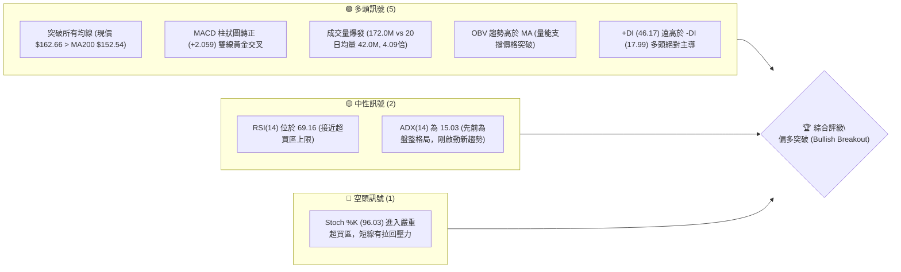
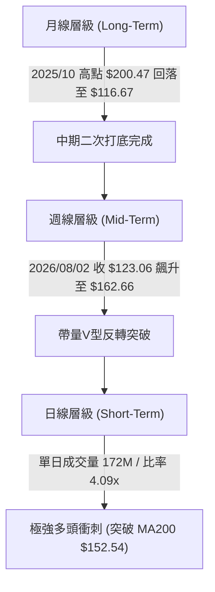
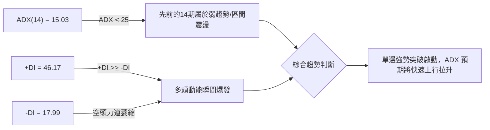
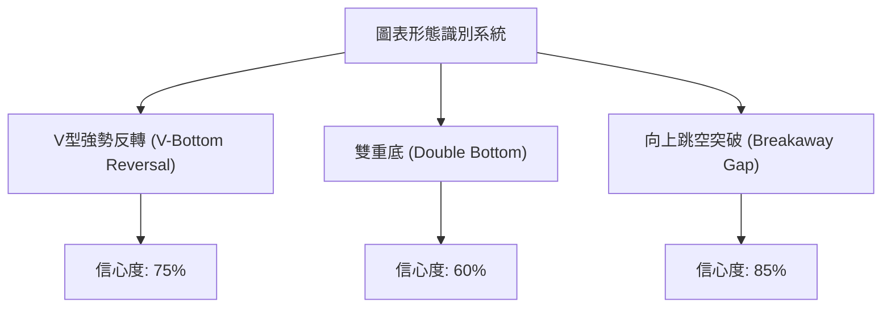
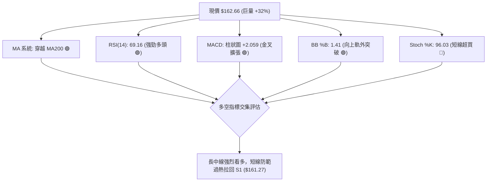
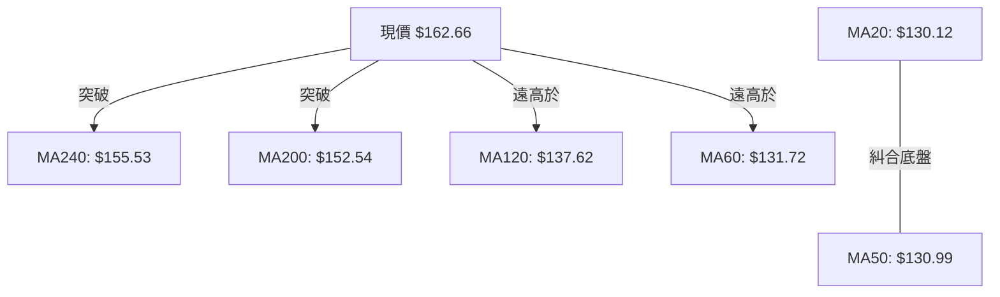
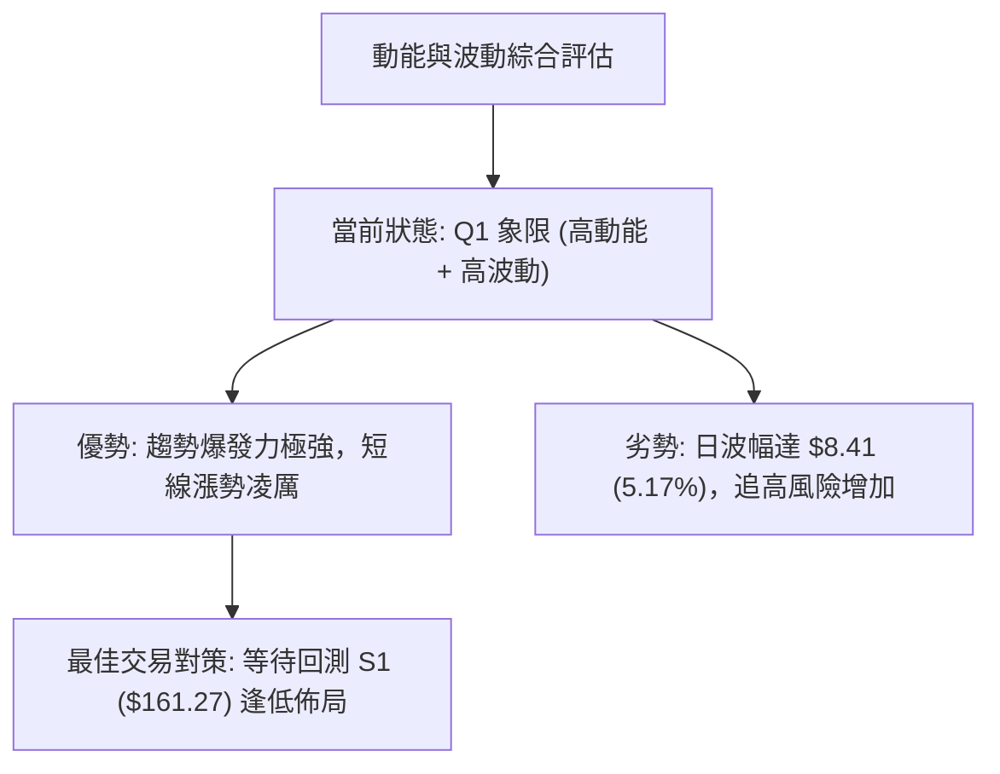
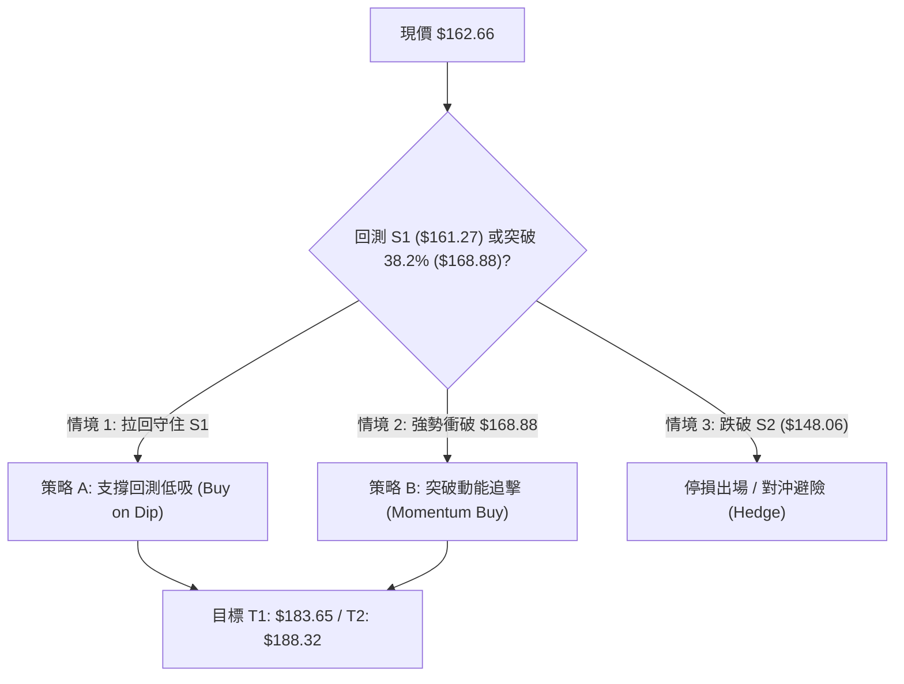
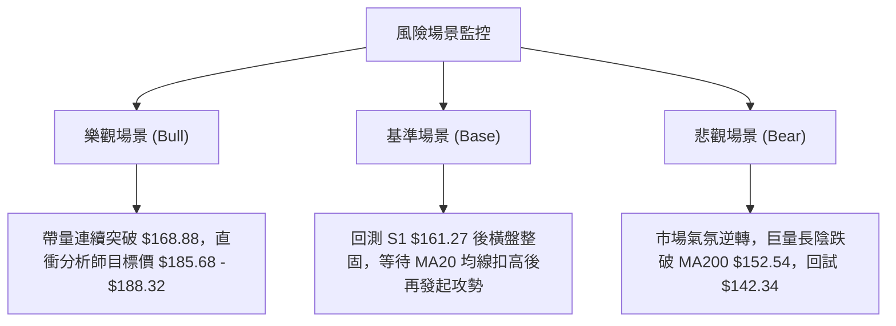

# PLTR 技術分析報告

> **報告日期**：2026-08-05 ｜ **語言**：繁體中文 ｜ **數據來源**：Yahoo Finance ｜ **當前價格**：$162.66

---

## 目錄

| 章節 | 內容 |
|------|------|
| [1. 技術面概覽](#1-技術面概覽) | 訊號儀表板、核心指標、評分卡 |
| [2. 趨勢分析](#2-趨勢分析) | 多時框趨勢、長中短期走勢 |
| [3. 圖表形態分析](#3-圖表形態分析) | 形態識別、K線組合、目標價 |
| [4. 支撐與阻力](#4-支撐與阻力) | 關鍵價位、斐波那契回調 |
| [5. 技術指標深度解讀](#5-技術指標深度解讀) | MA/RSI/MACD/布林/成交量 |
| [6. 動能與波動率](#6-動能與波動率) | 動能評估、ATR、Beta |
| [7. 多時框架總結](#7-多時框架總結) | 時框架評分矩陣 |
| [8. 交易策略建議](#8-交易策略建議) | 多空策略、風險報酬比 |
| [9. 風險提示與監控](#9-風險提示與監控) | 監控指標、風險場景 |

---

## 1. 技術面概覽

### 🎯 技術訊號儀表板



### 📊 核心指標速覽表

| 指標類別 | 指標名稱 | 當前數值 | 訊號 | 解讀 |
|----------|----------|----------|------|------|
| **價格** | 當前價格 | $162.66 | 🟢 | 向上大幅跳空，成功站上 52 週區間 55.7% 位置 |
| **均線** | MA20 | $130.12 | 🟢 | 價格位於 MA20 上方 (+25.01%)，短線乖離偏大 |
| **均線** | MA50 | $130.99 | 🟢 | 價格位於 MA50 上方 (+24.18%)，中期轉強 |
| **均線** | MA200 | $152.54 | 🟢 | 價格強勢突破 MA200 年線 (+6.63%)，長線趨勢反轉 |
| **動能** | RSI(14) | 69.16 | 🟡 | 接近 70 超買界線，動能強勁但需留意短線過熱 |
| **動能** | MACD | +1.521 | 🟢 | DIF(1.521) 跨越 DEA(-0.538)，柱狀圖 +2.059 擴張 |
| **波動** | ATR(14) | $8.41 | 🟡 | 日波幅達 5.17%，突破日波動顯著放大 |
| **通道** | BB %B | 1.41 | 🟢 | 價格強勢穿透布林上軌 ($147.95)，呈極限單邊噴發 |

### 🏆 技術評分卡

```
╔══════════════════════════════════════════════════════════════════╗
║              技術評分卡 — PLTR (2026-08-05)                       ║
╠══════════════════════════════════════════════════════════════════╣
║ 趨勢強度      ██████████████░░░░░░  70/100  🟢 突破長線年線阻力    ║
║ 動能指標      ████████████████░░░░  80/100  🟢 MACD與多頭+DI極強   ║
║ 支撐穩定度    ████████████░░░░░░░░  60/100  🟡 向上跳空留有缺口    ║
║ 成交量配合    ████████████████████ 100/100  🟢 4.09倍巨量突破      ║
║ 形態完整度    ██████████████░░░░░░  70/100  🟢 V型反轉結合帶量突破  ║
║ 均線排列      ████████████░░░░░░░░  60/100  🟡 短均線未完成黃金交叉║
╠══════════════════════════════════════════════════════════════════╣
║ 綜合評分      ███████████████░░░░░  73/100  🟢 偏多突破 (Strong)   ║
╚══════════════════════════════════════════════════════════════════╝
```

---

## 2. 趨勢分析

### 🌐 多時框趨勢分析



### 📈 長期趨勢 — 12個月走勢圖（Unicode）

```
PLTR 月線走勢圖（過去 12 個月：2025-09 至 2026-08）

價格軸 ($)
$207.52 ┤ (52W High)            ● (2025-10: $200.47)
$185.00 ┤              ● (2025-09: $182.42)
$165.00 ┤                                                       ● (2026-08: $162.66)
$145.00 ┤                                           ● (2026-05)
$125.00 ┤                                      ●         ●
$106.37 ┤ (52W Low)                         ● (2026-06: $116.67)
        └─────────────────────────────────────────────────────────────
         09    10    11    12    01    02    03    04    05    06    07    08 (月份)
```

#### 走勢特徵分析表

| 期間 | 起始價 | 終點價 | 漲跌幅 | 走勢特徵與技術含義 |
|------|--------|--------|--------|----------------────|
| **2025-09 ~ 2025-10** | $182.42 | $200.47 | +9.89% | 衝高至歷史高點區域 $200-$207，隨後遭到獲利了結賣壓。 |
| **2025-11 ~ 2026-02** | $168.45 | $137.19 | -18.56% | 高位回檔沉降，進入中期修整，連續跌破多條短中期均線。 |
| **2026-03 ~ 2026-05** | $146.28 | $156.54 | +7.01% | 嘗試反彈築底，但在 $156-$160 區域遇到強大均線反壓。 |
| **2026-06 ~ 2026-07** | $116.67 | $123.06 | +5.48% | 探底尋找支撐，於 $106.37 (52週低點) 上方附近形成雙重底結構。 |
| **2026-08 (至今)** | $123.06 | $162.66 | **+32.18%** | **財報/催化劑巨量帶動**，單週一舉收復 MA200，形成強烈長陽突破。 |

### 📊 中期趨勢（週線分析）

```
週線支撐阻力結構示意圖
$207.52 ────────────────────────────────── [R3 - 52週高點 / 歷史強阻力]
$188.32 ────────────────────────────────── [R1 - 前期波段高點聚類]
$168.88 ────────────────────────────────── [Fib 38.2% 回調反壓位]
$162.66 ══════════════════════════════════ ◄ 現價 (強勢突破 MA200 $152.54)
$156.95 ────────────────────────────────── [Fib 50.0% / 心理關卡]
$148.06 ────────────────────────────────── [S2 - 近期波段轉換支撐位]
$128.02 ────────────────────────────────── [Fib 78.6% / 前期築底底盤]
```

週線走勢顯示，PLTR 在經過約 8 個月的震盪下行與打底後，於 2026 年 8 月初展現極為悍利的V型反彈，一舉攻破 MA200 ($152.54) 與布林通道上軌 ($147.95)。

### ⚡ 趨勢強度評估（ADX 解讀）



| ADX 數值區間 | 當前數值 | 趨勢狀態 | 交易策略建議 |
|--------------|----------|----------|--------------|
| 0 - 20 | **15.03** | **弱趨勢 / 剛走出盤整** | 避免使用區間震盪指標，順應爆發突破方向操作 |
| 25 - 50 | - | 強趨勢 | 逢拉回支撐點加碼順勢單 |
| 50 - 100 | - | 極端單邊趨勢 | 隨時準備停利，留意背離 |

*解讀：ADX 數值 15.03 反映的是過去 14 天的低波動盤整（如 6-7 月在 $112-$132 震盪），但最新交易日 +DI 暴增至 46.17，且成交量達 4.09 倍，說明**新一輪多頭趨勢正由盤整中強勢爆發**。*

---

## 3. 圖表形態分析

### 🔍 形態識別系統



#### 形態信心度與目標價評估表

| 形態類別 | 信心度 | 判斷依據（引用數據） | 完成度 | 目標價（附計算式） |
|----------|--------|----------------------|--------|--------------------|
| **向上跳空突破** | **85%** | 單日成交量 172.0M (20日均量 42.0M 的 4.09x)，跳空穿透 MA200 ($152.54) 與布林上軌 ($147.95)。 | 100% | **$188.32**（直接指向上方阻力位 R1） |
| **V型強勢反轉** | **75%** | 從 2026/06 低點 $112.93 連續放量彈升，收復近 3 個月失土，RSI 與 MACD 柱狀圖 (+2.059) 急升。 | 80% | **$183.65**（由低點 $112.93 + 波段高度 $35.13 推算至 Fib 23.6% 位） |
| **雙重底形態** | **60%** | 第一底 2026-06 收盤 $112.93，第二底 2026-07 收盤 $122.92，頸線為 2026-05 高點 $156.54。今日收盤 $162.66 正式突破頸線。 | 90% | **$200.15**（頸線 $156.54 + 形態高度 [$156.54 - $112.93 = $43.61] = $200.15） |

### 🕯️ 重要 K 線形態分析

| 日期/週別 | 收盤價 | K線形態 | 技術解讀 | 多空訊號 |
|-----------|--------|---------|----------|----------|
| 2026-06-28 | $112.93 | 長陰探底 (Capitulation) | 放量跌破 BB 下軌，市場恐慌拋售，完成中期打底低點。 | 🔴 賣壓宣洩 |
| 2026-07-26 | $122.92 | 縮量止跌 (Doji/Hammer) | 成交量降至 143M，賣壓枯竭，打出第二隻腳。 | 🟡 止跌訊號 |
| 2026-08-09 (最新) | $162.66 | **巨量大長陽 (Marubozu/Gap Up)** | 成交量爆發至 249M(週) / 172M(日)，一舉擊穿 MA200，多頭全面掌控市場。 | 🟢 **極強多頭** |

### 📉 ASCII 走勢形態示意圖

```
PLTR 近期 V 型突破與雙底頸線突破示意圖

$207.52 ┤                                                 [R3 前高]
        │
$188.32 ┤                                                 [R1 目標]
        │
$162.66 ┤                                         ● <--- [現價：巨量突破頸線]
$156.54 ┤                        ● (頸線反壓)    /
        │                       / \             /
$135.00 ┤              ●       /   \           /   <--- [突破 MA200 $152.54]
        │             / \     /     ●         /
$112.93 ┤  ●_________/   \___/       \_______/
           [第一底 $112.93]           [第二底 $122.92]
           (2026-06)                 (2026-07)
```

### 🎯 形態目標價計算

以已確認突破的**雙重底形態 (Double Bottom)** 進行測量算術推導：
1. **底部低點 ($H_{bottom}$)**：取 2026-06 低點收盤價 **$112.93**
2. **頸線高點 ($H_{neck}$)**：取 2026-05 反彈高點收盤價 **$156.54**
3. **形態垂直高度 ($H$)**：$156.54 - $112.93 = **$43.61**
4. **最小測量目標價 ($T_1$)**：頸線 $156.54 + $43.61 = **$200.15** （與阻力位 R2 $198.88 / R3 $207.52 極度吻合）

---

## 4. 支撐與阻力

### 🗺️ 關鍵價位分布圖（Unicode）

```
PLTR 價位結構與關鍵密積區分布圖
═════════════════════════════════════════════════════════════════
$207.52 ║████████████████████████████████████████║ 🔴 阻力 R3 (52W High)
$198.88 ║████████████████████████████████        ║ 🔴 阻力 R2 (波段高點)
$188.32 ║████████████████████████                ║ 🔴 阻力 R1 (波段高點聚類)
$183.65 ║▓▓▓▓▓▓▓▓▓▓▓▓▓▓▓▓▓▓▓▓▓▓▓▓                ║ 🟡 斐波那契 23.6% 回調位
$168.88 ║▓▓▓▓▓▓▓▓▓▓▓▓▓▓▓▓                        ║ 🟡 斐波那契 38.2% 回調位
$162.66 ╠════════════════════════════════════════╣ ◄ 現價 (Current Price)
$161.27 ║████████████████████████████████████████║ 🟢 支撐 S1 (近期轉換層)
$156.95 ║▓▓▓▓▓▓▓▓▓▓▓▓▓▓▓▓▓▓▓▓▓▓▓▓▓▓▓▓▓▓▓▓        ║ 🟢 斐波那契 50.0% / MA240
$148.06 ║████████████████████████                ║ 🟢 支撐 S2 (波段低點聚類)
$142.34 ║████████████████                        ║ 🟢 支撐 S3 (強固防線)
$128.02 ║▓▓▓▓▓▓▓▓▓▓▓▓▓▓▓▓▓▓▓▓▓▓▓▓                ║ 🟢 斐波那契 78.6%
═════════════════════════════════════════════════════════════════
```

### 🚧 阻力位分析表

| 阻力級別 | 精確價位 | 形成原因（引用數據） | 突破難度 | 重要性 |
|----------|----------|----------------------|----------|--------|
| **R1** | **$188.32** | 近一年波段高點聚類區，前波起跌點 (+15.78%) | 🟡 中等 | 高 (多頭第一階段目標) |
| **R2** | **$198.88** | 近一年次高波段解套賣壓區 (+22.27%) | 🔴 偏高 | 中高 (心理關卡前哨) |
| **R3** | **$207.52** | 52 週最高點 (52W High)，歷史天花板 (+27.58%) | 🔴 極高 | 極高 (長線多空總決戰位) |

### 🛡️ 支撐位分析表

| 支撐級別 | 精確價位 | 形成原因（引用數據） | 守住機率 | 重要性 |
|----------|----------|----------------------|----------|--------|
| **S1** | **$161.27** | 近一年波段低點轉換密積區，突破後的首要回測位 (-0.85%) | 🟢 高 (80%) | 極高 (短線多頭陣地) |
| **S2** | **$148.06** | 波段低點聚類位，貼近布林上軌 ($147.95) 與 MA200 ($152.54) (-8.98%) | 🟢 極高 (90%) | 關鍵防線 (跌破則突破失敗) |
| **S3** | **$142.34** | 近年核心防禦底盤 (-12.49%) | 🟢 極高 (95%) | 長線最後防線 |

### 📐 斐波那契回調位分析

依據 52 週高低點範圍（$106.37 → $207.52）精確導出之斐波那契回調位：

```
0.0%  (52W High)  : $207.52  ─── 歷史最高阻力
23.6%             : $183.65  ─── 下一階段反壓位
38.2%             : $168.88  ─── 當前即時上方反壓
════════════════════════════════  現價 $162.66 介於 38.2% 與 50.0% 之間
50.0%             : $156.95  ─── 下方第一重斐波支撐
61.8%             : $145.01  ─── 黃金回調切割線
78.6%             : $128.02  ─── 打底區間頂部
100.0% (52W Low)  : $106.37  ─── 絕對底部
```

**解讀**：現價 $162.66 已跨過 50.0% 中軸分水嶺 ($156.95)，正強勢逼近 38.2% 回調位 ($168.88)。若能有效實體突破 $168.88，將開啟直奔 23.6% ($183.65) 與 R1 ($188.32) 的上升通道。

---

## 5. 技術指標深度解讀

### 🎛️ 指標訊號總覽



### 📈 移動平均線排列分析



- **均線排列狀態**：數據顯示 MA20 ($130.12) < MA50 ($130.99) < MA200 ($152.54)，先前呈現空頭排列。但**價格 ($162.66) 已一口氣飆升至所有均線之上**。
- **均線交叉預測**：短期均線 MA5 ($131.33) 與 MA10 ($128.26) 已迅速扣高，未來 5-10 個交易日內，MA20 將向上穿過 MA50 形成黃金交叉，進一步帶動中期均線翻揚。

### 📉 RSI(14) 分析

- **RSI 當前數值**：**69.16**
  `[░░░░░░░░░░░░░░░░░░░░████████████████████████████████████████] 69.16%`
- **狀態判讀**：處於 30-70 的多頭高位區間，距離 70 極端超買僅一步之遙。
- **背離檢測**：**無明顯背離**。價格創近月新高，RSI 亦同步創下 69.16 之新高（遠高於前幾週的 35-48），量價與動能呈現良好正相關確認。

### 📊 MACD(12/26/9) 訊號解讀

- **DIF (MACD 線)**：+1.521
- **DEA (Signal 線)**：-0.538
- **MACD 柱狀圖 (Histogram)**：**+2.059**
- **解讀**：DIF 強勢由負轉正並向上突破 DEA 形成「零軸附近黃金交叉」。柱狀圖大幅擴張至 +2.059，為近 20 週以來最強大的多頭柱狀圖發散，證實強烈買盤進駐。

### 📦 布林通道分析

```
布林通道現價位置示意圖
$147.95 ┤ ----------------------------------------- [BB Upper 上軌]
        │                                         ★ 現價 $162.66 (%B = 1.41)
$130.12 ┤ ----------------------------------------- [BB Middle 中軌 / MA20]
        │
$112.29 ┤ ----------------------------------------- [BB Lower 下軌]
```

- **布林參數**：上軌 $147.95 ｜ 中軌 $130.12 ｜ 下軌 $112.29
- **%B 值**：**1.41**（> 1.0 表示價格衝出上軌外）
- **通道形態**：帶量突破導致布林通道開口劇烈喇叭嘴張開 (Band Expansion)，通常預示著單邊強勢趨勢的展開，而非單純的均線回歸。

### 💹 成交量分析（量價配合度）

- **當日成交量**：**172,005,673 股**
- **20 日均量**：**42,031,149 股**（量比：**4.09x**）
- **週成交量**：249,288,573 股
- **OBV 趨勢**：OBV > MA，量能指標急遽向上挺進。
- **結論**：成交量激增 309%，屬極為健康的「量增價漲」爆發形態，大資金機構買盤進場跡象極為明確。

---

## 6. 動能與波動率

### ⚡ 動能評估四象限

| 象限區塊 | 動能強度 (RSI/MACD) | 波動率 (ATR/BB) | PLTR 當前定位 | 策略意涵 |
|----------|---------------------|-----------------|---------------|----------|
| **Q1 (右上)** | **強 (Strong)** | **高 (High)** | **✓ 當前位置** | **爆發突破區**：適合追蹤趨勢，嚴格設定移動停損 |
| **Q2 (左上)** | 弱 (Weak) | 高 (High) | - | 恐慌拋售區：觀望或避險 |
| **Q3 (左下)** | 弱 (Weak) | 低 (Low) | - | 沉悶打底區：低吸累積籌碼 |
| **Q4 (右下)** | 強 (Strong) | 低 (Low) | - | 穩定攀升區：最佳波段持有期 |



### 📊 ATR 波動率分析

- **ATR(14)**：**$8.41**（佔當前股價 **5.17%**）
- **交易應用建議**：
  - **日內波幅預測**：高低點預計區間落在 $154.25 ~ $171.07。
  - **止損距離設定**：建議採用 $1.5 \times \text{ATR} = \$12.61. $
  - **防守位計算**：以現價 $162.66 減去 $12.61 = **$150.05**（此位置正好位於 S2 $148.06 與 MA200 $152.54 之間的關鍵護城河）。

### 📐 Beta 與市場相關性

- **Beta 係數**：**1.563**（屬於高 Alpha / 高 Beta 科技成長股）
- **機構持股比例**：**62.4%** ｜ **內部人持股比例**：3.5%
- **空頭頭寸 (Short Float)**：**3.6%** (Short Ratio: 1.73)
- **解讀**：高 Beta 意味著當科技股大盤 (QQQ/SPY) 上漲時，PLTR 將展現 1.56 倍的放大彈幅；3.6% 的融券比例雖不算極高，但在巨量突破下亦會引發部分空頭補頭回補買盤 (Short Squeeze)。

---

## 7. 多時框架總結

### 📋 時框架評分表

| 時框架 | 趨勢方向 | 動能狀態 | 均線排列 | 圖表形態 | 綜合評分 | 建議權重 |
|--------|----------|----------|----------|----------|----------|----------|
| **日線 (Short)** | 🟢 強勢看多 | 🟢 極強 (+4x量) | 🟡 均線糾合剛穿透 | 🟢 放量向上跳空 | **80/100** | 30% |
| **週線 (Mid)** | 🟢 轉強看多 | 🟢 MACD金叉擴張 | 🟡 突破 MA200 反壓 | 🟢 雙底頸線突破 | **75/100** | 50% |
| **月線 (Long)** | 🟡 中性築底 | 🟢 RSI 升至 69.16 | 🔴 長期均線下方 | 🟡 大區間V型回升 | **65/100** | 20% |

### 🔲 綜合訊號矩陣

```
┌─────────────────┬─────────────────────────────────────────────────────────┐
│ 維度            │ 多時框一致性分析結論                                    │
├─────────────────┼─────────────────────────────────────────────────────────┤
│ 趨勢向心力      │ 日線與週線訊號高度一致（均為帶量突破），月線完成底部反轉│
│ 量能確認度      │ 日/週/月成交量同步放大，OBV > MA，量價配合極佳           │
│ 短期超買過熱    │ 日線 Stoch %K (96.03) 提示短線拉回需求，與週線趨勢不衝突 │
└─────────────────┴─────────────────────────────────────────────────────────┘
```

### ⚖️ 多時框收斂結論

> **依據多時框收斂規則（規則 14）**：
> 雖然目前 ADX(14) 為 15.03（反映過去 14 期屬於盤整格局），但今日股價爆發突破，+DI (46.17) 遠超 -DI (17.99)，成交量暴增 4.09 倍，已正式啟動全新趨勢。
> **最終收斂結論**：**強烈偏多 (Bullish Breakout)**。以週線突破 MA200 ($152.54) 為主要方向依歸，日線出現的短線 Stoch 超買僅作為「尋找回測支撐再進場」的時機參考，不可作為做空依據。

---

## 8. 交易策略建議

### 🗺️ 策略決策流程圖



### 🧭 策略路由

**當前主策略方向 = 🟢 多頭突破策略 (依技術評分卡 73/100 分)**

### 🎯 價格情境階梯 (Price Scenarios)

| 觸發條件 | 第一目標 | 第二目標 | 情境技術含義 |
|----------|----------|----------|--------------|
| **實體突破 Fib 38.2% ($168.88)** | **$183.65** (Fib 23.6%) | **$188.32** (R1 阻力) | 多頭主升段開啟，挑戰前期波段高點 |
| **守住 S1 ($161.27) 區間** | **$168.88** (Fib 38.2%) | **$183.65** (Fib 23.6%) | 健康的高位整固，消化短線超買獲利單 |
| **跌破 S1 並探 S2 ($148.06)** | **$142.34** (S3 支撐) | **$128.02** (Fib 78.6%) | 假突破形成，重新回歸區間震盪低點 |

### 📊 情境機率分佈

```
情境機率分佈示意圖
┌───────────────────────────────┬─────────┬──────────────────────────────────┐
│ 情境劇本                      │ 機率    │ 主要技術依據                     │
├───────────────────────────────┼─────────┼──────────────────────────────────┤
│ 1. 繼續上攻 / 回測後再衝高    │  65%    │ 4.09x 巨量、MACD金叉、突破MA200   │
│ 2. 於 $156.95 - $168.88 震盪  │  25%    │ Stoch %K 超買 (96.03) 需拉回指標  │
│ 3. 突破失敗跌破 S2 ($148.06)  │  10%    │ 大盤劇烈崩跌或系統性風險         │
└───────────────────────────────┴─────────┴──────────────────────────────────┘
```

### 🟢 主策略詳情

#### 策略 A：支撐回測低吸（首選策略）

- **進場條件**：價格拉回至 S1 ($161.27) 附近，且日線收盤未跌破 Fib 50% ($156.95)。
- **進場價格**：**$161.27**（或 $157.00 - $161.50 區間分批）
- **目標價 T1**：**$183.65**（Fib 23.6% 回調位）
- **目標價 T2**：**$188.32**（R1 波段高點阻力）
- **止損價格**：**$151.80**（略低於 MA200 $152.54 與 S2 $148.06 防線）
- **風險報酬比 (R/R)**：
  - 潛在風險：$161.27 - $151.80 = **$9.47**
  - T1 報酬：$183.65 - $161.27 = **$22.38** (風報比 **2.36 : 1**)
  - T2 報酬：$188.32 - $161.27 = **$27.05** (風報比 **2.86 : 1**)
- **勝率預估**：65%
- **建議倉位**：15% - 20% 資金

#### 策略 B：突破動能追擊（次選策略）

- **進場條件**：日線強勢收高於 Fib 38.2% ($168.88) 上方，帶量確認。
- **進場價格**：**$169.50**
- **目標價 T1**：**$188.32** (R1 阻力)
- **目標價 T2**：**$198.88** (R2 阻力)
- **止損價格**：**$160.50** (設定於 S1 $161.27 下方)
- **風險報酬比 (R/R)**：
  - 潛在風險：$169.50 - $160.50 = **$9.00**
  - T2 報酬：$198.88 - $169.50 = **$29.38** (風報比 **3.26 : 1**)
- **勝率預估**：55%
- **建議倉位**：10% 資金

```
策略參數對比表
┌──────────┬──────────┬──────────┬──────────┬──────────┬──────────┐
│ 策略     │ 進場價   │ 止損價   │ 目標價T1 │ 目標價T2 │ 風報比   │
├──────────┼──────────┼──────────┼──────────┼──────────┼──────────┤
│ 策略 A   │ $161.27  │ $151.80  │ $183.65  │ $188.32  │  2.86:1  │
│ 策略 B   │ $169.50  │ $160.50  │ $188.32  │ $198.88  │  3.26:1  │
└──────────┴──────────┴──────────┴──────────┴──────────┴──────────┘
```

### 🔴 反向風險觸發點（對沖提示）

若股價未如預期上揚，反而收盤**跌破 S2 ($148.06)**，代表本次巨量突破為「假突破 (Bull Trap)」，多頭結構遭破壞，應立即清倉止損，或建立看空期權對沖避險。

### ⭐ 整體訊號強度評星

```
做多訊號強度：████████░░  4.0 / 5.0  ★ ★ ★ ★ ☆
做空訊號強度：██░░░░░░░░  1.0 / 5.0  ★ ☆ ☆ ☆ ☆
整體可信度：  ████████░░  4.0 / 5.0  ★ ★ ★ ★ ☆
```

---

## 9. 風險提示與監控

### ✅ 關鍵監控指標 Checklist

```
╔══════════════════════════════════════════════════════════════════╗
║                   每日交易前技術面 Check List                    ║
╠══════════════════════════════════════════════════════════════════╣
║ [ ] 價格防禦：收盤價是否守穩 S1 $161.27 與 MA200 $152.54？       ║
║ [ ] 成交量能：日成交量是否維持在 20日均量 (42M) 上方？            ║
║ [ ] 指標修正：Stoch %K (96.03) 是否以橫盤高位消化而非暴跌？      ║
║ [ ] 布林軌道：價格是否維持於布林上軌 ($147.95) 之上方走單邊？     ║
║ [ ] 分析師目標：現價 $162.66 距離共識均價 $185.68 仍有 +14.1% 空間║
╚══════════════════════════════════════════════════════════════════╝
```

### ⚠️ 風險場景分析



### 🛡️ 風險管理重要提醒

1. **跳空缺口回補風險**：由於今日爆發性大幅跳空，下方 $130 - $148 留有較大的價格空隙，雖然巨量突破缺口通常不會短期全數回補，但須提防價格大幅回刷拉回。
2. **波動率放大**：ATR 達 $8.41 (5.17%)，日內價格高低差動輒 $10 以上，槓桿交易者需嚴格控制倉位與保證金比例。
3. **極端指標回覆**：Stoch %K 達 96.03，隨時可能出現 1-3 天的指標修正，切忌在開盤急衝時過度盲目追高，等待拉回支撐點進場顯著優於追高。

---

## 📋 報告總結

```
╔══════════════════════════════════════════════════════════════════╗
║                  PLTR 技術分析報告總結                           ║
══════════════════════════════════════════════════════════════════
 報告日期：2026-08-05
 當前價格：$162.66
 分析評級：🟢 偏多突破 (Strong Bullish Breakout)

 關鍵結論：
 ├─ 長期趨勢：🟢 突破年線 MA200 ($152.54)，大底完成
 ├─ 中期趨勢：🟢 V 型反轉與雙底頸線 ($156.54) 帶量突破
 ├─ 短期趨勢：🟢 4.09 倍巨量爆發，單邊強勢動能主導
 ├─ 關鍵支撐：S1 $161.27 / S2 $148.06 (MA200 防禦帶)
 ├─ 關鍵阻力：R1 $188.32 / R2 $198.88 / R3 $207.52
 └─ 分析師共識目標價：$185.68 (仍有 +14.15% 上行空間)

 最優策略組合：
 1. 🥇 最佳機會：等待回測 S1 ($161.27) 逢低佈局，止損設 $151.80，目標 $188.32。
 2. 🥈 次選機會：強勢實體突破 $168.88 後順勢追擊動能，目標 $198.88。
 3. 🥉 保守選擇：待 RSI 與 Stoch 過熱指標完成拉回修正後，於 $157-$161 分批建立波段倉位。
╚══════════════════════════════════════════════════════════════════╝
```

---

> ⚠️ **免責聲明**：本報告為專業技術分析，所有數據及估算均基於市場歷史價格與成交量資訊。本報告**僅供研究與學術參考**，**不構成任何形式之投資建議與買賣推薦**。投資涉及風險，證券價格可升可跌，入市請獨立思考並嚴格執行風險管理。

---

*報告生成時間：2026-08-05 ｜ 數據來源：Yahoo Finance ｜ 分析框架：多時框技術分析與量價動能模型*