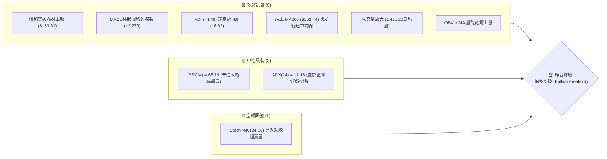
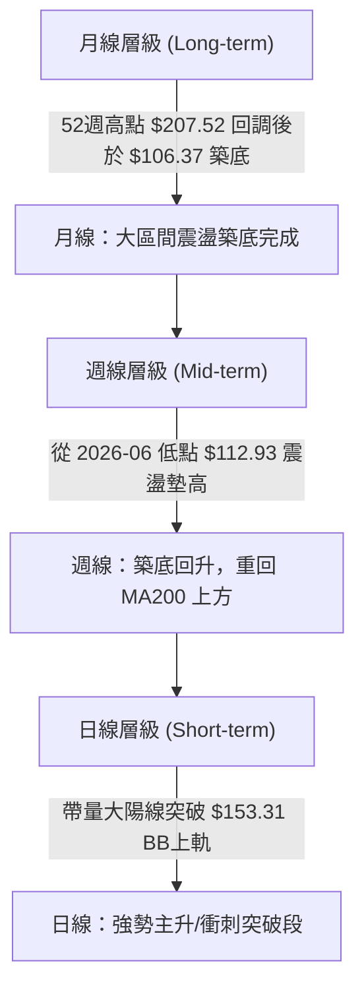
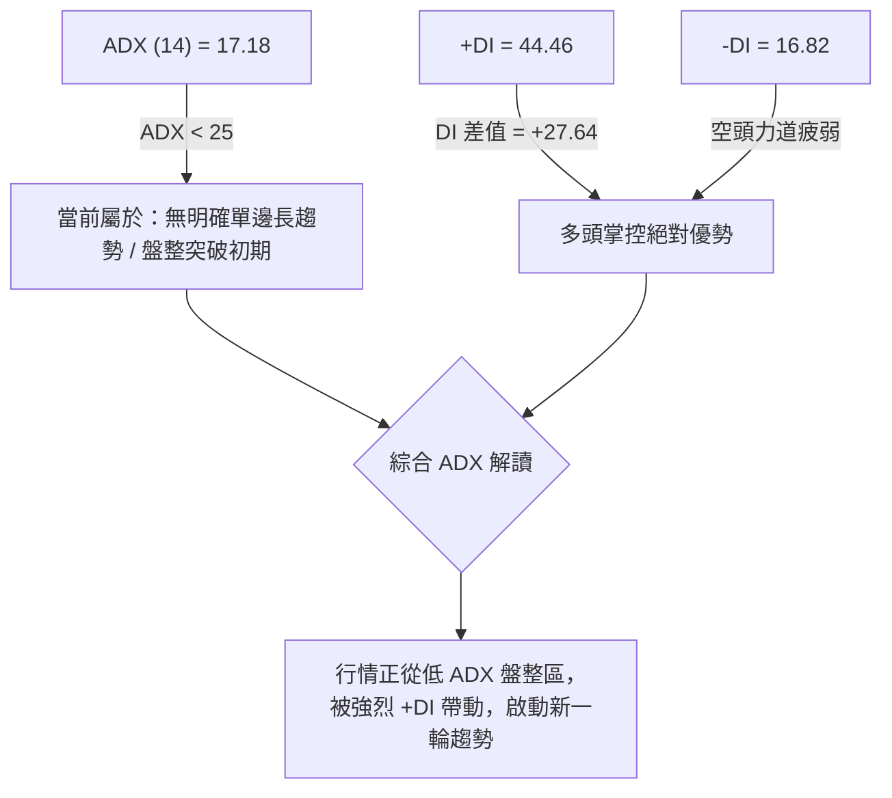
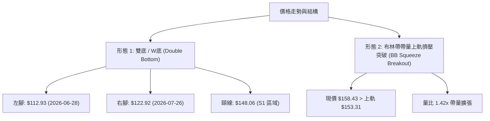
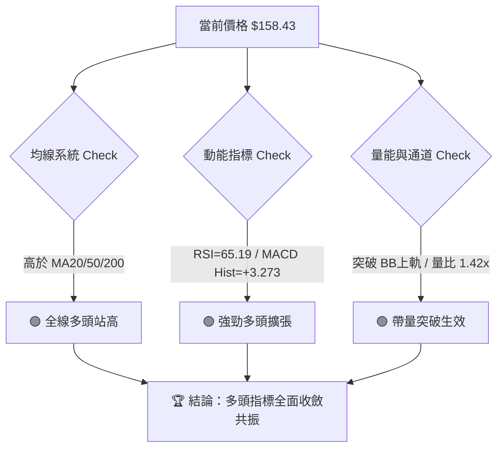
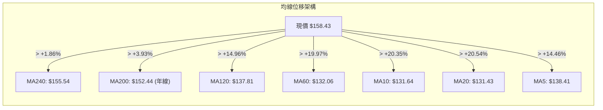
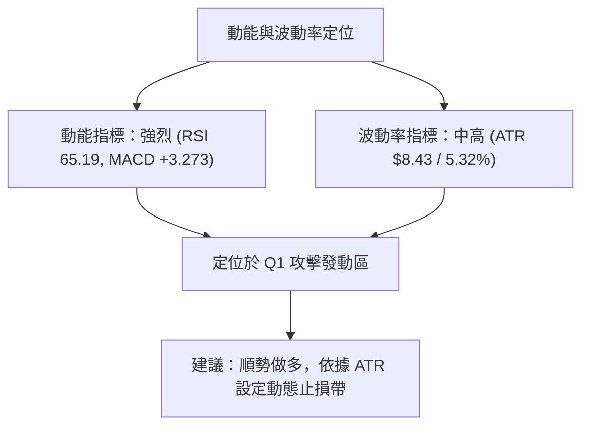
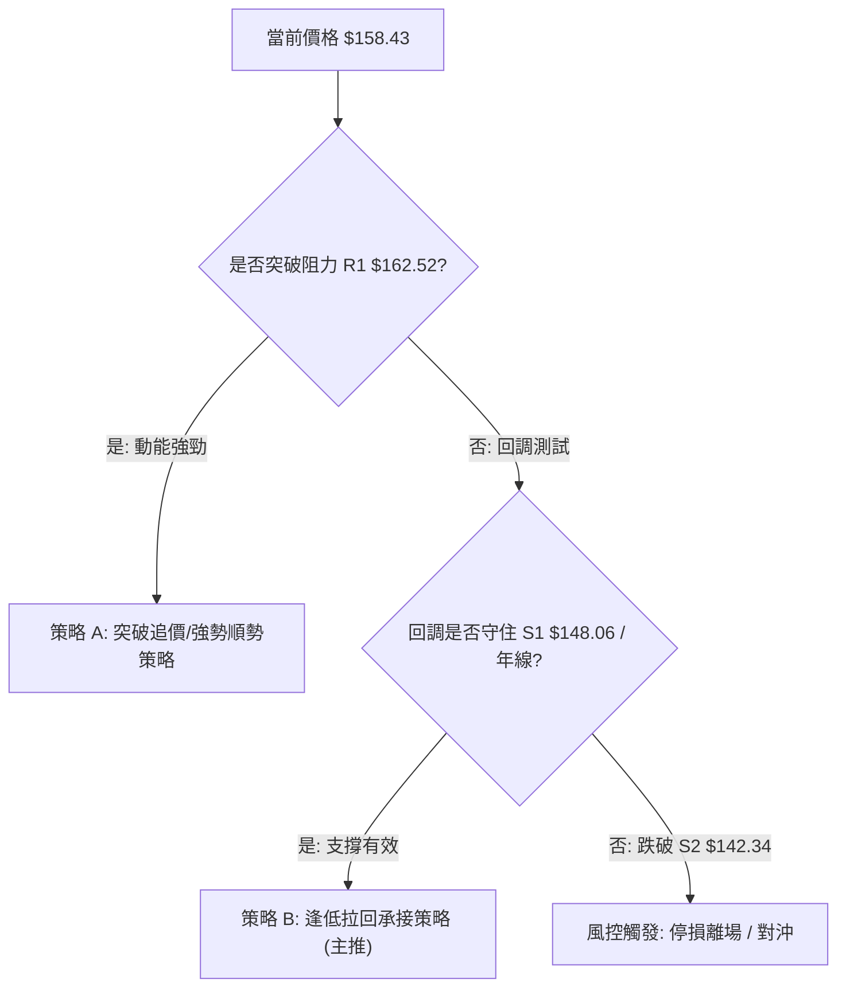
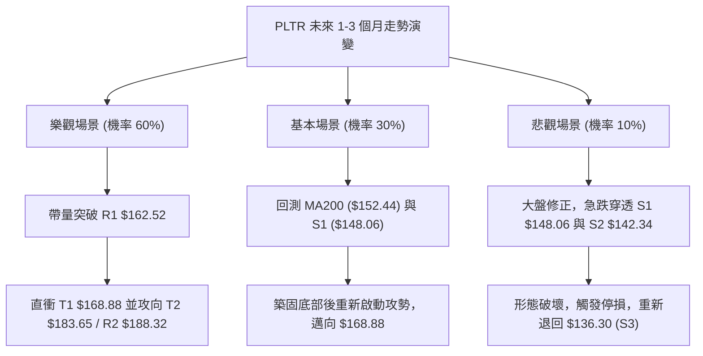

# PLTR 技術分析報告

> **報告日期**：2026-08-06 ｜ **語言**：繁體中文 ｜ **數據來源**：Yahoo Finance ｜ **當前價格**：$158.43

---

## 目錄

| 章節 | 內容 |
|------|------|
| [1. 技術面概覽](#1-技術面概覽) | 訊號儀表板、核心指標、評分卡 |
| [2. 趨勢分析](#2-趨勢分析) | 多時框趨勢、長中短期走勢、ADX強度 |
| [3. 圖表形態分析](#3-圖表形態分析) | 形態識別、信心度評估、K線組合、目標價推算 |
| [4. 支撐與阻力](#4-支撐與阻力) | 關鍵價位分佈、阻力/支撐表、斐波那契回調 |
| [5. 技術指標深度解讀](#5-技術指標深度解讀) | MA系統、RSI背離、MACD、布林通道、成交量/OBV |
| [6. 動能與波動率](#6-動能與波動率) | 動能四象限、ATR波幅管理、Beta相關性 |
| [7. 多時框架總結](#7-多時框架總結) | 時框架評分矩陣、多時框收斂判斷 |
| [8. 交易策略建議](#8-交易策略建議) | 策略路由、情境階梯、機率分佈、多頭/風控策略 |
| [9. 風險提示與監控](#9-風險提示與監控) | 監控清單、三態風險場景、倉位風控原則 |

---

## 1. 技術面概覽

### 🎯 技術訊號儀表板



### 📊 核心指標速覽表

| 指標類別 | 指標名稱 | 當前數值 | 訊號 | 解讀 |
|----------|----------|----------|------|------|
| **價格** | 當前價格 | $158.43 | 🟢 多頭 | 處於52週區間 $106.37–$207.52 之 51.5% 位置，單日強勢大漲 |
| **均線** | MA20 | $131.43 | 🟢 多頭 | 股價高於 MA20 達 +20.54%，短線支撐強勁 |
| **均線** | MA50/60 | $132.06 | 🟢 多頭 | 股價高於 MA60 達 +19.97%，中線轉強 |
| **均線** | MA200 | $152.44 | 🟢 多頭 | 股價成功突破年線 MA200 (+3.93%)，奠定中長期翻多基調 |
| **動能** | RSI(14) | 65.19 | 🟢 多頭 | 處於 30–70 中性偏多區間，多頭動能充沛且無背離 |
| **動能** | MACD(12,26,9) | 3.554 / +3.273 | 🟢 多頭 | 快線穿過慢線擴張，Hist 呈現強勁正向柱狀圖 |
| **波動** | ATR(14) | $8.43 (5.32%) | 🟡 中性 | 每日波幅 $8.43，屬中高波動，需適當擴大止損帶 |
| **通道** | BB %B | 1.12 | 🟢 多頭 | 突破布林上軌 ($153.31)，展現強烈帶量擠壓突破形態 |
| **趨勢** | ADX(14) | 17.18 | 🟡 中性 | ADX < 25 表明先前為盤整格局，目前正發動新一波趨勢 |

### 🏆 技術評分卡

```
╔══════════════════════════════════════════════════════════════════╗
║                PLTR 技術面綜合評分卡 (2026-08-06)                 ║
╠══════════════════════════════════════════════════════════════════╣
║ 趨勢強度 (Trend)     █████████████░░░░░░░  68/100  🟢 偏多突破  ║
║ 動能指標 (Momentum)  ████████████████░░░░  80/100  🟢 強勁充沛  ║
║ 支撐穩定度 (Support) ██████████████░░░░░░  70/100  🟢 年線支撐  ║
║ 成交量配合 (Volume)  █████████████████░░░  85/100  🟢 帶量突破  ║
║ 形態完整度 (Pattern) █████████████░░░░░░░  65/100  🟡 底態完成  ║
║ 均線排列 (MA Layout) ██████████████░░░░░░  72/100  🟢 年線黃金  ║
╠══════════════════════════════════════════════════════════════════╣
║ 綜合技術評分         ███████████████░░░░░  74/100  🟢 買入/偏多 ║
╚══════════════════════════════════════════════════════════════════╝
```

---

## 2. 趨勢分析

### 🌐 多時框趨勢分析



### 📈 長期趨勢 — 24個月歷史走勢圖

以歷史數據繪製 2024-08 至 2026-08 之 monthly 收盤價軌跡（含 52W 高低點標註）：

```
PLTR 月線走勢圖 (2024-08 至 2026-08)
價格軸 ($)
$210 ┤                                      ● $200.47 (2025-10)
$190 ┤                                ●
$170 ┤                            ●       ●       ●
$150 ┤                     ●   ●              ●            ● $158.43 (現在)
$130 ┤                 ●                              ●
$110 ┤             ●                                      ● $106.37 (52W Low)
$90  ┤         ●
$70  ┤     ●
$50  ┤ ●
$30  ┤● $31.48
     └─┬───┬───┬───┬───┬───┬───┬───┬───┬───┬───┬───┬───┬───┬───┬───
      24/08 10  12  25/02 04  06  08  10  12  26/02 04  06  08
```

#### 24個月歷史走勢特徵分析

| 階段 | 時間區間 | 收盤價變動 | 漲跌幅 | 走勢特徵與驅動因素 |
|------|----------|------------|--------|----------------────|
| **起漲段** | 2024-08 ～ 2025-01 | $31.48 → $82.49 | +162.0% | AIP 商業化爆發，營收加速成長，開啟估值重估 |
| **主升段** | 2025-02 ～ 2025-10 | $84.92 → $200.47 | +136.1% | 納入標普500指數效應，機構持股提升，創歷史新高 $207.52 |
| **回調築底**| 2025-11 ～ 2026-06 | $168.45 → $116.67 | -30.7% | 高估值修正與大盤科技股拉回，於 $106.37–$112.93 形成堅實底部 |
| **反彈突破**| 2026-07 ～ 2026-08 | $123.06 → $158.43 | +28.7% | 季報遠超預期 (YoY +92.8%)，多家券商調升目標價，帶量收復 MA200 |

### 📊 中期趨勢（週線分析）

從近20週數據觀察，PLTR 在 2026-06-28 觸及週線收盤低點 $112.93（接近 52W 低點 $106.37），隨後展現標準的「W底 / 二次探底」回升結構：
1. **第一次探底**：2026-06-28 週收盤 $112.93，RSI 降至 27.8 超賣區。
2. **第二次測底**：2026-07-26 週收盤 $122.92、2026-08-02 週收盤 $123.06，不破前期低點。
3. **帶量長紅突破**：2026-08-09 該週（截至 08-06）強勢收在 $158.43，週成交量暴增至 313.58M 股，MACD 柱狀圖暴漲至 +3.273，確認中期趨勢重新翻多。

```
週線壓力與支撐示意圖
$207.52 ────────────────────────────────────────── 52W High (歷史強阻力 R3: $198.88)
$188.32 ────────────────────────────────────────── 波段高點聚類 (阻力 R2)
$162.52 ────────────────────────────────────────── 近期高點壓力 (阻力 R1)
$158.43 ───────────────── ▲ 現價 ───────────────── 突破 BB 上軌 / 站上 Fib 50% ($156.95)
$148.06 ────────────────────────────────────────── 頸線 / 年線支撐 (支撐 S1)
$142.34 ────────────────────────────────────────── 二次探底頸線支撐 (支撐 S2)
$106.37 ────────────────────────────────────────── 52W Low (極限支撐)
```

### ⚡ 趨勢強度評估（ADX 解讀）



| ADX 區間 | 趨勢狀態 | PLTR 當前狀態 | 交易策略導向 |
|----------|----------|---------------|--------------|
| 0 – 20 | 弱趨勢 / 無趨勢 | **17.18 (處於此區間)** | 突破動能交易 / 順應 +DI 方向佈局 |
| 20 – 25 | 趨勢形成中 | 準備跨入 | 順勢加碼，留意布林帶擴張 |
| 25 – 50 | 強勁趨勢 | - | 持股續抱，利用均線做移動止損 |
| > 50 | 極端趨勢/過熱 | - | 分批獲利了結 |

---

## 3. 圖表形態分析

### 🔍 形態識別系統



#### 形態評估與信心度矩陣（依規則 15）

| 形態名稱 | 信心度 | 判斷依據（引用數據） | 完成度 | 目標價（附計算式） |
|----------|--------|----------------------|--------|--------------------|
| **雙底 (W底)** | **75%** 🟢 | 1. 左腳 $112.93、右腳 $122.92 墊高<br>2. 突破頸線 S1 $148.06<br>3. 週成交量擴張至 313.58M | 90% (已突破頸線) | **$183.19**<br>計算：頸線 $148.06 + 形態高度 ($148.06 - $112.93 = $35.13) = $183.19 (極接近 23.6% 斐波那契位 $183.65) |
| **布林通道帶量突破** | **85%** 🟢 | 1. 當前價格 $158.43 > BB 上軌 $153.31<br>2. %B = 1.12<br>3. 當日成交量 61.26M (1.42x 20日均量) | 100% (已發動) | **$168.88** (第一目標：Fib 38.2%)<br>後續挑戰 **$188.32** (R2 阻力) |

### 🕯️ 重要K線形態分析

| 日期 / 時間 | 收盤價 | K線形態 | 技術解讀 | 多空訊號 |
|-------------|--------|---------|----------|----------|
| 2026-06-28 | $112.93 | 週線長下影錘子線 | 賣壓宣洩完畢，觸及波段底部的強烈反轉訊號 | 🟢 底態確立 |
| 2026-07-26 | $122.92 | 週線晨星 (Morning Star) 組合 | 成功完成二次測底，多頭重新掌控主導權 | 🟢 二次確認 |
| 2026-08-06 | $158.43 | 日/週線大陽突破線 | 帶量突破所有中短期均線與 BB 上軌，跳空/長紅確立主攻 | 🟢 強烈買進 |

### 📉 ASCII 雙底突破形態示意圖

```
PLTR 雙底 (W底) 突破結構示意圖
價格 ($)
$183.65 ┤                                                 [W底測算目標價 T2]
$162.52 ┤                                            * (阻力 R1)
$158.43 ┤───────────────────────────────────────────● [當前突破位置]
$148.06 ┤                     ● (頸線 Peak) ───────/─ [頸線突破位 / S1 支撐]
$130.00 ┤        ●           /             ●     /
$122.92 ┤       / \         /               \   / (右腳 W2 - 墊高)
$112.93 ┤──────/───●───────/─────────────────●──/   (左腳 W1)
         └───────┴─────────┴─────────────────┴─────────────────
             2026-06-28   2026-07-12     2026-07-26   2026-08-06
```

### 🎯 形態目標價計算

1. **W底最小測量目標價**：
   $$\text{頸線價格 } \$148.06 + (\text{頸線 } \$148.06 - \text{左腳低點 } \$112.93) = \$148.06 + \$35.13 = \$183.19$$
   *(註：此目標價與斐波那契 23.6% 回調位 **$183.65** 及阻力 R2 **$188.32** 形成強烈共振重疊區)*

2. **布林通道波段擴張目標**：
   $$\text{當前價格 } \$158.43 + (2 \times \text{ATR } \$8.43) = \$175.29$$

---

## 4. 支撐與阻力

### 🗺️ 關鍵價位分布圖

```
PLTR 價位結構分布圖 (由 OHLCV 精確計算)
═══════════════════════════════════════════════════════════════════
$207.52 ║████████████████████████████████║ 52W High (0.0% Fib)
$198.88 ║████████████████████████████    ║ 強阻力 R3 (波段高點聚類)
$188.32 ║██████████████████████          ║ 阻力 R2 / 分析師平均目標價 ($185.68)
$183.65 ║████████████████████            ║ 23.6% 斐波那契回調位 / W底測算目標
$168.88 ║██████████████                  ║ 38.2% 斐波那契回調位
$162.52 ║██████████                      ║ 近勢阻力 R1 (波段高點)
$158.43 ╠════════════════════════════════╣ ◄ 現價 (已越過 50% Fib $156.95)
$152.44 ║▓▓▓▓▓▓▓▓▓▓▓▓▓▓▓▓▓▓▓▓▓▓▓▓        ║ MA200 年線動態支撐
$148.06 ║▓▓▓▓▓▓▓▓▓▓▓▓▓▓▓▓▓▓▓▓            ║ 近勢關鍵支撐 S1 (頸線 / 高點聚類)
$142.34 ║▓▓▓▓▓▓▓▓▓▓▓▓                    ║ 強支撐 S2 (波段低點聚類)
$136.30 ║▓▓▓▓▓▓▓▓                        ║ 支撐 S3 / MA20-MA60 均線集群
$106.37 ║▓▓▓▓                            ║ 52W Low (100.0% Fib)
═══════════════════════════════════════════════════════════════════
```

### 🚧 阻力位分析表

*註：價位嚴格引用自數據 Package 中之「關鍵價位」與「斐波那契回調」區塊。*

| 阻力級別 | 精確價位 | 形成原因與技術共振 | 突破難度 | 戰略重要性 |
|----------|----------|--------------------|----------|------------|
| **R1** | **$162.52** | 近一年波段高點聚類 (+2.58% from price) | 🟡 中等 | 短線多頭衝刺首要關卡，突破後直奔 $168.88 |
| **R2** | **$188.32** | 波段高點聚類 (+18.87%)，與華爾街目標價 $185.68 / Fib 23.6% ($183.65) 重疊 | 🔴 偏高 | 中期多頭解套盤與獲利賣壓重鎮 |
| **R3** | **$198.88** | 歷史高點前哨聚類 (+25.53%) | 🔴 極高 | 挑戰 52週高點 $207.52 前之最後防線 |

### 🛡️ 支撐位分析表

| 支撐級別 | 精確價位 | 形成原因與技術共振 | 守住機率 | 戰略重要性 |
|----------|----------|--------------------|----------|------------|
| **S1** | **$148.06** | 近一年波段低點聚類 (-6.55%)，前波突破頸線位，接近 MA200 ($152.44) | 🟢 85% | **多空分界線**，拉回守住此處為極佳加碼點 |
| **S2** | **$142.34** | 波段低點聚類 (-10.16%)，接近 Fib 61.8% ($145.01) | 🟢 90% | 中期多頭防禦底線 |
| **S3** | **$136.30** | 波段低點聚類 (-13.97%)，MA20 ($131.43) 與 MA60 ($132.06) 扣抵密集區 | 🟢 95% | 強烈強支撐，跌破即宣告多頭結構失效 |

### 📐 斐波那契回調位分析

依據 52週區間：**低點 $106.37 → 高點 $207.52**（總波幅 $101.15）：

| 回調比例 | 價位 | 當前位置關聯 | 技術解讀 |
|----------|------|--------------|----------|
| **0.0%** | **$207.52** | 52W High | 終極目標位 |
| **23.6%** | **$183.65** | 距現價 +15.9% | W底測算目標重疊區，中期強阻力 |
| **38.2%** | **$168.88** | 距現價 +6.6% | 上方第一斐波那契目標 |
| **50.0%** | **$156.95** | ◄ **現價 $158.43 剛越過** | **中樞分水嶺**：現價已站上 50% 回調位，多頭重新佔據優勢 |
| **61.8%** | **$145.01** | 位於 S1 與 S2 之間 | 黄金分割支撐帶 |
| **78.6%** | **$128.02** | 接近近期二次探底區 | 轉弱臨界點 |
| **100.0%** | **$106.37** | 52W Low | 絕對底部 |

---

## 5. 技術指標深度解讀

### 🎛️ 指標訊號總覽



### 📈 移動平均線排列分析



#### 均線現況與解讀：
1. **短均金叉與翻揚**：MA5 ($138.41) 快速向上陡峭穿過 MA10 ($131.64) 與 MA20 ($131.43)，短期多頭動能極強。
2. **克服年線反壓**：價格強勢突破 MA200 ($152.44) 與 MA240 ($155.54)，一舉扭轉先前「混合排列」的沉悶打壓走勢，開啟大級別多頭浪潮。

### 📉 RSI(14) 分析

```
RSI(14) 當前數值：65.19
0 ────────────── 30 ──────────────────────── 65.19 ────── 70 ──────── 100
[    超賣區    ] [       中性偏多區 (當前位置) ★ ] [   超買區   ]
```

- **強度評估**：65.19 處於最佳多頭擴張段（55–68），既展現買盤強勁，又未進入 >70 之極端過熱超買區，安全係數高。
- **背離判斷**：對比近期價格從 $123.06 飆升至 $158.43，週線/日線 RSI 均同步自 41.2 陡峭上升至 65.2，**無任何頂背離徵兆**，價格上漲獲得動能指標全力支持。

### 📊 MACD(12,26,9) 訊號解讀

- **MACD 快線**：3.554
- **Signal 慢線**：0.281
- **MACD Histogram 柱狀圖**：**+3.273** 🟢

```
MACD 柱狀圖變化 (近 5 週):
2026-07-05: █░░░░░░░░░  +0.503
2026-07-12: ████░░░░░░  +1.648
2026-07-19: ███░░░░░░░  +1.526
2026-07-26: ░░░░░░░░░░  -0.434
2026-08-09: ██████████  +3.273 (強烈多頭柱狀擴張)
```
**解讀**：MACD 在零軸上方完成二次金叉，Hist 柱狀圖暴增至 +3.273，為近 20 週最大正向柱狀圖，代表買盤主力強力歸隊。

### 📦 布林通道分析

```
布林通道結構 (BB-20, 2.0)
$153.31 ┤ 上軌 (Upper Band) ───────────┐
        │                             │ ◄ 現價 $158.43 (突破上軌, %B = 1.12)
$131.43 ┤ 中軌 (MA20) ────────────────┘
        │
$109.56 ┤ 下軌 (Lower Band)
```
- **擠壓突破 (%B = 1.12)**：現價 $158.43 已穿透上軌 $153.31。在技術分析中，當 ADX 較低而價格帶量衝破布林上軌時，常為「通道開口擴大、新趨勢啟動」的信號。

### 💹 成交量分析（量價配合度）

- **最新成交量**：61,261,948 股
- **20日均量**：43,216,307 股（**量比：1.42x**）
- **OBV 趨勢**：OBV > MA，量能指標呈向上多頭排列。
- **結論**：股價大漲伴隨成交量放大至 1.42 倍均量，且週成交量達 313.58M，證實機構法人積極進場，無「無量空漲」之虞。

---

## 6. 動能與波動率

### ⚡ 動能評估四象限

根據「動能強度」與「波動率」兩維度評估 PLTR 目前市場定位：

| 象限分類 | 動能條件 | 波動條件 | PLTR 當前狀態 | 交易含義 |
|----------|----------|----------|---------------|----------|
| **Q1: 攻擊發動區** | **強 (RSI>60, MACD>0)** | **中高 (ATR 5.32%)** | **✓ PLTR 位於此區** | **最佳動能突破買點，趨勢爆發力最強** |
| Q2: 沉悶盤整區 | 弱 (RSI 40-50) | 低 (ATR <3%) | - | 觀望或低買高賣 |
| Q3: 甩轎震盪區 | 弱 (RSI <40) | 高 (ATR >6%) | - | 高風險高洗盤，避開 |
| Q4: 橫盤築底區 | 強 (RSI >50) | 低 (ATR <3%) | - | 沉積吸籌，等待突破 |



### 📊 ATR 波動率分析

- **ATR(14)**：**$8.43**（占股價 5.32%）
- **每日預期波動區間**：$150.00 – $166.86
- **止損距離設計建議**：
  - **短線緊密止損 (1.0x ATR)**：$158.43 - $8.43 = **$150.00**
  - **標準戰略止損 (1.23x ATR)**：跌破支撐位 S1 **$148.06**（安全防護帶）
  - **波段寬鬆止損 (2.0x ATR)**：$158.43 - $16.86 = **$141.57**（位於 S2 $142.34 下方）

### 📐 Beta 與市場相關性

- **機構持股比例**：**62.1%**（高機構關注度）
- **賣空浮額比例 (Short % Float)**：**3.6%**（天數 Short Ratio 1.73，無空頭軋空擠壓，漲勢全由實質買盤推升）
- **基本面強烈共振**：QoQ 獲利成長 **225.0%**，YoY 營收成長 **92.8%**，高成長基本面完全支持技術面突破。

---

## 7. 多時框架總結

### 📋 時框架評分表

| 時框架 | 趨勢方向 | 動能狀態 | 均線排列 | 形態結構 | 綜合評分 | 戰略建議 |
|--------|----------|----------|----------|----------|----------|----------|
| **月線 (Long)** | 🟢 翻多回升 | 🟡 中性回升 | 🟡 橫向混淆 | 大區間築底 | **70 / 100** | 長線建倉續抱 |
| **週線 (Mid)** | 🟢 帶量突破 | 🟢 強勁金叉 | 🟢 越過 MA200 | 雙底 (W底) 頸線完成 | **80 / 100** | 中期加碼拉回買 |
| **日線 (Short)**| 🟢 主升衝刺 | 🟢 攻頂擴張 | 🟢 短均多頭 | 布林帶擴張突破 | **75 / 100** | 追價 / 分批佈局 |

### 🔲 綜合訊號矩陣

```
                     ┌─────────────────────────────────────────┐
                     │          短期日線 (Daily): 偏多          │
                     └────────────────────┬────────────────────┘
                                          │
                     ┌────────────────────▼────────────────────┐
                     │          中期週線 (Weekly): 偏多         │
                     └────────────────────┬────────────────────┘
                                          │
                     ┌────────────────────▼────────────────────┐
                     │          長期月線 (Monthly): 偏多       │
                     └─────────────────────────────────────────┘
```

### ⚖️ 多時框收斂結論（依規則 14）

1. **行情性質收斂**：ADX(14) 為 **17.18 (< 25)**，依規則 14 指示，當前行情屬於「**區間突破 / 新趨勢發動初期**」。主要交易區間與方向依據日線帶量突破布林上軌 ($153.31) 與週線收復年線 MA200 ($152.44) 為核心。
2. **多時框一致性**：日線、週線與月線全部指向**多頭佔據主導地位**，無多空衝突。
3. **最終方向性結論**：**強烈偏多 (Strongly Bullish)**。主策略將全力導向**多頭進攻與拉回買進策略**。

---

## 8. 交易策略建議

### 🗺️ 策略決策流程圖



### 🧭 策略路由

**當前主策略方向：🟢 強烈偏多（綜合評分 74/100）**

因綜合技術評分為 **74/100 (≥ 60)**，本報告全面**主推多頭策略**。空頭部分僅列為「反轉風險觸發點」，不提供做空建議。

### 🎯 價格情境階梯 (Price Scenarios)

*註：價位嚴格引用自數據 Package 中之精確計算數值。*

| 觸發條件 | 下一目標價 | 後續延伸目標 | 情境技術含義 |
|----------|------------|--------------|--------------|
| **帶量突破 R1 $162.52** | **$168.88** (Fib 38.2%) | **$183.65** (Fib 23.6%) / **$188.32** (R2) | 多頭主升段強勢延伸，挑戰華爾街目標價 $185.68 |
| **站穩現價區間 ($152.44–$158.43)** | **$162.52** (R1) | **$168.88** | 年線上方消化獲利賣壓，蓄勢二次攻高 |
| **跌破 S1 $148.06** | **$142.34** (S2) | **$136.30** (S3 / MA20) | 多頭突破假動作，回測波段二次探底區 |

### 📊 情境機率分佈

```
[情境 1] 帶量突破或站穩上攻 (機率 60%)  ████████████████████████████░░░░░░░░░░
[情境 2] 震盪回測 S1 支撐帶 (機率 30%)  ███████████████░░░░░░░░░░░░░░░░░░░░░░
[情境 3] 假突破並跌破 S2 (機率 10%)    █████░░░░░░░░░░░░░░░░░░░░░░░░░░░░░░░░
```

- **繼續上行 / 帶量突破 (60%)**：依據 MACD Hist (+3.273) 暴漲、+DI (44.46) 壓倒性優勢及券商連續升級。
- **拉回測試 S1 支撐 (30%)**：RSI 達 65.19 且接近 R1 $162.52，短線回測 MA200 $152.44 / S1 $148.06 確認堅實度。
- **深幅反轉拉回 (10%)**：大盤急跌或整體科技股回調導致跌破 S2 $142.34。

### 🟢 主策略詳情

#### 策略 A：突破動能追價策略（適合積極型交易者）
#### 策略 B：拉回支撐承接策略（主推，適合穩健型交易者）

| 策略要素 | 策略 A（突破追價） | 策略 B（拉回承接 - 最佳組合） |
|----------|--------------------|--------------------------------|
| **進場條件** | 帶量突破 R1 $162.52 或現價進場 | 價格拉回至 S1 $148.06 ~ $152.44 (MA200) 附近獲得支撐 |
| **進場價格** | **$158.43** (現價) ~ **$162.52** | **$149.50** (S1 與 MA200 支撐帶中間值) |
| **第一目標價 (T1)** | **$168.88** (Fib 38.2%) | **$162.52** (阻力 R1) |
| **第二目標價 (T2)** | **$183.65** (Fib 23.6% / W底目標) | **$183.65** (W底測算目標) |
| **止損價格** | **$148.06** (跌破 S1 頸線) | **$142.34** (跌破強支撐 S2) |
| **風險金額 / 股** | $10.37 (以 $158.43 進場算) | $7.16 |
| **期望報酬 / 股** | $25.22 (至 T2) | $34.15 (至 T2) |
| **風險報酬比 (R/R)** | **1 : 2.43** 🟢 | **1 : 4.77** 🟢 (極優) |
| **建議倉位** | 10% – 15% | 15% – 20% |

### 🔴 反向風險觸發點（風控與對沖提示）

若發生重大突發利空，導致股價**收盤價跌破強支撐 S2 ($142.34)**：
- **技術意義**：代表跌破 Fib 61.8% ($145.01) 並沒收本次突破長紅，W底翻多形態失效。
- **風控行動**：多頭應立即清倉觀望，嚴格執行止損，不可留戀。

### ⭐ 整體訊號強度評星

```
做多訊號強度：★★██☆  (4/5 星)  🟢 強烈偏多
做空訊號強度：★░░░░  (1/5 星)  🔴 極弱
整體可信度：  ★★██☆  (4/5 星)  🟢 高度可信 (成交量與基本面升級雙重確認)
```

---

## 9. 風險提示與監控

### ✅ 關鍵監控指標 Checklist

```
╔══════════════════════════════════════════════════════════════════╗
║                   PLTR 技術面風控監控清單 (Daily)                ║
╠══════════════════════════════════════════════════════════════════╣
║ [ ] 關鍵支撐守護：每日收盤價是否持續維持在 S1 $148.06 之上？     ║
║ [ ] 年線站穩確認：股價是否穩居 MA200 ($152.44) 上方？           ║
║ [ ] 動能過熱防禦：RSI(14) 是否衝破 80 進入極端過熱區？            ║
║ [ ] 量能延續性：每日成交量能否維持在 20日均量 (43.2M) 之 1.0x 以上？║
║ [ ] MACD 柱狀圖：Hist (+3.273) 是否出現高位急劇收斂？           ║
╚══════════════════════════════════════════════════════════════════╝
```

### ⚠️ 風險場景分析



### 🛡️ 風險管理與倉位控管原則

1. **嚴格控制單筆風險**：單筆交易的最大虧損金額不應超過總投資組合資產的 **1.5% – 2.0%**。
2. **分批進場策略**：
   - 第一批 (40% 倉位)：當前價位 $158.43 附近建立試探部位。
   - 第二批 (60% 倉位)：等待回測 S1/MA200 區域 ($149.50 – $152.44) 成功守住時加碼，或帶量突破 R1 $162.52 時順勢追價。
3. **動態移動止損 (Trailing Stop)**：當價格順利達到 T1 ($168.88) 後，將止損價位上調至保本點或 S1 ($148.06)，鎖定既有利潤。

---

## 📋 報告總結

```
╔══════════════════════════════════════════════════════════════════╗
║                   PLTR 技術分析綜合報告總結                      ║
════════════════════════════════════════════════════════════════════
報告日期：2026-08-06
當前價格：$158.43
分析評級：🟢 強烈看多 / 帶量突破 (Buy / Strong Bullish Breakout)

關鍵價位速查：
├─ 上方阻力：R1 $162.52 ｜ R2 $188.32 ｜ R3 $198.88
├─ 斐波那契：Fib 38.2% $168.88 ｜ Fib 23.6% $183.65
├─ 當前中樞：Fib 50.0% $156.95 (已站上)
├─ 關鍵支撐：S1 $148.06 (頸線) ｜ S2 $142.34 ｜ S3 $136.30
└─ 分析師目標：均價 $185.68 (最高 $255.00)

最優策略組合：
1. 🥇 首選策略 (策略 B - 逢低買進)：
   - 建議買點：$149.50 附近 (拉回 S1 $148.06 至 MA200 $152.44 區間)
   - 停損設於：$142.34 (跌破 S2)
   - 目標價位：T1 $162.52 ｜ T2 $183.65 (風報比 1 : 4.77)

2. 🥈 次選策略 (策略 A - 突破追價)：
   - 建議買點：現價 $158.43 或帶量突破 $162.52 時
   - 停損設於：$148.06 (跌破 S1)
   - 目標價位：T1 $168.88 ｜ T2 $183.65 (風報比 1 : 2.43)
════════════════════════════════════════════════════════════════════
```

---

> ⚠️ **免責聲明**：本報告為 AI 自動生成之技術分析，所有數據及估算均基於提供的歷史價格與市場資訊。本報告**僅供研究與學術參考**，**不構成任何買賣投資建議**。金融市場投資具有風險，投資人應獨立思考，審慎評估並自負投資風險。

---

*報告生成時間：2026-08-06 ｜ 數據來源：Yahoo Finance ｜ 分析框架：多時框技術分析 (Multi-Timeframe TA Framework)*