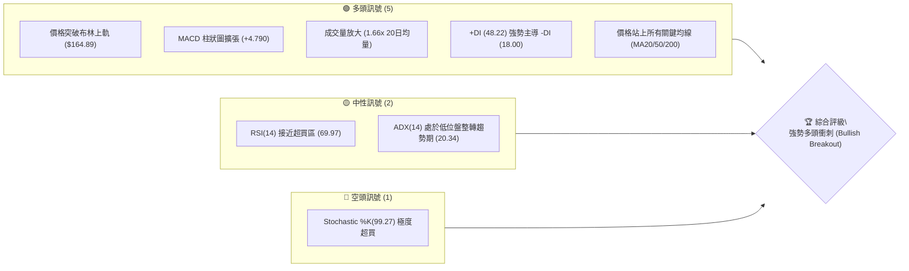
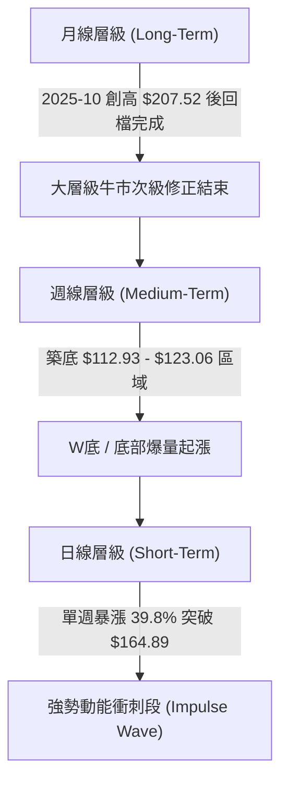
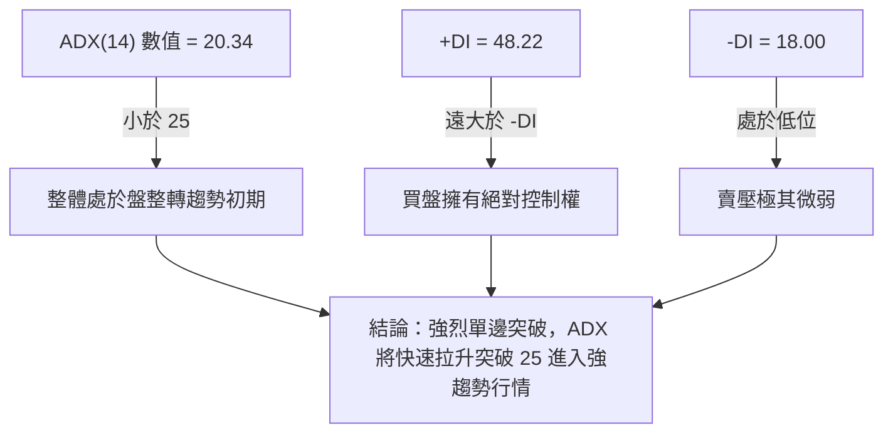
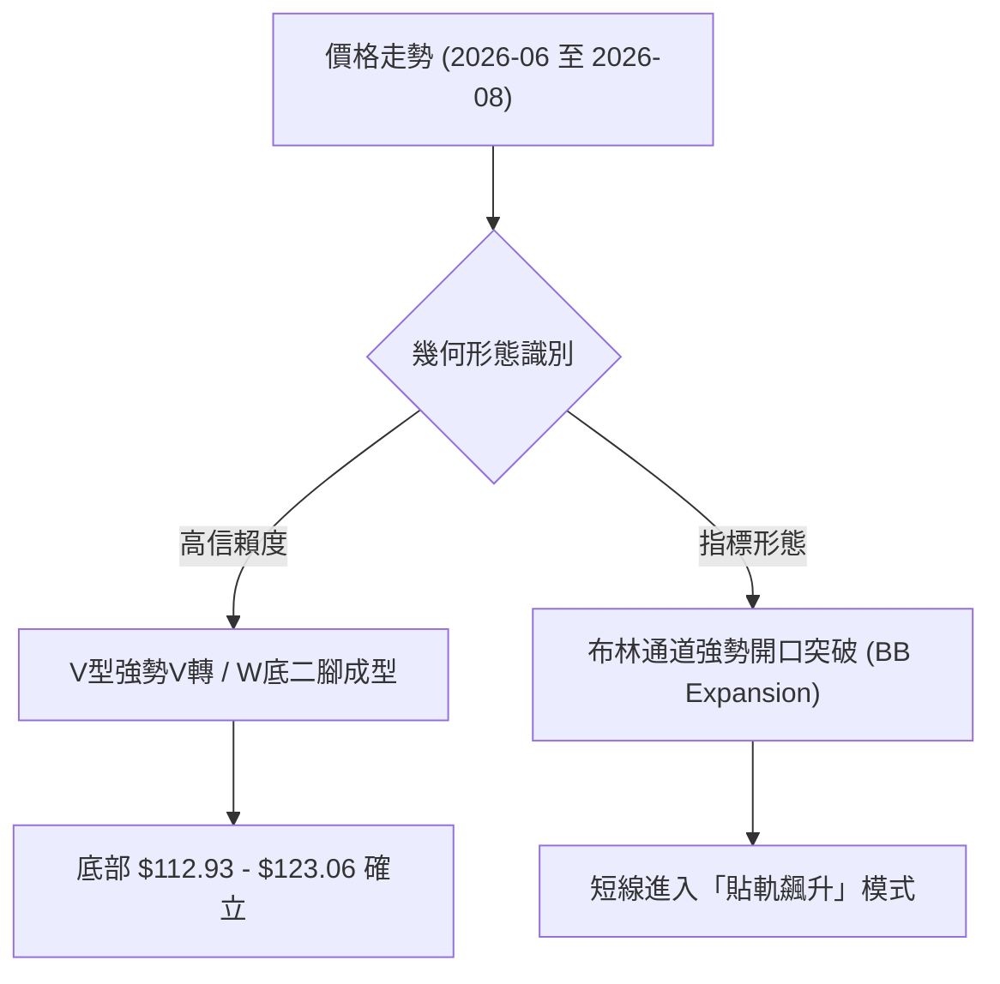
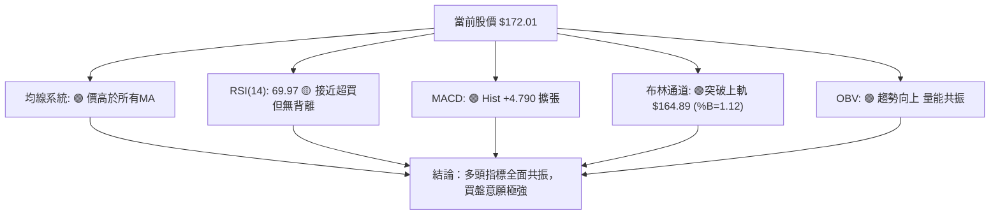
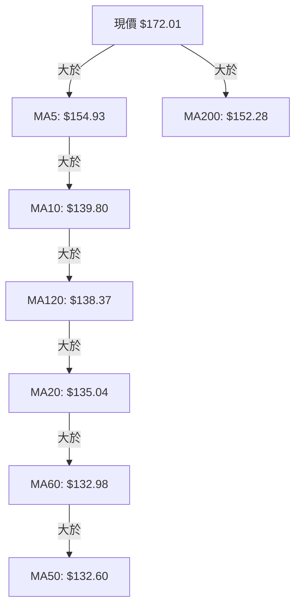
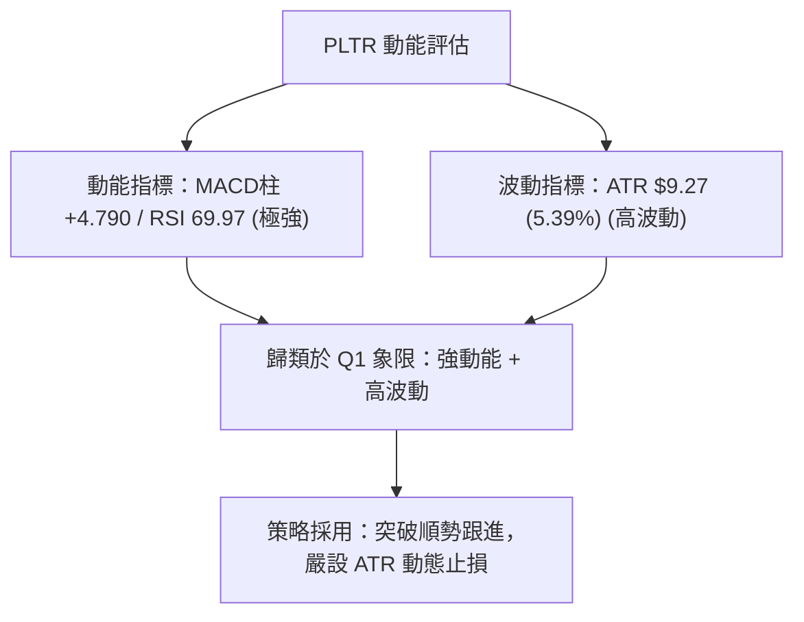
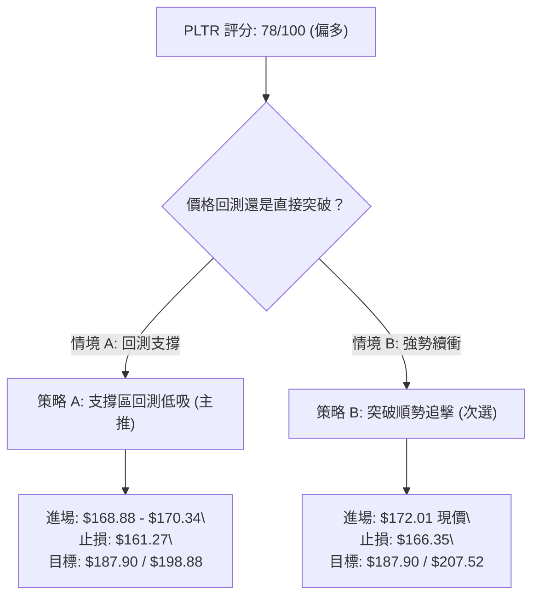
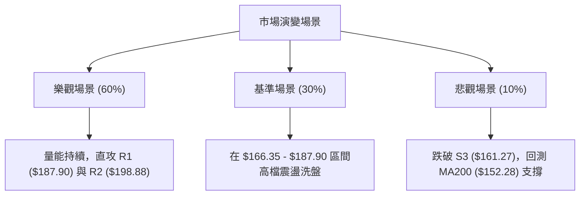

# PLTR 技術分析報告

> **報告日期**：2026-08-07 ｜ **語言**：繁體中文 ｜ **數據來源**：Yahoo Finance ｜ **當前價格**：$172.01

---

## 目錄

| 章節 | 內容 |
|------|------|
| [1. 技術面概覽](#1-技術面概覽) | 訊號儀表板、核心指標、評分卡 |
| [2. 趨勢分析](#2-趨勢分析) | 多時框趨勢、長中短期走勢、ADX強弱評估 |
| [3. 圖表形態分析](#3-圖表形態分析) | 形態識別信心度、K線組合、形態目標價 |
| [4. 支撐與阻力](#4-支撐與阻力) | 關鍵價位圖解、波段高低點聚類、斐波那契回調 |
| [5. 技術指標深度解讀](#5-技術指標深度解讀) | MA均線矩陣、RSI/MACD背離、布林通道突破、OBV |
| [6. 動能與波動率](#6-動能與波動率) | 動能四象限、ATR風險距離、Beta相關性 |
| [7. 多時框架總結](#7-多時框架總結) | 時框架評分矩陣、多時框收斂結論 |
| [8. 交易策略建議](#8-交易策略建議) | 策略路由、情境階梯、主多策略與對沖點 |
| [9. 風險提示與監控](#9-風險提示與監控) | 監控 Checklist、三情境演變、倉位管理 |

---

## 1. 技術面概覽

### 🎯 技術訊號儀表板



### 📊 核心指標速覽表

| 指標類別 | 指標名稱 | 當前數值 | 訊號 | 解讀 |
|----------|----------|----------|------|------|
| **價格** | 當前收盤價 | $172.01 | 🟢 強勢 | 單週大漲 +39.8%，突破近期整理區間 |
| **均線** | MA20 | $135.04 | 🟢 看多 | 價格在 MA20 上方 (+27.38%)，短線趨勢向上 |
| **均線** | MA50 | $132.60 | 🟢 看多 | 價格在 MA50 上方 (+29.72%)，中線基底堅實 |
| **均線** | MA200 | $152.28 | 🟢 看多 | 價格重新站上 MA200 (+12.96%)，長線轉強 |
| **動能** | RSI(14) | 69.97 | 🟡 臨界超買 | 強烈買盤推升，尚未出現頂背離訊號 |
| **動能** | MACD(12,26,9) | +4.790 (柱狀) | 🟢 強勢看多 | DIF(7.193) > DEA(2.403)，黃金交叉擴張 |
| **趨勢** | ADX(14) | 20.34 (+DI:48.22) | 🟢 動能爆發 | ADX 自低檔起升，+DI 壓倒性掌控市場 |
| **通道** | 布林通道 | Upper $164.89 | 🟢 喇叭口開口 | %B = 1.12，價格強勢「貼軌/突破上軌」 |
| **量能** | 成交量 (最新) | 76,171,329 | 🟢 爆量確認 | 達 20 日均量 (45.9M) 的 1.66 倍，機構大量買進 |
| **波動** | ATR(14) | $9.27 | 🟡 高波動 | 佔股價 5.39%，每日價格波動區間擴大 |

### 🏆 技術評分卡

```
╔══════════════════════════════════════════════════════════════╗
║              PLTR 技術面綜合評分卡 (2026-08-07)              ║
╠══════════════════════════════════════════════════════════════╣
║ 趨勢強度 (Trend)     ████████████████░░░░  80/100  🟢 強勁   ║
║ 動能指標 (Momentum)  ██████████████████░░  90/100  🟢 極強   ║
║ 支撐穩定度 (Support) ████████████░░░░░░░░  60/100  🟡 中等   ║
║ 成交量配合 (Volume)  ██████████████████░░  90/100  🟢 爆量   ║
║ 形態完整度 (Pattern) ██████████████░░░░░░  70/100  🟢 良好   ║
║ 均線排列 (MA System) ██████████████░░░░░░  70/100  🟢 多頭   ║
╠══════════════════════════════════════════════════════════════╣
║ 綜合技術評分         ███████████████░░░░░  78/100  🟢 強勢看多 ║
╚══════════════════════════════════════════════════════════════╝
```

---

## 2. 趨勢分析

### 🌐 多時框趨勢分析



### 📈 長期趨勢 — 12個月走勢圖（Unicode）

以下為 PLTR 過去 12 個月（2025-09 至 2026-08）收盤價走勢示意圖，標注歷史高點與波段低點：

```
PLTR 月線走勢圖（過去12個月）
價格軸 ($)
$207.52 ┤                 ● (歷史高點 2025-10: $200.47 / 52W High $207.52)
$190.00 ┤        ●
$172.01 ┤       / \                                     ● (現在 $172.01)
$155.00 ┤      /   \                         ●         /
$138.00 ┤     /     \     ●                 / \       /
$120.00 ┤    /       \   / \               /   \     /
$106.37 ┤   /         ●     ●             /     ●---● (波段低點 $112.93 / 52W Low $106.37)
        └─┬─────┬─────┬─────┬─────┬─────┬─────┬─────┬─────┬─────┬─────┬─────┬──
         M09   M10   M11   M12   M01   M02   M03   M04   M05   M06   M07   M08
         2025  2025  2025  2025  2026  2026  2026  2026  2026  2026  2026  2026
```

#### 走勢特徵分析表格

| 階段歷史 | 時間區間 | 收盤價區間 | 漲跌幅 | 走勢特徵與市場心理 |
|----------|----------|------------|--------|--------------------|
| **衝頂階段** | 2025-09 ~ 2025-10 | $182.42 → $200.47 | +9.89% | 市場極度樂觀，推升至 52 週高點 $207.52 |
| **深幅修正** | 2025-11 ~ 2026-02 | $200.47 → $137.19 | -31.57% | 獲利了結賣壓湧現，連續跌破 MA20 與 MA50 |
| **築底震盪** | 2026-03 ~ 2026-05 | $137.19 → $156.54 | +14.10% | 買盤嘗試反彈，於 $135 - $156 進行區間洗盤 |
| **二次探底** | 2026-06 ~ 2026-07 | $156.54 → $116.67 → $123.06 | -21.39% | 測出近一年最低區域 $106.37 - $112.93，浮動籌碼被清洗 |
| **爆量長紅** | 2026-08 (最新) | $123.06 → $172.01 | **+39.78%** | 財報/利多刺激，單週暴漲接近 $50，直接拉回 MA200 之上 |

### 📊 中期趨勢（週線分析）

```
週線壓力與支撐結構示意圖
══════════════════════════════════════════════════════════════════
 [R3] $207.52 ───────────────────────────────── 52週歷史高點 (終極阻力)
 [R2] $198.88 ───────────────────────────────── 前波次高點區塊
 [R1] $187.90 ───────────────────────────────── 近一年波段高點聚類 (下一攻防點)
 
 [現價] $172.01 ═══════════════════════════════ (當前強勢突破區間)
 
 [S1] $170.34 ───────────────────────────────── 近一年波段低點聚類轉支撐
 [S2] $166.35 ───────────────────────────────── 布林上軌 ($164.89) 與 Fib 38.2% ($168.88) 匯合帶
 [S3] $161.27 ───────────────────────────────── 強支撐防線
══════════════════════════════════════════════════════════════════
```

### ⚡ 趨勢強度評估（ADX 解讀）



#### ADX 強度分析對照表

| 指標項 | 數值 | 判讀標準 | 當前狀態解讀 |
|--------|------|----------|--------------|
| **ADX(14)** | **20.34** | < 25 (無趨勢/盤整) | 雖 ADX < 25 表示先前 20 週為區間震盪，但近期動能急升，正處於**盤整突破至新趨勢的拐點**。 |
| **+DI** | **48.22** | > 30 (強多頭) | 買方力量呈現爆發性增長，創下近 20 週新高。 |
| **-DI** | **18.00** | < 20 (弱空頭) | 空方力量受到全面壓制，無力反擊。 |

---

## 3. 圖表形態分析

### 🔍 形態識別系統



#### 形態信心度與目標價評估表

| 形態名稱 | 信心度 | 判斷依據（引用數據） | 完成度 | 目標價（附計算式） |
|----------|--------|----------------------|--------|--------------------|
| **V型爆量反轉** | **85%** | 2026-07 收 $123.06 後，2026-08-09 週成交量爆增至 433.7M，收盤拉升至 $172.01 | 100% (突破) | 頸線 $146.28 + (頸線 $146.28 - 底部 $112.93 = $33.35) = **$179.63** |
| **布林上軌喇叭口突破** | **90%** | 收盤 $172.01 遠超上軌 $164.89，%B 達 1.12，量比達 1.66x | 100% (進行中) | 直指下一波段阻力聚類 R1 = **$187.90** |
| **雙重底 (W-Bottom)** | **70%** | 第一底 2026-06 收 $116.67，第二底 2026-07 收 $122.92，突破頸線 $146.28 | 100% (已觸及) | 頸線 $146.28 + (頸線 $146.28 - 底 $112.93 = $33.35) = **$179.63** |

### 🕯️ 重要 K 線形態分析

| 日期/週別 | 收盤價 | K線形態 | 解讀 | 訊號 |
|-----------|--------|---------|------|------|
| **2026-06-28** | $112.93 | 長黑砸盤K | 探底至 52 週低點區塊 ($106.37)，空頭力道竭盡 | 🔴 空頭宣洩 |
| **2026-07-05** | $129.30 | 破底翻長紅 | 迅速吞噬前週陰線，打出築底第一腳 | 🟢 買盤進駐 |
| **2026-07-26** | $122.92 | 回測小紅小黑 | 二次測底不破 $112.93，量能萎縮至 143.2M | 🟡 籌碼沉澱 |
| **2026-08-09** | **$172.01** | **光頭巨陽線 (Marubozu)** | 單週強漲 +$48.95，搭配 433.7M 巨量，完全扭轉空頭 | 🟢🟢 極度看多 |

### 📉 ASCII 走勢形態示意圖

```
PLTR V型破底翻與布林突破形態示意圖
══════════════════════════════════════════════════════════════════
$187.90 ┤                                                    [R1 目標]
$172.01 ┤                                              ▲ (現價突破)
$164.89 ┼ - - - - - - - - - - - - - - - - - - - - - - - - ┬ (布林上軌)
$146.28 ┤                         ▲ (頸線突破點)        │
$135.04 ┼ - - - - - - - - - - - - │ - - - - - - - - - - ┴ (布林中軌 MA20)
$123.06 ┤                ● (二腳)│
$112.93 ┤      ● (一腳)  └───────┴─ 雙底基底 (高低差 $33.35)
══════════════════════════════════════════════════════════════════
```

### 🎯 形態目標價計算

1. **W底/V型反轉測幅**：
   - 底部支撐低點：$112.93（2026-06-28 週收盤）
   - 頸線關鍵價位：$146.28（2026-03 波段高點）
   - 形態垂直高度：$146.28 - $112.93 = $33.35
   - **最小測量目標價** = $146.28 + $33.35 = **$179.63**（當前價 $172.01 正向此目標推進）

2. **阻力階梯延伸目標價**：
   - **第一目標價 (T1)**：**$187.90**（引用數據阻力位 R1）
   - **第二目標價 (T2)**：**$198.88**（引用數據阻力位 R2）
   - **歷史高點目標 (T3)**：**$207.52**（引用 52 週高點 R3）

---

## 4. 支撐與阻力

### 🗺️ 關鍵價位分布圖（Unicode）

```
PLTR 價位結構分布圖 (2026-08-07)
═══════════════════════════════════════════════════════════════════
$207.52 ║████████████████████████████████████████║ 52W High / R3
$198.88 ║██████████████████████████████          ║ 阻力 R2
$187.90 ║████████████████████████                ║ 近一年波段高點聚類 R1
$183.65 ║▓▓▓▓▓▓▓▓▓▓▓▓▓▓▓▓▓▓▓▓▓                   ║ 斐波那契 23.6% 回調位
────────╠════════════════════════════════════════╣ ◄ 現價 $172.01
$170.34 ║████████████████████████                ║ 近一年波段低點聚類 S1
$168.88 ║▓▓▓▓▓▓▓▓▓▓▓▓▓▓▓▓▓▓                      ║ 斐波那契 38.2% 回調位
$166.35 ║████████████████████                    ║ 支撐 S2
$164.89 ║░░░░░░░░░░░░░░░░░░░░                    ║ 布林通道上軌
$161.27 ║████████████████                        ║ 強支撐 S3
$156.95 ║▓▓▓▓▓▓▓▓▓▓▓▓▓                           ║ 斐波那契 50.0% 回調位
$152.28 ║────────────────────────────────────────║ MA200 長線分水嶺
═══════════════════════════════════════════════════════════════════
```

### 🚧 阻力位分析表

| 阻力級別 | 精確價位 | 數據形成原因 | 突破難度 | 技術面重要性 |
|----------|----------|--------------|----------|--------------|
| **R1** | **$187.90** | 近一年波段高點聚類（數據提供） | 🟡 中等 | 短線多頭衝刺第一目標，突破後將挑戰前高 |
| **R2** | **$198.88** | 近一年波段高點聚類（數據提供） | 🔴 偏高 | 整數關卡 $200 前哨站，解套賣壓密集區 |
| **R3** | **$207.52** | 52 週歷史高點 (52W High) | 🔴 極高 | 歷史天花板，突破即創歷史新高進入無壓區 |

### 🛡️ 支撐位分析表

| 支撐級別 | 精確價位 | 數據形成原因 | 守住機率 | 技術面重要性 |
|----------|----------|--------------|----------|--------------|
| **S1** | **$170.34** | 近一年波段低點轉化聚類（數據提供） | 🟢 很高 | 當前急漲後的短線第一防線（距現價僅 -0.97%） |
| **S2** | **$166.35** | 近一年波段低點聚類（數據提供） | 🟢 高 | 與布林上軌 ($164.89) 形成共振支撐帶 |
| **S3** | **$161.27** | 近一年波段低點聚類（數據提供） | 🟢 高 | 波段多空防守底線，回測不破均屬健康回檔 |

### 📐 斐波那契回調位分析

依據 52 週區間 **$106.37（低點）→ $207.52（高點）** 計算之回調位與現價關係如下：

| 斐波水準 | 精確價位 | 與現價距離 | 現價相對位置與技術意義 |
|----------|----------|------------|------------------------|
| **0.0%** | **$207.52** | +20.64% | 52週最高點 |
| **23.6%** | **$183.65** | +6.77% | 上方強阻力位，位於 R1 ($187.90) 下方 |
| **當前價格**| **$172.01** | **0.00%** | **位於 Fib 38.2% 與 Fib 23.6% 之間的黃金強勢區** |
| **38.2%** | **$168.88** | -1.82% | 關鍵黃金支撐位，與 S1 ($170.34) 組成強支撐網 |
| **50.0%** | **$156.95** | -8.76% | 多空中軸線，高於 MA200 ($152.28) |
| **61.8%** | **$145.01** | -15.70% | 黃金分割強支撐區（前波頸線區） |
| **78.6%** | **$128.02** | -25.57% | 深幅回調防線 |
| **100.0%**| **$106.37** | -38.16% | 52週最低點 |

---

## 5. 技術指標深度解讀

### 🎛️ 指標訊號總覽



### 📈 移動平均線排列分析



#### 均線矩陣狀態表

| 均線名稱 | 當前價位 | 價格相對位置 | 偏離度 (%) | 趨勢解讀 |
|----------|----------|--------------|------------|----------|
| **MA 5** | $154.93 | 價格在上方 | +11.02% | 極短線急升，乖離率偏高 |
| **MA 10** | $139.80 | 價格在上方 | +23.04% | 短線快速向上穿透 |
| **MA 20** | $135.04 | 價格在上方 | +27.38% | 月線轉為上揚，短線生命線 |
| **MA 50** | $132.60 | 價格在上方 | +29.72% | 季線基底完成，中期支撐 |
| **MA 200**| $152.28 | 價格在上方 | +12.96% | **成功站上牛熊分水嶺，長線轉牛** |

### 📉 RSI(14) 分析

- **當前數值**：**69.97**
- **強度進度條**：`██████████████░░░░░░` 70% (接近超買臨界點 70)
- **背離檢測**：**無明顯背離**。在 2026-06 股價低點 $112.93 時，RSI 曾下探 27.8 的超賣區；當前股價大幅拉升至 $172.01，RSI 同步陡峭上升至 69.97，屬於**典型的強勢動能跟隨**而非頂背離。
- **解讀**：強勢股在突破初期，RSI 常會在 70-80 的超買區鈍化，代表極強的單邊買盤，切勿單純因 RSI 接近 70 而盲目做空。

### 📊 MACD(12,26,9) 訊號解讀

- **MACD 線 (DIF)**：**+7.193**
- **訊號線 (DEA)**：**+2.403**
- **MACD 柱狀圖 (Histogram)**：**+4.790**
- **信號評估**：🟢 **強烈看多**。
- **解讀**：DIF 與 DEA 於零軸上方持續擴大正乖離，柱狀圖單週從之前的 -0.692 爆發性抽升至 +4.790，顯示多頭動能量能極度充沛，屬於強烈買進訊號。

### 📦 布林通道分析

```
PLTR 布林通道（Bollinger Bands）現狀示意圖
══════════════════════════════════════════════════════════════════
 $164.89 ┼───────────────────────────────── [BB 上軌]
         │                                       ▲ 現價 $172.01 (%B = 1.12)
         │                                       │ (強勢突破上軌，貼軌飆升)
 $135.04 ┼───────────────────────────────── [BB 中軌 / MA20]
         │
 $105.19 ┼───────────────────────────────── [BB 下軌]
══════════════════════════════════════════════════════════════════
```

- **軌道數據**：上軌 $164.89 ｜ 中軌 $135.04 ｜ 下軌 $105.19
- **%B 指標**：**1.12**（大於 1.0 代表價格收於布林上軌之外）
- **解讀**：布林通道經歷前期的壓縮後驟然向外開口（Band Expansion）。%B > 1.0 顯示市場處於「極端強勢的貼軌行情」，若後續回檔能守住上軌 $164.89 或 S1 $170.34，將延續飆升態勢。

### 💹 成交量分析（量價配合度）

- **最新成交量**：**76,171,329** 股
- **20日平均量**：**45,902,686** 股（量比：**1.66x**）
- **週成交量爆發**：最新一週成交量高達 **433,756,229** 股，為過去 20 週平均水平的 2 倍以上。
- **OBV (能量潮)**：**OBV > MA**，量線同步創出波段新高，證實本次拉升有極強的法機構資金（Institution Ownership 61.9%）進駐，**量價配合完美，無量價背離隱憂**。

---

## 6. 動能與波動率

### ⚡ 動能評估四象限

| 象限 | 動能 (Momentum) | 波動率 (Volatility) | 當前 PLTR 狀態 | 交易戰略評估 |
|------|-----------------|---------------------|----------------|--------------|
| **Q1** | **強 (Strong)** | **高 (High)** | **✓ [當前位置]** | **高動能高波動衝刺期**：順勢追價，但須嚴格以 ATR 設定止損 |
| **Q2** | 弱 (Weak) | 高 (High) | — | 高風險洗盤期：避免持倉 |
| **Q3** | 弱 (Weak) | 低 (Low) | — | 沉悶盤整期：觀望或佈局區間 |
| **Q4** | 強 (Strong) | 低 (Low) | — | 穩健主升段：最佳加碼點 |



### 📊 ATR 波動率分析

- **ATR(14)**：**$9.27**（佔當前股價 **5.39%**）
- **每日波幅參考**：正常交易日內，PLTR 股價上下震盪區間約在 $9.27 左右。
- **風控止損距離設定建議**：
  - **緊密止損 (1.0x ATR)**：$172.01 - $9.27 = **$162.74**（接近 S3 $161.27）
  - **標準止損 (1.5x ATR)**：$172.01 - ($9.27 × 1.5) = **$158.11**（位於 Fib 50% $156.95 上方）
  - **寬鬆止損 (2.0x ATR)**：$172.01 - ($9.27 × 2.0) = **$153.47**（位於 MA200 $152.28 上方）

### 📐 Beta 與市場相關性

- **Beta 係數**：**1.563**
- **解讀**：PLTR 屬於高 Beta 成長型科技股，波動度比標普500大盤高出 56.3%。在大盤多頭環境下具備極強的超額收益 (Alpha) 彈性，但若大盤出現系統性拉回，其修正幅度亦會放大。

---

## 7. 多時框架總結

### 📋 時框架評分表

| 時框架 | 趨勢方向 | 動能強度 | 均線排列 | 形態結構 | 綜合評分 | 操作建議 |
|--------|----------|----------|----------|----------|----------|----------|
| **月線 (Long-Term)** | 🟢 多頭重啟 | 🟢 強勁 | 🟡 混合中急升 | 大W底成型 | **80/100** | 偏多持有，看好重回歷史高點 |
| **週線 (Medium-Term)**| 🟢 強勢多頭 | 🟢 爆發 | 🟢 向上突破 | 長紅突破頸線 | **85/100** | 順勢做多，逢回拉回找買點 |
| **日線 (Short-Term)** | 🟢 衝刺飆升 | 🟢 臨界超買 | 🟢 全線站上 | 突破布林上軌 | **75/100** | 不宜盲目追高，等待短回測 S1 進場 |

### 🔲 綜合訊號矩陣

```
╔═════════════════════════════════════════════════════════════════╗
║                  PLTR 多時框訊號一致性矩陣                      ║
╠══════════════════╦══════════════╦══════════════╦════════════════╣
║ 分析維度         ║ 週線 (Weekly)║ 日線 (Daily) ║ 一致性與結論   ║
╠══════════════════╬══════════════╬══════════════╬════════════════╣
║ 趨勢方向 (Trend) ║ 🟢 多頭      ║ 🟢 多頭      ║ 🟢 強烈一致    ║
║ 動能 (Momentum)  ║ 🟢 爆發      ║ 🟡 超買邊緣  ║ 🟡 短線需防拉回║
║ 成交量 (Volume)  ║ 🟢 爆量      ║ 🟢 爆量      ║ 🟢 強烈一致    ║
║ 支撐/阻力位置    ║ 突破頸線     ║ 突破上軌     ║ 🟢 空間打開    ║
╚══════════════════╩══════════════╩══════════════╩════════════════╝
```

### ⚖️ 多時框收斂結論

依據多時框收斂規則：當前 ADX 為 20.34（雖小於 25，但 +DI 達 48.22 呈現強烈單邊動能），且日線與週線同時爆量突破所有關鍵均線（MA20/50/200）與布林上軌 ($164.89)。

**最終收斂結論**：**主導方向為強勢多頭突破 (Bullish Impulse)**。日線極短線因 RSI 近 70 且 Stoch 過熱可能出現對 S1 ($170.34) 或 S2 ($166.35) 的短線技術性回測，但中長期趨勢已全面轉多，**任何回測均為尋找做多進場點的絕佳時機**。

---

## 8. 交易策略建議

### 🗺️ 策略決策流程圖



### 🧭 策略路由

**當前主策略方向：多頭主導（綜合評分 78/100 ≥ 60，強力推多）**

### 🎯 價格情境階梯（Price Scenarios）

| 觸發條件 | 第一目標 | 第二目標 | 終極目標 | 情境技術含義 |
|----------|----------|----------|----------|--------------|
| **站穩 S1 $170.34** | R1 **$187.90** | R2 **$198.88** | R3 **$207.52** | 多頭主升段延續，挑戰歷史高點 |
| **回測 S2 $166.35 守住**| $172.01 (現價) | R1 **$187.90** | R2 **$198.88** | 健康技術性洗盤，最佳逢低佈局點 |
| **跌破 S3 $161.27** | Fib 50% **$156.95** | MA200 **$152.28** | S3 下方 | 多頭動能衰竭，假突破風險觸發 |

### 📊 情境機率分佈

| 情境劇本 | 估計機率 | 主要技術依據 |
|----------|----------|--------------|
| **順勢上攻挑戰 R1/R2** | **60%** | MACD 柱狀 +4.790 爆發、週量 433.7M 巨量、+DI 48.22 壓倒性掌控 |
| **高點震盪消化超買 (S1-R1)**| **30%** | RSI 達 69.97 接近超買、Stoch 超買、需時間消化偏高乖離率 |
| **深幅回調破防 (跌破 S3)**| **10%** | 僅在美股大盤出現重大系統性風險或突發利空時發生 |

### 🟢 主策略詳情

#### 策略 A：技術性回測低吸策略（主推 — 風險報酬比最優）

- **進場條件**：股價短線拉回至 S1 ($170.34) 或 斐波那契 38.2% ($168.88) 附近獲得支撐。
- **建議進場價**：**$169.50**（位於 $168.88 - $170.34 區間）
- **止損價格**：**$161.27**（引用數據支撐位 S3，跌破代表短線結構破壞）
- **第一目標價 (T1)**：**$187.90**（引用數據阻力位 R1，潛在獲利 +$18.40 / +10.86%）
- **第二目標價 (T2)**：**$198.88**（引用數據阻力位 R2，潛在獲利 +$29.38 / +17.33%）
- **風險報酬比 (R:R)**：
  - 風險金額 = $169.50 - $161.27 = $8.23
  - T1 報酬金額 = $187.90 - $169.50 = $18.40
  - **T1 風險報酬比 = 1 : 2.24** 🟢 (優於 1:2 標準)
  - **T2 風險報酬比 = 1 : 3.57** 🟢 (極佳)
- **成功機率估計**：**68%**
- **建議倉位**：**15% - 20%**

#### 策略 B：突破動能追擊策略（次選 — 適合激進型交易者）

- **進場條件**：當前價位直接開盤進場，順應爆量衝刺動能。
- **建議進場價**：**$172.01**（當前現價）
- **止損價格**：**$166.35**（引用數據支撐位 S2，風險距離 $5.66 / -3.29%）
- **第一目標價 (T1)**：**$187.90**（引用數據阻力位 R1）
- **第二目標價 (T2)**：**$207.52**（引用 52 週歷史高點 R3）
- **風險報酬比 (R:R)**：
  - 風險金額 = $172.01 - $166.35 = $5.66
  - T1 報酬金額 = $187.90 - $172.01 = $15.89
  - **T1 風險報酬比 = 1 : 2.81** 🟢
- **成功機率估計**：**55%**
- **建議倉位**：**8% - 10%**（動能追高，控制倉位）

### 🔴 反向風險觸發點（對沖提示）

若 PLTR 股價未如預期上攻，反而放量跌破 **$161.27 (S3)**，代表本輪多頭爆量突破屬於「假突破 (Bull Trap)」。多頭部位應即刻執行止損，多空觀望，或可考慮微量建立對沖空單，下看 MA200 ($152.28)。

### ⭐ 整體訊號強度評星

```
做多訊號強度：★★███  (4.0/5星)  🟢 強烈看多
做空訊號強度：★░░░░  (1.0/5星)  🔴 極弱
整體訊號可信度：★★███  (4.0/5星)  🟢 高度可信
```

---

## 9. 風險提示與監控

### ✅ 關鍵監控指標 Checklist

```
╔══════════════════════════════════════════════════════════════╗
║                PLTR 技術面每日監控 CHECKLIST                 ║
╠══════════════════════════════════════════════════════════════╣
║ [ ] 股價是否持續守在 S1 ($170.34) 或 S2 ($166.35) 之上      ║
║ [ ] RSI(14) 是否在 70 附近形成頂背離（高點不連貫）           ║
║ [ ] 成交量是否在拉回時縮量（健康），而非爆量下殺            ║
║ [ ] MACD 柱狀圖是否持續維持在 +4.0 以上的正向擴張狀態         ║
║ [ ] 股價是否順利攻克 R1 ($187.90) 關鍵波段壓力位             ║
╚══════════════════════════════════════════════════════════════╝
```

### ⚠️ 風險場景分析



### 🛡️ 風險管理重要提醒

1. **乖離率偏高風險**：現價 $172.01 距離 MA20 ($135.04) 偏離度達 +27.38%，短線追高需防範技術性均線修正。建議採用**分批建倉**策略。
2. **波動率放大管理**：當前 ATR 為 $9.27 (5.39%)，單日波動較大，請務必根據個人帳戶風險承受度，計算正確的股數（單筆交易虧損不超過總資產的 1%-2%）。
3. **大盤 Beta 係數連動**：Beta 達 1.563，需留意納斯達克指數與科技板塊整體走勢，若美股大盤出現劇烈拉回，PLTR 難免受到波及。

---

## 📋 報告總結

```
╔══════════════════════════════════════════════════════════════════╗
║                  PLTR 技術分析報告總結                           ║
════════════════════════════════════════════════════════════════════
 報告日期：2026-08-07
 當前價格：$172.01
 分析評級：🟢 強勢看多 (Bullish Breakout) — 綜合評分 78/100

 關鍵結論總覽：
 ├─ 長期趨勢：🟢 多頭重啟 (走出底部分水嶺，站上 MA200 $152.28)
 ├─ 中期趨勢：🟢 爆量突破 (W底/V型反轉成型，單週大漲 +39.8%)
 ├─ 短期趨勢：🟢 貼軌飆升 (突破布林上軌 $164.89，%B = 1.12)
 ├─ 關鍵支撐：S1 $170.34 ｜ S2 $166.35 ｜ S3 $161.27
 ├─ 關鍵阻力：R1 $187.90 ｜ R2 $198.88 ｜ R3 $207.52
 └─ 分析師目標價：均值 $189.90 (共識 Buy)

 最優交易策略組合：
 1. 🥇 最佳機會 (策略 A)：等待拉回 S1/S2 ($169.50 附近) 低吸做多，
                       止損 $161.27，目標 $187.90 / $198.88 (R:R 2.24:1)
 2. 🥈 次選機會 (策略 B)：現價 $172.01 小倉位順勢追擊，
                       止損 $166.35，目標 $187.90 / $207.52 (R:R 2.81:1)
 3. 🥉 對沖風控點：若不幸放量跌破 S3 ($161.27)，多頭離場觀望。
════════════════════════════════════════════════════════════════════
```

---

> ⚠️ **免責聲明**：本報告為 AI 自動生成之技術分析，所有數據及估算均嚴格基於提供之歷史 OHLCV 與技術指標資訊。本報告**僅供研究與學術參考**，**不構成任何投資建議**。投資有風險，入市需謹慎，請自行承擔交易風險並嚴格執行風控紀律。

---

*報告生成時間：2026-08-07 ｜ 數據來源：Yahoo Finance ｜ 分析框架：多時框技術分析系統*