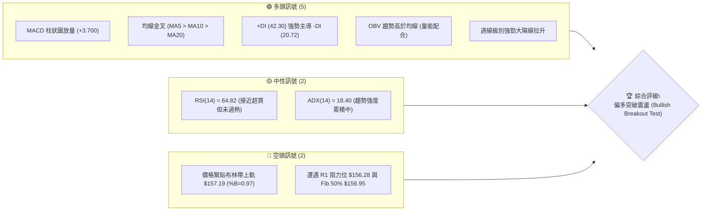
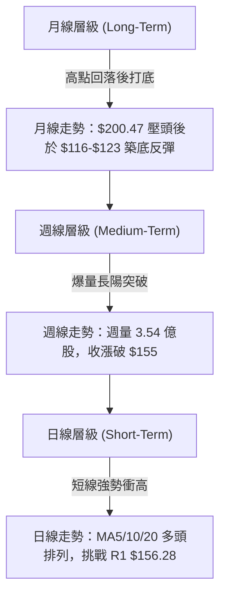
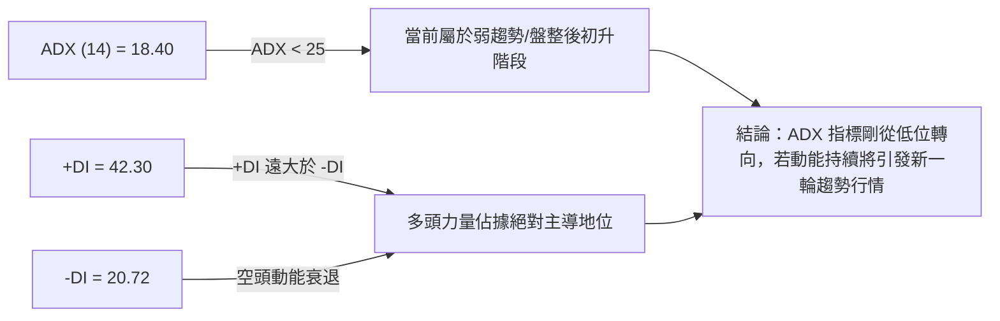
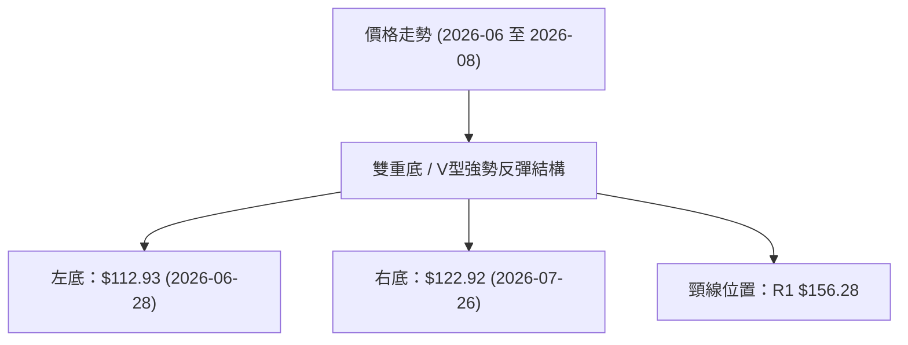
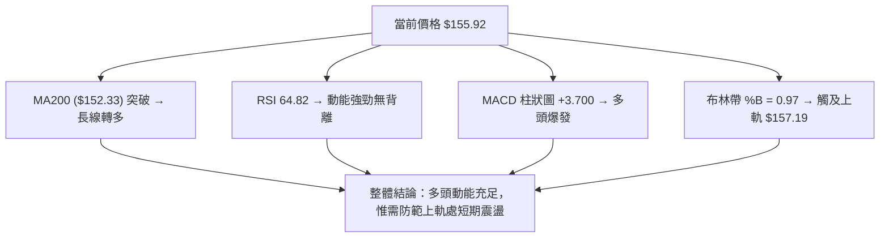
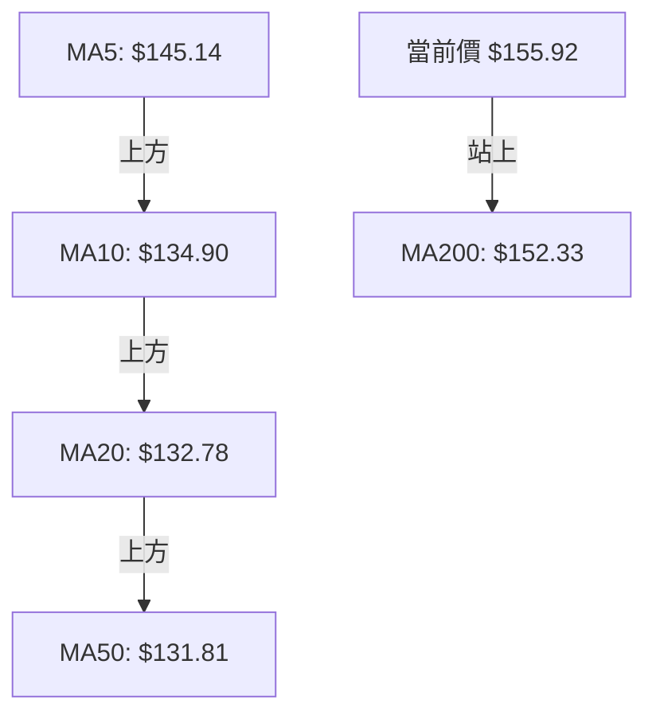
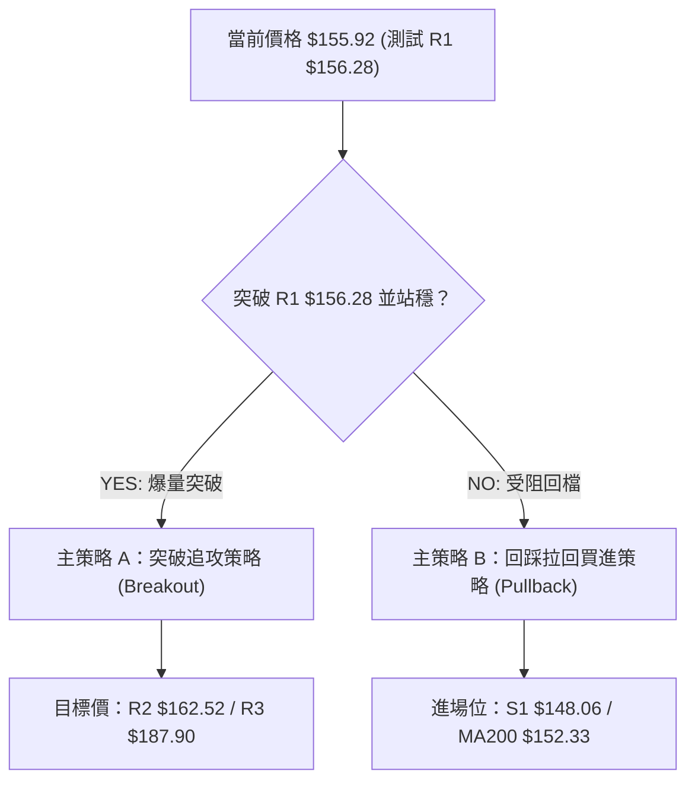
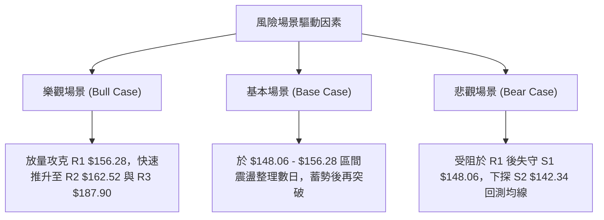

# PLTR 技術分析報告

> **報告日期**：2026-08-07 ｜ **語言**：繁體中文 ｜ **數據來源**：Yahoo Finance ｜ **當前價格**：$155.92

---

## 目錄

| 章節 | 內容 |
|------|------|
| [1. 技術面概覽](#1-技術面概覽) | 訊號儀表板、核心指標、評分卡 |
| [2. 趨勢分析](#2-趨勢分析) | 多時框趨勢、長中短期走勢 |
| [3. 圖表形態分析](#3-圖表形態分析) | 形態識別、K線組合、目標價 |
| [4. 支撐與阻力](#4-支撐與阻力) | 關鍵價位、斐波那契回調 |
| [5. 技術指標深度解讀](#5-技術指標深度解讀) | MA/RSI/MACD/布林/成交量 |
| [6. 動能與波動率](#6-動能與波動率) | 動能評估、ATR、Beta |
| [7. 多時框架總結](#7-多時框架總結) | 時框架評分矩陣 |
| [8. 交易策略建議](#8-交易策略建議) | 多空策略、風險報酬比 |
| [9. 風險提示與監控](#9-風險提示與監控) | 監控指標、風險場景 |

---

## 1. 技術面概覽

### 🎯 技術訊號儀表板



### 📊 核心指標速覽表

| 指標類別 | 指標名稱 | 當前數值 | 訊號 | 解讀 |
|----------|----------|----------|------|------|
| **價格** | 當前價格 | $155.92 | 🟢 多頭 | 站上多條關鍵移動平均線，接近 52 週區間中軸 |
| **均線** | MA20 | $132.78 | 🟢 多頭 | 價格遠高於 MA20（高出 +17.43%），短期支撐強勁 |
| **均線** | MA50 | $131.81 | 🟢 多頭 | 價格高於 MA50，中軌支撐堅實 |
| **均線** | MA200 | $152.33 | 🟢 多頭 | 成功突破 MA200 年線阻力（高出 +2.36%），長線轉強 |
| **動能** | RSI(14) | 64.82 | 🟡 中性 | 處於強勢區間（50-70），未出現超買（>70）或背離 |
| **動能** | MACD | 4.906 | 🟢 多頭 | MACD 柱狀圖為 +3.700，多頭擴散動能極強 |
| **波動** | ATR(14) | $8.43 | 🟡 中性 | 日均波幅 5.41%，波動率中等，適合設立追蹤止損 |

### 🏆 技術評分卡

```
╔══════════════════════════════════════════════════════════════════╗
║              PLTR 技術綜合評分卡  —  2026-08-07                  ║
╠══════════════════════════════════════════════════════════════════╣
║ 趨勢強度      ▓▓▓▓▓▓▓▓▓▓░░░░░░░░░░  50/100  🟡 ADX 18.40 蓄勢階段  ║
║ 動能指標      ▓▓▓▓▓▓▓▓▓▓▓▓▓▓▓▓░░░░  80/100  🟢 MACD金叉與RSI強勢 ║
║ 支撐穩定度    ▓▓▓▓▓▓▓▓▓▓▓▓▓▓░░░░░░  70/100  🟢 S1/S2 波段支撐明確 ║
║ 成交量配合    ▓▓▓▓▓▓▓▓▓▓▓▓▓▓▓▓░░░░  80/100  🟢 最新週量顯著放量   ║
║ 形態完整度    ▓▓▓▓▓▓▓▓▓▓▓▓░░░░░░░░  60/100  🟡 底部築底反彈形態  ║
║ 均線排列      ▓▓▓▓▓▓▓▓▓▓▓▓▓▓░░░░░░  70/100  🟢 短期均線呈多頭排列 ║
╠══════════════════════════════════════════════════════════════════╣
║ 綜合評分      ▓▓▓▓▓▓▓▓▓▓▓▓▓▓░░░░░░  68/100  評級：偏多 (Bullish)║
╚══════════════════════════════════════════════════════════════════╝
```

---

## 2. 趨勢分析

### 🌐 多時框趨勢分析



### 📈 長期趨勢 — 12個月走勢圖（Unicode）

```
PLTR 月線走勢圖（2025-09 至 2026-08）
價格軸 ($)
$200.47 ┤                 ● (52W高點附近)
$182.42 ┤           ●
$168.45 ┤                 █     ●
$155.92 ┤                       █     ●←現價 ($155.92)
$137.19 ┤                             █   ●
$116.67 ┤                                 ● (近期低點打底)
        └──────────────────────────────────────────────
         09  10  11  12  01  02  03  04  05  06  07  08  (月份)
```

#### 走勢特徵分析表格

| 階段 | 時間區間 | 價格變動 | 特徵解讀 |
|------|----------|----------|----------|
| **衝頂期** | 2025-09 ~ 2025-10 | $182.42 ➔ $200.47 | 市場情緒高漲，創出歷史高點區域 $207.52 |
| **修正期** | 2025-11 ~ 2026-02 | $200.47 ➔ $137.19 | 高估值修正與獲利結案賣壓，跌破多條短期均線 |
| **震盪打底** | 2026-03 ~ 2026-07 | $146.28 ➔ $116.67 | 於 $106.37-$116.67 區間完成二次探底與籌碼換手 |
| **強勢反彈** | 2026-08 (最新) | $123.06 ➔ $155.92 | 單月大幅反彈近 26.7%，強勢拉升至 Fib 50% 重疊區 |

### 📊 中期趨勢（週線分析）

從近 20 週數據觀察，PLTR 在 2026 年 6 月底出現最低收盤價 $112.93（接近 52 週低點 $106.37），隨後於 7 月進行打底震盪。最新一週（2026-08-09 該週數據）迎來爆發性買盤，週成交量放大至 **354,230,607 股**（顯著高於前數週 1.4-1.6 億股水平），週 RSI 從 41.2 強勢拉升至 64.8，MACD 柱狀圖暴增至 +3.700，顯示中期趨勢已從震盪打底轉為多頭反攻。

```
週線壓力與支撐示意圖
$187.90 ┼───────────────────────────────── (R3 強阻力)
        │
$162.52 ┼───────────────────────────────── (R2 阻力)
$156.28 ┼───▲ 現價 $155.92 ──────────────── (R1 阻力 / Fib 50%)
$148.06 ┼───────────────────────────────── (S1 近期支撐)
$142.34 ┼───────────────────────────────── (S2 強支撐)
```

### ⚡ 趨勢強度評估（ADX 解讀）



#### ADX 趨勢強度對照解讀

| ADX 數值區間 | 當前位置 | 趨勢狀態 | 交易策略指導 |
|--------------|----------|----------|--------------|
| **0 - 25** | **18.40 ◄** | **弱趨勢 / 無趨勢區間** | **依據多時框規則，以區間與臨界突破位為主** |
| **25 - 50** | -- | 強趨勢形成中 | 順勢加碼，持有趨勢單 |
| **50 - 75** | -- | 極強趨勢 | 注意指標超買與背離 |

---

## 3. 圖表形態分析

### 🔍 形態識別系統



#### 形態信心度評估表

| 形態名稱 | 信心度 | 判斷依據（引用數據） | 完成度 | 目標價（附計算式） |
|----------|--------|----------------------|--------|--------------------|
| **雙重底 (Double Bottom)** | **65%** | 兩次下探低點 $112.93 與 $122.92 未破 $106.37，配合成交量放量 | **85%** | 頸線 $156.28 + (頸線 $156.28 - 左底 $112.93) = **$199.63** (由形態高度推算) |
| **布林帶向上突破** | **80%** | 價格突破中軌 $132.78，直逼上軌 $157.19 (%B=0.97) | **90%** | 布林上軌通道延伸 $162.52 (引用 R2) |

### 🕯️ 重要K線形態分析

| 日期/週期 | 收盤價 | K線形態 | 解讀 | 訊號 |
|-----------|--------|---------|------|------|
| **2026-06-28 週** | $112.93 | 長下影陰線 | 探底尋求 52 週低點 $106.37 支撐，恐慌盤出盡 | 🟢 底訊號 |
| **2026-07-26 週** | $122.92 | 縮量築底小陰線 | 空頭動能耗盡，籌碼鎖定良好 | 🟡 蓄勢訊號 |
| **2026-08-09 週** | $155.92 | 爆量大陽線 | 單週漲幅達 26.7%，實體幾乎穿透所有短期均線 | 🟢 強烈買進 |

### 📉 ASCII 走勢形態示意圖

```
PLTR 週線 V 型 / 雙底反彈示意圖

$162.52 ┤                       [突破目標 R2]
$156.28 ┤                 ▲───── (頸線阻力 R1 / 現價 $155.92)
$142.34 ┤          ▲     /
$128.02 ┤    ▲    / ╚═══╝ (右底打底 $122.92)
$112.93 ┤  ──┴───┘ (左底探底 $112.93)
        └─────────────────────────────────
```

### 🎯 形態目標價計算

1. **雙重底形態高度計算**：
   - 頸線（R1）：$156.28
   - 低點（左底）：$112.93
   - 形態高度 $H = 156.28 - 112.93 = 43.35$
   - **推算形態第一目標價** = $156.28 + 43.35 = \$199.63$

---

## 4. 支撐與阻力

### 🗺️ 關鍵價位分布圖（Unicode）

```
PLTR 價位結構分布圖
════════════════════════════════════════════════════════════════
$207.52 ║████████████████████████████████████████║ 52週歷史高點
$187.90 ║██████████████████████████              ║ 強阻力 R3
$168.88 ║▓▓▓▓▓▓▓▓▓▓▓▓▓▓▓▓▓▓                      ║ Fib 38.2% 回調位
$162.52 ║██████████████                          ║ 波段阻力 R2
$157.19 ║▓▓▓▓▓▓▓▓▓▓▓                             ║ 布林通道上軌
$156.95 ║▓▓▓▓▓▓▓▓▓▓▓                             ║ Fib 50.0% 回調位
$156.28 ║██████████                              ║ 關鍵阻力 R1
$155.92 ╠════════════════════════════════════════╣ ◄ 當前價格 ($155.92)
$152.33 ║████████                                ║ MA200 年線支撐
$148.06 ║▓▓▓▓▓▓▓                                 ║ 近期波段支撐 S1
$145.01 ║▓▓▓▓▓▓                                  ║ Fib 61.8% 回調位
$142.34 ║██████████                              ║ 強支撐 S2
$136.30 ║██████████████                          ║ 關鍵支撐 S3
$106.37 ║████████████████████████████████████████║ 52週歷史低點
════════════════════════════════════════════════════════════════
```

### 🚧 阻力位分析表

| 阻力級別 | 價位 | 形成原因 | 突破難度 | 重要性 |
|----------|------|----------|----------|--------|
| **R1** | **$156.28** | 近一年波段高點聚類與 Fib 50% ($156.95) 重疊區 | 🟡 中等 | 🟢 決定能否展開新一波趨勢 |
| **R2** | **$162.52** | 波段密集成交壓力區 | 🟡 中等 | 🟡 短線獲利結案點 |
| **R3** | **$187.90** | 前期高位平台強阻力 | 🔴 極高 | 🔴 中期多頭終極考驗位 |

### 🛡️ 支撐位分析表

| 支撐級別 | 價位 | 形成原因 | 守住機率 | 重要性 |
|----------|------|----------|----------|--------|
| **S1** | **$148.06** | 近一年波段低點聚類與 Fib 61.8% ($145.01) 近鄰 | 🟢 80% | 🟢 短線多頭退守防線 |
| **S2** | **$142.34** | 波段密集支撐區，靠近 MA120 ($138.03) | 🟢 85% | 🟡 中期多空分水嶺 |
| **S3** | **$136.30** | 近一年重要底部聚類，接近 MA20 ($132.78) | 🟢 90% | 🔴 強烈防守區域 |

### 📐 斐波那契回調位分析

基於 52 週區間 **$106.37（低點）➔ $207.52（高點）** 計算：

| 斐波那契層級 | 精確價位 | 現價相對位置解讀 |
|--------------|----------|------------------|
| **0.0% (52W High)** | $207.52 | 52 週最高點 |
| **23.6%** | $183.65 | 高位整理區 |
| **38.2%** | $168.88 | 上行關鍵壓力層 |
| **50.0%** | **$156.95** | **◄ 現價 $155.92 正好測試此核心多空分水嶺** |
| **61.8%** | $145.01 | 黃金回調支撐位 |
| **78.6%** | $128.02 | 深幅回調防守區 |
| **100.0% (52W Low)**| $106.37 | 52 週最低點 |

*分析*：現價 **$155.92** 恰好落在 **Fib 61.8% ($145.01)** 與 **Fib 50.0% ($156.95)** 之間，且極度接近 Fib 50.0% 及波段阻力 R1 ($156.28)。若能放量有效突破 $156.95，下一個斐波那契目標將直接指向 38.2% ($168.88)。

---

## 5. 技術指標深度解讀

### 🎛️ 指標訊號總覽



### 📈 移動平均線排列分析



- **短期均線**：MA5 ($145.14) > MA10 ($134.90) > MA20 ($132.78)，呈現完美多頭排列。
- **長期均線**：現價 $155.92 成功站上 MA200 ($152.33) 與 MA240 ($155.54)，代表長線趨勢回歸多頭掌控。

### 📉 RSI(14) 分析

```
RSI(14) 強度指標： 64.82
[0] ────────── [30] ─────────────── [50] ─────── [64.82] ── [70] ─────── [100]
                  超賣區                 中性        ██████  超買區
```

- **當前數值**：64.82（偏強多頭區間）。
- **背離檢測**：週線與日線價格創新高之際，RSI 同步向上拉升（由 41.2 上升至 64.8），**無頂背離現象**，顯示上漲由真實買盤驅動。

### 📊 MACD(12/26/9) 訊號解讀

- **MACD 快線**：4.906
- **MACD 慢線 (Signal)**：1.206
- **MACD 柱狀圖 (Histogram)**：+3.700 🟢
- **分析**：快線強勢穿過慢線，柱狀圖大幅擴張至 +3.700，顯示多頭衝刺動能極為猛烈。

### 📦 布林通道分析

```
布林通道現狀示意圖 (價格: $155.92)

$157.19 ┼───────────────────────────────── 上軌 (BB Upper)
$155.92 ┼───▲ (現價，位於 %B = 0.97，貼近上軌)
$132.78 ┼───────────────────────────────── 中軌 (MA20)
$108.37 ┼───────────────────────────────── 下軌 (BB Lower)
```

- **%B 指標**：0.97，顯示價格目前位於布林通道極高位（接近上軌 $157.19）。
- **解讀**：價格貼上軌為強勢指標，但若未配合持續爆量，短期可能在 $156.28-$157.19 遭遇小幅壓制與通道內拉回。

### 💹 成交量分析（量價配合度）

- **最新成交量**：38,397,107 股（日級別）。
- **週級別成交量**：354,230,607 股（創近 20 週新高）。
- **OBV 趨勢**：OBV > MA，成交量隨著價格大幅上漲而同步放量，屬於典型「量價配合」的多頭攻擊形態。

---

## 6. 動能與波動率

### ⚡ 動能評估四象限

| 象限區分 | 高動能 | 低動能 |
|----------|--------|--------|
| **高波動 (High Vol)** | Q3: 突破擴張期 | Q4: 避險觀望期 |
| **低波動 (Low Vol)** | **Q1: 蓄勢爆發期 ◄ (PLTR 位置)** | Q2: 沉悶盤整期 |

*當前狀態*：ADX (18.40) 處於低波動蓄勢區，但 MACD 與 RSI 強勢升溫，代表 PLTR 正處於從 **低波動蓄勢 (Q1)** 轉向 **高動能突破 (Q3)** 的拐點。

### 📊 ATR 波動率分析

- **ATR(14)**：$8.43（占股價約 5.41%）。
- **交易應用**：
  - **日均波幅預測**：每日正常交易區間約為 $8.43。
  - **建議止損距離**：採用 1.5 倍 ATR = $12.65，或 2.0 倍 ATR = $16.86。

### 📐 Beta 與市場相關性

- **Beta 係數**：1.563
- **解讀**：PLTR 波動性顯著高於整體美股市場（大盤上漲 1%，PLTR 預期上漲 1.56%）。在市場多頭環境下具備極佳的超額收益（Alpha）彈性。

---

## 7. 多時框架總結

### 📋 時框架評分表

| 時框架 | 趨勢方向 | 動能指標 | 均線排列 | 形態結構 | 綜合評分 | 交易建議 |
|--------|----------|----------|----------|----------|----------|----------|
| **日線 (Short)** | 🟢 看多 | RSI 64.8 / MACD+ | 多頭排列 | 突破布林中軌 | **75/100** | 尋求回檔買點 |
| **週線 (Medium)**| 🟢 看多 | 爆量長陽 | 站上 MA20 | 雙底頸線衝刺 | **70/100** | 突破追價/回踩加碼 |
| **月線 (Long)**  | 🟡 中性 | 底部拉升 | 突破 MA200 | 52週中軸震盪 | **60/100** | 持股待漲 |

### 🔲 綜合訊號矩陣

```
           短期(日)    中期(週)    長期(月)
趨勢方向    [ 🟢 ]      [ 🟢 ]      [ 🟡 ]
動能強度    [ 🟢 ]      [ 🟢 ]      [ 🟡 ]
量能配合    [ 🟢 ]      [ 🟢 ]      [ 🟢 ]
關鍵位置   [ 測試R1 ]  [ 頸線位 ]  [ Fib 50% ]
```

### ⚖️ 多時框收斂結論

根據多時框收斂規則（ADX = 18.40 < 25，屬盤整/突破初段）：
1. **主導區間**：價格受限於布林通道上軌 $157.19 與波段阻力 R1 $156.28。
2. **方向收斂**：雖然 ADX 低於 25，但週線爆量長陽帶動日線 MACD/RSI 出現強烈買進訊號，且價格已成功站上 MA200 ($152.33)。
3. **最終結論**：**偏多突破震盪**。短期若在 R1 $156.28 遭遇小幅壓回，只要不跌破 S1 $148.06，整體結構均維持多頭推升態勢。

---

## 8. 交易策略建議

### 🗺️ 策略決策流程圖



### 🧭 策略路由

> **當前主策略方向 = 🟢 多頭主導策略 (綜合評分 68/100)**

由於綜合評分為 **68/100（偏多）**，本報告主推**多頭突破與回踩買進策略**；空頭操作僅作為風控對沖之觸發條件。

### 🎯 價格情境階梯 (Price Scenarios)

| 觸發條件 | 下一目標 | 後續延伸 | 情境含義 |
|----------|----------|----------|----------|
| 放量突破 R1 $156.28 | R2 $162.52 | R3 $187.90 | 雙底形態確立，展開大級別主升段 |
| 於 $148.06 - $156.28 震盪 | $156.95 (Fib 50%) | $162.52 | 突破前的籌碼消化與回踩確認 |
| 跌破 S1 $148.06 | S2 $142.34 | S3 $136.30 | 衝高失敗，回探 MA120/MA20 尋求支撐 |

### 📊 情境機率分佈

| 情境 | 機率 | 主要依據 |
|------|------|----------|
| **突破上行 (Breakout)** | **55%** | 週量暴增至 3.54 億股，MACD 柱狀圖 +3.700，+DI 強勢 |
| **區間震盪 (Consolidation)**| **35%** | ADX = 18.40 (<25)，%B = 0.97 靠近布林上軌壓力 |
| **回落探底 (Pullback)** | **10%** | R1 $156.28 與 Fib 50% $156.95 重疊強阻力壓制 |

### 🟢 主策略詳情

| 策略要素 | 策略 A：突破追攻策略 (主力) | 策略 B：回踩低吸策略 (保守) |
|----------|-----------------------------|-----------------------------|
| **進場條件** | 日線收盤放量突破 R1 $156.28 | 價格回踩 S1 $148.06 至 MA200 $152.33 區間 |
| **進場價格** | **$156.50** | **$148.50** |
| **目標價 T1** | **$162.52** (R2 阻力) | **$156.28** (R1 阻力) |
| **目標價 T2** | **$187.90** (R3 強阻力) | **$162.52** (R2 阻力) |
| **止損價格** | **$148.06** (跌破 S1 止損) | **$142.34** (跌破 S2 止損) |
| **風險報酬比**| **3.71 : 1** (以 T2 計算) | **2.27 : 1** (以 T2 計算) |
| **成功機率** | 55% | 65% |
| **建議倉位** | 15% - 20% | 20% - 25% |

### 🔴 反向風險觸發點（對沖提示）

- **觸發條件**：若價格無量跌破 **S2 $142.34** 且 MACD 柱狀圖轉負。
- **對沖/避險動作**：多頭部位全面止損離場，或建立適度 Delta 對沖部位，下看 S3 $136.30。

### ⭐ 整體訊號強度評星

```
做多訊號強度：★★★★☆  (4/5星)
做空訊號強度：★☆☆☆☆  (1/5星)
整體可信度：  ★★██☆  (4/5星)
```

---

## 9. 風險提示與監控

### ✅ 關鍵監控指標 Checklist

```
╔══════════════════════════════════════════════════════════════════╗
║              PLTR 風險控管與每日監控 Checklist                   ║
╠══════════════════════════════════════════════════════════════════╣
║ [ ] 每日收盤價是否站穩 MA200 ($152.33) 上方                      ║
║ [ ] RSI(14) 是否突破 70 進入超買警示區                           ║
║ [ ] 成交量是否能維持在 20日均量 (4,348,555) 之上                 ║
║ [ ] R1 $156.28 與 Fib 50% $156.95 突破情況                       ║
║ [ ] MACD 柱狀圖 (+3.700) 是否出現縮頭跡象                        ║
╚══════════════════════════════════════════════════════════════════╝
```

### ⚠️ 風險場景分析



### 🛡️ 風險管理重要提醒

1. **阻力位追高風險**：現價 $155.92 極度接近 R1 $156.28 與布林上軌 $157.19，切忌在未確認有效突破前一次性重倉追高。
2. **波動率控制**：ATR 為 $8.43，單日波幅大，建議單筆交易承受風險不超過總資金的 2%。
3. **大盤 Beta 影響**：Beta 達 1.563，需密切關注科技股整體大盤（如 QQQ）之走勢配合。

---

## 📋 報告總結

```
╔══════════════════════════════════════════════════════════════════╗
║                    PLTR 技術分析報告總結                         ║
════════════════════════════════════════════════════════════════════
 報告日期：2026-08-07
 當前價格：$155.92
 分析評級：🟢 偏多突破震盪 (Bullish Breakout Test)

 關鍵價位速查：
 ├─ 長期趨勢：🟢 突破 MA200 年線 ($152.33)，長線回升
 ├─ 中期趨勢：🟢 週線爆量長陽，雙底形態逼近頸線
 ├─ 短期趨勢：🟢 多頭排列，直逼 R1 阻力位 $156.28
 ├─ 關鍵支撐：S1 $148.06 ｜ S2 $142.34 ｜ S3 $136.30
 ├─ 關鍵阻力：R1 $156.28 ｜ R2 $162.52 ｜ R3 $187.90
 └─ 分析師目標價：Mean $188.83 (最高 $255.00)

 最優策略組合：
 1. 🥇 首選策略：等待放量突破 R1 $156.28 後進場，目標價 R2 $162.52 / R3 $187.90，止損 $148.06。
 2. 🥈 次選策略：若受阻回檔，於 S1 $148.06 - $152.33 區間掛單低吸，止損 $142.34。
════════════════════════════════════════════════════════════════════
```

---

> ⚠️ **免責聲明**：本報告為 AI 自動生成之技術分析，所有數據及估算均基於提供的歷史價格資訊。本報告**僅供研究與學術參考**，**不構成任何投資建議**。投資有風險，入市需謹慎。

---

*報告生成時間：2026-08-07 ｜ 數據來源：Yahoo Finance ｜ 分析框架：多時框技術分析*