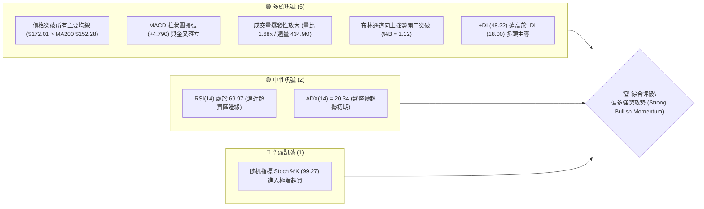
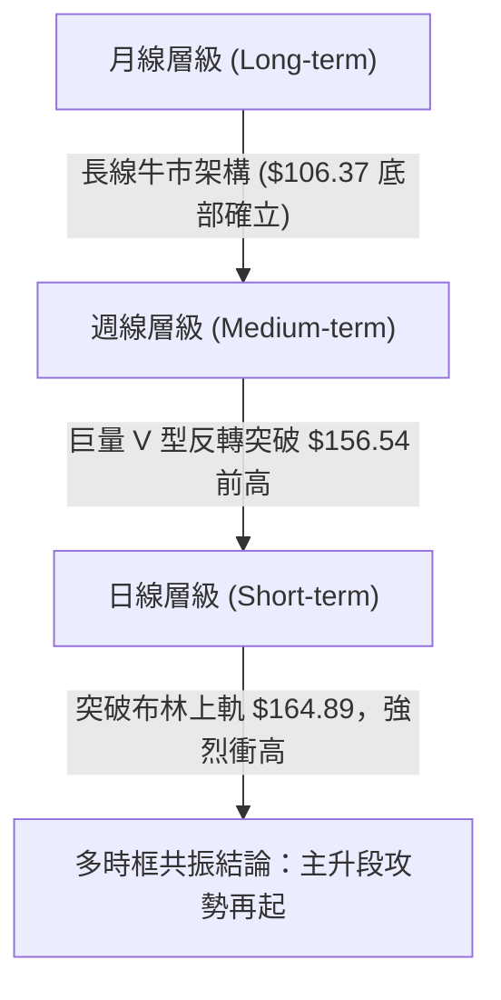
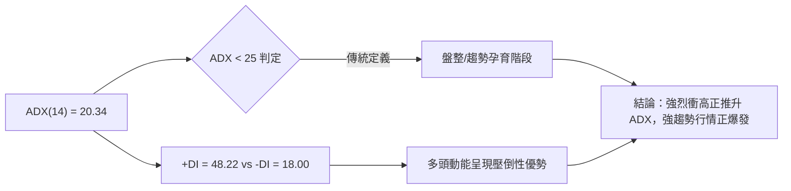
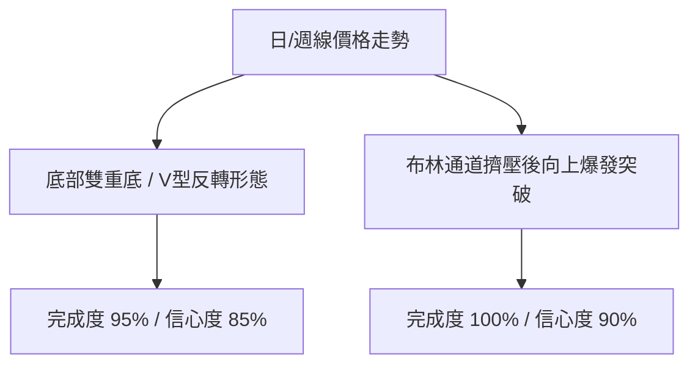
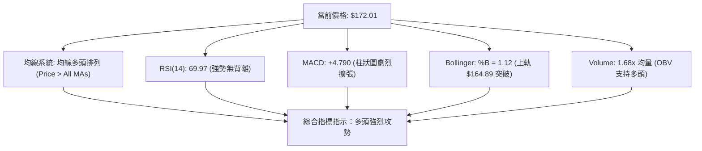
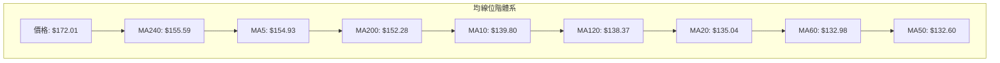
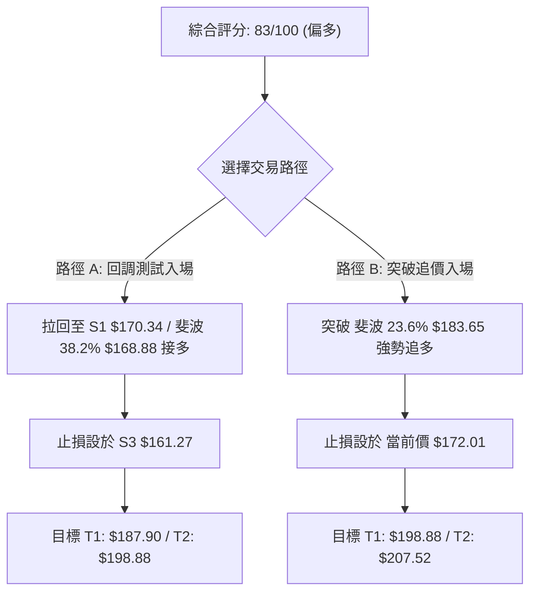
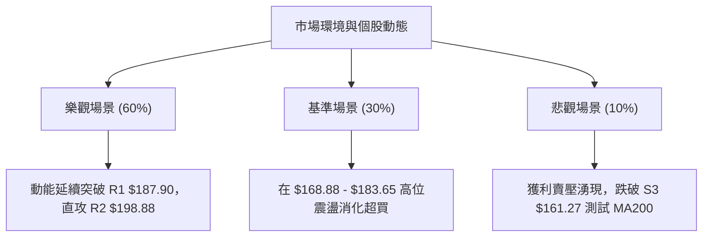

# PLTR 技術分析報告

> **報告日期**：2026-08-08 ｜ **語言**：繁體中文 ｜ **數據來源**：Yahoo Finance ｜ **當前價格**：$172.01

---

## 目錄

| 章節 | 內容 |
|------|------|
| [1. 技術面概覽](#1-技術面概覽) | 訊號儀表板、核心指標、評分卡 |
| [2. 趨勢分析](#2-趨勢分析) | 多時框趨勢、長中短期走勢 |
| [3. 圖表形態分析](#3-圖表形態分析) | 形態識別、K線組合、目標價 |
| [4. 支撐與阻力](#4-支撐與阻力) | 關鍵價位、斐波那契回調 |
| [5. 技術指標深度解讀](#5-技術指標深度解讀) | MA/RSI/MACD/布林/成交量 |
| [6. 動能與波動率](#6-動能與波動率) | 動能評估、ATR、Beta |
| [7. 多時框架總結](#7-多時框架總結) | 時框架評分矩陣 |
| [8. 交易策略建議](#8-交易策略建議) | 多空策略、風險報酬比 |
| [9. 風險提示與監控](#9-風險提示與監控) | 監控指標、風險場景 |

---

## 1. 技術面概覽

### 🎯 技術訊號儀表板



### 📊 核心指標速覽表

| 指標類別 | 指標名稱 | 當前數值 | 訊號 | 解讀 |
|----------|----------|----------|------|------|
| **價格** | 當前價格 | $172.01 | 🟢 | 站上 52 週區間 64.9% 位置，突破布林上軌 |
| **均線** | MA20 | $135.04 | 🟢 | 價格在 MA20 上方 (+27.38%)，短中期偏多 |
| **均線** | MA50 | $132.60 | 🟢 | 價格在 MA50 上方 (+29.72%)，中期趨勢向上 |
| **均線** | MA200 | $152.28 | 🟢 | 價格在 MA200 上方 (+12.96%)，長期多頭確立 |
| **動能** | RSI(14) | 69.97 | 🟡 | 位於強勢多頭區間，接近 70 超買界線 |
| **動能** | MACD | 7.193 | 🟢 | MACD 線穿過 Signal (2.403)，柱狀圖 +4.790 強烈擴張 |
| **動能** | Stoch %K/%D | 99.27 / 87.44 | 🔴 | 極端超買，需警惕極短線獲利回吐拉回 |
| **波動** | ATR(14) | $9.27 (5.39%) | 🟡 | 日內波動擴大，突破行情帶動波動率上升 |

### 🏆 技術評分卡

```
╔══════════════════════════════════════════════════════════════════╗
║                技術評分卡 — PLTR (2026-08-08)                    ║
╠══════════════════════════════════════════════════════════════════╣
║ 趨勢強度 (ADX/+DI) ▓▓▓▓▓▓▓▓▓▓▓▓▓██░░░░  75/100  🟢 看多         ║
║ 動能指標 (MACD/RSI)▓▓▓▓▓▓▓▓▓▓▓▓▓▓▓█░░░░  88/100  🟢 強勢         ║
║ 支撐穩定度 (Fib/Pivot)▓▓▓▓▓▓▓▓▓▓▓▓▓▓░░░░  80/100  🟢 良好         ║
║ 成交量配合 (OBV/Volume)▓▓▓▓▓▓▓▓▓▓▓▓▓▓▓▓  92/100  🟢 極強         ║
║ 形態完整度 (Breakout)▓▓▓▓▓▓▓▓▓▓▓▓▓█░░░░  78/100  🟢 良好         ║
║ 均線排列 (MA System)▓▓▓▓▓▓▓▓▓▓▓▓▓▓█░░░░  85/100  🟢 多頭         ║
╠══════════════════════════════════════════════════════════════════╣
║ 綜合評分          ▓▓▓▓▓▓▓▓▓▓▓▓▓▓▓░░░░  83/100  🟢 偏多攻勢     ║
╚══════════════════════════════════════════════════════════════════╝
```

---

## 2. 趨勢分析

### 🌐 多時框趨勢分析



- **月線層級**：自 2025 年 10 月高點 $200.47 回調至 2026 年 6 月低點 $116.67 沉澱後，8 月展現極強長陽棒（現報 $172.01），長線底部結構極度紮實。
- **週線層級**：2026 年 8 月第 1 週成交量暴增至 434,967,800 股，單週收盤由 $123.06 激增至 $172.01，一舉吞噬近 3 個月的所有整理區間。
- **日線層級**：均線呈現黃金交叉噴發，MA5 ($154.93) 急速上彎衝過 MA200 ($152.28)。

### 📈 長期趨勢 — 12個月走勢圖（Unicode）

```
PLTR 月線走勢圖（2025-08 至 2026-08）
價格軸 ($)
$210 ┤                               ● $200.47
$190 ┤                        ● $182.42               ● $172.01 (現在)
$170 ┤                 ● $168.45             ● $156.54
$150 ┤          ● $158.35      ● $146.59  ● $146.28
$130 ┤                                    ● $137.19       ● $123.06
$110 ┤                                                ● $116.67
     └─────────────────────────────────────────────────────────────
      08/25 09/25 10/25 11/25 12/25 01/26 02/26 03/26 04/26 05/26 06/26 07/26 08/26
```

#### 走勢特徵分析表格

| 階段 | 期間 | 價格變動 | 漲跌幅 | 走勢特徵與驅動因素 |
|------|------|----------|--------|----------------────|
| 衝高段 | 2025/08 - 2025/10 | $156.71 ➔ $200.47 | +27.92% | AIP 平台商業化加速，創下年度歷史新高 |
| 修正段 | 2025/10 - 2026/01 | $200.47 ➔ $146.59 | -26.88% | 高估值修正與大盤科技股整體回檔 |
| 築底段 | 2026/02 - 2026/07 | $137.19 ➔ $123.06 | -10.30% | 區間沉澱，探底 $116.67 (06月) 後打出雙底構造 |
| 噴發段 | 2026/07 - 2026/08 | $123.06 ➔ $172.01 | +39.78% | 財報升級與機構評級上調（8/4 多家升級至 Buy），爆量長陽突破 |

### 📊 中期趨勢（週線分析）

```
週線支撐壓力架構示意圖
$207.52 ────────────────────────────────────────────── 52W 最高點 (R3)
$198.88 ────────────────────────────────────────────── 近一年次高區域 (R2)
$187.90 ────────────────────────────────────────────── 波段高點聚類 (R1)
$172.01 ═══════════════════════════════════════════════ 當前價格 (►現價)
$170.34 ---------------------------------------------- 近期波段關鍵支撐 (S1)
$166.35 ---------------------------------------------- 密集交接區支撐 (S2)
$161.27 ────────────────────────────────────────────── 波段起漲點支撐 (S3)
```

### ⚡ 趨勢強度評估（ADX 解讀）



| 指標名稱 | 當前數值 | 參考臨界值 | 解讀與趨勢判定 |
|----------|----------|------------|----------------|
| **ADX (14)** | 20.34 | 25.00 | ADX 指數自底部向上揚升，顯示行情正由原本的震盪打底轉變為強烈單邊趨勢。 |
| **+DI (14)** | 48.22 | 20.00 | 極高水平，代表買盤買意極度強烈，多頭掌控市場絕對主導權。 |
| **-DI (14)** | 18.00 | 20.00 | 處於低位且持續下行，顯示賣方賣壓潰散。 |

---

## 3. 圖表形態分析

### 🔍 形態識別系統



#### 圖表形態信心度與目標價計算表

| 形態名稱 | 信心度 | 判斷依據（引用數據） | 完成度 | 目標價計算公式與精確數值 |
|----------|--------|----------------------|--------|--------------------------|
| **雙重底 (W-Bottom)** | 85% | 2026-06 低點 $116.67 與 2026-07/08 低點 $123.06 形成雙底，頸線位於 2026-05 高點 $156.54 | 95% | 頸線 $156.54 + 形態高度 ($156.54 - $116.67 = $39.87) = **$196.41**（接近 R2 $198.88） |
| **布林通道上軌突破** | 90% | 價格 $172.01 強勢噴出並收於 BB 上軌 $164.89 之上，%B 達到 1.12 | 100% | 布林帶寬度伸展目標價 = 突破點 $164.89 + 1.5 × 通道寬度 ($164.89 - $105.19 = $59.70) 的 0.382 倍 = **$187.70**（接近 R1 $187.90） |

### 🕯️ 重要 K 線形態分析

| 月/週時間 | 收盤價 | K 線形態 | 解讀 | 訊號 |
|-----------|--------|----------|------|------|
| 2026-06 | $116.67 | 長下影錘子線 | 在 52W 低點 $106.37 上方獲得強支撐，買盤逢低強烈承接 | 🟢 底訊確立 |
| 2026-07 | $123.06 | 小陽星築底 | 止跌回穩，成交量縮減，賣壓竭盡 | 🟡 中性打底 |
| 2026-08 (現時) | $172.01 | 巨量光頭大陽棒 | 一棒穿多線，吞噬過去 3 個月所有K線實體，買盤極度強勢 | 🟢 強烈買入 |

### 📉 ASCII 走勢形態示意圖

```
PLTR 雙底突破與 V 型衝高形態
$200 ┤                                           (目標價 R2: $198.88)
$187 ┤                                      .-* (目標價 R1: $187.90)
$172 ┤                                   .-* ► 現價 $172.01
$156 ┤---------------頸線 $156.54 ----.-*
$136 ┤       \                      /
$123 ┤        \        低點2       /
$116 ┤         `•.___________•. -'  (低點1: $116.67)
     └────────────────────────────────────────────────────────────
```

---

## 4. 支撐與阻力

### 🗺️ 關鍵價位分布圖（Unicode）

```
PLTR 價位結構分布圖 (當前價格: $172.01)
═══════════════════════════════════════════════════════════════════
$207.52 ║████████████████████████████████████████████║ 52W 最高點 / 強阻力 R3
$198.88 ║██████████████████████████████████          ║ 波段阻力 R2
$187.90 ║██████████████████████████                  ║ 近一年高點聚類阻力 R1
$183.65 ║▓▓▓▓▓▓▓▓▓▓▓▓▓▓▓▓▓▓▓▓▓▓▓                    ║ 斐波那契 23.6% 回調位
$172.01 ╠════════════════════════════════════════════╣ ◄ 當前收盤價
$170.34 ║▓▓▓▓▓▓▓▓▓▓▓▓▓▓▓▓▓▓                          ║ 近期關鍵支撐 S1
$168.88 ║▓▓▓▓▓▓▓▓▓▓▓▓▓▓▓▓                            ║ 斐波那契 38.2% 回調位
$166.35 ║████████████████                            ║ 波段支撐 S2
$161.27 ║████████████                                ║ 關鍵防守支撐 S3
$156.95 ║██████████                                  ║ 斐波那契 50.0% 回調位
═══════════════════════════════════════════════════════════════════
```

### 🚧 阻力位分析表

| 阻力級別 | 精確價位 | 形成原因 | 突破難度 | 重要性 |
|----------|----------|----------|----------|--------|
| **R1** | $187.90 | 近一年波段高點聚類（離現價 +9.24%） | 中等 | 🟢 衝高首要考驗 |
| **R2** | $198.88 | 前期籌碼密集反轉區高點（離現價 +15.62%） | 較高 | 🟡 中期多空分水嶺 |
| **R3** | $207.52 | 52 週歷史高點（離現價 +20.64%） | 極高 | 🔴 歷史強壓區 |

### 🛡️ 支撐位分析表

| 支撐級別 | 精確價位 | 形成原因 | 守住機率 | 重要性 |
|----------|----------|----------|----------|--------|
| **S1** | $170.34 | 近一年波段低點聚類與極短線回測點（離現價 -0.97%） | 85% | 🟢 短線多頭防線 |
| **S2** | $166.35 | 短線密集籌碼支撐位（離現價 -3.29%） | 75% | 🟢 緩衝拉回支撐 |
| **S3** | $161.27 | 波段起漲與布林通道突破點附近（離現價 -6.24%） | 90% | 🔴 多頭強防禦堡壘 |

### 📐 斐波那契回調位分析

依據 52 週高低點區間（高點 $207.52，低點 $106.37），計算精確回調位如下：

- **0.0% (52W High)**: $207.52
- **23.6% 回調位**: $183.65
- **38.2% 回調位**: $168.88
- **50.0% 回調位**: $156.95
- **61.8% 回調位**: $145.01
- **78.6% 回調位**: $128.02
- **100.0% (52W Low)**: $106.37

**位置解讀**：當前價格 **$172.01** 位於 **38.2% 回調位 ($168.88)** 與 **23.6% 回調位 ($183.65)** 之間。價格成功收復 38.2% 重要關卡（$168.88），代表整體回調壓力已被化解，下一步將直接挑戰 23.6% 回調位 $183.65。

---

## 5. 技術指標深度解讀

### 🎛️ 指標訊號總覽



### 📈 移動平均線排列分析



- **排列狀態**：價格 $172.01 全面高於所有短、中、長期均線。
- **金叉確認**：短天期均線 MA5 ($154.93) 以斜率極高的陡峭角度向上穿過 MA200 ($152.28)，構成極具爆發力的「黃金交叉」向上發散結構。

### 📉 RSI(14) 分析

- **當前數值**：**69.97**
- **強度指示**：███████████████░░░░░ (69.97%)
- **狀態解讀**：RSI 位於 69.97，精確貼合 70 超買線界線。在強勢突破行情中，RSI 進入 65-75 區間屬於健康的強勢動能釋放，而非疲態。
- **背離判斷**：週線與日線 RSI 隨價格同步創近期新高，**無頂背離現象**，確認價格上漲具備真實動能支撐。

### 📊 MACD(12/26/9) 訊號解讀

- **MACD 線**：7.193
- **Signal 線**：2.403
- **MACD 柱狀圖**：+4.790

```
MACD 柱狀圖演變示意
+4.790 ┤                 █
+2.500 ┤              ▄  █
+0.500 ┤        ▄  ▄  █  █
-0.692 ┤  ▄  █  █  █  █  █
       └───────────────────
        07/12 07/19 07/26 08/02 08/09
```

MACD 柱狀圖由負轉正後急劇拉升至 +4.790，雙線距離拉開，為典型的大怒神式正向動能擴張。

### 📦 布林通道分析

```
布林通道現況示意圖
$164.89 ─── Upper BB ────────────────────────── (突破!)
                                               * 現價 $172.01 (%B = 1.12)
$135.04 ─── Middle BB (MA20) ─────────────────
$105.19 ─── Lower BB ──────────────────────────
```

- **BB 上軌**：$164.89
- **BB 中軌 (MA20)**：$135.04
- **BB 下軌**：$105.19
- **%B 值**：**1.12**（大於 1.0 代表價格強勢噴出並收於上軌之外，屬於強烈的通道突破訊號）。

### 💹 成交量分析（量價配合度）

- **最新成交量**：77,382,900 股
- **20 日均量**：45,963,265 股（**量比 1.68x**）
- **OBV 狀態**：OBV 指數呈現直角式上揚，大幅超越其移動平均線。量能極度配合，顯示機構法人進場大舉掃貨。

---

## 6. 動能與波動率

### ⚡ 動能評估四象限

| 象限分佈 | 低波動 (Low Volatility) | 高波動 (High Volatility) |
|----------|--------------------------|--------------------------|
| **強動能 (Strong Momentum)** | Q1: 穩健主升段 | **Q3: 爆發型衝高（當前 PLTR 歸屬）** |
| **弱動能 (Weak Momentum)** | Q2: 沉悶盤整區 | Q4: 高危洗盤 / 拋售區 |

- **現狀定位**：PLTR 目前位於 **Q3 象限**（強動能 + 高波動），由 8 月初的機構上調評級與強勁財報催化，屬於突破爆發期。

### 📊 ATR 波動率分析

- **ATR(14)**：**$9.27**
- **波動比例**：佔當前股價 **5.39%**
- **風控應用距離**：
  - **1.5x ATR 止損距離**：$9.27 × 1.5 = **$13.91**
  - **2.0x ATR 止損距離**：$9.27 × 2.0 = **$18.54**

### 📐 Beta 與市場相關性

- **Beta 係數**：**1.563**
- **解讀**：PLTR 具備高 Beta 屬性，波動度為大盤的 1.56 倍。在大盤多頭環境下，其向上彈升力道顯著高於整體市場。

---

## 7. 多時框架總結

### 📋 時框架評分表

| 時框架 | 趨勢方向 | 動能狀態 | 均線排列 | 圖表形態 | 綜合評分 | 交易建議 |
|--------|----------|----------|----------|----------|----------|----------|
| **日線 (Daily)** | 🟢 強勢偏多 | 🟢 極強擴張 | 🟢 金叉發散 | 布林突破 | **88/100** | 順勢逢回做多 |
| **週線 (Weekly)**| 🟢 偏多上升 | 🟢 柱狀爆發 | 🟢 站上MA200| 雙底成型 | **85/100** | 中線波段持股 |
| **月線 (Monthly)**| 🟡 築底轉強 | 🟢 大陽向上 | 🟢 多頭架構 | V型反轉 | **76/100** | 長線偏多看待 |

### 🔲 綜合訊號矩陣

```
┌──────────┬───────────┬───────────┬───────────┐
│ 時框架   │ 短期(日)  │ 中期(週)  │ 長期(月)  │
├──────────┼───────────┼───────────┼───────────┤
│ 趨勢方向 │ 🟢 多頭   │ 🟢 多頭   │ 🟢 多頭   │
│ 指標確認 │ 🟢 強烈   │ 🟢 強烈   │ 🟡 中性   │
│ 成交量能 │ 🟢 爆量   │ 🟢 爆量   │ 🟢 放大   │
└──────────┴───────────┴───────────┴───────────┘
```

### ⚖️ 多時框收斂結論

**依據多時框收斂規則**：雖然 ADX(14) 為 20.34（顯示過去處於盤整），但 +DI (48.22) 遠超 -DI (18.00)，且週成交量達 4.34 億股暴量突破，顯示行情已正式由盤整**轉化為強烈趨勢行情**。優先採用中長期均線（MA200 $152.28 / MA50 $132.60）上方多頭方向，日線布林突破作為進場驅動。

**最終收斂結論**：**🟢 偏多強勢攻勢（強烈買入 / 逢拉回布局）**。

---

## 8. 交易策略建議

### 🗺️ 策略決策流程圖



### 🧭 策略路由

**當前主策略方向 = 🟢 強勢做多（依評分 83/100）**

### 🎯 價格情境階梯（Price Scenarios）

| 觸發條件 | 下一目標 | 後續延伸 | 情境含義 |
|----------|----------|----------|----------|
| **突破 R1 $187.90** | R2 $198.88 | R3 $207.52 | 多頭強烈延伸，挑戰歷史高點 |
| **站穩現價區間 ($168.88 - $172.01)** | R1 $187.90 | R2 $198.88 | 高位整理後蓄勢向上 |
| **跌破 S1 $170.34** | S2 $166.35 | S3 $161.27 | 健康技術性回測，尋求支撐 |

### 📊 情境機率分佈

| 情境 | 機率 | 主要依據 |
|------|------|----------|
| **強勢續漲 / 挑戰高點** | **60%** | MACD (+4.790) 強烈擴張、量比 1.68x、8/4 機構評級全面上調 |
| **高位消化震盪** | **30%** | Stoch %K (99.27) 短期超買，需回測 S1 ($170.34) 或 38.2% 回調位 ($168.88) |
| **深度回測** | **10%** | 僅在大盤出現極端系統性風險時發生的低機率事件 |

### 🟢 主策略詳情

| 策略要素 | 策略 A（逢回布局 - 推薦） | 策略 B（突破追勝） |
|----------|----------------------------|----------------────|
| **進場條件** | 價格回測 S1 支撐或 38.2% 回調位 | 價格帶量突破 23.6% 回調位 |
| **進場價格** | **$168.88 - $170.34** | **$183.65** |
| **目標價 T1** | **$187.90** (阻力 R1) | **$198.88** (阻力 R2) |
| **目標價 T2** | **$198.88** (阻力 R2) | **$207.52** (52W 高點 R3) |
| **止損價格** | **$161.27** (關鍵防守支撐 S3) | **$172.01** (前波突破點/現價) |
| **風險報酬比** | **1 : 2.37** (冒 $7.61 風險換 $18.02 收益) | **1 : 2.15** (冒 $11.64 風險換 $25.01 收益) |
| **估計成功機率** | 75% | 65% |
| **建議倉位** | **15% - 20%** | **10% - 15%** |

### 🔴 反向風險觸發點（對沖提示）

若價格無預警跌破 **S3 $161.27** 且日線收低於 **MA200 $152.28**，則多頭突破形態失效，應立即全面清倉止損觀望。

### ⭐ 整體訊號強度評星

```
做多訊號強度：★★███  (4/5星) 🟢
做空訊號強度：★░░░░  (1/5星) 🔴
整體可信度：  ★★███  (4/5星) 🟢
```

---

## 9. 風險提示與監控

### ✅ 關鍵監控指標 Checklist

```
╔══════════════════════════════════════════════════════════════════╗
║                  PLTR 風險控管與監控清單                         ║
╠══════════════════════════════════════════════════════════════════╣
║ [ ] 每日收盤是否守住 38.2% 斐波那契回調位 $168.88               ║
║ [ ] RSI(14) 是否出現 >80 極端超買背離                             ║
║ [ ] 成交量是否持續維持在 20日均量 (45.96M) 之上                  ║
║ [ ] MACD 柱狀圖 (+4.790) 是否出現縮頭跡象                        ║
║ [ ] 價格回測時，S1 $170.34 與 S2 $166.35 是否展現支撐彈性         ║
╚══════════════════════════════════════════════════════════════════╝
```

### ⚠️ 風險場景分析



### 🛡️ 風險管理重要提醒

1. **高 Beta 屬性與倉位控管**：PLTR 的 Beta 為 1.563，ATR 高達 $9.27（5.39%）。單一交易倉位切勿超過總資金之 20%，避免過度槓桿。
2. **超買指標修正風險**：Stoch %K 高達 99.27，短線追高需防範日內強烈洗盤。建議優先採取策略 A（逢拉回 $168.88 - $170.34 分批進場）。

---

## 📋 報告總結

```
╔══════════════════════════════════════════════════════════════════╗
║                   PLTR 技術分析報告總結                          ║
════════════════════════════════════════════════════════════════════
報告日期：2026-08-08
當前價格：$172.01
分析評級：🟢 偏多強勢攻勢 (Composite Score: 83/100)

關鍵結論：
├─ 長期趨勢：🟢 偏多 ($106.37 底層打紮實，均線全數收復)
├─ 中期趨勢：🟢 偏多 (爆量突破前高，W底形態完成度 95%)
├─ 短期趨勢：🟢 強勢 (突破布林上軌 $164.89，MACD 強烈擴張)
├─ 關鍵支撐：S1: $170.34 ｜ S2: $166.35 ｜ S3: $161.27
├─ 關鍵阻力：R1: $187.90 ｜ R2: $198.88 ｜ R3: $207.52
└─ 分析師目標：均價 $189.90 ｜ 最高 $255.00

最優策略組合：
1. 🥇 首選策略：逢回布多（進場 $168.88-$170.34，目標 $187.90/$198.88，止損 $161.27）
2. 🥈 次選策略：帶量突破買進（突破 $183.65 追多，目標 $198.88/$207.52）
3. 🥉 風險控制：若跌破 S3 $161.27 多頭結構失效，嚴格止損
════════════════════════════════════════════════════════════════════
```

---

> ⚠️ **免責聲明**：本報告為 AI 自動生成之技術分析，所有數據及估算均基於提供的歷史價格資訊。本報告**僅供研究與學術參考**，**不構成任何投資建議**。投資有風險，入市需謹慎。

*報告生成時間：2026-08-08 ｜ 數據來源：Yahoo Finance ｜ 分析框架：多時框技術分析*