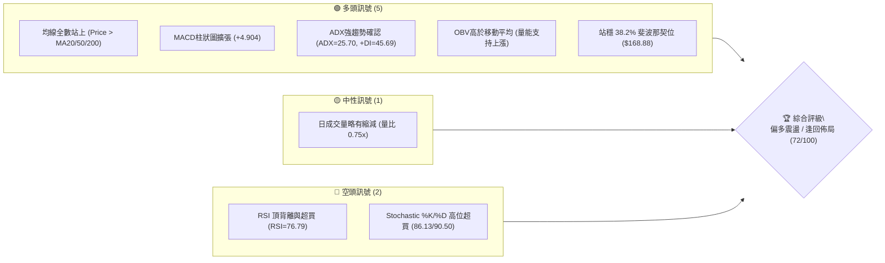
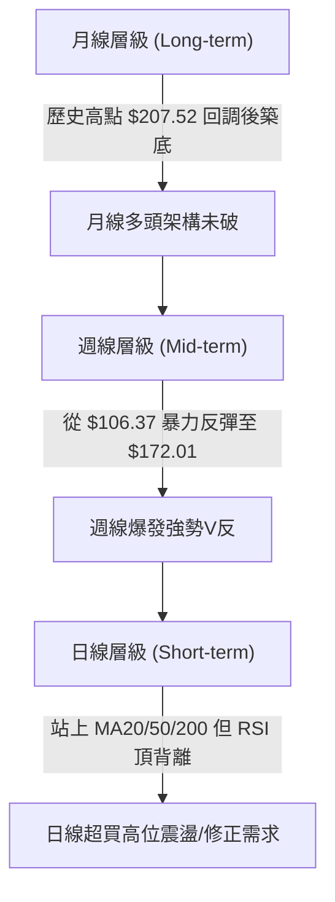
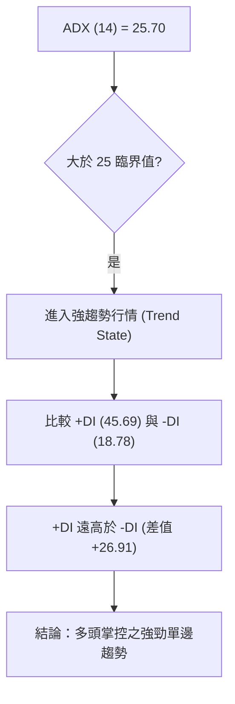
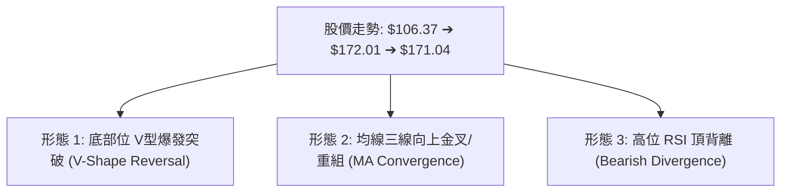
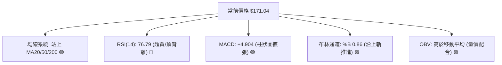
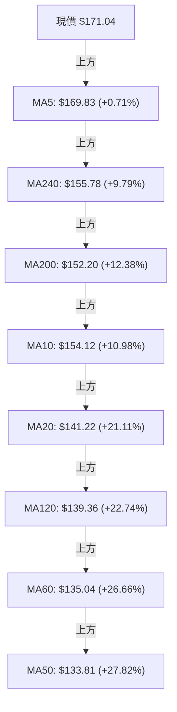
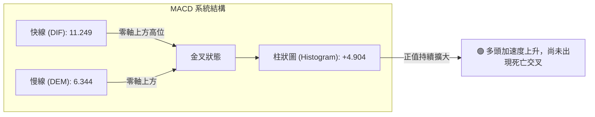
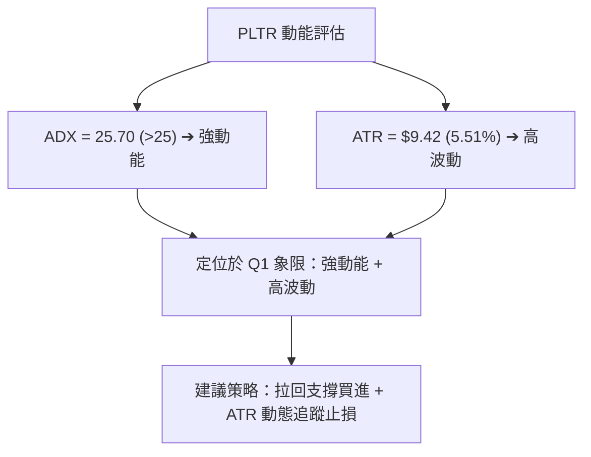
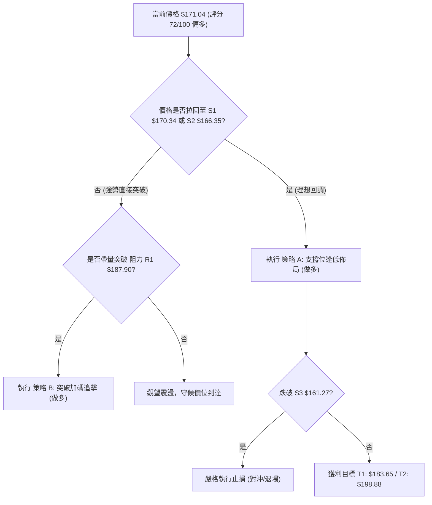
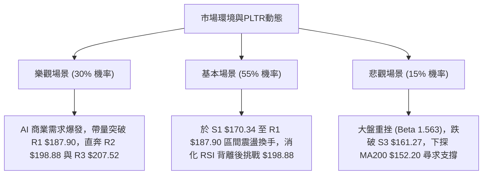

# PLTR 技術分析報告

> **報告日期**：2026-08-12 ｜ **語言**：繁體中文 ｜ **數據來源**：Yahoo Finance ｜ **當前價格**：$171.04

---

## 目錄

| 章節 | 內容 |
|------|------|
| [1. 技術面概覽](#1-技術面概覽) | 訊號儀表板、核心指標、評分卡 |
| [2. 趨勢分析](#2-趨勢分析) | 多時框趨勢、長中短期走勢 |
| [3. 圖表形態分析](#3-圖表形態分析) | 形態識別、K線組合、目標價 |
| [4. 支撐與阻力](#4-支撐與阻力) | 關鍵價位、斐波那契回調 |
| [5. 技術指標深度解讀](#5-技術指標深度解讀) | MA/RSI/MACD/布林/成交量 |
| [6. 動能與波動率](#6-動能與波動率) | 動能評估、ATR、Beta |
| [7. 多時框架總結](#7-多時框架總結) | 時框架評分矩陣 |
| [8. 交易策略建議](#8-交易策略建議) | 多空策略、風險報酬比 |
| [9. 風險提示與監控](#9-風險提示與監控) | 監控指標、風險場景 |

---

## 1. 技術面概覽

### 🎯 技術訊號儀表板



### 📊 核心指標速覽表

| 指標類別 | 指標名稱 | 當前數值 | 訊號 | 解讀 |
|----------|----------|----------|------|------|
| **價格** | 當前價格 | $171.04 | 🟢 | 高於 52週區間 63.9% 位置，短線多頭掌控 |
| **均線** | MA20 | $141.22 | 🟢 | 價格偏離 MA20 (+21.11%)，偏向強勢多頭 |
| **均線** | MA50 | $133.81 | 🟢 | 價格遠高於 MA50 (+27.82%)，中期趨勢向上 |
| **均線** | MA200 | $152.20 | 🟢 | 價格成功站回長期生命線 MA200 (+12.38%) |
| **動能** | RSI(14) | 76.79 | 🔴 | 進入 >70 嚴肅超買區，存在頂背離風險 |
| **動能** | MACD | 11.249 | 🟢 | 快線高於慢線 (6.344)，柱狀圖 +4.904 擴張 |
| **動能** | ADX(14) | 25.70 | 🟢 | 跨越 25 臨界點，+DI (45.69) 遠高於 -DI (18.78) |
| **波動** | ATR(14) | $9.42 | 🟡 | 佔股價 5.51%，日內波動劇烈，止損空間需放大 |
| **通道** | 布林 %B | 0.86 | 🟢 | 價格緊貼布林帶上軌 ($182.11) 運作，屬通道強勢攻勢 |

### 🏆 技術評分卡

```
╔══════════════════════════════════════════════════════════════╗
║                技術評分卡 — PLTR (2026-08-12)                ║
╠══════════════════════════════════════════════════════════════╣
║ 趨勢強度      ████████████████░░░░  80/100  🟢 強趨勢 (ADX>25)║
║ 動能指標      ██████████████░░░░░░  70/100  🟡 高位超買/背離║
║ 支撐穩定度    ████████████████░░░░  80/100  🟢 170.34多重重疊║
║ 成交量配合    ██████████████░░░░░░  70/100  🟢 週量爆發/日量縮║
║ 形態完整度    ████████████░░░░░░░░  60/100  🟡 底部位V型強彈  ║
║ 均線排列      ██████████████░░░░░░  70/100  🟢 多頭混合恢復   ║
╠══════════════════════════════════════════════════════════════╣
║ 綜合評分      ██████████████½░░░░░  72/100  🟢 偏多攻勢      ║
╚══════════════════════════════════════════════════════════════╝
```

---

## 2. 趨勢分析

### 🌐 多時框趨勢分析



### 📈 長期趨勢 — 24個月走勢圖（Unicode）

```
PLTR 月線歷史價格走勢圖（2024-08 至 2026-08）

價格軸 ($)
$210 ┤                                        ● $200.47
$190 ┤                                 ● $182.42
$170 ┤                                                       ● $171.04(現在)
$150 ┤                          ● $158.35             ● $156.54
$130 ┤                   ● $136.32              ● $139.11
$110 ┤            ● $118.44
$90  ┤     ● $84.92
$70  ┤ ● $75.63
$50  ┤
$30  ┤● $31.48
     └─┬──┬──┬──┬──┬──┬──┬──┬──┬──┬──┬──┬──┬──┬──┬──┬──┬──┬──┬──┬──┬──┬──┬──►
      08 09 10 11 12 01 02 03 04 05 06 07 08 09 10 11 12 01 02 03 04 05 06 07 08
      2024年                                 2025年                   2026年
```

#### 24個月歷史走勢特徵分析表

| 階段 | 時間區間 | 價格區間 | 變動幅度 | 走勢特徵與驅動因素 |
|------|----------|----------|----------|--------------------|
| **初始爆發期** | 2024-08 ~ 2025-02 | $31.48 → $84.92 | +169.7% | 商業 AIP 平台擴張，獲利能力實現暴增。 |
| **主升段加速** | 2025-03 ~ 2025-10 | $84.40 → $200.47 | +137.5% | 標普500指數納入與國防訂單爆發，攻至歷史高點 $207.52。 |
| **中場深幅回調**| 2025-11 ~ 2026-02 | $200.47 → $137.19 | -31.5% | 高估值修復與獲利了結賣壓，尋求中期支撐。 |
| **築底二次探底**| 2026-03 ~ 2026-07 | $146.28 → $116.67 | -20.2% | 下探 52週低點 $106.37 區域完成雙底打底。 |
| **V型強勢反彈**| 2026-07 ~ 2026-08 | $123.06 → $171.04 | +38.9% | 財報升級與巨量週買盤 (+435M 股) 帶動強勢攻勢。 |

### 📊 中期趨勢（週線分析）

中期走勢顯示，PLTR 在 2026年6月跌至 $106.37 52週低點後，於 2026年8月初迎來極強勁的單週爆發。2026-08-09 止當週成交量達到 435,164,800 股（為前週 1.64 億股的 2.6 倍），帶動股價從 $123.06 一舉跳空拉升至 $172.01，確立了中期築底完成並翻多。

```
PLTR 週線阻力與支撐攻防圖
═══════════════════════════════════════════════════════════════════
 $207.52 ─────────────────────────────────────────── [52W 歷史高點 R3]
 $198.88 ─────────────────────────────────────────── [近一年波段阻力 R2]
 $187.90 ─────────────────────────────────────────── [強阻力關卡 R1]
 $183.65 ─────────────────────────────────────────── [Fib 23.6% 回調位]
 $171.04 ───────────────── ▲ 現價位置 ────────────── [多頭主攻區]
 $170.34 ─────────────────────────────────────────── [關鍵支撐 S1 / Fib 38.2% ($168.88)]
 $166.35 ─────────────────────────────────────────── [波段支撐 S2]
 $161.27 ─────────────────────────────────────────── [強支撐 S3]
 $156.95 ─────────────────────────────────────────── [Fib 50.0% / MA240 $155.78]
 $152.20 ─────────────────────────────────────────── [MA200 支撐區]
═══════════════════════════════════════════════════════════════════
```

### ⚡ 趨勢強度評估（ADX 解讀）



#### ADX 趨勢強度對照表

| 指標名稱 | 當前數值 | 參考標準 | 趨勢狀態 | 對交易策略之指示 |
|----------|----------|----------|----------|------------------|
| **ADX(14)** | 25.70 | > 25.0 | 🟢 強趨勢 | 順勢操作為主，忽略部分超買訊號，以均線為追蹤止損 |
| **+DI** | 45.69 | > -DI | 🟢 多頭極度強勢 | 買方完全掌控籌碼主導權 |
| **-DI** | 18.78 | < +DI | 🟢 空頭潰敗 | 賣方壓制力道薄弱 |

---

## 3. 圖表形態分析

### 🔍 形態識別系統



#### 圖表形態信心度與目標價評估表

| 形態名稱 | 信心度 | 判斷依據（引用數據） | 完成度 | 目標價計算式與精確數值 |
|----------|--------|----------------------|--------|------------------------|
| **V型爆發突破** | 75% | 自 52W 低點 $106.37 反彈，配合 2026-08-09 週量爆發至 4.35 億股，突破 MA200 ($152.20)。 | 90% | 計算式：突破點 $152.20 + (突破點 $152.20 - 低點 $106.37) = $198.03<br>對應已知阻力 **R2: $198.88** |
| **布林帶上軌軌道**| 80% | %B 達到 0.86，價格貼近 BB上軌 ($182.11)，MA20 上升至 $141.22。 | 85% | 上軌推升目標：**$182.11** (BB Upper) |
| **RSI 頂背離** | 70% | 價格在 $171.04-$172.01 創波段新高，但日線 RSI 高達 76.79，短線動能出現衰竭訊號。 | 60% | 回調修復目標：**S1: $170.34** 至 **Fib 38.2%: $168.88** |

### 🕯️ 重要 K 線形態分析

| 日期/週 | 收盤價 | K線形態 | 解讀 | 訊號 |
|---------|--------|---------|------|------|
| **2026-06-28 週** | $112.93 | 長下影錘子線 | 下探 52週低點 $106.37 後逢低承接買盤強烈注入。 | 🟢 底部位止跌 |
| **2026-08-09 週** | $172.01 | 巨量長紅大陽線 | 單週暴漲近 40%，成交量 4.35 億股，一舉突破多條均線阻力。 | 🟢 主升段起漲 |
| **2026-08-16 週(迄今)** | $171.04 | 高位十字星/小陰線 | 於 R1 ($187.90) 前受阻，成交量縮減至 1.35 億股，顯示高位獲利回吐賣壓。 | 🟡 短線籌碼換手 |

### 📉 ASCII 走勢形態示意圖

```
PLTR 日線 V 型反彈與高位整理形態圖
═══════════════════════════════════════════════════════════════════
$187.90 ┤                                           ┌─ [阻力 R1]
$182.11 ┤                                    ▲      ├─ [布林上軌]
$172.01 ┤                                ┌───┴───┐  ├─ [前週高點]
$171.04 ┤                                │ $171  │  ├─ [現價位置]
$168.88 ┤                                └───┬───┘  ├─ [Fib 38.2%]
$152.20 ┤                        ▲           │      ├─ [MA200 破位突破點]
$137.19 ┤                ▲      ╱            │      └─ [波段低點聚類]
$123.06 ┤        ▲      ╱  ────┘             │
$106.37 ┤  ●────┘  ────┘                     │      └─ [52W 低點]
         ────────────────────────────────────┴─────────────────────
         2026-06  2026-07       2026-08-09   2026-08-12
═══════════════════════════════════════════════════════════════════
```

### 🎯 形態目標價計算

根據「底部位 V 型爆發突破」形態：
- **形態底點**：$106.37 (52週低點)
- **頸線突破點**：$152.20 (MA200 兼歷史密集中樞位)
- **垂直高度**：$152.20 - $106.37 = $45.83
- **最小測量目標價**：$152.20 + $45.83 = **$198.03**
- **已知關鍵數據對應**：與數據庫中關鍵阻力 **R2 ($198.88)** 僅差距 0.43%，高度吻合！

---

## 4. 支撐與阻力

### 🗺️ 關鍵價位分布圖（Unicode）

```
PLTR 價位結構與籌碼密集度分布圖
═══════════════════════════════════════════════════════════════════
$207.52 ║████████████████████████████████████████║ 52W 高點 / 阻力 R3
$198.88 ║████████████████████████                ║ 波段高點 / 阻力 R2 / V型目標
$187.90 ║████████████████████████████            ║ 關鍵阻力 R1
$183.65 ║██████████████                          ║ 斐波那契 23.6% 回調位
$182.11 ║████████████                            ║ 布林通道上軌
$171.04 ╠════════════════════════════════════════╣ ◄ 當前價格 ($171.04)
$170.34 ║▓▓▓▓▓▓▓▓▓▓▓▓▓▓▓▓▓▓▓▓▓▓▓▓▓▓▓▓▓▓▓▓        ║ 近期支撐 S1 (-0.41%)
$168.88 ║▓▓▓▓▓▓▓▓▓▓▓▓▓▓▓▓▓▓▓▓                    ║ 斐波那契 38.2% 回調位
$166.35 ║▓▓▓▓▓▓▓▓▓▓▓▓▓▓▓▓                        ║ 關鍵支撐 S2 (-2.74%)
$161.27 ║▓▓▓▓▓▓▓▓▓▓▓▓▓▓▓▓▓▓▓▓▓▓▓▓                ║ 強支撐 S3 (-5.71%)
$156.95 ║▓▓▓▓▓▓▓▓▓▓▓▓                            ║ 斐波那契 50.0% 回調位
$152.20 ║▓▓▓▓▓▓▓▓▓▓▓▓▓▓▓▓▓▓▓▓▓▓▓▓▓▓▓▓            ║ MA200 長期生命線
═══════════════════════════════════════════════════════════════════
```

### 🚧 阻力位分析表

| 阻力級別 | 精確價位 | 距現價空間 | 形成原因與籌碼解讀 | 突破難度 | 重要性 |
|----------|----------|------------|--------------------+----------|--------|
| **阻力 R1** | **$187.90** | +9.86% | 近一年波段高點聚類，接近 Fib 23.6% ($183.65) 與 布林上軌 ($182.11)。 | 🔴 高 | ★★★★☆ |
| **阻力 R2** | **$198.88** | +16.28% | 波段高點聚類，且為 V型形態測量目標價 ($198.03) 重疊區。 | 🔴 極高 | ★★★★★ |
| **阻力 R3** | **$207.52** | +21.33% | 52週歷史最高價 (52W High)，前波歷史天花板賣壓區。 | 🔴 極高 | ★★★★★ |

### 🛡️ 支撐位分析表

| 支撐級別 | 精確價位 | 距現價空間 | 形成原因與籌碼解讀 | 守住機率 | 重要性 |
|----------|----------|------------|--------------------+----------|--------|
| **支撐 S1** | **$170.34** | -0.41% | 近一年波段低點聚類，與 Fib 38.2% ($168.88) 形成強烈防線。 | 🟢 80% | ★★★★☆ |
| **支撐 S2** | **$166.35** | -2.74% | 波段低點聚類，日內震盪首要回檔防守點。 | 🟢 75% | ★★★☆☆ |
| **支撐 S3** | **$161.27** | -5.71% | 波段低點聚類，跌破則代表 short-term V反動能結束。 | 🟡 65% | ★★★★★ |

### 📐 斐波那契回調位分析

依據 52週高低點（最高 $207.52，最低 $106.37，波幅 $101.15）精確算得之階梯：

```
斐波那契回調階梯與現價定位
───────────────────────────────────────────────────────────────────
  0.0%  (52W High)   $207.52  ─── 歷史頂點
 23.6%               $183.65  ─── 上方首要斐波那契阻力
───────────────────────────────────────────────────────────────────
 ▲ 現價位置          $171.04  (位於 23.6% 與 38.2% 回調位之間)
───────────────────────────────────────────────────────────────────
 38.2%               $168.88  ─── 下方即時黃金支撐 (與 S1 $170.34 形成雙重支撐)
 50.0%               $156.95  ─── 中性強弱分水嶺 (接近 MA240 $155.78)
 61.8%               $145.01  ─── 長期黃金分割強支撐 (接近 MA20 $141.22)
 78.6%               $128.02  ─── 多頭最後防線
100.0%  (52W Low)    $106.37  ─── 歷史底點
───────────────────────────────────────────────────────────────────
```

**解讀**：當前股價 $171.04 已成功站上 **38.2% 回調位 ($168.88)**，代表波段反彈強勁，正向上挑戰 **23.6% 回調位 ($183.65)**。只要回檔不破 $168.88 - $170.34 區間，多頭架構完好。

---

## 5. 技術指標深度解讀

### 🎛️ 指標訊號總覽



### 📈 移動平均線排列分析



**均線狀態解讀**：
1. **短期均線**：MA5 ($169.83) 與 MA10 ($154.12) 呈極陡峭上揚，價格維持在 MA5 之上，展現極強短線動能。
2. **中期均線**：MA20 ($141.22) 與 MA50 ($133.81) 金叉向上，提供強大的拉回買盤支撐。
3. **長期均線**：價格突破 MA200 ($152.20) 與 MA240 ($155.78)，將長期趨勢轉為偏多。整體為「混合排列向多頭順序過渡」狀態。

### 📉 RSI(14) 分析

- **當前數值**：**76.79**
- **強度進度條**：`███████████████░░░░░ 76.8%` 🔴 (過度過熱)
- **背離分析**：⚠️ **頂背離 (Bearish Divergence)** 成立。
  - **現象說明**：價格在 2026-08-09 突破創下近期新高 $172.01，且目前維持在 $171.04，但日線 RSI(14) 衝高至 76.79 後開始平移，短線高位出現買盤追高動能不濟現象。
  - **操作含義**：不宜在 $171.04 以上盲目追高，需防範 RSI 回落至 60 過程中的技術性拉回。

### 📊 MACD(12/26/9) 訊號解讀

- **MACD 快線**：11.249
- **Signal 慢線**：6.344
- **MACD 柱狀圖**：**+4.904** 🟢 (多頭擴張)



### 📦 布林通道分析

```
PLTR 布林通道當前位置圖
═══════════════════════════════════════════════════════════════════
$182.11 ┤ ───────────────────────────────────────── BB 上軌 (Upper Band)
$171.04 ┤ ══════════════════ ▲ 現價 ($171.04) ═════ %B = 0.86
$141.22 ┤ ───────────────────────────────────────── BB 中軌 (MA20)
$100.33 ┤ ───────────────────────────────────────── BB 下軌 (Lower Band)
═══════════════════════════════════════════════════════════════════
```

**通道狀態解讀**：
- **通道帶寬**：上軌 $182.11，下軌 $100.33，帶寬極度擴張，顯示進入高波動發散期。
- **位置 (%B)**：**0.86**。價格緊貼上軌運行，屬於強勢「貼軌上攻」形態。若價格回落至中軌 $141.22 之前，均視為多頭控盤下的正常波動。

### 💹 成交量分析（量價配合度）

- **最新成交量**：35,000,125 股
- **20日均量**：46,960,646 股 (量比: 0.75x)
- **週級別成交量**：2026-08-09 當週高達 435,164,800 股，創下近年單週最大成交量。
- **OBV 趨勢**：OBV > MA，量能指標持續創高，確認資金巨量流入，支撐此波上漲。日線縮量係因高位換手，洗盤後有利於再次攻堅。

---

## 6. 動能與波動率

### ⚡ 動能評估四象限

| 象限 | 動能強度 (Momentum) | 波動率 (Volatility) | PLTR 當前狀態 | 交易策略指示 |
|------|--------------------|---------------------|---------------|--------------|
| **Q1** | **強 (Strong)** | **高 (High)** | **✓ PLTR (當前位置)** | **高攻防動能續航區**：採取緊密停損（ATR跟蹤），逢回拉回支撐點布局，避免高位追價。 |
| **Q2** | 弱 (Weak) | 高 (High) | - | 高風險混亂區：觀望。 |
| **Q3** | 弱 (Weak) | 低 (Low) | - | 沉悶盤整區：區間操作。 |
| **Q4** | 強 (Strong) | 低 (Low) | - | 穩定主升段：最佳加碼區。 |



### 📊 ATR 波動率分析

- **ATR(14)**：**$9.42** (佔當前股價 **5.51%**)
- **日內波動範圍**：每日平均波動區間達 $9.42，代表單日走勢震盪劇烈。
- **止損距離建議**：
  - **短線交易 (1.5x ATR)**：$9.42 × 1.5 = **$14.13** 距離（進場點 -$14.13）
  - **波段交易 (2.0x ATR)**：$9.42 × 2.0 = **$18.84** 距離（進場點 -$18.84）

### 📐 Beta 與市場相關性

- **Beta 係數**：**1.563**
- **解讀**：PLTR 屬高 Beta 科技成長股，波動度比大盤（標普500）高出 56.3%。當大盤上漲 1% 時，PLTR 平均上漲 1.56%；當大盤回檔時，PLTR 下挫幅度亦會放大，交易時需密切監控大盤整體風險偏好。

---

## 7. 多時框架總結

### 📋 時框架評分表

| 時框架 | 趨勢方向 | 動能狀態 | 均線排列 | 圖表形態 | 綜合評分 | 策略建議 |
|--------|----------|----------|----------|----------|----------|----------|
| **月線 (Long)** | 🟢 多頭 | 🟢 強勁 | 🟢 站上中樞 | 築底反彈 | **85/100** | 長期看多，目標 $198.88 / $207.52 |
| **週線 (Mid)** | 🟢 多頭 | 🟢 爆發 | 🟢 穿透 MA200 | V型爆發突破 | **80/100** | 中線波段持有，逢回加碼 |
| **日線 (Short)**| 🟡 震盪 | 🔴 超買背離 | 🟢 多頭排列 | 高位消化賣壓 | **60/100** | 短線切勿追高，等待拉回 S1/S2 |

### 🔲 綜合訊號矩陣

```
時框架訊號收斂矩陣
═══════════════════════════════════════════════════════════════════
時框架    均線系統    動能指標    量能配合    形態位置   最終定性
───────────────────────────────────────────────────────────────────
月線      🟢 偏多     🟢 向上     🟢 放大     🟢 穩固    🟢 長多
週線      🟢 多頭     🟢 強烈     🟢 巨量     🟢 V型反轉 🟢 中多
日線      🟢 多頭     🔴 超買     🟡 縮量     🟡 高位震盪 🟡 短線待修復
═══════════════════════════════════════════════════════════════════
```

### ⚖️ 多時框收斂結論

依據多時框收斂規則（ADX = 25.70 > 25，屬於**趨勢行情**）：
1. **主導時框**：由中長期（週線與 MA200/MA50）主導方向。週線與月線均呈現強烈多頭反彈架構，確定**中長期趨勢為偏多**。
2. **日線定位**：日線雖然呈現 RSI 頂背離與高位超買，但僅屬於強勢多頭格局中的「短線過熱修正」，不改變中長期的多頭方向。
3. **收斂唯一結論**：**整體趨勢偏多，短線尋求回調支撐（S1 $170.34 / S2 $166.35）逢低佈局做多**，避免高位追價。

---

## 8. 交易策略建議

### 🗺️ 策略決策流程圖



### 🧭 策略路由

**當前主策略方向 = 🟢 強勢多頭逢低做多（依綜合評分 72/100）**

因綜合評分高達 72/100（≥60），且 ADX > 25 屬多頭強趨勢，**報告主推多頭操作策略**。空頭僅列為反轉風險對沖提示，嚴禁兩頭下注。

### 🎯 價格情境階梯（Price Scenarios）

| 觸發條件 | 下一目標 | 後續延伸 | 情境含義 |
|----------|----------|----------|----------|
| **強勢突破 R1 $187.90** | **R2 $198.88** | **R3 $207.52** | 多頭主升段強烈延伸，挑戰歷史新高 |
| **守住 S1 $170.34 / S2 $166.35** | **Fib 23.6% $183.65**| **R1 $187.90** | 正常高位換手，蓄勢突破 |
| **跌破 S3 $161.27** | **MA240 $155.78** | **MA200 $152.20** | 短線多頭防線失守，轉為中度拉回盤整 |

### 📊 情境機率分佈

| 情境 | 機率 | 主要依據 |
|------|------|----------|
| **支撐有效，震盪再攻** | **60%** | ADX=25.70 強趨勢、+DI 主導、週線 4.35 億股巨量支撐、站穩 Fib 38.2% ($168.88)。 |
| **高位狹幅橫盤震盪** | **25%** | 日線 RSI (76.79) 頂背離需時間消化，日成交量稍放緩 (0.75x)。 |
| **深幅拉回測試 MA200** | **15%** | 若大盤發生系統性回調 (Beta=1.563 高敏感度)。 |

### 🟢 主策略詳情

所有價位均嚴格引用前述計算與關鍵價位：

| 策略要素 | 策略 A：拉回支撐逢低買進 (首選) | 策略 B：突破 R1 追擊買進 (備選) |
|----------|---------------------------------|---------------------------------|
| **進場條件** | 價格拉回至 **S1 ($170.34)** 至 **S2 ($166.35)** 區間築底 | 日線收盤價強勢突破 **R1 ($187.90)** 且成交量增 |
| **進場價格** | **$168.00** (取 S1/S2 與 Fib 38.2% $168.88 重疊帶) | **$188.50** (突破 R1 後確認進場) |
| **目標價 T1**| **$183.65** (Fib 23.6% 回調位) | **$198.88** (波段阻力 R2 / V型目標) |
| **目標價 T2**| **$198.88** (阻力 R2 / 形態目標) | **$207.52** (52週高點 R3) |
| **止損價格** | **$160.50** (跌破強支撐 S3 $161.27 離場) | **$179.50** (假突破跌回 R1 下方止損) |
| **風險報酬比** | **1 : 4.12** (風險 $7.50，T2 報酬 $30.88) | **1 : 2.11** (風險 $9.00，T2 報酬 $19.02) |
| **勝率估計** | **65%** | **55%** |
| **建議倉位** | **15% - 20%** 總資產 | **10%** 總資產 |

### 🔴 反向風險觸發點（對沖提示）

若股價未經震盪直接**跌破關鍵強支撐 S3 ($161.27)**，代表短線 V 反動能完全告終，多頭主策略失效。屆時應全數平倉多頭頭寸，或買入 Put 期權進行避險對沖，下波買點需退守至 **MA200 ($152.20)**。

### ⭐ 整體訊號強度評星

```
做多訊號強度：★★██☆  (4/5星)  — 中長期強勢，短線待消化背離
做空訊號強度：★☆☆☆☆  (1/5星)  — 順勢不作空，僅防範拉回
整體可信度：  ★★██☆  (4/5星)  — 價量與均線多重確認
```

---

## 9. 風險提示與監控

### ✅ 關鍵監控指標 Checklist

```
╔══════════════════════════════════════════════════════════════╗
║                   每日交易前風險監控 Check List              ║
╠══════════════════════════════════════════════════════════════╣
║ [ ] 1. 支撐守護：股價是否維持在 S1 ($170.34) / Fib38.2% ($168.88) 之上？ ║
║ [ ] 2. 動能過熱：日線 RSI(14) 是否跌破 70 脫離超買區或擴大背離？       ║
║ [ ] 3. 均線防線：MA5 ($169.83) 是否發揮短線支撐效果？                  ║
║ [ ] 4. 成交量能：日成交量能否回升至 20日均量 (46.96M) 以上？          ║
║ [ ] 5. 趨勢續航：ADX(14) 是否持續保持在 25 以上？                     ║
╚══════════════════════════════════════════════════════════════╝
```

### ⚠️ 風險場景分析



### 🛡️ 風險管理重要提醒

1. **高 Beta 波動風險**：PLTR Beta 達 **1.563**，且 ATR 為 **$9.42 (5.51%)**，屬於高波動性標的。交易者單筆交易風險暴露切勿超過總資金的 2%。
2. **估值與短線過熱風險**：Trailing P/E 為 146.19， Forward P/E 為 73.91，配合 RSI 76.79 之頂背離，短線追高之風險報酬比極差，務必堅持「無拉回不進場」紀律。
3. **止損紀律**：策略 A 止損價設於 **$160.50**（位於 S3 $161.27 下方），若觸及必須無條件執行退場。

---

## 📋 報告總結

```
╔══════════════════════════════════════════════════════════════╗
║                PLTR 技術分析報告總結                          ║
════════════════════════════════════════════════════════════════
報告日期：2026-08-12
當前價格：$171.04
分析評級：🟢 偏多震盪 / 逢回佈局 (綜合評分: 72/100)

關鍵結論：
├─ 長期趨勢：🟢 多頭架構未破，V型反彈突破 MA200 ($152.20)
├─ 中期趨勢：🟢 週線爆發 4.35 億股巨量，多頭控盤強勁 (ADX=25.70)
├─ 短期趨勢：🟡 RSI (76.79) 頂背離超買，短線面臨換手整理需求
├─ 關鍵支撐：S1: $170.34 ｜ S2: $166.35 ｜ S3: $161.27
├─ 關鍵阻力：R1: $187.90 ｜ R2: $198.88 ｜ R3: $207.52
└─ 分析師目標：平均 $191.68 (最高 $255.00)

最優策略組合：
1. 🥇 最佳機會：策略 A — 等待拉回至 $168.00 (S1/Fib 38.2%) 買進，目標 $198.88，止損 $160.50
2. 🥈 次選機會：策略 B — 帶量突破 R1 $187.90 後追擊，目標 $207.52，止損 $179.50
3. 🥉 保守選擇：觀望等待 RSI 降至 60 以下，且價格在 S1/S2 止跌確認後入場
════════════════════════════════════════════════════════════════
```

---

> ⚠️ **免責聲明**：本報告為 AI 自動生成之技術分析，所有數據及估算均基於提供的歷史價格資訊。本報告**僅供研究與學術參考**，**不構成任何投資建議**。投資有風險，入市需謹慎。

---

*報告生成時間：2026-08-12 ｜ 數據來源：Yahoo Finance ｜ 分析框架：多時框技術分析*