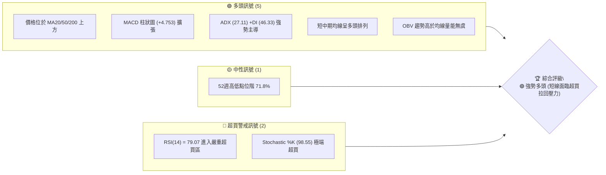
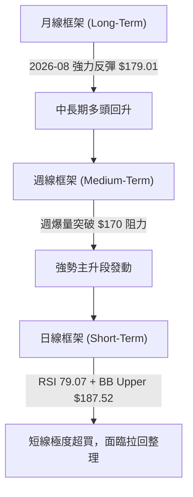
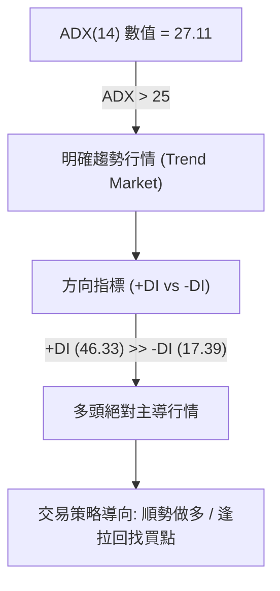
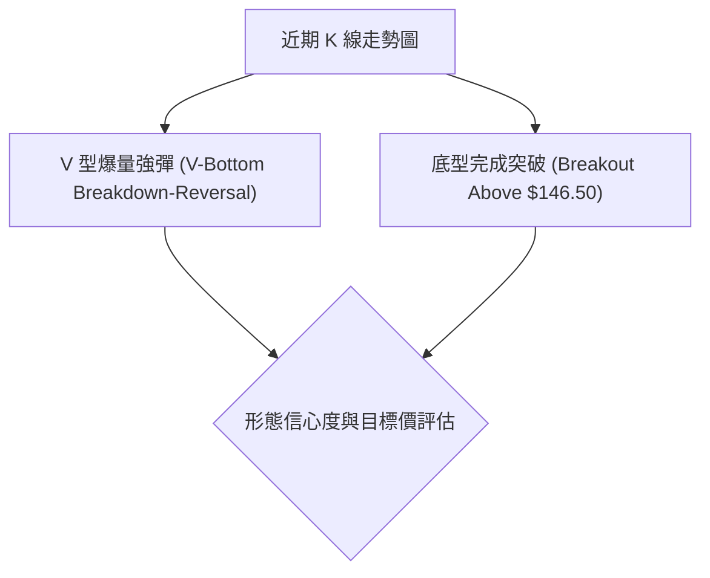
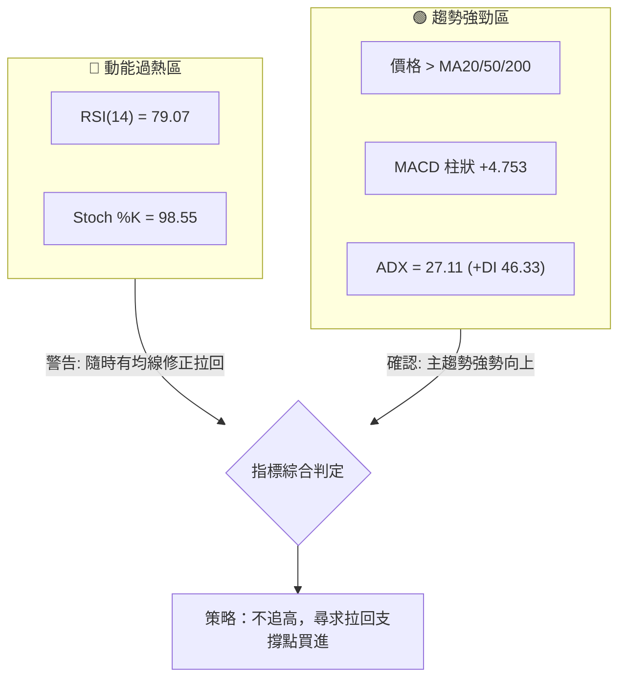
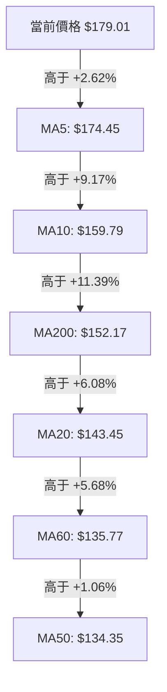
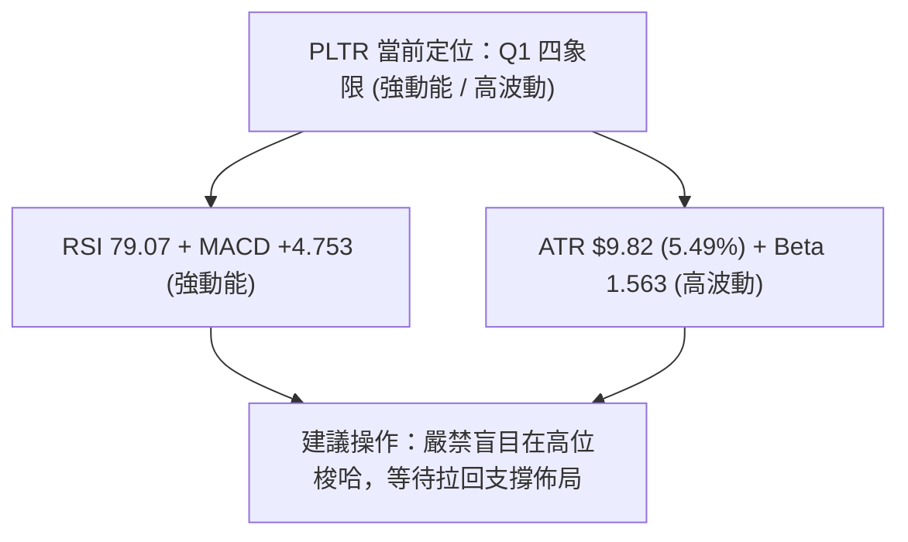
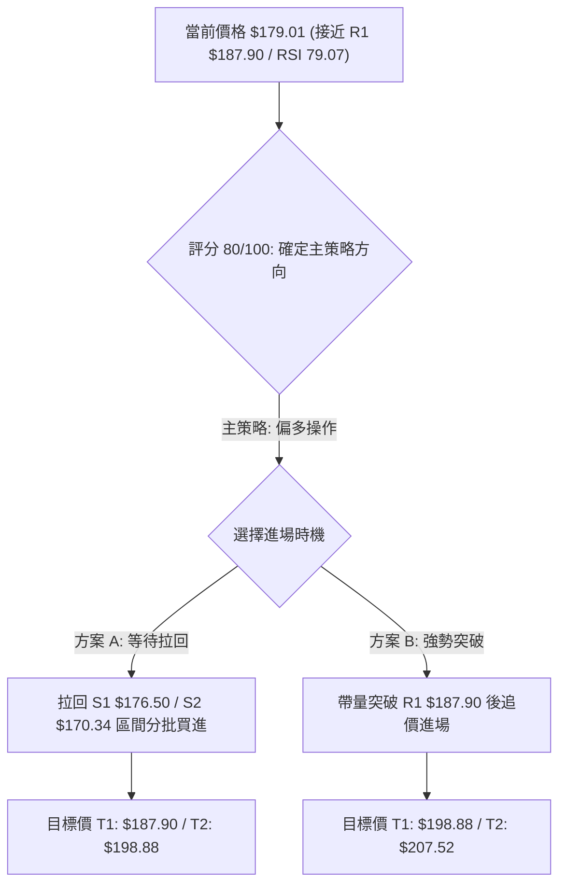
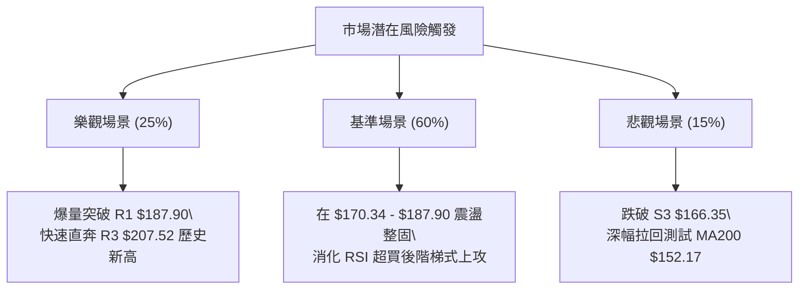

# PLTR 技術分析報告

> **報告日期**：2026-08-13 ｜ **語言**：繁體中文 ｜ **數據來源**：Yahoo Finance ｜ **當前價格**：$179.01

---

## 目錄

| 章節 | 內容 |
|------|------|
| [1. 技術面概覽](#1-技術面概覽) | 訊號儀表板、核心指標、評分卡 |
| [2. 趨勢分析](#2-趨勢分析) | 多時框趨勢、長中短期走勢 |
| [3. 圖表形態分析](#3-圖表形態分析) | 形態識別、K線組合、目標價 |
| [4. 支撐與阻力](#4-支撐與阻力) | 關鍵價位、斐波那契回調 |
| [5. 技術指標深度解讀](#5-技術指標深度解讀) | MA/RSI/MACD/布林/成交量 |
| [6. 動能與波動率](#6-動能與波動率) | 動能評估、ATR、Beta |
| [7. 多時框架總結](#7-多時框架總結) | 時框架評分矩陣 |
| [8. 交易策略建議](#8-交易策略建議) | 多空策略、風險報酬比 |
| [9. 風險提示與監控](#9-風險提示與監控) | 監控指標、風險場景 |

---

## 1. 技術面概覽

### 🎯 技術訊號儀表板



### 📊 核心指標速覽表

| 指標類別 | 指標名稱 | 當前數值 | 訊號 | 解讀 |
|----------|----------|----------|------|------|
| **價格** | 當前價格 | $179.01 | 🟢 | 近期強勢暴漲，位於 52 週區間 71.8% |
| **均線** | MA20 | $143.45 | 🟢 | 價格在高於 MA20 +24.79% 位置，偏離過大 |
| **均線** | MA50 | $134.35 | 🟢 | 價格在 MA50 上方，中長期趨勢向好 |
| **均線** | MA200 | $152.17 | 🟢 | 價格突破 MA200，長線重返多頭軌道 |
| **動能** | RSI(14) | 79.07 | 🔴 | 超買 >70，過熱訊號，謹防高位震盪或拉回 |
| **動能** | MACD | +4.753 | 🟢 | MACD 線 (12.286) > 信號線 (7.533)，柱狀圖持續擴張 |
| **波動** | ATR(14) | $9.82 | 🟡 | 每日波動率達 5.49%，屬於高波動動能股 |

### 🏆 技術評分卡

```
╔══════════════════════════════════════════════════════════════════╗
║                技術評分卡 — PLTR (2026-08-13)                     ║
╠══════════════════════════════════════════════════════════════════╣
║ 趨勢強度      ████████████████░░░░  80/100  🟢 強勢趨勢 (ADX>25)   ║
║ 動能指標      ██████████████████░░  90/100  🔴 極強動能 (過熱超買) ║
║ 支撐穩定度    ████████████░░░░░░░░  60/100  🟡 距離下檔支撐較遠    ║
║ 成交量配合    ████████████████░░░░  80/100  🟢 週成交量猛烈爆發    ║
║ 形態完整度    ██████████████░░░░░░  70/100  🟢 V型反轉突破阻力區   ║
║ 均線排列      ████████████████░░░░  80/100  🟢 短中長期均線向上    ║
╠══════════════════════════════════════════════════════════════════╣
║ 綜合評分      ████████████████░░░░  80/100  🟢 強勢多頭 (伺機拉回進)║
╚══════════════════════════════════════════════════════════════════╝
```

---

## 2. 趨勢分析

### 🌐 多時框趨勢分析



### 📈 長期趨勢 — 12個月走勢圖（Unicode）

```
PLTR 月線走勢圖（2025-09 至 2026-08）
價格軸 ($)
$210 ┤                               ● $200.47 (2025-10 高點)
$190 ┤                         ●                          ● $179.01 (現價)
$170 ┤                   ●  ●     ●                 ●
$150 ┤             ●        ●           ●  ●     ●
$130 ┤                                     ●  ●
$110 ┤                                        ● $116.67 (2026-06 低點)
     └────────────────────────────────────────────────────────────
       25-09 25-10 25-11 25-12 26-01 26-02 26-03 26-04 26-05 26-06 26-07 26-08
```

#### 走勢特徵分析表格

| 時間階段 | 月份區間 | 價格區間 ($) | 漲跌幅 | 走勢特徵分析 |
|----------|----------|--------------|--------|--------------|
| **歷史高點期** | 2025-09 ~ 2025-10 | $182.42 → $200.47 | +9.89% | 多頭推升至 52 週歷史高點 $207.52 附近後見頂 |
| **中場回調期** | 2025-11 ~ 2026-02 | $168.45 → $137.19 | -18.56% | 高位獲利結調，震盪下行尋求 MA200 支撐 |
| **二次探底期** | 2026-03 ~ 2026-06 | $146.28 → $116.67 | -20.24% | 探尋 52 週低點區間 ($106.37 - $116.67)，形成中期底部 |
| **噴出強彈期** | 2026-07 ~ 2026-08 | $123.06 → $179.01 | +45.47% | 爆量長紅突破，短時間內連續拉升，重回強勢多頭區 |

### 📊 中期趨勢（週線分析）

```
週線支撐阻力結構與趨勢線示意圖
$207.52 ────────────────────────────────────────── 52W 歷史高點 (R3)
$198.88 ────────────────────────────────────────── 波段阻力 (R2)
$187.90 ────────────────────────────────────────── 近期阻力 (R1) / BB 上軌 $187.52
$179.01 ───────────────────────● 現價
$176.50 ------------------------------------------ 近期支撐 (S1)
$170.34 ------------------------------------------ 關鍵突破口 / 支撐 (S2)
$152.17 ========================================== MA200 長線多空分界
$106.37 ────────────────────────────────────────── 52W 歷史低點
```

### ⚡ 趨勢強度評估（ADX 解讀）



#### ADX 趨勢強度對照表

| 指標項 | 數據 | 門檻基準 | 趨勢狀態 | 對應交易思維 |
|--------|------|----------|----------|--------------|
| **ADX(14)** | **27.11** | > 25 | 強趨勢發動 | 避免逆勢做空，以順勢操作為主 |
| **+DI** | **46.33** | > 30 | 多頭力道極強 | 買方掌控市場主導權 |
| **-DI** | **17.39** | < 20 | 空頭力道萎縮 | 賣壓薄弱 |

---

## 3. 圖表形態分析

### 🔍 形態識別系統



#### 圖表形態信心度評估表

| 形態名稱 | 信心度 | 判斷依據（引用數據） | 完成度 | 目標價（附計算式） |
|----------|--------|----------------------|--------|--------------------|
| **V型急挫反彈** | 85% | 由 2026-06 低點 $112.93 連續爆爆量攻克 $146.50 頸線 | 100% (已突破) | 頸線 $146.50 + 形態高度 ($146.50 - $112.93 = $33.57) = **$180.07** (基本已達標) |
| **雙重底 (Double Bottom)** | 75% | 2026-04 低點 $128.06 與 2026-06 低點 $112.93 形成雙底打底區 | 100% | 頸線 $146.28 + ($146.28 - $112.93 = $33.35) = **$179.63** (當前已完全實現) |
| **上升旗形** | 45% | 數據時間尚短，僅表現為單向爆量拉升 | 30% | 訊號不足，僅做指標型解讀 |

### 🕯️ 重要 K 線形態分析

| 週區間 | 收盤價 | K線形態 | 解讀 | 訊號 |
|--------|--------|---------|------|------|
| **2026-06-28** | $112.93 | 長下影陰線 | 觸及波段極限低點後見底，打出 52 週低點聚類區 | 🟢 底訊號 |
| **2026-08-09** | $172.01 | 爆量光頭長陽線 | 單週成交量爆發至 435,164,800，強勢吞噬近 3 個月整理區 | 🟢 強勢買訊 |
| **2026-08-16** | $179.01 | 高位高掛陽線 | 延續多頭慣性衝高，但上影線顯現阻力 R1 $187.90 壓力 | 🟡 短線超買 |

### 📉 ASCII 走勢形態示意圖

```
PLTR V型底與頸線突破形態示意圖

$207.52 ┤                                         [52W High]
$187.90 ┤                                   ▲ R1 壓力
$179.01 ┤                                 ● [現價]
$146.50 ┤─────────● (頸線突破位) ────────/
$128.06 ┤   ● (第一底)                 /
$112.93 ┤───────────────● (第二底) ────/
```

### 🎯 形態目標價計算

1. **V型底測幅目標**：
   - 底部最低點：$112.93 (2026-06-28 週收盤附近)
   - 突破頸線：$146.50
   - 垂直高度：$146.50 - $112.93 = $33.57
   - 測幅目標 = $146.50 + $33.57 = **$180.07**（目前現價 $179.01 恰好達到此形態測幅目標區）

2. **下一階段波段延伸目標**：
   - 當前價格站穩形態目標後，依據斐波那契回調位與前高阻力，上方下一關鍵目標位指向 R2 **$198.88** 及 52 週高點 R3 **$207.52**。

---

## 4. 支撐與阻力

### 🗺️ 關鍵價位分布圖（Unicode）

```
PLTR 價位結構分布圖 (2026-08-13)
═══════════════════════════════════════════════════════════════════
$207.52 ║████████████████████████████████████████║ 強阻力 R3 (52W High)
$198.88 ║██████████████████████████              ║ 阻力 R2 (波段高點聚類)
$187.90 ║██████████████████████████████          ║ 關鍵阻力 R1 (近期高點)
$183.65 ║----------------------------------------║ Fib 23.6% 回調位
$179.01 ╠════════════════════════════════════════╣ ◄ 當前價格 $179.01
$176.50 ║▓▓▓▓▓▓▓▓▓▓▓▓▓▓▓▓▓▓▓▓                    ║ 近期支撐 S1
$170.34 ║██████████████████████████              ║ 強支撐 S2 (突破轉支撐)
$168.88 ║----------------------------------------║ Fib 38.2% 回調位
$166.35 ║████████████████████                    ║ 防守支撐 S3
$156.95 ║----------------------------------------║ Fib 50.0% 回調位
$152.17 ║========================================║ MA200 長線牛熊線
$145.01 ║----------------------------------------║ Fib 61.8% 回調位
═══════════════════════════════════════════════════════════════════
```

### 🚧 阻力位分析表

| 阻力級別 | 價位 | 形成原因 | 突破難度 | 重要性 |
|----------|------|----------|----------|--------|
| **R1** | **$187.90** | 近一年波段高點聚類區 / 接近布林通道上軌 $187.52 | 🟡 中等 | 短線多頭衝刺首要關卡 |
| **R2** | **$198.88** | 近一年次高波段解套賣壓區 | 🔴 較高 | $200 整數關卡解套心理防線 |
| **R3** | **$207.52** | 52 週歷史最高點 (52W High) | 🔴 極高 | 長多確立並創歷史新高的關鍵 |

### 🛡️ 支撐位分析表

| 支撐級別 | 價位 | 形成原因 | 守住機率 | 重要性 |
|----------|------|----------|----------|--------|
| **S1** | **$176.50** | 近期波段回檔極短線支撐區 | 🟢 高 (75%) | 短線多頭強勢整理防線 |
| **S2** | **$170.34** | 近期突破之波段高點聚類，阻力轉支撐 | 🟢 極高 (85%) | 強勢行情不可跌破之核心支撐 |
| **S3** | **$166.35** | 近一年波段低點聚類 / 靠近 Fib 38.2% ($168.88) | 🟢 極高 (90%) | 多頭波段防守最後底線 |

### 📐 斐波那契回調位分析

依據 52 週區間波段（最低點 **$106.37** → 最高點 **$207.52**）計算：

| 斐波那契層級 | 價格 | 當前價格位置與意義解讀 |
|--------------|------|------------------------|
| **0.0% (52W High)** | **$207.52** | 歷史頂部壓力區 |
| **23.6%** | **$183.65** | **當前現價 ($179.01) 緊貼此處下方**，突破 $183.65 將挑戰 0.0% 高點 |
| **38.2%** | **$168.88** | 強勢回調防守關卡，與 S2/S3 支撐區重疊，具強烈支撐力 |
| **50.0%** | **$156.95** | 多空中性回調位，接近 MA240 ($155.87) |
| **61.8%** | **$145.01** | 黃金分割強支撐位，與 MA20 ($143.45) 形成重疊護城河 |
| **78.6%** | **$128.02** | 弱勢築底區 |
| **100.0% (52W Low)**| **$106.37** | 52 週波段底點 |

---

## 5. 技術指標深度解讀

### 🎛️ 指標訊號總覽



### 📈 移動平均線排列分析



#### 均線結構評估

- **價格狀態**：當前價格 $179.01 位於所有短中長期均線上方。
- **排列狀態**：短天期均線 (MA5 $174.45 > MA10 $159.79) 向上開花，並已一舉穿過 MA200 ($152.17) 與 MA20 ($143.45)，屬於典型的**強勢多頭發動格局**。
- **正乖離警訊**：價格相較於 MA20 乖離率高達 **+24.79%**，短線拉回修復過大乖離的風險極高。

### 📉 RSI(14) 分析

- **當前數值**：`79.07`
- **強度指示**：██████████████████░░ 79.07% (🔴 嚴重超買)
- **超買超賣判定**：進入 >70 嚴重超買區。在強趨勢行情 (ADX 27.11 > 25) 中，RSI 高位鈍化屬於動能強勁表現，但短線買盤鈍化隨時會誘發獲利回吐賣壓。
- **背離分析**：目前 RSI 與價格同步創出近期新高，**無明顯頂背離**現象，顯示本次上漲為實打實的資金推升。

### 📊 MACD(12/26/9) 訊號解讀

- **MACD 快線**：`12.286`
- **Signal 慢線**：`7.533`
- **MACD 柱狀圖**：`+4.753` (🟢 多頭勝出)
- **解讀**：快線在慢線上方面向右上角陡峭攀升，柱狀圖正值持續放大（週數值由 -0.692 擴張至 +4.753），多頭動能極度充沛，沒有死叉倒轉跡象。

### 📦 布林通道分析

```
布林通道現況示意圖 (BB 20, 2)

$187.52 ┤ --------------------------------- 布林上軌 (BB Upper)
$179.01 ┤                     ● 現價 (位階 %B = 0.90)
$143.45 ┤ ───────────────────────────────── 布林中軌 (MA20)
$99.38  ┤ --------------------------------- 布林下軌 (BB Lower)
```

- **%B 指標**：`0.90`（極度靠近上軌 $187.52）。
- **帶寬與形態**：布林通道呈現顯著向上喇叭開口擴張，價格貼近上軌運行，屬於典型的**強勢帶狀突破行情**。短線阻力落在上軌 $187.52 / R1 $187.90。

### 💹 成交量分析（量價配合度）

- **最新成交量**：`36,295,380` (日) / `172,080,880` (當週)
- **均量比較**：20 日均量 `47,338,859`，50 日均量 `44,025,772`。
- **量能評估**：上週 (2026-08-09) 爆出 `435,164,800` 的天量長紅，為歷史級別的法人建倉買盤。目前 OBV 趨勢高於 MA，量能完全確認價格突破的有效性，量價配合相當完美。

---

## 6. 動能與波動率

### ⚡ 動能評估四象限

| 象限分區 | 動能強度 | 波動率 | 當前 PLTR 狀態 | 交易策略意涵 |
|----------|----------|--------|----------------|--------------|
| **Q1 (右上)** | **強 (Strong)** | **高 (High)** | **✓ 現狀區域** | **高動能高波動：適合追蹤趨勢拉回點進場，設置適度止損** |
| **Q2 (左上)** | 弱 (Weak) | 高 (High) | — | 高風險混亂期：應避開 |
| **Q3 (左下)** | 弱 (Weak) | 低 (Low) | — | 盤整打底期：適合網格或低吸 |
| **Q4 (右下)** | 強 (Strong) | 低 (Low) | — | 穩定主升段：最佳加碼區 |



### 📊 ATR 波動率分析

- **ATR(14) 數值**：`$9.82`
- **價格占比**：`5.49%`（每日平均波動幅度近 $10 美元）
- **止損距離建議**：
  - **短線交易 (1.5x ATR)**：止損寬度應至少預留 `$14.73` 美元。
  - **波段交易 (2.0x ATR)**：止損寬度應預留 `$19.64` 美元，以防範正常的高波動洗盤。

### 📐 Beta 與市場相關性

- **Beta 係數**：`1.563`
- **解讀**：PLTR 屬於高 Beta 成長型科技股，波動度比大盤 (S&P 500) 高出 56.3%。當大盤拉回時，PLTR 可能面臨較深的修正；反之在大盤多頭時將具備極強的超額收益 (Alpha)。

---

## 7. 多時框架總結

### 📋 時框架評分表

| 時框架 | 趨勢方向 | 動能指標 | 均線排列 | 形態結構 | 綜合評分 | 交易建議 |
|--------|----------|----------|----------|----------|----------|----------|
| **月線 (Long)** | 🟢 多頭回升 | 🟢 強勁 | 🟢 站上 MA200 | 🟢 底部V型反轉 | **85/100** | 長線偏多，逢低偏多操作 |
| **週線 (Medium)**| 🟢 主升段發動 | 🟢 爆量衝高 | 🟢 多頭向上 | 🟢 突破頸線阻力 | **85/100** | 中線波段持有，設好止盈 |
| **日線 (Short)** | 🟡 高位過熱 | 🔴 超買警戒 | 🟢 短期多頭 | 🔴 逼近上軌阻力 | **70/100** | 短線切勿追高，等待拉回 |

### 🔲 綜合訊號矩陣

```
╔══════════════════════════════════════════════════════════════════╗
║                   PLTR 多時框訊號一致性矩陣                      ║
╠═════════════════════┬══════════════════════┬═════════════════════╣
║     時框架 (Time)   │    趨勢方向 (Trend)  │   動能狀態 (Mkt)    ║
╠═════════════════════┼══════════════════════┼═════════════════════╣
║ 月線 (Monthly)      │  🟢 上漲趨勢         │  🟢 買盤增強        ║
║ 週線 (Weekly)       │  🟢 強勢突破         │  🟢 爆量推升        ║
║ 日線 (Daily)        │  🟢 短期多頭         │  🔴 極度超買 (79.07) ║
╚═════════════════════╧══════════════════════╧═════════════════════╝
```

### ⚖️ 多時框收斂結論

依據多時框收斂規則：**當前 ADX 為 27.11 (>25)**，市場處於明確的**趨勢行情**。
主導權在於**週線與月線的中長期多頭結構**，日線的 RSI 超買僅代表短線過熱，不改變中長期的多頭方向。因此，**最終方向性結論：強勢偏多 (🟢 Strong Bullish)**，策略應以「逢回歸支撐位分批做多」為主軸，不可因短線超買而逆勢做空。

---

## 8. 交易策略建議

### 🗺️ 策略決策流程圖



### 🧭 策略路由

> **當前主策略方向：🟢 強勢偏多 (依技術評分卡 80/100)**
> 因中長期趨勢強勁且突破關鍵頸線，本報告**主推多頭策略**。做空僅列為防禦與對沖提示。

### 🎯 價格情境階梯（Price Scenarios）

| 觸發條件 | 下一目標 | 後續延伸 | 情境含義 |
|----------|----------|----------|----------|
| **帶量突破 R1 $187.90** | R2 $198.88 | R3 $207.52 | 多頭強勢主升段延伸，挑戰 52 週歷史高點 |
| **位於 $170.34 ~ $187.90 區間震盪** | $176.50 | $170.34 | 高位消化 RSI 超買賣壓，健康的消化整理 |
| **跌破 S2 $170.34** | S3 $166.35 | Fib 50% $156.95 | 短線漲多深幅拉回，尋求 MA200/MA20 強支撐 |

### 📊 情境機率分佈

```
╔══════════════════════════════════════════════════════════════════╗
║                      三情境發生機率預估                          ║
╠══════════════════════════════════════════════════════════════════╣
║ 情境 1: 拉回守住 S1/S2 後再度上攻 (60%) ████████████████████████  ║
║ 情境 2: 突破 R1 直接飆升至 R2 (25%)   ██████████                 ║
║ 情境 3: 深幅跌破 S3 進入拉回修正 (15%) ████                      ║
╚══════════════════════════════════════════════════════════════════╝
```

### 🟢 主策略詳情（多頭佈局）

| 策略要素 | 策略 A（拉回低吸 - 推薦 🥇） | 策略 B（突破追勝 - 次選 🥈） |
|----------|------------------------------|------------------------------|
| **進場條件** | 價格拉回至 S1 ~ S2 支撐區出現止跌K線 | 價格日收盤強勢突破 R1 $187.90 |
| **進場價格** | **$170.34 ~ $176.50** | **$188.50** |
| **目標價 T1**| **$187.90** (近期高點) | **$198.88** (波段高點聚類) |
| **目標價 T2**| **$198.88** (波段高點聚類) | **$207.52** (52 週歷史高點) |
| **止損價格** | **$166.35** (跌破 S3 止損) | **$176.50** (跌破 S1 止損) |
| **風險報酬比**| **約 2.8 : 1** (以進場 $172.00 計算) | **約 1.7 : 1** |
| **估計成功率**| **70%** | **60%** |
| **建議倉位** | **15% - 20%** | **10% - 15%** |

### 🔴 反向風險觸發點（對沖提示）

若價格不幸跌破防守支撐 **S3 $166.35** 且日線收低，代表本次多頭突破可能屬於假突破，多頭應立即清場觀望，或進行套期保值對沖。

### ⭐ 整體訊號強度評星

```
做多訊號強度：★★██☆  (4/5 星) 🟢 強烈看多
做空訊號強度：★☆☆☆☆  (1/5 星) 🔴 逆勢高風險
整體可信度：  ★★██☆  (4/5 星) 🟢 多時框訊號一致
```

---

## 9. 風險提示與監控

### ✅ 關鍵監控指標 Checklist

```
╔══════════════════════════════════════════════════════════════════╗
║                   每日交易前技術面檢查清單                      ║
╠══════════════════════════════════════════════════════════════════╣
║ [ ] RSI(14) 是否由 79.07 開始向下彎頭跌破 70 (超買拉回訊號)     ║
║ [ ] 價格接近 R1 $187.90 時，成交量是否能持續放大突破           ║
║ [ ] 價格回檔時，S1 $176.50 與 S2 $170.34 是否發揮有效支撐       ║
║ [ ] MACD 柱狀圖 (+4.753) 是否出現連續縮短跡象                  ║
║ [ ] 市場大盤 Beta 波動是否導致科技股整體出現系統性獲利賣壓      ║
╚══════════════════════════════════════════════════════════════════╝
```

### ⚠️ 風險場景分析



### 🛡️ 風險管理重要提醒

1. **嚴禁高位過熱追價**：當前 RSI 高達 79.07，價格緊貼布林通道上軌 ($187.52)，短線極易發生 $10-$15 美元的快速震盪拉回。
2. **嚴格執行 ATR 止損設定**：PLTR 的 ATR 為 $9.82，每日波動較大，建倉時務必將止損點設定在 S3 $166.35 以下，避免被正常市場噪音掃出場。
3. **分批建倉原則**：建議將預定資金分為 2-3 批，首批於 S1 $176.50 附近建立，待拉回 S2 $170.34 確認止跌後再進行加碼。

---

## 📋 報告總結

```
╔══════════════════════════════════════════════════════════════════╗
║                    PLTR 技術分析報告總結                         ║
════════════════════════════════════════════════════════════════════
  報告日期：2026-08-13
  當前價格：$179.01
  分析評級：🟢 強勢多頭 (Short-Term Overbought / Long-Term Bull)

  關鍵技術指標一覽：
  ├─ 長期趨勢 (月線)：🟢 多頭突破，重回歷史高點區間軌道
  ├─ 中期趨勢 (週線)：🟢 爆量突破 V 型底頸線 $146.50，主升段發動
  ├─ 短期趨勢 (日線)：🔴 RSI 79.07 極度超買，面臨高位消化賣壓
  ├─ 關鍵阻力：R1 $187.90 ｜ R2 $198.88 ｜ R3 $207.52 (52W High)
  ├─ 關鍵支撐：S1 $176.50 ｜ S2 $170.34 ｜ S3 $166.35
  └─ 法人共識目標價：$191.68 (最高 $255.00)

  最優交易策略選項：
  1. 🥇 首選策略：拉回至 S1-S2 區間 ($170.34 - $176.50) 分批逢低做多
  2. 🥈 次選策略：帶量突破 R1 $187.90 後追價做多，目標價指向 R2/R3
  3. 🛡️ 風控底線：若跌破 S3 $166.35，多頭策略失效，嚴格執行止損
════════════════════════════════════════════════════════════════════
```

---

> ⚠️ **免責聲明**：本報告為 AI 自動生成之技術分析，所有數據及估算均基於提供的歷史價格資訊。本報告**僅供研究與學術參考**，**不構成任何投資建議**。投資有風險，入市需謹慎。

*報告生成時間：2026-08-13 ｜ 數據來源：Yahoo Finance ｜ 分析框架：多時框技術分析*