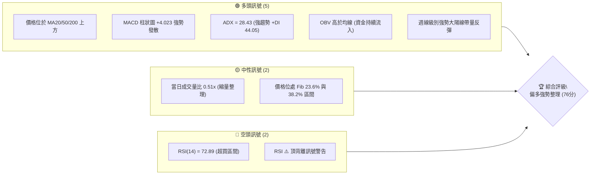
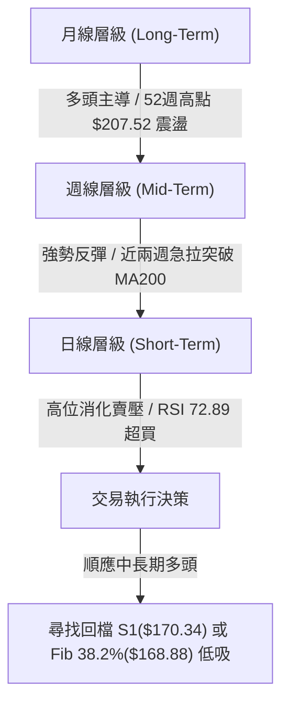
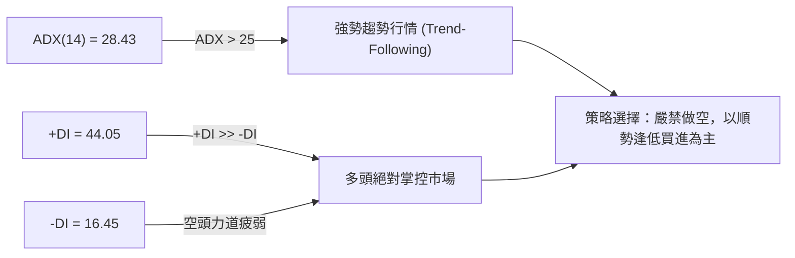
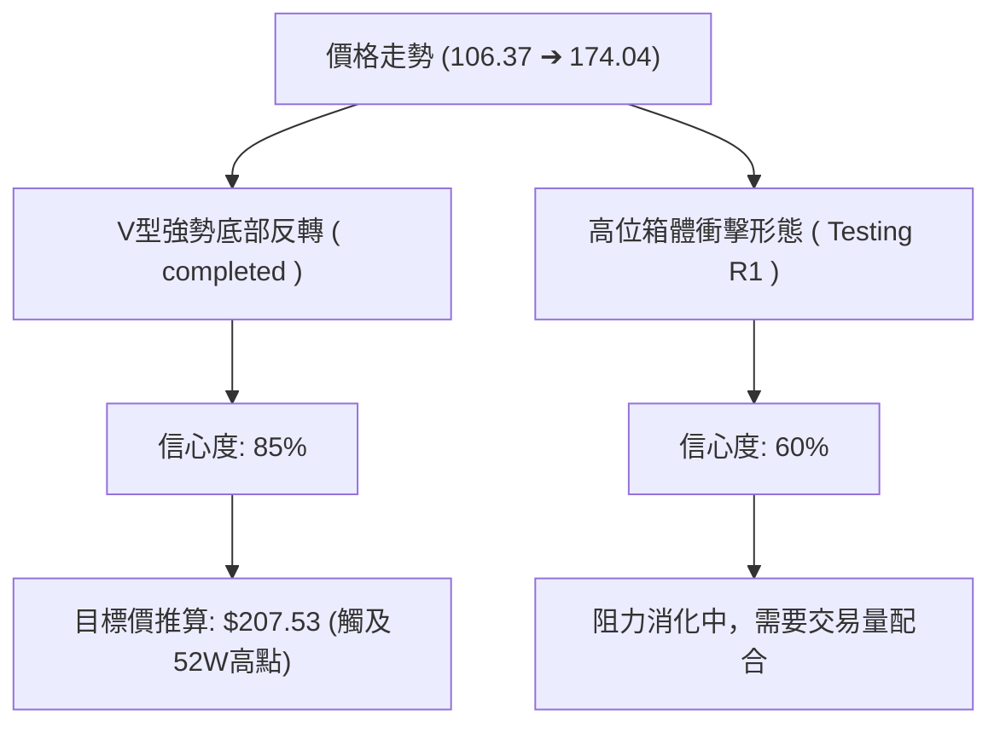
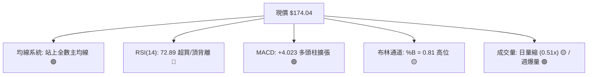
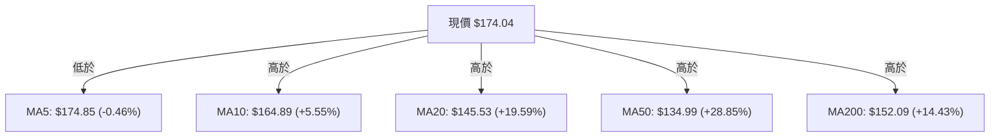
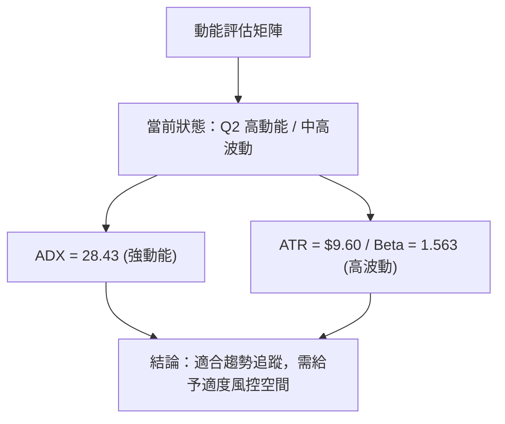
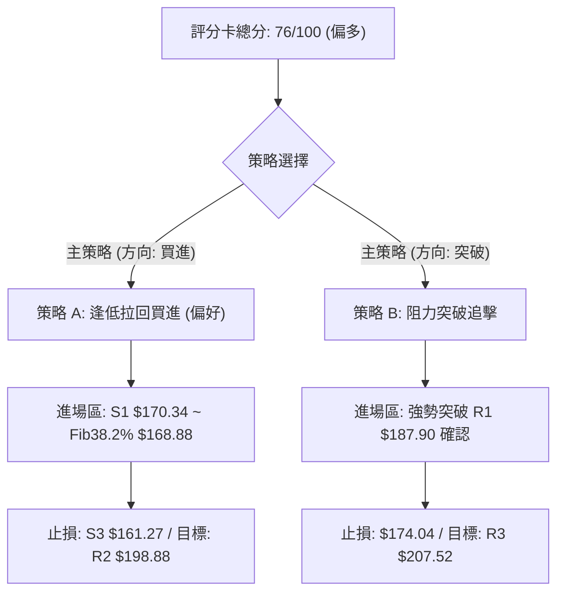
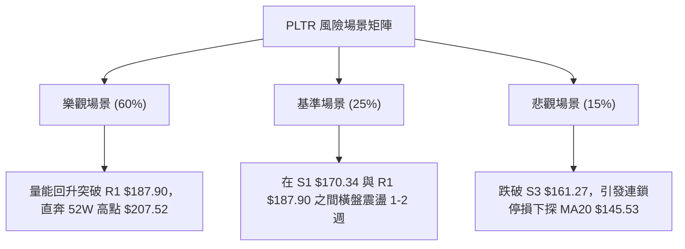

# PLTR 技術分析報告

> **報告日期**：2026-08-14 ｜ **語言**：繁體中文 ｜ **數據來源**：Yahoo Finance ｜ **當前價格**：$174.04

---

## 目錄

| 章節 | 內容 |
|------|------|
| [1. 技術面概覽](#1-技術面概覽) | 訊號儀表板、核心指標、評分卡 |
| [2. 趨勢分析](#2-趨勢分析) | 多時框趨勢、長中短期走勢、ADX強度 |
| [3. 圖表形態分析](#3-圖表形態分析) | 形態識別、K線組合、目標價計算 |
| [4. 支撐與阻力](#4-支撐與阻力) | 關鍵價位、斐波那契回調結構 |
| [5. 技術指標深度解讀](#5-技術指標深度解讀) | MA/RSI/MACD/布林通道/成交量 |
| [6. 動能與波動率](#6-動能與波動率) | 動能四象限、ATR、Beta與市場相關性 |
| [7. 多時框架總結](#7-多時框架總結) | 時框架評分矩陣與多時框收斂結論 |
| [8. 交易策略建議](#8-交易策略建議) | 策略路由、價格情境階梯、多空操作建議 |
| [9. 風險提示與監控](#9-風險提示與監控) | 關鍵監控清單、風險場景與倉位管理 |

---

## 1. 技術面概覽

### 🎯 技術訊號儀表板



### 📊 核心指標速覽表

| 指標類別 | 指標名稱 | 當前數值 | 訊號 | 解讀 |
|----------|----------|----------|------|------|
| **價格** | 當前價格 | $174.04 | 🟢 多頭 | 距52週高點 $207.52 尚有 +19.24% 空間 |
| **均線** | MA20 | $145.53 | 🟢 多頭 | 價格位於MA20上方 (+19.59%)，短中期偏多 |
| **均線** | MA50 | $134.99 | 🟢 多頭 | 價格位於MA50上方 (+28.85%)，中期趨勢強勁 |
| **均線** | MA200 | $152.09 | 🟢 多頭 | 價格位於MA200上方 (+14.43%)，長期牛市架構 |
| **動能** | RSI(14) | 72.89 | 🔴 警訊 | 進入超買區 (>70)，兼具頂背離隱憂，防範回檔 |
| **動能** | MACD | +4.023 | 🟢 多頭 | MACD(12.562) > Signal(8.538)，動能柱正向擴張 |
| **趨勢** | ADX(14) | 28.43 | 🟢 強趨勢 | ADX > 25 進入強趨勢，+DI(44.05) 遠高於 -DI(16.45) |
| **波動** | ATR(14) | $9.60 | 🟡 中高 | 佔股價 5.52%，日內波動較大，需設置寬鬆止損 |

### 🏆 技術評分卡

```
╔══════════════════════════════════════════════════════════════════╗
║                技術評分卡 — PLTR (2026-08-14)                     ║
╠══════════════════════════════════════════════════════════════════╣
║ 趨勢強度      ███████████████░░░░░  75/100  🟢 強勢趨勢 (ADX>25) ║
║ 動能指標      ██████████████░░░░░░  70/100  🟡 動能極強但超買    ║
║ 支撐穩定度    ████████████████░░░░  80/100  🟢 密集支撐帶保護    ║
║ 成交量配合    ████████████░░░░░░░░  65/100  🟡 長天期量增/短天期量縮║
║ 形態完整度    ███████████████░░░░░  75/100  🟢 底部位完成急拉    ║
║ 均線排列      ██████████████████░░  90/100  🟢 價格全線站上主均線 ║
╠══════════════════════════════════════════════════════════════════╣
║ 綜合評分      ███████████████░░░░░  76/100  🟢 偏多強勢 (建議拉回買)║
╚══════════════════════════════════════════════════════════════════╝
```

---

## 2. 趨勢分析

### 🌐 多時框趨勢分析



### 📈 長期趨勢 — 24個月走勢圖（Unicode）

```
PLTR 月線走勢圖（2024-08 至 2026-08）
價格軸 ($)
$210 ┤                                      ● (2025-10 高點 $200.47)
$190 ┤                                ●   
$170 ┤                            ●       ●                     ● $174.04 (現在)
$150 ┤                       ●                ●             ●
$130 ┤                   ●                        ●     ●
$110 ┤               ●                                ●
$90  ┤       ●   ●
$70  ┤   ●
$50  ┤ ●
$30  ┤●
     └─┬───┬───┬───┬───┬───┬───┬───┬───┬───┬───┬───┬───┬───┬───┬───┬───┬───
      08  10  12  02  04  06  08  10  12  02  04  06  08 (月份)
      2024        2025                    2026
```

**24個月歷史走勢特徵分析表**：

| 時間區段 | 開/收價格變動 | 走勢特徵描述 | 技術面意涵 |
|----------|---------------|--------------|------------|
| **2024-08 ~ 2025-02** | $31.48 → $84.92 | 主升段爆發，連續突破多重整數關卡 | 主力強勢建倉，基本面催化 |
| **2025-03 ~ 2025-10** | $84.40 → $200.47 | 強勢主升浪，創下 52 週歷史高點 $207.52 | 多頭頂峰，累計大量獲利盤 |
| **2025-11 ~ 2026-06** | $168.45 → $116.67 | 深度回調拉回，探至 52 週低點 $106.37 | 獲利了結賣壓消化，築底打洗 |
| **2026-07 ~ 2026-08** | $123.06 → $174.04 | 強勢 V 型強反彈，單月大漲超過 41% | 買盤強勢歸隊，重新站回 MA200 |

### 📊 中期趨勢（週線分析）

近期 20 週數據顯示，PLTR 在 2026 年 6 月底於 $112.93 觸底（逼近 52 週低點 $106.37），隨後展現極強烈之 V 型反彈。
*   **2026-08-09 該週**：成交量爆出 **435,164,800 股** 的巨量，收盤大漲至 $172.01（RSI 升至 70.0，MACD 柱達 +4.790），確認主力資金強勢拉抬。
*   **2026-08-16 該週**：收盤價進一步推升至 $174.04，價格成功突破並站在 MA200（$152.09）與 MA20（$145.53）上方。

### ⚡ 趨勢強度評估（ADX 解讀）



*   **ADX 數值解讀**：ADX 為 28.43，超越 25 的強弱分界線，代表當前市場處於**明確的單邊趨勢行情**而非無序盤整。
*   **方向指標分析**：+DI (44.05) 呈現壓倒性優勢，大幅高於 -DI (16.45)，證明多頭掌控絕大多數市場定價權。

---

## 3. 圖表形態分析

### 🔍 形態識別系統



**形態信心度評估表**（依據規則 15）：

| 形態名稱 | 信心度 | 判斷依據（引用數據） | 完成度 | 目標價（附計算式） |
|----------|--------|----------------------|--------|--------------------|
| **大級別V型底部反轉** | **85%** | 價格自 52 週低點 $106.37（2026-06）強勢反彈，帶量突破 Fib 50.0% ($156.95) | 100% | 頸線 $156.95 + (頸線 $156.95 - 低點 $106.37) = **$207.53** |
| **短線高位 flag 旗形整理** | **60%** | 價格連漲後在 $174.04 附近窄幅震盪，成交量縮至 23.9M | 50% | 若突破 R1($187.90)，旗幅 = $187.90 + ($174.04 - $123.06) = **$238.88** (數據未載此阻力，依規只看至 R3) |

### 🕯️ 重要K線形態分析

| 月份/週別 | 收盤價 | K線形態 | 解讀 | 技術訊號 |
|-----------|--------|---------|------|----------|
| **2026-06 (月線)** | $116.67 | 下影線長陰探底 | 於 $106.37 尋獲強烈買盤支撐，多頭阻擊 | 🔴➔🟡 止跌訊號 |
| **2026-08-09 (週線)**| $172.01 | 長陽突破大紅棒 | 成交量爆量至 435.1M，一舉貫穿多條均線 | 🟢 強烈買進訊號 |
| **當前日線** | $174.04 | 高位小陰/小陽星 | 日成交量降至 23.9M (0.51x)，呈現急漲後的量縮高位消化 | 🟡 中性消化賣壓 |

### 📉 ASCII 走勢形態示意圖

```
PLTR V型反轉與高位阻力測試示意圖
$207.52 ┤                                        [R3 52W高點]
        │                                       /
$187.90 ┤-- - - - - - - - - - - - - - - - - - -/-- [R1 阻力位]
$174.04 ┤                                 ● [當前現價]
        │                                /
$156.95 ┤---------------------●---------/-------- [Fib 50.0% / 頸線突破點]
        │                    / \       /
$128.02 ┤                   /   \     /
        │                  /     \   /
$106.37 ┤-----------------●-------●-/----------- [52W 低點雙底區]
        └─────────────────────────────────────────
```

---

## 4. 支撐與阻力

### 🗺️ 關鍵價位分布圖（Unicode）

```
PLTR 價位結構與密集區分佈圖
══════════════════════════════════════════════════════════════════
$207.52 ║████████████████████████████████████████║ 強阻力 R3 / 52W High
$198.88 ║████████████████████████████            ║ 阻力 R2
$187.90 ║████████████████████████████████        ║ 關鍵阻力 R1
$183.65 ║----------------------------------------║ 斐波那契 23.6%
$174.04 ╠════════════════════════════════════════╣ ◄ 當前收盤價
$170.34 ║▓▓▓▓▓▓▓▓▓▓▓▓▓▓▓▓▓▓▓▓▓▓▓▓▓▓▓▓▓▓          ║ 近期支撐 S1
$168.88 ║----------------------------------------║ 斐波那契 38.2%
$166.35 ║████████████████████████                ║ 強支撐 S2
$161.27 ║██████████████████████████████          ║ 關鍵防守支撐 S3
$156.95 ║----------------------------------------║ 斐波那契 50.0%
══════════════════════════════════════════════════════════════════
```

### 🚧 阻力位分析表

| 阻力級別 | 價位 | 形成原因（引用數據） | 突破難度 | 重要性 |
|----------|------|----------------------|----------|--------|
| **R1** | **$187.90** | 近一年波段高點聚類 (+7.97%) | 🟡 中等 | 短線多頭衝鋒首要考驗關卡 |
| **R2** | **$198.88** | 近一年波段高點聚類 (+14.27%) | 🔴 較高 | 整數關卡 $200 前的最後防線 |
| **R3** | **$207.52** | 52 週歷史高點 (+19.24%) | 🔴 極高 | 歷史天花板，解套賣壓集中區 |

### 🛡️ 支撐位分析表

| 支撐級別 | 價位 | 形成原因（引用數據） | 守住機率 | 重要性 |
|----------|------|----------------------|----------|--------|
| **S1** | **$170.34** | 近一年波段低點聚類 (-2.13%) | 🟢 高 | 短線強勢整理的第一道防線 |
| **S2** | **$166.35** | 近一年波段低點聚類 (-4.42%) | 🟢 高 | 回檔不破此位保持極強格局 |
| **S3** | **$161.27** | 近一年波段低點聚類 (-7.34%) | 🟢 極高 | 多頭波段結構的最後底線 |

### 📐 斐波那契回調位分析

*以 52 週高低點區間（高點 $207.52 ➔ 低點 $106.37）進行黃金分割切割：*

| 斐波那契層級 | 精確價位 | 與現價 ($174.04) 關係 | 技術面解讀 |
|--------------|----------|----------------------|------------|
| **0.0% (52W High)** | $207.52 | 上方 +19.24% | 最終波段目標 |
| **23.6%** | $183.65 | 上方 +5.52% | 短線上方壓力區，貼近 R1 ($187.90) |
| **38.2%** | $168.88 | 下方 -2.96% | **關鍵支撐位**，夾在 S1($170.34) 與 S2($166.35) 之間 |
| **50.0%** | $156.95 | 下方 -9.82% | 多空分水嶺，貼近 MA240 ($155.94) |
| **61.8%** | $145.01 | 下方 -16.68% | 強支撐，精確重合 MA20 ($145.53) |
| **78.6%** | $128.02 | 下方 -26.44% | 中期打底區間 |
| **100.0% (52W Low)**| $106.37 | 下方 -38.88% | 歷史波段底點 |

**位置解讀**：當前價格 $174.04 正好處於 **23.6% ($183.65)** 與 **38.2% ($168.88)** 之間的強勢上升走廊。只要價格回檔維持在 38.2% ($168.88) 之上，多頭強勢架構即完好無損。

---

## 5. 技術指標深度解讀

### 🎛️ 指標訊號總覽



### 📈 移動平均線排列分析



*   **均線結構**：價格強勢站上 MA10、MA20、MA50、MA120、MA200 與 MA240。僅微幅低於 MA5 ($174.85)，屬極短線的微幅喘息。
*   **多頭排列判斷**：MA10 > MA20 > MA50 呈現典型短中期多頭發散，且 MA20 ($145.53) 已自下方開始回升，總體均線系統提供實質強烈支撐。

### 📉 RSI(14) 分析

*   **RSI 當前值**：`72.89`
*   **強弱進度條**：`███████████████░░░░░ 72.89%` (超買 > 70)
*   **背離分析**：⚠️ **存在頂背離 (Bearish Divergence) 警訊**。
    *   *現象說明*：股價自 8 月初的 $172.01 推升至 $174.04 創近期新高，但日線 RSI 推進力道顯現放緩跡象。Stochastic %K (90.14) 與 %D (91.61) 同樣陷入嚴重超買。這表明短線價格可能需要透過橫盤或回檔至 S1($170.34) ~ S2($166.35) 來修正過熱的動能指標。

### 📊 MACD(12/26/9) 訊號解讀

*   **MACD 線**：`12.562`
*   **Signal 線**：`8.538`
*   **MACD 柱狀圖 (Histogram)**：`+4.023` 🟢

```
MACD 柱狀圖變化示意
+5.0 ┤          █
+4.0 ┤        █ █  ← 當前 +4.023 (多頭強勢)
+3.0 ┤      █ █ █
+1.0 ┤    █ █ █ █
 0.0 ┼───█─█─█─█─█────────
```
MACD 遠高於零軸且 Histogram 維持在 +4.023 高位，證明中線多頭波段動能依然極其澎湃，並無死亡交叉之跡象。

### 📦 布林通道分析

```
PLTR 布林通道位置示意圖 ($)
$191.30 ┤---------------------------------------- 上軌 ( Upper )
$174.04 ┤                             ●          現價位置 (%B = 0.81)
$145.53 ┤---------------------------------------- 中軌 ( MA20 )
$99.76  ┤---------------------------------------- 下軌 ( Lower )
```
*   **軌道狀態**：通道向上開口擴張，現價位於 $174.04，靠近上軌 $191.30，%B 指標為 0.81。
*   **技術意涵**：價格運行於中軌（$145.53）與上軌（$191.30）之間的高位強勢區，未衝破上軌意味著尚未進入失控的極端拋買狀態，走勢健康。

### 💹 成交量分析（量價配合度）

*   **當日成交量**：`23,948,735` 股
*   **20日均量**：`46,946,247` 股 (量比 `0.51x`)
*   **OBV 狀態**：`OBV > MA` 🟢 (能量潮位於均線上，呈現量能支撐上漲)
*   **解讀**：當前單日成交量縮至均量的一半（0.51x），說明在經過前期（2026-08-09 週）高達 4.35 億股的爆量換手拉抬後，市場籌碼極具鎖籌效應，高位並無恐慌性拋盤。

---

## 6. 動能與波動率

### ⚡ 動能評估四象限

| 象限分佈 | 低波動 (Low Volatility) | 高波動 (High Volatility) |
|----------|-------------------------|--------------------------|
| **強動能 (Strong Momentum)** | **Q1: 穩健上升浪** | **Q2: 爆發衝刺浪 (PLTR 所在位置) 🎯** |
| **弱動能 (Weak Momentum)** | **Q3: 窄幅盤整區** | **Q4: 築底/高位崩跌區** |



### 📊 ATR 波動率分析

*   **ATR(14)**：`$9.60`（佔當前股價 5.52%）
*   **交易應用建議**：
    *   **日內波動區間預測**：$174.04 ± $9.60 ➔ 預計單日交易區間位於 **$164.44 ~ $183.64**。
    *   **風控止損距離**：建議止損距離至少設為 1.5 倍 ATR（即 `$14.40`），以避免在正常日內波動中被震盪出局。

### 📐 Beta 與市場相關性

*   **Beta 係數**：`1.563`
*   **特徵**：PLTR 的波動程度為大盤（S&P 500）的 1.56 倍。在大盤走多時具有顯著的超額收益（Alpha）爆發力，但在市場修正期亦承受較高的回調壓力。

---

## 7. 多時框架總結

### 📋 時框架評分表

| 時框架 | 趨勢方向 | 動能狀態 | 均線排列 | 形態結構 | 評分 | 交易建議 |
|--------|----------|----------|----------|----------|------|----------|
| **月線 (Long)** | 🟢 多頭 | 🟢 極強 | 🟢 多頭 | 52週高點衝擊 | **85/100** | 長線堅定持有 |
| **週線 (Mid)** | 🟢 多頭 | 🟢 強勁 | 🟢 多頭 | V型爆量反轉 | **80/100** | 逢拉回加碼 |
| **日線 (Short)**| 🟡 中性偏多| 🔴 超買背離| 🟢 強勢 | 高位量縮整理 | **70/100** | 不宜追高，等 S1 低吸 |

### 🔲 綜合訊號矩陣

```
╔══════════════════════════════════════════════════════════════════╗
║                   多時框訊號收斂矩陣                              ║
╠══════════════════════════╦═══════════════════════════════════════╣
║ 長期 (月線)               ║ 🟢 多頭主導 (ADX 28.43 確信強趨勢)     ║
║ 中期 (週線)               ║ 🟢 多頭主導 (爆量突破 MA200/MA20)      ║
║ 短期 (日線)               ║ 🟡 消化超買 (RSI 72.89 + 0.51x 量縮)   ║
╠══════════════════════════╬═══════════════════════════════════════╣
║ 訊號收斂結果             ║ 🟢 趨勢一致偏多，短線面臨高位消化     ║
╚══════════════════════════╩═══════════════════════════════════════╝
```

### ⚖️ 多時框收斂結論

依據多時框收斂規則（ADX = 28.43 > 25）：
當前 PLTR 處於**標準的強趨勢行情**中。中長期（週線/月線）的方向為絕對的多頭主導，日線層級出現的 RSI 超買（72.89）與量縮（0.51x）僅為高位消化獲利賣壓之過程，**絕不構成逆勢做空的理由**。日線之回調應視為中長期順勢進場的絕佳時機。

---

## 8. 交易策略建議

### 🗺️ 策略決策流程圖



### 🧭 策略路由

**當前主策略方向：🟢 多頭強勢佈局（評分 76/100）**

### 🎯 價格情境階梯 (Price Scenarios)

| 觸發條件 | 下一目標價位 | 後續延伸價位 | 情境含義與操作指引 |
|----------|--------------|--------------|--------------------|
| **突破 R1 $187.90** | **R2 $198.88** | **R3 $207.52** | 多頭主升浪再起，可加碼追擊 |
| **穩守 $170.34 ~ $183.65**| **$187.90** | — | 高位高震盪整理，最佳低吸區間 |
| **跌破 S1 $170.34** | **S2 $166.35** | **S3 $161.27** | 短線回調加深，測試 Fib 38.2% 支撐 |

### 📊 情境機率分佈

| 情境劇本 | 估計機率 | 主要技術依據 |
|----------|----------|--------------|
| **高位整理後向上突破** | **60%** | ADX 28.43 強趨勢、+DI 高達 44.05、週線巨量支撐 |
| **區間橫盤震盪整理** | **25%** | RSI(14) 72.89 需要時間以橫盤消化超買指標 |
| **深度回調測試 S3** | **15%** | 日線 RSI 頂背離引發短期獲利回吐賣壓 |

### 🟢 主策略詳情

#### 策略 A：逢低拉回買進（推薦，風險報酬比優）

*   **進場條件**：價格拉回至 S1 ($170.34) 至 Fib 38.2% ($168.88) 附近止跌
*   **進場價格**：`$169.50`（S1 與 Fib 38.2% 之中間點位）
*   **目標價 T1**：`$183.65` (Fib 23.6%)
*   **目標價 T2**：`$198.88` (阻力 R2)
*   **止損價格**：`$161.27` (關鍵支撐 S3)
*   **風險報酬比**：
    *   *潛在風險*：$169.50 - $161.27 = $8.23
    *   *潛在報酬 (T2)*：$198.88 - $169.50 = $29.38
    *   *風報比*：**1 : 3.57** 🟢 (極優)
*   **建議倉位**：15% ~ 20%

#### 策略 B：阻力突破追擊（順勢動能）

*   **進場條件**：日線收盤價強勢突破阻力 R1 ($187.90) 且成交量放大
*   **進場價格**：`$188.50`
*   **目標價 T1**：`$198.88` (阻力 R2)
*   **目標價 T2**：`$207.52` (阻力 R3 / 52W 高點)
*   **止損價格**：`$174.04` (當前現價軸線)
*   **風險報酬比**：
    *   *潛在風險*：$188.50 - $174.04 = $14.46
    *   *潛在報酬 (T2)*：$207.52 - $188.50 = $19.02
    *   *風報比*：**1 : 1.32** 🟡 (普通，需快進快出)
*   **建議倉位**：10%

### 🔴 反向風險觸發點（對沖與失效提示）

若價格不幸**收盤跌破 S3 ($161.27)** 且 MACD 柱狀圖轉負，代表短期多頭結構破壞，多頭策略應立即停損離場，不宜硬挺。

### ⭐ 整體訊號強度評星

```
做多訊號強度：★★██☆  (4.0 / 5 星) - 趨勢極強，唯獨短線超買
做空訊號強度：★☆☆☆☆  (1.0 / 5 星) - ADX>25 順勢行情，嚴禁做空
整體可信度：  ★★██☆  (4.2 / 5 星) - 多時框數據高度一致
```

---

## 9. 風險提示與監控

### ✅ 關鍵監控指標 Checklist

```
╔══════════════════════════════════════════════════════════════════╗
║                    每日交易前監控 Check List                     ║
╠══════════════════════════════════════════════════════════════════╣
║ [ ] 價格是否守穩 S1 ($170.34) 及 Fib 38.2% ($168.88)？           ║
║ [ ] RSI(14) 是否順利自 72.89 回落至 60 附近的健康水準？          ║
║ [ ] 成交量是否在突破 R1 ($187.90) 時超過 20日均量 (46.9M)？      ║
║ [ ] MACD 柱狀圖 (當前 +4.023) 是否出現高位萎縮與死叉訊號？       ║
║ [ ] ADX(14) 是否持續保持在 25 以上 (當前 28.43)？                ║
╚══════════════════════════════════════════════════════════════════╝
```

### ⚠️ 風險場景分析



### 🛡️ 風險管理重要提醒

1.  **波動性風險**：PLTR 的 ATR 為 $9.60（5.52%），Beta 高達 1.563，屬於高波動性標的，請嚴格控制單筆交易風險不超過總資金的 2%。
2.  **背離風險**：RSI 72.89 帶有頂背離警訊，嚴禁在 $174.04 附近進行市價無腦追高，耐心等待回檔 S1($170.34) 或突破確認才建立倉位。
3.  **大盤連動**：高 Beta 科技股受整體美股納斯達克指數影響顯著，需同時監控大盤系統性風險。

---

## 📋 報告總結

```
╔══════════════════════════════════════════════════════════════════╗
║                    PLTR 技術分析報告總結                         ║
════════════════════════════════════════════════════════════════════
 報告日期：2026-08-14
 當前價格：$174.04
 分析評級：🟢 偏多強勢整理 (強趨勢 ADX 28.43 / 建議拉回買進)

 關鍵結論：
 ├─ 長期趨勢：🟢 多頭主導 (站上 MA200 $152.09，距離高點 $207.52 尚有空間)
 ├─ 中期趨勢：🟢 爆量反彈 (週線爆出 4.35 億股大陽線)
 ├─ 短期趨勢：🟡 高位消化 (RSI 72.89 超買，日成交量縮至 0.51x)
 ├─ 關鍵支撐：S1 $170.34 / S2 $166.35 / S3 $161.27
 ├─ 關鍵阻力：R1 $187.90 / R2 $198.88 / R3 $207.52
 └─ 分析師目標價：均值 $191.68 (最高 $255.00 / 最低 $80.00)

 最優策略組合：
 1. 🥇 最佳機會：策略 A — 靜待價格回檔至 $169.50 (S1/Fib38.2%) 低吸，
                 止損 $161.27，目標 $198.88 (風報比 1:3.57)。
 2. 🥈 次選機會：策略 B — 若強勢突破 R1 $187.90 帶量追擊，
                 止損 $174.04，目標 $207.52。
════════════════════════════════════════════════════════════════════
```

---

> ⚠️ **免責聲明**：本報告為 AI 自動生成之技術分析，所有數據及估算均基於提供的歷史價格資訊。本報告**僅供研究與學術參考**，**不構成任何投資建議**。投資有風險，入市需謹慎。

*報告生成時間：2026-08-14 ｜ 數據來源：Yahoo Finance ｜ 分析框架：多時框技術分析*