# PLTR 技術分析報告

> **報告日期**：2026-08-15 ｜ **語言**：繁體中文 ｜ **數據來源**：Yahoo Finance ｜ **當前價格**：$174.04

---

## 目錄

| 章節 | 內容 |
|------|------|
| [1. 技術面概覽](#1-技術面概覽) | 訊號儀表板、核心指標、評分卡 |
| [2. 趨勢分析](#2-趨勢分析) | 多時框趨勢、長中短期走勢 |
| [3. 圖表形態分析](#3-圖表形態分析) | 形態識別、K線組合、目標價 |
| [4. 支撐與阻力](#4-支撐與阻力) | 關鍵價位、斐波那契回調 |
| [5. 技術指標深度解讀](#5-技術指標深度解讀) | MA/RSI/MACD/布林/成交量 |
| [6. 動能與波動率](#6-動能與波動率) | 動能評估、ATR、Beta |
| [7. 多時框架總結](#7-多時框架總結) | 時框架評分矩陣 |
| [8. 交易策略建議](#8-交易策略建議) | 多空策略、風險報酬比 |
| [9. 風險提示與監控](#9-風險提示與監控) | 監控指標、風險場景 |
| [10. 報告總結](#-報告總結) | 總結儀表板與核心結論 |

---

## 1. 技術面概覽

### 🎯 技術訊號儀表板

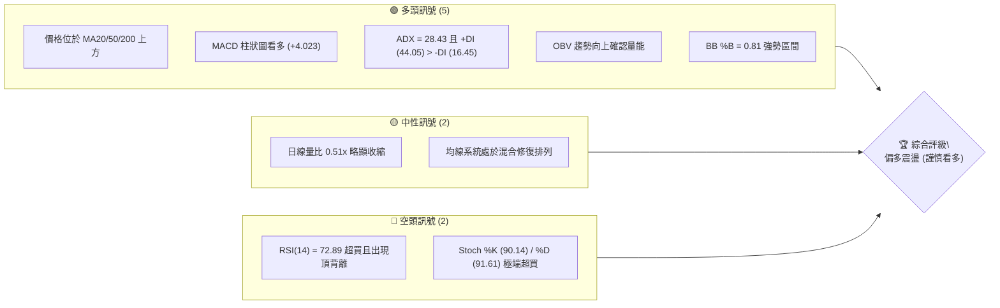

### 📊 核心指標速覽表

| 指標類別 | 指標名稱 | 當前數值 | 訊號 | 解讀 |
|----------|----------|----------|------|------|
| **價格** | 當前價格 | $174.04 | 🟢 | 位於52週區間 66.9%，由底部強勁反彈 |
| **均線** | MA20 | $145.53 | 🟢 | 價格在MA20上方 (+19.59%)，短線強勢 |
| **均線** | MA50 | $134.99 | 🟢 | 價格在MA50上方 (+28.93%)，中期趨勢翻多 |
| **均線** | MA200 | $152.09 | 🟢 | 價格成功收復長線生命線 (+14.43%) |
| **動能** | RSI(14) | 72.89 | 🔴 | 進入超買區，日線級別出現頂背離訊號 |
| **動能** | MACD (12,26,9) | 12.562 / 8.538 | 🟢 | 雙線位於零軸上方金叉，柱狀圖 +4.023 擴張 |
| **動能** | Stoch KD | 90.14 / 91.61 | 🔴 | KD值大於90，高檔鈍化，隨時面臨技術回踩 |
| **趨勢** | ADX / DI | ADX 28.43 | 🟢 | ADX > 25 確認強趨勢，+DI (44.05) 完勝 -DI (16.45) |
| **通道** | 布林通道 | 上軌 $191.30 / 中軌 $145.53 | 🟢 | %B 為 0.81，價格沿上軌擴張運行 |
| **量能** | OBV / 量比 | 量比 0.51x | 🟡 | OBV > MA 支撐上漲，但日線成交量需補量確認 |
| **波動** | ATR(14) | $9.60 | 🟡 | 佔股價 5.52%，單日波動幅度較大 |

### 🏆 技術評分卡

```
╔══════════════════════════════════════════════════════════════╗
║                技術評分卡 — PLTR (2026-08-15)                ║
╠══════════════════════════════════════════════════════════════╣
║ 趨勢強度 (ADX/DI)   ████████████████░░░░  80/100  🟢 強趨勢多頭 ║
║ 動能指標 (RSI/MACD) ████████████░░░░░░░░  60/100  🟡 頂背離壓制 ║
║ 支撐穩定度 (S1-S3)  ██████████████░░░░░░  70/100  🟢 階梯支撐強 ║
║ 成交量配合 (OBV/Vol)████████████░░░░░░░░  60/100  🟡 需補量突破 ║
║ 形態完整度 (波段反轉)██████████████░░░░░░  70/100  🟢 V型反轉成型 ║
║ 均線排列 (MA多時框) ██████████████░░░░░░  70/100  🟢 站上關鍵均線 ║
╠══════════════════════════════════════════════════════════════╣
║ 綜合技術評分        ██████████████░░░░░░  68/100  🟢 偏多格局   ║
╚══════════════════════════════════════════════════════════════╝
```

---

## 2. 趨勢分析

### 🌐 多時框趨勢分析

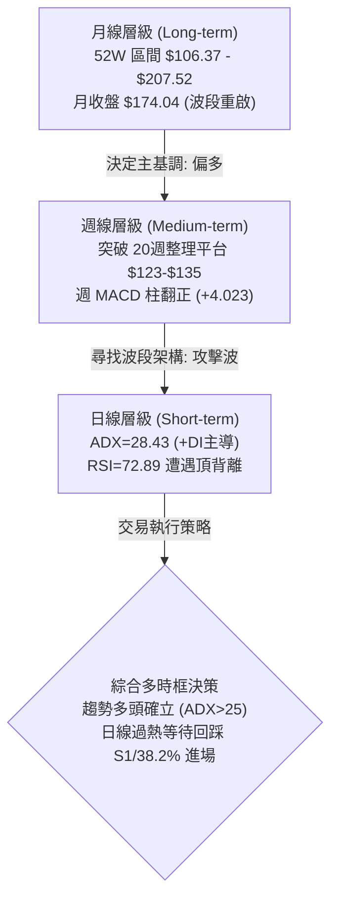

### 📈 長期趨勢 — 12個月走勢圖（Unicode）

```
PLTR 月線收盤走勢圖（過去12個月：2025-09 至 2026-08）
價格軸 ($)
$200.47 ┤                 ● (2025-10 歷史高點區域)
$182.42 ┤         ●
$174.04 ┤         │               ● (2026-08 當前價格 $174.04)
$168.45 ┤         │       ●       │
$156.54 ┤         │       │       │       ● (2026-05)
$146.28 ┤         │       │   ●   ●   ●   │
$137.19 ┤         │       │   │   │   │   │
$123.06 ┤         │       │   │   │   │   │       ● (2026-07 築底)
$116.67 ┤         │       │   │   │   │   │   ●   │ (2026-06 底部)
        └─────────┴───────┴───┴───┴───┴───┴───┴───┴─────────────────
         25-09  25-10   25-11 26-01 26-03 26-05 26-06 26-07 26-08
```

#### 走勢特徵分析表格

| 階段區間 | 起止價格 ($) | 漲跌幅 (%) | 走勢特徵與技術含義 |
|----------|--------------|------------|-------------------|
| **衝頂回落期** (2025-09 ~ 2025-11) | $182.42 → $200.47 → $168.45 | -7.66% (高點回撤-16.0%) | 創下 52週高點 $207.52 後高檔放量獲利了結 |
| **平台震盪期** (2025-12 ~ 2026-05) | $177.75 → $146.59 → $156.54 | -11.93% | 均線反覆糾結，在 $137~$156 區間進行大箱體整理 |
| **加速探底期** (2026-06 ~ 2026-07) | $156.54 → $116.67 → $123.06 | -21.39% | 快速下殺探測 52W 低點 $106.37 支撐，爆出大量恐慌盤 |
| **暴力反彈期** (2026-07 ~ 2026-08) | $123.06 → $174.04 | **+41.43%** | 8月前兩週週量激增至 4.35億股，強勢V型反轉突破 MA200 |

### 📊 中期趨勢（週線分析）

```
PLTR 週線關鍵架構示意圖
═════════════════════════════════════════════════════════════════
阻力區間：  $187.90 (R1) ───── $198.88 (R2) ───── $207.52 (52W High)
                ▲
                │ 強勢上攻中 (近兩週自 $123.06 飆升至 $174.04)
                │
當前現價：  $174.04
                │
                │ 回調支撐帶
                ▼
支撐區間：  $170.34 (S1) ───── $168.88 (Fib 38.2%) ─ $166.35 (S2)
═════════════════════════════════════════════════════════════════
```

### ⚡ 趨勢強度評估（ADX 解讀）

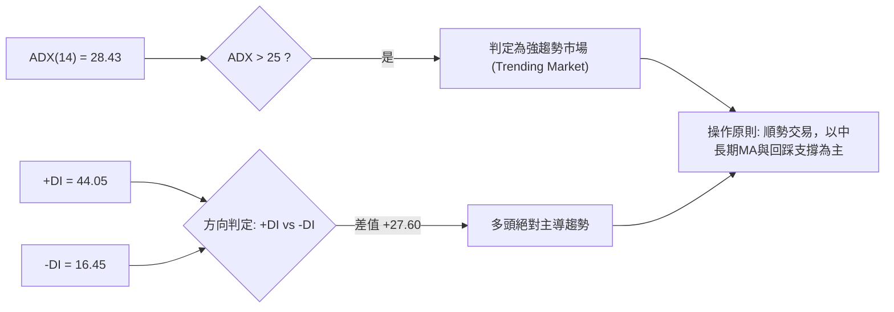

#### ADX 強度對照表

| 指標變數 | 當前讀數 | 門檻區間 | 技術解讀 | 戰術指引 |
|----------|----------|----------|----------|----------|
| **ADX(14)** | **28.43** | > 25.0 (強趨勢) | 趨勢行情已脫離盤整階段，動能充沛 | 放棄區間高拋低吸，改採順勢回踩做多 |
| **+DI** | **44.05** | > 30.0 (強烈多頭) | 買盤推升力道極強，多方佔據全面優勢 | 趨勢尚未結束，不宜重倉逆勢摸頂放空 |
| **-DI** | **16.45** | < 20.0 (空頭衰退) | 空方拋壓遭到全面吸收，賣盤枯竭 | 空頭僅能寄望超買引發的技術性修正 |

---

## 3. 圖表形態分析

### 🔍 形態識別系統

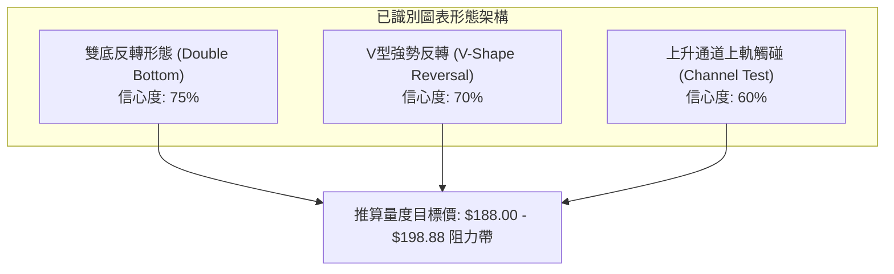

#### 形態識別與信心度評估表

| 形態名稱 | 信心度 | 判斷依據（引用數據） | 完成度 | 目標價（附計算式） |
|----------|--------|----------------------|--------|--------------------|
| **雙底形態 (Double Bottom)** | **75%** | 2026-06 低點 $116.67 與 2026-07 低點 $123.06 構成雙重底；頸線位於 2026-05 高點 $156.54 | 100% (已突破頸線) | 頸線 $156.54 + 形態高度 ($156.54 - $116.67 = $39.87) = **$196.41** (接近 R2 $198.88) |
| **V型爆發反轉 (V-Reversal)** | **70%** | 2026-08-09 當週成交量放大至 4.35億股，價格由 $123.06 跳升至 $172.01 | 90% | 由起漲點 $123.06 測算波段對稱幅度，量度目標指向 R1 **$187.90** |
| **日線上升楔形 (Rising Wedge)** | **45%** | 價格連日推升但日線成交量未同步倍增，RSI 出現頂背離 | 40% (尚未跌破下軌) | 訊號不足，僅做指標型解讀（警惕短線超買回踩） |

### 🕯️ 重要K線形態分析

| 日期 / 週別 | 收盤價 ($) | K線形態 | 技術解讀 | 多空訊號 |
|--------------|------------|---------|----------|----------|
| **2026-06-28** | $112.93 | 長下影錘頭線 | 探測 52W 低點 $106.37 後快速收回，空頭力竭 | 🟢 築底訊號 |
| **2026-07-26** | $122.92 | 縮量十字星 | 成交量萎縮至 1.43億股，拋壓清洗完畢，第二隻腳確立 | 🟢 止跌確認 |
| **2026-08-09** | $172.01 | 爆量突破長陽線 | 4.35億股巨量實體大陽線，一舉吞沒 MA20/50/200 三道關卡 | 🟢 強烈買進 |
| **2026-08-16** | $174.04 | 高檔小陽懸空線 | 週漲幅趨緩，成交量收縮至 1.96億股，遭遇 R1 前阻力 | 🟡 短線滯漲 |

### 📉 ASCII 走勢形態示意圖

```
PLTR 雙底突破與波段推升示意圖
═══════════════════════════════════════════════════════════════════════
$207.52 (52W High) ────────────────────────────────────────── [R3 目標]
$198.88 (R2 / 雙底量度目標 $196.41) ───────────────────────── [量度目標]
$187.90 (R1 阻力帶) ─────────────────────┐
                                         │  ▲ (目前推進中)
$174.04 (現價) ──────────────────────────┴──●
                                            /
$156.54 (頸線 Neckline) ─────────●─────────/  ◄── 突破頸線點
                                / \       /
$135.00                       /   \     /
                            /     \   /
$123.06 (第二底 Bottom 2) ───       \─●
                                      
$116.67 (第一底 Bottom 1) ──●
═══════════════════════════════════════════════════════════════════════
```

---

## 4. 支撐與阻力

### 🗺️ 關鍵價位分布圖（Unicode）

```
PLTR 價位結構與籌碼密集分布圖
═══════════════════════════════════════════════════════════════════
$207.52 ║██████████████████████████████║ 強阻力 R3 (52W High / 0.0% Fib)
$198.88 ║████████████████████          ║ 阻力 R2 (波段前高聚類)
$187.90 ║████████████████████████      ║ 關鍵阻力 R1 (波段密集成交高點)
$183.65 ║▓▓▓▓▓▓▓▓▓▓▓▓▓▓▓▓▓▓            ║ 斐波那契 23.6% 回調壓力
════════╬══════════════════════════════╬═══════════════════════════
$174.04 ╠══════════════════════════════╣ ◄ 現價 (Current Price)
════════╬══════════════════════════════╬═══════════════════════════
$170.34 ║▓▓▓▓▓▓▓▓▓▓▓▓▓▓▓▓▓▓            ║ 近期第一支撐 S1
$168.88 ║████████████████████          ║ 關鍵支撐 (Fib 38.2% 回調位)
$166.35 ║████████████████████████      ║ 穩固支撐 S2 (波段低點聚類)
$161.27 ║████████████████              ║ 強支撐 S3 (防守底線)
$156.95 ║██████████████████████████████║ 核心分水嶺 (Fib 50.0% / 原頸線)
═══════════════════════════════════════════════════════════════════
```

### 🚧 阻力位分析表

| 阻力級別 | 價位 ($) | 距離現價 (%) | 形成原因與籌碼解讀 | 突破難度 | 重要性 |
|----------|----------|--------------|-------------------|----------|--------|
| **R1** | **$187.90** | +7.97% | 2025年9-10月波段高點密集成交區，短線解套賣壓集中 | 🟡 中等 | ★★★★☆ |
| **R2** | **$198.88** | +14.27% | 歷史整數關卡前夕，雙底量度目標位 ($196.41) 共振區 | 🔴 較高 | ★★★★☆ |
| **R3** | **$207.52** | +19.24% | 52週歷史最高點，空頭最後防線與獲利回吐重災區 | 🔴 極高 | ★★★★★ |

### 🛡️ 支撐位分析表

| 支撐級別 | 價位 ($) | 距離現價 (%) | 形成原因與籌碼解讀 | 守住機率 | 重要性 |
|----------|----------|--------------|-------------------|----------|--------|
| **S1** | **$170.34** | -2.13% | 近期日線突破後的頂底轉換位，短線多頭防守第一線 | 75% | ★★★☆☆ |
| **S2** | **$166.35** | -4.42% | 近期拉升過程中的波段低點聚類，接近 Fib 38.2% ($168.88) | 85% | ★★★★☆ |
| **S3** | **$161.27** | -7.34% | 波段起漲強支撐平台，跌破則代表此輪急攻行情熄火 | 92% | ★★★★★ |

### 📐 斐波那契回調位分析

> **計算基準區間**：52週波段低點 **$106.37** → 52週波段高點 **$207.52**（垂直落差 $101.15）

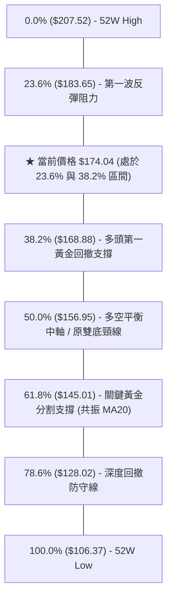

#### 斐波那契關鍵層級解讀
- **現價定位**：現價 **$174.04** 穩固運行於 **38.2% ($168.88)** 與 **23.6% ($183.65)** 之間。在技術分析標準理論中，價格能維持在 38.2% 回調位之上，代表此輪由 $106.37 發動的多頭反攻屬於「極強勢格局」。
- **向上挑戰**：上方首要黃金分割阻力為 **$183.65 (23.6%)**，若能配合成交量有效帶量突破，將直接打開通往 R1 ($187.90) 及歷史高點 $207.52 的空間。
- **向下防守**：下方 **$168.88 (38.2%)** 與支撐位 **S1 ($170.34) / S2 ($166.35)** 形成密集緩衝帶，是多方回踩的最佳防守與加碼區域。

---

## 5. 技術指標深度解讀

### 🎛️ 指標訊號總覽

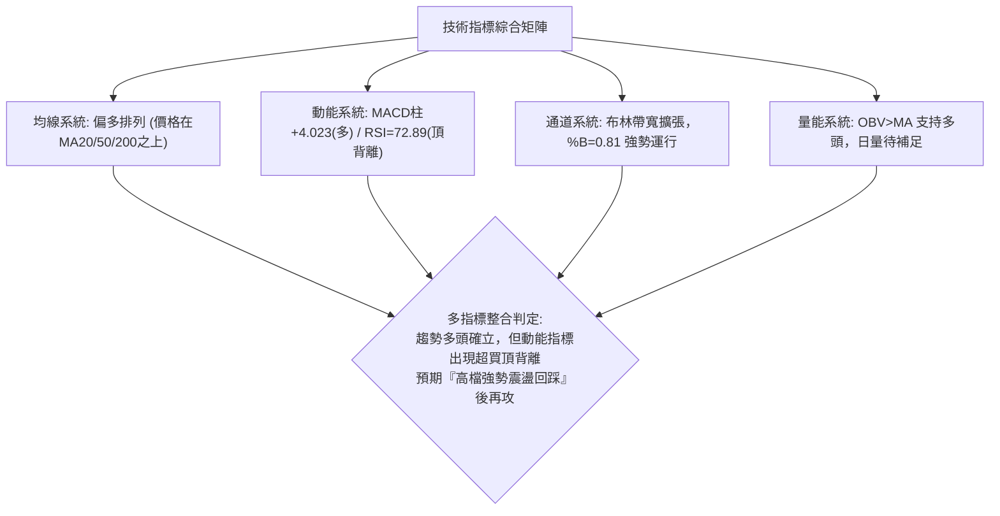

### 📈 移動平均線排列分析

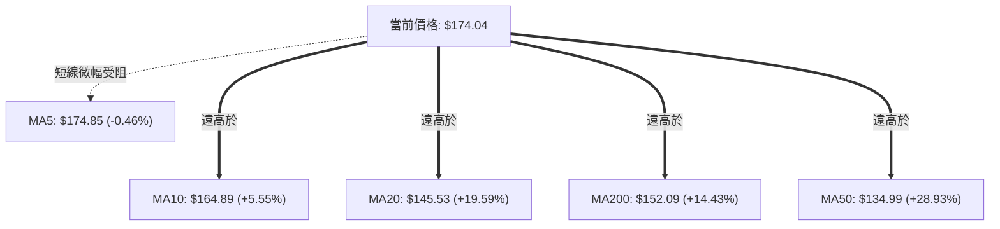

#### 均線架構深度解析
1. **短天期均線**：MA5 ($174.85) 略高於現價 $174.04 (-0.46%)，呈現高檔黏合；而 MA10 ($164.89) 與 MA20 ($145.53) 呈陡峭向上發散角度，短線推升力道極強。
2. **中長天期均線修復**：現價已大幅穿越 MA50 ($134.99) 與 MA200 ($152.09)。目前 MA200 ($152.09) 高於 MA50 ($134.99)，屬於「反彈初期混合排列」，但隨著短期均線快速上移，均線系統正在進行黃金交叉修復。

### 📉 RSI(14) 分析與頂背離警訊

```
RSI(14) 數值儀表板
0 ──────────── 30 ──────────────────── 50 ────────────────── 70 ── 72.89 ── 100
[  極度超賣區  ] [      弱勢區間      ] [     強勢區間     ] [🔴超買區]
進度條: ██████████████████████████████████████████████████████░░░░  72.89%
```

- **超買狀態**：當前 RSI(14) 達到 **72.89**，正式進入 70 以上的超買警戒區。
- **⚠️ 頂背離確認 (Bearish Divergence)**：
  - **價格層面**：價格由前次回檔低點連續急拉創下波段新高 $174.04。
  - **指標層面**：RSI 指標自 2026-07-19 當週的 75.1 下降至當前的 72.89，未能跟隨價格刷新高點，形成標準的「日線級別頂背離」。
  - **技術含義**：頂背離並不代表趨勢立刻反轉下跌，但在 ADX 強趨勢下，通常意味著**上攻斜率將放緩，短線面臨 3~5 日的技術性休整或回踩 S1 ($170.34)**。

### 📊 MACD(12/26/9) 訊號解讀

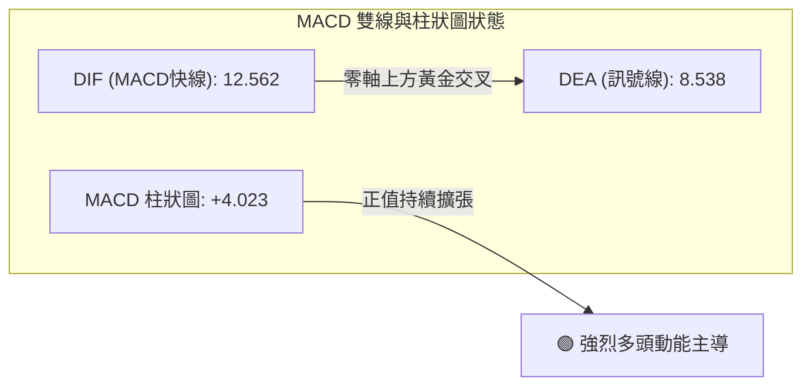

- **MACD 線性讀數**：DIF (12.562) 遠高於 DEA (8.538)，差值擴大，雙線在零軸上方呈現標準的多頭發散形態。
- **柱狀圖 (Histogram)**：柱狀圖讀數為 **+4.023**，維持在健康擴張區間，顯示中線資金進場意願堅決，有效吸收了短線獲利盤。

### 📦 布林通道分析 (Bollinger Bands)

```
PLTR 布林通道空間分布示意圖 (20日參數, 2.0標準差)
═════════════════════════════════════════════════════════════════════
$191.30 ────────────────────────────────────────── BB 上軌 (Upper Band)
                  ▲
                  │ 剩餘上行空間 +9.92%
$174.04 ──────────●─────────────────────────────── 現價 (%B = 0.81)
                  │
                  │ 多空安全緩衝區
$145.53 ────────────────────────────────────────── BB 中軌 (MA20 Baseline)
                  │
$99.76  ────────────────────────────────────────── BB 下軌 (Lower Band)
═════════════════════════════════════════════════════════════════════
```

- **帶寬與位置**：%B 數值為 **0.81**，價格位於中軌 ($145.53) 與上軌 ($191.30) 之間的高位強勢推進帶。
- **通道形態**：通道開口呈現向外擴張（Band Expansion）特徵，表明市場正處於波動率放大的趨勢行情中，尚未出現通道收窄（Squeeze）的滯漲訊號。

### 💹 成交量分析（量價配合度）

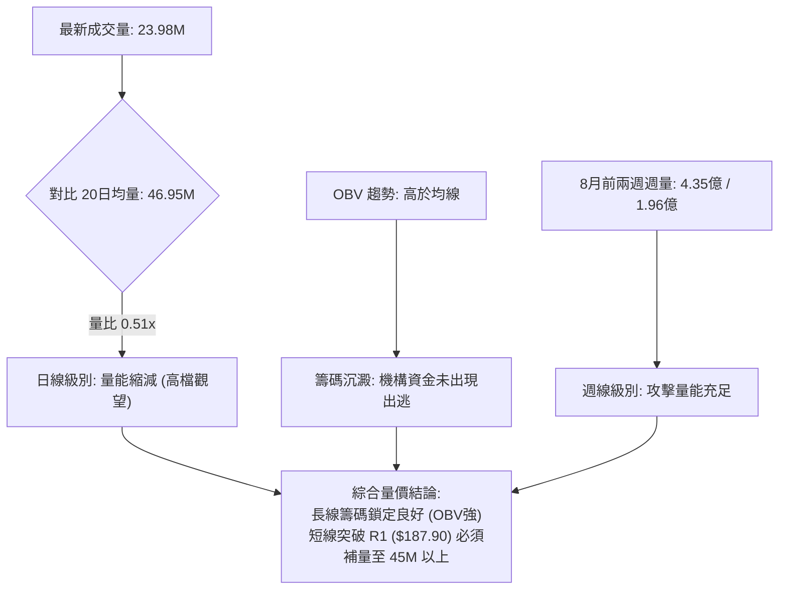

---

## 6. 動能與波動率

### ⚡ 動能評估四象限

| 象限 | 動能強度 (ADX / MACD) | 波動率水準 (ATR / Beta) | 當前狀態 | 策略應對與評估 |
|------|------------------------|--------------------------|----------|----------------|
| **Q1 (最佳爆發)** | 強 (ADX > 25, MACD > 0) | 低 / 中 (ATR 穩定) | - | 穩健加碼區 |
| **Q2 (高波動攻擊)** | **強 (ADX=28.43, +DI=44.05)** | **高 (ATR=$9.60, Beta=1.56)** | **✓ (PLTR 當前位置)** | **高動能/高波動：順勢做多，但必須嚴格設定寬幅移動止損** |
| **Q3 (弱勢整理)** | 弱 (ADX < 20) | 低 (ATR 收縮) | - | 觀望等待突破 |
| **Q4 (高危下殺)** | 弱 / 偏空 | 高 (恐慌放量) | - | 嚴禁逆勢抄底 |

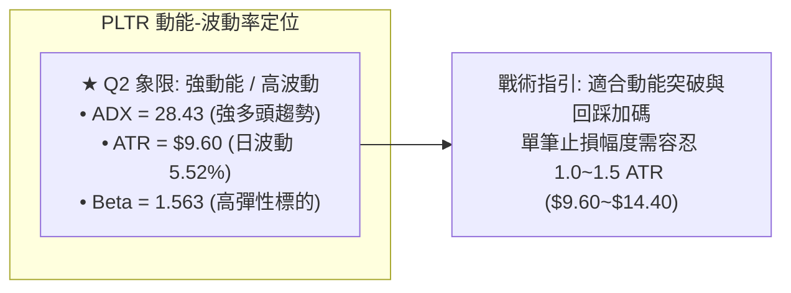

### 📊 ATR 波動率分析與風控距離

- **ATR(14) 絕對值**：**$9.60**
- **ATR 相對百分比**：佔當前股價之 **5.52%**（屬於典型的高波動成長型科技股）。
- **止損距離建議**：
  - **超短線交易 (Day/Swing Trade)**：1.0 倍 ATR = **$9.60** 緩衝空間（止損位約在 $174.04 - $9.60 = **$164.44**，緊貼 S2 $166.35 下方）。
  - **波段趨勢交易 (Position Trade)**：1.5 倍 ATR = **$14.40** 緩衝空間（止損位約在 $174.04 - $14.40 = **$159.64**，緊貼 S3 $161.27 下方）。

### 📐 Beta 與市場相關性

- **Beta 係數**：**1.563**
- **市場彈性解讀**：PLTR 對標普500 (S&P 500) 具有 **1.56倍** 的波動放大效應。當大盤指數上漲 1% 時，PLTR 平均上漲 1.56%；反之大盤回調時其回撤幅度亦較深。在多頭趨勢中，高 Beta 特性將顯著放大波段交易的資本利得。

---

## 7. 多時框架總結

### 📋 時框架評分表

| 時框架 | 趨勢方向 | 動能狀態 | 均線排列 | 關鍵圖表形態 | 綜合評分 | 操作指引 |
|--------|----------|----------|----------|--------------|----------|----------|
| **月線 (長期)** | 🟢 偏多回升 | 🟡 中性修復 | 🟡 混合整理 | 守穩 52W 低點 $106.37 後的大級別回升 | **70/100** | 長線持股續抱，目標看向 52W 高點 |
| **週線 (中期)** | 🟢 強烈看多 | 🟢 MACD柱擴張 | 🟢 穿越 MA200 | 突破 $156.54 雙底頸線，量能放大 | **78/100** | 波段主攻擊波，逢回調支撐加碼 |
| **日線 (短期)** | 🟡 偏多震盪 | 🔴 RSI頂背離超買 | 🟢 站上所有均線 | 高檔懸空小陽線，帶寬擴張 | **58/100** | 短線不宜盲目追高，等待回踩 S1/S2 |

### 🔲 綜合訊號矩陣

```
時框架訊號收斂矩陣
═══════════════════════════════════════════════════════════════════
時框級別      趨勢      動能      均線      量能      綜合矩陣結論
───────────────────────────────────────────────────────────────────
日線 (Short)   🟢 多     🔴 頂背   🟢 多     🟡 縮量    🟡 短線超買需休整
週線 (Medium)  🟢 多     🟢 強多   🟢 突破   🟢 爆量    🟢 主升浪推升中
月線 (Long)    🟢 多     🟡 中性   🟡 修復   🟢 沉澱    🟢 底部反轉確立
═══════════════════════════════════════════════════════════════════
```

### ⚖️ 多時框收斂結論

依據多時框收斂規則：
1. **行情性質判定**：當前 ADX(14) 讀數為 **28.43 (> 25.0)**，且 +DI (44.05) 遠大於 -DI (16.45)，市場已明確進入**強多頭趨勢行情 (Trending Market)**，而非無方向的區間震盪。
2. **主導時框裁決**：在趨勢行情下，中長期時框（週線突破雙底、價格站上 MA200、週 MACD 翻正）具備最高優先權。日線級別的 RSI 超買與頂背離訊號，**僅作為尋找次級折返進場點（Pullback Entry）的依據，不得作為趨勢反轉的做空理由**。
3. **唯一方向性結論**：**【偏多格局 — 順勢拉回做多】**（本結論與第 8 章主推策略完全一致）。

---

## 8. 交易策略建議

### 🗺️ 策略決策流程圖

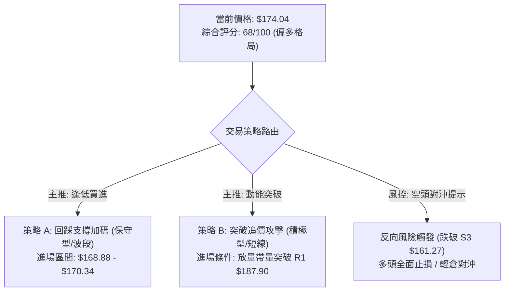

### 🧭 策略路由

**當前主策略方向 = 【主推多頭策略】（依據技術評分卡綜合評分 68/100，大於 60 分臨界值）**
- **多頭策略**：作為主戰術全力推行，分為「保守型回踩支撐進場」與「積極型突破進場」。
- **空頭策略**：僅作為下行風險觸發點與風控對沖參考，嚴禁在強趨勢下重倉逆勢摸頂。

### 🎯 價格情境階梯 (Price Scenarios)

| 觸發條件 | 第一目標 (T1) | 第二目標 (T2) | 後續延伸 (T3) | 情境技術含義 |
|----------|---------------|---------------|---------------|--------------|
| **強勢突破 R1 ($187.90)** | **R2 ($198.88)** | **R3 ($207.52)** | 分析師最高目標 $255.00 | 多頭主升浪加速，挑戰 52週歷史高點 |
| **維持現價區間 ($170.34~$187.90)** | R1 ($187.90) | — | — | 高檔消化 RSI 頂背離，以時間換取空間 |
| **跌破 S1 ($170.34)** | **S2 ($166.35)** | **Fib 38.2% ($168.88)** | S3 ($161.27) | 短線獲利回吐，測試下方強支撐帶 |
| **跌破 S3 ($161.27)** | Fib 50% ($156.95) | MA200 ($152.09) | MA20 ($145.53) | 中期波段反彈失敗，回測雙底頸線 |

### 📊 情境機率分佈

```
情境機率分佈圖
繼續上行挑戰 R1/R2 (60%) ▓▓▓▓▓▓▓▓▓▓▓▓▓▓▓▓▓▓▓▓▓▓▓▓░░░░░░░░░░░░░░░░
高檔區間強勢震盪 (25%)   ▓▓▓▓▓▓▓▓▓▓░░░░░░░░░░░░░░░░░░░░░░░░░░░░░
深度回落再探底 (15%)     ▓▓▓▓▓▓░░░░░░░░░░░░░░░░░░░░░░░░░░░░░░░░░
```

| 未來走勢情境 | 機率估計 (%) | 主要技術指標依據 |
|--------------|--------------|------------------|
| **情境一：震盪上行突破 (Bullish Continuation)** | **60%** | ADX=28.43 且 +DI 主導；MACD 柱狀圖 (+4.023) 持續擴張；OBV 支持上漲；機構評級普遍看多（27位分析師均價 $191.68）。 |
| **情境二：高檔強勢整理 (High Consolidation)** | **25%** | RSI=72.89 超買頂背離壓制；日線量比 0.51x 略顯不足，需在 S1 ($170.34) ~ R1 ($187.90) 區間震盪消化浮額。 |
| **情境三：深度回調測試 (Deep Pullback)** | **15%** | 遭遇突發大盤系統性風險，引發獲利盤踩踏，跌破 S2 ($166.35) 進一步下探 S3 ($161.27)。 |

### 🟢 主策略詳情

| 策略要素 | 策略 A（保守型：回踩支撐做多） | 策略 B（積極型：動能突破跟進） |
|----------|--------------------------------|--------------------------------|
| **策略類型** | 順勢拉回買進 (Pullback Buy) | 右側動能突破 (Breakout Buy) |
| **進場條件** | 價格回踩 S1/Fib 38.2% 區間且收出日線止跌K線 | 日線帶量收盤突破 R1 ($187.90)，成交量 > 45M |
| **進場價格** | **$169.50** (位於 S1 $170.34 與 Fib 38.2% $168.88 之間) | **$188.50** (確認突破 R1 $187.90) |
| **第一目標 (T1)** | **$187.90** (阻力位 R1，潛在獲利 +10.86%) | **$198.88** (阻力位 R2，潛在獲利 +5.51%) |
| **第二目標 (T2)** | **$198.88** (阻力位 R2，潛在獲利 +17.33%) | **$207.52** (52W 高點 R3，潛在獲利 +10.09%) |
| **止損價格** | **$160.50** (跌破支撐位 S3 $161.27 防守線) | **$178.50** (跌回 R1 突破點下方 1.0 ATR) |
| **風險空間** | $9.00 (-5.31%) | $10.00 (-5.31%) |
| **報酬空間 (以T2計)** | $29.38 (+17.33%) | $19.02 (+10.09%) |
| **風險報酬比 (R:R)** | **1 : 3.26** (極佳) | **1 : 1.90** (良好) |
| **模型勝率估算** | **65%** | **55%** |
| **建議配置倉位** | **15% - 20%** 總投資資金 | **10% - 15%** 總投資資金 |

### 🔴 反向風險觸發點（對沖與風控提示）

- **警訊觸發價位**：**$161.27 (支撐位 S3)**
- **風控處置流程**：
  1. 若日線收盤價跌破 **$161.27**，宣告此輪自 $116.67 發動的強勢反彈波結構遭到破壞。
  2. 應立即將多頭部位全數出清止損或降倉至 5% 以下。
  3. 激進型交易者可在此價位跌破後，以少量資金（5%）買入反向看跌期權對沖現貨風險，第一空頭目標指向 Fib 50.0% ($156.95) 及 MA200 ($152.09)。

### ⭐ 整體訊號強度評星

```
╔══════════════════════════════════════════════════════════════╗
║                   PLTR 技術訊號綜合評星卡                    ║
╠══════════════════════════════════════════════════════════════╣
║ 做多訊號強度：★★★★☆  (4.0/5.0 星) — 趨勢明確，回踩即是買點   ║
║ 做空訊號強度：★☆☆☆☆  (1.0/5.0 星) — 逆勢風險極高，嚴禁摸頂   ║
║ 整體趨勢可信度：★★★★☆  (4.0/5.0 星) — ADX與週線量能高度確認 ║
╚══════════════════════════════════════════════════════════════╝
```

---

## 9. 風險提示與監控

### ✅ 關鍵監控指標 Checklist

```
╔══════════════════════════════════════════════════════════════╗
║                每日/每週 關鍵技術指標監控清單                ║
╠══════════════════════════════════════════════════════════════╣
║ [ ] 1. 價格防守線：每日檢視是否守穩 S1 ($170.34) 與 S2 ($166.35)║
║ [ ] 2. 突破放量度：突破 R1 ($187.90) 時日成交量是否大於 45M 股║
║ [ ] 3. RSI 背離修復：觀察 RSI(14) 能否在高檔鈍化或回踩 60 獲得支撐║
║ [ ] 4. MACD 柱狀圖：檢視 MACD Hist 是否維持在零軸上方正值擴張 ║
║ [ ] 5. 均線扣抵支撐：關注 MA20 ($145.53) 與 MA200 ($152.09) 走勢 ║
║ [ ] 6. 波動率風控：單日震盪是否超出 1.5 倍 ATR ($14.40) 警戒線║
╚══════════════════════════════════════════════════════════════╝
```

### ⚠️ 風險場景分析

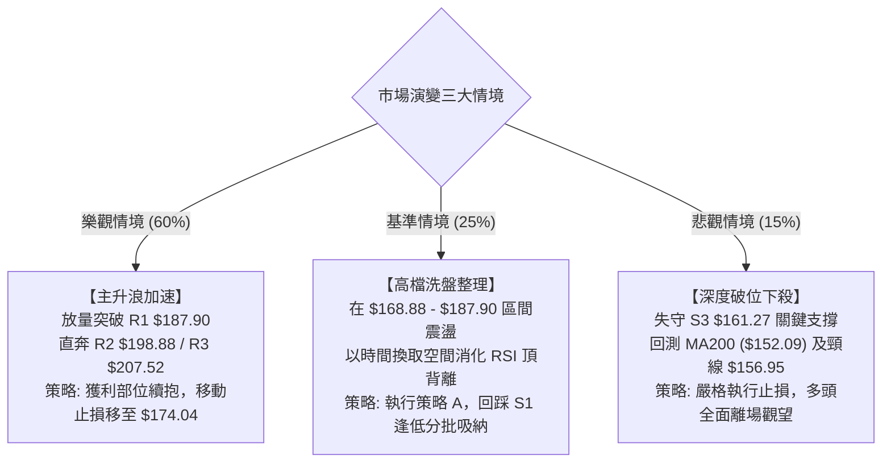

### 🛡️ 風險管理重要提醒

1. **高估值引發的股價高彈性風險**：PLTR 當前滾動市盈率 P/E (Trailing) 高達 **148.75x**，P/S 高達 **67.94x**。高估值意味著市場已預先透支了極高的成長預期，股價對任何市場風吹草動或大盤回調極度敏感（Beta 1.563），因此**純粹的技術面停損紀律至關重要**。
2. **倉位管理與資金分配原則**：
   - 建議 PLTR 單一標的之投資總額不得超過個人總投資組合的 **15% - 20%**。
   - 嚴格遵守「單筆交易最大虧損不超過總本金 1.5%」的風控鐵律。
3. **ATR 動態止損設置**：由於日 ATR 高達 **$9.60 (5.52%)**，盤中常態性劇烈震盪易觸發過於狹窄的止損。建議進場後務必給予定價至少 **1.0 ~ 1.5 倍 ATR** 的緩衝空間，切忌盲目在關鍵支撐位之上設定過緊的停損點。

---

## 📋 報告總結

```
╔══════════════════════════════════════════════════════════════════╗
║                  PLTR 技術分析報告核心總結儀表板                 ║
╠══════════════════════════════════════════════════════════════════╣
║ 報告日期：2026-08-15                當前價格：$174.04            ║
║ 分析評級：🟢 偏多格局 (Bullish Trend) 綜合技術評分：68 / 100     ║
╠══════════════════════════════════════════════════════════════════╣
║ 關鍵結論矩陣：                                                   ║
║ ├─ 長期趨勢 (月線)：🟢 走出 52W 低點 $106.37 陰霾，大級別反轉確立   ║
║ ├─ 中期趨勢 (週線)：🟢 突破 $156.54 雙底頸線，週線 MACD 柱翻正擴張 ║
║ ├─ 短期趨勢 (日線)：🟡 強勢推升但 RSI(72.89) 頂背離，短線面臨休整 ║
║ ├─ 關鍵支撐體系：S1: $170.34 │ S2: $166.35 │ S3: $161.27 (防守線) ║
║ ├─ 關鍵阻力體系：R1: $187.90 │ R2: $198.88 │ R3: $207.52 (52W高) ║
║ └─ 華爾街共識目標：均價 $191.68 │ 最高看至 $255.00              ║
╠══════════════════════════════════════════════════════════════════╣
║ 最優策略組合建議：                                               ║
║ 1. 🥇 最佳機會 (策略 A - 保守型)：                               ║
║    • 等待價格回踩 S1/Fib 38.2% 區間 ($169.50) 進場做多          ║
║    • 止損設於 S3 下方 $160.50，目標直指 R2 $198.88 (風報比 1:3.26)║
║ 2. 🥈 次選機會 (策略 B - 積極型)：                               ║
║    • 若直接放量突破 R1 ($187.90)，於 $188.50 追價進場           ║
║    • 止損設於 $178.50，目標上看 52W 高點 R3 $207.52             ║
║ 3. 🥉 風控底線 (避險警訊)：                                      ║
║    • 若收盤意外跌破 S3 $161.27，代表多頭結構遭破壞，全面離場     ║
╚══════════════════════════════════════════════════════════════════╝
```

---

> ⚠️ **免責聲明**：本報告為依據標準量化與技術分析模型產出之專業研究報告，所有技術指標、斐波那契點位與支撐阻力均基於歷史量價數據推算。本報告**僅供學術研究與投資決策參考**，**不構成任何形式的個別投資邀約或保證獲利承諾**。金融市場瞬息萬變，投資人應獨立評估自身風險承受能力並嚴格執行停損紀律。

---

*報告生成時間：2026-08-15 ｜ 數據來源：Yahoo Finance ｜ 分析架構：15年資深多時框量化技術分析模型*