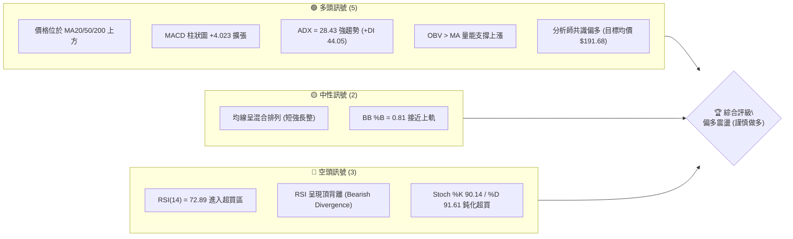
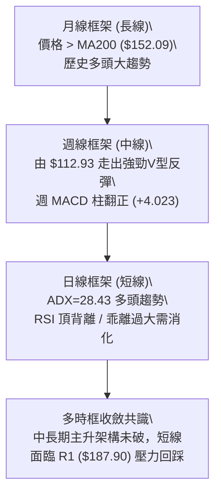
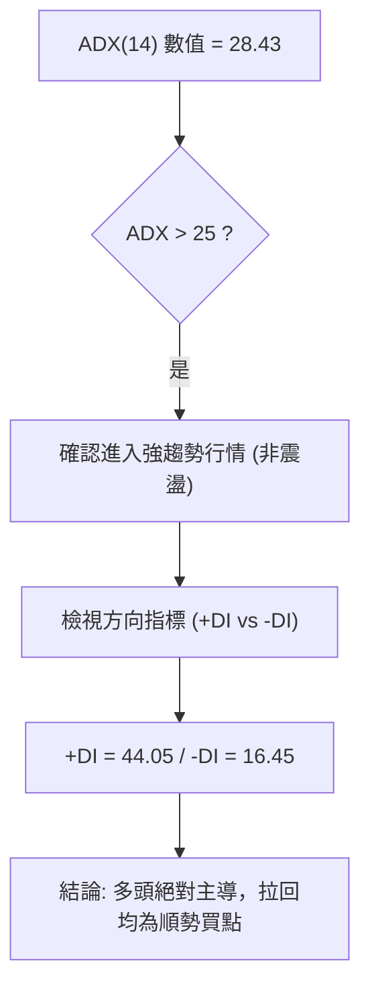
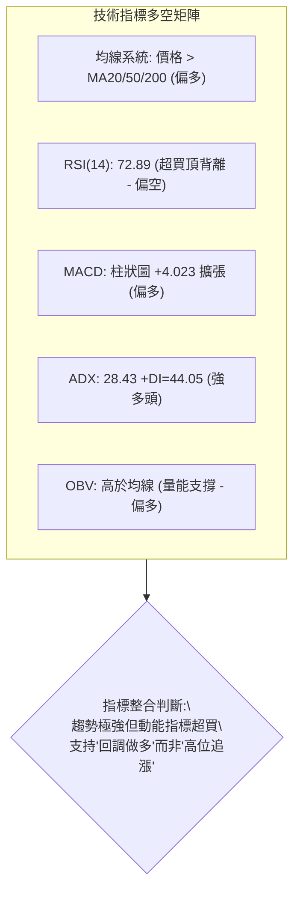
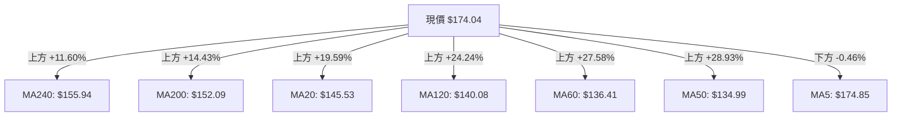
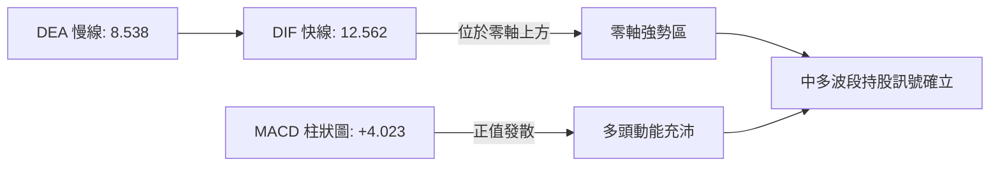
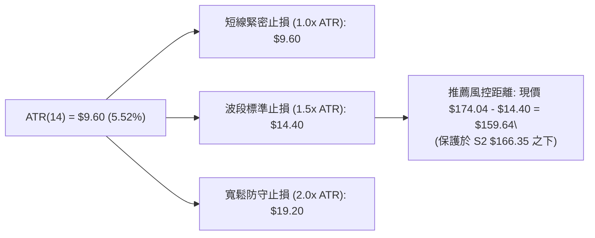
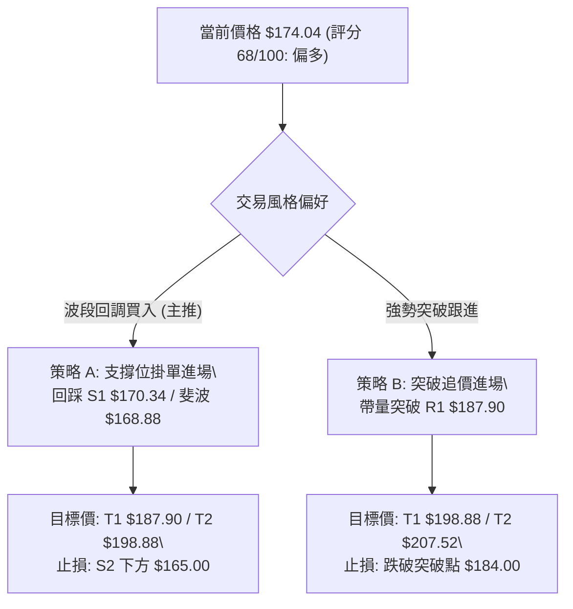
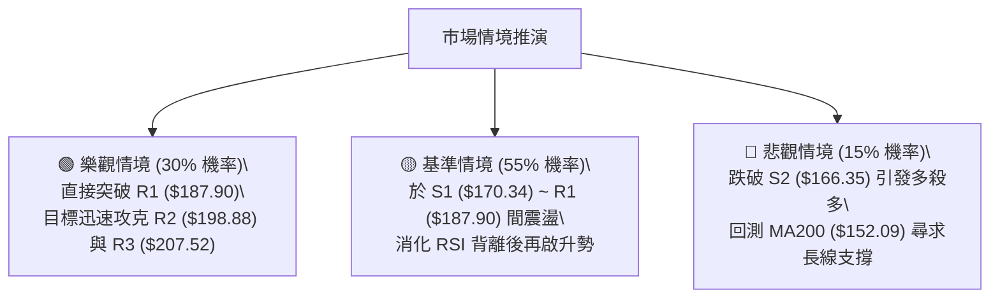

# PLTR 技術分析報告

> **報告日期**：2026-08-16 ｜ **語言**：繁體中文 ｜ **數據來源**：Yahoo Finance ｜ **當前價格**：$174.04

---

## 目錄

| 章節 | 內容 |
|------|------|
| [1. 技術面概覽](#1-技術面概覽) | 訊號儀表板、核心指標、評分卡 |
| [2. 趨勢分析](#2-趨勢分析) | 多時框趨勢、長中短期走勢 |
| [3. 圖表形態分析](#3-圖表形態分析) | 形態識別、K線組合、目標價 |
| [4. 支撐與阻力](#4-支撐與阻力) | 關鍵價位、斐波那契回調 |
| [5. 技術指標深度解讀](#5-技術指標深度解讀) | MA/RSI/MACD/布林/成交量 |
| [6. 動能與波動率](#6-動能與波動率) | 動能評估、ATR、Beta |
| [7. 多時框架總結](#7-多時框架總結) | 時框架評分矩陣 |
| [8. 交易策略建議](#8-交易策略建議) | 多空策略、風險報酬比 |
| [9. 風險提示與監控](#9-風險提示與監控) | 監控指標、風險場景 |

---

## 1. 技術面概覽

### 🎯 技術訊號儀表板



### 📊 核心指標速覽表

| 指標類別 | 指標名稱 | 當前數值 | 訊號 | 解讀 |
|----------|----------|----------|------|------|
| **價格** | 當前價格 | $174.04 | 🟢 | 站上多數均線，逼近 52 週高點 ($207.52) 區間 66.9% |
| **均線** | MA20 | $145.53 | 🟢 | 價格在 MA20 上方 +19.59%，短期動能強勁 |
| **均線** | MA50 | $134.99 | 🟢 | 價格在 MA50 上方 +28.93%，中期支撐穩固 |
| **均線** | MA200 | $152.09 | 🟢 | 價格在 MA200 上方 +14.43%，中長期維持多頭架構 |
| **動能** | RSI(14) | 72.89 | 🔴 | 超買區 (>70)，並已偵測到技術性頂背離訊號 |
| **動能** | MACD (12/26/9) | 12.562 / 8.538 (Hist: +4.023) | 🟢 | 雙線位於零軸上方黃金交叉，多頭動能充足 |
| **動能** | Stoch %K / %D | 90.14 / 91.61 | 🔴 | 極度超買，短期面臨獲利回吐壓力 |
| **趨勢** | ADX (14) | 28.43 (+DI: 44.05 / -DI: 16.45) | 🟢 | 強趨勢展開 (ADX > 25)，多頭完全主導方向 |
| **通道** | 布林通道 (%B) | 0.81 (上軌 $191.30 / 下軌 $99.76) | 🟡 | 位於中上軌強勢區，逼近超買壓力帶 |
| **波動** | ATR(14) | $9.60 (5.52%) | 🟡 | 每日波幅大，需配置寬止損空間 |
| **量能** | OBV / 量比 | 量能支撐 / 0.51x | 🟢 | OBV > MA 表明長線資金沉澱，近期量縮為急漲後整固 |

### 🏆 技術評分卡

```
╔══════════════════════════════════════════════════════════════════╗
║                 技術評分卡 — PLTR (2026-08-16)                  ║
╠══════════════════════════════════════════════════════════════════╣
║ 趨勢強度      ████████████████░░░░  80/100  🟢 強趨勢多頭主導    ║
║ 動能指標      ████████████░░░░░░░░  60/100  🟡 MACD強但RSI背離   ║
║ 支撐穩定度    ██████████████░░░░░░  70/100  🟢 S1/S2/MA密集支撐  ║
║ 成交量配合    ██████████████░░░░░░  70/100  🟢 OBV多頭/週放量    ║
║ 形態完整度    ████████████░░░░░░░░  60/100  🟡 V型反轉頸線測試   ║
║ 均線排列      ██████████████░░░░░░  70/100  🟢 價格全線站上均線  ║
╠══════════════════════════════════════════════════════════════════╣
║ 綜合評分      ██████████████░░░░░░  68/100  🟢 偏多（波段回調買）║
╚══════════════════════════════════════════════════════════════════╝
```

---

## 2. 趨勢分析

### 🌐 多時框趨勢分析



### 📈 長期趨勢 — 12個月走勢圖（Unicode）

```
PLTR 月線走勢圖（2025-08 至 2026-08）
價格軸 ($)
$210 ┤                                              ●(52W高 $207.52 / 2025-10 $200.47)
$190 ┤                                  ●
$170 ┤        ●                   ●                 ●← 當前收盤 $174.04
$150 ┤  ●           ●                                     ●
$130 ┤                    ●           ●       ●
$110 ┤                                            ● (2026-06 底部 $116.67 / 52W低 $106.37)
     └─────────────────────────────────────────────────────────────
       08/25 09/25 10/25 11/25 12/25 01/26 02/26 03/26 04/26 05/26 06/26 07/26 08/26
```

#### 走勢特徵分析表格

| 階段區間 | 起止價位 | 漲跌幅 | 走勢特徵與量價解讀 |
|----------|----------|--------|-------------------|
| **2025/08 - 2025/10** | $156.71 → $200.47 | +27.92% | 主升浪頂部建立，創歷史高點區間 $207.52，量能見頂 |
| **2025/11 - 2026/02** | $200.47 → $137.19 | -31.57% | 高檔獲利回吐，波段大幅回撤，跌破短期均線 |
| **2026/03 - 2026/06** | $146.28 → $116.67 | -20.24% | 築底探底階段，觸及 52 週最低點 $106.37，出現籌碼洗盤 |
| **2026/07 - 2026/08** | $123.06 → $174.04 | +41.43% | 強勢報復性反彈，巨量突破多重均線，重回牛市主升軌道 |

### 📊 中期趨勢（週線分析）

```
週線關鍵阻力與支撐分佈
────────────────────────────────────────────────────────────────
$207.52 ─── [52W High / R3 強阻力] ───────────────────────────
$198.88 ─── [波段密集區 R2 阻力] ─────────────────────────────
$187.90 ─── [近一年波段高點 R1 / 斐波 23.6% $183.65 密集區] ──
$174.04 ─── ◄ 當前價格 (突破斐波 38.2% $168.88)
$170.34 ─── [波段低點支撐 S1] ────────────────────────────────
$166.35 ─── [波段低點支撐 S2] ────────────────────────────────
$152.09 ─── [MA200 生命線 / 斐波 50% $156.95 核心防守] ───────
────────────────────────────────────────────────────────────────
```

### ⚡ 趨勢強度評估（ADX 解讀）



#### ADX 強度對照表

| 指標變數 | 當前數值 | 參考門檻 | 趨勢狀態判定 |
|----------|----------|----------|--------------|
| **ADX(14)** | 28.43 | > 25 (強趨勢) | 趨勢動能確立，脫離低檔盤整區間 |
| **+DI (多頭)** | 44.05 | > 25 | 多方買盤極度強勁，主導盤面 |
| **-DI (空頭)** | 16.45 | < 20 | 空方壓制力道衰退 |
| **綜合判定** | +DI 顯著大於 -DI | 差值 +27.60 | 🟢 **強多頭趨勢行情** |

---

## 3. 圖表形態分析

### 🔍 形態識別系統


#### 形態識別與信心度評估表

| 形態名稱 | 信心度 | 判斷依據（引用數據） | 完成度 | 目標價（附精確計算式） |
|----------|--------|----------------------|--------|------------------------|
| **V型強力反轉** | 75% | 自 2026-06 低點 $112.93 連續放量急拉至 $174.04，站上 MA20/50/200 | 85% | 突破頸線 $168.88 (斐波38.2%)，高度推算：$168.88 + ($168.88 - $112.93) = **$224.83**（理論值，近端受限於 R3 **$207.52**） |
| **雙底結構 (W底)** | 55% | 2026-06 低點 $112.93 與 2026-07 低點 $122.92 構成次級雙底 | 90% | 頸線突破點 $156.54 + ($156.54 - $112.93) = **$200.15**（接近 R2 **$198.88**） |
| **頭肩底形態** | 35% | 左肩 $128.06、頭部 $112.93、右肩 $122.92；右肩拉升過快對稱性不足 | 40% | 訊號不足，僅做指標型解讀 |

### 🕯️ 重要K線形態分析

| 週/月份 | 收盤價 | K線形態 | 解讀 | 訊號 |
|---------|--------|---------|------|------|
| **2026-06 (月線)** | $116.67 | 長下影探底錘頭線 | 測試 52W 低點 $106.37 獲得強力承接，底部成型 | 🟢 多頭轉折 |
| **2026-07 (月線)** | $123.06 | 低檔紅三兵起手式 | 守穩 $120 關卡，籌碼完成換手 | 🟢 築底完成 |
| **2026-08-09 (週線)** | $172.01 | 巨量長陽破位突破 | 週成交量爆出 4.35 億股，帶量突破 $150 壓力帶 | 🟢 極強多頭 |
| **2026-08-16 (週線)** | $174.04 | 高檔小陽十字星 | 放量後縮量整理，於高檔消化獲利盤，未見長上影 | 🟡 多頭整固 |

### 📉 ASCII 走勢形態示意圖

```
PLTR 底部反轉形態示意圖
══════════════════════════════════════════════════════════════════
$187.90 ─ ─ ─ ─ ─ ─ ─ ─ ─ ─ ─ ─ ─ ─ ─ ─ ─ ─ ─ ─ ─ ─ ─ ─ ─ [阻力 R1]
                                                 ▲
                                                / \  $174.04 (現價突破)
$156.54 ─────── 頸線突破位 ────────────────────/───\─────────────
               \              /  \            /
                \            /    \          /
$122.92 ─ ─ ─ ─  \          /      \________/ (右底 2026-07)
                  \        /
$112.93 ─ ─ ─ ─ ─  \______/ (左底/最低點 2026-06)
══════════════════════════════════════════════════════════════════
```

### 🎯 形態目標價計算

1. **雙底形態量度目標**：
   - 頸線位置：$156.54（2026-05 波段高點）
   - 形態底部：$112.93（2026-06 低點）
   - 形態垂直高度：$156.54 - $112.93 = $43.61
   - 理論推算目標價：$156.54 + $43.61 = **$200.15**（與阻力位 R2 **$198.88** 高度契合）
2. **斐波那契回調對應目標**：
   - 當前已有效突破 38.2%（$168.88），下一波段測幅目標直指 23.6%（**$183.65**）與前期波段高點聚類 R1（**$187.90**）。

---

## 4. 支撐與阻力

### 🗺️ 關鍵價位分布圖（Unicode）

```
PLTR 價位結構分布圖
══════════════════════════════════════════════════════════════════
$207.52 ║██████████████████████████████║ 強阻力 R3 (52W High)
$198.88 ║████████████████████          ║ 阻力 R2 (形態推算目標)
$187.90 ║████████████████████████      ║ 關鍵阻力 R1 (波段高點聚類)
$183.65 ║──────────────────────────────║ 斐波那契 23.6% 回調位
$174.04 ╠══════════════════════════════╣ ◄ 當前價格現價
$170.34 ║▓▓▓▓▓▓▓▓▓▓▓▓▓▓▓▓▓▓▓▓▓▓        ║ 近期支撐 S1 (波段低點聚類)
$168.88 ║──────────────────────────────║ 斐波那契 38.2% 轉換支撐
$166.35 ║▓▓▓▓▓▓▓▓▓▓▓▓▓▓▓▓              ║ 強支撐 S2 (波段低點聚類)
$161.27 ║▓▓▓▓▓▓▓▓▓▓▓▓                  ║ 防守支撐 S3 (波段低點聚類)
$152.09 ║██████████████████████████████║ 長期生命線 MA200
══════════════════════════════════════════════════════════════════
```

### 🚧 阻力位分析表

| 阻力級別 | 精確價位 | 形成原因 | 突破難度 | 重要性 |
|----------|----------|----------|----------|--------|
| **R1** | **$187.90** | 近一年波段高點聚類，接近斐波 23.6% ($183.65) | 中等 | 🟢 短線多頭第一攻堅目標 |
| **R2** | **$198.88** | 近一年波段高點聚類，雙底形態等距測幅點 | 較高 | 🟡 中期多空分水嶺 |
| **R3** | **$207.52** | 52 週歷史最高點 (52W High)，歷史套牢籌碼峰 | 極高 | 🔴 強阻力，預期面臨重大拋壓 |

### 🛡️ 支撐位分析表

| 支撐級別 | 精確價位 | 形成原因 | 守住機率 | 重要性 |
|----------|----------|----------|----------|--------|
| **S1** | **$170.34** | 近一年波段低點聚類，短線回調首道防線 | 75% | 🟢 短線順勢做多進場點 |
| **S2** | **$166.35** | 近一年波段低點聚類，斐波 38.2% ($168.88) 下方緩衝區 | 85% | 🟡 波段多頭核心止損位 |
| **S3** | **$161.27** | 近一年波段低點聚類，跌破則宣告短多走弱 | 90% | 🔴 跌破需全面減倉觀望 |

### 📐 斐波那契回調位分析

> **計算基基準**：52 週區間 **$106.37** (0.0% 低點) → **$207.52** (100.0% 高點)

| 斐波那契回調級別 | 精確價位 | 當前相對位置與技術意涵 |
|------------------|----------|------------------------|
| **0.0% (52W High)** | **$207.52** | 歷史極值壓力區 |
| **23.6%** | **$183.65** | **上檔即時阻力**：位於現價上方 +5.52%，與 R1 ($187.90) 形成密集阻力帶 |
| **現價落點** | **$174.04** | **處於 23.6% ($183.65) 與 38.2% ($168.88) 之間，多頭掌控區間** |
| **38.2%** | **$168.88** | **下檔即時支撐**：前波阻力已轉化為強支撐，與 S1 ($170.34) 重疊 |
| **50.0%** | **$156.95** | 多空中軸線，與頸線突破口位置契合 |
| **61.8%** | **$145.01** | 黃金分割強支撐，緊貼 MA20 ($145.53) |
| **78.6%** | **$128.02** | 深度回調防守區 |
| **100.0% (52W Low)**| **$106.37** | 週期大底部 |

---

## 5. 技術指標深度解讀

### 🎛️ 指標訊號總覽



### 📈 移動平均線排列分析



#### 均線特徵解讀
- **均線排列狀態**：系統顯示為「混合排列」，主因在於中長期均線（MA120 $140.08 / MA240 $155.94）尚未完全完成多頭發散，但價格已全線站上所有中長期均線。
- **短期乖離率**：現價距離 MA20 ($145.53) 乖離達 +19.59%，距離 MA50 ($134.99) 達 +28.93%，顯示短期漲勢過急，存在技術性收斂乖離之回踩需求。

### 📉 RSI(14) 分析

- **當前數值**：`72.89` 
  - 進度條：`███████████████░░░░░ 72.89%`（處於 70 以上超買區）
- **背離判斷**：⚠️ **確認存在頂背離 (Bearish Divergence)**
  - **細節分析**：價格自 2026-08-09 的 $172.01 推進至 2026-08-16 的 $174.04（創反彈新高），然而週線 MACD 柱狀圖由 `+4.790` 縮減至 `+4.023`，且日線級別 RSI 於超買區出現斜率放緩與動能遞減，呈現典型的價格創新高而指標動能未同步放大的頂背離現象。
  - **操作意涵**：頂背離在強趨勢中（ADX > 25）通常以「高檔橫盤震盪」或「回踩 S1 $170.34 / S2 $166.35」方式消化，而非立即崩跌。

### 📊 MACD(12/26/9) 訊號解讀



- **柱狀圖動態**：當前 MACD 柱狀圖為 `+4.023`，雖較前週 `+4.790` 略微收斂，但雙線（12.562 與 8.538）大幅發散於零軸之上，確認為強多頭主升段。

### 📦 布林通道分析

```
布林通道 (20, 2) 結構示意圖
══════════════════════════════════════════════════════════════════
$191.30 ──────────────────────────────────────── 上軌 (超買擴張壓迫)
$174.04 ════════════════════════════════════════ ◄ 現價 (%B = 0.81)
$145.53 ──────────────────────────────────────── 中軌 (MA20 生命線)
$99.76  ──────────────────────────────────────── 下軌
══════════════════════════════════════════════════════════════════
```

- **通道指標解析**：`BB %B = 0.81`，價格運行於中軌與上軌間的強勢通道內（Band Walk）。通道帶寬顯著擴張，表明波動率放大，若未跌破中軌 $145.53，中線多頭格局不變。

### 💹 成交量分析（量價配合度）

```
量能動態監控
────────────────────────────────────────────────────────────────
最新日成交量   ██████████░░░░░░░░░░  23,985,400 (量比: 0.51x)
20日均量       ████████████████████  46,955,165
50日均量       ██████████████████░░  43,688,346
週成交量 (08/09) ████████████████████  435,164,800 (爆量起動)
週成交量 (08/16) █████████░░░░░░░░░░░  196,282,100 (縮量整固)
────────────────────────────────────────────────────────────────
```

- **量價配合度解讀**：
  - 2026-08-09 週成交量爆出 4.35 億股推升股價至 $172.01，顯示機構法人買盤大舉介入；最新一週縮量至 1.96 億股並收在 $174.04，呈現「價漲量縮的高檔整固」型態。
  - **OBV 趨勢**：OBV > MA，量能指標穩健上揚，確認資金並未出逃，長線多頭籌碼結構健康。

---

## 6. 動能與波動率

### ⚡ 動能評估四象限

| 象限 | 動能強度 (ADX/MACD) | 波動率水準 (ATR/Beta) | 當前判定 | 特徵與策略意涵 |
|------|---------------------|-----------------------|----------|----------------|
| **Q1 (高動能·低波動)** | 強 | 低 | — | 穩定單邊趨勢，最佳加碼區 |
| **Q2 (弱動能·低波動)** | 弱 | 低 | — | 盤整築底區，適合網格操作 |
| **Q3 (高動能·高波動)** | **強 (ADX 28.43)** | **高 (Beta 1.56 / ATR 5.52%)** | **✓ PLTR** | **強趨勢高波幅行情，適合回調順勢做多，嚴控止損距離** |
| **Q4 (弱動能·高波動)** | 弱 | 高 | — | 無序震盪洗盤，避免盲目進場 |

### 📊 ATR 波動率分析



- **波動率特性**：ATR 為 **$9.60**，佔當前股價比例達 **5.52%**，屬於高波動成長股特性。單日震盪幅度常達 $10 區間，因此短線交易不可將止損設置過窄，避免被隨機雜訊掃出場。

### 📐 Beta 與市場相關性

- **Beta 係數**：`1.563`
- **市場敏感度解讀**：PLTR 波動度為大盤（S&P 500）的 1.56 倍，具備高度進攻性。在大盤上行週期中具備顯著超額收益（Alpha）潛力，但在市場系統性回調時亦會放大下行風險。
- **法人籌碼**：機構持股比例達 **64.8%**，空頭回補天數（Short Ratio）僅 1.87，無顯著軋空風險，走勢主要受機構資金配置與基本面高成長（營收 YoY +92.8%）驅動。

---

## 7. 多時框架總結

### 📋 時框架評分表

| 時框架 | 趨勢方向 | 動能指標 | 均線排列 | 形態結構 | 綜合評分 | 操作建議 |
|--------|----------|----------|----------|----------|----------|----------|
| **月線 (長期)** | 🟢 多頭 | 偏多 (站上MA200) | 偏多 (均線由平轉升) | 長期大上升通道 | **80/100** | 長線波段持股續抱 |
| **週線 (中期)** | 🟢 多頭 | 極強 (MACD柱翻正) | 偏多 (突破全均線) | V型底突破頸線 | **75/100** | 逢回調分批做多 |
| **日線 (短期)** | 🟡 震盪偏多 | 超買 (RSI頂背離) | 混合 (乖離過大) | 頂部滯漲整理 | **60/100** | 不追高，回踩支撐進場 |

### 🔲 綜合訊號矩陣

```
時框架訊號矩陣
────────────────────────────────────────────────────────────────
指標 / 週期       日線 (短期)       週線 (中期)       月線 (長期)
────────────────────────────────────────────────────────────────
趨勢方向 (ADX)    🟢 強趨勢 (28.4)  🟢 上升趨勢       🟢 多頭通道
均線排列          🟡 乖離過大       🟢 向上突破       🟢 站上MA200
動能狀態 (RSI)    🔴 超買背離(72.9) 🟢 良好擴張(70.0) 🟢 偏多回升
MACD 訊號         🟢 雙線金叉       🟢 柱狀擴張(+4.0) 🟢 零軸上方
量價結構          🟡 高檔量縮       🟢 突破放量       🟢 OBV多頭
────────────────────────────────────────────────────────────────
收斂結果          短期需消化超買    中期主升推動      長期牛市確立
────────────────────────────────────────────────────────────────
```

### ⚖️ 多時框收斂結論

- **趨勢類型判定**：**ADX(14) = 28.43 > 25**，依收斂規則確認當前處於**明確之強趨勢行情**。
- **主導時框取捨**：依規則以**中長期（週線 / MA50 / MA200）方向為主導**，日線級別的 RSI 頂背離僅作為「尋找短線進場時機與回踩買點」的工具，不得逆勢開空。
- **唯一方向性結論**：🟢 **偏多（拉回支撐做多）**。

---

## 8. 交易策略建議

### 🗺️ 策略決策流程圖



### 🧭 策略路由

> **當前主策略方向 = 偏多操作（依綜合評分 68/100 確立主推多頭策略，空頭僅列為風控對沖提醒）**

### 🎯 價格情境階梯（Price Scenarios）

| 觸發條件 | 下一目標 | 後續延伸 | 情境含義與操作指引 |
|----------|----------|----------|-------------------|
| **帶量突破 R1 ($187.90)** | **R2 ($198.88)** | **R3 ($207.52)** | 短線強勢重啟，挑戰 52W 歷史極值 |
| **守穩 S1 ($170.34) ~ 現價** | **R1 ($187.90)** | **R2 ($198.88)** | 高檔消化背離，蓄勢向上推進 |
| **跌破 S1 ($170.34)** | **S2 ($166.35)** | **S3 ($161.27)** | 短線轉入深幅回調，測試斐波 38.2% 支撐 |

### 📊 情境機率分佈

| 情境劇本 | 預估機率 | 主要技術依據 |
|----------|----------|--------------|
| **高檔回踩後繼續上行** | **60%** | ADX=28.43 強趨勢確立、MACD 處於零軸上方、OBV 量能多頭主導 |
| **區間震盪整理 (消化背離)** | **25%** | RSI(14)=72.89 超買、Stoch 高檔鈍化、最新日成交量量比僅 0.51x |
| **深度回落再探底** | **15%** | 跌破波段支撐 S2 ($166.35) 且均線失守之極端風險情境 |

### 🟢 主策略詳情

| 策略要素 | 策略 A（波段回調買入 — 首選） | 策略 B（強勢突破跟進 — 次選） |
|----------|--------------------------------|--------------------------------|
| **進場條件** | 價格回踩 S1 支撐或斐波 38.2% 出現止跌K線 | 價格帶量突破近一年波段高點 R1 |
| **進場價格** | **$170.34**（波段低點聚類 S1） | **$188.50**（確認突破 R1 $187.90） |
| **目標價 T1** | **$187.90**（波段阻力 R1，預期 +10.31%） | **$198.88**（波段阻力 R2，預期 +5.51%） |
| **目標價 T2** | **$198.88**（波段阻力 R2，預期 +16.75%） | **$207.52**（52W高點 R3，預期 +10.09%） |
| **止損價格** | **$165.00**（跌破 S2 $166.35 關鍵位，風險 -3.13%）| **$184.00**（跌回斐波23.6% $183.65之下，風險 -2.39%） |
| **風險報酬比 (R:R)** | **3.29 : 1**（以 T1 計算） / **5.35 : 1**（以 T2 計算） | **2.31 : 1**（以 T1 計算） / **4.22 : 1**（以 T2 計算） |
| **成功機率** | **65%** | **55%** |
| **建議倉位** | **15% - 20%** 總資金 | **10%** 總資金（突破後分批建立） |

### 🔴 反向風險觸發點（對沖提示）

- **多頭結構破壞點**：若日線收盤價有效跌破 **S2 ($166.35)** 且跌穿斐波那契 38.2% (**$168.88**)，表明此波自 $112.93 展開之 V 型反彈動能衰竭。
- **對沖處置建議**：多頭部位應減倉 50% 以上，跌破 **S3 ($161.27)** 則全面離場觀望；激進交易者方可考慮於 $165.00 跌破後以小倉位（< 5%）介入空單對沖，回補目標下看斐波 50% (**$156.95**)。

### ⭐ 整體訊號強度評星

```
╔══════════════════════════════════════════════════════════════════╗
║ 做多訊號強度：★★★★☆  (4/5星) — 趨勢明確、量能充沛、均線支撐強    ║
║ 做空訊號強度：★☆☆☆☆  (1/5星) — 逆大趨勢、僅具短線回調風險      ║
║ 整體可信度：  ★★★★☆  (4/5星) — 多時框指標高度收斂共識          ║
╚══════════════════════════════════════════════════════════════════╝
```

---

## 9. 風險提示與監控

### ✅ 關鍵監控指標 Checklist

```
╔══════════════════════════════════════════════════════════════════╗
║                    每日盤面風控監控清單                          ║
╠══════════════════════════════════════════════════════════════════╣
║ [ ] 價格是否守穩 S1 ($170.34) 與斐波 38.2% ($168.88)            ║
║ [ ] 日線 RSI(14) 是否跌破 60 或向下修復完畢解除背離             ║
║ [ ] 日成交量是否回升至 20日均量 (46.95M) 以上之放量配合狀態     ║
║ [ ] MACD 柱狀圖是否持續維持正值 (> 0)                            ║
║ [ ] 價格是否向上挑戰並突破 R1 ($187.90) 關卡                    ║
║ [ ] 大盤系統性波動 (Beta 1.56 放大效應監控)                     ║
╚══════════════════════════════════════════════════════════════════╝
```

### ⚠️ 風險場景分析



### 🛡️ 風險管理重要提醒

1. **嚴防高檔乖離修正**：當前股價距離 MA50 乖離達 +28.93%，且 RSI 達 72.89 超買。**嚴禁在現價 $174.04 以上盲目全倉追高**，必須採取「分批進場」或「等待回踩 S1/S2」之紀律化策略。
2. **波動率與倉位管理**：鑑於 PLTR 的 ATR 達 $9.60 (5.52%) 且 Beta 為 1.563，單筆交易虧損上限應控制在總資金之 1%~1.5% 內。單一標的持倉建議不超過總投資組合之 20%。
3. **止損紀律執行**：若執行策略 A，一旦價格跌破 $165.00（S2 緩衝區下方），必須嚴格執行止損，切勿將短線波段交易轉為被動長線套牢。

---

## 📋 報告總結

```
╔══════════════════════════════════════════════════════════════════╗
║                     PLTR 技術分析報告總結                        ║
╠══════════════════════════════════════════════════════════════════╣
║ 報告日期：2026-08-16                                            ║
║ 當前價格：$174.04                                                ║
║ 分析評級：🟢 偏多（波段回調做多 / 逢低佈局）                     ║
║                                                                  ║
║ 關鍵結論：                                                       ║
║ ├─ 長期趨勢：🟢 站穩 MA200 ($152.09)，大週期多頭形態重啟         ║
║ ├─ 中期趨勢：🟢 V型底反轉突破頸線，ADX=28.43 強趨勢展開           ║
║ ├─ 短期趨勢：🟡 RSI(72.89) 頂背離，短線面臨高檔震盪或回踩        ║
║ ├─ 關鍵支撐：S1: $170.34 ｜ S2: $166.35 ｜ S3: $161.27           ║
║ ├─ 關鍵阻力：R1: $187.90 ｜ R2: $198.88 ｜ R3: $207.52           ║
║ └─ 分析師目標：均價 $191.68（最高 $255.00 / 最低 $80.00）        ║
║                                                                  ║
║ 最優策略組合：                                                   ║
║ 1. 🥇 最佳機會：策略 A（回踩 S1 $170.34 分批做多，止損 $165.00， ║
║                  第一目標 $187.90，風報比 3.29:1）               ║
║ 2. 🥈 次選機會：策略 B（帶量突破 R1 $187.90 追價，目標 $198.88）║
║ 3. 🥉 保守選擇：等待股價回踩斐波 38.2% ($168.88) 構築雙底確認進場║
╚══════════════════════════════════════════════════════════════════╝
```

---

> ⚠️ **免責聲明**：本報告為 AI 自動生成之技術分析，所有數據及估算均基於提供的歷史價格資訊。本報告**僅供研究與學術參考**，**不構成任何投資建議**。投資有風險，入市需謹慎。

---

*報告生成時間：2026-08-16 ｜ 數據來源：Yahoo Finance ｜ 分析框架：多時框技術分析*