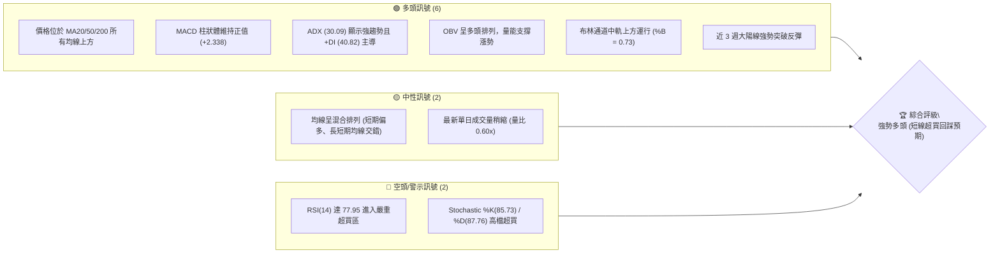
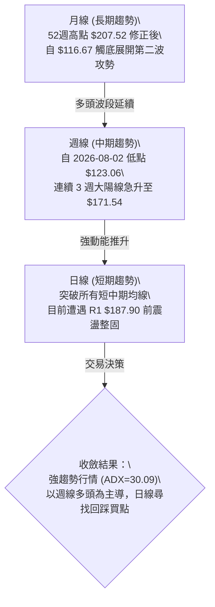
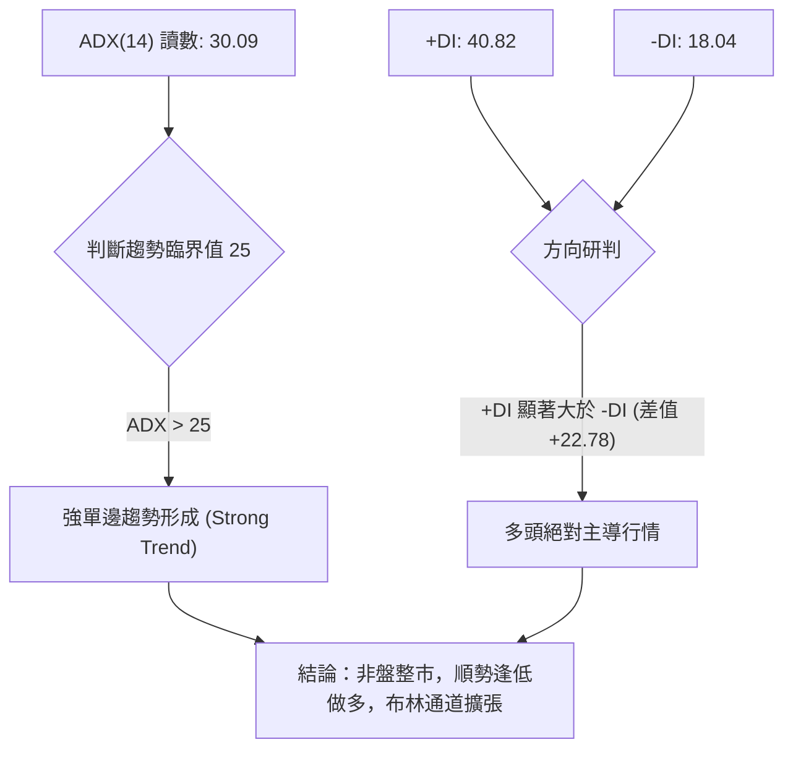
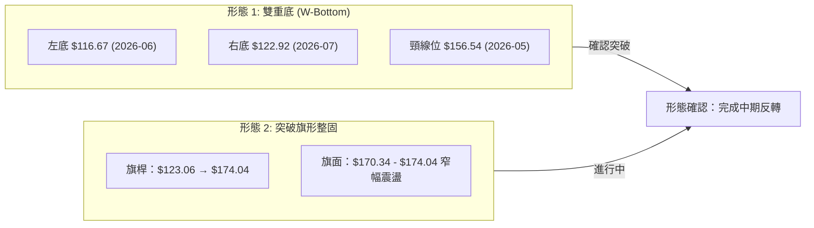
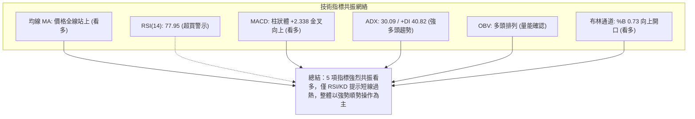
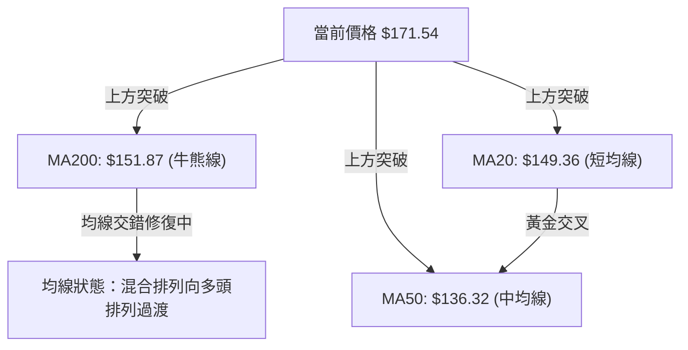
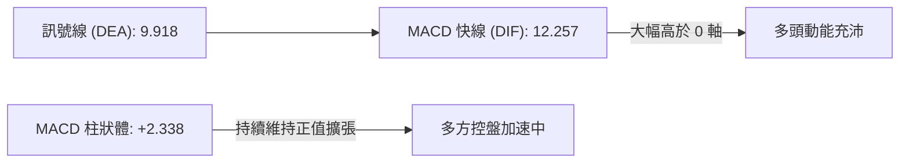
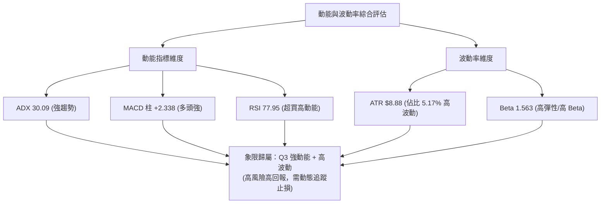
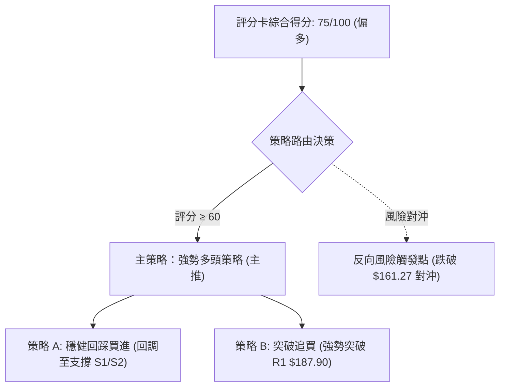
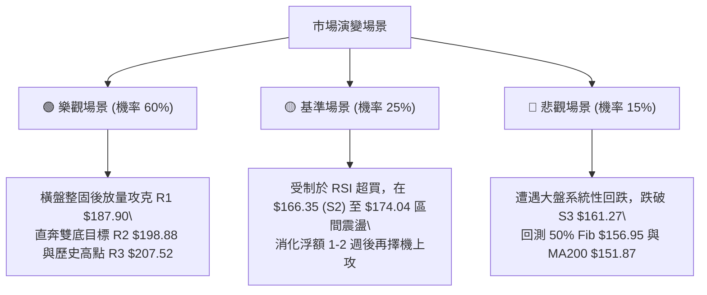

# PLTR 技術分析報告

> **報告日期**：2026-08-18 ｜ **語言**：繁體中文 ｜ **數據來源**：Yahoo Finance ｜ **當前價格**：$171.54

---

## 目錄

| 章節 | 內容 |
|------|------|
| [1. 技術面概覽](#1-技術面概覽) | 訊號儀表板、核心指標、評分卡 |
| [2. 趨勢分析](#2-趨勢分析) | 多時框趨勢、長中短期走勢 |
| [3. 圖表形態分析](#3-圖表形態分析) | 形態識別、K線組合、目標價 |
| [4. 支撐與阻力](#4-支撐與阻力) | 關鍵價位、斐波那契回調 |
| [5. 技術指標深度解讀](#5-技術指標深度解讀) | MA/RSI/MACD/布林/成交量 |
| [6. 動能與波動率](#6-動能與波動率) | 動能評估、ATR、Beta |
| [7. 多時框架總結](#7-多時框架總結) | 時框架評分矩陣 |
| [8. 交易策略建議](#8-交易策略建議) | 多空策略、風險報酬比 |
| [9. 風險提示與監控](#9-風險提示與監控) | 監控指標、風險場景 |

---

## 1. 技術面概覽

### 🎯 技術訊號儀表板



### 📊 核心指標速覽表

| 指標類別 | 指標名稱 | 當前數值 | 訊號 | 解讀 |
|----------|----------|----------|------|------|
| **價格** | 當前價格 | $171.54 | 🟢 | 站上多數均線，位於 52 週區間 64.4% 位置 |
| **均線** | MA20 | $149.36 | 🟢 | 價格在 MA20 上方 +14.85%，短中期多頭主導 |
| **均線** | MA50 | $136.32 | 🟢 | 價格在 MA50 上方 +25.84%，中期趨勢轉強 |
| **均線** | MA200 | $151.87 | 🟢 | 價格突破牛熊分界線 MA200 上方 +12.95% |
| **動能** | RSI(14) | 77.95 | 🔴 | 進入超買區 (>70)，短線有技術性消化獲利盤需求 |
| **動能** | MACD (12,26,9) | 12.257 (柱 +2.338) | 🟢 | MACD 線高於訊號線 (9.918)，多頭動能強勁 |
| **動能** | KD (Stoch 14) | %K 85.73 / %D 87.76 | 🔴 | 極端超買區，存在高檔鈍化或拉回修正壓力 |
| **趨勢** | ADX (14) | 30.09 (+DI 40.82) | 🟢 | ADX > 25 確認進入單邊強趨勢，多方完全掌控 |
| **通道** | Bollinger Bands | 帶寬 ($101.71 - $197.01) | 🟢 | %B 為 0.73，朝上軌推進，處於多頭通道中 |
| **波動** | ATR(14) | $8.88 | 🟡 | 佔價格 5.17%，日內波動度偏高，需設置充裕止損 |
| **量能** | OBV / 量比 | OBV > MA (量比 0.60x) | 🟢 | 中期放量突破後短線量縮整理，量價配合健康 |

### 🏆 技術評分卡

```
╔══════════════════════════════════════════════════════════════════╗
║              技術評分卡 — PLTR (2026-08-18)                      ║
╠══════════════════════════════════════════════════════════════════╣
║ 趨勢強度      ████████████████░░░░  82/100  🟢 強勢多頭 (ADX>30) ║
║ 動能指標      ██████████████░░░░░░  70/100  🟡 動能強但指標超買 ║
║ 支撐穩定度    ████████████████░░░░  78/100  🟢 S1/S2 與斐波支撐穩固║
║ 成交量配合    ██████████████░░░░░░  72/100  🟢 週放量突破、日量暫縮 ║
║ 形態完整度    ████████████████░░░░  80/100  🟢 V型反轉與築底完成 ║
║ 均線排列      ████████████░░░░░░░░  64/100  🟡 混合排列 (修復進行中)║
╠══════════════════════════════════════════════════════════════════╣
║ 綜合評分      ███████████████░░░░░  75/100  🟢 強勢多頭 / 拉回買進║
╚══════════════════════════════════════════════════════════════════╝
```

---

## 2. 趨勢分析

### 🌐 多時框趨勢分析



### 📈 長期趨勢 — 12個月走勢圖（Unicode）

```
PLTR 月線走勢圖（過去 12 個月：2025-08 至 2026-08）
價格 ($)
$210 ┤                               ● $200.47 (10月頂部)
$195 ┤                        ●
$180 ┤                  ●              ●       ● $171.54 (當前 08月)
$165 ┤            ●              ●
$150 ┤      ●                                ●
$135 ┤                                             ●
$120 ┤                                                  ● $116.67 (06月低點)
$105 └────────────────────────────────────────────────────────
       08月  09月  10月  11月  12月  01月  02月  03月  04月  05月  06月  07月  08月
      '25   '25   '25   '25   '25   '26   '26   '26   '26   '26   '26   '26   '26
```

#### 走勢特徵分析表格

| 階段區間 | 起止價格 | 漲跌幅 | 趨勢特徵與結構解讀 |
|----------|----------|--------|-------------------|
| **2025-08 ~ 2025-10** | $156.71 → $200.47 | +27.92% | 主升浪衝頂階段，創下 52 週歷史高位 $207.52 區域 |
| **2025-11 ~ 2026-02** | $200.47 → $137.19 | -31.57% | 獲利回吐引發波段深幅回調，均線系統開始收斂轉向 |
| **2026-03 ~ 2026-05** | $137.19 → $156.54 | +14.10% | 區間反彈震盪，測試上方阻力後動能衰竭 |
| **2026-06 ~ 2026-07** | $156.54 → $116.67 | -25.47% | 築底洗盤階段，於 $116.67 / $123.06 構築堅實雙重底 |
| **2026-08 (迄今)** | $123.06 → $171.54 | +39.39% | 爆發性 V 型反轉，伴隨單週 4.35 億股天量突破多重阻力 |

### 📊 中期趨勢（週線分析）

```
近期週線壓力與支撐結構示意：
[阻力 3]  $207.52 (52週最高點 / 0.0% Fib) ══════════════════
[阻力 2]  $198.88 (波段前高密集成交區)   ──────────────────
[阻力 1]  $187.90 (23.6% Fib 附近壓力帶) ──────────────────
[當前價]  $171.54 ▲ (突破 38.2% Fib $168.88)
[支撐 1]  $170.34 (前週高點轉化支撐)     ──────────────────
[支撐 2]  $166.35 (近期突破平台支撐)     ──────────────────
[支撐 3]  $161.27 (50% Fib $156.95 上方緩衝區) ════════════
```

### ⚡ 趨勢強度評估（ADX 解讀）



#### ADX 趨勢強度對照表

| 指標變數 | 當前數值 | 參考閾值 | 狀態評估 | 交易意涵 |
|----------|----------|----------|----------|----------|
| **ADX(14)** | **30.09** | > 25 (強趨勢) | 🟢 強勁趨勢確立 | 擺脫 6-7 月低位震盪，進入趨勢追隨交易模式 |
| **+DI (多方)** | **40.82** | > 25 | 🟢 多方動能充沛 | 買盤積極推升，多方控盤力度極高 |
| **-DI (空方)** | **18.04** | < 20 | 🟢 空方力量潰散 | 賣壓受到全面壓制，空頭回補加速推進 |
| **DI 差值 (+DI - -DI)** | **+22.78** | > +15 | 🟢 單邊多頭噴發 | 趨勢慣性強，回調幅度預期有限 |

---

## 3. 圖表形態分析

### 🔍 形態識別系統



#### 形態信心度與計算表格

| 形態名稱 | 信心度 | 判斷依據（引用實際數據） | 完成度 | 目標價（附精確計算式） |
|----------|--------|--------------------------|--------|------------------------|
| **雙重底 (W-Bottom)** | **85%** | 兩次波段低點分別為 2026-06 收盤 $116.67 與 2026-07 低點 $122.92；2026-08-09 當週以大陽線放量 4.35 億股突破頸線 $156.54 | 100% (已突破) | **第一目標價 $196.41**<br>計算式：頸線 $156.54 + 形態高度 ($156.54 - $116.67 = $39.87) = **$196.41** (接近阻力 R2 $198.88) |
| **V型爆發反轉** | **75%** | 2026-08-02 的 $123.06 於 2 週內直線拉升至 $174.04，收復前 3 個月所有跌幅，MACD 柱由負轉正達 +4.790 | 90% | **測量目標價 $207.52**<br>計算式：回補 52 週歷史高點 $207.52 缺口 |
| **高檔旗形整理 (Bull Flag)** | **60%** | 在 2026-08-16 創出 $174.04 波段高點後，當週回落至 $171.54，振幅收窄於 S1 $170.34 之上 | 65% (孕育中) | **延續目標價 $187.90**<br>計算式：直接指向阻力位 R1 $187.90 |

### 🕯️ 重要K線形態分析

| 週期/日期 | 收盤價 | K線形態 | 解讀 | 訊號 |
|-----------|--------|---------|------|------|
| **2026-06-28 (週)** | $112.93 | 破底長下影十字星 | 空方力竭，觸及 52 週低點區 ($106.37) 引發主力承接 | 🟢 觸底反轉 |
| **2026-07-26 (週)** | $122.92 | 雙底右腳確認陽線 | 回踩不破前低，量縮洗盤完成，築底結構確立 | 🟢 築底完成 |
| **2026-08-09 (週)** | $172.01 | 爆量突破大長陽線 | 漲幅近 40%，單週成交量放大至 4.35 億股，突破 MA20/50/200 | 🟢 強烈買進 |
| **2026-08-16 (週)** | $174.04 | 高檔窄幅高位孕線 | 衝高觸及 $174.04 後微幅消化獲利盤，維持在強勢區 | 🟡 高檔整理 |
| **2026-08-23 (週至今)**| $171.54 | 縮量回踩中繼線 | 成交量縮至 5257 萬股，於支撐位 S1 ($170.34) 上方強勢蓄勢 | 🟢 蓄勢待發 |

### 📉 ASCII 走勢形態示意圖

```
PLTR 中期雙底突破與測幅走勢圖
價格 ($)
$200 ┤                                                   [R2 目標 $196.41 ~ $198.88]
$190 ┤                                             . ↗ (預期延伸路徑)
$180 ┤                                       . ↗ [R1 $187.90]
$170 ┤                                  ● $171.54 (現價整固)
$160 ┤               [頸線 $156.54] ───/─●───────────
$150 ┤       ● $146.28               /
$140 ┤      / \                     /
$130 ┤     /   \       ● $129.30   /
$120 ┤    /     \     / \         /
$110 ┤   /       ●───/───●───────/
     └──┴─────────┴───────┴───────┴────────────────────
        04月     06月底   07月底  08月中
               [底1:$116.67] [底2:$122.92]
```

### 🎯 形態目標價計算

1. **雙底形態測幅（高信心度 85%）**：
   - 形態底部最低收盤價：$116.67（2026年6月）
   - 形態突破頸線位置：$156.54（2026年5月高點收盤）
   - 形態垂直高度 $H = \$156.54 - \$116.67 = \$39.87$
   - 突破等幅測量目標 $T_1 = \text{頸線} + H = \$156.54 + \$39.87 =$ **$196.41**
   - 與關鍵阻力位 **R2 ($198.88)** 高度共振。

2. **52週大區間回撤回補測幅（信心度 75%）**：
   - 52W 低點 $106.37 向上推動至 52W 高點 $207.52 之全幅回歸。
   - 當前價格站穩 38.2% 斐波回調位 $168.88，下一目標即為 23.6% 斐波位 **$183.65** 與阻力位 **R1 ($187.90)**。

---

## 4. 支撐與阻力

### 🗺️ 關鍵價位分布圖（Unicode）

```
PLTR 價位結構分布圖
══════════════════════════════════════════════════════════════════
$207.52 ║██████████████████████████████║ 強阻力 R3 / 52W 最高點 / 0.0% Fib
$198.88 ║██████████████████████        ║ 阻力 R2 / 雙底測幅目標區 ($196.41)
$187.90 ║████████████████              ║ 關鍵阻力 R1 / 近一年波段高點聚類
$183.65 ║▓▓▓▓▓▓▓▓▓▓▓▓▓▓                ║ 斐波那契 23.6% 回調位
────────╫──────────────────────────────╫──────────────────────────
$171.54 ╠══════════════════════════════╣ ◄ 現價 ($171.54)
────────╫──────────────────────────────╫──────────────────────────
$170.34 ║▓▓▓▓▓▓▓▓▓▓▓▓▓▓▓▓▓▓▓▓          ║ 近期核心支撐 S1 (-0.70%)
$168.88 ║▓▓▓▓▓▓▓▓▓▓▓▓▓▓▓▓▓▓            ║ 斐波那契 38.2% 回調位
$166.35 ║████████████████████          ║ 強支撐 S2 (-3.03%)
$161.27 ║████████████████████████      ║ 波段重要支撐 S3 (-5.99%)
$156.95 ║██████████████████████████    ║ 斐波那契 50.0% / 頸線突破位 ($156.54)
$151.87 ║████████████████████████████  ║ 牛熊分水嶺 MA200
══════════════════════════════════════════════════════════════════
```

### 🚧 阻力位分析表

| 阻力級別 | 價位 | 距現價幅幅 | 形成原因（波段高點聚類） | 突破難度 | 重要性 |
|----------|------|------------|--------------------------|----------|--------|
| **R1** | **$187.90** | +9.54% | 近一年波段次高點密集套牢區，臨近 23.6% 斐波位 ($183.65) | 🟡 中等 | 關鍵短線攻防線 |
| **R2** | **$198.88** | +15.94% | 2025年10月歷史次高收盤群 ($200.47) 聚類區，雙底形態目標 | 🔴 較高 | 中期波段強阻力 |
| **R3** | **$207.52** | +20.97% | 52週歷史最高點 (52W High)，全市場心理極限關卡 | 🔴 極高 | 長期天花板/歷史極值 |

### 🛡️ 支撐位分析表

| 支撐級別 | 價位 | 距現價幅幅 | 形成原因（波段低點聚類） | 守住機率 | 重要性 |
|----------|------|------------|--------------------------|----------|--------|
| **S1** | **$170.34** | -0.70% | 近日突破後的微型回踩低點聚類，與 MA10 ($170.47) 共振 | 🟢 85% | 短線多頭防守前哨 |
| **S2** | **$166.35** | -3.03% | 突破加速起漲點平台，接近 38.2% 斐波那契位 ($168.88) | 🟢 80% | 極佳逢低加碼點 |
| **S3** | **$161.27** | -5.99% | 爆量長陽線實體中軸，跌破將破壞強勢結構 | 🟢 75% | 多方波段止損生命線 |

### 📐 斐波那契回調位分析

依據 52 週完整波動區間（低點 **$106.37** → 高點 **$207.52**，垂直跨度 $101.15）精確計算：

```
0.0%  (52W High)  ─── $207.52
23.6%             ─── $183.65  ▲ 上方第一道斐波阻力
──────────────────────────────────────── [現價 $171.54 位於 23.6% 與 38.2% 之間]
38.2%             ─── $168.88  ▼ 下方第一道斐波強支撐 (距現價僅 -1.55%)
50.0%             ─── $156.95  ▼ 關鍵多空分界/前頸線位置
61.8% (黃金分割)  ─── $145.01  ▼ 深度回調極限防守位
78.6%             ─── $128.02  ▼ 底部啟動區間
100.0% (52W Low)  ─── $106.37
```

- **位置解讀**：現價 $171.54 處於 **38.2% ($168.88)** 與 **23.6% ($183.65)** 之間。突破 38.2% 回調位意味著 PLTR 已脫離弱勢回撤區間，進入強勢回升通道；只要價格維持在 $168.88 之上，多頭隨時具備向上挑戰 23.6% ($183.65) 及 R1 ($187.90) 的動能。

---

## 5. 技術指標深度解讀

### 🎛️ 指標訊號總覽



### 📈 移動平均線排列分析



#### 各週期均線狀態表

| 均線名稱 | 當前數值 | 價格與均線差距 | 排列趨勢 | 歷史走勢特徵 | 訊號解讀 |
|----------|----------|----------------|----------|--------------|----------|
| **MA 5** | $173.64 | -$2.10 (-1.21%) | ▼ 短線微跌 | ▂▂▂▂▂▂▂▂▂▂▂▁▁▁▁▁▁▁▁▂▃▄▅▇▇█████ | 極短線遇阻小幅整理 |
| **MA 10** | $170.47 | +$1.07 (+0.63%) | ▲ 向上昂揚 | ▁▁▁▁▂▂▂▂▂▂▂▂▂▂▂▂▁▁▁▂▂▃▃▄▅▆▇███ | 短線生命線提供即時支撐 |
| **MA 20** | $149.36 | +$22.18 (+14.85%)| ▲ 快速上彎 | ▁▁▁▁▁▁▁▁▁▁▁▁▁▂▂▂▂▂▂▂▃▃▄▅▅▆▇▇██ | 中短波段強勁向上發散 |
| **MA 50** | $136.32 | +$35.22 (+25.84%)| ▲ 底部翻揚 | ▆▆▅▅▅▅▄▄▄▄▃▃▂▂▂▁▁▁▁▁▁▂▃▄▄▅▆▇██ | 中期趨勢正式由跌轉升 |
| **MA 200**| $151.87 | +$19.67 (+12.95%)| ▲ 站上走平 | ████▇▇▇▇▆▆▅▅▄▄▃▂▂▁▁▁▁▁▁▁▁▁▁▂▂▂ | 長期牛熊分水嶺被強力突破 |

### 📉 RSI(14) 分析

- **當前 RSI(14) 讀數**：`77.95`
- **進度條展示**：
  ```
  0 ══════════ 30 ══════════════ 50 ══════════════ 70 ════ 77.95 ════ 100
  [   超賣區    ] [       中性平衡區       ] [  超買區  ]  ▲ 目前位置 (77.95)
  ███████████████████████████████████████████████████████████░░░░░░░  77.95%
  ```
- **超買超賣與背離判定**：
  - RSI(14) 進入 >70 的超買區域，反映自 $123.06 點位以來的強烈脈衝式推升。
  - **背離分析**：**無明顯頂背離**。近 3 週價格創出波段新高 ($174.04)，RSI 由 70.0 攀升至 72.9 再至 78.0，指標與價格同步創高，屬於典型的「強勢鈍化」特徵，而非衰竭性頂背離。

### 📊 MACD(12,26,9) 訊號解讀



- **MACD 線**：12.257
- **訊號線 (Signal)**：9.918
- **柱狀圖 (Histogram)**：+2.338（🟢 看多）
- **動能演變**：週線 MACD 柱在 2026-08-09 爆發至 +4.790，隨後連續兩週維持在 +4.023 與 +2.338 的強勢正值擴張區間，雙線在零軸上方快速發散，指示主升波段仍在進行中。

### 📦 布林通道分析

```
PLTR 日線布林通道結構示意 (帶寬 $101.71 ~ $197.01)
$197.01 ┬─────────────────────────────────────────── [上軌 Upper Band]
$185.00 ┤
$171.54 ┼─────────────────────────● [現價 $171.54 / %B = 0.73]
$160.00 ┤
$149.36 ┼─────────────────────────────────────────── [中軌 Middle Band = MA20]
$125.00 ┤
$101.71 ┴─────────────────────────────────────────── [下軌 Lower Band]
```

- **帶寬與位置**：上軌 $197.01、中軌 $149.36、下軌 $101.71，通道總寬度達 $95.30。
- **%B 指標**：`0.73`，價格穩健運行於中軌與上軌之間（0.5 ~ 1.0 的強勢多頭通道），尚未觸及上軌極限，向上仍有推進至 $187.90 ~ $197.01 的空間。

### 💹 成交量分析（量價配合度）

- **最新成交量**：27,979,382 股（20 日均量 46,901,044 股，量比 0.60x）。
- **週線量能結構**：突破當週（2026-08-09）成交量高達 435,164,800 股，為過去 20 週平均成交量的 2.3 倍；隨後兩週回調至 1.96 億股與 5257 萬股。
- **OBV 趨勢**：`OBV > MA`，能量潮指標呈多頭排列，顯示大資金在突破時積極進場，當前縮量回調屬於標準的「量增價漲、量縮價穩」良性多頭結構，未出現量價頂背離或主力出逃跡象。

---

## 6. 動能與波動率

### ⚡ 動能評估



#### 動能-波動率四象限對照

| 象限 | 動能強度 | 波動率水準 | 當前狀態 | 交易環境解讀與應對策略 |
|------|----------|------------|----------|------------------------|
| **Q1** | 強動能 | 低波動 | — | 穩定單邊推升，低風險加碼區間 |
| **Q2** | 弱動能 | 低波動 | — | 盤整築底區，適合網格或觀望 |
| **Q3** | **強動能** | **高波動** | **✓ PLTR** | **爆發性主升行情，獲利空間大但日內震盪劇烈，需拉開止損間距** |
| **Q4** | 弱動能 | 高波動 | — | 無序暴跌洗盤，應堅決避免進場 |

### 📊 ATR 波動率分析

- **ATR(14) 數值**：`$8.88`（佔當前股價 $171.54 的 **5.17%**）。
- **日內與波段意涵**：PLTR 每日正常波動區間接近 $9 美元，高於科技股平均水平。
- **止損距離建議**：
  - **短線交易止損距離**：$1.0 \times \text{ATR} = \$8.88$（自進場點回退約 $8.9 美元）。
  - **波段交易止損距離**：$1.5 \times \text{ATR} = \$13.32$（例如自 $171.54 設於 $158.22，可完美避開雜訊並貼合支撐 S3 $161.27）。

### 📐 Beta 與市場相關性

- **Beta 係數**：`1.563`
- **特性分析**：PLTR 具備顯著的高 Beta 特性，對標普 500 與納斯達克指數的波動敏感度高達 1.56 倍。在大盤多頭環境下具備顯著的超額報酬 (Alpha) 潛力；然而若美股大盤出現系統性回調，PLTR 的回撤幅度亦將放大，因此持倉倉位不宜過重，建議維持在 15% - 20% 以內。

---

## 7. 多時框架總結

### 📋 時框架評分表

| 時框架 | 趨勢方向 | 動能狀態 | 均線排列 | 形態結構 | 綜合評分 | 交易導向與建議 |
|--------|----------|----------|----------|----------|----------|----------------|
| **長期 (月線)** | 🟢 轉強偏多 | 🟡 中性回升 | 🟡 混合整理 | 自高位 $200 回調後的大級別回升 | **72/100** | 長線持股，目標挑戰歷史高點 $207.52 |
| **中期 (週線)** | 🟢 強烈看多 | 🟢 多頭爆發 | 🟢 站上 MA20/50/200 | 雙重底突破，測幅目標 $196.41 | **85/100** | 主導趨勢框架，逢回調積極做多 |
| **短期 (日線)** | 🟡 偏多震盪 | 🔴 超買鈍化 | 🟢 短均線上行 | 突破後高位旗形整固 ($170-$174) | **68/100** | 避免盲目追高，等待回踩 S1/S2 分批佈局 |

### 🔲 綜合訊號矩陣

```
時框維度        趨勢指標 (ADX/MA)    動能指標 (MACD/RSI)    量能指標 (OBV/VOL)    形態訊號
──────────────────────────────────────────────────────────────────────────────────
長期 (月線)      🟡 站穩 MA200        🟢 MACD 翻多           🟢 底部量能積累       🟢 長期支撐守穩
中期 (週線)      🟢 ADX 30.09 強趨勢  🟢 MACD柱 +2.338       🟢 4.35億天量突破     🟢 雙底突破完成
短期 (日線)      🟢 站上所有均線      🔴 RSI 77.95 超買      🟡 日成交量稍縮       🟢 高位旗形蓄勢
──────────────────────────────────────────────────────────────────────────────────
一致性判定：中長期趨勢高度一致偏多；短期技術指標超買僅構成節奏干擾，不改變向上方向。
```

### ⚖️ 多時框收斂結論

依據多時框收斂規則（**ADX = 30.09 > 25**，判定為標準**趨勢行情**）：
- **主導時框**：以**週線與中期均線 (MA20/50/200)** 方向為主導。週線自 $123.06 連續 3 週大陽線突破頸線 $156.54，確認中期反轉。
- **短期時框定位**：日線 RSI 達 77.95 雖處於超買狀態，但在強趨勢中超買常以「橫盤代跌」或「微幅回踩」消化。日線任務為**尋找精確進場點**，而非逆勢做空。
- **唯一方向性結論**：**強勢偏多（逢低做多）**。第 8 章之主交易策略將完全聚焦於多頭進場佈局。

---

## 8. 交易策略建議

### 🗺️ 策略決策流程圖



### 🧭 策略路由

**當前主策略方向 = 強勢多頭偏多操作（依綜合評分 75/100）**
依據技術評分卡 75 分之偏多評級，本報告全面主推多頭交易策略；空頭僅作為風險控制之觸發條件，嚴禁在此強趨勢背景下逆勢摸頂。

### 🎯 價格情境階梯（Price Scenarios）

| 觸發條件 | 下一目標 | 後續延伸 | 情境含義與操作指引 |
|----------|----------|----------|--------------------|
| **向上突破 R1 $187.90** | **R2 $198.88** | **R3 $207.52** | 短線多頭動能加速，直接開啟挑戰 52 週歷史新高行情 |
| **站穩現價區間 ($170-$174)** | **R1 $187.90** | **R2 $198.88** | 旗形消化 RSI 超買，以震盪蓄勢取代深幅回調，最健康模式 |
| **跌破 S1 $170.34** | **S2 $166.35** | **S3 $161.27** | 短線獲利回吐加劇，測試 38.2% 斐波那契位與突破平台 |
| **跌破 S3 $161.27** | **$156.95 (50% Fib)** | **MA200 $151.87** | 中期多頭結構受損，短線趨勢轉弱，應無條件止損觀望 |

### 📊 情境機率分佈

| 預測情境 | 機率 | 主要依據（指標狀態與量價關係） |
|----------|------|--------------------------------|
| **情境一：高位整固後續攻 (繼續上行)** | **60%** | ADX=30.09 強趨勢確立；MACD 柱維持正值 (+2.338)；週線天量突破頸線；OBV 量能配合完美。 |
| **情境二：窄幅區間震盪 ($166-$174)** | **25%** | RSI(14)=77.95 需時間修復；最新日成交量萎縮 (量比 0.60x)；在 S2 與 R1 之間構築中繼平台。 |
| **情境三：深幅回落再探底** | **15%** | 若跌破 S3 $161.27 引發獲利盤踩踏；機構買盤力道衰竭 (但目前機構評級全面調升，機率極低)。 |

### 🟢 主策略詳情

本報告提供兩套多頭交易策略以適應不同風險偏好的投資者：

| 策略要素 | 策略 A（穩健型：回踩支撐分批佈局） | 策略 B（進攻型：突破 R1 追動能） |
|----------|------------------------------------|-----------------------------------|
| **適用情境** | 日線超買拉回，測試 S1/S2 支撐 | 強勢跳空或直接放量突破 R1 阻力線 |
| **進場條件** | 價格回調至 S1 與 S2 區間且出現止跌K線 | 實體陽線強勢收盤於 R1 $187.90 之上 |
| **進場價格** | **$167.50** (介於 S1 $170.34 與 S2 $166.35) | **$188.50** (突破 R1 $187.90 確認後) |
| **目標價 T1** | **$187.90** (阻力位 R1 / 潛在獲利 +12.18%) | **$198.88** (阻力位 R2 / 潛在獲利 +5.51%) |
| **目標價 T2** | **$198.88** (阻力位 R2 / 潛在獲利 +18.73%) | **$207.52** (歷史高點 R3 / 潛在獲利 +10.09%) |
| **止損價格** | **$160.50** (跌破支撐 S3 $161.27 / 虧損 -4.18%) | **$182.50** (跌破 23.6% Fib $183.65 / 虧損 -3.18%)|
| **風險報酬比** | **1 : 2.91 (T1) / 1 : 4.48 (T2)** | **1 : 1.73 (T1) / 1 : 3.17 (T2)** |
| **成功機率** | **70%** | **60%** |
| **建議倉位** | **15% - 20%** 總投資資金 | **10% - 12%** 總投資資金 |

### 🔴 反向風險觸發點（對沖與風控提示）

- **警示訊號 1**：日線收盤價跌破 **S2 ($166.35)**，表示超買拉回演變為深度回調，短線多頭部位應減倉 50%。
- **翻空止損點**：若價格帶量跌破 **S3 ($161.27)** 與 50% 斐波那契位 **$156.95**，多頭邏輯被證偽，應全面清倉離場，或買入相應看跌期權對沖現貨風險。

### ⭐ 整體訊號強度評星

```
做多訊號強度：★★★★☆  (4.0/5星) — 中期突破動能極強，短線僅受限於 RSI 超買
做空訊號強度：★☆☆☆☆  (1.0/5星) — 逆強趨勢操作，風險極高，強烈不建議
整體可信度：  ★★★★☆  (4.2/5星) — 均線、形態、量能與 ADX 多重共振
```

---

## 9. 風險提示與監控

### ✅ 關鍵監控指標 Checklist

```
╔══════════════════════════════════════════════════════════════════╗
║                PLTR 交易監控指標清單 (Checklist)                 ║
╠══════════════════════════════════════════════════════════════════╣
║ [ ] 價格是否成功守穩 S1 ($170.34) 與 S2 ($166.35) 支撐區間        ║
║ [ ] RSI(14) 是否在 70 附近完成高檔鈍化或藉由橫盤回落至 60 正常區 ║
║ [ ] 日成交量在衝擊 R1 ($187.90) 時能否放大至 20 日均量 (4690萬)  ║
║ [ ] MACD 柱狀體是否持續大於 0 (若跌破 0 軸則警惕動能衰退)       ║
║ [ ] 跌破 S3 ($161.27) 必須執行無條件紀律止損                     ║
╚══════════════════════════════════════════════════════════════════╝
```

### ⚠️ 風險場景分析



### 🛡️ 風險管理重要提醒

1. **高波動與 ATR 緩衝**：PLTR 目前 ATR 高達 **$8.88 (5.17%)**，Beta 為 **1.563**。切忌將止損設置在過窄區間（如 $2-$3 內），否則極易被日內正常波動洗出場。止損點應至少給予 $8.0 - $10.0 美元空間，並以關鍵技術支撐位（如 S3 $161.27）作為絕對基準。
2. **倉位管理原則**：單筆交易風險暴露嚴格控制在總賬戶淨值的 **1.5% - 2.0%** 以內。若以策略 A（止損空間約 $7.0 美元）操作，每 10 萬美元賬戶建議持倉不超過 200-250 股（佔資金約 35% 最大槓桿上限，無槓桿現金賬戶建議 15%-20%）。
3. **分批獲利了結 (Scale-out)**：當股價觸及第一目標價 R1 $187.90 時，建議先鎖定 50% 利潤，並將剩餘倉位的止損點上移至進場保本點，讓利潤奔跑挑戰 R2 $198.88。

---

## 📋 報告總結

```
╔══════════════════════════════════════════════════════════════════╗
║                   PLTR 技術分析報告總結                          ║
╠══════════════════════════════════════════════════════════════════╣
║ 報告日期：2026-08-18                                             ║
║ 當前價格：$171.54                                                ║
║ 分析評級：🟢 強勢多頭 (拉回買進 / Overweight)                    ║
║                                                                  ║
║ 關鍵結論：                                                       ║
║ ├─ 長期趨勢：🟢 脫離底部，站上 MA200，大級別回升行情啟動        ║
║ ├─ 中期趨勢：🟢 雙重底突破，週線放量 4.35 億股，ADX(30.09) 強趨勢║
║ ├─ 短期趨勢：🟡 RSI(77.95) 超買，處於 $170-$174 旗形整固蓄勢     ║
║ ├─ 關鍵支撐：S1: $170.34 ｜ S2: $166.35 ｜ S3: $161.27           ║
║ ├─ 關鍵阻力：R1: $187.90 ｜ R2: $198.88 ｜ R3: $207.52           ║
║ └─ 分析師目標：平均 $191.68 ｜ 最高 $255.00                      ║
║                                                                  ║
║ 最優策略組合：                                                   ║
║ 1. 🥇 最佳機會：策略 A (回調至 $166.35-$170.34 區間分批佈局做多) ║
║ 2. 🥈 次選機會：策略 B (放量強勢突破 R1 $187.90 追擊做多)        ║
║ 3. 🥉 保守選擇：等待 RSI 回落至 60 且站穩 MA10 ($170.47) 後進場  ║
╚══════════════════════════════════════════════════════════════════╝
```

---

> ⚠️ **免責聲明**：本報告為技術分析研究，所有數據及估算均基於歷史價格與客觀技術指標計算。本報告**僅供研究與學術參考**，**不構成任何形式的投資建議**。金融市場投資具有高風險，投資人應獨立評估風險並自負盈虧。

---

*報告生成時間：2026-08-18 ｜ 數據來源：Yahoo Finance ｜ 分析框架：多時框技術分析*