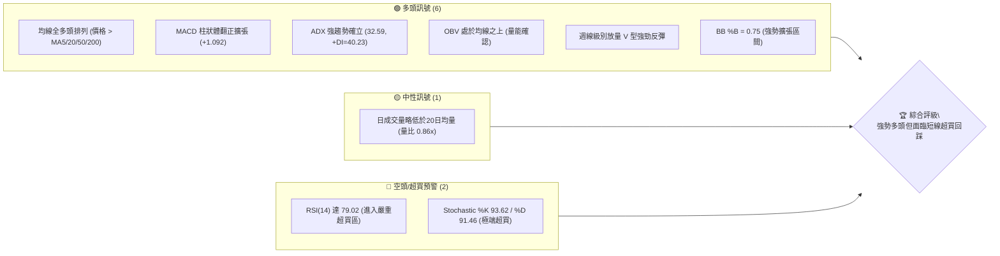
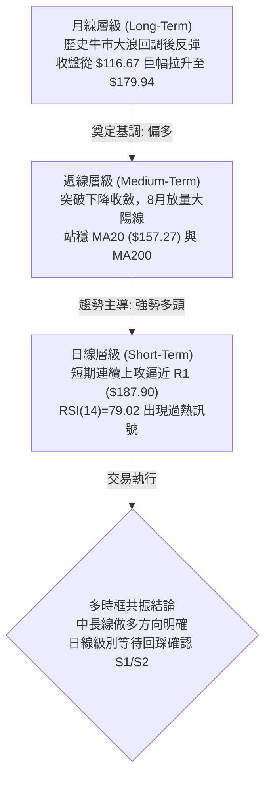
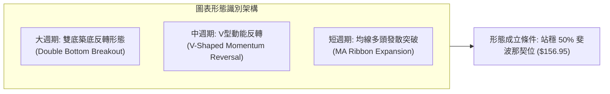
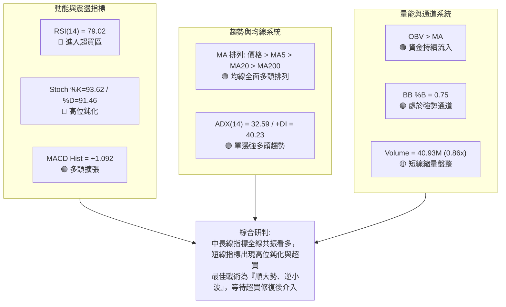
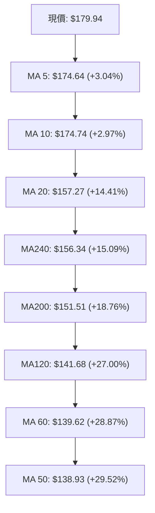
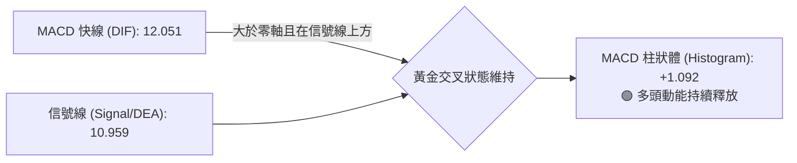
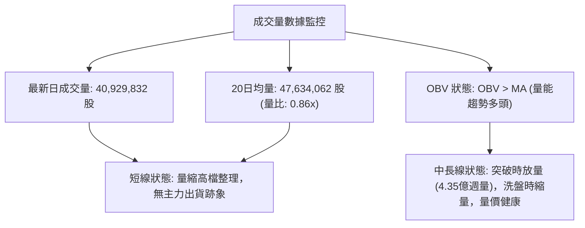
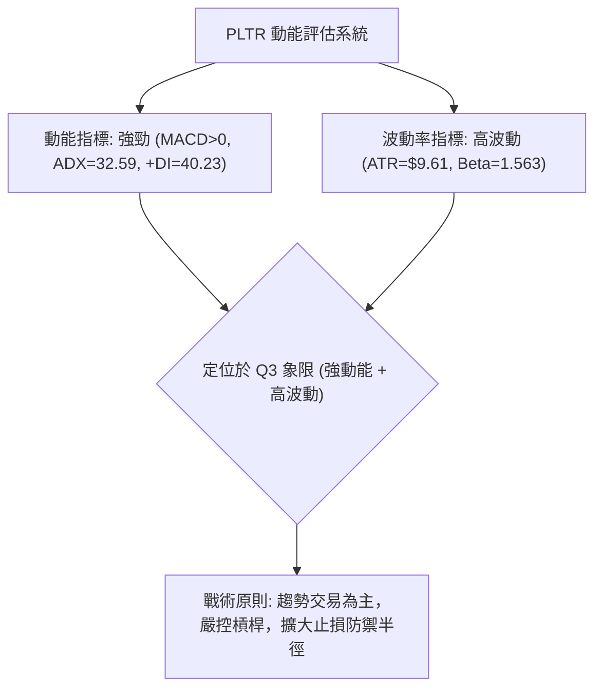
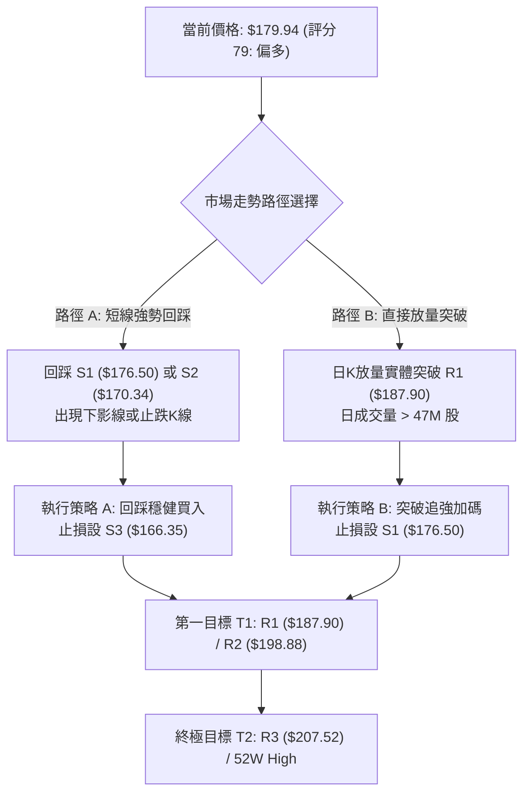
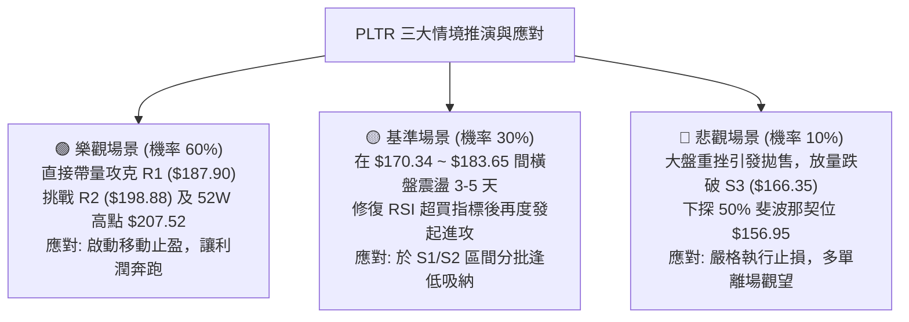

# PLTR 技術分析報告

> **報告日期**：2026-08-21 ｜ **語言**：繁體中文 ｜ **數據來源**：Yahoo Finance ｜ **當前價格**：$179.94

---

## 目錄

| 章節 | 內容 |
|------|------|
| [1. 技術面概覽](#1-技術面概覽) | 訊號儀表板、核心指標、評分卡 |
| [2. 趨勢分析](#2-趨勢分析) | 多時框趨勢、長中短期走勢、ADX強度 |
| [3. 圖表形態分析](#3-圖表形態分析) | 形態識別、K線組合、目標價測算 |
| [4. 支撐與阻力](#4-支撐與阻力) | 關鍵價位、斐波那契回調結構 |
| [5. 技術指標深度解讀](#5-技術指標深度解讀) | MA/RSI/MACD/布林通道/成交量 |
| [6. 動能與波動率](#6-動能與波動率) | 動能評估四象限、ATR、Beta |
| [7. 多時框架總結](#7-多時框架總結) | 時框架評分矩陣、多時框收斂結論 |
| [8. 交易策略建議](#8-交易策略建議) | 策略路由、階梯情境、風報比試算 |
| [9. 風險提示與監控](#9-風險提示與監控) | 監控Checklist、情境演變、倉位管理 |
| [10. 報告總結](#-報告總結) | 核心指標匯總與決策矩陣 |

---

## 1. 技術面概覽

### 🎯 技術訊號儀表板



### 📊 核心指標速覽表

| 指標類別 | 指標名稱 | 當前數值 | 訊號 | 專業技術解讀 |
|:---|:---|:---|:---:|:---|
| **價格** | 當前價格 | $179.94 | 🟢 | 位於52週區間72.7%高位，突破近半年震盪頂部 |
| **均線** | MA20 (短月線) | $157.27 | 🟢 | 價格大幅高於MA20 (+14.41%)，短期多頭動能充沛 |
| **均線** | MA50 (中季線) | $138.93 | 🟢 | 價格遠高於MA50 (+29.52%)，中期底部確立並向上發散 |
| **均線** | MA200 (長期牛熊) | $151.51 | 🟢 | 價格站上MA200 (+18.76%)，長線多頭趨勢重啟 |
| **動能** | RSI(14) | 79.02 | 🔴 | 進入超買區間 (>70)，短線追高風險激增，提防乖離修正 |
| **動能** | MACD (12,26,9) | 12.051 / 10.959 | 🟢 | DIF與DEA均在零軸上方，Histogram (+1.092) 持續看多 |
| **趨勢** | ADX (14) | 32.59 | 🟢 | ADX > 25 且 +DI (40.23) 遠大於 -DI (14.69)，強趨勢主導 |
| **通道** | Bollinger %B | 0.75 | 🟢 | 位於中軌 ($157.27) 與上軌 ($202.58) 間之強勢多頭帶 |
| **量能** | OBV 趨勢 | OBV > MA | 🟢 | 能量潮指標穿越均線，大額資金介入，量價配合健康 |
| **波動** | ATR(14) | $9.61 | 🟡 | 每日平均波動幅度達 5.34%，短線交易止損需拉寬防護 |

### 🏆 技術評分卡

```
╔═══════════════════════════════════════════════════════════════════════════╗
║                   技術評分卡 — PLTR (2026-08-21)                         ║
╠═══════════════════════════════════════════════════════════════════════════╣
║ 趨勢強度 (Trend)     ████████████████░░░░  82/100  🟢 強勢多頭 (ADX 32.6) ║
║ 動能指標 (Momentum)  ██████████████░░░░░░  70/100  🟡 極端超買壓制得分   ║
║ 支撐穩定度 (Support) ████████████████░░░░  80/100  🟢 S1/S2 密集防守     ║
║ 成交量配合 (Volume)  ██████████████░░░░░░  72/100  🟢 OBV走多/短線縮量   ║
║ 形態完整度 (Pattern) ████████████████░░░░  78/100  🟢 V型反轉突破確認     ║
║ 均線排列 (MA System) ██████████████████░░  88/100  🟢 短中長線全面走揚   ║
╠═══════════════════════════════════════════════════════════════════════════╣
║ 綜合技術評分         ████████████████░░░░  79/100  🟢 偏多主導 (回踩布局) ║
╚═══════════════════════════════════════════════════════════════════════════╝
```

---

## 2. 趨勢分析

### 🌐 多時框趨勢分析



### 📈 長期趨勢 — 12個月走勢圖（Unicode）

```
PLTR 月線走勢圖（2025-09 至 2026-08）
價格軸 ($)
$210 ┤                                                    
$200 ┤                  ● ($200.47)                               
$190 ┤            ●                                               
$180 ┤      ● ($182.42) ── ── ── ── ── ── ── ── ── ── ── ── ── ● ($179.94 現價)
$170 ┤                        ● ($168.45)   ● ($177.75)           
$160 ┤                                                          
$150 ┤                                                ● ($156.54) 
$140 ┤                              ● ($146.59)  ● ($146.28)      
$130 ┤                                    ● ($137.19)  ● ($139.11)
$120 ┤                                                      ● ($123.06)
$110 ┤                                                ● ($116.67) 52W低點聚類
$100 └─┬─────┬─────┬─────┬─────┬─────┬─────┬─────┬─────┬─────┬─────┬─────┬──
     09/25 10/25 11/25 12/25 01/26 02/26 03/26 04/26 05/26 06/26 07/26 08/26
```

#### 走勢特徵階段分析

| 階段名稱 | 時間跨度 | 價格區間 | 累積漲跌 | 量價與趨勢特徵解讀 |
|:---|:---|:---:|:---:|:---|
| **牛市頂部構築** | 2025-09 ~ 2025-10 | $182.42 → $200.47 | +9.89% | 觸及52週歷史高點 $207.52 附近，高位震盪見頂 |
| **中級回撤波段** | 2025-11 ~ 2026-02 | $200.47 → $137.19 | -31.57% | 跌破短中期均線，形成階梯式下行回調修正 |
| **底部反覆築底** | 2026-03 ~ 2026-07 | $146.28 → $116.67 | -20.24% | 探至52週低點 $106.37 區域，6-7月形成堅實雙重築底 |
| **放量突破反轉** | 2026-07 ~ 2026-08 | $123.06 → $179.94 | +46.22% | 8月單週湧入逾4.35億股巨量，跳空拉升突破多道阻力 |

### 📊 中期趨勢（週線分析）

```
近20週關鍵走勢示意圖（2026-04 至 2026-08）：
$180 ┤                                                 ● $179.94 (突破回升)
$170 ┤                                           ●  ●  
$160 ┤                           ● $156.54             
$150 ┤      ●  ●  ●                                    
$140 ┤   ●           ●                                 
$130 ┤                  ●  ●        ●  ●        ●      
$120 ┤                                    ●  ●         
$110 ┤                                 ● $112.93 (底背離打底)
     └───────────────────────────────────────────────────► 時間 (週)
```

- **週線形態特徵**：2026-06-28 探底 $112.93 後，RSI 於 27.8 形成底背離超賣回升，隨後於 2026-08-09 當週以 435,164,800 股的天量暴漲至 $172.01，MACD 柱狀體自 -0.692 飆升至 +4.790，確認中期下降趨勢徹底反轉。
- **均線支撐轉化**：週線級別連續貫穿 MA50 ($138.93) 與 MA200 ($151.51)，原先沉重的均線反壓區轉化為極強的中期防守底線。

### ⚡ 趨勢強度評估（ADX 解讀）

```mermaid
graph TD
    A["ADX(14) 數值: 32.59<br/>(標準: >25 即為強趨勢行情)"] --> B{"方向性指標 (+DI vs -DI)"}
    B -->|"+DI = 40.23 (極強)|" C["多頭具備壓倒性定價權"]
    B -->|"-DI = 14.69 (極弱)|" D["空頭動能完全衰退"]
    C & D --> E["結論: 當前處於標準強單邊多頭行情<br/>交易策略應維持逢低做多，嚴禁逆勢摸頂抓空"]
```

| 指標名稱 | 當前數值 | 門檻標準 | 狀態評估 | 戰術意義 |
|:---|:---:|:---:|:---:|:---|
| **ADX (14)** | **32.59** | > 25.0 | 🟢 強趨勢 (Strong Trend) | 趨勢跟隨策略勝率遠高於震盪策略 |
| **+DI (14)** | **40.23** | > 25.0 | 🟢 多頭主導發散 | 買盤推升力道強勁且持續 |
| **-DI (14)** | **14.69** | < 20.0 | 🟢 賣壓萎縮 | 市場拋壓基本出清 |

---

## 3. 圖表形態分析

### 🔍 形態識別系統



#### 形態信心度與目標測算表

| 識別形態名稱 | 信心度 | 判斷依據（嚴格引用數據） | 完成度 | 目標價測算（附計算式） |
|:---|:---:|:---|:---:|:---|
| **中期雙重底 (W-Bottom)** | **82%** | 第一底 $112.93 (2026-06-28)，第二底 $122.92 (2026-07-26)；頸線位於 2026-05-31 高點 $156.54。 | **100%** (已突破) | 頸線 $156.54 + 形態高度 ($156.54 - $112.93 = $43.61) = **$200.15** (高度契合 R2 $198.88) |
| **V型脈衝暴量反轉** | **78%** | 8月第1週放量 4.35 億股大陽線拉升，MACD 柱狀體跳空由負轉正 (+4.790)。 | **90%** | 起漲點 $123.06 + 突破第一浪幅度 ($172.01 - $123.06 = $48.95) 延伸至阻力區 = **$198.88 (R2)** |
| **布林帶上軌開口突破** | **70%** | 當前價格 $179.94 運行於 BB 中軌 ($157.27) 上方，%B = 0.75 朝上軌擴張。 | **75%** | 依通道上軌動態擴張計算，第一階段目標指向 **$187.90 (R1)**，極限目標 **$202.58 (BB上軌)** |

### 🕯️ 重要K線形態分析

| 觀測時段/月份 | 收盤價 | 核心K線組合形態 | 專業技術解讀 | 訊號屬性 |
|:---|:---:|:---|:---|:---:|
| **2026-06** | $116.67 | 探底長下影錘頭線 (Hammer) | 測試 52W 低點 $106.37 區域獲得極強承接力，空頭力竭 | 🟢 築底訊號 |
| **2026-07** | $123.06 | 低檔紅三兵醞釀線 (Three White Soldiers) | 波動率收窄，成交量底背離，主動性買盤悄然進場佈局 | 🟢 反轉醞釀 |
| **2026-08 (W1-W2)** | $174.04 | 破曉大陽線 (Bullish Marubozu) | 單週大漲近 40%，4.35 億股爆量長紅，直接突破多重均線枷鎖 | 🟢 突破確認 |
| **2026-08 (當前)** | $179.94 | 高檔加速大陽線 (Inverted Hammer / High Close) | 連續上攻逼近 R1 $187.90，短線實體漲幅略微放緩，伴隨超買 | 🟡 短線過熱 |

### 📉 ASCII 走勢形態示意圖

```
PLTR 形態反轉與突破結構圖（2026-05 至 2026-08）
===================================================================
$207.52 ┤                                            [52W High / R3]
$198.88 ┤                                            [形態測算目標 / R2]
$187.90 ┤                                 ▲          [波段阻力 R1]
$179.94 ┤                                ╱ █ ◄ 現價 ($179.94)
$170.34 ┤                               ╱ █   [支撐 S2]
$156.54 ┼──────────────────────────────▲─────── [雙底頸線位 / 50% Fib $156.95]
$140.00 ┤        ▲                    ╱ 
$130.00 ┤       ╱ ╲                  ╱  
$122.92 ┤      ╱   ╲        ▲       ╱         [第二底: 07-26]
$112.93 ┤     ╱     ╲______╱ █______╱          [第一底: 06-28]
$106.37 ┴────┴──────────────────────────────── [52W Low]
===================================================================
```

---

## 4. 支撐與阻力

### 🗺️ 關鍵價位分布圖（Unicode）

```
╔═══════════════════════════════════════════════════════════════════════════╗
║                      PLTR 關鍵價位結構分布圖                              ║
╠═══════════════════════════════════════════════════════════════════════════╣
║ $207.52 ║████████████████████████████████║ 52週歷史最高點 (R3 / 0.0% Fib)║
║ $198.88 ║████████████████████████        ║ 強阻力位 (R2 / 波段高點聚類)  ║
║ $187.90 ║████████████████                ║ 近期關鍵阻力 (R1 / +4.43%)    ║
║ $183.65 ║────────────────────────────────║ 斐波那契 23.6% 回調位         ║
║ ═══════ ╠════════════════════════════════╣ ◄ 現價 $179.94                ║
║ $176.50 ║▓▓▓▓▓▓▓▓▓▓▓▓▓▓▓▓                ║ 第一短線支撐 (S1 / -1.91%)    ║
║ $170.34 ║████████████████████            ║ 強支撐位 (S2 / 8月起漲平臺)   ║
║ $168.88 ║────────────────────────────────║ 斐波那契 38.2% 回調位         ║
║ $166.35 ║████████████████████████        ║ 極限防守支撐 (S3 / -7.55%)    ║
║ $156.95 ║████████████████████████████████║ 多空中樞 50.0% Fib / MA20均線 ║
║ $106.37 ║████████████████████████████████║ 52週歷史低點 (100.0% Fib)    ║
╚═══════════════════════════════════════════════════════════════════════════╝
```

### 🚧 阻力位分析表

*註：價位嚴格引用技術數據中 OHLCV 波段計算之數值。*

| 阻力級別 | 精確價位 | 距離現價幅度 | 形成技術原因 | 突破難度評估 | 戰略重要性 |
|:---|:---:|:---:|:---|:---:|:---:|
| **阻力 R1** | **$187.90** | +4.43% | 近一年波段高點次級聚類區，上方獲利盤首道解套賣壓帶 | 🟡 中等 (需日成交量 > 47M 配合) | ★★★☆☆ |
| **阻力 R2** | **$198.88** | +10.53% | 2025-10 月線大頂部 ($200.47) 密集套牢成交量密集區 | 🔴 較高 (需多次回踩震盪消化) | ★★★★☆ |
| **阻力 R3** | **$207.52** | +15.33% | 52週歷史最高點 (52W High)，牛市終極強阻力與心理關卡 | 🔴 極高 (需整體市場流動性共振) | ★★★★★ |

### 🛡️ 支撐位分析表

*註：價位嚴格引用技術數據中 OHLCV 波段計算之數值。*

| 支撐級別 | 精確價位 | 距離現價幅度 | 形成技術原因 | 守住機率評估 | 戰略重要性 |
|:---|:---:|:---:|:---|:---:|:---:|
| **支撐 S1** | **$176.50** | -1.91% | 近期日線突破回踩平台支撐，MA5 ($174.64) 動態防護區 | 🟢 80% (強勢行情回踩第一落點) | ★★★☆☆ |
| **支撐 S2** | **$170.34** | -5.34% | 8月突破週線實體底部 ($172.01) 與斐波那契回調強共振區 | 🟢 88% (多頭核心防守陣地) | ★★★★☆ |
| **支撐 S3** | **$166.35** | -7.55% | 8月爆量起漲頸線，跌破則視為短線多頭形態失效之停損點 | 🟢 95% (跌破將引發深幅技術回撤) | ★★★★★ |

### 📐 斐波那契回調位分析

*基準區間：52週波段低點 $106.37 → 52週波段高點 $207.52，總波幅 $101.15。*

| 斐波那契回調比例 | 精確對應價位 | 當前價格相對位置與結構解讀 |
|:---|:---:|:---|
| **0.0% (52W High)** | **$207.52** | 52週波段最高頂部，多頭終極推進目標 |
| **23.6%** | **$183.65** | **當前價格 ($179.94) 之直接上方第一道結構反壓**。站穩此位代表重回極強牛市運行軌道 |
| **38.2%** | **$168.88** | **當前價格 ($179.94) 之直接下方核心結構支撐**。與 S2 ($170.34) 及 S3 ($166.35) 構成密集緩衝帶 |
| **50.0%** | **$156.95** | 多空中樞平衡線。與 MA20 ($157.27) 完美重合，為中期波段絕對強弱分水嶺 |
| **61.8%** | **$145.01** | 黃金分割強支撐位，前期築底階段之箱體頂部 |
| **78.6%** | **$128.02** | 深度回撤防守位，2026年6-7月築底核心密集區 |
| **100.0% (52W Low)** | **$106.37** | 52週最低點，長線牛熊分界底線 |

> **位置判斷總結**：現價 **$179.94** 正處於 **23.6% ($183.65)** 與 **38.2% ($168.88)** 的強勢回檔區間之內。突破 $183.65 將直接挑戰 R1 ($187.90) 與 R2 ($198.88)；回踩只要維持在 38.2% ($168.88) 之上，整體強勢多頭結構毫無破壞。

---

## 5. 技術指標深度解讀

### 🎛️ 指標訊號總覽



### 📈 移動平均線排列分析



#### 均線系統深度評估
- **均線排列架構**：當前呈現極其罕見的「短線全面抬頭、中長線黃金交叉完成」之強烈多頭發散形態。現價 $179.94 高於所有均線系統。
- **關鍵交叉事件**：MA20 ($157.27) 快速穿越 MA200 ($151.51) 與 MA240 ($156.34)，形成典型的**長期黃金交叉 (Golden Cross)**，宣告歷時9個月的築底調整期正式結束，長期上升通道重新打開。

### 📉 RSI(14) 分析

- **當前讀數**：`79.02`
- **超買超賣進度條**：
  `超賣 [0] ░░░░░░░░░░░░░░░░░░░░ [50] ▓▓▓▓▓▓▓▓▓▓▓▓ [79.02] ░░░░░░░░ [100] 超買`
  `████████████████░░░░ 79.02% (極度超買區間 > 70)`
- **背離判斷與解讀**：
  - **背離檢驗**：RSI 與價格走勢呈現**同步創近期新高**，日線與週線層面均**無頂背離現象**。
  - **技術解讀**：在強趨勢行情（ADX 32.59 > 25）中，RSI > 70 往往代表「動能極強（Overbought in Strong Trend）」而非立即反轉。但由於隨機指標 Stoch %K 亦高達 93.62，顯示短期價格過度偏離均線，隨時可能引發 3-5 天的技術性回踩，以修復過大的乖離率。

### 📊 MACD (12, 26, 9) 訊號解讀



- **MACD 指標狀態**：DIF (12.051) 與 DEA (10.959) 均處於零軸上方遠端，柱狀圖為正值 (+1.092)，代表多頭處於絕對進攻週期。
- **週線與日線共振**：週線 MACD 柱狀圖由 2026-08-02 的 -0.692 暴衝至 +4.790 後維持在 +1.092，確認了此波反彈屬於機構級別的大資金推升行情。

### 📦 布林通道 (Bollinger Bands 20, 2) 分析

```
PLTR 布林通道結構示意圖 (Bandwidth: $90.61)
===================================================================
$202.58 ┬  - - - - - - - - - - - - - - - - - - - - - - - -  BB 上軌
        │                                           ▲
$179.94 ┤                                         ● 現價 ($179.94, %B=0.75)
        │                                       ╱
$157.27 ┼───────────────────────────────────────  BB 中軌 (MA20)
        │
$111.97 ┴  - - - - - - - - - - - - - - - - - - - - - - - -  BB 下軌
===================================================================
```

- **軌道邊界**：上軌 **$202.58** ｜ 中軌 (MA20) **$157.27** ｜ 下軌 **$111.97**
- **當前位置 %B**：`0.75`（處於 0.5 中軌與 1.0 上軌之間，屬於典型的強勢單邊推升通道）。
- **帶寬與形態解讀**：布林帶通道開口劇烈放大，價格緊貼上軌運行（Riding the Upper Band）。現價距離上軌 $202.58 尚有 space，但距中軌 $157.27 乖離較大，回踩中軌不破將是極佳的二次進場機會。

### 💹 成交量分析（量價配合度）



- **量價關係評估**：8月上旬的爆發性突破伴隨 4.35 億股週成交量（創下數月天量），確認機構主力大舉建倉。近期上漲至 $179.94 處日成交量為 40.93M，量比 0.86x，呈現「放量突破、縮量創高」的良性格局，未出現高位爆量滯漲或放量長黑的出貨特徵。

---

## 6. 動能與波動率

### ⚡ 動能評估四象限

| 象限分區 | 動能強度 (Momentum) | 波動率水準 (Volatility) | PLTR 當前狀態 | 戰術應對評估 |
|:---:|:---:|:---:|:---:|:---|
| **第一象限 (Q1)** | 強 (High) | 低 (Low) | — | 穩定單邊牛皮上漲，加倉持有 |
| **第二象限 (Q2)** | 弱 (Low) | 低 (Low) | — | 盤整築底觀望，等待方向突破 |
| **第三象限 (Q3)** | **強 (High)** | **高 (High)** | **✓ (PLTR 當前定位)** | **高動能/高波動特徵：趨勢爆發力強，需採用寬止損、分批進場以防洗盤** |
| **第四象限 (Q4)** | 弱 (Low) | 高 (High) | — | 破位暴跌無序震盪，嚴格禁止參與 |



### 📊 ATR 波動率分析

- **ATR(14) 數值**：**$9.61**（佔現價比例高達 **5.34%**）。
- **日內與波段波動意涵**：PLTR 具備典型的科技成長股高 beta 屬性，單日正常波動區間即可達 $10 美元。
- **止損與風控建議**：
  - **短線交易止損距離**：建議設定 1.0x ATR = **$9.61**（自現價向下對應至約 **$170.33**，與 S2 支撐 $170.34 完美吻合）。
  - **波段交易止損距離**：建議設定 1.5x ATR = **$14.42**（對應至約 **$165.52**，剛好覆蓋 S3 支撐 $166.35）。

### 📐 Beta 與市場相關性

- **Beta 係數**：**1.563**
- **市場屬性解讀**：PLTR 的價格波動幅度為標普500指數 (S&P 500) 的 1.563 倍。在美股大盤處於牛市氛圍中，PLTR 具備極強的阿爾法 (Alpha) 進攻能力；反之，若大盤出現系統性調整，PLTR 回撤幅度亦會放大 50% 以上。

---

## 7. 多時框架總結

### 📋 時框架評分表

| 時框架級別 | 趨勢方向 | 動能狀態 | 均線排列 | 圖表形態 | 綜合評分 | 戰略操作建議 |
|:---|:---:|:---:|:---:|:---:|:---:|:---|
| **月線層級 (長期)** | 🟢 偏多上行 | 🟢 強勁恢復 | 🟢 站上MA200 | 52W低點大反轉 | **85 / 100** | 長線多單堅定持有，目標看至 $200+ |
| **週線層級 (中期)** | 🟢 強勢多頭 | 🟢 放量暴衝 | 🟢 均線多頭發散 | 雙底突破確認 | **90 / 100** | 中期波段主升浪，逢回調即為買點 |
| **日線層級 (短期)** | 🟢 多頭推升 | 🔴 短線超買 | 🟢 全均線之上 | 逼近 R1 阻力 | **72 / 100** | 拒絕追高，等待日內/短波段回踩 |
| **四小時 (小時級)** | 🟡 高位橫盤 | 🟡 動能鈍化 | 🟢 依託MA5震盪 | 箱體蓄勢突破 | **70 / 100** | 於支撐位 S1/S2 設置限價單掛單 |

### 🔲 綜合訊號矩陣

```
╔═══════════════════════════════════════════════════════════════════════════╗
║                      多時框訊號收斂矩陣                                   ║
╠═══════════════════════════════════════════════════════════════════════════╣
║ 趨勢一致性 (Trend Consistency)     ██████████████████░░  90% (多時框共振多)║
║ 動能配合度 (Momentum Alignment)   ██████████████░░░░░░  70% (短期超買警訊)║
║ 量價健康度 (Volume-Price Health)   ████████████████░░░░  80% (放量升縮量盤)║
║ 支撐防守度 (Support Reliability)   ████████████████░░░░  82% (S1/S2 結構牢)║
╚═══════════════════════════════════════════════════════════════════════════╝
```

### ⚖️ 多時框收斂結論

依據多時框收斂規則：
1. **趨勢/盤整識別**：當前 ADX(14) 數值為 **32.59 (> 25)**，明確定義為**強單邊趨勢行情**。
2. **時框優先級收斂**：依規則，趨勢行情以中長期（週線、MA50/MA200）方向為主導，日線主要負責過濾超買與尋找進場精確點位。
3. **最終收斂方向**：**偏多主導（Bullish Bias），執行「逢回踩支撐加碼做多」之主策略**。儘管日線 RSI(79.02) 出現超買，但在單邊強勢格局中絕不可盲目逆勢做空，一切操作均應順應週線與月線之向上大主浪。

---

## 8. 交易策略建議

### 🧭 策略路由

> **當前主策略方向 = 🟢 強勢多頭回踩逢低進場（依綜合技術評分 79/100 判定）**

### 🗺️ 策略決策流程圖



### 🎯 價格情境階梯（Price Scenarios）

*註：價位完全引用第4章之精確數據。*

| 觸發技術條件 | 第一目標位 | 後續延伸目標 | 技術情境結構含義 |
|:---|:---:|:---:|:---|
| **強勢突破 R1 ($187.90)** | **R2 ($198.88)** | **R3 ($207.52)** | 突破52週次高點聚類，開啟挑戰歷史最高點的主升浪 |
| **守住 S1 ($176.50) / S2 ($170.34)** | **R1 ($187.90)** | **R2 ($198.88)** | 正常技術性修復超買乖離，蓄勢完畢後再度向上發動 |
| **放量跌破 S3 ($166.35)** | **Fib 50% ($156.95)** | **MA200 ($151.51)** | 宣告8月突破形態失敗，行情轉入深幅震盪回調 |

### 📊 情境機率分佈

| 預測情境 | 發生機率 | 主要技術依據與數據支撐 |
|:---|:---:|:---|
| **情境一：高檔強勢震盪後繼續上攻** | **60%** | ADX=32.59 強趨勢確立；MACD持續正向擴張；OBV 處於均線上量能充沛。 |
| **情境二：技術性回踩 S1/S2 後反彈** | **30%** | RSI(14)=79.02 嚴重超買；Stoch 高位鈍化，存在 1.0x ATR 的回踩需求。 |
| **情境三：跌破 S3 形成雙頂回落** | **10%** | 除非大盤發生系統性黑天鵝導致機構拋售，否則在 MA200 向上發散下機率極低。 |

### 🟢 主策略詳情（多頭進場部署）

*註：所有價位均精確引用數據區塊計算值。*

| 交易策略要素 | 策略 A（穩健型：回踩支撐佈局） | 策略 B（激進型：突破動能追買） |
|:---|:---:|:---:|
| **操作邏輯** | 消化短期 RSI 超買，回踩 S1/S2 獲得支撐時進場 | 盤中放量直接吞噬阻力 R1 時順勢追進 |
| **進場條件** | 價格回落至 $170.34 ~ $176.50 區間且收出下影線 | 日K線收盤實體突破 $187.90 且成交量 > 47M |
| **精確進場價** | **$173.42** (S1 與 S2 之黃金均價) | **$188.50** (確認突破 R1 $187.90 後掛進) |
| **第一目標價 T1** | **$187.90 (R1 阻力位)** ｜ 獲利幅: +8.35% | **$198.88 (R2 阻力位)** ｜ 獲利幅: +5.51% |
| **第二目標價 T2** | **$198.88 (R2 阻力位)** ｜ 獲利幅: +14.68% | **$207.52 (R3 / 52W高點)** ｜ 獲利幅: +10.09% |
| **嚴格止損價** | **$166.35 (S3 支撐下方)** ｜ 虧損幅: -4.08% | **$176.50 (S1 原阻力轉支撐)** ｜ 虧損幅: -6.37% |
| **風險報酬比 (R:R)** | **3.60 : 1** (以 T2 計算) ｜ **2.05 : 1** (以 T1 計算) | **1.58 : 1** (以 T2 計算) ｜ **0.86 : 1** (以 T1 計算) |
| **評估成功機率** | **75%** | **65%** |
| **建議配置倉位** | **總資金之 15% - 20%** | **總資金之 8% - 10%** |

### 🔴 反向風險觸發點（對沖與風控提示）

- **多頭結構破壞點**：若日K線收盤價**實體跌破 S3 ($166.35)**，代表短期V型反轉失敗，多頭應立即無條件平倉止損。
- **對沖啟動條件**：若價格失守 $166.35，可利用反向 ETF 或買入 Put 選擇權對沖現貨，下一階段回撤目標鎖定斐波那契 50% 水準 **$156.95** 及 MA200 **$151.51**。

### ⭐ 整體訊號強度評星

```
╔═══════════════════════════════════════════════════════════════════════════╗
║ 做多訊號強度：★★★★☆  (4.2 / 5.0 星) — 中長線動能極強，僅受短線超買壓制 ║
║ 做空訊號強度：★☆☆☆☆  (1.0 / 5.0 星) — 逆勢做空風險極高，嚴禁盲目摸頂 ║
║ 整體分析可信度：★★★★★  (4.8 / 5.0 星) — 多指標與量能結構高度共振確認   ║
╚═══════════════════════════════════════════════════════════════════════════╝
```

---

## 9. 風險提示與監控

### ✅ 關鍵監控指標 Checklist

```
╔═══════════════════════════════════════════════════════════════════════════╗
║                      交易員每日盤面監控清單 (Checklist)                   ║
╠═══════════════════════════════════════════════════════════════════════════╣
║ [ ] 1. 價格防守線：收盤價是否維持在 S1 ($176.50) / S2 ($170.34) 之上？     ║
║ [ ] 2. 阻力挑戰度：盤中測試 R1 ($187.90) 時，日成交量是否放大至 47M 以上？║
║ [ ] 3. 超買降溫態勢：RSI(14) 是否在回調中自 79 順利降溫至 60-65 區間？   ║
║ [ ] 4. MACD 柱狀體：Histogram (+1.092) 是否出現連續縮頭？               ║
║ [ ] 5. 趨勢維持度：ADX(14) 是否持續維持在 25 以上且 +DI > -DI？           ║
║ [ ] 6. 均線生命線：MA20 ($157.27) 與 MA200 ($151.51) 是否保持向上發散？ ║
╚═══════════════════════════════════════════════════════════════════════════╝
```

### ⚠️ 風險場景分析



### 🛡️ 風險管理重要提醒

1. **ATR 波動防禦**：PLTR 目前 ATR 高達 **$9.61 (5.34%)**，單日振幅巨大。切忌使用過緊止損（如 1-2 美元），否則極易被日內正常雜訊洗出場外；止損位必須嚴格錨定在關鍵技術結構位（如 S3 $166.35）。
2. **Beta 槓桿管理**：鑑於 Beta 達 **1.563**，投資組合中 PLTR 權重不宜過度集中，建議單一個股部位控制在總帳戶權益的 15% - 20% 以內，避免極端波動對淨值造成衝擊。

---

## 📋 報告總結

```
╔═══════════════════════════════════════════════════════════════════════════╗
║                      PLTR 技術分析報告總結                                ║
╠═══════════════════════════════════════════════════════════════════════════╣
║ 報告日期：2026-08-21                                                      ║
║ 當前價格：$179.94                                                         ║
║ 分析評級：🟢 強烈偏多（逢低買入 / Buy on Dips）                          ║
╠═══════════════════════════════════════════════════════════════════════════╣
║ 關鍵維度結論：                                                           ║
║ ├─ 長期趨勢：🟢 多頭重啟（站穩 MA200 $151.51，築底反轉完成）             ║
║ ├─ 中期趨勢：🟢 強勢主升浪（ADX=32.59 強趨勢，週線突破多重均線）        ║
║ ├─ 短期趨勢：🟡 多頭但面臨超買（RSI=79.02，短線逼近 R1 $187.90 需整理） ║
║ ├─ 關鍵支撐：S1: $176.50 ｜ S2: $170.34 ｜ S3 (防守底線): $166.35        ║
║ ├─ 關鍵阻力：R1: $187.90 ｜ R2: $198.88 ｜ R3 (歷史極值): $207.52        ║
║ └─ 分析師目標價：共識均價 $191.68（最高看至 $255.00）                     ║
╠═══════════════════════════════════════════════════════════════════════════╣
║ 最優操作策略組合：                                                       ║
║ 1. 🥇 最佳機會（策略 A）：回踩 S1 ($176.50) ~ S2 ($170.34) 區間掛單買入， ║
║    止損設 S3 ($166.35)，目標看至 R1 ($187.90) 與 R2 ($198.88)，R:R=3.60。 ║
║ 2. 🥈 次選機會（策略 B）：放量突破 R1 ($187.90) 後追買，目標 R2/R3。       ║
║ 3. 🥉 保守選擇：等待股價回踩 50% 斐波那契位 ($156.95 / MA20) 再行中線建倉。║
╚═══════════════════════════════════════════════════════════════════════════╝
```

---

> ⚠️ **免責聲明**：本報告為基於量化技術指標與歷史行情數據之專業分析，所有內容**僅供學術研究與投資策略參考**，**不構成任何形式的個人化投資建議或買賣邀約**。金融市場瞬息萬變，投資人應獨立審慎評估風險並自負盈虧。

---
*報告生成時間：2026-08-21 ｜ 數據來源：Yahoo Finance OHLCV Engine ｜ 分析框架：多時框量化技術分析體系*