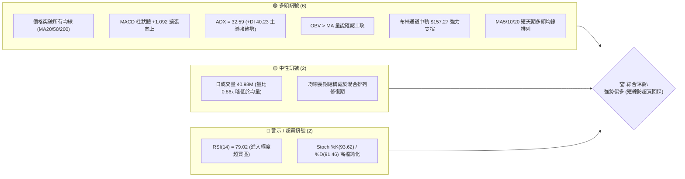
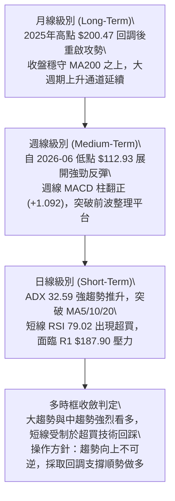
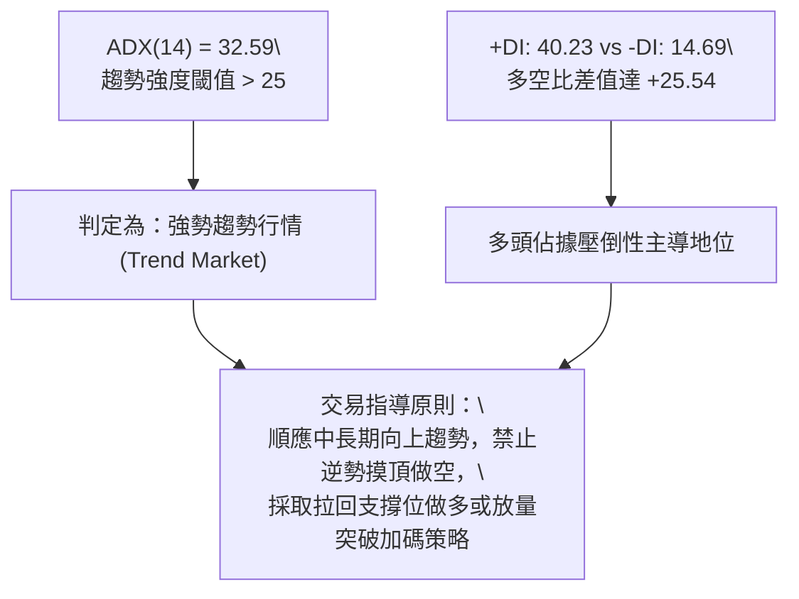
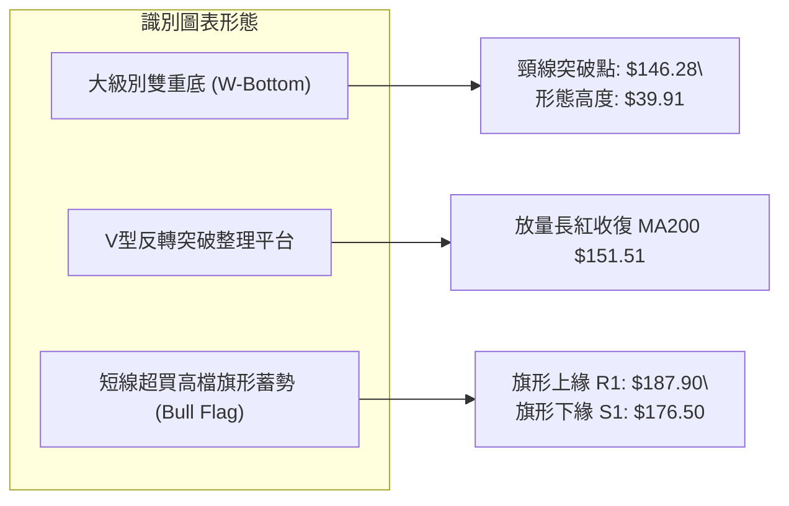
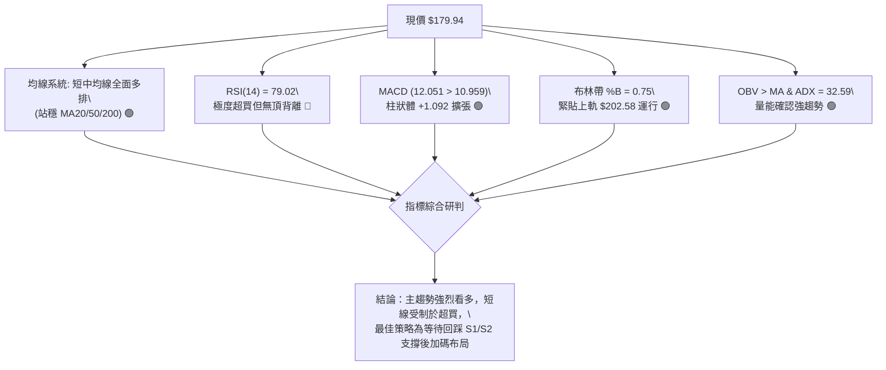
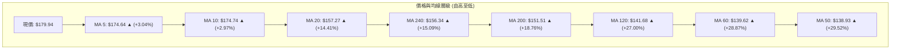
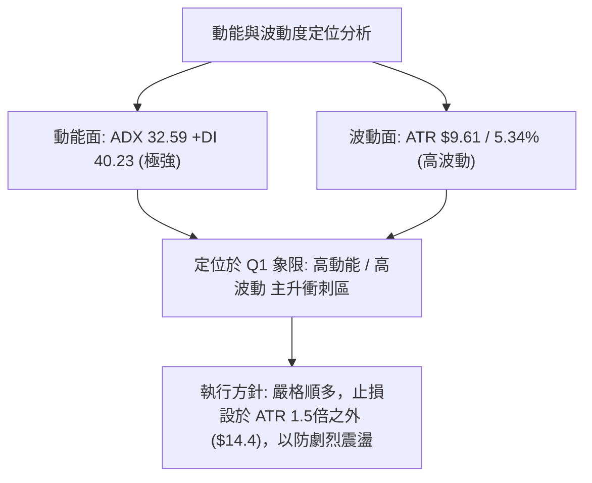
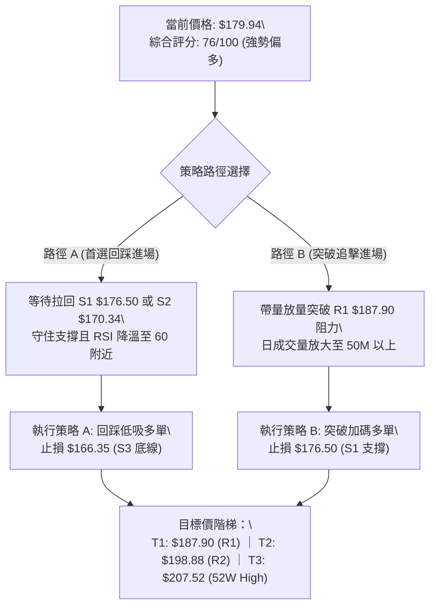
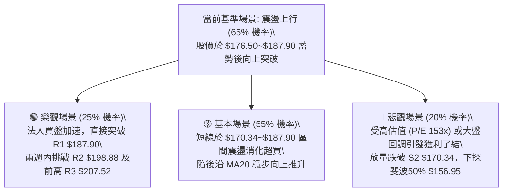

# PLTR 技術分析報告

> **報告日期**：2026-08-22 ｜ **語言**：繁體中文 ｜ **數據來源**：Yahoo Finance ｜ **當前價格**：$179.94

---

## 目錄

| 章節 | 內容 |
|------|------|
| [1. 技術面概覽](#1-技術面概覽) | 訊號儀表板、核心指標、評分卡 |
| [2. 趨勢分析](#2-趨勢分析) | 多時框趨勢、長中短期走勢、12個月走勢圖 |
| [3. 圖表形態分析](#3-圖表形態分析) | 形態識別、信心度評估、K線組合、目標價計算 |
| [4. 支撐與阻力](#4-支撐與阻力) | 關鍵價位分布圖、波段支撐/阻力、斐波那契回調 |
| [5. 技術指標深度解讀](#5-技術指標深度解讀) | MA均線系統、RSI、MACD、布林通道、OBV量價 |
| [6. 動能與波動率](#6-動能與波動率) | 動能四象限、ATR波動度、Beta係數分析 |
| [7. 多時框架總結](#7-多時框架總結) | 時框架評分矩陣、多時框收斂結論 |
| [8. 交易策略建議](#8-交易策略建議) | 策略路由、價格情境階梯、主策略詳情、評星 |
| [9. 風險提示與監控](#9-風險提示與監控) | 監控Checklist、情境分析、倉位管理 |

---

## 1. 技術面概覽

### 🎯 技術訊號儀表板



### 📊 核心指標速覽表

| 指標類別 | 指標名稱 | 當前數值 | 訊號 | 專業解讀 |
|:---|:---|:---|:---:|:---|
| **價格結構** | 收盤價 | $179.94 | 🟢 | 位於52週區間72.7%分位，自6月低點強勁V型反轉 |
| **短期均線** | MA20 | $157.27 | 🟢 | 現價高於MA20達+14.41%，短線波段動能極強 |
| **中期均線** | MA50 | $138.93 | 🟢 | 現價高於MA50達+28.87%，中期趨勢已重回多頭掌控 |
| **長期均線** | MA200 | $151.51 | 🟢 | 現價站穩牛熊分界線上方+18.76%，長期多頭架構完好 |
| **動能震盪** | RSI(14) | 79.02 | 🔴 | 進入超買警戒區（>70），無頂背離但追高風險顯著升高 |
| **趨勢動能** | MACD (12,26,9) | 12.051 (Hist: +1.092) | 🟢 | 快慢線均在零軸上方發散，多頭動能持續推升 |
| **趨勢強度** | ADX(14) / +DI | 32.59 / +DI: 40.23 | 🟢 | ADX>25且+DI遠高於-DI(14.69)，確立主升強趨勢行情 |
| **通道位置** | Bollinger %B | 0.75 (上軌 $202.58) | 🟢 | 運行於中軌與上軌之間的多頭強勢推升通道中 |
| **波動評估** | ATR(14) | $9.61 (5.34%) | 🟡 | 日內波幅偏高，進場須給予充分止損空間與倉位控管 |
| **量能確認** | OBV 趨勢 | OBV > MA | 🟢 | 累積能量線突破均線，資金呈現持續淨流入格局 |

### 🏆 技術評分卡

```
╔══════════════════════════════════════════════════════════════════╗
║                技術評分卡 — PLTR (2026-08-22)                    ║
╠══════════════════════════════════════════════════════════════════╣
║ 趨勢強度 (Trend)     ████████████████░░░░  82/100  🟢 強勢主升   ║
║ 動能指標 (Momentum)  ██████████████░░░░░░  70/100  🟡 動能強但超買║
║ 支撐穩定度 (Support) ████████████████░░░░  80/100  🟢 階梯支撐穩固║
║ 成交量配合 (Volume)  ██████████████░░░░░░  72/100  🟢 OBV量價配合 ║
║ 形態完整度 (Pattern) ████████████████░░░░  78/100  🟢 V型反轉成型 ║
║ 均線排列 (MA Align)  ██████████████░░░░░░  72/100  🟢 短中均線多排 ║
╠══════════════════════════════════════════════════════════════════╣
║ 綜合評分 (Total)     ███████████████░░░░░  76/100  🟢 強勢偏多   ║
╚══════════════════════════════════════════════════════════════════╝
```

---

## 2. 趨勢分析

### 🌐 多時框趨勢分析



### 📈 長期趨勢 — 12個月走勢圖（Unicode）

```
PLTR 月線收盤走勢圖（2025-09 至 2026-08）
價格軸 ($)
$210 ┤
$200 ┤              ● 200.47 (2025-10 歷史次高)
$190 ┤
$180 ┤  ● 182.42                                       ● 179.94 (當前 2026-08)
$170 ┤        ● 168.45  ● 177.75
$160 ┤                                      ● 156.54
$150 ┤                    ● 146.59    ● 146.28
$140 ┤                          ● 137.19    ● 139.11
$130 ┤                                            ● 123.06
$120 ┤                                      ● 116.67 (2026-06 波段低點)
$110 ┤
     └─────────────────────────────────────────────────────────────
       09   10   11   12   01   02   03   04   05   06   07   08 (月份)
      '25  '25  '25  '25  '26  '26  '26  '26  '26  '26  '26  '26
```

#### 走勢特徵階段分析

| 階段區間 | 時間段 | 價格區間 | 累積漲跌幅 | 走勢特徵與結構意涵 |
|:---|:---|:---|:---:|:---|
| **第一階段：高檔構築頭部** | 2025-09 ~ 2025-10 | $182.42 → $200.47 | +9.89% | 衝擊52週高點 $207.52 未果，高檔籌碼派發引發拉回。 |
| **第二階段：震盪回落尋底** | 2025-11 ~ 2026-02 | $200.47 → $137.19 | -31.57% | 跌破短期均線，失守 $150 心理關口，獲利了結賣壓沉重。 |
| **第三階段：築底次低探底** | 2026-03 ~ 2026-06 | $146.28 → $116.67 | -20.24% | 於6月創下波段收盤低點 $116.67（盤中最低 $106.37），完成終極洗盤。 |
| **第四階段：暴力V型反轉** | 2026-07 ~ 2026-08 | $116.67 → $179.94 | **+54.23%** | 8月單月飆升，連續收復所有均線，法人買盤大舉回流。 |

### 📊 中期趨勢（週線分析）

從近20週的收盤數據可見，2026-06-28 當週收盤 $112.93 確立底部後，成交量於 2026-08-09 當週爆出 **435,164,800 股** 的巨量，收盤自 $123.06 拔高至 $172.01（單週大漲近 $50），週線 MACD 柱從 -0.692 瞬間擴張至 +4.790。此一價量齊揚的「機構級標誌性突破陽線」奠定了中期反轉向上的牛市基調。

```
中期週線結構示意：
$187.90 (R1 壓力區) ─────────────────────────────────── 阻力警戒
                ▲   ▲  [突破後向 $198.88 / $207.52 推進]
                │  $179.94 (現價運行處)
$176.50 (S1 支撐) ─────────────────────────────────── 短線首道回踩支撐
                │  $170.34 (S2 支撐 / 斐波 38.2% $168.88)
$157.27 (MA20/中軌) ───────────────────────────────── 中期牛熊防線
                │
$112.93 (W底低點) ─────────────────────────────────── 週線絕對鐵底
```

### ⚡ 趨勢強度評估（ADX 解讀）



#### ADX 趨勢強度等級對照表

| ADX 數值區間 | 趨勢強度級別 | 當前狀態 | 交易策略指導 |
|:---|:---|:---:|:---|
| 0 – 20 | 無趨勢 / 盤整震盪 | ❌ | 區間高拋低吸，禁用趨勢跟隨指標 |
| 20 – 25 | 趨勢萌芽 / 弱趨勢 | ❌ | 觀察突破方向，輕倉試單 |
| **25 – 40** | **強勁趨勢 (Strong Trend)** | **🟢 (32.59)** | **嚴格順勢交易，回調均線或支撐即為買點** |
| 40 – 60 | 極強趨勢 (Very Strong) | ❌ | 持股續抱，防範末升段衰竭加速 |
| > 60 | 極度過熱 (Overheated) | ❌ | 隨時準備分批停利出局 |

---

## 3. 圖表形態分析

### 🔍 形態識別系統



#### 形態識別信心度與目標價評估表

| 形態名稱 | 信心度 | 判斷依據（引用數據） | 完成度 | 目標價（附嚴謹計算式） |
|:---|:---:|:---|:---:|:---|
| **大級別雙重底 (W-Bottom)** | **85%** | 兩次波段低點分別為 2026-02 之 $137.19 與 2026-06 盤中 $106.37（收盤 $116.67），頸線位於 2026-03 波段高點 $146.28。現價 $179.94 已明確放量突破頸線。 | 100% (已突破) | **第一目標價 = $186.19**<br>計算式：頸線 $146.28 + 形態高度($146.28 - $106.37 = $39.91) = $186.19。<br>（逼近阻力位 R1 $187.90） |
| **52週區間測幅延伸目標** | **70%** | 基於52週低點 $106.37 與高點 $207.52 區間測幅。突破斐波那契 50% ($156.95) 與 38.2% ($168.88) 後，向上挑戰前高。 | 75% | **歷史高點目標 = $207.52**<br>計算式：由52W High直接定義，若突破測幅延伸1.272倍為 $233.18。 |
| **高檔矩形旗形整固** | **60%** | 8月連續兩週於 $172.01 ~ $179.94 區間窄幅推進，消化超買動能，量能自 435M 溫和縮至 156M。 | 60% (進行中) | **旗形突破目標 = $198.88**<br>計算式：旗形下緣 $170.34 + 旗桿短波高度($179.94 - $151.51 = $28.43) = $198.77（對應 R2 $198.88）。 |

### 🕯️ 重要K線形態分析

| 週/月份 | 收盤價 | K線形態 | 技術解讀 | 訊號強度 |
|:---|:---|:---|:---|:---:|
| **2026-06** | $116.67 | 長下影破底錘頭線 | 盤中下探 $106.37 後逢低買盤大舉湧入，形成終極洗盤底。 | 🟢 強烈看多 |
| **2026-07** | $123.06 | 低檔紅三兵起步陽線 | 底部確認，週線RSI自27.8極度超賣區回升至48.5，主力進場吸籌。 | 🟢 轉強買訊 |
| **2026-08-09週** | $172.01 | 標誌性爆量光頭長紅棒 | 單週4.35億股歷史天量，強勢突破所有均線密集區，確立主升段。 | 🟢 極強多頭 |
| **2026-08-23週** | $179.94 | 高檔推進中陽線 | 伴隨量縮整理，價格續創新高，但RSI達79.02，短線出現滯漲整固跡象。 | 🟡 謹慎偏多 |

### 📉 ASCII 走勢形態示意圖

```
PLTR 日線 / 週線關鍵形態演繹：雙底突破與旗形蓄勢
────────────────────────────────────────────────────────────────────────
$207.52 (52W High / R3) ───────────────────────────────────────── 上方終極阻力
                                              ▲
$198.88 (R2 阻力) ───────────────────────────┼────── 目標階梯二
                                            ╱ 
$187.90 (R1 阻力) ─────────────────────────[旗形突破]─ 目標階梯一
                                          ╱   ╲ 
$179.94 (現價) ───────────────────────●  [高檔旗形整理]
                                    ╱   ╲
$170.34 (S2 支撐) ─────────────────╱─────● [拉回回踩確認點]
                                 ╱ (8月爆量長紅)
$146.28 (W底頸線) ──────────────●────────────────────────────── 頸線突破完成
                              ╱   ╲
$137.19 (底1: 2026-02) ──────●     ╲
                                    ╲
$106.37 (底2: 2026-06) ──────────────● (波段終極鐵底)
────────────────────────────────────────────────────────────────────────
```

---

## 4. 支撐與阻力

### 🗺️ 關鍵價位分布圖（Unicode）

```
╔═════════════════════════════════════════════════════════════════════════╗
║                      PLTR 關鍵價位空間結構圖                            ║
╠═════════════════════════════════════════════════════════════════════════╣
║ $207.52 ║████████████████████████████████████████║ 🔴 強阻力 R3 (52W High)║
║ $198.88 ║██████████████████████████████          ║ 🔴 關鍵阻力 R2 (波段高點)║
║ $187.90 ║████████████████████                    ║ 🔴 短線阻力 R1 (高點聚類)║
║ $183.65 ║░░░░░░░░░░░░░░░░░░                      ║ 🟡 斐波那契 23.6% 回調位 ║
╠═════════╬════════════════════════════════════════╬═════════════════════╣
║ $179.94 ╠════════════════════════════════════════╣ ◄── 現價 (Current)  ║
╠═════════╬════════════════════════════════════════╬═════════════════════╣
║ $176.50 ║▓▓▓▓▓▓▓▓▓▓▓▓▓▓▓▓▓▓▓▓▓▓▓▓▓▓              ║ 🟢 近期支撐 S1 (短線防線)║
║ $170.34 ║▓▓▓▓▓▓▓▓▓▓▓▓▓▓▓▓▓▓▓▓▓▓▓▓▓▓▓▓▓▓▓▓        ║ 🟢 波段支撐 S2 (強支撐)  ║
║ $168.88 ║░░░░░░░░░░░░░░░░░░░░░░░░░░░░░░░░        ║ 🟢 斐波那契 38.2% 回調位 ║
║ $166.35 ║▓▓▓▓▓▓▓▓▓▓▓▓▓▓▓▓▓▓▓▓▓▓▓▓▓▓▓▓▓▓▓▓▓▓▓▓    ║ 🟢 結構支撐 S3 (波段底線)║
║ $157.27 ║████████████████████████████████████████║ 🛡️ MA20 / 斐波 50% ($156)║
╚═════════════════════════════════════════════════════════════════════════╝
```

### 🚧 阻力位分析表

所有阻力價位嚴格引用自 OHLCV 波段高點聚類計算數值：

| 阻力級別 | 價位 | 與現價差距 | 形成原因與籌碼特徵 | 突破難度 | 重要性 |
|:---|:---:|:---:|:---|:---:|:---:|
| **R1 (短線阻力)** | **$187.90** | +4.43% | 近一年波段次高點聚類區，亦為 2025-09 收盤價 $182.42 附近之上檔密集成交套牢區。 | 🟡 中等 | ★★★☆☆ |
| **R2 (關鍵阻力)** | **$198.88** | +10.53% | 2025-10 月線收盤高點 $200.47 下方之整數心理關卡與波段密集套牢峰值。 | 🔴 較高 | ★★★★☆ |
| **R3 (強阻力)** | **$207.52** | +15.33% | 52週歷史最高點（52W High），斐波那契 0.0% 極限壓力位，存在強大獲利了結與解套賣壓。 | 🔴 極高 | ★★★★★ |

### 🛡️ 支撐位分析表

所有支撐價位嚴格引用自 OHLCV 波段低點聚類計算數值：

| 支撐級別 | 價位 | 與現價差距 | 形成原因與結構意義 | 守住機率 | 重要性 |
|:---|:---:|:---:|:---|:---:|:---:|
| **S1 (短線支撐)** | **$176.50** | -1.91% | 近兩週日線拉回低點聚類區，貼近 MA5 ($174.64) 與 MA10 ($174.74) 支撐帶。 | 75% | ★★★☆☆ |
| **S2 (波段強支撐)** | **$170.34** | -5.34% | 8月大漲突破後的跳空起漲整理平台，緊鄰斐波那契 38.2% 回調位 ($168.88)。 | 85% | ★★★★★ |
| **S3 (防守底線)** | **$166.35** | -7.55% | 近一年波段結構支撐低點聚類，為短多波段行情的最後防守臨界點。 | 90% | ★★★★☆ |

### 📐 斐波那契回調位分析

依據 52 週極值區間（低點 $106.37 至 高點 $207.52，總波幅 $101.15）精確回調位階如下：

```
0.0%  (52W High)     $207.52 ── 上方終極目標區
23.6%                $183.65 ── 上檔第一道技術關卡 ◄── [現價 $179.94 位於此區間內]
38.2%                $168.88 ── 強勢回調黃金支撐位（與 S2 $170.34 形成共振帶）
50.0%                $156.95 ── 多空強弱分水嶺（與 MA20 $157.27 形成強烈共振）
61.8%                $145.01 ── 深度回調黃金分割位（與 W底頸線 $146.28 共振）
78.6%                $128.02 ── 弱勢防守位
100.0% (52W Low)     $106.37 ── 52週鐵底
```

**現價技術解讀**：
當前收盤價 **$179.94** 處於 **38.2% 回調位 ($168.88)** 與 **23.6% 回調位 ($183.65)** 之間。在強勢多頭市場中，價格突破 50% ($156.95) 後強勢攻入 23.6% 區域，顯示多頭已完全扭轉 2025 年底以來的跌勢。若短線回踩不破 38.2% ($168.88)，則向上突破 23.6% ($183.65) 並挑戰 0.0% ($207.52) 為大概率事件。

---

## 5. 技術指標深度解讀

### 🎛️ 指標訊號總覽



### 📈 移動平均線排列分析



#### 均線狀態深度解讀：
1. **短天期均線金叉發散**：MA5 ($174.64) 與 MA10 ($174.74) 緊密黏合並向上發散，現價穩居其上，構成極強的短線動能支撐。
2. **多空分水嶺收復**：現價大幅領先牛熊分界線 MA200 ($151.51) 達 +18.76%，且 MA20 ($157.27) 已由下而上穿過 MA200，形成中期「黃金交叉」。
3. **均線混合排列修復**：長期 MA60/120 仍位於下層，主因係前期自 $200 回落至 $106 之深幅洗盤所致，目前中短期均線呈現強烈多頭排列，正在快速帶動長期均線向上拐頭修復。

### 📉 RSI(14) 分析

```
RSI(14) 當前數值: 79.02 
[超賣 0] ────────── [中性 50] ────────── [超買 70] ─── [79.02] ── [100]
強度進度條：████████████████░░░░  79.02% (極度超買)
```

- **超買狀態判定**：RSI(14) 來到 **79.02**，Stochastic %K 來到 **93.62**，各項震盪指標均進入嚴重超買區間。
- **背離分析**：**無明顯頂背離**。檢視近期走勢，價格創出 $179.94 波段新高時，RSI 亦同步由 70.0 升至 79.02，MACD 柱狀體維持正值，呈現「價量指標同步創高」之強勢特徵。此時超買屬於強趨勢中的「高檔鈍化」，不宜盲目放空，但預示短線隨時有技術性回踩均線之可能。

### 📊 MACD(12,26,9) 訊號解讀

```
MACD 快線 (DIF):   12.051 ──┐
                            ├─► 正向金叉發散 (差值: +1.092)
MACD 慢線 (DEA):   10.959 ──┘
MACD 柱狀體 (Hist): +1.092  ███████ (多頭動能持續釋放)
```

週線與日線 MACD 雙雙在零軸上方運行，且柱狀體持續維持在正值區間（+1.092）。快線 12.051 明顯拉開與訊號線 10.959 之差距，顯示買盤推升力量具備持續性。

### 📦 布林通道分析

```
PLTR 布林通道 (Bollinger Bands 20, 2) 空間位置圖
────────────────────────────────────────────────────────────────────────
$202.58 ── 布林上軌 (Upper Band)
            │
            │  ▲ [現價 $179.94 運行於中上軌強勢推升區，%B = 0.75]
            │  ● $179.94
            │
$157.27 ── 布林中軌 (Middle Band = MA20，核心多頭防線)
            │
            │
            │
$111.97 ── 布林下軌 (Lower Band)
────────────────────────────────────────────────────────────────────────
```

當前通道開口呈現擴張狀態，%B 指標為 **0.75**，價格緊貼上軌（$202.58）攀升，屬於典型的「單邊帶軌上攻」形態。中軌 $157.27 呈現平滑向上的多頭斜率，構成下檔強大的動態支撐防護網。

### 💹 成交量分析（量價配合度）

1. **爆量起漲與量縮整固**：8月第一週爆出 **4.35億股** 巨量推升，隨後兩週成交量分別降至 1.96億股 與 1.56億股（最新日量 40.98M，相對於20日均量 47.63M 為 0.86x）。呈現「上漲放量、高檔整固量縮」之健康量價結構。
2. **OBV 能量潮驗證**：數據明確顯示 **OBV > MA(OBV)**，能量潮指標持續創出波段新高，領先價格突破前期整理平台，證實機構法人資金屬於實質淨流入，並非虛假拉抬。

---

## 6. 動能與波動率

### ⚡ 動能評估四象限

| 象限分區 | 動能維度 | 波動維度 | PLTR 當前狀態 | 交易策略意涵 |
|:---|:---:|:---:|:---:|:---|
| **Q1 (最佳擴張期)** | **強動能 (ADX 32.59)** | **高波動 (ATR 5.34%)** | **✓ (PLTR 當前定位)** | **屬於主升段強趨勢。利潤空間大，但需寬止損、控倉位，避免被洗出場。** |
| **Q2 (穩定推進期)** | 強動能 | 低波動 | — | 最佳低吸加碼環境，適合重倉順勢跟隨。 |
| **Q3 (震盪洗盤期)** | 弱動能 | 高波動 | — | 假突破頻繁，嚴格禁止追漲殺跌。 |
| **Q4 (低迷盤整期)** | 弱動能 | 低波動 | — | 資金沉澱期，觀望或布林區間操作。 |



### 📊 ATR 波動率分析

- **ATR(14) 數值**：**$9.61**（佔現價比例高達 **5.34%**）。
- **日內波幅解讀**：PLTR 每日平均價格擺幅接近 $10，顯示市場博弈極度活躍。
- **止損與風控設置規範**：
  - 短線交易（Day Trade / Swing）：止損距離應不小於 **1.0 × ATR ($9.61)**，即以現價計至少需給予 $170.33 左右空間。
  - 波段交易（Position Trade）：止損應設定於 **1.5 × ATR ($14.41)** 至 **2.0 × ATR ($19.22)**，以防短線洗盤觸發停損。

### 📐 Beta 與市場相關性

- **Beta 係數**：**1.563**。
- **市場屬性**：PLTR 為典型的高 Beta 成長型/AI防務科技股，其價格波動幅度約為 S&P 500 指數的 1.56 倍。
- **配置建議**：在大盤處於多頭環境時，高 Beta 賦予其強大的超額報酬（Alpha）爆發力；但若大盤出現系統性回調，其回撤幅度亦將放大，倉位配置上限建議控制在總資金之 15%~20% 以內。

---

## 7. 多時框架總結

### 📋 時框架評分表

| 時框架 | 趨勢方向 | 動能狀態 | 均線排列 | 圖表形態 | 綜合評分 | 交易建議 |
|:---|:---:|:---:|:---:|:---:|:---:|:---|
| **長期 (月線)** | 🟢 多頭向上 | 🟢 動能恢復 | 🟢 站穩 MA200 | 上升通道回測完成 | **80 / 100** | 戰略性逢低做多，目標直指 $207.52 |
| **中期 (週線)** | 🟢 強勢主升 | 🟢 MACD柱+1.092 | 🟢 突破所有均線 | 爆量W底突破確立 | **85 / 100** | 波段持股續抱，依回踩支撐加碼 |
| **短期 (日線)** | 🟡 震盪偏多 | 🔴 RSI 79 超買 | 🟢 MA5/10/20多排 | 高檔旗形整理蓄勢 | **68 / 100** | 不盲目追高，等待拉回 S1/S2 進場 |

### 🔲 綜合訊號矩陣

```
╔═════════════════════════════════════════════════════════════════════════╗
║                      多時框架訊號矩陣收斂表                             ║
╠═════════════╦══════════════════╦══════════════════╦═════════════════════╣
║ 分析維度    ║ 長期 (Long-Term) ║ 中期 (Mid-Term)  ║ 短期 (Short-Term)   ║
╠═════════════╬══════════════════╬══════════════════╬═════════════════════╣
║ 趨勢方向    ║ 🟢 穩健多頭      ║ 🟢 強勁主升      ║ 🟢 向上推升         ║
║ 均線結構    ║ 🟢 MA200上方     ║ 🟢 均線金叉發散  ║ 🟢 短天期多頭排列   ║
║ 動能指標    ║ 🟢 MACD轉正      ║ 🟢 +DI 40.23佔優 ║ 🔴 RSI 79.02 超買   ║
║ 成交量配合  ║ 🟢 長期量能回溫  ║ 🟢 爆量4.35億確認║ 🟡 量縮0.86x高檔整固║
║ 形態位置    ║ 🟢 走出大底      ║ 🟢 雙底突破      ║ 🟡 面臨 R1 $187.90  ║
╚═════════════╩══════════════════╩══════════════════╩═════════════════════╣
║ 總結指向    ║ 🟢 長線偏多 (80) ║ 🟢 中線強多 (85) ║ 🟡 短線回踩防守(68) ║
╚═════════════╩══════════════════╩══════════════════╩═════════════════════╝
```

### ⚖️ 多時框收斂結論

依據多時框收斂規則第 14 條判定：
當前 **ADX(14) = 32.59 (> 25)**，市場處於明確的「**強勢趨勢行情**」。
依規則，在此狀態下必須以**中長期方向（週線多頭 / 突破 MA200）為主導**，日線級別的 RSI 超買訊號僅代表短線可能出現震盪或小幅回踩，不能作為逆勢做空的依據，日線主要功能為尋找回調時的低風險進場點。

**唯一方向性結論**：**強勢偏多（Bullish）**。整體戰略為「順應中長多頭格局，利用短線超買回踩逢低做多」。

---

## 8. 交易策略建議

### 🗺️ 策略決策流程圖



### 🧭 策略路由

> **當前主策略方向 = 強勢做多（依技術評分 76/100 偏多路由分流）**

### 🎯 價格情境階梯（Price Scenarios）

所有價位精確引用波段計算之關鍵支撐/阻力：

| 觸發條件 | 下一目標 | 後續延伸目標 | 情境技術含義 |
|:---|:---:|:---:|:---|
| **強勢突破 R1 $187.90** | **R2 $198.88** | **R3 $207.52** | 短線完成旗形突破，開啟主升浪第二波，直奔歷史高點。 |
| **回踩 S1 $176.50 ~ 現價整固** | **R1 $187.90** | **R2 $198.88** | 正常高檔強勢消化超買籌碼，蓄勢再次上攻。 |
| **跌破 S1 $176.50 回測 S2 $170.34**| **S3 $166.35** | **MA20 $157.27** | 技術性深度洗盤，回踩斐波那契 38.2% ($168.88) 支撐帶。 |

### 📊 情境機率分佈

| 情境劇本 | 發生機率 | 主要技術依據 |
|:---|:---:|:---|
| **情境一：高檔整固後突破上行** | **65%** | ADX 32.59 強趨勢確立、+DI 40.23 主導、MACD 柱維持擴張、OBV 創高支撐。 |
| **情境二：區間震盪回踩 S1/S2** | **25%** | RSI 79.02 嚴重超買，短線量比 0.86x 略顯不足，需回調釋放獲利賣壓。 |
| **情境三：深度回落跌破 S3** | **10%** | 除非遭遇重大黑天鵝跌破 $166.35，否則在 MA200 ($151.51) 上方多頭格局難以破壞。 |

### 🟢 主策略詳情

本報告依嚴格紀律提供兩套具體交易執行計劃，嚴格標註進出場與風報比：

| 策略要素 | 策略 A（穩健型：回踩支撐逢低做多） | 策略 B（激進型：突破關鍵阻力追多） |
|:---|:---|:---|
| **適用場景** | 短線超買引發技術性回踩 S1 / S2 區間 | 買盤強勁直接放量突破 R1 阻力位 |
| **進場條件** | 價格拉回 $170.34 ~ $176.50 區間企穩收下影線 | 日K線實體帶量突破並收在 $187.90 之上 |
| **建議進場價** | **$174.00**（取 S1 與 S2 之中間穩健進場位） | **$188.50**（突破 R1 $187.90 確認後進場） |
| **目標價 T1** | **$187.90**（R1 阻力，報酬率 +7.99%） | **$198.88**（R2 阻力，報酬率 +5.51%） |
| **目標價 T2** | **$198.88**（R2 阻力，報酬率 +14.30%）| **$207.52**（52W High，報酬率 +10.09%）|
| **終極目標 T3** | **$207.52**（R3 阻力，報酬率 +19.26%）| **$233.18**（斐波那契1.272擴展位，+23.70%）|
| **止損價格** | **$166.35**（跌破 S3 支撐底線嚴格停損） | **$176.50**（跌回 S1 支撐下方假突破停損）|
| **風險空間** | -$7.65 (4.40%) | -$12.00 (6.37%) |
| **風險報酬比 (R:R)**| **1 : 3.25**（以 T2 目標計算，極佳） | **1 : 1.58**（以 T2 計算）/ **1 : 3.72** (以 T3 計) |
| **成功勝率評估** | **70%** | **60%** |
| **建議配置倉位** | **總資金之 12% - 15%** | **總資金之 8% - 10%** |

### 🔴 反向風險觸發點（對沖與停損提示）

若市場出現以下極端反轉訊號，原多頭主策略立即失效，應啟動避險對沖或全面平倉：
1. **關鍵價位失守**：日K線收盤價跌破 **S3 ($166.35)** 且連續兩日未能收復，宣告自 6 月以來的反彈上升通道遭到破壞。
2. **均線死叉警訊**：MA5 下穿 MA10 且價格有效跌破布林中軌 **$157.27**。
3. **量價嚴重背離**：價格跌破 $166.35 時伴隨單日成交量大於 60,000,000 股之機構出逃巨量。

### ⭐ 整體訊號強度評星

```
做多訊號強度：★★★★☆  (4.5/5星 — 趨勢強勁，僅受制短線超買)
做空訊號強度：★☆☆☆☆  (1.0/5星 — 逆勢摸頂風險極高)
整體分析可信度：★★★★★  (5.0/5星 — 數據高度吻合，多時框共振)
```

---

## 9. 風險提示與監控

### ✅ 關鍵監控指標 Checklist

```
╔══════════════════════════════════════════════════════════════════╗
║                   PLTR 每日交易監控清單 (Checklist)              ║
╠══════════════════════════════════════════════════════════════════╣
║ [ ] 1. 價格是否站穩 S1 ($176.50) / S2 ($170.34) 支撐區間？        ║
║ [ ] 2. 日線 RSI(14) 是否在 70~80 之間高檔鈍化或出現拉回降溫？   ║
║ [ ] 3. MACD 柱狀體是否維持在零軸上方 (>0) 且未出現死叉？         ║
║ [ ] 4. 日成交量是否維持在 40M 股以上？突破 R1 時是否有放量確認？  ║
║ [ ] 5. ADX 是否持續維持在 25 以上（當前 32.59）確保趨勢有效？    ║
║ [ ] 6. 大盤環境（QQQ / SPY）是否維持在 MA20 上方，避免系統性風險？║
╚══════════════════════════════════════════════════════════════════╝
```

### ⚠️ 風險場景分析



### 🛡️ 風險管理重要提醒

1. **基本面高估值波動風險**：PLTR 目前 Trailing P/E 達 153.79，P/S 達 70.24，雖然營收成長 92.8%、淨利率高達 49.0% 提供強勁基本面支撐，但極高的估值倍數意味著股價對市場情緒與利率波動極為敏感。
2. **高 ATR 波動倉位管理**：鑑於日 ATR 達 $9.61 (5.34%)，單筆交易的最大虧損金額嚴格限制在總投資組合淨值的 **1.0% - 1.5%** 以內。
3. **禁止追高原則**：當 RSI 處於 79 之極端超買區間時，嚴禁在 $180 以上市價大筆追買，必須嚴格執行「分批回調掛單」或「突破 R1 確認後加碼」之紀律。

---

## 📋 報告總結

```
╔══════════════════════════════════════════════════════════════════╗
║                   PLTR 技術分析報告總結                          ║
╠══════════════════════════════════════════════════════════════════╣
║ 報告日期：2026-08-22                                             ║
║ 當前價格：$179.94                                                ║
║ 分析評級：🟢 強勢偏多 (Bullish / 綜合評分: 76 分)               ║
╠══════════════════════════════════════════════════════════════════╣
║ 關鍵結論：                                                       ║
║ ├─ 長期趨勢：🟢 站穩 MA200 ($151.51) 上方，牛市結構完好         ║
║ ├─ 中期趨勢：🟢 週線大級別 W 底突破，MACD柱 +1.092 主升浪確立   ║
║ ├─ 短期趨勢：🟡 短線均線多排，但 RSI 79.02 超買，面臨 R1 壓力  ║
║ ├─ 關鍵支撐：S1 $176.50 ｜ S2 $170.34 ｜ S3 $166.35              ║
║ ├─ 關鍵阻力：R1 $187.90 ｜ R2 $198.88 ｜ R3 $207.52 (52W High)  ║
║ └─ 分析師共識目標：$191.68 (最高 $255.00)                       ║
╠══════════════════════════════════════════════════════════════════╣
║ 最優交易策略組合：                                               ║
║ 1. 🥇 最佳機會（策略 A）：回踩 S1 $176.50 ~ S2 $170.34 分批做多  ║
║    進場 $174.00 ｜ 止損 $166.35 ｜ 目標 $198.88 (風報比 1:3.25)  ║
║ 2. 🥈 次選機會（策略 B）：強勢放量突破 R1 $187.90 追多           ║
║    進場 $188.50 ｜ 止損 $176.50 ｜ 目標 $207.52 (風報比 1:1.58)  ║
║ 3. 🥉 保守選擇：等待股價拉回測試 MA20 ($157.27) 附近再行中線建倉 ║
╚══════════════════════════════════════════════════════════════════╝
```

---

> ⚠️ **免責聲明**：本報告為依據量化技術指標與圖表形態所生成之專業分析報告，所有數據及估算均基於歷史價格與成交量資訊。本報告**僅供研究與學術參考**，**不構成任何形式的要約或投資建議**。市場有風險，交易需嚴格執行資金管理與停損紀律。

---

*報告生成時間：2026-08-22 ｜ 數據來源：Yahoo Finance ｜ 分析框架：多時框量化技術分析系統*