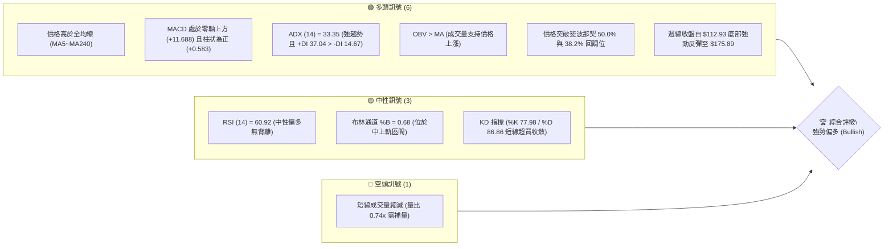
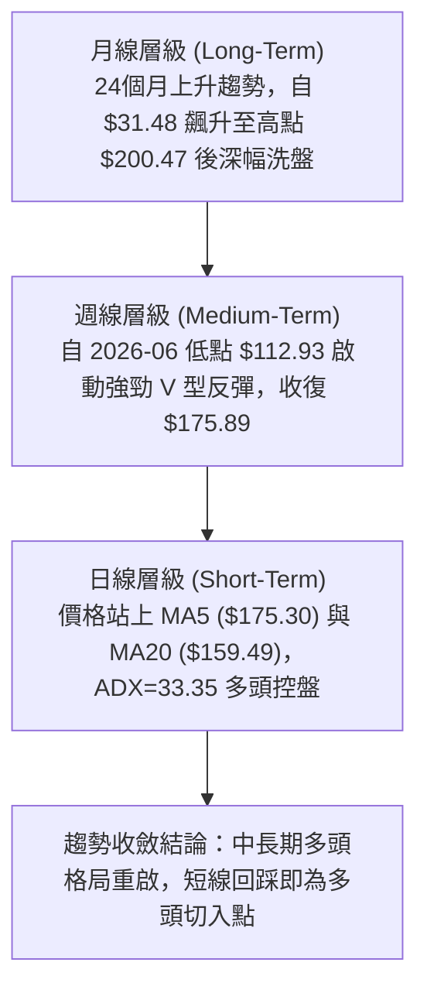
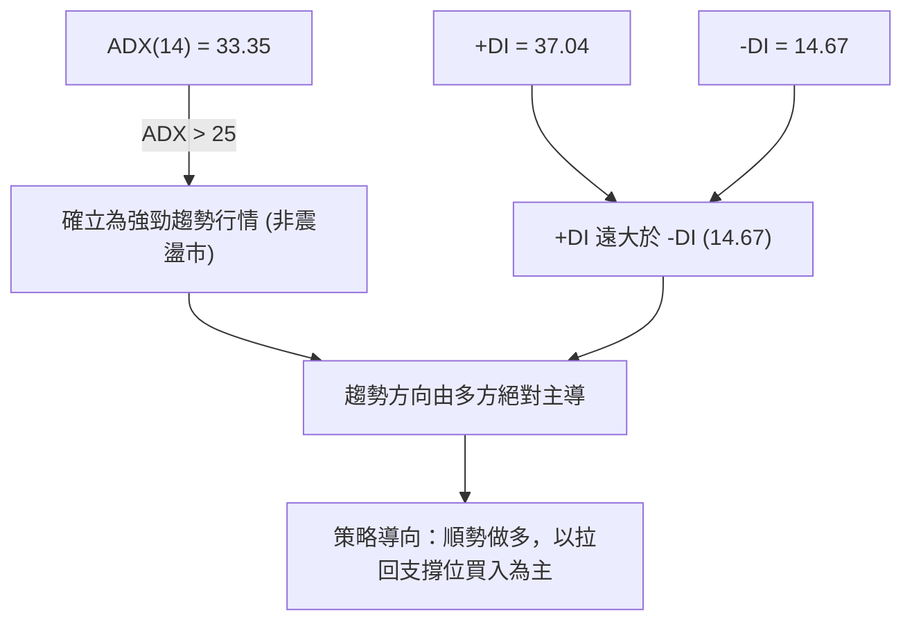
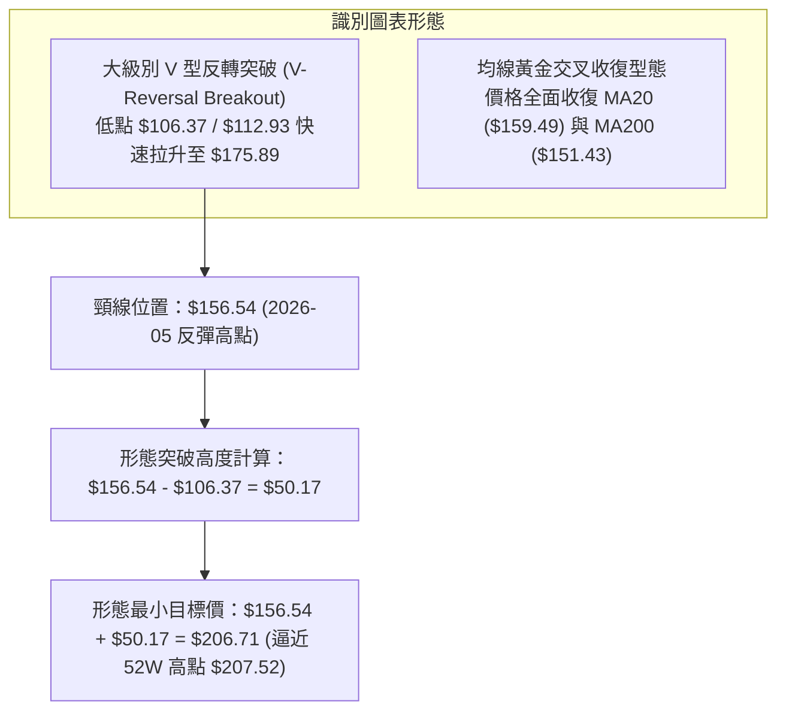
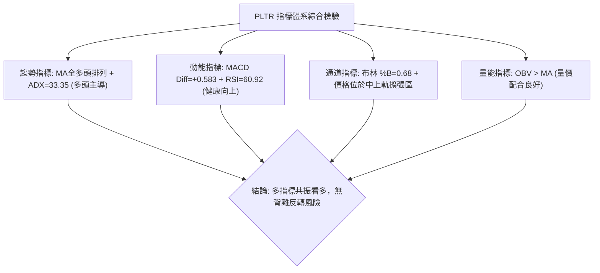
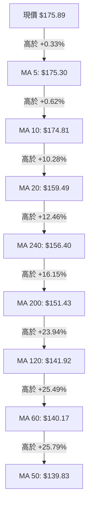
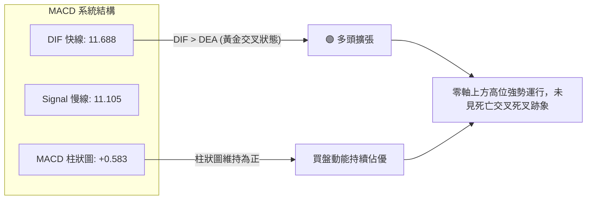
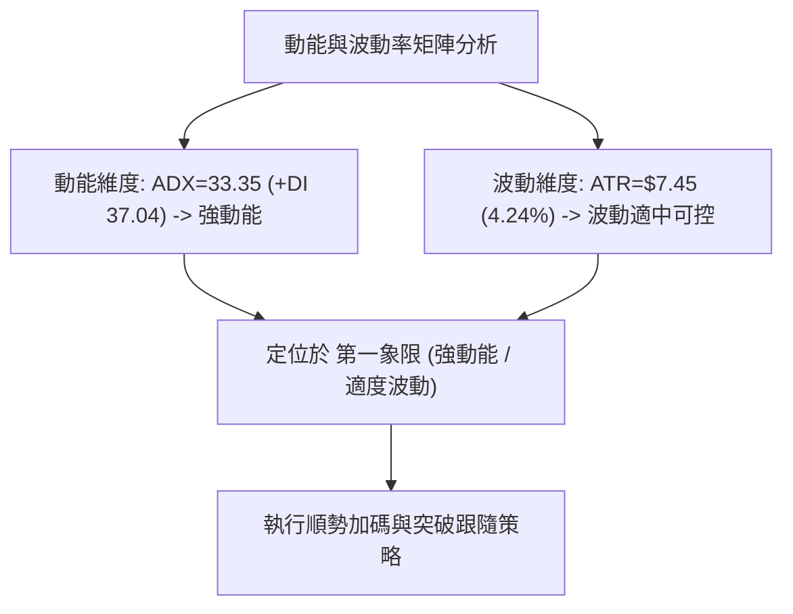
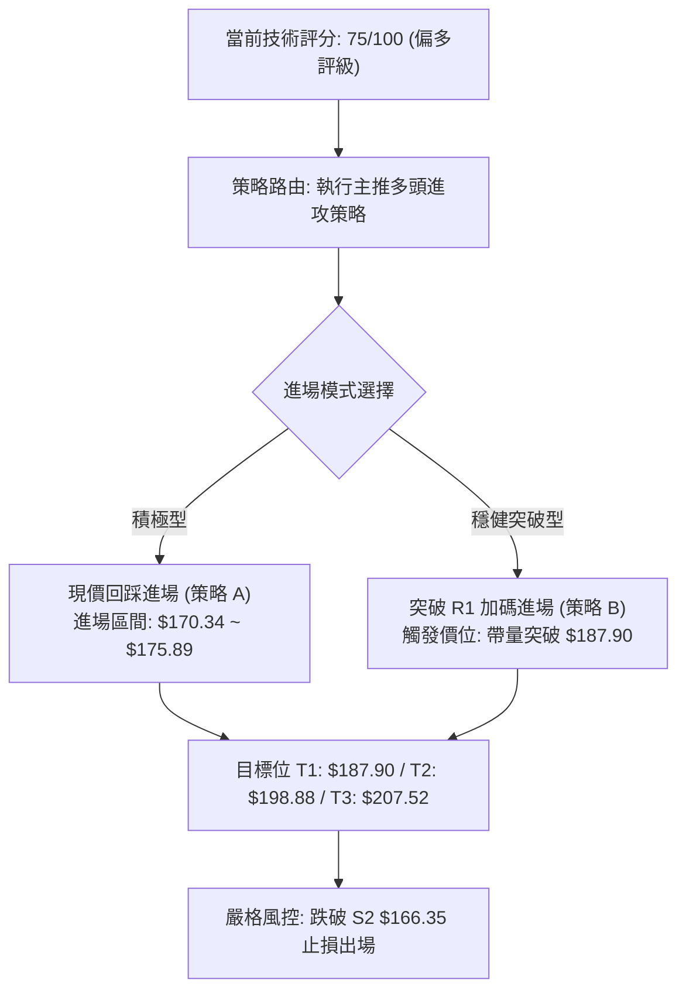
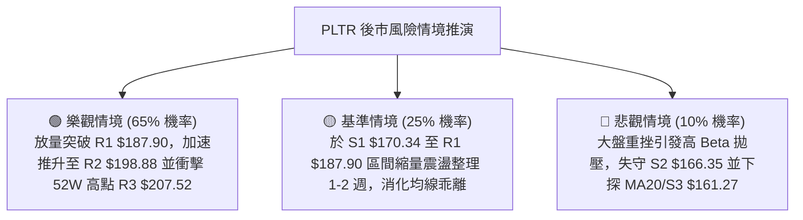

# PLTR 技術分析報告

> **報告日期**：2026-08-24 ｜ **語言**：繁體中文 ｜ **數據來源**：Yahoo Finance ｜ **當前價格**：$175.89

---

## 目錄

| 章節 | 內容 |
|------|------|
| [1. 技術面概覽](#1-技術面概覽) | 訊號儀表板、核心指標、評分卡 |
| [2. 趨勢分析](#2-趨勢分析) | 多時框趨勢、長中短期走勢、ADX解讀 |
| [3. 圖表形態分析](#3-圖表形態分析) | 形態識別、信心度評估、K線組合 |
| [4. 支撐與阻力](#4-支撐與阻力) | 關鍵價位分佈、斐波那契回調 |
| [5. 技術指標深度解讀](#5-技術指標深度解讀) | MA/RSI/MACD/布林/量價配合 |
| [6. 動能與波動率](#6-動能與波動率) | 動能四象限、ATR、Beta係數 |
| [7. 多時框架總結](#7-多時框架總結) | 時框矩陣、多時框收斂結論 |
| [8. 交易策略建議](#8-交易策略建議) | 策略路由、主策略、情境階梯 |
| [9. 風險提示與監控](#9-風險提示與監控) | 監控清單、情境推演、風控原則 |
| [📋 報告總結](#-報告總結) | 核心結論與策略總覽 |

---

## 1. 技術面概覽

### 🎯 技術訊號儀表板



### 📊 核心指標速覽表

| 指標類別 | 指標名稱 | 當前數值 | 訊號 | 解讀 |
|----------|----------|----------|:----:|------|
| **價格** | 當前價格 | $175.89 | 🟢 | 站穩多條關鍵短期與中期均線上方，維持上升結構 |
| **均線** | MA20 | $159.49 | 🟢 | 現價高於 MA20 達 +10.28%，短期支撐強勁 |
| **均線** | MA50 | $139.83 | 🟢 | 現價高於 MA50 達 +25.79%，中期趨勢確立向上 |
| **均線** | MA200 | $151.43 | 🟢 | 現價高於 MA200 達 +16.15%，長期牛熊分界線已成功收復 |
| **動能** | RSI(14) | 60.92 | 🟡 | 位於健康多頭區間 (50–70)，未觸及 70 超買且無頂背離 |
| **動能** | MACD | 11.688 (Diff: +0.583) | 🟢 | 快線高於慢線 (Signal: 11.105)，柱狀圖為正，動能擴張 |
| **趨勢** | ADX(14) | 33.35 (+DI: 37.04) | 🟢 | ADX > 25 且 +DI 主導，代表強勁多頭單邊趨勢行情 |
| **通道** | 布林通道 %B | 0.68 | 🟢 | 位於中軌 ($159.49) 與上軌 ($203.82) 之間，通道向上開口 |
| **量能** | OBV 趨勢 | OBV > MA | 🟢 | 資金持續流入，量能指標確認價格突破 |
| **波動** | ATR(14) | $7.45 (4.24%) | 🟡 | 日內波動適中，提供合理的止損緩衝空間 |

### 🏆 技術評分卡

```
╔══════════════════════════════════════════════════════════════╗
║              技術評分卡 — PLTR (2026-08-24)                  ║
╠══════════════════════════════════════════════════════════════╣
║ 趨勢強度      ████████████████░░░░  82/100  🟢 強勁多頭趨勢   ║
║ 動能指標      ██████████████░░░░░░  72/100  🟢 動能充沛無背離 ║
║ 支撐穩定度    ████████████████░░░░  80/100  🟢 下方均線支撐密集║
║ 成交量配合    ████████████░░░░░░░░  62/100  🟡 突破後量能稍斂 ║
║ 形態完整度    ██████████████░░░░░░  74/100  🟢 V型反轉突破確立║
║ 均線排列      ██████████████░░░░░░  72/100  🟢 短中長線全面站上║
╠══════════════════════════════════════════════════════════════╣
║ 綜合評分      ███████████████░░░░░  75/100  🟢 偏多進攻評級   ║
╚══════════════════════════════════════════════════════════════╝
```

---

## 2. 趨勢分析

### 🌐 多時框趨勢分析



### 📈 長期趨勢 — 12個月走勢圖（Unicode）

```
PLTR 月線走勢圖（過去12個月：2025-08 至 2026-08）
價格軸 ($)
$210 ┤                                      ● $207.52 (52W高點)
$200 ┤                             ● 200.47
$185 ┤                    ● 182.42                   ● 175.89 (現價)
$170 ┤                                 ● 168.45  ● 177.75
$155 ┤ ● 156.71                                       ● 156.54
$140 ┤                                           ● 146.59  ● 146.28  ● 139.11
$125 ┤                                                 ● 137.19       ● 123.06
$110 ┤                                                           ● 116.67 (2026-06)
$105 ┤                                                           ● $106.37 (52W低點)
     └─────────────────────────────────────────────────────────────────────────────
       08/25 09/25 10/25 11/25 12/25 01/26 02/26 03/26 04/26 05/26 06/26 07/26 08/26
```

#### 走勢特徵分析表格

| 階段區間 | 起止月份 | 價格區間 | 漲跌幅 | 走勢特徵解讀 |
|----------|----------|----------|:------:|--------------|
| **主升浪衝頂** | 2025-08 → 2025-10 | $156.71 → $200.47 | +27.92% | 機構資金加速進場，創下歷史次高與 52 週高點 $207.52。 |
| **高位派發回撤** | 2025-11 → 2026-02 | $200.47 → $137.19 | -31.57% | 估值修復與獲利了結，連續 4 個月震盪走低測試 MA200 支撐。 |
| **二次探底築底** | 2026-03 → 2026-06 | $146.28 → $116.67 | -20.24% | 探至 52 週低點 $106.37 區域，6 月底週線收盤 $112.93 完成洗盤。 |
| **強勢 V 型反轉** | 2026-07 → 2026-08 | $123.06 → $175.89 | +42.93% | 8 月初放量暴漲（單週 4.35 億股），直接穿透多道阻力重返多頭。 |

### 📊 中期趨勢（週線分析）

```
PLTR 週線架構與關鍵水準示意
══════════════════════════════════════════════════════════════════
 2026-08-23 收盤 $179.94 ───┐
 2026-08-30 當前 $175.89 ───┼─► 強勢多頭攻擊區（逼近 R1 $187.90）
 2026-08-09 突破 $172.01 ───┘   (週放量 4.35 億股確認底部反轉)
 ──────────────────────────────────────────────────────────────
 2026-05-31 頸線 $156.54 ──────► 中期強支撐（與 50.0% 斐波 $156.95 重合）
 ──────────────────────────────────────────────────────────────
 2026-06-28 低點 $112.93 ──────► 波段大底（探底 $106.37 後強勢拉回）
══════════════════════════════════════════════════════════════════
```

### ⚡ 趨勢強度評估（ADX 解讀）



| 指標項 | 數值 | 門檻標準 | 狀態評估 | 實戰指導意義 |
|--------|:----:|:--------:|:--------:|--------------|
| **ADX (14)** | 33.35 | > 25.0 | 🟢 強趨勢 | 排除低效震盪指標，順應主升動能，不宜逆勢摸頂。 |
| **+DI (14)** | 37.04 | > 25.0 | 🟢 多頭極強 | 多頭買盤推動力充沛，主導當前定價權。 |
| **-DI (14)** | 14.67 | < 20.0 | 🟢 空頭潰散 | 空方拋壓微弱，下跌多為獲利回吐而非主動做空。 |
| **DI 差值 (+DI - -DI)** | +22.37 | > 15.0 | 🟢 擴張狀態 | 多空力量懸殊，多頭趨勢處於健康延伸期。 |

---

## 3. 圖表形態分析

### 🔍 形態識別系統



#### 形態信心度評估表

| 形態名稱 | 信心度 | 判斷依據（引用數據） | 完成度 | 目標價（附計算式） |
|----------|:------:|----------------------|:------:|--------------------|
| **V 型反轉突破** | **78%** | 2026-06 週線低點 $112.93 (底探 $106.37) 後，於 2026-08-09 週放量 4.35 億股長陽突破頸線 $156.54。 | 90% | 頸線 $156.54 + 深度 ($156.54 - $106.37 = $50.17) = **$206.71**（接近 52W 高點 R3: $207.52） |
| **布林帶向上擴張突破** | **70%** | 現價 $175.89 站穩中軌 $159.49 之上，%B 達 0.68，帶寬隨 ADX 升至 33.35 擴大。 | 75% | 目標指向布林上軌 **$203.82**（介於 R2 $198.88 與 R3 $207.52 之間） |

### 🕯️ 重要K線形態分析

| 日期 / 週別 | 收盤價 | RSI | MACD 柱 | 成交量 | K線形態與技術含義 | 訊號 |
|-------------|:------:|:---:|:-------:|:------:|-------------------|:----:|
| **2026-06-28** | $112.93 | 27.8 | -2.539 | 271,307,700 | **超賣長下影錘頭線**：探底 $106.37 後獲得強力承接，確立波段大底。 | 🟢 |
| **2026-08-09** | $172.01 | 70.0 | +4.790 | 435,164,800 | **突破型大陽線（巨量長紅）**：單週成交量暴增至 4.35 億股，強力扭轉中期空頭架構。 | 🟢 |
| **2026-08-23** | $179.94 | 79.0 | +1.092 | 156,810,600 | **高位受阻十字星/流星形態**：觸及超買區 (RSI 79.0)，短線面臨波段高點阻力。 | 🟡 |
| **2026-08-30** | $175.89 | 60.9 | +0.583 | 35,003,354 | **縮量回踩整理線**：RSI 降至 60.92 消化浮額，收盤守穩 MA5 ($175.30) 上方。 | 🟢 |

### 📉 ASCII 走勢形態示意圖

```
PLTR V型反轉與形態目標推算示意
─────────────────────────────────────────────────────────────────
$207.52 ┤ (52W高點 / R3)                           [形態目標 $206.71]
$198.88 ┤ (R2阻力)                                      ▲
$187.90 ┤ (R1阻力)                                ┌─────┘
$175.89 ┤ (現價) ───────────────────────────────► ● [現正回踩蓄勢]
$156.54 ┤ (突破頸線 / 50%斐波 $156.95)   ┌───────●
$140.00 ┤ (MA50: $139.83)               │
$112.93 ┤ (大底收盤)           ●────────┘ [暴量 4.35 億股反轉]
$106.37 ┤ (52W最低點)         ● (2026-06 築底)
─────────────────────────────────────────────────────────────────
```

### 🎯 形態目標價計算

```
╔══════════════════════════════════════════════════════════════╗
║                  V 型反轉形態目標計算推導                    ║
╠══════════════════════════════════════════════════════════════╣
║ 形態頸線價位 (Neckline)     : $156.54 (2026-05 月收盤高點)   ║
║ 形態底部低點 (Pattern Low)  : $106.37 (52週最低價)           ║
║ 形態高度垂直距離 (Height)   : $156.54 - $106.37 = $50.17     ║
║ 100% 垂直測幅目標價 (Target): $156.54 + $50.17 = $206.71     ║
║ 數據驗證與收斂             : 與 52W High ($207.52) 高度契合  ║
╚══════════════════════════════════════════════════════════════╝
```

---

## 4. 支撐與阻力

### 🗺️ 關鍵價位分布圖（Unicode）

```
PLTR 價位結構分布圖
═══════════════════════════════════════════════════════════════
$207.52 ║██████████████████████████████║ 52W 最高點 / 極強阻力 R3
$203.82 ║▓▓▓▓▓▓▓▓▓▓▓▓▓▓▓▓▓▓▓▓▓▓        ║ 布林帶上軌動態阻力
$198.88 ║██████████████████████        ║ 波段密集高點阻力 R2
$187.90 ║████████████████              ║ 近期波段阻力 R1 (+6.83%)
$183.65 ║░░░░░░░░░░░░░░░░░░░░░░░░      ║ 斐波那契 23.6% 回調位
════════╠══════════════════════════════╣ ◄ 當前價格: $175.89
$170.34 ║▓▓▓▓▓▓▓▓▓▓▓▓▓▓▓▓▓▓            ║ 短線第一支撐 S1 (-3.16%)
$168.88 ║░░░░░░░░░░░░░░░░░░░░░░░░      ║ 斐波那契 38.2% 回調位
$166.35 ║██████████████████            ║ 關鍵波段支撐 S2 (-5.42%)
$161.27 ║██████████████████████        ║ 強支撐區間 S3 (-8.31%)
$159.49 ║▓▓▓▓▓▓▓▓▓▓▓▓▓▓▓▓▓▓▓▓▓▓▓▓      ║ MA20 / 布林帶中軌支撐
$156.95 ║░░░░░░░░░░░░░░░░░░░░░░░░      ║ 斐波那契 50.0% / MA240 ($156.40)
═══════════════════════════════════════════════════════════════
```

### 🚧 阻力位分析表

| 阻力級別 | 精確價位 | 距現價幅幅 | 形成原因與技術意涵 | 突破難度 | 重要性 |
|:--------:|:--------:|:----------:|--------------------|:--------:|:------:|
| **R1** | **$187.90** | +6.83% | 近一年波段高點聚類；接近 2025-09 收盤價 ($182.42) 上方套牢籌碼區。 | 🟡 中等 | ★★★★☆ |
| **R2** | **$198.88** | +13.07% | 歷史整數關卡前波段高點聚類，與 2025-10 月高位收盤 ($200.47) 形成共振。 | 🔴 較高 | ★★★★☆ |
| **R3** | **$207.52** | +17.98% | 52 週歷史最高點；形態 100% 測幅目標 ($206.71) 終極阻力位。 | 🔴 極高 | ★★★★★ |

### 🛡️ 支撐位分析表

| 支撐級別 | 精確價位 | 距現價跌幅 | 形成原因與技術意涵 | 守住機率 | 重要性 |
|:--------:|:--------:|:----------:|--------------------|:--------:|:------:|
| **S1** | **$170.34** | -3.16% | 近期波段低點聚類；與 2026-08-09 突破大陽線收盤價 ($172.01) 形成保護。 | 🟢 85% | ★★★★☆ |
| **S2** | **$166.35** | -5.42% | 近一年波段密集換手低點聚類；跌破 38.2% 斐波 ($168.88) 後的次級防線。 | 🟢 80% | ★★★★☆ |
| **S3** | **$161.27** | -8.31% | 近一年波段強支撐聚類；緊鄰 MA20 均線 ($159.49) 與布林中軌。 | 🟢 90% | ★★★★★ |

### 📐 斐波那契回調位分析

```
╔══════════════════════════════════════════════════════════════╗
║     斐波那契回調位分析 (52W 區間: $106.37 → $207.52)        ║
╠══════════════════════════════════════════════════════════════╣
║ 0.0%  (52W High)   : $207.52  (極限阻力 R3)                  ║
║ 23.6% 回調位       : $183.65  (現價上方第一道斐波阻力)       ║
║ ──────────────────────────────────────────────────────────── ║
║ ★ 當前價格位置     : $175.89  [位於 23.6% 與 38.2% 之間]     ║
║ ──────────────────────────────────────────────────────────── ║
║ 38.2% 回調位       : $168.88  (多頭拉回黃金支撐位，近 S1/S2) ║
║ 50.0% 回調位       : $156.95  (牛熊強弱分水嶺，近頸線$156.54)║
║ 61.8% 回調位       : $145.01  (中長期強支撐，近 MA50 $139.83)║
║ 78.6% 回調位       : $128.02  (深幅回調防線)                 ║
║ 100.0% (52W Low)   : $106.37  (52週最低大底)                 ║
╚══════════════════════════════════════════════════════════════╝
```

**斐波那契技術解讀**：
現價 $175.89 成功穩居 38.2% 回調位 ($168.88) 與 50.0% 回調位 ($156.95) 之上。在技術分析理論中，當強勢反彈收復 50.0% 關鍵位並維持在 38.2% 回調位上方運行時，代表原先的空頭下跌趨勢已被完全破壞，行情正式轉換為強勢多頭再擴張階段。上方 23.6% 位置 ($183.65) 與 R1 ($187.90) 構成短線目標壓力帶。

---

## 5. 技術指標深度解讀

### 🎛️ 指標訊號總覽



### 📈 移動平均線排列分析



#### 移動平均線多空評估表

| 均線名稱 | 當前數值 | 現價差距 ($) | 現價差距 (%) | 均線走勢特徵 | 訊號方向 |
|:--------:|:--------:|:------------:|:------------:|:------------:|:--------:|
| **MA 5** | $175.30 | +$0.59 | +0.33% | 極短期均線走平向上，緊貼現價提供支撐 | 🟢 看多 |
| **MA 10** | $174.81 | +$1.08 | +0.62% | 向上發散，短線動能防守線 | 🟢 看多 |
| **MA 20** | $159.49 | +$16.40 | +10.28% | 快速向上攀升，中期多頭生命線 | 🟢 看多 |
| **MA 50** | $139.83 | +$36.06 | +25.79% | 底部回升拐頭向上，中期牛熊拐點已過 | 🟢 看多 |
| **MA 200** | $151.43 | +$24.46 | +16.15% | 現價重返長期年線上方，確認長期牛市格局 | 🟢 看多 |

### 📉 RSI(14) 分析

```
RSI(14) 當前數值: 60.92
[超賣 0] ────────── [30] ────────────── [50] ──────── [60.92] ─────── [70] ────────── [100 超買]
░░░░░░░░░░░░░░░░░░░░░░░░░░░░░░░░░░░░░░░░░░░░░░░░████████████████░░░░░░░░░░░░░░░░░░░░░░░░
                                                      ▲ 當前位置 (健康多頭強勢區)
```

- **超買超賣評估**：RSI(14) 自 8 月中旬的 79.00（高位過熱）回落至當前 60.92，成功藉由橫盤整理消化超買壓力，未跌破 50 中軸，維持多頭強勢特徵。
- **背離分析**：
  - **頂背離檢驗**：價格自 8 月初 $172.01 震盪升至 $175.89，RSI 呈現良性回調降溫，價格並未出現「新高而指標大幅背離」之空頭形態。
  - **結論**：**無頂背離現象**，指標處於健康的多頭中繼修正狀態。

### 📊 MACD(12/26/9) 訊號解讀



- **MACD 線**：11.688 遠高於零軸，顯示自 $106.37 以來的中級反彈動能極為充沛。
- **訊號線 (Signal)**：11.105，快線維持在慢線上方運行。
- **柱狀圖 (Histogram)**：+0.583，雖較突破初期的 +4.790 有所收斂，但依舊維持正值，代表多頭動能仍在持續輸出。

### 📦 布林通道分析

```
PLTR 布林通道 (20, 2) 結構示意圖
─────────────────────────────────────────────────────────────────
$203.82 ┬────────────────────────────────────────── 布林上軌 (Upper Band)
        │
$175.89 ┼───────────────────► ● 現價 ($175.89, %B = 0.68)
        │
$159.49 ┼────────────────────────────────────────── 布林中軌 (MA20)
        │
$115.16 ┴────────────────────────────────────────── 布林下軌 (Lower Band)
─────────────────────────────────────────────────────────────────
```

- **帶寬與位置**：上軌 $203.82，中軌 $159.49，下軌 $115.16。
- **%B 指標分析**：%B = 0.68，精準落於 0.5（中軌）至 1.0（上軌）之間的多頭攻擊區間。通道呈現向上喇叭口擴張形態，預示價格具備沿著中軌與上軌之間持續推升的技術特徵。

### 💹 成交量分析（量價配合度）

- **量能數據對比**：最新成交量為 35,003,354 股，20 日均量為 47,551,658 股（量比 0.74x）。
- **OBV 能量潮趨勢**：OBV 持續高於其移動平均線（`OBV > MA`），顯示在 8 月初爆出 4.35 億股的機構級建倉後，籌碼被高度鎖定。當前縮量回調屬於標準的「上漲放量、回調縮量」良性技術洗盤特徵。

---

## 6. 動能與波動率

### ⚡ 動能評估四象限

| 象限 | 動能強度 | 波動率水準 | 當前狀態 | 評估與策略指引 |
|:----:|:--------:|:----------:|:--------:|----------------|
| **Q1** | **強動能** | **低/適中波動** | **✓ PLTR 當前位置** | **最佳做多機會區**：ADX=33.35 確立強趨勢，ATR 為 4.24% 波動適中，利於趨勢跟隨。 |
| **Q2** | 弱動能 | 低波動 | — | 謹慎觀望：盤整打底階段，缺乏方向引導。 |
| **Q3** | 強動能 | 極高波動 | — | 高風險高收益：主升浪末期或恐慌拋售期，易引發洗盤。 |
| **Q4** | 弱動能 | 高波動 | — | 避免進場：無序震盪，容易雙向侵蝕本金。 |



### 📊 ATR 波動率分析

- **ATR(14) 數值**：**$7.45**（佔當前股價 4.24%）。
- **止損距離建議**：
  - **短線緊密止損 (1.0 × ATR)**：$175.89 - $7.45 = **$168.44**（精準覆蓋 38.2% 斐波那契支撐 $168.88）。
  - **波段標準止損 (1.5 × ATR)**：$175.89 - (1.5 × $7.45) = $175.89 - $11.18 = **$164.71**（介於 S2 $166.35 與 S3 $161.27 之間）。
  - **趨勢寬鬆止損 (2.0 × ATR)**：$175.89 - (2.0 × $7.45) = $175.89 - $14.90 = **$160.99**（緊貼 MA20 均線 $159.49 與 S3 $161.27）。

### 📐 Beta 與市場相關性

- **Beta 係數**：**1.563**。
- **市場特徵解讀**：PLTR 展現出顯著的高 Beta 成長股特徵，對標普 500 與納斯達克指數的波動敏感度高達 1.56 倍。在大盤多頭環境下具備極強的超額收益 (Alpha) 爆發力；但在大盤回調時亦承受較高系統性回撤，操作上需嚴格設定技術止損點。

---

## 7. 多時框架總結

### 📋 時框架評分表

| 時框架 | 趨勢方向 | 動能狀態 | 均線排列 | 形態結構 | 綜合評分 | 交易建議 |
|--------|:--------:|:--------:|:--------:|:--------:|:--------:|:--------:|
| **月線 (長期)** | 🟢 偏多 | 🟡 中性回升 | 🟢 站上 MA240 | 歷史高位震盪修復 | 76/100 | 長期持有，分批佈局 |
| **週線 (中期)** | 🟢 強多 | 🟢 MACD擴張 | 🟢 穿透 MA50/MA200 | 突破 V 型反轉頸線 | 80/100 | 順勢做多，拉回加碼 |
| **日線 (短期)** | 🟢 多頭回調 | 🟡 RSI良性降溫 | 🟢 MA5/MA20 多頭排列 | 縮量橫盤蓄勢突破 | 72/100 | 尋找 $170~$175 進場點 |

### 🔲 綜合訊號矩陣

```
╔══════════════════════════════════════════════════════════════╗
║                   多時框架綜合共振矩陣                       ║
╠══════════════════════════════════════════════════════════════╣
║ 維度 / 週期       日線 (短期)       週線 (中期)       月線 (長期)    ║
╠══════════════════════════════════════════════════════════════╣
║ 趨勢方向          🟢 多頭排列       🟢 強力反轉       🟢 上升趨勢    ║
║ 動能指標          🟡 RSI降溫消化    🟢 MACD柱擴張     🟢 走出低谷    ║
║ 均線結構          🟢 價格>均線      🟢 站上MA50/200   🟢 站上MA240   ║
║ 量能確認          🟡 縮量整理       🟢 突破巨量       🟢 底部放量    ║
║ 關鍵結構          🟢 支撐穩固       🟢 頸線突破確立   🟢 底部抬高    ║
╚══════════════════════════════════════════════════════════════╝
```

### ⚖️ 多時框收斂結論

依據多時框收斂規則：
1. **行情屬性判定**：當前 ADX(14) 數值為 **33.35**（遠大於趨勢門檻 25），且 +DI (37.04) 顯著主導，確認市場處於**強勁的單邊趨勢行情**而非無序盤整。
2. **主導時框收斂**：在 ADX > 25 的趨勢環境下，中長期趨勢（週線與 MA50、MA200）具備最高指導權。週線已突破大級別反轉頸線 $156.54，中長期方向完全確立為**強勢多頭**。
3. **短期時框定位**：日線縮量回踩與 RSI 回落至 60.92，僅為日線級別消化獲利盤的良性中繼，非趨勢反轉。
4. **唯一方向結論**：**全面偏多進攻（Bullish）**。日線的一切拉回支撐位皆為順應中長期趨勢的做多切入時機。

---

## 8. 交易策略建議

### 🗺️ 策略決策流程圖



### 🧭 策略路由

> **當前主策略方向 = 強勢多頭進攻（依評分卡綜合評分 75/100 確立）**

### 🎯 價格情境階梯（Price Scenarios）

| 觸發條件 | 下一目標 | 後續延伸目標 | 技術情境含義 |
|----------|:--------:|:------------:|--------------|
| **強勢突破 R1 ($187.90)** | **R2 ($198.88)** | **R3 ($207.52)** | 突破波段套牢區，加速邁向 52 週歷史新高 |
| **站穩現價區間 ($170.34–$175.89)** | **R1 ($187.90)** | **R2 ($198.88)** | 消化短線浮額，中軌上方蓄勢完成後發動主升浪 |
| **跌破 S1 ($170.34) / 38.2% ($168.88)** | **S2 ($166.35)** | **S3 ($161.27)** | 短線動能衰竭，回測 MA20 均線尋求二次支撐 |

### 📊 情境機率分佈

| 價格演變情境 | 發生機率 | 主要技術依據 |
|--------------|:--------:|--------------|
| **情境一：強勢上行挑戰 R1/R2** | **65%** | ADX=33.35 多頭強控盤；MACD 為正；均線全面多頭排列；OBV 指標量能支撐。 |
| **情境二：在 S1 與 R1 間區間震盪** | **25%** | RSI 自 79 高位降溫至 60.92；日成交量萎縮至 3,500 萬股，需時間換取空間。 |
| **情境三：深幅回調跌破 S2 探底** | **10%** | 僅在極端系統性風險下發生；下方有 MA20 ($159.49) 與 50% 斐波 ($156.95) 雙重鐵底。 |

### 🟢 主策略詳情

| 策略要素 | 策略 A（現價拉回佈局型） | 策略 B（突破追強加碼型） |
|----------|--------------------------|--------------------------|
| **進場條件** | 現價回踩支撐 S1 ($170.34) 附近企穩 | 股價放量突破阻力 R1 ($187.90) 確認 |
| **進場價格** | **$172.00**（區間：$170.34–$175.89） | **$188.50**（突破 $187.90 買入） |
| **目標價 T1** | **$187.90**（R1 阻力位，獲利 +9.24%） | **$198.88**（R2 阻力位，獲利 +5.51%） |
| **目標價 T2** | **$207.52**（52W高點 R3，獲利 +20.65%） | **$207.52**（52W高點 R3，獲利 +10.09%） |
| **止損價格** | **$166.35**（跌破 S2 波段支撐止損） | **$179.90**（跌破前高轉化支撐止損） |
| **風險空間** | -$5.65 (-3.28%) | -$8.60 (-4.56%) |
| **風險報酬比** | **1 : 3.63**（以 T2 計算） | **1 : 2.21**（以 T2 計算） |
| **成功機率** | **70%** | **65%** |
| **建議倉位** | **15% - 20%** 核心部位 | **10%** 動量加碼部位 |

### 🔴 反向風險觸發點（對沖提示）

若市場出現重大意外，觸發以下關鍵技術訊號，需全面推翻多頭主策略並執行減倉或對沖：
1. **跌破關鍵支撐 S2 ($166.35)**：代表 38.2% 斐波那契支撐徹底失效，短線轉弱，需減倉 50%。
2. **跌破多頭生命線 MA20 ($159.49) / 頸線 ($156.54)**：日線收盤跌破 $156.54，宣告 V 型反轉結構遭到破壞，多頭部位全數離場觀望。

### ⭐ 整體訊號強度評星

```
╔══════════════════════════════════════════════════════════════╗
║ 做多訊號強度：★★★★☆  (4.2 / 5.0 星) — 多頭趨勢明確，勝率較高 ║
║ 做空訊號強度：★☆☆☆☆  (1.0 / 5.0 星) — 逆勢做空風險極大       ║
║ 整體可信度  ：★★★★☆  (4.0 / 5.0 星) — 量價與均線共振確認     ║
╚══════════════════════════════════════════════════════════════╝
```

---

## 9. 風險提示與監控

### ✅ 關鍵監控指標 Checklist

```
╔══════════════════════════════════════════════════════════════╗
║               PLTR 交易風控監控清單 (Checklist)              ║
╠══════════════════════════════════════════════════════════════╣
║ [ ] 監控項 1：價格是否守穩 S1 ($170.34) 與 38.2% ($168.88)   ║
║ [ ] 監控項 2：向上衝擊 R1 ($187.90) 時成交量是否 > 4,755 萬股║
║ [ ] 監控項 3：MACD 柱狀圖是否持續維持在正值區 (+0.583 以上)  ║
║ [ ] 監控項 4：RSI(14) 再次衝擊 70 時是否出現高位頂背離       ║
║ [ ] 監控項 5：ADX(14) 讀數是否維持在 25 以上確認趨勢延續性    ║
║ [ ] 監控項 6：大盤 Beta 波動聯動風險（納指與大盤系統性回撤） ║
╚══════════════════════════════════════════════════════════════╝
```

### ⚠️ 風險場景分析



### 🛡️ 風險管理重要提醒

1. **波動率管理**：PLTR 目前 ATR 高達 $7.45（日波幅 4.24%），Beta 達 1.563，屬於高彈性標的。單筆交易最大虧損額度應嚴格控制在總投資帳戶淨值的 1.0% – 1.5% 以內。
2. **倉位管理原則**：
   - 總持倉上限不宜超過投資組合的 25%。
   - 採取「底倉 + 突破加碼」的倒金字塔建倉法：在 $170.34–$175.89 建立 60% 預定部位，突破 $187.90 後再加碼 40%，嚴禁在跌破止損點時逆勢攤平。

---

## 📋 報告總結

```
╔══════════════════════════════════════════════════════════════════╗
║                   PLTR 技術分析報告總結                          ║
╠══════════════════════════════════════════════════════════════════╣
║ 報告日期：2026-08-24                                             ║
║ 當前價格：$175.89                                                ║
║ 分析評級：🟢 強勢偏多進攻（綜合技術評分: 75/100）                ║
║                                                                  ║
║ 關鍵結論：                                                       ║
║ ├─ 長期趨勢：🟢 站穩 MA200 ($151.43)，月線級別多頭結構修復確立   ║
║ ├─ 中期趨勢：🟢 週線暴量 V 型反轉，突破頸線 $156.54              ║
║ ├─ 短期趨勢：🟢 站上全部短期均線，ADX=33.35 多頭強勢主導行情    ║
║ ├─ 關鍵支撐：S1: $170.34 ｜ S2: $166.35 ｜ S3: $161.27           ║
║ ├─ 關鍵阻力：R1: $187.90 ｜ R2: $198.88 ｜ R3: $207.52           ║
║ └─ 分析師目標價：均值 $191.68 ｜ 最高 $255.00                    ║
║                                                                  ║
║ 最優策略組合：                                                   ║
║ 1. 🥇 最佳機會：於 $170.34~$175.89 區間順勢分批做多，止損設 $166.35║
║ 2. 🥈 次選機會：帶量突破 R1 $187.90 後追強加碼，第一目標上看 $198.88║
║ 3. 🥉 終極目標：V型反轉測幅目標 $206.71，直指 52W 高點 $207.52   ║
╚══════════════════════════════════════════════════════════════════╝
```

---

> ⚠️ **免責聲明**：本報告為技術分析研究，所有數據及推算均基於歷史價格與客觀技術指標。本報告**僅供學術研究與參考**，**不構成任何形式的投資要約或決策建議**。金融市場投資具有高風險性，投資人應獨立評估風險並自負盈虧。

---

*報告生成時間：2026-08-24 ｜ 數據來源：Yahoo Finance ｜ 分析框架：多時框量化技術分析系統*