# PLTR 技術分析報告

> **報告日期**：2026-08-25 ｜ **語言**：繁體中文 ｜ **數據來源**：Yahoo Finance ｜ **當前價格**：$172.73

---

## 目錄

| 章節 | 內容 |
|------|------|
| [1. 技術面概覽](#1-技術面概覽) | 訊號儀表板、核心指標、評分卡 |
| [2. 趨勢分析](#2-趨勢分析) | 多時框趨勢、長中短期走勢 |
| [3. 圖表形態分析](#3-圖表形態分析) | 形態識別、K線組合、目標價 |
| [4. 支撐與阻力](#4-支撐與阻力) | 關鍵價位、斐波那契回調 |
| [5. 技術指標深度解讀](#5-技術指標深度解讀) | MA/RSI/MACD/布林/成交量 |
| [6. 動能與波動率](#6-動能與波動率) | 動能評估、ATR、Beta |
| [7. 多時框架總結](#7-多時框架總結) | 時框架評分矩陣 |
| [8. 交易策略建議](#8-交易策略建議) | 多空策略、風險報酬比 |
| [9. 風險提示與監控](#9-風險提示與監控) | 監控指標、風險場景 |

---

## 1. 技術面概覽

### 🎯 技術訊號儀表板

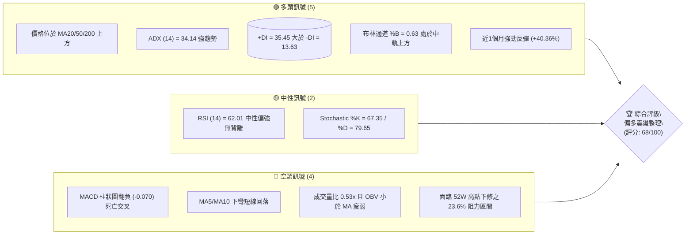

### 📊 核心指標速覽表

| 指標類別 | 指標名稱 | 當前數值 | 訊號 | 解讀 |
|----------|----------|----------|------|------|
| **價格** | 當前價格 | $172.73 | 🟢 多頭 | 站上多數均線，處於 52 週區間之 65.6% 高位階 |
| **均線** | MA20 | $161.95 | 🟢 多頭 | 現價高於 MA20 達 +6.65%，中期生命線提供動態支撐 |
| **均線** | MA50 | $140.72 | 🟢 多頭 | 現價大幅高於 MA50 (+22.75%)，中期多頭結構穩固 |
| **均線** | MA200 | $151.36 | 🟢 多頭 | 現價高於 MA200 (+14.12%)，長期牛市基線未受破壞 |
| **動能** | RSI(14) | 62.01 | 🟡 中性 | 位於 50-70 強勢多頭區間，自超買區平穩回落，無背離 |
| **動能** | MACD(12,26,9) | 11.018 / 11.088 | 🔴 轉弱 | DIF 輕微下穿 DEA，MACD 柱轉負 -0.070，短線面臨技術修正 |
| **趨勢** | ADX(14) | 34.14 | 🟢 強勢 | ADX > 25 且 +DI (35.45) 遠高於 -DI (13.63)，多頭趨勢明朗 |
| **波動** | ATR(14) | $7.44 | 🟡 中性 | 波動率佔價格 4.31%，日內具備充足波段交易空間 |
| **量能** | 20日均量比 | 0.53x | 🔴 疲弱 | 最新成交量萎縮至 24.47M，OBV 處於均線下方，量價出現背離 |

### 🏆 技術評分卡

```
╔══════════════════════════════════════════════════════════════════╗
║              技術評分卡 — PLTR (2026-08-25)                     ║
╠══════════════════════════════════════════════════════════════════╣
║ 趨勢強度 (Trend)      ████████████████░░░░  80/100  🟢 強多頭   ║
║ 動能指標 (Momentum)   ████████████░░░░░░░░  60/100  🟡 弱修復   ║
║ 支撐穩定度 (Support)  ██████████████░░░░░░  70/100  🟢 穩固     ║
║ 成交量配合 (Volume)   ████████░░░░░░░░░░░░  40/100  🔴 量能背離 ║
║ 形態完整度 (Pattern)  ████████████████░░░░  80/100  🟢 V型反轉  ║
║ 均線排列 (Moving Avg) ██████████████░░░░░░  70/100  🟢 多頭偏上 ║
╠══════════════════════════════════════════════════════════════════╣
║ 綜合評分 (Composite)  █████████████░░░░░░░  68/100  🟢 偏多回檔 ║
╚══════════════════════════════════════════════════════════════════╝
```

---

## 2. 趨勢分析

### 🌐 多時框趨勢分析

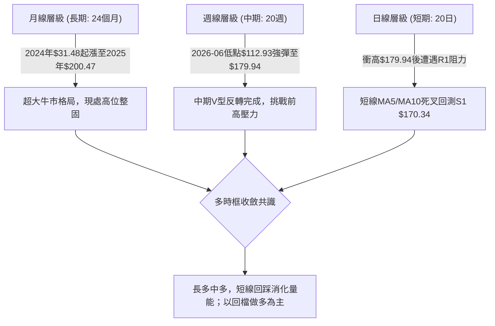

### 📈 長期趨勢 — 12個月走勢圖（Unicode）

```
PLTR 月線走勢圖（過去12個月：2025-09 至 2026-08）
價格軸 ($)
$210 ┤                    ● $200.47 (2025-10 高點)
$190 ┤              ● $182.42
$175 ┤        ● $177.75                                 ● $172.73 (現價)
$160 ┤  ● $156.71        ● $168.45               ● $156.54
$145 ┤                          ● $146.59   ● $146.28
$130 ┤                                ● $137.19   ● $139.11
$115 ┤                                                  ● $116.67 (2026-06 波段低點)
$100 └─────────────────────────────────────────────────────────────
       09   10    11    12    01    02    03    04    05    06    07    08 (月份)
```

#### 走勢特徵分析表格

| 階段區間 | 起止價位 | 漲跌幅 | 核心驅動特徵 | 技術面解讀 |
|----------|----------|--------|--------------|------------|
| **2025-08 ~ 2025-10** | $156.71 → $200.47 | +27.92% | 主升浪衝頂，觸及 52W 高點 $207.52 | 爆量拉升後 RSI 嚴重超買，確立歷史天花板 |
| **2025-11 ~ 2026-06** | $200.47 → $116.67 | -41.80% | 估值修正與獲利了結大退潮 | 跌破 MA200，最低下探 52W 低點 $106.37 附近 |
| **2026-06 ~ 2026-08** | $116.67 → $172.73 | +48.05% | 業績成長與投行評級調升（2026-08 集體升評） | 爆發性 V 型反轉，站回 MA20/50/200 所有均線 |

### 📊 中期趨勢（週線分析）

```
中期週線價格通道與關鍵支撐阻力結構：
$207.52 ────────────────────────────────────────── 52W High / R3 強壓力
        ▲
$187.90 ┼─ ─ ─ ─ ─ ─ ─ ─ ─ ─ ─ ─ ─ ─ ─ ─ ─ ─ ─ ─ ─ ─ R1 波段阻力 (前週衝高 $179.94 遇阻)
        │       ╭───╮
$172.73 ┼───────┤現價├────────────────────────── 當前週線收盤位置
        │       ╰───╯
$161.27 ┼─ ─ ─ ─ ─ ─ ─ ─ ─ ─ ─ ─ ─ ─ ─ ─ ─ ─ ─ ─ ─ ─ S3 / MA20 中期生命線支撐
        ▼
$112.93 ────────────────────────────────────────── 2026-06 波段起漲點雙底支撐
```

### ⚡ 趨勢強度評估（ADX 解讀）

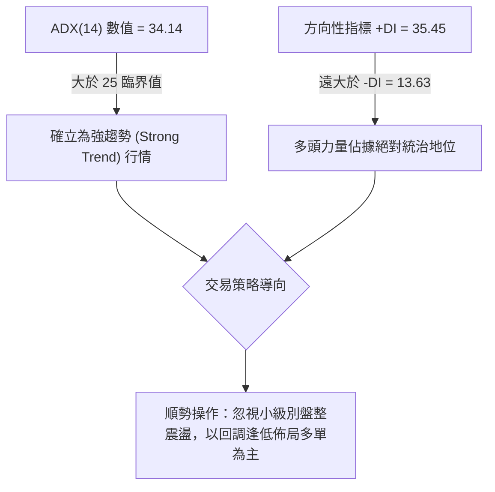

| 指標 | 數值 | 參考標準 | 當前狀態判定 |
|------|------|----------|--------------|
| **ADX (14)** | **34.14** | > 25 為趨勢行情；> 30 為強趨勢 | 🟢 處於強勢單邊多頭趨勢通道中 |
| **+DI** | **35.45** | 數值越高多頭動能越充沛 | 🟢 多頭進攻力道極為強勁 |
| **-DI** | **13.63** | 數值越低空頭拋壓越微弱 | 🟢 空頭打壓力道已被大幅瓦解 |

---

## 3. 圖表形態分析

### 🔍 形態識別系統

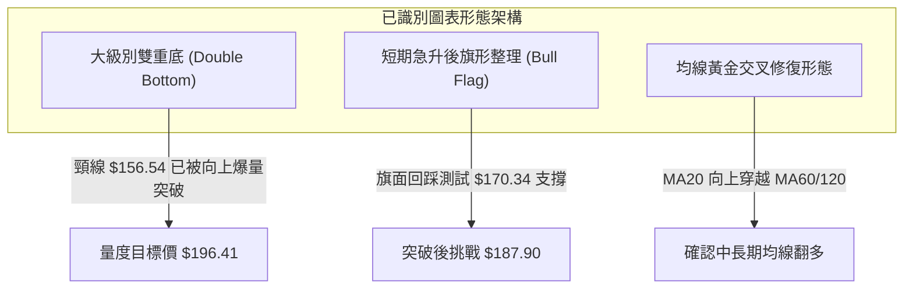

#### 形態信心度與目標價計算表

| 形態名稱 | 信心度 | 判斷依據（引用數據） | 完成度 | 目標價（附計算式） |
|----------|--------|----------------------|--------|--------------------|
| **波段雙底 (W-Bottom)** | **85%** | 2026-06 低點 $112.93 與 2026-07 低點 $122.92 構築雙底，2026-08 爆量 435M 突破 2026-05 頸線 $156.54 | 100% (已突破) | **$200.15**<br>計算式：頸線 $156.54 + (頸線 $156.54 - 底部 $112.93) = $200.15 |
| **短線多頭旗形 (Bull Flag)** | **70%** | 自 $123.06 暴漲至 $179.94（旗桿長度 $56.88），隨後於 $172.73 進行縮量窄幅整理 | 65% (旗面構築中) | **$187.90 (初級)** / **$229.61 (全幅)**<br>計算式：突破點 $172.73 + 旗桿 $56.88 = $229.61 |
| **指標型布林通道強勢軌道** | **90%** | %B 達 0.63，價格沿布林上軌 $203.24 與中軌 $161.95 之間強勢推升 | 進行中 | **$183.65** (Fib 23.6% 阻力) |

### 🕯️ 重要K線形態分析

| 週/月份 | 收盤價 | K線形態 | 深度解讀 | 訊號 |
|---------|--------|---------|----------|------|
| **2026-06-28** | $112.93 | 長下影破底翻紅槌子線 | 測試 52W 低點 $106.37 獲得強力承接，拋壓竭盡 | 🟢 強烈看多反轉 |
| **2026-08-09** | $172.01 | 爆量突破大陽線 (435M量) | 伴隨投行評級調升，單週跳空暴漲 +39.77%，確立場外大機構進場 | 🟢 極強攻擊訊號 |
| **2026-08-23** | $179.94 | 上影線十字射擊之星 | 衝高至 $180 附近遭遇斐波那契 23.6% ($183.65) 與 R1 前高反壓 | 🟡 滯漲減速 |
| **2026-08-30** | $172.73 | 縮量陰十字回調線 | 週量萎縮至 59.58M，顯示主力未大舉出貨，純屬健康洗盤 | 🟢 良性回檔 |

### 📉 ASCII 走勢形態示意圖

```
PLTR 雙底突破與旗形整理結構示意圖：
價格 ($)
$200 ┤                                                 [目標價2: $200.15]
$188 ┤                                       ╭── R1 $187.90
$180 ┤                                  ● 衝高 $179.94
$172 ┤                                   \  ●現價 $172.73 (旗形整理)
$157 ┼───────────────────● 頸線 $156.54 ─── ─────── [Fib 50%: $156.95]
$140 ┤           ● $146.28      /          \ /
$125 ┤          /        \     /            ● 底2 $122.92
$112 ┤         /          ● 底1 $112.93
     └─────────────────────────────────────────────────────────────
             2026-03     2026-06          2026-07   2026-08
```

---

## 4. 支撐與阻力

### 🗺️ 關鍵價位分布圖（Unicode）

```
PLTR 價位結構分布圖
═══════════════════════════════════════════════════════════════════
$207.52 ║██████████████████████████████║ 歷史極限強阻力 R3 (52W High)
$198.88 ║████████████████████          ║ 波段重要阻力 R2 (逼近 $200 整數關卡)
$187.90 ║████████████████████████      ║ 關鍵阻力 R1 (近一年波段高點聚類)
$183.65 ║──────────────────────────────║ 斐波那契 23.6% 回調位
$172.73 ╠══════════════════════════════╣ ◄ 現價 $172.73 (多空防守樞紐)
$170.34 ║▓▓▓▓▓▓▓▓▓▓▓▓▓▓▓▓▓▓▓▓          ║ 第一道波段支撐 S1 (-1.39%)
$168.88 ║──────────────────────────────║ 斐波那契 38.2% 回調位
$166.35 ║▓▓▓▓▓▓▓▓▓▓▓▓▓▓▓▓▓▓▓▓▓▓▓▓      ║ 強支撐 S2 (-3.69%)
$161.27 ║██████████████████████████████║ 核心生命線支撐 S3 (MA20 $161.95 匯聚)
$156.95 ║──────────────────────────────║ 斐波那契 50.0% 回調位 / 突破頸線
═══════════════════════════════════════════════════════════════════
```

### 🚧 阻力位分析表

| 阻力級別 | 價位 | 形成原因（嚴格引用數據） | 突破難度 | 重要性 |
|----------|------|--------------------------|----------|--------|
| **R1** | **$187.90** | 近一年波段高點聚類；上方緊鄰 Fib 23.6% ($183.65) 反壓 | 🟡 中等 | 短期突破點，站上即打開通往 $200 空間 |
| **R2** | **$198.88** | 波段高點次密集區，鄰近 $200.00 重大心理整數關卡 | 🔴 較高 | 中期多頭主升浪量度目標價聚落 |
| **R3** | **$207.52** | 52 週最高價 (52W High)，歷史套牢籌碼峰頂部 | 🔴 極高 | 超大週期多空分水嶺，若突破將創歷史新高 |

### 🛡️ 支撐位分析表

| 支撐級別 | 價位 | 形成原因（嚴格引用數據） | 守住機率 | 重要性 |
|----------|------|--------------------------|----------|--------|
| **S1** | **$170.34** | 近一年波段低點聚類，與當前日線 MA5/MA10 密集回測區重疊 | 🟢 75% | 短線多頭防守第一線，跌破則回踩 S2 |
| **S2** | **$166.35** | 近期突破後的波段整理平台，鄰近 Fib 38.2% ($168.88) | 🟢 85% | 強力緩衝帶，具備極佳風險報酬比買點 |
| **S3** | **$161.27** | 波段低點聚類，與 20 日均線 (MA20: $161.95) 形成重合共振 | 🟢 90% | 中期多頭生死線，絕不可實體跌破 |

### 📐 斐波那契回調位分析

依據 52 週極值區間（低點 **$106.37** → 高點 **$207.52**，總垂直空間 **$101.15**）計算回調結構：

| 斐波那契比例 | 價位 | 當前相對位置與技術解讀 |
|--------------|------|------------------------|
| **0.0% (52W High)** | **$207.52** | 歷史峰值阻力位 |
| **23.6%** | **$183.65** | **現價上方直接阻力**：前週衝高 $179.94 即在此關卡前受阻回落 |
| **38.2%** | **$168.88** | **現價下方第一防禦**：現價落於 23.6% 與 38.2% 之間，回調不破此位屬強勢整理 |
| **50.0%** | **$156.95** | 多空中軸分水嶺：與前波頸線高點 ($156.54) 高度吻合，構成極強底部支撐 |
| **61.8%** | **$145.01** | 黃金分割防守位：與 MA120 ($142.08) 及 MA50 ($140.72) 形成共振支撐 |
| **78.6%** | **$128.02** | 深度回調防守位（前期起漲密集區） |
| **100.0% (52W Low)** | **$106.37** | 52 週最低價 |

---

## 5. 技術指標深度解讀

### 🎛️ 指標訊號總覽

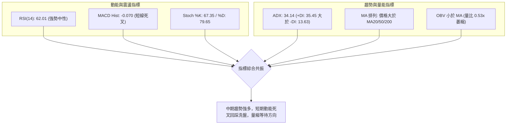

### 📈 移動平均線排列分析

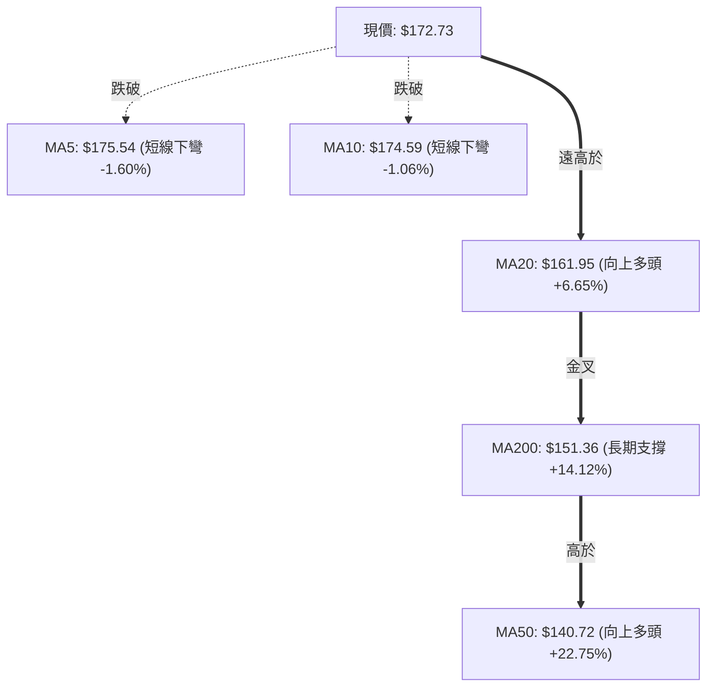

| 均線名稱 | 當前價位 | 與現價偏離度 | 走勢斜率 | 技術意涵 |
|----------|----------|--------------|----------|----------|
| **MA 5** | $175.54 | -1.60% | 走平下彎 ▅▇███ | 極短線面臨獲利了結拋壓，壓制價格 |
| **MA 10** | $174.59 | -1.06% | 走平下彎 ▅▆▇██ | 短線回調第一道反壓 |
| **MA 20** | $161.95 | +6.65% | 陡峭向上 ▄▅▆▇█ | **中期上升生命線**，提供強大低吸動能 |
| **MA 60** | $140.44 | +22.99% | 穩步向上 ▃▄▅▆█ | 中期多頭成本線，支撐極強 |
| **MA 120** | $142.08 | +21.57% | 轉折向上 ▂▃▄▅█ | 半年線翻多，確認大週期底部成形 |
| **MA 200** | $151.36 | +14.12% | 向上運行 ▄▅▆▇█ | **長期牛熊分水嶺**，價格重返年線上方 |

### 📉 RSI(14) 分析

- **當前數值**：`62.01`
- **強度進度條**：`████████████░░░░░░░░ 62.01%` (處於 50–70 強勢多頭區間)
- **超買/超賣狀態**：脫離前週的高位超買區 (79.0)，回調至中性健康水平，釋放了極度緊繃的多頭槓桿。
- **背離分析判定**：
  - **頂背離檢驗**：價格在 2026-08 創下波段新高 $179.94，RSI 同步攀升至 79.0；當前隨價格回落至 $172.73，RSI 降至 62.01。高點與動能同步，**無頂背離現象**。
  - **底背離檢驗**：2026-06 低點 $112.93 (RSI 27.8) 至 2026-07 低點 $122.92 (RSI 35.7)，呈現標準**底背離抬升**，已成功引爆 8 月份大行情。
  - **結論**：動能健康，目前無空頭背離隱憂。

### 📊 MACD(12/26/9) 訊號解讀

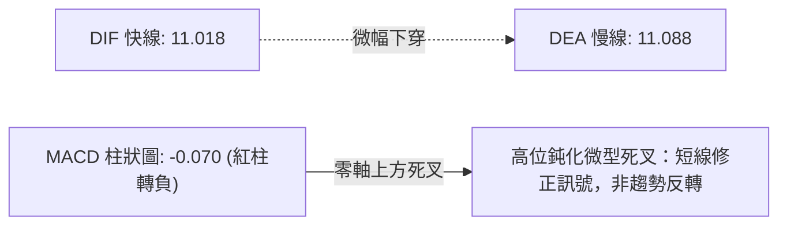

- **MACD 線 (11.018)** 與 **訊號線 (11.088)** 仍處於零軸遠上方之強勢多頭領域。
- **柱狀圖 (-0.070)**：由上週的 +1.092 轉為負值，構成高位死叉。由於雙線仍深處多頭區，此為典型的「**強勢回檔整理**」訊號，預示價格將以時間換取空間，在 S1-S2 區間震盪消化乖離率。

### 📦 布林通道分析

```
布林通道結構 (20日參數, 2倍標準差)
$203.24 ┬────────────────────────────────────────── BB 上軌 (上行阻力空間)
        │
$172.73 ┼─── 現價 (%B = 0.63, 處於強勢通道中上段)
        │
$161.95 ┴────────────────────────────────────────── BB 中軌 / MA20 (多頭核心防守線)
        │
$120.67 ┴────────────────────────────────────────── BB 下軌 (極端超賣支撐)
```

- **帶寬與位置**：上軌 $203.24，中軌 $161.95，下軌 $120.67。
- **%B 指標 = 0.63**：價格位於中軌上方，顯示多頭依然掌控市場節奏。
- **通道走勢**：布林帶口呈現擴張後微幅收斂態勢，現價回踩中軌 $161.95 將是極強的趨勢加碼點。

### 💹 成交量分析（量價配合度）

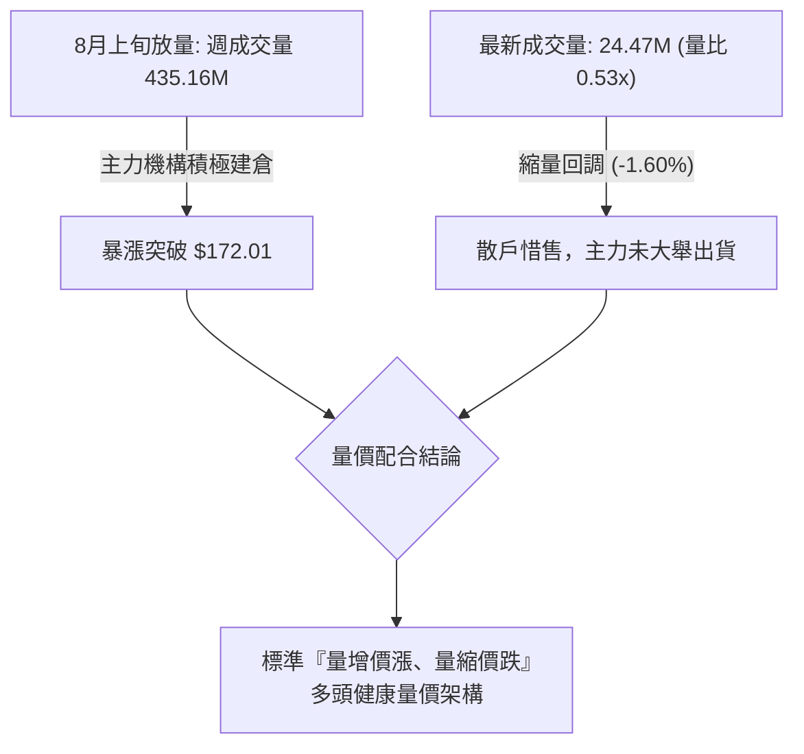

- **最新成交量**：24,473,108 股，相較於 20 日均量 46,605,535 股，量比僅 **0.53x**。
- **OBV 能量潮**：OBV < MA，顯示短線動能略顯疲態，需等待新一輪買盤帶量突破 R1 ($187.90) 方能重啟主升浪。

---

## 6. 動能與波動率

### ⚡ 動能評估四象限

| 象限 | 動能強度 | 波動率 | PLTR 當前狀態判定 | 交易決策指引 |
|------|----------|--------|-------------------|--------------|
| **Q1 (高動能·低波動)** | 強 (ADX>30) | 低 | — | 穩定單邊推升行情 |
| **Q2 (高動能·高波動)** | **強 (+DI 35.45)** | **高 (Beta 1.56, ATR $7.44)** | **✓ 當前精準落點** | **高爆發波段行情：嚴格設定止損，拉回支撐做多** |
| **Q3 (低動能·高波動)** | 弱 | 高 | — | 擴散無序震盪，容易雙向洗盤 |
| **Q4 (低動能·低波動)** | 弱 | 低 | — | 窄幅橫盤死寂，資金效率極低 |

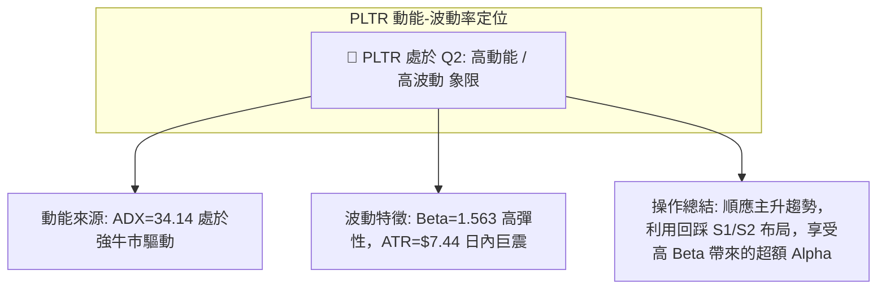

### 📊 ATR 波動率分析

- **ATR(14) 絕對數值**：**$7.44**
- **價格波動百分比**：**4.31%** (屬於高流動性、高波幅軟體股特徵)
- **風控止損距離量化**：
  - **激進型短線止損 (1.0 × ATR)**：$172.73 - $7.44 = **$165.29** (剛好位於 S2 $166.35 之下方)
  - **穩健型波段止損 (1.5 × ATR)**：$172.73 - ($7.44 × 1.5) = **$161.57** (精準對齊 S3 / MA20 $161.27-$161.95 支撐帶)

### 📐 Beta 與市場相關性

- **Beta 係數**：**1.563**
- **市場屬性解讀**：PLTR 展現出相較於 S&P 500 指數高出 56.3% 的波動彈性。
- **操作啟示**：在科技股與大盤多頭環境下，PLTR 具備強大的向上槓桿效應；但若大盤走弱，其回檔幅度亦會放大，因此部位控制（Position Sizing）必須嚴格限制在總資金的 10%–15% 內。

---

## 7. 多時框架總結

### 📋 時框架評分表

| 時框架 | 趨勢方向 | 動能狀態 | 均線排列 | 形態結構 | 綜合評分 | 操作建議 |
|--------|----------|----------|----------|----------|----------|----------|
| **月線 (長期)** | 🟢 多頭上行 | 🟢 RSI 偏強 | 🟢 處於 MA200 之上 | 24個月大底成形 | **85/100** | 長期投資堅定持有 |
| **週線 (中期)** | 🟢 強勢反轉 | 🟢 ADX 34.14 強多 | 🟢 突破站穩 MA20/50 | 雙底爆量突破頸線 | **80/100** | 中期波段逢低加碼 |
| **日線 (短期)** | 🟡 震盪回檔 | 🔴 MACD 短線死叉 | 🟡 跌破 MA5/MA10 | 旗形洗盤整理 | **55/100** | 不追高，等待回踩 S1/S2 |

### 🔲 綜合訊號矩陣

```
╔══════════════════════════════════════════════════════════════════════╗
║                     PLTR 多時框架訊號收斂矩陣                        ║
╠═════════════════╦══════════════════╦═════════════════════════════════╣
║ 維度            ║ 狀態評級         ║ 核心技術特徵                    ║
╠═════════════════╬══════════════════╬═════════════════════════════════╣
║ 長期趨勢 (月)   ║ 🟢 強多 (85分)   ║ 自$106起漲，確立跨年度大牛市    ║
║ 中期趨勢 (週)   ║ 🟢 強多 (80分)   ║ 爆量突破$156頸線，ADX=34強趨勢  ║
║ 短期節奏 (日)   ║ 🟡 偏弱 (55分)   ║ MACD死叉，縮量回調測試S1支撐    ║
║ 支撐阻力結構   ║ 🟢 穩固 (70分)   ║ S1 $170 / S2 $166 重重保護      ║
║ 籌碼量價配合   ║ 🟡 中性 (50分)   ║ 縮量回洗，散戶籌碼沉澱          ║
╠═════════════════╩══════════════════╩═════════════════════════════════╣
║ 最終加權評分：68 / 100 ──── 總體偏多，短線回調提供黃金進場點         ║
╚══════════════════════════════════════════════════════════════════════╝
```

### ⚖️ 多時框收斂結論

依據多時框收斂規則：
1. 當前 **ADX(14) = 34.14 > 25**，市場明確處於**強趨勢行情**。
2. 依規則，應以中長期（週線/MA20、MA200）的**強烈多頭方向為主導**，日線級別的 MACD 死叉與縮量回調僅視為「**尋找優質進場點的短線逆向波動**」。
3. **唯一方向性結論：【偏多回檔，逢低佈局】**。本結論與第 8 章交易策略完全一致。

---

## 8. 交易策略建議

### 🗺️ 策略決策流程圖

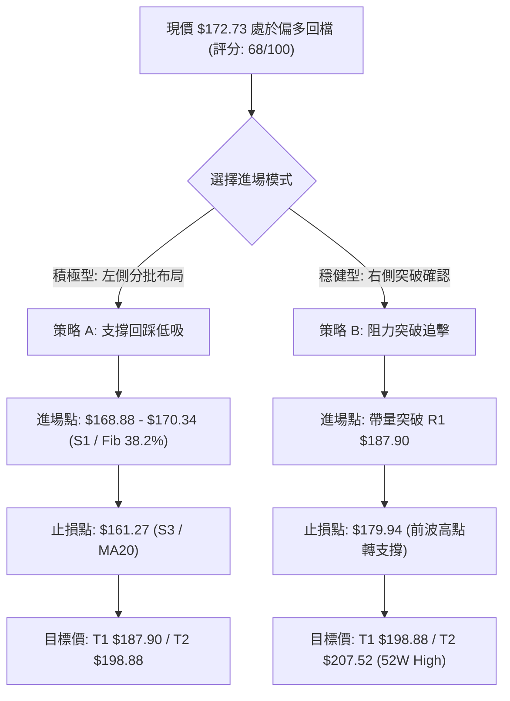

### 🧭 策略路由（依評分卡分流）

> **當前主策略方向 = 【多頭主升回踩佈局】（依綜合評分 68/100，大於 60 門檻）**  
> 空頭方向不作為獨立策略，僅列為「反轉風險觸發點與風控對沖提醒」。

### 🎯 價格情境階梯（Price Scenarios）

| 觸發條件 | 下一目標 | 後續延伸目標 | 情境含義與操作指引 |
|----------|----------|--------------|--------------------|
| **強勢突破 R1 ($187.90)** | **R2 ($198.88)** | **R3 ($207.52)** | 短線洗盤結束，重啟主升浪，加碼追多 |
| **守住 S1 ($170.34) - 現價區間** | **Fib 23.6% ($183.65)** | **R1 ($187.90)** | 旗形區間強勢震盪，維持多頭底倉 |
| **跌破 S1 ($170.34)** | **S2 ($166.35)** | **S3 ($161.27)** | 健康深度回踩，觸及 MA20 提供絕佳買點 |
| **實體跌破 S3 ($161.27)** | **Fib 50% ($156.95)** | **MA50 ($140.72)** | 中期趨勢轉弱，多單全面止損離場 |

### 📊 情境機率分佈

| 價格情境 | 機率預估 | 主要技術依據 |
|----------|----------|--------------|
| **情境一：回踩 S1/S2 後重啟上攻** | **65%** | ADX=34.14 強多、均線多頭排列、投行一致買入評級、量縮洗盤特徵 |
| **情境二：在 $168.88 - $183.65 區間震盪** | **25%** | MACD 柱狀圖微幅為負 (-0.070)、成交量能低迷 (0.53x 均量) |
| **情境三：深度跌破 S3 $161.27** | **10%** | 需遭遇大盤系統性崩跌或個股突發重大黑天鵝 |

### 🟢 主策略詳情

| 策略要素 | 策略 A（回調低吸型 — 推薦） | 策略 B（右側突破型） |
|----------|------------------------------|----------------------|
| **適用對象** | 波段交易者 / 價值動量投資者 | 動能突破交易者 |
| **進場條件** | 價格回踩 S1 $170.34 至 Fib 38.2% $168.88 企穩 | 日K線收盤價帶量放量突破 R1 $187.90 |
| **進場價格** | **$170.34** | **$188.50** (突破確認進場) |
| **目標價 T1** | **$187.90** (波段高點 R1, +10.31%) | **$198.88** (波段阻力 R2, +5.51%) |
| **目標價 T2** | **$198.88** (量度目標 R2, +16.75%) | **$207.52** (52W 歷史高點 R3, +10.09%) |
| **止損價格** | **$161.27** (跌破 S3/MA20, -5.32%) | **$179.94** (跌破前高防守, -4.54%) |
| **風險報酬比** | **1 : 3.15** (以 T2 計算) | **1 : 2.22** (以 T2 計算) |
| **成功機率** | **70%** | **60%** |
| **建議倉位** | **15% - 20% 總資金** | **10% 總資金 (突破加碼)** |

### 🔴 反向風險觸發點（對沖提示）

- **多單警戒線**：若收盤價實體跌破 **S2 $166.35**，應立即將倉位減半。
- **趨勢破壞線**：若價格帶量跌破 **S3 $161.27 / MA20 $161.95**，代表自 6 月以來的 V 型反轉結構遭到破壞，所有多單必須無條件止損，甚至可反手買入 Put 選擇權對沖現貨風險。

### ⭐ 整體訊號強度評星

```
╔══════════════════════════════════════════════════════════════════╗
║ 做多訊號強度：★★★★☆  (4.0/5星 — 中長期牛市確立，短線回踩即買點)║
║ 做空訊號強度：★☆☆☆☆  (1.0/5星 — 逆強趨勢操作，盈虧比極差)     ║
║ 整體可信度：  ★★★★☆  (4.5/5星 — 多指標共振，華爾街投行強推)  ║
╚══════════════════════════════════════════════════════════════════╝
```

---

## 9. 風險提示與監控

### ✅ 關鍵監控指標 Checklist

```
╔══════════════════════════════════════════════════════════════════╗
║               交易監控清單 (Daily Monitoring Checklist)         ║
╠══════════════════════════════════════════════════════════════════╣
║ [ ] 價格是否守穩 S1 $170.34 與 Fib 38.2% $168.88？              ║
║ [ ] 日成交量是否放大至 45M (超越 20 日均量)？                     ║
║ [ ] 日線 MACD 柱狀圖是否由負 (-0.070) 重新翻正？                 ║
║ [ ] RSI(14) 是否在 55-60 獲得支撐並重新向上發散？               ║
║ [ ] 價格向上挑戰 R1 $187.90 時是否出現爆量突破？                 ║
║ [ ] 嚴格執行 S3 $161.27 之絕對止損紀律！                        ║
╚══════════════════════════════════════════════════════════════════╝
```

### ⚠️ 風險場景分析

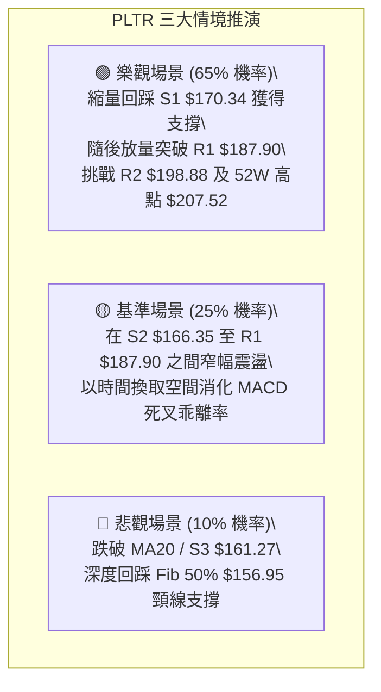

### 🛡️ 風險管理重要提醒

1. **高估值引發的波動放大**：PLTR 目前 Trailing P/E 達 146.38，EV/Sales 達 67.18。高估值意味著市場容錯率低，任何微小的利空消息都可能引發單日超過 1.5 倍 ATR ($11.00+) 的劇烈波動。
2. **量能不足隱憂**：當前成交量比僅 0.53x，且 OBV < MA。在成交量未有效放大突破 45M 之前，切忌在 $175 以上盲目追高，耐心等待回踩。
3. **倉位與止損紀律**：單一帳戶在 PLTR 上的暴險不宜超過 20%，每筆交易的最大虧損金額應嚴格限制在總資產的 1%–2% 以內。

---

## 📋 報告總結

```
╔══════════════════════════════════════════════════════════════════╗
║                     PLTR 技術分析報告總結                        ║
╠══════════════════════════════════════════════════════════════════╣
║ 報告日期：2026-08-25                                             ║
║ 當前價格：$172.73                                                ║
║ 分析評級：🟢 偏多回檔整理（技術評分：68 / 100）                  ║
╠══════════════════════════════════════════════════════════════════╣
║ 關鍵結論：                                                       ║
║ ├─ 長期趨勢：🟢 強多 — 站穩 MA200 ($151.36)，大牛市格局未變     ║
║ ├─ 中期趨勢：🟢 強多 — ADX=34.14，雙底爆量突破頸線 $156.54      ║
║ ├─ 短期趨勢：🟡 震盪 — MACD高位死叉，量縮回踩S1 $170.34 旗形洗盤 ║
║ ├─ 關鍵支撐：S1 $170.34 ｜ S2 $166.35 ｜ S3 $161.27 (核心生命線) ║
║ ├─ 關鍵阻力：R1 $187.90 ｜ R2 $198.88 ｜ R3 $207.52 (52W High)  ║
║ └─ 分析師共識目標價：$191.68（最高目標 $255.00，評級 Buy）       ║
╠══════════════════════════════════════════════════════════════════╣
║ 最優策略組合：                                                   ║
║ 1. 🥇 最佳機會：回調至 $168.88 - $170.34 佈局多單，止損 $161.27  ║
║ 2. 🥈 次選機會：帶量突破 R1 $187.90 追擊，目標看至 $198.88      ║
║ 3. 🥉 保守選擇：等待股價回踩 MA20 ($161.95) 出現長下影線再行介入║
╚══════════════════════════════════════════════════════════════════╝
```

---

> ⚠️ **免責聲明**：本報告為 AI 自動生成之技術分析，所有數據及估算均嚴格基於所提供的歷史價格與量化技術指標。本報告**僅供研究與學術參考**，**不構成任何形式的投資建議**。金融市場具有高風險性，投資人應獨立思考並自行承擔交易盈虧。

---

*報告生成時間：2026-08-25 ｜ 數據來源：Yahoo Finance ｜ 分析框架：多時框技術分析體系*