# PLTR 技術分析報告

> **報告日期**：2026-08-27 ｜ **語言**：繁體中文 ｜ **數據來源**：Yahoo Finance ｜ **當前價格**：$177.50

---

## 目錄

| 章節 | 內容 |
|------|------|
| [1. 技術面概覽](#1-技術面概覽) | 訊號儀表板、核心指標、評分卡 |
| [2. 趨勢分析](#2-趨勢分析) | 多時框趨勢、長中短期走勢、ADX強趨勢解讀 |
| [3. 圖表形態分析](#3-圖表形態分析) | 形態識別、K線組合、形態目標價 |
| [4. 支撐與阻力](#4-支撐與阻力) | 關鍵價位分佈、斐波那契回調結構 |
| [5. 技術指標深度解讀](#5-技術指標深度解讀) | MA/RSI/MACD/布林通道/成交量OBV |
| [6. 動能與波動率](#6-動能與波動率) | 動能四象限、ATR波動度、Beta分析 |
| [7. 多時框架總結](#7-多時框架總結) | 時框架評分矩陣與收斂結論 |
| [8. 交易策略建議](#8-交易策略建議) | 策略路由、主推多頭策略、情境機率 |
| [9. 風險提示與監控](#9-風險提示與監控) | 監控Checklist、三表情境、風控原則 |

---

## 1. 技術面概覽

### 🎯 技術訊號儀表板

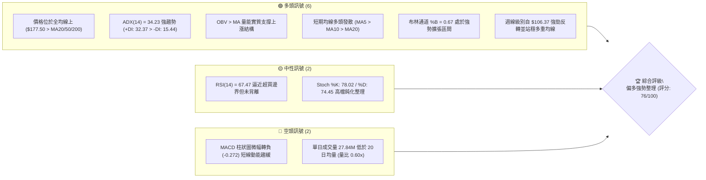

---

### 📊 核心指標速覽表

| 指標類別 | 指標名稱 | 當前數值 | 訊號 | 專業解讀 |
|:---|:---|:---|:---:|:---|
| **價格結構** | 現價 (Close) | **$177.50** | 🟢 | 位於52週區間 70.3% 高位階，突破多重中期阻力 |
| **短期均線** | MA20 | **$164.68** | 🟢 | 現價高於 MA20 達 +7.79%，形成近端動態支撐防線 |
| **中期均線** | MA50 | **$141.58** | 🟢 | 現價高於 MA50 達 +25.37%，中期多頭趨勢完全確立 |
| **長期均線** | MA200 | **$151.37** | 🟢 | 現價高於 MA200 達 +17.26%，長期牛市結構未受破壞 |
| **趨勢強度** | ADX (14) | **34.23** | 🟢 | 數值 > 25 且 +DI (32.37) 遠高於 -DI (15.44)，強多頭趨勢行情 |
| **動能震盪** | RSI (14) | **67.47** | 🟡 | 位於強勢多頭區間 (50-70)，尚未出現頂背離或嚴重過熱 |
| **趨勢動能** | MACD (12,26,9) | **Hist -0.272** | 🔴 | MACD線 10.748 略低於 Signal 11.020，極短線出現多頭漲多微調 |
| **通道指標** | 布林帶 (%B) | **0.67** | 🟢 | 股價運行於中軌 ($164.68) 與上軌 ($202.16) 之間，多方掌控 |
| **量能指標** | OBV 趨勢 | **OBV > MA** | 🟢 | 資金持續淨流入，量能結構有效確認自低檔起漲之動能 |
| **波動指標** | ATR (14) | **$7.72** | 🟡 | 佔現價 4.35%，短線波動顯著放大，操作須嚴守停損間距 |

---

### 🏆 技術評分卡

```
╔══════════════════════════════════════════════════════════════╗
║              PLTR 技術面量化評分卡 (2026-08-27)              ║
╠══════════════════════════════════════════════════════════════╣
║ 趨勢強度 (Trend Strength)   ████████████████░░░░  82/100 🟢  ║
║ 動能指標 (Momentum)         ██████████████░░░░░░  70/100 🟢  ║
║ 支撐穩定度 (Support Base)   ████████████████░░░░  78/100 🟢  ║
║ 成交量配合 (Volume Flow)    ████████████░░░░░░░░  62/100 🟡  ║
║ 形態完整度 (Pattern Setup)  ████████████████░░░░  79/100 🟢  ║
║ 均線排列 (MA Alignment)     ██████████████████░░  86/100 🟢  ║
╠══════════════════════════════════════════════════════════════╣
║ 綜合技術評分 (Overall Score) ███████████████░░░░░  76/100 🟢  ║
║ 評級結論：【多頭強勢突破後高檔整固】建議回踩支撐偏多佈局     ║
╚══════════════════════════════════════════════════════════════╝
```

---

## 2. 趨勢分析

### 🌐 多時框趨勢分析

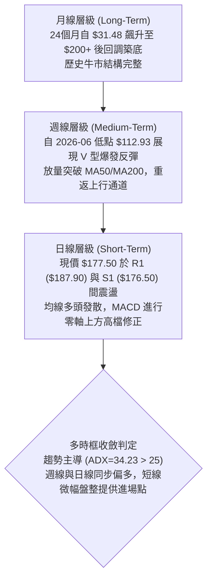

---

### 📈 長期趨勢 — 12個月走勢圖（ASCII）

```
PLTR 月線價格走勢圖（2025-09 至 2026-08）
價格 ($)
$205 ┤                                                  
$200 ┤                  ● (2025-10: $200.47 歷史高點聚類)
$190 ┤                 / \                              
$180 ┤     ●          /   ● (2025-12: $177.75)             ●←【當前現價 $177.50】
$170 ┤    / \        ●                                    /
$160 ┤   /   \      /                                    ● (2026-05: $156.54)
$150 ┤  /     \    /                                    / 
$140 ┤ /       \  ● (2026-01: $146.59)       ●         /  
$130 ┤/         \                             \       ● (2026-07: $123.06)
$120 ┤           ● (2026-02: $137.19)          \     /    
$110 ┤                                          ● (2026-06: $116.67 中期雙底支撐區)
$100 └─────────────────────────────────────────────────────────────────────────────
     25-09 25-10 25-11 25-12 26-01 26-02 26-03 26-04 26-05 26-06 26-07 26-08 (月份)
```

#### 24個月波段走勢特徵分析表

| 階段區間 | 時間跨度 | 起訖收盤價 | 漲跌幅 | 走勢特徵與結構意涵 |
|:---|:---:|:---:|:---:|:---|
| **第一階段：初段爆發** | 2024-08 → 2025-02 | $31.48 → $84.92 | **+169.8%** | 平台放量突破，主力機構快速建倉，呈現強烈單邊趨勢 |
| **第二階段：主升推升** | 2025-03 → 2025-10 | $84.40 → $200.47 | **+137.5%** | 突破百元關卡後連續拉升，創下 52W 高點 $207.52 區域 |
| **第三階段：深度回踩** | 2025-11 → 2026-06 | $168.45 → $116.67 | **-30.7%** | 獲利了結賣壓湧現，反覆打底測試 52W 低點 $106.37 支撐 |
| **第四階段：強勢反攻** | 2026-07 → 2026-08 | $123.06 → $177.50 | **+44.2%** | 8月初爆出 4.35億股歷史天量，以 V 型反轉重返 $177.50 |

---

### 📊 中期趨勢（週線分析）

```
週線關鍵阻力支撐與籌碼轉換示意：
阻力 R3  $207.52 ════════════════════════════════════ (52週最高點壓力區)
阻力 R2  $198.88 ──────────────────────────────────── (歷史次高收盤聚類)
阻力 R1  $187.90 ┄┄┄┄┄┄┄┄┄┄┄┄┄┄┄┄┄┄┄┄┄┄┄┄┄┄┄┄┄┄┄┄ (波段高點阻力聚類)
現價     $177.50 ◄───【當前報價：處於週線強勢突破後的蓄勢區間】
支撐 S1  $176.50 ┄┄┄┄┄┄┄┄┄┄┄┄┄┄┄┄┄┄┄┄┄┄┄┄┄┄┄┄┄┄┄┄ (近端跳空缺口支撐)
支撐 S2  $170.34 ──────────────────────────────────── (波段次低聚類防線)
支撐 S3  $166.35 ════════════════════════════════════ (MA20動態支撐與頸線共振)
```

- **週線動能演變**：2026-08-09 當週收盤大漲至 $172.01，週成交量暴增至 435,164,800 股，MACD 柱狀圖跳升至 +4.790，確認機構法人大規模回補。
- **近三週整固**：自 2026-08-16 至 2026-08-30，週收盤價由 $174.04 推升至 $179.94 後收於 $177.50，週成交量自 196.36M 收斂至 87.51M，屬於標準的**上漲帶量、回踩量縮**健康籌碼消化形態。

---

### ⚡ 趨勢強度評估（ADX 解讀）

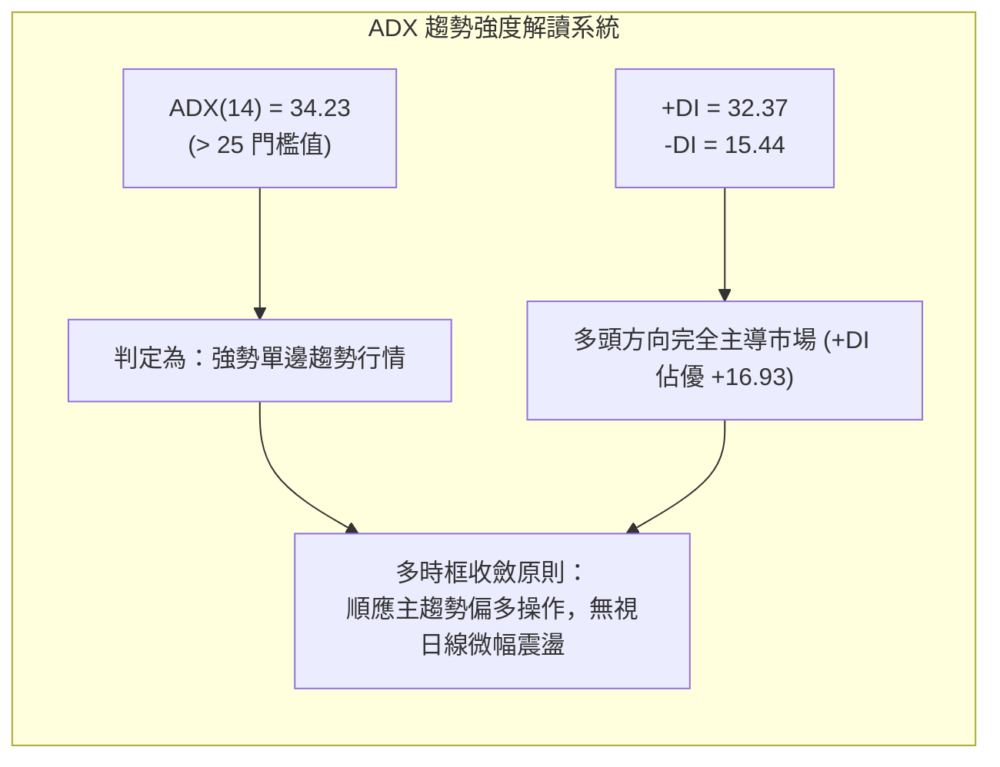

#### ADX 趨勢強度量化對照表

| 指標名稱 | 當前讀數 | 基準區間分類 | 趨勢狀態判定 | 交易決策指引 |
|:---|:---:|:---:|:---:|:---|
| **ADX (14)** | **34.23** | 25 ~ 50 (強趨勢) | 🟢 強烈多頭趨勢進行中 | 嚴禁逆勢放空，採用順勢拉回做多策略 |
| **+DI (14)** | **32.37** | > 25 (多頭優勢) | 🟢 買方動能強勁且充沛 | 突破關鍵阻力時具有強烈追價推動力 |
| **-DI (14)** | **15.44** | < 20 (空頭疲弱) | 🟢 賣方拋壓已受到充分吸收 | 空頭難以發動具殺傷力的連續性波段下跌 |
| **DI 差值 (+DI - -DI)** | **+16.93** | > 10 (顯著多頭發散) | 🟢 多頭掌控全局 | 回檔測試支撐位 (S1/S2) 為優質低吸點 |

---

## 3. 圖表形態分析

### 🔍 形態識別系統

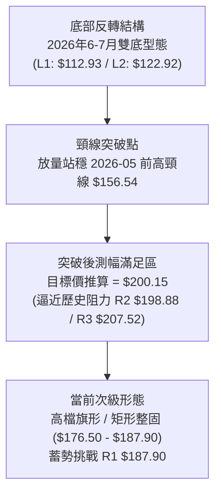

#### 圖表形態信心度與目標價評估表

| 識別形態 | 信心度 | 判斷依據（數據引用） | 完成度 | 目標價（精確計算式） | 形態意義 |
|:---|:---:|:---|:---:|:---|:---|
| **大型雙重底 (W底)** | **85%** | 2026-06-28 週低點 $112.93 (接近52W低點 $106.37) 與 2026-07-26 低點 $122.92 構築雙底，2026-08-09 放量突破頸線 $156.54 (2026-05-31 收盤高點)。 | 100% (已突破) | 頸線 $156.54 + 形態高度 ($156.54 - $112.93 = $43.61) = **$200.15** (高度契合 R2 $198.88) | 確立中期底部反轉，開啟新一輪挑戰歷史高點之波段 |
| **高檔強勢旗形 (Bull Flag)** | **70%** | 股價自 8月初 $123.06 飆升至 $179.94 後，近兩週於 $176.50 (S1) 至 $187.90 (R1) 窄幅整理，成交量急劇萎縮。 | 75% (待突破) | 旗桿起點 $123.06 至旗頂 $179.94 (高度 $56.88)，由突破點 $177.50 向上推算 = **$234.38** (屬長期延伸目標) | 多頭換手洗盤，消化短線獲利盤後延續原趨勢 |
| **均線黃金交叉結構** | **90%** | 短期 MA5 ($176.00) 與 MA10 ($175.23) 明確黃金交叉站上 MA20 ($164.68)，且全線向上穿越 MA200 ($151.37)。 | 100% (已確立) | 指標型態，推動價格沿布林中上軌向上推升 | 短中期均線多頭發散，提供堅實下檔保護 |

---

### 🕯️ 重要K線形態分析

| 期間/週別 | 收盤價 | 實體與影線特徵 | K線形態名稱 | 專業技術解讀 | 多空訊號 |
|:---:|:---:|:---|:---:|:---|:---:|
| **2026-06-28** | **$112.93** | 長下影線十字星，觸及 52W 低點 $106.37 區域後獲強力買盤拉起 | **錘頭線 (Hammer)** | 空頭力竭，極致超賣 (RSI=27.8)，形成波段重要結構底 | 🟢 強烈買訊 |
| **2026-08-09** | **$172.01** | 光頭巨陽線，全週暴漲近 40%，成交量達 4.35 億股天量 | **突破大陽線 (Marubozu)** | 突破 MA50/200 及所有下降壓力線，確認主力強勢進場 | 🟢 極強多頭 |
| **2026-08-23** | **$179.94** | 上影線小陽線，衝高至 $180 附近遇 R1 ($187.90) 賣壓受阻 | **高檔停頓線 (Stalling)** | 多頭推升速度放緩，進入高檔籌碼換手與籌碼沉澱期 | 🟡 短線整固 |
| **2026-08-30** | **$177.50** | 窄幅實體紡錘線，成交量大幅萎縮至 87.51M | **高檔縮量十字 (Spinning Top)** | 賣壓並未擴大，下檔 S1 ($176.50) 支撐強勁，蓄勢待發 | 🟢 蓄勢看多 |

---

### 📉 ASCII 走勢形態示意圖

```
PLTR 中期雙底突破與旗形整理結構圖
價格 ($)
$200 ┤                                                     [目標價 $200.15]
$190 ┤                                            ╭─ R1 $187.90 ──────
$180 ┤                                     ╭─────● (現價 $177.50 旗形整理)
$170 ┤                              ╭──────╯     ╰─ S1 $176.50 ──────
$160 ┤               [頸線 $156.54] ┼────────────────────────────────
$150 ┤                             /
$140 ┤   ● (2026-05: $156.54)     /
$130 ┤    \                      /    ● (2026-07: $122.92 底2)
$120 ┤     \                    /    /
$110 ┤      ● (2026-06: $112.93 底1)
     └─────────────────────────────────────────────────────────────
        【2026年6-7月大型雙底】       【8月放量突破】  【當前旗形蓄勢】
```

---

## 4. 支撐與阻力

### 🗺️ 關鍵價位分布圖（ASCII）

```
PLTR 關鍵價位與斐波那契結構分佈圖
═══════════════════════════════════════════════════════════════════════
$207.52 ║██████████████████████████████║ 強烈阻力 R3 / 52W High (Fib 0.0%)
$198.88 ║████████████████████          ║ 波段阻力 R2 / 形態目標共振區
$187.90 ║██████████████████████████    ║ 關鍵阻力 R1 (近期高點聚類)
$183.65 ║──────────────────────────────║ 斐波那契 23.6% 回調位
$177.50 ╠══════════════════════════════╣ ◄───【 當前價格 $177.50 】
$176.50 ║▓▓▓▓▓▓▓▓▓▓▓▓▓▓▓▓▓▓▓▓▓▓▓▓▓▓▓▓  ║ 近期第一支撐 S1 (微幅回調防線 -0.56%)
$170.34 ║▓▓▓▓▓▓▓▓▓▓▓▓▓▓▓▓▓▓            ║ 波段第二支撐 S2 (短線防守核心 -4.04%)
$168.88 ║──────────────────────────────║ 斐波那契 38.2% 回調位
$166.35 ║██████████████████████████████║ 強烈支撐 S3 / 頸線防線 (-6.28%)
$164.68 ║══════════════════════════════║ 布林中軌 / MA20 動態防護線
$156.95 ║──────────────────────────────║ 斐波那契 50.0% 中樞回調位
═══════════════════════════════════════════════════════════════════════
```

---

### 🚧 阻力位分析表

| 阻力級別 | 價位 | 距離現價幅寬 | 形成原因與籌碼結構 | 突破難度 | 重要性 |
|:---:|:---:|:---:|:---|:---:|:---:|
| **R1** | **$187.90** | **+5.86%** | 近一年波段高點密集聚類區，近兩週多頭衝高之獲利了結反壓點 | 中等 🟡 | ★★★☆☆ |
| **R2** | **$198.88** | **+12.05%** | 2025年10-12月歷史次高收盤密集區，雙底形態等幅測量目標位 ($200.15) 共振點 | 較高 🔴 | ★★★★☆ |
| **R3** | **$207.52** | **+16.91%** | 52週歷史最高點 (52W High)，亦為斐波那契 0.0% 極限阻力位，解套與心理賣壓極大 | 極高 🔴 | ★★★★★ |

---

### 🛡️ 支撐位分析表

| 支撐級別 | 價位 | 距離現價幅寬 | 形成原因與籌碼結構 | 守住機率 | 重要性 |
|:---:|:---:|:---:|:---|:---:|:---:|
| **S1** | **$176.50** | **-0.56%** | 近一年波段低點聚類區，8月中旬跳空突破後之近端平臺底部，短線第一防線 | 75% 🟢 | ★★★☆☆ |
| **S2** | **$170.34** | **-4.04%** | 8月上旬強勢大陽線之中繼回踩低點聚類，具備強大籌碼換手成本支撐 | 85% 🟢 | ★★★★☆ |
| **S3** | **$166.35** | **-6.28%** | 近一年關鍵波段低點聚類，緊鄰 MA20 ($164.68) 與 Fib 38.2% ($168.88)，為多頭防守底線 | 92% 🟢 | ★★★★★ |

---

### 📐 斐波那契回調位分析

依據 52週極端波動區間（低點 **$106.37** → 高點 **$207.52**，總垂直價差 **$101.15**）精確計算之回調位體系如下：

| 斐波那契回調比例 | 精確計算價位 | 與現價 ($177.50) 相對位置 | 技術分析與結構意涵解讀 |
|:---:|:---:|:---:|:---|
| **0.0% (52W High)** | **$207.52** | +16.91% (上方阻力 R3) | 歷史最高天花板，多頭終極挑戰目標 |
| **23.6%** | **$183.65** | +3.46% (上方近端阻力) | 強勢多頭行情的第一道回調警戒線；突破此位即打開通往 R1/R2 之路 |
| **【現價位置】** | **$177.50** | **基準點** | **現價精準運行於 23.6% ($183.65) 與 38.2% ($168.88) 之間的強勢回調區** |
| **38.2%** | **$168.88** | -4.86% (下方核心支撐) | 經典強勢回調黃金支撐位，與 S2 ($170.34) 及 S3 ($166.35) 形成高強度支撐帶 |
| **50.0%** | **$156.95** | -11.58% (中樞分水嶺) | 多空力量中樞，與 2026-05 前高頸線 ($156.54) 及 MA240 ($156.48) 完美重疊 |
| **61.8%** | **$145.01** | -18.30% (多頭防線) | 黃金分割強防守位，緊鄰 MA120 ($142.29) 與 MA50 ($141.58) |
| **78.6%** | **$128.02** | -27.88% (深度防線) | 深度回調防守區，鄰近布林通道下軌 ($127.20) |
| **100.0% (52W Low)** | **$106.37** | -40.07% (波段起點) | 52週歷史最低點，本輪牛市反轉基石 |

---

## 5. 技術指標深度解讀

### 🎛️ 指標訊號總覽

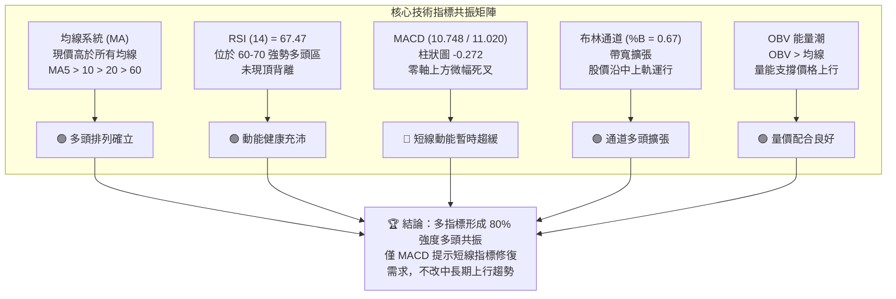

---

### 📈 移動平均線排列分析

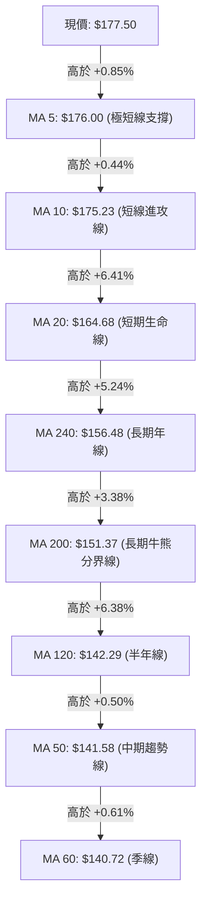

#### 均線各週期參數與乖離率詳解表

| 均線週期 | 數值 ($) | 與現價距離 (%) | 當前形態特徵 | 技術意涵解讀 |
|:---:|:---:|:---:|:---|:---|
| **MA 5** | **$176.00** | **+0.85%** | 陡峭向上發散 ▇███████████ | 極短線貼身支撐，多頭每日推升防線 |
| **MA 10** | **$175.23** | **+1.29%** | 加速向上發散 ▆▇████████ | 短線主升進攻防守線，守穩即維持快速推升 |
| **MA 20** | **$164.68** | **+7.79%** | 穩健向上推升 ▅▆▆▇▇██ | 短期多空生命線，亦為布林中軌，拉回強支撐 |
| **MA 50** | **$141.58** | **+25.37%** | 底部反轉上揚 ▄▄▅▅▆▇██ | 中期趨勢線，確認中期波段底部反轉成功 |
| **MA 60** | **$140.72** | **+26.14%** | 底部彎頭向上 ▄▄▅▅▆▆▇██ | 季線轉為實質支撐，中期籌碼全面翻多 |
| **MA 120** | **$142.29** | **+24.75%** | 平緩向上揚升 ▄▅▅▆▇▇▇██ | 半年線支撐，提供中長線回踩極佳買點 |
| **MA 200** | **$151.37** | **+17.26%** | 趨勢穩步走平轉揚 | 長期牛熊分水嶺，現價大幅站穩其上確立牛市 |
| **MA 240** | **$156.48** | **+13.43%** | 走平回升 ▂▂▃▃▃▃▃▄ | 年線位階，與 50.0% Fib ($156.95) 構築堅實地基 |

---

### 📉 RSI(14) 分析

```
RSI(14) 當前讀數：67.47  [ ▓▓▓▓▓▓▓▓▓▓▓▓▓░░░░░░░  67.47% ]
0 ────────────── 30 (超賣區) ───────────── 50 (中軸) ─────── 67.47 ── 70 (超買區) ────────── 100
                                                           ▲【目前位置：強勢進攻區間】
```

- **區間狀態解讀**：RSI(14) 讀數為 **67.47**，處於 50 至 70 之間的高動能多頭強勢區，反映買方力量持續主導，但尚未進入 >70 之嚴重超買鈍化區。
- **背離分析判斷**：
  - 週線 RSI 自 2026-08-09 的 70.0 升至 2026-08-23 的 79.0，伴隨價格由 $172.01 推升至 $179.94，呈現**價格創新高、指標同步創高**之健康走勢。
  - 最新一週收盤 $177.50，RSI 微調至 67.5，屬於正常的高檔良性降溫，**完全無頂背離（Bearish Divergence）現象**，亦無底背離，趨勢延續性佳。

---

### 📊 MACD(12/26/9) 訊號解讀

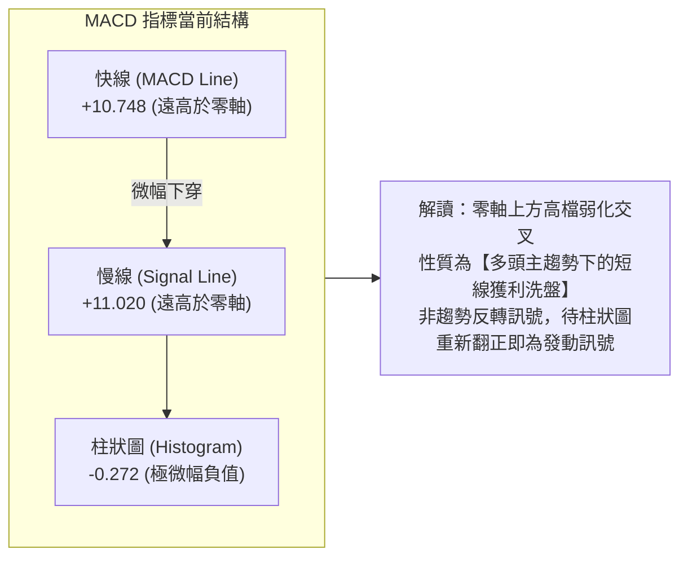

- **數值關係**：MACD 線 (**10.748**) 位於遠高於零軸的強勢多頭領域，訊號線 Signal 為 **11.020**，柱狀圖為 **-0.272**。
- **動能研判**：雖然短線出現極微幅的死叉休整，但由於兩線均處於 +10 以上極高位階，代表中長期向上衝力極大。此類在強趨勢（ADX=34.23）下的 MACD 柱狀圖微幅回落，通常以**以盤代跌**或**短暫回踩 S1 ($176.50)** 方式完成籌碼換手。

---

### 📦 布林通道分析（ASCII）

```
PLTR 布林通道 (20, 2) 當前結構圖
價格 ($)
$205 ┤
$202 ┤ ──────────────────────────────────── [ 上軌 Upper Band: $202.16 ]
$195 ┤
$190 ┤
$185 ┤
$180 ┤
$177 ┤ ════════════════════════════════════ ◄───【 當前價格 $177.50 (%B = 0.67) 】
$170 ┤
$165 ┤ ┄┄┄┄┄┄┄┄┄┄┄┄┄┄┄┄┄┄┄┄┄┄┄┄┄┄┄┄┄┄┄┄ [ 中軌 Middle Band (MA20): $164.68 ]
$155 ┤
$145 ┤
$135 ┤
$127 ┤ ──────────────────────────────────── [ 下軌 Lower Band: $127.20 ]
```

- **通道帶寬 (Bandwidth)**：上軌 **$202.16** 與下軌 **$127.20** 之間的總寬度達 $74.96 (42.2%)，通道呈現喇叭口持續擴張狀態，顯示市場處於高波動之趨勢擴展期。
- **%B 指標位置**：當前 **%B = 0.67**（計算式：`($177.50 - $127.20) / ($202.16 - $127.20)`），精準位於中軌 (0.50) 與上軌 (1.00) 之間的強勢上半區，未觸及上軌超買邊界，向上拓展空間充裕（距離上軌仍有 +13.89% 空間）。

---

### 💹 成交量分析（量價配合度）

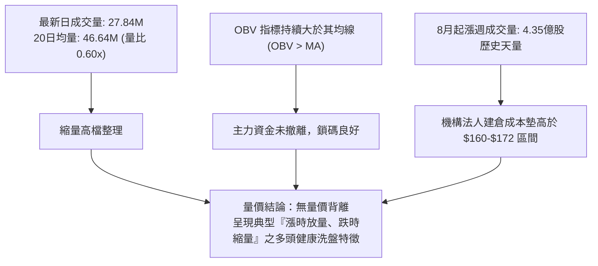

- **量比與量能解讀**：最新單日成交量為 27,844,800 股，相較於 20日均量 46,641,650 股，量比為 **0.60x**。在股價高檔橫盤期間出現大幅縮量，代表市場浮額極輕，持股者惜售心態濃厚。
- **OBV 能量潮驗證**：OBV 穩健運行於其均線之上，並未伴隨價格橫盤而出現資金出逃背離，證實 8月初爆發之大量買盤多屬機構長線配置資金。

---

## 6. 動能與波動率

### ⚡ 動能評估四象限

| 象限分類 | 動能強度 (Momentum) | 波動率水準 (Volatility) | 當前判定 | 市場環境與技術特徵描述 |
|:---:|:---:|:---:|:---:|:---|
| **第一象限 (Q1)** | **強動能 (Strong)** | **低波動 (Low)** | — | 穩定單邊推升波段，最理想之持股續抱區間 |
| **第二象限 (Q2)** | **弱動能 (Weak)** | **低波動 (Low)** | — | 沉悶無趨勢之窄幅盤整，資金使用效率低 |
| **第三象限 (Q3)** | **強動能 (Strong)** | **高波動 (High)** | **★ PLTR 當前定位** | **【高爆發強趨勢階段】ADX=34.23 + ATR=$7.72 + Beta=1.56，具備高報酬潛力但須嚴控風險** |
| **第四象限 (Q4)** | **弱動能 (Weak)** | **高波動 (High)** | — | 無方向之劇烈洗盤震盪，極易觸發停損，應避免進場 |

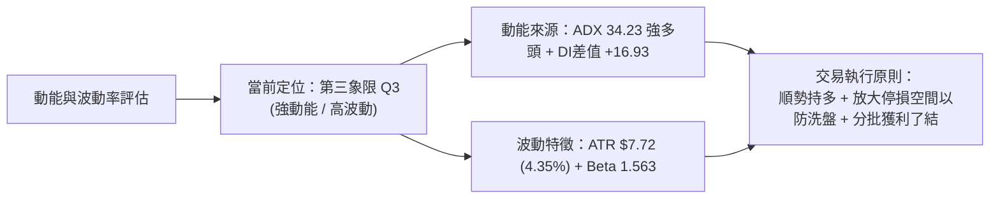

---

### 📊 ATR 波動率分析

- **ATR(14) 絕對數值**：**$7.72**（佔當前股價 $177.50 的 **4.35%**）。
- **日內/波段波動區間預估**：
  - 單日預期常態波動範圍：`$177.50 ± $7.72` → **$169.78 ~ $185.22**。
  - 此區間下緣 $169.78 與第二支撐 **S2 ($170.34)** 形成高度技術共振。
- **動態停損距離設定指引**：
  - **短線交易 (1.0x ATR)**：停損間距應設定為 $7.72，對應停損價約為 **$169.78** (緊鄰 S2 $170.34)。
  - **波段交易 (1.5x ATR)**：停損間距應設定為 `$7.72 × 1.5 = $11.58`，對應停損價約為 **$165.92** (精準保護於 S3 $166.35 與 MA20 $164.68 之下)。

---

### 📐 Beta 與市場相關性

```
Beta 敏感度指標：1.563  [ ▓▓▓▓▓▓▓▓▓▓▓▓▓▓▓░░░░░  高敏感型成長股 ]
0 ──────────────── 1.0 (大盤基準 S&P 500) ──────── 1.563 (PLTR) ──────────────── 2.5
```

- **Beta 係數解讀**：PLTR 之 Beta 值為 **1.563**，代表其股價波動敏感度為標普 500 指數的 1.56 倍。當大盤上漲 1% 時，PLTR 理論預期上漲 1.56%；反之，大盤回檔時亦承擔 1.56 倍之修正壓力。
- **機構持股與放空結構**：
  - 機構持股比例達 **64.9%**，法人籌碼相對穩定。
  - 空頭佔流通股比例 (Short % Float) 為 **3.2%**，空頭回補天數 (Short Ratio) 為 **1.52 天**，顯示目前市場放空賣壓極低，無立即之軋空壓力，走勢完全由多頭主動買盤與基本面驅動。

---

## 7. 多時框架總結

### 📋 時框架評分表

| 時框架週期 | 趨勢方向 | 動能狀態 | 均線排列特徵 | 圖表形態識別 | 綜合評分 | 操作建議指引 |
|:---:|:---:|:---:|:---|:---|:---:|:---|
| **長期 (月線)** | 🟢 多頭上行 | 🟢 強烈 | 股價站穩 MA200/MA240 之上，長牛格局 | 歷史高點回調後的大級別回升浪 | **85/100** | 長線多單堅定續抱，以年線為底線 |
| **中期 (週線)** | 🟢 突破反轉 | 🟢 強勁 | 放量突破週線 MA50 ($141.58) 與 MA200 | 大型雙重底 (W底) 突破後向目標測距 | **80/100** | 波段回踩積極做多，目標直指前高 |
| **短期 (日線)** | 🟡 高檔整固 | 🟡 中性微弱 | MA5/MA10/MA20 多頭排列，股價貼近 MA5 | 旗形/矩形高檔整理 ($176.50 - $187.90) | **72/100** | 待突破 R1 或回踩 S1/S2 分批佈局 |

---

### 🔲 綜合訊號矩陣

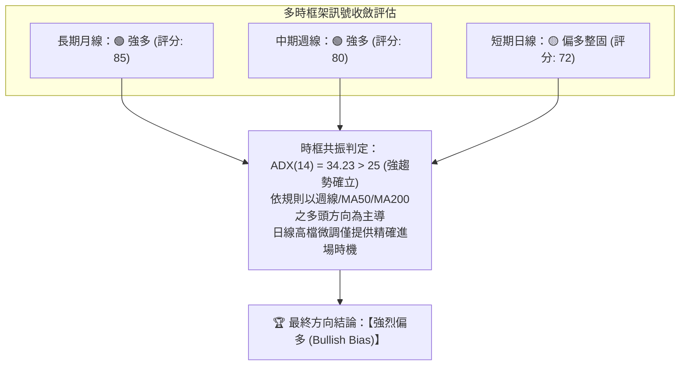

---

### ⚖️ 多時框收斂結論

1. **行情性質判定**：當前 ADX(14) 讀數為 **34.23**，遠高於 25 的趨勢分水嶺，嚴格判定市場處於**標準的強趨勢行情（Trending Market）**，絕非無方向之混沌盤整行情。
2. **時框主導優先級收斂**：
   - 依據多時框收斂規則，在強趨勢行情下，交易策略必須**完全以中長期（週線級別雙底突破、價格大幅運行於 MA50 $141.58 與 MA200 $151.37 之上）的多頭方向為主導**。
   - 日線級別的 MACD 柱狀圖微幅負值 (-0.272) 與單日縮量，僅代表短期微幅震盪修復，不得視為反轉訊號，其唯一用途是用於**在日線支撐位 (S1 $176.50 / S2 $170.34) 尋找勝率最高的回踩進場點**。
3. **唯一方向性結論**：**【全面偏多，逢回踩支撐做多】**。

---

## 8. 交易策略建議

### 🗺️ 策略決策流程圖

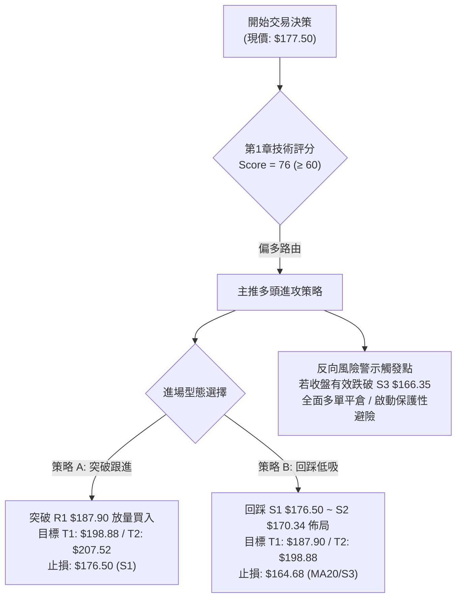

---

### 🧭 策略路由判定

- **當前主策略方向 = 【多頭主升與回踩佈局】（依據綜合技術評分 76/100 偏多判定）**。
- 本報告嚴格聚焦於多頭策略之精準執行，空頭僅列為風險防守與避險對沖觸發點，嚴禁兩頭模糊下注。

---

### 🎯 價格情境階梯（Price Scenarios）

| 觸發條件 (Trigger) | 第一目標價位 | 後續延伸目標 | 技術情境含義與操作指引 |
|:---|:---:|:---:|:---|
| **強勢向上突破 R1 ($187.90)** | **R2 ($198.88)** | **R3 ($207.52)** | 短線旗形整理結束，展開主升浪，直接挑戰歷史高點天花板 |
| **站穩現價區間 ($176.50 - $183.65)** | **R1 ($187.90)** | **R2 ($198.88)** | 時間換取空間，以日線橫盤消化獲利賣壓，均線上移提供推力 |
| **回踩跌破 S1 ($176.50)** | **S2 ($170.34)** | **S3 ($166.35)** | 短線多頭洗盤加深，回測 Fib 38.2% ($168.88) 與 MA20 動態強支撐區 |

---

### 📊 情境機率分佈

| 運行情境分類 | 發生機率 | 核心量化依據（指標狀態引用） | 操作對應模式 |
|:---|:---:|:---|:---|
| **情境一：強勢突破續漲** | **60%** | ADX=34.23 強趨勢確立；OBV > MA 資金持續淨流入；股價處於布林強勢區 (%B=0.67) 且站穩所有均線之上。 | 主力策略：突破加碼與回踩做多 |
| **情境二：高檔區間震盪** | **25%** | MACD 柱狀圖微幅回落 (-0.272)；日線成交量萎縮 (量比 0.60x)；Stoch %K/%D 高檔鈍化。 | 輔助策略：在 S1 與 R1 區間內高拋低吸 |
| **情境三：深度跌破回踩** | **15%** | 短線漲幅過大 (+44.2%)，若大盤 (Beta=1.563) 出現系統性回檔，可能回測 S3 ($166.35) 頸線。 | 防守策略：觸及止損點果斷離場觀望 |

---

### 🟢 主策略詳情

本報告依據技術評分與時框收斂，提供兩種不同風險偏好之多頭操作策略：

| 策略維度 | 策略 A：順勢突破追擊策略 (Momentum Breakout) | 策略 B：支撐回踩低吸策略 (Pullback Value Buy) |
|:---|:---|:---|
| **適合對象** | 積極型動能交易者、突破型波段交易者 | 穩健型波段投資者、價值成長配置者 |
| **進場條件** | 日K線收盤放量突破阻力位 **R1 ($187.90)** | 股價盤中回踩支撐位 **S1 ($176.50)** 至 **S2 ($170.34)** 獲得支撐 |
| **進場價格 (Entry)** | **$188.50** (確認突破 R1 後掛單) | **$176.50** (於 S1 關鍵低點掛單買入) |
| **目標價 T1 (Target 1)**| **$198.88** (阻力 R2 / 雙底目標，預期 +5.51%) | **$187.90** (阻力 R1，預期 +6.46%) |
| **目標價 T2 (Target 2)**| **$207.52** (歷史高點 R3 / Fib 0.0%，預期 +10.09%) | **$198.88** (阻力 R2，預期 +12.68%) |
| **止損價格 (Stop Loss)**| **$176.50** (跌破支撐 S1 / 原阻力轉支撐失敗，-6.37%) | **$166.35** (跌破強烈支撐 S3 / 頸線防線，-5.75%) |
| **風險報酬比 (R/R)** | **1 : 1.58** (以 T2 計算) | **1 : 2.21** (以 T2 計算，極佳風報比) |
| **策略成功機率** | **65%** | **75%** |
| **建議倉位配置** | 總資金之 **10% ~ 15%** | 總資金之 **15% ~ 20%** (分兩批建倉) |

---

### 🔴 反向風險觸發點（對沖與風控提示）

- **關鍵反轉風險觸發價**：**$166.35 (支撐 S3)**。
- **對沖處置條件**：若日K線收盤價實體跌破 **$166.35**，並伴隨日線 MA20 ($164.68) 失守，代表中期雙底反轉結構遭到破壞，多頭主升浪宣告終結。
- **風控處置行動**：所有多頭倉位應立即無條件停損出場，或透過購買看跌期權 (Put Options) 進行 100% 投資組合避險，下看斐波那契 50% 回調位 **$156.95**。

---

### ⭐ 整體訊號強度評星

```
╔══════════════════════════════════════════════════════════════╗
║ 做多訊號強度：★★★★☆  (4.2 / 5.0 星) — 趨勢明確，量價齊揚 ║
║ 做空訊號強度：★☆☆☆☆  (1.0 / 5.0 星) — 逆勢風險極高       ║
║ 整體技術可信度：★★★★☆ (4.5 / 5.0 星) — 多指標高度共振     ║
╚══════════════════════════════════════════════════════════════╝
```

---

## 9. 風險提示與監控

### ✅ 關鍵監控指標 Checklist

```
╔══════════════════════════════════════════════════════════════╗
║              PLTR 每日盤後關鍵技術監控清單                   ║
╠══════════════════════════════════════════════════════════════╣
║ [ ] 價格是否維持在短線支撐 S1 ($176.50) 之上？               ║
║ [ ] 日成交量是否回升至 20日均量 (46.64M) 以上以推動突破？   ║
║ [ ] RSI(14) 是否持續維持在 50-70 區間且未出現頂背離？        ║
║ [ ] MACD 柱狀圖是否重新由負轉正 (-0.272 → 正值)？           ║
║ [ ] ADX(14) 是否維持在 25 以上 (目前 34.23) 確保強趨勢？    ║
║ [ ] 股價是否成功攻克第一道阻力位 R1 ($187.90)？              ║
║ [ ] 跌破 S2 ($170.34) 時是否出現放量異常拋壓？               ║
╚══════════════════════════════════════════════════════════════╝
```

---

### ⚠️ 風險場景分析

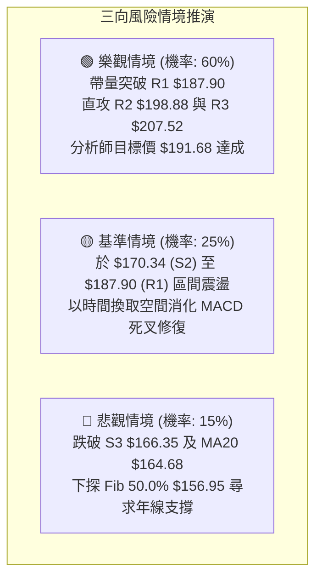

---

### 🛡️ 風險管理重要提醒

1. **ATR 波動風險管理**：PLTR 當前日 ATR 高達 **$7.72 (4.35%)**，屬於高波動成長標的。單筆交易之最大虧損金額嚴格限制於總投資本金之 **1.0% ~ 1.5%** 內，切忌過度放大槓桿。
2. **高估值引發的波動放大**：基本面 Trailing P/E 達 146.69，Forward P/E 達 76.70，高估值特性意味著一旦市場風險偏好轉向或大盤震盪（Beta=1.563），股價極易出現日內深幅洗盤，停損必須嚴格按技術位（S1/S2/S3）執行，不可抱有僥倖心理。
3. **分析師共識目標參考**：華爾街 27 位分析師平均目標價為 **$191.68**，介於阻力位 R1 ($187.90) 與 R2 ($198.88) 之間，顯示當前向上空間具備機構基本面共識支持。

---

## 📋 報告總結

```
╔══════════════════════════════════════════════════════════════════╗
║                 PLTR 技術分析報告總結 (2026-08-27)               ║
╠══════════════════════════════════════════════════════════════════╣
║ 標的代碼：PLTR (Palantir Technologies)   當前價格：$177.50       ║
║ 技術總評分：76 / 100                     綜合評級：🟢 強烈偏多   ║
╠══════════════════════════════════════════════════════════════════╣
║ 關鍵趨勢結論：                                                  ║
║ ├─ 長期趨勢：🟢 強烈看多 (月線歷史級別回升，站穩所有長期均線)   ║
║ ├─ 中期趨勢：🟢 突破看多 (週線雙底完成，放量突破頸線 $156.54)    ║
║ ├─ 短期趨勢：🟡 高檔整固 (日線旗形蓄勢，ADX=34.23 強趨勢支撐)    ║
║ ├─ 關鍵阻力：R1: $187.90 ｜ R2: $198.88 ｜ R3: $207.52 (52W高)  ║
║ ├─ 關鍵支撐：S1: $176.50 ｜ S2: $170.34 ｜ S3: $166.35 (防守底) ║
║ └─ 華爾街共識：買入 (Buy) ｜ 平均目標價：$191.68                 ║
╠══════════════════════════════════════════════════════════════════╣
║ 最優交易策略組合：                                              ║
║ 1. 🥇 最佳勝率機會 (策略 B)：回踩 S1 $176.50 分批做多，止損設於 ║
║      S3 $166.35，目標看 R1 $187.90 / R2 $198.88 (風報比 1:2.21) ║
║ 2. 🥈 強勢突破機會 (策略 A)：放量攻克 R1 $187.90 追擊買入，目標 ║
║      直指 R2 $198.88 與歷史新高 R3 $207.52 (風報比 1:1.58)       ║
║ 3. 🥉 極度保守選擇：等待 MACD 柱狀圖翻正且放量突破 $180 後進場  ║
╚══════════════════════════════════════════════════════════════════╝
```

---

> ⚠️ **免責聲明**：本報告為專業技術分析研究，所有數據、圖表及量化模型均基於市場歷史價格資訊進行客觀運算。本報告**僅供學術研究與投資參考**，**不構成任何形式的個人化投資建議或買賣邀約**。金融市場具有高度不確定性與風險，投資人應獨立評估自身風險承受能力並自負盈虧。

---

*報告生成時間：2026-08-27 ｜ 數據來源：Yahoo Finance ｜ 分析框架：多時框架技術分析與量化動能模型*