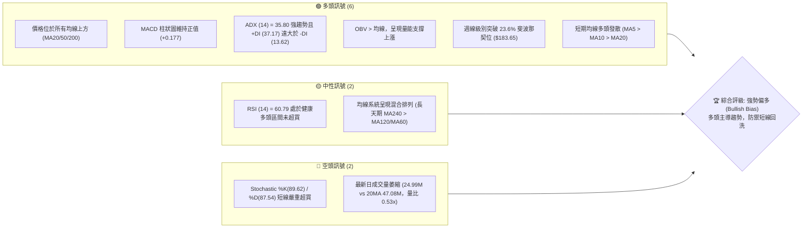
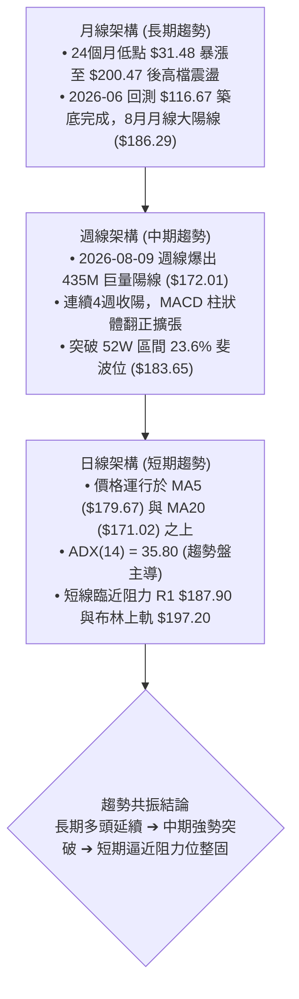
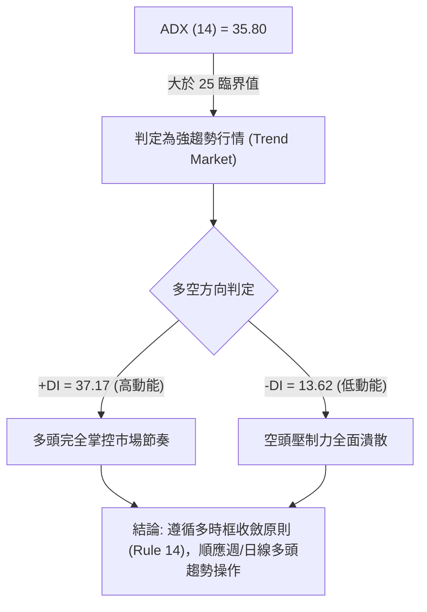
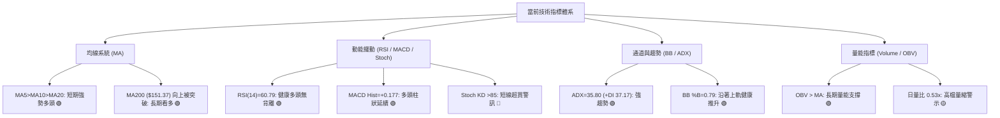
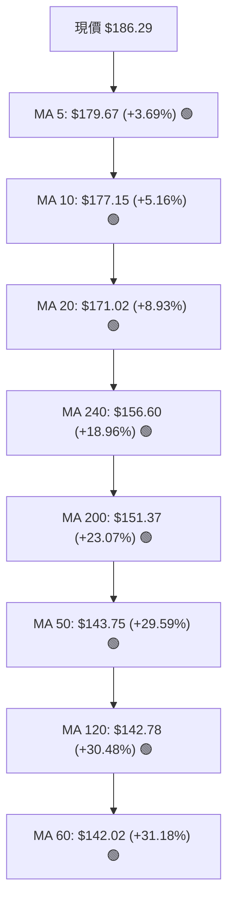
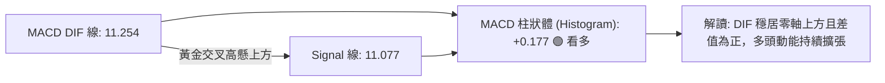
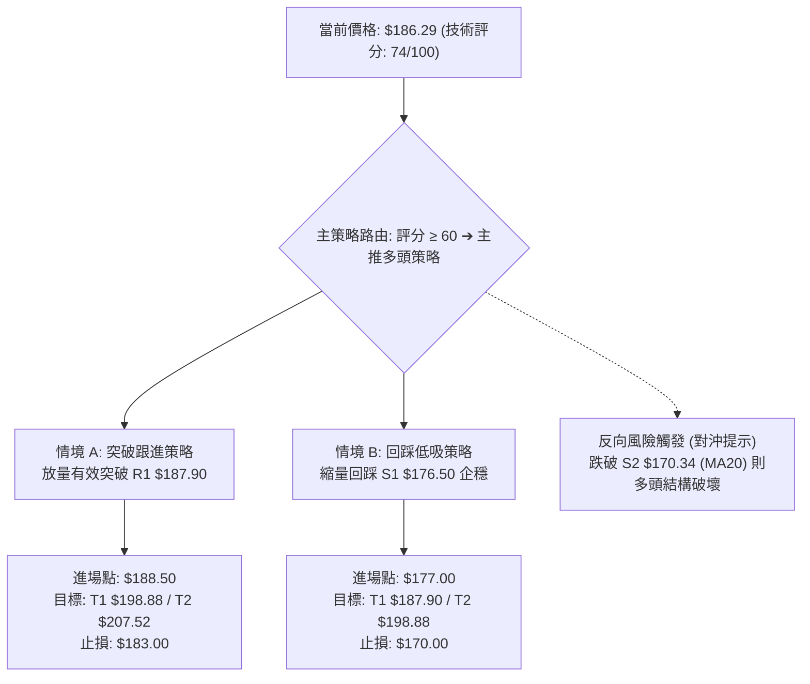
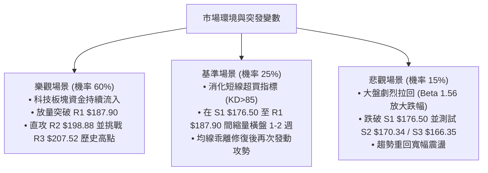

# PLTR 技術分析報告

> **報告日期**：2026-08-30 ｜ **語言**：繁體中文 ｜ **數據來源**：Yahoo Finance ｜ **當前價格**：$186.29

---

## 目錄

| 章節 | 內容 |
|------|------|
| [1. 技術面概覽](#1-技術面概覽) | 訊號儀表板、核心指標、評分卡 |
| [2. 趨勢分析](#2-趨勢分析) | 多時框趨勢、長中短期走勢 |
| [3. 圖表形態分析](#3-圖表形態分析) | 形態識別、K線組合、目標價 |
| [4. 支撐與阻力](#4-支撐與阻力) | 關鍵價位、斐波那契回調 |
| [5. 技術指標深度解讀](#5-技術指標深度解讀) | MA/RSI/MACD/布林/成交量 |
| [6. 動能與波動率](#6-動能與波動率) | 動能評估、ATR、Beta |
| [7. 多時框架總結](#7-多時框架總結) | 時框架評分矩陣 |
| [8. 交易策略建議](#8-交易策略建議) | 多空策略、風險報酬比 |
| [9. 風險提示與監控](#9-風險提示與監控) | 監控指標、風險場景 |

---

## 1. 技術面概覽

### 🎯 技術訊號儀表板



### 📊 核心指標速覽表

| 指標類別 | 指標名稱 | 當前數值 | 訊號 | 解讀 |
|----------|----------|----------|------|------|
| **價格** | 當前價格 | $186.29 | 🟢 | 站上 52 週高低區間 79.0%，多頭動能強勁 |
| **均線** | MA20 | $171.02 | 🟢 | 現價高於 MA20 達 +8.93%，短期上升趨勢明確 |
| **均線** | MA50 | $143.75 | 🟢 | 現價高於 MA50 達 +29.59%，中期波段多頭穩固 |
| **均線** | MA200 | $151.37 | 🟢 | 現價高於 MA200 達 +23.07%，長期牛市基調不變 |
| **動能** | RSI(14) | 60.79 | 🟢 | 位於 50–70 強勢多頭擴張區，無頂背離 |
| **動能** | MACD (12,26,9) | 11.254 / +0.177 | 🟢 | DIF 高於 Signal 線且柱狀體為正，多頭發散 |
| **擺動** | KD (Stoch 14) | %K 89.62 / %D 87.54 | 🔴 | 指標進入 >80 極端超買區，隨時有技術性回洗壓力 |
| **趨勢** | ADX (14) | 35.80 (+DI 37.17) | 🟢 | ADX > 25 且 +DI 壓制 -DI，強烈多頭趨勢行情 |
| **通道** | 布林通道 %B | 0.79 (Band: 144.85-197.20) | 🟢 | 位於中軌 ($171.02) 與上軌 ($197.20) 間偏多運行 |
| **成交量** | 最新量 / 20日均量 | 24.99M / 47.08M (0.53x)| 🟡 | 價格創波段高但成交量萎縮，出現量價背馳疑慮 |
| **波動** | ATR(14) | $6.87 (3.69%) | 🟡 | 每日平均震幅近 7 美元，操作需預留適當止損緩衝 |

### 🏆 技術評分卡

```
╔══════════════════════════════════════════════════════════════════╗
║                  技術評分卡 — PLTR (2026-08-30)                  ║
╠══════════════════════════════════════════════════════════════════╣
║ 趨勢強度 (Trend)     ████████████████░░░░  82/100  🟢 強勢多頭   ║
║ 動能指標 (Momentum)  ██████████████░░░░░░  74/100  🟢 偏多微過熱 ║
║ 支撐穩定度 (Support) ████████████████░░░░  80/100  🟢 下檔密集成交║
║ 成交量配合 (Volume)  ██████████░░░░░░░░░░  52/100  🟡 量能短線背離║
║ 形態完整度 (Pattern) ██████████████░░░░░░  72/100  🟢 V型反轉擴張 ║
║ 均線排列 (Moving Avg)████████████████░░░░  78/100  🟢 短中線黃金噴發║
╠══════════════════════════════════════════════════════════════════╣
║ 綜合技術評分         ███████████████░░░░░  74/100  🟢 強勢偏多   ║
╚══════════════════════════════════════════════════════════════════╝
```

---

## 2. 趨勢分析

### 🌐 多時框趨勢分析



### 📈 長期趨勢 — 12個月走勢圖（Unicode）

```
PLTR 月線收盤走勢圖（過去12個月: 2025-09 至 2026-08）
價格 ($)
$210 ┤                                                        
$200 ┤                  ● ($200.47 歷史次高)                    
$190 ┤                                              ● ($186.29 現價)
$180 ┤            ● ($182.42)         ● ($177.75)             
$170 ┤                                                        
$160 ┤                        ● ($168.45)         ● ($156.54) 
$150 ┤                                                        
$140 ┤                                  ● ($146.59) ● ($146.28)
$130 ┤                                      ● ($137.19)  ● ($139.11)  
$120 ┤                                                    ● ($123.06)
$110 ┤                                              ● ($116.67 局部底)
$100 └─┬──────┬──────┬──────┬──────┬──────┬──────┬──────┬──────┬──────┬──────┬──────┬───
     09/25  10/25  11/25  12/25  01/26  02/26  03/26  04/26  05/26  06/26  07/26  08/26
```

**走勢特徵分析表格**：

| 階段區間 | 時間跨度 | 價格起訖 | 漲跌幅 | 結構特徵與技術解讀 |
|----------|----------|----------|--------|--------------------|
| **主升攻擊段** | 2025-08 ~ 2025-10 | $156.71 → $200.47 | +27.92% | 多頭噴發段，創下 52 週高點 $207.52 區域 |
| **深度回撤段** | 2025-10 ~ 2026-06 | $200.47 → $116.67 | -41.80% | 經歷 8 個月 ABC 浪下行修正，於 52 週低點 $106.37 上方築底 |
| **底部回升段** | 2026-06 ~ 2026-07 | $116.67 → $123.06 | +5.48% | 縮量築雙底形態，量能萎縮至波段極致 |
| **強勢反轉段** | 2026-07 ~ 2026-08 | $123.06 → $186.29 | +51.38% | 8月初爆發性放量長紅突破多道均線，形成 V 型反轉攻擊 |

### 📊 中期趨勢（週線分析）

中期走勢在 2026 年 8 月初發生質變。2026-08-09 結束的該週，成交量飆升至 435,164,800 股（近 20 週最高量），週收盤價暴漲至 $172.01（RSI 衝上 70.0，MACD 柱狀體翻正至 +4.790），一舉突破 MA50 ($143.75) 與 MA200 ($151.37) 構成的長期籌碼密集區。近三週週線連續創高（$174.04 ➔ $179.94 ➔ $186.29），顯示機構大額買盤進場鎖碼。

```
中期支撐與阻力框架示意圖（週線視角）
  阻力 R3 ────────────────────────────── $207.52 (52W High)
  阻力 R2 ────────────────────────────── $198.88 (波段前高密集群)
  阻力 R1 ────────────────────────────── $187.90 (近期波段高點)
  現價   ══════════════════════════════ $186.29 (當前挑戰 R1)
  支撐 S1 ------------------------------ $176.50 (前兩週突破平台高點)
  支撐 S2 ------------------------------ $170.34 (MA20 / 8月起漲中樞)
  支撐 S3 ------------------------------ $166.35 (近一年波段強支撐)
```

### ⚡ 趨勢強度評估（ADX 解讀）



| 指標名稱 | 當前讀數 | 門檻區間 | 趨勢解讀 |
|----------|----------|----------|----------|
| **ADX (14)** | **35.80** | > 25 (趨勢確立) / > 30 (強趨勢) | 市場處於極為明確的單邊上升趨勢中 |
| **+DI (14)** | **37.17** | 基準線 20 上方 | 多方力量充沛，買盤攻擊力道強勁 |
| **-DI (14)** | **13.62** | 處於極低水平 (<15) | 空方完全無抵抗力，未出現實質性拋壓 |

---

## 3. 圖表形態分析

### 🔍 形態識別系統


| 形態名稱 | 信心度 | 判斷依據（引用真實數據） | 完成度 | 目標價（附精確計算式） |
|----------|--------|--------------------------|--------|------------------------|
| **雙重底 (W-Bottom)** | **85%** | 1. 2026-06 收盤 $116.67 (低點1)<br/>2. 2026-07 收盤 $123.06 / 週收 $122.92 (低點2)<br/>3. 2026-05 反彈高點 $156.54 (頸線)<br/>4. 2026-08-09 週線以 4.35 億股爆量長紅突破頸線 | **100% (已突破)** | **最低測幅目標：$196.41**<br/>計算式：頸線 $156.54 + 形態高度 ($156.54 - $116.67 = $39.87) = **$196.41** (接近阻力位 R2 $198.88) |
| **島狀/跳空強攻形態** | **70%** | 8月初由 $123.06 跳空大漲至 $172.01，留下未回補之跳空缺口 | **90%** | **區間上限目標：$207.52**<br/>以 52 週最高價 $207.52 為終極形態測幅壓力 |

### 🕯️ 重要K線形態分析

| 月份/週別 | 收盤價 | K線形態特徵 | 技術面解讀 | 訊號 |
|-----------|--------|-------------|------------|------|
| **2026-06 (月)** | $116.67 | 探底長下影小陰線 | 測試 52W 低點 $106.37 獲強支撐，空頭動能衰竭 | 🟡 止跌訊號 |
| **2026-07 (月)** | $123.06 | 底部回升小陽線 | 底部橫盤打底完成，醞釀均線乖離修復 | 🟢 築底確認 |
| **2026-08-09 (週)** | $172.01 | 光頭巨量突破大長紅 | 週成交量 4.35 億股，主力機構暴量搶籌，一舉扭轉中長線格局 | 🟢 決定性買訊 |
| **2026-08-30 (週)** | $186.29 | 高檔實體陽線但縮量 | 穩步推升挑戰 R1 ($187.90)，短線量縮顯示賣壓輕但追價謹慎 | 🟡 高檔整固 |

### 📉 ASCII 走勢形態示意圖

```
PLTR 中期雙底突破與 V 型攻擊形態解析
價格 ($)
$200 ┤                                                
$190 ┤                                           [現價 $186.29]
$180 ┤                                    ▲     ╱ (挑戰 R1 $187.90)
$170 ┤                             ──────╱─────╱────────────────
$160 ┤                  [頸線 $156.54]  ╱     ╱   
$150 ┤     ● 05/26 ($156.54)           ╱     ╱    [爆量 435M 突破]
$140 ┤      ╲                         ╱     ╱     
$130 ┤       ╲       ● 07/19 ($132.38)     ╱      
$120 ┤        ╲     ╱ ╲                   ╱       
$110 ┤         ●───╯   ●─────────────────╯        
     └───────[低點1]───[低點2]──────────────────────────────────
            06/26       07/26                     08/26
           $116.67     $122.92
```

### 🎯 形態目標價計算

1. **基礎測幅計算**：
   - 形態底部低點：$116.67 (2026-06 收盤)
   - 形態頸線高點：$156.54 (2026-05 收盤)
   - 垂直高度差 ($H$) = $156.54 - $116.67 = **$39.87**
   - 形態等倍測量目標價 = 頸線 $156.54 + $39.87 = **$196.41**
2. **與關鍵阻力位之共振比對**：
   - 形態測算價 **$196.41** 極度接近數據庫給出之 **R2 阻力位 ($198.88)** 與 **布林上軌 ($197.20)**，構成高信心度之第一波段滿足區。
   - 終極多頭目標則對齊 52 週歷史高點 **R3 ($207.52)**。

---

## 4. 支撐與阻力

### 🗺️ 關鍵價位分布圖（Unicode）

```
PLTR 價位結構分布圖
══════════════════════════════════════════════════════════════════
$207.52 ║████████████████████████████████████████║ 終極歷史強阻力 R3 (52W High / Fib 0.0%)
$198.88 ║██████████████████████████████          ║ 形態等倍測幅 / 波段阻力 R2 (BB上軌 $197.20)
$187.90 ║████████████████████                    ║ 短線突破阻力 R1 (+0.87%)
$186.29 ╠════════════════════════════════════════╣ ◄ 當前價格 $186.29
$183.65 ║▓▓▓▓▓▓▓▓▓▓▓▓▓▓▓▓▓▓▓▓                    ║ 斐波那契 23.6% 回調關鍵防守點
$176.50 ║▓▓▓▓▓▓▓▓▓▓▓▓▓▓▓▓▓▓▓▓▓▓▓▓▓▓▓▓▓▓          ║ 近期波段回踩支撐 S1 (-5.26% / MA10 $177.15)
$170.34 ║████████████████████████████████████    ║ 核心強支撐 S2 (-8.56% / MA20 $171.02 / BB中軌)
$166.35 ║████████████████████████████████████████║ 結構防守支撐 S3 (-10.70% / Fib 38.2% $168.88)
══════════════════════════════════════════════════════════════════
```

### 🚧 阻力位分析表

| 阻力級別 | 價位 | 形成原因（依據 OHLCV 聚類計算） | 突破難度 | 重要性 |
|----------|------|----------------------------------|----------|--------|
| **R1** | **$187.90** | 近一年波段高點聚類區，距離現價僅 +0.87%，短線多空爭奪樞紐 | 🟡 中等 | 短期突破點，站穩即打開上行空間 |
| **R2** | **$198.88** | 雙底形態測幅滿足位 ($196.41) 與布林上軌 ($197.20) 密集區，距現價 +6.76% | 🔴 較高 | 中期波段強阻力，可能引發獲利回吐 |
| **R3** | **$207.52** | 52 週歷史最高價 (Fib 0.0%)，距現價 +11.40% | 🔴 極高 | 牛市頂部壓力區，需極大成交量方可攻克 |

### 🛡️ 支撐位分析表

| 支撐級別 | 價位 | 形成原因（依據 OHLCV 聚類計算） | 守住機率 | 重要性 |
|----------|------|----------------------------------|----------|--------|
| **S1** | **$176.50** | 近期波段低點聚類，與 MA10 ($177.15) 及 MA5 ($179.67) 形成短期共振支撐 | 🟢 80% | 短線強弱分水嶺，跌破則轉入震盪 |
| **S2** | **$170.34** | MA20 ($171.02) 與布林中軌交匯處，8月主升浪起漲換手平台 | 🟢 90% | 中期生命線，多頭波段不可跌破之核心 |
| **S3** | **$166.35** | 近一年波段低點密集群，接近 Fib 38.2% ($168.88) | 🟢 95% | 多頭趨勢最後防線，失守意味趨勢反轉 |

### 📐 斐波那契回調位分析

依據 52 週極值區間（低點 $106.37 ➔ 高點 $207.52）嚴格計算：

| 斐波那契比例 | 精確價位 | 技術位置與現價關係 | 技術意義解讀 |
|--------------|----------|--------------------|--------------|
| **0.0% (高點)** | **$207.52** | 現價下方 +11.40% | 52 週歷史高點，長期上升目標極限 |
| **23.6%** | **$183.65** | **現價 ($186.29) 剛突破此位** | **現價已站上 23.6% 斐波位，確認極強勢多頭格局** |
| **38.2%** | **$168.88** | 現價下方 -9.35% | 與 S2 ($170.34) 及 S3 ($166.35) 構成強大回調買盤支撐帶 |
| **50.0%** | **$156.95** | 現價下方 -15.75% | 多空平衡中樞，與雙底頸線 $156.54 重疊，形成黃金共振支撐 |
| **61.8%** | **$145.01** | 現價下方 -22.16% | 黃金分割防守位，緊貼 MA50 ($143.75) |
| **78.6%** | **$128.02** | 現價下方 -31.28% | 深度回撤防禦位 (接近 7 月築底區) |
| **100.0% (低點)**| **$106.37** | 現價下方 -42.90% | 52 週歷史底部基準 |

---

## 5. 技術指標深度解讀

### 🎛️ 指標訊號總覽



### 📈 移動平均線排列分析



**均線深度解讀**：
- **短期均線**：MA5 ($179.67) > MA10 ($177.15) > MA20 ($171.02)，呈現典型的短多發散排列，為價格提供極強的階梯式下檔支撐。
- **中長期均線**：現價已大幅脫離 MA50 ($143.75) 與 MA200 ($151.37)。雖均線總體被標記為「混合排列」（因先前 8 個月深度修正導致 MA240 高於 MA60/120），但當前所有長短天期 MA 斜率全面向上揚升，正經歷由混合轉向完全多頭排列的過渡期。

### 📉 RSI(14) 分析

- **當前數值**：**60.79** 
  `[0] ░░░░░░░░░░░░░░░░░░░░▓▓▓▓▓▓▓▓▓▓▓▓░░░░░░░░ [100] (60.79%)`
- **超買超賣狀態**：處於 50–70 強勢多頭擴張區間，既未跌破 50 多空分水嶺，亦未進入 >70 極端過熱區，具備進一步推升的健康動能。
- **背離分析**：
  - 週線 RSI 由 2026-06-21 的極端低點 23.7，一路回升至 2026-08-23 的 79.0，當前週線收在 60.8，與價格同步向上。
  - **結論**：**RSI 無頂背離亦無底背離現象**，指標走勢完全確認價格的上升趨勢。

### 📊 MACD(12/26/9) 訊號解讀



- **MACD DIF** (11.254) > **MACD Signal** (11.077)，MACD Histogram 為 **+0.177**。
- 回顧近 20 週數據，MACD 柱狀體在 2026 年 6 月底創下 -2.539 谷底後持續反彈，8 月初強勢翻正至 +4.790，目前雖柱狀體收斂至 +0.177，但仍牢牢維持在正值區域，顯示多頭動能雖從爆發期轉為穩步推升期，但並未出現死叉走弱跡象。

### 📦 布林通道分析

```
布林通道結構示意圖 (20, 2)
$197.20 ────────────────────────────── 布林上軌 (Upper Band)
                                       ▲ 現價 $186.29 (%B = 0.79)
$171.02 ────────────────────────────── 布林中軌 (MA20 / Middle Band)
$144.85 ────────────────────────────── 布林下軌 (Lower Band)
```

- **布林帶寬與位置**：上軌 $197.20、中軌 $171.02、下軌 $144.85，帶寬達 $52.35。
- **%B 指標**：**0.79**，價格位於中軌上方並向通道上軌挺進，屬於標準的「沿通道上行（Walking the Band）」強勢多頭特徵。上方布林上軌 $197.20 與阻力位 R2 ($198.88) 形成重合壓制。

### 💹 成交量分析（量價配合度）

```
成交量結構比對
最新日成交量  ██████████░░░░░░░░░░  24,995,400 股 (量比 0.53x)
20日平均成交量 ████████████████████  47,088,020 股
50日平均成交量 ██████████████████░░  43,039,208 股
```

- **量價背離評估**：
  - 中期角度：2026-08-09 週線爆出 435.16M 股巨量大陽線，OBV 處於 MA 之上，證實主力資金大舉介入，**中期量價配合極度完美**。
  - 短期角度：最新交易日成交量僅 24.99M 股（相較 20 日均量萎縮 47%），在逼近 R1 ($187.90) 關鍵壓力時出現量縮。這表明市場追高意願減弱，但同時也證明籌碼鎖定良好、無獲利盤湧出。若欲實質突破 R1 並攻向 R2，需補量至 45M 股以上。

---

## 6. 動能與波動率

### ⚡ 動能評估四象限

| 象限 | 動能維度 (Momentum) | 波動率維度 (Volatility) | PLTR 當前狀態 | 評估與策略意涵 |
|------|---------------------|--------------------------|---------------|----------------|
| **Q1 (最佳擴張)** | **強動能 (ADX 35.8 / RSI 60.8)** | **中高波動 (ATR 3.69% / Beta 1.56)** | **✓ 當前所處象限** | **趨勢確立且具備彈性，順勢做多之最佳波段機會** |
| **Q2 (震盪整固)** | 弱動能 | 低波動 | — | 盤整走勢，適合區間高拋低吸 |
| **Q3 (極端投機)** | 強動能 | 極高波動 (ATR > 6%) | — | 爆發噴量期，需防劇烈多空雙殺 |
| **Q4 (弱勢下行)** | 弱動能 | 高波動 | — | 破位下殺，應絕對避免進場 |

### 📊 ATR 波動率分析

- **ATR(14) 數值**：**$6.87**（佔當前股價比例為 **3.69%**）。
- **日內波動特徵**：PLTR 目前每日平均真實波幅接近 7 美元，屬於典型的高彈性成長股。
- **止損距離建議**：
  - **短線交易 (Swing Trading)**：建議止損設定為 **1.5 × ATR = $10.30**（自現價 $186.29 下移至約 $176.00，剛好置於 S1 支撐 $176.50 之下）。
  - **波段交易 (Position Trading)**：建議止損設定為 **2.0 × ATR = $13.74**（自現價下移至約 $172.50，置於 S2 支撐 $170.34 與 MA20 之上緣防護帶）。

### 📐 Beta 與市場相關性

- **Beta 係數**：**1.563**（相對於 S&P 500 指數）。
- **市場敏感度解讀**：PLTR 的價格波動幅度為大盤的 1.56 倍。在美股大盤處於牛市或風險偏好（Risk-On）環境時，PLTR 具備顯著的超額 Alpha 獲利潛能；反之，若大盤出現系統性回調，PLTR 的回撤幅度亦將放大。操作上應隨時監控科技板塊整體情緒。

---

## 7. 多時框架總結

### 📋 時框架評分表

| 時框架 | 趨勢方向 | 動能狀態 | 均線排列 | 關鍵形態與指標 | 綜合評分 | 操作建議 |
|--------|----------|----------|----------|----------------|----------|----------|
| **月線 (長期)** | 🟢 強勢多頭 | 🟢 DIF翻正向上 | 🟢 站上MA240/MA200 | 8月月線長陽吞噬，脫離底部 | **85/100** | 長期持有，逢回做多 |
| **週線 (中期)** | 🟢 多頭主導 | 🟢 RSI 60.8 / ADX 35.8 | 🟢 MA50/MA200金叉 | 雙底突破放量攻擊，回測有撐 | **82/100** | 波段順勢加碼 |
| **日線 (短期)** | 🟡 偏多高檔震盪 | 🔴 KD超買 / 量比0.53x | 🟢 MA5/MA10/MA20多頭 | 逼近 R1 $187.90，短線量縮整固 | **68/100** | 待拉回 S1 或突破加碼 |

### 🔲 綜合訊號矩陣

```
時框與指標共振矩陣
指標維度        短期 (日線)       中期 (週線)       長期 (月線)       共振結論
─────────────────────────────────────────────────────────────────────────────
趨勢指標 (MA/ADX)   🟢 多頭強烈       🟢 強勢擴張       🟢 穩健向上       🟢 全時框共振多頭
動能指標 (MACD/RSI) 🟡 高檔整固       🟢 動能充沛       🟢 脫離超賣       🟢 多頭推升持續
擺動指標 (Stoch)    🔴 超買過熱       🟢 中性格局       🟢 低檔翻揚       🟡 短線需防拉回
量能結構 (Volume)   🟡 量縮背離       🟢 435M爆量支撐   🟢 底部放量       🟢 中長線主力鎖碼
─────────────────────────────────────────────────────────────────────────────
時框收斂方向        回調尋求支撐      波段攻擊未完      大牛市結構延續    🟢 順勢做多
```

### ⚖️ 多時框收斂結論

> **依據「嚴格要求 14」進行多時框收斂判斷**：
> 1. 當前 PLTR 之 **ADX(14) = 35.80（遠大於 25 臨界值）**，且 **+DI (37.17) 顯著壓制 -DI (13.62)**，系統判定為**典型強趨勢行情 (Trend Market)**。
> 2. 依規則，趨勢行情必須以中長期（週線/MA50、MA200）方向為主導，日線僅作為尋找精確進場時機的工具。
> 3. **唯一方向性結論**：**【強勢偏多（Bullish）】**。短線日線級別的指標超買與成交量萎縮，僅代表價格在 R1 ($187.90) 附近可能出現技術性回踩，絕不構成逆勢做空理由。一切策略必須以順應週月線多頭趨勢、逢回踩支撐做多為核心。

---

## 8. 交易策略建議

### 🗺️ 策略決策流程圖



### 🧭 策略路由

**當前主策略方向 = 【強勢順勢做多（Long Bias）】（依據技術評分卡：74 / 100 偏多區間）**

### 🎯 價格情境階梯（Price Scenarios）

| 觸發條件 | 第一目標 (T1) | 後續延伸 (T2) | 關鍵防守位 | 技術情境含義 |
|----------|---------------|---------------|------------|--------------|
| **放量突破 R1 $187.90** | **R2 $198.88** | **R3 $207.52** | **$183.65 (Fib 23.6%)** | 短線完成換手，多頭發起主升浪，直攻歷史高點 |
| **站穩現價區間 ($183.65~$187.90)** | **R1 $187.90** | **R2 $198.88** | **S1 $176.50** | 消化短期過熱指標，以時間換取空間的強勢整理 |
| **失守 S1 $176.50** | **S2 $170.34** | **S3 $166.35** | **MA50 $143.75** | 短線多頭衰竭，回踩 MA20 與 8 月起漲平台尋求二次築底 |

### 📊 情境機率分佈

| 運行情境 | 機率預估 | 主要指標與技術依據 |
|----------|----------|--------------------|
| **強勢突破 / 延續上行** | **60%** | ADX=35.80 強趨勢確立；週線 MACD 翻正且 DIF 高懸；OBV 顯示大資金鎖碼；站穩 Fib 23.6% ($183.65) |
| **高檔區間震盪整理** | **25%** | Stoch %K(89.6) 超買；日成交量縮 (量比 0.53x)；需在 $176.50~$187.90 區間整固蓄勢 |
| **深度回調 / 再次探底** | **15%** | 僅在系統性黑天鵝或失守 S2 ($170.34) 時觸發；現階段均線多頭排列對價格具強大支撐力 |

### 🟢 主策略詳情（多頭策略）

| 策略要素 | 策略 A（強勢突破追擊策略） | 策略 B（穩健回踩低吸策略 — 優先推薦） |
|----------|----------------------------|----------------------------------------|
| **策略邏輯** | 日K線放量突破 R1 阻力確認轉強 | 等待短線超買指標修正，回踩關鍵支撐低吸 |
| **進場條件** | 股價突破 $187.90 且 30分K帶量站穩 | 股價縮量回踩 S1 ($176.50) 附近出現止跌K棒 |
| **進場價格** | **$188.50** | **$177.00**（S1 $176.50 上方） |
| **止損價格** | **$183.00**（跌破 Fib 23.6% $183.65 止損）| **$170.00**（跌破 S2 $170.34 及 MA20 止損）|
| **目標價 T1** | **$198.88**（阻力 R2 / 形態測幅） | **$187.90**（阻力 R1） |
| **目標價 T2** | **$207.52**（阻力 R3 / 52W High） | **$198.88**（阻力 R2） |
| **風險空間** | $5.50 (2.92%) | $7.00 (3.95%) |
| **獲利空間 (T1/T2)**| +$10.38 (+5.51%) / +$19.02 (+10.09%) | +$10.90 (+6.16%) / +$21.88 (+12.36%) |
| **風險報酬比** | **1 : 1.89 (至T1) / 1 : 3.46 (至T2)** | **1 : 1.56 (至T1) / 1 : 3.13 (至T2)** |
| **成功機率** | **65%** | **75%** |
| **建議倉位** | **10% ~ 15%** | **15% ~ 20%** |

### 🔴 反向風險觸發點（對沖與風控提示）

- **關鍵反轉信號**：若日線收盤價**實質跌破 S2 ($170.34)** 且失守布林中軌/MA20 ($171.02)，宣告 8 月以來的單邊強趨勢遭到破壞。
- **風控處置**：多頭部位應即刻全數止損離場，或買入 Delta 對沖部位；在價格重新收復 $176.50 之前，嚴禁盲目抄底。

### ⭐ 整體訊號強度評星

```
╔══════════════════════════════════════════════════════════════════╗
║ 做多訊號強度：★★★★☆  (4.2 / 5星)  —  週線趨勢爆發，突破關鍵位   ║
║ 做空訊號強度：★☆☆☆☆  (1.2 / 5星)  —  逆勢風險極大，僅防短線回洗 ║
║ 整體技術可信度：★★★★☆ (4.5 / 5星)  —  多時框指標共振，價量形態吻合 ║
╚══════════════════════════════════════════════════════════════════╝
```

---

## 9. 風險提示與監控

### ✅ 關鍵監控指標 Checklist

```
╔══════════════════════════════════════════════════════════════════╗
║                     關鍵技術監控指標 CHECKLIST                   ║
╠══════════════════════════════════════════════════════════════════╣
║ [ ] 價格是否有效突破阻力 R1 $187.90 (日收盤確認)                  ║
║ [ ] 成交量是否放大至 45M 股以上 (驗證突破有效性)                  ║
║ [ ] RSI(14) 是否在進入 >70 區間後出現「價漲指標跌」之頂背離       ║
║ [ ] Stochastic %K 與 %D 是否在高檔形成死亡交叉向下發散            ║
║ [ ] 回調時能否守穩 S1 ($176.50) 及 Fib 23.6% ($183.65)           ║
║ [ ] MACD Histogram 柱狀體是否持續收窄跌破 0 軸                   ║
║ [ ] 價格是否跌破生命線 MA20 ($171.02) 及 S2 ($170.34)             ║
╚══════════════════════════════════════════════════════════════════╝
```

### ⚠️ 風險場景分析



### 🛡️ 風險管理重要提醒

1. **波動率管理（ATR 紀律）**：PLTR 日 ATR 達 $6.87，單日震幅近 4%。單筆交易最大虧損應嚴格控制在總投資本金的 **1.0% ~ 1.5%** 以內，嚴禁在高檔超買區重倉追價。
2. **高 Beta 避險措施**：鑑於 Beta 值高達 1.563，若整體科技指數（如 QQQ）跌破 20 日均線，應主動將 PLTR 多頭倉位縮減 30%~50%，防範系統性 Beta 殺估值風險。
3. **分批止盈規劃**：當價格抵達第一目標價 **R2 ($198.88)** 時，建議至少了結 50% 倉位獲利，並將剩餘倉位之止損價上移至保本點（進場價），以鎖定既有獲利。

---

## 📋 報告總結

```
╔══════════════════════════════════════════════════════════════════╗
║                  PLTR 技術分析報告總結 (2026-08-30)              ║
╠══════════════════════════════════════════════════════════════════╣
║ 當前價格：$186.29                                                ║
║ 技術評分：74 / 100                                               ║
║ 分析評級：🟢 強勢偏多 (Bullish Bias / 順勢做多)                  ║
║                                                                  ║
║ 關鍵結論：                                                       ║
║ ├─ 長期趨勢：🟢 脫離底部完成 V 型反轉，站上所有中長期均線        ║
║ ├─ 中期趨勢：🟢 8月初爆出 4.35 億股突破頸線，ADX=35.80 強趨勢   ║
║ ├─ 短期趨勢：🟡 短線指標超買且成交量縮，面臨 R1 $187.90 阻力考驗 ║
║ ├─ 關鍵支撐：S1 $176.50 ｜ S2 $170.34 ｜ S3 $166.35              ║
║ ├─ 關鍵阻力：R1 $187.90 ｜ R2 $198.88 ｜ R3 $207.52 (52W High)  ║
║ └─ 分析師目標均價：$191.68 (最高 $255.00)                        ║
║                                                                  ║
║ 最優交易策略組合：                                               ║
║ 1. 🥇 最佳機會 (策略 B - 穩健型)：                                ║
║    回踩 S1 支撐區 $177.00 佈局多單，止損 $170.00，目標看 $198.88 ║
║    (風險報酬比 1 : 3.13，勝率估計 75%)                           ║
║ 2. 🥈 次選機會 (策略 A - 激進型)：                                ║
║    放量突破 R1 後於 $188.50 追買，止損 $183.00，目標看 $207.52   ║
║    (風險報酬比 1 : 3.46，勝率估計 65%)                           ║
║ 3. 🥉 保守選擇：                                                 ║
║    暫時觀望等待日線 KD 指標自超買區 (>80) 回落至 50 附近再行進場 ║
╚══════════════════════════════════════════════════════════════════╝
```

---

> ⚠️ **免責聲明**：本報告為技術分析研究，所有數據、圖表及價位推算均基於歷史量價資訊。本報告**僅供研究與學術參考**，**不構成任何形式的投資買賣建議**。金融市場具有高度風險，投資人應獨立評估風險並自負盈虧。

---

*報告生成時間：2026-08-30 ｜ 數據來源：Yahoo Finance ｜ 分析框架：多時框量化技術分析*