# PLTR 技術分析報告

> **報告日期**：2026-09-01 ｜ **語言**：繁體中文 ｜ **數據來源**：Yahoo Finance ｜ **當前價格**：$186.38

---

## 目錄

| 章節 | 內容 |
|------|------|
| [1. 技術面概覽](#1-技術面概覽) | 訊號儀表板、核心指標、評分卡 |
| [2. 趨勢分析](#2-趨勢分析) | 多時框趨勢、長中短期走勢 |
| [3. 圖表形態分析](#3-圖表形態分析) | 形態識別、K線組合、目標價 |
| [4. 支撐與阻力](#4-支撐與阻力) | 關鍵價位、斐波那契回調 |
| [5. 技術指標深度解讀](#5-技術指標深度解讀) | MA/RSI/MACD/布林/成交量 |
| [6. 動能與波動率](#6-動能與波動率) | 動能評估、ATR、Beta |
| [7. 多時框架總結](#7-多時框架總結) | 時框架評分矩陣 |
| [8. 交易策略建議](#8-交易策略建議) | 多空策略、風險報酬比 |
| [9. 風險提示與監控](#9-風險提示與監控) | 監控指標、風險場景 |
| [10. 報告總結](#-報告總結) | 總結儀表板與核心結論 |

---

## 1. 技術面概覽

### 🎯 技術訊號儀表板

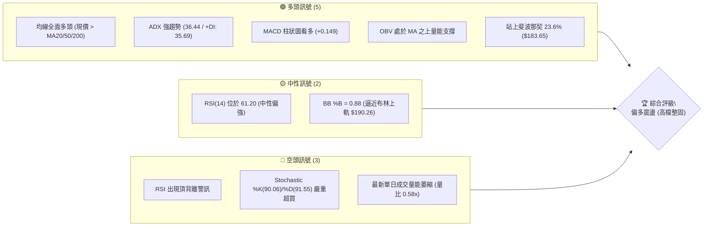

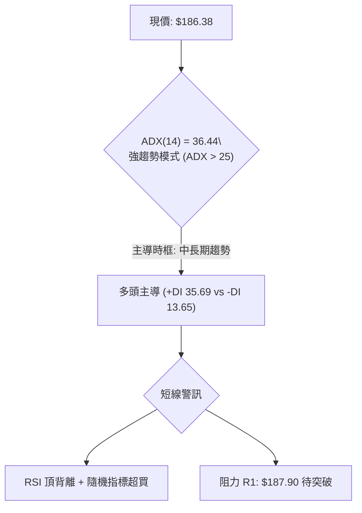

### 📊 核心指標速覽表

| 指標類別 | 指標名稱 | 當前數值 | 訊號 | 解讀 |
|----------|----------|----------|:---:|------|
| **價格** | 當前價格 | $186.38 | 🟢 | 位於52週區間 79.1%，自2026年7月低檔強勁反彈 |
| **均線** | MA20 | $174.06 | 🟢 | 現價高於 MA20 達 +7.08%，短期動能強勁 |
| **均線** | MA50 | $144.90 | 🟢 | 現價高於 MA50 達 +28.63%，中期多頭架構穩固 |
| **均線** | MA200 | $151.35 | 🟢 | 現價高於 MA200 達 +23.15%，長期多頭趨勢不變 |
| **動能** | RSI(14) | 61.20 | 🟡 | 位於中性偏強區間，但日線結構呈現頂背離警訊 |
| **動能** | MACD (12,26,9) | 11.264 / 11.114 (柱狀: +0.149) | 🟢 | 雙線位於零軸上方且柱狀圖維持正值，多頭發散 |
| **動能** | Stoch %K / %D | 90.06 / 91.55 | 🔴 | 進入極度超買區間（>80），短線具備技術性拉回壓力 |
| **趨勢** | ADX(14) / ±DI | 36.44 (+DI: 35.69, -DI: 13.65) | 🟢 | 強趨勢格局（ADX>25），多方動能佔據壓倒性優勢 |
| **通道** | 布林通道 (BB) | 軌道: $157.86 - $190.26 (%B: 0.88) | 🟡 | 價格逼近上軌，通道處於擴張階段，短線空間受限 |
| **波動** | ATR(14) | $6.79 (3.64%) | 🟡 | 日內平均波動區間接近 $6.8，具備中等偏高波動特徵 |
| **量能** | OBV 與成交量 | 25,633,590 (量比: 0.58x) | 🟡 | OBV 趨勢向上確認多頭，但最新日成交量低於20日均量 |

### 🏆 技術評分卡

```
╔══════════════════════════════════════════════════════════════════╗
║              技術評分卡 — PLTR (2026-09-01)                      ║
╠══════════════════════════════════════════════════════════════════╣
║ 趨勢強度 (ADX/均線)   ████████████████░░░░  80/100  🟢 強勢多頭   ║
║ 動能指標 (RSI/MACD)   ████████████░░░░░░░░  60/100  🟡 背離中性   ║
║ 支撐穩定度 (波段低點) ██████████████░░░░░░  70/100  🟢 支撐扎實   ║
║ 成交量配合 (OBV/均量) ████████████░░░░░░░░  60/100  🟡 量能分歧   ║
║ 形態完整度 (V型/旗形) ██████████████░░░░░░  70/100  🟢 多頭延伸   ║
║ 均線排列 (短中長配置) ████████████████░░░░  80/100  🟢 順向排列   ║
╠══════════════════════════════════════════════════════════════════╣
║ 綜合評分              ██████████████░░░░░░  70/100  🟢 偏多整固   ║
╚══════════════════════════════════════════════════════════════════╝
```

---

## 2. 趨勢分析

### 🌐 多時框趨勢分析

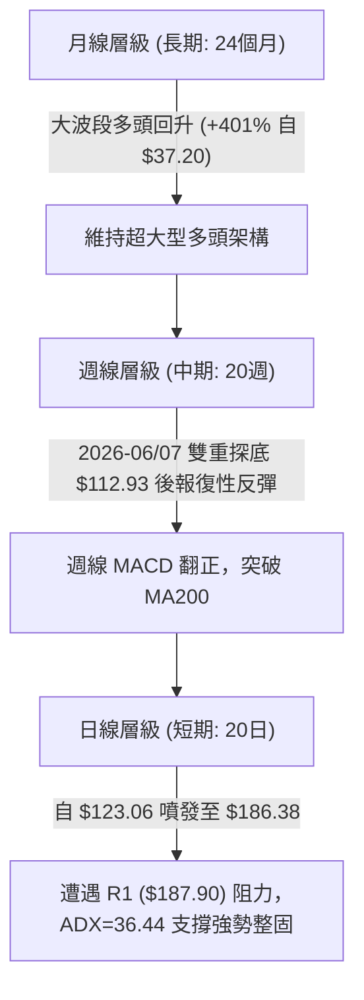

### 📈 長期趨勢 — 12個月走勢圖（Unicode）

```
PLTR 月線走勢圖（2025-09 至 2026-08）
價格軸 ($)
$200.47 ┤                                      ● (2025-10 歷史次高)
$186.38 ┤                                                  ● (2026-08 現價 $186.38)
$182.42 ┤  ● (2025-09)
$168.45 ┤            ●               ● (2025-12)
$156.54 ┤                                      ● (2026-05)
$146.59 ┤                        ● (2026-01)       ● (2026-03)
$137.19 ┤                            ● (2026-02)       ● (2026-04)
$123.06 ┤                                                  ● (2026-07)
$116.67 ┤                                              ● (2026-06 波段低點)
        └──────────────────────────────────────────────────────────
           09   10   11   12   01   02   03   04   05   06   07   08
          2025                       2026
```

#### 走勢特徵分析表格

| 階段區間 | 起止月份 | 價格區間 | 漲跌幅 | 走勢特徵與結構解讀 |
|----------|----------|----------|:------:|--------------------|
| **第1階段：歷史主升段** | 2025-09 → 2025-10 | $182.42 → $200.47 | +9.89% | 多頭推升至 52W 高點 $207.52 附近，高檔換手劇烈 |
| **第2階段：中期深度回調** | 2025-11 → 2026-02 | $200.47 → $137.19 | -31.57% | 獲利了結賣壓湧現，連續跌破短期與中期均線支撐 |
| **第3階段：底部震盪築底** | 2026-03 → 2026-05 | $146.28 → $156.54 | +7.01% | 圍繞 MA200 ($151.35) 進行區間洗盤，量能逐步收斂 |
| **第4階段：極限下洗探底** | 2026-06 → 2026-07 | $156.54 → $116.67 | -25.47% | 觸及 52W 低點 $106.37 區域後迅速止跌，完成空頭力竭 |
| **第5階段：報復性反彈** | 2026-07 → 2026-08 | $123.06 → $186.38 | +51.45% | 8月單月大漲超過50%，直接收復斐波那契 23.6% 水平 |

### 📊 中期趨勢（週線分析）

```
PLTR 週線關鍵壓力與支撐結構示意圖
══════════════════════════════════════════════════════════════════════
 52W High $207.52 ───────────────────────────────────── [極限阻力 R3]
                  ↑ 
                  │  波段反彈延伸目標 $198.88 ────────── [波段阻力 R2]
                  │  
 現價 $186.38 ────┼─ 阻力聚類區間 $187.90 ───────────── [短線阻力 R1]
                  │  
                  │  Fib 23.6% $183.65 / MA20 $174.06 ─ [核心支撐 S1]
                  ↓  
                  └─ Fib 38.2% $168.88 / S2 $170.34 ─── [強支撐防線 S2]
══════════════════════════════════════════════════════════════════════
```

從近20週數據觀察：
- **突破確認**：2026-08-09 當週以 435,164,800 股的天量暴漲至 $172.01，確立中期底部翻轉。
- **動能遞延**：MACD 週線柱狀圖自 2026-08-09 的 +4.790 高點逐步收斂至 2026-09-06 的 +0.149，顯示反彈動能正由「爆發期」轉入「高檔整固期」。

### ⚡ 趨勢強度評估（ADX 解讀）

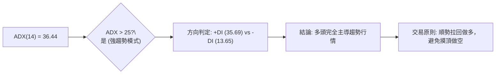

#### ADX 趨勢強度對照表

| 指標參數 | 數值 | 狀態標準 | 解讀結論 |
|----------|:----:|----------|----------|
| **ADX(14)** | **36.44** | > 25 (強趨勢), > 35 (極強趨勢) | 市場處於明確且強勁的單邊趨勢行情中 |
| **+DI (多頭動能)** | **35.69** | > 25 (多方強勢) | 買盤推升力道扎實，佔據市場絕對主導權 |
| **-DI (空頭動能)** | **13.65** | < 20 (空方萎縮) | 賣方壓制力道薄弱，無力發動有效反向進攻 |
| **時框收斂權重** | **中長期為主** | 依收斂規則 14 (ADX>25) | 忽略日線零星雜訊，以週線與中長期均線方向為基準 |

---

## 3. 圖表形態分析

### 🔍 形態識別系統

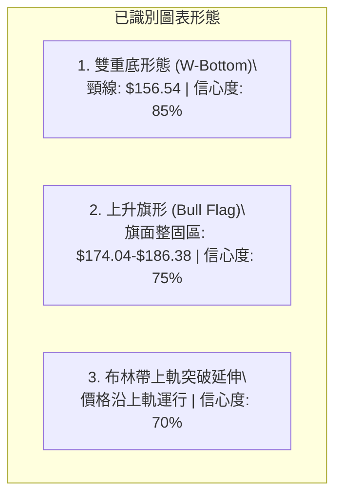

#### 形態識別信心度與目標價評估表

| 形態名稱 | 信心度 | 判斷依據（引用數據） | 完成度 | 目標價（附計算式） |
|----------|:------:|----------------------|:------:|--------------------|
| **雙重底 (W-Bottom)** | **85%** | 兩次波段低點分別為 2026-06 之 $112.93 與 2026-07 之 $122.92；頸線位於 2026-05 高點 $156.54。 | 100% (已突破) | 頸線 $156.54 + 形態高度 ($156.54 - $112.93 = $43.61) = **$200.15**（已逼近 R2 $198.88） |
| **高檔上升旗形** | **75%** | 旗桿為 2026-08-02 至 2026-08-09 之跳空暴漲（$123.06 → $172.01）；旗面於 $172.01–$186.38 區間窄幅整理。 | 80% (進行中) | 突破點 $186.38 + 旗桿高度 ($172.01 - $123.06 = $48.95) = **$235.33**（遠期形態推算） |
| **日線均線多頭排列** | **90%** | 短中長期 MA（MA5 $181.77 > MA10 $178.53 > MA20 $174.06 > MA60 $142.76）完美發散。 | 95% | 順勢指標，無幾何目標價，以移動止損守護 |

### 🕯️ 重要K線形態分析

| 週期/月份 | 收盤價 | K線形態 | 技術解讀 | 訊號強度 |
|-----------|:------:|---------|----------|:--------:|
| **2026-06** | $116.67 | 探底長下影大陰線 | 恐慌賣盤殺出後出現主力承接，觸及 52W 低點 $106.37 區域 | 🟡 中性築底 |
| **2026-07** | $123.06 | 低檔十字星/錘頭線 | 空頭動能衰竭，賣壓枯竭，形成雙底右側支撐腳 | 🟢 強烈買訊 |
| **2026-08** | $186.38 | 光頭大陽線 (月漲51.4%) | 買盤呈現壓倒性爆發，直接貫穿 MA50、MA200 及多重阻力 | 🟢 極強多頭 |
| **2026-08-30 (週)** | $186.29 | 高檔橫盤小陽線 | 連漲三週後高檔出現籌碼換手，多空在 R1 ($187.90) 前激戰 | 🟡 滯漲整理 |
| **2026-09-06 (日/週)** | $186.38 | 窄幅縮量實體K線 | 波動收縮至 ATR ($6.79) 範圍內，蓄勢等待方向選擇 | 🟡 變盤前夕 |

### 📉 ASCII 走勢形態示意圖

```
雙底頸線突破與上升旗形整理示意圖
$207.52 ┤ (52W High)                                             [R3]
        │                                                     
$198.88 ┤ (雙底理論目標區 $200.15 附近)                          [R2]
        │                                                     
$187.90 ┤                                           ╭─ 旗形整理 ── [R1]
$186.38 ┤ 现价 ─────────────────────────────────────● ($186.38)
$174.06 ┤                                   ╭───────╯ (旗桿起跑)
        │                                  ╱ 
$156.54 ┤ 頸線位 ──────────● (5月高點) ────╱ (突破確認) ────────────
        │                 ╱ ╲            ╱  
$135.00 ┤                ╱   ╲          ╱   
        │               ╱     ╲        ╱    
$112.93 ┤ 底1 ────────●       ╲      ╱     
$122.92 ┤ (6月探底)             底2 ──● (7月次低)
        └──────────────────────────────────────────────────────────
```

### 🎯 形態目標價計算

1. **雙重底測幅滿足點**：
   - 形態底部低點：$112.93（2026-06-28 週收盤）
   - 形態頸線高點：$156.54（2026-05-31 週收盤）
   - 形態垂直高度：$$H = 156.54 - 112.93 = 43.61$$
   - 最小量度目標價：$$T_{\text{DoubleBottom}} = 156.54 + 43.61 = 200.15$$
   - *結論*：此目標價與技術阻力位 **R2: $198.88** 高度重合，構成第一波大級別目標區。

2. **上升旗形測幅滿足點（次級推算）**：
   - 旗桿起點：$123.06（2026-08-02）
   - 旗桿頂點：$172.01（2026-08-09）
   - 旗桿高度：$$H_{\text{flag}} = 172.01 - 123.06 = 48.95$$
   - 旗面突破點：$186.38
   - 延伸目標價：$$T_{\text{Flag}} = 186.38 + 48.95 = 235.33$$（需在突破 R3 $207.52 後方可驗證）。

---

## 4. 支撐與阻力

### 🗺️ 關鍵價位分布圖（Unicode）

```
PLTR 價位結構分布圖（OHLCV 與波段聚類計算）
══════════════════════════════════════════════════════════════════════
$207.52 ║████████████████████████████████████║ 強阻力 R3 (52週歷史高點)
$198.88 ║████████████████████████░░░░░░░░░░░░║ 波段阻力 R2 (前高波段聚類)
$187.90 ║████████████████████████████░░░░░░░░║ 關鍵阻力 R1 (當前測試關卡)
$186.38 ╠════════════════════════════════════╣ ◄ 當前市價 ($186.38)
$183.65 ║▓▓▓▓▓▓▓▓▓▓▓▓▓▓▓▓▓▓▓▓▓▓▓▓▓▓▓▓        ║ 斐波那契 23.6% 回調支撐
$176.50 ║▓▓▓▓▓▓▓▓▓▓▓▓▓▓▓▓▓▓▓▓▓▓░░░░░░        ║ 近期支撐 S1 (日線波段低點聚類)
$174.06 ║▓▓▓▓▓▓▓▓▓▓▓▓▓▓▓▓▓▓▓▓▓▓▓▓▓▓▓▓        ║ 短期生命線 MA20 / 布林中軌
$170.34 ║████████████████████████░░░░░░░░░░░░║ 強支撐 S2 (波段平台低點)
$166.35 ║████████████████████████████████░░░░║ 深度支撐 S3 (回調防守底線)
══════════════════════════════════════════════════════════════════════
```

### 🚧 阻力位分析表

所有價位均嚴格引用 OHLCV 聚類計算數據：

| 阻力級別 | 價位 | 距離現價 | 形成原因與量價結構 | 突破難度 | 重要性 |
|----------|:----:|:--------:|--------------------|:--------:|:------:|
| **R1** | **$187.90** | +0.82% | 近一年波段高點聚類；與布林上軌 ($190.26) 形成共振壓制區 | 🟡 中等 | ★★★★☆ |
| **R2** | **$198.88** | +6.71% | 2025年10月月線收盤 $200.47 前之密集籌碼解套套牢區 | 🔴 較高 | ★★★★☆ |
| **R3** | **$207.52** | +11.34% | 52週最高點（歷史極值）；斐波那契 0.0% 基準點，絕對心理關卡 | 🔴 極高 | ★★★★★ |

### 🛡️ 支撐位分析表

所有價位均嚴格引用 OHLCV 聚類計算數據：

| 支撐級別 | 價位 | 距離現價 | 形成原因與量價結構 | 守住機率 | 重要性 |
|----------|:----:|:--------:|--------------------|:--------:|:------:|
| **S1** | **$176.50** | -5.30% | 近一年波段低點聚類；貼近 MA10 ($178.53) 與 MA20 ($174.06) | 80% | ★★★★☆ |
| **S2** | **$170.34** | -8.61% | 8月中旬整理平台底部；與斐波那契 38.2% ($168.88) 構成共振防線 | 85% | ★★★★★ |
| **S3** | **$166.35** | -10.75% | 8月突破大陽線中軸下方；跌破將破壞短期強勢上性格局 | 90% | ★★★☆☆ |

### 📐 斐波那契回調位分析

依據 52 週完整波動區間（低點 **$106.37** → 高點 **$207.52**，總垂直空間 **$101.15**）精確計算：

```
斐波那契回調位與現價位置示意圖
0.0%  (52W High) ── $207.52 ──────────────────────────────────────────
                     ▲
                     │ (+11.34%)
現價  ─────────────── $186.38 ◄── (目前位於 0.0% 與 23.6% 強勢區間)
                     │ (-1.46%)
23.6% ────────────── $183.65 ──────────────────────────────────────────
                     │
38.2% ────────────── $168.88 ──────────────────────────────────────────
                     │
50.0% ────────────── $156.95 ── (與 MA240 $156.67 共振)
                     │
61.8% ────────────── $145.01 ── (黃金分割位 / 貼近 MA50 $144.90)
                     │
78.6% ────────────── $128.02 ──────────────────────────────────────────
                     │
100.0% (52W Low) ─── $106.37 ──────────────────────────────────────────
```

- **位置解讀**：現價 $186.38 穩固站於 **23.6% ($183.65)** 之上。在道氏與斐波那契理論中，當回調幅度小於 23.6% 即恢復上攻，代表市場屬於「極強勢單邊多頭行情」。
- **下行第一緩衝帶**：若短線遭遇獲利回吐，Fib 23.6% ($183.65) 與 S1 ($176.50) 將提供第一道買盤支撐；Fib 38.2% ($168.88) 則為多頭趨勢不被破壞的關鍵底線。

---

## 5. 技術指標深度解讀

### 🎛️ 指標訊號總覽

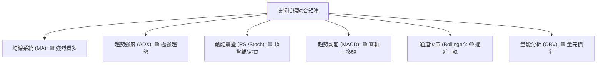

### 📈 移動平均線排列分析

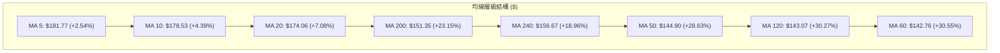

#### 均線系統深度解讀
1. **短週期極致多頭**：現價 ($186.38) > MA5 ($181.77) > MA10 ($178.53) > MA20 ($174.06)。短天期均線呈現教科書式的多頭發散，斜率向上超過 45 度，為極強上攻動能。
2. **中長期混合排列修復**：MA50 ($144.90) 目前略低於 MA200 ($151.35) 與 MA240 ($156.67)，主因 2026 年 6-7 月的深度回調拉低了 50 日均線數值。然而 MA60 ($142.76) 與 MA120 ($143.07) 已開始由下向上拐頭，隨著高價扣抵區間推進，MA50 即將與 MA200 形成「黃金交叉」，中長期均線正處於快速由混亂轉向完美多頭的過渡期。

### 📉 RSI(14) 分析

- **數值進度條**：
  ```
  RSI(14): 61.20  [0 ─── 30 ──────── 61.2 ─── 70 ─── 100]
  強度: ████████████████░░░░░░░░░░  61.20% (中性偏強)
  ```
- **超買超賣判斷**：日線 RSI 處於 61.20，脫離 70 以上之極端超買區，但隨機指標 Stoch %K (90.06) 與 %D (91.55) 呈現鈍化超買。
- **背離分析（Bearish Divergence）**：
  - **價格行為**：2026-08-23 週收盤 $179.94（RSI=79.0），隨後 2026-08-30 推升至 $186.29、2026-09-06 微幅創高至 $186.38。
  - **RSI 行為**：RSI 指標由 79.0 高點反向滑落至 60.8 → 61.20。
  - **結論**：日線與週線層級存在標準的**頂背離（Bearish Divergence）**現象。表明此處價格創高主要由慣性推動，實質內部動能正在衰退，隨時可能引發向 MA20 ($174.06) 的技術性修正。

### 📊 MACD(12/26/9) 訊號解讀

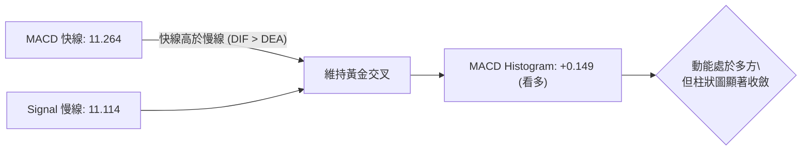

- **絕對數值解讀**：MACD (11.264) 與 Signal (11.114) 均遠在零軸上方運行，確立大級別處於強勢多頭市場。
- **柱狀圖動態**：柱狀圖雖為正值 (+0.149)，但相較於 2026-08-09 的高峰 (+4.790) 與 2026-08-16 的 (+4.023) 已大幅收斂，顯示多方攻勢節奏由「暴力噴發」轉為「高檔震盪盤整」。

### 📦 布林通道分析

```
PLTR 日線布林通道 (20, 2) 結構圖
══════════════════════════════════════════════════════════════════════
上軌 (Upper Band):  $190.26 ──────────────────────────────
                     │
現價 (Current):     $186.38 ◄── [ %B = 0.88 接近頂部 ]
                     │
中軌 (MA20):        $174.06 ──────────────────────────────
                     │
下軌 (Lower Band):  $157.86 ──────────────────────────────
══════════════════════════════════════════════════════════════════════
帶寬 (Bandwidth) = ($190.26 - $157.86) / $174.06 = 18.61%
```

- **%B 指標解讀**：%B = 0.88，代表價格運行在布林通道 88% 的相對高位。
- **軌道形態**：布林通道呈現向上張口態勢，但現價已接近上軌 $190.26 與 R1 阻力 $187.90 的重疊區。依據均值回歸原理，未經充分換手前，難以直接脫軌連續暴漲，回測中軌 $174.06 的概率正在增加。

### 💹 成交量分析（量價配合度）

```
量能比較圖
最新日成交量:  25,633,590  ████████████░░░░░░░░  (量比: 0.58x)
20日均量:      44,505,554  ████████████████████
50日均量:      42,445,120  ███████████████████
```

- **量價背離現象**：價格創近期新高至 $186.38，但日成交量僅 25.63M 股，相較於 20 日均量 (44.51M) 縮減了 42.4%（量比 0.58）。
- **OBV 趨勢解讀**：OBV 指標仍維持在自身均線之上，說明 8 月份流入的主力機構資金並未大規模出逃，當前的縮量屬於「上攻意願降溫、籌碼處於高檔鎖定」的良性量縮整理，而非主力派發引發的放量崩跌。

---

## 6. 動能與波動率

### ⚡ 動能評估四象限

| 象限 | 動能維度 (ADX / MACD) | 波動維度 (ATR / BBW) | PLTR 當前狀態 | 交易策略指導 |
|:----:|:---------------------:|:--------------------:|:-------------:|--------------|
| **Q1** | **強動能 (High Momentum)** | **低波動 (Low Volatility)** | — | 最佳突破加碼點 |
| **Q2** | **弱動能 (Low Momentum)** | **低波動 (Low Volatility)** | — | 區間震盪觀望 |
| **Q3** | **強動能 (High Momentum)** | **高波動 (High Volatility)** | **✓ (PLTR 所在位置)** | **順勢控倉、嚴設移動止損** |
| **Q4** | **弱動能 (Low Momentum)** | **高波動 (High Volatility)** | — | 劇烈洗盤、避免進場 |

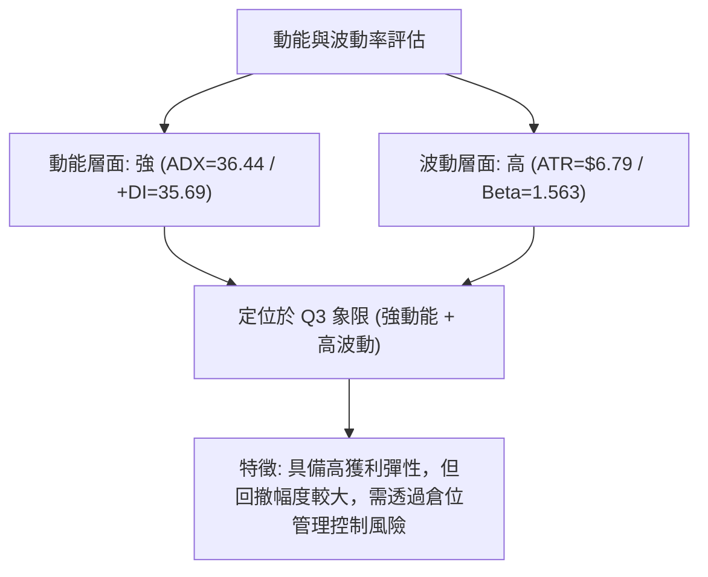

### 📊 ATR 波動率分析

- **ATR(14) 數值**：**$6.79**（佔當前股價比例為 **3.64%**）。
- **止損距離建議**：
  - *激進型交易（1.0 × ATR）*：防守緩衝距離 $6.79 → 止損位設於現價下方法定價位 **$176.50 (S1)** 附近。
  - *波段型交易（1.5 × ATR）*：防守緩衝距離 $10.19 → 止損位設於 **$174.06 (MA20)** 下方約 **$170.34 (S2)**。
  - *趨勢型交易（2.0 × ATR）*：防守緩衝距離 $13.58 → 止損位設於 **$166.35 (S3)**。

### 📐 Beta 與市場相關性

- **Beta 係數**：**1.563**（高彈性成長/科技股特徵）。
- **市場敏感度**：PLTR 對標普 500 與那斯達克指數的波動敏感度高達 1.56 倍。在美股大盤處於上漲趨勢時，PLTR 將展現顯著的超額 Alpha 收益；反之，若大盤面臨系統性回調，其回調幅度通常為大盤的 1.5 倍以上。

---

## 7. 多時框架總結

### 📋 時框架評分表

| 時框架 | 趨勢方向 | 動能狀態 | 均線排列 | 形態結構 | 綜合評分 | 戰略建議 |
|--------|:--------:|:--------:|:--------:|:--------:|:--------:|----------|
| **月線 (長期)** | 🟢 強勢多頭 | 🟢 柱狀擴張 | 🟢 順向發散 | 24個月大型上升通道 | **85 / 100** | 長線堅定做多，逢深幅回調加碼 |
| **週線 (中期)** | 🟢 底部反轉 | 🟡 柱狀收斂 | 🟢 站上MA200 | 雙重底頸線突破完成 | **75 / 100** | 順勢波段持有，目標看 R2/R3 |
| **日線 (短期)** | 🟡 高檔整理 | 🔴 頂背離超買 | 🟢 短天期多頭 | 旗形窄幅震盪整理 | **60 / 100** | 暫停追高，等待拉回 S1 或突破 R1 |

### 🔲 綜合訊號矩陣

```
時框訊號一致性與衝突分析矩陣
══════════════════════════════════════════════════════════════════════
時框層級       趨勢 (Trend)    動能 (Momentum)    量能 (Volume)    支撐阻力
──────────────────────────────────────────────────────────────────────
月線 (長期)      🟢 多頭          🟢 強勁            🟢 放大          🟢 遠離關鍵支撐
週線 (中期)      🟢 多頭          🟡 趨緩            🟢 支撐          🟢 站穩頸線 $156.54
日線 (短期)      🟢 多頭          🔴 頂背離          🟡 縮量          🟡 逼近 R1 $187.90
──────────────────────────────────────────────────────────────────────
多時框評估:   【整體順向多頭，短期面臨技術性指標修復】
══════════════════════════════════════════════════════════════════════
```

### ⚖️ 多時框收斂結論

依據多時框收斂規則（規則 14）：
1. **趨勢/盤整判定**：當前 ADX(14) 為 **36.44**，遠高於 25 臨界線，市場被嚴格定義為**趨勢行情**。
2. **主導時框收斂**：在強趨勢格局下，中長期時框（週線多頭突破、價格遠高於 MA50 $144.90 與 MA200 $151.35）擁有最高優先權；日線 RSI 之頂背離與隨機指標超買，僅代表「短線拉回尋找更佳進場點」的時機訊號，絕對不可作為逆勢做空的依據。
3. **唯一定向結論**：**偏多整固（Bullish Consolidation）**。策略以拉回關鍵支撐佈局多單為主，第 8 章策略將全面以此方向展開。

---

## 8. 交易策略建議

### 🗺️ 策略決策流程圖

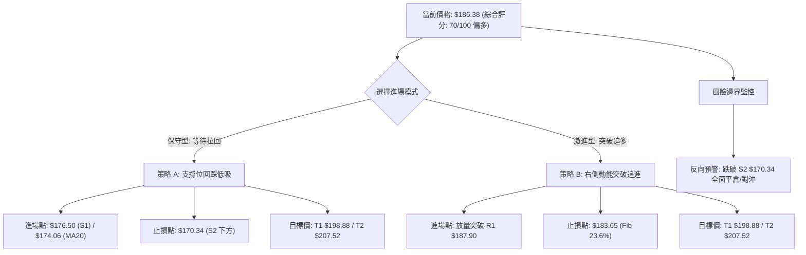

### 🧭 策略路由

> **當前主策略方向 = 主推多頭策略（依技術評分卡 70/100 偏多評級）**
> 
> 鑑於中長期均線與 ADX 強趨勢主導，本報告主推兩大多頭操作策略（回踩低吸與動能突破），空頭僅作為風險控制與反轉對沖提示。

### 🎯 價格情境階梯（Price Scenarios）

所有價位均嚴格引用第 4 章及關鍵價位計算數據：

| 觸發條件 | 第一目標 (T1) | 後續延伸 (T2) | 情境含義與操作指引 |
|----------|:-------------:|:-------------:|--------------------|
| **強勢放量突破 R1 $187.90** | **R2: $198.88** | **R3: $207.52** | 短線頂背離化解，打開向 52W 歷史高點進攻空間 |
| **維持在 $176.50 至 $187.90 震盪** | **$187.90 (R1)** | **$174.06 (MA20)** | 消化超買指標，於布林中上軌間進行強勢換手 |
| **失守 S1 $176.50 展開回調** | **S2: $170.34** | **S3: $166.35** | 短線利多力竭，回測 Fib 38.2% 與短期上升趨勢線 |

### 📊 情境機率分佈

| 情境類別 | 機率預估 | 主要技術依據 |
|----------|:--------:|--------------|
| **情境一：高檔強勢震盪後向上突破** | **60%** | ADX=36.44 極強趨勢、+DI=35.69 佔優、OBV 維持多頭排列、均線多頭支撐 |
| **情境二：回踩 MA20 均線進行深度洗盤** | **30%** | RSI 頂背離顯著、Stoch %K/%D 超買、成交量能萎縮（量比 0.58x） |
| **情境三：趨勢反轉向下破位** | **10%** | 除非突發系統性黑天鵝導致連續跌破 MA200 ($151.35) 與 Fib 50% ($156.95) |

### 🟢 主策略詳情

| 策略要素 | 策略 A（穩健型：回踩支撐佈局） | 策略 B（激進型：強勢突破跟進） |
|----------|--------------------------------|--------------------------------|
| **操作邏輯** | 利用日線超買引發的技術性回調，在核心支撐逢低吸納 | 待買盤放量化解 R1 阻力與頂背離後，右側追隨動能 |
| **進場條件** | 價格回踩 S1 且出現日線下影線止跌訊號 | 日K線收盤價有效突破 R1 且日成交量 > 40M 股 |
| **進場價格** | **$176.50**（或 MA20 **$174.06** 區間） | **$187.90**（突破確認點） |
| **目標價 T1** | **$198.88** (R2, +12.68%) | **$198.88** (R2, +5.84%) |
| **目標價 T2** | **$207.52** (R3 / 52W High, +17.58%) | **$207.52** (R3 / 52W High, +10.44%) |
| **止損價格** | **$170.34** (S2 下方, -3.49%) | **$183.65** (Fib 23.6% 下方, -2.26%) |
| **風險報酬比** | **3.63 : 1**（極佳） | **2.58 : 1**（優良） |
| **成功機率** | **70%** | **65%** |
| **建議倉位** | **15% - 20%** 總資金 | **10% - 15%** 總資金 |

### 🔴 反向風險觸發點（對沖提示）

- **多頭防禦警戒線**：若日K線收盤價跌破 **S1: $176.50**，應立即將多頭倉位減半，防範回調擴大至 S2。
- **多頭趨勢失效點**：若價格帶量跌破 **S2: $170.34**（與 Fib 38.2% $168.88 重疊區），表明雙底突破後的旗形結構徹底失效，應**全數出清多單**，或配置等量反向資產/賣出看漲期權進行對沖。

### ⭐ 整體訊號強度評星

```
做多訊號強度：★★★★☆  (4/5星 — 均線與ADX強勢支撐，僅受限於短線背離)
做空訊號強度：★☆☆☆☆  (1/5星 — 強趨勢市場中逆勢摸頂風險極高)
整體可信度：  ★★★★☆  (4/5星 — 多時框訊號收斂明確，量價結構清晰)
```

---

## 9. 風險提示與監控

### ✅ 關鍵監控指標 Checklist

```
╔══════════════════════════════════════════════════════════════════╗
║              PLTR 每日盤面關鍵監控清單 (Checklist)               ║
╠══════════════════════════════════════════════════════════════════╣
║ [ ] 價格是否突破阻力位 R1: $187.90 (收盤確認)                    ║
║ [ ] 日成交量是否回升至 20日均量 (44.51M) 之上                    ║
║ [ ] RSI(14) 是否跌破 50 中軸 (跌破代表動能全面轉弱)              ║
║ [ ] MACD 柱狀圖是否由正轉負 (出現死叉警訊)                       ║
║ [ ] 價格是否跌破生命線 MA20 ($174.06) 或支撐 S1 ($176.50)        ║
║ [ ] 大盤波動與科技板塊整體走勢 (Beta=1.563 聯動風險)             ║
╚══════════════════════════════════════════════════════════════════╝
```

### ⚠️ 風險場景分析

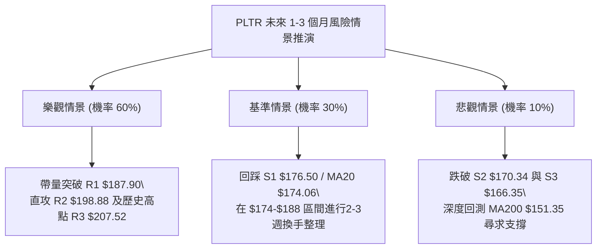

### 🛡️ 風險管理重要提醒

1. **極度超買與背離風險**：Stochastic 已處於 90 以上極值，RSI 存在頂背離，嚴禁在 $186.38 一線進行無計畫的市價全倉追高。
2. **高 Beta 波動控制**：PLTR 之 Beta 值為 1.563，單日 ATR 高達 $6.79。單筆交易承受之最大虧損金額應嚴格限制在總投資組合淨值的 **1.0% - 1.5%** 以內。
3. **機構持股與鎖定**：機構持股達 64.9%，籌碼穩定度高，縮量整理期間切忌頻繁進行日內雙向短線交易，應以波段關鍵價位為唯一進出場依據。

---

## 📋 報告總結

```
╔══════════════════════════════════════════════════════════════════╗
║                   PLTR 技術分析報告總結                          ║
╠══════════════════════════════════════════════════════════════════╣
║ 報告日期：2026-09-01                                             ║
║ 當前價格：$186.38                                                ║
║ 分析評級：🟢 偏多整固 (ADX=36.44 強趨勢支撐，短線指標修復)       ║
╠══════════════════════════════════════════════════════════════════╣
║ 關鍵結論：                                                       ║
║ ├─ 長期趨勢：🟢 強勢多頭 (自底部反彈逾 50%，均線發散)           ║
║ ├─ 中期趨勢：🟢 雙重底突破 (目標測幅指向 $198.88 - $200.15)     ║
║ ├─ 短期趨勢：🟡 旗形震盪 (RSI頂背離，等待消化 R1 $187.90)       ║
║ ├─ 關鍵支撐：S1: $176.50 ｜ S2: $170.34 ｜ MA20: $174.06        ║
║ ├─ 關鍵阻力：R1: $187.90 ｜ R2: $198.88 ｜ R3: $207.52        ║
║ └─ 分析師目標：均價 $191.68 (最高 $255.00 / 27位分析師評級 Buy) ║
╠══════════════════════════════════════════════════════════════════╣
║ 最優策略組合：                                                   ║
║ 1. 🥇 最佳機會 (策略 A)：回踩 S1 $176.50 / MA20 佈局多單         ║
║    (止損 $170.34 / 目標 T1 $198.88 / 風報比 3.63:1)             ║
║ 2. 🥈 次選機會 (策略 B)：放量突破 R1 $187.90 右側追多            ║
║    (止損 $183.65 / 目標 T1 $198.88 / 風報比 2.58:1)             ║
║ 3. 🥉 保守選擇：持股者上移移動止損至 $176.50，靜待指標修復完成   ║
╚══════════════════════════════════════════════════════════════════╝
```

---

> ⚠️ **免責聲明**：本報告為 AI 自動生成之技術分析，所有數據及估算均基於提供的歷史價格與市場量化資訊。本報告**僅供研究與學術參考**，**不構成任何投資建議或要約邀請**。金融市場瞬息萬變，投資有風險，入市需獨立審慎評估。

---

*報告生成時間：2026-09-01 ｜ 數據來源：Yahoo Finance ｜ 分析框架：多時框技術分析體系*