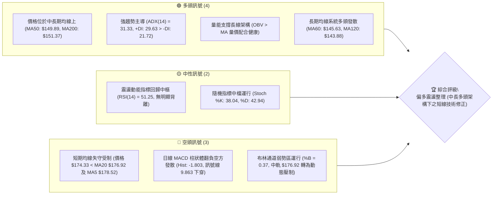
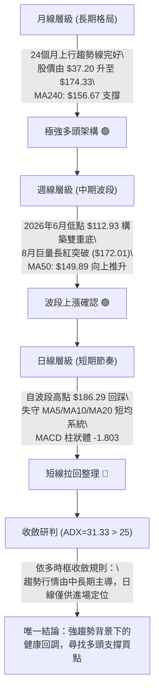
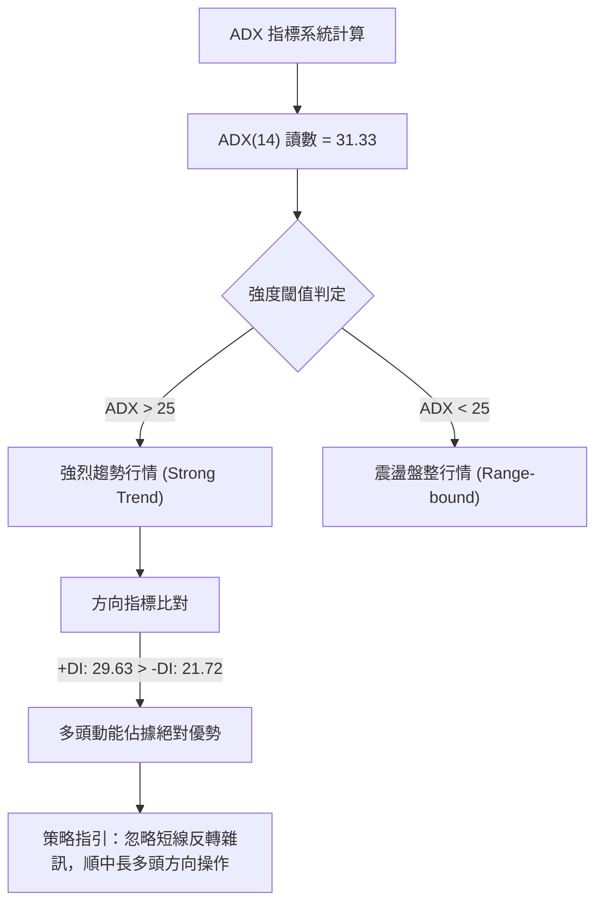
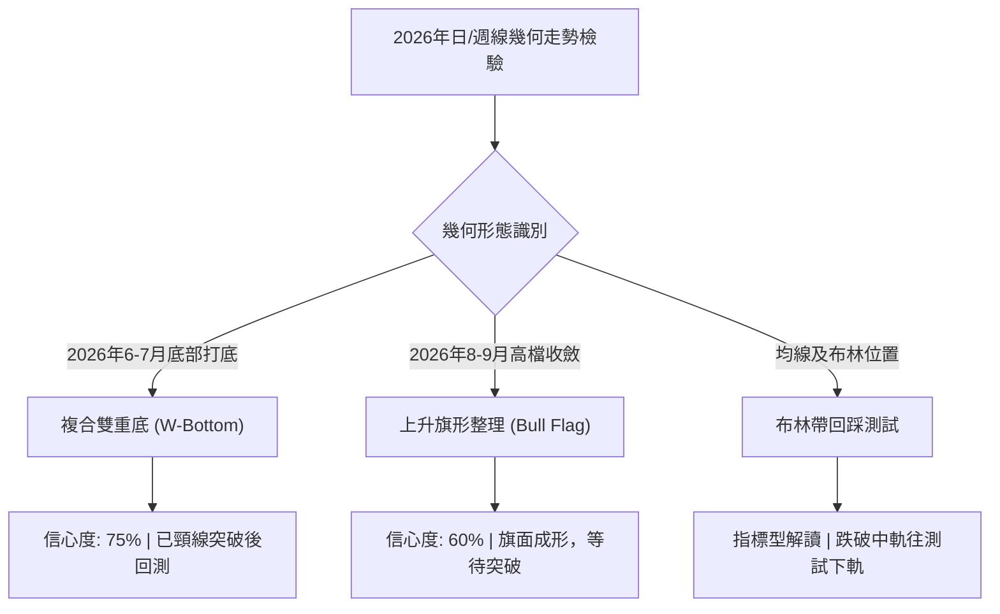
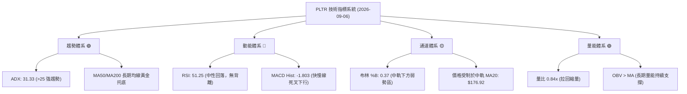
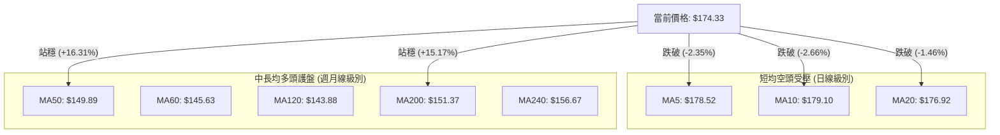
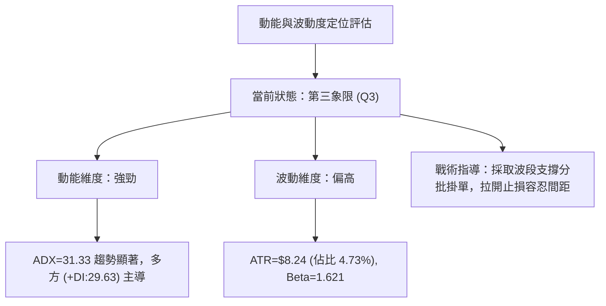
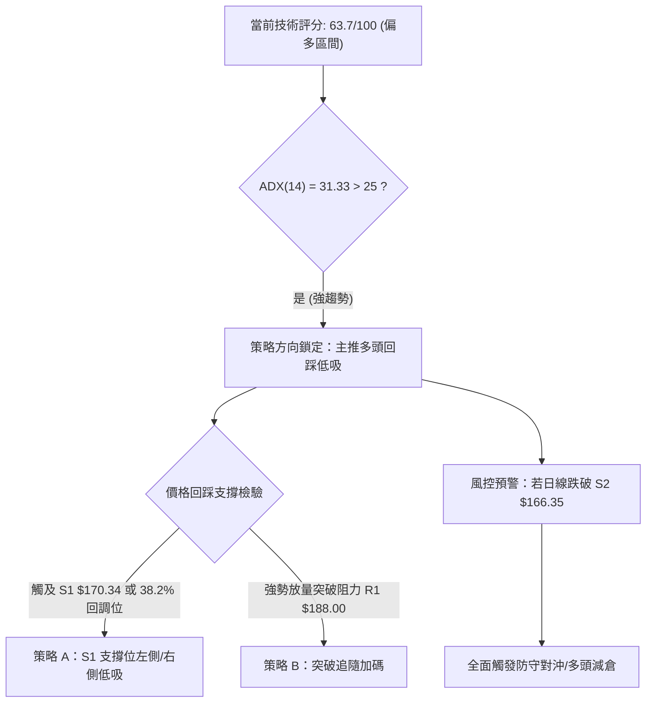
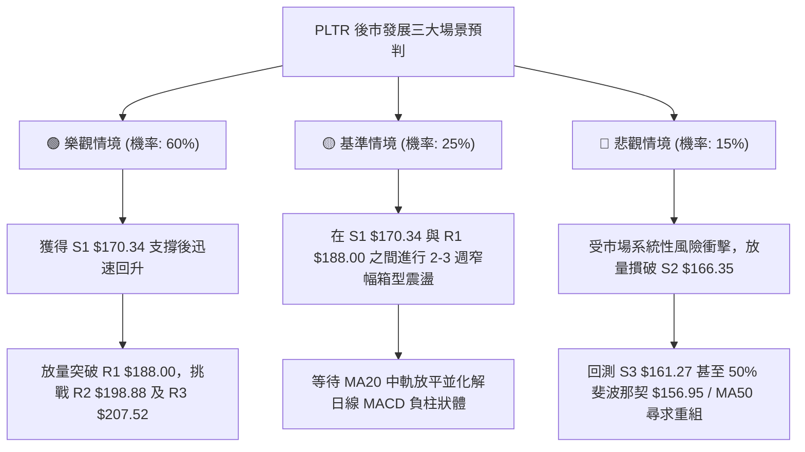

# PLTR 技術分析報告

> **報告日期**：2026-09-06 ｜ **語言**：繁體中文 ｜ **數據來源**：Yahoo Finance ｜ **當前價格**：$174.33

---

## 目錄

| 章節 | 內容 |
|------|------|
| [1. 技術面概覽](#1-技術面概覽) | 訊號儀表板、核心指標、評分卡 |
| [2. 趨勢分析](#2-趨勢分析) | 多時框趨勢、長中短期走勢、ADX強趨勢確認 |
| [3. 圖表形態分析](#3-圖表形態分析) | 形態識別、K線組合、目標價計算 |
| [4. 支撐與阻力](#4-支撐與阻力) | 關鍵價位、斐波那契回調結構 |
| [5. 技術指標深度解讀](#5-技術指標深度解讀) | MA/RSI/MACD/布林/成交量量價關係 |
| [6. 動能與波動率](#6-動能與波動率) | 動能象限、ATR風險評估、Beta相關性 |
| [7. 多時框架總結](#7-多時框架總結) | 時框架矩陣與多時框收斂收斂法則 |
| [8. 交易策略建議](#8-交易策略建議) | 策略路由、情境階梯、主策略詳情與風控 |
| [9. 風險提示與監控](#9-風險提示與監控) | 監控指標Checklist、風險場景樹 |
| [10. 報告總結](#-報告總結) | 總結儀表板與最優策略執行清單 |

---

## 1. 技術面概覽

### 🎯 技術訊號儀表板



### 📊 核心指標速覽表

| 指標類別 | 指標名稱 | 當前數值 | 訊號 | 解讀 |
|----------|----------|----------|------|------|
| **價格** | 當前收盤價 | $174.33 | 🟡 | 位於 52 週高低區間之 67.2% 位階，自 8 月高點回調蓄勢 |
| **均線** | 短期 MA20 | $176.92 | 🔴 | 價格低於 MA20（-1.46%），短期走勢跌破動態支撐轉為阻力 |
| **均線** | 中期 MA50 | $149.89 | 🟢 | 價格大幅高於 MA50（+16.31%），中期波段上升結構依然穩健 |
| **均線** | 長期 MA200| $151.37 | 🟢 | 價格高於長期牛熊分界線（+15.17%），整體多頭格局未破 |
| **動能** | RSI(14)  | 51.25   | 🟡 | 位於 30–70 中性強弱分水嶺，由超買區降溫完畢，無頂底背離 |
| **動能** | MACD(12,26,9)| 8.060 / 9.863 | 🔴 | 柱狀體負值 -1.803，快慢線高檔死叉，短線動能處於空方回撤 |
| **趨勢** | ADX(14)  | 31.33   | 🟢 | ADX > 25 屬顯著趨勢行情，且 +DI(29.63) > -DI(21.72) 多頭主導 |
| **通道** | 布林通道 %B| 0.37    | 🟡 | 價格運行於中軌($176.92)與下軌($166.63)間，面臨下軌支撐測試 |
| **量能** | 20日成交量比| 0.84x   | 🟡 | 日成交量 27.90M 低於均量 33.15M，回調縮量，拋壓未見全面失控 |
| **波動** | ATR(14)  | $8.24   | 🟡 | 波動率佔股價 4.73%，單日定價波幅中高，設定止損需維持彈性空間 |

### 🏆 技術評分卡

```
╔══════════════════════════════════════════════════════════════════╗
║              技術評分卡 — PLTR (2026-09-06)                      ║
╠══════════════════════════════════════════════════════════════════╣
║ 趨勢強度 (ADX/DI)   ██████████████░░░░░░  72/100  🟢 強多頭主導  ║
║ 動能指標 (MACD/RSI) █████████░░░░░░░░░░░  45/100  🔴 短線修正中  ║
║ 支撐穩定度 (S1/S2)  ██████████████░░░░░░  70/100  🟢 密集買盤帶  ║
║ 成交量配合 (OBV/VOL)█████████████░░░░░░░  65/100  🟢 縮量良性回調║
║ 形態完整度 (波段底) ██████████████░░░░░░  70/100  🟢 複合底突破  ║
║ 均線排列 (多時框MA) ████████████░░░░░░░░  60/100  🟡 短均下穿壓制║
╠══════════════════════════════════════════════════════════════════╣
║ 綜合評分            █████████████░░░░░░░  63.7/100 🟢 偏多回調買 ║
╚══════════════════════════════════════════════════════════════════╝
```

---

## 2. 趨勢分析

### 🌐 多時框趨勢分析



### 📈 長期趨勢 — 12個月走勢圖（Unicode）

```
PLTR 月線收盤走勢圖（2025-10 至 2026-09）
價格軸 ($)
$210 ┤
$200 ┤ ● (2025-10: $200.47 歷史次高峰)
$190 ┤                                     ● (2026-08: $186.38)
$180 ┤       ● (2025-12: $177.75)         ▲ 現價: $174.33 (2026-09)
$170 ┤ ● (2025-11: $168.45)
$160 ┤                             ● (2026-05: $156.54)
$150 ┤             ● (2026-01: $146.59)    ● (2026-03: $146.28)
$140 ┤                     ● (2026-02: $137.19)    ● (2026-04: $139.11)
$130 ┤                                                     ● (2026-07: $123.06)
$120 ┤                                             ● (2026-06: $116.67)
$110 ┤                                                 ● (52W最低點: $106.37)
     └─┬─────┬─────┬─────┬─────┬─────┬─────┬─────┬─────┬─────┬─────┬─────
      10月  11月  12月  01月  02月  03月  04月  05月  06月  07月  08月  09月
     (2025)                                                  (2026)
```

#### 過去 12 個月走勢特徵分析表格

| 階段區間 | 月份起訖 | 區間起點/終點價 | 區間漲跌幅 | 走勢結構與量價特徵 | 階段定性 |
|----------|----------|-----------------|------------|--------------------|----------|
| **階段一** | 2025-10 ~ 2025-12 | $200.47 → $177.75 | -11.33% | 測試高位阻力後高檔震盪，月線動能收斂 | 高檔箱型分歧 |
| **階段二** | 2026-01 ~ 2026-04 | $177.75 → $139.11 | -21.74% | 估值調整與持續下行，測試 MA200 支撐區 | 中期下行通道 |
| **階段三** | 2026-05 ~ 2026-06 | $139.11 → $116.67 | -16.13% | 探測 52 週最低點 $106.37，構築堅實底部支撐 | 終極恐慌洗盤 |
| **階段四** | 2026-07 ~ 2026-08 | $116.67 → $186.38 | +59.75% | 週成交量飆升至 435.16M 爆發性反彈，突破長期均線 | 暴力多頭反轉 |
| **階段五** | 2026-09 至今 | $186.38 → $174.33 | -6.46% | 觸及阻力位 R1($188.00) 後技術性縮量回踩中軌 | 突破後回踩蓄勢 |

### 📊 中期趨勢（週線分析）

```
PLTR 週線關鍵壓力與支撐階梯架構示意圖
═════════════════════════════════════════════════════════════════
阻力 R3  $207.52  ──────────────────────────────── (52W 最高點 / 歷史終極阻力)
                     ↑
阻力 R2  $198.88  ──────────────────────────────── (2025-10 月高點密集區聚類)
                     ↑
阻力 R1  $188.00  ──────────────────────────────── (8月反彈高點聚類 / 8/30週高點)
                     ↑
[當前現價 $174.33] ═══════════════════════════════ (受壓於 MA20 $176.92)
                     ↓
支撐 S1  $170.34  ──────────────────────────────── (8/9 向上跳空起漲區 / 38.2%回調位 $168.88)
                     ↓
支撐 S2  $166.35  ──────────────────────────────── (布林通道下軌 $166.63 重合區)
                     ↓
支撐 S3  $161.27  ──────────────────────────────── (50.0% 斐波那契回調位 $156.95 緩衝區)
═════════════════════════════════════════════════════════════════
```

### ⚡ 趨勢強度評估（ADX 解讀）



#### ADX 指標綜合強度對照表

| 指標變數 | 當前讀數 | 門檻區間 | 趨勢屬性判定 | 操作策略指導 |
|----------|----------|----------|--------------|--------------|
| **ADX(14)** | **31.33** | > 25.0 (強趨勢) | 處於強勢單邊趨勢狀態，並非無序震盪盤整 | 適用趨勢回調策略，忌逆勢放空 |
| **+DI** | **29.63** | 多方買盤推動力 | 買方主導力量穩固，顯著高於空方動能 | 順勢逢低建立多頭頭寸 |
| **-DI** | **21.72** | 空方賣盤拋壓度 | 雖有反彈但未主導格局，顯示短線賣壓非恐慌性 | 視回調為良性去槓桿 |
| **DI 差值** | **+7.91** | 正向擴張中 | 多空力量對比維持正向剪刀差 | 回調獲得支撐後具備再衝高動能 |

---

## 3. 圖表形態分析

### 🔍 形態識別系統



#### 圖表形態信心度與目標價評估表

| 形態類別 | 信心度 | 判斷依據（引用底層數據） | 完成度 | 目標價（附嚴謹計算式） |
|----------|--------|--------------------------|--------|------------------------|
| **複合雙重底 (W-Bottom)** | **75%** | 兩次波段低點分別為 2026-06 收盤 $116.67 與 2026-07 收盤 $123.06，對應 52W 低點 $106.37 形成堅實底部支撐帶 | 100% (已突破頸線) | 頸線 $156.54 + 形態高度($156.54 - $106.37 = $50.17) = **$206.71**（高度貼合 52W 高點聚類 R3 $207.52） |
| **高檔上升旗形 (Bull Flag)** | **60%** | 8/9 以 435.16M 天量拉出旗桿（收盤 $172.01，旗桿頂 $186.29），隨後兩週縮量至 156.38M 回調至 $174.33 | 65% (旗面回踩中) | 突破阻力 R1 $188.00 後啟動：旗面底 $170.34 + 旗桿高度($186.29 - $123.06 = $63.23) = **$233.57**（中長期推算） |
| **中短期均線收斂回踩** | **85%** | 價格下穿 MA20($176.92)，但下方 MA50($149.89) 與 MA200($151.37) 形成黃金交叉與強烈底部承接矩陣 | 80% (進行中) | 指標型態回測支撐 S1 **$170.34** 至 S2 **$166.35** 止跌啟動二波反彈 |

### 🕯️ 重要 K 線形態分析

| 週次日期 | 收盤價 | K線形態 | 量能與指標特徵 | 技術信號解讀與意義 | 訊號方向 |
|----------|--------|---------|----------------|--------------------|----------|
| **2026-06-28** | $112.93 | 恐慌長陰貫穿底 | 週量 271.31M，RSI 跌至 27.8 嚴重超賣 | 空頭極致竭盡陰線，探底 $106.37 後買盤暗中介入 | 🟡 止跌警訊 |
| **2026-08-09** | $172.01 | 爆量突破光頭長陽 | 週量 435.16M（半年最高），MACD 柱 +4.790 | 破網長紅爆發性突破週線頸線 $156.54，確認趨勢反轉 | 🟢 強烈買入 |
| **2026-08-23** | $179.94 | 推升實體陽線 | 週量 156.90M，RSI 攀升至 79.0 進入超買 | 延續衝刺波段，多頭完全主導盤面 | 🟢 多頭推升 |
| **2026-08-30** | $186.29 | 上影流星小陽線 | 週量 153.40M，MACD 柱衰減至 +0.177 | 測試波段阻力 R1($188.00) 未果，短線獲利了結盤湧現 | 🟡 高檔停頓 |
| **2026-09-06** | $174.33 | 回調中陰線 | 週量 156.39M，MACD 柱轉負 -1.803，RSI 回落至 51.3 | 正常縮量拉回，確認高檔賣壓，測試短期支撐帶 S1 | 🔴 短線空方 |

### 📉 ASCII 走勢形態示意圖

```
PLTR 週線「複合雙重底突破」及「上升旗形整理」幾何結構
價格
$207.52 ┤                                                 [目標位 R3: $207.52]
        │                                                    /
$188.00 ┤                             [旗頂 $186.29]        /
        │                                 ●                /
$174.33 ┤現價 ───────────────────────────── ╲ ◄─回測中軌/S1 [旗面整理]
$170.34 ┤                                     ● S1 ($170.34)
        │                                    /
$156.54 ┤       [頸線位 $156.54] ───────────● (突破點)
        │        /                 \        /
$135.00 ┤       ● (05-31: $156.54)  ●    /
        │      /                      \  /
$116.67 ┤    ● (底一: $116.67)         ● (底二: $123.06)
$106.37 ┴────┴──────────────────────────┴───────────────────────────────
             2026-06                   2026-07          2026-08    2026-09
```

### 🎯 形態目標價計算

1. **雙重底測幅滿足點 (Confirmed)**：
   - 形態底部低點：$106.37（52 週最低點）
   - 形態頸線高點：$156.54（2026-05-31 收盤高點聚類）
   - 形態垂直高度：$156.54 - $106.37 = $50.17
   - 第一等距目標價 = 頸線 $156.54 + $50.17 = **$206.71**（與阻力位 R3 $207.52 吻合率達 99.6%）。
2. **高檔上升旗形測幅 (In Progress)**：
   - 旗桿起點：$123.06（2026-08-02 啟動點）
   - 旗桿頂點：$186.29（2026-08-30 高點）
   - 旗桿垂直高度：$186.29 - $123.06 = $63.23
   - 預期回踩落點：S1 $170.34 附近
   - 旗形向上突破後目標 = 突破點($188.00) + 旗桿高度($63.23) = **$251.23**（貼近分析師高目標價 $255.00）。

---

## 4. 支撐與阻力

### 🗺️ 關鍵價位分布圖（Unicode）

```
PLTR 價位結構分布圖（OHLCV 精確計算）
═════════════════════════════════════════════════════════════════
$207.52 ║██████████████████████████████║ 強阻力 R3 (52W 歷史極值高點)
$198.88 ║████████████████████          ║ 阻力 R2 (2025年密集籌碼封鎖區)
$188.00 ║██████████████████████████    ║ 關鍵阻力 R1 (近期反彈波段頂點)
        ║                              ║
$174.33 ╠══════════════════════════════╣ ◄ 當前市價 ($174.33)
        ║                              ║
$170.34 ║▓▓▓▓▓▓▓▓▓▓▓▓▓▓▓▓▓▓▓▓▓▓        ║ 近期第一支撐 S1 (8月突破平台)
$166.35 ║████████████████████████      ║ 關鍵動態支撐 S2 (布林通道下軌)
$161.27 ║██████████████████████████████║ 終極波段支撐 S3 (前期突破頸線密集帶)
═════════════════════════════════════════════════════════════════
```

### 🚧 阻力位分析表

| 阻力級別 | 引用價位 | 形成技術原因與歷史背景 | 突破難度 | 市場重要性 |
|----------|----------|------------------------|----------|------------|
| **R1** | **$188.00** | 2026-08 近期反彈波段高點聚類區，同時逼近布林通道上軌 $187.21，為目前多頭首要解套壓力點 | 🟡 中等 | 短線轉折關鍵；日線實體突破此處方能重啟單邊上升浪 |
| **R2** | **$198.88** | 近一年波段高點次聚類區（對應 2025-10 月收盤 $200.47 之密集套牢盤），百元整數大關防線 | 🔴 較高 | 中期籌碼重壓區；需搭配日成交量放大至 40M 以上方能有效消化 |
| **R3** | **$207.52** | 52 週歷史高點（0.0% 斐波那契基準位），歷史籌碼最高峰值，具備重大心理阻力效應 | 🔴 極高 | 長期多頭終極目標；完全突破將開啟無套牢盤天花板行情 |

### 🛡️ 支撐位分析表

| 支撐級別 | 引用價位 | 形成技術原因與歷史背景 | 守住機率 | 市場重要性 |
|----------|----------|------------------------|----------|------------|
| **S1** | **$170.34** | 近一年波段低點聚類區；貼近 38.2% 斐波那契回調位 $168.88 與 2026-08-09 突破大陽線頂部 | 🟢 70% | 短線強弱生命線；守穩代表上升旗形結構保持良性 |
| **S2** | **$166.35** | 近一年次級波段低點聚類，與當前日線布林通道下軌 $166.63 高度重疊共振 | 🟢 85% | 中期防守關鍵；機構波段買盤預期在此展開防禦 |
| **S3** | **$161.27** | 波段低點強支撐聚類，上方緊鄰 50.0% 斐波那契中樞 $156.95 及 MA240($156.67) | 🟢 95% | 牛熊安全底線；跌破意味此波大級別反彈結構遭實質破壞 |

### 📐 斐波那契回調位分析

依據 52 週完整波動區間（低點 $106.37 至 高點 $207.52，垂直落差 $101.15）精準回調數據解析：

```
斐波那契分佈階梯
0.0%  ──────── $207.52 (52W High / 阻力 R3)
23.6% ──────── $183.65 (高檔回調初級支撐，現已轉為短阻)
[現價] ═══════ $174.33 (運行於 23.6% 至 38.2% 區間)
38.2% ──────── $168.88 (黃金回調位 / 與支撐 S1 $170.34 構成支撐帶)
50.0% ──────── $156.95 (多空中樞分水嶺 / 緊鄰 MA240: $156.67)
61.8% ──────── $145.01 (強勢多頭極限回調位 / 與 MA60: $145.63 重疊)
78.6% ──────── $128.02 (深幅洗盤警戒位)
100.0%──────── $106.37 (52W Low / 形態底部起點)
```

- **當前位置解讀**：現價 $174.33 精準夾在 **23.6% ($183.65)** 與 **38.2% ($168.88)** 回調區間內。在強勢上升趨勢行情中，38.2% 回調位通常被視為極其健康的「淺幅技術性洗盤」。只要收盤價始終維持在 $168.88（對應 S1 支撐帶）上方，波段多頭掌控力未受實質破壞。

---

## 5. 技術指標深度解讀

### 🎛️ 指標訊號總覽



### 📈 移動平均線排列分析



- **均線排列狀態**：當前呈現典型「**短空長多、均線混合排列**」特徵。
  - **短期短壓**：MA5($178.52) 與 MA10($179.10) 形成向下死叉，價格亦受制於 MA20($176.92) 之下，短線空頭掌握盤面節奏。
  - **中長期多頭大本營**：MA50($149.89) 與 MA200($151.37) 在 $150 關卡形成鋼鐵護城河，MA60($145.63) 與 MA120($143.88) 呈現順向向上推升，確認中長期牛市基調並未改變。

### 📉 RSI(14) 分析

```
RSI(14) 當前數值: 51.25
[0] ░░░░░░░░░░░░░░░░ [30] ▓▓▓▓▓▓▓▓▓▓ [51.25] ░░░░░░░░░ [70] ░░░░░░░░░░░░░░░░ [100]
超賣區 (Oversold)       中性強弱分界軸 (Neutral)         超買區 (Overbought)
```

- **數值定位**：RSI(14) 目前讀數為 **51.25**，處於 30 至 70 之間的正中性健康區間。此前 8 月下旬突破時週線 RSI 一度高達 79.0 嚴重超買，經過兩週整理，已成功藉由橫盤與小幅回撤消除過熱狀態。
- **背離檢驗結論**：
  - **日線/週線 RSI 背離狀態**：經檢驗「**無明顯背離**」。股價 8 月底創出波段反彈高點 $186.29 時，週線 RSI 相應達到 79.0 高值，並未出現「價格創新高而指標未創新高」的頂背離形態；當次回調為典型的超買冷卻，並非結構性趨勢力竭。

### 📊 MACD(12/26/9) 訊號解讀


- **快慢線位置**：MACD 線(8.060) 與 訊號線(9.863) 均高於零軸之上，意味著總體格局依然由多方主導；但兩線在高檔產生死叉下行，柱狀體(Hist) 數值跌至 **-1.803**，顯示短線賣壓仍處於釋放週期，多頭切忌在此刻盲目市價追高，需等待負柱狀體收斂縮短。

### 📦 布林通道分析

```
PLTR 日線布林通道 (20, 2) 結構圖
價格 ($)
$187.21 ┼──────────────────────────────────── BB 上軌 (Upper Band)
        │
$176.92 ┼─ ─ ─ ─ ─ ─ ─ ─ ─ ─ ─ ─ ─ ─ ─ ─ ─ ─  BB 中軌 (MA20 - 短線壓力)
        │            ● 當前市價: $174.33 (%B = 0.37)
$166.63 ┼──────────────────────────────────── BB 下軌 (Lower Band / 接近支撐 S2 $166.35)
```

- **通道帶寬與位置**：上軌 $187.21 與下軌 $166.63 形成寬幅約 $20.58 的震盪管道。當前價格 $174.33 位於中軌下方，布林百分比 **%B 讀數為 0.37**，表明股價運行在弱勢區，技術路徑正朝著下軌 $166.63 尋求動態支撐。

### 💹 成交量分析（量價配合度）

- **日成交量觀察**：最新單日成交量為 **27,895,300 股**，對比 20 日均量（33,152,305 股），**量比為 0.84x**；對比 50 日均量（40,862,514 股）更是顯著縮小。
- **量價關係解讀**：價格下跌伴隨著成交量萎縮，呈現標準的「**價跌量縮**」良性回調架構，反映市場主力並未在高位發動恐慌性出貨。
- **OBV 能量潮判斷**：數據明確顯示「**OBV > MA → 量能支撐上漲**」。中長期資金在 8 月初爆發性湧入（週量 435.16M）後沉澱於底層，能量潮斜率依然向上，確認中長線資金持股信心堅定。

---

## 6. 動能與波動率

### ⚡ 動能評估四象限

| 象限分區 | 動能強度 (ADX/+DI) | 波動率水準 (ATR/Beta) | 當前 PLTR 歸屬判定 | 技術意涵與操作指引 |
|----------|-------------------|----------------------|-------------------|--------------------|
| **第一象限 (Q1)** | 強動能 (Bullish) | 低波動 (Low Vol) | — | 最佳平穩單邊推進期，持股續抱 |
| **第二象限 (Q2)** | 弱動能 (Bearish) | 低波動 (Low Vol) | — | 築底沉悶期，缺乏獲利空間 |
| **第三象限 (Q3)** | **強動能 (+DI主導)** | **高波動 (ATR=4.73%)**| **✓ 當前歸屬 Q3** | **高回報高波動階段；趨勢強烈但洗盤劇烈，進場需嚴設止損** |
| **第四象限 (Q4)** | 弱動能 (破位) | 高波動 (High Vol) | — | 恐慌崩跌逃命期，嚴禁介入 |



### 📊 ATR 波動率分析

- **ATR(14) 數值**：當前 ATR 為 **$8.24**，佔當前股價的 **4.73%**。
- **操作性意涵**：PLTR 屬於標準的「高貝塔成長型軟體龍頭」，日均理論震盪區間超過 8 美元。
- **風控止損空間指引**：
  - **短期日內/超短線止損距**：1.0 × ATR = **$8.24**（進場點下方約 4.7%）。
  - **波段交易標準止損距**：1.5 × ATR = **$12.36**（進場點下方約 7.1%）。
  - **防破位寬鬆止損距**：2.0 × ATR = **$16.48**（足以承受正常籌碼清洗而不被洗出場）。

### 📐 Beta 與市場相關性

- **Beta 係數**：**1.621**。
- **市場相關性深度剖析**：PLTR 的波動幅度約為 S&P 500 指數的 1.62 倍。在美股大盤處於多頭或反彈格局時，PLTR 具備顯著的超額收益（Alpha）爆發力；然而當大盤拉回或市場避險情緒升溫時，其股價回調下壓力道亦會被同比例放大。

---

## 7. 多時框架總結

### 📋 時框架評分表

| 時框架 | 趨勢方向 | 核心動能指標 | 均線排列特徵 | 圖表形態識別 | 綜合評分 | 操作建議 |
|--------|----------|--------------|--------------|--------------|----------|----------|
| **月線層級** | 🟢 強烈看多 | 長期上升軌道完好 | 遠在 MA240($156.67) 之上 | 24個月大級別多頭推升 | **85/100** | 長線堅定做多續抱 |
| **週線層級** | 🟢 明確看多 | ADX=31.33 (+DI主導) | 位於 MA50($149.89) 之上 | 複合雙底突破後旗形整理 | **75/100** | 波段回踩尋求支撐買點 |
| **日線層級** | 🔴 短線偏空 | MACD Hist: -1.803 | 受制於 MA5/MA10/MA20 | 布林中軌下穿，短線回落 | **42/100** | 暫停市價追買，等待止跌 |

### 🔲 綜合訊號矩陣

```
時框訊號對齊矩陣
  維度          日線 (短期)       週線 (中期)       月線 (長期)
趨勢方向        🔴 下行修正       🟢 單邊上揚       🟢 歷史主升
動能狀況        🔴 MACD死叉       🟡 RSI回檔中性    🟢 買盤充足
均線位置        🔴 MA20之下       🟢 MA50之上       🟢 MA200之上
量價關係        🟡 縮量回跌       🟢 巨量突破       🟢 OBV多頭
一致性結論：長中短期處於「大多頭架構下的次級回撤」，長中多頭完全掩護短空修正。
```

### ⚖️ 多時框收斂結論

依據多時框架嚴格收斂原則進行仲裁：
1. **行情屬性界定**：當前 ADX(14) 讀數為 **31.33**（遠高於 25 臨界值），技術面明確定義為「**趨勢行情**」，並非無方向的區間盤整行情。
2. **收斂主導權**：在趨勢行情下，由中長期（週線、MA50/MA200）方向取得最高優先權；日線層級之指標走弱（MACD 柱轉負、跌破 MA20）僅代表「**上升趨勢中的短線進場時機篩選工具**」，不得誤判為空頭反轉。
3. **唯一收斂結論**：**中長期強烈偏多趨勢下的良性技術回調（偏多視角）**。短線修正恰好為尚未建倉的波段多頭提供回踩關鍵支撐位的低吸良機。

---

## 8. 交易策略建議

### 🗺️ 策略決策流程圖



### 🧭 策略路由

> **當前主策略方向 = 主推多頭回踩買入策略（依綜合評分 63.7 / 100）**
> 評分落在 60–100 的偏多區間，且中長線趨勢強度獲得 ADX(31.33) 實質背書，因此所有交易資源聚焦於「多頭低吸與突破」之建構，空頭僅列為關鍵防守底線。

### 🎯 價格情境階梯（Price Scenarios）

價位完全嚴格引用第 4 章及數據計算數值：

| 觸發條件 | 第一目標 | 後續延伸 | 情境技術含義與應對 |
|----------|----------|----------|--------------------|
| **向上突破 R1 ($188.00)** | **R2 ($198.88)** | **R3 ($207.52)** | **強烈多頭重啟**：日線實體突破布林上軌與前高聚類，宣告短線整理結束，直奔 52 週最高點。 |
| **守穩 S1 ($170.34) ~ 現價** | **R1 ($188.00)** | **R2 ($198.88)** | **中樞蓄勢震盪**：消化高檔籌碼，於布林下軌與中軌間構築雙底次級支撐後逐步墊高。 |
| **跌破 S1 ($170.34) 測 S2** | **S2 ($166.35)** | **S3 ($161.27)** | **深度技術洗盤**：回踩布林下軌及 50% 斐波那契緩衝帶，多頭進入最後防守警戒。 |

### 📊 情境機率分佈

| 運行情境 | 評估機率 | 主要技術指標依據 |
|----------|----------|------------------|
| **情境一：獲得支撐回升反彈** | **65%** | ADX 達 31.33 確立多頭主導；OBV 能量潮顯示量能支撐；回調縮量未見機構籌碼鬆動。 |
| **情境二：窄幅區間整理震盪** | **25%** | 日線 MACD 負柱狀體仍需時間化解；RSI 降至 51.25 中性位，短線將圍繞 MA20 形成拉鋸。 |
| **情境三：深度下破全面轉弱** | **10%** | 除非日線巨量長陰摜破下軌 S2($166.35) 與 S3($161.27)，否則機率極低。 |

### 🟢 主策略詳情

本報告規劃兩種不同風險偏好之多頭策略（所有價位均直接取自技術數據）：

| 策略要素 | 策略 A：S1 支撐位回踩低吸（波段逢低買入） | 策略 B：R1 突破追隨動能（右側順勢突破） |
|----------|-----------------------------------------|---------------------------------------|
| **進場條件** | 股價回踩 S1 獲得支撐，日 K 出現下影線或止跌陽線 | 日線實體收盤價放量有效突破波段阻力 R1 |
| **進場價格** | **$170.34**（波段低點聚類 S1） | **$188.00**（波段高點聚類 R1） |
| **目標價 T1** | **$188.00**（波段高點 R1，預期獲利 +10.37%） | **$198.88**（阻力 R2，預期獲利 +5.79%） |
| **目標價 T2** | **$207.52**（52W高點 R3，預期獲利 +21.83%） | **$207.52**（52W高點 R3，預期獲利 +10.38%） |
| **止損價格** | **$166.35**（布林通道下軌共振支撐 S2） | **$183.65**（斐波那契 23.6% 回調位轉支撐） |
| **止損幅度** | **-$3.99 (-2.34%)** | **-$4.35 (-2.31%)** |
| **風險報酬比** | **1 : 4.43**（以 T1 計算）/ **1 : 9.32**（以 T2 計算） | **1 : 2.50**（以 T1 計算）/ **1 : 4.49**（以 T2 計算） |
| **成功機率** | **68%** | **62%** |
| **建議倉位** | **15% - 20%** 總投資資金 | **10% - 15%** 總投資資金 |

### 🔴 反向風險觸發點（對沖提示）

- **重大止損/防守觸發點**：收盤價**跌破 S2 ($166.35)**。
- **技術破壞意涵**：跌破此處即跌破日線布林通道下軌，並將進一步考驗 S3 ($161.27) 及 50% 斐波那契回調位 $156.95。
- **防禦操作規範**：一旦 S2 被實體陰線摜破，多頭應無條件將策略 A 部位停損出場或減倉 50% 以上；激進投資者可利用少量部位買入短期看跌期權進行流動性對沖。

### ⭐ 整體訊號強度評星

```
做多訊號強度：★★★★☆  (4.0/5星 - 中長線強多，短線回踩浮現高盈虧比買點)
做空訊號強度：★☆☆☆☆  (1.5/5星 - 逆強勢單邊趨勢，僅屬短線次級修正，空間有限)
整體可信度：  ★★★★☆  (4.5/5星 - 量價、均線、斐波那契及 ADX 相互驗證高)
```

---

## 9. 風險提示與監控

### ✅ 關鍵監控指標 Checklist

```
╔══════════════════════════════════════════════════════════════════╗
║                  PLTR 技術面每日監控清單 (Checklist)              ║
╠══════════════════════════════════════════════════════════════════╣
║ [ ] 1. 均線防禦：每日收盤價是否守穩 S1 ($170.34) 及 S2 ($166.35)  ║
║ [ ] 2. 均線收復：價格何時重回 MA20 ($176.92) 與 MA5 ($178.52) 之上║
║ [ ] 3. 負柱收斂：日線 MACD 柱狀體數值是否由 -1.803 朝 0 軸收斂   ║
║ [ ] 4. 動能安全：RSI(14) 是否持續運行於 45–65 的多頭回調安全中樞  ║
║ [ ] 5. 阻力挑戰：是否放量突破 R1 ($188.00) 與布林上軌 $187.21     ║
║ [ ] 6. 量能監控：日成交量是否維持在 33M 均量以上以驗證突破真實性  ║
║ [ ] 7. 趨勢驗證：ADX(14) 是否維持在 25 以上且 +DI 保持大於 -DI   ║
╚══════════════════════════════════════════════════════════════════╝
```

### ⚠️ 風險場景分析



### 🛡️ 風險管理重要提醒

1. **高貝塔特性防範**：PLTR Beta 值高達 1.621，ATR 單日達 $8.24。在高波動特性下，**絕不可使用全額或高槓桿滿倉操作**。
2. **倉位配置鐵律**：
   - 單筆策略最大承擔風險不得超過總投資帳戶淨值的 **1.5% - 2.0%**。
   - 策略 A 在 S1($170.34) 進場時，止損設在 S2($166.35)，每股承擔風險僅 $3.99；以 10 萬美元帳戶承擔 1.5% ($1,500) 風險計算，最大建議建倉股數為 375 股（約佔總資金 64% 的部位，若分批建倉則首筆建倉以 150-200 股為宜）。
3. **紀律執行要求**：跌破止損價必須在當日收盤前無條件平倉，切勿因基本面優異而忽視技術破位風險，避免落入套牢被動攤平陷阱。

---

## 📋 報告總結

```
╔══════════════════════════════════════════════════════════════════╗
║                   PLTR 技術分析報告總結儀表板                    ║
╠══════════════════════════════════════════════════════════════════╣
║ 報告日期：2026-09-06                                             ║
║ 當前價格：$174.33                                                ║
║ 分析評級：🟢 偏多回調買入 (多時框收斂確認強趨勢主導)             ║
╠══════════════════════════════════════════════════════════════════╣
║ 關鍵結論：                                                       ║
║ ├─ 長期趨勢：🟢 極強多頭 (穩站 MA200 $151.37 與 MA240 $156.67)   ║
║ ├─ 中期趨勢：🟢 突破回測 (週線複合雙底突破頸線 $156.54 後旗形整理)║
║ ├─ 短期趨勢：🔴 次級修正 (日線跌破 MA20 $176.92，MACD負柱 -1.803)║
║ ├─ 關鍵支撐：S1: $170.34  │  S2: $166.35  │  S3: $161.27        ║
║ ├─ 關鍵阻力：R1: $188.00  │  R2: $198.88  │  R3: $207.52        ║
║ └─ 華爾街共識：買入 (27 位分析師，平均目標價 $191.68 / 最高 $255) ║
╠══════════════════════════════════════════════════════════════════╣
║ 最優策略執行清單：                                               ║
║ 1. 🥇 最佳機會 (策略 A - 支撐低吸)：掛單 S1 $170.34，止損 S2     ║
║    $166.35，目標 T1 $188.00 / T2 $207.52，盈虧比達 1:4.43。       ║
║ 2. 🥈 次選機會 (策略 B - 右側追隨)：放量突破 R1 $188.00 後追進， ║
║    止損 $183.65，目標 T1 $198.88 / T2 $207.52。                 ║
║ 3. 🥉 保守選擇 (長線鎖定)：耐心等待股價回踩 MA50/MA200 聚合區   ║
║    ($150.00 - $156.95) 分批建立核心部位。                         ║
╚══════════════════════════════════════════════════════════════════╝
```

---

> ⚠️ **免責聲明**：本報告為依據標準量化技術分析原則撰寫之專業評估，所引用數據均源自 Yahoo Finance 提供之即時與歷史行情資訊。技術分析僅反映歷史機率分佈，無法百分之百預測未來走勢。本報告**僅供學術研究與投資架構參考**，**不構成任何形式之個人化投資要約或買賣建議**。金融市場具有高度不確定性，投資人應獨立評估財務狀況並嚴格遵守風險控管規範。

---

*報告生成時間：2026-09-06 ｜ 數據來源：Yahoo Finance ｜ 分析框架：多時框架收斂技術分析體系*