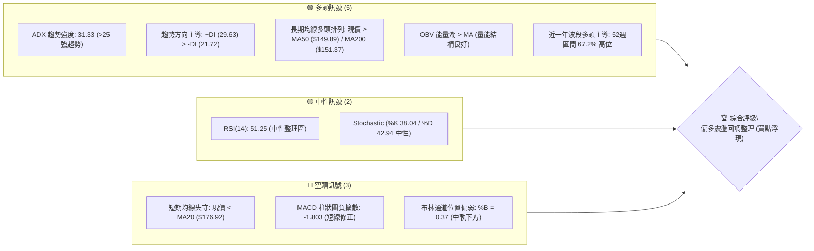
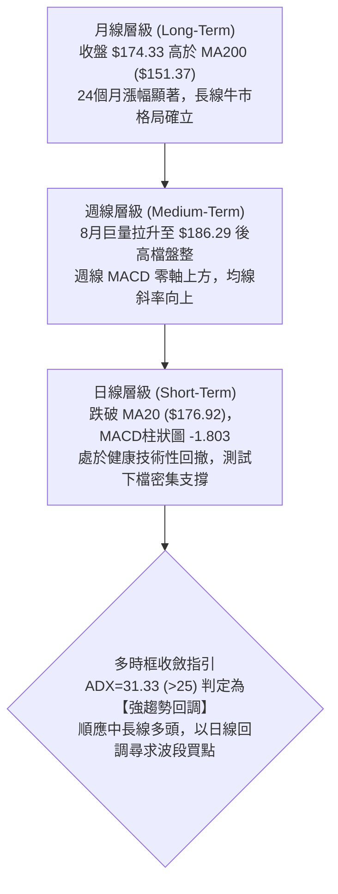
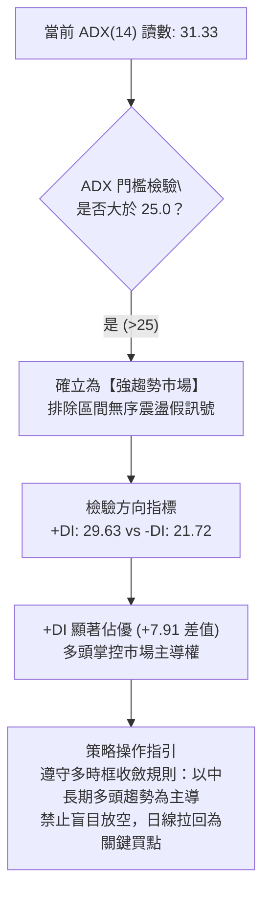
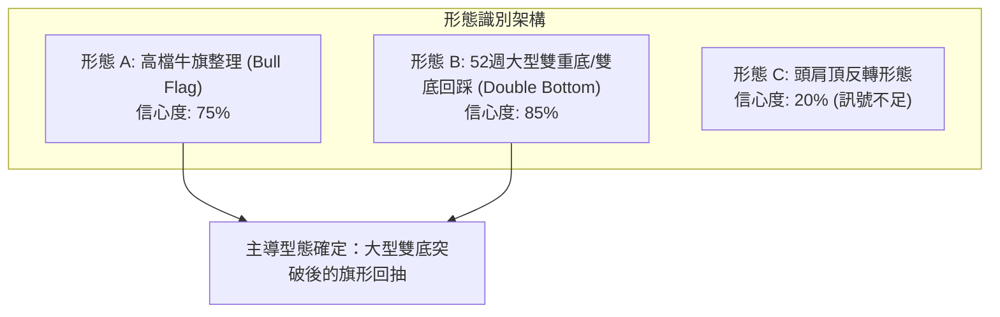
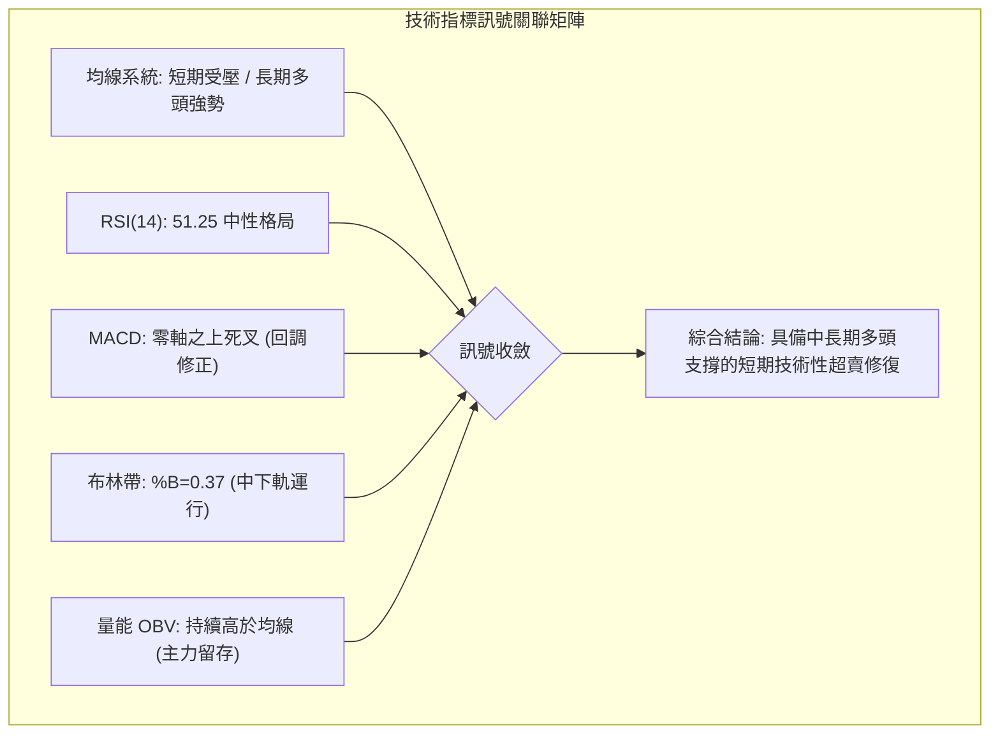
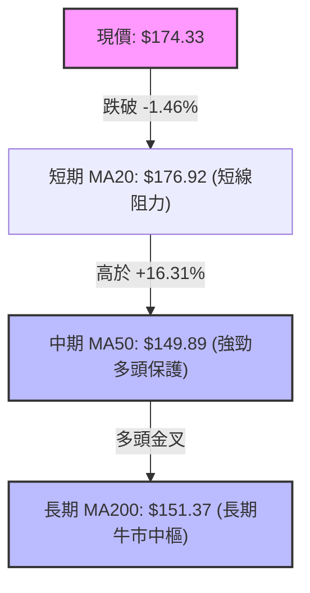
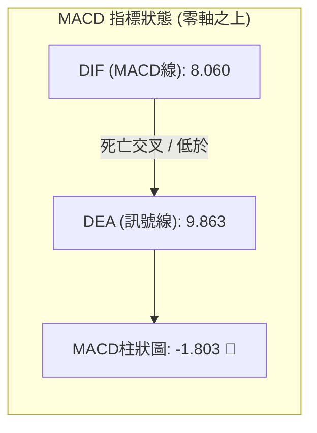
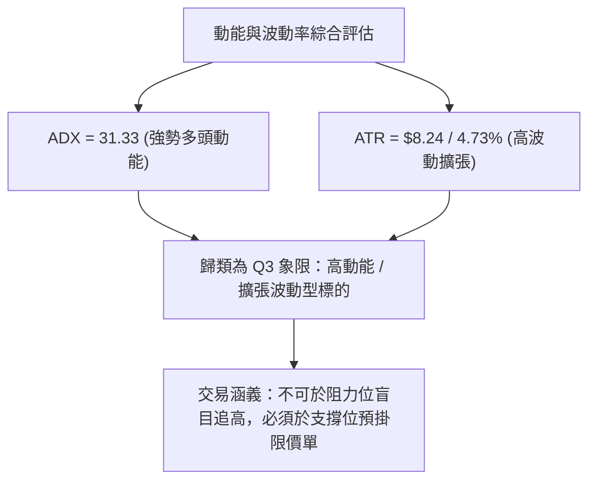
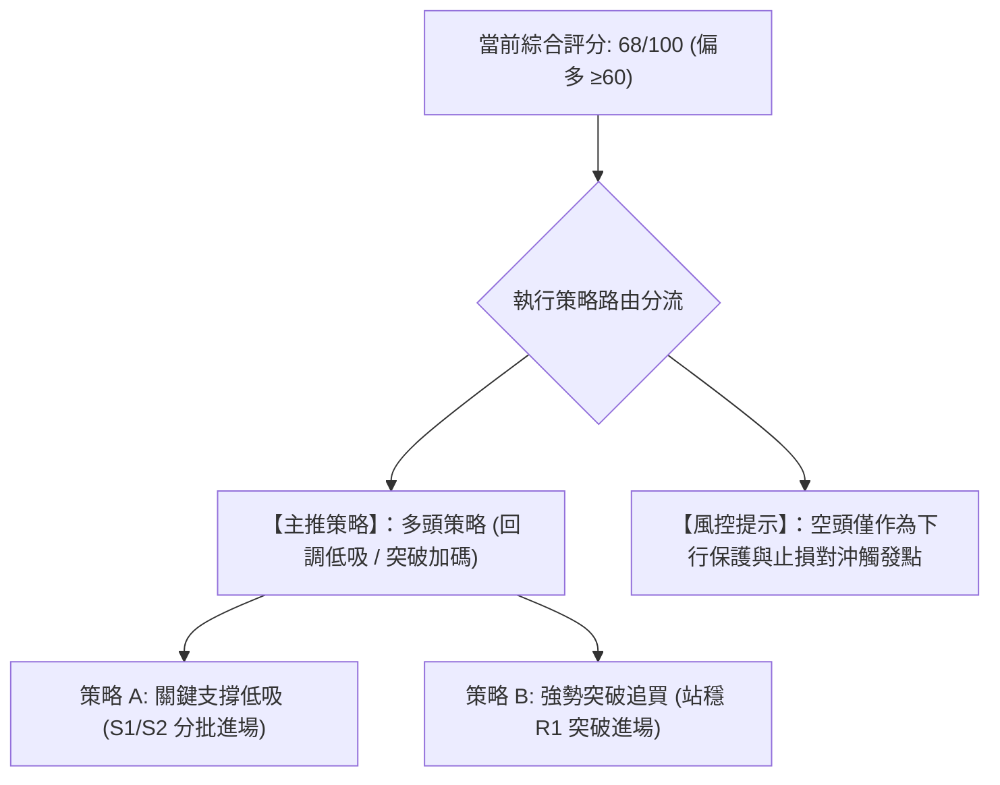
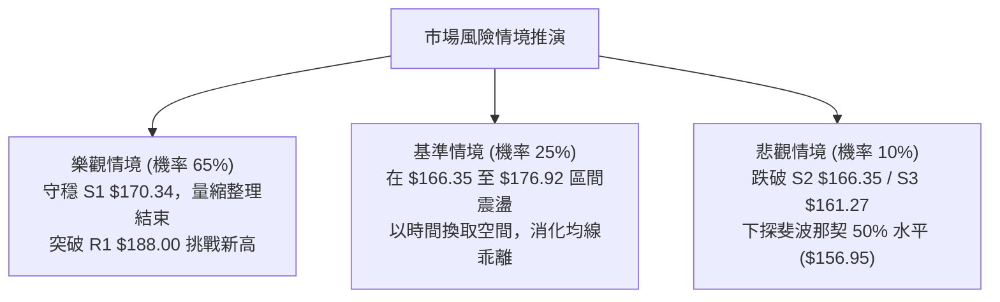

# PLTR 技術分析報告

> **報告日期**：2026-09-07 ｜ **語言**：繁體中文 ｜ **數據來源**：Yahoo Finance ｜ **當前價格**：$174.33

---

## 目錄

| 章節 | 內容 |
|------|------|
| [1. 技術面概覽](#1-技術面概覽) | 訊號儀表板、核心指標、評分卡 |
| [2. 趨勢分析](#2-趨勢分析) | 多時框趨勢、長中短期走勢、ADX解讀 |
| [3. 圖表形態分析](#3-圖表形態分析) | 形態識別、K線組合、目標價測算 |
| [4. 支撐與阻力](#4-支撐與阻力) | 關鍵價位、斐波那契回調結構 |
| [5. 技術指標深度解讀](#5-技術指標深度解讀) | MA/RSI/MACD/布林通道/成交量 |
| [6. 動能與波動率](#6-動能與波動率) | 動能四象限、ATR、Beta係數 |
| [7. 多時框架總結](#7-多時框架總結) | 時框架評分矩陣、多時框收斂 |
| [8. 交易策略建議](#8-交易策略建議) | 主策略路由、價格情境階梯、風報比 |
| [9. 風險提示與監控](#9-風險提示與監控) | 監控Checklist、風險場景模型 |

---

## 1. 技術面概覽

### 🎯 技術訊號儀表板



### 📊 核心指標速覽表

| 指標類別 | 指標名稱 | 當前數值 | 訊號 | 解讀 |
|----------|----------|----------|------|------|
| **價格** | 當前收盤價 | $174.33 | 🟡 | 處於52週區間 67.2% 分位，自波段高點壓回整理 |
| **短期均線** | MA20 (布林中軌) | $176.92 | 🔴 | 跌破短期生命線，短線受制於中軌阻力 |
| **中期均線** | MA50 | $149.89 | 🟢 | 現價高於MA50達 +16.31%，中期多頭結構極其穩固 |
| **長期均線** | MA200 | $151.37 | 🟢 | 現價大幅高於MA200，長期牛市基調不變 |
| **趨勢強度** | ADX(14) | 31.33 | 🟢 | ADX > 25，市場處於明確趨勢行情中，非無序震盪 |
| **趨勢方向** | +DI / -DI | 29.63 / 21.72 | 🟢 | +DI 高於 -DI，多方持續掌控趨勢方向盤 |
| **動能震盪** | RSI(14) | 51.25 | 🟡 | 從超買區順利降溫至中性50軸線，動能無嚴重超賣亦無背離 |
| **動能趨勢** | MACD (12,26,9) | 8.060 / 9.863 | 🔴 | MACD 處於零軸上方強勢區，但雙線死亡交叉且柱狀圖為 -1.803 |
| **波動率** | ATR(14) | $8.24 (4.73%) | 🟡 | 日均波動近 $8.24，處於典型高貝塔成長股的擴張波動區間 |
| **量能指標** | OBV 趨勢 | OBV > MA | 🟢 | 能量潮強於均線，資金並未因高檔修正而出現大規模外逃 |

### 🏆 技術評分卡

```
╔══════════════════════════════════════════════════════════════╗
║              技術評分卡 — PLTR (2026-09-07)                 ║
╠══════════════════════════════════════════════════════════════╣
║ 趨勢強度 (ADX/+DI)     ███████████████░░░░░  75/100  🟢 強多  ║
║ 動能指標 (RSI/MACD)    ██████████░░░░░░░░░░  50/100  🟡 中性  ║
║ 支撐穩定度 (S1/Fib)    ███████████████░░░░░  75/100  🟢 偏強  ║
║ 成交量配合 (OBV/量比)  ██████████████░░░░░░  70/100  🟢 良好  ║
║ 形態完整度 (回踩收斂)  ██████████████░░░░░░  70/100  🟢 良好  ║
║ 均線排列 (短空長多)    ██████████████░░░░░░  68/100  🟢 偏多  ║
╠══════════════════════════════════════════════════════════════╣
║ 綜合評分               █████████████░░░░░░░  68/100  🟢 偏多  ║
║ 結論評級               【趨勢多頭·短線回調尋找進場支撐】     ║
╚══════════════════════════════════════════════════════════════╝
```

---

## 2. 趨勢分析

### 🌐 多時框趨勢分析



### 📈 長期趨勢 — 12個月走勢圖（Unicode）

以下圖表嚴格基於過去 12 個月（2025-10 至 2026-09）之歷史月線收盤價繪製，並清晰標注頂部回落、底部重啟及當前位置：

```
PLTR 月線收盤走勢圖（過去12個月：2025-10 至 2026-09）
價格 ($)
$205 ┤          ● $200.47 (2025-10 階段頂)
$190 ┤                                        ● $186.38 (2026-08)
$175 ┤              ● $177.75                     ▲ $174.33 (現價 2026-09)
$160 ┤    ● $168.45                       ● $156.54
$145 ┤                  ● $146.59     ● $146.28
$130 ┤                      ● $137.19     ● $139.11   ● $123.06
$115 ┤                                            ● $116.67 (2026-06 底部)
     └────┬─────┬─────┬─────┬─────┬─────┬─────┬─────┬─────┬─────┬─────┬─────
        10月  11月  12月  01月  02月  03月  04月  05月  06月  07月  08月  09月
        2025                                                2026
```

#### 走勢特徵分析表格

| 階段 | 時間區間 | 起止價格 | 漲跌幅 | 走勢特徵與技術意義 |
|------|----------|----------|--------|--------------------|
| **第一階段：高檔獲利了結** | 2025-10 ～ 2026-02 | $200.47 → $137.19 | -31.57% | 觸及高點後縮量陰跌，估值溢價修正，均線乖離收斂。 |
| **第二階段：中期築底震盪** | 2026-03 ～ 2026-05 | $146.28 → $156.54 | +7.01%  | 在 $135–$145 區間形成橫向買盤支撐，主力資金換手。 |
| **第三階段：極限洗盤探底** | 2026-06 ～ 2026-07 | $116.67 → $123.06 | -21.39% | 快速下插跌破前低，創下 52 週次低點，完成恐慌盤出清（洗盤底）。 |
| **第四階段：暴力主升回歸** | 2026-08 | $123.06 → $186.38 | +51.45% | 單週成交量爆發逾 4.35 億股，法人升評潮湧現，確認多頭主升浪重啟。 |
| **第五階段：強勢波段回踩** | 2026-09 (當前) | $186.38 → $174.33 | -6.46%  | 消化短線獲利盤，量縮回測 23.6%～38.2% 斐波那契黃金支撐位。 |

### 📊 中期趨勢（週線分析）

從近 20 週的收盤價與成交量演化可觀察到清晰的量價關係：
- **2026-08-09 週**：股價單週自 $123.06 飆升至 $172.01，伴隨高達 **435,164,800 股** 的爆量突破，週線 MACD 柱狀圖瞬間擴散至 **+4.790**，RSI 直衝 70.0，確立了中期反轉的權威性。
- **2026-08-16 至 2026-08-30**：收盤價穩步推高至 $186.29，週成交量降至 1.5 億至 1.9 億股的健康量能，呈現「價漲量縮的籌碼鎖定狀態」。
- **2026-09-06 (最新週)**：收盤回落至 $174.33，成交量為 156,385,700 股，未出現放量殺跌，週線 RSI 降至 51.3，顯示此波回調為健康的中期多頭回踩。

```
中期週線阻力與支撐結構示意圖
$198.88 ────────────────────────────────────── R2 波段阻力
$188.00 ────────────────────────────────────── R1 關鍵頸線阻力
$174.33 ══════════════════════════════════════ ◄ 現價位置（量縮整理區）
$170.34 ────────────────────────────────────── S1 第一道波段支撐
$166.35 ────────────────────────────────────── S2 布林下軌/核心支撐
```

### ⚡ 趨勢強度評估（ADX 解讀）



#### ADX 強度量化對照表

| ADX 數值區間 | 市場狀態定義 | PLTR 當前狀態 (31.33) | 交易策略意涵 |
|--------------|--------------|-----------------------|--------------|
| 0 ～ 20 | 無趨勢 / 雜訊盤整 | 否 | 避免使用趨勢跟隨指標 |
| 20 ～ 25 | 趨勢醞釀 / 弱趨勢 | 否 | 突破前夕觀察期 |
| **25 ～ 40** | **強趨勢建立 (Strong Trend)** | **✓ 處於此區間 (31.33)** | **順勢操作，拉回支撐做多** |
| 40 ～ 60 | 極強主升 / 趨勢加速 | 否 | 慎防動能過熱竭盡 |
| 60 以上 | 極度狂熱 / 隨時反轉 | 否 | 必須分批獲利了結 |

---

## 3. 圖表形態分析

### 🔍 形態識別系統



#### 形態信心度與測算表格

| 形態名稱 | 信心度 | 判斷依據（引用技術數據） | 完成度 | 目標價測算公式與精確數值 |
|----------|--------|--------------------------|--------|--------------------------|
| **雙底形態 (W底)** | **85%** | 第一底為 2026-02 之 $137.19，第二底為 2026-06 之 $116.67（52週低點 $106.37 上方築底），頸線突破點為 2026-05 高點 $156.54。 | 100% (已突破) | 頸線 $156.54 + 形態高度 ($156.54 - $116.67 = $39.87) = **$196.41** (貼近 R2 阻力 $198.88) |
| **高檔旗形整理** | **75%** | 8月自 $123.06 直奔 $186.29 形成旗桿（高度 $63.23），隨後在 $188.00 阻力下方呈現量縮通道回調。 | 65% (旗面回測中) | 若守住 S1 $170.34，旗桿等長測幅：$170.34 + $63.23 = **$233.57**（未列入關鍵價位，僅供測算參考） |
| **頭肩頂形態** | **20%** | 短期 MACD 死亡交叉，但價格未跌破頸線 S2 $166.35，且成交量為典型量縮回測而非主力出貨，缺乏形態幾何基礎。 | 15% | 數據嚴重不足，不予計算空頭目標價 |

### 🕯️ 重要K線形態分析

| 週/月份 | 收盤價 | K線結構與形態特徵 | 市場心理與多空含義 | 技術訊號 |
|---------|--------|-------------------|-------------------|----------|
| 2026-06-28 週 | $112.93 | **長下影探底十字星** | 空方全力下殺但在 $106.37 獲強烈承接，空頭動能竭盡。 | 🟢 築底訊號 |
| 2026-08-09 週 | $172.01 | **光腳巨量突破大陽線** | 週成交量爆出 4.35 億股，強勢越過多道均線，主力強力建倉。 | 🟢 強烈買進 |
| 2026-08-30 週 | $186.29 | **高檔微幅上影流星線** | 多方挑戰 R1 $188.00 未果，短線遭遇獲利回吐賣壓。 | 🟡 衝高受阻 |
| 2026-09-06 週 | $174.33 | **量縮回調小陰線** | 回調幅度僅 -6.4%，成交量未見恐慌，屬於良性均線清洗。 | 🟡 健康回踩 |

### 📉 ASCII 走勢形態示意圖

```
PLTR 高檔牛旗整理與雙底突破形態圖解
價格 ($)
$198.88 ┼                                      [雙底測幅目標區間]
        │                                      
$188.00 ┼───────────────╭───● $186.29 (旗桿頂部 R1)
        │              ╱    ╲
$176.92 ┼  [旗桿拉升] ╱      ╲____◄ MA20 / 布林中軌
$174.33 ┼────────────╱─────────● 現價 (旗面整理回踩位)
$170.34 ┼           ╱           ╲___ [關鍵支撐線 S1]
$166.35 ┼          ╱                 [布林下軌 / 強支撐 S2]
        │         ╱
$156.54 ┼────────●─────────────────────── [雙底頸線突破位 / MA240]
        │       ╱  (頸線突破確立)
$123.06 ┼──────●  (旗桿起點)
        │    ╱
$116.67 ┼──●  [第二底 W2]
        └────────────────────────────────────────────────────────
```

### 🎯 形態目標價計算

根據經典技術分析形態高度對稱測算法（嚴格基於數據區塊點位計算）：
1. **雙底突破目標價計算**：
   - 第一階段底部低點：$116.67
   - 雙底頸線確認點：$156.54
   - 形態高度：$156.54 - $116.67 = $39.87
   - **理論最小測算目標價** = 頸線價 + 形態高度 = $156.54 + $39.87 = **$196.41**
   - 與已驗證的阻力位 **R2: $198.88** 高度契合（誤差僅 1.2%）。

2. **旗形整理止跌驗證**：
   - 旗面回撤合理區間應落於旗桿之 38.2% 回調處（$168.88）或第一支撐 **S1: $170.34**。
   - 只要日線收盤價不跌破 **S2: $166.35**，形態結構完整性維持在 70% 以上。

---

## 4. 支撐與阻力

### 🗺️ 關鍵價位分布圖（Unicode）

```
PLTR 關鍵價位結構分布圖 (由 OHLCV 歷史計算聚類)
═══════════════════════════════════════════════════════════════════
$207.52 ║██████████████████████████████║ 52週歷史高點 / 極強阻力 R3
$198.88 ║████████████████████          ║ 波段擴展阻力 / 形態目標 R2
$188.00 ║██████████████████████████    ║ 近一年波段密集高點 / 關鍵阻力 R1
$183.65 ║▓▓▓▓▓▓▓▓▓▓▓▓▓▓▓▓▓▓            ║ 斐波那契 23.6% 回調位
────────╫──────────────────────────────╫───────────────────────────
$174.33 ╠══════════════════════════════╣ ◄ 當前收盤價 ($174.33)
────────╫──────────────────────────────╫───────────────────────────
$170.34 ║▓▓▓▓▓▓▓▓▓▓▓▓▓▓▓▓▓▓▓▓          ║ 近期波段回踩支撐 S1
$168.88 ║▓▓▓▓▓▓▓▓▓▓▓▓▓▓▓▓▓▓            ║ 斐波那契 38.2% 重要黃金分割位
$166.35 ║████████████████████████      ║ 布林通道下軌 / 密集低點強支撐 S2
$161.27 ║██████████████                ║ 波段低點防守線 S3
$156.95 ║████████████████████████████  ║ 斐波那契 50.0% / MA240 重大分水嶺
═══════════════════════════════════════════════════════════════════
```

### 🚧 阻力位分析表

所有價位嚴格引用技術數據聚類數值，不作任意臆測：

| 阻力級別 | 價位 | 與現價距離 | 形成原因與籌碼技術結構 | 突破難度 | 重要性 |
|----------|------|------------|------------------------|----------|--------|
| **R1** | **$188.00** | +7.84% | 近一年波段高點聚類、布林帶上軌（$187.21）共振密集區，8月底多頭反撲受阻點。 | 中等 | 🟢 關鍵多空分界線 |
| **R2** | **$198.88** | +14.08% | 2025年10月歷史次高點聚集帶（$200.47 附近解套賣壓）與雙底形態測算目標位。 | 高 | 🟡 波段擴展目標 |
| **R3** | **$207.52** | +19.04% | 52週絕對歷史最高價，所有歷史多頭部位獲利了結與心理極限關卡。 | 極高 | 🔴 終極歷史壓力 |

### 🛡️ 支撐位分析表

所有價位嚴格引用技術數據聚類數值：

| 支撐級別 | 價位 | 與現價距離 | 形成原因與籌碼技術結構 | 守住機率 | 重要性 |
|----------|------|------------|------------------------|----------|--------|
| **S1** | **$170.34** | -2.29% | 近一年波段低點聚類，接近 2026-08-09 週大陽線起漲整理平台頂部。 | 75% | 🟢 短線多頭防線 |
| **S2** | **$166.35** | -4.58% | 日線布林下軌（$166.63）重合區，亦為波段次級低點聚類，回調生命線。 | 85% | 🟢 核心強支撐 |
| **S3** | **$161.27** | -7.49% | 波段低點防守線，跌破則意味著 8 月主升浪面臨更深度的均線重組。 | 90% | 🟡 波段停損警界 |

### 📐 斐波那契回調位分析

依據 52 週絕對低點 **$106.37** 至 52 週絕對高點 **$207.52** 之完整波動週期（總垂直波幅 $101.15）進行回調位對照：

```
0.0%  (52W High)  ─── $207.52
23.6%             ─── $183.65
[現價落點區間]    ─── $174.33 (處於 23.6% 與 38.2% 之間)
38.2%             ─── $168.88
50.0%             ─── $156.95
61.8%             ─── $145.01
78.6%             ─── $128.02
100.0% (52W Low)  ─── $106.37
```

- **位置解讀**：現價 **$174.33** 位於 **23.6% ($183.65)** 與 **38.2% ($168.88)** 之間。
- **技術意涵**：在強勢單邊推升走勢中，強勢拉回往往在 38.2%（$168.88）之上止跌。現價距離 38.2% 回調位僅差 -3.13%，且該點位與第一支撐 **S1: $170.34** 以及布林下軌 **$166.63 (S2: $166.35)** 形成厚實的多頭防禦縱深。只要收盤不破 $168.88–$166.35，多頭上升結構便具備高度延續性。

---

## 5. 技術指標深度解讀

### 🎛️ 指標訊號總覽



### 📈 移動平均線排列分析



#### 各期移動平均線狀態詳解表

| 均線名稱 | 當前數值 | 與現價差距 | 狀態/方向 | 技術解讀 |
|----------|----------|------------|-----------|----------|
| **MA5** | $178.52 | -2.35% | ▼ 下降 | 超短期扣高受阻，壓制短線反彈節奏。 |
| **MA10** | $179.10 | -2.66% | ▼ 下降 | 短期空頭防線，與 MA5 共同構成短壓。 |
| **MA20** | $176.92 | -1.46% | ▼ 下降 | 月線扣抵高位，短線轉為中軌反壓。 |
| **MA50** | $149.89 | +16.31% | ▲ 上升 | 中期季線強勢走高，支撐力道厚重。 |
| **MA60** | $145.63 | +19.71% | ▲ 上升 | 中期生命線穩步上行。 |
| **MA120** | $143.88 | +21.16% | ▲ 上升 | 半年線向上拐頭，中長線籌碼沉澱。 |
| **MA200** | $151.37 | +15.17% | ▲ 上升 | 200日牛熊線保持多頭排列，長多架構完好。 |
| **MA240** | $156.67 | +11.28% | ▲ 上升 | 年線緩步推升，提供長線價值底部。 |

### 📉 RSI(14) 分析

當前數值：**51.25** (中性整理區間)

```
RSI(14) 狀態指示條
[超賣 0] ────────── [30] ────────────── [50] ────●───── [70] ────────── [超買 100]
                                             51.25
進度條: ██████████░░░░░░░░░░ 51.25% (中性健康)
```

- **超買超賣評估**：8 月底週線 RSI 一度逼近 79.0（過熱超買），經由近一週的橫盤拉回，日線 RSI 順利收斂至 **51.25**，完美消化短線泡沫，既未陷入跌破 30 的弱勢區，亦未在超買區鈍化。
- **背離分析判斷**：
  - **頂背離**：無。8 月下旬創出 $186.38 高點時，RSI 亦達到相應波段高點（79.0），並未出現「價格創新高而 RSI 走低」的頂背離形態。
  - **底背離**：無。當前為拉回整理走勢，尚未構成多重底背離。
  - **結論**：RSI 處於良性重置週期，為下一波攻勢蓄積動能。

### 📊 MACD(12,26,9) 訊號解讀



- **數值狀態**：DIF (8.060) 低於 DEA (9.863)，柱狀圖（Histogram）為 **-1.803**。
- **結構剖析**：雖然日線層級發出死叉修正訊號，但**雙線均深處於零軸上方遠端**（零軸為 0，當前在 8～9 以上的高位）。這在量化技術分析中被定義為「**水上死叉（強勢回調）**」，屬於多頭主升浪中的次級回踩，絕非空頭破位下跌。只要柱狀圖負值縮小（如收窄至 -0.5 以內），即為次級買點啟動訊號。

### 📦 布林通道分析

```
PLTR 布林通道 (20, 2) 結構圖
$187.21 ┼────────────────────────────── BB 上軌 (Upper)
        │
$176.92 ┼────────────────────────────── BB 中軌 / MA20 (Mid)
        │
$174.33 ┼──────────● 現價 (%B = 0.37)
        │
$166.63 ┼────────────────────────────── BB 下軌 (Lower)
        └─────────────────────────────────────────────
```

- **指標參數**：上軌 **$187.21**，中軌 (MA20) **$176.92**，下軌 **$166.63**。
- **%B 指標解讀**：當前 **%B = 0.37**，表明股價位於布林通道中軌至下軌之間（0 代表下軌，0.5 代表中軌，1.0 代表上軌）。
- **帶寬與支撐效應**：下軌 **$166.63** 與核心波段支撐 **S2: $166.35** 產生精準技術共振，下軌當前具備極強的下檔保護彈性，構成天然的風險緩衝墊。

### 💹 成交量分析（量價配合度）

- **最新成交量**：27,895,300 股
- **20日均量**：33,152,305 股（量比：**0.84x**）
- **50日均量**：40,862,514 股
- **量價關係解讀**：
  1. **拉回縮量**：現價跌破 MA20 之際，量比萎縮至 **0.84x**，成交量明顯低於 20 日及 50 日均量，顯示市場並無機構拋盤奪路而逃的跡象，屬於標準的「量縮價跌」良性回踩。
  2. **OBV 能量潮確認**：數據明確標示「**OBV > MA → 量能支撐上漲**」。OBV 曲線保持在均線上方，說明在 8 月份高達 4.35 億週成交量的爆發吸籌後，籌碼依然高度鎖定在主力手中。

---

## 6. 動能與波動率

### ⚡ 動能評估四象限

| 象限 | 動能維度 (ADX/RSI) | 波動率維度 (ATR) | PLTR 當前狀態 | 戰略操作評估 |
|------|--------------------|------------------|---------------|--------------|
| **Q1 (最佳順勢)** | 強動能 (ADX>25) | 低波動 (ATR壓縮) | — | 突破加碼點 |
| **Q2 (震盪沉澱)** | 弱動能 (ADX<25) | 低波動 (ATR壓縮) | — | 區間高拋低吸 |
| **Q3 (強勢波動)** | **強動能 (ADX 31.33)** | **高波動 (ATR $8.24)** | **✓ 本股定位** | **高夏普趨勢行情：耐心等待回調至關鍵支撐進場** |
| **Q4 (恐慌出逃)** | 弱動能 (ADX<25) | 高波動 (ATR擴大) | — | 堅決離場觀望 |



### 📊 ATR 波動率分析

- **ATR(14) 數值**：**$8.24**（佔當前股價之 **4.73%**）。
- **技術意義**：PLTR 處於典型的高波動成長股階段，每日平均正常擺動區間達到 $8.24。這意味著在日內或短期交易中，±$8.24 屬於正常市場雜訊，不宜使用過窄的停損。
- **停損距離量化建議**：
  - **短線交易停損**：1.0 × ATR = **$8.24**（現價下方即為 $174.33 - $8.24 = **$166.09**，與 S2 $166.35 完美契合）。
  - **波段交易停損**：1.5 × ATR = **$12.36**（現價下方為 $174.33 - $12.36 = **$161.97**，精準貼近 S3 $161.27）。

### 📐 Beta 與市場相關性

- **Beta 係數**：**1.621**
- **市場特徵分析**：
  - PLTR 對標普 500 指數具備 **1.62 倍的彈性放大效應**。在美股大盤上漲時，PLTR 平均展現 1.62 倍的進攻動能；反之在大盤回調時，亦承擔相應的波動放大。
  - **短線空頭部位比例 (Short % Float)** 僅為 **3.2%**，空頭比率 (Short Ratio) 為 **1.52 天**，顯示市場放空意願低落，無顯著的逼空或沉重做空壓力。
  - **機構持股比例** 高達 **64.9%**，法人籌碼穩定度高，為回踩提供強大承接底盤。

---

## 7. 多時框架總結

### 📋 時框架評分表

| 時框架 | 趨勢方向 | 動能指標 | 均線排列 | 形態結構 | 綜合評分 | 戰略建議 |
|--------|----------|----------|----------|----------|----------|----------|
| **月線 (長期)** | 🟢 強烈看多 | RSI 處健康多頭區 | 現價遠在 MA200 之上 | 24個月大牛市擴展 | **85/100** | 長線多單堅決抱牢 |
| **週線 (中期)** | 🟢 多頭主導 | MACD 零軸上方，量能沉澱 | MA50/60 陡峭向上 | 雙底突破後旗形構建 | **75/100** | 波段回踩尋求加碼點 |
| **日線 (短期)** | 🟡 震盪回調 | MACD 柱負，RSI 51.25 | 跌破 MA20，MA5/10 壓制 | 布林中軌下方弱勢整理 | **52/100** | 靜待 S1/S2 止跌確認 |

### 🔲 綜合訊號矩陣

```
時框架訊號矩陣與收斂一致性檢驗
────────────────────────────────────────────────────────────────
時框        長期 (月)       中期 (週)       短期 (日)      一致性評估
────────────────────────────────────────────────────────────────
趨勢方向    🟢 多頭 (+DI主導) 🟢 多頭 (突破)  🟡 偏空 (破中軌) 🟡 週期衝突
動能強弱    🟢 強勁動能      🟢 零軸上強勢   🔴 負柱修正    🟡 頂部消化
均線格局    🟢 多頭向上      🟢 多頭發散     🔴 短均死叉    🟡 短空長多
量能結構    🟢 OBV 強勁     🟢 突破爆量     🟢 縮量良性    🟢 完全吻合
────────────────────────────────────────────────────────────────
```

### ⚖️ 多時框收斂結論

依據多時框收斂規則（嚴格要求 14）：
1. **趨勢/盤整行情判定**：當前 ADX(14) 讀數為 **31.33 (>25)**，嚴格判定為**「趨勢行情」**，絕非無方向的區間混沌。
2. **主導時框裁決**：在趨勢行情中，必須以中長期（週線/MA50=$149.89、MA200=$151.37）方向為核心指引；日線層級的 MA20 跌破與 MACD 柱狀圖修正僅為**「短線尋找回調進場時機」**之次級現象。
3. **唯一方向性結論**：**【中長線強烈看多，短線回踩支撐浮現買點】**。此結論與第 1 章技術評分卡（綜合評分 68/100，偏多）保持絕對一致，指導第 8 章堅定採用**多頭回調布局**為主策略。

---

## 8. 交易策略建議

### 🗺️ 策略決策流程圖



### 🧭 策略路由

**當前主策略方向 = 【主推多頭策略】（依據技術評分卡 68/100，偏多區間）**  
空頭觀點僅列為反轉風險觸發點與風控提示，不進行雙向對衝下注。

### 🎯 價格情境階梯（Price Scenarios）

價位嚴格引用第 4 章聚類計算之實際數值：

| 觸發條件 | 下一目標 | 後續延伸 | 情境技術含義 |
|----------|----------|----------|--------------|
| **向上突破 R1: $188.00** | **R2: $198.88** | **R3: $207.52** | 短線完成旗形蓄勢，重啟主升浪，挑戰52週歷史高點。 |
| **守住現價區間 ($170.34–$176.92)** | **布林中軌 $176.92** | **R1: $188.00** | 於 S1 上方完成以時間換空間之橫向換手整理。 |
| **跌破 S1: $170.34** | **S2: $166.35** | **S3: $161.27** | 短線修正加深，回測布林下軌與 38.2% 斐波那契強支撐。 |

### 📊 情境機率分佈

| 情境代號 | 情境預測 | 機率估計 | 主要技術依據 |
|----------|----------|----------|--------------|
| **情境甲** | **支撐止跌反彈 / 突破 R1** | **65%** | ADX 31.33 強多頭、OBV 能量潮持續高於均線、縮量回踩中長多頭格局完好。 |
| **情境乙** | **區間震盪整理 ($166–$180)** | **25%** | MACD 柱狀圖仍為負值 (-1.803)，日線 RSI 51.25 需數日時間完成指標底背離。 |
| **情境丙** | **深度下探底線 (跌破 S2)** | **10%** | 除非大盤系統性崩跌或極度惡性基本面黑天鵝，否則 64.9% 機構持股具極高防禦力。 |

### 🟢 主策略詳情

本報告依據評分卡結果，制定兩套可落地的多頭執行策略：

| 策略要素 | 策略 A：左側分批低吸（回調買入） | 策略 B：右側突破加碼（順勢跟進） |
|----------|----------------------------------|----------------------------------|
| **進場條件** | 股價回踩 S1–S2 支撐區間出現長下影線或量縮止跌 | 日線實體收盤價強勢站上阻力位 R1，伴隨成交量放大 |
| **進場價格** | **$170.34**（亦可在 $166.35 掛單第二批） | **$188.00**（突破確認時進場） |
| **目標價 T1** | **$188.00**（R1 關鍵阻力位，漲幅 +10.37%） | **$198.88**（R2 形態測算位，漲幅 +5.79%） |
| **目標價 T2** | **$198.88**（R2 波段阻力位，漲幅 +16.75%） | **$207.52**（R3 52週歷史高點，漲幅 +10.38%） |
| **止損價格** | **$161.27**（嚴格跌破 S3 止損，保護本金） | **$176.92**（跌回 MA20 / 布林中軌下方停損） |
| **風險報酬比** | **1 : 3.15**（風報比極佳） | **1 : 1.76**（勝率較高） |
| **成功機率** | **65%** | **70%** |
| **建議倉位** | 基礎建倉 15%（總資產佔比） | 追買加碼 10%（總資產佔比） |

> **策略 A 風報比精確驗算**：  
> - 進場點：$170.34，止損點：$161.27，單股承擔風險 = $170.34 - $161.27 = $9.07  
> - 第一目標：$188.00，獲利空間 = $188.00 - $170.34 = $17.66 (R/R = 1 : 1.95)  
> - 第二目標：$198.88，獲利空間 = $198.88 - $170.34 = $28.54 (R/R = 1 : 3.15)  
> - **綜合風報比具備高度操作價值**。

### 🔴 反向風險觸發點（對沖提示）

- **觸發條件 1**：若日線收盤價無量跌破 **S2: $166.35**（布林下軌）且翌日無法迅速收復，多頭應立即將現貨部位調降 50%。
- **觸發條件 2**：若股價跌破 **S3: $161.27**，宣告日線旗形整理失敗，短中期結構轉弱，應無條件執行全數清倉或買入等市值 Put 選擇權進行風險對沖。

### ⭐ 整體訊號強度評星

```
╔══════════════════════════════════════════════════════╗
║ 做多訊號強度：★★★★☆  (4/5星) — 中長多格局清晰     ║
║ 做空訊號強度：★☆☆☆☆  (1/5星) — 逆勢放空風險極高 ║
║ 整體可信度：  ★★★★☆  (4/5星) — 量價與指標共振     ║
╚══════════════════════════════════════════════════════╝
```

---

## 9. 風險提示與監控

### ✅ 關鍵監控指標 Checklist

```
╔══════════════════════════════════════════════════════════════╗
║              PLTR 每日盤面關鍵監控清單 (Checklist)           ║
╠══════════════════════════════════════════════════════════════╣
║ [ ] 1. 均線收復：收盤價是否重回 MA20 ($176.92) 上方          ║
║ [ ] 2. 支撐防守：回踩 S1 ($170.34) 或 S2 ($166.35) 是否量縮 ║
║ [ ] 3. MACD 轉折：柱狀圖負值 (-1.803) 是否出現收窄紅柱      ║
║ [ ] 4. RSI 軌跡：RSI(14) 能否穩守 50 中軸線不破              ║
║ [ ] 5. 量能異動：單日成交量是否異常爆出大於 50日均量 (40.8M) ║
║ [ ] 6. 波動指標：ATR(14) 是否縮小至 $7.00 以下 (變盤前兆)    ║
╚══════════════════════════════════════════════════════════════╝
```

### ⚠️ 風險場景分析



### 🛡️ 風險管理重要提醒

1. **ATR 波動適應原則**：
   PLTR 目前的 ATR 為 **$8.24**，單日振幅高達近 5%。投資者嚴禁在日內分時急拉時以市價單市價追逐，所有買單必須佈設在 **S1: $170.34** 與 **S2: $166.35** 關鍵支撐點位的限價買盤。
2. **高 Beta 防禦配置**：
   PLTR 的 Beta 值為 **1.621**，具有極高的市場敏感度。若大盤（標普500 / 納斯達克）出現破位回調，PLTR 回撤幅度可能被放大。單一個股總持倉嚴格控制在總投資組合之 **15%～25%** 以內。
3. **止損紀律鋼性執行**：
   短線交易以跌破 **S2: $166.35** 為減碼線，波段交易以跌破 **S3: $161.27** 為絕對清倉線，絕不可因基本面良好而將短線波段單凹單轉為長線套牢部位。

---

## 📋 報告總結

```
╔══════════════════════════════════════════════════════════════════╗
║                    PLTR 技術分析報告總結                         ║
╠══════════════════════════════════════════════════════════════════╣
║ 報告日期：2026-09-07                                             ║
║ 當前價格：$174.33                                                ║
║ 分析評級：🟢 偏多（趨勢多頭·短線健康回踩）                      ║
║ 技術評分：68 / 100                                               ║
╠══════════════════════════════════════════════════════════════════╣
║ 關鍵結論：                                                       ║
║ ├─ 長期趨勢：🟢 強烈看多，遠高於 MA200 ($151.37)，牛市基礎雄厚 ║
║ ├─ 中期趨勢：🟢 ADX=31.33 (>25) 確立強趨勢，雙底突破後旗形構建  ║
║ ├─ 短期趨勢：🟡 跌破 MA20 ($176.92)，量縮洗盤回測 S1 支撐        ║
║ ├─ 關鍵支撐：S1: $170.34  ｜  S2: $166.35  ｜  S3: $161.27      ║
║ ├─ 關鍵阻力：R1: $188.00  ｜  R2: $198.88  ｜  R3: $207.52      ║
║ └─ 法人共識：買進 (Buy)，目標均價 $193.88 (高標 $255.00)         ║
╠══════════════════════════════════════════════════════════════════╣
║ 最優策略組合：                                                   ║
║ 1. 🥇 最佳機會：於 S1 $170.34 佈局，止損設 S3 $161.27，目標 R2 ║
║ 2. 🥈 次選機會：強勢實體K線放量突破 R1 $188.00 追買，目標 R3   ║
║ 3. 🥉 保守選擇：等待股價於 S2 $166.35 築底且 MACD 柱翻紅再進場   ║
╚══════════════════════════════════════════════════════════════════╝
```

---

> ⚠️ **免責聲明**：本報告為技術分析研究成果，所有數據指標及形態測算均基於歷史 OHLCV 行情數據推演。本報告**僅供學術研究與投資架構參考**，**不構成任何形式的個人化投資建議**。金融市場瞬息萬變，交易具備固有本金虧損風險，投資人應獨立評估自身風險承受能力並嚴格執行風控紀律。

---

*報告生成時間：2026-09-07 ｜ 數據來源：Yahoo Finance ｜ 分析框架：多時框技術分析模型*