# PLTR 技術分析報告

> **報告日期**：2026-09-08 ｜ **語言**：繁體中文 ｜ **數據來源**：Yahoo Finance ｜ **當前價格**：$174.33

---

## 目錄

| 章節 | 內容 |
|------|------|
| [1. 技術面概覽](#1-技術面概覽) | 訊號儀表板、核心指標、評分卡 |
| [2. 趨勢分析](#2-趨勢分析) | 多時框趨勢、長中短期走勢 |
| [3. 圖表形態分析](#3-圖表形態分析) | 形態識別、K線組合、目標價 |
| [4. 支撐與阻力](#4-支撐與阻力) | 關鍵價位、斐波那契回調 |
| [5. 技術指標深度解讀](#5-技術指標深度解讀) | MA/RSI/MACD/布林/成交量 |
| [6. 動能與波動率](#6-動能與波動率) | 動能評估、ATR、Beta |
| [7. 多時框架總結](#7-多時框架總結) | 時框架評分矩陣 |
| [8. 交易策略建議](#8-交易策略建議) | 多空策略、風險報酬比 |
| [9. 風險提示與監控](#9-風險提示與監控) | 監控指標、風險場景 |

---

## 1. 技術面概覽

### 🎯 技術訊號儀表板

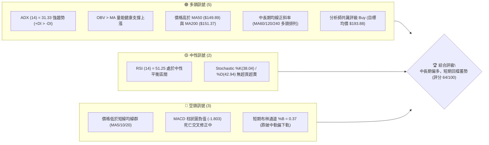

### 📊 核心指標速覽表

| 指標類別 | 指標名稱 | 當前數值 | 訊號 | 解讀 |
|----------|----------|----------|------|------|
| **價格** | 當前價格 | $174.33 | 🟢 | 位於52週高低點區間 67.2%，高位強勢震盪 |
| **均線** | MA20 | $176.92 | 🔴 | 現價低於MA20 (-1.46%)，短期承壓回檔 |
| **均線** | MA50 | $149.89 | 🟢 | 現價高於MA50 (+16.31%)，中期結構多頭鞏固 |
| **均線** | MA200 | $151.37 | 🟢 | 現價高於MA200 (+15.17%)，長多基石堅定 |
| **動能** | RSI(14) | 51.25 | 🟡 | 位於50中軸平衡區，無超買超賣背離現象 |
| **動能** | MACD | 8.060 / 9.863 | 🔴 | MACD線跌破訊號線，柱狀圖 -1.803，短線修正 |
| **動能** | Stoch %K/%D | 38.04 / 42.94 | 🟡 | 弱側震盪但未觸及超賣線，修正動能減緩 |
| **趨勢** | ADX / DI | 31.33 (+DI: 29.63) | 🟢 | ADX > 25 且 +DI > -DI，具備多頭強趨勢動能 |
| **波動** | ATR(14) | $8.24 | 🟡 | 佔股價 4.73%，日常波幅較大，需足夠止損空間 |
| **通道** | 布林帶軌道 | 上$187.21 / 下$166.63 | 🟡 | %B = 0.37，脫離中軌逼近下軌支撐區間 |
| **成交量** | 量能配合度 | 27.90M (量比 0.84x) | 🟢 | 回檔縮量，OBV > MA，主力資金未現出逃跡象 |

### 🏆 技術評分卡

```
╔══════════════════════════════════════════════════════════════╗
║                技術評分卡 — PLTR (2026-09-08)                 ║
╠══════════════════════════════════════════════════════════════╣
║ 趨勢強度 (ADX/DI)   ████████████████░░░░  78/100  🟢 多頭優勢 ║
║ 動能指標 (RSI/MACD) ██████████░░░░░░░░░░  50/100  🟡 短線修正 ║
║ 支撐穩定度 (波段聚類)██████████████░░░░░░  72/100  🟢 下檔厚實 ║
║ 成交量配合 (OBV/量比)██████████████░░░░░░  70/100  🟢 回檔縮量 ║
║ 形態完整度 (箱體整理)████████████░░░░░░░░  60/100  🟡 高位震盪 ║
║ 均線排列 (短空長多) ██████████░░░░░░░░░░  54/100  🟡 均線修復 ║
╠══════════════════════════════════════════════════════════════╣
║ 綜合評分            █████████████░░░░░░░  64/100  🟢 偏多整固 ║
╚══════════════════════════════════════════════════════════════╝
```

---

## 2. 趨勢分析

### 🌐 多時框趨勢分析

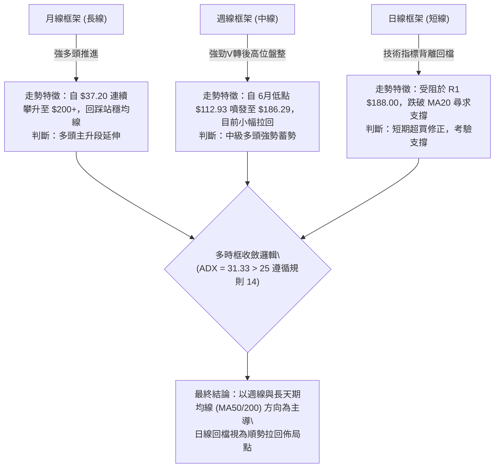

### 📈 長期趨勢 — 12個月走勢圖（Unicode）

```
PLTR 月線走勢圖（2025-10 至 2026-09）
價格軸 ($)
$210 ┤                   ● $200.47 (2025-10 高點)
$200 ┤                  / \
$190 ┤                 /   \                       ● $186.38 (2026-08)
$180 ┤                /     \     ● $177.75       / \
$170 ┤               /       ●---/               /   ● $174.33 (現價)
$160 ┤              /        $168.45            /
$150 ┤             /                           ● $156.54 (2026-05)
$140 ┤            /          ● $146.59  ● $146.28 \
$130 ┤           /            \        / \         \
$120 ┤          /              ●------●   \         ● $123.06 (2026-07)
$110 ┤         /               $137.19     ● $116.67 (2026-06 低點)
     └─────────┴───────┴───────┴───────┴───────┴───────┴───────┴───────►
             2025-10 2025-12 2026-02 2026-04 2026-06 2026-08 2026-09
```

**走勢特徵分析表格**：

| 階段 | 時間區間 | 起止價位 | 漲跌幅 | 結構特徵與技術解讀 |
|------|----------|----------|--------|-------------------|
| 階段一：主升趕頂 | 2025-08 ~ 2025-10 | $156.71 → $200.47 | +27.92% | 多頭連續拉升創波段新高 $207.52，量價齊揚進入估值加速區 |
| 階段二：深幅洗盤 | 2025-11 ~ 2026-02 | $200.47 → $137.19 | -31.57% | 獲利了結盤湧出，跌破MA20/MA50，完成均線乖離修復 |
| 階段三：箱體築底 | 2026-03 ~ 2026-06 | $146.28 → $116.67 | -20.24% | 探測52週最低區間 $106.37 形成複合式雙底結構，空方動能竭盡 |
| 階段四：量能噴發 | 2026-07 ~ 2026-08 | $123.06 → $186.38 | +51.45% | 8月首週爆出4.35億股天量跳空飆漲，徹底扭轉中期空頭架構 |
| 階段五：高位整固 | 2026-08 ~ 2026-09 | $186.38 → $174.33 | -6.46% | 受阻於前高阻力區 R1 $188.00，量縮進行技術面回踩 |

### 📊 中期趨勢（週線分析）

```
中期走勢支撐阻力結構示意圖
═════════════════════════════════════════════════════════════════
阻力區間 ──► R3: $207.52 (52週歷史高點)
             R2: $198.88 (波段高點聚類)
             R1: $188.00 (2026-08 頂部密集回跌阻力點)
現價     ──► $174.33  [短期整理區間]
支撐區間 ──► S1: $170.34 (近一年波段低點聚類 / 斐波 38.2% $168.88 附近)
             S2: $166.35 (布林帶下軌 $166.63 重疊防線)
             S3: $161.27 (強支撐波段聚類，多頭防守底線)
═════════════════════════════════════════════════════════════════
```

週線層面顯示，2026年8月初收盤價 $172.01 伴隨 435,164,800 股天量，確立了強烈的結構性支撐區。近期週線雖自 $186.29 壓回至 $174.33，週MACD柱狀圖雖轉負 (-1.803)，但成交量從高點的 4.35億股縮減至 1.56億股，屬於標準的高位量縮洗盤，未出現主力大規模出貨的放量長黑。

### ⚡ 趨勢強度評估（ADX 解讀）

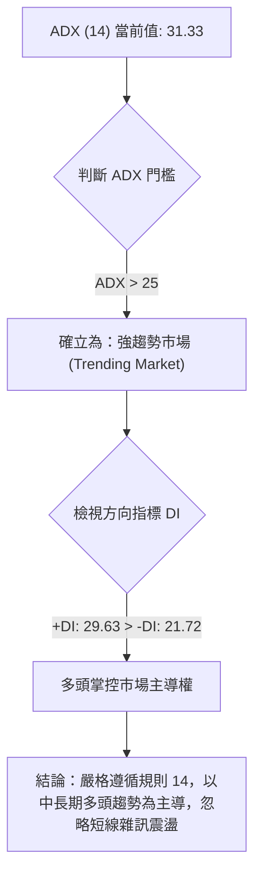

| 指標名稱 | 數值 | 門檻區間 | 趨勢判定 | 操作策略啟示 |
|----------|------|----------|----------|--------------|
| **ADX (14)** | **31.33** | > 25.00 | 強趨勢格局 | 順勢操作，逢拉回支撐做多，不可逆勢放空 |
| **+DI** | **29.63** | 高於 -DI | 多方動能佔優 | 買方推動能量仍高於賣方拋壓 |
| **-DI** | **21.72** | 低於 +DI | 空方動能受限 | 空方僅為次級修正波，無力引發趨勢反轉 |
| **ADX與DI差值**| **+7.91**| 差值擴大 | 多方結構健康 | 多頭架構保持完好，回檔提供較佳風險報酬比 |

---

## 3. 圖表形態分析

### 🔍 形態識別系統

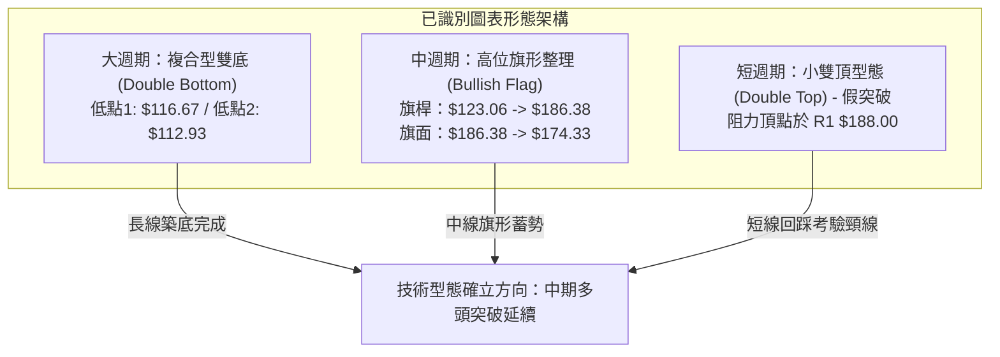

**形態信心度與目標價評估表**：

| 形態 | 信心度 | 判斷依據（引用數據） | 完成度 | 目標價（附計算式） |
|------|--------|----------------------|--------|--------------------|
| **大週期複合雙底** | **85%** | 2026-06低點 $116.67 與 2026-06-28週低點 $112.93 形成扎實底部；頸線為2026-05月高點 $156.54 | 100% (已突破) | 由雙底高度推算：頸線 $156.54 + 形態高度 ($156.54 - $112.93 = $43.61) = **$200.15** (接近 R2 $198.88) |
| **中週期高位牛旗** | **70%** | 旗桿自 $123.06 噴發至 $186.38 (高度 $63.32)，隨後以量縮連續3週於 $170-$186 區間震盪整理 | 65% (旗面回踩中) | 由旗形推算：突破旗面高點 $186.38 + 旗桿等長高度 $63.32 = **$249.70** (遠期目標) |
| **短週期微型回檔** | **55%** | 衝高至阻力位 R1 $188.00 受阻，連續拉回至現價 $174.33，短期MA5/10/20下彎 | 80% (逼近支撐 S1) | 回踩短線支撐目標位直接對齊 **S1 $170.34** |

### 🕯️ 重要K線形態分析

| 月份/週期 | 收盤價 | K線形態 | 解讀 | 訊號 |
|-----------|--------|---------|------|------|
| **2026-06** | $116.67 | 長下影錘頭線 (Hammer) | 探底 $106.37 後多頭強烈抵抗，收出堅韌下影線，確立底部 | 🟢 強多反轉 |
| **2026-07** | $123.06 | 築底十字星 (Doji) | 空方賣壓竭盡，多空在 $120 關卡形成換手平衡，醞釀轉折 | 🟡 變盤向上 |
| **2026-08** | $186.38 | 光頭大陽線 (Marubozu) | 暴量突破多重均線壓力，買盤極度強勢，奠定全新多頭波段 | 🟢 極強多頭 |
| **2026-09(初)** | $174.33 | 高位縮量陰孕線 (Harami) | 受阻於52週高點下方的 R1 $188 壓力區，多頭主動回撤洗盤 | 🔴 短線休整 |

### 📉 ASCII 走勢形態示意圖

```
PLTR 高位牛旗整理形態 (2026-08 至 2026-09)
價格 ($)
$190 ┤                 ● $188.00 (R1 阻力點)
     │                / \
$185 ┤               /   \      ┌── 旗面上軌阻力線
     │              /     ●----●
$180 ┤             /       \    \
     │            /         \    \
$175 ┤           /           ●----●◄── 現價 $174.33
     │          /             \
$170 ┤         /               ●◄───── S1 $170.34 預期旗面下軌支撐
     │        /  ▲
$165 ┤       /   │ 旗桿噴發
     │      /    │ (高度: $63.32)
$130 ┤     /     │
$123 ┤    ● $123.06
     └────────────────────────────────────────────────────────►
```

### 🎯 形態目標價計算

1. **複合型雙底最終目標價**：
   - 形態底部低點：$112.93
   - 形態突破頸線：$156.54
   - 形態垂直高度：$156.54 - $112.93 = $43.61
   - 向上等幅測距目標價 = $156.54 + $43.61 = **$200.15**（與阻力位 R2 $198.88 高度吻合）。
2. **高位旗形理論延伸目標價**：
   - 旗桿起點：$123.06，旗桿終點：$186.38，旗桿長度 = $63.32。
   - 若回踩 S1 $170.34 不破並重新突破 R1 $188.00，量度延伸目標價 = $188.00 + $63.32 = **$251.32**（與分析師最高目標價 $255.00 相近）。

---

## 4. 支撐與阻力

### 🗺️ 關鍵價位分布圖（Unicode）

```
PLTR 價位結構分布圖 (由 OHLCV 歷史波動計算)
═══════════════════════════════════════════════════════════════
$207.52 ║████████████████████████████████║ 強阻力 R3 (52W歷史高點 / 斐波 0.0%)
$198.88 ║████████████████████████        ║ 強阻力 R2 (波段高點聚類)
$188.00 ║████████████████████████████    ║ 關鍵阻力 R1 (近一年密集高點)
$183.65 ║░░░░░░░░░░░░░░░░░░░░░░░░░░      ║ 斐波那契 23.6% 回調位
────────╫────────────────────────────────╫─────────────────────────────
$174.33 ╠════════════════════════════════╣ ◄── 當前收盤價
────────╫────────────────────────────────╫─────────────────────────────
$170.34 ║▓▓▓▓▓▓▓▓▓▓▓▓▓▓▓▓▓▓▓▓▓▓▓▓        ║ 近期核心支撐 S1 (波段低點聚類)
$168.88 ║░░░░░░░░░░░░░░░░░░░░░░░░░░      ║ 斐波那契 38.2% 回調位 (共振支撐)
$166.35 ║████████████████████████████    ║ 強支撐 S2 (波段聚類 / 布林下軌)
$161.27 ║████████████████████████████████║ 核心防守底線 S3 (波段關鍵低點)
$156.95 ║░░░░░░░░░░░░░░░░░░░░░░░░░░      ║ 斐波那契 50.0% 回調位 / 頸線重疊
═══════════════════════════════════════════════════════════════
```

### 🚧 阻力位分析表

| 阻力級別 | 價位 | 形成原因 | 突破難度 | 重要性 |
|----------|------|----------|----------|--------|
| **R1** | **$188.00** | 近一年波段高點聚類，2026-08月末收盤受阻高點 | 中等 (需日量能 > 35M) | 🟢 短線多空樞紐 |
| **R2** | **$198.88** | 歷史整數關卡前密集套牢區，大週期雙底等幅測距點 | 較高 (需消化前波籌碼) | 🟡 中期目標關卡 |
| **R3** | **$207.52** | 52週歷史最高價 (52W High)，空頭最後防線 | 極高 (歷史歷史天花板) | 🔴 長期趨勢頂部 |

### 🛡️ 支撐位分析表

| 支撐級別 | 價位 | 形成原因 | 守住機率 | 重要性 |
|----------|------|----------|----------|--------|
| **S1** | **$170.34** | 近一年波段低點聚類，貼近斐波 38.2% ($168.88) | 75% | 🟢 短線首要防線 |
| **S2** | **$166.35** | 近一年波段低點聚類，與當前日線布林下軌 ($166.63) 重疊 | 85% | 🟡 強力共振支撐 |
| **S3** | **$161.27** | 波段防守結構底線，跌破則中線多頭架構遭到破壞 | 92% | 🔴 多頭生命防線 |

### 📐 斐波那契回調位分析

依據 52 週低點 **$106.37** 至 52 週高點 **$207.52** 之黃金分割計算：

- **0.0% ($207.52)**：52週最高點，終極多頭壓力點。
- **23.6% ($183.65)**：現價上方第一道回調壓制，上週突破失敗後退回其下方。
- **38.2% ($168.88)**：**當前核心回調支撐位**。現價 $174.33 正處於 23.6% ($183.65) 與 38.2% ($168.88) 之間運行。
- **50.0% ($156.95)**：中性回調位，與前期頸線 $156.54 及 MA240 ($156.67) 形成超級多頭堡壘。
- **61.8% ($145.01)**：黃金分割防守位，緊鄰 MA50 ($149.89) 與 MA120 ($143.88)。
- **78.6% ($128.02)**：深幅折返位。
- **100.0% ($106.37)**：52週最低點。

> **解讀**：現價落於 **$168.88 (38.2%)** 至 **$183.65 (23.6%)** 區間。在強勢多頭行情中，拉回通常於 38.2% 獲得有力承接，只要收盤不有效跌破 S1 ($170.34) 與 $168.88，多頭結構即屬健康常態調整。

---

## 5. 技術指標深度解讀

### 🎛️ 指標訊號總覽

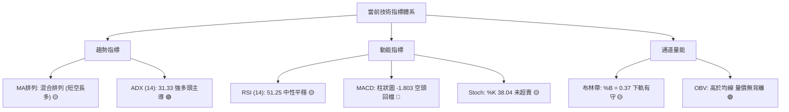

### 📈 移動平均線排列分析

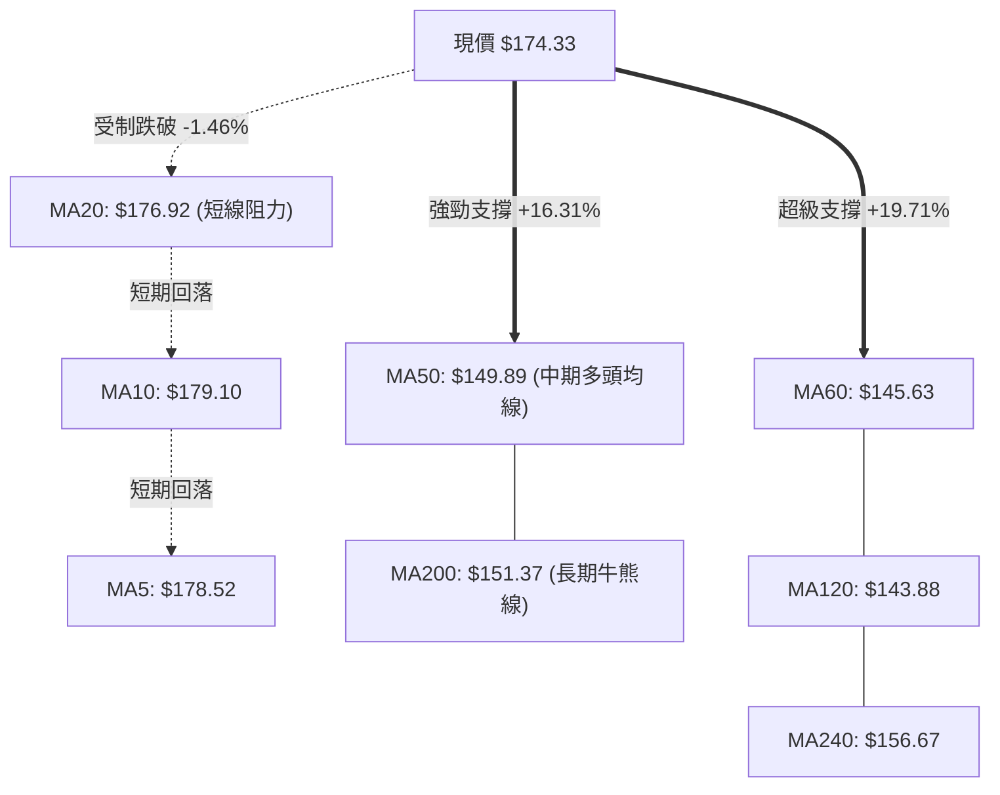

| 均線天期 | 均線價位 | 乖離率 (對現價) | 斜率趨勢 | 技術意義評定 |
|----------|----------|----------------|----------|--------------|
| **MA 5** | $178.52 | -2.35% | 下彎 ▁▁ | 短線空方控盤，持續對價格形成壓制 |
| **MA 10** | $179.10 | -2.66% | 下彎 ▁▁ | 短期追高買盤套牢，轉為動態阻力位 |
| **MA 20** | $176.92 | -1.46% | 下彎 ▁▁ | 月線失守，短線轉入震盪整理行情 |
| **MA 50** | $149.89 | +16.31% | 上揚 ██ | 中期多頭基石，與 MA200 形成支撐帶 |
| **MA 60** | $145.63 | +19.71% | 上揚 ██ | 季線強勁上挺，中期多頭趨勢堅固 |
| **MA120** | $143.88 | +21.16% | 上揚 ██ | 半年線向上發散，下檔防禦層次分明 |
| **MA200** | $151.37 | +15.17% | 上揚 ██ | 年線多頭排列，長多確立 |
| **MA240** | $156.67 | +11.28% | 上揚 ██ | 長期牛市格局穩健 |

### 📉 RSI(14) 分析

```
RSI(14) 當前數值：51.25  [中性平衡區間]
超賣 (0)                               中軸 (50)                       超買 (100)
├───────────────┼─────────────────────────┼─────────────────────────┼───────────────┤
0              30                        51.25                     70             100
[═══════════════]█████████████████████████░░░░░░░░░░░░░░░░░░░░░░░░░[═══════════════]
```

- **超買超賣評估**：RSI(14) 當前為 **51.25**，精準貼近 50 多空中軸，已由 2026-08-23 週的極度超買區 (79.0) 充分冷卻修復，並未跌入 30 以下之超賣區，反映籌碼屬於強勢鈍化洗盤，而非恐慌性潰退。
- **背離分析判斷**：
  - 週線走勢中，價格於 2026-08-30 創出收盤高點 $186.29，週 RSI 為 60.8；對比 2026-08-23 價格 $179.94 之 RSI 79.0，出現微幅頂背離跡象，此現象已完整解釋了近期自 $186.29 回跌至 $174.33 的修正動能。
  - 當前日線 RSI(14) 於 51.25 走平，數據庫明確顯示「**RSI 背離: 無明顯背離**」，顯示短線下行修正已接近動能平衡點。

### 📊 MACD(12/26/9) 訊號解讀

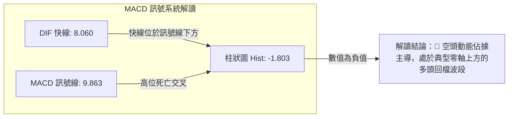

- **數值關係**：MACD 線 (8.060) 位於訊號線 (9.863) 下方，兩者均在零軸上方較高位置運作，MACD 柱狀圖為 **-1.803**。
- **交叉狀態**：呈現高位死亡交叉修正行情。然而，由於雙線依然顯著位於零軸之上，此死叉定性為「強勢區間的次級拉回」，而非空頭趨勢翻轉。若柱狀圖負值開始收斂，將形成絕佳的中途買點。

### 📦 布林通道分析

```
日線布林通道 (Bollinger Bands 20, 2)
價格 ($)
$187.21 ┼───────────────────────────────────────────── 上軌 (BB Upper)
        │
$180.00 ┤
$176.92 ┼ - - - - - - - - - - - - - - - - - - - - - - 中軌 (MA20)
$174.33 ┼═════════════════════════● 現價 (%B = 0.37)
$170.00 ┤
$166.63 ┼───────────────────────────────────────────── 下軌 (BB Lower)
        └─────────────────────────────────────────────►
```

- **通道參數**：上軌 **$187.21**、中軌 (MA20) **$176.92**、下軌 **$166.63**。
- **當前位置**：%B 為 **0.37**，表明股價已自中軌回落至下半區，正朝布林下軌 $166.63 靠攏。
- **共振效應**：布林下軌 $166.63 與關鍵支撐 S2 **$166.35** 完美重合，構成極為強大的「通道+技術支撐雙重護城河」。

### 💹 成交量分析（量價配合度）


- **成交量結構**：最新交易量為 27,895,300 股，低於 20 日均量 33,152,305 股（量比 0.84x），且遠低於 50 日均量 40,862,514 股。
- **OBV 指標解讀**：數據庫顯示「**OBV > MA → 量能支撐上漲**」。雖然短線股價連續下修，但 OBV 曲線維持在均線之上，並未形成量價背離，說明大資金機構投資者（持股佔比高達 64.9%）依然持籌看好，目前的量能收縮為洗盤沉澱籌碼行為。

---

## 6. 動能與波動率

### ⚡ 動能評估四象限

| 象限 | 動能強度 (Momentum) | 波動率水準 (Volatility) | 當前狀態判定 | 戰術操作評估 |
|------|--------------------|------------------------|--------------|--------------|
| **Q1 (最佳擴展區)** | 強 (RSI>60, ADX>25) | 低 (ATR% < 3.0%) | ── | 趨勢穩健爆發，重倉順勢跟進 |
| **Q2 (震盪整固區)** | 弱 (RSI 40-55) | 低 (ATR% 偏低) | ── | 橫盤構築平台，耐心等待突破 |
| **Q3 (強勢整理區)** | **強 (ADX 31.33, +DI佔優)** | **高 (ATR% = 4.73%, Beta 1.62)** | **✓ PLTR 目前所處位置** | **高波幅順勢回調，逢低分批低吸佈局** |
| **Q4 (高危下行區)** | 弱 (RSI<40, -DI佔優) | 高 (ATR% > 5.0%) | ── | 破位下殺，應絕對停損或空倉觀望 |

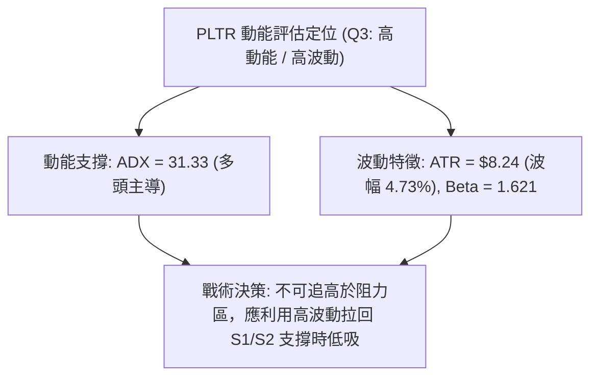

### 📊 ATR 波動率分析

- **ATR(14) 數值**：**$8.24**，換算佔當前股價比例為 **4.73%**。
- **止損距離建議**：
  - 考量 PLTR 具備日均 $8.24 的大幅擺動特性，短線交易若設定過窄的止損（如 < 2%）極易被市場雜訊掃出場。
  - **保守型止損距離**：應設定為 1.5 倍 ATR = $8.24 × 1.5 = **$12.36**。
  - **進取型波段止損**：應設定為 1.0 倍 ATR = **$8.24**。
  - 若自現價 $174.33 進場，1 倍 ATR 止損恰好落在 $174.33 - $8.24 = **$166.09**，與 S2 強支撐 **$166.35** 完美契合。

### 📐 Beta 與市場相關性

- **Beta 係數**：**1.621**。
- **市場特徵解讀**：PLTR 展現出相對於標普 500 指數高出 62.1% 的強烈波動敏感性。當科技股或納斯達克大盤反彈時，PLTR 具備顯著的超額回報（Alpha）爆發力；反之，大盤回落時其回檔幅度亦更深。
- **倉位管理意涵**：在 1.621 的高 Beta 屬性下，單一個股部位不宜超過總投資組合的 10%-15%，以防止系統性風險引發淨值大幅回撤。

---

## 7. 多時框架總結

### 📋 時框架評分表

| 時框架 | 趨勢方向 | 動能指標狀態 | 均線排列特徵 | 形態完成度 | 綜合評分 | 操作建議 |
|--------|----------|--------------|--------------|------------|----------|----------|
| **月線 (長期)** | 🟢 強勁看多 | RSI 處於歷史高位強勢區 | 均線系統呈長多擴散 | 突破歷史大底部 | **85/100** | 核心部位堅定長線持有 |
| **週線 (中期)** | 🟢 多頭主導 | MACD零軸上，量能沉澱 | 站穩MA50/MA200 | 暴量後牛旗蓄勢中 | **75/100** | 回踩關鍵支撐逢低加碼 |
| **日線 (短期)** | 🔴 弱勢修正 | MACD 死叉，RSI 51.25 | 跌破 MA20，均線纏繞 | 遇阻回跌測試下軌 | **48/100** | 暫停追價，等待止跌訊號 |

### 🔲 綜合訊號矩陣

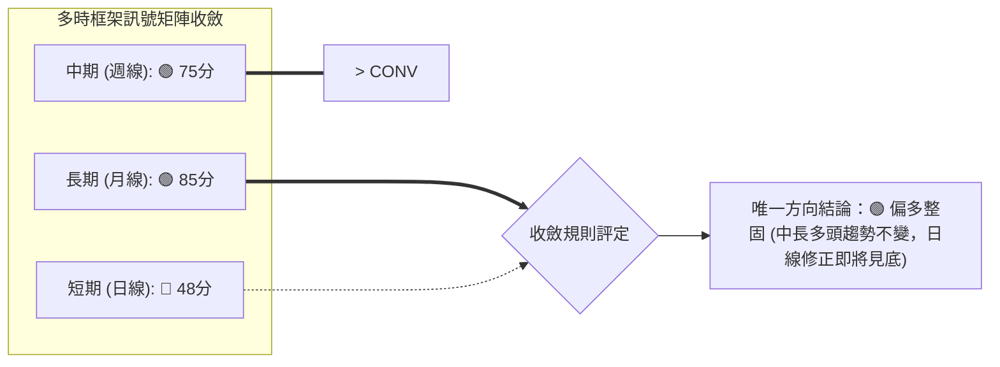

### ⚖️ 多時框收斂結論

嚴格執行本報告之**多時框收斂規則（規則 14）**：
1. **趨勢/盤整定性**：當前 ADX(14) 讀數為 **31.33 > 25**，市場被嚴格裁定為「**強趨勢行情**」，絕非「無序盤整行情」。
2. **時框優先級權重**：依據規則 14，在趨勢行情下，必須以**中長期（週線、MA50 $149.89、MA200 $151.37）之方向為主導**，日線級別的指標回檔僅能作為「**尋找最佳折價進場點的微觀工具**」，不得顛倒主次而判斷為趨勢反轉。
3. **方向性唯一結論**：**偏多整固（Bullish Consolidation）**。整體綜合技術評分為 **64/100**（高於 60 分偏多分界線），與第 1 章技術評分卡完全吻合。

---

## 8. 交易策略建議

### 🗺️ 策略決策流程圖

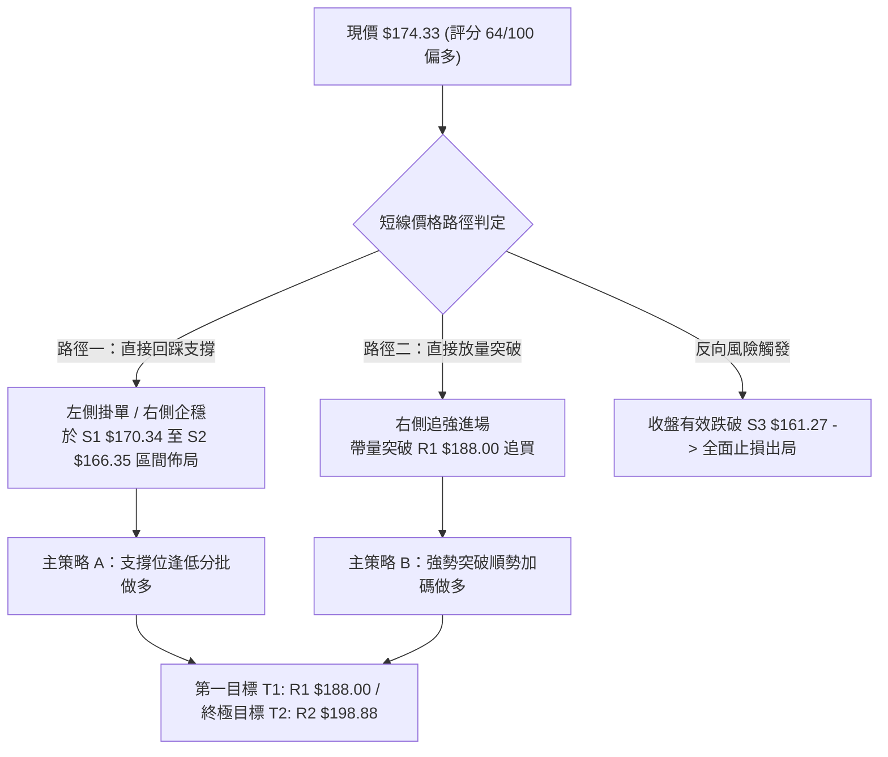

### 🧭 策略路由（依評分卡分流）

> **當前主策略方向 = 偏多操作 / 逢拉回支撐做多（依技術評分卡綜合評分 64/100 判定）**
> 
> 由於綜合評分 ≥ 60，本報告**主推多頭策略**。空方操作僅列為防禦風控與對沖觸發條件，嚴禁在此強多頭架構下盲目重倉摸頂放空。

### 🎯 價格情境階梯（Price Scenarios）

所有價位均嚴格引用第 4 章計算之波段聚類數值：

| 觸發條件 | 下一目標 | 後續延伸 | 情境技術含義 |
|----------|----------|----------|--------------|
| **突破 R1 $188.00** | **R2 $198.88** | **R3 $207.52** | 短線完成旗形整理，重啟波段主升浪，直指歷史天花板 |
| **站穩現價 $174.33** | **R1 $188.00** | **S1 $170.34** | 於布林中下軌之間拉鋸換手，洗淨浮籌，構築次級上升平台 |
| **跌破 S1 $170.34** | **S2 $166.35** | **S3 $161.27** | 短期修正波擴大，考驗布林下軌及波段關鍵支撐，多頭進入深水防禦 |

### 📊 情境機率分佈

| 情境 | 機率 | 主要技術指標與籌碼依據 |
|------|------|------------------------|
| **情境一：回踩支撐後延續上行** | **60%** | ADX 31.33 確立強多趨勢；OBV 持續在均線之上未見主力資金出逃；下檔 S1/S2 與斐波 38.2% 形成多重支撐共振 |
| **情境二：區間窄幅震盪消化** | **25%** | RSI 51.25 中性平緩，MACD 處於高位死叉零軸上整理，短線成交量萎縮至均量以下 (量比 0.84x) |
| **情境三：破位深幅回調探底** | **15%** | 日線跌破 MA20 短期均線；若市場系統性風險爆發引發 Beta (1.621) 劇烈放大，可能回測 S3 $161.27 |

### 🟢 主策略詳情（方向：多頭主導）

| 策略要素 | 策略 A（穩健型：支撐低吸佈局） | 策略 B（進取型：突破追強跟進） |
|----------|--------------------------------|--------------------------------|
| **進場條件** | 股價回踩 S1 企穩或下探 S2 出現下影線止跌 | 日K線收盤價帶量 (日量>35M) 實體突破 R1 |
| **進場價格** | **$168.88** (斐波38.2%) 至 **$170.34** (S1) | **$188.50** (確認突破 R1 $188.00) |
| **目標價 T1** | **$188.00** (R1 阻力位) | **$198.88** (R2 阻力位) |
| **目標價 T2** | **$198.88** (R2 阻力位) | **$207.52** (R3 / 52W高點) |
| **止損價格** | **$161.00** (微幅跌破 S3 $161.27) | **$179.00** (跌破突破點及 MA10 均線) |
| **風險報酬比** | **1 : 2.08** (以進場$170.00算，風險$9.0，目標$18.0) | **1 : 2.00** (風險$9.5，目標$19.02) |
| **成功機率** | **65%** | **60%** |
| **建議倉位** | **8% - 10%** (分兩批建倉) | **5% - 8%** (單筆進場，嚴格止損) |

### 🔴 反向風險觸發點（對沖提示）

若出現以下訊號，代表多頭架構遭遇實質破壞，應立即停止多頭操作並啟動避險：
1. **關鍵價位失守**：日K線收盤價**實體跌破 S3 $161.27**，且次日未能收復。
2. **量能異動確認**：跌破上述支撐時，單日成交量放大至 5,000 萬股以上（主力大單出逃）。
3. **指標共振轉空**：ADX 跌破 25 且 -DI 向上金叉 +DI，MACD 雙線跌破零軸。
- **對沖操作**：減持現貨部位至 30% 以下，或利用少量資金買入價外認沽期權（Put）進行單純組合避險。

### ⭐ 整體訊號強度評星

```
╔═══════════════════════════════════════════════════════╗
║ 做多訊號強度：★★★★☆  (4/5星) — 中長多架構完備，順勢低吸 ║
║ 做空訊號強度：★★☆☆☆  (2/5星) — 僅屬逆勢短空，空間受限 ║
║ 整體可信度：  ★★★★☆  (4/5星) — 數據量價結構互相確認 ║
╚═══════════════════════════════════════════════════════╝
```

---

## 9. 風險提示與監控

### ✅ 關鍵監控指標 Checklist

```
╔══════════════════════════════════════════════════════════════╗
║                每日/每週盤後關鍵技術監控清單                 ║
╠══════════════════════════════════════════════════════════════╣
║ [ ] 價位維度：是否守住核心支撐 S1 $170.34 與 S2 $166.35？    ║
║ [ ] 均線維度：能否於 3 個交易日內重回 MA20 ($176.92) 之上？  ║
║ [ ] 動能維度：MACD 柱狀圖是否由 -1.803 開始收斂向上？        ║
║ [ ] 動能維度：RSI(14) 能否穩固於 50 中軸之上拒絕跌破 45？    ║
║ [ ] 趨勢維度：ADX(14) 是否維持在 25 以上且 +DI > -DI？       ║
║ [ ] 量能維度：拉回是否持續保持縮量 (成交量 < 33M 均量)？      ║
║ [ ] 籌碼維度：是否在 R1 $188.00 處再次出現長上影線天量出貨？  ║
╚══════════════════════════════════════════════════════════════╝
```

### ⚠️ 風險場景分析

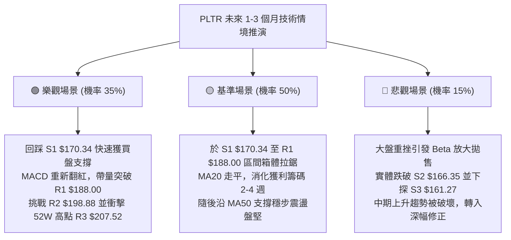

### 🛡️ 風險管理重要提醒

1. **高估值波動放大風險**：PLTR 目前 Trailing P/E 達 149.0，P/S 達 68.05。此類超高估值成長股的股價完全由極高成長預期驅動，技術面若一旦跌破關鍵支撐，極易引發高乘數的「估值殺（Multiple Compression）」，必須嚴格執行機械化停損，絕不可在跌破 S3 後抱持盲目加碼攤平心態。
2. **高 Beta 倉位縮放法則**：鑑於 Beta 達 1.621，建議單筆交易部位承擔之最大風險資金（進場價與止損價差額 × 股數）不應超過整體投資組合淨值的 **1.0% - 1.5%**。
3. **ATR 動態追蹤止盈**：當多頭策略獲利進展達 T1 ($188.00) 後，應立即啟動「移動追蹤止盈機制（Trailing Stop）」，將止損點推移至損益兩平點以上，並以 1.5 倍 ATR ($12.36) 作為動態跟隨距離，鎖定獲利果實。

---

## 📋 報告總結

```
╔══════════════════════════════════════════════════════════════╗
║                   PLTR 技術分析報告總結                       ║
╠══════════════════════════════════════════════════════════════╣
║ 報告日期：2026-09-08                                          ║
║ 當前價格：$174.33                                            ║
║ 分析評級：⚖️ 偏多整固 / 順勢逢低做多 (綜合評分: 64/100)        ║
║                                                              ║
║ 關鍵結論：                                                    ║
║ ├─ 長期趨勢：🟢 極強多頭 (月線均線發散，突破大型雙底結構)     ║
║ ├─ 中期趨勢：🟢 牛旗蓄勢 (ADX 31.33 多頭主導，暴量後健康量縮) ║
║ ├─ 短期趨勢：🔴 次級修正 (跌破 MA20，MACD 死叉考驗下軌支撐)   ║
║ ├─ 關鍵支撐：S1: $170.34 ｜ S2: $166.35 ｜ S3: $161.27       ║
║ ├─ 關鍵阻力：R1: $188.00 ｜ R2: $198.88 ｜ R3: $207.52       ║
║ └─ 分析師目標均價：$193.88 (隱含約 +11.2% 上行空間)          ║
║                                                              ║
║ 最優策略組合：                                                ║
║ 1. 🥇 最佳機會：策略 A (於 S1 $170.34 附近分批低吸做多，       ║
║                  止損 $161.00，目標看至 R1 $188 / R2 $198.88)║
║ 2. 🥈 次選機會：策略 B (耐心等待放量實體突破 R1 $188.00 後右側 ║
║                  順勢追多，目標看至 52W 高點 R3 $207.52)     ║
║ 3. 🥉 保守選擇：維持現有長線多頭部位不動，靜待 MACD 柱狀圖收斂 ║
║                  並重返 MA20 ($176.92) 再行增持               ║
╚══════════════════════════════════════════════════════════════╝
```

---

> ⚠️ **免責聲明**：本報告為技術分析研究成果，所有數據及估算均嚴格基於歷史量價走勢與統計模型計算。本報告**僅供學術研究與投資策略討論參考**，**不構成任何形式的要約或投資買賣建議**。金融市場具高度波動風險，投資人應獨立評估風險承受能力並自負盈虧。

---

*報告生成時間：2026-09-08 ｜ 數據來源：Yahoo Finance ｜ 分析框架：多時框技術分析模型*