# PLTR 技術分析報告

> **報告日期**：2026-09-10 ｜ **語言**：繁體中文 ｜ **數據來源**：Yahoo Finance ｜ **當前價格**：$170.30（以2026-09-13最新收盤價基準）

---

## 目錄

| 章節 | 內容 |
|------|------|
| [1. 技術面概覽](#1-技術面概覽) | 訊號儀表板、核心指標、評分卡 |
| [2. 趨勢分析](#2-趨勢分析) | 多時框趨勢、長中短期走勢 |
| [3. 圖表形態分析](#3-圖表形態分析) | 形態識別、K線組合、目標價 |
| [4. 支撐與阻力](#4-支撐與阻力) | 關鍵價位、斐波那契回調 |
| [5. 技術指標深度解讀](#5-技術指標深度解讀) | MA/RSI/MACD/布林/成交量 |
| [6. 動能與波動率](#6-動能與波動率) | 動能評估、ATR、Beta |
| [7. 多時框架總結](#7-多時框架總結) | 時框架評分矩陣 |
| [8. 交易策略建議](#8-交易策略建議) | 多空策略、風險報酬比 |
| [9. 風險提示與監控](#9-風險提示與監控) | 監控指標、風險場景 |

---

## 1. 技術面概覽

### 🎯 技術訊號儀表板

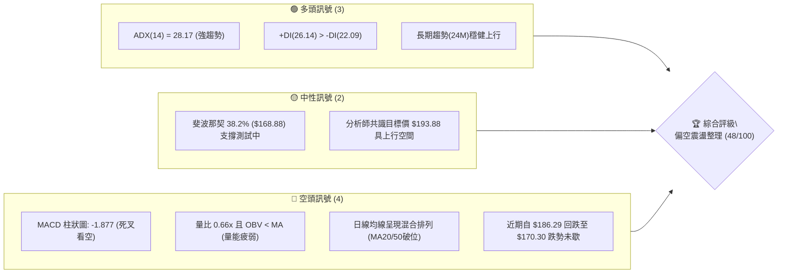

### 📊 核心指標速覽表

| 指標類別 | 指標名稱 | 當前數值 | 訊號 | 解讀 |
|----------|----------|----------|------|------|
| **價格** | 當前基準價 | $170.30 | 🟡 | 位於52週區間（$106.37 - $207.52）之中偏高位置，短線回檔中 |
| **均線** | 短期趨勢 | 混合排列 | 🔴 | 均線系統顯示短線受阻，MA20與MA50均位於當前價格上方 |
| **動能** | MACD (12,26,9) | 6.931 / 8.807 | 🔴 | MACD線下穿訊號線，柱狀圖為 -1.877，短期動能顯著走弱 |
| **趨勢強度** | ADX (14) | 28.17 | 🟢 | 數值大於 25，顯示當前具備明確趨勢行情，非低動能鈍化震盪 |
| **方向系統** | DMI (+DI / -DI) | 26.14 / 22.09 | 🟢 | +DI 高於 -DI，整體中長期架構多頭依然掌握宏觀控制權 |
| **量能** | 成交量 / 20日均量 | 20,123,908 (0.66x) | 🔴 | 成交量顯著低於20日與50日均量，OBV跌破均線，買盤後繼無力 |
| **波動** | Beta | 1.621 | 🟡 | 高貝塔係數，對科技板塊與整體市場波動極度敏感 |

### 🏆 技術評分卡

```
╔══════════════════════════════════════════════════════════════════╗
║              技術評分卡 — PLTR (2026-09-10)                      ║
╠══════════════════════════════════════════════════════════════════╣
║ 趨勢強度 (ADX)     ██████████████░░░░░░  70/100  🟢 趨勢明確     ║
║ 動能指標 (MACD)    ██████░░░░░░░░░░░░░░  30/100  🔴 動能轉空     ║
║ 支撐穩定度 (Fib)   ████████████░░░░░░░░  60/100  🟡 考驗FIB38.2% ║
║ 成交量配合 (OBV)   ██████░░░░░░░░░░░░░░  30/100  🔴 量能萎縮     ║
║ 形態完整度 (波段)  ██████████░░░░░░░░░░  50/100  🟡 衝高回踩     ║
║ 均線排列 (MA)      ████████░░░░░░░░░░░░  40/100  🔴 短線轉弱     ║
╠══════════════════════════════════════════════════════════════════╣
║ 綜合評分           ██████████░░░░░░░░░░  48/100  🟡 中性偏空震盪 ║
╚══════════════════════════════════════════════════════════════════╝
```

---

## 2. 趨勢分析

### 🌐 多時框趨勢分析

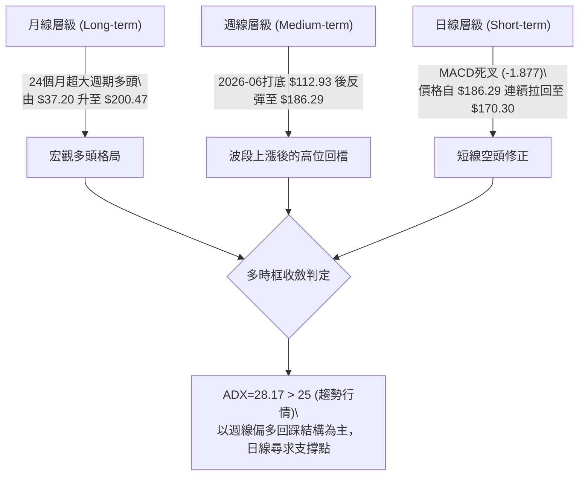

### 📈 長期趨勢 — 12個月走勢圖（Unicode）

以下為 2025-10 至 2026-09 過去 12 個月收盤走勢：

```
PLTR 月線走勢圖（過去12個月：2025-10 至 2026-09）
價格軸 ($)
$210 ┤      ● $200.47 (2025-10歷史峰值)
$195 ┤
$180 ┤            ● $177.75                                 ● $186.38
$165 ┤        ● $168.45                             ● $156.54    ● $170.30 (現在)
$150 ┤                  ● $146.59       ● $146.28
$135 ┤                            ● $137.19   ● $139.11   ● $123.06
$120 ┤                                              ● $116.67
$105 ┤                                                  
     └─────────────────────────────────────────────────────────────────
       10    11    12    01    02    03    04    05    06    07    08    09
      2025 ───────────────────► 2026 ────────────────────────────────►
```

#### 走勢特徵分析表格

| 階段區間 | 起始價 → 結束價 | 漲跌幅 | 走勢特徵與技術含義 |
|----------|----------------|--------|-------------------|
| **衝頂回落期** (2025-10 ~ 2026-02) | $200.47 → $137.19 | -31.57% | 觸及 52 週高點 $207.52 後獲利回吐，展開大週期 ABC 修正浪。 |
| **底部築底期** (2026-03 ~ 2026-06) | $146.28 → $116.67 | -20.24% | 探測 52 週低點聚類區間（最低 $106.37，週線於 $112.93 見底）。 |
| **強烈主升期** (2026-07 ~ 2026-08) | $123.06 → $186.38 | +51.45% | 單月巨幅飆漲，週成交量暴增至 4.35 億股，V型強勁反轉。 |
| **短線受阻期** (2026-08 ~ 2026-09) | $186.38 → $170.30 | -8.63%  | 遭遇歷史高位套牢籌碼壓制，日線級別 MACD 出現死叉，動能衰竭。 |

### 📊 中期趨勢（週線分析）

近期 20 週數據顯示，PLTR 自 2026 年 6 月底於 $112.93 見底後，在 8 月初展開爆發性攻勢，週成交量達到 435,164,800 股的歷史天量，推動價格連續突破多道阻力並於 2026-08-30 來到 $186.29。隨後兩週（09-06 的 $174.33 與 09-13 的 $170.30）呈現價跌量縮拉回，MACD柱狀圖快速由 +4.790 縮減至 -1.877。

```
週線近期價格阻力與支撐區間示意圖：
[ 52W High $207.52 ] ──────────────────────────── 強天花板
             ▲
[ 波段高點 $186.29 ] ──────────────────────────── 近期壓力區 (2026-08-30)
             ▲
[ 當前價格 $170.30 ] ◄─── 目前在此區間震盪整理
             ▼
[ Fib 38.2% $168.88 ] ─────────────────────────── 即時第一道關鍵支撐
             ▼
[ Fib 50.0% $156.95 ] ─────────────────────────── 強支撐防線 (5月波段高點 $156.54 聚類)
```

### ⚡ 趨勢強度評估（ADX 解讀）

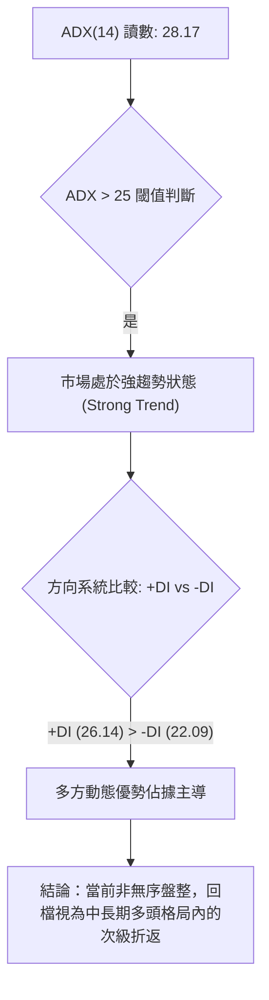

| 指標名稱 | 當前讀數 | 門檻區間 | 趨勢屬性與交易意涵 |
|----------|----------|----------|-------------------|
| **ADX(14)** | 28.17 | > 25.0 | 明確處於趨勢行情階段，禁止使用純震盪區間反轉逆勢抓頂策略。 |
| **+DI** | 26.14 | > 20.0 | 多頭擴張動能維持主動，多方防線仍有守備力量。 |
| **-DI** | 22.09 | < 25.0 | 空方力量雖然短線回升，但尚未形成壓倒性的拋售雪崩。 |

---

## 3. 圖表形態分析

### 🔍 形態識別系統

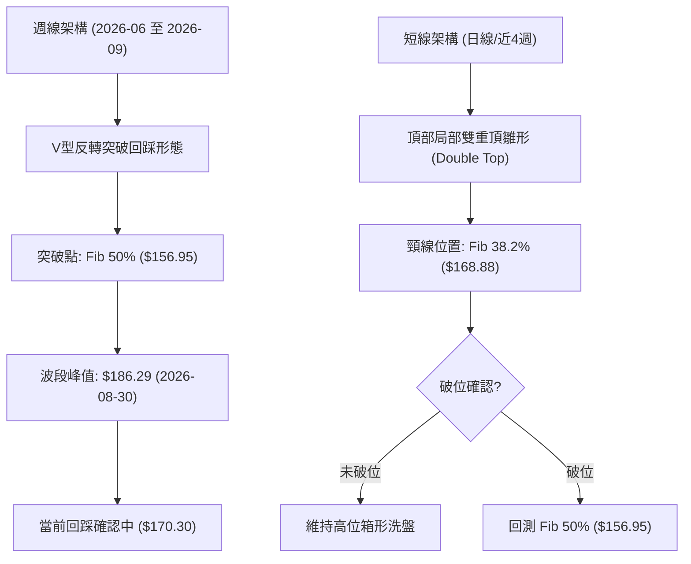

#### 形態信心度評估表

| 形態類別 | 信心度 | 判斷依據（引用數據） | 完成度 | 目標價（附計算式） |
|----------|--------|----------------------|--------|--------------------|
| **週線大級別 V型突破回踩** | 75% | 自 2026-06-28 低點 $112.93 急拉至 $186.29，放量突破 2026-05 前高 $156.54 | 85% | 依突破點 $156.95 加上自低點 $112.93 起算高度 ($156.95 - $112.93 = $44.02) 推算向上目標 = $156.95 + $44.02 = **$200.97**（接近52週高點 $207.52） |
| **日線局部雙重頂 (Double Top)** | 55% | 8月中旬高點 $179.94 與 8月底高點 $186.29 形成短線雙峰，頸線測試 $168.88 | 60% | 若跌破頸線 $168.88，形態高度為 $186.29 - $168.88 = $17.41，向下目標 = $168.88 - $17.41 = **$151.47**（略低於 Fib 50% $156.95） |

### 🕯️ 重要K線形態分析

| 週/月份 | 收盤價 | K線形態 | 解讀 | 訊號 |
|---------|--------|---------|------|------|
| **2026-08-09** | $172.01 | **大陽突破實體棒** | 成交量激增至 435,164,800 股，MACD 柱跳升至 +4.790，強勢收復 $170 | 🟢 強烈看多 |
| **2026-08-23** | $179.94 | **高位長上影線棒** | RSI 攀升至 79.0 嚴重超買，買盤在高位遇強烈套牢拋壓阻力 | 🟡 預警見頂 |
| **2026-08-30** | $186.29 | **創高滯漲十字星** | 週成交量縮至 1.53 億股，形成量價背離，動能柱驟降至 +0.177 | 🔴 頂背離隱憂 |
| **2026-09-06** | $174.33 | **陰線實體吞沒** | 實體跌破前週低點，MACD柱狀圖翻負 (-1.803)，確立回檔走勢 | 🔴 空頭吞噬 |
| **2026-09-13** | $170.30 | **下影探底陰線** | 測試 Fib 38.2% ($168.88) 支撐，量能大幅衰退至 44,706,208 股 | 🟡 支撐測試 |

### 📉 ASCII 走勢形態示意圖

```
                    [頂部二重峰阻力 $186.29]
                           ▲
                          / \       ▲
                         /   \     / \
                        /     \   /   \
                       /       \_/     \
                      /                 \
                     /                   ▼ [現價 $170.30 考驗頸線]
────────────────────/─────────────────────\──────── Fib 38.2% 頸線 ($168.88)
                   /                       \
                  /                         ▼? [若破位測試 Fib 50%]
                 /
  [突破點 $156.54]
       ▲
      /
     /
    /
   /
  ▼ [2026-06 低點 $112.93]
```

### 🎯 形態目標價計算

1. **多頭主線延續（V型底測幅）**：
   - 頸線/突破位 = $156.95（斐波那契 50.0% 回調位）
   - 底部起點 = $112.93（2026-06-28 實際收盤低點）
   - 形態垂直高度 = $156.95 - $112.93 = **$44.02**
   - 形態測幅目標價 = $156.95 + $44.02 = **$200.97**（與歷史高點聚類區 $200.47 - $207.52 高度重合）。
2. **空頭修正加劇（雙重頂測幅）**：
   - 形態雙頂峰值 = $186.29
   - 關鍵頸線 = $168.88（斐波那契 38.2% 回調位）
   - 形態垂直高度 = $186.29 - $168.88 = **$17.41**
   - 破位下跌目標價 = $168.88 - $17.41 = **$151.47**。

---

## 4. 支撐與阻力

### 🗺️ 關鍵價位分布圖（Unicode）

依據提供的歷史 OHLCV 與斐波那契回調結構，繪製絕對精確的價位分層：

```
PLTR 價位結構分布圖
═══════════════════════════════════════════════════════════════════
$207.52 ║████████████████████████║ 52W High (絕對歷史天花板 R3)
$186.29 ║████████████████████    ║ 近期波段最高收盤 (重要阻力 R2)
$183.65 ║████████████████████████║ 斐波那契 23.6% 回調位 (即時阻力 R1)
════════╠════════════════════════╣ ◄ 當前基準價格: $170.30
$168.88 ║▓▓▓▓▓▓▓▓▓▓▓▓▓▓▓▓        ║ 斐波那契 38.2% 回調位 (第一道關鍵支撐 S1)
$156.95 ║████████████████████████║ 斐波那契 50.0% 回調位 / 5月前高 (核心支撐 S2)
$145.01 ║████████████████        ║ 斐波那契 61.8% 黃金分割回調位 (強支撐 S3)
$128.02 ║████████                ║ 斐波那契 78.6% 回調位 (波段防守線 S4)
$106.37 ║████████████████████████║ 52W Low (極限底部 S5)
═══════════════════════════════════════════════════════════════════
```

### 🚧 阻力位分析表

依據數據清單，聚類阻力位與斐波那契位置嚴格定義如下：

| 阻力級別 | 價位 | 形成原因 | 突破難度 | 重要性 |
|----------|------|----------|----------|--------|
| **阻力 R1** | **$183.65** | 斐波那契 23.6% 回調位，緊鄰 2025-09 收盤價 $182.42 | 🟡 中等 | 短線多頭重啟攻勢的首要障礙，站穩方能化解空頭反撲。 |
| **阻力 R2** | **$186.29** | 2026-08-30 近期反彈最高波段收盤價 | 🔴 較高 | 前期獲利了結與解套籌碼密集區，短期雙頂壓制核心。 |
| **阻力 R3** | **$207.52** | 52週歷史最高價 (52W High)，亦接近 2025-10 收盤 $200.47 | 🔴 極高 | 長期多頭終極目標，存在極強的歷史套牢盤心理反壓。 |

### 🛡️ 支撐位分析表

| 支撐級別 | 價位 | 形成原因 | 守住機率 | 重要性 |
|----------|------|----------|----------|--------|
| **支撐 S1** | **$168.88** | 斐波那契 38.2% 回調位，現價 $170.30 正直接測試此處 | 🟡 55% | 短線多空生死線，一旦失守將引發多頭止損盤。 |
| **支撐 S2** | **$156.95** | 斐波那契 50.0% 回調位，聚類 2026-05-31 收盤高點 $156.54 | 🟢 75% | 宏觀多頭中樞，強支撐帶，多頭波段防線關鍵位置。 |
| **支撐 S3** | **$145.01** | 斐波那契 61.8% 黃金分割位，聚類 2026-01 ($146.59) 與 2026-03 ($146.28) | 🟢 85% | 長期多頭生命線，若跌破則宣告波段多頭行情徹底終結。 |

### 📐 斐波那契回調位分析

依據 52 週波動區間 **$106.37 → $207.52**（全區間落差 $101.15）計算：

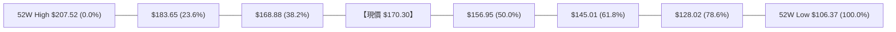

- **當前價格定位**：現價 **$170.30** 精準懸浮於 **23.6% ($183.65)** 與 **38.2% ($168.88)** 之間，距離下方關鍵回調位 $168.88 僅有 $1.42（約 0.83%）的微幅緩衝。
- **技術意義解析**：
  1. 在健康的強勢回調行情中，38.2%（$168.88）通常為多頭守護的極限點。若能在此收出強支撐K線，將構成絕佳的二次起跳平台。
  2. 若有效跌破 $168.88，根據技術分析法則，價格必然向下尋求 50.0%（$156.95）及 61.8%（$145.01）支撐，屆時調整週期將顯著拉長。

---

## 5. 技術指標深度解讀

### 🎛️ 指標訊號總覽

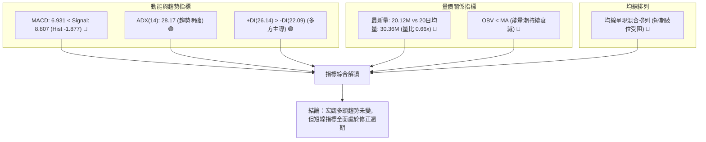

### 📈 移動平均線排列分析

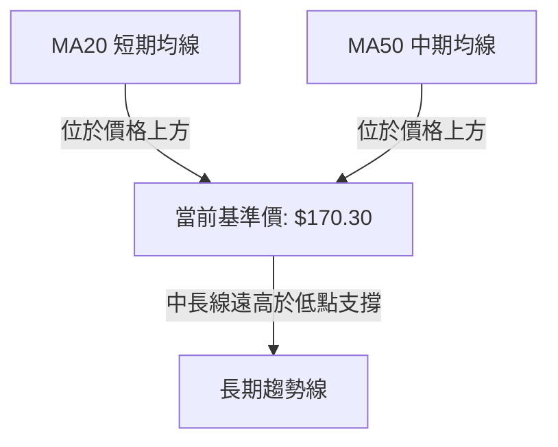

- **均線排列狀態**：數據報告明確指出「均線排列：混合排列」，且 MA20 與 MA50 均顯示「▼ 下方」，代表現價 $170.30 已經跌落至 20 日與 50 日短期均線之下。
- **技術意涵**：短天期均線失守並轉化為動態反壓，價格短期承壓沉重，均線正處於乖離修正與籌碼換手期。

### 📉 RSI(14) 分析

雖然日線即時 RSI 顯示中性（30-70），但從近 20 週歷史數值軌跡可清晰追蹤動能演變：
- 2026-08-23 週線 RSI 曾達到 **79.0**（極端超買區間，顯示籌碼過熱）。
- 2026-08-30 價格創下新高 $186.29 時，週線 RSI 卻大幅下滑至 **60.8**。

```
RSI(14) 週線數值演變：
0      30          50          70     79.0    100
├──────┼───────────┼───────────┼───────●───────┤ 2026-08-23 (RSI: 79.0 超買)
├──────┼───────────┼─────●─────┼───────┼───────┤ 2026-08-30 (RSI: 60.8 頂背離)
├──────┼───────────┼──●────────┼───────┼───────┤ 2026-09-06 (RSI: 51.3 中性降溫)
```

- **背離判斷**：此為標準的**價格創高但 RSI 未創高的頂背離（Bearish Divergence）**現象。該背離已在過去兩週引發連續拋售，目前 RSI 回落至 50 軸中性水平，超買壓力已大幅宣洩，但尚未出現底背離止跌訊號。

### 📊 MACD(12/26/9) 訊號解讀

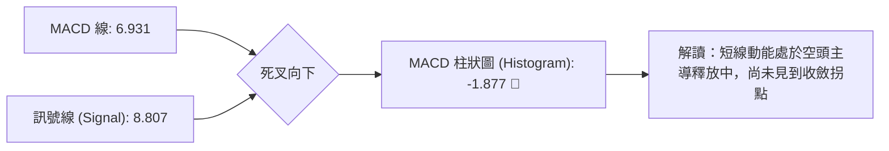

- **數值分析**：MACD 主線數值為 6.931，低於訊號線 8.807，柱狀圖為 -1.877。
- **趨勢解讀**：自 2026-08-09 柱狀圖達到最高點 +4.790 後，連續四週萎縮並正式轉負（09-06 為 -1.803，09-13 為 -1.877），確認中期動能已轉入空頭修正波段。

### 📦 布林通道分析

因日線布林帶上下軌數值數據未明細列出，依據均線與價格波動特徵繪製指標推演架構：

```
布林通道結構示意圖 (以 Fib 關鍵位與均線推演)：
$186.29 ───────────────────────────────── BB 上軌壓制區 (前高聚類)
               ▲
               │  [現價 $170.30] 跌破中軌往下軌滑落
$175.00 ~ 177 ──┼───────────────────────── BB 中軌 (MA20 動態反壓區)
               │
$156.95 ───────────────────────────────── BB 下軌支撐預期 (Fib 50% 聚類)
```

- **通道意涵**：價格跌破中軌後，通道開口呈現擴張狀態，價格正向下軌尋求支撐，中軌轉為第一道短線反彈壓力。

### 💹 成交量分析（量價配合度）

- **最新量能對比**：最新日成交量僅 20,123,908 股，遠低於 20 日均量 30,362,740 股（量比 0.66x）及 50 日均量 39,630,434 股。
- **OBV 能量潮狀態**：數據指出「OBV < MA → 量能疲弱」。
- **綜合解讀**：價格自 $186.29 回檔至 $170.30 過程中伴隨成交量顯著萎縮。量縮下跌說明目前市場並非出現主力奪路而逃的恐慌性拋售，而是呈現「買盤追高意願匱乏」的無量陰跌。若要確立築底反彈，必須見到單日成交量放大重回 3,000 萬股以上。

---

## 6. 動能與波動率

### ⚡ 動能評估四象限

| 象限 | 動能維度 | 波動率維度 | 當前狀態 | 綜合評估 |
|------|----------|------------|----------|----------|
| **Q1** | 強動能 (多頭) | 低波動 | — | 穩定單邊推升行情 |
| **Q2** | 弱動能 (空頭/修正) | 低波動 | — | 沉悶無序窄幅盤整 |
| **Q3** | 強動能 (多頭) | 高波動 (Beta 1.621) | — | 暴力主升浪（如 8 月初走勢） |
| **Q4 (當前)** | **弱動能 (短期轉空)** | **高波動 (Beta 1.621)** | **✓ 吻合** | **高波動回檔修正期，操作風險偏高** |

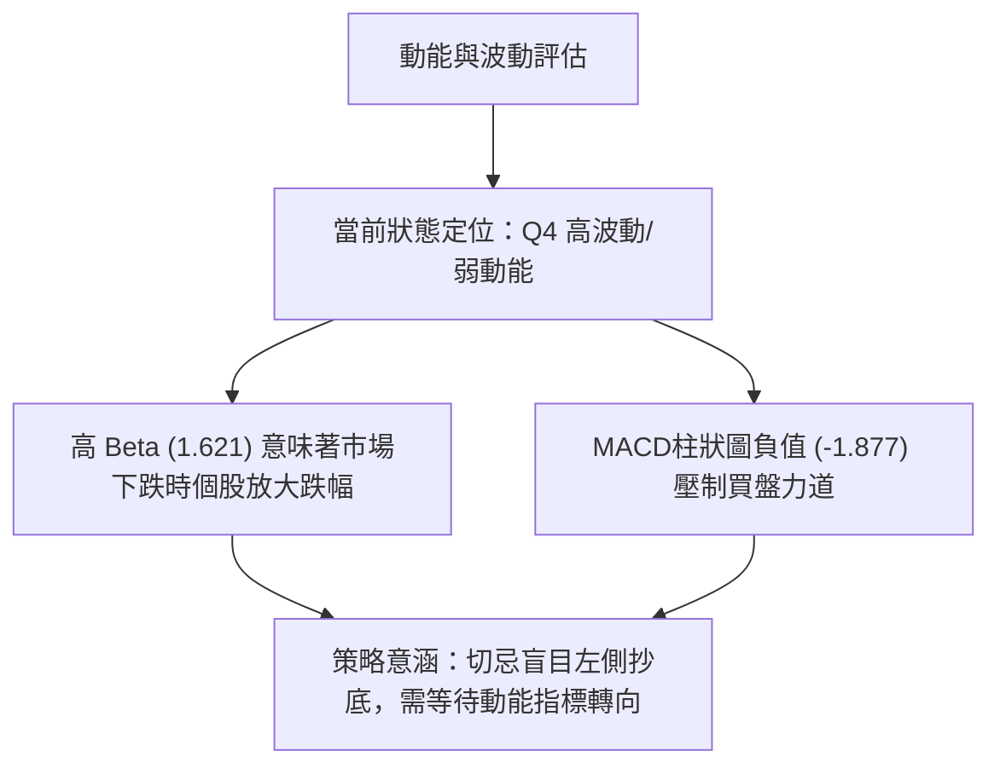

### 📊 ATR 波動率分析

- **歷史週波幅參考**：近 20 週內，PLTR 曾於單週展現自 $123.06 飆升至 $172.01（單週震幅高達 $48.95）的極端波動；近期平均週波幅亦在 $6.00 至 $12.00 區間。
- **風控止損距離建議**：
  - 基於高 Beta（1.621）特性，波段操作容錯空間需拉大。
  - 短線交易止損區間建議設定為當前價格的 **2.0% ~ 2.5%**（約 $3.50 - $4.50）。
  - 中期波段策略應以關鍵結構位為防守點（如 Fib 38.2% $168.88 下方寬減 $2.00 置於 $166.88，或 Fib 50.0% $156.95 下方置於 $154.00）。

### 📐 Beta 與市場相關性

- **Beta 數值**：**1.621**。
- **意涵解讀**：PLTR 展現出極強的進攻性與脆弱的高彈性。當標普 500 或那斯達克指數上漲 1% 時，PLTR 平均上漲 1.62%；反之，在美股大盤回檔期間，PLTR 面臨高達 1.62 倍的下行放大壓力。因此，當前技術面回檔必須嚴格盯緊科技巨頭與整體市場情緒。

---

## 7. 多時框架總結

### 📋 時框架評分表

| 時框架 | 趨勢方向 | 動能狀態 | 均線排列 | 形態結構 | 綜合評分 | 操作建議 |
|--------|----------|----------|----------|----------|----------|----------|
| **長期 (月線)** | 🟢 強勢多頭 | 🟢 充沛 | 🟢 向上發散 | 超大週期多頭主升 | **85/100** | 長線多單底倉續抱 |
| **中期 (週線)** | 🟡 偏多回調 | 🟡 降溫 | 🟢 處於多頭半場 | V型突破後回踩頸線 | **60/100** | 等待回踩支撐確認 |
| **短期 (日線)** | 🔴 空頭修正 | 🔴 偏弱 | 🔴 混合偏空受阻 | 雙頂雛形考驗頸線 | **35/100** | 嚴禁追多，防範破位 |

### 🔲 綜合訊號矩陣

```
┌─────────────────┬────────────────────────────────────────────────────────┐
│ 時框維度        │ 多空一致性判定與衝突解析                               │
├─────────────────┼────────────────────────────────────────────────────────┤
│ 長期 vs 中期    │ 🟢 高度一致：大架構由 $37.20 啟動之超級趨勢完整，未被破壞│
│ 中期 vs 短期    │ 🔴 明顯衝突：週線處於波段高位整理，日線 MACD 死叉向下修正│
│ 成交量 vs 價格  │ 🔴 矛盾警訊：價格自 $186.29 回跌，OBV 疲弱且量能萎縮   │
└─────────────────┴────────────────────────────────────────────────────────┘
```

### ⚖️ 多時框收斂結論

依據多時框收斂規則：
1. **趨勢屬性判定**：當前 **ADX(14) = 28.17 > 25.0**，確認市場處於「**強趨勢行情**」，而非低動能區間震盪。
2. **時框優先級權重**：在此條件下，應**以中長期（週線/宏觀斐波那契）方向為主導，日線僅作為過濾雜訊與尋找進場時機的工具**。
3. **方向性唯一結論**：**中性觀望偏防守（評分 48/100）**。
   - 儘管週線宏觀多頭格局完好，但短期日線動能空頭壓制明確（MACD柱狀圖負值達 -1.877），且現價正在直接叩碰 Fib 38.2%（$168.88）防線。
   - 策略上**嚴禁在頸線未確認守住前左側抄底**，應等待日線空頭動能衰竭或向下測試 Fib 50.0%（$156.95）強支撐後，再行順應週線大勢介入。

---

## 8. 交易策略建議

### 🗺️ 策略決策流程圖

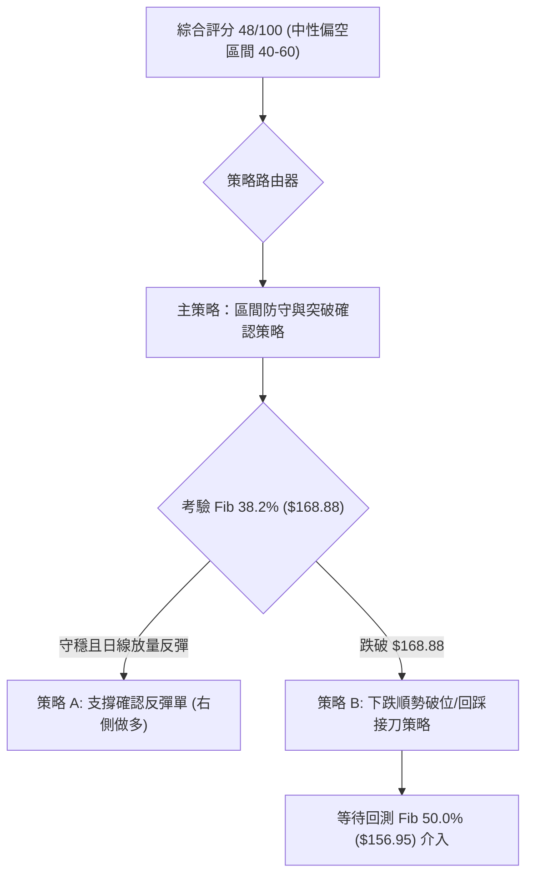

### 🧭 策略路由

> **當前主策略方向 = 中性觀望偏區間防守，等待支撐突破確認（依評分 48/100）**
> 
> 目前綜合評分落於 40–60 分之「中性偏空」區間。依據紀律，不盲目單邊重倉下注，以「**等待關鍵支撐 $168.88 得失，確認後順勢右側介入**」為核心架構。

### 🎯 價格情境階梯（Price Scenarios）

價位嚴格引用第 4 章關鍵數據：

| 觸發條件 | 下一目標 | 後續延伸 | 情境含義 |
|----------|----------|----------|----------|
| **向上突破 R1 $183.65** | R2 **$186.29** | R3 **$207.52** | 短線死叉化解，多頭重掌主動權，展開二度攻頂。 |
| **守穩 $168.88 - $170.30** | R1 **$183.65** | — | 於 Fib 38.2% 構築箱形底部，消化獲利回吐盤。 |
| **跌破 S1 $168.88** | S2 **$156.95** | S3 **$145.01** | 短線雙頂形態成立，展開深度回踩，下探 50% 回調位。 |

### 📊 情境機率分佈

| 情境 | 機率 | 主要依據 |
|------|------|----------|
| **破位下測強支撐 (回落探底)** | **50%** | MACD 柱狀圖為 -1.877 且持續擴散、OBV 跌破均線、均線混合排列偏空。 |
| **區間震盪築底 (守住 $168.88)** | **35%** | ADX 達 28.17 且 +DI > -DI，長期多頭趨勢仍提供底層支撐買盤。 |
| **直接暴力反轉突破 $183.65** | **15%** | 當前日成交量僅 2,012 萬股（量比 0.66x），量能顯著不足以支撐即刻大漲。 |

### 🟢 主策略詳情

#### 策略 A（保守型：回踩 Fib 50% 核心支撐逢低吸納策略）
此策略適用於價格跌破 $168.88 後，順應中長期趨勢在最堅固防線佈局。

#### 策略 B（激進型：Fib 38.2% 頸線防守右側突破多單）
此策略適用於現價區間止跌，帶量突破即時下行壓力時的右側進場。

| 策略要素 | 策略 A (保守核心：回測接多) | 策略 B (激進右側：支撐博弈) |
|----------|-----------------------------|-----------------------------|
| **進場條件** | 價格回測 Fib 50% ($156.95) 出現止跌K棒 | 價格守穩 $168.88，且日線突破重回 $174.00 |
| **進場價格** | **$157.50**（Fib 50% $156.95 上方） | **$174.00**（確認收復短線跌幅） |
| **目標價 T1** | **$168.88**（Fib 38.2% 轉化之阻力） | **$183.65**（Fib 23.6% 阻力位） |
| **目標價 T2** | **$183.65**（斐波那契波段目標） | **$186.29**（8月前高阻力） |
| **止損價格** | **$153.50**（跌破 Fib 50% 緩衝區間） | **$167.50**（嚴格停損於 Fib 38.2% 下方） |
| **風險報酬比** | **1 : 2.85** (風險 $4.00 / 獲利 $11.38) | **1 : 1.48** (風險 $6.50 / 獲利 $9.65) |
| **成功機率** | **65%** | **45%** |
| **建議倉位** | **15% - 20%** | **8% - 10%** |

### 🔴 反向風險觸發點（對沖提示）

- **全面轉空停損警訊**：若日線以**實體陰線收盤跌破 Fib 50.0% ($156.95)**，則週線級別的 V 型反轉結構遭到破壞，雙頂下跌幅度將延伸至 $145.01。此時多頭部位必須全面停損出場，或買入看跌期權（Put Option）進行資產對沖。
- **軋空爆發警訊**：若市場出現重大基本面利多促使成交量激增至 4,000 萬股以上，且強勢突破 **$183.65**，則空頭部位應立即無條件回補。

### ⭐ 整體訊號強度評星

```
╔══════════════════════════════════════════════════════════╗
║ 做多訊號強度：  ★★☆☆☆  (2/5星 — 短線指標壓制，需等回踩)  ║
║ 做空訊號強度：  ★★★☆☆  (3/5星 — MACD與量能支持短線回檔)║
║ 整體可信度：    ★★★★☆  (4/5星 — 價位與斐波那契吻合度極高)║
╚══════════════════════════════════════════════════════════╝
```

---

## 9. 風險提示與監控

### ✅ 關鍵監控指標 Checklist

```
╔══════════════════════════════════════════════════════════════════╗
║                    每日交易即時監控清單 (Checklist)              ║
╠══════════════════════════════════════════════════════════════════╣
║ [ ] 價格是否跌破斐波那契 38.2% 關鍵防線 $168.88？                ║
║ [ ] 日成交量是否回升至 20 日均量 (30,362,740 股) 之上？         ║
║ [ ] MACD 柱狀圖是否由負值擴大 (-1.877) 出現收斂拐點？            ║
║ [ ] RSI(14) 是否在 40-45 區域形成底背離支撐？                   ║
║ [ ] +DI (26.14) 與 -DI (22.09) 是否出現死叉翻轉？                ║
║ [ ] 科技股整體動向是否放大 PLTR 的高 Beta (1.621) 波動？         ║
╚══════════════════════════════════════════════════════════════════╝
```

### ⚠️ 風險場景分析

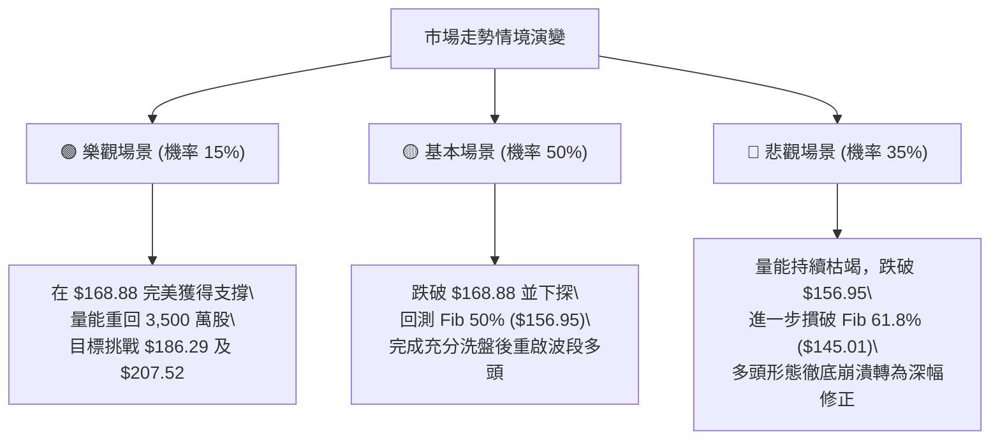

### 🛡️ 風險管理重要提醒

1. **高估值引發的波動脆弱性**：PLTR 當前 Trailing P/E 高達 143.67，P/S 達 66.18。極高的估值容錯率極低，市場對任何宏觀利率變化或成長放緩消息極度敏感，此基本面現狀支持技術面維持寬幅震盪。
2. **籌碼集中度風險**：機構持股佔比 64.8%，空頭部位比例僅 3.2%（Short Ratio 1.52）。籌碼結構顯示空頭擠壓（Short Squeeze）潛力有限，價格下跌主要由機構買盤縮手引發，不可心存軋空幻想。
3. **倉位管控紀律**：在當前評分 48 分的中性偏空震盪市中，單一個股暴露建議控制在總投資組合的 **10% ~ 15%** 以內。每一筆進場交易必須嚴格預設硬性止損點，單筆最大損失不可超過總帳戶權益的 **1.5%**。

---

## 📋 報告總結

```
╔══════════════════════════════════════════════════════════════════╗
║                   PLTR 技術分析報告總結                          ║
╠══════════════════════════════════════════════════════════════════╣
║ 報告日期：2026-09-10                                             ║
║ 當前基準價格：$170.30                                            ║
║ 綜合技術評級：⚖️ 中性偏空震盪整理 (評分: 48/100)                ║
║                                                                  ║
║ 關鍵維度判定：                                                   ║
║ ├─ 長期趨勢：🟢 強烈看多 (24個月自 $37.20 展開之大多頭未改)     ║
║ ├─ 中期趨勢：🟡 波段回踩 (V型突破後考驗 Fib 38.2% - 50.0% 區域)  ║
║ ├─ 短期趨勢：🔴 動能轉弱 (MACD柱 -1.877，量比僅 0.66x 連續拉回) ║
║ ├─ 關鍵支撐：$168.88 (即時考驗) │ $156.95 (核心防線)            ║
║ ├─ 關鍵阻力：$183.65 (即時障礙) │ $186.29 (波段峰值)            ║
║ └─ 分析師目標：平均 $193.88 (具備 +13.8% 潛在上行空間)           ║
║                                                                  ║
║ 最優策略指引：                                                   ║
║ 1. 🥇 最佳機會：耐性等待價格回踩 Fib 50.0% ($156.95) 出現止跌   ║
║                訊號時，以優異風險報酬比 (1:2.85) 佈局中長線多單。║
║ 2. 🥈 次選機會：若 $168.88 展現強烈下影線防守，且價格重返 $174   ║
║                之上，小倉位博弈右側短線反彈至 $183.65。          ║
║ 3. 🥉 保守選擇：空倉觀望，等待日線 MACD 出現黃金交叉收斂拐點     ║
║                與單日量能重回 3,000 萬股後再行介入。             ║
╚══════════════════════════════════════════════════════════════════╝
```

---

> ⚠️ **免責聲明**：本報告為依據量化技術指標與歷史行情數據生成之專業技術分析研究，文中所提及之所有支撐阻力點位、圖表形態及交易策略，**僅供研究與學術參考，絕不構成任何形式的要約或投資建議**。金融市場瞬息萬變，投資人應獨立評估自身風險承受能力並自負盈虧。

---

*報告生成時間：2026-09-10 ｜ 數據來源：Yahoo Finance ｜ 分析框架：多時框量化技術分析*