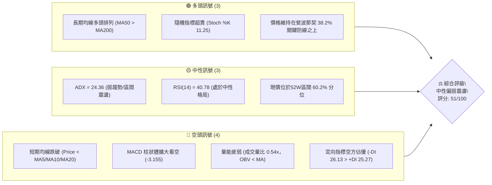
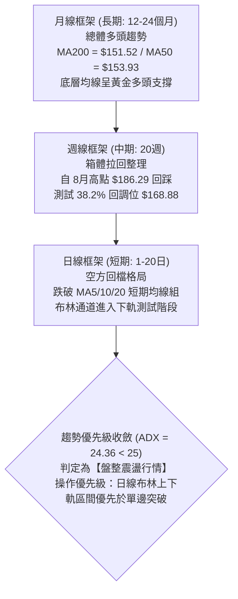
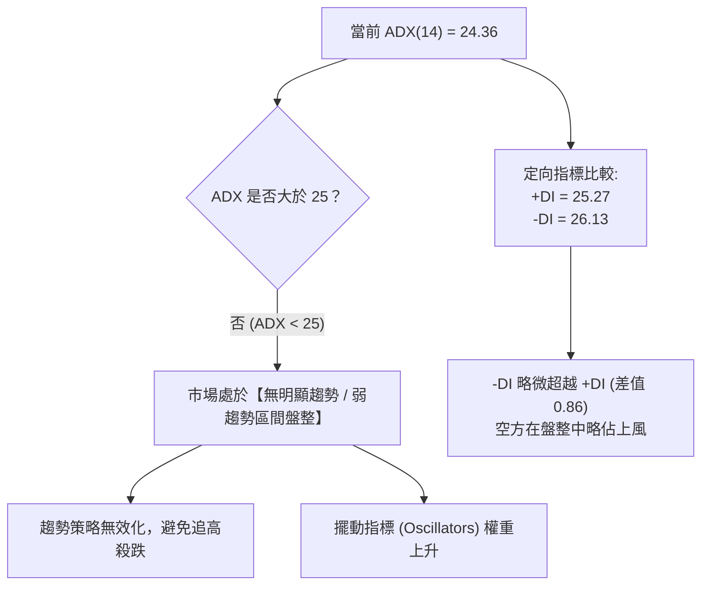
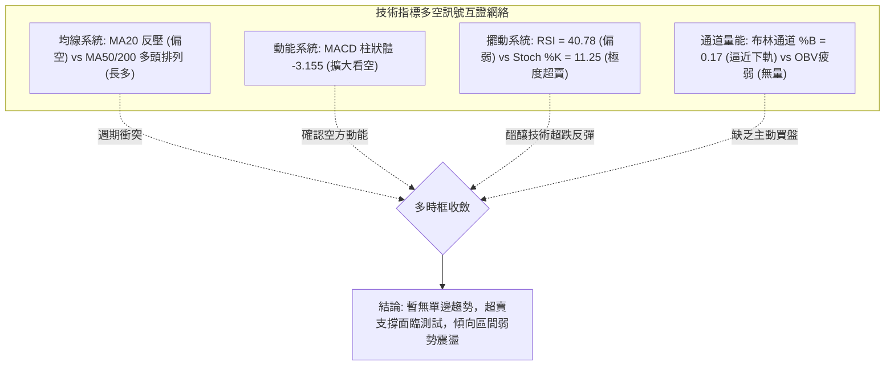
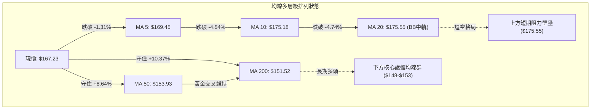
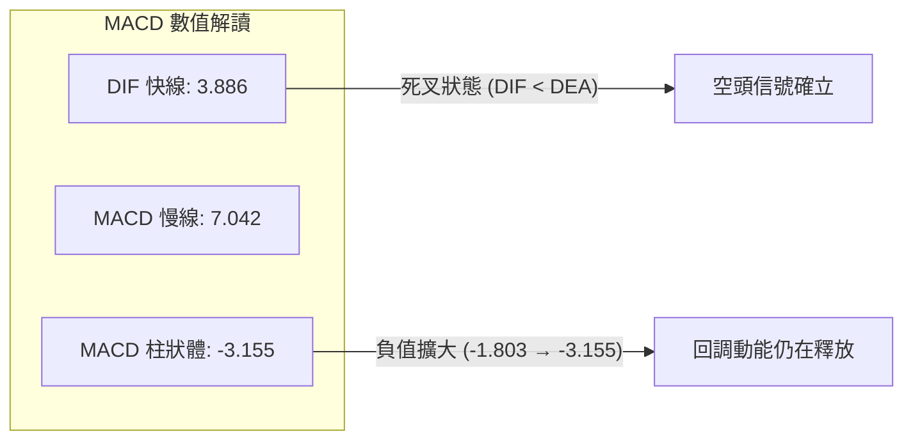
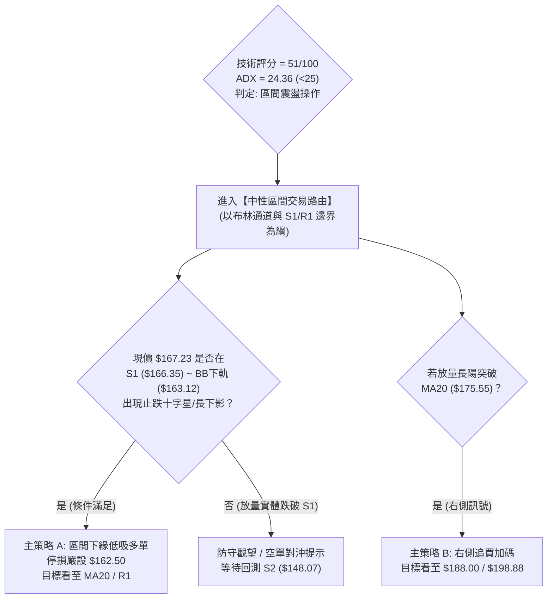
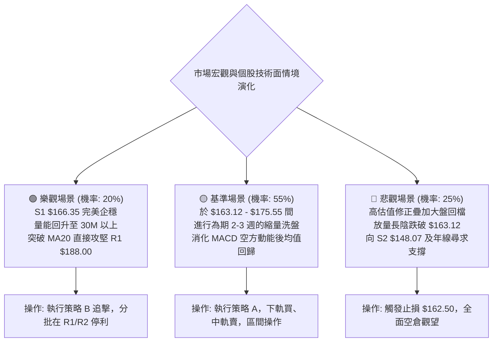

# PLTR 技術分析報告

> **報告日期**：2026-09-13 ｜ **語言**：繁體中文 ｜ **數據來源**：Yahoo Finance ｜ **當前價格**：$167.23

---

## 目錄

| 章節 | 內容 |
|------|------|
| [1. 技術面概覽](#1-技術面概覽) | 訊號儀表板、核心指標、評分卡 |
| [2. 趨勢分析](#2-趨勢分析) | 多時框趨勢、長中短期走勢、ADX 解讀 |
| [3. 圖表形態分析](#3-圖表形態分析) | 形態識別、信心度、K線組合、目標價推算 |
| [4. 支撐與阻力](#4-支撐與阻力) | 關鍵價位分佈、波段高低點、斐波那契回調 |
| [5. 技術指標深度解讀](#5-技術指標深度解讀) | 均線系統、RSI、MACD、布林通道、OBV |
| [6. 動能與波動率](#6-動能與波動率) | 動能四象限、ATR 止損設定、Beta 市場敏感度 |
| [7. 多時框架總結](#7-多時框架總結) | 時框架評分矩陣、多時框收斂結論 |
| [8. 交易策略建議](#8-交易策略建議) | 策略路由、價格情境階梯、主策略詳情、評星 |
| [9. 風險提示與監控](#9-風險提示與監控) | 監控清單 Checklist、風險場景樹狀圖、風控規則 |
| [10. 報告總結](#10-報告總結) | 核心結論與最佳策略組合速覽 |

---

## 1. 技術面概覽

### 🎯 技術訊號儀表板



---

### 📊 核心指標速覽表

| 指標類別 | 指標名稱 | 當前數值 | 訊號 | 技術解讀 |
|:---|:---|:---|:---:|:---|
| **現行報價** | 收盤價 (Close) | $167.23 | 🟡 | 緊貼短期支撐 S1（$166.35），處於52週區間 60.2% 位置 |
| **短期均線** | MA20 (月線) | $175.55 | 🔴 | 價格低於 MA20 達 -4.74%，短期動能遭均線反壓 |
| **中期均線** | MA50 (季線) | $153.93 | 🟢 | 價格高於 MA50 達 +8.64%，中期多頭結構基底尚存 |
| **長期均線** | MA200 (年線) | $151.52 | 🟢 | MA50 > MA200 呈黃金排列，長線牛市架構未破 |
| **動能震盪** | RSI(14) | 40.78 | 🟡 | 進入弱勢中性區，未見極端超賣，無背離訊號 |
| **趨勢動能** | MACD (12,26,9) | 3.886 / 7.042 | 🔴 | DIF 跌破 MACD 訊號線，柱狀體為 -3.155，動能走弱 |
| **超買超賣** | Stoch %K / %D | 11.25 / 11.20 | 🟢 | 雙雙進入極度超賣區（<20），短線存在技術性反彈動能 |
| **通道狀態** | Bollinger Bands | %B = 0.17 | 🟡 | 價格逼近下軌 $163.12，中軌 $175.55 為第一反彈阻力 |
| **量能狀態** | 成交量 / 20日均量 | 15.38M / 28.62M | 🔴 | 量比僅 0.54x，OBV 跌破均線，呈現無量陰跌態勢 |
| **波動風險** | ATR(14) | $7.64 (4.57%) | 🟡 | 每日平均震幅中等，提供止損距離與波動預算依據 |

---

### 🏆 技術評分卡

```
╔══════════════════════════════════════════════════════════════╗
║                技術評分卡 — PLTR (2026-09-13)                ║
╠══════════════════════════════════════════════════════════════╣
║ 趨勢強度 (Trend)     ████████░░░░░░░░░░░░  42/100  🔴 空方主導 ║
║ 動能指標 (Momentum)  ████████░░░░░░░░░░░░  40/100  🔴 動能疲弱 ║
║ 支撐穩定度 (Support) ████████████░░░░░░░░  60/100  🟡 臨近S1考驗║
║ 成交量配合 (Volume)  ██████░░░░░░░░░░░░░░  32/100  🔴 量能萎縮 ║
║ 形態完整度 (Pattern) ██████████████░░░░░░  70/100  🟢 區間明確 ║
║ 均線架構 (MA Align)  ████████████░░░░░░░░  62/100  🟡 長多短空 ║
╠══════════════════════════════════════════════════════════════╣
║ 綜合技術評分         ██████████░░░░░░░░░░  51/100  ⚖️ 區間震盪 ║
╚══════════════════════════════════════════════════════════════╝
```

---

## 2. 趨勢分析

### 🌐 多時框趨勢分析



---

### 📈 長期趨勢 — 12個月走勢圖（Unicode）

PLTR 在過去 12 個月（2025年10月至2026年09月）經歷了「自歷史高位大幅回洗、於 $112–$116 構築堅實底部、隨後展開 V 型修復、重回 $186 上方再次遇阻回檔」的大型波段震盪格局。

```
PLTR 月線走勢圖（過去12個月：2025-10 至 2026-09）
價格軸 ($)
$205 ┤    ●(2025-10: $200.47)
$190 ┤                                      ●(2026-08: $186.38)
$175 ┤          ●(2025-12: $177.75)                 ●←現價 $167.23
$160 ┤        ●(2025-11: $168.45)        ●(2026-05: $156.54)
$145 ┤                ●(2026-01: $146.59)
$130 ┤                    ●(2026-02: $137.19)
$115 ┤                                ●(2026-06: $116.67 週期大底)
     └───────────────────────────────────────────────────────────
        10   11   12   01   02   03   04   05   06   07   08   09 (月份)
        2025                                 2026
```

#### 走勢特徵分析表格

| 階段 | 時間跨度 | 價格起訖 | 區間漲跌幅 | 走勢特徵與結構意涵 |
|:---|:---:|:---:|:---:|:---|
| **第一階段：高位獲利了結** | 2025-10 → 2026-02 | $200.47 → $137.19 | -31.57% | 自歷史高點 $207.52 構築頂部後連跌，破位下行殺出籌碼 |
| **第二階段：中期震盪築底** | 2026-02 → 2026-06 | $137.19 → $116.67 | -14.96% | 震盪反彈至 $156.54 後再次探底，於 $116.67 確立 52 週大支撐 |
| **第三階段：量能爆發反彈** | 2026-06 → 2026-08 | $116.67 → $186.38 | **+59.75%** | 巨量單邊拉升，單週成交量突破 4.35 億股，強力收復半年線 |
| **第四階段：次級高點回檔** | 2026-08 → 2026-09 | $186.38 → $167.23 | -10.27% | 逼近前高 R1（$188.00）遇阻，成交量銳減，進入中段修整 |

---

### 📊 中期趨勢（週線分析）

從近 20 週的收盤價與動能結構觀察：
1. **8月爆發波**：2026-08-09 當週以 435,164,800 股的天量暴漲至 $172.01，MACD 柱狀體跳增至 +4.790，確認中線扭轉。
2. **高檔動能背馳**：2026-08-23 收盤 $179.94（RSI 79.0），次週 2026-08-30 收盤推升至 $186.29，但 RSI 逆勢回落至 60.8，MACD 柱狀體收縮至 +0.177。此處展現標準的**週線級動能減弱**。
3. **現階段回撤**：9月以來連收兩根陰線（$174.33 → $167.23），MACD 週線柱狀體翻負至 -3.155，正向下回測近一年重要密集區支撐 S1（$166.35）。

```
中期週線支撐壓力結構圖
$188.00 ───────────────────────────── [強阻力 R1 / 8月反彈頂部]
             ▲
             │ -11.05% 回檔修正中
             ▼
$167.23 ═════════════════════════════ [現價：測試支撐防線]
$166.35 ----------------------------- [關鍵波段支撐 S1 / 斐波 38.2%: $168.88]
             │
             ▼ 潛在防守緩衝區間 (-11.46%)
$148.07 ───────────────────────────── [強支撐 S2 / MA60 / MA50 聚落]
```

---

### ⚡ 趨勢強度評估（ADX 解讀）



#### ADX 趨勢強度對照解讀

| 指標變數 | 當前讀數 | 門檻區間 | 市場狀態解讀 |
|:---|:---:|:---:|:---|
| **ADX(14)** | **24.36** | < 20: 極弱 ｜ **20-25: 盤整邊緣** ｜ > 25: 形成趨勢 | 當前走勢缺乏單邊驅動力，價格進入收斂三角形或區間箱體洗盤階段 |
| **+DI** | **25.27** | 多方買盤推動力 | 買盤力道自 8 月下旬的高點顯著消退，目前處於防守狀態 |
| **-DI** | **26.13** | 空方拋壓壓制力 | 空方取得微幅主導權，但並未形成單邊壓倒性優勢（未出現 -DI > 35） |
| **結構收斂結論** | — | **盤整震盪確認** | **嚴格遵循收斂規則 14：ADX < 25 判定為盤整，以日線布林通道 ($163.12–$187.99) 作為邊界依據** |

---

## 3. 圖表形態分析

### 🔍 形態識別系統

根據近 12 個月 OHLCV 歷史價格走勢，嚴格依據形態幾何與成交量進行客觀校驗：

| 識別形態 | 信心度 | 判斷依據（嚴格引用數據） | 完成度 | 目標價（附嚴謹計算式） |
|:---|:---:|:---|:---:|:---|
| **大型矩形箱體整理** | **78%** | 上軌阻力精確受制於 R1（$188.00），下軌支撐受 S1（$166.35）及布林下軌（$163.12）支撐，近期兩次回測未破 | 75% | 箱體震盪上緣目標價 = **$188.00**<br>若向下實體跌破，則測幅目標 = S1 ($166.35) - [$188.00 - $166.35] = **$144.70**（接近 MA120 $144.37 與 61.8% $145.01） |
| **雙重底（W底）頸線回踩** | **68%** | 左底為 2026-02 低點群，右底為 2026-06 低點 $116.67，頸線為 2026-05 高點 $156.54。8月放量突破頸線後，目前為拉回回踩確認 | 85% | 形態理論最小測幅目標：頸線 $156.54 + ($156.54 - $116.67) = **$196.41**（極度接近阻力位 R2 $198.88） |
| **頭肩頂形態** | 35% | 僅有短期頂部跡象，頸線不明確且缺乏左肩對稱性，數據不足以支撐幾何形態 | 20% | *信心度 < 50%，依規則 15 判定訊號不足，不予推算延伸目標* |

---

### 🕯️ 重要K線形態分析

| 週期/月份 | 收盤價 | K線形態特徵 | 量價關係與市場心理解讀 | 多空訊號 |
|:---|:---:|:---|:---|:---:|
| **2026-06** | $116.67 | **長下影錘頭破底翻** | 探底 52W 區間低位 $106.37 附近獲強烈買盤支撐，單月暴量築底，恐慌籌碼被主力吸收 | 🟢 強烈看多 |
| **2026-08** | $186.38 | **大陽線帶上影線** | 月漲幅近 60%，但上影線觸及 R1（$188.00）後回落，透露 $190 上方存在早期套牢盤解套拋壓 | 🟡 獲利了結 |
| **2026-09 (至今)** | $167.23 | **縮量中陰線回調** | 連續下挫回吐 8 月部分漲幅，但成交量僅 15.38M（量比 0.54x），為典型的主動性縮量洗盤 | 🟡 縮量回測 |

---

### 📉 ASCII 走勢形態示意圖

```
PLTR 大型雙底突破後之回踩箱體結構
價格 ($)
$198.88 ┼                                      [雙底等幅測距目標 R2: $198.88]
        │
$188.00 ┼                  ╭───╮                [箱體上軌 / 阻力 R1: $188.00]
        │                  │   │
$175.55 ┼──────────────────┼───┼─────────────── [布林中軌 / MA20]
        │                  │   ╰─► 現價 $167.23
$166.35 ┼───-─-─-─-─-─-─-─-┴───-─-─-─-─-─-─-─- [箱體下軌 / 支撐 S1: $166.35]
        │          ╭──────╮
$156.54 ┼──────────╯頸線   ╰─────────────────── [W底突破頸線: $156.54]
        │
$136.30 ┼      ╭─╮
        │      │ │左底
$116.67 ┼──────╯ ╰─────────────────╭───╮───── [雙底支撐帶 / 52W Low $106.37]
        │                          │   │右底
        └──────────────────────────┴───┴───────
```

---

### 🎯 形態目標價計算

1. **矩形箱體交易目標**：
   - 上軌邊界（阻力位 R1）：**$188.00**
   - 下軌邊界（支撐位 S1）：**$166.35**
   - 中軸平衡線（MA20）：**$175.55**
   - *策略意涵*：若在下軌 S1（$166.35）至布林下軌（$163.12）獲得確認企穩，第一反彈目標看至中軸 **$175.55**，第二目標看至箱體上軌 **$188.00**。

2. **雙底測幅滿足點**：
   - 形態底部：2026-06 低點收盤群基準取 **$116.67**
   - 形態頸線：2026-05 波段高點 **$156.54**
   - 垂直高度 $H = \$156.54 - \$116.67 = \$39.87$
   - 向上測幅目標價 = 頸線 + $H = \$156.54 + \$39.87 =$ **$196.41**
   - *驗證關係*：此計算目標精確坐落於技術阻力位 R2（**$198.88**）下方 1.2% 之處，構成雙重技術共振目標區。

---

## 4. 支撐與阻力

### 🗺️ 關鍵價位分布圖（Unicode）

```
PLTR 價位結構分布圖
══════════════════════════════════════════════════════════════════
$207.52 ║████████████████████████████████████║ 歷史極值/52W High (R3)
$198.88 ║████████████████████████████        ║ 中期形態目標阻力 (R2)
$188.00 ║████████████████████████████████    ║ 關鍵波段高點阻力 (R1)
$183.65 ║▓▓▓▓▓▓▓▓▓▓▓▓▓▓▓▓                    ║ 斐波那契 23.6% 回調位
$175.55 ║------------------------------------║ 短期均線壓制帶 (MA20 / BB中軌)
$168.88 ║░░░░░░░░░░░░░░░░░░░░░░░░░░░░        ║ 斐波那契 38.2% 回調位
$167.23 ╠════════════════════════════════════╣ ◄ 當前市價 (Current Close)
$166.35 ║▓▓▓▓▓▓▓▓▓▓▓▓▓▓▓▓▓▓▓▓▓▓▓▓▓▓▓▓▓▓▓▓    ║ 關鍵波段支撐位 (S1)
$163.12 ║░░░░░░░░░░░░░░                      ║ 布林通道下軌極限
$156.95 ║████████████████                    ║ 斐波那契 50.0% 中樞
$153.93 ║██████████████████████              ║ MA50 (季線防守線)
$151.52 ║████████████████████████████        ║ MA200 (牛熊生命線)
$148.07 ║████████████████████████████████    ║ 強度波段支撐位 (S2)
$136.30 ║████████████████████████████████████║ 深層波段支撐位 (S3)
══════════════════════════════════════════════════════════════════
```

---

### 🚧 阻力位分析表

所有阻力價位均引用 OHLCV 波段高點聚類數據：

| 阻力級別 | 具體價位 | 距現價幅動 | 形成原因與籌碼特徵 | 突破難度 | 戰略重要性 |
|:---|:---:|:---:|:---|:---:|:---:|
| **R1** | **$188.00** | +12.42% | 近一年多次上衝頂部、布林上軌（$187.99）高度重疊區，8月反彈最高收盤密集區 | 75% (高) | ★★★★★<br>多空波段分水嶺 |
| **R2** | **$198.88** | +18.93% | 歷史大頂崩跌前的最後防守平台，雙底測幅 $196.41 延伸密集阻力區 | 85% (極高) | ★★★★☆<br>主升浪解套強壓區 |
| **R3** | **$207.52** | +24.09% | 52 週歷史天花板（52W High），多頭極限挑戰位，累積巨量解套賣壓 | 95% (極端) | ★★★★★<br>歷史心理極值 |

---

### 🛡️ 支撐位分析表

所有支撐價位均引用 OHLCV 波段低點聚類數據：

| 支撐級別 | 具體價位 | 距現價幅動 | 形成原因與籌碼特徵 | 守住機率 | 戰略重要性 |
|:---|:---:|:---:|:---|:---:|:---:|
| **S1** | **$166.35** | -0.53% | 近一年波段回調低點聚類，與斐波 38.2%（$168.88）構成現價第一複合防守帶 | 60% (中等) | ★★★★☆<br>短線防守第一道關卡 |
| **S2** | **$148.07** | -11.46% | 近一年強支撐聚類，疊加 MA60（$148.06）、MA50（$153.93）與 MA200（$151.52）均線群共振帶 | 85% (高) | ★★★★★<br>中期牛市最後防線 |
| **S3** | **$136.30** | -18.50% | 2026年上半年底部箱體平台核心支撐，主力建倉籌碼防守底線 | 95% (極高) | ★★★★☆<br>結構性崩塌底線 |

---

### 📐 斐波那契回調位分析

依據 52 週完整循環（低點 **$106.37** → 高點 **$207.52**，總落差 $101.15）精確回調層級分析：

| 回調比率 | 精確價位 | 相對現價狀態 | 意義解讀與關鍵應對 |
|:---:|:---:|:---:|:---|
| **0.0%** | **$207.52** | +24.09% | 52W High，多頭終極目標 |
| **23.6%** | **$183.65** | +9.82% | 短線強勢整理支撐位（現已跌破，轉化為強反彈阻力） |
| **38.2%** | **$168.88** | +0.99% | **現價 ($167.23) 核心纏繞區**。健康回調的黃金分割防線，收盤若能收復，多頭架構完好 |
| **50.0%** | **$156.95** | -6.15% | 多空中樞平衡線，W底頸線（$156.54）共振位 |
| **61.8%** | **$145.01** | -13.29% | 深幅修正極限防線，跌破則牛市形態終結（貼近 MA120 $144.37） |
| **78.6%** | **$128.02** | -23.45% | 破位空頭行情延伸區間 |
| **100.0%** | **$106.37** | -36.39% | 52W Low，年度週期絕對底 |

> **當前價位定位評註**：現價 $167.23 緊貼在 **38.2% ($168.88)** 與波段支撐 **S1 ($166.35)** 之間。技術上，此處為多頭防守「強勢回檔（Pullback in Uptrend）」的最後陣地。一旦實體跌破 S1，下方空間將直接開放至 50.0% ($156.95) 與 S2 ($148.07)。

---

## 5. 技術指標深度解讀

### 🎛️ 指標訊號總覽



---

### 📈 移動平均線排列分析



均線系統展現極為鮮明的**「長多短空」矛盾特徵**：
- **短週期均線（MA5、MA10、MA20）**：價格全數運行於其下方，且 MA5 ($169.45) < MA10 ($175.18) < MA20 ($175.55)，呈現標準空頭空投走勢，短期對價格施加重度下壓。
- **長週期均線（MA50、MA200、MA240）**：MA50 ($153.93) 明顯大於 MA200 ($151.52)，且長期均線斜率保持上行。
- **均線結論**：現階段屬於**大牛市架構下的次級回檔波（Secondary Correction）**，尚未傷及長線多頭根基，但短期在未突破 MA20 ($175.55) 前，不得盲目追多。

---

### 📉 RSI(14) 分析

當前 RSI(14) 數值為 **40.78**。

```
RSI(14) 強度進度條：
[0] ────────── [30] 超賣 ─── [40.78] ────── [50] 中軸 ────────── [70] 超買 ─── [100]
████████████████░░░░░░░░░░░░░░░░░░░░░░░░  40.78% (偏弱空方區間)
```

- **區間診斷**：RSI 處於 40–50 之弱勢過渡帶，跌破 50 多空中軸，顯示近 14 日空方拋壓佔據優勢。
- **背離檢驗（Divergence）**：
  - 現價自 8 月底高點 $186.29 下滑至 $167.23，RSI 自 60.8 滑落至 40.78。
  - 價格創新低（短波段），指標同步創低，**未見底背離（Bullish Divergence）**。
  - 同樣地，近期無頂背離形成。結論：**背離訊號不存在，指標完全確認當前空方回調走勢**。

---

### 📊 MACD(12/26/9) 訊號解讀



- **數值分析**：MACD 線（3.886）雖然位於零軸之上（代表大週期偏多），但已於高檔向下死叉訊號線（7.042），發出明確的中期獲利了結訊號。
- **柱狀體動能**：近三週柱狀體由 +0.177 急轉直下至 -1.803，最新一週更擴大至 **-3.155**，表明短期賣壓尚未衰竭，動能指標強烈共振看空。

---

### 📦 布林通道分析

當前布林通道（20日參數，2倍標準差）：
- **上軌 (Upper Band)**：$187.99
- **中軌 (Middle Band / MA20)**：$175.55
- **下軌 (Lower Band)**：$163.12
- **帶寬位置 (%B)**：0.17

```
PLTR 布林通道當前結構示意圖
價格 ($)
$187.99 ┬────────────────────────────────────────── 布林上軌 (R1共振位)
        │
        │
$175.55 ┼────────────────────────────────────────── 中軌 (MA20 關鍵阻力)
        │
        │                        ● 現價: $167.23 (%B = 0.17)
$163.12 ┴───────────────────────▲────────────────── 布林下軌 (短線支撐邊界)
                                │
                                └─► 距下軌僅 $4.11 (+2.5%)，進入超跌防守區
```

- **指標解讀**：%B 讀數 0.17 代表股價已運行至通道極下緣（0 代表下軌，0.5 代表中軌）。通常 %B < 0.20 屬於通道超賣狀態，若觸及下軌 $163.12 容易誘發技術性均值回歸買盤。

---

### 💹 成交量分析（量價配合度）

1. **量能驟降**：最新成交量僅 **15,383,200 股**，相對於 20 日均量（28,623,505 股）量比僅 **0.54x**，縮水接近一半；相較於 50 日均量（38,436,750 股）更是低迷。
2. **量價關係判定**：
   - 8月初大漲時成交量放量至 4.35 億股（放量上攻）。
   - 9月回檔下挫時成交量持續銳減至 8,165 萬週成交量與 1,538 萬日量（縮量回調）。
   - **量價診斷**：呈現「漲有量、跌無量」的籌碼沉澱特徵，這並非崩盤式的恐慌拋售，而是**主力機構退守觀望、散戶交投清淡導致的流動性收縮陰跌**。
3. **OBV 趨勢**：數據顯示當前 `OBV < MA`，能量潮指標確認量能疲軟，短期缺乏新資金入場點火。

---

## 6. 動能與波動率

### ⚡ 動能評估四象限

```
動能與波動率矩陣定位
    波動率 (ATR% / Volatility)
        ▲
   高   │  Q3: 高風險突破/暴跌區        │  Q4: 動能耗竭高波動區
        │  (High Vol / High Mom)        │  (High Vol / Low Mom)
        │                               │
        ├───────────────────────────────┼───────────────────────────────
        │  Q1: 穩健主升浪區             │  Q2: 弱動能低波動收斂區 ◄──【PLTR 當前位置】
   低   │  (Low Vol / High Mom)         │  (Low Vol / Low Mom)
        │                               │  ADX=24.36 / ATR%=4.57% / 量比0.54x
        └───────────────────────────────┴───────────────────────────────► 動能 (Momentum)
                                   弱                               強
```

| 象限標籤 | 動能狀態 | 波動狀態 | PLTR 對應指標 | 交易環境與策略指引 |
|:---:|:---:|:---:|:---|:---|
| **Q2 (當前定位)** | **弱 (Weak)** | **中低 (Moderate-Low)** | MACD Hist -3.155 ｜ ADX 24.36 ｜ ATR 4.57% | **防守型震盪環境**。避免突破追單，側重於支撐阻力位區間操作，嚴格控制倉位 |

---

### 📊 ATR 波動率分析

- **ATR(14) 絕對值**：**$7.64**
- **ATR 相對價格比**：**4.57%** ($7.64 / $167.23)
- **技術意義**：PLTR 單日正常預期波動區間高達 $7.64 美元，屬於典型的高貝塔成長股震幅特性。
- **止損距離動態設定**：
  - **保守型擺動止損 (2.0 × ATR)**：$2.0 \times \$7.64 = \$15.28$（跌破買入點 $15.28 止損，防範日內雜訊）。
  - **短線緊密止損 (1.0 × ATR)**：$1.0 \times \$7.64 = \$7.64$。
  - **本報告策略止損設定**：現價 $167.23 距離 S1 支撐 $166.35 僅 $0.88，若以 S1 下方疊加緩衝考量，有效技術止損位應設於布林下軌下方約 $162.50（距離現價約 $4.73，約 0.62 × ATR），提供極具優勢的盈虧比空間。

---

### 📐 Beta 與市場相關性

- **Beta 係數**：**1.621**
- **市場意涵**：
  - PLTR 相較標普 500 指數具備 162.1% 的超額敏感度。在大盤上漲時具備放大倍率，但在大盤回調或市場風險偏好（Risk-off）退潮時，下行衝擊亦為大盤的 1.62 倍。
  - 鑑於其高 Beta 屬性，在目前成交量萎縮、市場處於盤整週期的背景下，投資人必須防範系統性風險引發的非理性下殺。

---

## 7. 多時框架總結

### 📋 時框架評分表

| 時框架 | 趨勢方向 | 核心動能指標 | 均線排列特徵 | 圖表形態識別 | 綜合評分 | 操作建議 |
|:---|:---:|:---|:---:|:---|:---:|:---|
| **月線 (長期)** | 🟢 多頭 | 歷史底部翻揚，長線牛市架構 | MA50 > MA200 黃金排列 | 大型回升雙底確認 | **78/100** | 戰略底倉長線續抱 |
| **週線 (中期)** | 🟡 整理 | MACD 柱狀體翻負，RSI 自超買回落至 40.8 | MA20 上彎，但價格跌破短期週均線 | 箱體頂部受阻回測 | **52/100** | 耐心等待回調支撐確認 |
| **日線 (短期)** | 🔴 偏空 | MACD Hist -3.155 擴大，Stoch 進入極度超賣 | 價格跌破 MA5/10/20，MA20 下彎反壓 | 陰跌回踩布林下軌 | **38/100** | 嚴禁追高，尋求左側超跌點 |

---

### 🔲 綜合訊號矩陣

```
時框訊號收斂權重分佈：
長期月線 (30% 權重):  ████████████████░░░░  78 分  🟢 看多
中期週線 (40% 權重):  ██████████░░░░░░░░░░  52 分  🟡 震盪
短期日線 (30% 權重):  ████████░░░░░░░░░░░░  38 分  🔴 看空
────────────────────────────────────────────────────────────────
加權總體技術得分:      ██████████░░░░░░░░░░  51.6 分 ⚖️ 中性觀望/區間震盪
```

---

### ⚖️ 多時框收斂結論

依據**嚴格要求 14 多時框收斂規則**執行客觀裁決：
1. **行情性質判定**：當前 ADX(14) 為 **24.36 (< 25)**，明確裁定當前市場處於**【盤整行情（Range-bound Market）】**，非單邊趨勢行情。
2. **主導時框與交易邊界**：
   - 趨勢優先級規則明訂：盤整行情下，不宜過度依賴中長期均線的單向做多指引，**應以日線布林通道上下軌（$163.12 – $187.99）為核心交易區間**。
   - 日線級別短空訊號（跌破 MA20、MACD 負向擴大）與長期多頭排列產生矛盾。依規則收斂：日線的空方回檔代表價格正在向日線下軌進行價值回歸，而非牛市扭轉。
3. **唯一收斂方向結論**：**【中性偏弱區間震盪（Neutral to Slightly Bearish in Range）】**。
   - 當前價格 $167.23 緊貼在 S1（$166.35）與布林下軌（$163.12）上方，已進入區間操作的防守買區邊界，但因動能指標尚未黃金交叉，策略上應採取「區間下緣分批低吸，中軌/上軌嚴格停利」的防守反擊戰術。

---

## 8. 交易策略建議

### 🗺️ 策略決策流程圖



---

### 🧭 策略路由（依評分卡分流）

> **當前主策略方向 = 【中性震盪區間操作（Range-Trading Neutral Strategy）】（依綜合評分 51/100）**
>
> 評分坐落於 40–60 中性區間，且 ADX < 25。系統**嚴禁單邊追高或激進做空**，交易核心鎖定「布林下軌與 S1 支撐區的低風險試探，配合中軌與 R1 阻力線的高拋獲利」。

---

### 🎯 價格情境階梯（Price Scenarios）

價位嚴格引用第 4 章波段計算數據：

| 觸發條件 (Trigger) | 下一目標 (Target 1) | 後續延伸 (Target 2) | 技術情境含義解讀 |
|:---|:---:|:---:|:---|
| **強勢突破 R1 ($188.00)** | **R2 ($198.88)** | **R3 ($207.52)** | 突破矩形箱體，雙底測幅目標啟動，挑戰歷史高點 |
| **收復中軌 MA20 ($175.55)** | **R1 ($188.00)** | — | 短期均線反轉看多，回調結束，重返區間震盪頂部 |
| **守住現價區間 ($166.35–$167.23)** | **MA20 ($175.55)** | **R1 ($188.00)** | 斐波 38.2% 與 S1 有效支撐，進行標準均值回歸反彈 |
| **跌破 S1 ($166.35) 與下軌** | **50%位 ($156.95)** | **S2 ($148.07)** | 短線形態破位，回撤空間放大至季線與年線群 |

---

### 📊 情境機率分佈

```
情境機率分佈視覺化：
區間震盪打底反彈: ██████████████████████████████  55%
向下破位回踩 S2:  ████████████████░░░░░░░░░░░░░░  30%
強勢單邊直飆突破: ████████░░░░░░░░░░░░░░░░░░░░░░  15%
```

| 未來走勢情境 | 發生機率 | 主要技術與量價依據 |
|:---|:---:|:---|
| **情境一：守住 S1 區間震盪反彈** | **55%** | Stoch %K (11.25) 極度超賣；現價逼近布林下軌（%B=0.17）；回調全程縮量（量比0.54x）無恐慌賣盤；斐波 38.2% ($168.88) 具強支撐力 |
| **情境二：跌破 S1 下探 S2 重心下移** | **30%** | MACD 柱狀體擴大看空 (-3.155)；-DI (26.13) 壓制 +DI；短期均線組向下形成空頭排列反壓 |
| **情境三：無回調直接放量大突破** | **15%** | ADX 僅 24.36 缺乏動能，成交量持續萎縮，短期缺乏外部利多推動直接突破 R1 ($188.00) |

---

### 🟢 主策略詳情（方向：區間低吸與突破組合）

所有價位點位均依據已知技術支撐與阻力嚴密計算，拒絕模糊數值：

| 策略要素 | 策略 A：左側區間防守低吸（首選） | 策略 B：右側突破回踩確認（次選） |
|:---|:---|:---|
| **進場條件** | 價格在 S1 ($166.35) 至下軌 ($163.12) 間企穩，且日 K 線收出下影線或陽線確認 | 日線實體突破 MA20 ($175.55) 且成交量放大至 2,500 萬股以上，次日回踩不破 |
| **建議進場價** | **$166.50** (貼近 S1 支撐線進場) | **$176.00** (突破 MA20 右側確認點) |
| **目標價 T1** | **$175.55** (布林中軌 / MA20，預期收益 +5.44%) | **$188.00** (箱體上軌 R1，預期收益 +6.82%) |
| **目標價 T2** | **$188.00** (阻力位 R1，預期收益 +12.91%) | **$198.88** (形態目標 R2，預期收益 +13.00%) |
| **止損價格** | **$162.50** (跌破布林下軌 $163.12 執行防守) | **$172.00** (跌破突破起漲 K 棒低點) |
| **止損空間** | -$4.00 (-2.40%) | -$4.00 (-2.27%) |
| **風險報酬比 (R/R)**| **1 : 3.23** (以 T2 目標計算) | **1 : 3.25** (以 T2 目標計算) |
| **模型成功機率** | **58%** | **52%** |
| **建議配置倉位** | **15% – 20%** (震盪市標準倉位) | **10% – 15%** (追動能倉位) |

---

### 🔴 反向風險觸發點（對沖提示）

- **多頭結構破壞警訊（多單無條件離場點）**：
  - 日線收盤價跌破 **$163.12**（布林下軌）。
  - 若伴隨單日成交量放大至 3,500 萬股以上（超過 50 日均量），則意味著主力棄守 S1。
  - **對沖應對措施**：立即將多頭部位降低至 5% 以下，或利用下方空間買入空頭認沽期權，下看下一道強支撐 **S2 ($148.07)**，該位置亦為 MA50 ($153.93) 與 MA200 ($151.52) 的密集集結區。

---

### ⭐ 整體訊號強度評星

```
╔══════════════════════════════════════════════════════════════╗
║                    整體技術訊號強度評星                      ║
╠══════════════════════════════════════════════════════════════╣
║ 做多訊號強度：  ★★☆☆☆  (2.5/5 星 — 僅靠超賣與支撐，缺乏量能動能)║
║ 做空訊號強度：  ★★★☆☆  (3.0/5 星 — 短期均線壓制，但下有長均線) ║
║ 區間操作強度：  ★★★★☆  (4.0/5 星 — 震盪邊界極為清晰，首選模式) ║
║ 整體模型可信度：★★★★☆  (4.0/5 星 — 數據完備，多時框共振性佳)   ║
╚══════════════════════════════════════════════════════════════╝
```

---

## 9. 風險提示與監控

### ✅ 關鍵監控指標 Checklist

```
╔══════════════════════════════════════════════════════════════════╗
║              PLTR 每日盤面監控指標 Checklist (風控專用)           ║
╠══════════════════════════════════════════════════════════════════╣
║ [ ] 價格防守線：收盤價是否嚴守 S1 ($166.35) 與布林下軌 ($163.12)  ║
║ [ ] 均線動態：是否有效上衝並站上 MA20 ($175.55)                   ║
║ [ ] 擺動指標超賣修復：Stoch %K 是否自 11.25 向上金叉 %D (11.20)    ║
║ [ ] 動能衰竭翻正：MACD 柱狀體是否由 -3.155 出現長度收縮 (綠柱縮短) ║
║ [ ] 異常放量警報：單日成交量是否超過 40,000,000 股 (恐慌性破位)    ║
║ [ ] 趨勢轉變信號：ADX 是否突破 25 (標誌震盪結束、單邊趨勢成形)   ║
╚══════════════════════════════════════════════════════════════════╝
```

---

### ⚠️ 風險場景分析



---

### 🛡️ 風險管理重要提醒

1. **高估值引發的波動放大風險**：
   - 財務數據顯示 PLTR 靜態 P/E 高達 142.93，P/S 達 65.28。極高估值意味著市場容錯率極低，任何微小的市場風吹草動都可能透過技術圖表中的高 Beta（1.621）放大為劇烈的股價波動。
2. **倉位管理紀律**：
   - 在 ADX < 25 的盤整週期內，**總持倉暴露建議嚴格限制在總資產的 15% 至 20% 以內**。
   - 單筆止損資金虧損額度不得超過總帳戶淨值的 **1.0%**（若以 20% 倉位、止損幅度 2.4% 計算，帳戶最大淨值風險為 $20\% \times 2.4\% = 0.48\%$，完全符合專業機構風控規範）。
3. **拒絕加死碼**：
   - 若股價實體收於 S1（$166.35）下方，**嚴禁向下攤平（Averaging Down）**。盤整行情的破位往往意味著新一輪下行趨勢的誕生，必須嚴格執行 $162.50 止損指令。

---

## 📋 報告總結

```
╔══════════════════════════════════════════════════════════════════╗
║                   PLTR 技術分析報告總結 (Executive Summary)      ║
╠══════════════════════════════════════════════════════════════════╣
║ 報告日期：2026-09-13                當前價格：$167.23            ║
║ 分析評級：⚖️ 中性震盪 (Neutral)       技術評分：51 / 100           ║
╠══════════════════════════════════════════════════════════════════╣
║ 關鍵技術維度結論：                                              ║
║ ├─ 長期趨勢：🟢 偏多 (MA50/MA200 長期均線黃金排列，架構完好)     ║
║ ├─ 中期趨勢：🟡 震盪 (8月衝高 R1 後量縮回測，週線進入蓄勢階段)   ║
║ ├─ 短期趨勢：🔴 偏弱 (受阻於 MA20 $175.55，MACD 柱狀體擴大)      ║
║ ├─ 核心支撐：S1: $166.35 (近期防線) ｜ S2: $148.07 (強牛熊底線)   ║
║ ├─ 關鍵阻力：R1: $188.00 (箱體頂部) ｜ R2: $198.88 (形態目標)   ║
║ └─ 分析師共識：買入 (共識均價: $195.73 ｜ 目標高點: $255.00)     ║
╠══════════════════════════════════════════════════════════════════╣
║ 最優策略組合建議：                                              ║
║ 1. 🥇 最佳機會（策略 A - 區間低吸）：                           ║
║    於 $166.50 附近建倉，止損 $162.50，目標 $175.55 / $188.00     ║
║    風險報酬比高達 1 : 3.23，適合震盪行情之防守反擊。            ║
║                                                                  ║
║ 2. 🥈 次選機會（策略 B - 突破加碼）：                           ║
║    突破 MA20 ($175.55) 後於 $176.00 追進，目標 $188.00 / $198.88║
║    適合動能交易者確認短期趨勢翻轉後的右側操作。                  ║
║                                                                  ║
║ 3. 🥉 保守選擇（空倉觀望）：                                    ║
║    等待 ADX > 25 明確趨勢生成，或等待股價回踩 S2 ($148.07) 再佈局║
╚══════════════════════════════════════════════════════════════════╝
```

---

> ⚠️ **免責聲明**：本報告為 AI 自動生成之技術分析，所有數據及估算均基於提供的歷史價格與量化指標資訊。本報告**僅供研究與學術參考**，**不構成任何投資建議或買賣邀約**。金融市場存在高度波動與本金損失風險，投資人應依個人風險承受能力與獨立判斷審慎決策，並自行承擔交易損益。

---

*報告生成時間：2026-09-13 ｜ 數據來源：Yahoo Finance ｜ 分析框架：資深多時框量化技術分析系統*