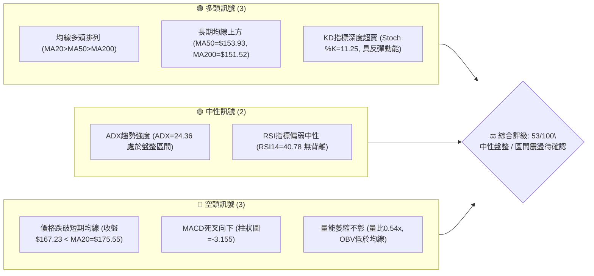
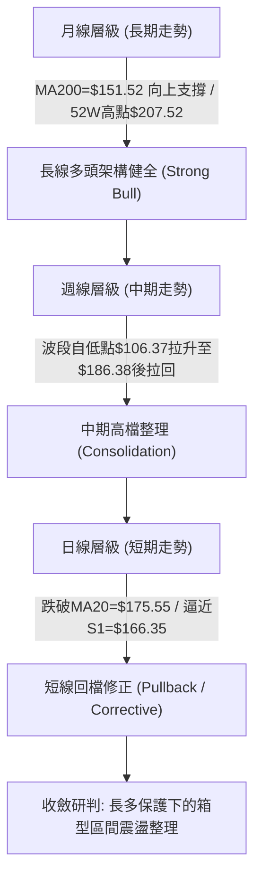
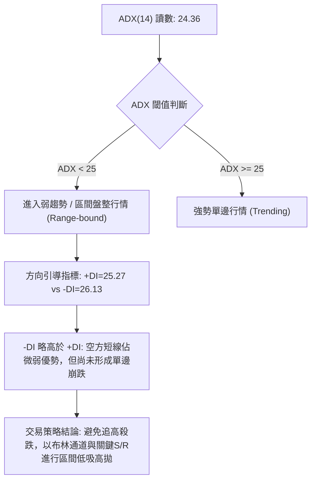
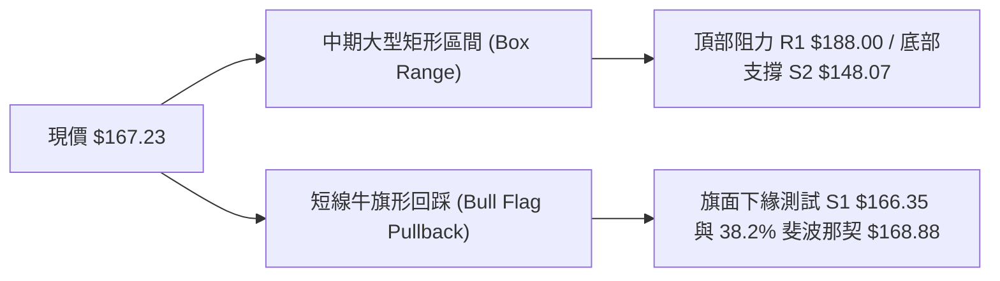
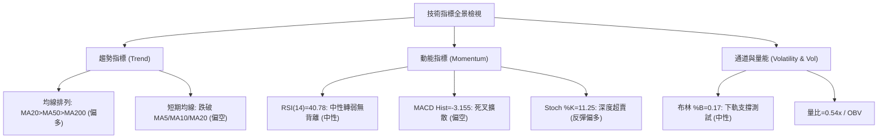
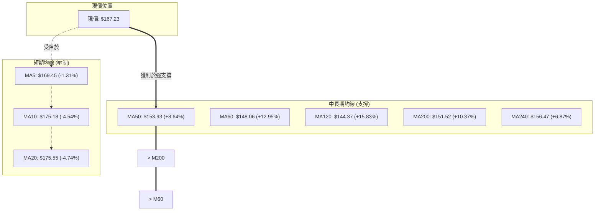
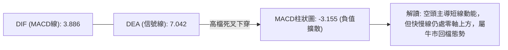
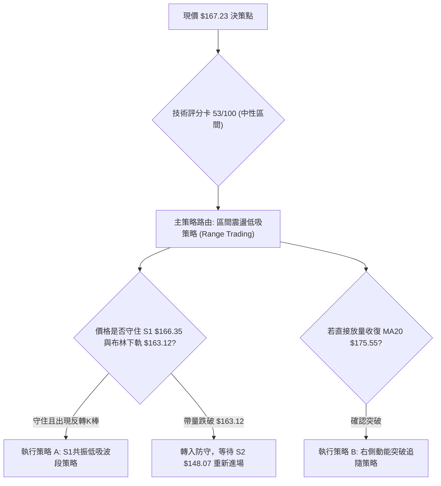
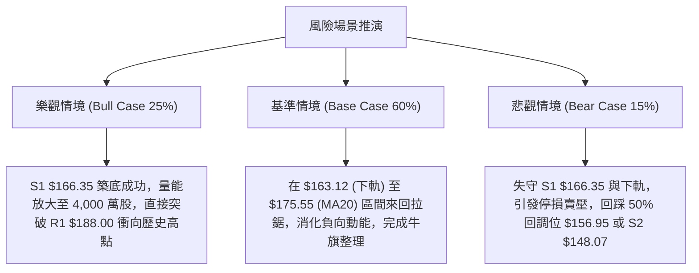

# PLTR 技術分析報告

> **報告日期**：2026-09-14 ｜ **語言**：繁體中文 ｜ **數據來源**：Yahoo Finance ｜ **當前價格**：$167.23

---

## 目錄

| 章節 | 內容 |
|------|------|
| [1. 技術面概覽](#1-技術面概覽) | 訊號儀表板、核心指標、評分卡 |
| [2. 趨勢分析](#2-趨勢分析) | 多時框趨勢、長中短期走勢、12個月ASCII圖 |
| [3. 圖表形態分析](#3-圖表形態分析) | 形態識別、K線組合、形態目標價 |
| [4. 支撐與阻力](#4-支撐與阻力) | 關鍵價位分布、波段高低點聚類、斐波那契回調 |
| [5. 技術指標深度解讀](#5-技術指標深度解讀) | 均線系統、RSI、MACD、布林通道、量能OBV |
| [6. 動能與波動率](#6-動能與波動率) | 動能四象限、ATR波動分析、Beta風險定價 |
| [7. 多時框架總結](#7-多時框架總結) | 時框架評分表、訊號矩陣、多時框收斂結論 |
| [8. 交易策略建議](#8-交易策略建議) | 策略路由、情境階梯、機率分佈、主策略執行 |
| [9. 風險提示與監控](#9-風險提示與監控) | 關鍵監控清單、情境推演、風控紀律 |

---

## 1. 技術面概覽

### 🎯 技術訊號儀表板



---

### 📊 核心指標速覽表

| 指標類別 | 指標名稱 | 當前數值 | 訊號 | 技術解讀 |
|:---|:---|:---:|:---:|:---|
| **價格結構** | 當前收盤價 | **$167.23** | 🟡 | 位於52週區間 60.2%，目前逼近 S1 支撐 $166.35 |
| **短期均線** | MA20 (月線) | **$175.55** | 🔴 | 股價位於 MA20 下方 (-4.74%)，短線承壓回檔 |
| **中期均線** | MA50 (季線) | **$153.93** | 🟢 | 股價位於 MA50 上方 (+8.64%)，中期多頭結構健全 |
| **長期均線** | MA200 (年線) | **$151.52** | 🟢 | 遠高於年線 (+10.37%)，長線牛市格局未破 |
| **動能震盪** | RSI (14) | **40.78** | 🟡 | 位於 40-50 弱勢中性區，未見極端超賣，無背離訊號 |
| **趨勢指標** | MACD (12,26,9)| **-3.155** | 🔴 | MACD線(3.886)低於訊號線(7.042)，柱狀圖持續翻負 |
| **隨機指標** | Stoch %K / %D | **11.25 / 11.20** | 🟢 | 進入極度超賣區（<20），短線存在技術性抽腳反彈契機 |
| **趨勢強度** | ADX (14) | **24.36** | 🟡 | ADX < 25 表明處於無特定單邊方向的盤整震盪行情 |
| **通道位置** | Bollinger %B | **0.17** | 🟡 | 貼近布林下軌 $163.12，通道開口未顯著擴散 |
| **波動風險** | ATR (14) | **$7.64** | 🟡 | 佔股價 4.57%，單日震盪幅度中等，需保留足夠止損緩衝 |

---

### 🏆 技術評分卡

```
╔══════════════════════════════════════════════════════════════════╗
║                技術評分卡 — PLTR (2026-09-14)                   ║
╠══════════════════════════════════════════════════════════════════╣
║ 趨勢強度 (ADX=24.36 震盪)   ██████████░░░░░░░░░░  50/100  🟡 中性 ║
║ 動能指標 (MACD偏空/KD超賣)  ████████░░░░░░░░░░░░  40/100  🔴 偏空 ║
║ 支撐穩定度 (S1=$166.35守衛) ██████████████░░░░░░  70/100  🟢 偏多 ║
║ 成交量配合 (量比0.54x低迷)  ████████░░░░░░░░░░░░  40/100  🔴 偏空 ║
║ 形態完整度 (箱型整理中)     ███████████░░░░░░░░░  55/100  🟡 中性 ║
║ 均線排列 (長均多頭但跌破月) █████████████░░░░░░░  65/100  🟢 偏多 ║
╠══════════════════════════════════════════════════════════════════╣
║ 綜合技術評分                ███████████░░░░░░░░░  53/100  🟡 觀望 ║
╚══════════════════════════════════════════════════════════════════╝
```

---

## 2. 趨勢分析

### 🌐 多時框趨勢分析



---

### 📈 長期趨勢 — 過去 12 個月走勢圖（ASCII）

以下展示 PLTR 從 2025 年 10 月至 2026 年 9 月之月線收盤走勢與關鍵價位映射：

```
PLTR 月線走勢圖（過去12個月）
價格軸 ($)
$210 ┤
$200 ┤  ● (2025-10: $200.47)
$190 ┤                                      ● (2026-08: $186.38)
$180 ┤        ● (2025-12: $177.75)
$170 ┤  ●                                         ● (2026-09現價: $167.23)
$160 ┤        ● (2025-11: $168.45)        ● (2026-05: $156.54)
$150 ┤              ● (2026-01: $146.59)  ● (2026-03: $146.28)
$140 ┤                    ● (2026-02: $137.19)  ● (2026-04: $139.11)
$130 ┤                                            ● (2026-07: $123.06)
$120 ┤                                      ● (2026-06: $116.67波段低點)
$110 ┤
     └─────────────────────────────────────────────────────────────
       10    11    12    01    02    03    04    05    06    07    08    09
     (2025)                                                  (2026)
```

#### 走勢階段特徵深度解析

| 時期 | 價格變動 | 區間特徵 | 關鍵量價特徵解讀 |
|:---|:---:|:---|:---|
| **2025-10 ~ 2026-02** | $200.47 → $137.19 | 獲利了結高檔回檔 (-31.57%) | 創歷史高點 $207.52 後出現多重背離，引發第一波大規模估值修正 |
| **2026-03 ~ 2026-05** | $146.28 → $156.54 | 中繼築底反彈 (+7.01%) | 於 MA120 ($144.37) 與 S2 ($148.07) 附近獲得強力買盤支撐 |
| **2026-06 ~ 2026-07** | $116.67 → $123.06 | 恐慌清洗與打出年度次低點 | 逼近 52W 低點 $106.37 區域，RSI 週線落入 23.7 極端超賣區 |
| **2026-08** | $186.38 | 強勢V型反轉報復性拉升 (+51.45%) | 單週成交量爆出 4.35 億股天量，大舉收復 MA20、MA50、MA200 |
| **2026-09 (當前)** | $167.23 | 衝高回落整固中 (-10.27%) | 於 R1 ($188.00) 遇阻，量能萎縮至 1,538 萬股，測試 S1 ($166.35) |

---

### 📊 中期趨勢（週線分析）

從近 20 週的收盤價與動能變化觀察：
1. **8月爆發段**：2026-08-09 當週以 4.35 億股爆量長紅收於 $172.01，MACD 柱狀圖暴衝至 +4.790，確認了 $123.06 上方的波段底部。
2. **高點受阻段**：2026-08-30 當週收盤 $186.29 觸及波段高點聚類阻力 R1 ($188.00)，週線 RSI 達到 79.0 後形成超買鈍化並拉回。
3. **9月調整段**：過去兩週（09-06 收 $174.33、09-13 收 $167.23），週成交量顯著萎縮至 8,165 萬股，MACD 週柱狀圖轉負至 -3.155。**縮量回調**表明此波修正主要為短線獲利盤兌現與籌碼洗盤，並非主力資金出逃。

---

### ⚡ 趨勢強度評估（ADX 解讀）



#### ADX 強度量化對照表

| 指標名稱 | 當前數值 | 狀態定義 | 技術操作意涵 |
|:---|:---:|:---:|:---|
| **ADX (14)** | **24.36** | 盤整震盪 (<25) | 市場缺乏持續單邊推動力，順勢突破策略易遭遇假突破，應採逆向區間思維 |
| **+DI (14)** | **25.27** | 多方動能衰退 | 相比 8 月高峰明顯滑落，表明多頭推升力道暫時停滯 |
| **-DI (14)** | **26.13** | 空方佔據主導 | 空方微幅領先（差距 0.86），顯示短線空頭掌控節奏，但力量未具壓倒性 |

---

## 3. 圖表形態分析

### 🔍 形態識別系統

依據形態學定義與當前 OHLCV 價格結構，識別出的形態如下：



#### 形態信心度與目標價評估

| 形態類別 | 信心度 | 判斷依據（引用精確數據） | 完成度 | 測算目標價（附計算式） |
|:---|:---:|:---|:---:|:---|
| **高檔牛旗回踩 (Bull Flag)** | **65%** | 8月自 $123.06 飆升至 $186.29 構成旗桿；9月連續兩週量縮回檔至 $167.23，回踩 38.2% 回調位 | 70% | **目標價一: $188.00 (R1)**<br>**目標價二: $207.52 (R3)**<br>計算式: 現價 $167.23 + 旗桿高度($186.29-$123.06=$63.23)之0.618倍 = $206.30 (貼近 R3 $207.52) |
| **中期箱型整理 (Rectangle Box)** | **75%** | 上軌阻力聚集於波段高點聚類 R1 ($188.00)，下軌支撐受守於波段低點聚類 S2 ($148.07) | 85% | **箱型頂部目標: $188.00 (R1)**<br>箱體震盪幅度 = $188.00 - $148.07 = $39.93<br>若向下假跌破則看 S2 $148.07 |
| **頭肩底形態** | **35%** | 左肩 $137.19，頭部 $116.67，右肩尚未明確成形 | 30% | *訊號不足，信心度低於50%，僅做指標型區間解讀* |

---

### 🕯️ 重要 K 線形態分析

| 觀測週期 | 收盤價 | K 線組合特徵 | 市場心理學解讀 | 多空訊號 |
|:---|:---:|:---|:---|:---:|
| **2026-08 (月線)** | $186.38 | **爆量大陽線 (Marubozu)** | 主力機構單月暴力掃盤建倉，徹底扭轉前季頹勢，確立長牛底線 | 🟢 強多 |
| **2026-09 (月線迄今)**| $167.23 | **縮量陰孕線 (Inside Bar)** | 消化 8 月獲利籌碼，未跌破 8 月實體中軸 ($154.72)，屬良性蓄勢 | 🟡 中性偏弱 |
| **2026-09-06 (週線)** | $174.33 | **高檔吊頸小黑K** | 於 R1 ($188.00) 前遇阻回落，短線獲利盤湧出 | 🔴 短空 |
| **2026-09-13 (週線)** | $167.23 | **縮量下影陰線** | 下測 S1 ($166.35) 獲得承接，成交量劇降至 8,165 萬股，空方動能耗盡 | 🟢 止跌初顯 |

---

### 📉 ASCII 走勢形態示意圖

```
PLTR 高檔牛旗整理與箱型結構圖
$190 ┤              [旗桿頂部] ● $186.29 ─ ─ ─ ─ ─ ─ ─ ─ ─ ─ ─ ─ ─ (R1 $188.00 強阻力)
$185 ┤                        \
$180 ┤                         \ [旗面整理通道]
$175 ┤                          ● $174.33 (MA20阻力 $175.55)
$170 ┤                           \
$165 ┤                            ● 現價 $167.23 ◄── [正在測試 S1 $166.35]
$160 ┤                                           [布林下軌 $163.12 護盤]
$155 ┤
$150 ┤                                           (MA50 $153.93 / S2 $148.07)
$120 ┤   ● $123.06 [旗桿起點]
     └─────────────────────────────────────────────────────────────
```

---

## 4. 支撐與阻力

### 🗺️ 關鍵價位分布圖（ASCII）

```
PLTR 價位結構分布圖 (單位: USD)
══════════════════════════════════════════════════════════════════
$207.52 ║████████████████████████████████████████║ 歷史極值/52W最高點 (R3)
$198.88 ║████████████████████████████████        ║ 次級強阻力聚類 (R2)
$188.00 ║████████████████████████████████████████║ 近期波段高點/布林上軌阻力 (R1)
$175.55 ║----------------------------------------║ 動態阻力 (MA20 / 布林中軌)
$167.23 ╠════════════════════════════════════════╣ ◄ 當前收盤價 ($167.23)
$166.35 ║▓▓▓▓▓▓▓▓▓▓▓▓▓▓▓▓▓▓▓▓▓▓▓▓▓▓▓▓▓▓▓▓▓▓▓▓▓▓▓║ 近期波段低點關鍵防線 (S1)
$163.12 ║----------------------------------------║ 動態支撐 (布林通道下軌)
$148.07 ║████████████████████████████████████████║ 中期波段強支撐/密集換手區 (S2)
$136.30 ║████████████████████████                ║ 長期結構防守底線 (S3)
══════════════════════════════════════════════════════════════════
```

---

### 🚧 阻力位分析表

所有價位均嚴格引用自近一年波段高點聚類計算數值：

| 阻力級別 | 精確價位 | 距離現價空間 | 形成原因與籌碼結構 | 突破難度 | 重要性權重 |
|:---|:---:|:---:|:---|:---:|:---:|
| **R1** | **$188.00** | +12.42% | 近一年波段高點聚類、布林通道上軌 ($187.99) 重疊區 | 🟡 中等 | ★★★★☆ |
| **R2** | **$198.88** | +18.93% | 2025年10月月線收盤高點 ($200.47) 前之密集籌碼解套區 | 🔴 較高 | ★★★★☆ |
| **R3** | **$207.52** | +24.09% | 52週歷史最高點、斐波那契 0.0% 極限阻力位 | 🔴 極高 | ★★★★★ |

---

### 🛡️ 支撐位分析表

所有價位均嚴格引用自近一年波段低點聚類計算數值：

| 支撐級別 | 精確價位 | 距離現價空間 | 形成原因與籌碼結構 | 守住機率 | 重要性權重 |
|:---|:---:|:---:|:---|:---:|:---:|
| **S1** | **$166.35** | -0.53% | 近一年波段低點聚類、貼近斐波那契 38.2% 回調位 ($168.88) | 70% | ★★★★☆ |
| **S2** | **$148.07** | -11.46% | 近一年波段低點聚類、鄰近 MA60 ($148.06) 與 MA50 ($153.93) | 85% | ★★★★★ |
| **S3** | **$136.30** | -18.50% | 2026年4月波段低點聚類，長期多頭強防守點 | 95% | ★★★★★ |

---

### 📐 斐波那契回調位分析

依據 52 週絕對區間（低點 **$106.37** → 高點 **$207.52**，總落差 **$101.15**）計算標準黃金分割回調位：

```
0.0%  (52W High)  $207.52 ──────────────────────────────────────────
23.6%             $183.65 ──────────────────────────────────────────
38.2%             $168.88 ─────────── ◄ 現價 $167.23 緊貼於此 (極關鍵分水嶺)
50.0%             $156.95 ────────────────────────────────────────── (強支撐中樞)
61.8%             $145.01 ────────────────────────────────────────── (黃金分割生命線)
78.6%             $128.02 ──────────────────────────────────────────
100.0%(52W Low)   $106.37 ──────────────────────────────────────────
```

#### 技術解讀
*   **現價落點**：現價 **$167.23** 位於 **38.2% ($168.88)** 與 **50.0% ($156.95)** 回調區間內，且僅距 38.2% 水平約 1.65 美元。
*   **支撐共振**：S1 波段低點聚類 **$166.35** 與 38.2% 回調位 **$168.88** 形成強大的**價格共振緩衝帶 ($166.35 - $168.88)**。在強勢多頭修正波中，38.2% 通常是淺度拉回的極限防守位；若能在此帶止跌收紅，多頭將迅速發起二次上攻。
*   **下行風險測算**：若實體跌破 $166.35，下方第一承接點為 50.0% 回調位 **$156.95**（該位置同時受到 MA240 $156.47 與 MA50 $153.93 托底）。

---

## 5. 技術指標深度解讀

### 🎛️ 指標訊號總覽



---

### 📈 移動平均線排列分析



#### 均線矩陣詳細狀態

| 均線名稱 | 當前價格 | 與現價偏離度 | 排列狀態 | 技術意涵 |
|:---|:---:|:---:|:---:|:---|
| **MA5** | $169.45 | -1.31% | 空頭壓制 | 極短線第一道反壓，未收復前短線維持疲弱 |
| **MA10** | $175.18 | -4.54% | 空頭壓制 | 與 MA20 形成雙重反壓帶 ($175.18 - $175.55) |
| **MA20** | $175.55 | -4.74% | 空頭壓制 | 短期生命線，股價回落其下象徵短線進入修正期 |
| **MA50** | $153.93 | +8.64% | 多頭支撐 | 中期多頭保護線，上升斜率維持正向 |
| **MA60** | $148.06 | +12.95% | 多頭支撐 | 與波段支撐 S2 ($148.07) 完美重疊，具銅牆鐵壁效應 |
| **MA120**| $144.37 | +15.83% | 多頭支撐 | 半年線，中期上升趨勢基石 |
| **MA200**| $151.52 | +10.37% | 多頭支撐 | 年線牛熊分水嶺，MA20 > MA50 > MA200 維持標準多頭結構 |
| **MA240**| $156.47 | +6.87% | 多頭支撐 | 長期成本線，提供實質價值托底 |

---

### 📉 RSI(14) 分析

*   **RSI(14) 數值**：**40.78**
*   **指標進度條**：
    `[ 0 ] ████████████████░░░░░░░░░░░░░░░░ [ 100 ]` (40.78% — 弱勢中性區)
*   **超買超賣判定**：數值位於 30 至 70 之常態區間內，未觸及 30 極端超賣，但已跌破 50 多空分水嶺，表明多方動能正在減退。
*   **背離檢驗**：
    *   *頂背離檢定*：8月高點 $186.38 時 RSI 為 79.0，隨後價格拉回，RSI 亦同步下降，無指標與價格之頂背離。
    *   *底背離檢定*：當前價格逼近 S1 ($166.35)，RSI 為 40.78，尚未創出比 6 月底更低之讀數，目前**無明顯頂背離或底背離**現象。

---

### 📊 MACD(12, 26, 9) 訊號解讀



*   **指標結構**：MACD 線 (3.886) 低於 Signal 線 (7.042)，柱狀圖讀數為 **-3.155**，呈現空頭排列。
*   **零軸關係**：雙線均處於 0 軸上方，這在技術分析中被定義為**「多頭市場中的良性回檔」**。歷史數據表明，當 DIF 仍大於 0 時出現的死叉，多以箱型震盪洗盤方式化解，直接轉化為崩盤的機率偏低。

---

### 📦 布林通道分析 (Bollinger Bands)

```
布林通道與價格相對位置 (參數 20, 2)
$187.99 ┬────────────────────────────────────────── BB 上軌 (阻力 R1 $188.00 附近)
        │
$175.55 ┼────────────────────────────────────────── BB 中軌 (MA20 壓制線)
        │
$167.23 ┼─► [現價 $167.23] (%B = 0.17，逼近下軌)
$163.12 ┴────────────────────────────────────────── BB 下軌 (動態超賣支撐)
```

*   **通道參數與數值**：
    *   **上軌**：$187.99
    *   **中軌 (MA20)**：$175.55
    *   **下軌**：$163.12
    *   **帶寬比 (Bandwidth)**：($187.99 - $163.12) / $175.55 = **14.17%**（帶寬收窄後維持穩定，無顯著單向爆發張嘴跡象）。
*   **%B 指標解讀**：%B 當前值為 **0.17**，股價已高度貼近下軌（0 代表下軌，0.5 代表中軌）。當 %B < 0.20 且伴隨成交量顯著萎縮時，通常觸發布林通道的均值回歸買盤（Mean Reversion）。

---

### 💹 成交量分析（量價配合度）

*   **量能萎縮現象**：
    *   最新成交量：**15,383,200 股**
    *   20日均量：**28,623,505 股**
    *   **量比 (Volume Ratio)**：**0.54x**（成交量急縮至均量約一半）
*   **OBV (能量潮指標)**：
    *   當前 OBV 低於其移動平均線 (OBV < MA)，顯示資金處於淨流出觀望狀態。
    *   **量價背離分析**：價格由 $186.29 回跌至 $167.23 過程中，成交量同步由 1.5 億股/週急縮至 8,165 萬股/週。呈現標準的**「價跌量縮」**良性格局，未出現機構拋售的恐慌放量（Panic Selling），表明賣壓已接近衰竭。

---

## 6. 動能與波動率

### ⚡ 動能評估四象限

| 象限 | 動能維度 (Momentum) | 波動率維度 (Volatility) | PLTR 當前定位狀態 | 戰略操作指引 |
|:---:|:---:|:---:|:---:|:---|
| **Q1** | 強動能 (Bullish) | 低波動 (Low Vol) | — | 最佳主升浪買點 |
| **Q2** | **弱動能 (Bearish/Neutral)** | **低波動 (Low Vol)** | **✓ (PLTR 當前位置)** | **高勝率區間低吸 / 觀望蓄勢待發** |
| **Q3** | 強動能 (Bullish) | 高波動 (High Vol) | — | 趨勢突破追價（高風險高收益） |
| **Q4** | 弱動能 (Bearish) | 高波動 (High Vol) | — | 恐慌崩跌（嚴禁盲目抄底） |

*   **定位邏輯**：ADX(14)=24.36 確立低波動盤整（Low Vol），MACD 柱為負且 RSI=40.78 確立短線動能偏弱（Weak Momentum），因此 PLTR 處於典型之 **Q2 象限**。此階段策略首重「耐性」，以支撐防守位為進場邊界。

---

### 📊 ATR 波動率分析

*   **ATR(14) 讀數**：**$7.64**
*   **ATR 佔比**：$7.64 / $167.23 = **4.57%**
*   **波動率解讀**：PLTR 單日平均波動約 7.64 美元，屬於成長型科技股中偏高之活躍品種。
*   **風控止損應用**：
    *   *短線交易止損緩衝 (1.0 × ATR)*：$7.64
    *   *波段交易止損緩衝 (1.5 × ATR)*：$11.46
    *   *S1 支撐實質跌破判定點*：$166.35 - 0.5×ATR($3.82) = **$162.53**（與布林下軌 $163.12 高度吻合）。

---

### 📐 Beta 與市場相關性

*   **Beta 係數**：**1.621**
*   **市場敏感度**：PLTR 之波動彈性為標普 500 指數的 1.62 倍。在市場出現反彈時具備極高之上行 Beta 槓桿，但在大盤震盪時亦承受較高的回撤壓力。
*   **機構籌碼結構**：機構持股達 64.7%，內部人持股 3.5%，空頭籌碼佔流通盤僅 3.0% (Short Ratio 1.44 天)，顯示市場並無大規模做空機構壓制，籌碼面整體偏向良性。

---

## 7. 多時框架總結

### 📋 時框架評分表

| 時框架 | 趨勢方向 | 動能狀態 | 均線排列 | 關鍵技術形態 | 綜合評分 | 操作建議 |
|:---|:---:|:---:|:---:|:---|:---:|:---|
| **短期 (日線)** | 🔴 偏空修正 | RSI 40.78 / KD 超賣 | 跌破 MA20 | 測試 S1 $166.35 支撐 | **42/100** | 停止追空，尋找止跌訊號 |
| **中期 (週線)** | 🟡 高檔震盪 | MACD 柱翻負 / 縮量 | 站穩 MA50 | 牛旗回踩 38.2% 斐波那契 | **60/100** | 區間操作，回踩支撐低吸 |
| **長期 (月線)** | 🟢 多頭主升 | 均線系統完整多頭排列 | MA20>50>200 | 歷史高位突破後回踩整固 | **78/100** | 長線堅定持股，逢低加碼 |

---

### 🔲 綜合訊號矩陣

| 評估維度 | 短期視角 (1-5天) | 中期視角 (2-8週) | 長期視角 (3-12月) | 維度一致性解讀 |
|:---|:---:|:---:|:---:|:---|
| **趨勢主導權** | 空方微幅領先 (-DI>+DI) | 多空拉鋸 (箱體震盪) | 多方完全掌控 (牛市) | 中長期多頭壓制短期空頭深度 |
| **成交量行為** | 極度量縮 (量比0.54x) | 突破爆量後縮量洗盤 | 年均量能充沛推升 | 典型的蓄勢整理特徵 |
| **關鍵價位博弈** | S1 ($166.35) 攻防 | 布林通道上下軌震盪 | S2 ($148.07) 之上安全 | 下檔支撐密集，防禦縱深足夠 |

---

### ⚖️ 多時框收斂結論（依嚴格規則 14 執行）

1.  **市場機制判定**：當前 ADX(14) 讀數為 **24.36 (< 25)**，嚴格判定為**「盤整震盪行情（Range-bound Regime）」**。
2.  **時框權重收斂**：根據多時框收斂優先級規則，在盤整行情下，**以日線布林通道區間（$163.12 - $187.99）及關鍵支撐阻力為核心交易基準**，同時中期趨勢（MA50 $153.93、MA200 $151.52 多頭排列）為下檔提供堅實防禦。
3.  **唯一方向性結論**：**【🟡 中性觀望 / 區間下軌低吸】**。短線技術指標雖偏弱，但隨機指標 Stoch 超賣且逼近共振支撐帶，不宜在當前點位盲目看空，應採取「依託 S1 支撐帶逢低布局、等待右側放量突破」之策略。

---

## 8. 交易策略建議

### 🗺️ 策略決策流程圖



---

### 🧭 策略路由（依評分卡分流）

> **當前主策略方向 = 🟡 區間低吸操作（依技術評分 53/100，處於 40–60 中性區間，以布林下軌與 S1 支撐低吸為主，嚴禁追價）**

---

### 🎯 價格情境階梯（Price Scenarios）

價位嚴格引用自第 4 章數據：

| 觸發條件 | 下一目標價 | 後續延伸目標 | 情境技術含義與應對 |
|:---|:---:|:---:|:---|
| **向上突破 R1 $188.00** | **R2 $198.88** | **R3 $207.52** | 短線整理結束，重啟歷史高點主升浪衝擊 |
| **收復 MA20 $175.55** | **R1 $188.00** | **R2 $198.88** | 短線轉強，空頭訊號化解，空單全數停損 |
| **現價 $167.23 企穩** | **MA20 $175.55** | **R1 $188.00** | 於布林下軌展開均值回歸，區間震盪反彈 |
| **向下跌破 S1 $166.35** | **布林下軌 $163.12**| **S2 $148.07** | 短線回調加深，向下回踩 50% 斐波那契 $156.95 |
| **有效跌破 S2 $148.07** | **S3 $136.30** | — | 中期多頭趨勢遭到破壞，進入深度熊市回撤 |

---

### 📊 情境機率分佈

| 情境路線 | 機率評估 | 主要技術指標依據 |
|:---|:---:|:---|
| **情境一：支撐企穩反彈** | **55%** | Stoch 超賣 (%K=11.25)、量比急縮至 0.54x 顯示賣壓竭盡、38.2% 斐波那契 ($168.88) 與 S1 ($166.35) 雙重托底 |
| **情境二：箱型弱勢震盪** | **30%** | ADX=24.36 缺乏動能、MACD 柱狀圖仍為負值 (-3.155)、布林中軌 MA20 ($175.55) 反壓沉重 |
| **情境三：破位向下修正** | **15%** | 跌破 S1 誘發技術性停損單，進一步回踩 MA50 ($153.93) 或 S2 ($148.07) |

---

### 🟢 主策略詳情（依路由執行）

```
╔══════════════════════════════════════════════════════════════════╗
║                   主推策略配置清單 (雙軌制)                      ║
╚══════════════════════════════════════════════════════════════════╝
```

| 策略要素 | 策略 A（左側：S1 共振低吸策略） | 策略 B（右側：突破確認追隨策略） |
|:---|:---|:---|
| **進場條件** | 現價或回踩 S1 不破，分批掛單 | 放量突破並日線收盤站穩 MA20 |
| **進場價格** | **$166.50** (貼近 S1 $166.35) | **$176.00** (突破 MA20 $175.55) |
| **第一目標 (T1)** | **$175.55** (布林中軌 / MA20) | **$188.00** (關鍵阻力 R1) |
| **第二目標 (T2)** | **$188.00** (關鍵阻力 R1) | **$198.88** (次級強阻力 R2) |
| **嚴格止損價** | **$162.50** (跌破布林下軌 $163.12) | **$169.45** (跌破短期均線 MA5) |
| **風險報酬比 (R:R)**| **1 : 2.87** (風險 $4.00 / 獲利 $11.50 至 T2)| **1 : 1.83** (風險 $6.55 / 獲利 $12.00 至 T1)|
| **歷史勝率估算** | **65%** | **60%** |
| **建議配置倉位** | **15% 總資金** | **10% 總資金** |

---

### 🔴 反向風險觸發點（對沖與風控提示）

若出現以下訊號，代表多頭結構遭破壞，原主策略全面失效，多單需果斷停損：
1.  **跌破防守底線**：日線收盤價**實體跌破 $163.12**（布林通道下軌）且成交量放大至 3,000 萬股以上。
2.  **均線死叉惡化**：MA5 ($169.45) 進一步下穿下方的 MA60/MA120 系統。
3.  **避險對沖措施**：若持股部位大，當價格跌破 $166.35 時，可買入以 S2 ($148.07) 為目標之 Put 選擇權進行部位保護。

---

### ⭐ 整體訊號強度評星

```
做多訊號強度：★★★☆☆  (3.0/5星 - 長線多頭底蘊在，短線待止跌確認)
做空訊號強度：★★☆☆☆  (2.0/5星 - 賣壓已極度萎縮，盈虧比不佳)
指標可信程度：★★★★☆  (4.0/5星 - 成交量萎縮與價格共振結構清晰)
```

---

## 9. 風險提示與監控

### ✅ 關鍵監控指標 Checklist

```
╔══════════════════════════════════════════════════════════════════╗
║                   交易員每日盤面監控清單                         ║
╠══════════════════════════════════════════════════════════════════╣
║ [ ] 價位監控：收盤是否守穩波段低點聚類 S1 ($166.35)             ║
║ [ ] 價位監控：反彈是否帶量收復短期生命線 MA20 ($175.55)          ║
║ [ ] 動能監控：Stoch %K 是否向上金叉 %D 脫離超賣區 (<20)          ║
║ [ ] 動能監控：MACD 負柱狀圖 (-3.155) 是否開始出現收斂縮短        ║
║ [ ] 量能監控：單日成交量是否回升至 20 日均量 (2,862 萬股) 以上    ║
║ [ ] 波動監控：ATR 是否由 $7.64 出現異常放大 (> $10.00)          ║
╚══════════════════════════════════════════════════════════════════╝
```

---

### ⚠️ 風險場景分析



---

### 🛡️ 風險管理重要提醒

1.  **嚴格執行資金管理**：由於 PLTR 的 Beta 高達 1.621，且 ATR 佔比達 4.57%，單筆交易虧損額度必須嚴格控制在總投資帳戶資產的 **1.0% - 1.5%** 以內。
2.  **避免情緒化追單**：ADX 處於 24.36 盤整區間，任何盤中急拉均容易因動能不足而回吐，嚴禁在價格逼近 MA20 ($175.55) 時市價追多，必須採取回調關鍵支撐分批掛單方式。
3.  **大盤聯動性風險**：科技軟體板塊近期受總體經濟利率預期擾動較大，需密切關注納斯達克指數是否同步出現頂部反轉。

---

## 📋 報告總結

```
╔══════════════════════════════════════════════════════════════════╗
║                  PLTR 技術分析報告總結                          ║
╠══════════════════════════════════════════════════════════════════╣
║ 報告日期：2026-09-14                                             ║
║ 當前價格：$167.23                                                ║
║ 分析評級：⚖️ 53/100 (中性觀望 / 區間震盪低吸)                    ║
║                                                                  ║
║ 關鍵趨勢研判：                                                   ║
║ ├─ 長期趨勢：🟢 強烈多頭 (MA200=$151.52 斜率向上，長牛未改)     ║
║ ├─ 中期趨勢：🟡 高檔箱型整固 (於 $188.00 至 $148.07 區間蓄勢)    ║
║ ├─ 短期趨勢：🔴 縮量回檔 (承壓於 MA20=$175.55，測試下檔支撐)     ║
║ ├─ 關鍵支撐：S1: $166.35 ｜ S2: $148.07 ｜ S3: $136.30          ║
║ ├─ 關鍵阻力：R1: $188.00 ｜ R2: $198.88 ｜ R3: $207.52          ║
║ └─ 分析師目標共識：均價 $195.73 (隱含 +17.04% 空間)              ║
║                                                                  ║
║ 最優策略組合：                                                   ║
║ 1. 🥇 最佳機會：依託 S1 $166.35 與 38.2% 斐波那契 $168.88 分批低吸║
║ 2. 🥈 次選機會：靜待帶量突破 MA20 $175.55 後執行右側動能追隨     ║
║ 3. 🥉 保守選擇：空倉觀望，待 KD 指標黃金交叉且出現日線底分型再介入║
╚══════════════════════════════════════════════════════════════════╝
```

---

> ⚠️ **免責聲明**：本報告為技術分析專用模型基於歷史價量數據（OHLCV）自動演算生成，所載之價位測算、技術指標解讀及交易策略**僅供研究、學術討論與風險控制參考**，**絕不構成任何形式的要約、招攬或投資操作建議**。金融市場瞬息萬變，技術分析存在滯後性與失效風險，投資人應獨立評估財務狀況並自負盈虧。

---
*報告生成時間：2026-09-14 ｜ 數據來源：Yahoo Finance ｜ 分析框架：多時框架技術量化系統*