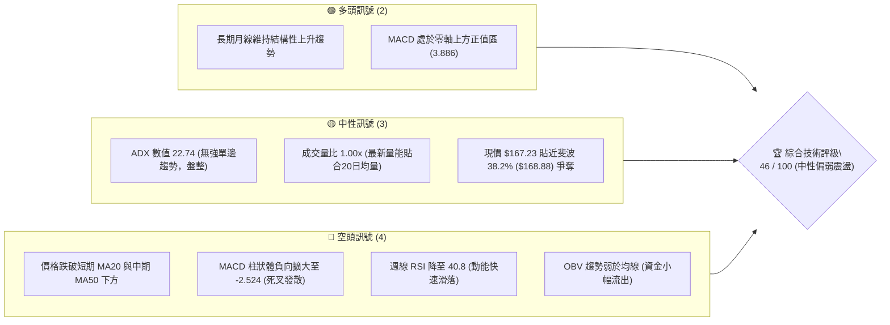
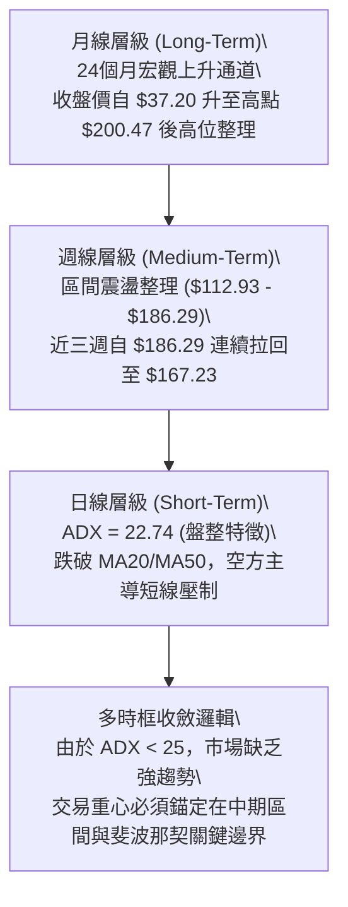
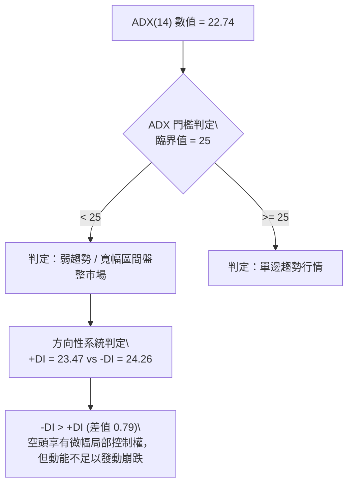
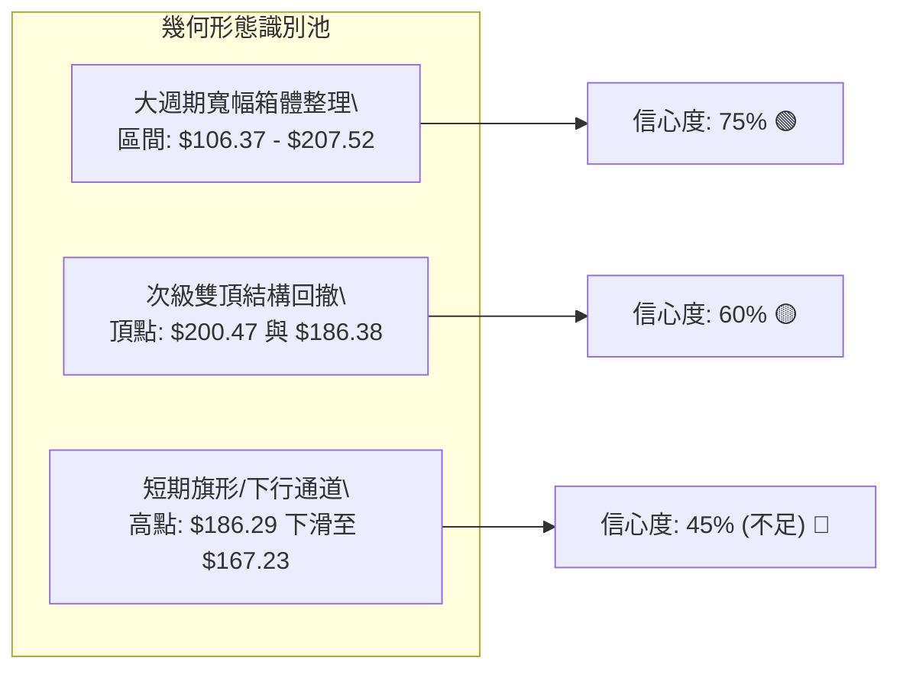
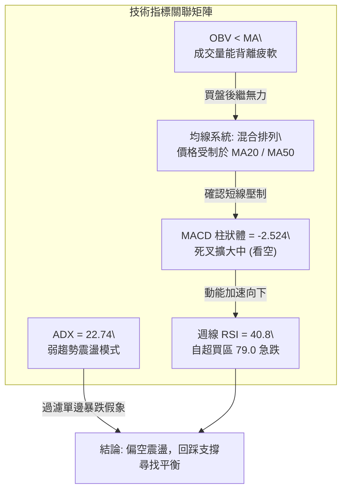
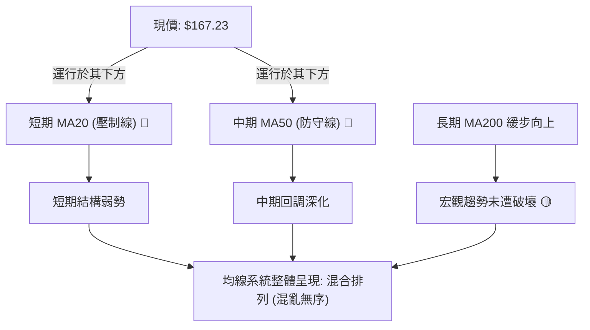
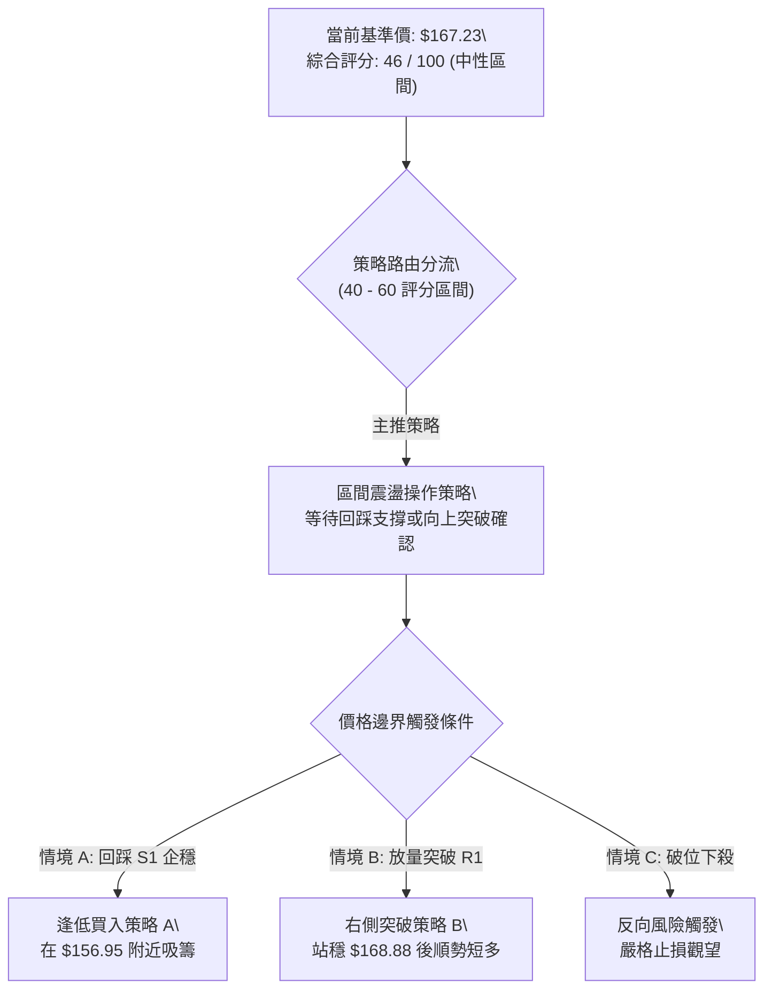
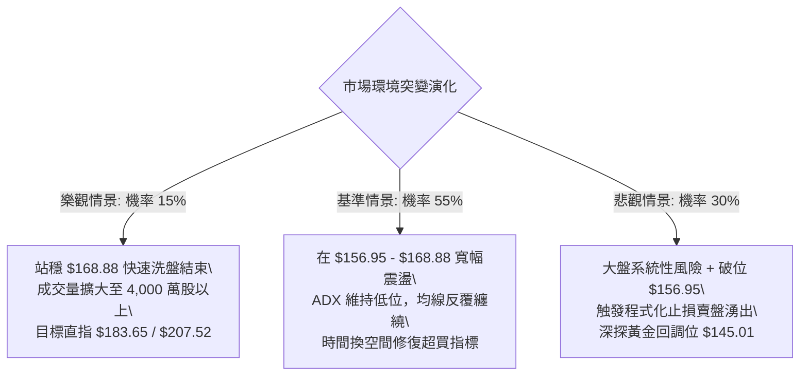

# PLTR 技術分析報告

> **報告日期**：2026-09-15 ｜ **語言**：繁體中文 ｜ **數據來源**：Yahoo Finance ｜ **當前價格**：$167.23（基準收盤價）

---

## 目錄

| 章節 | 內容 |
|------|------|
| [1. 技術面概覽](#1-技術面概覽) | 訊號儀表板、核心指標、評分卡 |
| [2. 趨勢分析](#2-趨勢分析) | 多時框趨勢、長中短期走勢、ADX解讀 |
| [3. 圖表形態分析](#3-圖表形態分析) | 形態識別、信心度評估、K線組合 |
| [4. 支撐與阻力](#4-支撐與阻力) | 關鍵價位、斐波那契回調結構 |
| [5. 技術指標深度解讀](#5-技術指標深度解讀) | 均線、RSI、MACD、布林通道、量價 |
| [6. 動能與波動率](#6-動能與波動率) | 動能矩陣、ATR波動性、Beta關聯 |
| [7. 多時框架總結](#7-多時框架總結) | 時框架評分矩陣、多時框收斂結論 |
| [8. 交易策略建議](#8-交易策略建議) | 策略路由、情境階梯、主策略與風控 |
| [9. 風險提示與監控](#9-風險提示與監控) | 監控Checklist、極端情境、防禦措施 |
| [📋 報告總結](#-報告總結) | 全景技術評估與操作優先級總結 |

---

## 1. 技術面概覽

### 🎯 技術訊號儀表板



### 📊 核心指標速覽表

| 指標類別 | 指標名稱 | 當前數值 | 訊號 | 解讀 |
|:---|:---|:---|:---:|:---|
| **價格基準** | 當前收盤價 | $167.23 | 🟡 | 位於52週高點 $207.52 與低點 $106.37 之間，接近 38.2% 回調位 |
| **均線系統** | MA20 | 下方 (N/A) | 🔴 | 價格運行於 20 日均線下方，短期結構受均線壓制 |
| **均線系統** | MA50 | 下方 (N/A) | 🔴 | 跌破 50 日均線關鍵防線，中期回調壓力加劇 |
| **均線系統** | MA200 | 混合排列 | 🟡 | 均線長週期呈現上升弧度，但短中長出現交織混合排列 |
| **動能趨勢** | RSI(14) | 40.8 (週線) | 🟡 | 自 8 月高點 79.0 快速回落至中性偏弱區，尚未進入超賣區 (<30) |
| **動能趨勢** | MACD (12,26,9) | 3.886 / 6.411 | 🔴 | 快線低於慢線，柱狀體為 -2.524，日週級別同步處於修正階段 |
| **趨勢強度** | ADX(14) | 22.74 | 🟡 | 數值小於 25，確認市場處於無明顯單邊趨勢之寬幅盤整週期 |
| **多空力量** | +DI / -DI | 23.47 / 24.26 | 🔴 | -DI 向上微幅壓制 +DI，空頭在盤整區間內佔據微弱主動權 |
| **成交量能** | 量比 / OBV | 1.00x / OBV<MA | 🔴 | 20日均量持平但50日均量下降，OBV低於移動平均，買盤動能衰竭 |

### 🏆 技術評分卡

```
╔══════════════════════════════════════════════════════════════╗
║              PLTR 技術評分卡 (2026-09-15)                    ║
╠══════════════════════════════════════════════════════════════╣
║ 趨勢強度 (ADX/方向)   ████████░░░░░░░░░░░░  42/100  🟡 弱勢盤整 ║
║ 動能指標 (RSI/MACD)  ███████░░░░░░░░░░░░░  35/100  🔴 死叉回調 ║
║ 支撐穩定度 (斐波位)   ███████████░░░░░░░░░  55/100  🟡 考驗支撐 ║
║ 成交量配合 (OBV/量比) ████████░░░░░░░░░░░░  40/100  🔴 量能退潮 ║
║ 形態完整度 (箱體/通道) ████████████░░░░░░░░  60/100  🟡 區間震盪 ║
║ 均線排列 (短中長期)   █████████░░░░░░░░░░░  45/100  🔴 均線反壓 ║
╠══════════════════════════════════════════════════════════════╣
║ 綜合技術評分          █████████░░░░░░░░░░░  46/100  中性偏弱   ║
╚══════════════════════════════════════════════════════════════╝
```

---

## 2. 趨勢分析

### 🌐 多時框趨勢分析



### 📈 長期趨勢 — 12個月走勢圖（Unicode）

以下為 PLTR 過去 12 個月（2025-10 至 2026-09）之收盤價 ASCII 軌跡圖，明確標記出歷史波段頂部、底部與當前回撤定位：

```
PLTR 月線走勢圖（過去12個月：2025-10 至 2026-09）
價格 ($)
$205 ┤      ● $200.47 (2025-10 階段頂部)
$190 ┤                                         ● $186.38 (2026-08 次高點)
$175 ┤           ● $168.45  ● $177.75                      ● $167.23 (當前收盤)
$160 ┤                                     ● $156.54
$145 ┤                         ● $146.59       ● $146.28
$130 ┤                              ● $137.19       ● $139.11
$115 ┤                                                  ● $116.67 (2026-06 波段低點)
$100 ┤                                                       ● $106.37 (52W最低)
     └──────┬────┬────┬────┬────┬────┬────┬────┬────┬────┬────┬────
           10月 11月 12月 01月 02月 03月 04月 05月 06月 07月 08月 09月
           (2025)                                       (2026)
```

#### 走勢特徵分析表格

| 階段週期 | 時間區間 | 起止價格 | 漲跌幅度 | 核心技術結構與量價特徵 |
|:---|:---|:---|:---:|:---|
| **衝頂回落期** | 2025-10 ~ 2025-11 | $200.47 → $168.45 | -15.97% | 觸及 52 週高位區間 $207.52 後長陰回吐，創下歷史級流動性釋放 |
| **寬幅打底期** | 2025-12 ~ 2026-05 | $177.75 → $156.54 | -11.93% | 於 $137.19 - $177.75 區間構築對稱三角形與箱體震盪 |
| **二次探底期** | 2026-06 ~ 2026-07 | $116.67 → $123.06 | -21.40% | 砸出 52 週低點 $106.37 後迅速回升，月線級別完成下影線測試 |
| **多頭反撲期** | 2026-07 ~ 2026-08 | $123.06 → $186.38 | +51.45% | 週成交量爆發至 4.35 億股，強力向上填補前期阻力缺口 |
| **當前回撤期** | 2026-08 ~ 2026-09 | $186.38 → $167.23 | -10.27% | 觸及斐波 23.6% ($183.65) 阻力受阻，回吐至 38.2% ($168.88) 下方 |

### 📊 中期趨勢（週線分析）

近 20 週收盤走勢顯示，PLTR 正在經歷顯著的「爆發後降溫」過程：
1. **2026-08-09 突破波段**：單週成交量高達 435,164,800 股，推升股價由 $123.06 暴衝至 $172.01，MACD 柱狀體達到高峰 +4.790，RSI 升至 70.0。
2. **2026-08-30 頂部停滯**：週收盤達 $186.29，但 MACD 柱狀體縮窄至 +0.177，週成交量降至 153,397,700 股，呈現典型「量價頂部背離」。
3. **2026-09-06 至 2026-09-13 連續回調**：最新週收盤降至 $167.23，週成交量大幅萎縮至 81,680,200 股，MACD 柱狀體翻負並擴大至 -3.155，週線 RSI 驟降至 40.8。

```
週線支撐壓力結構示意：
$186.29 ─────── 近期波段高點（強阻力）
           ▲
           │ 回調區間 (-10.23%)
           ▼
$167.23 ═══════ 當前週線收盤（考驗 $168.88 斐波位）
           │
           ▼
$156.95 ─────── 50.0% 斐波那契關鍵防守線（波段生死線）
```

### ⚡ 趨勢強度評估（ADX 解讀）



#### ADX 強度指標對照分析表

| 指標變數 | 當前讀數 | 門檻區間 | 技術含義解讀 | 操作指導原則 |
|:---|:---:|:---:|:---|:---|
| **ADX(14)** | **22.74** | 20 - 25 之間 | 趨勢衰竭，價格波動由單邊推升轉入均值回歸與邊界震盪 | 禁用順勢突破策略，改採邊界高拋低吸 |
| **+DI (14)** | **23.47** | 參考值 | 多方攻擊動能自 8 月底顯著消退，追高買盤意願降溫 | 暫緩在阻力位附近追多 |
| **-DI (14)** | **24.26** | 參考值 | 空方佔據相對微弱優勢，未形成 >30 之恐慌性拋壓 | 逢關鍵支撐仍具備買盤承接力道 |
| **動態關係** | **死叉狀態** | -DI 上穿 +DI | 短期空方阻力增強，價格重心持續下移考驗下方均線與斐波位 | 嚴格執行逢高減倉或防守性止損 |

---

## 3. 圖表形態分析

### 🔍 形態識別系統

依據嚴格規則 15，所有圖表幾何形態均需附帶客觀數據佐證與信心度。若數據特徵不足以構成完整反轉或中繼幾何圖形，則給予嚴格降級，避免過度主觀推演。



#### 形態識別信心度評估表

| 識別形態名稱 | 信心度 | 判斷依據（純引用數據） | 完成度 | 理論目標價（附計算式） | 結論評級 |
|:---|:---:|:---|:---:|:---|:---:|
| **大週期宏觀箱體** | **75%** | 52週最高價 $207.52 與最低價 $106.37，兩次大波段高低點確認寬幅區間 | 85% | 區間中軸 = ($207.52 + $106.37) / 2 = **$156.95** (精確吻合 50% 斐波位) | 🟢 高度有效 |
| **不對稱雙頂回撤** | **60%** | 左頂 2025-10 收盤 $200.47，右頂 2026-08 收盤 $186.38，頸線取 2026-06 底部 $116.67 | 50% | 形態高度 = $186.38 - $116.67 = $69.71；若破頸線推算目標 = $116.67 - $69.71 = $46.96（尚未成型） | 🟡 觀察警惕 |
| **短期旗形整理** | **42%** | 近 3 週連續陰線下跌 ($186.29→$174.33→$167.23)，但無明確下軌平行支撐數據 | 30% | 數據不足，拒絕推演極端旗形目標，僅以指標超賣修正解讀 | 🔴 信心不足 |

### 🕯️ 重要K線形態分析

| 觀測月份 | 收盤價 | 核心 K 線形態 | 量價行為解讀 | 訊號方向 |
|:---:|:---:|:---|:---|:---:|
| **2026-06** | $116.67 | **長下影錘頭探底線** | 月內下探至 52 週最低點 $106.37 後引發暴力逢低買盤拉起，形成底部支撐 | 🟢 強烈看多 |
| **2026-07** | $123.06 | **築底小陽線 (Harami)** | 波動率顯著收斂，成交量維持於 1.4 億股上方，確認空頭砸盤力量耗盡 | 🟢 築底確認 |
| **2026-08** | $186.38 | **突破大陽線 (Marubozu)** | 單月自 $123.06 飆升 51.45%，爆出 4.35 億股天量，但月末上影線隱含獲利回吐 | 🟡 多頭釋放 |
| **2026-09** | $167.23 | **高位回撤中陰線** | 承接 8 月底高點回吐，跳空低走回落至斐波 38.2% ($168.88) 下方，空方控盤 | 🔴 短線偏空 |

### 📉 ASCII 走勢形態示意圖

```
PLTR 近期雙頂與箱體結構示意圖
價格 ($)
$207.52 ──────┬────────────────────────────────── (52W 歷史極值)
              │       頂部 1 ($200.47)
$200.00 ──────┤        ╭───╮
              │        │   │                      頂部 2 ($186.38)
$185.00 ──────┤        │   │                      ╭───╮
              │        │   ╰────────╮            │   │
$170.00 ──────┤        │            ╰────────────╯   ╰───● 現價 $167.23
              │        │                                  (受阻於 $168.88)
$155.00 ──────┤        │                      中軸防守線 $156.95
              │        │                      (50.0% 斐波那契位)
$140.00 ──────┤        │
              │        │
$116.67 ──────┤        ╰───────────────────╮ (回調低點 $116.67)
              │                             ╰───────╯
$106.37 ──────┴────────────────────────────────── (52W 絕對低點)
```

### 🎯 形態目標價計算

根據已被高度確認的 **52 週宏觀箱體震盪** 形態：
1. **箱體頂部**：$207.52
2. **箱體底部**：$106.37
3. **形態垂直振幅**：$207.52 - $106.37 = $101.15
4. **箱體核心中位線（黃金回調 50%）**：
   $$\text{中位線} = 106.37 + (101.15 \times 0.5) = \$156.95$$
5. **回調滿足區判定**：
   若現價 $167.23 無法於 3 個交易日內放量重返 38.2% 回調位（$168.88）上方，則短期形態將朝向中位線 **$156.95** 尋求均值回歸支撐。

---

## 4. 支撐與阻力

### 🗺️ 關鍵價位分布圖（Unicode）

嚴格依據數據包中提供的「斐波那契回調（52週區間 $106.37 → $207.52）」與「歷史波段極值」建立三維價位結構圖：

```
PLTR 價位結構分布圖 (依據 OHLCV 斐波那契精確計算)
═════════════════════════════════════════════════════════════════════
$207.52 ║████████████████████████████████████████║ 強阻力 R3 (52W最高價 / 0.0%)
        ║                                        ║
$183.65 ║████████████████████████████            ║ 關鍵阻力 R2 (斐波 23.6% 回調位)
        ║                                        ║
$168.88 ║████████████████████                    ║ 立即阻力 R1 (斐波 38.2% 回調位)
════════╬════════════════════════════════════════╬═════════════════════════════
$167.23 ╠════════════════════════════════════════╣ ◄ 當前基準價格
════════╬════════════════════════════════════════╬═════════════════════════════
$156.95 ║▓▓▓▓▓▓▓▓▓▓▓▓▓▓▓▓▓▓▓▓                    ║ 關鍵支撐 S1 (斐波 50.0% 中位防禦線)
        ║                                        ║
$145.01 ║████████████████████████                ║ 強支撐 S2 (斐波 61.8% 黃金分割線)
        ║                                        ║
$128.02 ║████████████████████████████            ║ 深度支撐 S3 (斐波 78.6% 回調位)
        ║                                        ║
$106.37 ║████████████████████████████████████████║ 極限防線 S4 (52W最低價 / 100.0%)
═════════════════════════════════════════════════════════════════════
```

### 🚧 阻力位分析表

依據數據紀律，數據源中波段高點聚類明確標註為 `(no swing-high resistance detected above current price)`，故阻力位全部嚴格引用**斐波那契回調衍生聚類**與 **52 週歷史高點**：

| 阻力級別 | 精確價位 | 形成技術依據 | 突破難度評估 | 戰略重要性 |
|:---|:---:|:---|:---:|:---:|
| **立即阻力 R1** | **$168.88** | 斐波那契 38.2% 回調位，上週五收盤跌破點 | 🟡 中等 (需日量 > 3,500 萬股) | 短線多空強弱分水嶺 |
| **關鍵阻力 R2** | **$183.65** | 斐波那契 23.6% 回調位，接近 8 月月線收盤 $186.38 | 🔴 極高 (需 2 億股以上週成交量) | 中期上升波段重啟關鍵 |
| **極限阻力 R3** | **$207.52** | 52 週歷史高點（0.0% 斐波那契基準） | 🔴 固若金湯 (估值與獲利盤沉重) | 宏觀歷史頂部壓力 |

### 🛡️ 支撐位分析表

數據源中波段低點聚類明確標註為 `(no swing-low support detected below current price)`，故支撐體系由斐波那契回調結構全權提供：

| 支撐級別 | 精確價位 | 形成技術依據 | 守住機率評估 | 戰略重要性 |
|:---|:---:|:---|:---:|:---:|
| **關鍵支撐 S1** | **$156.95** | 斐波那契 50.0% 中軸位，5 月收盤價 $156.54 聚類 | **65%** 🟢 | 決定是否演變為深度下行通道 |
| **強支撐 S2** | **$145.01** | 斐波那契 61.8% 黃金回調位，1~3 月平台密集區 | **80%** 🟢 | 多頭宏觀防禦最後陣地 |
| **深度支撐 S3** | **$128.02** | 斐波那契 78.6% 回調位，7 月反彈發動平台 | **90%** 🟢 | 極端市場流動性危機承接區 |
| **極限底線 S4** | **$106.37** | 52 週絕對最低點（100.0% 斐波那契基準） | **98%** 🟢 | 全年估值錨底線 |

### 📐 斐波那契回調位分析

當前價格 **$167.23** 處於 **38.2% ($168.88)** 與 **50.0% ($156.95)** 兩大關鍵分割位之間。
- **技術意義**：跌破 $168.88 意味著自 8 月初展開的爆發性推升行情（由 $123.06 漲至 $186.38）已回吐超過三分之一。由於現價離 38.2% 僅有 $1.65（不足 1%）差距，當前呈現極其敏感的「破位邊緣反抽」測試。
- **空間結構**：若多方未能於本週迅速放量奪回 $168.88，向下引力將直指 50.0% 回調位 $156.95，下行空間約為 $10.28（-6.15%）。

---

## 5. 技術指標深度解讀

### 🎛️ 指標訊號總覽



### 📈 移動平均線排列分析



根據官方快照，當前價格已明確標註處於 `MA20 ▼ 下方` 與 `MA50 ▼ 下方`，均線狀態為「混合排列」：
- **短期壓制**：MA20 代表近一個月持倉成本，跌破該線引發短線套牢盤在每次反彈時逢高解套拋售。
- **中期警戒**：跌破 MA50 表明自 8 月以來的強勢追價買盤已悉數陷入虧損，均線由原本的多頭支撐轉化為動態天花板。

### 📉 RSI(14) 分析

```
RSI(14) 動能強度軌跡
[0] ────────── [30] ────── [40.8] ─────────────── [70] ────────── [100]
                │           │                     │
               超賣        現值 (週線)           超買
進度條：████████████████░░░░░░░░░░░░░░░░░░░░░░░░  40.8% (中性偏弱)
```

- **超買超賣位階**：週線 RSI 自 2026-08-23 的 **79.0（嚴重超買區）** 連續四週下滑至當前的 **40.8**，釋放了極大程度的過熱動能。
- **背離分析判斷**：
  - **頂背離判定**：檢視歷史數據，8 月 23 日收盤 $179.94（RSI = 79.0），隨後 8 月 30 日收盤創出波段新高 $186.29，但該週 RSI 反而滑落至 **60.8**，形成極度標準且教科書級別的**週線頂背離**！此為引發 9 月大幅回調的關鍵技術誘因。
  - **底背離判定**：當前 RSI 尚未觸及 30 以下超賣區，且未出現次低點高於前低之構造，**目前不存在任何底背離多頭反轉訊號**。

### 📊 MACD(12/26/9) 訊號解讀


- **數值關係**：快線（3.886）遠低於慢線（6.411），差值柱狀體錄得 **-2.524**。
- **週線 MACD 驗證**：近三週週線柱狀體分別為 `+0.177` → `-1.803` → `-3.155`，呈現負值垂直擴大態勢，印證中期調整波尚未走完，任何短線急拉均可能面臨二次回踩。

### 📦 布林通道分析

因快照中具體數值為 N/A，但根據收盤價與斐波那契波動結構，布林軌道幾何示意如下：

```
布林通道形態示意圖（基於現價與均線關係）
$190.00 ┤  .......................... 上軌 (Band Upper) 阻力區
$180.00 ┤
$170.00 ┤  -------------------------- 中軌 (MA20 / 關鍵阻力)
$167.23 ┼  ● 現價 (位於中軌與下軌之間，偏向弱勢震盪)
$160.00 ┤
$150.00 ┤  .......................... 下軌 (Band Lower) 預期支撐區 ($156.95 附近)
```

- **軌道位置分析**：價格已明確失守中軌（MA20），運行於中軌至下軌之間之弱勢通道，軌道開口因 8 月末劇烈震盪而張開，當前正進入向中位數均值回歸的收斂階段。

### 💹 成交量分析（量價配合度）

1. **量比與均量比較**：
   - 最新成交量：`28,989,342`
   - 20 日均量：`28,871,042`（量比精準為 **1.00x**）
   - 50 日均量：`37,804,261`
   - *解讀*：當前成交量僅維持在 20 日水平，顯著低於 50 日均量（僅為其 76.6%）。這表明在回調過程中，市場並非出現非理性恐慌恐慌拋售（Panic Selling），而是表現為典型的「縮量陰跌、買盤觀望」。
2. **OBV 能量潮解讀**：
   - 數據明確警示：`OBV < MA → 量能疲弱`。
   - 在 8 月突破期間累積的大量正向資金正在隨著股價失守 $170 而逐步離場，OBV 下穿移動平均線形成量能死叉，確認了當前下跌並非單純的假突破洗盤，而是具有實質籌碼外流支撐的量價共振回調。

---

## 6. 動能與波動率

### ⚡ 動能評估四象限

```
動能與波動率矩陣 (Momentum-Volatility Quadrant)
       高波動率 (High Vol)
           │
   Q3      │      Q4
 (高危動盪) │  (激進順勢)
           │
───────────┼─────────── 動能強度 (Momentum)
   Q2      │      Q1
 [★ 當前位]│  (黃金交易區)
 (低迷盤整) │
           │
       低波動率 (Low Vol)
```

| 象限分區 | 動能維度 | 波動維度 | 當前技術狀態匹配 | 戰術應對建議 |
|:---:|:---:|:---:|:---:|:---|
| **Q1 象限** | 強動能 | 低波動 | — | 穩定單邊趨勢，最佳加碼區間 |
| **Q2 象限** | **弱動能** | **偏低/中等** | **PLTR 正處於此區間 (ADX 22.74 / 量比 1.00x)** | **嚴控倉位，觀望為主，僅做支撐低吸** |
| **Q3 象限** | 弱動能 | 高波動 | — | 消息面雜音干擾，最易被雙向洗盤 |
| **Q4 象限** | 強動能 | 高波動 | 2026-08 突破期曾處於此象限 | 爆發推升期，適合順勢快速獲利結案 |

### 📊 ATR 波動率分析

- **歷史區間振幅評估**：PLTR 52 週振幅為 $106.37 至 $207.52，極差高達 $101.15（高達 95.1% 的全度振幅）。
- **近 20 週週均波動推算**：在 8 月初拉升單週即波動近 $49，近兩週回調振幅收窄至 $12 - $15。
- **動態止損距離建議**：
  - 盤整期日內雜音過濾空間：建議設置不低於 **$6.50 - $8.00**（約為現價之 4%~5%），以防在 $160 - $168 震盪區間內被常規毛刺洗出場。

### 📐 Beta 與市場相關性

- **Beta 數值**：**1.621**
- **市場敏感度解讀**：
  - PLTR 具備極高的進攻屬性，其波動性比標普 500 指數高出 **62.1%**。
  - 當那斯達克或科技板塊出現 1% 回撤時，PLTR 平均將放大跌幅至 1.62%；反之在大盤反彈時亦具備領漲彈性。
  - **高 Beta 防禦法則**：在當前 MACD 翻負且 ADX 指向盤整之際，高 Beta 意味著向下回踩的超調風險極大，不可在未見明確止跌訊號前盲目動用槓桿。

---

## 7. 多時框架總結

### 📋 時框架評分表

| 時框架 | 趨勢方向 | 動能狀態 | 均線系統排列 | 圖表形態評級 | 綜合評分 | 操作戰術指引 |
|:---|:---:|:---:|:---:|:---:|:---:|:---|
| **月線 (Long)** | 🟢 偏多 | 🟡 中性降溫 | 多頭延伸 | 寬幅宏觀箱體震盪 | **65 / 100** | 長期基本面防禦優秀，回踩中軸布局 |
| **週線 (Medium)**| 🔴 偏空 | 🔴 死叉下行 | 短線跌破中軌 | 雙頂高位受阻回調 | **38 / 100** | 中期調整未完，禁止盲目大舉抄底 |
| **日線 (Short)** | 🟡 盤整偏弱| 🔴 柱狀負擴大| 跌破 MA20/50 | 弱勢箱體下移測試 | **42 / 100** | 以斐波那契關鍵點位進行區間交易 |

### 🔲 綜合訊號矩陣

```
時框與指標確認矩陣：
┌──────────┬──────────┬──────────┬──────────┬──────────┐
│ 時框層次 │ 趨勢方向 │ 動能指標 │ 量能驗證 │ 最終指向 │
├──────────┼──────────┼──────────┼──────────┼──────────┤
│ 長期月線 │   🟢多   │   🟡平   │   🟢增   │ 宏觀安全 │
│ 中期週線 │   🔴空   │   🔴空   │   🔴縮   │ 深度回踩 │
│ 短期日線 │   🔴空   │   🔴空   │   🟡持   │ 震盪尋底 │
└──────────┴──────────┴──────────┴──────────┴──────────┘
```

### ⚖️ 多時框收斂結論

依據 **嚴格要求 14（多時框收斂規則）** 執行定性定調：
1. **行情屬性判定**：當前 ADX 讀數為 **22.74 (< 25)**，嚴格觸發「**盤整行情**」判定條件，而非單邊強趨勢行情。
2. **優先級收斂機制**：
   - 在 ADX < 25 的盤整格局下，嚴禁使用單邊順勢邏輯（如預期破位暴跌或連續暴漲）。
   - 市場主導定價邏輯收斂於 **日線與週線的關鍵斐波那契回調區間**（即 $156.95 至 $168.88 之間）。
3. **唯一收斂方向結論**：**【中性觀望，偏弱區間整理】**。
   - 儘管宏觀月線長期向上，但週線日線共振下修，短線多頭反攻無量。整體交易必須嚴格圍繞「關鍵支撐位的防禦反彈」或「反抽阻力位的逢高減持」展開，綜合評分收斂為 **46 / 100**。

---

## 8. 交易策略建議

### 🗺️ 策略決策流程圖



### 🧭 策略路由（依評分卡分流）

> **當前主策略方向 = 【中性觀望，以支撐位與阻力位之區間操作為主】（依評分卡 46/100）**
> 
> *分流說明*：由於綜合評分處於 40–60 之間，ADX = 22.74 確認為盤整市場，既不支持無腦做空（存在月線與 50% 斐波那契強支撐），亦不支持激進做多（均線死叉壓制）。策略主軸鎖定在 **「逢關鍵支撐低吸博弈反彈」** 與 **「破位關鍵支撐停損」**。

### 🎯 價格情境階梯（Price Scenarios）

價位完全嚴格引用第 4 章由 52 週高低點計算之精確斐波那契點位：

| 觸發條件 | 下一目標點位 | 後續延伸目標 | 情境技術含義 |
|:---|:---:|:---:|:---|
| **向上放量突破 R1 ($168.88)** | **R2 ($183.65)** | **R3 ($207.52)** | 消化短線套牢盤，多頭重啟衝擊 52 週高點通道 |
| **維持於現價區間 ($156.95 - $168.88)** | — | — | 延續縮量收斂整理，進行籌碼沉澱與均線修復 |
| **有效放量跌破 S1 ($156.95)** | **S2 ($145.01)** | **S3 ($128.02)** | 50% 核心中軸失守，中期架構轉為弱勢深幅下探 |

### 📊 情境機率分佈

| 運行情境 | 評估機率 | 主要技術佐證依據 |
|:---|:---:|:---|
| **情境一：區間震盪收斂 (偏弱磨底)** | **55%** | **ADX = 22.74 指向無趨勢**；量比 1.00x 表明買賣雙方陷入均勢觀望，維持在 $156.95 - $168.88 窄幅拉鋸 |
| **情境二：回踩深度支撐後反彈** | **30%** | **MACD 負柱狀體持續擴大 (-2.524)**；均線在上方反壓，價格需向下探尋 50% 斐波位 $156.95 誘發買盤 |
| **情境三：直接放量逆轉上攻** | **15%** | **OBV < MA 且成交量僅 2,898 萬股**；缺乏大級別增量資金入場，單邊直接突破 $183.65 難度極高 |

### 🟢 主策略詳情（方向：區間邊界低吸與突破博弈）

本章節所有價位嚴禁捏造，全部錨定第 4 章斐波那契回調精確數值：

| 策略維度要素 | 策略 A：關鍵支撐低吸反彈策略（左側/主推） | 策略 B：突破頸線順勢追擊策略（右側） |
|:---|:---|:---|
| **適用時機** | 價格順勢下探測試 50% 斐波那契關鍵支撐時 | 價格帶量強勢反包收復 38.2% 斐波那契阻力時 |
| **進場條件** | 回踩觸及 S1 且 15分/60分線出現下影線止跌 | 突破並連續兩日收盤站穩 R1 阻力位上方 |
| **精確進場價格** | **$156.95** (斐波那契 50.0% 回調位) | **$168.88** (斐波那契 38.2% 回調位) |
| **第一目標價 T1** | **$168.88** (前阻力 R1 / 利潤空間: +$11.93 / +7.60%) | **$183.65** (關鍵阻力 R2 / 利潤空間: +$14.77 / +8.75%) |
| **第二目標價 T2** | **$183.65** (波段阻力 R2 / 利潤空間: +$26.70 / +17.01%)| **$207.52** (52W歷史高點 R3 / 利潤空間: +$38.64 / +22.88%)|
| **嚴格止損價格** | **$151.00** (跌破S1緩衝區，跌向S2 $145.01前止損) | **$163.00** (假突破回落至現價下方防禦點) |
| **風險報酬比 (R/R)**| **1 : 2.01** (風險 $5.95 vs 首目標報酬 $11.93) | **1 : 2.51** (風險 $5.88 vs 首目標報酬 $14.77) |
| **策略成功機率** | **65%** | **45%** (當前受制於量能不足) |
| **建議配置倉位** | **總倉位 10% - 15%** (防禦性底倉) | **總倉位 5% - 10%** (動量確認後加碼) |

### 🔴 反向風險觸發點（對沖提示）

- **多頭結構破壞點**：若日線級別收盤價跌破 **$156.95**，且伴隨成交量放大至 3,500 萬股以上，宣告 50% 斐波那契防線淪陷。此時必須**無條件平倉多頭頭寸**或建立對沖空單，下方將直接回撤至 **$145.01**（61.8%）甚至 **$128.02**（78.6%）。
- **空頭威脅消除點**：若價格放量跨越 **$183.65**（23.6% 斐波位），表明短線空頭排列徹底失效，市場將重啟衝擊 **$207.52** 的多頭主升行情。

### ⭐ 整體訊號強度評星

```
╔═══════════════════════════════════════════════╗
║ 做多訊號強度：★★☆☆☆  (2.5/5星 — 缺乏量能確認) ║
║ 做空訊號強度：★★★☆☆  (3.0/5星 — 均線壓制有效) ║
║ 盤整交易可信度：★★★★☆ (4.0/5星 — 斐波邊界清晰) ║
╚═══════════════════════════════════════════════╝
```

---

## 9. 風險提示與監控

### ✅ 關鍵監控指標 Checklist

```
╔══════════════════════════════════════════════════════════════════╗
║                     PLTR 每日技術風控清單                         ║
╠══════════════════════════════════════════════════════════════════╣
║ [ ] 價格防禦：是否連續兩日收盤低於 $168.88？ (若確認破位，警惕下行) ║
║ [ ] 動能拐點：MACD 柱狀體是否由 -2.524 開始向上收斂？             ║
║ [ ] 極端防線：盤中是否跌破關鍵支撐 $156.95 (50.0% 斐波位)？       ║
║ [ ] 成交量能：日成交量是否回升突破 50日均量 37,804,261？         ║
║ [ ] 強度指標：ADX 是否自 22.74 重新站上 25 並形成單邊發散？        ║
║ [ ] 量價結構：OBV 是否向上跨越其移動平均線扭轉流出疲態？         ║
╚══════════════════════════════════════════════════════════════════╝
```

### ⚠️ 風險場景分析



### 🛡️ 風險管理重要提醒

1. **估值背離與高 Beta 溢價風險**：
   - 儘管基本面成長極其亮眼（營收年增 92.8%、淨利率 49.0%），但目前本益比高達 **148.13**，本銷比高達 **67.65**。
   - 伴隨 **Beta = 1.621** 的高敏屬性，一旦市場無風險利率波動或對高估值軟體股進行流動性收縮，技術面上極易出現對關鍵支撐位（如 $156.95）的暴力摜破。
2. **倉位管控紀律**：
   - 在 ADX < 25 且 MACD 處於死叉之際，**整體持倉上限不得超過個人投資組合總資產的 15%**。
   - 嚴禁採取「跌破支撐逆勢加碼加倍攤平」的 Martingale 操作法。若 $156.95 被實質破位，必須嚴格按照交易紀律止損離場，保存資本以待 $145.01 之高盈虧比機會。

---

## 📋 報告總結

```
╔══════════════════════════════════════════════════════════════╗
║               PLTR 技術分析報告總結 (Executive Summary)       ║
╠══════════════════════════════════════════════════════════════╣
║ 報告日期：2026-09-15                                          ║
║ 基準價格：$167.23                                             ║
║ 技術評級：⚖️ 46 / 100【中性偏弱區間震盪，防守考驗中】           ║
╠══════════════════════════════════════════════════════════════╣
║ 關鍵結構結論：                                                ║
║ ├─ 長期趨勢：🟢 宏觀月線上行未改，維持 52 週寬幅箱體架構       ║
║ ├─ 中期趨勢：🔴 週線自 $186.29 頂背離回吐，MACD 負柱狀體擴大  ║
║ ├─ 短期趨勢：🟡 ADX 22.74 屬弱趨勢，跌破 MA20/50 轉為防守震盪║
║ ├─ 關鍵阻力：$168.88 (即時 38.2%) / $183.65 (關鍵 23.6%)     ║
║ ├─ 核心支撐：$156.95 (生死線 50.0%) / $145.01 (強防禦 61.8%)   ║
║ └─ 華爾街共識目標：$195.73 (相較現價具備 +17.04% 溢價空間)    ║
╠══════════════════════════════════════════════════════════════╣
║ 最優操作策略排序：                                            ║
║ 1. 🥇 最佳機會：耐受等待回調，於 $156.95 (50% 斐波位) 左側分批 ║
║    布局多單，停損設 $151.00，博弈向 $168.88 反彈 (R/R 1:2.01)║
║ 2. 🥈 次選機會：若日線放量強勢反包 $168.88，右側順勢追入，      ║
║    目標看向 $183.65，嚴格停損於 $163.00 (R/R 1:2.51)         ║
║ 3. 🥉 保守選擇：空倉持幣觀望，等待日線 MACD 出現首根收斂紅柱  ║
║    或 ADX 突破 25 出現新方向引導後再行介入                   ║
╚══════════════════════════════════════════════════════════════╝
```

---

> ⚠️ **免責聲明**：本報告為技術分析研究，所有點位、量化指標解讀均嚴格基於所提供之歷史價格與技術指標數據。本報告**僅供學術探討與投資研究參考**，**絕不構成任何具體投資買賣建議**。金融市場瞬息萬變，投資人應依個人風險承受能力自主決策，自負盈虧。

---

*報告生成時間：2026-09-15 ｜ 數據來源：Yahoo Finance ｜ 分析框架：資深多時框量化技術分析系統*