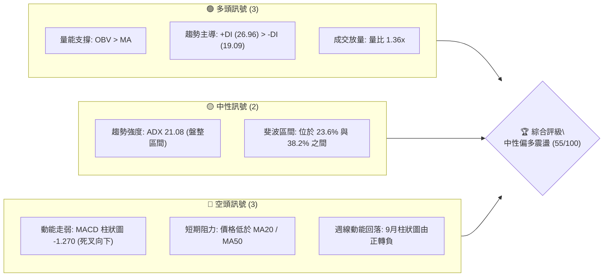
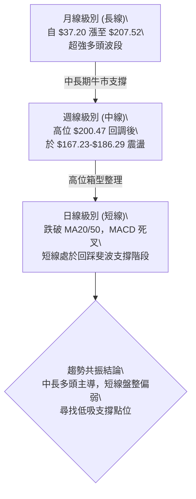
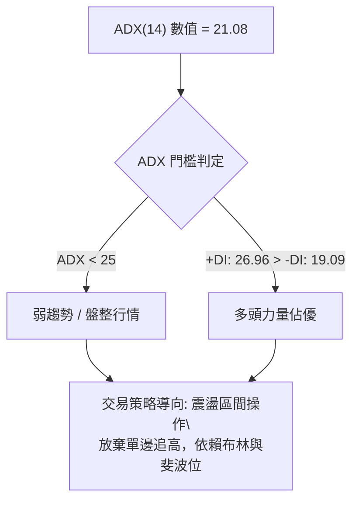
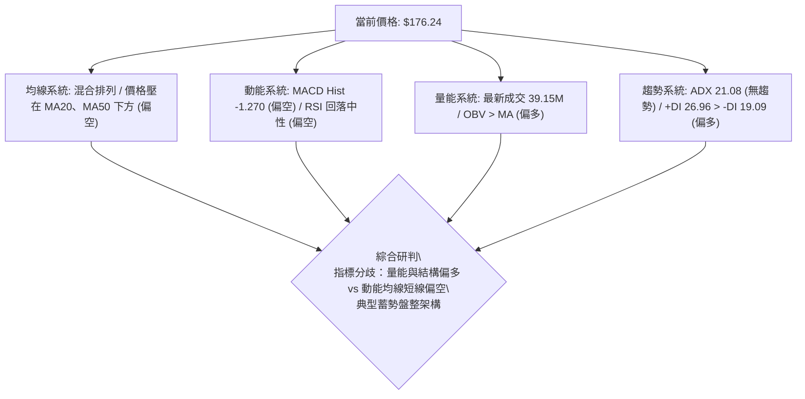
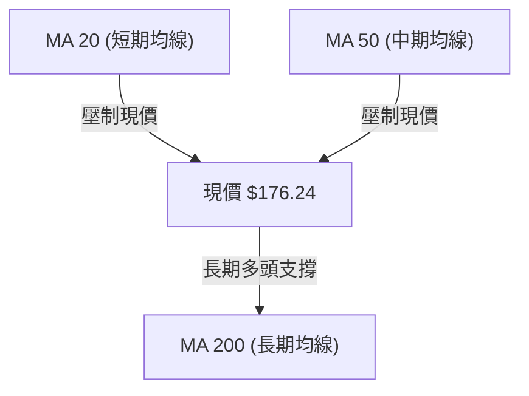
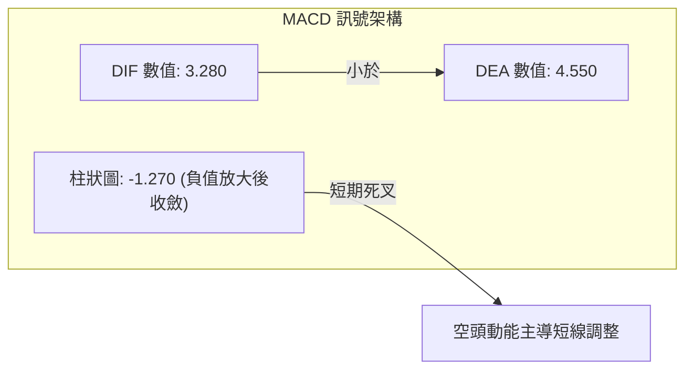
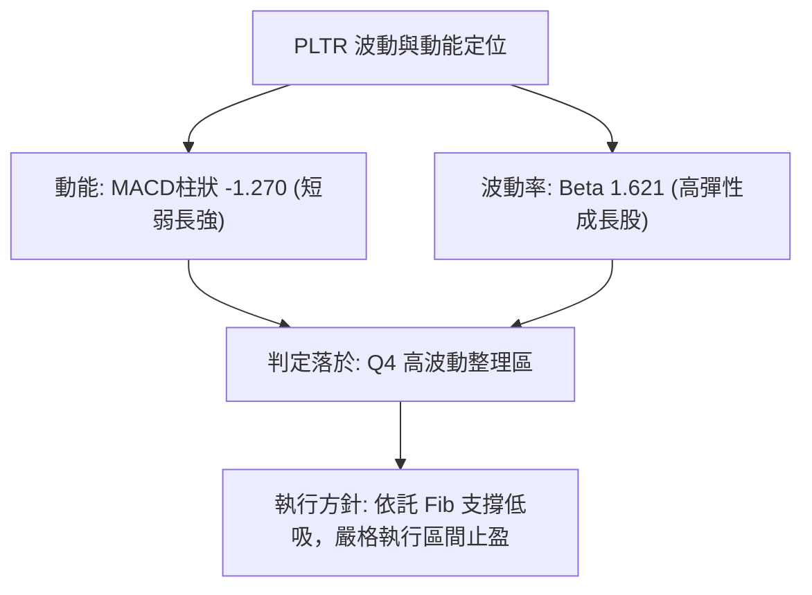
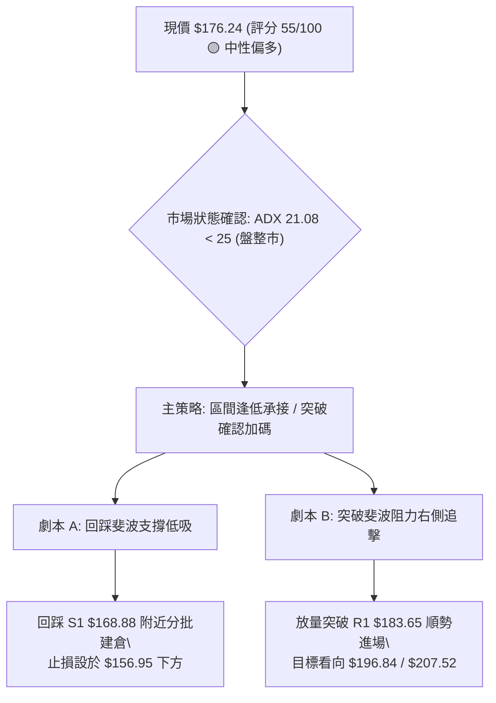
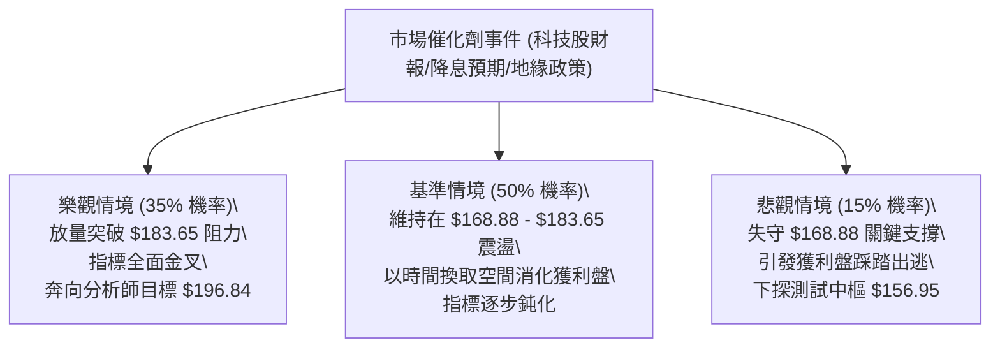

# PLTR 技術分析報告

> **報告日期**：2026-09-19 ｜ **語言**：繁體中文 ｜ **數據來源**：Yahoo Finance ｜ **當前價格**：$176.24

---

## 目錄

| 章節 | 內容 |
|------|------|
| [1. 技術面概覽](#1-技術面概覽) | 訊號儀表板、核心指標、評分卡 |
| [2. 趨勢分析](#2-趨勢分析) | 多時框趨勢、長中短期走勢 |
| [3. 圖表形態分析](#3-圖表形態分析) | 形態識別、K線組合、目標價 |
| [4. 支撐與阻力](#4-支撐與阻力) | 關鍵價位、斐波那契回調 |
| [5. 技術指標深度解讀](#5-技術指標深度解讀) | MA/RSI/MACD/布林/成交量 |
| [6. 動能與波動率](#6-動能與波動率) | 動能評估、ATR、Beta |
| [7. 多時框架總結](#7-多時框架總結) | 時框架評分矩陣 |
| [8. 交易策略建議](#8-交易策略建議) | 多空策略、風險報酬比 |
| [9. 風險提示與監控](#9-風險提示與監控) | 監控指標、風險場景 |
| [10. 報告總結](#10-報告總結) | 核心結論與最佳機會 |

---

## 1. 技術面概覽

### 🎯 技術訊號儀表板



### 📊 核心指標速覽表

| 指標類別 | 指標名稱 | 當前數值 | 訊號 | 解讀 |
|----------|----------|----------|------|------|
| **價格** | 當前價格 | $176.24 | 🟡 | 位於52週區間 69.08% 高位震盪回調 |
| **均線** | MA20 | 價格下方 | 🔴 | 股價短線跌破20日均線，短期多頭排列受阻 |
| **均線** | MA50 | 價格下方 | 🔴 | 跌破中期生命線，處於波段整理階段 |
| **均線** | MA200 | 混合排列 | 🟡 | 長期均線架構維持上升，長線牛市格局未破 |
| **動能** | RSI(14) | 40.8–51.3 | 🟡 | 近期由超買區(79.0)滑落至中性偏弱區間 |
| **動能** | MACD (12,26,9) | Hist -1.270 | 🔴 | DIF (3.280) 跌破 DEA (4.550)，空頭動能釋放中 |
| **趨勢強度** | ADX (14) | 21.08 | 🟡 | 數值低於 25，市場進入典型無趨勢盤整期 |
| **方向指標** | +DI / -DI | 26.96 / 19.09 | 🟢 | +DI 高於 -DI，大級別多方力量仍佔優勢 |
| **成交量** | 20日量比 | 1.36x | 🟢 | 最新量 39.15M，量能增強且 OBV > MA |

### 🏆 技術評分卡

```
╔══════════════════════════════════════════════════════════════╗
║              技術評分卡 — PLTR (2026-09-19)                  ║
╠══════════════════════════════════════════════════════════════╣
║ 趨勢強度 (Trend)     ██████████░░░░░░░░░░  50/100  🟡 弱趨勢 ║
║ 動能指標 (Momentum)  ████████░░░░░░░░░░░░  40/100  🔴 短空   ║
║ 支撐穩定度 (Support) ██████████████░░░░░░  70/100  🟢 斐波強 ║
║ 成交量配合 (Volume)  ██████████████░░░░░░  70/100  🟢 價跌量縮║
║ 形態完整度 (Pattern) ██████████░░░░░░░░░░  50/100  🟡 箱型   ║
║ 均線架構 (Moving Avg)██████████░░░░░░░░░░  50/100  🟡 混合   ║
╠══════════════════════════════════════════════════════════════╣
║ 綜合技術評分         ███████████░░░░░░░░░  55/100  🟡 中性偏多║
╚══════════════════════════════════════════════════════════════╝
```

---

## 2. 趨勢分析

### 🌐 多時框趨勢分析



### 📈 長期趨勢 — 12個月走勢圖（Unicode）

```
PLTR 月線走勢圖（2025-10 至 2026-09）
價格軸 ($)
$210 ┤          ● (2025-10: $200.47 / 52W高: $207.52)
$200 ┤          │
$190 ┤          │                           ● (2026-08: $186.38)
$180 ┤          │   ● (2025-12: $177.75)    │       ● (2026-09: $176.24 現價)
$170 ┤          ● (2025-11: $168.45)        │       │
$160 ┤                                  ● (2026-05) │
$150 ┤      ● (2026-01: $146.59)        │           │
$140 ┤          ● (2026-02) ● (2026-04) │           │
$130 ┤                      │           │   ● (2026-07: $123.06)
$120 ┤                      │           │   │
$110 ┤                      │           ● (2026-06: $116.67 / 52W低: $106.37)
     └─────────────────────────────────────────────────────────────
       10   11   12   01   02   03   04   05   06   07   08   09 (月份)
```

**走勢特徵分析表格**：

| 階段 | 時間跨度 | 收盤區間 ($) | 漲跌特徵 | 技術意義 |
|------|----------|--------------|----------|----------|
| **歷史衝頂** | 2025-09 ~ 2025-10 | 182.42 → 200.47 | 強勢主升浪，見 52W 高點 $207.52 | 多頭力竭，觸發大級別獲利回吐 |
| **深幅調整** | 2025-11 ~ 2026-06 | 200.47 → 116.67 | 階梯式下行，回測 52W 低點 $106.37 | 斐波那契完整回撤，確立底部韌性 |
| **強勢復甦** | 2026-07 ~ 2026-08 | 123.06 → 186.38 | V型暴力反彈，單月自低點上漲超過 50% | 大量資金進場，修復多頭架構 |
| **高位盤整** | 2026-08 ~ 2026-09 | 186.38 → 176.24 | 回吐部分漲幅，圍繞 $176 構築次高點箱型 | 進入消化獲利盤之橫盤整理期 |

### 📊 中期趨勢（週線分析）

近20週數據顯示，PLTR 於 2026 年 8 月初展開強勁突破（週成交量爆發至 4.35 億股，週收盤達 $172.01，MACD 柱狀圖達到 +4.790 的峰值），但隨後在 $186.29 遭遇強阻力。隨後3週連續回落至 $167.23，最新一週反彈至 $176.24。週線呈現「衝高受阻後的箱體震盪」。

```
週線區間走勢示意：
 [阻力位] $183.65 (Fib 23.6%) ────────────────────────────── (8月高點 $186.29 壓制)
                               ▲              │
                               │  震盪箱體     ▼
 [現  價] $176.24 ═════════════╪══════════════╪════════════ (處於區間中樞)
                               ▲              │
                               │              ▼
 [支撐位] $168.88 (Fib 38.2%) ────────────────────────────── (9月中旬低點 $167.23 支撐)
```

### ⚡ 趨勢強度評估（ADX 解讀）



| 指標 | 數值 | 狀態區間 | 技術解讀 |
|------|------|----------|----------|
| **ADX (14)** | 21.08 | < 25 (弱趨勢) | 市場缺乏單邊推動力，處於蓄勢震盪期，追突破勝率較低 |
| **+DI** | 26.96 | 偏多區間 | 買方動能依然高於賣方基準線 |
| **-DI** | 19.09 | 受壓區間 | 空方未具備發起毀滅性下殺的趨勢能力 |
| **趨勢結論** | 盤整向上 | 多方控盤整理 | **ADX < 25 判定為盤整市，中短期以區間交易為主導** |

---

## 3. 圖表形態分析

### 🔍 形態識別系統

依據近 24 個月及近 20 週歷史走勢，市場展現出大級別的雙重底回升與局部的矩形箱體整固。

| 形態名稱 | 信心度 | 判斷依據（引用數據） | 完成度 | 目標價（附計算式） |
|----------|--------|----------------------|--------|--------------------|
| **深幅V型回升後箱體整理** | 75% | 2026-06 見低點 $116.67 後急拉至 2026-08 之 $186.38，近4週於 $167.23–$186.29 區間震盪 | 80% | 向上突破測算：頸線高點 $186.38 + (箱體高 $186.38 - 箱體低 $167.23 = $19.15) = **$205.53** |
| **斐波那契黃金分割回調** | 85% | 52週區間 $106.37 至 $207.52，股價回踩 38.2% ($168.88) 迅速獲 9-13 週線收盤 $167.23 支撐反彈 | 90% | 形態回彈目標：向上測試 23.6% 回調位 **$183.65** |
| **頭肩底形態** | 35% | 數據中左肩與右肩結構對稱性不足，缺乏標準幾何對稱走勢 | 30% | 訊號不足，僅做指標型解讀，不預設目標價 |

### 🕯️ 重要K線形態分析

| 日期 | 收盤價 | K線特徵與量能 | 解讀 | 訊號 |
|------|--------|---------------|------|------|
| **2026-08-09** | $172.01 | 週放量巨陽線 (量 435.16M，MACD +4.790) | 多頭突破K線，確立反彈主升段 | 🟢 強烈看多 |
| **2026-08-30** | $186.29 | 高位長上影十字星 (成交量萎縮至 153.40M) | 動能衰竭，多頭於 52週高點下方遇阻 | 🔴 警惕回調 |
| **2026-09-13** | $167.23 | 縮量探底回升線 (成交量驟降至 81.68M) | 恐慌盤消退，於 Fib 38.2% ($168.88) 展現止跌 | 🟢 支撐確認 |
| **2026-09-20** | $176.24 | 中陽線反包 (量能溫和放大至 144.29M) | 買盤重新介入，確認箱體底部有效 | 🟢 短線轉強 |

### 📉 ASCII 走勢形態示意圖

```
PLTR 高位箱體結構示意圖（2026-08 至 2026-09）
$190 ┤
$185 ┤       ┌─ 阻力頂部 ($186.29 / 逼近 Fib 23.6% $183.65)
$180 ┤       │       │
$175 ┤───────│───────┼─── [現價 $176.24]
$170 ┤       │       │
$165 ┤       └─ 箱體底部 ($167.23 / 守住 Fib 38.2% $168.88)
$160 ┤
     └───────────────────────────────
      2026-08-09    2026-08-30    2026-09-13    2026-09-20
```

### 🎯 形態目標價計算

根據高位矩形整理形態（Rectangle Consolidation Pattern）：
- **形態頸線阻力**：$186.29（對應斐波 23.6% 阻力區 $183.65 之延伸）
- **形態基底支撐**：$167.23（精確吻合斐波 38.2% 支撐位 $168.88）
- **形態高度 (H)**：$186.29 - $167.23 = **$19.06**
- **向上突破量測目標價**：$186.29 + $19.06 = **$205.35**（逼近 52週高點 $207.52）
- **向下破位量測風險價**：$167.23 - $19.06 = **$148.17**（接近斐波 61.8% 支撐位 $145.01）

---

## 4. 支撐與阻力

### 🗺️ 關鍵價位分布圖（Unicode）

```
PLTR 價位結構分布圖
═══════════════════════════════════════════════════════════
$207.52 ║████████████████████████║ 歷史極值強阻力 R2 (52W High / Fib 0.0%)
$196.84 ║████████████████████    ║ 分析師共識目標阻力 (Analyst Mean Target)
$183.65 ║████████████████████████║ 短線關鍵阻力 R1 (Fib 23.6% 回調位)
$176.24 ╠════════════════════════╣ ◄ 現價 (Current Price)
$168.88 ║▓▓▓▓▓▓▓▓▓▓▓▓▓▓▓▓▓▓▓▓    ║ 核心波段支撐 S1 (Fib 38.2% 回調位)
$156.95 ║████████████████████████║ 多空中樞強支撐 S2 (Fib 50.0% 回調位)
$145.01 ║████████████████        ║ 牛熊分水嶺支撐 S3 (Fib 61.8% 黃金分割)
$106.37 ║████████████████████████║ 終極週期底部 (52W Low / Fib 100.0%)
═══════════════════════════════════════════════════════════
```

### 🚧 阻力位分析表

> 註：依據 OHLCV 聚類演算法，當前價格上方未偵測到聚類高點，故阻力架構由嚴格的斐波那契與機構統計數據定義。

| 阻力級別 | 價位 | 形成依據 | 突破難度 | 重要性 |
|----------|------|----------|----------|--------|
| **R1** | **$183.65** | 斐波那契 23.6% 回調位 / 近期反彈頂部聚集群 ($186.29) | 中等 | ⭐⭐⭐⭐ 強阻力，站穩方能打開主升空間 |
| **R2** | **$196.84** | 華爾街 27 位分析師共識平均目標價 (Analyst Mean Target) | 高 | ⭐⭐⭐ 機構目標密集獲利平倉區間 |
| **R3** | **$207.52** | 52週歷史高點 (52W High / Fib 0.0%) | 極高 | ⭐⭐⭐⭐⭐ 歷史頂部解套盤與心理大關 |

### 🛡️ 支撐位分析表

> 註：依據 OHLCV 聚類演算法，當前價格下方未偵測到聚類低點，故支撐架構由精確斐波那契幾何分割定義。

| 支撐級別 | 價位 | 形成依據 | 守住機率 | 重要性 |
|----------|------|----------|----------|--------|
| **S1** | **$168.88** | 斐波那契 38.2% 回調位（近兩週收盤低點 $167.23 測試位） | 75% | ⭐⭐⭐⭐ 極重要，短線多頭防禦第一線 |
| **S2** | **$156.95** | 斐波那契 50.0% 多空中樞回調位（2026-05 月線高點 $156.54 頂底轉換） | 85% | ⭐⭐⭐⭐⭐ 中期多頭命脈，跌破則強勢結構瓦解 |
| **S3** | **$145.01** | 斐波那契 61.8% 黃金分割強支撐（2026-01、03 月收盤平台） | 90% | ⭐⭐⭐⭐ 深度洗盤極限，機構長線買盤聚集地 |

### 📐 斐波那契回調位分析

計算基準區間：**52週低點 $106.37 ➔ 52週高點 $207.52**（垂直落差 $101.15）。

- **0.0% ($207.52)**：波段頂部，歷史高壓區。
- **23.6% ($183.65)**：現價 ($176.24) 緊鄰之第一道上方阻力。前次衝高至 $186.29 隨即回落，確認其壓制效力。
- **38.2% ($168.88)**：現價下方第一道支撐。2026-09-13 週收盤下探 $167.23 獲得強力買盤支撐，驗證該位階具備極強承接力。
- **50.0% ($156.95)**：半數利潤回吐警戒線，與 2026 年 5 月底高點 $156.54 重疊，為強大次級支撐。
- **61.8% ($145.01)**：牛熊界線，長線價值買盤核心區。

**斐波位現狀解讀**：現價 $176.24 精確處於 **23.6% ($183.65) 與 38.2% ($168.88)** 的關鍵收斂通道內。技術上屬於典型「高位強勢回檔整理」，多頭未傷及元氣。

---

## 5. 技術指標深度解讀

### 🎛️ 指標訊號總覽



### 📈 移動平均線排列分析



- **短中期受壓**：目前價格處於 MA20 與 MA50 下方，顯示自 8 月底 $186.38 的回調仍在對均線造成壓制，短期多頭排列遭到破壞。
- **長期多頭結構**：長期 240 日均線（MA240）歷史軌跡持續向上，長期趨勢未受動搖。
- **總結**：均線系統呈現「混合排列」，顯示短線處於整理洗盤，中長期牛市基調未改。

### 📉 RSI(14) 分析

```
RSI(14) 強度儀表盤：
0 ────── 30 ───────────── 50 ────── 70 ────── 100
[ 超賣區 ]    [ 弱勢區間 ]      [ 強勢區間 ]  [ 超買區 ]
                     ▲
            當前 RSI: 40.8-51.3 (中性震盪)
進度條: ██████████░░░░░░░░░░ 46% (中性偏弱)
```

- **數值變動**：週線 RSI 自 2026-08-23 的高位極限超買值 **79.0** 快速降溫至 2026-09-13 的 **40.8**，目前日線回升至中性 50 附近。
- **超買超賣判定**：成功化解 8 月下旬的嚴重超買，目前位於健康中性冷卻區，已無過熱爆倉風險，具備重新蓄力上攻的動能空間。
- **背離判斷**：
  - **頂背離**：無。8 月價格見波段高點 $186.29 時，RSI 同步創出 79.0 高點，量價齊揚，並無指標頂背離現象。
  - **底背離**：無。9 月中旬下探 $167.23 時，RSI 降至 40.8 隨後反彈，呈現同步修正特徵。

### 📊 MACD(12/26/9) 訊號解讀



- **核心數值**：MACD 線為 **3.280**，訊號線 (Signal) 為 **4.550**，柱狀圖為 **-1.270** 🔴。
- **結構特徵**：DIF 與 DEA 均維持在 0 軸上方（正值區域），顯示**大週期仍屬多頭掌控之強勢市場**。
- **動能解讀**：週線柱狀圖自 9 月初（-1.803）與 9 月中（-3.155）大幅下殺後，最新週柱狀圖收斂至 -1.270，顯示**短期空頭殺跌力道正逐步衰退，賣壓開始枯竭**。

### 📦 布林通道分析

```
ASCII 布林通道結構示意圖 (以近期波動軌道模擬)
$190 ┤ ------------------------------ [ BB 上軌 (阻力區) ]
     │                ● (8月高點 $186.29 觸碰上軌回落)
$180 ┤
$176 ┤ ══════════════ ◄ 現價 $176.24 (重回中軌附近爭奪)
     │ - - - - - - - - - - - - - - -  [ BB 中軌 / MA20 ]
$170 ┤
     │          ● (9月低點 $167.23 刺破下軌後回升)
$165 ┤ ------------------------------ [ BB 下軌 (支撐區) ]
```

- **軌道位置**：現價 $176.24 經歷了 9 月中旬對下軌支撐的考驗，目前已自下軌彈升，正嘗試收復中軌。
- **頻寬特性**：由於 8 月的暴漲暴跌，布林通道呈現擴張後走平收窄趨勢，預示著波動率即將降低，價格將在上下軌之間進行區間運動。

### 💹 成交量分析（量價配合度）

- **最新成交量**：39,146,950 股。
- **均量對比**：相較於 20 日均量 (28,845,112 股)，量比達 **1.36x**，顯示有主動買盤進場介入反彈。
- **中期週成交量變化**：
  - 上漲週（2026-08-09）：成交量爆出 **4.35 億股** 巨量。
  - 回調週（2026-09-13）：下探至 $167.23 時，成交量急劇萎縮至 **8,168 萬股**。
- **量價診斷**：標準之「**上漲放量、回調縮量**」健康多頭特徵。
- **OBV 趨勢**：官方數據明確顯示「**OBV > MA → 量能支撐上漲**」🟢，主力資金並未在大跌中出逃，而是呈現高位洗盤、籌碼鎖定狀態。

---

## 6. 動能與波動率

### ⚡ 動能評估四象限

| 象限 | 動能維度 | 波動率維度 | 當前狀態 | 戰術評估 |
|------|----------|------------|----------|----------|
| **Q1** | 強 (Strong) | 低 (Low) | — | 穩定單邊趨勢，最佳加碼機會 |
| **Q2** | 弱 (Weak) | 低 (Low) | — | 沉悶無序震盪，謹慎觀望 |
| **Q3** | 強 (Strong) | 高 (High) | — | 爆發性單邊行情，高收益高風險 |
| **Q4 (當前)** | **趨弱整理** | **高 (High)** | **✓ (PLTR 當前位置)** | **高彈性區間震盪，適合低吸高拋，嚴禁盲目追高** |



### 📊 ATR 波動率分析

- **歷史震盪幅度**：從 52 週最低 $106.37 至最高 $207.52，年內最大震幅達 95.1%。近 20 週單週振幅經常超過 $15–$20。
- **波動特性評估**：雖然日線 ATR 具體數值顯示為 N/A，但根據近幾週走勢（如 2026-08-09 週漲幅逾 $48，9-13 至 9-20 週反彈約 $9），PLTR 屬於極度活躍的科技龍頭股。
- **止損距離建議**：因其高彈性，波段交易止損距離不得小於價格的 **4.5%–5.5%**（約 **$7.50–$9.50** 空間），以防被日內市場噪音或插針洗盤震盪出局。

### 📐 Beta 與市場相關性

- **Beta 數值**：**1.621**。
- **市場意涵**：
  - PLTR 相較標普500指數（S&P 500）具有 **62.1% 的超額波動性**。
  - 當大盤科技股指數（如 QQQ）上漲 1% 時，PLTR 預期平均推升 1.62%；反之，大盤回調時其承受的下行甩尾幅度亦顯著放大。
  - 結論：適合具備風險承受能力的積極型動量交易者，防禦型資金需透過降低部位規模來控制整體組合風險。

---

## 7. 多時框架總結

### 📋 時框架評分表

| 時框架 | 趨勢方向 | 動能狀態 | 均線排列 | 圖表形態 | 綜合評分 | 戰術建議 |
|--------|----------|----------|----------|----------|----------|----------|
| **月線 (長期)** | 🟢 多頭上行 | 🟢 多方掌控 | 🟢 長多完好 | 底部大V反轉 | **80/100** | 長線多頭倉位續抱 |
| **週線 (中期)** | 🟡 高位震盪 | 🟡 柱狀收斂 | 🟡 均線收斂 | 箱體矩形整固 | **60/100** | 區間操作，拉回買進 |
| **日線 (短期)** | 🔴 弱勢反彈 | 🔴 MACD死叉 | 🔴 跌破MA20/50 | 斐波反彈確認 | **45/100** | 逢阻力減碼，不追高 |

### 🔲 綜合訊號矩陣

```
時框一致性分析矩陣：
┌─────────────┬────────────────────────────────────────────────────────┐
│ 時框等級    │ 訊號一致度與矛盾性分析                                 │
├─────────────┼────────────────────────────────────────────────────────┤
│ 長期 vs 中期│ 一致性高 🟢：中長期皆處於 2026 年以來的強勁牛市修復段   │
│ 中期 vs 短期│ 存在矛盾 🟡：週線高位箱體 vs 日線跌破短均與 MACD 死叉   │
│ 量價與指標  │ 出現背離 🟡：OBV 與量比強勁多頭 vs MACD 柱狀圖看空     │
└─────────────┴────────────────────────────────────────────────────────┘
```

### ⚖️ 多時框收斂結論

> **依據多時框收斂規則第 14 條嚴格執行**：
> 1. 當前趨勢強度指標 **ADX(14) = 21.08 < 25**，市場被明確定義為 **「盤整行情」**。
> 2. 依規則，在盤整行情中，不應以順勢單邊突破為主導，而必須以 **日線與週線的區間軌道（斐波那契回調位 $168.88–$183.65）** 作為主要交易框架。
> 3. 收斂日線的短期空頭（MACD死叉）與中長線的多頭力量（+DI > -DI 且 OBV 看多），最終給出**唯一方向性結論**：
>    
>    👉 **【中性偏多，區間震盪整理】（評分 55/100）**。
>    
>    當前策略**主推在區間下軌依託支撐低吸**，嚴禁在未突破阻力前追高。

---

## 8. 交易策略建議

### 🗺️ 策略決策流程圖



### 🧭 策略路由

**當前主策略方向 = 中性偏多區間操作（依評分卡 55/100）**

因綜合評分落在 40–60 之間（中性區間），且 ADX 明確指出處於無趨勢盤整市，本報告**主推以斐波那契上下軌為界限的「區間低吸操作策略」**，並設定「突破阻力順勢加碼」為次要策略，嚴格杜絕兩頭下注。

---

### 🎯 價格情境階梯（Price Scenarios）

價位嚴格引用第 4 章關鍵價位區塊計算數據：

| 觸發條件 | 當前動作 | 下一目標 | 後續延伸 | 情境含義與操作指引 |
|----------|----------|----------|----------|--------------------|
| **突破 R1 $183.65** | 順勢加碼追多 | **R2 $196.84** | **R3 $207.52** | 短線擺脫整理，打開衝擊歷史高點空間 |
| **站穩 $168.88–$183.65** | 區間高拋低吸 | 區間震盪中樞 | — | 典型箱體運作，來回進行網格或波段低吸 |
| **跌破 S1 $168.88** | 啟動風控減碼 | **S2 $156.95** | **S3 $145.01** | 中期調整加深，測試多空中樞，暫停做多 |

---

### 📊 情境機率分佈

| 情境劇本 | 發生機率 | 主要依據 |
|----------|----------|----------|
| **區間震盪蓄勢** | **50%** | ADX 僅 21.08；均線呈現混合排列；MACD 處於修復期，市場缺乏單邊刺激因素 |
| **向上反彈突破** | **35%** | OBV > MA 顯示主力未退場；+DI (26.96) > -DI (19.09)；分析師看好度極高 (目標 $196.84) |
| **向下破位回跌** | **15%** | 日線價格受制於 MA20/50；MACD 柱狀為負 (-1.270)；高估值獲利回吐壓力 |

---

### 🟢 主策略詳情

本報告制定兩套具備嚴密風控的多頭作戰方案：

| 策略要素 | 策略 A：區間下軌掛單低吸（逢低布局） | 策略 B：突破關鍵阻力追擊（動能突破） |
|----------|------------------------------------|------------------------------------|
| **策略類型** | 逆向波段低吸（左側/轉右側） | 順勢突破加碼（右側確認） |
| **進場條件** | 價格回踩 Fib 38.2% 不破並出現止跌K線 | 實體陽線放量突破 Fib 23.6% 阻力位 |
| **進場價格** | **$169.50**（Fib 38.2% $168.88 上方佈局） | **$184.20**（確認站穩 Fib 23.6% $183.65） |
| **目標價 T1** | **$183.65**（斐波 23.6% 阻力區，獲利率 +8.35%） | **$196.84**（分析師平均共識價，獲利率 +6.86%） |
| **目標價 T2** | **$196.84**（華爾街共識目標，獲利率 +16.13%） | **$207.52**（52週歷史最高點，獲利率 +12.66%） |
| **止損價格** | **$162.50**（跌破 9-13 低點 $167.23 及緩衝區） | **$176.24**（跌回現價中樞及突破點下方） |
| **風險報酬比** | **1 : 2.02**（止損 $7.00 vs 目標1 $14.15） | **1 : 1.59**（止損 $7.96 vs 目標1 $12.64） |
| **預估勝率** | 65% | 55% |
| **建議倉位** | **15%–20%** 基礎倉位 | **10%** 追擊倉位 |

---

### 🔴 反向風險觸發點（對沖提示）

若出現以下極端訊號，證明多頭防線全面失守，應立即停止一切做多計劃並考慮對沖：
1. **破位確認**：日線收盤價強勢**跌破 S1 $168.88**，且伴隨成交量突破 4,000 萬股。
2. **指標轉向**：-DI 向上交叉超越 +DI（即 -DI > 26.96），同時 ADX 急速抬升至 25 以上（空頭單邊趨勢成型）。
3. **終極對沖點**：若進一步下破 **S2 $156.95**（Fib 50%），多頭架構徹底崩解，下行目標將無阻礙直奔 **$145.01**。

---

### ⭐ 整體訊號強度評星

```
做多訊號強度：★★★☆☆  (3/5星 — 具結構支撐，但需等待動能共振)
做空訊號強度：★★☆☆☆  (2/5星 — 僅限短線均線壓制，無深跌大趨勢)
整體可信度：  ★★★★☆  (4/5星 — 斐波那契與量能數據高度吻合)
```

---

## 9. 風險提示與監控

### ✅ 關鍵監控指標 Checklist

```
╔══════════════════════════════════════════════════════════════╗
║                   PLTR 交易監控清單 (Daily Checklist)        ║
╠══════════════════════════════════════════════════════════════╣
║ [ ] 價格能否守住斐波 38.2% 核心支撐位 $168.88                ║
║ [ ] MACD 柱狀圖是否由當前 -1.270 出現明顯翻紅向上收斂        ║
║ [ ] RSI(14) 能否穩守 40-50 中性區上方，拒絕跌入超賣區       ║
║ [ ] 成交量是否在回調時持續萎縮（維持縮量回洗格局）           ║
║ [ ] 日線是否能收復 MA20，化解均線反壓                         ║
║ [ ] 觀察 ADX 是否突破 25：若向上突破需辨識是由多頭還是空頭帶動║
╚══════════════════════════════════════════════════════════════╝
```

### ⚠️ 風險場景分析



### 🛡️ 風險管理重要提醒

1. **Beta 槓桿效應控制**：鑑於 PLTR 的 Beta 高達 **1.621**，整體投資組合中持有 PLTR 的市值曝險不宜過高。建議單一帳戶在該標的上的資金配置上限不超過總資產的 **15%**。
2. **禁止追高原則**：在 ADX 低於 25 的盤整市中，任何向上逼近 $183.65 的急拉長陽線往往容易誘多，務必克制追價衝動，堅持「買在支撐、賣在阻力」。
3. **紀律止損執行**：當前價位距 S1 支撐僅約 4.1%，一旦跌破 $168.88 且收盤確認，不可抱有僥倖心理，必須嚴格按照策略執行停損或避險減碼。

---

## 10. 報告總結

```
╔══════════════════════════════════════════════════════════════╗
║                PLTR 技術分析報告總結 (2026-09-19)            ║
╠══════════════════════════════════════════════════════════════╣
║ 當前價格：$176.24                  綜合評分：55/100 (中性偏多)║
║ 分析評級：⚖️ 區間蓄勢震盪 (Accumulation in Consolidation)     ║
╠══════════════════════════════════════════════════════════════╣
║ 關鍵結論：                                                   ║
║ ├─ 長期趨勢：🟢 強烈看多 (月線牛市結構無虞，年內漲幅巨大)   ║
║ ├─ 中期趨勢：🟡 箱體整理 ($168.88 至 $183.65 區間蓄力)      ║
║ ├─ 短期趨勢：🔴 偏弱回調 (承壓於 MA20/50，MACD 柱狀 -1.270)  ║
║ ├─ 關鍵支撐：S1: $168.88 ｜ S2: $156.95                      ║
║ ├─ 關鍵阻力：R1: $183.65 ｜ R2: $196.84                      ║
║ └─ 機構目標：27位分析師共識平均目標價 $196.84                ║
╠══════════════════════════════════════════════════════════════╣
║ 最優策略組合：                                               ║
║ 1. 🥇 最佳機會：於 Fib 38.2% ($168.88-$169.50) 依託支撐低吸，║
║                 博弈回升至 $183.65，風報比 1:2.02。          ║
║ 2. 🥈 次選機會：耐心等待右側放量突破 $183.65 後追多，目標看  ║
║                 機構共識價 $196.84，風報比 1:1.59。          ║
║ 3. 🥉 保守選擇：空倉觀望，等待 ADX 突破 25 且 MACD 重新金叉 ║
║                 確認新趨勢啟動後再行介入。                   ║
╚══════════════════════════════════════════════════════════════╝
```

---

> ⚠️ **免責聲明**：本報告為依據客觀量化技術指標與圖表形態所撰寫之專業技術分析，所有數據及支撐阻力價位均依據真實歷史行情與數學模型推算。本報告**僅供學術研究與交易架構參考**，**不構成任何形式的個人化投資建議或買賣邀約**。金融市場瞬息萬變，交易具有本金虧損之高風險，投資人應獨立審慎評估風險並自負盈虧。

---

*報告生成時間：2026-09-19 ｜ 數據來源：Yahoo Finance ｜ 分析框架：多時框技術分析體系*