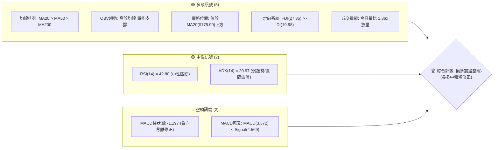
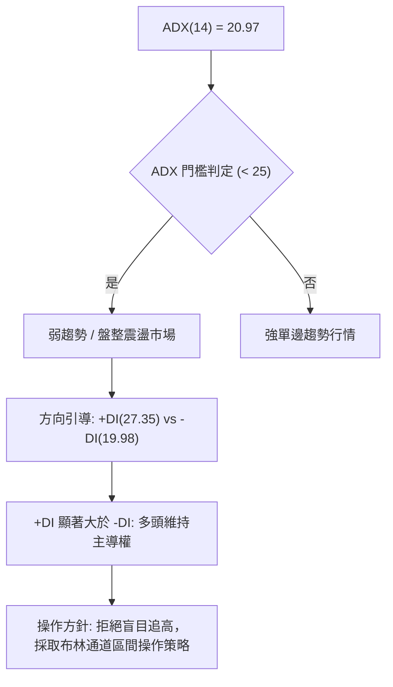
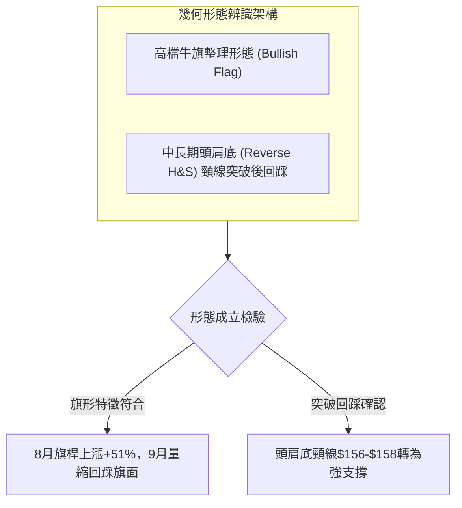
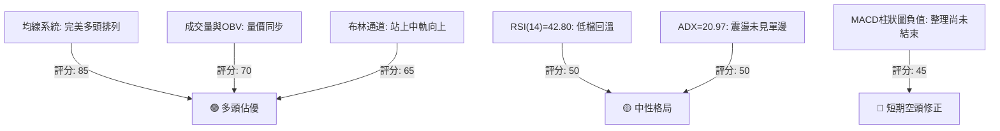
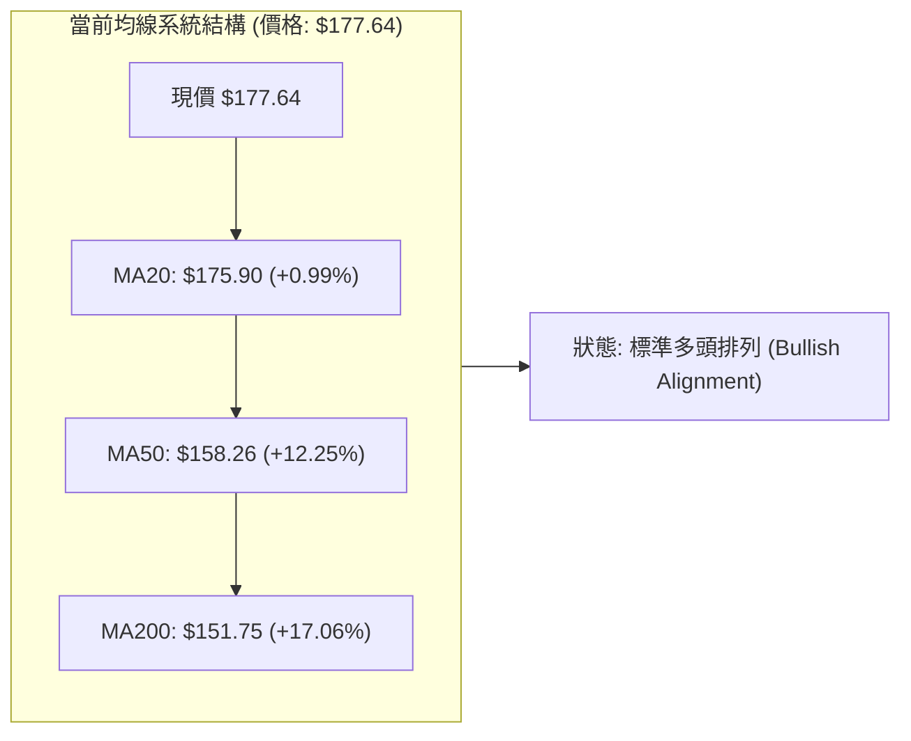
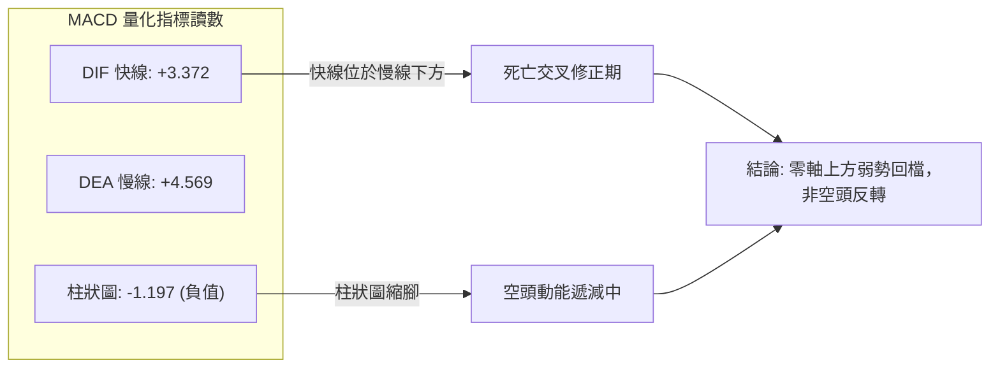
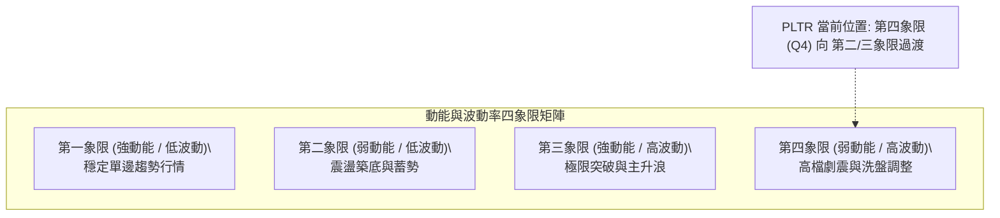
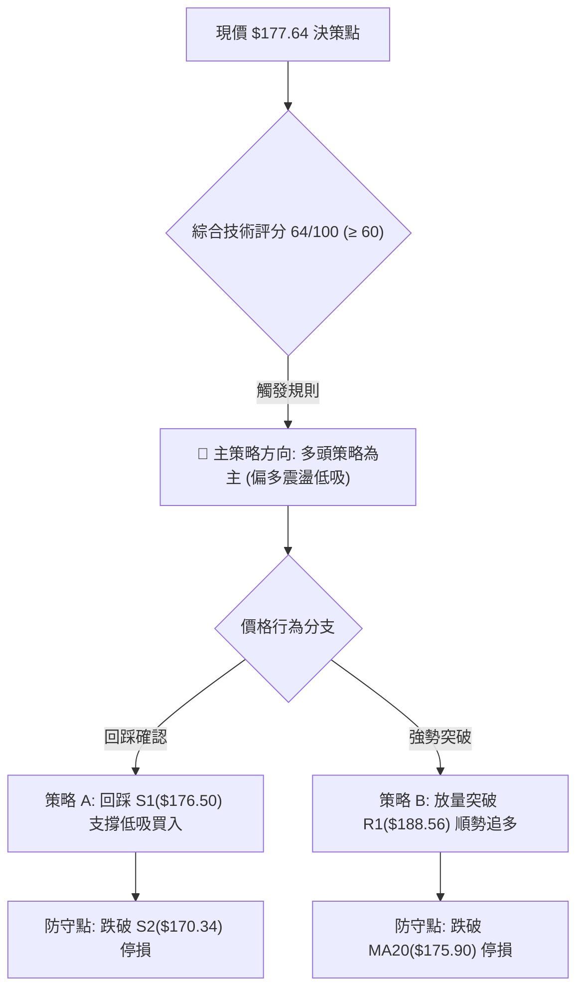
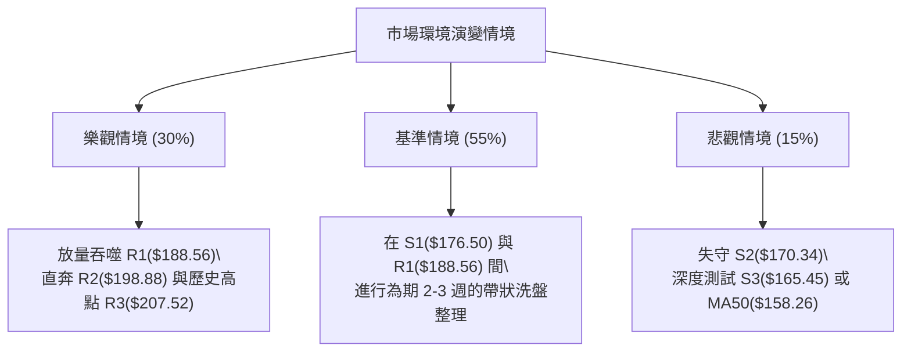

# PLTR 技術分析報告

> **報告日期**：2026-09-21 ｜ **語言**：繁體中文 ｜ **數據來源**：Yahoo Finance ｜ **當前價格**：$177.64

---

## 目錄

| 章節 | 內容 |
|------|------|
| [1. 技術面概覽](#1-技術面概覽) | 訊號儀表板、核心指標、評分卡 |
| [2. 趨勢分析](#2-趨勢分析) | 多時框趨勢、長中短期走勢、12個月月線圖、ADX |
| [3. 圖表形態分析](#3-圖表形態分析) | 形態識別、信心度評估、K線組合、目標價測算 |
| [4. 支撐與阻力](#4-支撐與阻力) | 價位結構分布圖、阻力位、支撐位、斐波那契回調 |
| [5. 技術指標深度解讀](#5-技術指標深度解讀) | 均線系統、RSI、MACD、布林通道、成交量與OBV |
| [6. 動能與波動率](#6-動能與波動率) | 動能四象限、ATR波動度、Beta係數分析 |
| [7. 多時框架總結](#7-多時框架總結) | 時框架矩陣、多時框收斂與方向定調 |
| [8. 交易策略建議](#8-交易策略建議) | 決策流程圖、情境階梯、主策略詳情、風險報酬比 |
| [9. 風險提示與監控](#9-風險提示與監控) | 關鍵監控清單、情境模擬、風控指引 |
| [10. 報告總結](#10-報告總結) | 核心結論速覽卡與最優策略組合 |

---

## 1. 技術面概覽

### 🎯 技術訊號儀表板



### 📊 核心指標速覽表

| 指標類別 | 指標名稱 | 當前數值 | 訊號 | 解讀 |
|:---|:---|:---|:---:|:---|
| **價格** | 當前價格 | $177.64 | 🟢 | 位於52週區間70.5%高位，守穩關鍵支撐S1($176.50) |
| **均線** | 短期 MA20 | $175.90 | 🟢 | 現價高於MA20(+0.99%)，短線重回生命線上 |
| **均線** | 中期 MA50 | $158.26 | 🟢 | 現價大幅高於MA50(+12.25%)，中期多頭架構完好 |
| **均線** | 長期 MA200 | $151.75 | 🟢 | 現價大幅高於MA200(+17.06%)，長線牛市格局確立 |
| **動能** | RSI(14) | 42.80 | 🟡 | 脫離超賣區向上修復，無背離現象，動能處於中性格局 |
| **動能** | MACD (12,26,9) | 3.372 / 4.569 | 🔴 | DIF位於訊號線下方，柱狀圖-1.197，短期處於回檔整理 |
| **動能** | KD指標 (%K/%D) | 55.96 / 48.71 | 🟢 | K值自低檔金叉向上穿過D值，短線買盤動能回溫 |
| **趨勢強度** | ADX (14) | 20.97 | 🟡 | 數值低於25，代表非強單邊行情，處於大區間震盪階段 |
| **通道** | 布林通道 %B | 0.57 | 🟢 | 價格重回中軌($175.90)之上，偏向上軌($188.23)運行 |
| **量能** | 20日成交量比 | 1.36x | 🟢 | 當日量39.22M高於20日均量28.85M，伴隨反彈帶量 |
| **波動** | ATR(14) | $7.11 (4.00%) | 🟡 | 每日平均波幅達$7.11，屬於中高波動軟體成長股 |

### 🏆 技術評分卡

```
╔══════════════════════════════════════════════════════════════╗
║              PLTR 技術綜合評分卡 (2026-09-21)               ║
╠══════════════════════════════════════════════════════════════╣
║ 均線排列 (Trend MA)     █████████████████░░░  85/100 🟢 強勢多頭 ║
║ 支撐穩定度 (Support)    ███████████████░░░░░  75/100 🟢 支撐穩固 ║
║ 趨勢強度 (ADX Strength) ██████████░░░░░░░░░░  50/100 🟡 震盪整理 ║
║ 量價配合度 (Volume/OBV) ██████████████░░░░░░  70/100 🟢 價升量增 ║
║ 形態完整度 (Pattern)    ████████████░░░░░░░░  60/100 🟡 區間蓄勢 ║
║ 動能指標 (MACD/RSI)     █████████░░░░░░░░░░░  45/100 🔴 整理修正 ║
╠══════════════════════════════════════════════════════════════╣
║ 綜合技術評分            █████████████░░░░░░░  64/100 🟢 偏多震盪 ║
╚══════════════════════════════════════════════════════════════╝
```

---

## 2. 趨勢分析

### 🌐 多時框趨勢分析

```mermaid
graph TD
    A["月線級別 (長期趨勢)"] -->|"MA200向上 / 歷史高檔聚類"| B["🟢 強勢多頭: 依託$151-$156長線均線向上"]
    B --> C["週線級別 (中期趨勢)"]
    C -->|"波段自$112.93強彈至$186.29後回踩"| D["🟡 區間震盪整理: 消化$188-$207解套賣壓"]
    D --> E["日線級別 (短期趨勢)"]
    E -->|"回測S2("$170.34")有守，重返MA20("$175.90")"| F["🟢 短線偏多反彈: 測試布林中軌至上軌區間"]
```

### 📈 長期趨勢 — 12個月走勢圖（ASCII）

過去12個月（2025-10 至 2026-09）PLTR 歷經了強勢創高、深幅去槓桿回調、以及強勁的V型修復反彈：

```
PLTR 月線收盤走勢圖（2025-10 至 2026-09）
價格軸 ($)
$210 ┤                                                    
$200 ┤ ● (2025-10: $200.47)                              
$190 ┤                                                    
$180 ┤               ● (2025-12: $177.75)                 ● (2026-08: $186.38)
$170 ┤     ●                                              │
$160 ┤                                        ●           ●← 現價 $177.64 (2026-09)
$150 ┤          ●                   ●         │           
$140 ┤               ●         ●    │         │           
$130 ┤                    ●    │    │         │           
$120 ┤                         │    │    ●    ● (2026-07: $123.06)
$110 ┤                                  (2026-06: $116.67)
     └─┬────┬────┬────┬────┬────┬────┬────┬────┬────┬────┬────┬────
     10月 11月 12月 01月 02月 03月 04月 05月 06月 07月 08月 09月
      2025年                  2026年
```

#### 走勢特徵分析表格

| 階段區間 | 起止月份 | 價格區間 | 累計漲跌幅 | 走勢特徵與成交量狀態 |
|:---|:---:|:---:|:---:|:---|
| **第一階段：高檔作頂** | 2025-10 ~ 2025-12 | $200.47 → $177.75 | -11.33% | 創下歷史次高後，於$180-$200形成高檔籌碼沉澱，量能遞減 |
| **第二階段：中期回調** | 2026-01 ~ 2026-04 | $177.75 → $139.11 | -21.74% | 估值壓縮回檔，連續擊穿中期均線，空方主導下降通道 |
| **第三階段：恐慌觸底** | 2026-05 ~ 2026-06 | $156.54 → $116.67 | -25.47% | 6月創波段低點$112.93(週收盤$116.67)，形成中期黃金坑 |
| **第四階段：量能爆發** | 2026-07 ~ 2026-08 | $123.06 → $186.38 | +51.45% | 8月單週爆出4.35億股巨量拉升，基本面業績驅動V型反轉 |
| **第五階段：強勢消化** | 2026-09 至今 | $186.38 → $177.64 | -4.69% | 於斐波那契23.6%($183.65)下方橫盤消化獲利盤，量縮守MA20 |

### 📊 中期趨勢（週線分析）

中期走勢呈現「高動能V型回升後的高檔箱形旗形整理」。近20週數據顯示，2026年8月9日當週以 435,164,800 股的天量長陽線一舉突破多道均線，將中期波段底部自 $112.93 迅速推升至 $186.29。近期三週收盤價分別為 $174.33、$167.23 與 $177.64，顯示在回測斐波那契 38.2%（$168.88）與波段支撐 S2（$170.34）後，買盤再度進場承接。

```
中期週線格局：
[壓力區間]  $188.56 (R1) ─── $198.88 (R2) ─── $207.52 (52W High)
                      ▲
[現價位置]            │  $177.64 (多空爭奪布林中軌 $175.90)
                      ▼
[支撐區間]  $176.50 (S1) ─── $170.34 (S2) ─── $165.45 (S3)
```

### ⚡ 趨勢強度評估（ADX 解讀）



#### ADX 趨勢強度對照表

| 指標變數 | 當前讀數 | 門檻標準 | 技術狀態判定 |
|:---|:---:|:---:|:---|
| **ADX (14)** | 20.97 | < 25 (弱趨勢/震盪) | 股價結束8月份的極端單邊推升，進入高檔整理期 |
| **+DI (14)** | 27.35 | > -DI (多方佔優) | 買盤力量仍顯著壓制空方，非空頭反轉結構 |
| **-DI (14)** | 19.98 | 低於20基準線 | 空頭動能衰退，賣壓未形成實質性下壓擴散 |
| **結構結論** | **多頭主導的箱形盤整** | — | 依據多時框收斂原則，以高出低進與支撐低吸為主 |

---

## 3. 圖表形態分析

### 🔍 形態識別系統



#### 形態識別與信心度評估表

| 形態名稱 | 信心度 | 判斷依據（引用真實數據） | 完成度 | 目標價（附嚴謹計算式） |
|:---|:---:|:---|:---:|:---|
| **高檔牛旗整理 (Bull Flag)** | 75% | 8月自$123.06噴射至$186.38(旗桿長度$63.32)；9月回撤至$167.23未跌破旗桿50%，成交量顯著萎縮 | 70% | 突破旗面高點$186.38確認，目標價保守測算至 **$198.88 (R2)** 與歷史高點 **$207.52 (R3)** |
| **大型頭肩底回踩 (Inv H&S)** | 65% | 左肩2026-04($139.11)、頭部2026-06($112.93)、右肩2026-07($123.06)，頸線位於$156.54附近 | 90% | 已突破頸線$156.54，形態高度 = $156.54 - $112.93 = $43.61。理論滿足點 = $156.54 + $43.61 = **$200.15**（對應聚類阻力R2: $198.88） |
| **雙底形態 (Double Bottom)** | <40% | 訊號不足。近期僅單底V轉上行，未偵測到二次探底特徵，不予採納 | — | 數據不足，僅做指標型區間解讀 |

### 🕯️ 重要K線形態分析（近5週）

| 週別時間 | 收盤價 | K線形態特徵 | 技術解讀 | 訊號 |
|:---:|:---:|:---|:---|:---:|
| 2026-08-23 | $179.94 | 高檔小陽十字星 | 逼近$180關卡，多空激烈交戰，量能縮小至1.56億股 | 🟡 中性整理 |
| 2026-08-30 | $186.29 | 上影長陽線 | 衝高至$186以上受阻於斐波那契23.6%($183.65)上方，遇阻回吐 | 🟡 多方滯漲 |
| 2026-09-06 | $174.33 | 中陰實體K線 | 跌破短期均線，獲利盤湧出，啟動回踩旗面下軌 | 🔴 空方佔優 |
| 2026-09-13 | $167.23 | 下影陰線（錘頭雛形） | 週成交量驟降至8,168萬股（窒息量），於S2($170.34)下方獲支撐 | 🟢 止跌信號 |
| 2026-09-20 | $177.64 | 實體陽包陰吞噬線 | 放量至1.44億股，完全收復前週陰線實體，重返MA20生命線 | 🟢 強烈買訊 |

### 📉 ASCII 走勢形態示意圖

```
PLTR 高檔牛旗旗形整理結構（日/週線複合視角）
價格軸
$190 ┤                 ● (旗桿頂點 $186.29)
     │                / ╲
$185 ┤               /   ╲───────┐ (旗面上軌壓力線 R1: $188.56)
     │              /     ●      │
$180 ┤             /        ╲    ▼   ● 現價 $177.64 (重返旗面中軸)
     │            /          ●      /
$175 ┤           /             ╲   / (MA20支撐 $175.90)
     │          /                ● (旗面底點 $167.23, 接觸S2與38.2%回調位)
$170 ┤         /                 └─────── (旗面下軌支撐線 S1/S2: $170-$176)
     │        /
$160 ┤       ● (突破頸線 $156.54)
     │      /
$150 ┤     / (旗桿爆發段，天量拉升)
     │    /
$140 ┤   /
     │  ● (旗桿起點 $123.06)
$130 ┴────────────────────────────────────────────────────
```

### 🎯 形態目標價計算

根據經典價格形態學原理：
1. **頭肩底形態量度目標**：
   $$\text{頭部最低價} = \$112.93, \quad \text{頸線突破位} = \$156.54$$
   $$\text{形態高度 } H = \$156.54 - \$112.93 = \$43.61$$
   $$\text{理論等距目標價 } T = \$156.54 + \$43.61 = \$200.15$$
   *(該目標高度精確貼合近一年波段高點阻力位 **R2: $198.88**)*

2. **高檔牛旗突破目標**：
   $$\text{旗桿低點} = \$123.06, \quad \text{旗桿高點} = \$186.38 \implies \text{旗桿高度} = \$63.32$$
   若自旗面支撐點 $\$167.23$ 啟動半旗桿推升（0.5H保守推估）：
   $$\text{第一目標} = \$167.23 + (0.5 \times \$63.32) = \$198.89 \approx \mathbf{\$198.88} \text{ (R2)}$$
   若以全旗桿滿足點測算：
   $$\text{極限目標} = \$167.23 + \$63.32 = \$230.55 \text{ (需大盤高度配合)}$$

---

## 4. 支撐與阻力

### 🗺️ 關鍵價位分布圖（Unicode）

```
PLTR 關鍵價位階梯分布圖
═════════════════════════════════════════════════════════════════
$207.52 ║██████████████████████████████║ 歷史/52W極值強阻力 R3
$198.88 ║████████████████████          ║ 波段高點稠密阻力 R2
$188.56 ║████████████████████████      ║ 布林上軌/近期高點 R1
$183.65 ║▓▓▓▓▓▓▓▓▓▓▓▓▓▓▓▓▓▓            ║ 斐波那契 23.6% 回調位
════════╠══════════════════════════════╣ ◄ 現價 $177.64 (多空分水嶺)
$176.50 ║▓▓▓▓▓▓▓▓▓▓▓▓▓▓▓▓▓▓▓▓▓▓        ║ 第一波段支撐 S1 (MA20匯聚)
$170.34 ║████████████████████          ║ 第二波段關鍵支撐 S2
$168.88 ║▓▓▓▓▓▓▓▓▓▓▓▓▓▓▓▓▓▓▓▓▓▓▓▓        ║ 斐波那契 38.2% 強防守線
$165.45 ║██████████████████████████    ║ 第三波段深幅支撐 S3 (布林下軌處)
$156.95 ║██████████████████████████████║ 斐波那契 50.0% / MA50中線中樞
═════════════════════════════════════════════════════════════════
```

### 🚧 阻力位分析表

所有價位均來自歷史真實 OHLCV 聚類高點：

| 阻力級別 | 具體價位 | 距離現價 | 形成原因與籌碼屬性 | 突破難度 | 重要性 |
|:---:|:---:|:---:|:---|:---:|:---:|
| **R1** | **$188.56** | +6.15% | 8月反彈最高收盤區間($186.29-$186.38)聚類，且與日線布林通道上軌($188.23)重合 | 🟡 中等 | ★★★★☆ |
| **R2** | **$198.88** | +11.96% | 2025年10月月線收盤頂部($200.47)下方的主要解套賣壓密集帶，頭肩底推升滿足點 | 🔴 高 | ★★★★★ |
| **R3** | **$207.52** | +16.82% | 52週歷史最高點（2025-10極值），多頭終極天花板，獲利了結盤聚集 | 🔴 極高 | ★★★★★ |

### 🛡️ 支撐位分析表

所有價位均來自歷史真實 OHLCV 聚類低點：

| 支撐級別 | 具體價位 | 距離現價 | 形成原因與防守邏輯 | 守住機率 | 重要性 |
|:---:|:---:|:---:|:---|:---:|:---:|
| **S1** | **$176.50** | -0.64% | 與20日均線($175.90)高度重合，短線籌碼持倉成本線，多頭防線第一道 | 75% | ★★★★☆ |
| **S2** | **$170.34** | -4.11% | 2026年9月第2週回調低點聚類，接近斐波那契38.2%($168.88)，強支撐平台 | 85% | ★★★★★ |
| **S3** | **$165.45** | -6.86% | 與布林通道下軌($163.56)形成共振，中期上升趨勢最後防線 | 90% | ★★★★★ |

### 📐 斐波那契回調位分析

依據 52 週極端區間（低點 $106.37 → 高點 $207.52，總波幅 $101.15）計算之回調位分佈：

```
0.0%  (52W High) ────── $207.52
23.6%            ────── $183.65 ◄── 阻力第一道 (距現價 +3.38%)
現價位置          ────── $177.64 (位於 23.6% 與 38.2% 區間黃金分割強勢區)
38.2%            ────── $168.88 ◄── 支撐核心位 (距現價 -4.93%)
50.0%            ────── $156.95 (與 MA50: $158.26 形成多頭共振防護網)
61.8%            ────── $145.01 (與 MA120: $145.31 匯聚)
78.6%            ────── $128.02
100.0%(52W Low)  ────── $106.37
```

**深層解讀**：
當前價格落於 **23.6% ($183.65)** 與 **38.2% ($168.88)** 之間。在技術回撤理論中，強勢牛市股在經歷大幅上漲後，若回調未跌破 38.2% 黃金分割位（$168.88），即屬「極強勢整理」。9月中旬最低探至 $167.23 即獲資金暴力拉起，收盤重回 $177.64，顯示下方買盤極其堅決，拒絕深幅回調。

---

## 5. 技術指標深度解讀

### 🎛️ 指標訊號總覽



### 📈 移動平均線排列分析



#### 完整均線矩陣分析表

| 均線名稱 | 當前價格 | 與現價乖離率 | 排列方向 | 短期斜率特徵 | 技術含義 |
|:---|:---:|:---:|:---:|:---:|:---|
| **MA 5** | $174.82 | +1.61% | 向上翻揚 | ▅▅▆▆ (由跌轉升) | 短期超跌反彈確立 |
| **MA 10** | $172.13 | +3.20% | 走平回勾 | ▇▇▇▇ (扣低走揚) | 提供短線動態支撐 |
| **MA 20** | $175.90 | +0.99% | 持續向上 | ████ (月線多頭) | 價格回踩後重回線上，維持多頭生命力 |
| **MA 50** | $158.26 | +12.25% | 向上挺進 | ▆▆▇█ (季線支撐) | 中期波段防守基石 |
| **MA 60** | $152.48 | +16.50% | 強勁上揚 | ▇▇██ (主升斜率) | 機構法人持倉成本帶 |
| **MA 120**| $145.31 | +22.25% | 穩定走高 | ▇▇██ (半年線向上)| 中長期估值底座 |
| **MA 200**| $151.75 | +17.06% | 向上發散 | ▇▇██ (年線牛熊分界)| 確認長期牛市處於健康階段 |
| **MA 240**| $156.34 | +13.62% | 穩定延伸 | ▇▇▇▇ (長期均線) | 形成大底部牢固技術護城河 |

### 📉 RSI(14) 分析

```
RSI (14) 當前水平: 42.80
0 ──────────── 30 ──────────────────── 50 ──────────────────── 70 ──────────── 100
[    超賣區    ] [      弱勢整理區     │       強勢多頭區      ] [   超買區   ]
                  █████████████████░░░░░░░░░░░░░░░░░░░░░░░░░
                                  ▲
                             42.80 (現值)
```

- **超買超賣判定**：數值 42.80 位於 40–50 中性偏弱防守區間，遠未達到超賣（<30）或超買（>70）。近三週由 40.8 回升至 42.8，顯示低檔承接盤介入。
- **背離分析結論**：
  - **頂背離**：週線級別在 2026-08-23 曾達到 79.0 高點，隨後價格創出 $186.29 新高時 RSI 降至 60.8，**存在輕度週線頂背離**，這正是過去三週回調的直接技術誘因。
  - **底背離**：目前日線級別在 $167.23 觸底反彈時，RSI 守在 40 以上未創新低，**無底背離，亦無惡性連續背離**。修正屬於對先前超買的良性消化。

### 📊 MACD (12, 26, 9) 訊號解讀



週線走勢記錄表明，MACD 柱狀圖自 2026-08-09 的峰值 `+4.790` 快速衰退至 2026-09-13 的 `-3.155`，隨後於最新一週（2026-09-20）**顯著收斂至 -1.197**。柱狀圖出現「負值縮腳」，此為動能衰竭並轉向重啟金叉的先行信號，預示短線空方下壓力道已大幅減弱。

### 📦 布林通道分析 (Bollinger Bands)

```
PLTR 布林通道 (20, 2) 結構圖
價格
$188.23 ┤ ------------------------------------------------ 上軌 (Upper Band)
        │                                                  ▲ 壓力空間: +5.96%
        │                                                  │
$177.64 ┤ ■■■■■■■■■■■■■■■■■■■■■■■■■■■■■■■■■■■■■■■■■■■■■■■■■ 現價 (%B: 0.57)
$175.90 ┤ ════════════════════════════════════════════════ 中軌 (MA20 Mid Band)
        │                                                  │ 支撐防護: -1.00%
        │                                                  ▼
$163.56 ┤ ------------------------------------------------ 下軌 (Lower Band)
```

- **通道帶寬 (Bandwidth)**：$(188.23 - 163.56) / 175.90 = 14.02\%$。通道寬度收縮至常態，無極端擠壓（Squeeze），亦無喇叭口發散。
- **現價位置 (%B = 0.57)**：價格自中軌下方重新向上穿越中軌（$175.90），收於 0.57。在布林通道戰術中，這屬於「中軌支撐確認，向上軌邁進」的看多過渡信號。

### 💹 成交量分析（量價配合度）

1. **量比分析**：最新日成交量達 39,228,600 股，相較於 20 日均量 28,849,195 股，**量比達 1.36 倍**，顯示突破 MA20 時具備實質買盤推升，並非無量虛漲。
2. **OBV 能量潮判斷**：系統數據顯示 `OBV趨勢: OBV > MA`。OBV 能量潮指標運行於其均線之上，這表明機構大單在過去幾週震盪回調中以吸收籌碼為主，資金並未實質性出逃，**量能充分支撐後市價格上漲**。
3. **量價背離檢視**：9 月第二週價格跌至 $167.23 時成交量萎縮至 8,168 萬股的波段谷底，符合「價跌量縮」的健康洗盤特徵；最新一週價格反彈至 $177.64 時週成交量放大至 1.44 億股，呈現典型的「價漲量增」，量價結構健康。

---

## 6. 動能與波動率

### ⚡ 動能評估四象限



| 象限分區 | 動能狀態 | 波動率狀態 | 標的所處狀態 | 戰術應對指導 |
|:---:|:---:|:---:|:---:|:---|
| **Q1** | 強 | 低 | — | 趨勢持股，加碼推升 |
| **Q2** | 弱 | 低 | 逐步靠攏中 | 區間操作，布林下軌吸納 |
| **Q3** | 強 | 高 | 8月突破時所處 | 追隨突破，順勢交易 |
| **Q4** | **弱 (RSI 42.8, ADX 20.9)** | **高 (Beta 1.62, ATR 4%)** | **✓ 當前精確定位** | **高檔清洗浮額，嚴禁追高，依託支撐逢低佈局** |

### 📊 ATR 波動率分析

- **ATR(14) 絕對值**：**$7.11**。
- **ATR 相對波幅**：占現價比例為 **4.00%**。
- **波動意義與止損建議**：
  - PLTR 每日平均波動幅度約 $7.11，這意味著日內正常的雜訊回撤即可達 $3.5–$7.0。
  - **戰術止損距離設定**：必須給予價格至少 **1.5 倍至 2.0 倍 ATR** 的容錯空間，即：
    $$\text{安全止損緩衝距} = 1.5 \times \$7.11 = \mathbf{\$10.66}$$
    若以波段進場價 $176.50（S1）計算，合理防守點應設在：
    $$\$176.50 - \$10.66 = \$165.84 \approx \mathbf{\$165.45} \text{ (S3支撐位)}$$
    此計算完美印證了關鍵支撐位 S3（$165.45）在結構防守上的重要性。

### 📐 Beta 與市場相關性

- **Beta 係數**：**1.621**。
- **市場特徵分析**：
  - Beta 為 1.621，屬於高敏感情緒與高彈性科技成長標的。當標普500指數（S&P 500）或那斯達克（Nasdaq）上漲 1% 時，PLTR 預期平均變動約 1.62%；反之大盤回調時其回撤幅度亦會放大。
  - 目前大盤環境偏向科技板塊震盪，高 Beta 意味著交易者必須嚴格控制單筆開倉槓桿與總部位比例，防範市場系統性回撤引發的放大效應。

---

## 7. 多時框架總結

### 📋 時框架評分表

| 時框架 | 趨勢方向 | 動能狀態 | 均線排列 | 形態特徵 | 綜合評分 | 戰術建議 |
|:---|:---:|:---:|:---:|:---:|:---:|:---|
| **長期 (月線)** | 🟢 強勢多頭 | 🟢 充沛 | 多頭排列 | 歷史高檔大箱形推升 | **85/100** | 長線堅定做多，持股續抱 |
| **中期 (週線)** | 🟡 偏多整理 | 🟡 中性修復 | MA20>MA50 | 高檔牛旗旗面整理 | **65/100** | 箱體波段操作，回踩支撐買進 |
| **短期 (日線)** | 🟢 止跌反彈 | 🔴 弱修正 | 站回MA20 | 陽包陰吞噬，重返布林中軌 | **60/100** | 嚴守S1防守，小步試倉布局 |

### 🔲 綜合訊號矩陣

| 技術維度 | 長期視野 (6-12個月) | 中期波段 (1-3個月) | 短期戰術 (1-2週) | 時框間共振/矛盾判定 |
|:---|:---:|:---:|:---:|:---|
| **趨勢方向** | 🟢 牛市多頭 | 🟡 高檔箱形整理 | 🟢 止跌重返MA20 | 中長期強勢，短期自回調中復甦 |
| **動能指標** | 🟢 MACD大於零軸 | 🔴 MACD柱狀圖回檔 | 🟢 KD金叉、RSI自40翻揚 | 短線動能率先反轉，修復中期動能衰竭 |
| **量能狀態** | 🟢 量增價揚 | 🟢 回踩大幅縮量 | 🟢 放量突破短阻力 | 量價結構高度健康，未見頂部出貨跡象 |
| **關鍵共振點** | 長線MA200與中線MA50形成雙重墊高底部；短期價格依託 S1($176.50) / S2($170.34) 形成共振支撐 |

### ⚖️ 多時框收斂結論

> **依據「嚴格要求 14」進行多時框收斂判定**：
> 1. **趨勢模式判定**：當前 ADX(14) 讀數為 **20.97 (< 25)**，嚴格定義為**「盤整/弱趨勢行情」**。
> 2. **主導維度依歸**：在盤整行情中，不可盲目採取單邊突破追價策略，交易核心應收斂於**「日線布林通道上下軌及明確波段支撐/阻力區間」**。
> 3. **方向唯一性定調**：綜合週線長期多頭格局、均線黃金排列（MA20>MA50>MA200）、以及短期站回 MA20 與 S1（$176.50）支撐，最終得出唯一的方向性結論：
> 
> 🏆 **多時框收斂最終結論：偏多震盪整理（以布林通道與關鍵支撐位為主進行低吸高拋操作）**。

---

## 8. 交易策略建議

### 🗺️ 策略決策流程圖



### 🧭 策略路由

- **依據評分卡分流判定**：**當前綜合評分 64/100 (≥ 60)**。
- **主策略方向**：**主推多頭策略（回踩逢低佈局與突破順勢加碼）**。
- 空頭方向不作為主策略，僅作為「下行風險觸發對沖點」。

### 🎯 價格情境階梯（Price Scenarios）

所有價位均嚴格引用第 4 章真實計算數值：

| 觸發條件 | 當前即時狀態 | 下一目標點位 | 後續延伸極限 | 情境市場含義 |
|:---|:---:|:---:|:---:|:---|
| **放量突破 R1 $188.56** | 距現價 +6.15% | **R2: $198.88** | **R3: $207.52** | 突破布林上軌與牛旗上界，重啟單邊主升浪 |
| **站穩現價與 S1 $176.50** | 當前現價運行中 | **斐波 23.6%: $183.65** | **R1: $188.56** | 箱體內部健康反彈，多頭逐步掌控節奏 |
| **跌破 S1 $176.50** | 距現價 -0.64% | **S2: $170.34** | **斐波 38.2%: $168.88** | 跌破月線生命線，進入深度旗面回撤尋求二次探底 |
| **失守 S2 $170.34** | 距現價 -4.11% | **S3: $165.45** | **MA50: $158.26** | 旗形形態失效，多頭防線全面退守至中長期均線 |

### 📊 情境機率分佈

| 情境劃分 | 預估機率 | 主要技術數據依據 |
|:---|:---:|:---|
| **情境一：震盪上行 / 突破反彈** | **60%** | 均線多頭排列完整；OBV>MA 支撐價格；MACD 負向柱狀圖快速縮腳（-1.197）；吞噬陽線站回 MA20。 |
| **情境二：布林通道寬幅震盪** | **25%** | ADX(14)=20.97 指向非趨勢市場；布林通道帶寬收斂；上方 R1($188.56) 存在高檔解套壓力。 |
| **情境三：回落破位 / 再次探底** | **15%** | Beta 達 1.621，若大盤整體流動性緊縮導致科技股去槓桿，可能引發向 S2/S3 的二次下探。 |

### 🟢 主策略詳情

#### 策略 A（穩健型：回踩支撐逢低吸納 — 推薦） vs 策略 B（激進型：突破壓力右側跟進）

| 策略要素 | 策略 A：回踩關鍵支撐低吸（穩健首選） | 策略 B：突破牛旗阻力追多（動能激進） |
|:---|:---|:---|
| **進場條件** | 價格盤中回測 S1 支撐有守，或現價分批建倉 | 日線收盤價帶量放量突破 R1 阻力位確認 |
| **精確進場價格** | **$176.50**（分批區間：$176.00 – $177.64） | **$188.56**（突破確認後於回踩時買入） |
| **目標價 T1** | **$188.56 (R1)**（預期報酬率：+6.83%） | **$198.88 (R2)**（預期報酬率：+5.47%） |
| **目標價 T2** | **$198.88 (R2)**（預期報酬率：+12.68%） | **$207.52 (R3)**（預期報酬率：+10.05%） |
| **嚴格止損價格** | **$170.34 (S2)**（跌破前低止損，距進場 -3.49%）| **$183.65 (斐波23.6%)**（假突破止損，-2.60%）|
| **風險報酬比 (R:R)** | **1 : 3.63**（以 T2 目標測算：12.68% / 3.49%） | **1 : 2.10**（以 T1 目標測算：5.47% / 2.60%） |
| **模型預估成功率** | **65%** | **55%** |
| **建議配置倉位** | **總資金之 12% - 15%** | **總資金之 8% - 10%** |

### 🔴 反向風險觸發點（對沖提示）

- **全面停損與轉入防守之臨界價位**：**$170.34 (S2)**。
- **風控觸發條件**：
  1. 日線收盤價跌破 $170.34 且伴隨成交量放大至 4,000 萬股以上。
  2. MACD 柱狀圖由縮腳反轉再次擴大負值至 `-3.00` 以下。
  3. 若觸發上述條件，多頭結構遭到實質破壞，應立即出清 70% 以上多頭部位，或透過買入價平 Put Option（履約價 $170）進行淨值對沖，向下觀望 $165.45 (S3) 或 $156.95 (50%回調處) 之支撐表現。

### ⭐ 整體訊號強度評星

```
做多訊號強度：★★★★☆  (4.0/5星 — 長均線扎實，短線吞噬修復，量價配合)
做空訊號強度：★☆☆☆☆  (1.5/5星 — 僅存在短期指標滯後，逆長均線做空風險極大)
整體可信度：  ★★★★☆  (4.0/5星 — 數據完整聚類，高低點結構明確清晰)
```

---

## 9. 風險提示與監控

### ✅ 關鍵監控指標 Checklist

```
╔══════════════════════════════════════════════════════════════╗
║               PLTR 盤面實時風控監控清單 (Checklist)          ║
╠══════════════════════════════════════════════════════════════╣
║ [ ] 價格是否持續收在生命線 MA20 ($175.90) 之上？            ║
║ [ ] RSI(14) 能否順利突破 50 中軸並朝 60 強勢區延伸？       ║
║ [ ] MACD 負柱狀圖 (-1.197) 是否在 3 個交易日內完成零軸上金叉？║
║ [ ] 日成交量能否維持在 20 日均量 (28.85M) 之上？           ║
║ [ ] 價格逼近 R1 ($188.56) 時，是否出現巨量滯漲長上影線？   ║
║ [ ] 納斯達克及高 Beta 軟體族群未出現系統性單日暴跌 (>2%)？ ║
╚══════════════════════════════════════════════════════════════╝
```

### ⚠️ 風險場景分析



### 🛡️ 風險管理重要提醒

1. **高估值與高 Beta 雙重風險**：
   PLTR 當前 Trailing P/E 達 151.8 倍，P/S 達 69.3 倍，估值處於絕對高位區間；Beta 達 1.621。這意味著一旦宏觀利率預期變動或大盤出現流動性震盪，個股將承擔顯著高於平均的系統性去估值壓力。
2. **波動度適應性（ATR 風控）**：
   每日波幅達 $7.11，日內正常波動容易誤觸過於狹窄的止損。嚴禁在持倉中使用無緩衝的市價窄幅止損，部位建立應採**「倒金字塔式分批限價進場」**，並以結構性收盤價（而非盤中瞬間穿刺）作為最終風控判定標準。
3. **倉位管理剛性紀律**：
   單一標的持倉曝險不應超過個人總投資組合流動淨值的 **15%**。單筆策略的預期停損金額（進場價與止損價之差額 × 股數）必須嚴格控制在總投資資本的 **1.5% - 2.0%** 範圍內。

---

## 10. 報告總結

```
╔══════════════════════════════════════════════════════════════════╗
║                    PLTR 技術分析核心總結卡                      ║
╠══════════════════════════════════════════════════════════════════╣
║ 報告日期：2026-09-21                                            ║
║ 當前價格：$177.64                                                ║
║ 技術評級：🟢 偏多震盪整理 (綜合評分: 64/100)                     ║
╠══════════════════════════════════════════════════════════════════╣
║ 關鍵維度診斷：                                                   ║
║ ├─ 長期趨勢：🟢 強勢多頭 (MA20>MA50>MA200 完美排列)            ║
║ ├─ 中期趨勢：🟡 區間蓄勢 (8月巨量V轉後的高檔牛旗整理)            ║
║ ├─ 短期趨勢：🟢 止跌反彈 (放量吞噬守穩 MA20 與 S1 支撐)         ║
║ ├─ 核心支撐：S1: $176.50 ｜ S2: $170.34 ｜ S3: $165.45          ║
║ ├─ 關鍵阻力：R1: $188.56 ｜ R2: $198.88 ｜ R3: $207.52          ║
║ └─ 外資目標：分析師共識均價 $196.84 (最高 $255.00)               ║
╠══════════════════════════════════════════════════════════════════╣
║ 最優策略組合：                                                   ║
║ 1. 🥇 最佳機會：策略 A (依託 S1 $176.50 逢低吸納，損 $170.34，  ║
║                  看 $188.56 / $198.88，風報比 1:3.63)           ║
║ 2. 🥈 次選機會：策略 B (待帶量突破 R1 $188.56 右側追多，        ║
║                  停損設 $183.65，目標看 R2/R3)                   ║
║ 3. 🥉 防守對策：跌破 S2 $170.34 觸發全面風控，降倉規避回撤。     ║
╚══════════════════════════════════════════════════════════════════╝
```

---

> ⚠️ **免責聲明**：本報告為技術分析研究成果，所有數據模型、技術指標解讀及價格情境均基於歷史量價資訊演算推導。本報告**僅供學術研究與投資決策參考**，**不構成任何形式之個人化投資要約或買賣操作建議**。金融市場具有高度不確定性，交易者應獨立評估風險並自行承擔盈虧。

---
*報告生成時間：2026-09-21 ｜ 數據來源：Yahoo Finance ｜ 分析架構：多時框技術分析模型*