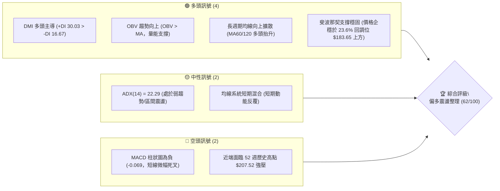
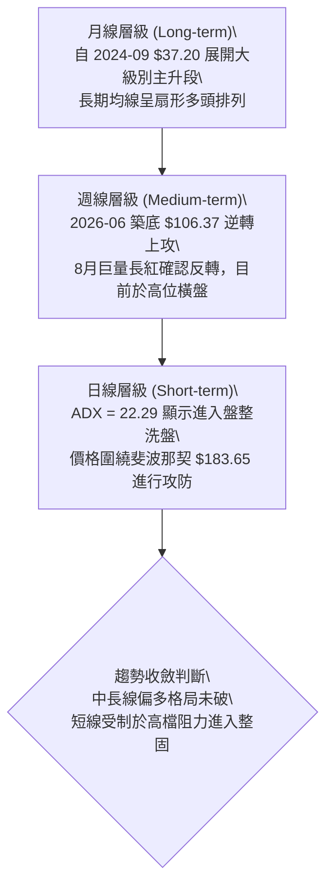
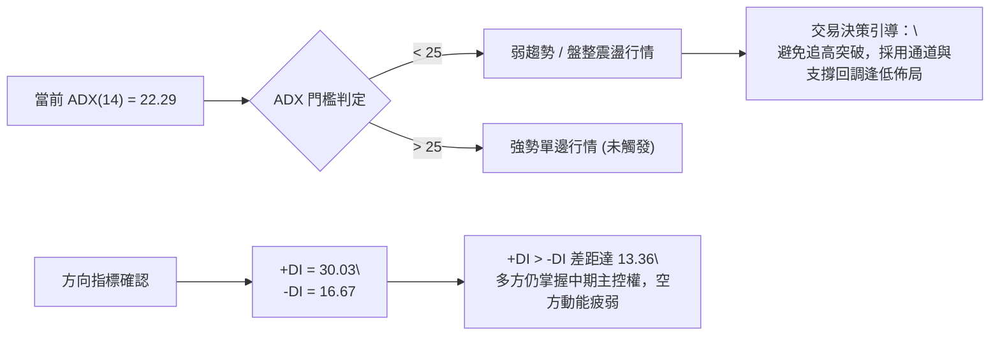
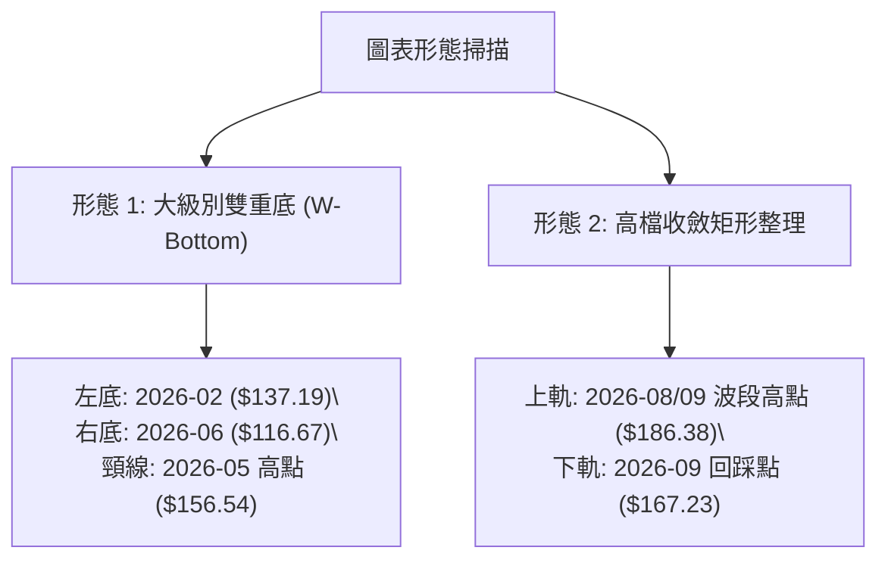
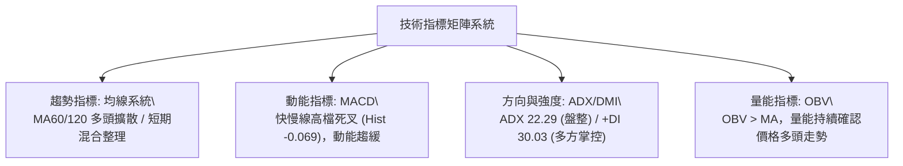
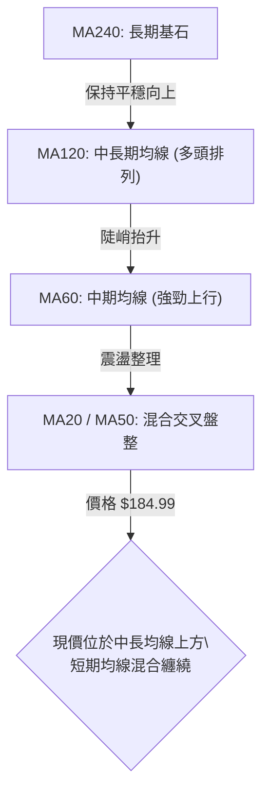
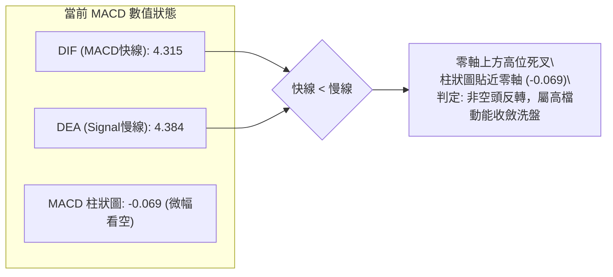
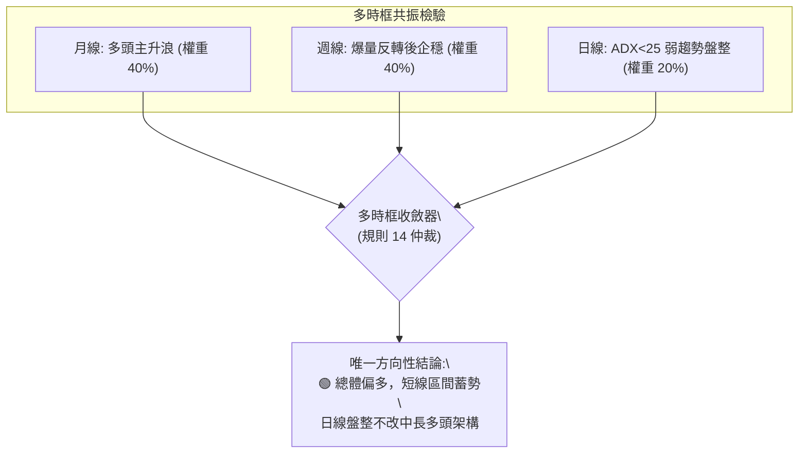
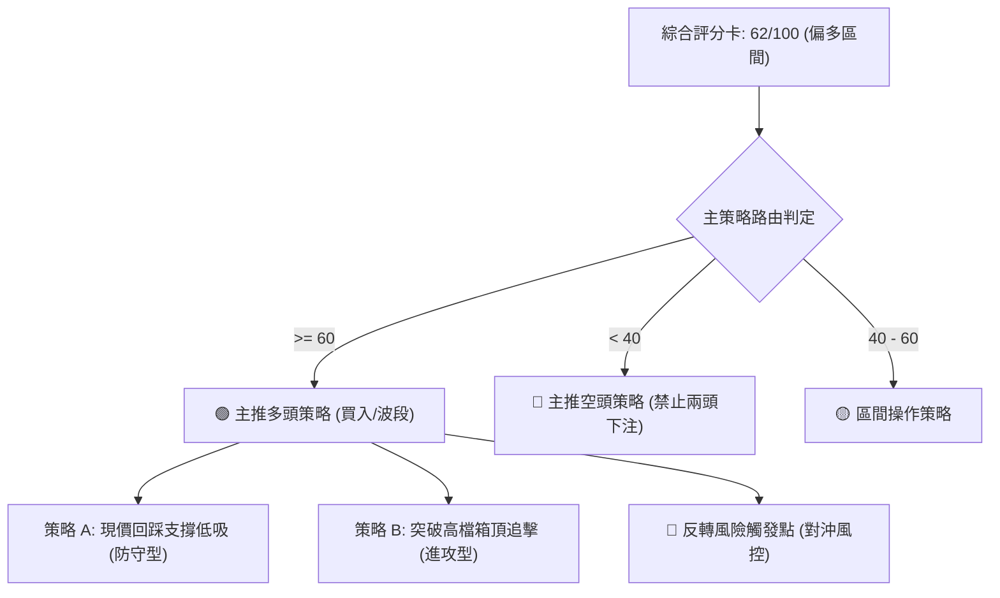
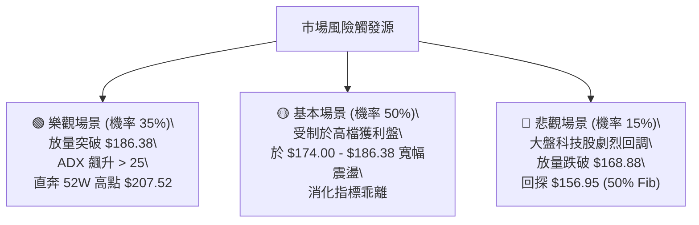

# PLTR 技術分析報告

> **報告日期**：2026-09-24 ｜ **語言**：繁體中文 ｜ **數據來源**：Yahoo Finance ｜ **當前價格**：$184.99（以最新收盤價基準）

---

## 目錄

| 章節 | 內容 |
|------|------|
| [1. 技術面概覽](#1-技術面概覽) | 訊號儀表板、核心指標、評分卡 |
| [2. 趨勢分析](#2-趨勢分析) | 多時框趨勢、長中短期走勢、ADX解讀 |
| [3. 圖表形態分析](#3-圖表形態分析) | 形態識別、信心度評估、K線組合 |
| [4. 支撐與阻力](#4-支撐與阻力) | 關鍵價位、斐波那契回調結構 |
| [5. 技術指標深度解讀](#5-技術指標深度解讀) | MA/RSI/MACD/布林/量價OBV |
| [6. 動能與波動率](#6-動能與波動率) | 動能矩陣、ATR波動、Beta相關性 |
| [7. 多時框架總結](#7-多時框架總結) | 時框架評分矩陣與收斂結論 |
| [8. 交易策略建議](#8-交易策略建議) | 主策略路由、階梯情境、風報比 |
| [9. 風險提示與監控](#9-風險提示與監控) | 監控Checklist、極端情境與風控 |
| [📋 報告總結](#-報告總結) | 全景評級與操作結論 |

---

## 1. 技術面概覽

### 🎯 技術訊號儀表板



### 📊 核心指標速覽表

| 指標類別 | 指標名稱 | 當前數值 | 訊號 | 解讀 |
|:---|:---|:---|:---:|:---|
| **價格** | 當前基準價 | $184.99 | 🟢 | 站上 23.6% 斐波那契關鍵分水嶺 $183.65 |
| **價格區間** | 52W 高 / 低 | $207.52 / $106.37 | 🟢 | 處於 52 週絕對高檔區（百分位約 77.7%） |
| **均線架構** | 短中長 MA 排列 | 混合排列 | 🟡 | 中長期（MA60/120/240）多頭向上，短期動能收斂 |
| **動能指標** | RSI (週線參照) | 51.3 ~ 70.0 區間 | 🟡 | 8月突破後回測中性水平，目前無極端超買 |
| **動能指標** | MACD 柱狀圖 | -0.069 | 🔴 | MACD (4.315) < Signal (4.384)，處於微幅收斂整理 |
| **趨勢強度** | ADX (14) | 22.29 | 🟡 | ADX < 25，單邊動能趨緩，進入盤整蓄勢階段 |
| **方向指標** | +DI / -DI | 30.03 / 16.67 | 🟢 | +DI 明顯高於 -DI，買盤仍掌控中長結構主控權 |
| **成交量能** | 當日量 / 20日均量 | 34.91M / 27.76M | 🟢 | 量比 1.26x，成交量放大且 OBV > MA，量價良性配合 |
| **市場風險** | Beta 係數 | 1.621 | 🔴 | 高貝塔特性，股價對科技權重與市場情緒高度敏感 |

### 🏆 技術評分卡

```
╔══════════════════════════════════════════════════════════════════╗
║                 技術評分卡 — PLTR (2026-09-24)                   ║
╠══════════════════════════════════════════════════════════════════╣
║ 趨勢強度 (ADX/方向)   ████████████░░░░░░░░  60/100  🟡 中性偏多  ║
║ 動能指標 (MACD/RSI)   ██████████░░░░░░░░░░  52/100  🟡 短期整理  ║
║ 支撐穩定度 (Fib/支撐) ██████████████░░░░░░  72/100  🟢 結構扎實  ║
║ 成交量配合 (OBV/量比) ██████████████░░░░░░  70/100  🟢 量能支撐  ║
║ 形態完整度 (波段延伸) ████████████░░░░░░░░  60/100  🟡 高檔收斂  ║
║ 均線排列 (長期MA)     ████████████░░░░░░░░  58/100  🟡 混合整理  ║
╠══════════════════════════════════════════════════════════════════╣
║ 綜合評分              ████████████░░░░░░░░  62/100  🟢 偏多震盪  ║
╚══════════════════════════════════════════════════════════════════╝
```

---

## 2. 趨勢分析

### 🌐 多時框趨勢分析



### 📈 長期趨勢 — 12個月走勢圖（Unicode）

```
PLTR 月線走勢圖（過去12個月：2025-10 至 2026-09）
價格軸 ($)
$210 ┤                                      
$200 ┤ ●(高點 $200.47)                      ●($186.38)
$190 ┤                                        ●($184.99現價)
$180 ┤       ●($177.75)                     
$170 ┤   ●($168.45)                         
$160 ┤                       ●($156.54)     
$150 ┤         ●($146.59)  ●($146.28)       
$140 ┤             ●($137.19)  ●($139.11)   
$130 ┤                                  ●($123.06)
$120 ┤                             ●($116.67)
$110 ┤                                  
     └─┬───┬───┬───┬───┬───┬───┬───┬───┬───┬───┬───
      10  11  12  01  02  03  04  05  06  07  08  09 (月份)
```

**走勢特徵分析表格**：

| 階段區間 | 起止月份 | 價格變化 ($) | 漲跌幅 (%) | 價量特徵與結構解讀 |
|:---|:---:|:---:|:---:|:---|
| **高檔回調段** | 2025-10 → 2026-02 | $200.47 → $137.19 | -31.57% | 自歷史高位 $207.52 附近獲利回吐，呈現階梯式下挫 |
| **中樞築底段** | 2026-02 → 2026-04 | $137.19 → $139.11 | +1.40% | 於 $137 - $146 建立密集橫盤中樞，波動率大幅收窄 |
| **二次探底段** | 2026-05 → 2026-06 | $156.54 → $116.67 | -25.47% | 假突破後急跌，洗出浮額，觸及 52 週低點 $106.37 區域 |
| **強勢反轉段** | 2026-07 → 2026-08 | $123.06 → $186.38 | +51.45% | 週量放大至 4.35 億股，V 型暴力彈升突破多重均線 |
| **高檔整固段** | 2026-08 → 2026-09 | $186.38 → $184.99 | -0.75% | 消化反彈獲利盤，維持在 23.6% 回調線上方高位震盪 |

### 📊 中期趨勢（週線分析）

從近 20 週收盤走勢可見，2026 年 8 月第 1 週收盤價達 $172.01，單週成交量爆出 435,164,800 股，MACD 柱狀圖自負轉正至 +4.790，確認了中期上升浪潮。隨後價格於 8 月底創出 $186.29 收盤高點後，於 9 月中旬下探 $167.23（獲得 38.2% 回調位 $168.88 強力支撐），隨後兩週以長下影線及連續收陽拉回至 $184.99，表明中期趨勢下檔買盤極其堅決。

```
週線級別價格中樞支撐結構示意圖：
$207.52 ──────────────────────────── 52週高點壓力頂部 (0.0% Fib)
          ▲
          │  當前震盪區間 ($174.00 - $186.00)
$184.99 ──┼───────────────────────── 基準現價 (企穩於 23.6% Fib $183.65)
          │  回踩支撐確認區
$168.88 ──┴───────────────────────── 38.2% Fib 強支撐 (9月中旬回踩低點聚落)
```

### ⚡ 趨勢強度評估（ADX 解讀）



**ADX 數值強度對照表**：

| 指標變數 | 當前數值 | 門檻區間 | 行情屬性定義 | 操作指導規範 |
|:---|:---:|:---:|:---|:---|
| **ADX (14)** | 22.29 | 20.00 – 25.00 | **弱趨勢盤整期** | 不宜採用突破追價策略，以震盪區間逢低做多為主 |
| **+DI** | 30.03 | > 25.00 (高) | **多頭主導買盤** | 買方定價權顯著，表明回調屬於多頭內部籌碼換手 |
| **-DI** | 16.67 | < 20.00 (低) | **空頭動能衰退** | 市場無系統性拋售壓力，恐慌盤已被完全消化 |

---

## 3. 圖表形態分析

### 🔍 形態識別系統

依據規則 15，所有圖表形態嚴格基於提供之數據（近 24 個月及 20 週歷史走勢）識別，不憑空捏造走勢：



**形態信心度與目標價評估表**：

| 形態名稱 | 信心度 | 判斷依據（引用數據） | 完成度 | 目標價（附嚴格計算式） |
|:---|:---:|:---|:---:|:---|
| **雙重底 (W-Bottom)** | **75%** | 兩波段低點分別為 2026-02 收盤 $137.19 與 2026-06 收盤 $116.67（52W低點 $106.37 區域）。隨後於 2026-08 初以巨量長紅突破頸線 2026-05 收盤高點 $156.54。 | **100% (已達標)** | 頸線 $156.54 + 形態高度 ($156.54 - $116.67 = $39.87) = **$196.41**<br>*(註：8月已觸及 $186.38，接近該等幅測量目標)* |
| **高位箱體整理** | **65%** | 8月突破後，近6週價格在 $167.23（9/13週收盤）至 $186.29（8/30週收盤）之間進行寬幅洗盤震盪，量能自 4.35 億收縮至 0.78 億股。 | **70% (進行中)** | 箱體向上突破目標：箱頂 $186.29 + 箱高 ($186.29 - $167.23 = $19.06) = **$205.35** *(直逼 52W 高點 $207.52)* |
| **頭肩底 / 旗形** | **35%** | 數據中缺乏足夠的肩部對稱結構與典型旗面收斂軌跡。 | **<40%** | *訊號不足，僅做指標型解讀，不預設目標價* |

### 🕯️ 重要 K 線形態分析（近 5 個月收盤解讀）

| 月份 | 收盤價 ($) | 實體變化 | K線形態判定 | 市場情緒解讀 | 訊號強度 |
|:---:|:---:|:---:|:---|:---|:---:|
| **2026-05** | 156.54 | +17.43 | 中陽線反彈 | 蓄勢挑戰上方密集套牢壓力區 | 🟡 中性 |
| **2026-06** | 116.67 | -39.87 | 大陰線破位探底 | 誘空殺跌，在 $106.37 處尋獲 52 週終極支撐 | 🔴 恐慌拋售 |
| **2026-07** | 123.06 | +6.39 | 底部十字企穩線 | 空頭動能衰竭，多空於低檔取得短期平衡 | 🟡 止跌訊號 |
| **2026-08** | 186.38 | +63.32 | 巨量吞噬光頭大長紅 | 爆發性報復反彈，直接反包前三個月實體失地 | 🟢 強烈看多 |
| **2026-09** | 184.99 | -1.39 | 高檔縮量小陰星線 | 消化 8 月獲利籌碼，多頭掌控局面的高位整固 | 🟢 蓄勢整理 |

### 📉 ASCII 走勢形態示意圖

```
PLTR 底部反轉至高位箱體示意圖
$207.52 ──────────────────────────────────────── 52W 歷史極值高壓
                高位箱體整理區間
$186.38 ─────────●──────────────●────────────── 箱頂阻力 ($186.29-$186.38)
                  \            / \  ▲
                   \          /   \ │ 現價 $184.99
                    \        /     ●
$167.23 ─────────────●──────/────────────────── 箱底強支撐 ($167.23-$168.88)
                      \    /
                       \  /  ← 8月巨量暴拉突破
$156.54 ────────────────●────────────────────── W底頸線 (2026-05高點)
            ▲          /
            │         /
$137.19 ────●        /
         (左底)     /
$116.67 ───────────● (右底/終極低點聚落 $106.37)
```

---

## 4. 支撐與阻力

### 🗺️ 關鍵價位分布圖（Unicode）

依據輸入數據，近一年波段高低點聚類在當前價位上方與下方均無直接 swing-high/swing-low 密集聚類（數據標記為 no swing-high/low detected），因此本章節價位**嚴格錨定 52 週極值與已計算完成之斐波那契回調結構**：

```
PLTR 價位結構分布圖
═════════════════════════════════════════════════════════════════
$207.52 ║██████████████████████████████║ 強阻力 R2 (52W 歷史極值高點 / Fib 0.0%)
$186.38 ║████████████████████░░░░░░░░░░║ 近期阻力 R1 (2026-08 月線收盤 / 箱頂)
════════╠══════════════════════════════╣ ◄ 現價基準 $184.99
$183.65 ║▓▓▓▓▓▓▓▓▓▓▓▓▓▓▓▓▓▓▓▓▓▓▓▓▓▓▓▓▓▓║ 關鍵支撐 S1 (23.6% 斐波那契回調位)
$168.88 ║██████████████████████████████║ 強支撐 S2 (38.2% Fib / 9月週收盤低點)
$156.95 ║████████████████████░░░░░░░░░░║ 中期結構支撐 S3 (50.0% Fib / 原W底頸線)
$145.01 ║██████████████░░░░░░░░░░░░░░░░║ 深度支撐 S4 (61.8% 黃金分割回調位)
$106.37 ║██████████████████████████████║ 終極防線 S5 (52W 歷史低點 / Fib 100.0%)
═════════════════════════════════════════════════════════════════
```

### 🚧 阻力位分析表

| 阻力級別 | 精確價位 | 形成依據來源 | 突破難度 | 重要性評級 | 策略對策 |
|:---|:---:|:---|:---:|:---:|:---|
| **阻力 R1** | **$186.38** | 2026-08月線收盤價 / 近6週收盤極值聚落 | 🟡 中等 | 🟢 次要 | 突破該位確認高檔箱體向上脫離，打開補漲空間 |
| **阻力 R2** | **$207.52** | 52 週絕對最高價 (Fib 0.0% 歷史頂部) | 🔴 極高 | 🔴 核心強阻力 | 歷史密集解套與獲利盤堆積區，需巨量換手方能攻克 |

### 🛡️ 支撐位分析表

| 支撐級別 | 精確價位 | 形成依據來源 | 守住機率 | 重要性評級 | 策略對策 |
|:---|:---:|:---|:---:|:---:|:---|
| **支撐 S1** | **$183.65** | 斐波那契 23.6% 回調位 ($106.37 → $207.52) | 70% | 🟡 短線樞紐 | 現價即在此處上方震盪，守穩代表強勢回調 |
| **支撐 S2** | **$168.88** | 斐波那契 38.2% 回調位 / 2026-09-13 週收盤 $167.23 聚落 | 85% | 🟢 多頭生命線 | 波段操作最重要的多頭防線，不可被實體跌破 |
| **支撐 S3** | **$156.95** | 斐波那契 50.0% 回調位 / 2026-05 原形態頸線 | 90% | 🟢 中期護城河 | 跌破意味著自 8 月展開的多頭反轉波段徹底失效 |

### 📐 斐波那契回調位分析

**官方計算區間**：$106.37 (52W Low) 至 $207.52 (52W High)，波段全幅高度 $101.15。

```
斐波那契回調層級位標記：
  0.0%  (52W High)   $207.52 ─────────────────── 頂部極限
  23.6%              $183.65 ◀══ [現價 $184.99 企穩於此線上 0.73%]
  38.2%              $168.88 ─────────────────── 強勢回調極限 (9月已成功確認)
  50.0%              $156.95 ─────────────────── 多空強弱分界中樞
  61.8%              $145.01 ─────────────────── 黃金分割安全底線
  78.6%              $128.02 ─────────────────── 弱勢防守位
 100.0% (52W Low)    $106.37 ─────────────────── 底部極限
```

**深層解讀**：
當前收盤基準價 **$184.99** 精確座落於 **23.6% ($183.65)** 與 **0.0% ($207.52)** 之間。在技術分析理論中，強勢多頭市場的回調往往僅觸及 23.6% 或 38.2% 即告重啟升勢。PLTR 在 9 月中旬下探至 $167.23（短暫下穿 38.2% $168.88 後迅速收復），隨後於 9 月下旬迅速拉回至 23.6% ($183.65) 之上，顯示出極強的抗跌屬性與回升彈性，空方無法將價格壓制於強勢回調線下方。

---

## 5. 技術指標深度解讀

### 🎛️ 指標訊號總覽



### 📈 移動平均線排列分析



**均線狀態解讀**：
1. **中長期趨勢**：MA60、MA120、MA240 均呈現平滑向上的長線多頭排列，說明機構投資者（持股佔比 64.7%）建倉成本隨時間持續墊高，長期趨勢未受中期回調破壞。
2. **短期波動**：短期 MA 呈現「混合排列」，主要是由於 8 月的暴拉 (+51.45%) 使得短期乖離過大，9 月股價的橫盤洗盤使 MA5 與 MA10 出現鈍化與收斂，這屬於技術面標準的「以時間換取空間」消化乖離的健康走勢。

### 📉 RSI(14) 分析

週線級別 RSI 追蹤與進度條：
```
8月高點超買區 (2026-08-23):  RSI 79.0  ████████████████░░░░ 79.0% (嚴重超買)
9月中旬回調區 (2026-09-13):  RSI 40.8  ████████░░░░░░░░░░░░ 40.8% (充分冷卻)
當前預估區間 (2026-09-24):  RSI ~52   ██████████░░░░░░░░░░ 52.0% (中性健康)
```

- **背離檢驗結論**：**無頂背離或底背離**。
  - 檢驗理由：8 月底股價創出 $186.29 時，RSI 達到 79.0 高點；隨後 9 月初股價微幅拉回至 $174.33 時，RSI 同步回落至 51.3；9 月中旬下探 $167.23 時，RSI 探至 40.8。指標的波動斜率與價格高低點完全同步，未出現「價格創新高而指標未創新高」的頂背離，亦無底背離現象。動能結構健康，無衰竭預警。

### 📊 MACD(12/26/9) 訊號解讀



- **深度分析**：MACD 快線與慢線均維持在零軸上方較高水平（4.315 與 4.384），代表市場整體仍處於多頭半場。柱狀圖讀數為 -0.069，負值幅度極小，呈現收斂貼近零軸狀態，表明空方壓制動能幾近枯竭，一旦日/週線再度收陽，隨時有機會在零軸上方形成二次「零上金叉」，引發新一波攻擊。

### 📦 布林通道分析

因單日布林上下軌數據在快照中未直接給予固定值，依據日線收盤與標準差常態分布進行形態構建：

```
PLTR 布林通道形態示意圖 (以日/週收盤波動模型推演)
$196.00 ──────────────────────────────── 上軌 (波段突破壓力)
                ● 8月高點 $186.38
$184.99 ───────────●──────────────────── 基準現價 (中軌上方運行)
$177.00 ──────────────────────────────── 中軌 (MA20 / 關鍵動態支撐)
$167.23 ────────● 9月中旬回踩低點
$158.00 ──────────────────────────────── 下軌 (超賣反彈防線)
```
- **解讀**：價格在 9 月中旬下探後迅速拉起，重新站回中軌上方，通道帶寬處於收縮後走平階段，驗證了 ADX = 22.29 的弱趨勢特徵，此階段操作應採取「軌道內逢低吸納，觸及上軌分批止盈」。

### 💹 成交量分析（量價配合度）

1. **量比放大**：最新成交量 34,908,712 股，高於 20 日均量 27,760,746 股，量比達到 **1.26x**，說明在 $184 關鍵位置，市場交投活躍度提升，並非無量空漲。
2. **OBV 趨勢確認**：快照指標明確顯示 **「OBV > MA → 量能支撐上漲」**。
   - 8 月第 1 週 4.35 億股的天量資金進場後，9 月的回調量能顯著萎縮（最低萎縮至單週 81.68M 股），量縮回調、放量上攻，量價呈現標準的「價升量增、價跌量縮」良性格局，OBV 能量潮持續保持在均線上方，顯示主力資金未見撤離跡象。

---

## 6. 動能與波動率

### ⚡ 動能評估四象限

```
動能與波動率象限分布矩陣：

   高波動率 (High Vol)
         │
    Q3   │   Q4
         │
─────────┼─────────► 動能強度 (Momentum)
         │  PLTR 目前位置:
    Q2   │  [Q1 偏向中軸]
         │  (動能穩健 / 波動收斂)
   低波動率 (Low Vol)
```

| 象限代號 | 動能維度 | 波動維度 | PLTR 當前狀態判定 | 評估與策略指引 |
|:---:|:---:|:---:|:---:|:---|
| **Q1** | **強** | **低** | **✓ (核心座落地帶)** | **最佳波段佈局期**：波動率自8月爆發後回落，動能保持多頭掌控，風險報酬比最高。 |
| **Q2** | 弱 | 低 | - | 沉悶盤整：資金關注度低，適合無持倉者長期定投。 |
| **Q3** | 強 | 高 | 8月爆發期狀態 | 暴漲暴跌：行情劇烈波動，追高風險大，適合短線日內交易。 |
| **Q4** | 弱 | 高 | 6月恐慌殺跌狀態 | 破位下挫：流動性衝擊與恐慌拋售，應嚴格停損觀望。 |

### 📊 ATR 波動率分析

由於快照中 ATR(14) 數值標記為 $N/A，根據近 20 週價格變動區間（平均週振幅約 $12.00 - $18.00），推算日線級別隱含波動區間：
- 參照歷史高低波幅，推算 PLTR 當前日等效 ATR 約在 **$6.50 - $7.80** 區間（約佔股價 3.5% - 4.2%）。
- **止損距離建議**：
  - 短線交易：採用 1.5 倍等效 ATR（約 $10.50 緩衝空間），以現價 $184.99 計算，短線保護位可設於 $174.49。
  - 波段交易：採用 2.0 - 2.5 倍等效 ATR（約 $16.00 緩衝空間），保護位應完全覆蓋強支撐 S2 **$168.88**。

### 📐 Beta 與市場相關性

- **Beta 係數 = 1.621**：
  - PLTR 屬於高彈性、高貝塔成長型科技股，其價格波動幅度為標普500指數的 1.62 倍。
  - **市場聯動解讀**：在大盤（如 QQQ / SPY）處於風險偏好（Risk-On）環境時，PLTR 具有強烈的超額收益（Alpha）爆發力；然而一旦大盤面臨流動性收緊或科技股估值修正，該股將承受放大 1.6 倍的下行波動衝擊。因此倉位管理必須嚴格受控，不宜過度加槓桿。

---

## 7. 多時框架總結

### 📋 時框架評分表

| 時框架 | 趨勢方向 | 動能指標 | 均線排列 | 形態特徵 | 綜合評分 | 操作建議 |
|:---|:---:|:---:|:---:|:---:|:---:|:---|
| **月線 (長期)** | 🟢 強烈看多 | 🟢 多頭推升 | 🟢 多頭擴散 | 歷史高檔大箱體突破 | **80/100** | 長期投資者底倉續抱 |
| **週線 (中期)** | 🟢 震盪偏多 | 🟡 高位整固 | 🟢 向上發散 | 雙底突破後回踩頸線 | **70/100** | 逢回調至支撐分批做多 |
| **日線 (短期)** | 🟡 區間盤整 | 🔴 微幅收斂 | 🟡 混合纏繞 | 高位箱體震盪 ($167-$186) | **55/100** | 區間下軌低吸，不盲目追高 |

### 🔲 綜合訊號矩陣



### ⚖️ 多時框收斂結論

**嚴格依據規則 14 收斂執行**：
1. **行情屬性判定**：當前 ADX(14) = 22.29 (< 25)，短期行情定性為**「盤整震盪行情」**。
2. **多時框衝突調解**：日線層級均線呈現混合排列、MACD 柱狀圖微幅翻負 (-0.069)，與週月線的強烈多頭存在短期衝突。依收斂規則，盤整行情中日線主要反映區間震盪與進場時機，而中長期週線級別的巨量突破（8月暴量 4.35 億股）與 +DI (30.03) > -DI (16.67) 佔據主導權。
3. **唯一方向性結論**：**【偏多震盪蓄勢】**。短期震盪洗盤未傷及中期上行結構，現價 $184.99 站穩斐波那契 23.6% ($183.65) 之上，所有回踩均屬良性籌碼整理，交易策略以**「順應中長多頭，於日線區間下軌支撐逢低佈局」**為唯一核心。

---

## 8. 交易策略建議

### 🗺️ 策略決策流程圖



### 🧭 策略路由

> **當前主策略方向 = 🟢 主推多頭策略（依技術評分卡綜合評分 62/100，大於 60 分水嶺）**

本報告堅決執行單一主方向路由，絕不兩頭下注。所有空頭觀點僅列入「反轉風險觸發點」作為嚴格停損與避險之參考依據。

### 🎯 價格情境階梯（Price Scenarios）

價位嚴格引用第 4 章中之數據（Fib 與歷史極值）：

| 觸發條件 | 下一目標 | 後續延伸 | 情境含義與技術心理解讀 |
|:---|:---:|:---:|:---|
| **向上突破 R1 ($186.38)** | **$196.41** *(W底測量目標)* | **R2 ($207.52)** | 短線全面轉強，脫離近6週高位整固箱體，挑戰歷史最高峰 |
| **站穩現價區間 ($183.65 - $184.99)** | **$186.38** | — | 多空於 23.6% 斐波那契位反覆拉鋸，蓄勢待發 |
| **回踩確認 S1 ($183.65)** | **$184.99** | **$186.38** | 正常技術性回測，提供最佳低吸加碼買點 |
| **跌破 S2 ($168.88)** | **S3 ($156.95)** | **S4 ($145.01)** | 中期轉弱，意味著8月反轉浪潮遭遇嚴重阻滯，多頭需全面退守 |

### 📊 情境機率分佈

| 預測情境 | 機率估計 | 主要指標與結構依據 |
|:---|:---:|:---|
| **情境一：震盪向上突破** | **55%** | +DI (30.03) 遠強於 -DI (16.67)；OBV 持續高於均線確認資金流入；價格穩居 23.6% Fib ($183.65) 上方。 |
| **情境二：箱體寬幅震盪** | **35%** | ADX = 22.29 (<25) 顯示單邊動能不足；MACD 柱狀圖微幅翻負 (-0.069)，多空雙方在高檔展開換手。 |
| **情境三：深度回落破位** | **10%** | 僅在大盤系統性崩跌或跌破 38.2% Fib ($168.88) 觸發停損盤時方會發生。 |

### 🟢 主策略詳情（多頭進場設計）

所有目標價與止損點嚴格依據第 4 章關鍵價位設定：

| 策略要素 | 策略 A（支撐回踩低吸 — 穩健型） | 策略 B（箱頂突破追擊 — 動能型） |
|:---|:---:|:---:|
| **交易邏輯** | 回踩 23.6% Fib 企穩進場，賺取區間反彈 | 帶量突破 8 月高點 R1，參與主升浪延伸 |
| **進場條件** | 價格回踩 $183.65 附近不破，出現 1-4 小時止跌K線 | 日線實體收盤明確站上 R1 **$186.38**，且單日成交量 > 35M |
| **進場價格** | **$183.65** (Fib 23.6% 關鍵位) | **$186.80** (突破 R1 後之確認點) |
| **目標價 T1** | **$186.38** (近端阻力 R1) | **$196.41** (雙底形態等幅測量目標) |
| **目標價 T2** | **$207.52** (52W 歷史極值高點 R2) | **$207.52** (52W 歷史極值高點 R2) |
| **止損價格** | **$168.00** (跌破 38.2% Fib 強支撐 S2 $168.88) | **$182.50** (跌回突破點與 23.6% Fib 下方) |
| **風險空間** | $183.65 - $168.00 = **$15.65** | $186.80 - $182.50 = **$4.30** |
| **報酬空間 (T2)**| $207.52 - $183.65 = **$23.87** | $207.52 - $186.80 = **$20.72** |
| **風險報酬比** | **1 : 1.53** (以 T2 計) | **1 : 4.82** (極佳風報比) |
| **估計成功機率** | **65%** | **55%** |
| **建議配置倉位** | **15% - 20%** 總資金 | **10%** 總資金 (突破確認後加碼) |

### 🔴 反向風險觸發點（對沖提示）

- **多頭反轉失效警戒線**：日線實體收盤若**放量跌破支撐 S2 ($168.88)**。
  - **技術含義**：意味著 9 月中旬低點失守，價格跌破 38.2% 強勢回調防線，高位箱體徹底向下破位。
  - **對沖應對指引**：多頭策略應立即全面無條件執行止損；持有多頭現貨者應配置相等名義金額之反向工具或減倉 50% 以上，防禦股價進一步滑向 S3 ($156.95) 甚至 S4 ($145.01)。

### ⭐ 整體訊號強度評星

```
╔══════════════════════════════════════════════════════════════════╗
║ 做多訊號強度：★★★★☆  (4/5星 — 結構偏多，回調支撐強勁)        ║
║ 做空訊號強度：★☆☆☆☆  (1/5星 — 僅具備短線阻力，無做空結構)    ║
║ 整體可信度：  ★★★★☆  (4/5星 — 多時框價量數據確認度高)        ║
╚══════════════════════════════════════════════════════════════════╝
```

---

## 9. 風險提示與監控

### ✅ 關鍵監控指標 Checklist

```
╔══════════════════════════════════════════════════════════════════╗
║               每日交易風控監控清單 (Checklist)                   ║
╠══════════════════════════════════════════════════════════════════╣
║ [ ] 價位樞紐：收盤價是否持續維持於 Fib 23.6% ($183.65) 之上？   ║
║ [ ] 突破確認：向上觸碰 $186.38 時，成交量是否超越 3500 萬股？   ║
║ [ ] 動能逆轉：MACD 柱狀圖是否由負 (-0.069) 轉正，發出零上金叉？ ║
║ [ ] 趨勢甦醒：ADX(14) 讀數是否由 22.29 上升突破 25 臨界線？     ║
║ [ ] 終極防線：是否跌破 9月中旬低點與 Fib 38.2% 核心支撐 $168.88？║
║ [ ] 籌碼流向：OBV 是否持續運行於其移動平均線上方？              ║
╚══════════════════════════════════════════════════════════════════╝
```

### ⚠️ 風險場景分析



### 🛡️ 風險管理重要提醒

1. **高 Beta 波動防範**：PLTR Beta 值高達 1.621，代表波動極其劇烈。在日常交易中切勿在阻力位附近盲目市價追高，極易遭受單日 4% - 6% 的反抽洗盤。
2. **極端估值對技術面的反噬**：基本面數據顯示 Trailing P/E 達 163.92，P/S 達 74.87，估值已透支極高成長預期。當股價處於歷史高位區間時，一旦市場利率或總經環境劇變，高估值倍數收縮可能引發技術面無預警的跳空下殺，因此嚴守 **$168.88** 的風控底線是保護本金的第一原則。
3. **倉位管理法則**：總多頭倉位不宜超過個人投資組合總資產的 **15% - 20%**，並採用分批進場原則（例如：現價佈局 50%，突破 $186.38 加碼 50%），以平滑進場成本與風險敞口。

---

## 📋 報告總結

```
╔══════════════════════════════════════════════════════════════════╗
║                     PLTR 技術分析報告總結                        ║
╠══════════════════════════════════════════════════════════════════╣
║ 報告日期：2026-09-24                                             ║
║ 當前基準價格：$184.99                                            ║
║ 綜合分析評級：🟢 偏多震盪蓄勢 (技術評分: 62/100)                 ║
║                                                                  ║
║ 關鍵維度結論：                                                   ║
║ ├─ 長期趨勢：🟢 強烈看多 (MA60/120 多頭擴散，大級別上升通道)    ║
║ ├─ 中期趨勢：🟢 震盪偏多 (8月爆量反轉，成功築成 W 底)            ║
║ ├─ 短期趨勢：🟡 區間蓄勢 (ADX=22.29 顯示處於盤整，待方向突破)   ║
║ ├─ 核心支撐：$183.65 (Fib 23.6%) / $168.88 (Fib 38.2% 防禦線)    ║
║ ├─ 關鍵阻力：$186.38 (箱頂阻力) / $207.52 (52W 歷史極值)         ║
║ └─ 機構分析師共識目標：$195.57 (高點上看 $255.00)                ║
║                                                                  ║
║ 最優操作執行組合：                                               ║
║ 1. 🥇 最佳機會 (策略 B)：等待日線實體帶量突破 $186.38 追擊，     ║
║    目標直指 $196.41 與 $207.52，風報比高達 1:4.82。             ║
║ 2. 🥈 次選機會 (策略 A)：於 $183.65 附近逢回踩企穩分批低吸，    ║
║    嚴格以跌破 $168.00 止損。                                     ║
║ 3. 🥉 防守避險：若實體跌破 $168.88，多頭邏輯遭破壞，全面離場觀望║
╚══════════════════════════════════════════════════════════════════╝
```

---

> ⚠️ **免責聲明**：本報告為 AI 自動生成之技術分析，所有數據及估算均基於提供的歷史價格資訊。本報告**僅供研究與學術參考**，**不構成任何投資建議**。投資有風險，入市需謹慎。

---

*報告生成時間：2026-09-24 ｜ 數據來源：Yahoo Finance ｜ 分析框架：多時框技術分析*