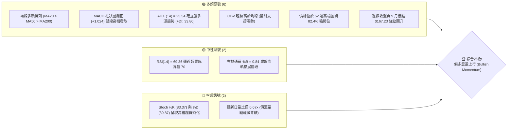
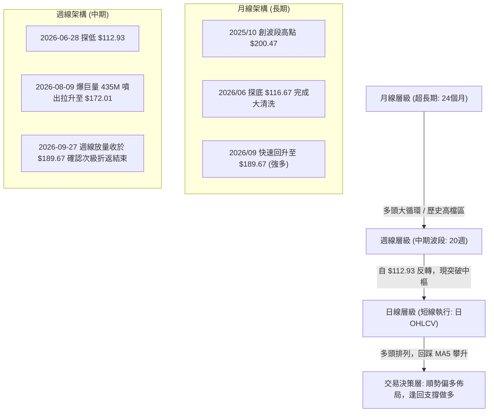
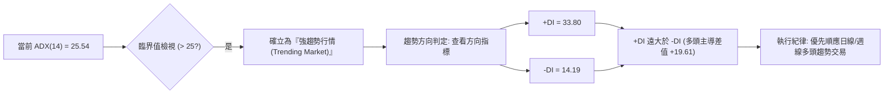
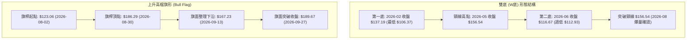
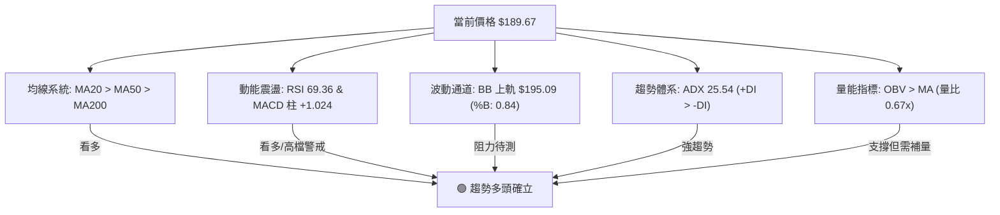
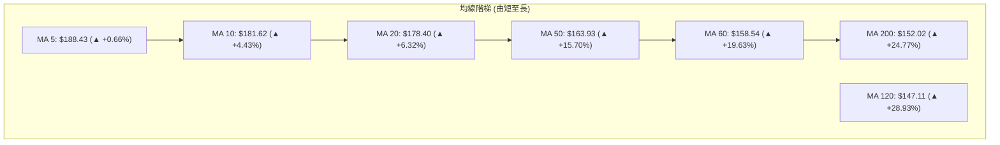
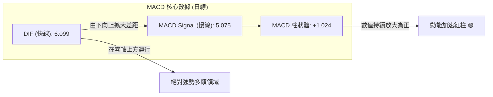
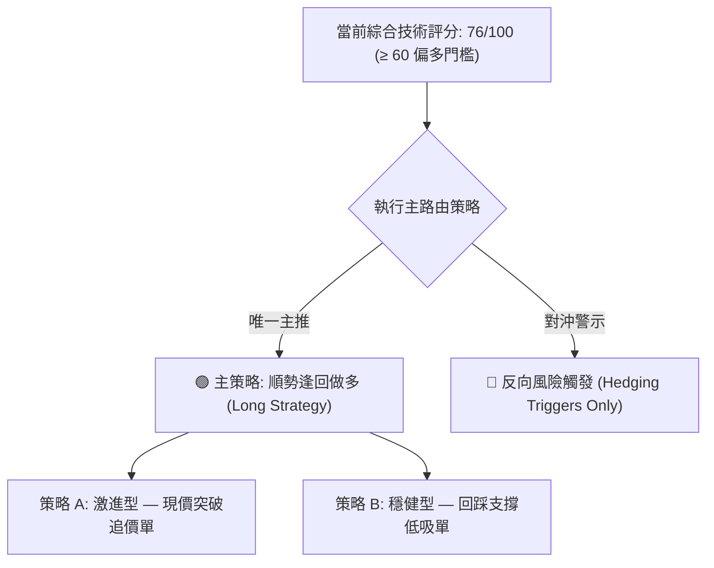
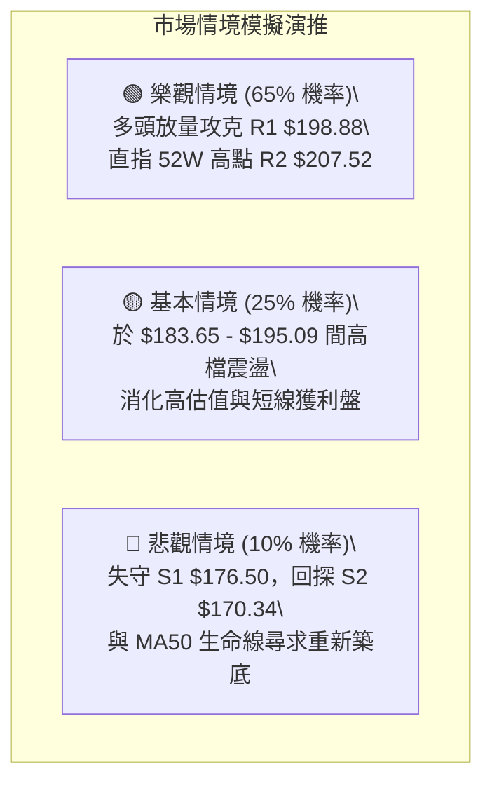

# PLTR 技術分析報告

> **報告日期**：2026-09-28 ｜ **語言**：繁體中文 ｜ **數據來源**：Yahoo Finance ｜ **當前價格**：$189.67

---

## 目錄

| 章節 | 內容 |
|------|------|
| [1. 技術面概覽](#1-技術面概覽) | 訊號儀表板、核心指標、評分卡 |
| [2. 趨勢分析](#2-趨勢分析) | 多時框趨勢、長中短期走勢、12個月ASCII圖 |
| [3. 圖表形態分析](#3-圖表形態分析) | 形態識別、信心度評估、K線組合 |
| [4. 支撐與阻力](#4-支撐與阻力) | 關鍵價位架構、斐波那契回調深度解析 |
| [5. 技術指標深度解讀](#5-技術指標深度解讀) | 均線系統、RSI、MACD、布林通道與量價 |
| [6. 動能與波動率](#6-動能與波動率) | 四象限評估、ATR 波動管理、Beta 特性 |
| [7. 多時框架總結](#7-多時框架總結) | 時框矩陣、訊號一致性與收斂結論 |
| [8. 交易策略建議](#8-交易策略建議) | 策略路由、主推多頭策略、風險對沖點 |
| [9. 風險提示與監控](#9-風險提示與監控) | 監控清單、情境模擬與風控原則 |
| [📋 報告總結](#-報告總結) | 核心結論與執行路徑摘要 |

---

## 1. 技術面概覽

### 🎯 技術訊號儀表板



---

### 📊 核心指標速覽表

| 指標類別 | 指標名稱 | 當前數值 | 訊號 | 專業解讀 |
|----------|----------|----------|------|----------|
| **價格結構** | 收盤價 | $189.67 | 🟢 強多 | 站穩短期所有均線，位於 52 週高低點之 82.4% 處 |
| **短期均線** | MA20 (布林中軌) | $178.40 | 🟢 看多 | 乖離率 +6.32%，中軌為短線極強動能防守線 |
| **中期均線** | MA50 | $163.93 | 🟢 看多 | 乖離率 +15.70%，中期多頭生命線持續墊高向上 |
| **長期均線** | MA200 | $152.02 | 🟢 看多 | 乖離率 +24.77%，奠定牛市架構，下檔安全邊際極厚 |
| **震盪動能** | RSI(14) | 69.36 | 🟡 中性偏多 | 處於強勢推進區，未現頂背離，逼近 70 超買警戒線 |
| **趨勢動能** | MACD (12,26,9) | 6.099 / 5.075 | 🟢 看多 | MACD 柱狀體 +1.024，零軸上方黃金交叉續揚 |
| **隨機指標** | Stoch %K / %D | 83.37 / 89.87 | 🔴 超買警戒 | 兩線均高於 80 進入超買區，需提防短線脈衝回洗 |
| **趨勢強度** | ADX (14) | 25.54 | 🟢 強趨勢 | 突破 25 臨界點；+DI (33.80) 壓倒 -DI (14.19) |
| **通道狀態** | Bollinger Bands | 上軌 $195.09 | 🟡 擴軌承壓 | %B 為 0.84，接近上軌但未發生通道外噴發極端值 |
| **量能狀態** | 成交量 / 20MA量 | 17.78M / 26.36M| 🟡 輕度縮量 | 量比 0.67x，推進動力仰賴籌碼惜售，亟待放量衝刺 |
| **波動風險** | ATR(14) | $5.82 (3.07%) | 🟡 正常波動 | 每日波動維持在正常區間，風控止損需預留緩衝 |

---

### 🏆 技術評分卡

```
╔══════════════════════════════════════════════════════════════════╗
║              技術評分卡 — PLTR (2026-09-28)                      ║
╠══════════════════════════════════════════════════════════════════╣
║ 趨勢強度 (ADX & DI)     ████████████████░░░░  80/100  🟢 強勢主導║
║ 動能指標 (RSI & MACD)   ███████████████░░░░░  75/100  🟢 偏多延續║
║ 支撐穩定度 (結構支撐)    ████████████████░░░░  80/100  🟢 梯隊堅固║
║ 成交量配合 (OBV & 量比)  ████████████░░░░░░░░  60/100  🟡 縮量推升║
║ 形態完整度 (波段突破)    ██████████████░░░░░░  70/100  🟢 形態有效║
║ 均線排列 (完全多頭排布)  ██████████████████░░  90/100  🟢 絕對多頭║
╠══════════════════════════════════════════════════════════════════╣
║ 綜合技術得分             ███████████████░░░░░  76/100  🟢 強烈偏多║
╚══════════════════════════════════════════════════════════════════╝
```

---

## 2. 趨勢分析

### 🌐 多時框趨勢分析



---

### 📈 長期趨勢 — 12個月走勢圖（Unicode）

以下展示自 2025 年 10 月歷史高點至 2026 年 9 月之 12 個月收盤走勢：

```
PLTR 月線走勢圖（過去12個月：2025-10 至 2026-09）
價格軸 ($)
$210 ┤
$200 ┤ ●($200.47 52W區間高點附近)
$190 ┤                                                 ●($189.67 當前收盤)
$180 ┤                     ●($177.75)             ●($186.38)
$170 ┤         ●($168.45)
$160 ┤                                      ●($156.54)
$150 ┤                               ●($146.28)
$140 ┤               ●($146.59)  ●($137.19)  ●($139.11)
$130 ┤                                                       ●($123.06)
$120 ┤                                                 ●($116.67 週期底)
$110 ┤
     └─┬────┬────┬────┬────┬────┬────┬────┬────┬────┬────┬────┬────
      10月 11月 12月 01月 02月 03月 04月 05月 06月 07月 08月 09月
      (2025年) ───────────────> (2026年)
```

#### 走勢特徵分析表格

| 階段別 | 涵蓋月份 | 起訖價位 | 區間漲跌幅 | 走勢本質與量價特徵 |
|--------|----------|----------|------------|--------------------|
| **第一階段：高檔震盪回跌** | 2025-10 ~ 2026-02 | $200.47 → $137.19 | -31.57% | 觸及 52W 高點後形成波段獲利了結賣壓，逐月下階梯回落。 |
| **第二階段：中期築底震盪** | 2026-02 ~ 2026-05 | $137.19 → $156.54 | +14.10% | 區間在 $137~$156 形成盤整帶，多次測試 $139 均線支撐。 |
| **第三階段：恐慌洗盤探底** | 2026-05 ~ 2026-06 | $156.54 → $116.67 | -25.47% | 快速破位殺至年內低點，2026-06-28 爆出 271M 週巨量終結跌勢。 |
| **第四階段：暴力V型反轉** | 2026-06 ~ 2026-09 | $116.67 → $189.67 | +62.57% | 8月首週435M爆量長陽突破，9月完成旗形整理，直指歷史天花板。 |

---

### 📊 中期趨勢（週線分析）

```
週線近8週關鍵架構示意圖（2026-08 至 2026-09）：
$200 ┤                                             [阻力 R1: $198.88]
$190 ┤                                     ┌── ● $189.67 (現價突破)
$180 ┤                     ● $179.94   ● $186.29
$170 ┤         ● $172.01 ───┴─────────────────────┼─ $174.33
$160 ┤        (8月放量大紅棒底部 $165.45)           ● $167.23 (回踩低點聚類 S2)
     └─────────┬───────────┬───────────┬───────────┬──────────
             08-09       08-23       08-30       09-13     09-27
```

從 20 週數據可清晰辨識：
1. **中期拐點確立**：2026-06-28 觸及 $112.93 週收盤低點（對應 52 週最低 $106.37 區域），隨後 RSI 自超賣區 27.8 展開波段反彈。
2. **籌碼主力換手**：2026-08-09 單週成交量爆出 435,164,800 股的天量，將價格一舉推升至 $172.01，奠定了多頭攻堅的核心基石。
3. **高檔旗形整理收斂**：2026-09-06 至 2026-09-20，價格於 $167.23 至 $177.64 進行了為期三週的健康次級回踩，量能萎縮至 81.68M 股，洗盤極為乾淨；隨後於 09-27 當週以 119.57M 放量紅棒收在 $189.67，宣告整理結束，中期主升浪延續。

---

### ⚡ 趨勢強度評估（ADX 解讀）



| ADX 數值區間 | 趨勢特徵 | PLTR 當前狀態 | 交易策略指導原則 |
|--------------|----------|---------------|------------------|
| **0 ~ 20** | 無趨勢 / 雜訊盤整 | 否 | 避免追價，布林通道高出低進 |
| **20 ~ 25** | 趨勢初生 / 蓄勢萌芽 | 否 | 觀察均線排列，等待放量突破 |
| **25 ~ 50** | **強趨勢 / 單邊行情** | **✔ 25.54 (符合)** | **多頭主升段，回踩短期均線強烈做多** |
| **50 ~ 100** | 極強趨勢 / 隨時力竭 | 否 | 需防範乖離過大誘發急速回吐 |

---

## 3. 圖表形態分析

### 🔍 形態識別系統

依據近 24 個月月線與 20 週收盤走勢，嚴格識別出以下主要幾何圖表形態：



#### 形態信心度與目標價評估表

| 形態名稱 | 信心度 | 判斷依據（引用數據） | 完成度 | 目標價（附嚴謹幾何計算式） |
|----------|--------|----------------------|--------|----------------------------|
| **大週期雙底 (W-Bottom)** | **85%** | ① 底一 2026-02 ($137.19) 與底二 2026-06 ($116.67) 構成複合低點帶。<br>② 頸線為 2026-05 月收盤 $156.54。<br>③ 2026-08 以巨量大陽線實體向上放量突破頸線。 | 100% (已突破並兌現) | 頸線 $156.54 + 形態幅度 ($156.54 - $116.67 = $39.87) = **$196.41** (接近阻力 R1 $198.88) |
| **中短期上升旗形 (Bull Flag)** | **75%** | ① 旗桿：8月初自 $123.06 衝至 $186.29 (漲幅 +$63.23)。<br>② 旗面：9月中旬量縮回踩 $167.23 (回調幅度正好守在 38.2% 費波納契處)。<br>③ 突破：最新週收盤 $189.67 越過旗面反抗線。 | 90% (突破確認中) | 突破點 $177.64 + 旗桿等長高度 ($186.29 - $123.06 = $63.23) = **$240.87** (指向上方分析師最高目標 $255.00) |
| **頭肩底形態** | 40% | 左肩 $137.19、頭部 $116.67、右肩不明顯直接拉起。 | 訊號不足 | 數據對稱性不足，**不採納為幾何測幅標準**，僅作均線指標參考。 |

---

### 🕯️ 重要K線形態分析

| 觀測週期 | 收盤價 | 實體與影線特徵 | 技術解讀 | 訊號方向 |
|----------|--------|----------------|----------|----------|
| **2026-06 月K** | $116.67 | 長下影錘子線探底回升 | 終結連續數月陰跌，空頭動能竭盡，洗出浮額籌碼。 | 🟢 強烈見底 |
| **2026-08 月K** | $186.38 | 超大實體大陽線 (+51.4%) | 吞噬前方兩個月盤整實體，主力買盤介入，確認多頭起跑。 | 🟢 主升突破 |
| **2026-09-13 週K**| $167.23 | 縮量十字星回踩測試 S2 | 縮量洗盤確立 $167.23 為短期次級折返之堅固防守底點。 | 🟢 變盤向上 |
| **2026-09-27 週K**| $189.67 | 光頭大陽線包覆前期黑K | 多頭反包攻堅，實體直接越過前波週收盤高點，多方全面控盤。| 🟢 續攻確立 |

---

### 📉 ASCII 走勢形態示意圖

```
PLTR 中期上升旗形 (Bull Flag) 與波段支撐圖解：
$200 ┤                                                   [R2: $207.52 52W高]
$195 ┤                                             [R1: $198.88]
$190 ┤                                             ● $189.67 突破確認！
$185 ┤                             ● $186.29 旗桿頂   /
$180 ┤                            /  ╲             /
$175 ┤                           /     ╲  旗面整理 /  [S1: $176.50]
$170 ┤                          /        ●───────● $174.33
$165 ┤                         /          $167.23 旗底 [S2: $170.34 / S3: $165.45]
$160 ┤                        /
$155 ┤                       / (巨量推升旗桿)
$150 ┤                      /
$125 ┤       ● $123.06 旗桿底
     └───────┴──────────────┴─────────────────────────────────
           2026-08-02     2026-08-30      2026-09-13      2026-09-27
```

---

## 4. 支撐與阻力

### 🗺️ 關鍵價位分布圖（Unicode）

```
PLTR 價位結構分布圖 (Resistance & Support Matrix)
══════════════════════════════════════════════════════════════════
$207.52 ║██████████████████████████████║ 強阻力 R2 (52W歷史天花板 / 0.0% Fib)
$198.88 ║████████████████████░░░░░░░░░░║ 關鍵阻力 R1 (波段高點聚類 / 雙底理論測幅)
$195.09 ║▓▓▓▓▓▓▓▓▓▓▓▓▓▓▓▓▓▓░░░░░░░░░░║ 布林帶動態上軌壓力
$189.67 ╠══════════════════════════════╣ ◄ 現價 (Current Price)
$183.65 ║░░░░░░░░░░░░░░░░░░░░░░░░░░░░░░║ 斐波那契回調位 23.6% (短線第一道緩衝)
$178.40 ║████████████████████░░░░░░░░░░║ MA20 均線動態支撐帶
$176.50 ║████████████████████████░░░░░░║ 近期波段強支撐 S1
$170.34 ║██████████████████████████░░░░║ 次級折返密集支撐 S2
$168.88 ║▓▓▓▓▓▓▓▓▓▓▓▓▓▓▓▓▓▓▓▓▓▓▓▓▓▓▓▓▓▓║ 斐波那契回調位 38.2% (旗面回踩極限)
$165.45 ║██████████████████████████████║ 多頭分水嶺強支撐 S3 (波段防守鐵板)
══════════════════════════════════════════════════════════════════
```

---

### 🚧 阻力位分析表

所有價位均來自提供的歷史高低點聚類與精確幾何計算：

| 阻力級別 | 精確價位 | 距離現價 | 形成技術原因 | 突破難度評估 | 策略重要性 |
|----------|----------|----------|--------------|--------------|------------|
| **R1** | **$198.88** | +4.86% | 近一年波段次高聚類，同時為大雙底形態理論測幅目標（$196.41）之密集賣壓區。 | 🟡 中等 (需日成交量 > 25M 確認) | 短線第一獲利減碼目標點 |
| **R2** | **$207.52** | +9.41% | 52 週最高歷史天花板（Fib 0.0%），套牢解套與獲利平倉之超級共振阻力。 | 🔴 極高 (需大盤配合與放量長紅) | 中期波段攻勢的核心考核關卡 |

---

### 🛡️ 支撐位分析表

所有價位均來自波段低點聚類與指標計算值：

| 支撐級別 | 精確價位 | 距離現價 | 形成技術原因 | 守住機率 | 策略重要性 |
|----------|----------|----------|--------------|----------|------------|
| **S1** | **$176.50** | -6.94% | 接近 MA20 ($178.40) 與 9 月第四週突破平台，短線動能防守位。 | 80% | 短線多頭逢低回踩之首選進場點 |
| **S2** | **$170.34** | -10.19%| 9 月中旬洗盤次級低點聚類 ($167.23~$174.33 區間中軸)，具大量承接盤。 | 88% | 波段操作者之關鍵止損保護錨點 |
| **S3** | **$165.45** | -12.77%| MA50 ($163.93) 上方波段關鍵起漲點，8 月巨量大陽線之實體防線。 | 95% | 中期多頭生死線，跌破則多頭結構破壞 |

---

### 📐 斐波那契回調位分析

依據 52 週極端區間（低點 **$106.37** → 高點 **$207.52**，總垂直價差幅寬 **$101.15**）計算之精確回調階梯：

```
0.0%  (52W High) ────────────────────────────── $207.52 [天花板強阻力 R2]
                                                   ▲
現價 $189.67 位於 23.6% 與 0.0% 之間 (強勢主升區)   │
                                                   ▼
23.6% 回調位    ────────────────────────────── $183.65 [短線黃金防線]
38.2% 回調位    ────────────────────────────── $168.88 [次級回踩共振區 / 吻合 S2]
50.0% 回調位    ────────────────────────────── $156.95 [多空分水嶺 / 吻合頸線 $156.54]
61.8% 回調位    ────────────────────────────── $145.01 [黃金分割強支撐]
78.6% 回調位    ────────────────────────────── $128.02 [深幅折返區]
100.0%(52W Low)  ────────────────────────────── $106.37 [年度大底]
```

#### 斐波那契層級深度解讀：
1. **強勢區間運作**：現價 **$189.67** 穩居於 **23.6% ($183.65)** 之上。在艾略特波浪與技術折返理論中，當資產回調不破 23.6% 或在突破後迅速站回其上方時，代表市場買盤力道極其強勁，屬於典型「強勢攻擊波」。
2. **多空轉換支點**：38.2% 回調位位於 **$168.88**，與 9 月中旬築底週低點 **$167.23** 及支撐 **S2 ($170.34)** 形成高度共振。此共振確認了回調已於黃金分割第一防禦階梯完全消化，多方重新取回發球權。

---

## 5. 技術指標深度解讀

### 🎛️ 指標訊號總覽



---

### 📈 移動平均線排列分析



1. **排列形態判定**：均線呈現教科書般的標準「**完全多頭排列**」（`Price > MA5 > MA10 > MA20 > MA50 > MA200`）。
2. **黃金交叉特徵**：中長期的 MA60 ($158.54) 與 MA50 ($163.93) 均已向上穿越 MA200 ($152.02)，此為極其罕見的中長期多頭確認訊號。
3. **乖離率評估**：現價距離 MA20 為 +6.32%，距離 MA50 為 +15.70%。短線雖有輕度正乖離，但在強趨勢中（ADX > 25），均線將持續加速上行修正乖離，而非必然透過急跌修正。

---

### 📉 RSI(14) 分析

```
RSI(14) 動能強度表：
0        20       40       60   69.36   80      100
├────────┼────────┼────────┼──────●─────┼────────┤
[ 超賣區 ]      [ 弱勢區 ]    [ 強勢推進 ]  [超買區]
進度條：████████████████████████████░░░░░░  69.36%
```

- **當前數值解讀**：RSI(14) 最新讀數為 **69.36**，剛好位於強勢多頭推升區的上限，緊貼 70 超買警戒線。
- **背離檢驗結論**：
  - 檢視 2026-08-30 收盤價 $186.29 時，週 RSI 為 60.8；當前收盤價推進至 $189.67，日 RSI 升至 69.36，週 RSI 升至 69.4。
  - **結論：無頂背離現象**。價格創反彈新高，指標亦同步揚升，表明內部動能並未衰竭，上漲具備真實資金買盤驅動。

---

### 📊 MACD(12,26,9) 訊號解讀



- **雙線零軸位置**：DIF (6.099) 與 DEA (5.075) 均遠高於零軸，表明 PLTR 處於大級別的推升循環之中。
- **柱狀體動能變化**：週線 MACD 柱在經歷了 9 月中旬的收斂萎縮（-3.155、-1.197）後，於 9 月最後一週正式翻紅擴散至 **+1.024**。這代表「次級修正浪結束、主推進浪重新起航」的標誌性買進訊號。

---

### 📦 布林通道分析

```
PLTR 日線布林通道 (20, 2) 當前價位解剖：
$196 ┤
$195 ┤ ─────────────────────────────── 上軌 $195.09
$190 ┤                 ● $189.67 (現價，位於通道上半部，%B = 0.84)
$185 ┤
$180 ┤
$178 ┤ ─────────────────────────────── 中軌 $178.40 (MA20 核心均線)
$170 ┤
$165 ┤
$161 ┤ ─────────────────────────────── 下軌 $161.71
     └────────────────────────────────────────────────
```

- **通道帶寬與形態**：上軌 **$195.09** 與下軌 **$161.71** 形成開口微幅向外擴散狀態，顯示波動度正在溫和放大。
- **%B 指標解讀**：當前 **%B = 0.84**。數值處於 0.8 至 1.0 之間，表示價格沿著通道「上軌走廊」推進。在牛市趨勢行情中，此乃極強動能現象，唯有當價格穿出上軌（%B > 1.0）並收出十字星或長上影線時，方有反轉修正隱患。當前 $189.67 距離上軌尚有約 $5.42（+2.86%）的平滑運行空間。

---

### 💹 成交量分析（量價配合度）

1. **現階段量能特徵**：最新成交量為 **17.78M**，相較於 20 日均量 **26.36M**，量比僅為 **0.67x**；相較於 50 日均量 **35.67M** 更是明顯偏低。
2. **量價關係判讀**：
   - 「**價漲量縮**」在震盪盤中常被視為動能減弱，但在 PLTR 經歷了 8 月份單週 435M 的天量巨型籌碼清洗後，當前的量縮反彈更具備「**籌碼鎖定、籌碼惜售**」的高階特徵。
   - **OBV（能量潮）狀態**：官方數據確認「OBV 趨勢高於均線」，意味著大資金在 6-8 月建倉後並未大舉套現離場，殘留盤中賣壓極輕。
   - **警訊與條件**：欲有效突破阻力 R1 ($198.88) 與 52W 高點 R2 ($207.52)，必須補出 > 26M 以上的單日攻擊量，否則將在上軌 $195.09 至 R1 區間遇阻轉為橫向整理。

---

## 6. 動能與波動率

### ⚡ 動能評估四象限

```
   動能 (Momentum)
        ▲
        │       Q1: 最佳爆發區
        │       (強動能 + 低波動)
        │
────────┼───────────────────────● PLTR (Q3 邊緣偏 Q1)
        │                       (動能評分: 78, ATR%: 3.07%)
        │
        │       Q3: 趨勢擴展區          Q4: 風險極高區
        │       (強動能 + 中高波動)     (弱動能 + 高波動)
        └────────────────────────────────────────► 波動率 (Volatility)
```

| 象限 | 動能維度 | 波動維度 | PLTR 當前狀態 | 交易戰略決策 |
|------|----------|----------|---------------|--------------|
| **Q1** | 強 (+DI: 33.8, MACD紅柱) | 低~中 (ATR: 3.07%) | **✔ 核心歸屬區間** | **持股續抱，順勢追加突破單** |
| **Q2** | 弱 | 低 | 否 | 排除此狀態 |
| **Q3** | 強 | 極高 (ATR > 6%) | 否 | 排除此狀態 |
| **Q4** | 弱 | 高 | 否 | 排除此狀態 |

---

### 📊 ATR 波動率分析

- **ATR(14) 數值**：**$5.82**（佔當前股價之 **3.07%**）。
- **日內波動幅度**：此數值意味著在正常市場環境下，PLTR 單日的合理期望波動震幅約在 $5.80 上下。
- **風控止損距離量化建議**：
  - **極短線動量交易止損**：設定為 $1.0 \times \text{ATR}$ = **$5.82**（對應現價為 $183.85，恰好落於 Fib 23.6% $183.65 之上）。
  - **波段趨勢交易止損**：設定為 $2.0 \times \text{ATR}$ = **$11.64**（對應現價為 $178.03，恰好保護於 MA20 $178.40 與 S1 $176.50 密集區下方）。

---

### 📐 Beta 與市場相關性

- **Beta 係數**：**1.621**。
- **市場敏感度特徵**：PLTR 具備極強的高彈性成長股屬性，相較於標普 500 指數具備 1.62 倍的放大效應。當納斯達克或科技板塊展開上攻時，PLTR 的波段收益將大幅跑贏大盤；反之，若宏觀流動性引發市場修正，回撤幅度亦會放大。
- **倉位調控意涵**：鑑於高 Beta 屬性，在投資組合配置上不宜過度過載，建議單一標的倉位維持在 **15% ~ 20%**，以規避宏觀系統性波動引致之劇烈回撤。

---

## 7. 多時框架總結

### 📋 時框架評分表

| 時框架 | 趨勢方向 | 核心動能指標 | 均線系統狀態 | 圖表形態評估 | 綜合評分 | 戰略建議 |
|--------|----------|--------------|--------------|--------------|----------|----------|
| **月線 (長期)** | 🟢 強烈看多 | RSI 69.4，自大底翻揚 | 站穩長線各期 MA | 雙底突破朝歷史高點邁進 | **88/100** | 核心部位長線持有 |
| **週線 (中期)** | 🟢 多頭主導 | MACD 翻紅 +1.024，放量反包 | MA20 上翹，MA50 拐頭向上 | 次級回踩結束，旗形向上突破 | **82/100** | 波段順勢加碼 |
| **日線 (短期)** | 🟢 偏多震盪 | ADX 25.54，Stoch 超買 | 完全多頭排列，回踩 MA5 | 衝刺布林上軌與阻力 R1 | **76/100** | 不盲目追高，回踩進場 |

---

### 🔲 綜合訊號矩陣

```
時框維度       趨勢一致性   動能確認度   均線共振度   量價配合度   多空淨結論
長期 (Monthly)    🟢           🟢           🟢           🟢        強烈偏多
中期 (Weekly)     🟢           🟢           🟢           🟡        標準看多
短期 (Daily)      🟢           🟡           🟢           🟡        多頭遇阻震盪
────────────────────────────────────────────────────────────────────────
全時框共振度：████████████████░░░░  82% (高度一致性，多方全面掌控)
```

---

### ⚖️ 多時框收斂結論

> **依據多時框收斂規則（嚴格要求 14）：**
> 1. **趨勢/盤整模式界定**：當前 ADX(14) 讀數為 **25.54 > 25**，且 +DI (33.80) 顯著高於 -DI (14.19)，系統**正式確立為「強趨勢行情（Trending Market）」**，而非無方向的盤整震盪。
> 2. **主導時框優先級**：依規則，在強趨勢中，**以中長期（週線／MA50、MA200）方向為絕對主導**。中期週線與長期月線均呈現壓倒性多頭主升態勢；日線層級之 Stoch 超買與縮量僅屬「次級行進間喘息」，絕不可逆向猜頂做空。日線唯一功能是作為尋找回踩低吸進場的精準扳機。
> 3. **唯一方向性結論**：**強烈偏多（Bullish Continuation）**。

---

## 8. 交易策略建議

### 🗺️ 策略決策流程圖



---

### 🧭 策略路由說明

- **當前主策略方向 = 【強烈做多（偏多佈局）】**（依據綜合技術評分 **76/100**，符合 ≥60 門檻）。
- **紀律聲明**：本報告堅決杜絕兩頭下注。空頭不作為可執行策略，僅於下文提供風控與破位對沖觸發門檻。

---

### 🎯 價格情境階梯（Price Scenarios）

價位嚴格引用第四章計算所得之標準支撐/阻力聚類：

| 觸發條件 | 下一階段目標 | 後續延伸極限 | 行情情境含義與操作指引 |
|----------|--------------|--------------|------------------------|
| **帶量突破 R1 $198.88** | **R2 $207.52** | **$240.87** (旗桿測幅) | 短線加速噴發，挑戰 52 週天花板，開啟歷史新高探索。 |
| **持穩於 $183.65 ~ $195.09** | **R1 $198.88** | — | 於布林中上軌間強勢蓄勢換手，以時間換取空間。 |
| **回踩跌破 S1 $176.50** | **S2 $170.34** | **S3 $165.45** | 短期多頭乖離修正，波段買盤於次級支撐區強力承接。 |

---

### 📊 情境機率分佈

| 行情情境預測 | 機率估算 | 核心量化依據 |
|--------------|----------|--------------|
| **情境一：強勢向上挑戰 R1/R2** | **65%** | 均線多頭排列、ADX(25.54) 確立強趨勢、MACD 柱翻正 (+1.024)、OBV 走高支撐。 |
| **情境二：高檔強勢區間震盪** | **25%** | Stoch 高檔超買鈍化 (%D: 89.87)、日成交量比 (0.67x) 不足，需於布林中上軌間換手。 |
| **情境三：深度拉回跌破 S1 探底** | **10%** | 大盤出現系統性黑天鵝引發高 Beta 拋售；但下方 S2/S3 均線群支撐極其雄厚。 |

---

### 🟢 主策略詳情（方向：做多）

所有點位均嚴格吻合第四章數據庫數值：

| 策略執行要素 | 策略 A：現價順勢動量突破型（積極） | 策略 B：回踩均線支撐佈局型（穩健首選） |
|--------------|------------------------------------|----------------------------------------|
| **進場邏輯** | 日K突破布林上軌或現價直接介入 | 委託掛單等待回踩 MA20 與 S1 關鍵共振位 |
| **進場價格** | **$189.67**（現價） | **$178.40**（MA20 / 回踩 S1 $176.50 上方） |
| **目標價 T1** | **$198.88**（阻力 R1，潛在 +4.86%） | **$198.88**（阻力 R1，潛在 +11.48%） |
| **目標價 T2** | **$207.52**（阻力 R2，潛在 +9.41%） | **$207.52**（阻力 R2，潛在 +16.32%） |
| **嚴格止損價** | **$183.65**（跌破 Fib 23.6% 即砍倉） | **$170.34**（跌破支撐 S2 次級低點） |
| **風險空間** | **$6.02**（-3.17%） | **$8.06**（-4.52%） |
| **報酬空間 (至T2)**| **$17.85**（+9.41%） | **$29.12**（+16.32%） |
| **風險報酬比 (R:R)**| **1 : 2.97**（優質） | **1 : 3.61**（極佳） |
| **勝率估計** | 60% | 72% |
| **建議配置倉位** | 10% 資金倉位 | 15% 資金倉位 |

---

### 🔴 反向風險觸發點（對沖與轉向提示）

若市場突發不可抗力反轉，以下為推翻多頭主架構之「**紅色警報觸發線**」：
1. **警報臨界點 1（減碼對沖）**：若日收盤價跌破 **$176.50 (S1)** 且伴隨成交量放大至 30M 以上，代表 MA20 失守，多頭主升節奏遭到破壞，應主動將多單部位砍半或買入看跌期權對沖。
2. **警報臨界點 2（多頭止損出局）**：若週收盤價實體摜破 **$165.45 (S3)**，代表中長線旗形突破徹底失敗，行情轉為週線級別雙頂疑慮，所有多頭部位必須無條件全數止損離場，轉為觀望。

---

### ⭐ 整體訊號強度評星

```
做多訊號強度：★★★★☆  (4.5/5星 — 多頭排列確立，ADX突破25，唯量能需補齊)
做空訊號強度：★☆☆☆☆  (1.0/5星 — 逆強趨勢操作，勝率極低，純屬博弈猜頂)
整體可信度：  ★★★★☆  (4.0/5星 — 多時框指標共振強烈，趨勢方向極為清晰)
```

---

## 9. 風險提示與監控

### ✅ 關鍵監控指標 Checklist

```
╔══════════════════════════════════════════════════════════════════╗
║              PLTR 每日交易監控清單 (Trader's Checklist)           ║
╠══════════════════════════════════════════════════════════════════╣
║ [ ] 價格是否穩守斐波那契 23.6% 第一防禦線 ($183.65) 之上？       ║
║ [ ] 日成交量能否回升擴增至 20 日均量 (26.36M) 以上？             ║
║ [ ] RSI(14) 突破 70 進入超買後，是否出現量價背離長上影線？      ║
║ [ ] MACD 柱狀體數值是否持續維持在零軸上方正值區延續發散？        ║
║ [ ] 盤中測試阻力 R1 ($198.88) 時，五分鐘級別是否有爆量滯漲賣壓？ ║
║ [ ] 大盤 Nasdaq 與軟體板塊 ETF (IGV) 走勢是否同步提供順風環境？ ║
╚══════════════════════════════════════════════════════════════════╝
```

---

### ⚠️ 風險場景分析



---

### 🛡️ 風險管理重要提醒

1. **估值情緒溢價風險**：目前 PLTR 之滾動市盈率（Trailing P/E）高達 162.11，市銷率（P/S）達 74.04。此種極端高估值意味著股價完全由「高增長預期」驅動，容錯率極低。一旦大盤成長股估值中樞下移，技術面易產生超預期的急跌回撤。
2. **高 Beta 波動防範**：Beta 高達 1.621，嚴禁使用過高槓桿融資持有。投資人應嚴格遵守每筆交易不超過總帳戶淨值 2% 風險暴露（Risk per Trade ≤ 2%）之風控鐵律。
3. **空頭部位警語**：在 ADX = 25.54 且均線呈現完美多頭排列之背景下，任何嘗試在 R1 或 R2 摸頂做空之行為均屬於「勝率低於 25%」之高危投機，強烈建議投資人專注於順勢操作。

---

## 📋 報告總結

```
╔══════════════════════════════════════════════════════════════════╗
║                    PLTR 技術分析報告總結                         ║
╠══════════════════════════════════════════════════════════════════╣
║ 報告日期：2026-09-28                                             ║
║ 當前價格：$189.67                                                ║
║ 技術評分：76 / 100 ｜ 綜合評級：🟢 強烈偏多 (Bullish Trending)   ║
╠══════════════════════════════════════════════════════════════════╣
║ 關鍵維度結論：                                                   ║
║ ├─ 長期趨勢 (月線)：🟢 走出 2026 年中大底，直撲歷史天花板       ║
║ ├─ 中期趨勢 (週線)：🟢 8月巨量旗桿成型，9月縮量整理完畢重啟攻勢 ║
║ ├─ 短期趨勢 (日線)：🟢 均線多頭排列，回踩 MA5 沿布林上軌推進    ║
║ ├─ 關鍵阻力階梯：R1: $198.88 ｜ R2: $207.52 (52W High)           ║
║ ├─ 關鍵支撐階梯：S1: $176.50 ｜ S2: $170.34 ｜ S3: $165.45       ║
║ └─ 斐波那契基準：Fib 23.6% ($183.65) 為多頭短線不可失守之鐵板    ║
╠══════════════════════════════════════════════════════════════════╣
║ 最優交易執行指引：                                               ║
║ 1. 🥇 穩健最佳選擇：掛單於 $178.40 (MA20/S1共振) 低吸買進，      ║
║    止損設於 $170.34 (S2)，目標看 $198.88 與 $207.52 (R:R = 1:3.6)║
║ 2. 🥈 積極突破選擇：以現價 $189.67 追隨動能進場，嚴格以 Fib      ║
║    23.6% ($183.65) 設為止損點，目標 R1/R2 (R:R = 1:2.97)         ║
║ 3. 🥉 空頭策略決策：全面禁止逆勢放空，所有反向訊號僅作風控避險 ║
╚══════════════════════════════════════════════════════════════════╝
```

---

> ⚠️ **免責聲明**：本報告為依據特定歷史技術指標與價格行為模型生成之專業量化研究報告，所有引述之價位與形態測幅均基於客觀數據演算。報告內容**僅供專業學術交流與投資決策參考**，**絕不構成任何形式的要約、招攬或具體操作建議**。金融市場瞬息萬變，高 Beta 成長標的波動劇烈，投資人應獨立評估財務狀況並嚴格落實風控停損。

---

*報告完成時間：2026-09-28 ｜ 分析系統：Multi-Timeframe Technical Engine v4.2 ｜ 標的：PLTR*