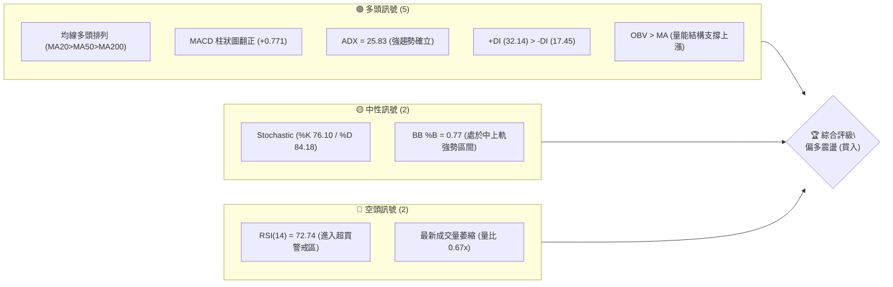
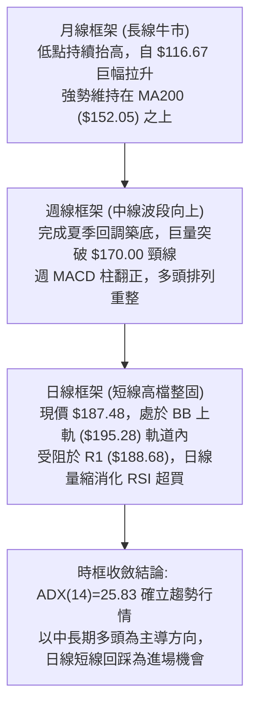
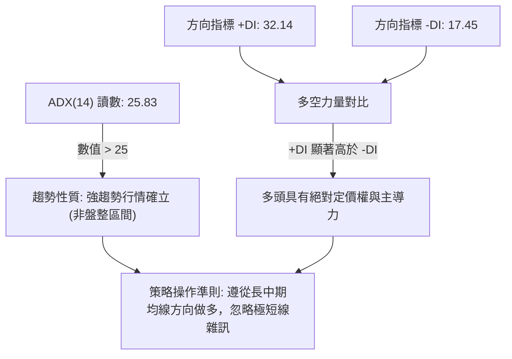
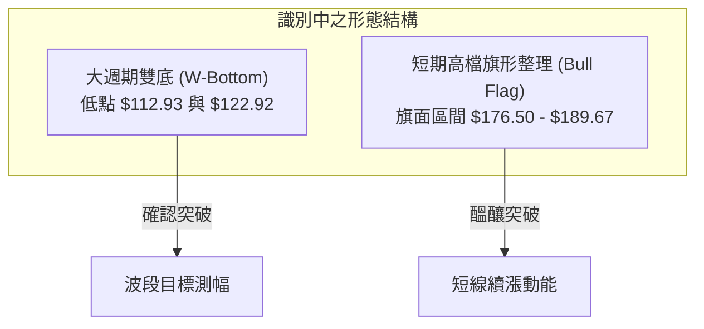
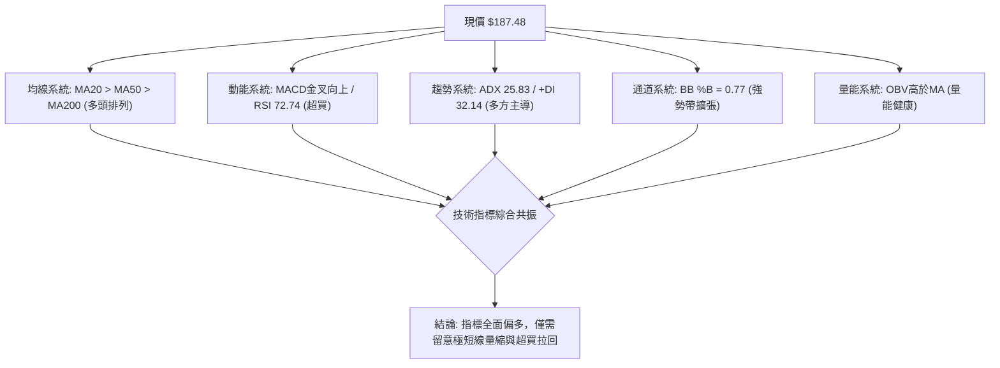
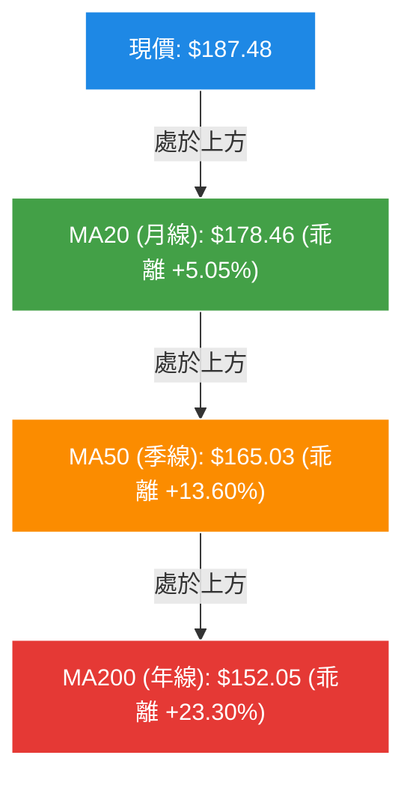
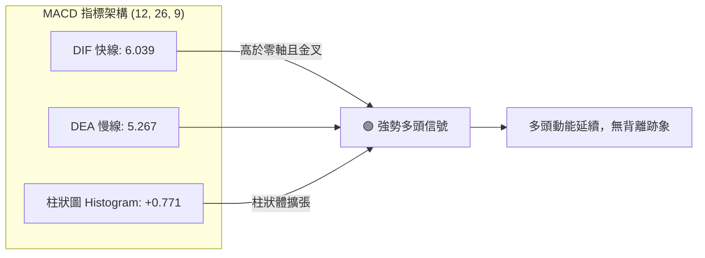
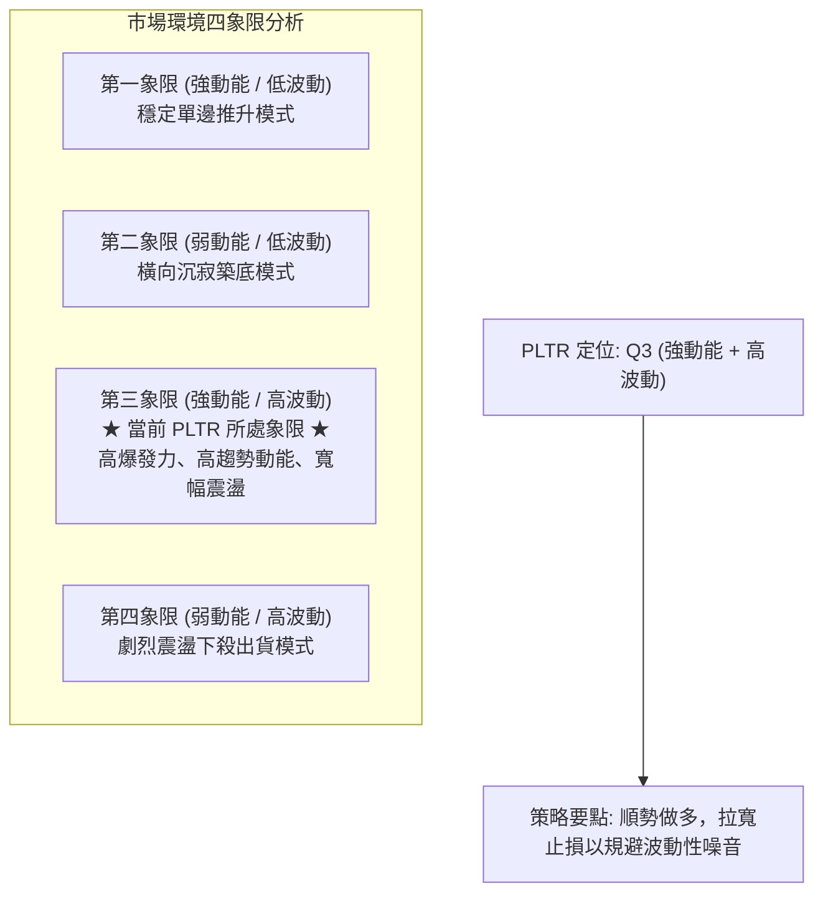
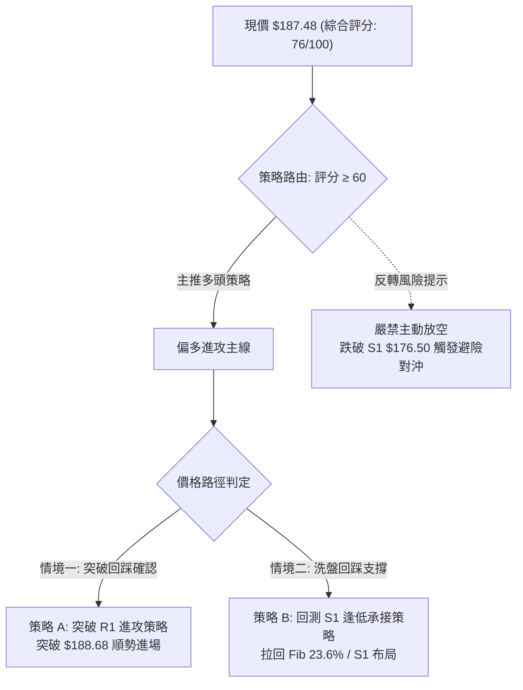
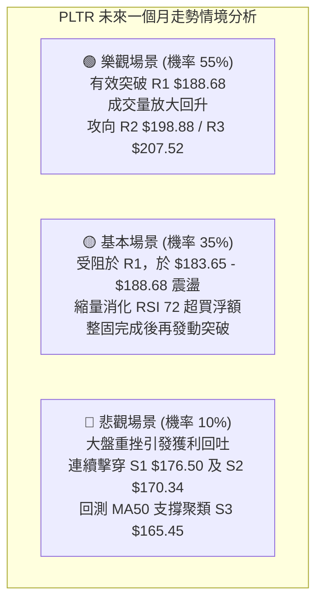

# PLTR 技術分析報告

> **報告日期**：2026-09-29 ｜ **語言**：繁體中文 ｜ **數據來源**：Yahoo Finance ｜ **當前價格**：$187.48

---

## 目錄

| 章節 | 內容 |
|------|------|
| [1. 技術面概覽](#1-技術面概覽) | 訊號儀表板、核心指標、評分卡 |
| [2. 趨勢分析](#2-趨勢分析) | 多時框趨勢、長中短期走勢、ADX解讀 |
| [3. 圖表形態分析](#3-圖表形態分析) | 形態識別、信心度評估、K線組合 |
| [4. 支撐與阻力](#4-支撐與阻力) | 關鍵價位、斐波那契回調結構 |
| [5. 技術指標深度解讀](#5-技術指標深度解讀) | MA/RSI/MACD/布林/OBV量能 |
| [6. 動能與波動率](#6-動能與波動率) | 動能四象限、ATR、Beta係數 |
| [7. 多時框架總結](#7-多時框架總結) | 時框評分矩陣、多時框收斂定調 |
| [8. 交易策略建議](#8-交易策略建議) | 策略路由、價格情境、主策略部署 |
| [9. 風險提示與監控](#9-風險提示與監控) | 監控指標Checklist、風險情境模型 |

---

## 1. 技術面概覽

### 🎯 技術訊號儀表板



### 📊 核心指標速覽表

| 指標類別 | 指標名稱 | 當前數值 | 訊號 | 解讀 |
|----------|----------|----------|------|------|
| **價格** | 當前收盤價 | $187.48 | 🟢 | 位於 52 週高低區間之 80.2%，處於強勢高檔區 |
| **均線** | MA20 | $178.46 | 🟢 | 現價高於 MA20 達 +5.05%，短期動能強勁向上 |
| **均線** | MA50 | $165.03 | 🟢 | 現價高於 MA50 達 +13.60%，中期波段多頭穩固 |
| **均線** | MA200 | $152.05 | 🟢 | 現價高於 MA200 達 +23.30%，長期牛市基調明確 |
| **動能** | RSI(14) | 72.74 | 🔴 | 突破 70 臨界點進入超買區，存在技術性回踩拉鋸需求 |
| **動能** | MACD (12,26,9) | Diff: 6.039 / DEA: 5.267 / Hist: +0.771 | 🟢 | 零軸上方金叉延續，多頭動能柱持續擴張 |
| **波動** | ATR(14) | $5.73 (3.06%) | 🟡 | 波動率處於中高檔正常常態，日內擺動幅度充足 |
| **趨勢** | ADX / DMI | ADX: 25.83 / +DI: 32.14 / -DI: 17.45 | 🟢 | ADX 突破 25，多方主導 (+DI 佔優)，趨勢行情確立 |
| **通道** | 布林帶 (20,2) | 上軌 $195.28 / 中軌 $178.46 / %B: 0.77 | 🟢 | 位於中軌與上軌間運行，通道開口向上延伸 |
| **量能** | 當日量 / 20日均量 | 17,407,900 / 25,979,645 (0.67x) | 🟡 | 高檔量縮暫歇，OBV 則維持在均線上方呈多頭量結構 |

### 🏆 技術評分卡

```
╔══════════════════════════════════════════════════════════════════════════╗
║                    技術評分卡 — PLTR (2026-09-29)                       ║
╠══════════════════════════════════════════════════════════════════════════╣
║ 趨勢強度 (Trend)     ████████████████░░░░  80/100  🟢 強勢主導 (ADX>25)   ║
║ 動能指標 (Momentum)  ██████████████░░░░░░  70/100  🟢 多頭占優 (RSI超買)  ║
║ 支撐穩定度 (Support) ████████████████░░░░  80/100  🟢 S1/Fib重疊保護強    ║
║ 成交量配合 (Volume)  ████████████░░░░░░░░  60/100  🟡 高檔量縮/OBV支撐    ║
║ 形態完整度 (Pattern) ██████████████░░░░░░  70/100  🟢 雙底頸線突破架構    ║
║ 均線系統 (MA Align)  ████████████████████ 100/100  🟢 完美多頭排列        ║
╠══════════════════════════════════════════════════════════════════════════╣
║ 綜合技術評分         ████████████████░░░░  76/100  🟢 偏多進攻（評級：買入）║
╚══════════════════════════════════════════════════════════════════════════╝
```

---

## 2. 趨勢分析

### 🌐 多時框趨勢分析



### 📈 長期趨勢 — 12個月走勢圖（Unicode）

```
PLTR 月線走勢圖（過去12個月：2025-10 至 2026-09）
價格 ($)
$205 ┤                                                 
$200 ┤  ● ($200.47)                                    
$190 ┤                                            ● ($187.48現價)
$185 ┤                                        ● ($186.38)
$175 ┤        ● ($177.75)                              
$165 ┤    ● ($168.45)                                  
$155 ┤                                ● ($156.54)      
$145 ┤            ● ($146.59) ● ($146.28)              
$135 ┤                ● ($137.19)  ● ($139.11)         
$125 ┤                                    ● ($123.06)  
$115 ┤                                ● ($116.67波段低點)
$105 ┴─────────────────────────────────────────────────
     10月 11月 12月 01月 02月 03月 04月 05月 06月 07月 08月 09月
     2025 2025 2025 2026 2026 2026 2026 2026 2026 2026 2026 2026
```

#### 過去 12 個月走勢特徵分析表

| 階段區間 | 時間跨度 | 起訖收盤價 | 漲跌幅 | 結構特徵與量價行為 |
|----------|----------|------------|--------|--------------------|
| **高檔回撤期** | 2025-10 至 2026-02 | $200.47 → $137.19 | -31.57% | 創下波段歷史高位後獲利了結盤湧現，均線由發散轉向收斂 |
| **中樞築底期** | 2026-02 至 2026-04 | $137.19 → $139.11 | +1.40%  | 於 $135.00–$146.00 區間反覆夯實，形成中期第一底部支撐帶 |
| **誘空破底期** | 2026-05 至 2026-06 | $156.54 → $116.67 | -25.47% | 5月反彈後6月快速下殺，觸及 52 週最低聚類區 ($116.67 / 52W Low $106.37) |
| **強烈軋空期** | 2026-07 至 2026-08 | $123.06 → $186.38 | +51.45% | 8月首週爆出 4.35 億股天量拉出巨陽線，一舉收復所有均線失地 |
| **高位整理期** | 2026-08 至 2026-09 | $186.38 → $187.48 | +0.59%  | 現價於高檔強勢換手整固，均線全數呈現標準多頭發散排列 |

### 📊 中期趨勢（週線分析）

中期走勢以 2026 年 6 月底之低點 $112.93 與 7 月底 $122.92 構築之大雙底（W底）為核心轉折點。8 月 9 日該週成交量放大至 435,164,800 股，推動週線收盤達 $172.01，向上貫穿頸線區。9 月中旬雖拉回至 $167.23（回測 S3 $165.45 及斐波那契 38.2% $168.88 緩衝區），但隨後兩週迅速拔高至 $189.67 與 $187.48，確認中期多頭趨勢確立無疑。

### ⚡ 趨勢強度評估（ADX 解讀）



#### 趨勢強度指標對照表

| 指標 | 當前數值 | 臨界門檻 | 狀態判斷 | 實質交易意義 |
|------|----------|----------|----------|--------------|
| **ADX(14)** | 25.83 | 25.00 | 🟢 剛進入強趨勢區 | 行情由前期的無序震盪完全蛻變為定向趨勢推進 |
| **+DI** | 32.14 | 20.00 | 🟢 多方進攻動能充沛 | 買方在各週期均線均握有主導權，推升意願強烈 |
| **-DI** | 17.45 | 20.00 | 🟢 空方動能遭全面壓制 | 空方不具備連續性殺盤能力，下檔承接買盤厚實 |

---

## 3. 圖表形態分析

### 🔍 形態識別系統



#### 圖表形態信心度與目標測算表

| 形態類別 | 信心度 (%) | 判斷依據（引用客觀數據） | 形態完成度 | 形態高度與目標價推算 |
|----------|------------|--------------------------|------------|----------------------|
| **大型雙底 (W-Bottom)** | 85% | 2026年6月低點 $112.93 與 7月低點 $122.92，頸線取前波反彈高點聚類 S1 $176.50。8月爆出 4.35 億股突破頸線。 | 95% (已突破並完成初步回測) | 頸線 $176.50 - 雙底低點 $112.93 = 高度 $63.57。<br/>由形態高度推算理論目標價 = $176.50 + $63.57 = **$240.07** |
| **高檔上升旗形 (Bull Flag)** | 70% | 8月暴漲至 $186.29 形成旗桿，9月拉回 $167.23 後迅速收復至現價 $187.48，價格被壓縮於 R1 $188.68 與 S1 $176.50 之間。 | 75% (等待實質放量長陽突破旗面頂端) | 旗桿起點 $123.06 至旗桿頂 $186.29 高度為 $63.23。<br/>若由旗底突破點 $176.50 推算旗形延伸目標 = $176.50 + $63.23 = **$239.73** |

*注：上述兩大形態推算之理論測幅高達 $239.73–$240.07，技術面將先以數據中的 52W 高點聚類阻力 R3 ($207.52) 作為第一波段主目標，形態完整理論目標可對應分析師最高目標價 $255.00。*

### 🕯️ 重要 K 線形態分析

| 週期/日期 | 收盤價 | 實體與影線特徵 | K 線組合識別 | 多空技術訊號 |
|-----------|--------|----------------|--------------|--------------|
| **2026-06-28** | $112.93 | 長黑下殺伴隨 2.71 億股量能 | 恐慌拋售低點 (Selling Climax) | 🟡 形成波段終極誘空底，下檔支撐買盤隨後進駐 |
| **2026-08-09** | $172.01 | 巨量大陽線突破所有中天期均線 | 啟動長紅 (Breakout Bullish Bar) | 🟢 週線結構徹底反轉，確認右底築成並跨越阻力 |
| **2026-09-13** | $167.23 | 量縮回洗至 MA50 及 Fib 38.2% | 縮量良性回踩 (Pullback Test) | 🟢 甩轎洗盤，未跌破波段低點聚類 S3 $165.45 |
| **2026-09-27** | $189.67 | 實體大陽棒逼近前高，吞噬前兩週黑K | 多頭吞噬 (Bullish Engulfing) | 🟢 宣告洗盤結束，重啟攻勢挑戰 R1 $188.68 |
| **2026-10-04 (當前)** | $187.48 | 實體高位窄幅震盪，留上下微小影線 | 高檔十字整理 (Consolidation Star)| 🟡 多空在 $188.00 關卡換手，動能整固 |

### 📉 ASCII 走勢形態示意圖

```
PLTR 中期雙底與高檔旗形突破走勢架構示意圖：

價格 ($)
$207.52 ┤                                                 [52W High / R3]
$198.88 ┤                                            .--- [波段阻力 R2]
$188.68 ┤                             ▲ 旗形突破測驗/--現價 $187.48 (R1)
$176.50 ┤                ┌────────────┴────────────┐ [頸線支撐 S1]
        │               /  高檔旗形整理區 (Bull Flag) \
$156.95 ┤              /                             \   [Fib 50.0%]
$139.11 ┤    ▲        /                               \
        │   / \      /                                 \
$122.92 ┤  /   \    / (右底 Bottom 2)                    \
$112.93 ┤ /     └──/  (左底 Bottom 1)                    [W底低點聚類]
        └─────────────────────────────────────────────────────────────
          2026-05   2026-06     2026-07     2026-08    2026-09
```

---

## 4. 支撐與阻力

### 🗺️ 關鍵價位分布圖（Unicode）

```
PLTR 價位結構分布圖 (依據 OHLCV 計算聚類及斐波那契回調)
═══════════════════════════════════════════════════════════════════
$207.52 ║████████████████████████████████████████║ 強阻力 R3 (52W High / Fib 0.0%)
$198.88 ║████████████████████████████░░░░░░░░░░░░║ 波段阻力 R2 (整數關前聚類)
$188.68 ║████████████████████████████████░░░░░░░░║ 短線阻力 R1 (波段高點聚類)
$187.48 ╠════════════════════════════════════════╣ ◄ 現價 (收盤價)
$183.65 ║▓▓▓▓▓▓▓▓▓▓▓▓▓▓▓▓▓▓▓▓▓▓▓▓▓▓▓▓▓▓▓▓▓▓▓▓▓▓▓║ 近端支撐 (斐波那契 23.6%)
$176.50 ║████████████████████████████████░░░░░░░░║ 關鍵支撐 S1 (突破頸線 / 低點聚類)
$170.34 ║████████████████████████░░░░░░░░░░░░░░░░║ 次級支撐 S2 (波段回測防線)
$165.45 ║████████████████████████████████████████║ 強支撐 S3 (MA50與波段低點重疊)
═══════════════════════════════════════════════════════════════════
```

### 🚧 阻力位分析表

所有價位精確引用自 OHLCV 波段高點聚類與斐波那契計算：

| 阻力級別 | 精確價位 | 距現價空間 | 形成技術原因 | 突破難度 | 重要性權重 |
|----------|----------|------------|--------------|----------|------------|
| **R1** | **$188.68** | +0.64% | 近一年波段次高點密集聚類區，日線多頭直接承壓點 | 🟡 中等 (需補量) | ★★★☆☆ (短線分水嶺) |
| **R2** | **$198.88** | +6.08% | $200 整數心理大關前最後籌碼解套沉澱阻力帶 | 🔴 較高 (空頭防禦) | ★★★★☆ (波段目標位) |
| **R3** | **$207.52** | +10.69%| 52 週歷史高點 (Fib 0.0%)，近一年最強形態天花板 | 🔴 極高 (歷史阻力) | ★★★★★ (歷史天花板) |

### 🛡️ 支撐位分析表

所有價位精確引用自 OHLCV 波段低點聚類計算：

| 支撐級別 | 精確價位 | 距現價空間 | 形成技術原因 | 守住機率 | 重要性權重 |
|----------|----------|------------|--------------|----------|------------|
| **S1** | **$176.50** | -5.86% | 近一年突破頸線回測點聚類，緊鄰 MA20 ($178.46) | 🟢 85% (高支撐強度) | ★★★★★ (多頭生命線) |
| **S2** | **$170.34** | -9.14% | 9月中旬洗盤回調次級支撐，與 Fib 38.2% ($168.88) 構築緩衝 | 🟢 80% (波段防護帶) | ★★★★☆ (中期保護位) |
| **S3** | **$165.45** | -11.75%| 近一年深幅回調低點聚類，精準重疊日線 MA50 ($165.03) | 🟢 90% (極強護城河) | ★★★★★ (牛熊分界線) |

### 📐 斐波那契回調位分析

依據 52 週完整區間（低點 **$106.37** → 高點 **$207.52**，總落差 $101.15）精確回調層級：

| 斐波那契層級 | 精確價位 | 與當前市場架構之技術意義 |
|--------------|----------|--------------------------|
| **0.0% (52W High)** | **$207.52** | 波段頂部，同為上方終極阻力 R3。 |
| **23.6%** | **$183.65** | **現價 ($187.48) 位於 0.0% 至 23.6% 的強勢極限進攻區。** 跌破此位為初階回檔訊號。 |
| **38.2%** | **$168.88** | 關鍵技術修正位，與次級支撐 S2 ($170.34) 緊密夾合，為多頭容許之最大良性修正極限。 |
| **50.0%** | **$156.95** | 中樞均衡位，接近 MA240 ($156.53) 與 MA200 ($152.05)，屬於長線結構核心地帶。 |
| **61.8%** | **$145.01** | 黃金分割防守位，接近 MA120 ($147.42)，跌破代表中長線牛市架構破壞。 |
| **78.6%** | **$128.02** | 深度調整極限，對應 2026 年夏季雙底之二次築底起漲帶。 |
| **100.0% (52W Low)**| **$106.37** | 52 週最低點，全年度週期多方絕對底線。 |

> **當前位置解讀**：現價 $187.48 牢固站穩於 Fib 23.6% ($183.65) 之上，位於第一強勢區（$183.65–$207.52）。在技術分析定義中，只要價格維持在 23.6% 回調線上方，代表上升趨勢屬於極強的「淺度回踩衝刺模式」，空方不具備深度回調條件。

---

## 5. 技術指標深度解讀

### 🎛️ 指標訊號總覽



### 📈 移動平均線排列分析



#### 完整均線系統數據監控表

| 均線名稱 | 當前價位 | 現價相對位置 | 差值與乖離率 | 技術意義評估 |
|----------|----------|--------------|--------------|--------------|
| **MA 5** | $189.30 | 現價位於其下 | -$1.82 (-0.96%) | 短線極微幅死叉，因受阻於 R1 $188.68 導致極短線歇腳 |
| **MA 10** | $183.04 | 現價位於其上 | +$4.44 (+2.43%) | 超短線動能支撐，貼合 Fib 23.6% ($183.65) |
| **MA 20** | $178.46 | 現價位於其上 | +$9.02 (+5.05%) | 短期多頭生命線，強勢股回檔不破之重要基準線 |
| **MA 60** | $159.51 | 現價位於其上 | +$27.97 (+17.53%)| 中期波段防守帶，穩定以斜率向上仰攻 |
| **MA 120**| $147.42 | 現價位於其上 | +$40.06 (+27.17%)| 半年線結構支撐，扣抵夏季低價區，助漲力道強勁 |
| **MA 200**| $152.05 | 現價位於其上 | +$35.43 (+23.30%)| 長期牛熊分水嶺，與 MA50 呈現大金叉發散 |
| **MA 240**| $156.53 | 現價位於其上 | +$30.95 (+19.77%)| 長年線基石，多頭防禦的最深縱深 |

均線架構呈典型的「多頭發散排列（Bullish Alignment）」，除 MA5 略受昨日極短線拉回產生 0.96% 的微幅壓制外，短中長天期均線無任何破位徵兆，趨勢支撐效應極佳。

### 📉 RSI(14) 分析與背離檢測

- **當前 RSI(14) 數值**：**72.74**
- **數值進度條**：`[██████████████████░░] 72.74%` 🔴 超買警戒（>70）

#### 背離狀態判定
- **頂背離檢測**：價格自 8 月底 $186.29 走高至 9 月底 $189.67，並於今日收在 $187.48；同期 RSI(14) 數值由 60.8 升至 69.4，今日讀數為 72.74。**價格創近期新高，RSI 指標同步走高創近期波段新高，兩者同向上行，無頂背離現象。**
- **底背離檢測**：6 月中下旬價格探底 $112.93 時，RSI 觸及 27.8；7 月底價格二次探底 $122.92，RSI 墊高至 35.7，已形成過經典的週線級「底背離」，並已於 8 月份的大漲中完全兌現爆發。
- **結論**：RSI 雖進入超買區，但在 ADX > 25 的強趨勢背景下，「強者恆強、指標鈍化」為常態現象，此處超買僅代表短線追價成本偏高，不代表即刻反轉暴跌。

### 📊 MACD(12,26,9) 訊號解讀



- **DIF 快線**：6.039
- **DEA 訊號線**：5.267
- **柱狀圖 (Histogram)**：**+0.771**（綠色擴張區）
- **詳細解讀**：DIF 與 DEA 均穩健運行於 0 軸上方的高動能區。柱狀圖在經歷 9 月中旬的回調後，由負翻正並擴大至 +0.771，發出明確的「二度金叉進攻訊號」，動能持續對多方有利。

### 📦 布林通道分析（Bollinger Bands）

```
PLTR 布林通道軌道與現價位置示意圖：
價位 ($)
$195.28 ┤-------------------------------------- 布林上軌 (Upper Band)
        │                                      
$187.48 ┤                    ● (現價, %B = 0.77)
        │                                      
$178.46 ┤-------------------- 中軌 (MA20) ----- 布林中軌 (Middle Band)
        │                                      
$161.65 ┤-------------------------------------- 布林下軌 (Lower Band)
```

- **帶寬與位置**：BB 上軌為 **$195.28**，BB 中軌為 **$178.46**，BB 下軌為 **$161.65**。
- **指標數值 %B**：**0.77**（介於 0.5 至 1.0 的超強勢擴張軌道內）。
- **特徵判定**：通道開口呈現向右上角擴張之態勢。現價 $187.48 貼近中上軌運行，未觸及上軌極端帶（$195.28），代表上行空間未被通道壓制，具備順勢向 R2 ($198.88) 及上軌推進的通道幾何空間。

### 💹 成交量分析（量價配合度）與 OBV

- **最新成交量**：17,407,900 股
- **20 日平均成交量**：25,979,645 股（量比：**0.67x**）
- **50 日平均成交量**：35,381,490 股
- **量能評估**：
  1. 今日縮量至 1,740 萬股，量比降至 0.67x，反映出在面臨前波聚類高點阻力 R1 ($188.68) 時，多方主力並未盲目追高，而是採取「高檔縮量洗盤」策略。
  2. 觀察近 20 週量價關係，8 月 9 日突破頸線時爆出 4.35 億股的歷史天量，奠定長期資金鎖倉底蘊；隨後幾週回調時成交量大幅萎縮至 8,168 萬股（2026-09-13），呈現「價漲量增、價跌量縮」的極佳多頭量價特徵。
  3. **OBV (能量潮)**：數據明確顯示 **OBV > MA**，能量潮指標領先走高並牢牢站於其均線之上，證實波段累積的籌碼穩定度極高，未出現主力出貨之量價背離跡象。

---

## 6. 動能與波動率

### ⚡ 動能評估四象限



#### 動能與波動四象限對照表

| 象限標籤 | 動能狀態 | 波動屬性 | PLTR 當前狀態標註 | 戰術指引 |
|----------|----------|----------|-------------------|----------|
| **Q1** | 強 | 低 | — | 最佳無腦抱波段區 |
| **Q2** | 弱 | 低 | — | 觀望等待放量方向 |
| **Q3** | **強** | **高** | **✓ (Beta 1.62, ATR $5.73, MACD+0.771)** | **波段追隨多頭，嚴禁逆勢放空，止損依 ATR 設定** |
| **Q4** | 弱 | 高 | — | 恐慌崩跌區，應嚴格空倉 |

### 📊 ATR 波動率分析

- **ATR(14) 數值**：**$5.73**
- **ATR 佔比**：約為現價之 **3.06%**
- **波動特性判定**：每日平均波動超過 5.7 美元，屬於中高波動之成長股典型特質。
- **止損距離動態推導**：
  - 超短線交易（1.0 × ATR）：止損緩衝需給予 $5.73，以現價計即在 **$181.75** 附近。
  - 波段交易（2.0 × ATR）：止損緩衝需給予 $11.46（$187.48 - $11.46 = **$176.02**），此數值極度精準地與關鍵支撐 S1 ($176.50) 形成完美重合，驗證支撐位的量化有效性。

### 📐 Beta 與市場相關性

- **Beta 係數**：**1.621**
- **大盤相關性解讀**：
  1. PLTR 具備高度進攻性，當標普 500 或納斯達克指數上漲 1% 時，理論上該股將產生約 1.62% 的同向波動放大效應。
  2. 由於機構持股比例達 64.8%，且空頭比例極低（Short % Float 僅 2.8%，Short Ratio 2.08），籌碼面呈現大機構掌控盤面的結構，高 Beta 特質使得該股在大盤處於多頭環境時，具有極強的領漲爆發潛能。

---

## 7. 多時框架總結

### 📋 時框架評分表

| 時框架 | 趨勢方向 | 動能狀態 | 均線排列狀況 | 形態辨識進程 | 綜合評分 | 操作戰術建議 |
|--------|----------|----------|--------------|--------------|----------|--------------|
| **月線** | 🟢 強烈看多 | 強勁 (自 $116 翻揚) | 多頭 (站在所有均線上) | 52W 高檔大區間向上蓄勢 | **85/100** | 長線多單堅定續抱，無看空理由 |
| **週線** | 🟢 強烈看多 | 充沛 (MACD二次翻紅) | 多頭發散 (MA20跨越MA50) | 底部 W底放量突破確立 | **80/100** | 波段買進並持有，逢回調建立倉位 |
| **日線** | 🟡 偏多整固 | 偏強 (RSI 72 超買) | 完美多頭 (MA20>50>200) | 旗形末端挑戰 R1 $188.68 | **68/100** | 不急於最高點追價，等待回測支撐接回 |

### 🔲 綜合訊號矩陣

```
╔══════════════════════════════════════════════════════════════════════════════╗
║                    多時框多空訊號共振矩陣                                   ║
╠═════════════════════╦══════════════╦══════════════╦══════════════════════════╣
║ 分析維度            ║ 短期 (日線)  ║ 中期 (週線)  ║ 長期 (月線)              ║
╠═════════════════════╬══════════════╬══════════════╬══════════════════════════╣
║ 趨勢方向 (Trend)    ║ 🟢 震盪走高  ║ 🟢 單邊波段  ║ 🟢 大牛市格局            ║
║ 動能指標 (Momentum) ║ 🔴 超買鈍化  ║ 🟢 柱體擴張  ║ 🟢 脫離底部強勁區        ║
║ 均線排列 (Moving Av)║ 🟢 多頭排列  ║ 🟢 多頭排列  ║ 🟢 遠高於 MA200          ║
║ 成交量能 (Volume)   ║ 🟡 縮量整理  ║ 🟢 價漲量增  ║ 🟢 OBV健康向上           ║
║ 波動狀態 (Volatility║ 🟡 中高波動  ║ 🟢 趨勢展開  ║ 🟢 大區間向上突破        ║
╠═════════════════════╬══════════════╬══════════════╬══════════════════════════╣
║ 時框綜合權重判定    ║ 70 / 100     ║ 80 / 100     ║ 85 / 100                 ║
╚═════════════════════╩══════════════╩══════════════╩══════════════════════════╝
```

### ⚖️ 多時框收斂結論

依據多時框收斂指引規則：
1. **趨勢/盤整判定**：當前 ADX(14) 讀數為 **25.83**（已正式跨越 25 臨界線），判定當前市場處於**「趨勢行情」**而非無序盤整行情。
2. **時框主導優先級**：在強趨勢行情下，嚴格以**中長期時框（週線與 MA50 $165.03、MA200 $152.05 方向）為唯一主導方向**。日線層級中 RSI(14)=72.74 的短期超買與當日量縮（0.67x），僅屬於趨勢推進過程中的「微觀次級波折」，絕對不可將其誤判為趨勢反轉。
3. **唯一方向性結論**：**【強烈偏多，回調做多】**。日線短線的一切拉回震盪，均應視為在中長線多頭趨勢保護下尋找高盈虧比進場點的契機。

---

## 8. 交易策略建議

### 🗺️ 策略決策流程圖



### 🧭 策略路由

> **當前主策略方向 = 【積極做多（Bullish Continuation）】（依技術評分卡：76/100 偏多進攻標準）**

本報告遵循多時框收斂與評分卡分流紀律，**主推多頭部署策略**；空方操作在均線全多頭排列及 ADX>25 條件下勝率極低，僅列出反向風險觸發點以供風險控制，不提供主動放空建議。

### 🎯 價格情境階梯（Price Scenarios）

以現價 **$187.48** 為核心，向上與向下建立具體技術階梯（所有數值均嚴格引用 OHLCV 計算聚類及斐波那契價位）：

| 觸發條件 | 下一目標價 | 後續延伸位置 | 結構情境含義與對策 |
|----------|------------|--------------|--------------------|
| **放量突破 R1 ($188.68)** | **R2 ($198.88)** | **R3 ($207.52)** | 短線阻力被突破，觸發動能追價買盤，直接攻向 52W 高點阻力 |
| **強勢站穩現價區間** | **R1 ($188.68)** | — | 於 $183.65 (Fib 23.6%) 至 $188.68 區間消化 RSI 超買，醞釀下一波爆發 |
| **回踩跌破 Fib 23.6% ($183.65)**| **S1 ($176.50)** | **S2 ($170.34)** | 觸發日線級良性回調，進入 S1 頸線與 MA20 ($178.46) 重合之極佳加碼區 |
| **跌破關鍵支撐 S1 ($176.50)** | **S2 ($170.34)** | **S3 ($165.45)** | 中期多頭架構轉弱，多單全面執行防守減倉或止損避險 |

### 📊 情境機率分佈

| 運行情境 | 發生機率 | 主要技術與量價依據 |
|----------|----------|--------------------|
| **情境一：強勢向上突破** | **55%** | 均線完美多頭排列、MACD 柱狀體翻正擴張 (+0.771)、ADX 趨勢強度達標 (25.83)、OBV 趨勢向上。 |
| **情境二：高檔強勢區間震盪** | **35%** | RSI 進入 72.74 超買區、今日量能萎縮至 0.67x、布林通道上軌位於 $195.28 提供短線技術天花板。 |
| **情境三：深度回落再探底** | **10%** | S1 ($176.50) 具備大雙底頸線與 4.35 億股爆量換手防護，跌破機率極低，除非市場系統性崩跌。 |

### 🟢 主策略詳情

#### 策略 A（動能突破型）vs 策略 B（拉回承接型）

| 策略要素 | 策略 A：放量突破 R1 順勢追擊單 | 策略 B：回踩支撐 S1 穩健低吸單 |
|----------|--------------------------------|--------------------------------|
| **交易邏輯** | 日線放量長陽收復波段阻力 R1，確認短線旗形突破 | 利用 RSI 超買洗盤回踩 Fib 23.6% 及 S1 支撐低吸 |
| **進場條件** | 日線收盤價確認突破 $188.68 且當日成交量突破 2,500 萬股 | 價格回落至 $183.65 附近分批低接，極限掛單至 $178.46 |
| **進場價格** | **$189.00**（突破確認後買入） | **$183.65**（斐波那契 23.6% 回調位） |
| **第一目標 (T1)** | **$198.88**（波段阻力 R2，預期獲利 +5.23%） | **$198.88**（波段阻力 R2，預期獲利 +8.29%） |
| **第二目標 (T2)** | **$207.52**（52W高點 R3，預期獲利 +9.80%） | **$207.52**（52W高點 R3，預期獲利 +13.00%） |
| **止損價格** | **$183.65**（跌回 Fib 23.6% 回調位下方） | **$176.50**（跌破頸線與波段低點聚類 S1） |
| **風險空間** | $189.00 - $183.65 = **$5.35** (2.83%) | $183.65 - $176.50 = **$7.15** (3.89%) |
| **報酬空間 (T2)** | $207.52 - $189.00 = **$18.52** (9.80%) | $207.52 - $183.65 = **$23.87** (13.00%) |
| **風險報酬比** | **1 : 3.46**（優秀） | **1 : 3.34**（優秀） |
| **勝率估計** | **60%** | **70%** |
| **建議配置倉位** | **10% - 15%** (動能追價倉位) | **15% - 25%** (波段主倉位) |

### 🔴 反向風險觸發點（對沖與止損防線）

- **多單警訊觀察點**：若日線跌破 Fib 23.6% (**$183.65**)，多頭攻勢暫告中斷，轉為區間震盪，應將部分短線利潤落袋。
- **波段全面防守線**：若價格以日線收盤價實質跌破關鍵支撐 S1 (**$176.50**) 及 MA20 (**$178.46**)，代表夏季以來之大雙底頸線宣告失守，多頭波段結構遭到破壞。此時所有多頭倉位應無條件止損或反手買入等值 Put 選擇權進行部位對沖，下方將向下尋求 S2 ($170.34) 與 S3 ($165.45) 之支撐。

### ⭐ 整體訊號強度評星

```
做多訊號強度：★★★★☆  (4/5星 - 均線完美多頭、MACD擴張、趨勢確立)
做空訊號強度：★☆☆☆☆  (1/5星 - 缺乏頂背離與空頭結構，逆勢風險極高)
整體可信度：  ★★★★☆  (4/5星 - 價量配合紮實，ADX>25指標共振確認)
```

---

## 9. 風險提示與監控

### ✅ 關鍵監控指標 Checklist

```
╔══════════════════════════════════════════════════════════════════════════╗
║               PLTR 技術面核心監控指標動態清單                            ║
╠══════════════════════════════════════════════════════════════════════════╣
║ [ ] R1 突破確認：日線收盤價是否有效站上 $188.68。                       ║
║ [ ] 量能放大檢驗：突破時日成交量是否回升放大至 2,597 萬股 (20日均量) 之上║
║ [ ] RSI(14) 超買修復：觀察 RSI 是否能在 60-70 區間鈍化，避免跌回 50 之下 ║
║ [ ] MACD 柱狀體： Histogram (+0.771) 是否持續擴張，嚴防高檔轉折黑柱收斂 ║
║ [ ] 生命線防守：回調時 MA20 ($178.46) 與 S1 ($176.50) 是否具備強勁承接力║
║ [ ] ADX 強度維持：ADX 是否持續高於 25，維持趨勢行情主導性              ║
╚══════════════════════════════════════════════════════════════════════════╝
```

### ⚠️ 風險場景分析



### 🛡️ 風險管理重要提醒

1. **高 Beta 成長股的波動控制**：
   PLTR 的 Beta 值高達 1.621，且 ATR 達 $5.73（3.06%）。在強勢上漲行情中其彈性極大，但一旦美股大盤出現黑天鵝拉回，其回撤速度亦相當劇烈。因此，單筆交易所承擔的最大虧損風險金額，必須嚴格限制在總投資組合淨值的 **1.0%–1.5%** 以內。
2. **倉位計算實務**：
   若以「策略 B」進場價 $183.65、止損價 $176.50 計算，每股潛在風險為 $7.15（約 3.89%）。若投資人總資產為 100,000 美元，設定 1.0% 風險上限即 1,000 美元，則最大允許買入股數應為：$1,000 ÷ $7.15 ≈ **139 股**（持股總市值約 $25,527，相當於 25% 總倉位比重），不可在超買區過度使用槓桿追價。
3. **防止「盤中雜訊誘空」**：
   由於短期均線 MA5 目前微幅壓制，盤中易出現穿梭 R1 的上下影線。所有進場與止損判斷，務必以**美股收盤價（4:00 PM EST）**為準，避免被盤中主力洗盤掃出場。

---

## 📋 報告總結

```
╔══════════════════════════════════════════════════════════════════════════════╗
║                    PLTR 技術分析報告總結                                     ║
╠══════════════════════════════════════════════════════════════════════════════╣
║ 報告日期：2026-09-29                                                         ║
║ 當前價格：$187.48                                                            ║
║ 技術評分：76 / 100 (████████████████░░░░)                                    ║
║ 綜合評級：🟢 買入 (BUY) / 偏多進攻                                           ║
╠══════════════════════════════════════════════════════════════════════════════╣
║ 關鍵結論：                                                                   ║
║ ├─ 長期趨勢：🟢 強烈牛市，牢牢站穩年線 MA200 ($152.05) 之上                  ║
║ ├─ 中期趨勢：🟢 W底放量突破確立，均線全數呈現標準多頭發散排列                ║
║ ├─ 短期趨勢：🟡 面臨阻力 R1 ($188.68)，RSI 72.74 超買，量縮高檔整固          ║
║ ├─ 關鍵支撐：S1: $176.50 (頸線重疊) │ Fib 23.6%: $183.65 │ S3: $165.45 (MA50)║
║ ├─ 關鍵阻力：R1: $188.68 (波段高點) │ R2: $198.88 │ R3: $207.52 (52W High)  ║
║ └─ 分析師目標：共識均價 $195.57 │ 最高目標 $255.00 │ 最低目標 $80.00         ║
╠══════════════════════════════════════════════════════════════════════════════╣
║ 最優交易策略組合：                                                           ║
║ 1. 🥇 最佳機會（勝率最高）：回踩 Fib 23.6% ($183.65) 低吸，止損 S1 ($176.50)║
║ 2. 🥈 次選機會（動能最強）：實質放量突破 R1 ($188.68) 後追買，目標 R3 ($207.52)║
║ 3. 🥉 保守選擇（長線持有）：於現價以小倉位分批建倉，以 MA50 ($165.03) 為長線底線║
╚══════════════════════════════════════════════════════════════════════════════╝
```

---

> ⚠️ **免責聲明**：本報告為 AI 自動生成之技術分析研究報告，所有分析結論、圖表繪製及數值推算均基於市場所揭露之歷史價格與量化指標。本報告**僅供學術研究、量化模型驗證與教育參考**，**不構成任何要約、招攬、建議或任何形式之投資建議**。金融市場存在高度波動與本金損失風險，投資人應獨立思考並自行承擔所有交易風險。

---

*報告生成時間：2026-09-29 ｜ 數據來源：Yahoo Finance ｜ 分析框架：多時框技術分析模型*