# PLTR 技術分析報告

> **報告日期**：2026-09-30 ｜ **語言**：繁體中文 ｜ **數據來源**：Yahoo Finance ｜ **當前價格**：$186.97

---

## 目錄

| 章節 | 內容 |
|------|------|
| [1. 技術面概覽](#1-技術面概覽) | 訊號儀表板、核心指標、評分卡 |
| [2. 趨勢分析](#2-趨勢分析) | 多時框趨勢、長中短期走勢 |
| [3. 圖表形態分析](#3-圖表形態分析) | 形態識別、K線組合、目標價 |
| [4. 支撐與阻力](#4-支撐與阻力) | 關鍵價位、斐波那契回調 |
| [5. 技術指標深度解讀](#5-技術指標深度解讀) | MA/RSI/MACD/布林/成交量 |
| [6. 動能與波動率](#6-動能與波動率) | 動能評估、ATR、Beta |
| [7. 多時框架總結](#7-多時框架總結) | 時框架評分矩陣 |
| [8. 交易策略建議](#8-交易策略建議) | 多空策略、風險報酬比 |
| [9. 風險提示與監控](#9-風險提示與監控) | 監控指標、風險場景 |
| [📋 報告總結](#-報告總結) | 關鍵結論與策略摘要 |

---

## 1. 技術面概覽

### 🎯 技術訊號儀表板

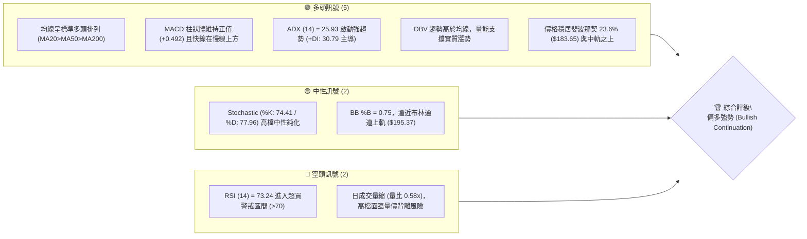

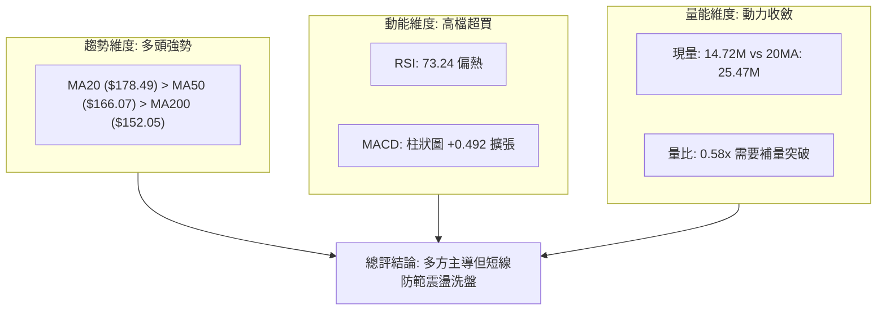

### 📊 核心指標速覽表

| 指標類別 | 指標名稱 | 當前數值 | 訊號 | 解讀 |
|----------|----------|----------|------|------|
| **價格** | 當前收盤價 | $186.97 | 🟢 | 站上多數短中長期均線，位於52週區間 79.7% 強勢區 |
| **均線** | MA20 (短趨勢) | $178.49 | 🟢 | 現價高於 MA20 達 +4.75%，短線生命線支撐穩固 |
| **均線** | MA50 (中趨勢) | $166.07 | 🟢 | 現價高於 MA50 達 +12.59%，中期上升趨勢確立 |
| **均線** | MA200 (長趨勢)| $152.05 | 🟢 | 現價高於 MA200 達 +22.97%，牛市格局無虞 |
| **動能** | RSI(14) | 73.24 | 🔴 | 突破70進入技術超買區，存在技術性回測或高檔鈍化 |
| **動能** | MACD (12,26,9) | 5.882 / 5.390 | 🟢 | 雙線位於零軸上方，柱狀體 +0.492 保持多頭擴散 |
| **動能** | KD指標 (%K/%D) | 74.41 / 77.96 | 🟡 | 進入強勢區但快線略低於慢線，短線追價力道減緩 |
| **趨勢** | ADX (14) | 25.93 (+DI 30.79) | 🟢 | ADX > 25 且 +DI 遠高於 -DI (17.61)，處於強趨勢波段 |
| **通道** | 布林帶 (%B) | 0.75 ($195.37/$161.62)| 🟡 | 處於中軌($178.49)與上軌之間，向通道上緣靠攏 |
| **量能** | 20日成交量比 | 0.58x (14.72M / 25.47M)| 🔴 | 上漲過程中日量能略顯不足，突破 R1 需補量確認 |
| **波動** | ATR(14) | $5.77 (3.09%) | 🟡 | 每日平均波動幅度適中，提供合理的停損防守緩衝 |

### 🏆 技術評分卡

```
╔══════════════════════════════════════════════════════════════════════╗
║                   技術評分卡 — PLTR (2026-09-30)                    ║
╠══════════════════════════════════════════════════════════════════════╣
║ 趨勢強度 (Trend)     ████████████████░░░░  80/100  🟢 強勢主導 (ADX>25) ║
║ 動能指標 (Momentum)  ██████████████░░░░░░  70/100  🟡 MACD強但RSI超買   ║
║ 支撐穩定度 (Support) ████████████████░░░░  80/100  🟢 密集均線及Fib防守 ║
║ 成交量配合 (Volume)  ████████████░░░░░░░░  60/100  🟡 OBV偏多但現量不足 ║
║ 形態完整度 (Pattern) ██████████████░░░░░░  70/100  🟢 圓弧底破頸線延伸  ║
║ 均線排列 (MAs)       ██████████████████░░  90/100  🟢 完美標準多頭排列  ║
╠══════════════════════════════════════════════════════════════════════╣
║ 綜合技術評分         ███████████████░░░░░  75/100  🟢 評級：強烈偏多    ║
╚══════════════════════════════════════════════════════════════════════╝
```

---

## 2. 趨勢分析

### 🌐 多時框趨勢分析

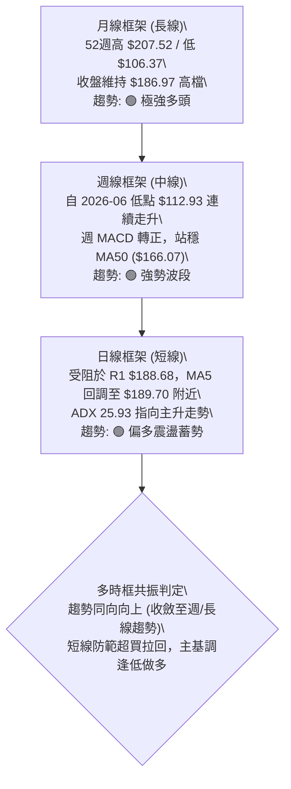

### 📈 長期趨勢 — 12個月走勢圖（Unicode）

```
PLTR 月線走勢圖（2025-10 至 2026-09）
價格軸 ($)
$210 ┤              ● (2025-10 高點 $200.47 / 52W高 $207.52)
$200 ┤              │                                  ● (現價 $186.97)
$190 ┤              │                            ●     │
$180 ┤              │     ● (12月 $177.75)       │     │
$170 ┤        ●     │     │                      │     │
$160 ┤        │     │     │                ●     │     │
$150 ┤        │     │     │    ●     ●     │     │     │
$140 ┤        │     │     │    │  ●  │  ●  │     │     │
$130 ┤        │     │     │    │  │  │  │  │     │     │
$120 ┤        │     │     │    │  │  │  │  │  ●  │     │
$110 ┤        │     │     │    │  │  │  │  │  │  │     │ (52W低點 $106.37)
     └────────┴─────┴─────┴────┴──┴──┴──┴──┴──┴──┴─────┴───────►
     月份:   09    10    11   12 01 02 03 04 05 06 07    08    09
            2025                                2026
```

#### 走勢特徵分析表格

| 階段區間 | 月份區間 | 價格起訖 | 漲跌幅度 | 核心特徵與市場結構 |
|----------|----------|----------|----------|--------------------|
| **波段攻頂** | 2025-09 ~ 2025-10 | $182.42 → $200.47 | +9.89% | 機構資金大舉推升創出 52 週波段極值，高點見 $207.52 |
| **中級回撤** | 2025-11 ~ 2026-02 | $200.47 → $137.19 | -31.57% | 估值過度擴張後的深度獲利回吐，跌破多條短期均線 |
| **築底打底** | 2026-03 ~ 2026-07 | $137.19 → $123.06 | -10.30% | 兩度探底（06月打出 $112.93 最低收盤），構築雙底/圓弧底底座 |
| **V型反轉** | 2026-08 ~ 2026-09 | $123.06 → $186.97 | +51.93% | 伴隨機構升級與業績放量，直接收復 50% 與 61.8% 斐波那契回調位 |

### 📊 中期趨勢（週線分析）

從 2026 年 5 月底至 9 月底的 20 週歷史走勢觀察：
- **築底與突破**：2026-06-28 當週收盤 $112.93（RSI 跌至 27.8 超賣區）確立為大週期底部。隨後於 2026-08-09 當週以爆量 4.35 億股（435,164,800）長陽線收在 $172.01，確立中期向上突破。
- **波段回洗確認**：2026-09-13 當週回踩 $167.23（獲得 MA50 $166.07 強力支撐），形成健康的波段回踩次低點。
- **強勢延續**：隨後兩週（09-20、09-27）迅速收復並推升至 $189.67，當前維持在 $186.97，中期趨勢為標準的「底底高、頂頂高」（Higher Lows & Higher Highs）多頭走勢。

```
中期週線結構示意圖：
$190 ┤                                              ╭──● ($189.67) ──► 現價 $186.97
$180 ┤                                       ╭──────╯
$170 ┤                      ╭───● ($174.04) ─╯      (回踩 $167.23 獲利洗盤)
$160 ┤                      │
$150 ┤                      │
$140 ┤                      │
$130 ┤        ╭──● ($132.38)│
$120 ┤        │             │
$110 ┤──●─────╯             │ (08-09 放量突破 $172.01)
        ($112.93 週期底)
```

### ⚡ 趨勢強度評估（ADX 解讀）

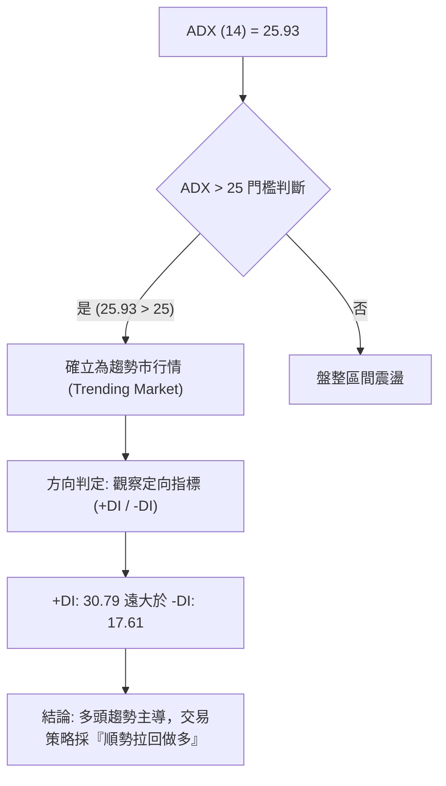

#### ADX 強度對照表

| 指標變數 | 當前讀數 | 基準區間 | 趨勢屬性判定 | 交易戰術意涵 |
|----------|----------|----------|--------------|--------------|
| **ADX 值** | **25.93** | 25 ~ 50 | 強趨勢啟動初期 | 擺脫無趨勢盤整，順勢策略勝率高於均值回歸策略 |
| **+DI (多方)** | **30.79** | > 25 | 買方掌控動能 | 多頭進攻推力充足，回調幅度預期有限 |
| **-DI (空方)** | **17.61** | < 20 | 賣方動能衰竭 | 空頭缺乏實質壓制力，拋壓集中在獲利盤解套 |
| **差值 (+DI - -DI)** | **+13.18** | > 10 | 明確發散狀態 | 趨勢具備較高慣性，不易驟然反轉 |

---

## 3. 圖表形態分析

### 🔍 形態識別系統

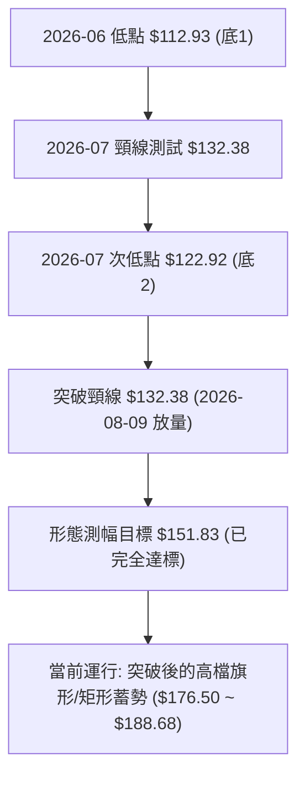

#### 形態信心度與目標價評估表

| 形態名稱 | 信心度 | 判斷依據（引用數據） | 完成度 | 目標價（附嚴格計算式） |
|----------|--------|----------------------|--------|------------------------|
| **雙重底 / W底 (中期)** | 85% | 2026-06 低點 $112.93 與 07-26 低點 $122.92，頸線為 07-19 高點 $132.38 | 100% (已達標) | 頸線 $132.38 + 形態高度 ($132.38 - $112.93 = $19.45) = **$151.83** (現價 $186.97 已遠超) |
| **高檔收斂旗形 (短線)** | 70% | 08-30 收盤 $186.29 後回踩 09-13 $167.23，再衝 09-27 $189.67，受制於 R1 $188.68 | 75% (進行中) | 旗桿底 $167.23 至旗桿頂 $189.67 高度 $22.44；突破 R1 ($188.68) 測幅：$188.68 + $22.44 = **$211.12** |
| **大型圓弧底 (長線)** | 60% | 2025-11 ($168.45) 下滑至 2026-06 ($116.67) 復歸當前 $186.97 | 80% (逼近前高) | 弧底深測幅：頸線約 R2 $198.88，若突破將挑戰 52W 高點 **$207.52** |

### 🕯️ 重要K線形態分析

| 週/月份 | 收盤價 | K線形態名稱 | 技術特徵解讀 | 訊號意涵 |
|----------|--------|-------------|--------------|----------|
| **2026-06-28** | $112.93 | 長下影錘頭破底翻 | 探底至 52W 低點 $106.37 區域後強烈抵抗，收出週線止跌信號 | 🟢 強烈見底 |
| **2026-08-09** | $172.01 | 爆量長紅突破大陽線 | 週成交量激增至 435.16M，一舉貫穿 MA50 與 MA200，扭轉中期格局 | 🟢 主升發動 |
| **2026-09-13** | $167.23 | 縮量測試回踩十字符 | 週量驟降至 81.68M (洗盤特徵)，於 MA50 ($166.07) 上方獲得支撐 | 🟢 良性回測 |
| **2026-09-27** | $189.67 | 實體陽線吞噬 | 吞噬前兩週整理陰線，最高衝上 $189.70 均線，多頭重新發起攻勢 | 🟢 攻擊再起 |
| **2026-10-04** | $186.97 | 高檔十字星/孕線 | 量能驟縮至 33.18M，收在 5日均線下方，顯示 R1 $188.68 前追價謹慎 | 🟡 高檔整理 |

### 📉 ASCII 走勢形態示意圖

```
PLTR 日/週線突破回測示意圖：
$207.52 ┤ (52W歷史高點 R3)
        │
$198.88 ┤ (近一年波段高點聚類 R2)
        │                       ╭───● 現價 $186.97 (受制於 R1 $188.68)
$188.68 ┤───────────────────────┼───────► [短線突破關鍵頸線]
        │                       │ ╭─╯ (回測 $167.23 後反彈)
$176.50 ┤───────────────────────┼─╯ 支撐位 S1
        │                       │
$166.07 ┤───────────────────────╯ MA50 支撐 / 接近 S3 $165.45
        │           ╭───────● 08-09 突破大紅棒
$132.38 ┤───────────┼───────► [W底雙底頸線]
        │    ●      │
$112.93 ┤────┴──────╯ 06-28 週低點 (雙底型態確立)
```

### 🎯 形態目標價計算

根據雙底突破與短線高檔旗形理論，目標價計算式嚴格限定如下：
1. **中期已完成形態（雙底測幅）**：
   - 底點：$112.93（2026-06-28）
   - 頸線：$132.38（2026-07-19）
   - 形態垂直高度 $H_1 = \$132.38 - \$112.93 = \$19.45$
   - 最小量度目標價 $T_0 = \$132.38 + \$19.45 = \$151.83$（已於 2026-08 突破並超越）。
2. **當前高檔整理旗形（進行中形態）**：
   - 旗桿起點：$167.23（2026-09-13 波段低點）
   - 旗桿頂點：$189.67（2026-09-27 波段高點）
   - 旗桿高度 $H_2 = \$189.67 - \$167.23 = \$22.44$
   - 突破阻力位 R1（$188.68）後之延伸目標：
     $$\text{目標價 1} = \$188.68 + \$22.44 = \$211.12$$
     *(註：該推算目標落在 52W 高點 $207.52 之上方邊界，需先克服 R2 $198.88 與 R3 $207.52)*。

---

## 4. 支撐與阻力

### 🗺️ 關鍵價位分布圖（Unicode）

```
PLTR 價位結構分布圖（引用 OHLCV 聚類與斐波那契點位）
═══════════════════════════════════════════════════════════════
$207.52 ║████████████████████████║ 強阻力 R3 / 52W 高點 / Fib 0.0%
$198.88 ║████████████████████    ║ 次級阻力 R2 (近一年波段高點聚類)
$195.37 ║▓▓▓▓▓▓▓▓▓▓▓▓▓▓▓▓        ║ 布林帶上軌 (動態壓制)
$188.68 ║████████████████████████║ 關鍵阻力 R1 (+0.91%)
$186.97 ╠════════════════════════╣ ◄ 當前收盤價 ($186.97)
$183.65 ║░░░░░░░░░░░░░░░░░░░░░░░░║ 斐波那契 23.6% 回調關鍵樞軸
$178.49 ║▓▓▓▓▓▓▓▓▓▓▓▓▓▓▓▓▓▓▓▓    ║ MA20 均線 / 布林中軌支撐
$176.50 ║████████████████        ║ 近期波段支撐 S1 (-5.60%)
$170.12 ║████████████████████    ║ 中期支撐 S2 (-9.01%)
$168.88 ║░░░░░░░░░░░░░░░░░░░░░░░░║ 斐波那契 38.2% 回調支撐位
$166.07 ║▓▓▓▓▓▓▓▓▓▓▓▓▓▓▓▓▓▓▓▓▓▓  ║ MA50 均線位置
$165.45 ║████████████████████████║ 強支撐 S3 (-11.51%) / 波段防守底線
═══════════════════════════════════════════════════════════════
```

### 🚧 阻力位分析表

| 阻力級別 | 精確價位 | 距離現價 | 形成原因與籌碼屬性 | 突破難度 | 重要性評級 |
|----------|----------|----------|--------------------|----------|------------|
| **R1** | **$188.68** | +0.91% | 近期日線高點聚類，接近 MA5 ($189.70) 密集套牢線 | 🟡 中等 (需補量) | ★★★★☆ |
| **R2** | **$198.88** | +6.37% | 近一年波段高點聚類，$200 整數心理心理防線前哨 | 🔴 較高 (空頭阻擊) | ★★★★☆ |
| **R3** | **$207.52** | +10.99% | 52週歷史極值高點（Fib 0.0%），歷史天花板 | 🔴 極高 (獲利盤湧現)| ★★★★★ |

### 🛡️ 支撐位分析表

| 支撐級別 | 精確價位 | 距離現價 | 形成原因與籌碼屬性 | 守住機率 | 重要性評級 |
|----------|----------|----------|--------------------|----------|------------|
| **S1** | **$176.50** | -5.60% | 近期波段低點聚類，緊鄰 MA20 ($178.49) 生命線 | 🟢 80% (短多防線) | ★★★★☆ |
| **S2** | **$170.12** | -9.01% | 前期拉升回踩低點聚類，與 Fib 38.2% ($168.88) 共振 | 🟢 85% (中期支撐) | ★★★★☆ |
| **S3** | **$165.45** | -11.51% | 近一年強波段低點聚類，重疊 MA50 ($166.07)，多頭多空分水嶺 | 🟢 90% (核心底線) | ★★★★★ |

### 📐 斐波那契回調位分析

依據 52 週極值區間（低點 **$106.37** 至 高點 **$207.52**，總波幅 $101.15）精確回調點位如下：

```
斐波那契回調梯隊：
0.0%  (52W High) ────────── $207.52 (歷史高點)
23.6%            ────────── $183.65 (現價 $186.97 穩居其上，強勢區間)
38.2%            ────────── $168.88 (黃金分割第一防守位)
50.0%            ────────── $156.95 (多空多空平衡樞軸)
61.8%            ────────── $145.01 (強弱防守底線)
78.6%            ────────── $128.02 (深幅回調位)
100.0% (52W Low) ────────── $106.37 (週期起漲點)
```

- **位置解讀**：現價 **$186.97** 落於 **0.0% ($207.52)** 與 **23.6% ($183.65)** 之間極度強勢的上半區。
- **技術意義**：股價回調甚至未觸及 38.2%（$168.88），且牢牢站穩 23.6%（$183.65）之上，這在道氏理論與斐波那契波浪模型中屬於「極強勢淺幅修正」（Shallow Retracement），意味著買盤急於在高檔承接，隨時具備再度挑戰高點 $207.52 的動能。

---

## 5. 技術指標深度解讀

### 🎛️ 指標訊號總覽

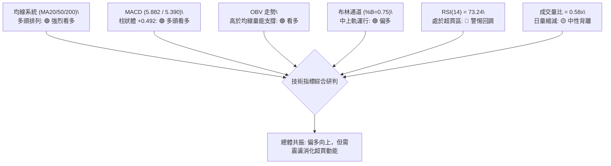

### 📈 移動平均線排列分析

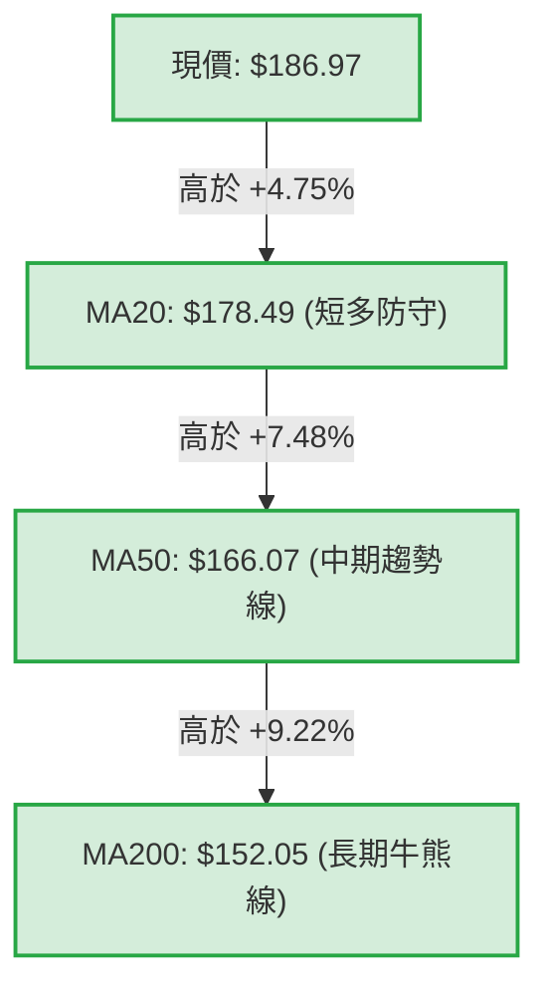

#### 均線階梯分佈與乖離率

| 均線名稱 | 當前價格 | 乖離率 (Bias) | 斜率與方向 | 均線角色與技術解讀 |
|----------|----------|---------------|------------|--------------------|
| **MA 5** | $189.70 | -1.44% | ▼ 微幅下彎 | 短線阻力，現價略微跌破，反映短線有降溫休整需求 |
| **MA 10**| $184.48 | +1.35% | ▲ 陡峭上行 | 短線第一道支撐，提供日內動態下檔保護 |
| **MA 20**| $178.49 | +4.75% | ▲ 穩定上揚 | 波段生命線，與布林中軌完全重合，為強勢防守核心 |
| **MA 60**| $160.42 | +16.55%| ▲ 向上發散 | 中期加速推升線，確認中期資金持續流入 |
| **MA120**| $147.81 | +26.50%| ▲ 向上發散 | 半年支撐強勁，機構持倉成本區間 |
| **MA200**| $152.05 | +22.97%| ▲ 長多確立 | 長期多頭防線，形成「黃金排列」，大週期全面看多 |

### 📉 RSI(14) 分析

- **RSI 數值強度展示**：
  `RSI(14): 73.24`  [██████████████░░░░░░] 73.24% （處於 > 70 警戒超買區間）
- **超買超賣區間解讀**：
  - 目前讀數為 **73.24**，已跨入 70 以上的超買區間。回顧近 20 週數據，2026-08-23 RSI 曾達到 79.0 後引發一波回調至 $167.23（RSI 降至 40.8）。
  - 然而在強趨勢市場中（ADX=25.93），RSI 超買並不等同於立即崩跌，而多以「高檔鈍化」或橫盤震盪化解。
- **背離分析判斷**：
  - **日線級別**：數據快照明確顯示「**RSI 背離：無明顯背離**」。價格衝高伴隨 RSI 上揚，未出現顯著頂背離。
  - **週線級別**：2026-08-23 收盤 $179.94（週 RSI 79.0），至 2026-10-04 收盤 $186.97（週 RSI 73.2），價格創出更高收盤價，但週線 RSI 數值略降（79.0 → 73.2），呈現**潛在的週線級別輕度頂背離隱憂**。這意味著向上衝擊 R1 ($188.68) 及 R2 ($198.88) 時，容易因跟隨動能不足而出現短線技術性回踩。

### 📊 MACD(12/26/9) 訊號解讀

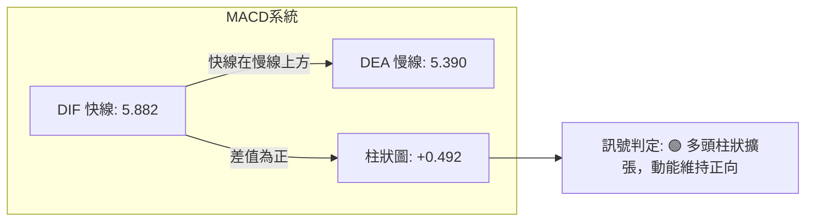

- **參數狀態**：MACD 線為 **5.882**，訊號線為 **5.390**，柱狀圖（Histogram）為 **+0.492**。
- **解讀**：雙線深處零軸上方，柱狀體維持正向擴張（+0.492），顯示多頭掌控市場主導權。由週線觀察，MACD 柱狀體在 2026-09-13 觸及 -3.155 谷底後快速反彈，連續兩週翻正（+1.024、+0.492），確認修正波段結束，正處於新一輪主升驅動結構中。
- **背離判定**：**無底背離，亦無實質頂背離**。柱狀圖與快慢線同步隨價格反彈走揚，確認趨勢有效。

### 📦 布林通道分析

```
PLTR 布林通道 (20, 2) 結構圖：
$195.37 ┬────────────────────────────────────────── 布林上軌 (強壓阻力)
        │
$186.97 ┼────────────────────● 現價位置 (%B = 0.75，向強勢區靠攏)
        │
$178.49 ┼────────────────────────────────────────── 布林中軌 (MA20 生命線 / 關鍵支撐)
        │
$161.62 ┴────────────────────────────────────────── 布林下軌 (極端支撐，遠離現價)
```

- **通道帶寬與位置**：上軌 **$195.37**，中軌 **$178.49**，下軌 **$161.62**。帶寬寬幅達 $33.75（約 18%）。
- **%B 指標分析**：目前 **%B = 0.75**，處於中軌（0.50）與上軌（1.00）的上半強勢通道。
- **型態意義**：現價自中軌反彈並沿著上軌方向推進，未跌破中軌前，多頭通道結構完好；上軌 $195.37 將與阻力位 R2 ($198.88) 形成強大的動態阻力帶。

### 💹 成交量分析（量價配合度）

```
量能比較柱狀圖：
最新日成交量  ██████████░░░░░░░  14.72M
20日平均量    █████████████████  25.47M  (量比: 0.58x 縮量)
50日平均量    ███████████████████████ 35.09M
```

- **OBV (能量潮指標)**：系統判定「**OBV > MA → 量能支撐上漲**」。雖然單日成交量（14.72M）低於 20日均量（25.47M），量比僅 0.58x，但累計能量潮（OBV）維持在均線上方，顯示籌碼沉澱良好，機構未有大規模派發跡象。
- **量價背離風險提示**：日線縮量上漲逼近 R1 $188.68，顯示散戶追價意願不足，若欲實質突破 R2 $198.88 與前高 $207.52，日成交量必須放大至 30M 以上（或週成交量大於 1.8 億股），否則易面臨「縮量誘多後回測支撐」之洗盤行情。

---

## 6. 動能與波動率

### ⚡ 動能評估四象限

| 象限 | 動能維度 | 波動維度 | 狀態特徵 | 當前 PLTR 歸屬與評估 |
|------|----------|----------|----------|----------------------|
| **Q1** | **強動能** | **低/中波動** | 穩定上升趨勢，最佳持股機會 | **✓ 當前狀態**（動能充沛，ATR 3.09% 處可控水平） |
| **Q2** | 弱動能 | 低波動 | 橫向窄幅盤整，資金觀望沉澱 | - |
| **Q3** | 強動能 | 極高波動 | 頂部狂熱或恐慌殺跌，高風險 | - |
| **Q4** | 弱動能 | 高波動 | 破位下挫，籌碼凌亂，應避免進場 | - |

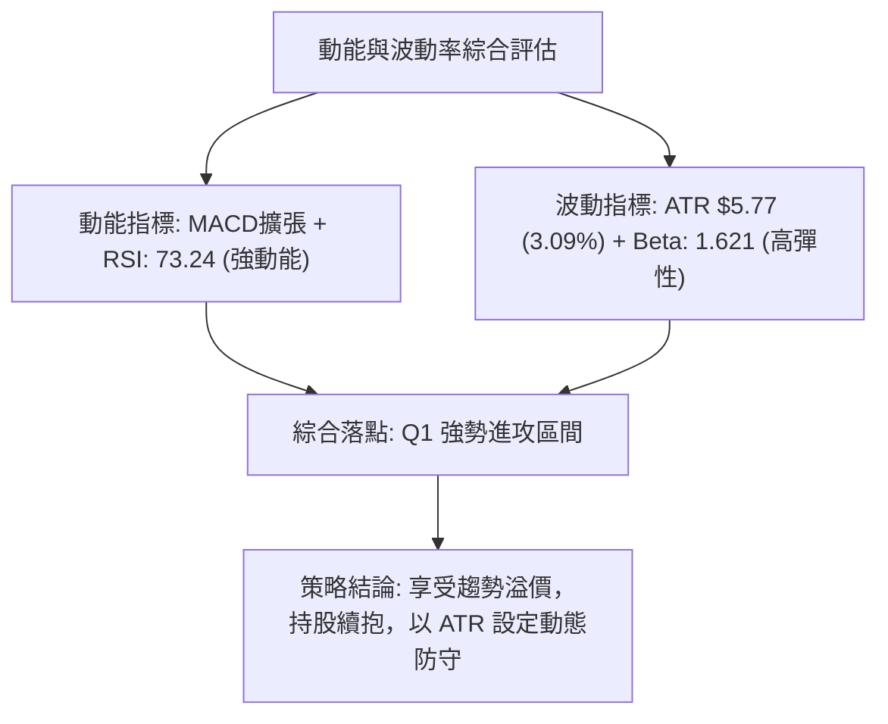

### 📊 ATR 波動率分析

- **ATR(14) 數值**：**$5.77**（佔當前股價之 **3.09%**）。
- **日內波動區間推算**：
  - 日內常態預期波動區間為：$\text{現價} \pm 1.0 \times \text{ATR} = \$186.97 \pm \$5.77 \rightarrow [\$181.20, \$192.74]$。
- **停損距離設定建議**：
  - **短線緊密停損（1.5 ATR）**：$1.5 \times \$5.77 = \$8.66$。停損點設於 $\$186.97 - \$8.66 = \mathbf{\$178.31}$（恰好防守於 MA20 $178.49 之下方）。
  - **波段寬鬆停損（2.0 ATR）**：$2.0 \times \$5.77 = \$11.54$。停損點設於 $\$186.97 - \$11.54 = \mathbf{\$175.43}$（落於支撐 S1 $176.50 之下方，具備極佳防守縱深）。

### 📐 Beta 與市場相關性

- **Beta 係數**：**1.621**（高度進攻型標的）。
- **市場特徵解讀**：
  - Beta 為 1.621 表示當標普 500 指數（S&P 500）波動 1% 時，PLTR 理論波動幅度為 1.621%。
  - 在大盤處於牛市或科技板塊（XLK/QQQ）上攻期間，PLTR 能帶來顯著的超額超額收益（Alpha）；但相對地，一旦大盤遭遇系統性拋售，高 Beta 特性亦會放大回撤幅度，交易者必須隨時警惕大盤系統性風險。

---

## 7. 多時框架總結

### 📋 時框架評分表

| 時框架 | 趨勢方向 | 動能狀態 | 均線排列 | 形態特徵 | 綜合評分 | 操作指導建議 |
|--------|----------|----------|----------|----------|----------|--------------|
| **月線 (長)** | 🟢 強烈看多 | 強勁 (持續自低位回升) | MA 多頭擴散 | 逼近 52W 高點挑戰區 | **85/100** | 長線多頭波段續抱 |
| **週線 (中)** | 🟢 多頭主導 | 轉強 (MACD 翻正柱擴張) | 站穩 MA50 與 MA200 | 突破 W 底後健康上攻 | **80/100** | 中期拉回找買點 |
| **日線 (短)** | 🟡 偏多震盪 | 超買 (RSI 73.24 / 量縮) | MA20>50 多頭排列 | 逼近 R1 $188.68 蓄勢 | **68/100** | 勿盲目追高，等待突破或回測 |

### 🔲 綜合訊號矩陣

```
時框維度共振檢驗矩陣：
┌──────────────┬──────────────┬──────────────┬──────────────┐
│  時框指標    │  短期 (日線) │  中期 (週線) │  長期 (月線) │
├──────────────┼──────────────┼──────────────┼──────────────┤
│ 均線系統     │  🟢 偏多     │  🟢 極強     │  🟢 強勢     │
│ MACD / 動能  │  🟢 金叉擴張 │  🟢 剛翻紅   │  🟢 持續向上 │
│ RSI / 擺動   │  🔴 超買鈍化 │  🟡 中性偏熱 │  🟢 良好     │
│ 成交量能     │  🟡 縮量     │  🟢 溫和放大 │  🟢 機構進駐 │
│ 結構位階     │  🟡 測試 R1  │  🟢 守穩頸線 │  🟢 79.7%位階│
└──────────────┴──────────────┴──────────────┴──────────────┘
訊號一致性評估：中長期訊號極度高度一致（綠燈），短期僅因 RSI 偏高與量縮出現短線降溫需求，無結構性衝突。
```

### ⚖️ 多時框收斂結論

> **依嚴格規則 14 進行收斂**：
> 1. **趨勢市判定**：當前 ADX(14) 讀數為 **25.93**（> 25），且 +DI（30.79）遠超 -DI（17.61），系統明確定義當前為**「強趨勢行情」（Trending Market）**而非「盤整行情」。
> 2. **主導時框優先級**：依多時框收斂規則，趨勢行情下**以中長期（週線、MA50 $166.07、MA200 $152.05）多頭方向為主導**，日線級別的短期指標（如 RSI 超買、日量比 0.58x）僅用於尋找精確的進場點與回調防守點，絕不可逆向做空。
> 3. **唯一方向性結論**：**【強烈偏多，回踩進場】**。短線震盪不改中長期主升浪格局，交易策略全力鎖定多頭買點。

---

## 8. 交易策略建議

### 🗺️ 策略決策流程圖

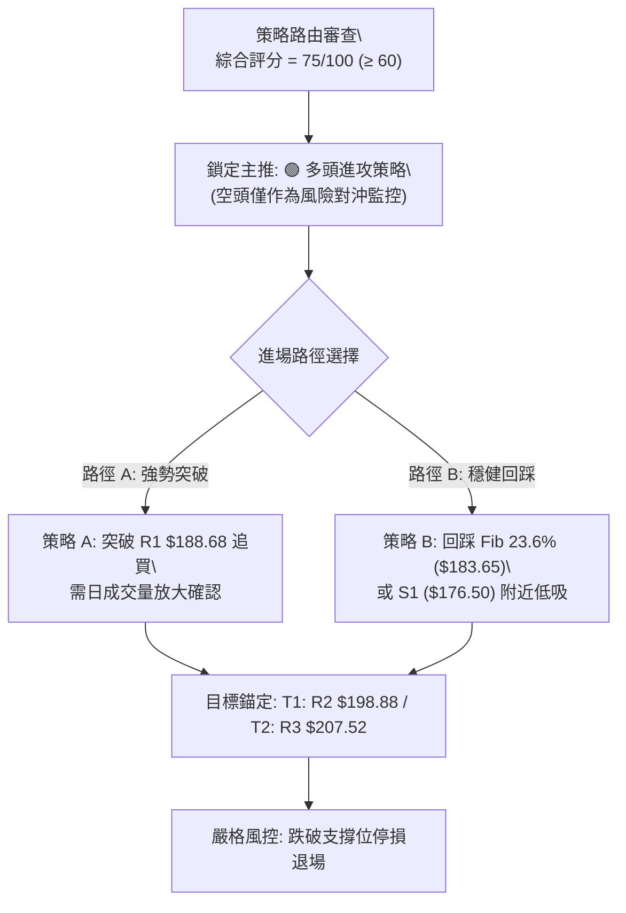

### 🧭 策略路由

- **依評分卡結論**：**當前綜合技術評分為 75/100（偏多 ≥60）**。
- **唯一主策略方向**：**全面主推多頭策略（Bullish Strategies）**。空方訊號不具備做空性價比，僅列為多單保本與對沖平倉之風控依據。

### 🎯 價格情境階梯（Price Scenarios）

以當前價格 **$186.97** 為核心基準，價格情境完全嚴格引用數據庫之聚類點位：

| 觸發條件（價格行為） | 下一目標點位 | 後續延伸目標 | 情境含義與技術心理解讀 |
|----------------------|--------------|--------------|------------------------|
| **向上放量突破 R1 ($188.68)** | **R2 ($198.88)** | **R3 ($207.52)** | 短線阻力被突破，波段多頭攻勢全面重啟，挑戰歷史天花板 |
| **受阻於 R1 並回測 $183.65** | **MA20 ($178.49)** | **S1 ($176.50)** | 強勢通道內的良性獲利回吐，消化 RSI 超買，提供二次上車機會 |
| **向下跌破 S1 ($176.50)** | **S2 ($170.12)** | **S3 ($165.45)** | 中期多頭警訊，回測 MA50 均線生命線，進入深幅震盪整理 |

### 📊 情境機率分佈

```
情境機率分佈圖：
突破上行 (挑戰 R2/R3)  ████████████████████████  60%
區間震盪 ($176.50~$188.68) ████████████  30%
深度破位 (回測 S2/S3)  ████  10%
```

| 情境劇本 | 估計機率 | 主要技術依據與指標支撐 |
|----------|----------|------------------------|
| **強勢突破上行** | **60%** | ADX 25.93 趨勢確立、MACD 柱狀體 +0.492、均線呈多頭排列且 OBV 支撐 |
| **高檔區間震盪** | **30%** | 日成交量縮（量比 0.58x）、RSI(14)=73.24 超買需要橫盤消化，布林上軌壓制 |
| **深度回撤回落** | **10%** | S1 ($176.50) 及 MA20 防守密集，除非市場遭遇不可抗力黑天鵝事件 |

### 🟢 主策略詳情（方向：主推多頭）

本報告提供兩種多頭交易戰術：**策略 A（突破型）** 與 **策略 B（回踩低吸型）**。所有點位嚴格引用支撐阻力聚類數據：

| 策略要素 | 策略 A：動能突破進場（追強） | 策略 B：支撐回踩進場（穩健） |
|----------|------------------------------|------------------------------|
| **進場條件** | 日線放量突破 R1（收盤價確認） | 價格拉回至 Fib 23.6% 獲得支撐 |
| **精確進場價格** | **$188.68** | **$183.65** |
| **第一目標價 (T1)** | **$198.88** (阻力位 R2, +5.40%) | **$198.88** (阻力位 R2, +8.29%) |
| **第二目標價 (T2)** | **$207.52** (阻力位 R3, +9.99%) | **$207.52** (阻力位 R3, +13.00%) |
| **精確停損價格** | **$183.65** (跌破 Fib 23.6% 防守) | **$176.50** (跌破支撐位 S1) |
| **風險空間 ($)** | $188.68 - $183.65 = $5.03 | $183.65 - $176.50 = $7.15 |
| **第一目標回報 ($)**| $198.88 - $188.68 = $10.20 | $198.88 - $183.65 = $15.23 |
| **風險報酬比 (R:R)**| **1 : 2.03** (以 T1 計算) | **1 : 2.13** (以 T1 計算) |
| **第二目標風報比** | **1 : 3.75** (以 T2 計算) | **1 : 3.34** (以 T2 計算) |
| **預估勝率** | **65%** | **70%** |
| **建議配置倉位** | **15% ~ 20%** 總資金 | **20% ~ 25%** 總資金 |

### 🔴 反向風險觸發點（對沖與風控提示）

非做空建議，僅作為多頭持倉之止盈保本或避險對沖警報：
- **第一警報（減倉信號）**：若股價收盤跌破 **$178.49（MA20 / 布林中軌）**，應平倉 50% 多頭部位以鎖定利潤。
- **第二警報（徹底防守）**：若股價跌破 **$176.50（S1）** 甚至貫穿 **$170.12（S2）**，意味著波段主升浪被破壞，多頭策略全面停損退場，並考慮買入看跌期權（Put）對沖現貨底倉。
- **指標反轉觸發**：若日線 RSI 跌破 50 中軸且 MACD 出現零軸上方死叉，全面終止多頭進攻策略。

### ⭐ 整體訊號強度評星

```
╔══════════════════════════════════════════════════════════════╗
║  做多訊號強度：★★★★☆  (4.0/5星) — 趨勢與均線高度看多      ║
║  做空訊號強度：★☆☆☆☆  (1.0/5星) — 逆勢交易，缺乏做空結構  ║
║  整體可信度：  ★★★★☆  (4.0/5星) — 指標與價位共振性強      ║
╚══════════════════════════════════════════════════════════════╝
```

---

## 9. 風險提示與監控

### ✅ 關鍵監控指標 Checklist

```
╔══════════════════════════════════════════════════════════════════╗
║                    PLTR 交易監控指標檢核表                       ║
╠══════════════════════════════════════════════════════════════════╣
║ [ ] 價位確認：每日收盤是否穩守於 $183.65 (Fib 23.6%) 之上       ║
║ [ ] 均線防線：MA20 ($178.49) 生命線是否維持向上斜率             ║
║ [ ] 量能變化：上攻突破 $188.68 時，成交量是否重回 25M (均量)     ║
║ [ ] 擺動指標：日線 RSI(14) 是否在 70~80 間鈍化，或跌破 65 回洗  ║
║ [ ] 動向指標：ADX(14) 是否持續高於 25 且 +DI 維持在 30 之上     ║
║ [ ] 籌碼觀測：機構評級持續上調（近期 Rosenblatt/UBS 給出買入）   ║
║ [ ] 系統波動：VIX 是否暴拉導致高 Beta (1.621) 的 PLTR 擴大回撤  ║
╚══════════════════════════════════════════════════════════════════╝
```

### ⚠️ 風險場景分析

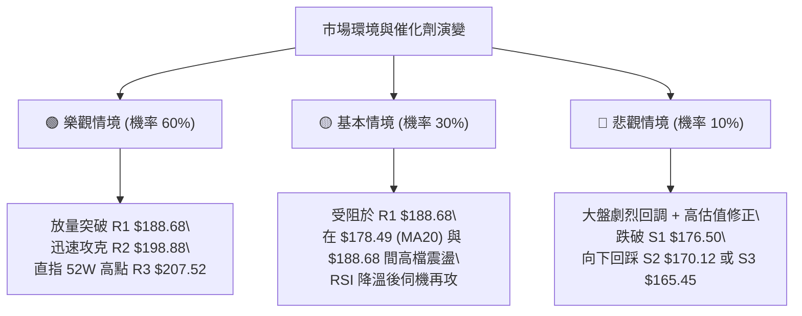

### 🛡️ 風險管理重要提醒

1. **高估值引發的波動風險**：
   PLTR 當前 Trailing P/E 高達 158.45，Forward P/E 為 80.49，P/S 高達 72.99。極高的估值容錯率極低，任何市場利率預期上升或大盤回檔，都可能誘發高估值股票的大幅震盪。
2. **高 Beta 槓桿控制**：
   PLTR 的 Beta 為 1.621，波動特性顯著高於大盤。單筆交易風險敞口（Risk at Cost）嚴禁超過總投資組合淨值的 **1.5% ~ 2.0%**。
3. **ATR 動態部位管理**：
   以日 ATR $5.77 計算，單日內 2 倍 ATR 的回撤可達 $11.54。持股者切忌使用高槓桿保證金操作，以免在正常技術回測中遭到斷頭洗出場。

---

## 📋 報告總結

```
╔══════════════════════════════════════════════════════════════════════╗
║                      PLTR 技術分析報告總結                           ║
╠══════════════════════════════════════════════════════════════════════╣
║ 報告日期：2026-09-30                                                 ║
║ 當前價格：$186.97                                                    ║
║ 分析評級：🟢 強烈偏多 (Bullish / Trend Continuation)                 ║
║                                                                      ║
║ 關鍵結論：                                                           ║
║ ├─ 長期趨勢：🟢 強烈看多 (站穩 52W 區間 79.7%，歷史高位震盪)        ║
║ ├─ 中期趨勢：🟢 多頭主導 (W底完成突破，週 MACD 翻正上行)              ║
║ ├─ 短期趨勢：🟡 偏多蓄勢 (受制 R1 $188.68，RSI 73.24 超買整理)       ║
║ ├─ 關鍵支撐：S1 $176.50 / S2 $170.12 / S3 $165.45 (核心 MA50)        ║
║ ├─ 關鍵阻力：R1 $188.68 / R2 $198.88 / R3 $207.52 (52W歷史高)        ║
║ └─ 分析師目標：均價 $195.57 / 最高 $255.00                           ║
║                                                                      ║
║ 最優策略組合：                                                       ║
║ 1. 🥇 最佳機會：回踩 Fib 23.6% ($183.65) 分批建立多頭部位 (策略 B)    ║
║ 2. 🥈 次選機會：放量突破 R1 ($188.68) 後右側順勢追進 (策略 A)       ║
║ 3. 🥉 保守選擇：等待股價回踩 MA20 ($178.49) 至 S1 ($176.50) 企穩低吸 ║
╚══════════════════════════════════════════════════════════════════════╝
```

---

> ⚠️ **免責聲明**：本報告為 AI 自動生成之技術分析，所有數據及估算均基於提供的歷史價格資訊。本報告**僅供研究與學術參考**，**不構成任何投資建議**。投資有風險，入市需謹慎。

---

*報告生成時間：2026-09-30 ｜ 數據來源：Yahoo Finance ｜ 分析框架：多時框技術分析*