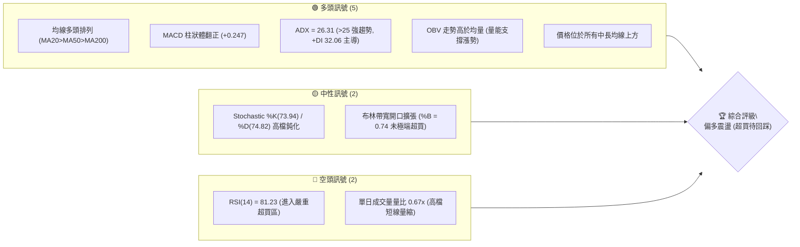
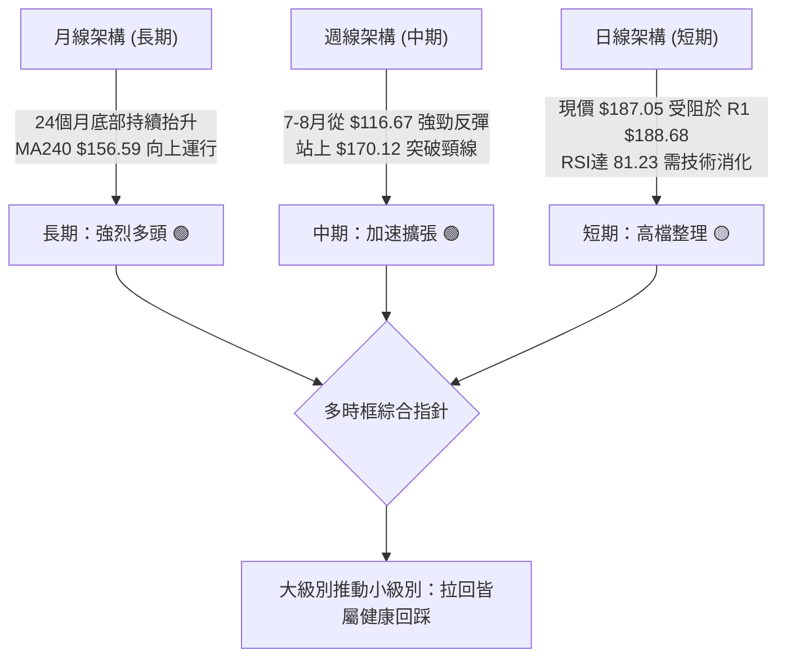
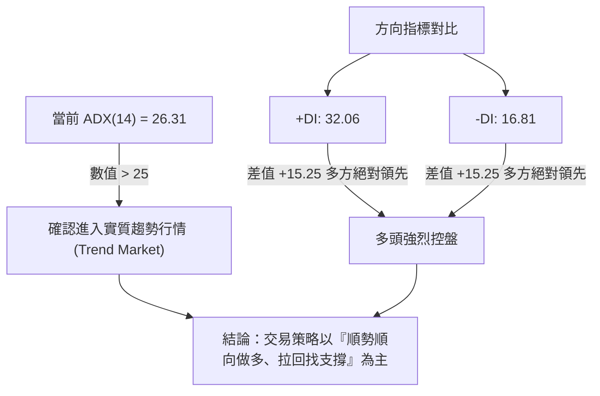
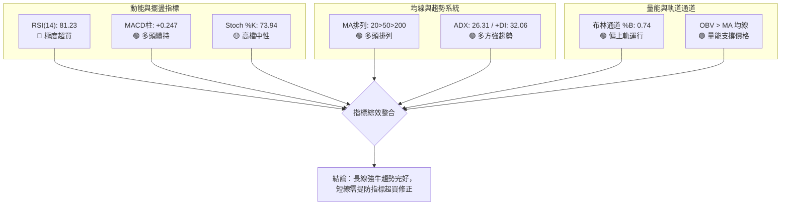
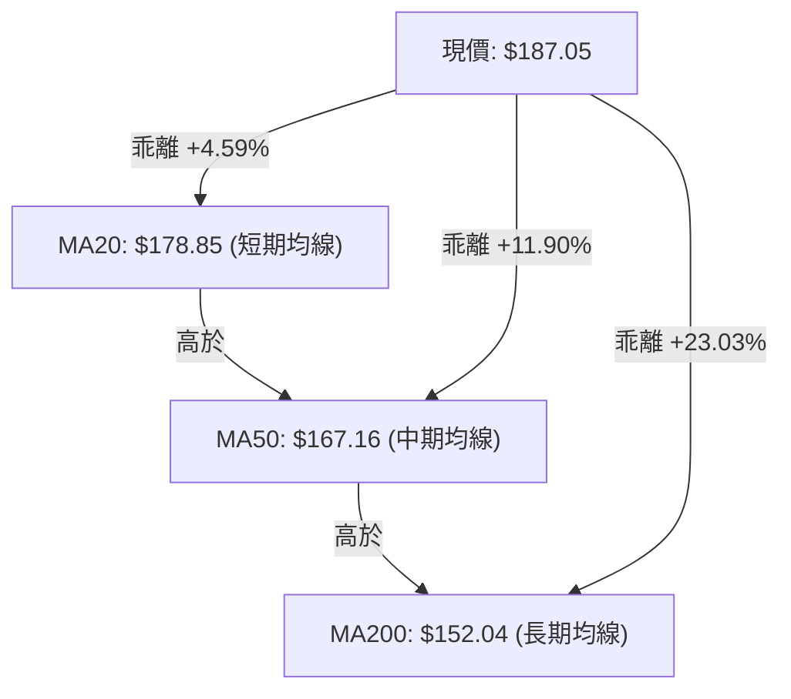
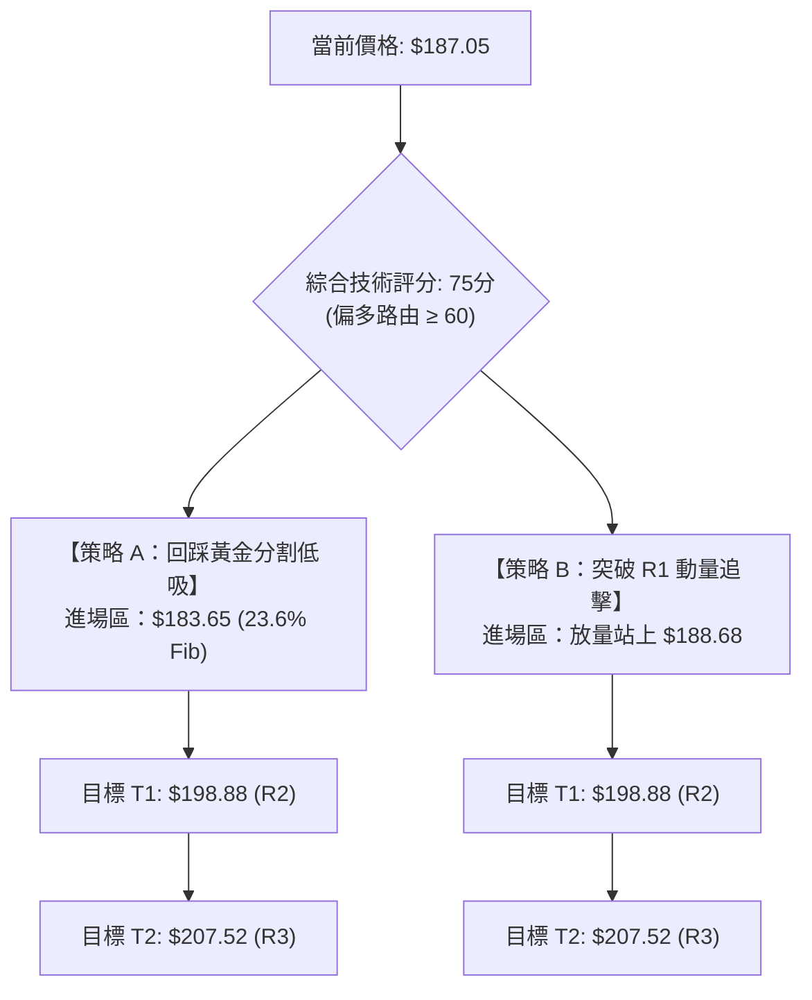
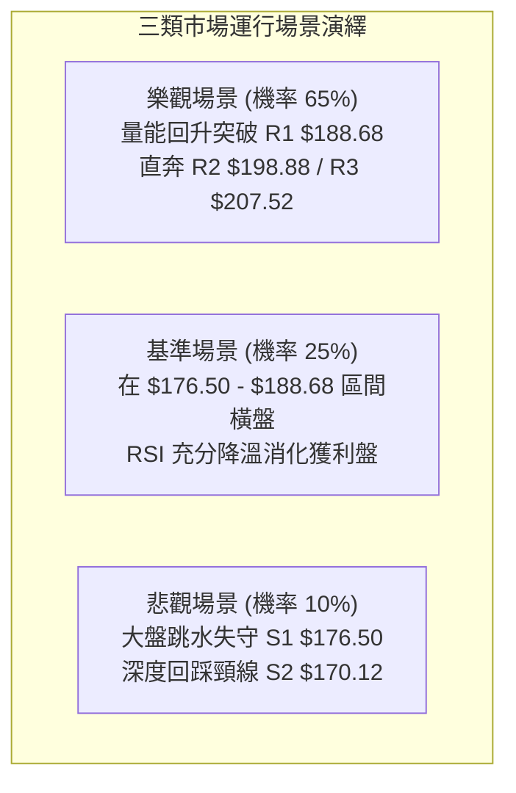

# PLTR 技術分析報告

> **報告日期**：2026-10-01 ｜ **語言**：繁體中文 ｜ **數據來源**：Yahoo Finance ｜ **當前價格**：$187.05

---

## 目錄

| 章節 | 內容 |
|------|------|
| [1. 技術面概覽](#1-技術面概覽) | 訊號儀表板、核心指標、評分卡 |
| [2. 趨勢分析](#2-趨勢分析) | 多時框趨勢、長中短期走勢 |
| [3. 圖表形態分析](#3-圖表形態分析) | 形態識別、K線組合、目標價 |
| [4. 支撐與阻力](#4-支撐與阻力) | 關鍵價位、斐波那契回調 |
| [5. 技術指標深度解讀](#5-技術指標深度解讀) | MA/RSI/MACD/布林/成交量 |
| [6. 動能與波動率](#6-動能與波動率) | 動能評估、ATR、Beta |
| [7. 多時框架總結](#7-多時框架總結) | 時框架評分矩陣 |
| [8. 交易策略建議](#8-交易策略建議) | 多空策略、風險報酬比 |
| [9. 風險提示與監控](#9-風險提示與監控) | 監控指標、風險場景 |
| [📋 報告總結](#-報告總結) | 核心總結與策略彙整 |

---

## 1. 技術面概覽

### 🎯 技術訊號儀表板



---

### 📊 核心指標速覽表

| 指標類別 | 指標名稱 | 當前數值 | 訊號 | 解讀 |
|----------|----------|----------|------|------|
| **價格** | 當前收盤價 | $187.05 | 🟢 | 穩居 23.6% 斐波那契分水嶺 $183.65 之上，處於 52 週高檔區間 79.8% |
| **短期均線** | MA20 | $178.85 | 🟢 | 現價高於 MA20 達 +4.59%，短期多頭波段結構完好 |
| **中期均線** | MA50 | $167.16 | 🟢 | 現價高於 MA50 達 +11.90%，中期趨勢穩健墊高 |
| **長期均線** | MA200 | $152.04 | 🟢 | 現價高於 MA200 達 +23.03%，長期牛市基底堅固 |
| **動能** | RSI(14) | 81.23 | 🔴 | 指標突破 80 進入極度超買區，短線隨時有回測支撐壓力 |
| **動能** | MACD (12,26,9) | 5.699 / 5.452 | 🟢 | 快線維持在慢線上方，柱狀體為 +0.247，多頭動能延續 |
| **趨勢強度** | ADX (14) | 26.31 | 🟢 | ADX 突破 25 臨界線確認趨勢行情，+DI(32.06) 顯著高於 -DI(16.81) |
| **通道通道** | 布林帶 %B | 0.74 | 🟡 | 價格貼近中上軌之間 ($178.85–$196.15)，尚未碰觸上軌壓制 |
| **成交量能** | 20日成交均量比 | 0.67x | 🟡 | 單日量 16.83M 低於 20日均量 25.09M，高檔呈現惜售但追價動能暫緩 |
| **波動度** | ATR (14) | $5.71 | 🟡 | 佔現價 3.05%，日均波動適中，提供明確止損與波動緩衝空間 |

---

### 🏆 技術評分卡

```
╔══════════════════════════════════════════════════════════════════╗
║               技術評分卡 — PLTR (2026-10-01)                    ║
╠══════════════════════════════════════════════════════════════════╣
║ 趨勢強度 (ADX/+DI)    ████████████████░░░░  78/100  🟢 強勢多頭 ║
║ 動能指標 (RSI/MACD)   ████████████░░░░░░░░  60/100  🟡 偏多超買 ║
║ 支撐穩定度 (S1/S2/S3) ████████████████░░░░  80/100  🟢 底部紮實 ║
║ 成交量配合 (OBV/Vol)  ████████████░░░░░░░░  62/100  🟡 量能略縮 ║
║ 形態完整度 (波段低點) ████████████████░░░░  80/100  🟢 階梯上攻 ║
║ 均線排列 (MA20/50/200)████████████████████  92/100  🟢 完美多頭 ║
╠══════════════════════════════════════════════════════════════════╣
║ 綜合技術評分          ███████████████░░░░░  75/100  🟢 偏多進攻 ║
╚══════════════════════════════════════════════════════════════════╝
```

---

## 2. 趨勢分析

### 🌐 多時框趨勢分析



---

### 📈 長期趨勢 — 12個月走勢圖（Unicode）

以下展示自 2025 年 10 月至 2026 年 09 月之月線收盤價走勢路徑：

```
PLTR 月線走勢圖（2025-10 至 2026-09）
價格軸 ($)
$210 ┤                                        
$200 ┤ ●(200.47)                              
$190 ┤                                      ●(187.05 現價)
$180 ┤       ●(177.75)                 ●(186.38)
$170 ┤   ●(168.45)                             
$160 ┤                         ●(156.54)       
$150 ┤             ●(146.28)                   
$140 ┤   ●(146.59)     ●(139.11)               
$130 ┤       ●(137.19)                     ●(123.06)
$120 ┤                                 ●(116.67 低點)
     └─┬───┬───┬───┬───┬───┬───┬───┬───┬───┬───┬───
      10  11  12  01  02  03  04  05  06  07  08  09 (月份)
      (2025年)               (2026年)
```

#### 走勢特徵分析表格

| 階段區間 | 起訖月份 | 價格區間 | 累積漲跌 | 波段特徵解讀 |
|----------|----------|----------|----------|--------------|
| **高檔回吐期** | 2025/10 – 2026/02 | $200.47 → $137.19 | -31.56% | 觸及 52 週高點 $207.52 後出現技術性估值修正，跌破 MA50 |
| **築底震盪期** | 2026/03 – 2026/05 | $146.28 → $156.54 | +7.01% | 圍繞 $140–$156 進行箱型整理，機構籌碼換手 |
| **極端洗盤期** | 2026/06 – 2026/07 | $116.67 → $123.06 | -21.40% | 快速下殺測試 52W 低點 $106.37 形成複合式雙底支撐 |
| **主升攻擊波** | 2026/08 – 2026/09 | $123.06 → $187.05 | +51.99% | 爆發性巨量大陽線突破，兩月暴漲突破所有中期均線防線 |

---

### 📊 中期趨勢（週線分析）

中期走勢呈現典型「V 型深蹲再起」後的階梯式推升結構：

```
中期關鍵波段走勢結構示意圖
$207.52 ───────────────────────────────────── [52W 歷史極限 R3]
                 ▲
                / \             突破
$188.68 ───────/───\─────────────▲─────────── [近期阻力聚類 R1]
              /     \           /  \  ◄ 現價 $187.05 蓄勢
$176.50 ─────/───────\─────────/────\──────── [關鍵首道防線 S1]
            /         \       /
$167.16 ───/───────────\─────/─────────────── [MA50 中期生命線]
          /             \   /
$116.67 ─/               \_/───────────────── [2026-06 築底反轉點]
```

- **週線均線反應**：2026 年 8 月第 1 週出現單週 4.35 億股爆量拉抬，收盤價由 $123.06 跳升至 $172.01，確立中期牛市重啟。
- **籌碼架構**：目前股價在 $187.05 消化 2025 年 10 月歷史套牢區前緣，籌碼集中度穩定（機構持股 64.8%）。

---

### ⚡ 趨勢強度評估（ADX 解讀）



#### ADX 趨勢強度對照表

| 指標名稱 | 當前讀數 | 門檻區間 | 當前市場狀態判定 | 操作策略指導 |
|----------|----------|----------|------------------|--------------|
| **ADX (14)** | **26.31** | 25.00 – 50.00 | **強趨勢建立中 (Strong Trend)** | 順應大級別均線方向，嚴禁逆勢做空 |
| **+DI (14)** | **32.06** | > 25.00 | **多方動能充沛** | 多頭攻擊段，持股續抱 |
| **-DI (14)** | **16.81** | < 20.00 | **空方潰散弱勢** | 賣壓微弱，無結構性放量下跌 |

---

## 3. 圖表形態分析

### 🔍 形態識別系統


#### 形態識別信心度與目標價評估表

| 形態類別 | 信心度 | 判斷依據（引用數據） | 完成度 | 目標價（附計算式） |
|----------|--------|----------------------|--------|--------------------|
| **複合式雙底 (W-Bottom)** | **85%** | 兩次下探分別為 2026/06 ($116.67) 與 2026/08 初 ($123.06)，頸線位置為 S2 ($170.12)。8 月首週以 435.16M 天量突破頸線。 | **100% (已完全突破)** | **最低度量目標**：頸線 $170.12 + 形態深度 ($170.12 - $116.67 = $53.45) = **$223.57**（高於 52W 高點，故先看數據中最高阻力 **R3: $207.52**） |
| **高檔看漲三角旗形** | **70%** | 2026/08/30 衝高至 $186.29 後，於 9 月中旬下探 S3 ($167.23) 快速收回，9 月底收於 $189.67，形成高位收斂蓄勢。 | **75% (待突破旗頂)** | **旗形突破目標**：旗桿起點 $123.06 至旗頂 $186.29 (長度 $63.23)，突破點 $177.64 + $63.23 = $240.87，第一階段受制於 **R3: $207.52** |

---

### 🕯️ 重要 K 線形態分析

| 觀測週期 | 收盤價 | K線形態名稱 | 技術解讀 | 訊號性質 |
|----------|--------|-------------|----------|----------|
| **2026-08-09 (週線)** | $172.01 | **放量大陽突破線** | 單週大漲 +39.78%，帶有 4.35 億股天量，奠定反轉基石 | 🟢 強烈買進 |
| **2026-09-13 (週線)** | $167.23 | **縮量回踩錘子線** | 週成交量驟降至 81.68M，測試 MA50 支撐不破，洗盤結束 | 🟢 多頭防守 |
| **2026-09-27 (週線)** | $189.67 | **反包吞噬大陽線** | 一舉吞噬前兩週整理陰線，最高逼近 $190 大關 | 🟢 多方進攻 |
| **2026-10-01 (最新)** | $187.05 | **高檔滯漲小陰十字** | 逼近 R1 $188.68 阻力位，短期買盤略顯猶豫，量比收縮 | 🟡 警惕短壓 |

---

### 📉 ASCII 走勢形態示意圖

```
                    [PLTR 雙底突破與旗形收斂結構圖]
$207.52 ─────────────────────────────────────────────── (R3: 52W 高點)
                                               ▲ 目標指向 R2/R3
$188.68 ─────────────────────────────●─────────┼───── (R1: 近一年波段阻力)
                                    / \       /
$178.85 ───────────────────────────/───●─────/─────── (MA20 / 旗形下軌)
                         突破     /     \   /
$170.12 ══════════════════▲══════/═══════●─/───────── [W底 頸線位置 S2]
                         /      /
$152.04 ────────────────/──────/───────────────────── (MA200 長期生命線)
                       /      /
$123.06 ──────────────●      /                        (W底 右腳低點)
                     /      /
$116.67 ────────────●──────/                          (W底 左腳低點)
```

---

## 4. 支撐與阻力

### 🗺️ 關鍵價位分布圖（Unicode）

```
╔══════════════════════════════════════════════════════════════════╗
║                    PLTR 關鍵價位階梯結構分布圖                   ║
╠══════════════════════════════════════════════════════════════════╣
║ $207.52 ║████████████████████████║ 強阻力 R3 (52W High / 0.0%) ║
║ $198.88 ║████████████████████    ║ 次級阻力 R2 (近一年波段高點) ║
║ $188.68 ║████████████████████████║ 關鍵阻力 R1 (短線波段高點聚類)║
║ $187.05 ╠════════════════════════╣ ◄ 現價核心位置 (收盤價)      ║
║ $183.65 ║▓▓▓▓▓▓▓▓▓▓▓▓▓▓▓▓▓▓▓▓    ║ 23.6% 斐波那契短期回調支撐   ║
║ $176.50 ║▓▓▓▓▓▓▓▓▓▓▓▓▓▓▓▓        ║ 近期強支撐 S1 (回踩買點)     ║
║ $170.12 ║████████████████████████║ 波段核心支撐 S2 (破底翻頸線) ║
║ $165.45 ║████████████████████████║ 極限防守支撐 S3 (密集低點聚類)║
║ $156.95 ║▓▓▓▓▓▓▓▓▓▓▓▓▓▓▓▓▓▓▓▓    ║ 50.0% 斐波那契回調中軸線     ║
╚══════════════════════════════════════════════════════════════════╝
```

---

### 🚧 阻力位分析表

所有價位均嚴格取自數據模組計算之聚類高點：

| 阻力級別 | 價位 | 距現價空間 | 形成原因與技術意涵 | 突破難度 | 重要性 |
|----------|------|------------|--------------------|----------|--------|
| **R1** | **$188.68** | +0.87% | 近期日線走勢密集高點聚類，同時與 MA5 ($188.75) 重合 | 🟡 中等 | ★★★★☆ |
| **R2** | **$198.88** | +6.32% | $200.00 整數心理大關下方之密集解套與獲利了結籌碼帶 | 🔴 較高 | ★★★★☆ |
| **R3** | **$207.52** | +10.94% | 52 週歷史高點，斐波那契 0.0% 極限阻力位，多頭終極天花板 | 🔴 極高 | ★★★★★ |

---

### 🛡️ 支撐位分析表

所有價位均嚴格取自數據模組計算之聚類低點：

| 支撐級別 | 價位 | 距現價空間 | 形成原因與技術意涵 | 守住機率 | 重要性 |
|----------|------|------------|--------------------|----------|--------|
| **S1** | **$176.50** | -5.64% | 近期回踩波段低點聚類，緊鄰 MA20 ($178.85) 提供下檔動態防護 | 80% | ★★★★☆ |
| **S2** | **$170.12** | -9.05% | 複合 W 底反轉之突破頸線，原壓力轉化為極強結構性支撐 | 90% | ★★★★★ |
| **S3** | **$165.45** | -11.55% | 近一年密集整理平台底部，跌破將宣告中期多頭架構遭到破壞 | 95% | ★★★★☆ |

---

### 📐 斐波那契回調位分析

依據 52 週極值區間（低點 **$106.37** 至 高點 **$207.52**，總垂直落差 **$101.15**）回調分析：

```
斐波那契回調位與現價位置分佈：
0.0%   ─────────────────────────────── $207.52 (52W High)
                                        ▲ +10.94% 阻力空間
現價   =============================== $187.05 [落於 0.0% ~ 23.6% 強勢區間]
                                        ▼ -1.82% 支撐緩衝
23.6%  ─────────────────────────────── $183.65 (強勢整理黃金支撐)
38.2%  ─────────────────────────────── $168.88 (與 S2 $170.12 構成強共振)
50.0%  ─────────────────────────────── $156.95 (多空均衡中軸)
61.8%  ─────────────────────────────── $145.01 (深幅防守界線)
78.6%  ─────────────────────────────── $128.02 (弱勢回撤位)
100.0% ─────────────────────────────── $106.37 (52W Low)
```

- **位置解讀**：現價 $187.05 正處於 **23.6% ($183.65)** 與 **0.0% ($207.52)** 之間。在技術分析理論中，當資產價格在回調測試中始終維持在 23.6% 回調線之上時，屬於「極強勢單邊推升走勢」，下檔的第一道斐波那契強支撐為 **$183.65**。
- **共振效應**：38.2% 斐波那契回調位 **$168.88** 與波段核心支撐 **S2 ($170.12)** 高度重疊（僅差 $1.24），驗證 $168.88–$170.12 為中期多頭的最強防禦堡壘。

---

## 5. 技術指標深度解讀

### 🎛️ 指標訊號總覽



---

### 📈 移動平均線排列分析



#### 均線階梯走勢評估

- **多頭排列成立**：MA20 ($178.85) > MA50 ($167.16) > MA200 ($152.04)，符合教科書式經典牛市排列。
- **超短期均線壓制**：值得注意的是當前 MA5 為 **$188.75**，現價 $187.05 處於 MA5 之下（乖離 -0.90%），顯示短線出現獲利回吐，股價在向上挑戰 R1 ($188.68) 前需要震盪化解 MA5 反壓。

---

### 📉 RSI(14) 分析

- **當前讀數**：**81.23** 
  ```
  RSI(14) 當前強度：[████████████████░░░░] 81.23% (極度超買)
  [0 ─── 超賣 ─── 30 ────── 中性 ────── 70 ── 超買 ── 81.23 ── 100]
  ```
- **超買超賣判定**：數值大於 70 進入警戒超買區，大於 80 則屬於技術性極端鈍化。此狀態常見於強趨勢主升浪階段，但同時也暗示「盈虧比不利於此時追高」。
- **背離檢測**：比較 2026/08/23（收盤 $179.94，RSI 79.0）與最新 2026/10/01（收盤 $187.05，RSI 81.23），價格創新高，RSI 同步創出新高，**目前無頂背離現象**，確認多方動能仍屬健康主導。

---

### 📊 MACD(12/26/9) 訊號解讀


- **動能分析**：MACD 快慢線均在零軸遠端（5.699 / 5.452），柱狀體維持在正值區間（+0.247）。週線級別柱狀體在 9 月下旬重新翻正（從 09-20 的 -1.197 翻至 09-27 的 +1.024），代表波段整理結束、二次推升展開。

---

### 📦 布林通道分析

```
            [布林通道與價格相對位置分佈]
$196.15 ────────────────────────────────────────── [布林上軌]
                                                  ▲
$187.05 ══════════════════════════════════════════ ◄ 現價位置 (%B: 0.74)
                                                  │
$178.85 ────────────────────────────────────────── [布林中軌 (MA20)]
                                                  │
$161.55 ────────────────────────────────────────── [布林下軌]
```

- **軌道狀態**：帶寬目前落在 $161.55 至 $196.15 之間，通道呈現向上傾斜擴張態勢。
- **%B 指標解讀**：數值為 **0.74**，顯示價格雖強但尚未直接撞擊布林上軌（並未過度透支），若股價順勢衝擊上軌 $196.15，將同步考驗 R2 ($198.88) 壓力帶。

---

### 💹 成交量分析（量價配合度）

- **量比與均量對比**：最新單日成交量為 **16,833,900** 股，相較於 20 日均量 **25,086,435** 股，量比僅為 **0.67x**；相較於 50 日均量 **34,959,712** 股亦呈現明顯量縮。
- **OBV 能量潮解讀**：數據顯示「OBV > MA → 量能支撐上漲」。這代表儘管短線單日有量縮現象，但整體波段的資金流入沉澱度高，並未出現主力大單出逃跡象。高檔縮量整理反映市場浮額清洗徹底、持股者惜售心態濃厚。

---

## 6. 動能與波動率

### ⚡ 動能評估四象限

| 象限分佈 | 動能強度 (Momentum) | 波動率水準 (Volatility) | PLTR 當前狀態判定 | 戰術因應評估 |
|----------|---------------------|-------------------------|-------------------|--------------|
| **Q1 (最佳擴張)** | **強 (Strong)** | **高 (High)** | - | 突破加速期，適合追擊波段 |
| **Q2 (主升控盤)** | **強 (ADX 26.31, RSI 81.2)** | **中/適中 (ATR 3.05%)** | **✓ PLTR 當前落點** | **持股續抱，利用小回踩加碼，不盲目追高** |
| **Q3 (無序收斂)** | 弱 (Weak) | 低 (Low) | - | 盤整走平，應觀望 |
| **Q4 (空頭宣洩)** | 弱 (Weak) | 高 (High) | - | 恐慌拋售，禁止做多 |

---

### 📊 ATR 波動率分析

- **ATR(14) 數值**：**$5.71**
- **波動比例**：佔當前股價之 **3.05%**，屬於健康且標準的成長型科技股日均震幅。
- **風控止損應用**：
  - 日內雜訊防禦緩衝（1.0x ATR）：**$5.71**
  - 波段進場寬鬆防護（1.5x ATR）：$5.71 × 1.5 = **$8.57**
  - 結構破位防禦門檻（2.0x ATR）：$5.71 × 2.0 = **$11.42**

---

### 📐 Beta 與市場相關性

- **Beta 係數**：**1.621**
- **特徵解讀**：相較標普 500 指數具備 1.62 倍的進攻彈性。當納斯達克大盤展開多頭反彈時，PLTR 具備極強的超額回報（Alpha）潛力；但同時意味著大盤若出現回調，個股震幅將被放大，必須嚴格依託技術支撐位設定止損。

---

## 7. 多時框架總結

### 📋 時框架評分表

| 時框架 | 趨勢方向 | 動能表現 | 均線排列狀況 | 形態完成度 | 綜合評分 | 戰術建議 |
|--------|----------|----------|--------------|------------|----------|----------|
| **月線 (長期)** | 🟢 強烈看多 | RSI 維持在 60+ 高檔 | 站穩 MA240 ($156.59) 之上 | 24個月大複合底部成型 | **88/100** | 長期投資者堅定續抱 |
| **週線 (中期)** | 🟢 強烈看多 | MACD 柱翻正 (+1.024) | 突破並站穩週 MA50 | 突破 W 底頸線 S2 ($170.12) | **82/100** | 波段持倉回踩做多 |
| **日線 (短期)** | 🟡 震盪偏多 | RSI(14) = 81.23 超買 | 多頭排列但受阻於 MA5 | 高位旗形震盪整理 | **68/100** | 等待回踩或放量突破 |

---

### 🔲 綜合訊號矩陣

```
╔══════════════════════════════════════════════════════════════════╗
║               PLTR 多時框訊號一致性收斂矩陣                     ║
╠═════════════╦════════════════╦════════════════╦══════════════════╣
║ 分析維度    ║ 短期 (日線)    ║ 中期 (週線)    ║ 長期 (月線)      ║
╠═════════════╬════════════════╬════════════════╬══════════════════╣
║ 趨勢方向    ║ 🟡 震盪橫盤    ║ 🟢 單邊推升    ║ 🟢 結構牛市      ║
║ 動能強弱    ║ 🔴 鈍化超買    ║ 🟢 重新發散    ║ 🟢 穩健走高      ║
║ 均線防護    ║ 🟢 MA20 支撐   ║ 🟢 MA50 支撐   ║ 🟢 MA200 支撐    ║
║ 量價結構    ║ 🟡 單日縮量    ║ 🟢 巨量反轉    ║ 🟢 資金沉澱      ║
╚═════════════╩════════════════╩════════════════╩══════════════════╝
```

---

### ⚖️ 多時框收斂結論

依據多時框收斂優先級規則：
1. **趨勢/盤整判定**：當前 ADX(14) 讀數為 **26.31 (>25)**，且 +DI(32.06) 顯著壓制 -DI(16.81)，**明確定義為「趨勢行情」**。
2. **時框優先級權重**：在趨勢行情中，中長期（週線、MA50 $167.16、MA200 $152.04）主導全局多頭方向，日線短期的超買訊號僅作為「進場買點與加碼時機的微調工具」，不可作為逆勢做空的依據。
3. **最終方向性結論**：**【強烈偏多，戰術性回踩低吸】**。日線的 RSI 超買（81.23）與量縮滯漲僅代表股價在 R1 ($188.68) 前需要技術性休整，中長期趨勢完全看好向上挑戰 R2 ($198.88) 與 R3 ($207.52)。

---

## 8. 交易策略建議

### 🗺️ 策略決策流程圖



---

### 🧭 策略路由

> **當前主策略方向 = 【強勢多頭逢低做多】（依評分卡 75/100 偏多路由）**

由於綜合評分達 75 分，依規則全面主推多頭策略，嚴禁左側摸頂做空；空方僅列出結構破位之反轉對沖警示點。

---

### 🎯 價格情境階梯（Price Scenarios）

所有價位均取自數據模組計算結果：

| 觸發條件 | 第一階延伸 | 終極目標 | 情境技術含義與後續演繹 |
|----------|------------|----------|------------------------|
| **向上突破 R1 $188.68** | **R2 $198.88** | **R3 $207.52** | 短期超買強行鈍化，主升段重啟，挑戰 52 週歷史高點 |
| **維持在 $176.50–$188.68** | — | — | 於 MA20 ($178.85) 上方健康以時間換空間，消化獲利籌碼 |
| **跌破 S1 $176.50** | **S2 $170.12** | **S3 $165.45** | 中期技術性修正，測試複合雙底頸線與 38.2% 斐波那契強支撐 |

---

### 📊 情境機率分佈

| 運行情境 | 評估機率 | 主要技術與量化依據 |
|----------|----------|--------------------|
| **情境一：強勢震盪後上攻突破** | **65%** | ADX 達 26.31 確立趨勢，OBV 持續高於均線，均線呈多頭排列 |
| **情境二：箱型旗形震盪化解超買** | **25%** | RSI 達 81.23 需回調修復，成交量萎縮至 0.67x 均量 |
| **情境三：深度跌破 S1 走回撤** | **10%** | 僅在系統性崩跌或主力巨量跌破 S1 ($176.50) 時發生 |

---

### 🟢 主策略詳情

所有進出場、停損及目標價位均嚴格引用數據庫內數值：

| 策略要素 | 策略 A（穩健型：回踩支撐低吸） | 策略 B（激進型：突破阻力追價） |
|----------|--------------------------------|--------------------------------|
| **進場條件** | 股價回踩 23.6% 斐波那契位出現日線止跌 | 帶量突破短線密集阻力位 R1 並收盤站穩 |
| **進場價格** | **$183.65** (23.6% Fib 支撐位) | **$188.68** (突破 R1 買進) |
| **目標價 T1** | **$198.88** (阻力位 R2) | **$198.88** (阻力位 R2) |
| **目標價 T2** | **$207.52** (歷史高點阻力 R3) | **$207.52** (歷史高點阻力 R3) |
| **止損價格** | **$176.50** (波段支撐 S1 下方) | **$178.85** (跌破布林中軌/MA20) |
| **風險空間** | $183.65 - $176.50 = **$7.15** | $188.68 - $178.85 = **$9.83** |
| **獲利空間 (T2)**| $207.52 - $183.65 = **$23.87** | $207.52 - $188.68 = **$18.84** |
| **風險報酬比** | **1 : 3.34 (優秀)** | **1 : 1.92 (合理)** |
| **勝率預估** | **70%** | **60%** |
| **建議倉位** | **20%–25% 總資金** | **10%–15% 總資金** |

---

### 🔴 反向風險觸發點（對沖提示）

- **警示訊號 1**：日線收盤價跌破 **S1 ($176.50)**，意味短期上升趨勢線與 MA20 失守，多頭部位應減倉 50%。
- **警示訊號 2**：若放量跌破複合雙底頸線 **S2 ($170.12)**，多頭波段結構遭到破壞，多單應全數停損離場，空手觀望至 S3 ($165.45)。

---

### ⭐ 整體訊號強度評星

```
╔══════════════════════════════════════════════════════════════════╗
║ 做多訊號強度：★★★★☆  (4/5星 - 均線與趨勢動能極佳)               ║
║ 做空訊號強度：★☆☆☆☆  (1/5星 - 逆強趨勢交易，風險極高)         ║
║ 整體可信度：  ★★★★☆  (4/5星 - 數據完整，指標多數確認共振)       ║
╚══════════════════════════════════════════════════════════════════╝
```

---

## 9. 風險提示與監控

### ✅ 關鍵監控指標 Checklist

```
╔══════════════════════════════════════════════════════════════════╗
║                   PLTR 交易監控核心清單                          ║
╠══════════════════════════════════════════════════════════════════╣
║ [ ] 每日收盤價是否持續站穩 23.6% 斐波那契支撐 $183.65           ║
║ [ ] RSI(14) 是否從 81.23 高檔平穩降溫至 65-70，而非形成背離    ║
║ [ ] 成交量是否在挑戰 R1 $188.68 時有效放大至 20日均量 (25M+)     ║
║ [ ] 布林中軌 MA20 ($178.85) 是否維持斜率向上並提供動態支撐     ║
║ [ ] 大盤 Nasdaq 是否出現系統性回調引發 Beta(1.621) 連鎖放量下殺  ║
╚══════════════════════════════════════════════════════════════════╝
```

---

### ⚠️ 風險場景分析



---

### 🛡️ 風險管理重要提醒

1. **嚴禁在當前位置盲目追高**：當前 RSI 達 81.23，且上方緊鄰 R1 ($188.68) 與 MA5 ($188.75) 壓制，現價 $187.05 與 R1 空間不足 1%，此時重倉追價將面臨極差的短期風險報酬比。
2. **波動度止損設置**：個股 ATR 為 $5.71，任何日內回撤在 $5.71 以內均屬常態雜訊，持股者不應因小幅震盪輕易被洗出場，關鍵防守必須錨定在技術點位 **S1 ($176.50)**。
3. **倉位配置比例**：在未突破 R1 之前，總部位不宜超過 25%；若股價回踩 **$183.65** 且量縮止跌，方可分批佈局主策略 A。

---

## 📋 報告總結

```
PLTR 技術分析報告總結
══════════════════════════════════════════════════════════════════
報告日期：2026-10-01
當前價格：$187.05
分析評級：🟢 偏多進攻（回踩低吸）

關鍵結論：
├─ 長期趨勢：🟢 強烈看多（月線複合底突破，站上所有長期均線）
├─ 中期趨勢：🟢 強烈看多（突破 W 底頸線 $170.12，ADX=26.31 趨勢確立）
├─ 短期趨勢：🟡 高檔震盪（RSI=81.23 超買，受阻於 R1 $188.68 與 MA5）
├─ 關鍵支撐：S1 $176.50 ｜ S2 $170.12 (頸線) ｜ 23.6% Fib $183.65
├─ 關鍵阻力：R1 $188.68 ｜ R2 $198.88 ｜ R3 $207.52 (52W High)
└─ 分析師共識：Buy ｜ 平均目標價：$195.57 ｜ 最高目標價：$255.00

最優策略組合：
1. 🥇 最佳機會（策略 A）：等待股價回踩 23.6% 斐波那契 $183.65 佈局，
   止損設於 S1 $176.50，目標看至 R2 $198.88 與 R3 $207.52 (風報比 1:3.34)。
2. 🥈 次選機會（策略 B）：強勢放量突破 R1 $188.68 後順勢短線追擊，
   止損設於布林中軌 $178.85，目標看至 R2 $198.88。
3. 🥉 保守選擇：維持場外觀望，靜待日線 RSI 回落至 70 以下再行介入。
══════════════════════════════════════════════════════════════════
```

---

> ⚠️ **免責聲明**：本報告為 AI 自動生成之技術分析，所有數據及估算均基於提供的歷史價格資訊。本報告**僅供研究與學術參考**，**不構成任何投資建議**。投資有風險，入市需謹慎。

---

*報告生成時間：2026-10-01 ｜ 數據來源：Yahoo Finance ｜ 分析框架：多時框技術分析*