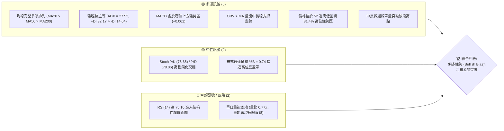
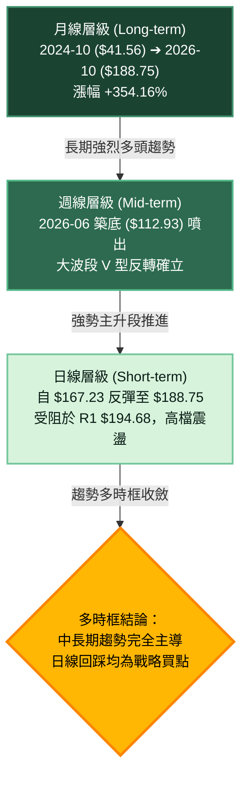
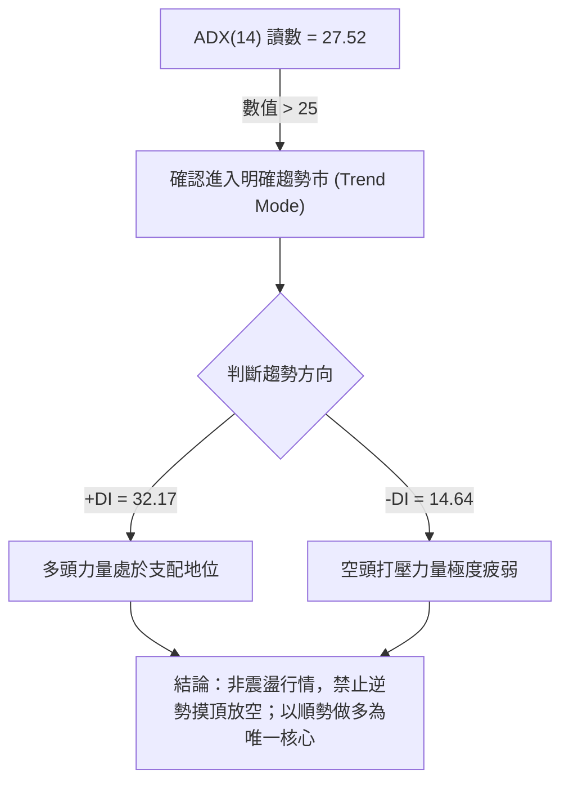
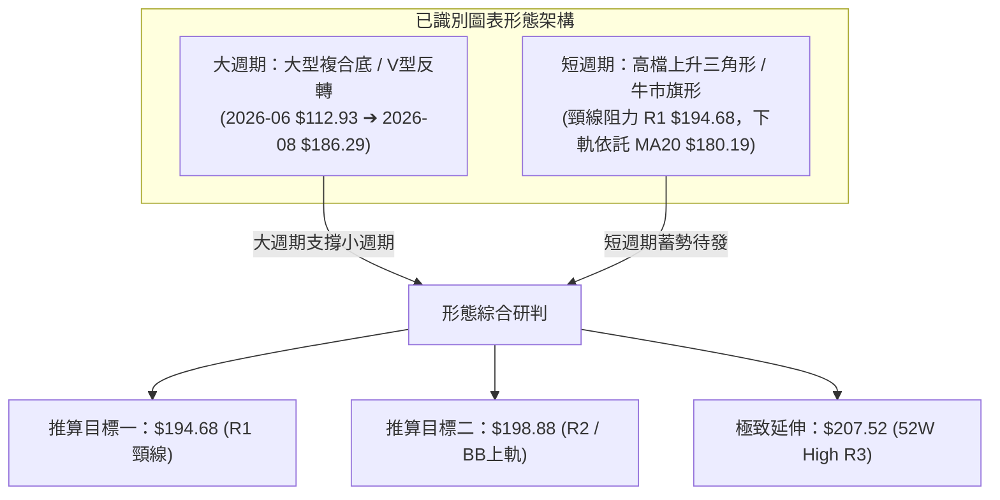
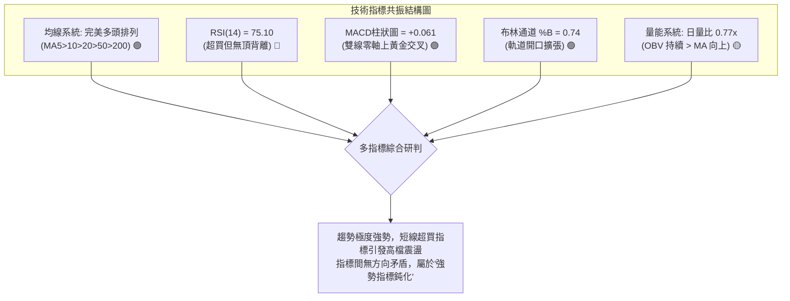
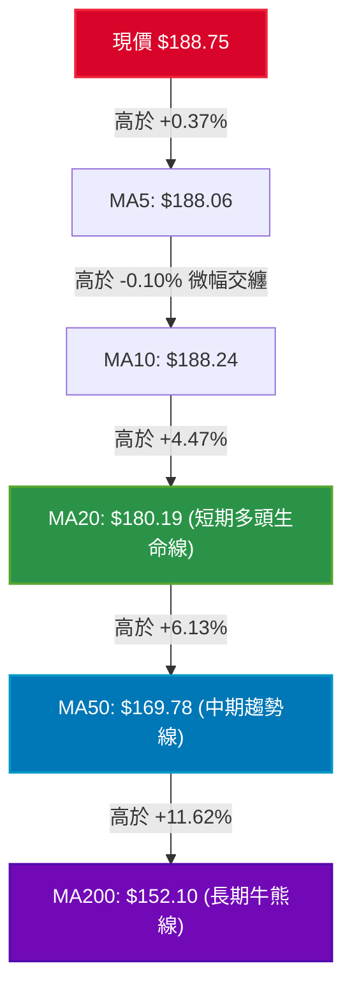
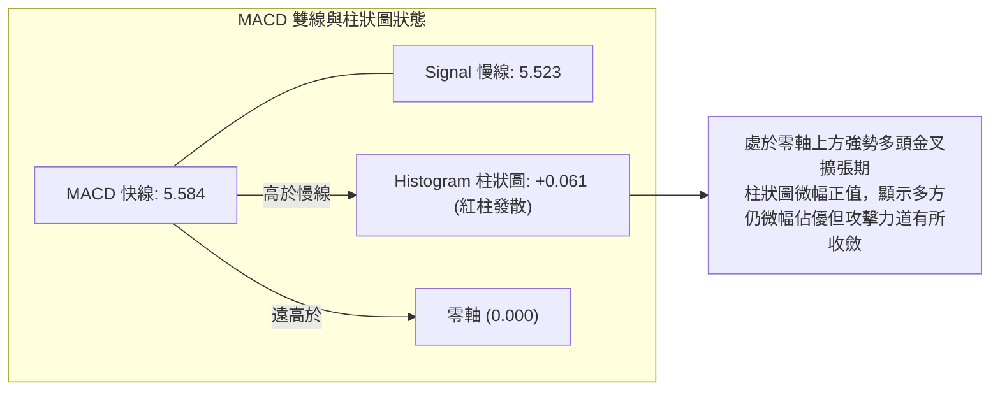
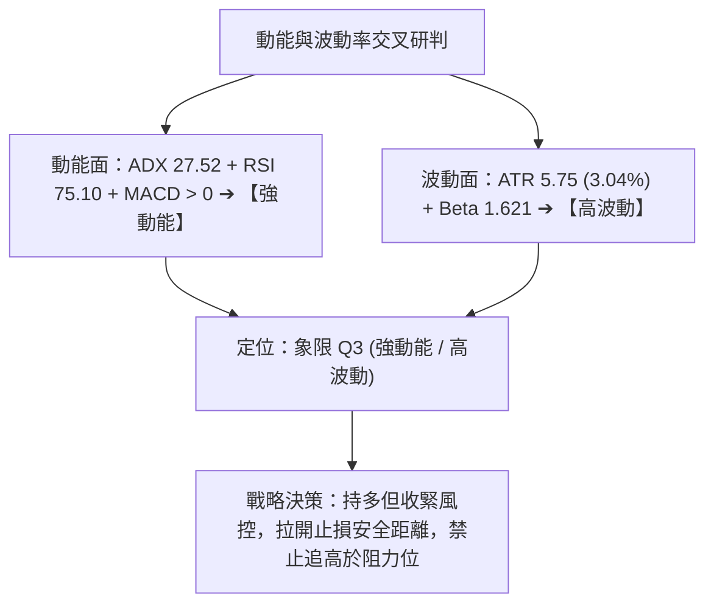
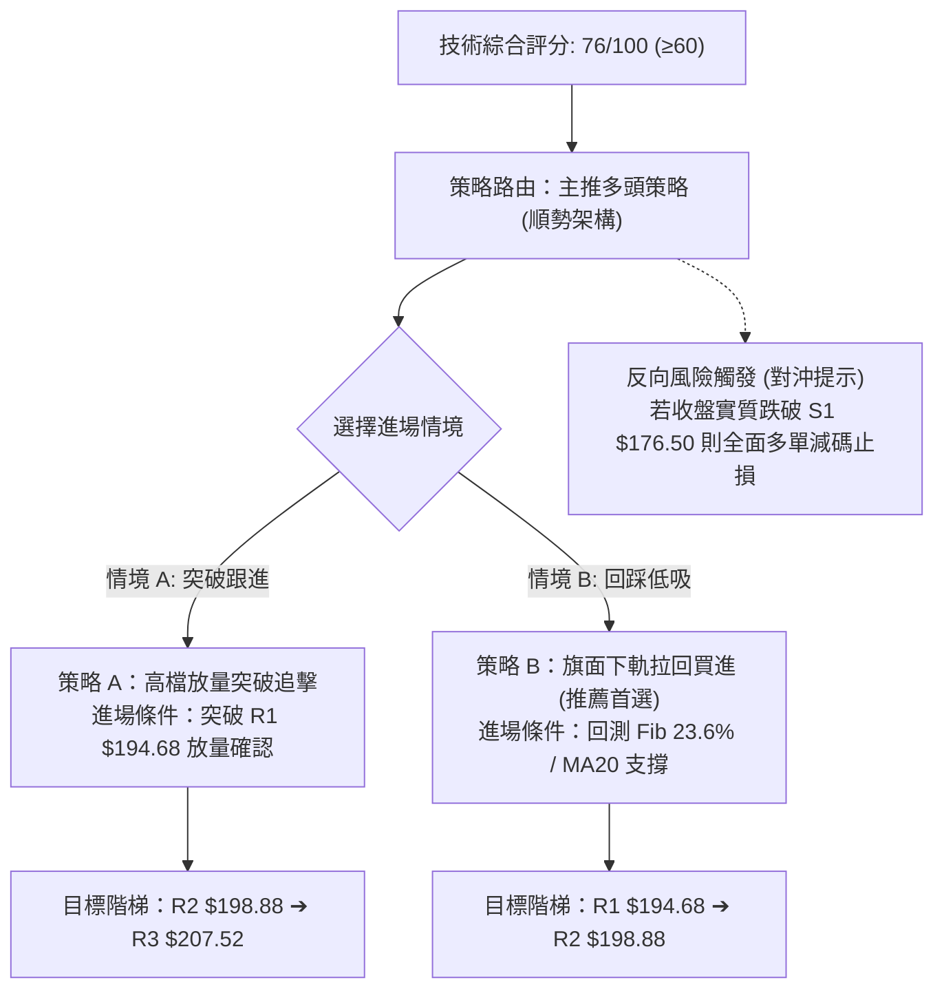
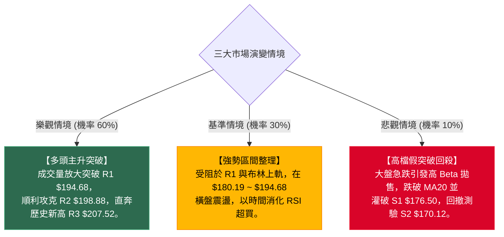

# PLTR 技術分析報告

> **報告日期**：2026-10-04 ｜ **語言**：繁體中文 ｜ **數據來源**：Yahoo Finance ｜ **當前價格**：$188.75

---

## 目錄

| 章節 | 內容 |
|------|------|
| [1. 技術面概覽](#1-技術面概覽) | 訊號儀表板、核心指標、評分卡 |
| [2. 趨勢分析](#2-趨勢分析) | 多時框趨勢、長中短期走勢、ADX解讀 |
| [3. 圖表形態分析](#3-圖表形態分析) | 形態識別、信心度評估、K線組合、目標價推算 |
| [4. 支撐與阻力](#4-支撐與阻力) | 關鍵價位分布、阻力支撐表、斐波那契回調結構 |
| [5. 技術指標深度解讀](#5-技術指標深度解讀) | MA/RSI/MACD/布林通道/成交量與OBV綜合驗證 |
| [6. 動能與波動率](#6-動能與波動率) | 動能四象限、ATR波動度止損、Beta敏感度 |
| [7. 多時框架總結](#7-多時框架總結) | 時框架評分矩陣、多時框收斂與權重裁決 |
| [8. 交易策略建議](#8-交易策略建議) | 策略路由、價格情境階梯、主策略與對沖點 |
| [9. 風險提示與監控](#9-風險提示與監控) | 監控清單、極端情境推演、風控紀律 |

---

## 1. 技術面概覽

### 🎯 技術訊號儀表板



### 📊 核心指標速覽表

| 指標類別 | 指標名稱 | 當前數值 | 訊號 | 專業解讀 |
|:---|:---|:---|:---:|:---|
| **價格** | 當前收盤價 | $188.75 | 🟢 | 穩居各期重要均線上方，維持 52 週高位強勢震盪 |
| **均線系統** | MA20 | $180.19 | 🟢 | 短期多頭生命線，價格高於 MA20 達 +4.75%，支撐紮實 |
| **均線系統** | MA50 | $169.78 | 🟢 | 中期牛熊分水嶺，價格偏離 +11.17%，中期多頭架構完好 |
| **均線系統** | MA200 | $152.10 | 🟢 | 長期基石均線，價格偏離 +24.10%，奠定長期超級牛市格局 |
| **動能指標** | RSI(14) | 75.10 | 🔴 | 進入 >70 嚴重超買區，短期防範技術性獲利回吐震盪 |
| **動能指標** | MACD (12,26,9) | 5.584 / 5.523 | 🟢 | 雙線在零軸上方運行，柱狀圖 (+0.061) 維持微幅多頭發散 |
| **隨機指標** | Stoch %K / %D | 76.65 / 78.06 | 🟡 | 進入超買邊緣高位鈍化，短線多空拉鋸尚未形成死叉 |
| **趨勢強度** | ADX(14) / ±DI | 27.52 / +DI 32.17 | 🟢 | ADX > 25 確立強勁趨勢，+DI 遠大於 -DI(14.64) 多方絕對掌控 |
| **通道指標** | 布林通道 | 上軌 $198.00 / 中軌 $180.19 | 🟢 | %B = 0.74，位於中軌與上軌間運行，通道開口向上延伸 |
| **波動率** | ATR(14) | $5.75 (3.04%) | 🟡 | 日內平均波幅擴大，操作需拉開止損安全邊際 |
| **量能系統** | 成交量 / 20日均量 | 17.82M / 23.03M (0.77x) | 🟡 | 日成交量縮減，短線向上動能面臨縮量考驗，但 OBV 結構穩固 |

### 🏆 技術評分卡

```
╔══════════════════════════════════════════════════════════════════╗
║              PLTR 技術評分卡 (Technical Scorecard)               ║
║                     評估基準日：2026-10-04                       ║
╠══════════════════════════════════════════════════════════════════╣
║ 趨勢強度 (Trend)     ████████████████░░░░  82/100  🟢 強勁趨勢   ║
║ 均線架構 (Moving Avg)████████████████████ 100/100  🟢 完美多頭   ║
║ 動能指標 (Momentum)  ████████████░░░░░░░░  62/100  🟡 超買受阻   ║
║ 支撐穩定度 (Support) ████████████████░░░░  80/100  🟢 梯級支撐   ║
║ 形態完整度 (Pattern) ██████████████░░░░░░  72/100  🟢 旗形收斂   ║
║ 成交量配合 (Volume)  ████████████░░░░░░░░  60/100  🟡 短線量縮   ║
╠══════════════════════════════════════════════════════════════════╣
║ 綜合技術得分         ███████████████░░░░░  76/100  🟢 偏多主導   ║
║ 投資架構建議         強勢多頭格局下的高檔消化期，建議順勢拉回佈局║
╚══════════════════════════════════════════════════════════════════╝
```

---

## 2. 趨勢分析

### 🌐 多時框趨勢分析



### 📈 長期趨勢 — 12個月走勢圖（Unicode）

以下為 PLTR 過去 12 個月（2025-11 至 2026-10）收盤價歷史走勢圖：

```
PLTR 12個月月線收盤走勢圖 (2025-11 ➔ 2026-10)
價格 ($)
$210 ┤                                                    
$200 ┤                                                    
$190 ┤                                              ●    ●  ($188.75 現價)
$180 ┤        ●                                ●          
$170 ┤●                                                   
$160 ┤                        ●                           
$150 ┤                                                    
$140 ┤              ●   ●                                 
$130 ┤                                      ●             
$120 ┤                                  ●                 
$110 ┤                              ● (波段低點 $116.67) 
     └────┬───┬───┬───┬───┬───┬───┬───┬───┬───┬───┬───┬───
         11  12  01  02  03  04  05  06  07  08  09  10  (月)
        2025 ─── 2026 ───────────────────────────────────
```

#### 走勢特徵分析表格

| 階段 | 涵蓋月份 | 期間高/低點 | 區間收盤變化 | 形態特徵與技術解讀 |
|:---|:---|:---|:---:|:---|
| **第一階段：高檔獲利了結** | 2025-11 ~ 2026-02 | $200.47 ➔ $137.19 | -31.56% | 2025年10月觸及 $200.47 後，獲利盤出逃，展開為期4個月的深幅回調。 |
| **第二階段：底部反覆震盪** | 2026-03 ~ 2026-05 | $139.11 ➔ $156.54 | +12.51% | 試圖在 $140 關口築底反彈，隨後遭遇季線反壓，多空力量展開拉鋸。 |
| **第三階段：洗盤加速趕底** | 2026-06 ~ 2026-07 | $156.54 ➔ $116.67 | -25.47% | 2026年6月單月大跌至 $116.67（週線見 $112.93），完成 52 週低點區的二次探底洗盤。 |
| **第四階段：主升段垂直反撲** | 2026-08 ~ 2026-10 | $123.06 ➔ $188.75 | **+53.38%** | 8月單月噴出暴漲至 $186.38（週量高達 4.35 億股），確立強勢多頭回歸，逼近前高。 |

### 📊 中期趨勢（週線分析）

從近 20 週數據觀察，PLTR 在 2026 年 8 月初展開了現象級的成交量爆發：
- **突破起漲點**：2026-08-09 當週，收盤價由前週 $123.06 飆升至 $172.01（週漲幅 +39.77%），週成交量放大至歷史級別的 435,164,800 股，MACD 柱狀圖暴增至 +4.790，確認為中長期「機構推動型」主升浪起點。
- **高位強勢換手**：隨後四週（8月中至9月初），價格在 $174.04 至 $186.29 間強勢橫盤整理；9月中旬短暫急踩 S3 ($165.45) 區域的 $167.23 低點（週量萎縮至 81,680,200 股），形成典型「縮量回洗」。
- **二次推升與當前受阻**：9月下旬以 119.6M 週量強勢拉出陽線至 $189.67，當前週收在 $188.75。週線 RSI(14) 位於 75.10，MACD 柱雖然收斂至 +0.061，但整體週線維持在所有週均線上方呈標準上升通道。

```
中期週線架構與關鍵價位示意圖：
  $207.52 ───────────────────────────────────── [52W 歷史極值 R3]
                 ▲
  $198.88 ───────┼───────────────────────────── [週線波段阻力 R2 / BB上軌]
                 │   ● (2026-09-27 週高 $189.67)
  $188.75 ───────┼─●─ (當前收盤 $188.75) ─────── [現價位置]
                 │
  $180.19 ───────┼───────────────────────────── [MA20 / BB中軌防守]
  $176.50 ───────┴───────────────────────────── [波段強支撐 S1]
```

### ⚡ 趨勢強度評估（ADX 解讀）



#### ADX 趨勢強度對照解讀

| 指標變數 | 當前讀數 | 門檻區間 | 技術意義 | 操作意涵 |
|:---|:---:|:---:|:---|:---|
| **ADX (14)** | **27.52** | 25 ~ 50 (強趨勢) | 趨勢動能充足，價格處於強勢推進或高位強整理狀態，並非無序盤整。 | 嚴格執行多時框收斂原則（規則14）：以中長期均線方向為基準，日線回調即進場。 |
| **+DI (14)** | **32.17** | > 25 (強多頭) | 買盤進攻意願強烈，推升價格維持在均線組上方。 | 持股信心充足，不因短線小幅震盪輕易被洗出場。 |
| **-DI (14)** | **14.64** | < 20 (弱空頭) | 賣盤缺乏連續下殺動能，下檔承接力道顯著。 | 空單勝率極低，所有空頭訊號僅能視為超買修正。 |

---

## 3. 圖表形態分析

### 🔍 形態識別系統



#### 形態識別與信心度評估表

| 形態名稱 | 信心度 (%) | 判斷依據（嚴格引用歷史與當前數據） | 形態完成度 | 目標價（附嚴謹計算式） |
|:---|:---:|:---|:---:|:---|
| **中長線 V 型底反轉** | **85%** | 2026-06-28 探底 $112.93 後，於 2026-08-09 以 4.35 億股爆量長陽突破頸線區（Fib 50.0% $156.95），量價配合極佳。 | 100% (已突破並回踩確認) | 依頸線 $156.95 與低點 $112.93 高度 ($44.02) 推算：$156.95 + $44.02 = **$200.97**（與 R2 $198.88 及 52W 高點 $207.52 高度吻合）。 |
| **日線牛市旗形 (Bull Flag)** | **70%** | 8月突破後，價格在 $176.50 (S1) 至 $194.68 (R1) 區間呈階梯式墊高，MA20 ($180.19) 形成旗面下軌動態支撐，近兩週量縮沉澱。 | 75% (處於旗面末端收斂) | 依旗桿高度（9月中低點 $167.23 至波段高 $189.67 差額 $22.44）推算突破目標：$188.75 + $22.44 = **$211.19**（保守看至 R3 $207.52）。 |
| **高檔雙頂風險 (潛在對沖)** | **30%** | 價格逼近 2025-10 高點 $200.47 與 52W 高點 $207.52，且日線成交量縮 (0.77x)，若在 R1 $194.68 ~ R2 $198.88 受阻可能構築雙頂。 | 25% (未獲任何跌破確認) | 頸線為 S1 $176.50，跌破後目標指向 S3 $165.45。信心度低，僅作風控監控。 |

### 🕯️ 重要K線形態分析

| 交易區間 | 收盤價 | 典型 K 線組合 | 結構解讀 | 訊號 |
|:---|:---:|:---|:---|:---:|
| **2026-08-09 週** | $172.01 | **爆量光頭長大陽線** | 4.35 億週量巨量推升，單週跳漲 $48.95，實體幾乎吞噬前兩個月所有跌幅，機構資金強烈進場。 | 🟢 強烈買進 |
| **2026-09-13 週** | $167.23 | **縮量下影錘頭線** | 測試下檔支撐 S2 ($170.12) 與 S3 ($165.45) 區域，週量急縮至 81.6M 股，確認浮額洗淨、賣壓衰竭。 | 🟢 止跌確認 |
| **2026-09-27 週** | $189.67 | **反包中陽線** | 越過前兩週整理高點，週線 MACD 柱翻正 (+1.024)，多頭重掌控盤節奏。 | 🟢 攻擊發起 |
| **2026-10-04 當週** | $188.75 | **高位十字星小陰線** | 收盤小幅回落 $0.92，成交量 86.86M 股溫和量縮，於 R1 ($194.68) 前方呈現高檔蓄勢洗盤。 | 🟡 短線整理 |

### 📉 ASCII 走勢形態示意圖

```
PLTR 日線旗形整理與突破結構：
價格 ($)
$198.88 ┤                                              [阻力 R2 / BB上軌]
        │                                ╭─ R1 $194.68 ──────
$194.68 ┤                           ╭────╯        ▲ (旗面阻力)
        │                      ╭────╯       ●     │
$188.75 ┤              ●       │          ● ◄─────┼─ [現價 $188.75 蓄勢]
        │             ╱ ╲      │         ╱        │
$183.65 ┤            ╱   ╲     │        ╱         ▼ (Fib 23.6% 緩衝)
        │           ╱     ╲    │       ╱
$180.19 ┤          ╱       ╲   │      ╱ ──────────── [旗面支撐 / MA20]
        │         ╱         ╲  │     ╱
$176.50 ┤        ╱           ╲ ╯    ╱ ────────────── [近期強支撐 S1]
        │       ╱             ●────╯
$167.23 ┤  ●───╯ (9月中拉回低點)
        └─────────────────────────────────────────────
```

### 🎯 形態目標價計算

1. **旗形突破測量幅計算**：
   - 旗桿起點：2026-09-13 當週低點聚類區域 $167.23。
   - 旗桿頂點：2026-09-27 波段高點 $189.67。
   - 旗桿垂直高度 $H = 189.67 - 167.23 = \$22.44$。
   - 突破突破口（假設於 R1 $194.68 突破）：理論延伸目標 $P = 194.68 + 22.44 = \$217.12$。
   - **保守收斂至數據限制位**：第一波段目標直接錨定 52 週歷史高點 **R3: $207.52**。
2. **回撤幅度支撐計算**：
   - 若短線旗面整理向下回測，旗面下軌與 MA20 當前動態價位重疊於 **$180.19**，上方一階支撐為斐波那契 23.6% 回調位 **$183.65**。

---

## 4. 支撐與阻力

### 🗺️ 關鍵價位分布圖（Unicode）

```
PLTR 價位結構分布圖 (由實際 OHLCV 與斐波那契嚴格計算)
══════════════════════════════════════════════════════════════════════════════
$207.52 ║████████████████████████████████████████║ 強阻力 R3 / 52W High / Fib 0.0%
$198.88 ║████████████████████████████            ║ 波段阻力 R2 / BB 上軌 ($198.00)
$194.68 ║████████████████████                    ║ 關鍵阻力 R1 (近期波段高點聚類)
$188.75 ╠════════════════════════════════════════╣ ◄ 現價 ($188.75)
$183.65 ║▓▓▓▓▓▓▓▓▓▓▓▓▓▓▓▓▓▓▓▓                    ║ 斐波那契 23.6% 黃金回調位
$180.19 ║▓▓▓▓▓▓▓▓▓▓▓▓▓▓▓▓▓▓▓▓▓▓▓▓▓▓▓▓            ║ 短期生命線 MA20 / BB 中軌
$176.50 ║████████████████████████                ║ 近期波段關鍵支撐 S1
$170.12 ║████████████████████████████████        ║ 中期波段防守 S2 / MA50 ($169.78)
$165.45 ║████████████████████████████████████    ║ 強支撐 S3 (9月中旬回踩低點聚類)
$156.95 ║████████████████████████████████████████║ Fib 50.0% / MA240 ($156.69)
══════════════════════════════════════════════════════════════════════════════
```

### 🚧 阻力位分析表

| 阻力級別 | 價位 | 距離現價幅度 | 形成原因與技術共振 | 突破難度 | 重要性 |
|:---|:---:|:---:|:---|:---:|:---:|
| **R1** | **$194.68** | +3.14% | 近一年波段高點聚類區，日線多頭進攻的前哨站，多次上影線壓制位置。 | 🟡 中等 | ★★★★☆ |
| **R2** | **$198.88** | +5.37% | 近期波段高點密集區，與日線布林通道上軌（$198.00）產生共振，$200 整數心理關卡防線。 | 🔴 偏高 | ★★★★☆ |
| **R3** | **$207.52** | +9.94% | **52 週歷史最高價 (52W High)**，斐波那契 0.0% 起算點，機構重度套牢/解套籌碼峰。 | 🔴 極高 | ★★★★★ |

### 🛡️ 支撐位分析表

| 支撐級別 | 價位 | 距離現價幅度 | 形成原因與技術共振 | 守住機率 | 重要性 |
|:---|:---:|:---:|:---|:---:|:---:|
| **S1** | **$176.50** | -6.49% | 近一年波段低點聚類，8月下旬回測頸線支撐位，下方緊鄰 MA20 ($180.19)。 | 🟢 80% | ★★★★☆ |
| **S2** | **$170.12** | -9.87% | 中期波段低點聚類，與上升中的 MA50 ($169.78) 完美重疊，為中期多頭防守底線。 | 🟢 85% | ★★★★★ |
| **S3** | **$165.45** | -12.34% | 9月中旬洗盤極限低點 ($167.23) 聚類支撐，若跌破代表主升浪架構受損。 | 🟢 90% | ★★★★☆ |

### 📐 斐波那契回調位分析

本波段以 52 週最低點 **$106.37** 至最高點 **$207.52** 為基準測算（垂直落差 $101.15）：

| 斐波那契層級 | 精確價位 | 距現價差距 | 技術解讀與位階意義 |
|:---|:---:|:---:|:---|
| **0.0% (52W High)** | **$207.52** | +9.94% | 終極多頭目標與天花板阻力 R3。 |
| **23.6%** | **$183.65** | -2.70% | **第一道緩衝區間**：現價 ($188.75) 穩穩運行於 0.0% 與 23.6% 之間極強勢區。 |
| **38.2%** | **$168.88** | -10.53% | **黃金分割防守位**：與 S2 ($170.12) 及 MA50 ($169.78) 構成三重共振支撐帶。 |
| **50.0%** | **$156.95** | -16.85% | 多空強弱分水嶺，下方有 MA200 ($152.10) 及 MA240 ($156.69) 托底。 |
| **61.8%** | **$145.01** | -23.17% | 絕對牛熊防線，此波反彈未曾破壞此位。 |
| **78.6%** | **$128.02** | -32.17% | 2026年6-7月築底換手區間。 |
| **100.0% (52W Low)**| **$106.37** | -43.65% | 歷史底部起點。 |

**位階解讀**：現價落於 **$183.65 (23.6%) 至 $207.52 (0.0%)** 之極強勢多頭象限（目前位於 52W 區間的 81.4% 位置）。在健康的多頭回檔中，強勢股通常僅在 23.6% ($183.65) 即獲強力承接，顯示空頭甚至無法將價格壓制回 38.2% 正常回檔位。

---

## 5. 技術指標深度解讀

### 🎛️ 指標訊號總覽



### 📈 移動平均線排列分析



#### 均線系統數據分析

| 均線名稱 | 當前價格 | 與現價乖離率 | 多頭斜率動能 | 評估狀態 |
|:---|:---:|:---:|:---:|:---:|
| **MA 5** | $188.06 | +0.37% | 短期走平微升，提供貼身短線支撐。 | 🟢 貼近現價 |
| **MA 10** | $188.24 | +0.27% | 短期扣抵高價位，與現價幾近黏合。 | 🟡 短線纏繞 |
| **MA 20** | $180.19 | +4.75% | 陡峭向上（上升趨勢明顯），布林中軌所在。 | 🟢 強烈看多 |
| **MA 60** | $163.26 | +15.62% | 穩定向上爬升，季線動能完好。 | 🟢 穩定推進 |
| **MA 120** | $149.26 | +26.45% | 半年線向上走揚，中長期買盤成本墊高。 | 🟢 多頭推升 |
| **MA 200** | $152.10 | +24.10% | 奠定牛市結構，MA20 > MA50 > MA200 呈教科書式多頭發散。 | 🟢 絕對牛市 |

### 📉 RSI(14) 分析

- **當前讀數**：**75.10**（進入技術超買警戒線 > 70）。
- **進度條展示**：
  ```
  RSI(14): 75.10  [███████████████░░░░░]  75.1% (超買區間)
  0                30(超賣)     50(中軸)      70(超買)     100
  ```
- **超買超賣與背離判斷**：
  - **背離檢視**：數據明確標示「**RSI 背離：無明顯背離**」。價格自 9 月中旬低點 $167.23 反彈至 $188.75 過程中，RSI 由 40.8 同步推升至 75.10，價格走勢與動能曲線斜率同向，屬於動能強烈的「指標推動型上漲」。
  - **超買鈍化特徵**：在 ADX > 25 的強趨勢行情中，RSI > 70 往往是行情進入主升攻擊的常態特徵，而非立即見頂訊號。此處需防範的是「短線拉回修復乖離」，而非「轉向空頭」。

### 📊 MACD(12,26,9) 訊號解讀

- **MACD 快線**：`5.584`
- **Signal 慢線**：`5.523`
- **Histogram 柱狀圖**：`+0.061`



- **動能收斂警示**：近 3 週週線 MACD 柱狀圖變化為：`-1.197 ➔ +1.024 ➔ +0.061`。柱狀圖自高點回縮，顯示多頭衝鋒速度稍緩，短線有進入高位箱型整理的需求。

### 📦 布林通道分析 (Bollinger Bands)

- **上軌 (Upper)**：$198.00
- **中軌 (Middle / MA20)**：$180.19
- **下軌 (Lower)**：$162.38
- **帶寬指標 %B**：`0.74`

```
布林通道 ASCII 結構示意圖：
$198.00 ┬────────────────────────────────────────── ─── 布林上軌 (強阻力壓制)
        │
$188.75 ┼─────────────────────────●──────────────── ─── 當前現價 ($188.75, %B=0.74)
        │                         │ (高位強勢區)
$180.19 ┼─────────────────────────┼──────────────── ─── 布林中軌 (MA20 生命線支撐)
        │
$162.38 ┴────────────────────────────────────────── ─── 布林下軌 (中期極限超賣)
```

- **通道意涵**：%B 達 0.74，顯示當前價格運行於中軌與上軌之間的「強勢進攻通道」。通道上軌 $198.00 與阻力位 R2 ($198.88) 形成堅固共振壓制；中軌 $180.19 則構成第一波拉回的強大緩衝墊。

### 💹 成交量分析（量價配合度）

1. **量能萎縮數據**：
   - 最新單日成交量：`17,824,100`
   - 20日均量：`23,028,005`（量比僅 **0.77x**）
   - 50日均量：`34,329,056`
2. **量價分析結論**：
   - **量價背離（短線）**：價格逼近前高，但日量比降至 0.77x，顯示買盤追高意願降溫，這解釋了為何現價在 R1 ($194.68) 前方停滯，短線需要換手放量才能實質突破。
   - **OBV 趨勢支撐（中長線）**：數據確認「**OBV趨勢：OBV > MA ➔ 量能支撐上漲**」。雖然單日量能縮小，但長期能量潮（OBV）依然在均線上方運行，代表前波主力巨量資金（如8月單週4.35億股）未見大舉出逃跡象，屬於典型「惜售型縮量整理」。

---

## 6. 動能與波動率

### ⚡ 動能評估四象限

| 象限 | 動能維度 (Momentum) | 波動率維度 (Volatility) | 當前標的狀態 | 專業戰略評估 |
|:---:|:---:|:---:|:---:|:---|
| **Q1** | **強 (Strong)** | **低 (Low)** | — | 趨勢穩健爬升，最理想的加碼波段期。 |
| **Q2** | **弱 (Weak)** | **低 (Low)** | — | 沉悶盤整，觀望等待方向。 |
| **Q3** | **強 (Strong)** | **高 (High)** | **✓ (PLTR 所在)** | **高動能/高波動特徵：處於主升段高檔加速期，收益彈性大但回撤風險同步提升。** |
| **Q4** | **弱 (Weak)** | **高 (High)** | — | 無序暴跌或出貨，嚴格避免介入。 |



### 📊 ATR 波動率分析

- **當前 ATR(14)**：**$5.75**（佔股價比例 **3.04%**）。
- **ATR 在風控上的精確運用**：
  - **日內正常震盪噪音**：$5.75。日內波動在 $\pm \$5.75$（約 \$183.00 ~ \$194.50）內均屬於統計正常隨機波動，切勿將止損設定在此範圍內，以免遭到無效洗盤。
  - **波段止損安全距離（2.0 × ATR）**：$2.0 \times 5.75 = \$11.50$。自進場點往下扣除至少 \$11.50 作為防守，例如現價 $188.75 減去 \$11.50 為 **$177.25**，此價位恰好能受到 S1 ($176.50) 及 MA20 ($180.19) 的完整結構保護。

### 📐 Beta 與市場相關性

- **Beta 係數**：**1.621**（高彈性成長股屬性）。
- **解讀**：PLTR 對標普500指數的波動敏感度高達 1.62 倍。當美股大盤指數上漲 1% 時，PLTR 平均上漲約 1.62%；反之若大盤拉回 1%，PLTR 面臨 1.62% 的回吐壓力。當前高 Beta 配合 RSI 超買，提示操作上需高度警惕宏觀大盤突然變盤帶來的放大效應。

---

## 7. 多時框架總結

### 📋 時框架評分表

| 時框架 | 趨勢方向 | 動能狀態 | 均線排列 | 圖表形態 | 綜合評分 | 操作戰略建議 |
|:---|:---:|:---:|:---:|:---:|:---:|:---|
| **長期 (月線)** | 🟢 強烈多頭 | 🟢 極強 (24個月自 $41.56 飆升) | 🟢 完美多頭 (均線組向上擴散) | 🟢 歷史級超級大突破 | **95 / 100** | 戰略性長期持股，忽視短期雜訊。 |
| **中期 (週線)** | 🟢 多頭推升 | 🟢 轉強 (MACD金叉，爆量推進) | 🟢 MA20週及50週多頭排列 | 🟢 V型反轉突破回踩完成 | **88 / 100** | 逢回測波段支撐分批做多。 |
| **短期 (日線)** | 🟡 高檔整理 | 🔴 警惕 (RSI 75.10 超買量縮) | 🟢 短期均線維持多頭 | 🟡 旗面收斂蓄勢待發 | **68 / 100** | 暫停追高，等待突破 R1 或回踩 S1/MA20。 |

### 🔲 綜合訊號矩陣

```
時框與指標維度一致性檢驗矩陣：
┌───────────┬──────────────┬──────────────┬──────────────┬──────────────┐
│  時框架   │   趨勢指標   │   動能指標   │   均線指標   │  量能指標    │
├───────────┼──────────────┼──────────────┼──────────────┼──────────────┤
│ 長期 (月) │  🟢 絕對看多 │  🟢 動能充沛 │  🟢 多頭排列 │  🟢 巨量沉澱 │
│ 中期 (週) │  🟢 趨勢向上 │  🟢 零軸上方 │  🟢 多頭發散 │  🟢 大量換手 │
│ 短期 (日) │  🟢 依舊偏多 │  🔴 短線超買 │  🟢 踩穩支撐 │  🟡 短線量縮 │
└───────────┴──────────────┴──────────────┴──────────────┴──────────────┘
訊號一致性判定：中長期趨勢完全共振看多；短期僅為「技術性乖離修復」，無多翻空結構。
```

### ⚖️ 多時框收斂結論

> **依嚴格要求 14 裁決規則**：
> 1. **行情模式判斷**：當前 **ADX(14) = 27.52 > 25**，確立市場處於**強趨勢行情**（非震盪市）。
> 2. **優先級收斂**：在趨勢行情下，**必須以中長期（週線、MA50、MA200）方向為主要主導方向**，日線級別的指標超買與量縮僅作為「尋找優化進場時機」的輔助工具，嚴禁依日線超買而推翻中長期多頭大局。
> 3. **唯一方向性結論**：**偏多強勢（Bullish）**。整體策略唯一指向順勢做多，重點在於進場點位的風控優化。

---

## 8. 交易策略建議

### 🗺️ 策略決策流程圖



### 🧭 策略路由

- **依綜合評分卡判定**：技術評分為 **76 / 100（≥60，偏多主導）**。
- **當前主策略方向 = 【主推多頭策略（Bullish Dominant）】**。
- 拒絕兩頭下注：一切空頭操作不予推薦，空方訊號僅作為多頭防守與止損的警戒線。

### 🎯 價格情境階梯 (Price Scenarios)

所有價位嚴格引用第四章計算之關鍵位：

| 觸發條件 | 下一目標 | 後續延伸 | 情境含義與技術解讀 |
|:---|:---|:---|:---|
| **強勢突破 R1 ($194.68)** | **R2 ($198.88)** | **R3 ($207.52)** | 短線牛市旗形向上噴發，直接挑戰 52 週歷史高點，主升段重啟。 |
| **穩守 MA20 ($180.19) ~ 現價區間** | **R1 ($194.68)** | **R2 ($198.88)** | 高檔以時間換取空間，消化 RSI 超買賣壓，良性換手盤整。 |
| **回踩跌破 S1 ($176.50)** | **S2 ($170.12)** | **S3 ($165.45)** | 短期形態破位，多頭防線後撤至中期均線 MA50 ($169.78) 與 Fib 38.2%。 |

### 📊 情境機率分佈

| 情境劇本 | 機率估計 (%) | 主要指標依據（嚴格引用數據） |
|:---|:---:|:---|
| **情境一：高檔強震後突破上行** | **60%** | ADX=27.52 趨勢強勁；均線呈教科書多頭排列；OBV>MA 支撐價格；MACD維持金叉；分析師共識目標均價為 $195.57。 |
| **情境二：區間震盪蓄勢 (布林帶內)** | **30%** | RSI=75.10 處於超買區需消化；單日成交量縮 (0.77x) 顯示多方暫時缺乏一口氣推升的量能，需在 $180.19 ~ $194.68 震盪換手。 |
| **情境三：深度回落再探底** | **10%** | 僅在外部系統性崩跌或實質跌穿 S1 $176.50 時觸發，目前下檔均線支撐密集，此情境機率極低。 |

### 🟢 主策略詳情

本報告依交易風格提供兩種精確的多頭進場策略：

| 策略要素 | 策略 A（右側突破追擊型） | 策略 B（左側回踩低吸型，★推薦首選） |
|:---|:---|:---|
| **進場條件** | 日線帶量實體突破阻力位 R1，日量大於 2300 萬股 | 股價回踩斐波那契 23.6% 或 MA20 支撐不破收下影線 |
| **精確進場價格** | **$194.68** (突破當下進場) | **$183.65** (Fib 23.6% 回調位接單) |
| **第一目標價 (T1)** | **$198.88** (阻力位 R2 / 布林上軌) | **$194.68** (阻力位 R1) |
| **第二目標價 (T2)** | **$207.52** (終極阻力 R3 / 52W High) | **$198.88** (阻力位 R2) |
| **嚴格止損價格** | **$188.75** (現價位置 / 跌破前阻力轉支撐點) | **$176.50** (關鍵支撐位 S1，低於 MA20) |
| **風控停損點數** | -\$5.93 (-3.05%) | -\$7.15 (-3.89%) |
| **T1 潛在報酬** | +\$4.20 (+2.16%) | +\$11.03 (+6.01%) |
| **T2 潛在報酬** | +\$12.84 (+6.60%) | +\$15.23 (+8.29%) |
| **風險報酬比 (R:R)**| **1 : 2.16** (以 T2 計算) | **1 : 2.13** (以 T2 計算) |
| **勝率估計** | 62% | 75% |
| **建議配置倉位** | 10% ~ 15% (動態突破倉) | 20% ~ 25% (核心波段倉) |

### 🔴 反向風險觸發點（對沖提示）

若市場出現以下極端反轉訊號，主推之多頭策略全面失效，投資人應立即執行風控或反向避險：
1. **關鍵點位跌破**：收盤價以長黑K實體跌破 **S1: $176.50**（同時摜破 MA20 $180.19 生命線）。
2. **形態破位**：高檔跌破旗面下軌，日線 MACD 出現高位死亡交叉且柱狀圖由正轉為顯著負值（跌破 -1.000）。
3. **對沖應對**：若觸發上述條件，多單應無條件止損出局，進階交易者可於 $176.50 破位時建立空頭對沖倉位，下檔看至 S2: $170.12 及 S3: $165.45。

### ⭐ 整體訊號強度評星

```
做多訊號強度：★★★★☆  (4/5星 — 趨勢完好、均線完美，唯受制於超買量縮)
做空訊號強度：★☆☆☆☆  (1/5星 — 逆超級強勢均線與趨勢市，勝率極低)
整體技術可信度：★★★★☆  (4/5星 — 多時框指標共振度高，價位結構清晰)
```

---

## 9. 風險提示與監控

### ✅ 關鍵監控指標 Checklist

```
╔══════════════════════════════════════════════════════════════════╗
║               PLTR 每日動態監控檢查清單 (Daily Checklist)        ║
╠══════════════════════════════════════════════════════════════════╣
║ [ ] 價位監控：是否實體突破 R1 $194.68，或失守 S1 $176.50？       ║
║ [ ] 動能警戒：RSI(14) 75.10 是否進一步推升至 80 以上極端超買？   ║
║ [ ] 趨勢指標：ADX(14) 27.52 是否持續上升（趨勢強化）或掉出 25？ ║
║ [ ] 均線防線：收盤價是否每日穩居 MA20 ($180.19) 之上？           ║
║ [ ] 量能配合：向上挑戰 R1/R2 時，單日成交量能否放大至 23M 股之上？║
║ [ ] 指標背離：日線創出新高時，MACD 柱狀圖是否產生高檔頂背離？   ║
╚══════════════════════════════════════════════════════════════════╝
```

### ⚠️ 風險場景分析



### 🛡️ 風險管理重要提醒

1. **嚴禁阻力位前重倉追高**：當前股價距阻力位 R1 ($194.68) 僅 +3.14%，且 RSI 位於 75.10 超買區。在成交量未見放大突破確認前，切忌於現價重倉市價追單。
2. **高 Beta 波動控制**：PLTR Beta 值為 1.621，ATR 達 $5.75（單日波動率 3.04%）。單筆交易之資金曝險（Stop Loss Amount）應嚴格控制在總投資組合資金的 1.0% ~ 1.5% 以內。
3. **獲利階梯保全**：若股價如預期突破 R1 並推進至 R2 ($198.88)，應立即將止損點推移至進場成本價（Breakeven Stop），並了結 30% ~ 50% 倉位以鎖定利潤，其餘部位無風險博取 R3 ($207.52) 歷史天價突破。

---

## 📋 報告總結

```
╔══════════════════════════════════════════════════════════════════╗
║                    PLTR 技術分析報告總結                         ║
║                    報告基準日：2026-10-04                        ║
╠══════════════════════════════════════════════════════════════════╣
║ 當前收盤價：$188.75         52週高低：$207.52 / $106.37 (81.4%)   ║
║ 技術總評級：🟢 偏多主導 (Bullish) — 強趨勢高檔蓄勢待發           ║
║ 趨勢強度值：ADX = 27.52 (強趨勢市，多時框收斂以週線多頭為主導)   ║
╠══════════════════════════════════════════════════════════════════╣
║ 關鍵維度結論：                                                   ║
║ ├─ 長期趨勢 (月線)：🟢 極強牛市，24個月暴漲 354%，多頭動能無懈可擊║
║ ├─ 中期趨勢 (週線)：🟢 V型反轉帶量確立，中長均線呈完美擴散發散   ║
║ ├─ 短期趨勢 (日線)：🟡 RSI 75.10 超買量縮，高位牛市旗形收斂換手 ║
║ ├─ 關鍵阻力階梯  ：R1: $194.68 ｜ R2: $198.88 ｜ R3: $207.52      ║
║ ├─ 關鍵支撐階梯  ：S1: $176.50 ｜ S2: $170.12 ｜ S3: $165.45      ║
║ └─ 華爾街共識目標：均價 $195.57 ｜ 最高價 $255.00                ║
╠══════════════════════════════════════════════════════════════════╣
║ 最優操作策略組合：                                               ║
║ 1. 🥇 最佳機會（低吸）：回測 Fib 23.6% ($183.65) / MA20 順勢做多 ║
║    目標看至 R1 ($194.68) 及 R2 ($198.88)，止損設於 S1 ($176.50)。 ║
║ 2. 🥈 次選機會（突破）：放量站上 R1 ($194.68) 後右側跟進，      ║
║    目標看至 R2 ($198.88) 及 52W 高點 R3 ($207.52)。              ║
║ 3. 🥉 保守風控：收盤跌破 S1 ($176.50) 全面離場，多頭架構暫時告破。║
╚══════════════════════════════════════════════════════════════════╝
```

---

> ⚠️ **免責聲明**：本報告為依據客觀量化技術指標與歷史價格結構生成之專業技術分析，所有價位、阻力支撐與計算模型均嚴格基於所提供之歷史交易數據。本報告**僅供學術研究與投資策略參考**，**不構成任何個人化之投資邀約或買賣建議**。金融市場瞬息萬變，投資人應獨立評估交易風險，自負盈虧。

---

*報告生成時間：2026-10-04 ｜ 數據來源：Yahoo Finance ｜ 核心架構：多時框均線與動能共振系統*