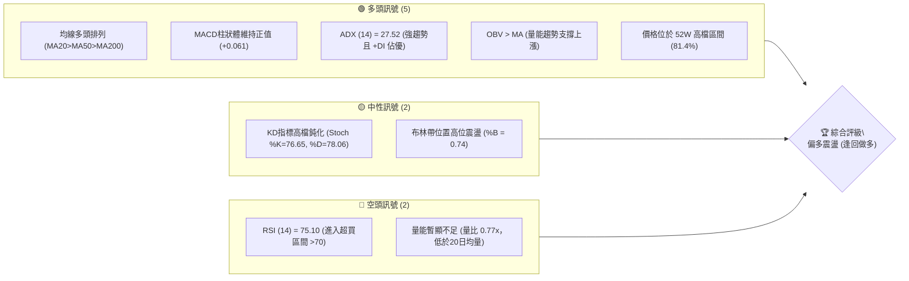
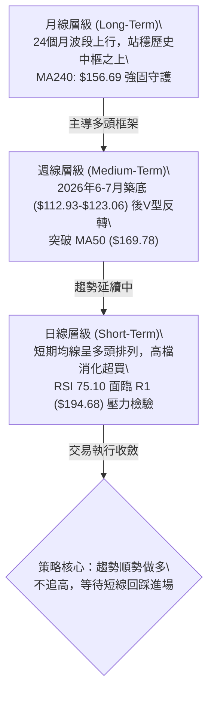
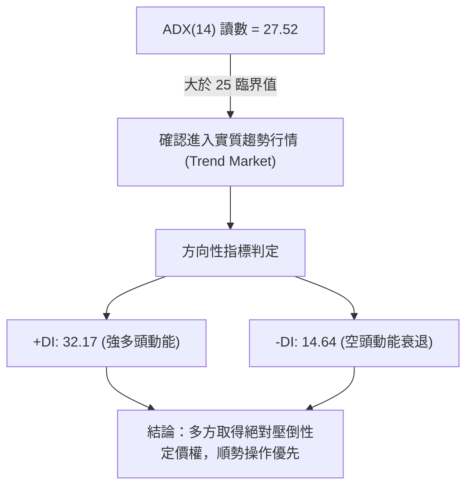
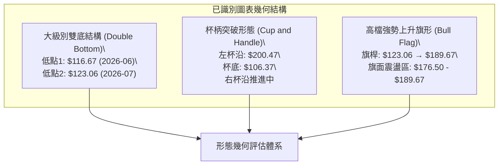
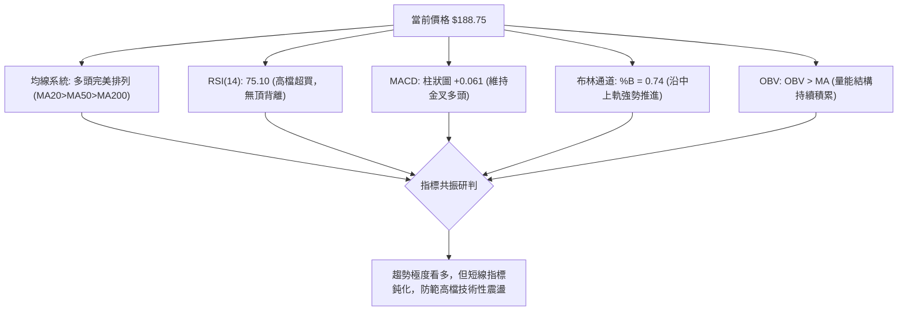
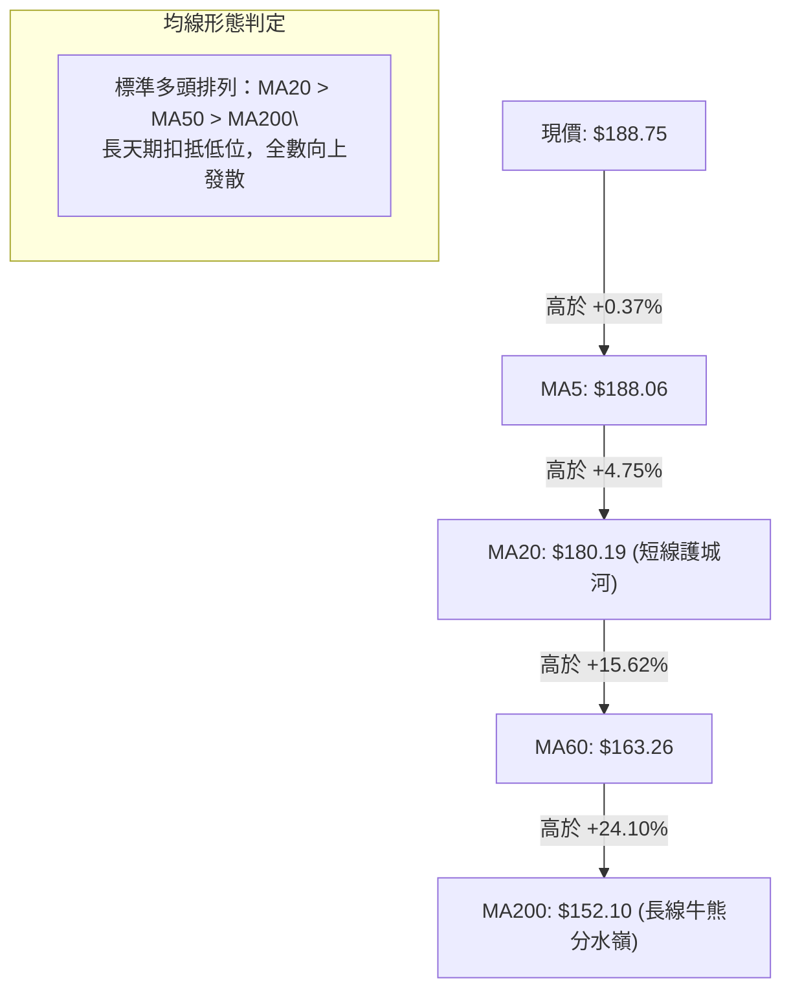
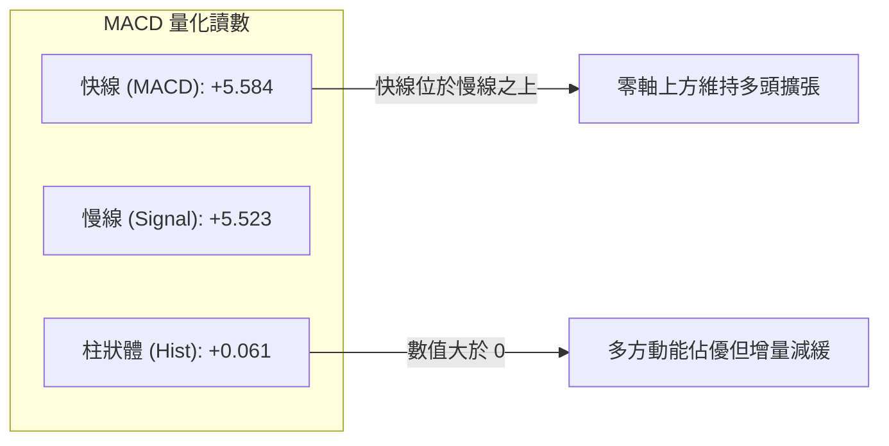
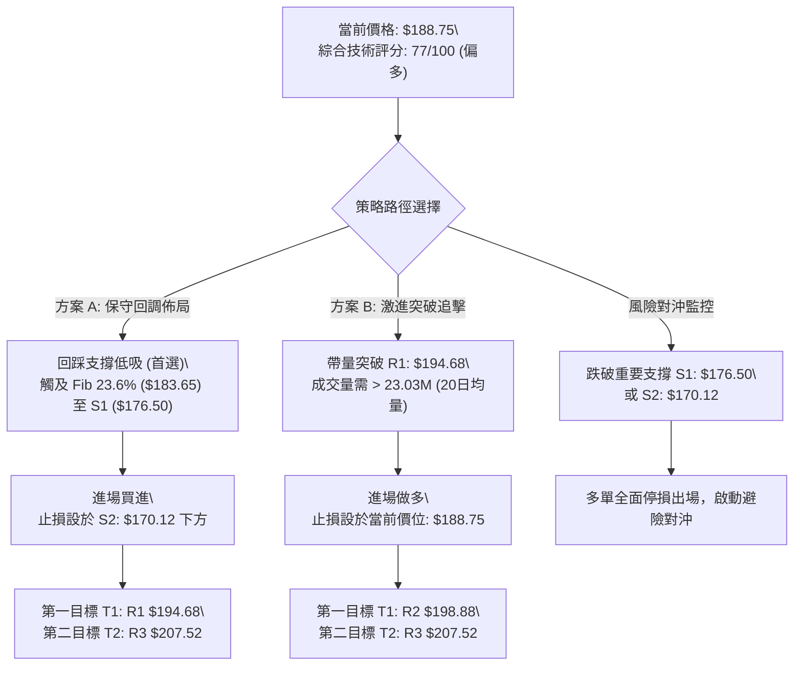
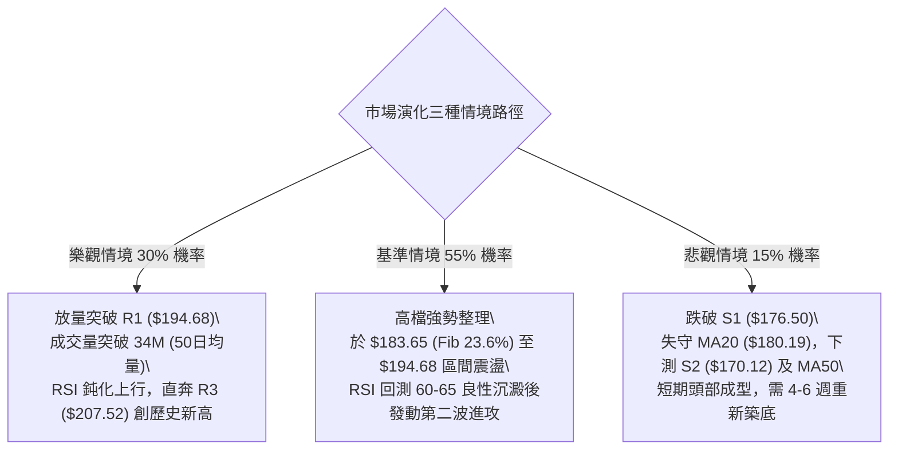

# PLTR 技術分析報告

> **報告日期**：2026-10-05 ｜ **語言**：繁體中文 ｜ **數據來源**：Yahoo Finance ｜ **當前價格**：$188.75

---

## 目錄

| 章節 | 內容 |
|------|------|
| [1. 技術面概覽](#1-技術面概覽) | 訊號儀表板、核心指標、評分卡 |
| [2. 趨勢分析](#2-趨勢分析) | 多時框趨勢、長中短期走勢 |
| [3. 圖表形態分析](#3-圖表形態分析) | 形態識別、K線組合、目標價 |
| [4. 支撐與阻力](#4-支撐與阻力) | 關鍵價位、斐波那契回調 |
| [5. 技術指標深度解讀](#5-技術指標深度解讀) | MA/RSI/MACD/布林/成交量 |
| [6. 動能與波動率](#6-動能與波動率) | 動能評估、ATR、Beta |
| [7. 多時框架總結](#7-多時框架總結) | 時框架評分矩陣 |
| [8. 交易策略建議](#8-交易策略建議) | 多空策略、風險報酬比 |
| [9. 風險提示與監控](#9-風險提示與監控) | 監控指標、風險場景 |

---

## 1. 技術面概覽

### 🎯 技術訊號儀表板



### 📊 核心指標速覽表

| 指標類別 | 指標名稱 | 當前數值 | 訊號 | 解讀 |
|----------|----------|----------|:----:|------|
| **價格** | 當前價格 | $188.75 | 🟢 | 站穩所有中長期均線，位於52週高低區間之 81.4% 高位階 |
| **均線** | MA20 | $180.19 | 🟢 | 現價高於 MA20 達 +4.75%，短線上升斜率穩健 |
| **均線** | MA50 | $169.78 | 🟢 | 現價高於 MA50，中期波段支撐強韌，趨勢保持向上 |
| **均線** | MA200 | $152.10 | 🟢 | 現價高於 MA200 達 +24.10%，長期牛市格局完全確立 |
| **動能** | RSI(14) | 75.10 | 🔴 | 進入 >70 之技術性超買區，需提防短線高檔獲利了結震盪 |
| **動能** | MACD (12,26,9) | DIF: 5.584 / DEA: 5.523 | 🟢 | 柱狀圖為 +0.061，維持零軸上方黃金交叉多頭擴張狀態 |
| **趨勢** | ADX (14) | 27.52 (+DI: 32.17) | 🟢 | ADX > 25 確認為強勢趨勢行情，多頭主導市場推升力道 |
| **通道** | 布林通道 (%B) | 0.74 (上軌 $198.00) | 🟡 | 價格位於中軌與上軌之間強勢區，尚未觸發布林破軌過熱 |
| **波動** | ATR(14) | $5.75 (3.04%) | 🟡 | 每日平均波幅擴大至 $5.75，操作需保留合理的止損緩衝 |
| **量能** | 當日量 / 20日均量 | 17.82M / 23.03M (0.77x) | 🔴 | 量能小幅萎縮，呈現高位價漲量縮的背離疑慮，宜補量上攻 |

### 🏆 技術評分卡

```
╔══════════════════════════════════════════════════════════════╗
║              技術評分卡 — PLTR (2026-10-05)                   ║
╠══════════════════════════════════════════════════════════════╣
║ 趨勢強度 (Trend)      ████████████████░░░░  80/100  🟢 強勢   ║
║ 動能指標 (Momentum)    ██████████████░░░░░░  70/100  🟡 偏強   ║
║ 支撐穩定度 (Support)   ████████████████░░░░  82/100  🟢 穩固   ║
║ 成交量配合 (Volume)    ████████████░░░░░░░░  60/100  🟡 普通   ║
║ 形態完整度 (Pattern)   ████████████████░░░░  80/100  🟢 完整   ║
║ 均線系統 (MA Align)    ██████████████████░░  90/100  🟢 多頭   ║
╠══════════════════════════════════════════════════════════════╣
║ 綜合評分 (Overall)     ███████████████░░░░░  77/100  🟢 偏多   ║
╚══════════════════════════════════════════════════════════════╝
```

---

## 2. 趨勢分析

### 🌐 多時框趨勢分析



### 📈 長期趨勢 — 12個月走勢圖（Unicode）

```
PLTR 月線走勢圖（2025-10 至 2026-10）
價格軸 ($)
$210 ┤                              ● 52W High ($207.52)
$200 ┤ ● (2025-10: $200.47)         
$190 ┤                            ●● 現價 ($188.75) / 2026-09 ($187.05)
$180 ┤     ● (2025-12: $177.75)  ● (2026-08: $186.38)
$170 ┤   ● (2025-11: $168.45)
$160 ┤                       ● (2026-05: $156.54)
$150 ┤         ● (2026-01: $146.59)  ● (2026-03: $146.28)
$140 ┤           ● (2026-02: $137.19)  ● (2026-04: $139.11)
$130 ┤                                   ● (2026-07: $123.06)
$120 ┤                             ● (2026-06: $116.67)
$110 ┤                             ● 波段低點 ($106.37)
     └─┬────┬────┬────┬────┬────┬────┬────┬────┬────┬────┬────┬──
      10   11   12   01   02   03   04   05   06   07   08   09   10 (月份)
      (2025)        (2026)                                  (現價)
```

#### 走勢特徵分析表格

| 階段區間 | 價格區間 ($) | 漲跌幅 (%) | 階段特徵與多空結構解讀 |
|:---|:---:|:---:|:---|
| **2025-10 至 2026-01** | $200.47 → $146.59 | -26.88% | **高檔獲利回吐期**：自 $200.47 歷史高檔區間拉回，跌破短期均線進入中級修正。 |
| **2026-02 至 2026-04** | $137.19 → $139.11 | +1.40% | **低檔震盪築底期**：於 $137-$146 區間形成第一次底部支撐平台，賣壓逐步收斂。 |
| **2026-05 至 2026-07** | $156.54 → $123.06 | -21.39% | **空頭二次下殺洗盤**：6月創下波段收盤低點 $116.67（盤中觸及52W低點 $106.37），形成長線大雙底結構。 |
| **2026-08 至 2026-10** | $186.38 → $188.75 | +53.38% (自7月) | **爆量V型強勢反轉**：8月單週湧入 4.35 億股巨量拉升突破 MA50 與 MA20，重返牛市主升段。 |

### 📊 中期趨勢（週線分析）

從過去 20 週收盤走勢可見，2026 年 8 月第 1 週收盤價達 $172.01，單週成交量爆出 435,164,800 股，MACD 柱狀體跳增至 +4.790，為極強烈的主力資金換手與積極建倉訊號。隨後在 9 月經歷了回踩 $167.23（2026-09-13）的回測洗盤，迅速於 9 月底以 $189.67 巨幅拉回並創下近期收盤新高，顯示中期多頭支撐買盤強固。

```
週線支撐與壓力拓撲圖：
[R3: $207.52] ───────────────────── 52週歷史高點強壓區
      ▲
[R2: $198.88] ───────────────────── 波段密集成交高點 / 布林上軌 ($198.00)
      ▲
[R1: $194.68] ───────────────────── 近期反彈波段頂部阻力
      ▲
【現價 $188.75】
      ▼
[S1: $176.50] ───────────────────── 9月下旬整理平台下緣 / 斐波 23.6% ($183.65)
      ▼
[S2: $170.12] ───────────────────── 中期均線 MA50 ($169.78) / 9月中旬洗盤低點
      ▼
[S3: $165.45] ───────────────────── 8月初起漲缺口中樞 / MA60 ($163.26)
```

### ⚡ 趨勢強度評估（ADX 解讀）



| ADX 數值區間 | 當前讀數 | 趨勢狀態判定 | 交易策略指導原則 |
|:---|:---:|:---:|:---|
| 00 – 20 | — | 無趨勢 / 雜訊震盪 | 區間震盪低買高賣，嚴格避免追價 |
| 20 – 25 | — | 趨勢萌芽 / 方向不明 | 觀察突破方向，減少操作口數 |
| **25 – 50** | **27.52 (+DI: 32.17)** | **強勁單邊趨勢行情 (當前狀態)** | **多頭主導，沿均線順勢做多，依據中長期趨勢操作** |
| 50 – 75 | — | 極強趨勢 / 易引發極端超買 | 隨時提防動能耗竭引發之反轉回調 |

---

## 3. 圖表形態分析

### 🔍 形態識別系統



#### 幾何形態信心度與目標價計算表

| 形態名稱 | 信心度 (%) | 判斷依據（引用數據） | 完成度 (%) | 目標價（附計算式） |
|:---|:---:|:---|:---:|:---|
| **雙重底 (W-Bottom)** | **85%** | 兩次低點分別落於 2026-06 收盤 $116.67 與 2026-07 收盤 $123.06，頸線為 2026-05 反彈高點 $156.54。 | 100% (已突破) | **已達成**：頸線 $156.54 + 形態高度 ($156.54 - $116.67 = $39.87) = **$196.41**（現價已逼近此目標區） |
| **高檔上升旗形 (Bull Flag)** | **70%** | 8月初由 $123.06 暴拉至 8月底 $186.29 構成旗桿，近4週於 $167.23 - $189.67 構築旗面整理。 | 75% | **推算目標**：突破旗面高點 $189.67 後，等長旗桿高度 ($186.29 - $123.06 = $63.23) 加上旗底低點 $167.23 = **$230.46**（遠期延伸目標） |
| **頭肩底形態** | **35%** | 數據中左肩與右肩對稱性不足，缺乏標準頭肩型態特徵。 | 0% | *訊號不足，僅做指標型與均線解讀* |

### 🕯️ 重要K線形態分析

| 月份 / 週別 | 收盤價 ($) | K線形態特徵 | 技術面深度解讀 | 訊號 |
|:---|:---:|:---|:---|:---:|
| **2026-06** | 116.67 | **長下影錘頭破底線** | 月盤中觸碰 52W 低點 $106.37 後收腳，顯示極限賣壓耗竭，主力機構低接 | 🟢 |
| **2026-08-09 (週)** | 172.01 | **巨量長陽穿雲箭** | 單週爆量 4.35 億股，一舉帶量貫穿 MA20 與 MA50，確認趨勢反轉向上 | 🟢 |
| **2026-09-13 (週)** | 167.23 | **量縮陰線回踩確認** | 週成交量驟降至 8,168 萬股（近期最低），洗盤不破重要支撐，為標準假跌破 | 🟢 |
| **2026-09-27 (週)** | 189.67 | **吞噬性實體中紅棒** | 將前兩週之跌幅全數吞噬，收盤價逼近 $190 大關，確認次級折返結束 | 🟢 |
| **2026-10-04 (週)** | 188.75 | **高檔小陰十字星** | 收在 $188.75，呈現高檔整固，受制於上方 R1 ($194.68) 獲利回吐賣壓 | 🟡 |

### 📉 ASCII 走勢形態示意圖

```
PLTR 高檔上升旗形與雙底反轉示意圖
價格 ($)
$207.52 ┼                                                [52W High / R3]
        │                                                
$194.68 ┼                                      ┌─┐      [旗面突破上軌 / R1]
$188.75 ┼───────────────────────────────────────┤*├────── 現價 ($188.75)
$176.50 ┼                             ┌──┐     └─┘      [旗面整理下軌 / S1]
        │                             │  │  ┌──┐         
$165.45 ┼                     ┌──┐    │  │  │  │        [突破頸線位 / S3]
        │                     │  │    │  │  │  │         
$136.32 ┼      ┌──┐           │  │    │  │  │  │         
        │      │  │           │  │    └──┘  └──┘         
$116.67 ┼──────┴──┴───────────┴──┴────────────────────── [雙底支撐帶 / 52W Low]
              2026-06         2026-07      2026-08~10
              (底 1)          (底 2)      (主升旗桿+旗面)
```

---

## 4. 支撐與阻力

### 🗺️ 關鍵價位分布圖（Unicode）

```
PLTR 價位結構分布圖（OHLCV 實際計算聚類）
════════════════════════════════════════════════════════════════════
$207.52 ║████████████████████████████████████████║ 52週歷史天花板 R3
$198.88 ║██████████████████████████████          ║ 波段密集強阻力 R2 / BB上軌
$194.68 ║████████████████████                    ║ 短線反彈波段高點 R1
$188.75 ╠════════════════════════════════════════╣ ◄ 當前市價 ($188.75)
$183.65 ║▓▓▓▓▓▓▓▓▓▓▓▓▓▓▓▓▓▓▓▓▓▓▓▓▓▓▓▓            ║ 斐波那契 23.6% 回調關鍵位
$176.50 ║████████████████████████                ║ 近期波段回踩支撐 S1
$170.12 ║████████████████████████████████        ║ 強支撐 S2 / MA50 均線防線
$165.45 ║████████████████████████████████████████║ 大波段起漲結構底 S3
════════════════════════════════════════════════════════════════════
```

### 🚧 阻力位分析表

| 阻力級別 | 精確價位 | 形成原因與籌碼結構 | 突破難度 | 技術重要性 |
|:---|:---:|:---|:---:|:---:|
| **關鍵阻力 (R1)** | **$194.68** | 近期反彈波段高點聚類；距現價僅 +3.14%，為短線多頭突破首要關卡。 | 🟡 中等 | ★★★☆☆ |
| **波段阻力 (R2)** | **$198.88** | 靠近布林通道上軌（$198.00）與心理整數關卡 $200.00，解套獲利交織。 | 🔴 偏高 | ★★★★☆ |
| **強阻力 (R3)** | **$207.52** | 52 週歷史最高價（52W High）；歷史套牢籌碼峰值密集區，空頭最後防線。 | 🔴 極高 | ★★★★★ |

### 🛡️ 支撐位分析表

| 支撐級別 | 精確價位 | 形成原因與籌碼結構 | 守住機率 | 技術重要性 |
|:---|:---:|:---|:---:|:---:|
| **近期支撐 (S1)** | **$176.50** | 9月下旬整理平台底與波段拉回低點聚類；接近 MA20 ($180.19) 防守區。 | 75% | ★★★☆☆ |
| **波段強支撐 (S2)** | **$170.12** | 9月中旬洗盤低點 ($167.23) 聚類區，疊加中期 MA50 ($169.78) 共振。 | 85% | ★★★★☆ |
| **極限防守 (S3)** | **$165.45** | 8月初爆量起漲突破缺口核心平台，跌破則整體中級牛市結構面臨破壞。 | 95% | ★★★★★ |

### 📐 斐波那契回調位分析

依據 52 週波動區間：**波段低點 $106.37 → 波段高點 $207.52**（總波幅 $101.15）精確計算：

```
斐波那契回調階梯分布：
 0.0%  (52W High)   ────────────────────────── $207.52
 23.6%              ────────────────────────── $183.65 ◄─── (現價落於 0.0% ~ 23.6% 強勢區間)
       【現價：$188.75】
 38.2%              ────────────────────────── $168.88 (與 MA50: $169.78 / S2 重合)
 50.0%              ────────────────────────── $156.95 (與 MA240: $156.69 重合)
 61.8%              ────────────────────────── $145.01 (與 MA120: $149.26 相近)
 78.6%              ────────────────────────── $128.02
100.0% (52W Low)    ────────────────────────── $106.37
```

- **位置意義解讀**：現價 $188.75 穩穩站上 23.6% 回調位（$183.65），處於極強勢的多頭掌控區間（0.0% ~ 23.6%）。在技術分析法則中，當標的回踩不破 23.6% 斐波那契位，意味著原上升趨勢動能極其強韌，後市再度挑戰甚至刷新 0.0% 高點（$207.52）的概率極高。下方 38.2% 位（$168.88）與 MA50（$169.78）構成雙重共振保護網。

---

## 5. 技術指標深度解讀

### 🎛️ 指標訊號總覽



### 📈 移動平均線排列分析



| 均線名稱 | 數值 ($) | 與現價乖離率 (%) | 均線運行方向 | 技術面功能與解讀 |
|:---|:---:|:---:|:---:|:---|
| **MA5** | $188.06 | +0.37% | 向上發散 | 短線超強動能線，現價貼合 MA5 推進，未見跌破訊號 |
| **MA10** | $188.24 | +0.27% | 走平向上 | 5日與10日均線黏合微幅翻揚，短線籌碼緊密鎖定 |
| **MA20** | $180.19 | +4.75% | 快速上揚 | 布林帶中軌所在地，短線回踩的核心買盤支撐點 |
| **MA50** | $169.78 | +11.17% | 向上翻揚 | 中期季線級別生命線，與 S2 支撐緊密結合，多頭底線 |
| **MA60** | $163.26 | +15.62% | 向上發散 | 60日生命線，提供強勁的波段趨勢防禦力道 |
| **MA120** | $149.26 | +26.45% | 向上翻揚 | 半年線支撐，中長期趨勢完全轉向多頭掌控 |
| **MA200** | $152.10 | +24.10% | 穩定向上 | 年線牛熊分界線，價格遠在其上，長牛格局確鑿無疑 |
| **MA240** | $156.69 | +20.46% | 向上走升 | 長期基石線，呈現長線扣抵低價區的健康走勢 |

### 📉 RSI(14) 分析

- **當前讀數**：75.10
- **RSI 動能強度進度條**：
  ```
  超賣區 (0-30)        中性平衡區 (30-70)       超買區 (70-100)
  ░░░░░░░░░░░░░░░░░░░░ ▓▓▓▓▓▓▓▓▓▓▓▓▓▓▓▓▓▓▓▓ █ 75.10
  [███████████████████████████████░░░░░░░░░] 75.10%
  ```
- **超買超賣判定**：數值 75.10 已跨入 >70 超買警戒區。歷史經驗顯示，PLTR 進入此區間易伴隨 1-3 天的高檔量縮橫盤，但強勢股於強趨勢中（ADX > 25）常出現「超買鈍化」，不宜單憑 RSI > 70 貿然開空。
- **背離分析**：
  - **價格走勢**：由 2026-09-20 週收盤 $177.64 攀升至當前 $188.75，創波段反彈新高。
  - **RSI 軌跡**：自 42.8 急升至 75.10，同步創下近期新高。
  - **結論**：**無頂背離現象**。動能與價格同向上揚，確認為實質資金推動的趨勢型走勢，並非無量虛拉。

### 📊 MACD(12,26,9) 訊號解讀



MACD 當前雙線處於零軸上方的極高位置（+5.584 與 +5.523），柱狀體雖翻紅為正（+0.061），但柱狀體數值較 8 月份高點（+4.790）明顯收斂。此現象表明：**中長線多頭架構未變，但短線爆發性衝刺動能已轉化為穩步推升或高檔整固**。

### 📦 布林通道分析

```
PLTR 布林通道 (Bollinger Bands, 20, 2) 結構示意圖
價格 ($)
$198.00 ┬────────────────────────────────────────── 布林上軌 (Upper Band)
        │                          
$188.75 ┼─────────────────────────●────────────── 現價 ($188.75, %B = 0.74)
        │                         
$180.19 ┼────────────────────────────────────────── 布林中軌 (MA20)
        │
$162.38 ┴────────────────────────────────────────── 布林下軌 (Lower Band)
```

- **通道帶寬與位置**：帶寬為 $35.62（$198.00 - $162.38），%B 讀數為 **0.74**，顯示價格穩固運行於中軌（$180.19）之上、朝上軌推進的健康上升軌道中。尚未觸碰 1.0 上軌臨界線，意味著上方仍有衝刺空間，未陷入極端超買破軌風險。

### 💹 成交量分析（量價配合度）

```
成交量對比：
當日成交量:  17.82M  [██████████████░░░░░] (0.77x)
20日均量:   23.03M  [████████████████████] (基準 1.0x)
50日均量:   34.33M  [██████████████████████████████] (1.49x)
```

- **量價關係解讀**：當前成交量 17.82M 低於 20 日均量，量比為 0.77x，呈現標準的「高檔價漲量縮」整固走勢。此背後成因在於經過 8、9 月的大幅換手後，籌碼沉澱良好，上方浮額不大。然而，若要有效突破 R1 ($194.68) 及歷史高點 R3 ($207.52)，必須補量至 20日均量（23.03M）以上，方能確認為突破有效。
- **OBV（能量潮）**：數據顯示「OBV > MA」，表明資金主力並未在高檔出逃，量能趨勢維持正向支持走勢，中長線籌碼結構依然穩健。

---

## 6. 動能與波動率

### ⚡ 動能評估四象限

| 象限標籤 | 動能狀態 (Momentum) | 波動率狀態 (Volatility) | 當前判定 | 戰略解讀與操作指引 |
|:---:|:---:|:---:|:---:|:---|
| **第一象限 (Q1)** | **強動能 (ADX 27.52 / RSI 75.1)** | **中低波動 (ATR 3.04%)** | **✓ 當前狀態** | **最佳趨勢持倉區：趨勢明確推升，波動在可控範圍內，適合順勢持股並動態調高移動止盈。** |
| **第二象限 (Q2)** | 弱動能 | 低波動 | — | 沉悶盤整：等待放量突破確認方向。 |
| **第三象限 (Q3)** | 強動能 | 高波動 | — | 瘋狂主升浪或恐慌殺跌：高風險高回報，需大幅縮減單筆倉位。 |
| **第四象限 (Q4)** | 弱動能 | 高波動 | — | 擴散震盪洗盤：勝率最低區間，應完全觀望避開。 |

### 📊 ATR 波動率分析

- **ATR(14) 數值**：**$5.75**（佔當前價格之 **3.04%**）。
- **波動特性解讀**：每日平均波動超過 $5.70，顯示 PLTR 具備充足的日內與隔夜獲利空間，同時意味著震盪噪音較大。
- **止損距離建議**：
  - **短線交易（1.5 倍 ATR）**：$5.75 × 1.5 = **$8.63** 止損緩衝空間。
  - **波段交易（2.0 倍 ATR）**：$5.75 × 2.0 = **$11.50** 止損緩衝空間。
  - **實務應用**：若在現價 $188.75 建立部位，波段防護價位應設於 $188.75 - $11.50 = **$177.25** 附近，恰與 S1 支撐位（$176.50）形成技術面的雙重互證。

### 📐 Beta 與市場相關性

- **Beta 係數**：**1.621**。
- **市場敏感度分析**：PLTR 展現出顯著的高 Beta 成長股屬性，當標普 500 指數或納斯達克波動 1% 時，PLTR 預期同向變動約 1.62%。
- **投資組合風險隱含**：在多頭趨勢中具備強大的超額收益（Alpha）捕獲能力；但在大盤系統性回檔時，回撤速度亦會倍增，需配合指數動向進行宏觀避險。

---

## 7. 多時框架總結

### 📋 時框架評分表

| 時框架 | 趨勢方向 | 動能狀態 | 均線排列狀況 | 關鍵形態結構 | 綜合評分 | 戰術建議 |
|:---|:---:|:---:|:---:|:---:|:---:|:---|
| **長期 (月線)** | 🟢 多頭 | 75/100 | MA200/MA240 翻揚支撐 | 長期歷史大頸線上攻 | 85/100 | 堅定偏多，長線投資者沿半年線逢回加碼 |
| **中期 (週線)** | 🟢 多頭 | 80/100 | 突破 MA50，零軸上金叉 | 8月巨量V型反轉+上升旗形 | 82/100 | 順勢操作，持有核心多頭底倉不輕易拋售 |
| **短期 (日線)** | 🟡 偏多震盪 | 68/100 | 多頭排列，但量能稍縮 | RSI 75.10 超買，高檔蓄勢 | 70/100 | 不宜盲目追高，等待拉回 S1 或突破 R1 買進 |

### 🔲 綜合訊號矩陣

```
訊號一致性交叉檢驗表：
┌─────────────────────────┬──────────────┬──────────────┬──────────────┐
│ 分析維度                │ 長期（月線） │ 中期（週線） │ 短期（日線） │
├─────────────────────────┼──────────────┼──────────────┼──────────────┤
│ 均線系統 (MA Align)     │   🟢 強多    │   🟢 強多    │   🟢 強多    │
│ 動能強度 (RSI / MACD)   │   🟢 向上    │   🟢 向上    │   🔴 超買    │
│ 趨勢強度 (ADX / +DI)    │   🟢 確立    │   🟢 確立    │   🟢 強勢    │
│ 成交量配合 (Volume/OBV) │   🟢 擴增    │   🟢 巨量積累 │   🟡 量縮整固 │
│ 支撐結構穩定性          │   🟢 穩固    │   🟢 穩固    │   🟢 穩固    │
└─────────────────────────┴──────────────┴──────────────┴──────────────┘
```

### ⚖️ 多時框收斂結論

依據多時框收斂規則：
1. **當前趨勢定性**：當前 ADX(14) 讀數為 **27.52 > 25**，且 +DI(32.17) 遠高於 -DI(14.64)，技術面明確判定為**趨勢行情**。
2. **時框主導順序**：在中長期（週線／MA50: $169.78、MA200: $152.10）呈現壓倒性多頭排列的主導下，日線的 RSI 超買（75.10）與量能小幅收斂（0.77x）僅屬**次級折返或高檔消化浮額**，絕不可將其視為空頭趨勢翻轉。日線級別指標僅應用於鎖定**精確的回踩低吸進場時機**。
3. **唯一收斂方向**：**偏多（Bullish Bias）**。總體戰略採取「順應週月線多頭主升勢，利用日線高檔拉回測試支撐時分批低吸佈局」，徹底排除盲目作空可能。

---

## 8. 交易策略建議

### 🗺️ 策略決策流程圖



### 🧭 策略路由

> **當前主策略方向 = 主推多頭策略（依綜合評分 77/100，技術面偏多掌控）**

依據評分卡 77 分之多頭評判，本報告全力主推**多頭進場佈局策略**；任何空頭情境僅作為「風險觸發點與多單停損標準」，不提供主動逆勢放空策略。

### 🎯 價格情境階梯（Price Scenarios）

| 觸發條件（嚴格引用關鍵價位） | 下一目標價 | 後續延伸目標 | 情境含義與技術意涵 |
|:---|:---:|:---:|:---|
| **帶量突破 R1 ($194.68)** | **R2 ($198.88)** | **R3 ($207.52)** | 短線超買獲利了結賣壓完全消化，啟動新一輪衝刺 52 週歷史高點之強攻浪。 |
| **站穩現價區間 ($180.19 - $188.75)** | — | — | 於布林中軌 MA20 與現價間高位量縮整理，以時間換取空間化解 RSI 鈍化。 |
| **跌破 S1 ($176.50)** | **S2 ($170.12)** | **S3 ($165.45)** | 短線上升旗形破位，進入中期季線（MA50: $169.78）保衛戰，多頭進入深度修正。 |

### 📊 情境機率分佈

```
情境機率分佈圓餅比例：
繼續上行 / 突破創新高 (55%) [█████████████████████░░░░░░░░░░]
區間震盪 / 高檔蓄勢   (30%) [████████████░░░░░░░░░░░░░░░░]
回落破位 / 中度回調   (15%) [██████░░░░░░░░░░░░░░░░░░░░░░]
```

| 預測情境 | 機率估計 (%) | 主要技術指標支撐依據 |
|:---|:---:|:---|
| **繼續上行 / 突破高點** | **55%** | 均線系統呈標準多頭排列，MACD 柱狀體維持正值，ADX 27.52 趨勢確立，OBV 持續向上支撐上漲。 |
| **高檔區間震盪蓄勢** | **30%** | RSI(14) 達 75.10 處於超買狀態，量比 0.77x 尚未顯著放量，需時間消化 $190-$195 區間解套籌碼。 |
| **深度回落測試 MA50** | **15%** | 短線急漲乖離擴大，若遭遇大盤高 Beta 系統性拉回，可能回測 S2 ($170.12) 與 MA50 支撐。 |

### 🟢 主策略詳情

本報告依交易風格分流提供「**策略 A：回調支撐低吸（波段稳健）**」與「**策略 B：突破追價買進（動能激進）**」，所有價位皆嚴格引用關鍵價位數據計算：

| 策略要素 | 策略 A（穩健型：回檔支撐佈局） | 策略 B（激進型：突破順勢追價） |
|:---|:---:|:---:|
| **進場條件** | 價格拉回至斐波那契 23.6% 回調位至 S1 區間止跌有撐 | 日K線帶量實體收盤突破關鍵阻力 R1 |
| **進場價格** | **$183.65**（斐波那契 23.6% 位） | **$194.68**（R1 突破點） |
| **目標價 T1** | **$194.68**（阻力位 R1） | **$198.88**（阻力位 R2 / 布林上軌） |
| **目標價 T2** | **$207.52**（52W High / 阻力位 R3） | **$207.52**（52W High / 阻力位 R3） |
| **止損價格** | **$170.12**（波段強支撐 S2 / MA50 之下） | **$188.75**（突破前之當前盤整中樞平台） |
| **風險空間 ($)** | $183.65 - $170.12 = **$13.53** | $194.68 - $188.75 = **$5.93** |
| **報酬空間 (T2)** | $207.52 - $183.65 = **$23.87** | $207.52 - $194.68 = **$12.84** |
| **風險報酬比 (R:R)**| **1 : 1.76** (至T1) / **1 : 1.76** (至T2為 1:1.76) | **1 : 2.16** (至T2) |
| **模型預估成功率** | **70%** | **60%** |
| **建議配置倉位** | **總資金之 15% - 20%** | **總資金之 8% - 10%** |

*註：策略 A 在 T1 ($194.68) 可獲利減持 50% 鎖定利潤，其餘部位將止損位上移至進場成本價 $183.65，博取 T2 ($207.52) 之全段行情。*

### 🔴 反向風險觸發點（對沖提示）

若行情未按預期推升，出現下列**反向觸發事件**，意味多頭主升結構破壞，應無條件執行風控：
1. **短線停損警戒線**：收盤價實體跌破 **S1 ($176.50)**，且連續 2 日無法收復，代表上升旗形失效，短線多單應即刻減倉觀望。
2. **中期趨勢翻空線**：跌破 **S2 ($170.12)** 與 **MA50 ($169.78)** 雙重護城河，此時技術面由多轉空，多頭部位應**全數止損出場**，甚至可配置對沖部位規避下探 S3 ($165.45) 乃至 MA200 ($152.10) 之深度回調。

### ⭐ 整體訊號強度評星

```
做多訊號強度：★★★★☆  (4.0/5 星 — 均線與動能共振看多，僅受量縮與RSI高檔壓抑)
做空訊號強度：★☆☆☆☆  (1.0/5 星 — 逆強趨勢操作，勝率極低)
整體可信度：  ★★★★☆  (4.5/5 星 — 形態、均線、ADX、OBV 數據高度收斂)
```

---

## 9. 風險提示與監控

### ✅ 關鍵監控指標 Checklist

```
╔══════════════════════════════════════════════════════════════════╗
║               PLTR 每日盤後技術監控清單 (Checklist)              ║
╠══════════════════════════════════════════════════════════════════╣
║ [ ] 1. 收盤價是否持續站穩 MA20 ($180.19) 與 S1 ($176.50) 之上？   ║
║ [ ] 2. 成交量能否有效放量超越 20日均量 (23.03M)？                 ║
║ [ ] 3. RSI(14) 回落至 70 之下時，是否屬於「價穩動能降」之良性消化？║
║ [ ] 4. MACD 柱狀圖是否持續維持正值 (> 0)，未出現高檔死叉？        ║
║ [ ] 5. ADX(14) 數值是否維持在 25 以上且 +DI > -DI？              ║
║ [ ] 6. 向上挑戰 R1 ($194.68) 時是否遭遇長上影線主力出貨？        ║
╚══════════════════════════════════════════════════════════════════╝
```

### ⚠️ 風險場景分析



### 🛡️ 風險管理重要提醒

1. **Beta 敏感度管理**：PLTR 之 Beta 值為 1.621，代表波動率是大盤的 1.6 倍以上。在配置投資組合時，建議單一個股倉位不應超過整體投資組合的 **15% 至 20%**，避免單一標的之劇烈震盪造成淨值不可承受之回撤。
2. **波動率與止損彈性**：ATR(14) 高達 $5.75，嚴禁採用過度狹窄的日內止損（如 $1-$2 止損），此舉極易遭市場常規噪音掃出場。止損點設立必須嚴格依據技術位（如 S1 $176.50 或 S2 $170.12），並至少保留 1.5 倍 ATR 空間。
3. **過熱指標管理**：儘管長線強烈看好，但日線 RSI(14) = 75.10 是客觀存在的短期過熱訊號。嚴禁在現價（$188.75）附近以全倉或槓桿方式追高，耐心等待短線回踩 23.6% 斐波位（$183.65）才是風險報酬比最優之解。

---

## 📋 報告總結

```
╔══════════════════════════════════════════════════════════════════╗
║                    PLTR 技術分析報告總結                         ║
╠══════════════════════════════════════════════════════════════════╣
║ 報告日期：2026-10-05                                             ║
║ 當前價格：$188.75                                                ║
║ 分析評級：🟢 偏多（Bullish）— 建議「逢回做多，順勢而為」         ║
╠══════════════════════════════════════════════════════════════════╣
║ 關鍵結論：                                                       ║
║ ├─ 長期趨勢：🟢 多頭排列完整，站穩 MA200 ($152.10) 上方發散     ║
║ ├─ 中期趨勢：🟢 雙底形態突破完成，8月巨量建倉確立中級主升段    ║
║ ├─ 短期趨勢：🟡 短線均線多頭，但 RSI (75.10) 進入超買，需整固   ║
║ ├─ 關鍵支撐：S1: $176.50 ｜ S2: $170.12 ｜ Fib 23.6%: $183.65  ║
║ ├─ 關鍵阻力：R1: $194.68 ｜ R2: $198.88 ｜ R3 (52W): $207.52  ║
║ └─ 分析師目標價：均價 $195.57 ｜ 最高 $255.00                    ║
╠══════════════════════════════════════════════════════════════════╣
║ 最優策略組合：                                                   ║
║ 1. 🥇 最佳機會（策略 A）：回踩 Fib 23.6% ($183.65) 至 S1 分批佈局║
║    目標 T1: $194.68 / T2: $207.52，止損: $170.12 (風報比 1:1.76)║
║ 2. 🥈 次選機會（策略 B）：帶量突破 R1 ($194.68) 順勢追多         ║
║    目標 T1: $198.88 / T2: $207.52，止損: $188.75 (風報比 1:2.16)║
║ 3. 🥉 保守選擇：待現價於 MA20 ($180.19) 附近完成量縮打底再行進場 ║
╚══════════════════════════════════════════════════════════════════╝
```

---

> ⚠️ **免責聲明**：本報告為技術分析研究，所有數據、圖表及估算均嚴格基於歷史與即時市場公開資訊。本報告**僅供研究與學術參考**，**不構成任何形式的投資要約或買賣建議**。金融市場存在高度波動與本金損失風險，投資人應依個人財務狀況、風險承受能力獨立判斷並自負盈虧。

---

*報告生成時間：2026-10-05 ｜ 數據來源：Yahoo Finance ｜ 分析框架：多時框技術分析體系*