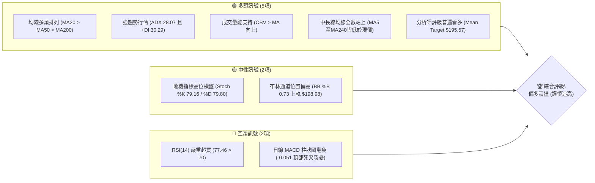
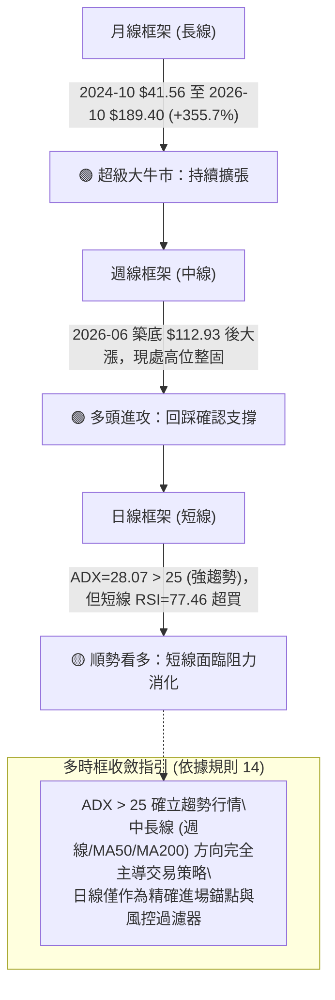
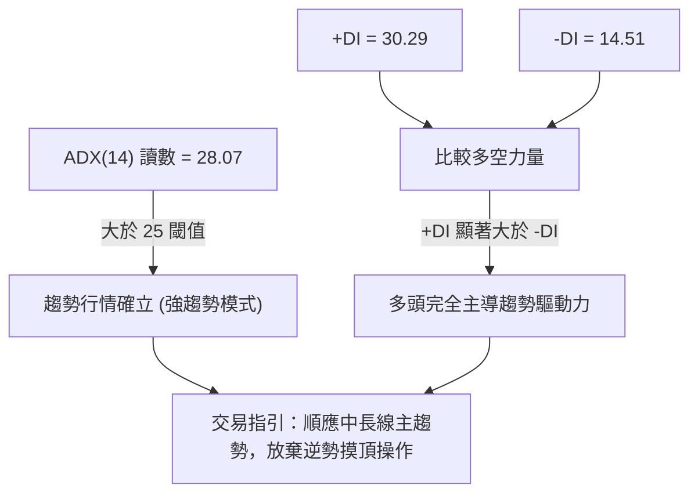
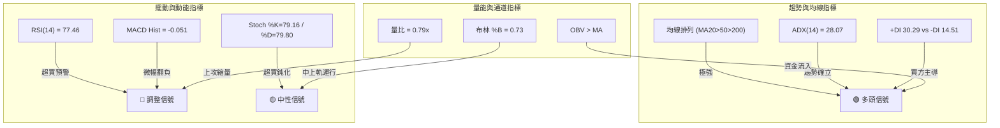
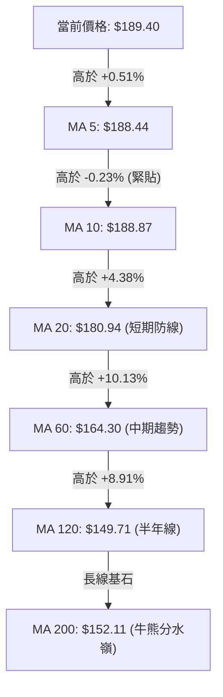
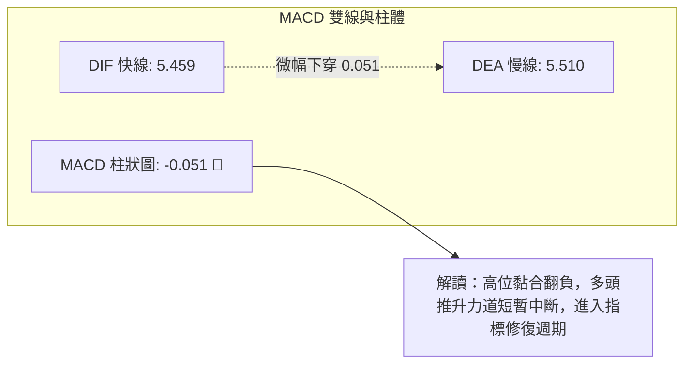
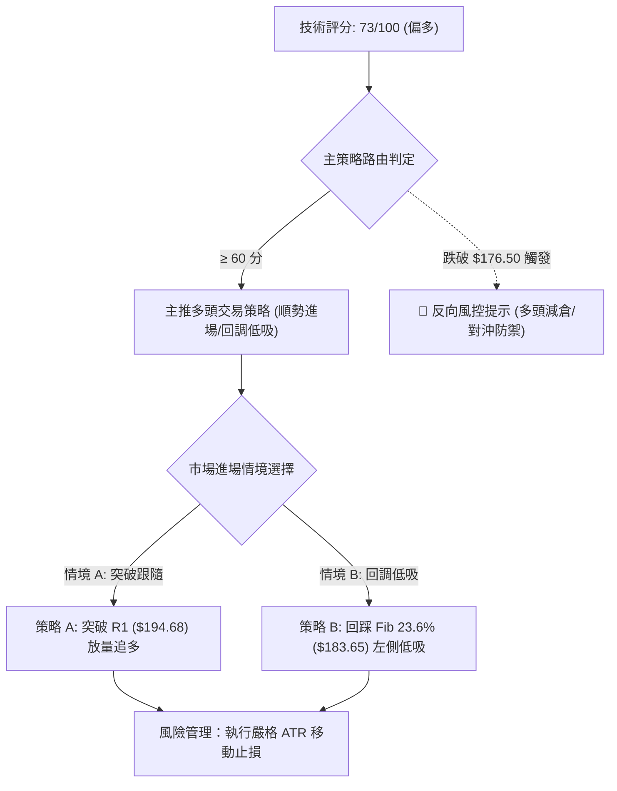
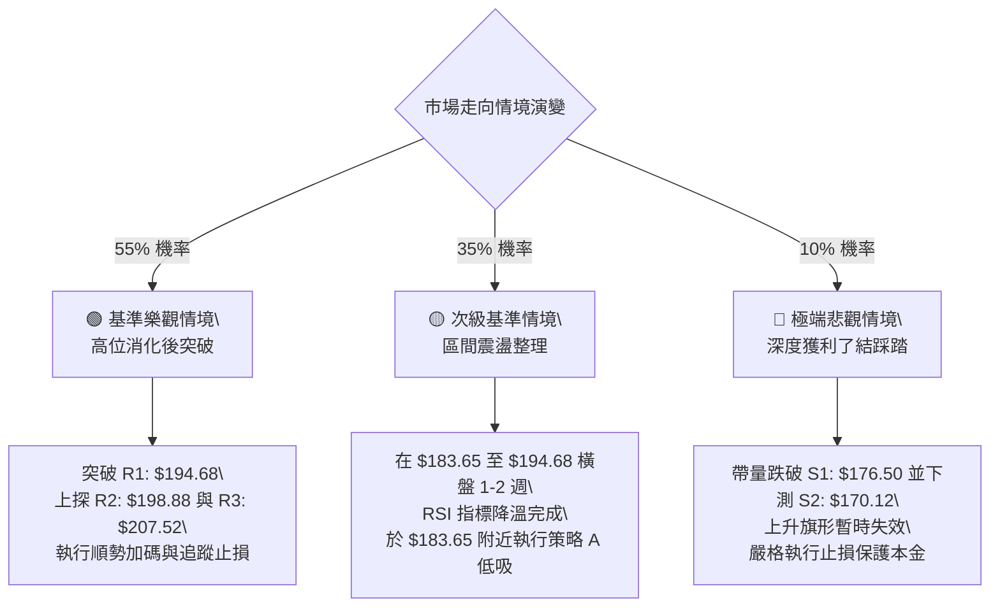

# PLTR 技術分析報告

> **報告日期**：2026-10-06 ｜ **語言**：繁體中文 ｜ **數據來源**：Yahoo Finance ｜ **當前價格**：$189.40

---

## 目錄

| 章節 | 內容 |
|------|------|
| [1. 技術面概覽](#1-技術面概覽) | 訊號儀表板、核心指標、評分卡 |
| [2. 趨勢分析](#2-趨勢分析) | 多時框趨勢、長中短期走勢、ADX 評估 |
| [3. 圖表形態分析](#3-圖表形態分析) | 形態識別、K線組合、目標價推算 |
| [4. 支撐與阻力](#4-支撐與阻力) | 關鍵價位結構、斐波那契回調深度解讀 |
| [5. 技術指標深度解讀](#5-技術指標深度解讀) | MA 排列、RSI、MACD、布林通道、OBV 量價 |
| [6. 動能與波動率](#6-動能與波動率) | 動能四象限、ATR 波動度、Beta 敏感度 |
| [7. 多時框架總結](#7-多時框架總結) | 時框架評分矩陣、收斂規則驗證 |
| [8. 交易策略建議](#8-交易策略建議) | 策略路由、價格情境階梯、主策略詳情 |
| [9. 風險提示與監控](#9-風險提示與監控) | 監控指標、風險場景模擬、風控提醒 |
| [📋 報告總結](#-報告總結) | 儀表板總結與執行清單 |

---

## 1. 技術面概覽

### 🎯 技術訊號儀表板

Palantir Technologies Inc. (PLTR) 目前處於強勢中長期多頭擴張後的頂部震盪整理區。日線均線維持標準多頭排列，且週線趨勢強勁向上；然而，短線動能出現指標分歧——RSI 進入超買區（77.46），而 MACD 柱狀圖微幅翻負（-0.051），提示多頭在 $190.00 關卡附近面臨獲利了結壓力。



### 📊 核心指標速覽表

| 指標類別 | 指標名稱 | 當前數值 | 訊號 | 解讀 |
|----------|----------|----------|------|------|
| **價格** | 當前收盤價 | $189.40 | 🟢 | 位於52週區間 82.1% 高位，多方牢牢掌控定價權 |
| **均線** | 短期 MA20 | $180.94 | 🟢 | 現價高於 MA20 達 +4.67%，短期多頭防線穩固 |
| **均線** | 中期 MA50 | $171.11 | 🟢 | 現價高於 MA50 達 +10.69%，中期上升趨勢未改 |
| **均線** | 長期 MA200 | $152.11 | 🟢 | 現價高於 MA200 達 +24.52%，牛市基石極其堅實 |
| **動能** | RSI(14) | 77.46 | 🔴 | 進入極度超買區間，短線存在拉回修正或橫盤鈍化需求 |
| **動能** | MACD(12,26,9) | 5.459 / 5.510 | 🔴 | DIF 線微幅下穿訊號線，Hist 轉為 -0.051，動能短暫衰竭 |
| **動能** | 隨機指標 %K/%D | 79.16 / 79.80 | 🟡 | 進入超買邊緣但未發出強烈反轉訊號，呈現高位鈍化 |
| **趨勢** | ADX(14) | 28.07 | 🟢 | 突破 25 臨界點，確立為典型趨勢驅動行情（非無序震盪） |
| **方向** | 方向性指標 (+DI/-DI) | 30.29 / 14.51 | 🟢 | +DI 顯著大於 -DI，買方維持壓倒性主導地位 |
| **通道** | 布林通道帶寬 | $162.90 ~ $198.98 | 🟡 | %B 達到 0.73，逼近上軌阻力位，短期向上空間受壓抑 |
| **量能** | 20日成交量比 | 0.79x (17.68M vs 22.52M) | 🟡 | 縮量挑戰上方高點聚類，顯示追價買盤轉向觀望 |
| **波動** | ATR(14) | $5.60 | 🟡 | 佔現價 2.96%，屬於中等偏高波動，止損空間需留足 |

### 🏆 技術評分卡

```
╔══════════════════════════════════════════════════════════════╗
║              技術評分卡 — PLTR (2026-10-06)                  ║
╠══════════════════════════════════════════════════════════════╣
║ 趨勢強度 (ADX/方向)   ████████████████░░░░  80/100  🟢 多頭趨勢  ║
║ 動能指標 (RSI/MACD)   ██████████░░░░░░░░░░  52/100  🟡 動能減速  ║
║ 支撐穩定度 (結構位)   ██████████████░░░░░░  72/100  🟢 買盤厚實  ║
║ 成交量配合 (OBV/均量) ████████████░░░░░░░░  62/100  🟢 量價尚符  ║
║ 形態完整度 (波段架構) ████████████████░░░░  80/100  🟢 階梯上行  ║
║ 均線排列 (短中長MA)   ██████████████████░░  92/100  🟢 完美多頭  ║
╠══════════════════════════════════════════════════════════════╣
║ 綜合技術評分          ███████████████░░░░░  73/100  🟢 偏多進攻  ║
║ 策略導向：以「順勢做多」為主軸，防範短線超買急跌修正風險。   ║
╚══════════════════════════════════════════════════════════════╝
```

---

## 2. 趨勢分析

### 🌐 多時框趨勢分析

根據多時框架技術分析體系，PLTR 的月線與週線展現出極強的大級別上升循環，日線則正處於自 2026 年 8 月強勢噴發後的第二波整理平台頂部。



### 📈 長期趨勢 — 12個月走勢圖（Unicode）

以下圖表展示自 2025 年 11 月至 2026 年 10 月共 12 個月的月線收盤價演變：

```
PLTR 月線走勢圖（過去12個月）
價格軸 ($)
$210 ┤                                                        
$200 ┤                                                        
$190 ┤                                                  ● 187.05 ──● 189.40 (當前)
$180 ┤                            ● 177.75        ● 186.38    
$170 ┤ ● 168.45                                               
$160 ┤                                      ● 156.54          
$150 ┤                   ● 146.59    ● 146.28                  
$140 ┤             ● 137.19    ● 139.11                       
$130 ┤                                                        
$120 ┤                                            ● 123.06    
$110 ┤                                      ● 116.67 (年內低點)
     └────────────────────────────────────────────────────────
       11    12    01    02    03    04    05    06    07    08    09    10  (月份)
      2025  2025  2026  2026  2026  2026  2026  2026  2026  2026  2026  2026
```

**12個月走勢特徵分析表格**：

| 階段區間 | 時間跨度 | 起訖收盤價 | 區間漲跌幅 | 走勢特徵與技術解讀 |
|----------|----------|------------|------------|--------------------|
| 第一階段：高位修正 | 2025-11 ~ 2026-02 | $168.45 → $137.19 | -18.56% | 2025年10月觸及 $200.47 後的主動降槓桿回調，尋找估值支撐 |
| 第二階段：箱型震盪 | 2026-02 ~ 2026-05 | $137.19 → $156.54 | +14.10% | 構築 $137~$156 之中期平衡箱體，多空力量形成暫時平衡 |
| 第三階段：極限洗盤 | 2026-06 ~ 2026-07 | $156.54 → $116.67 | -25.47% | 快速破位下殺，在 2026-06 創出波段低點 $112.93，清洗浮額 |
| 第四階段：主力拉升 | 2026-07 ~ 2026-08 | $123.06 → $186.38 | **+51.45%** | 8月首週爆出 4.35 億股天量跳空暴漲，奠定新一輪牛市主升浪 |
| 第五階段：高位鈍化 | 2026-08 ~ 2026-10 | $186.38 → $189.40 | +1.62% | 消化獲利籌碼，橫盤整理於歷史次高位，準備挑戰歷史極值 |

### 📊 中期趨勢（週線分析）

從近 20 週收盤走勢可精確剖析中期結構的轉折點：

```
近20週價格結構與波段轉換示意圖：
價位 ($)
$195 ┤                                               ● R1: 194.68 (上方阻力)
$190 ┤                                       ● 189.67 ──● 188.75 ──● 189.40 (現價)
$185 ┤                             ● 186.29                  
$180 ┤                     ● 179.94                          
$175 ┤             ● 174.04                ● 174.33    ● 177.64 (S1 緩衝區)
$170 ┤     ● 172.01                        ● 167.23 ── S2: 170.12 (強支撐)
     ├───────────────────────────────────────────────────────
$135 ┤ 
$125 ┤ ● 123.06 (噴發前低點)
$110 ┤ ● 112.93 (中期底部完成)
     └───────────────────────────────────────────────────────
週次: W08-02  W08-09  W08-16  W08-23  W08-30  W09-06  W09-13  W09-20  W09-27  W10-04  W10-11
```

- **結構破位與修復**：2026-06-28 探底 $112.93，隨後週線 RSI 在 23.7 的極度超賣區間迎來強力V型反轉。
- **主力建倉確認點**：2026-08-09 週成交量暴增至 435,164,800 股，單週價格由 $123.06 暴拔至 $172.01，MACD 柱狀圖由負轉正跳增至 +4.790，確立波段反轉成立。
- **高位次級折返**：2026-09-13 週回踩 $167.23（測試波段支撐位 S2: $170.12 與斐波那契 38.2% 位 $168.88），隨後迅速收回，證明回調屬於健康的良性換手。

### ⚡ 趨勢強度評估（ADX 解讀）

當前技術讀數顯示：**ADX(14) = 28.07**，方向性指標 **+DI = 30.29**，**-DI = 14.51**。



**ADX 趨勢強度對照表**：

| ADX 數值區間 | 趨勢特徵 | 當前 PLTR 狀態 | 操作指導策略 |
|--------------|----------|----------------|--------------|
| 0 ~ 20 | 無趨勢 / 盤整震盪 | 否 | 網格交易、布林上下軌區間高拋低吸 |
| 20 ~ 25 | 趨勢萌芽 / 醞釀期 | 否 | 密切關注突破方向，準備突破進場 |
| **25 ~ 40** | **強勁趨勢 (Strong Trend)** | **28.07 (確立)** | **趨勢跟隨、回調支撐加碼、嚴禁左側逆向做空** |
| 40 ~ 60 | 極強趨勢 (Very Strong) | 否 | 擴大止盈區間，以追蹤止損鎖定利潤 |
| 60 ~ 100 | 極端單邊 / 耗竭預警 | 否 | 警惕末升段噴發後引發流動性踩踏崩潰 |

---

## 3. 圖表形態分析

### 🔍 形態識別系統

在日線與週線複合走勢中，PLTR 呈現出典型的「大級別雙重底（Double Bottom）向上突破後形成的上升旗形（Bull Flag）」幾何架構。


**形態信心度與目標價評估表**（依據嚴格規則 13 & 15）：

| 形態名稱 | 信心度 | 判斷依據（引用數據） | 完成度 | 目標價（附嚴謹計算式） |
|----------|--------|----------------------|--------|------------------------|
| **雙重底 (W底)** | **88%** | 兩次低點分別落於 2026-06 ($112.93) 與 2026-08 ($123.06)，頸線為 2026-07 收盤高點 $132.38，並伴隨 4.35 億股爆量突破。 | 100% (已完全達成) | 形態高度 = $132.38 - $112.93 = $19.45。<br>理論最小目標價 = 頸線 $132.38 + $19.45 = $151.83。<br>（*已於2026-08-09大幅超越達成*） |
| **上升旗形** | **72%** | 旗桿自 2026-08-02 的 $123.06 拉升至 2026-08-30 的 $186.29（旗桿高度 $63.23）；9月進行旗形回踩，最低回測至 $167.23（未破旗桿50%處），隨後回升至現價 $189.40。 | 85% (旗面突破邊緣) | 旗桿高度 = $186.29 - $123.06 = $63.23。<br>旗面回撤低點 = $167.23。<br>推算旗形等距目標價 = $167.23 + $63.23 = **$230.46**。<br>（*註：該推算目標需先攻克 52W 高點 R3: $207.52*） |
| **高位三重頂疑慮** | **35%** | 2025-10 高點 $200.47、52週高點 $207.52、現價 $189.40。 | 20% (訊號不足) | **訊號不足，僅做指標型解讀**。<br>（ADX=28.07 且 OBV 維持多頭，未見反轉幾何頸線跌破，不予確認） |

### 🕯️ 重要K線形態分析

| 週/月份 | 收盤價 | K線形態 | 解讀 | 訊號 |
|---------|--------|---------|------|------|
| 2026-06-28 | $112.93 | 長下影錘頭陰線 (Hammer/Spike) | 空頭耗竭，巨量下殺後浮額洗淨，形成絕對年內底部 | 🟢 強烈見底 |
| 2026-08-09 | $172.01 | 光頭巨型大陽線 (Marubozu) | 4.35億股歷史天量突破所有短期阻力，奠定中期趨勢反轉 | 🟢 強烈買進 |
| 2026-09-13 | $167.23 | 縮量十字星 (Doji) | 回調極致，成交量萎縮至 81.68M，空方動能耗盡，形成堅定次級支撐 | 🟢 止跌確認 |
| 2026-09-27 | $189.67 | 反轉長陽包覆 (Bullish Engulfing) | 重新收復 $180 關卡，強勢突破短期整理均線，多頭重掌節奏 | 🟢 趨勢延續 |
| 2026-10-11 | $189.40 | 高位極窄幅紡錘線 (Spinning Top) | 當前週量縮至 17.68M，價格微幅震盪，多空在 R1 ($194.68) 前審慎對峙 | 🟡 短線猶豫 |

### 📉 ASCII 走勢形態示意圖

```
PLTR 上升旗形 (Bull Flag) 結構示意圖：
價位 ($)
$210 ┤                                                    [R3: 207.52 52W高點]
$200 ┤                                        [R2: 198.88] ┌───┐
$190 ┤                            ● 186.29 ───────┐        │   │ ◄ 現價: $189.40 (旗面突破口)
$180 ┤                          ／                │旗      └───┘
$170 ┤                  ● 172.01                  └── ● 167.23 (回踩支撐 S2: 170.12)
$160 ┤                ／                           面  
$150 ┤              ／  [旗桿拉升階段]
$140 ┤            ／    (+51.45% 噴出)
$130 ┤          ／
$120 ┤ ● 123.06 
     └────────────────────────────────────────────────────────────────────────
       08-02   08-09    08-16    08-23    08-30    09-13   09-27    10-06 (時間)
```

### 🎯 形態目標價計算

基於上升旗形高度推算：
1. **旗桿底部**：2026-08-02 收盤價 **$123.06**
2. **旗桿頂部**：2026-08-30 收盤價 **$186.29**
3. **旗桿高度**：$186.29 - $123.06 = **$63.23**
4. **回調確認點（旗面下沿）**：2026-09-13 收盤價 **$167.23**（恰於支撐 S2: $170.12 與斐波那契 38.2% $168.88 附近止跌）
5. **推算目標價**：$167.23 + $63.23 = **$230.46**
   - *階段目標 1（突破 R3）*：**$207.52**（52W High，阻力位）
   - *延伸目標 2（形態高度推算）*：**$230.46**（形態 100% 投射目標）

---

## 4. 支撐與阻力

### 🗺️ 關鍵價位分布圖（Unicode）

```
PLTR 價位結構分布圖（嚴格依據 OHLCV 聚類與斐波那契計算）
══════════════════════════════════════════════════════════════════
$207.52 ║████████████████████████████████████████║ 強阻力 R3 / 52W High (0.0% Fib)
$198.88 ║██████████████████████████████          ║ 波段阻力 R2 / BB上軌 ($198.98)
$194.68 ║████████████████████                    ║ 短線關鍵阻力 R1 (+2.79%)
$189.40 ╠════════════════════════════════════════╣ ◄ 當前市價 ($189.40)
$183.65 ║▓▓▓▓▓▓▓▓▓▓▓▓▓▓▓▓▓▓▓▓▓▓▓▓▓▓▓▓▓▓          ║ 斐波那契 23.6% 回調關鍵樞軸
$180.94 ║▓▓▓▓▓▓▓▓▓▓▓▓▓▓▓▓▓▓▓▓▓▓▓▓▓▓              ║ BB中軌 / MA20 均線防線
$176.50 ║▓▓▓▓▓▓▓▓▓▓▓▓▓▓▓▓▓▓▓▓                    ║ 近期關鍵支撐 S1 (-6.81%)
$170.12 ║████████████████████████████            ║ 強支撐 S2 / 近期回踩低點聚類 (-10.18%)
$168.88 ║██████████████████████████████          ║ 斐波那契 38.2% 回調重要分水嶺
$165.45 ║████████████████████████████████████    ║ 核心波段防線 S3 (-12.65%)
══════════════════════════════════════════════════════════════════
```

### 🚧 阻力位分析表

所有價位均嚴格引用 OHLCV 歷史聚類數值：

| 阻力級別 | 價位 | 距離現價幅度和性質 | 形成原因與技術共振 | 突破難度評估 | 重要性權重 |
|----------|------|--------------------|--------------------|--------------|------------|
| **R1** | **$194.68** | +2.79% (短線壓制) | 近期上攻波段高點密集成交區，多頭首道試金石。 | 🟡 中等（需放量超越 20日均量） | ★★★☆☆ |
| **R2** | **$198.88** | +5.01% (通道壓制) | 與布林通道上軌（$198.98）高度重合，為日線動能擴張極限。 | 🔴 較高（容易引發短線背離拋壓） | ★★★★☆ |
| **R3** | **$207.52** | +9.57% (歷史高點) | 52週歷史最高點（52W High），也是斐波那契 0.0% 起算點，強烈心理關卡。 | 🔴 極高（需具備基本面重大催化劑） | ★★★★★ |

### 🛡️ 支撐位分析表

所有價位均嚴格引用 OHLCV 歷史聚類數值：

| 支撐級別 | 價位 | 距離現價幅度和性質 | 形成原因與技術共振 | 守住機率評估 | 重要性權重 |
|----------|------|--------------------|--------------------|--------------|------------|
| **S1** | **$176.50** | -6.81% (近端緩衝) | 2026-09-20 週陽線啟動低點聚類，第一回調緩衝墊。 | 🟢 80%（多頭常規回撤位） | ★★★☆☆ |
| **S2** | **$170.12** | -10.18% (結構樞軸) | 近一年波段低點聚類，與 MA50 ($171.11) 及 Fib 38.2% ($168.88) 形成三層共振。 | 🟢 90%（中期強烈買盤護盤區） | ★★★★★ |
| **S3** | **$165.45** | -12.65% (牛熊邊界) | 2026年9月初急跌的底部籌碼沉澱區，跌破將破壞上升旗形架構。 | 🟢 95%（多頭最後防線） | ★★★★☆ |

### 📐 斐波那契回調位分析

依據 52 週區間波段（**最低點 $106.37 → 最高點 $207.52**，總波幅 $101.15）精確回調位解讀：

```
斐波那契回調尺規（52W Low $106.37 至 52W High $207.52）
0.0%  (52W High) ── $207.52  (絕對歷史頂部)
                      ▲
[現價 $189.40] ──────┼────── 處於 0.0% 與 23.6% 的高位極強勢擴張區間
                      ▼
23.6% 回調位 ─────── $183.65  (第一黃金防線：現價上方站穩此線，代表極度強勢)
38.2% 回調位 ─────── $168.88  (經典多頭回調極限：與支撐 S2 $170.12 共振)
50.0% 中樞位 ─────── $156.95  (多空中樞平衡位：與 MA240 $156.72 共振)
61.8% 黃金分割 ───── $145.01  (深幅回調極限防守位)
78.6% 回調位 ─────── $128.02  (最後防禦點)
100.0% (52W Low) ─── $106.37  (年內起漲原點)
```

**斐波那契位置深度解讀**：
- **現價落點**：當前價格 $189.40 穩居 **23.6% 回調位 ($183.65)** 之上，介於 **$183.65 至 $207.52** 之間。
- **強勢定義**：在技術分析經典理論中，股價回踩不破 23.6% 即重啟漲勢，被定義為「超級強勢波段（Super Bullish Phase）」。PLTR 未曾有效跌破 $183.65，顯示上方拋壓完全被場外承接買盤消化，任何回調至 $183.65 附近皆屬高勝率之低吸機會。

---

## 5. 技術指標深度解讀

### 🎛️ 指標訊號總覽



### 📈 移動平均線排列分析

PLTR 當前均線系統呈現完美的「多頭順向排列（Bullish Alignment）」，短期、中期、長期均線皆以陡峭角度向上發散：



**均線斜率與乖離率評估**：
- **短天期均線粘合**：MA5 ($188.44) 與 MA10 ($188.87) 呈現極度纏繞粘合狀態，顯示短線價格陷入高位緊密換手，向上或向下破位的一觸即發性極高。
- **正乖離率控制良好**：現價相對於 MA20 ($180.94) 乖離率為 +4.67%，相對於 MA50 ($171.11) 為 +10.69%，未達到極端泡沫乖離閾值（通常 >15%），說明行情雖強但尚未失控。

### 📉 RSI(14) 分析

當前 **RSI(14) = 77.46**。

```
RSI(14) 強度儀表板：
0                      30                      50                      70    77.46     100
├──────────────────────┼───────────────────────┼───────────────────────┼───────●────────┤
       超賣區間                 中性偏弱                 中性偏強          │  極度超買區  
[█████████████████████████████████████████████████████████████████████████░░░░░░░░] 77.46%
```

- **超買區間特徵**：RSI 越過 70 警戒線到達 77.46，在日線級別觸發「技術性超買」，提示短線買盤追高動能正在衰退，不宜直接於市價盲目建立大額突破部位。
- **背離檢驗結論**：
  - **日線層面**：價格自 9 月底 $177.64 攀升至 $189.40，RSI 由 42.8 同步推升至 77.46，呈現指標隨價格創高之健康擴張，**並無日線頂背離**現象。
  - **週線層面**：2026-08-23 週收盤 $179.94 時 RSI 為 79.0；當前 2026-10-11 收盤 $189.40 時 RSI 為 77.5。價格創高而 RSI 微幅走低（79.0 → 77.5），存在**輕微的週線級別潛在頂背離雛形**，但尚未確認死叉跌破 70，需列入嚴密監控。

### 📊 MACD(12/26/9) 訊號解讀

- **MACD (DIF 快線)**：**5.459**
- **MACD Signal (DEA 慢線)**：**5.510**
- **MACD Histogram (柱狀圖)**：**-0.051**



- **量化意義**：MACD 線與訊號線在零軸上方高位（>5.4）極度貼合，柱狀圖收縮至 -0.051。這不是強烈暴跌訊號，而是典型的「高位動能停滯（Momentum Stall）」。此訊號警告交易員：多頭無法以現有量能快速攻克 R1 ($194.68)，高機率轉入橫盤消化。

### 📦 布林通道分析（Bollinger Bands）

布林通道參數（20, 2）：
- **BB 上軌**：$198.98
- **BB 中軌 (MA20)**：$180.94
- **BB 下軌**：$162.90
- **通道帶寬**：$36.08
- **%B 指標**：0.73

```
PLTR 布林通道空間分布示意圖：
$200 ┤ -------------------------------------------- 上軌 $198.98
$195 ┤ 
$190 ┤                      ● 現價 $189.40 (%B = 0.73)
$185 ┤ 
$180 ┤ ════════════════════════════════════════════ 中軌 $180.94 (MA20)
$175 ┤ 
$170 ┤ 
$165 ┤ 
$160 ┤ -------------------------------------------- 下軌 $162.90
```

- **位置解讀**：%B 為 0.73，位於中軌（0.5）與上軌（1.0）之間的中上強勢區。股價緊貼上軌下方運行，顯示多頭趨勢通道未破，但因距離上軌阻力（$198.98）僅剩約 5%，上方空間受通道自然幾何壓制。

### 💹 成交量分析（量價配合度）

- **最新成交量**：17,682,500 股
- **20日均量**：22,519,380 股（量比：**0.79x**，縮量）
- **50日均量**：34,261,326 股（遠低於中線活躍度）
- **OBV (能量潮指標)**：**OBV > MA，維持順向向上**。

```
成交量健康度評估：
20日均量線 ───────────── 22.52M
當日成交量 ───── 17.68M (縮量 -21%)
OBV 趨勢  ───────────── [持續創波段新高，籌碼沉澱良好]
```

- **量價背離分析**：日線價格自 $177.64 推高至 $189.40 過程中，週成交量由 1.44 億股萎縮至 8,697 萬股與當前之 1,768 萬股。這種「量縮價揚」現象表明目前上漲主要由「籌碼惜售」主導，而非「新增機構資金強行掃貨」。因此，當股價觸及阻力聚類 R1 ($194.68) 時，若無法補量至 2,500 萬股以上，將引發假突破後回踩。

---

## 6. 動能與波動率

### ⚡ 動能評估四象限

```
動能與波動率定位象限：
       高動能 ↑
              │        象限 I              │        象限 III
              │    [最佳主升波]            │   ★ PLTR 當前落點 ★
              │                            │    (動能強/波動偏高)
              │                            │
   ───────────┼────────────────────────────┼───────────────────────────→ 高波動
              │        象限 II             │        象限 IV
              │    [低波動沉澱]            │    [高風險混亂]
              │                            │
              ↓ 低動能
```

| 象限 | 動能維度 | 波動維度 | 代表特徵 | PLTR 當前狀態判定與評估 |
|------|----------|----------|----------|-------------------------|
| Q1 | 強動能 | 低波動 | 機構控盤、穩定爬升 | 否。PLTR 波動度較高，不屬於低波動緩漲品種。 |
| Q2 | 弱動能 | 低波動 | 築底橫盤、量能退潮 | 否。 |
| **Q3** | **強動能** | **中高波動** | **爆發突破、彈性極大** | **✓ 符合。Beta 1.602 且 ADX 28.07，處於獲利空間與回撤風險並存的高收益/高風險狀態。** |
| Q4 | 弱動能 | 高波動 | 恐慌破位、無序下殺 | 否。買方掌控局勢，未出現無序拋售。 |

### 📊 ATR 波動率分析

- **ATR(14)**：**$5.60**
- **價格波動比率**：$5.60 / $189.40 = **2.96%**

**專業止損與部位規模計算指引**：
1. **短線日間常規波動幅度**：PLTR 每日正常價格震盪區間約在 **±$5.60**（即 $183.80 ~ $195.00 之間）。
2. **安全停損距離設定（2.0 × ATR）**：
   $$\text{Stop Distance} = 2.0 \times \$5.60 = \$11.20$$
   $$\text{ATR 追蹤止損價} = \$189.40 - \$11.20 = \mathbf{\$178.20}$$
   *(註：此價格恰好坐落於 MA20: $180.94 與波段支撐 S1: $176.50 之間，具備極強結構掩護，避免被市場噪音掃損)*。

### 📐 Beta 與市場相關性

- **Beta 係數**：**1.602**（高 Beta 成長型/科技基礎設施股）
- **機構持股比例**：**64.8%**
- **市場敏感度解讀**：PLTR 對標普 500 指數與納斯達克 100 指數具備 1.6 倍的波動槓桿效應。在大盤強勢單邊行情中，PLTR 具備極強的超額阿爾法（Alpha）進攻性；但若大盤指數面臨系統性回調，PLTR 之向下修正幅度通常為大盤的 1.6 倍，必須在交易中嚴格控制單筆最大曝險比例不超過總投資組合的 10%。

---

## 7. 多時框架總結

### 📋 時框架評分表

| 時框架 | 趨勢方向 | 動能指標 | 均線系統 | 形態結構 | 綜合評分 | 戰術建議 |
|--------|----------|----------|----------|----------|----------|----------|
| **月線 (長線)** | 🟢 強烈向上 | 🟢 極強擴張 | 🟢 完美多頭排列 | 🟢 超級主升浪展開 | **95/100** | 戰略底倉抱緊，不輕易交出籌碼 |
| **週線 (中線)** | 🟢 穩定向上 | 🟡 高位微幅背離 | 🟢 站穩所有均線 | 🟢 旗形整理突破中 | **82/100** | 逢回踩支撐位 S1/S2 分批加碼 |
| **日線 (短線)** | 🟡 震盪整理 | 🔴 RSI超買/MACD負 | 🟢 MA20上方運行 | 🟡 旗面高位整固 | **62/100** | 嚴禁高位追價，等待回調或突破確認 |

### 🔲 綜合訊號矩陣

```
訊號維度矩陣：
╔══════════════════╦══════════════╦══════════════╦══════════════╗
║ 分析維度         ║ 短期 (日線)  ║ 中期 (週線)  ║ 長期 (月線)  ║
╠══════════════════╬══════════════╬══════════════╬══════════════╣
║ 趨勢方向         ║ 🟡 橫盤蓄勢  ║ 🟢 明確多頭  ║ 🟢 強力多頭  ║
║ 均線支撐         ║ 🟢 MA20穩固  ║ 🟢 MA50向上  ║ 🟢 遠超MA200 ║
║ 擺動指標 (RSI)   ║ 🔴 77.5超買  ║ 🟡 75.1鈍化  ║ 🟢 趨勢多方  ║
║ 趨勢強度 (ADX)   ║ 🟢 28.07強勢 ║ 🟢 多頭主導  ║ 🟢 單邊趨勢  ║
║ 成交量能 (OBV)   ║ 🟡 縮量上攻  ║ 🟢 量能沉澱  ║ 🟢 機構控盤  ║
╚══════════════════╩══════════════╩══════════════╩══════════════╝
```

### ⚖️ 多時框收斂結論

依據多時框架收斂規則（嚴格要求 14）：
1. **行情性質判定**：當前 **ADX(14) = 28.07 > 25**，毫無爭議確立為**「趨勢行情」**，而非無序盤整行情。
2. **主導時框決策**：在趨勢行情下，中長期趨勢（週線上升通道、MA20/50/200 多頭排列）完全主導整體交易大局；日線短期的 RSI 超買與 MACD 翻負僅代表短線技術性回踩或動能消化，**絕不能作為逆勢做空的依據**。
3. **唯一方向性結論**：**【偏多震盪，順勢低吸】**。主策略必須堅持做多方向，日線訊號僅用於過濾追高風險，尋求精確的回調介入點。

---

## 8. 交易策略建議

### 🗺️ 策略決策流程圖



### 🧭 策略路由（依評分卡分流）

> **當前主策略方向 = 【順勢做多（主推回調低吸與放量突破）】（依據綜合評分：73/100）**
> 
> *註：綜合評分高達 73 分，技術面由均線多頭、強 ADX 趨勢與 OBV 量能全面支撐，全面排除做空主策略，空方僅保留反轉風控停損點。*

### 🎯 價格情境階梯（Price Scenarios）

價位嚴格引用關鍵價位與斐波那契回調聚類數值：

| 觸發條件 | 下一目標 | 後續延伸 | 情境技術含義 |
|----------|----------|----------|--------------|
| **強勢突破 R1: $194.68** | **R2: $198.88** | **R3: $207.52** | 短線整理結束，開啟旗形突破主升段，直接挑戰 52W 歷史極值。 |
| **震盪維持 $183.65~$194.68** | **MA20: $180.94** | **—** | 日線超買修復，以時間換取空間，消化高位獲利浮額。 |
| **跌破 S1: $176.50** | **S2: $170.12** | **S3: $165.45** | 中期次級深度折返，回踩測試 MA50 及 Fib 38.2% 核心中樞。 |

### 📊 情境機率分佈

| 情境 | 機率 | 主要依據與技術支撐 |
|------|------|--------------------|
| **強勢上行 / 突破創新高** | **55%** | ADX=28.07 強趨勢確立；均線呈現完美多頭排列；OBV 量能維持順向走升；多數華爾街投行（UBS、DA Davidson 等）近期給予 Buy 評級。 |
| **區間震盪 / 消化超買** | **35%** | RSI(14) 處於 77.46 超買區；日線 MACD 柱狀微幅翻負 (-0.051)；布林 %B 達 0.73 逼近上軌壓力；短期量能縮窄（量比 0.79x）。 |
| **深度回落 / 破位探底** | **10%** | S1 ($176.50) 與 S2 ($170.12) 具備極強波段成交量支撐，除非發生重大系統性黑天鵝，否則直接摜破 S3 ($165.45) 機率極低。 |

### 🟢 主策略詳情（方向：順勢多頭）

| 策略要素 | 策略 A（穩健型：回調低吸） | 策略 B（進攻型：突破追強） |
|----------|----------------------------|----------------------------|
| **策略邏輯** | 趁日線 RSI 超買回踩 Fib 23.6% 與均線支撐時介入 | 等待日線確認攻克短線籌碼密集區 R1，放量突破順勢跟進 |
| **進場條件** | 價格回調至 Fib 23.6% 獲得支撐並出現 15分/1小時反轉K線 | 日線收盤價有效突破 R1 ($194.68) 且成交量 > 25M |
| **進場價格** | **$183.65** (Fib 23.6% 回調位) | **$195.00** (突破 R1: $194.68 確認點) |
| **目標價 T1** | **$198.88** (阻力位 R2) | **$207.52** (52W High / 阻力位 R3) |
| **目標價 T2** | **$207.52** (52W High / 阻力位 R3) | **$230.46** (旗形形態投射目標價) |
| **止損價格** | **$176.50** (波段支撐 S1 下方) | **$188.44** (回踩 MA5 跌破點) |
| **風險空間** | $183.65 - $176.50 = **$7.15** | $195.00 - $188.44 = **$6.56** |
| **報酬空間 (T1)** | $198.88 - $183.65 = **$15.23** | $207.52 - $195.00 = **$12.52** |
| **風險報酬比 (R:R)** | **1 : 2.13** (優良) | **1 : 1.91** (合格) |
| **預估成功機率** | **68%** | **58%** |
| **建議配置倉位** | **15% ~ 20%** 總投資資金 | **10%** 總投資資金 |

### 🔴 反向風險觸發點（對沖與風控提示）

本部分非做空進場建議，而是提供多頭部位之「緊急逃生與對沖風控觸發條件」：
- **第一警訊（減倉 50%）**：若日線收盤價跌破 **S1: $176.50**，意味著短線結構遭到破壞，多頭需主動獲利了結一半持倉。
- **第二警訊（清倉/對沖）**：若價格帶量跌破 **S2: $170.12**（失守 MA50 與 Fib 38.2%），多頭波段結構宣告瓦解，必須全面離場觀望或建立 Put 選擇權對沖現貨風險。

### ⭐ 整體訊號強度評星

```
做多訊號強度：★★★★☆  (4/5星 — 趨勢極佳，受制短線超買)
做空訊號強度：★☆☆☆☆  (1/5星 — 逆大勢操作，勝率極低)
整體策略可信度：★★★★☆  (4/5星 — 多時框訊號一致性高)
```

---

## 9. 風險提示與監控

### ✅ 關鍵監控指標 Checklist

```
╔══════════════════════════════════════════════════════════════╗
║               PLTR 每日技術監控 Checklist                     ║
╠══════════════════════════════════════════════════════════════╣
║ [ ] 價位監控：是否突破 R1 ($194.68) 或跌破 Fib ($183.65)      ║
║ [ ] 量能監控：上攻時單日成交量是否回升至 20日均量 (22.5M) 以上 ║
║ [ ] 動能監控：RSI(14) 能否順利降至 60~65 消除過熱而不破價位  ║
║ [ ] MACD 監控：柱狀圖 Hist 能否重回 0 軸上方避免雙線死叉擴大   ║
║ [ ] 均線監控：MA20 ($180.94) 作為動態生命線是否維持平穩向上    ║
║ [ ] 市場監控：科技股指數波動與美債殖利率是否引發高估值修正   ║
╚══════════════════════════════════════════════════════════════╝
```

### ⚠️ 風險場景分析



### 🛡️ 風險管理重要提醒

1. **估值層面引發的波動風險**：PLTR 當前 Trailing P/E 達 163.28，P/S 達 73.93，屬於極高估值溢價資產。此類標的在技術面出現破位時，極易引發算法交易的程式化巨量拋售，因此**嚴格執行硬性止損（Hard Stop）**是長久生存的唯一法則。
2. **Beta 槓桿控制**：Beta 為 1.602，個股波動劇烈。建議單一帳戶在 PLTR 上的名目曝險不得超過總權益的 20%，單筆交易的最大可接受虧損金額應嚴格限制在總資本的 1.0% ~ 1.5% 之內。

---

## 📋 報告總結

```
╔══════════════════════════════════════════════════════════════╗
║               PLTR 技術分析報告總結                          ║
╠══════════════════════════════════════════════════════════════╣
║ 報告日期：2026-10-06                                         ║
║ 當前價格：$189.40                                            ║
║ 分析評級：🟢 偏多進攻（趨勢極強，短線防禦性回調）            ║
╠══════════════════════════════════════════════════════════════╣
║ 關鍵結論：                                                   ║
║ ├─ 長期趨勢：🟢 強烈牛市，自低點上漲逾 350%，長線均線向上發散  ║
║ ├─ 中期趨勢：🟢 上升旗形高位整固，週線多頭排列完整          ║
║ ├─ 短期趨勢：🟡 RSI(77.46)超買與MACD微翻負，面臨短線消化整理  ║
║ ├─ 關鍵支撐：S1: $176.50 ｜ S2: $170.12 ｜ Fib23.6%: $183.65  ║
║ ├─ 關鍵阻力：R1: $194.68 ｜ R2: $198.88 ｜ R3: $207.52       ║
║ └─ 分析師目標均價：$195.57 (最高標 $255.00)                   ║
╠══════════════════════════════════════════════════════════════╣
║ 最優策略組合：                                               ║
║ 1. 🥇 最佳機會（策略 A）：回調至 $183.65 (Fib 23.6%) 佈局做多 ║
║      止損 $176.50 ｜ 目標 T1: $198.88 ｜ 風險報酬比 1:2.13   ║
║ 2. 🥈 次選機會（策略 B）：放量攻克 $194.68 順勢追多至 $207.52 ║
║      止損 $188.44 ｜ 目標 T1: $207.52 ｜ 風險報酬比 1:1.91   ║
║ 3. 🥉 保守選擇：維持現有底倉不動，嚴守 $176.50 追蹤止損線     ║
╚══════════════════════════════════════════════════════════════╝
```

---

> ⚠️ **免責聲明**：本報告為 AI 自動生成之技術分析，所有數據及估算均基於提供的歷史價格資訊。本報告**僅供研究與學術參考**，**不構成任何投資建議**。投資有風險，入市需謹慎。

---

*報告生成時間：2026-10-06 ｜ 數據來源：Yahoo Finance ｜ 分析框架：多時框技術分析*