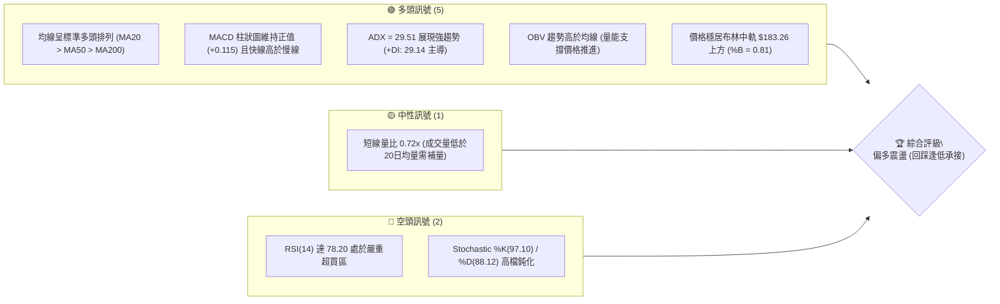
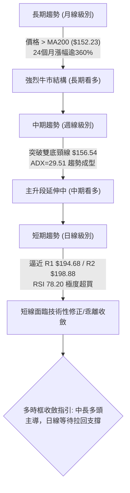
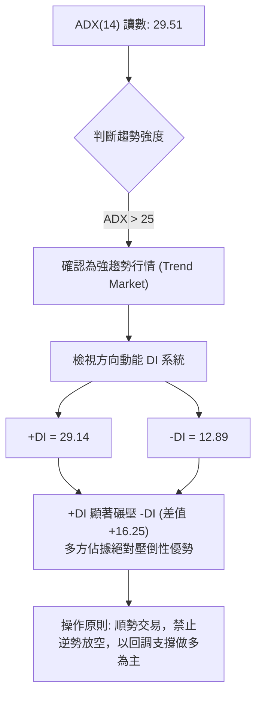
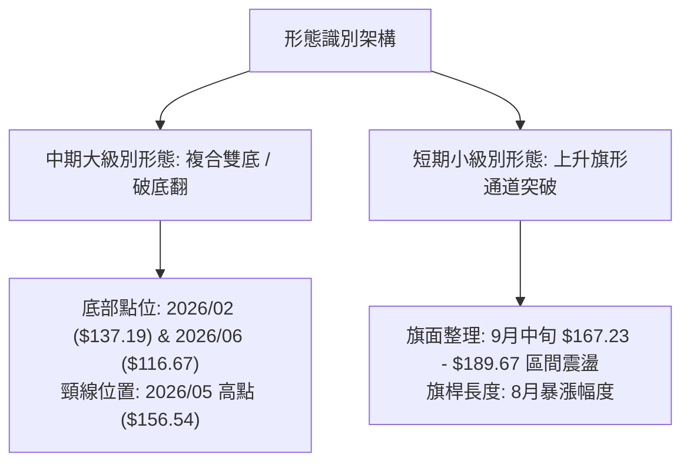
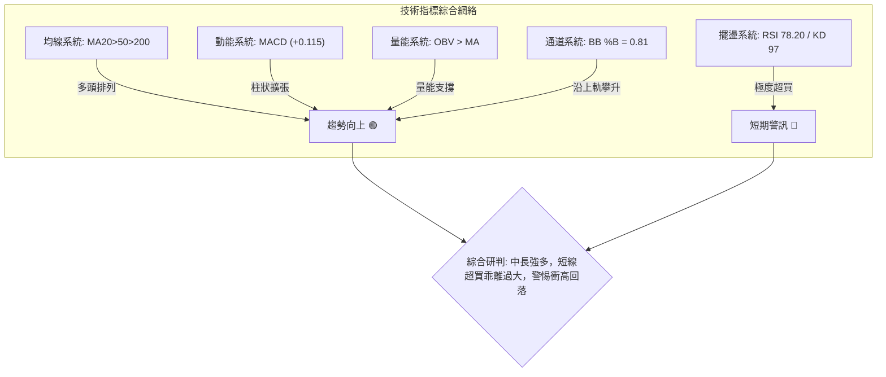
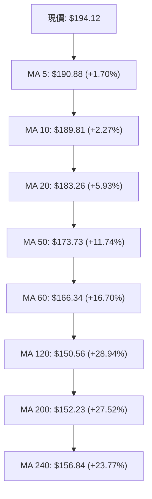
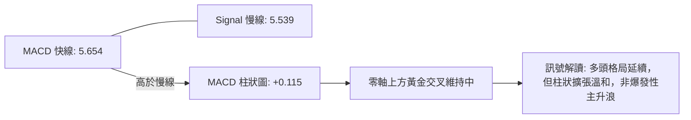
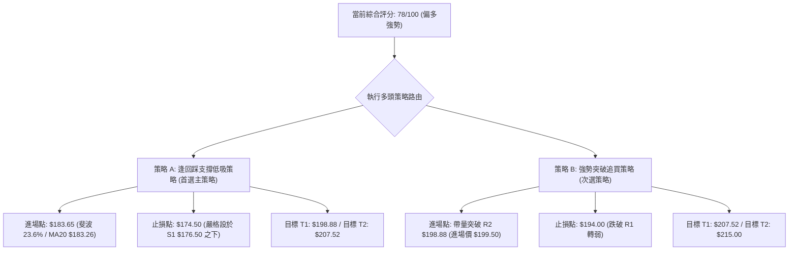
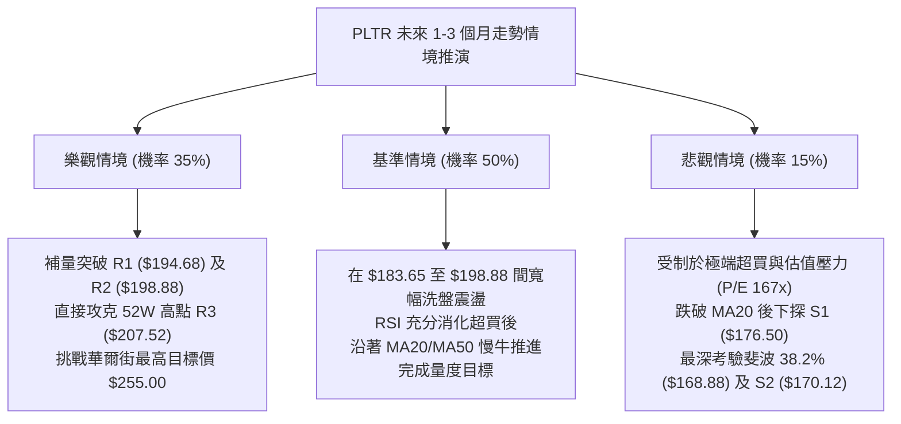

# PLTR 技術分析報告

> **報告日期**：2026-10-08 ｜ **語言**：繁體中文 ｜ **數據來源**：Yahoo Finance ｜ **當前價格**：$194.12

---

## 目錄

| 章節 | 內容 |
|------|------|
| [1. 技術面概覽](#1-技術面概覽) | 訊號儀表板、核心指標、評分卡 |
| [2. 趨勢分析](#2-趨勢分析) | 多時框趨勢、長中短期走勢、ADX強趨勢解讀 |
| [3. 圖表形態分析](#3-圖表形態分析) | 形態識別信心度、K線組合、目標價測算 |
| [4. 支撐與阻力](#4-支撐與阻力) | 關鍵價位結構、斐波那契回調精準錨定 |
| [5. 技術指標深度解讀](#5-技術指標深度解讀) | MA多頭排列、RSI超買、MACD金叉、布林與OBV量能 |
| [6. 動能與波動率](#6-動能與波動率) | 動能四象限、ATR波動風險、Beta高彈性解讀 |
| [7. 多時框架總結](#7-多時框架總結) | 時框架評分矩陣、多時框收斂與方向定調 |
| [8. 交易策略建議](#8-交易策略建議) | 單一主策略導向、精確點位、風險報酬比與對沖提示 |
| [9. 風險提示與監控](#9-風險提示與監控) | 關鍵監控清單、情境推演與風控原則 |

---

## 1. 技術面概覽

### 🎯 技術訊號儀表板



### 📊 核心指標速覽表

| 指標類別 | 指標名稱 | 當前數值 | 訊號 | 解讀 |
|----------|----------|----------|------|------|
| **價格** | 當前價格 | $194.12 | 🟢 | 站穩所有均線，距離 52W 高點僅 6.90% |
| **均線** | MA20 | $183.26 | 🟢 | 現價高於 MA20 達 +5.93%，短中期多頭支撐穩固 |
| **均線** | MA50 | $173.73 | 🟢 | 現價高於 MA50 達 +11.74%，中期波段多頭排列 |
| **均線** | MA200 | $152.23 | 🟢 | 現價高於 MA200 達 +27.52%，長線牛市格局未破 |
| **動能** | RSI(14) | 78.20 | 🔴 | 進入極度超買區，短線追高風險極高，隨時有技術性回洗需求 |
| **動能** | MACD(12,26,9) | 5.654 / 5.539 / +0.115 | 🟢 | 零軸上方維持多頭發散，柱狀圖正向微幅擴張 |
| **動能** | Stoch %K / %D | 97.10 / 88.12 | 🔴 | 隨機指標超買嚴重，極度貼近超買極值 100 |
| **趨勢** | ADX(14) / ±DI | 29.51 (+DI: 29.14) | 🟢 | ADX > 25，確認進入強多頭趨勢行情 |
| **波動** | ATR(14) | $5.50 (2.83%) | 🟡 | 每日波動幅度中等偏高，提供充足的波段操作空間 |
| **通道** | Bollinger %B | 0.81 (帶寬 $165.53-$200.99) | 🟢 | 價格沿布林中軌與上軌間運行，強勢攻擊結構 |
| **籌碼/量能**| 成交量 / OBV | 15.69M (0.72x) / OBV > MA | 🟡 | 量能未爆量但 OBV 穩定抬升，健康洗盤縮量走高 |

### 🏆 技術評分卡

```
╔══════════════════════════════════════════════════════════════════════╗
║                    技術評分卡 — PLTR (2026-10-08)                    ║
╠══════════════════════════════════════════════════════════════════════╣
║ 趨勢強度 (ADX=29.51, +DI主導)  ████████████████░░░░  80/100  🟢 看多 ║
║ 動能指標 (MACD偏多 / RSI極端)  ████████████░░░░░░░░  60/100  🟡 中性 ║
║ 支撐穩定度 (均線與聚類層層保護)████████████████░░░░  80/100  🟢 看多 ║
║ 成交量配合 (OBV創高但短量不足) ██████████████░░░░░░  70/100  🟢 看多 ║
║ 形態完整度 (雙重底突破後上行)  ████████████████░░░░  80/100  🟢 看多 ║
║ 均線排列 (MA5>10>20>60>120)    ████████████████████ 100/100  🟢 看多 ║
╠══════════════════════════════════════════════════════════════════════╣
║ 綜合技術評分                   ███████████████░░░░░  78/100  🟢 強勢 ║
╚══════════════════════════════════════════════════════════════════════╝
```

---

## 2. 趨勢分析

### 🌐 多時框趨勢分析



### 📈 長期趨勢 — 12個月走勢圖（Unicode）

以下展示自 2025 年 10 月至 2026 年 10 月的月線收盤價歷史軌跡：

```
PLTR 月線走勢圖（2025-10 至 2026-10）
價格軸 ($)
$210 ┤                                                               
$200 ┤ ● (200.47)                                                    
$190 ┤                                                       ●   ● (194.12 現價)
$180 ┤         ●                                         ●   (187.05)
$170 ┤     ●   (177.75)                                  (186.38)    
$160 ┤     (168.45)                                  ●               
$150 ┤                 ●                 ●           (156.54)        
$140 ┤                 (146.59)      ●   (146.28)                    
$130 ┤                     ●         (139.11)                        
$120 ┤                     (137.19)                      ●           
$110 ┤                                               ●   (123.06)    
$100 ┤                                               (116.67 波段低點)
     └─┬───────┬───────┬───────┬───────┬───────┬───────┬───────┬───────┬───────┬───────┬───────┬─
      10月    11月    12月    01月    02月    03月    04月    05月    06月    07月    08月    09月   10月
     (2025)                                                  (2026)                                 
```

#### 走勢特徵分析表格

| 階段區間 | 起止價格 | 漲跌幅 | 結構特徵與成交動能 | 技術意義 |
|----------|----------|--------|--------------------|----------|
| **高檔回撤期**<br>(2025/10 - 2026/02) | $200.47 → $137.19 | -31.57% | 自歷史高點震盪回落，跌破短期支撐，量能逐步收縮 | 大級別牛市中的健康去槓桿調整波 |
| **築底蓄勢期**<br>(2026/02 - 2026/05) | $137.19 → $156.54 | +14.10% | 在 $137 - $146 區間震盪築底，5月一度反彈至 $156.54 | 籌碼沉澱，構築中期底部結構 |
| **終極洗盤期**<br>(2026/06 - 2026/07) | $156.54 → $116.67 | -25.47% | 6月單月大跌，觸及近一年波段低點 $106.37 附近，成交量放大至 2.71 億股 | 假跌破誘空，測試 52W 低點 $106.37 形成堅實底部 |
| **強勢主升期**<br>(2026/08 - 2026/10) | $123.06 → $194.12 | +57.74% | 8月單週爆出 4.35 億股巨量拉升，連續跨越 MA50、MA20，V型反轉上攻 | 實質法人買盤進駐，開啟新一輪大級別上升浪 |

### 📊 中期趨勢（週線分析）

近期 20 週數據展現出強烈的「洗盤 - 爆量反轉 - 高檔整固 - 再次推升」特徵：
- **關鍵反轉週（2026-08-09）**：收盤價自前週 $123.06 暴拉至 $172.01，週成交量放大至 435,164,800 股，MACD 柱狀圖由負轉正跳升至 +4.790，確認中級底確立。
- **高檔蓄勢（2026-09）**：在 $167.23 至 $189.67 區間形成洗盤換手，消化 8 月暴漲獲利盤。
- **再次攻堅（2026-10）**：最新週線收盤 $194.12，MACD 柱狀圖回升至 +0.115，多頭再度掌握主動權。

```
近期週線關鍵位示意：
  阻力位：R3 $207.52 ──── (52週最高點，終極考驗)
          R2 $198.88 ──── (波段高點阻力)
          R1 $194.68 ──── (當前近距壓制，現價 $194.12 叩關中)
  -------------------------------------------------------------
  支撐位：S1 $176.50 ──── (9月下旬回調平台與波段支撐)
          MA50 $173.73 ── (中期生命線支撐)
          S2 $170.12 ──── (波段次級支撐)
```

### ⚡ 趨勢強度評估（ADX 解讀）



#### ADX 趨勢強度對照表

| ADX 區間 | 趨勢狀態 | PLTR 當前狀態 (29.51) | 交易策略建議 |
|----------|----------|-----------------------|--------------|
| 0 - 20 | 無趨勢 / 盤整震盪 | ✕ | 網格交易 / 高拋低吸 |
| 20 - 25 | 趨勢正在醞釀 | ✕ | 突破確認後順勢進場 |
| **25 - 40** | **強趨勢 (Strong Trend)** | **✓ (當前 29.51)** | **嚴格順應中長線多頭，以支撐位買進為主** |
| 40 - 50 | 極強趨勢 | ✕ | 移動止盈保護利潤 |
| 50 - 100 | 超強趨勢 / 隨時力竭反轉 | ✕ | 分批止盈，謹防噴出見頂 |

---

## 3. 圖表形態分析

### 🔍 形態識別系統



#### 形態識別與信心度評估表

| 形態名稱 | 信心度 | 判斷依據（引用數據） | 完成度 | 目標價（附嚴格計算式） |
|----------|--------|----------------------|--------|------------------------|
| **破底翻雙重底**<br>(W-Bottom) | **85%** | 兩次低點分別為 2026-02 的 $137.19 與 2026-06/07 的 $116.67/$123.06。2026-08 以 4.35 億股爆量長紅突破 2026-05 頸線 $156.54。 | 100% (已突破並完成回踩) | 由形態高度推算：<br>頸線 $156.54 - 底部低點 $116.67 = 形態高度 $39.87。<br>量度目標 = 頸線 $156.54 + $39.87 = **$196.41**。<br>（現價 $194.12 已高度逼近此目標區） |
| **高檔上升旗形**<br>(Bull Flag) | **70%** | 8月巨幅拉升為旗桿，9月於 $167.23 至 $189.67 進行三角/旗形收斂縮量整理，10月初以收盤 $194.12 正式向上突破旗面整理上軌。 | 90% (突破確認，進行延伸浪) | 由旗桿高度推算：<br>旗桿起點 $123.06 至旗桿頂部 $186.29（高差 $63.23）。<br>旗面回撤低點為 2026-09-13 之 $167.23。<br>延伸理論極限目標 = $167.23 + $63.23 = **$230.46**。<br>（受限於 52W 高點 R3 $207.52 之實質阻力壓制） |
| **頭肩底形態** | 40% | 數據中左肩與右肩對稱性較差（左肩 $137.19，頭部 $116.67，右肩回調不明顯直接拉起）。 | <50% | **訊號不足，信心度低於50%，僅做指標型與均線解讀，不予強行測算目標價。** |

### 🕯️ 重要K線形態分析

| 日期 / 週期 | 收盤價 | K線形態特徵 | 內在市場結構解讀 | 技術訊號 |
|-------------|--------|-------------|------------------|----------|
| **2026-08-09** | $172.01 | **爆量突破大陽線** | 週成交量激增至 435M 股，強勢越過 MA50 與頸線 $156.54，主力資金暴力進場掃盤 | 🟢 強烈買進訊號 |
| **2026-09-13** | $167.23 | **縮量回踩十字星/下影線**| 週成交量驟降至 81.68M 股（極度窒息量），回踩 38.2% 斐波那契 $168.88 獲得強撐 | 🟢 經典縮量回洗確認 |
| **2026-09-27** | $189.67 | **多頭反包中長陽** | 經過連續兩週整理後，週陽線實體收復短期均線，MACD 柱狀圖由 -3.155 翻正至 +1.024 | 🟢 整理結束發動訊號 |
| **2026-10-11** | $194.12 | **高檔推升小陽線** | 現價推升至 $194.12，直逼阻力位 R1 $194.68，上方略帶壓制但均線持續墊高 | 🟡 偏多但需防震盪 |

### 📉 ASCII 走勢形態示意圖

```
PLTR 中期破底翻雙底與上升旗形突破示意圖
========================================================================
$207.52 ┤                                             [R3 歷史高點阻力]
$198.88 ┤                                    ▲        [R2 阻力]
$194.12 ┤                                   ● 現價 ── [挑戰 R1 $194.68]
$183.26 ┤                             /───/  (旗形突破) [MA20/斐波 23.6%]
$167.23 ┤                   ●───────/───/ (旗面整理低點)
$156.54 ┤       ●───────────┼ (頸線突破點) ──────────── [2026-05 波段高點]
        │      / ＼         │
$137.19 ┤     ●   ＼       │                          [第一底 (2026-02)]
        │    (底1)  ＼     │
$116.67 ┤             ＼  ●                           [第二底/破底翻 (2026-06)]
        │                (底2 誘空洗盤)
========================================================================
```

### 🎯 形態目標價計算

1. **破底翻雙底量度目標**：
   - 形態底部低點：$116.67（2026-06 收盤價）
   - 頸線壓制位：$156.54（2026-05 收盤價）
   - 垂直高度 $H = \$156.54 - \$116.67 = \$39.87$
   - **量度滿足位 = 頸線 + H = \$156.54 + \$39.87 = \$196.41**
   - *解讀*：當前價格 $194.12 距離 $196.41 僅一步之遙（+1.18%），代表第一波大形態測算滿足位即將抵達，短線在此區域將遭遇實質阻力聚類（R1 $194.68 與 R2 $198.88）。

2. **後續趨勢延伸目標**：
   - 若有效帶量突破 R2 $198.88，下一個絕對目標為 52 週高點 **R3 $207.52**。

---

## 4. 支撐與阻力

### 🗺️ 關鍵價位分布圖（Unicode）

```
PLTR 價位結構分布圖 (依 OHLCV 與斐波那契精確錨定)
════════════════════════════════════════════════════════════════════════════
$207.52 ║██████████████████████████████████████████║ 強阻力 R3 (52W High / 斐波 0.0%)
$198.88 ║██████████████████████████████        ║ 次級阻力 R2 (波段高點聚類)
$194.68 ║████████████████████████████████████  ║ 即時阻力 R1 (波段高點壓制 +0.29%)
$194.12 ╠══════════════════════════════════════╣ ◄ 現價 (Current Price)
$183.65 ║▓▓▓▓▓▓▓▓▓▓▓▓▓▓▓▓▓▓▓▓▓▓▓▓▓▓▓▓▓▓        ║ 關鍵動態支撐 (斐波 23.6% / MA20 $183.26)
$176.50 ║▓▓▓▓▓▓▓▓▓▓▓▓▓▓▓▓▓▓▓▓▓▓▓▓                ║ 關鍵支撐 S1 (近一年波段低點聚類 -9.08%)
$170.12 ║████████████████████████████████████  ║ 強支撐 S2 (波段低點聚類 -12.36%)
$168.88 ║████████████████████████████████████  ║ 結構支撐 (斐波 38.2% 回調位)
$165.45 ║██████████████████████████████████████║ 終極防線 S3 (波段低點聚類 / BB下軌 $165.53)
════════════════════════════════════════════════════════════════════════════
```

### 🚧 阻力位分析表

所有阻力價位嚴格引用自關鍵價位聚類數據：

| 阻力級別 | 價位 | 形成原因 | 突破難度 | 重要性 |
|----------|------|----------|----------|--------|
| **R1** | **$194.68** | 近一年波段高點聚類，距離現價僅 +0.29%，為短線多頭叩關第一卡口 | 中等 | ★★★☆☆<br>短線多空分水嶺 |
| **R2** | **$198.88** | 歷史 $200 整數關卡前波段高點密集成交區，距離現價 +2.45% | 高 | ★★★★☆<br>波段進攻核心防線 |
| **R3** | **$207.52** | 52週歷史最高點聚類（斐波那契 0.0%），距離現價 +6.90%，獲利了結盤盤踞 | 極高 | ★★★★★<br>歷史極值與終極考驗 |

### 🛡️ 支撐位分析表

所有支撐價位嚴格引用自關鍵價位聚類數據：

| 支撐級別 | 價位 | 形成原因 | 守住機率 | 重要性 |
|----------|------|----------|----------|--------|
| **S1** | **$176.50** | 近一年波段低點聚類，9月震盪箱體下緣平台，距離現價 -9.08% | 75% | ★★★★☆<br>回調第一道防線 |
| **S2** | **$170.12** | 波段低點聚類，緊鄰斐波那契 38.2% ($168.88)，距離現價 -12.36% | 85% | ★★★★★<br>波段牛熊生命線 |
| **S3** | **$165.45** | 波段低點聚類，重合布林通道下軌 $165.53 及 MA60 ($166.34)，距離現價 -14.77% | 95% | ★★★★★<br>強支撐底部防線 |

### 📐 斐波那契回調位分析

依據 52 週完整波動區間（低點 $106.37 → 高點 $207.52，總落差 $101.15）精確標定：

| 斐波那契比例 | 基準價位 | 當前價格相對位置與技術意義 |
|--------------|----------|----------------------------|
| **0.0% (52W High)** | **$207.52** | 全年最高點，亦為阻力位 R3，構成上方最強天花板 |
| **23.6%** | **$183.65** | **現價 ($194.12) 正位於 0.0% ($207.52) 與 23.6% ($183.65) 之間**。<br>此處與 MA20 ($183.26) 形成強烈的「均線-斐波重合支撐區」，是健康回調的首選承接帶。 |
| **38.2%** | **$168.88** | 強力回撤支撐，緊鄰支撐位 S2 ($170.12)，9月中旬最低拉回至 $167.23 即在此止跌回升。 |
| **50.0%** | **$156.95** | 多空平衡中軸，重合 2026-05 頸線高點 $156.54，跌破則宣告牛市節奏瓦解。 |
| **61.8%** | **$145.01** | 黃金分割防守位，對應 2026-01/03 築底箱體區間。 |
| **78.6%** | **$128.02** | 深度回撤位，對應 2026-07 洗盤平台。 |
| **100.0% (52W Low)**| **$106.37** | 全年最低點，終極多頭起漲發動點。 |

---

## 5. 技術指標深度解讀

### 🎛️ 指標訊號總覽



### 📈 移動平均線排列分析



#### 均線狀態解讀
- **絕對多頭排列**：短期均線（MA5、MA10、MA20）由上至下依序排列，且斜率全部向上，證明短線買盤強勁。
- **黃金交叉架構**：MA20 ($183.26) 遠高於 MA50 ($173.73)，且 MA50 穩居 MA200 ($152.23) 之上，屬於標準的中長期牛市均線架構。
- **均線乖離率**：現價距離 MA20 乖離為 +5.93%，距離 MA50 為 +11.74%，乖離率處於偏高但尚未失控之水準，顯示趨勢延伸仍具韌性。

### 📉 RSI(14) 分析

```
RSI(14) 當前水平: 78.20 (超買警戒區間)
0 ──── 30 (超賣) ──────────── 50 (中軸) ────────── 70 (超買) ── 78.20 ── 100
[░░░░░░░░░░░░░░░░░░░░░░░░░░░░░░░░░░░░░░░░░░░░░░░░░░░░░███████████░░░░░░] 78.2%
```

- **超買超賣判定**：RSI(14) 讀數為 **78.20**，大幅穿越 70 超買警戒線。歷史數據顯示，當 PLTR 週線與日線 RSI 同步越過 75 時（如 2026-08-23 之 79.0），隨後多伴隨 1-2 週的橫盤或回踩修正（隨後 9 月回調至 RSI 40.8）。
- **背離分析判斷**：
  - 當前 RSI 隨價格創出近期新高而抬升，與價格走勢同向。
  - **結論**：**RSI 無明顯頂背離現象**。當前的高 RSI 反映的是極其強勁的單邊推升動能，而非動能衰竭。然而，在未出現背離的超買狀態下，雖不宜盲目放空，但切忌在 R1 ($194.68) 前進行市價追高。

### 📊 MACD(12/26/9) 訊號解讀



- **數值分析**：DIF (5.654) 穩居零軸之上，並持續領先 DEA (5.539)，柱狀圖讀數為 **+0.115**。
- **背離分析判斷**：回顧 2026-08-09 柱狀圖高達 +4.790，目前價格雖高於當時（$194.12 vs $172.01），但 MACD 柱狀圖僅為 +0.115，快慢線數值亦處於修復期。這顯示中期動能自 8 月初的「爆發期」轉入「推升整固期」，**中級動能存在微幅弱化但無實質空頭死叉**，多頭結構依然完好。

### 📦 布林通道分析

```
PLTR 布林通道 (20, 2) 結構示意圖
─────────────────────────────────────────────────────────────
$200.99  ┬  ─────────────────────── 上軌 (Upper Band)
         │       ● $194.12 (現價, %B = 0.81)
$183.26  ┼  ═══════════════════════ 中軌 (MA20)
         │  
$165.53  ┴  ─────────────────────── 下軌 (Lower Band)
─────────────────────────────────────────────────────────────
帶寬帶距: $35.46 (通道呈現擴張開口狀，支持單邊向上運行)
```

- **通道位置**：%B 值為 **0.81**，價格位於中軌（$183.26）與上軌（$200.99）之間的「強勢推進區」。
- **通道形態**：布林通道上下軌呈現喇叭口擴張形態，上軌向上抬升至 $200.99，為多頭打開向上測試阻力位 R2 ($198.88) 及 R3 ($207.52) 的空間。

### 💹 成交量分析（量價配合度）

- **量能規模**：最新成交量為 15,697,200 股，相較於 20 日均量 21,941,220 股，**量比僅為 0.72x**；相較於 50 日均量 33,322,734 股則更顯偏低。
- **量價關係解讀**：
  - 現價逼近阻力位 R1 ($194.68)，但單日成交量未達 20 日均量水準，呈現「價漲量縮」的短線背離隱憂。
  - **OBV（能量潮）分析**：儘管日量縮小，但整體 OBV 指標依然穩居其均線上方（`OBV > MA`），表明自 8 月以來機構買盤並未出現派發離場跡象，當前的量縮更偏向於「籌碼鎖定良好、無大量解套拋壓」的良性推升，但若欲實質突破 R2 ($198.88) 與 R3 ($207.52)，必須補量至 2,500 萬股以上。

---

## 6. 動能與波動率

### ⚡ 動能評估四象限

| 象限 | 動能強度 (Momentum) | 波動率水準 (Volatility) | 當前判定 | 市場環境與策略意涵 |
|------|---------------------|-------------------------|----------|--------------------|
| **Q1 (高動能 / 低波動)** | 強 | 低 | ✕ | 穩定牛皮緩漲，適合重倉持有 |
| **Q2 (低動能 / 低波動)** | 弱 | 低 | ✕ | 沉悶盤整，觀望等待方向 |
| **Q3 (強動能 / 高波動)** | **強 (ADX 29.51, RSI 78.2)** | **高 (Beta 1.602, ATR 2.83%)** | **✓ PLTR 目前所處位置** | **高彈性強趨勢行情。上漲爆發力強，但回撤亦猛烈。嚴禁追高，需設定寬幅動態止損。** |
| **Q4 (弱動能 / 高波動)** | 弱 | 高 | ✕ | 混亂震盪或破位暴跌，風險極高，避免進場 |

### 📊 ATR 波動率分析

- **當前 ATR(14)**：**$5.50**（佔現價比率為 **2.83%**）。
- **日內/波段波動性**：PLTR 具備每日約 $5.50 的固有波動區間。這意味著單日振幅在 ±$5.50（現價區間 $188.62 - $199.62）均屬正常雜訊範圍。
- **止損距離建議**：
  - **短線交易止損**：至少需設置 1.5 倍 ATR = $1.5 \times \$5.50 = \$8.25$（現價下方 $185.87）。
  - **波段交易止損**：建議設置 2.0 至 2.5 倍 ATR = $2.0 \times \$5.50 = \$11.00$，即保護點應設於 $183.12 附近，恰好與 MA20 ($183.26) 及斐波那契 23.6% ($183.65) 強力支撐帶高度共振。

### 📐 Beta 與市場相關性

- **Beta 係數**：**1.602**（高彈性成長股特性）。
- **市場敏感度**：PLTR 的波動幅度約為 S&P 500 指數的 1.6 倍。在美股大盤走強時具備顯著的超額報酬（Alpha），但在宏觀市場流動性收緊或科技板塊殺估值時，其回撤幅度亦會放大。當前高達 167 倍的 Trailing P/E，使得市場情緒一旦轉向避險，高 Beta 將加劇向下波動。

---

## 7. 多時框架總結

### 📋 時框架評分表

| 時框架 | 趨勢方向 | 動能狀態 | 均線排列 | 圖表形態 | 綜合評分 | 建議操作節奏 |
|--------|----------|----------|----------|----------|----------|--------------|
| **月線級別** (長期) | 🟢 強烈看多 | 🟢 多頭掌控 | 🟢 MA200之上 | 複合大底向上突破 | **85/100** | 核心多頭底倉持股續抱 |
| **週線級別** (中期) | 🟢 強烈看多 | 🟢 MACD金叉維持 | 🟢 多頭排列 | 爆量突破頸線後整固 | **80/100** | 波段順勢做多，逢拉回加碼 |
| **日線級別** (短期) | 🟡 偏多震盪 | 🔴 RSI極度超買 | 🟢 均線發散 | 逼近 R1 阻力且量縮 | **65/100** | 暫停追高，耐心等待回踩 |

### 🔲 綜合訊號矩陣

| 維度 | 短期 (日線) | 中期 (週線) | 長期 (月線) | 訊號一致性評估 |
|------|-------------|-------------|-------------|----------------|
| **趨勢方向** | 偏多 (+1) | 看多 (+2) | 看多 (+2) | **高度一致 (趨勢共振偏多)** |
| **均線架構** | 看多 (+2) | 看多 (+2) | 看多 (+2) | **完美共振 (所有均線皆呈支撐)** |
| **動能指標** | 超買/警訊 (-1)| 強勢延續 (+1) | 偏多發散 (+2) | **短線出現超買分歧，需防局部修正** |
| **成交量能** | 縮量中性 (0) | 巨量支撐 (+2) | 溫和放大 (+1) | **長多格局確認，短線動能略顯不足** |

### ⚖️ 多時框收斂結論

依據多時框收斂規則第 14 條嚴格執行收斂：
1. **行情屬性判定**：當前 PLTR 的 ADX(14) 讀數為 **29.51**，明確大於 25 臨界值，因此定性為**典型的「強趨勢行情」**。
2. **時框優先級權重**：依規則，趨勢行情下以中長期（週線、MA50 $173.73、MA200 $152.23）趨勢方向為主導，日線層級僅作為精確進場時機與風控點位的過濾器。
3. **分歧處理與唯一方向性定調**：日線 RSI 78.20 的極度超買僅代表短線隨時可能引發技術性洗盤或橫盤，無法逆轉中長期週線破底翻與均線多頭排列之大勢。
4. **唯一結論**：**整體格局定調為「中長期強烈看多，短線偏多震盪等待回踩」**。主導操作方向為**偏多逢低承接**，堅決不盲目追高，亦嚴禁逆勢做空。

---

## 8. 交易策略建議

### 🗺️ 策略決策流程圖



### 🧭 策略路由（依評分卡分流）

> **當前主策略方向 = 多頭回踩承接（依綜合評分 78/100，≥60 明確偏多）**  
> 基於技術評分達 78 分，本報告**主推多頭策略**，將空頭僅列為反轉風控防線，不給予主動放空建議。

### 🎯 價格情境階梯（Price Scenarios）

價位嚴格引用自關鍵價位與支撐阻力結構表：

| 觸發條件 | 下一目標 | 後續延伸 | 情境含義 |
|----------|----------|----------|----------|
| **強勢突破 R1 $194.68 且站穩** | R2 $198.88 | R3 $207.52 | 短線動能爆發，挑戰 52 週歷史高點 |
| **於 $183.65 至 $194.68 震盪** | — | — | 消化 RSI 超買，以時間換取空間之良性洗盤 |
| **跌破動態支撐 $183.26 (MA20)** | S1 $176.50 | S2 $170.12 | 短線趨勢轉弱，進入深度波段回撤修正 |

### 📊 情境機率分佈

| 情境劃分 | 機率預估 | 主要技術指標支撐依據 |
|----------|----------|----------------------|
| **高檔強勢震盪後上行** | **60%** | MACD維持正值 (+0.115)、ADX 29.51 趨勢主導、OBV 趨勢高於均線支持量能墊高 |
| **技術性回踩 MA20 支撐** | **30%** | RSI(14) 高達 78.20 處於嚴重超買，Stochastic KD 97.10 鈍化，短線存在去乖離需求 |
| **轉折深度破位下跌** | **10%** | 均線系統全面多頭排列形成多重護城河，除非跌破 S2 $170.12，否則機率極低 |

### 🟢 主策略詳情

所有進出場與止損點位均基於精確數據與 ATR / 支撐阻力測算：

| 策略要素 | 策略 A（首選：支撐回踩承接波段策略） | 策略 B（次選：右側帶量突破跟進策略） |
|----------|---------------------------------------|---------------------------------------|
| **進場條件** | 價格回調至斐波那契 23.6% 與 MA20 支撐區，日K線收出下影線確認企穩 | 盤中帶量（單日量預估 >25M）實質突破 R2 $198.88 阻力點 |
| **進場價格** | **$183.65** | **$199.50** |
| **止損價格** | **$174.50**（位於波段支撐 S1 $176.50 下方，且低於進場點約 1.66 倍 ATR） | **$194.00**（跌破突破平台及 R1 $194.68 關鍵轉換位立即離場） |
| **目標價 T1** | **$198.88**（測試波段高點 R2 阻力） | **$207.52**（測試 52W 歷史高點 R3） |
| **目標價 T2** | **$207.52**（測試 52W 歷史高點 R3） | **$215.00**（突破歷史高點後之心理整數延伸位） |
| **風險額度 (Risk)**| $183.65 - $174.50 = **$9.15** | $199.50 - $194.00 = **$5.50** (剛好 1.0 ATR) |
| **潛在報酬 (Reward)**| 至 T2: $207.52 - $183.65 = **$23.87** | 至 T2: $215.00 - $199.50 = **$15.50** |
| **風險報酬比 (R:R)**| **1 : 2.61** (極佳) | **1 : 2.82** (良好) |
| **預估勝率** | **68%** | **55%** |
| **建議總倉位** | **15% - 20%**（分兩批進場） | **8% - 10%**（動態追蹤突破倉位） |

### 🔴 反向風險觸發點（對沖提示）

- **多頭結構失效關鍵位**：**$176.50（支撐位 S1）**。
  - 若日線連續兩日實體跌破 $176.50，代表近兩個月的上升波段正式終結，此時應全面終止做多策略。
- **對沖啟動訊號**：若價格失守 MA20 ($183.26) 且 MACD 於高檔形成向下死叉，多頭底倉應進行 30%-50% 的獲利了結，或買入對應比例的價外認沽期權（Put）進行下行風險覆蓋。

### ⭐ 整體訊號強度評星

```
做多訊號強度：★★★★☆  (4/5星 — 趨勢極佳，受限於短線超買扣1星)
做空訊號強度：★☆☆☆☆  (1/5星 — 逆勢放空風險極高，毫無勝算)
整體可信度：  ★★★★☆  (4/5星 — 多時框均線與趨勢指標高度一致)
```

---

## 9. 風險提示與監控

### ✅ 關鍵監控指標 Checklist

```
╔══════════════════════════════════════════════════════════════════════╗
║                    技術監控清單 (DAILY CHECKLIST)                    ║
╠══════════════════════════════════════════════════════════════════════╣
║ [ ] 價格能否有效收復並站穩 R1 ($194.68)？                             ║
║ [ ] 成交量是否回升至 20 日均量 (21.94M) 以上支持實質向上突破？        ║
║ [ ] RSI(14) 自 78.20 回落時是否能在 50-60 強勢區間獲得支撐？         ║
║ [ ] MA20 動態防守線 ($183.26) 與斐波 23.6% ($183.65) 是否完好？      ║
║ [ ] MACD 柱狀圖 (+0.115) 是否出現高檔死叉轉負的空頭警訊？            ║
║ [ ] 是否跌破 S1 ($176.50) 導致整體中級牛市防線崩塌？                  ║
╚══════════════════════════════════════════════════════════════════════╝
```

### ⚠️ 風險場景分析



### 🛡️ 風險管理重要提醒

1. **極端估值帶來的脆弱性**：PLTR 目前 Trailing P/E 高達 167.34，P/S 達 75.78。高倍數估值意味著市場已預先透支了極高的成長預期。儘管基本面營收年增 92.8%，但技術面若出現動能衰竭，高估值易引發無差別拋售。
2. **高 Beta 波動性控管**：Beta 值為 1.602，ATR 達 $5.50。投資人切忌在超買點位滿倉加槓桿。單筆交易承受風險（進場點與止損點之價差）不得超過總交易帳戶資金的 1.5% - 2.0%。
3. **法人籌碼異動監控**：機構持股比例達 64.7%，近期分析師（UBS、Rosenblatt、DA Davidson）雖密集給予「Buy」評級並給予平均目標價 $199.84，但目前價格 $194.12 距離平均目標價僅差 2.95%，意味著華爾街普遍預期此區域將迎來階段性評價重估，需提防法人在 $200 心理關卡前執行獲利了結。

---

## 📋 報告總結

```
╔══════════════════════════════════════════════════════════════════════╗
║                     PLTR 技術分析報告總結                          ║
╠══════════════════════════════════════════════════════════════════════╣
║ 報告日期：2026-10-08                                                 ║
║ 當前價格：$194.12                                                    ║
║ 分析評級：🟢 強勢偏多 (趨勢強勁，短線超買，建議拉回買進)            ║
╠══════════════════════════════════════════════════════════════════════╣
║ 關鍵結論：                                                           ║
║ ├─ 長期趨勢：🟢 強烈看多 (突破複合雙底頸線，站穩 MA200 之上)        ║
║ ├─ 中期趨勢：🟢 偏多主升 (ADX=29.51 確認強趨勢，均線完美多頭排列)   ║
║ ├─ 短期趨勢：🟡 偏多震盪 (RSI=78.20 極度超買，日線逼近 R1 $194.68) ║
║ ├─ 關鍵支撐：S1 $176.50 ｜ 動態防守線：MA20 $183.26                 ║
║ ├─ 關鍵阻力：R1 $194.68 ｜ R2 $198.88 ｜ R3 $207.52 (52W High)       ║
║ └─ 共識目標：分析師平均目標 $199.84 (最高 $255.00)                   ║
╠══════════════════════════════════════════════════════════════════════╣
║ 最優策略組合：                                                       ║
║ 1. 🥇 最佳機會：等待回踩斐波 23.6% ($183.65) / MA20 ($183.26) 承接， ║
║                 止損設於 $174.50，目標看 R2 $198.88 及 R3 $207.52。  ║
║ 2. 🥈 次選機會：若多頭強勢帶量實質站上 $198.88，順勢跟進，以短線      ║
║                 1.0 ATR ($194.00) 為動態移動止損，博取歷史新高。    ║
║ 3. 🥉 保守選擇：原有持股繼續沿 MA20 追蹤止盈，未持股者切忌追高，      ║
║                 耐心等待日線 RSI 回落至 60 以下再行佈局。            ║
╚══════════════════════════════════════════════════════════════════════╝
```

---

> ⚠️ **免責聲明**：本報告為 AI 自動生成之技術分析，所有數據及估算均基於提供的歷史價格資訊。本報告**僅供研究與學術參考**，**不構成任何投資建議**。投資有風險，入市需謹慎。

---

*報告生成時間：2026-10-08 ｜ 數據來源：Yahoo Finance ｜ 分析框架：多時框技術分析*