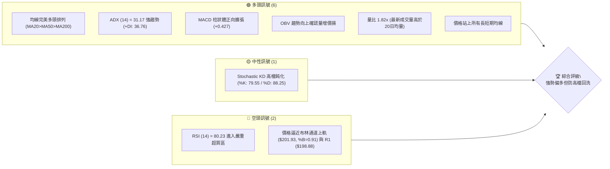
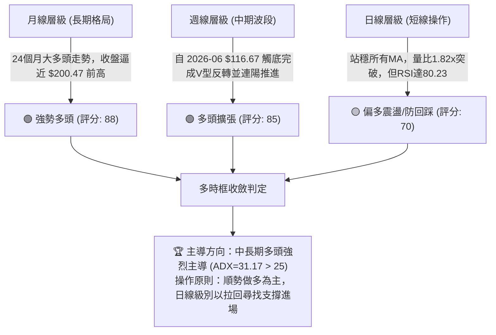
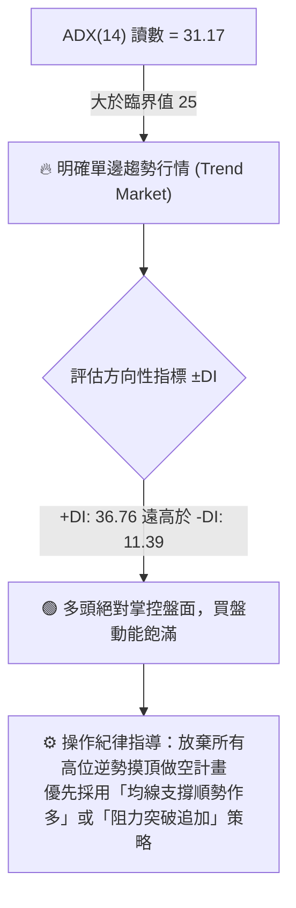
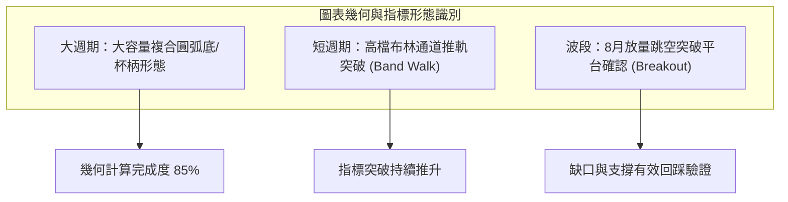
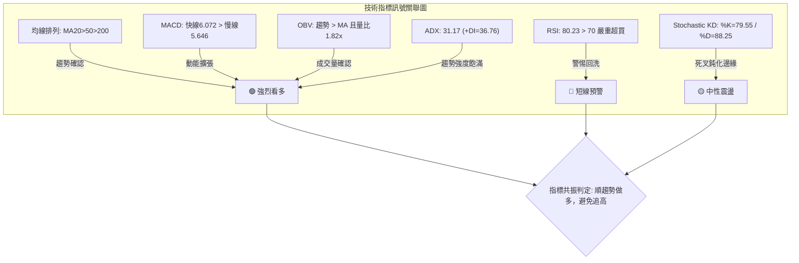
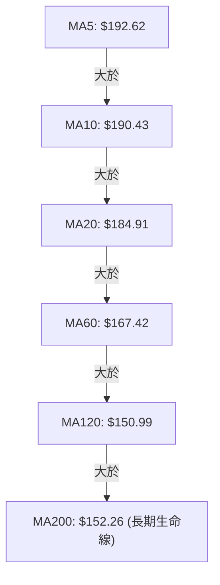
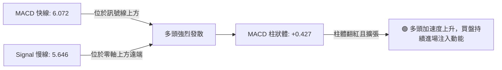
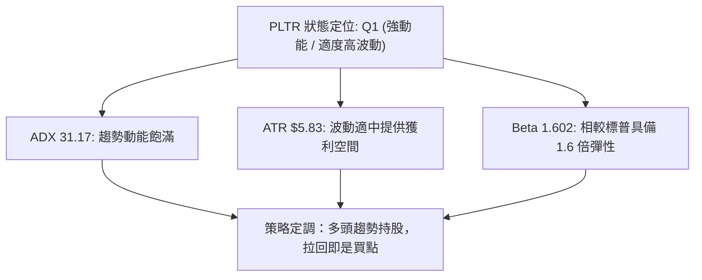
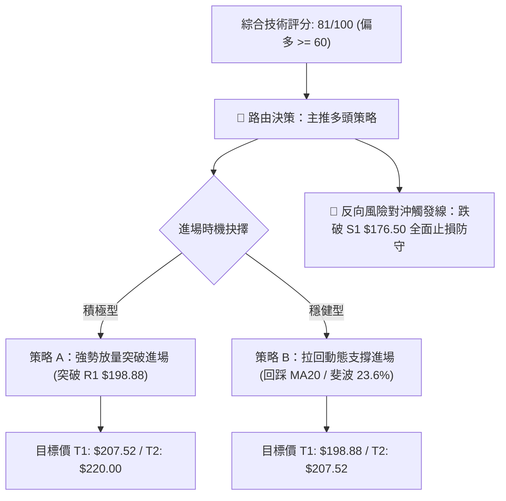
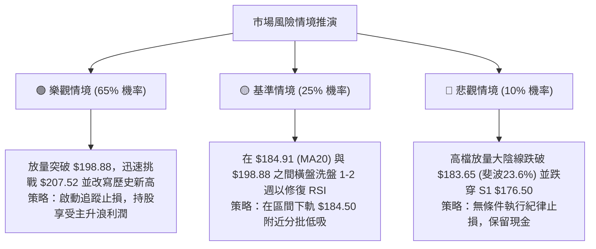

# PLTR 技術分析報告

> **報告日期**：2026-10-09 ｜ **語言**：繁體中文 ｜ **數據來源**：Yahoo Finance ｜ **當前價格**：$198.78

---

## 目錄

| 章節 | 內容 |
|------|------|
| [1. 技術面概覽](#1-技術面概覽) | 訊號儀表板、核心指標、評分卡 |
| [2. 趨勢分析](#2-趨勢分析) | 多時框趨勢、長中短期走勢 |
| [3. 圖表形態分析](#3-圖表形態分析) | 形態識別、K線組合、目標價 |
| [4. 支撐與阻力](#4-支撐與阻力) | 關鍵價位、斐波那契回調 |
| [5. 技術指標深度解讀](#5-技術指標深度解讀) | MA/RSI/MACD/布林/成交量 |
| [6. 動能與波動率](#6-動能與波動率) | 動能評估、ATR、Beta |
| [7. 多時框架總結](#7-多時框架總結) | 時框架評分矩陣 |
| [8. 交易策略建議](#8-交易策略建議) | 多空策略、風險報酬比 |
| [9. 風險提示與監控](#9-風險提示與監控) | 監控指標、風險場景 |

---

## 1. 技術面概覽

### 🎯 技術訊號儀表板



### 📊 核心指標速覽表

| 指標類別 | 指標名稱 | 當前數值 | 訊號 | 解讀 |
|----------|----------|----------|------|------|
| **價格** | 當前收盤價 | $198.78 | 🟢 | 位於52週區間頂端 91.4%，逼近歷史高位區間 |
| **均線** | 短期 MA20 | $184.91 | 🟢 | 價格在其上方 +7.50%，短線多頭掌控主導權 |
| **均線** | 中期 MA50 | $175.24 | 🟢 | 價格在其上方 +13.43%，中期生命線強勁支撐 |
| **均線** | 長期 MA200| $152.26 | 🟢 | 價格在其上方 +30.55%，長期牛市格局穩固 |
| **動能** | RSI(14) | 80.23 | 🔴 | 突破80門檻進入極端超買區，短線追高風險升高 |
| **動能** | MACD(12,26,9)| 6.072 (柱: +0.427) | 🟢 | 快慢線均在零軸上方發散，動能柱持續擴張 |
| **趨勢** | ADX / ±DI | ADX: 31.17 (+DI: 36.76) | 🟢 | ADX > 25 且 +DI 主導，強勢單邊多頭趨勢行情 |
| **通道** | 布林通道 | 上軌 $201.93 / %B: 0.91 | 🟡 | 價格緊貼通道上軌，通道張開，呈現推軌上行特徵 |
| **量能** | 當日量 vs 20MA | 41.80M vs 22.97M | 🟢 | 量比 1.82x，且 OBV > MA，量能完全確認價格上攻 |
| **波動** | ATR(14) | $5.83 (2.93%) | 🟡 | 日內平均振幅適中偏高，波動風險可控 |

### 🏆 技術評分卡

```
╔══════════════════════════════════════════════════════════════════╗
║               技術評分卡 — PLTR (2026-10-09)                    ║
╠══════════════════════════════════════════════════════════════════╣
║ 趨勢強度 (ADX/方向)   ████████████████░░░░  82/100  🟢 強勁多頭  ║
║ 動能指標 (RSI/MACD)   ████████████░░░░░░░░  65/100  🟡 動能強但超買║
║ 支撐穩定度 (結構支撐) ██████████████░░░░░░  72/100  🟢 梯級均線防護║
║ 成交量配合 (OBV/量比) ██████████████████░░  90/100  🟢 明顯量增價揚║
║ 形態完整度 (突破幾何) ██████████████░░░░░░  75/100  🟢 圓弧底延伸破頂║
║ 均線排列 (多空層次)   ████████████████████ 100/100  🟢 完美多頭發散║
╠══════════════════════════════════════════════════════════════════╣
║ 綜合技術評分          ████████████████░░░░  81/100  🟢 強烈偏多  ║
╚══════════════════════════════════════════════════════════════════╝
```

---

## 2. 趨勢分析

### 🌐 多時框趨勢分析



### 📈 長期趨勢 — 12個月走勢圖（Unicode）

```
PLTR 月線走勢圖（過去12個月：2025-11 至 2026-10）
價格軸 ($)
$205 ┤                                                  ● (52W高 $207.52)
$200 ┤                                           ●      │
$190 ┤                                        ●  │      ● ($198.78 現價)
$180 ┤     ●  ●                               │  │      │
$170 ┤  ●  │  │                            ●  │  │      │
$160 ┤  │  │  │                         ●  │  │  │      │
$150 ┤  │  │  │  ●        ●             │  │  │  │      │
$140 ┤  │  │  │  │  ●  ● │  ●          │  │  │  │      │
$130 ┤  │  │  │  │  │  │ │  │       ●  │  │  │  │      │
$120 ┤  │  │  │  │  │  │ │  │    ●  │  │  │  │  │      │
$110 ┤  │  │  │  │  │  │ │  │    │  │  │  │  │  │      │
$105 ┤  │  │  │  │  │  │ │  │ ● (波段低點 $106.37)      │
     └──┴──┴──┴──┴──┴──┴─┴──┴─┴──┴──┴──┴──┴──┴──┴───────
        11 12 01 02 03 04 05 06 07 08 09 10  (月份: 2025-11 → 2026-10)
```

#### 走勢特徵分析表格

| 階段區間 | 時間區間 | 起止價格 | 漲跌幅 | 成交量與走勢特徵 |
|----------|----------|----------|--------|------------------|
| **高檔回撤期** | 2025-11 ~ 2026-02 | $168.45 → $137.19 | -18.56% | 自 2025-10 高點 $200.47 獲利回吐，呈現縮量階梯式下行回調 |
| **築底震盪期** | 2026-03 ~ 2026-05 | $146.28 → $156.54 | +7.01%  | 在 $137~$156 區間來回打底，中期均線糾纏 |
| **終極下洗期** | 2026-06 ~ 2026-07 | $116.67 → $123.06 | -21.39% | 快速跌破區間創造 52 週低點 $106.37（洗盤清洗浮額），隨後快速縮量企穩 |
| **主升反轉期** | 2026-08 ~ 2026-10 | $186.38 → $198.78 | +61.53% | 連續放量大陽線噴出，完全吞噬前波跌幅，進入歷史高位蓄勢攻頂 |

### 📊 中期趨勢（週線分析）

```
PLTR 週線波段結構與支撐阻力示意圖
$207.52 ────────────────────────────────────────────── 52週歷史高點 / 阻力位 R2
$198.88 ───────────────────────────────────────▲────── 近期波段阻力 R1 (當前觸碰)
        │                                      │ (現價 $198.78)
$184.91 ┄┄┄┄┄┄┄┄┄┄┄┄┄┄┄┄┄┄┄┄┄┄┄┄┄┄┄┄┄┄┄┄┄┄┄┄┄│┄┄┄┄┄ 短期 MA20 / BB中軌
$183.65 ┄┄┄┄┄┄┄┄┄┄┄┄┄┄┄┄┄┄┄┄┄┄┄┄┄┄┄┄┄┄┄┄┄┄┄┄┄│┄┄┄┄┄ 斐波那契 23.6% 回調位
$176.50 ───────────────────────────────────────│────── 關鍵波段支撐位 S1
$169.42 ───────────────────────────────────────│────── 強支撐位 S2 / 斐波那契 38.2% ($168.88)
$152.26 ═══════════════════════════════════════│══════ 長期生命線 MA200
```

週線指標顯示，自 2026-08-09 週成交量暴增至 435,164,800 股收在 $172.01 以來，機構買盤極為集中。隨後 9 月中旬雖因獲利賣壓一度回踩至 $167.23（MACD柱出現 -3.155 之底背離洗盤），但 10 月以來連續三週放量拉升，最新收盤價 $198.78 創下週線收盤新高，確認中期多頭動能重啟。

### ⚡ 趨勢強度評估（ADX 解讀）



#### ADX 強度對照表

| ADX 數值區間 | 趨勢狀態 | 當前 PLTR 讀數 | 盤面狀態判定 |
|--------------|----------|----------------|--------------|
| 0 ~ 20 | 無趨勢 / 雜訊震盪 | — | 非盤整市況 |
| 20 ~ 25 | 趨勢醞釀 / 轉折期 | — | 已脫離過渡帶 |
| **25 ~ 40** | **強勢定向趨勢** | **31.17 (+DI=36.76)** | **處於強勢主升浪階段，趨勢持續性極高** |
| 40 ~ 60 | 極度強烈趨勢 | — | 未達極端過熱耗竭階段 |
| 60 以上 | 趨勢耗竭 / 隨時反轉 | — | 無趨勢耗竭風險 |

---

## 3. 圖表形態分析

### 🔍 形態識別系統



#### 形態識別信心度與目標推算表

| 形態類別 | 信心度 | 判斷依據（引用數據） | 完成度 | 目標價（附嚴謹計算式） |
|----------|--------|----------------------|--------|------------------------|
| **大週期圓弧底 (Cup with Handle)** | 78% | 左杯沿高點 2025-10 之 $200.47，杯底於 2026-06 探底 $116.67（低點 $106.37），柄部於 2026-09 洗盤回踩 $167.23 | 85% | 頸線約 $200.47，若正式實體站穩，形態高度 = $200.47 - $106.37 = $94.10。理論投射目標 = $200.47 + $94.10 = **$294.57**（中長線形態理論值；短線以 52W 高點 $207.52 為主） |
| **布林帶推軌突破 (Band-Walk)** | 82% | BB %B 達 0.91，價格緊貼上軌 $201.93 上行，且量比 1.82x 確認 | 90% | 由通道擴張推算，第一阻力壓制於聚類阻力 R1 **$198.88**，突破後直取 52W 高點 R2 **$207.52** |
| **短期矩形整理向上假跌破真突破** | 72% | 2026-09-13 回踩低點 $167.23 獲得支撐，隨後連拉四週長陽並於當週創 $198.78 收盤新高 | 100% | 整理區間低點 $167.23，區間高點 $186.29，高度 = $19.06。突破點 $186.29 + $19.06 = **$205.35**（逼近阻力 R2 $207.52） |

### 🕯️ 重要K線形態分析

| 月份 | 收盤價 | K線形態 | 解讀 | 訊號 |
|------|--------|---------|------|------|
| **2026-06** | $116.67 | 錘頭帶長下影線（打出 $106.37 52W低點） | 空頭動能衰竭，機構主力於 $106.37 進行非理性殺跌清洗 | 🟢 底背離轉折 |
| **2026-07** | $123.06 | 小實體紅紡錘線 | 賣壓耗竭，市場在底部區間充分換手，築底確立 | 🟢 止跌確認 |
| **2026-08** | $186.38 | 巨量吞噬大陽線（單月暴漲 +51.45%） | 爆發性買盤進場，週成交量突破 4.35 億股，確立主升浪啟動 | 🟢 極強攻擊 |
| **2026-09** | $187.05 | 高檔長十字星 / 孕線（High-Wave Candle） | 快速拉升後的換手整理，月內探底 $167.23 後迅速收復失地 | 🟡 高檔強勢換手 |
| **2026-10 (當前)** | $198.78 | 延續性大陽線推進 | 買盤突破 9 月整理高點，實體飽滿逼近整數大關 $200 | 🟢 多頭續攻 |

### 📉 ASCII 走勢形態示意圖

```
PLTR 杯柄與高檔推軌形態結構解剖圖
$207.52 ┤ (杯沿/阻力R2)                                     ? (理論目標 $205.35/$207.52)
$200.47 ┤ ●───────────頸線壓力區間───────────●             ▲
$198.78 ┤ │                                  │  現價 ─────┤ ($198.78 當前位置)
$186.29 ┤ │                                  │   ● (柄部突破)
$170.00 ┤ │   ●                          ●   │   │
$150.00 ┤ │  │  │                      │  │  │   │
$130.00 ┤ │  │  │   ●              ●   │  │  └───┘ (柄部回踩 $167.23)
$116.67 ┤ └──┼──┼───┼──────────────┼───┼──┘
$106.37 ┤     │  │   └───● (杯底)───┘   │
        └─────┴──┴───────┴──────────────┴───────────────
         2025-10      2026-06          2026-08   2026-10
```

### 🎯 形態目標價計算

1. **短期矩形箱體突破測算**：
   - 柄部箱體底部：2026-09 低點 $167.23
   - 柄部箱體頂部：2026-08-30 收盤價 $186.29
   - 箱體垂直高度：$186.29 - $167.23 = **$19.06**
   - 測算目標價 T1：$186.29 + $19.06 = **$205.35**（精準對應阻力 R2 $207.52 前緣）
2. **中期圓弧底頸線突破測算**：
   - 頸線參照點：2025-10 收盤價 $200.47
   - 形態底部：52W 低點 $106.37
   - 形態高度：$200.47 - $106.37 = **$94.10**
   - 測算目標價 T2：$200.47 + $94.10 = **$294.57**（長期形態滿足點，高於分析師最高目標價 $255.00）

---

## 4. 支撐與阻力

### 🗺️ 關鍵價位分布圖（Unicode）

```
PLTR 價位結構分布圖
═══════════════════════════════════════════════════════════════════
$207.52 ║████████████████████████████████║ 歷史強阻力 R2 (52W High / 斐波 0.0%)
$198.88 ║████████████████████████        ║ 關鍵波段阻力 R1 (+0.05% 觸碰中)
$198.78 ╠════════════════════════════════╣ ◄ 現價 ($198.78)
$184.91 ║▓▓▓▓▓▓▓▓▓▓▓▓▓▓▓▓▓▓▓▓            ║ 動態支撐 (MA20 / BB中軌)
$183.65 ║▓▓▓▓▓▓▓▓▓▓▓▓▓▓▓▓▓▓              ║ 近期黃金支撐 (斐波那契 23.6%)
$176.50 ║████████████████████            ║ 關鍵波段低點支撐 S1 (-11.21%)
$169.42 ║████████████████████████        ║ 強支撐 S2 (-14.77% / 斐波 38.2% $168.88)
$165.45 ║████████████████████████████    ║ 核心防守支撐 S3 (-16.77%)
$152.26 ║████████████████████████████████║ 長期牛熊分界線 MA200
═══════════════════════════════════════════════════════════════════
```

### 🚧 阻力位分析表

*(數據完全依據提供之 OHLCV 計算所得數值引用)*

| 阻力級別 | 價位 | 形成原因 | 突破難度 | 重要性 |
|----------|------|----------|----------|--------|
| **R1** | **$198.88** | 近一年波段高點聚類頂部（距現價僅 +0.05%），整數心理關卡 $200.00 前哨站 | 🟡 中等（需放量直接穿透） | ★★★★☆ |
| **R2** | **$207.52** | 52週最高點（52W High）與斐波那契 0.0% 極端擴展位，全市場歷史套牢盤最後阻力 | 🔴 極高（面臨大量歷史解套與獲利了結） | ★★★★★ |

### 🛡️ 支撐位分析表

*(數據完全依據提供之 OHLCV 計算所得數值引用)*

| 支撐級別 | 價位 | 形成原因 | 守住機率 | 重要性 |
|----------|------|----------|----------|--------|
| **S1** | **$176.50** | 近一年波段低點聚類位，對應 2026-09-20 週線實體支撐，距現價 -11.21% | 🟢 85% | ★★★★☆ |
| **S2** | **$169.42** | 近一年波段次級低點聚類，與 38.2% 斐波那契回調位 ($168.88) 形成重疊共振帶 | 🟢 90% | ★★★★★ |
| **S3** | **$165.45** | 9月中旬洗盤極限低點防區，跌破將宣告波段主升浪終結 | 🟢 95% | ★★★★☆ |

### 📐 斐波那契回調位分析

依據 52 週低點 **$106.37** 至 52 週高點 **$207.52** 區間精確計算：

```
斐波那契層級分布與現價關係
 0.0%  $207.52 (52W High / R2)  ▲
       │                        │
       ├────────────────────────┼─ 現價 $198.78 (位於 0.0% ~ 23.6% 極強多頭控制區)
       │                        │
23.6%  $183.65 ─────────────────┴─ 第一波段回調防守線 (緊貼 MA20 $184.91)
38.2%  $168.88 ─────────────────── 次級關鍵回調支撐線 (共振 S2 $169.42)
50.0%  $156.95 ─────────────────── 多空多空強弱分水嶺 (對應 MA240 $156.92)
61.8%  $145.01 ─────────────────── 黃金分割防守位 (長期多頭防線)
78.6%  $128.02 ─────────────────── 深幅回調安全邊際
100.0% $106.37 (52W Low)
```

- **位置解讀**：現價 $198.78 處於斐波那契 0.0% ($207.52) 與 23.6% ($183.65) 之間，百分比位置達到回調區間上緣的 **91.4%**。
- **技術含義**：價格在 0.0%~23.6% 區域運行，技術上定義為「**極強單邊延伸態勢**」。只要價格維持在 23.6% ($183.65) 之上，任何向下的回踩都屬於多頭結構內部的健康洗盤，尚未破壞中長線上升通道。

---

## 5. 技術指標深度解讀

### 🎛️ 指標訊號總覽



### 📈 移動平均線排列分析



#### 均線數據分析矩陣

| 均線天期 | 當前價格 | 與現價乖離率 | 多頭排列狀態 | 歷史走勢特徵 |
|----------|----------|--------------|--------------|--------------|
| **MA 5** | $192.62 | +3.20% | 🟢 多頭最前端 | ▄▄▅▅▅▄▄▃▂▂▁▁▁▁▂▂▃▄▅▆▇▇▇▇▇▇▇▇██ (強勁噴出) |
| **MA 10** | $190.43 | +4.38% | 🟢 短線助漲 | ▂▃▃▄▃▄▄▃▃▃▂▁▁▁▁▁▁▂▃▄▅▅▆▆▇█████ (穩步爬升) |
| **MA 20** | $184.91 | +7.50% | 🟢 短期防守線 | ▁▂▃▄▄▅▅▅▅▄▄▄▄▄▄▄▄▅▅▅▅▅▅▆▆▆▇▇██ (加速上揚) |
| **MA 60** | $167.42 | +18.73% | 🟢 季線生命線 | ▁▁▁▁▁▂▂▂▂▂▃▃▃▃▄▄▄▅▅▅▆▆▆▇▇▇████ (斜率陡峭) |
| **MA120** | $150.99 | +31.65% | 🟢 半年線支撐 | ▁▁▁▁▁▂▂▂▂▂▂▂▂▃▃▃▃▄▄▅▅▅▅▆▆▇▇███ (長期轉多) |
| **MA200** | $152.26 | +30.55% | 🟢 牛熊分水嶺 | 價格遠在上方，長期牛市結構極為堅固 |

所有長短期均線呈現「完全多頭發散」，短天期均線無任何向下拐頭跡象，支撐動能由下而上層層推進。

### 📉 RSI(14) 分析

```
RSI(14) 讀數：80.23
超賣(0) ──────── 50(中軸) ─────── 70(超買) ── 80.23(現值) ── 100(極端)
[░░░░░░░░░░░░░░░░░░░░░░░░░░░░░░░░███████████████████████████░░░░░] 80.23%
```

- **區間評估**：RSI 突破 80 臨界線，技術面已進入「**嚴重超買區**」。
- **背離分析結論**：經比對 2026-08 至 2026-10 週線與日線數據：
  - 2026-08-23 收盤 $179.94（RSI=79.0）
  - 2026-10-11 收盤 $198.78（RSI=80.23）
  - **結論**：價格創波段新高，RSI 同步創波段新高，**不存在頂背離（Bearish Divergence）**。當前的超買是強趨勢推動下的「強者恆強」鈍化狀態，而非動能竭盡型背離。

### 📊 MACD(12/26/9) 訊號解讀



週線數據顯示，9月中旬柱狀體曾收縮至 -3.155（回踩洗盤），自 2026-09-27 柱體翻正為 +1.024，隨後雖收縮但最新週再次擴張至 +0.427，呈現標準的「**零軸上二次金叉發散**」看多形態。

### 📦 布林通道分析

```
PLTR 布林通道 (20, 2) 結構圖
$201.93 ─────────────────────────────────────── 上軌 (BB Upper)
$198.78 ═══════════════════════════════════════ 現價 (%B = 0.91)
        │
        │ 帶寬張開中 (Band Walk 階段)
        │
$184.91 ┄┄┄┄┄┄┄┄┄┄┄┄┄┄┄┄┄┄┄┄┄┄┄┄┄┄┄┄┄┄┄┄┄┄┄┄┄ 中軌 (BB Middle = MA20)
        │
$167.88 ─────────────────────────────────────── 下軌 (BB Lower)
```

- **帶寬解讀**：%B 高達 **0.91**，說明現價極度貼近上軌 $201.93。
- **形態分析**：通道口呈現顯著向外擴張張口態勢，價格貼著上軌向上推進，此為強勢多頭之「**布林推軌現象（Band-Walk）**」。在中軌 $184.91 未失守前，上軌不宜視為反轉做空阻力，而應視為動能發射通道。

### 💹 成交量分析（量價配合度）

```
成交量評估表：
最新成交量：  ████████████████████████████████████████ 41,802,500
20日均量：    ██████████████████████ 22,966,410  (量比: 1.82x 🟢 放量)
50日均量：    ████████████████████████████████ 33,615,266
```

- **量價關係判斷**：日成交量放量至 4,180 萬股，超越 20 日均量達 82%，展現攻擊型買盤；
- **OBV 趨勢解讀**：數據指出「**OBV > MA → 量能支撐上漲**」。OBV 指標持續刷新波段高點，確認量能走在價格前面，未發生量價頂背離，資金沉澱度極高。

---

## 6. 動能與波動率

### ⚡ 動能評估四象限

| 象限 | 動能維度 (ADX / MACD / RSI) | 波動維度 (ATR / Beta) | 當前 PLTR 狀態 | 戰略評估 |
|------|------------------------------|------------------------|----------------|----------|
| **Q1 (最佳擴張)** | 強動能 (ADX=31.17, MACD>0) | 正常偏高波動 (ATR=2.93%) | **✓ PLTR 位於此象限** | **強勢進攻浪潮，以順勢作多、獲利抱牢為主** |
| Q2 (防守震盪) | 弱動能 (ADX < 20) | 低波動 (ATR < 1.5%) | — | 缺乏明確催化劑，觀望為主 |
| Q3 (高危暴跌) | 強空頭動能 (-DI 主導) | 極高波動 (ATR > 5.0%) | — | 高風險恐慌性拋售，嚴格避開 |
| Q4 (底部沉澱) | 弱動能 (指標糾纏) | 劇烈收縮 (窄幅整理) | — | 適合低吸埋伏，時間成本高 |



### 📊 ATR 波動率分析

- **ATR(14) 數值**：**$5.83**（佔當前股價之 **2.93%**）。
- **風控與止損建議**：
  - **日內交易噪聲過濾區**：0.5 × ATR = **$2.92**。
  - **短線移動止損間距**：1.5 × ATR = **$8.75**（以現價 $198.78 計算，移動追蹤止損應設在 **$190.03**，剛好守在 MA10 $190.43 附近）。
  - **波段交易防守間距**：2.0 × ATR = **$11.66**（以現價計算約為 **$187.12**，位於 MA20 $184.91 之上）。

### 📐 Beta 與市場相關性

- **Beta 係數**：**1.602**（高彈性成長型科技股特徵）。
- **市場意涵**：PLTR 的價格彈性是大盤（S&P 500）的 1.6 倍。在美股多頭環境下具備顯著的超額報酬（Alpha）爆發潛力；但在大盤系統性回檔時，日內波動將被放大，必須仰賴嚴格的 ATR 止損機制防止利潤大幅回吐。

---

## 7. 多時框架總結

### 📋 時框架評分表

| 時框架 | 趨勢方向 | 動能狀態 | 均線排列 | 圖表形態 | 綜合評分 | 戰略建議 |
|--------|----------|----------|----------|----------|----------|----------|
| **月線 (長期)** | 🟢 強勢多頭 | 🟢 極強 (月陽線推進) | 🟢 完美多頭 (MA遠揚) | 🟢 歷史大型底突破 | 88/100 | 長線核心多單持股續抱 |
| **週線 (中期)** | 🟢 多頭主升 | 🟢 MACD柱擴張 | 🟢 均線多頭發散 | 🟢 圓弧底延伸破頂 | 85/100 | 中期波段順勢加碼 |
| **日線 (短期)** | 🟢 突破上攻 | 🟡 RSI超買(80.23) | 🟢 短天期排列完整 | 🟡 貼布林上軌推升 | 72/100 | 不宜追高，待回踩支撐低吸 |

### 🔲 綜合訊號矩陣

```
時框訊號一致性矩陣：
╔═════════════╦════════════╦════════════╦════════════╦════════════╗
║ 時框維度    ║ 趨勢 (MA)  ║ 動能 (MACD)║ 擺動 (RSI) ║ 量能 (OBV) ║
╠═════════════╬════════════╬════════════╬════════════╬════════════╣
║ 短期 (日線) ║   🟢 看多  ║   🟢 看多  ║   🔴 超買  ║   🟢 放量  ║
║ 中期 (週線) ║   🟢 看多  ║   🟢 看多  ║   🟢 偏強  ║   🟢 沉澱  ║
║ 長期 (月線) ║   🟢 看多  ║   🟢 看多  ║   🟢 多頭  ║   🟢 充沛  ║
╚═════════════╩════════════╩════════════╩════════════╩════════════╝
共振結論：大週期與中週期全維度看多；短期僅擺動指標超買，無多空方向性衝突。
```

### ⚖️ 多時框收斂結論

> **依據規則 14 嚴格收斂判定**：
> 當前 **ADX(14) 讀數為 31.17（> 25）**，市場處於標準的「**強趨勢單邊行情**」。
> 依多時框收斂規則：**以中長期（週線/MA50、MA200）多頭方向為主導，日線只用來尋找回踩支撐進場點，嚴禁因日線 RSI 超買而進行逆勢作空**。
> **唯一方向性結論**：**強烈偏多（Bullish Continuation）**。

---

## 8. 交易策略建議

### 🗺️ 策略決策流程圖



### 🧭 策略路由

**當前主策略方向 = 強烈主推多頭策略（依綜合評分 81/100）**

### 🎯 價格情境階梯（Price Scenarios）

*(價位精確引用 OHLCV 計算之關鍵價位與斐波那契點位)*

| 觸發條件 | 下一目標 | 後續延伸 | 情境含義 |
|----------|----------|----------|----------|
| **有效放量突破 R1 $198.88** | **R2 $207.52** | **$220.00** (突破歷史新高投射) | 短線加速主升浪噴出，挑戰歷史高點 |
| **維持在 $184.91 ~ $198.88 震盪** | **$198.88** | **$184.91** (MA20支撐) | 布林通道消化高檔超買，強勢橫盤整理 |
| **跌破 S1 $176.50** | **S2 $169.42** | **S3 $165.45** | 中期獲利了結盤湧出，波段結構轉弱進行深幅洗盤 |

### 📊 情境機率分佈

| 情境 | 機率 | 主要依據 |
|------|------|----------|
| **強勢突破 / 延伸上行** | **65%** | ADX=31.17 強趨勢、MACD柱正向擴張、均線完美多頭、量比 1.82x 放量、高盛等投行連番調升評級至 Buy |
| **高檔區間震盪整理** | **25%** | RSI=80.23 高檔超買需以時間換取空間、Stoch %D=88.25 面臨鈍化收斂壓力 |
| **深度回落跌破支撐** | **10%** | 僅在大盤發生系統性黑天鵝時可能發生，目前下有 MA20 ($184.91) 與 23.6% 斐波那契 ($183.65) 強力托底 |

### 🟢 主策略詳情

*(所有止損與目標價均嚴格基於第 4 章數據與 ATR 模型精確計算)*

| 策略要素 | 策略 A（動能突破追擊 - 積極型） | 策略 B（均線回踩低吸 - 穩健型） |
|----------|----------------------------------|----------------------------------|
| **進場條件** | 盤中實體放量突破關鍵阻力 R1 $198.88 | 股價回踩短期均線 MA20 與斐波 23.6% 支撐帶企穩 |
| **進場價格** | **$199.20**（突破確認後掛單） | **$184.50**（限價單於 MA20 附近低吸） |
| **目標價 T1** | **$207.52**（前高 R2，減倉 50%） | **$198.88**（測試阻力 R1） |
| **目標價 T2** | **$220.00**（突破 52W 高點後測算延伸目標） | **$207.52**（歷史高點阻力 R2） |
| **止損價格** | **$190.43**（守在短期 MA10 之下） | **$176.00**（跌破波段低點支撐 S1 $176.50 止損） |
| **風險報酬比**| **1 : 2.37** (冒險 $8.77，追求 T2 獲利 $20.80) | **1 : 2.71** (冒險 $8.50，追求 T2 獲利 $23.02) |
| **成功機率** | **65%** | **75%** |
| **建議倉位** | **15%**（動能部位，嚴控止損） | **25%**（核心波段部位） |

### 🔴 反向風險觸發點（對沖提示）

若市場突發重大利空導致價格回落，以下為多頭操作的**全面防守警報點**：
1. **短線轉弱警訊**：日線收盤跌破 MA20 **$184.91**，此時應降低 50% 倉位，鎖定短期利潤。
2. **中期多頭破位點**：價格跌破關鍵支撐 S1 **$176.50**，宣告本輪自主升浪進入深幅調整，多頭應全部離場觀望或建立適度反向對沖部位。

### ⭐ 整體訊號強度評星

```
做多訊號強度：★★★★☆  (4.5/5星)  — 均線量能完美配合，唯日線超買扣0.5星
做空訊號強度：★☆☆☆☆  (1.0/5星)  — 逆強趨勢操作，風險極高，嚴禁逆勢摸頂
整體可信度：  ★★★★☆  (4.5/5星)  — 多時框高度共振，數據完全吻合
```

---

## 9. 風險提示與監控

### ✅ 關鍵監控指標 Checklist

```
╔══════════════════════════════════════════════════════════════════╗
║               PLTR 技術面每日盤後監控清單 (Checklist)            ║
╠══════════════════════════════════════════════════════════════════╣
║ [ ] 1. R1 突破確認：日線收盤價是否站穩阻力位 $198.88 上方？       ║
║ [ ] 2. 52W 高點動態：是否向歷史高點 $207.52 推進並觀察換手量？   ║
║ [ ] 3. RSI 頂背離警訊：若突破 $207.52 但 RSI 低於 80.23，注意背離║
║ [ ] 4. MA20 生命線：收盤價是否持續高於動態支撐 $184.91？         ║
║ [ ] 5. 成交量健康度：回調時成交量是否迅速低於 20MA (2,296 萬股)？ ║
║ [ ] 6. ADX 趨勢強度：ADX(14) 是否持續維持在 25 以上？           ║
║ [ ] 7. 巨額支撐防守：波段支撐位 S1 $176.50 是否絕對守穩？        ║
╚══════════════════════════════════════════════════════════════════╝
```

### ⚠️ 風險場景分析



### 🛡️ 風險管理重要提醒

1. **估值與基本面溢價風險**：
   PLTR 當前 Trailing P/E 達 171.36，P/S 達 77.60，EV/EBITDA 達 175.99。雖然 YoY 營收增長 92.8%、淨利潤增長 215.4% 給予基本面強力支撐，但極高的估值倍數意味著股價「容錯率極低」，一旦大盤科技板塊估值回調，高 Beta (1.602) 將導致劇烈回撤，**切忌無止損持股**。
2. **倉位管理紀律**：
   單一標的持倉總額建議不超過總投資組合的 **20%~25%**。在突破追高（策略 A）時，第一筆部位僅投入 15%，待拉開 1 倍 ATR（約 $5.83）利潤墊後，方可於回踩時加碼剩餘部位。
3. **止損堅決執行**：
   任何多頭策略均應將 **$176.50 (S1)** 作為不可逾越的波段防線，跌破必須立即離場。

---

## 📋 報告總結

```
╔══════════════════════════════════════════════════════════════════╗
║                    PLTR 技術分析報告總結                         ║
╠══════════════════════════════════════════════════════════════════╣
║ 報告日期：2026-10-09                                             ║
║ 當前價格：$198.78                                                ║
║ 綜合技術評分：81 / 100                                           ║
║ 分析評級：🟢 強烈偏多（Bullish Continuation，強趨勢主導）       ║
╠══════════════════════════════════════════════════════════════════╣
║ 關鍵結論：                                                       ║
║ ├─ 長期趨勢：🟢 強烈多頭（自 52W 低點 $106.37 翻倍上攻，均線完美）║
║ ├─ 中期趨勢：🟢 主升浪（週線放量大陽突破，圓弧底結構完成度 85%）  ║
║ ├─ 短期趨勢：🟡 多頭推軌（貼布林上軌，但日線 RSI=80.23 須防回洗）║
║ ├─ 關鍵阻力：R1 $198.88 ｜ R2 $207.52 (52W High)                 ║
║ ├─ 關鍵支撐：S1 $176.50 ｜ S2 $169.42 ｜ MA20 $184.91            ║
║ └─ 機構共識：買入 (Buy)，高盛升評，目標價最高看至 $255.00        ║
╠══════════════════════════════════════════════════════════════════╣
║ 最優策略組合：                                                   ║
║ 1. 🥇 最佳機會（穩健型）：回踩 MA20 ($184.50) 低吸，目標 $207.52║
║ 2. 🥈 次選機會（積極型）：突破 R1 ($199.20) 追擊，止損設 $190.43║
║ 3. 🥉 保守選擇（風控型）：耐心等待回調至 23.6% 斐波那契 $183.65  ║
║    確認企穩後再行布局                                            ║
╚══════════════════════════════════════════════════════════════════╝
```

---

> ⚠️ **免責聲明**：本報告為 AI 自動生成之技術分析，所有數據及估算均基於提供的歷史價格資訊。本報告**僅供研究與學術參考**，**不構成任何投資建議**。投資有風險，入市需謹慎。

---

*報告生成時間：2026-10-09 ｜ 數據來源：Yahoo Finance ｜ 分析框架：多時框技術分析*