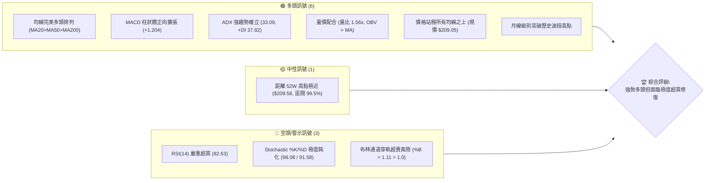
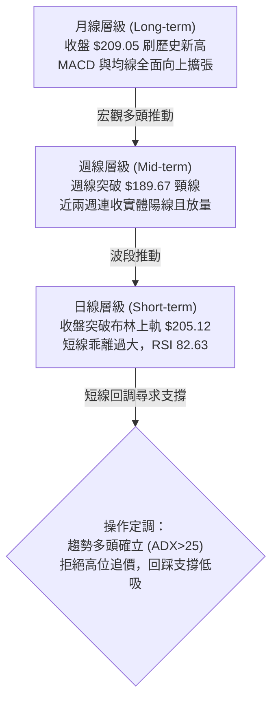
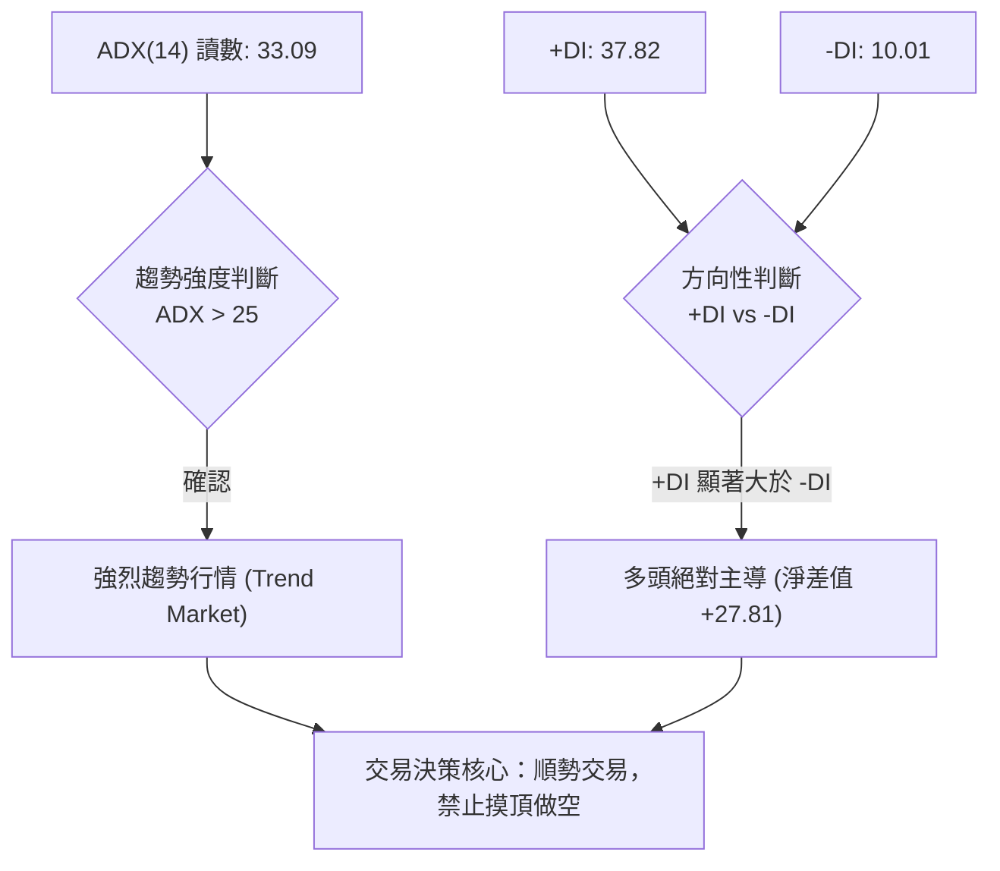
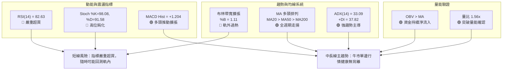
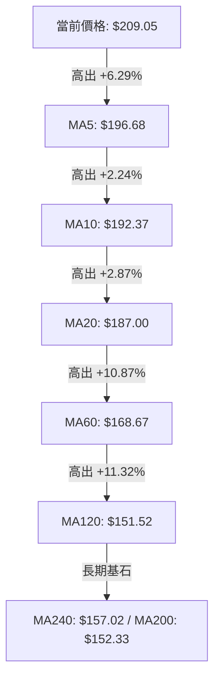
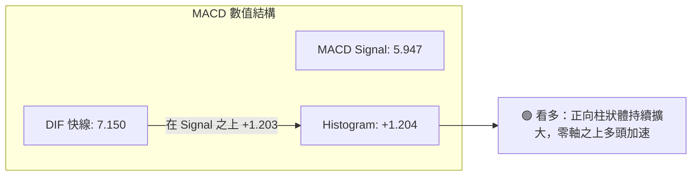
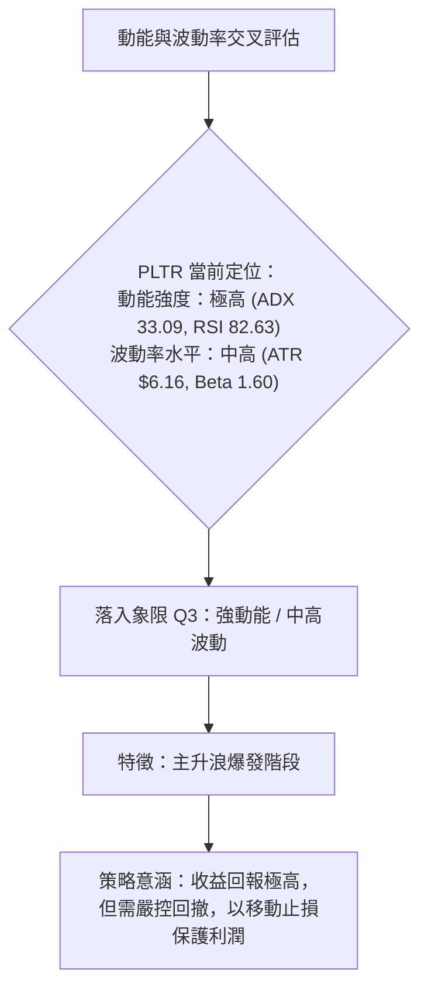
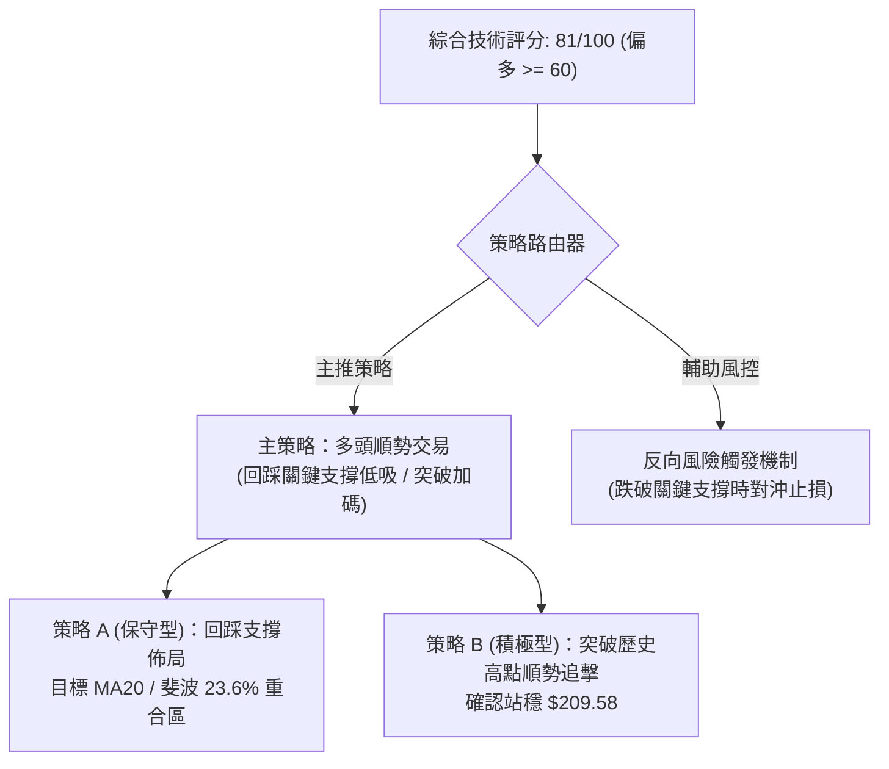
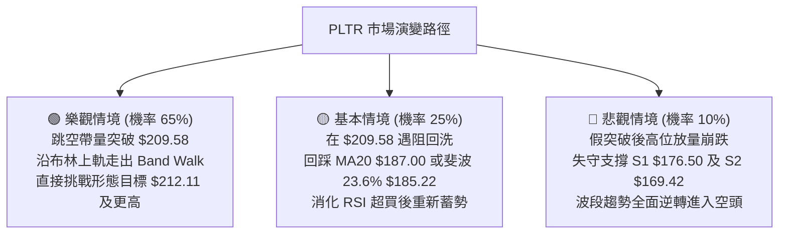

# PLTR 技術分析報告

> **報告日期**：2026-10-10 ｜ **語言**：繁體中文 ｜ **數據來源**：Yahoo Finance ｜ **當前價格**：$209.05

---

## 目錄

| 章節 | 內容 |
|------|------|
| [1. 技術面概覽](#1-技術面概覽) | 訊號儀表板、核心指標、評分卡 |
| [2. 趨勢分析](#2-趨勢分析) | 多時框趨勢、長中短期走勢 |
| [3. 圖表形態分析](#3-圖表形態分析) | 形態識別、K線組合、目標價 |
| [4. 支撐與阻力](#4-支撐與阻力) | 關鍵價位、斐波那契回調 |
| [5. 技術指標深度解讀](#5-技術指標深度解讀) | MA/RSI/MACD/布林/成交量 |
| [6. 動能與波動率](#6-動能與波動率) | 動能評估、ATR、Beta |
| [7. 多時框架總結](#7-多時框架總結) | 時框架評分矩陣 |
| [8. 交易策略建議](#8-交易策略建議) | 多空策略、風險報酬比 |
| [9. 風險提示與監控](#9-風險提示與監控) | 監控指標、風險場景 |

---

## 1. 技術面概覽

### 🎯 技術訊號儀表板



### 📊 核心指標速覽表

| 指標類別 | 指標名稱 | 當前數值 | 訊號 | 解讀 |
|----------|----------|----------|------|------|
| **價格** | 當前價格 | $209.05 | 🟢 | 逼近 52 週歷史高點 $209.58，處於整體區間 99.5% 極端強勢位 |
| **均線** | MA20 | $187.00 | 🟢 | 價格在 MA20 上方 +11.79%，短線多頭生命線支撐強勁 |
| **均線** | MA50 | $176.98 | 🟢 | 價格在 MA50 上方 +18.12%，中期多頭結構穩固無虞 |
| **均線** | MA200 | $152.33 | 🟢 | 價格在 MA200 上方 +37.23%，長期牛市趨勢完全確立 |
| **動能** | RSI(14) | 82.63 | 🔴 | 進入極度超買區間（>70），短線追高盈虧比急劇惡化 |
| **動能** | MACD(12,26,9) | 7.150 / 5.947 / +1.204 | 🟢 | 快慢線均在零軸上方發散，Histogram 柱狀體放大，多頭推力強 |
| **動能** | Stoch %K / %D | 98.08 / 91.58 | 🔴 | 隨機指標進入極度高位鈍化區，隨時具備乖離回洗風險 |
| **趨勢強度** | ADX(14) | 33.09 (+DI: 37.82, -DI: 10.01) | 🟢 | ADX > 25 且 +DI 遠高於 -DI，確認當前屬於強烈單邊趨勢行情 |
| **通道** | 布林通道 (%B) | $205.12 / %B 1.11 | 🔴 | 現價突破布林上軌 ($205.12)，短線乖離率過大，面臨均值回歸壓力 |
| **成交量** | 最新量 / 量比 | 37,479,600 / 1.56x | 🟢 | 突破過程放量，顯著高於 20 日均量，OBV 呈標準多頭架構 |
| **波動** | ATR(14) | $6.16 (2.95%) | 🟡 | 每日正常波動空間約 $6.16，需適當放寬動態止損幅度 |

### 🏆 技術評分卡

```
技術評分卡 — PLTR (2026-10-10)
════════════════════════════════════════════════════
趨勢強度      ██████████████████░░  90/100  🟢 強多頭 (ADX 33.09, +DI 主導)
動能指標      ████████████░░░░░░░░  60/100  🟡 擴張但極度超買 (RSI 82.63)
支撐穩定度    ████████████████░░░░  80/100  🟢 均線呈階梯狀墊高
成交量配合    █████████████████░░░  85/100  🟢 突破爆量 1.56x, OBV 向上
形態完整度    ██████████████░░░░░░  70/100  🟢 上升趨勢延伸與高位突破
均線排列      ████████████████████ 100/100  🟢 完美多頭排列 (MA5>10>20>60>120>240)
════════════════════════════════════════════════════
綜合評分      ████████████████░░░░  81/100  🟢 強勢多頭 (拉回逢低佈局)
════════════════════════════════════════════════════
```

---

## 2. 趨勢分析

### 🌐 多時框趨勢分析



### 📈 長期趨勢 — 12個月走勢圖（Unicode）

```
PLTR 月線走勢圖（過去12個月：2025-11 至 2026-10）
價格軸 ($)
$210 ┤                                                 ● $209.05 (現價/歷史峰值)
$195 ┤
$180 ┤                                         ●       │
$165 ┤ ● 168.45  ● 177.75                      │   ●   │
$150 ┤ │         │        ● 146.59     ● 146.28│   │   │
$135 ┤ │         │        │   ● 137.19 │   │   │   │   │
$120 ┤ │         │        │   │        │   │   │   │   │   ● 123.06
$105 ┤ │         │        │   │        │   │   ● 116.67│   │
     └─┴─────────┴────────┴───┴────────┴───┴───┴───┴───┴───┴────────
       11月      12月     1月 2月      3月 4月 5月 6月 7月 8月 9月 10月
       (2025)             (2026)
```

**走勢特徵分析表格**：

| 階段區間 | 月份起訖 | 收盤價起訖 | 漲跌幅 | 走勢特徵與結構解讀 |
|----------|----------|------------|--------|--------------------|
| 階段一：高位震盪回落 | 2025-11 ~ 2026-02 | $168.45 → $137.19 | -18.56% | 自 2025-10 高點 $200.47 展開的波段獲利回吐，於 $137 附近尋求支撐 |
| 階段二：中期箱體整理 | 2026-02 ~ 2026-05 | $137.19 → $156.54 | +14.10% | 呈現 $137.19 - $156.54 區間橫盤，籌碼在中期均線群反覆換手 |
| 階段三：二次洗盤探底 | 2026-06 ~ 2026-07 | $116.67 → $123.06 | -21.39% | 2026-06 跌破箱體下軌，下探波段低點 $106.37（收 $116.67），完成終極誘空 |
| 階段四：V型暴力反轉 | 2026-08 ~ 2026-10 | $186.38 → $209.05 | +69.88% | 2026-08 單月巨量長陽（週成交 4.35 億股），主升浪啟動，一舉衝破 $200 |

### 📊 中期趨勢（週線分析）

從近 20 週的收盤價與動能演變觀察，PLTR 在 2026 年 6 月底於 $112.93（週最低觸及 $106.37）完成探底後，走出了教科書級別的主升浪結構：

```
PLTR 週線波段結構與支撐壓力示意圖
───────────────────────────────────────────────────────────────────
$209.58 ───────────────────────────── 52W 高點阻力位 (現價 $209.05 逼近)
         ▲ 主升段加速衝刺
$189.67 ───────────────┬───────────── 前波突破平台 / 短期防守點
                       │ 9月下旬震盪消化
$176.50 ───────────────┴───────────── 波段支撐 S1 / MA50 ($176.98) 重合區
         ▲ 8月財報/題材跳空主升浪 ($172.01 爆量突破)
$123.06 ───────────────────────────── 7月底築底回升頸線位
$106.37 ───────────────────────────── 52W 最低點 (終極結構支撐)
───────────────────────────────────────────────────────────────────
```

近 4 週收盤價分別為 $177.64 ➔ $189.67 ➔ $188.75 ➔ $209.05，RSI 自 42.8 急速推升至 82.6，週 MACD 柱狀體由負翻正並快速擴張至 +1.204，顯示買盤極度強勢，突破了 2025 年 10 月形成的歷史心理整數關卡 $200.00。

### ⚡ 趨勢強度評估（ADX 解讀）



**ADX 趨勢強度對照解讀**：

| 指標名稱 | 當前數值 | 參考閾值 | 市場狀態評估 |
|----------|----------|----------|--------------|
| **ADX(14)** | 33.09 | > 25 強趨勢；> 40 極強趨勢 | 確實在 25 之上，顯示市場擺脫盤整，正處於高速單邊上行階段 |
| **+DI(14)** | 37.82 | > 25 為多頭強勁 | 多方動能極為充沛，買盤掌控市場定價權 |
| **-DI(14)** | 10.01 | < 15 為空頭潰敗 | 空方拋壓微弱，主動性賣盤枯竭 |
| **淨差值 (+DI - -DI)** | +27.81 | > 0 多頭佔優 | 差值高達 27.81，表明單邊多頭趨勢處於主升浪加速期 |

---

## 3. 圖表形態分析

### 🔍 形態識別系統

依據形態學標準及嚴格要求，形態必須基於歷史真實高低點與量能確認。


**圖表形態信心度與目標價評估表**：

| 形態名稱 | 信心度 | 判斷依據（引用數據） | 完成度 | 目標價（附計算式） |
|----------|--------|----------------------|--------|--------------------|
| **大型複合雙底 (W底)** | 85% | 2026-02 低點 $137.19 與 2026-06 低點 $106.37 構成雙底，頸線為 2026-05 高點 $156.54。2026-08 爆量 4.35 億股強勢突破頸線。 | 100% (已完全突破) | **最小測幅目標價**：頸線 $156.54 + 形態高度 ($156.54 - $106.37 = $50.17) = **$206.71**（現價 $209.05 已完美達成測幅）。 |
| **高位整理旗形突破** | 75% | 2026-09 在 $167.23 至 $189.67 進行為期 4 週的縮量旗形整理，2026-10 當週放量至 1.30 億股突破前高 $189.67。 | 95% (突破進行中) | **旗形測距目標價**：突破點 $189.67 + 旗桿高度 ($189.67 - $167.23 = $22.44) = **$212.11**。 |
| **頭肩底形態** | 35% | 左肩 $137.19，頭部 $106.37，右肩結構不對稱且回撤幅度深，數據不足以支撐對稱幾何幾何結構。 | 訊號不足 | 信心度 < 50%，僅做指標型解讀，不預設目標價。 |

### 🕯️ 重要K線形態分析

| 週/月份 | 收盤價 | K線形態 | 解讀 | 訊號 |
|---------|--------|---------|------|------|
| 2026-06 | $116.67 | 長下影陰線 (探底針) | 月線下探 52W 低點 $106.37 後迅速抽腳，確認中長期底部支撐 | 🟢 底背馳信號 |
| 2026-08 | $186.38 | 大陽線 (突破缺口巨量) | 單月狂飆 +51.45%，週成交量激增至 435,164,800 股，法人資金搶籌 | 🟢 主升啟動 |
| 2026-09 | $187.05 | 高位十字星/小陽孕線 | 消化 8 月獲利籌碼，成交量溫和萎縮，屬於典型強勢上升中繼 | 🟡 蓄勢整理 |
| 2026-10-11 | $209.05 | 光頭光腳大陽線突破 | 週線強勢吞沒前兩週整理平台，收盤價創下歷史最高紀錄 $209.05 | 🟢 強烈看多 |

### 📉 ASCII 走勢形態示意圖

```
PLTR 中期「旗形整理向上突破」形態解析
══════════════════════════════════════════════════════════════════════
$212.11 ─ ─ ─ ─ ─ ─ ─ ─ ─ ─ ─ ─ ─ ─ ─ ─ ─ ─ ─ ─ ─ ─ ─ ─ ─ ─ 旗形測距目標價
$209.05 ──────────────────────────────────────● (突破確認 / 現價)
                                             ╱
$189.67 ───────● (旗頂)                    ╱   ◄ 頸線突破點
               │  ╲                    ●
$177.64 ───────┼───●───╲────────────●
               │        ● (旗底)   ╱
$167.23 ───────┼─────────●───────╱             ◄ 旗形整理下軌 (S2 支撐上方)
               │          (量能萎縮)
               │
$123.06 ───────● (旗桿起點 / 8月主升浪爆發)
══════════════════════════════════════════════════════════════════════
```

### 🎯 形態目標價計算

根據雙重底與高位整理旗形兩大形態，目標價計算細節如下：
1. **複合雙底測距**：
   - 形態底部最低價：$106.37
   - 頸線確認水平：$156.54
   - 形態高度：$156.54 - $106.37 = $50.17
   - 第一目標價 = 頸線 + 形態高度 = $156.54 + $50.17 = **$206.71**（已完全達成，確立趨勢進入延伸浪）。
2. **高位旗形測距**：
   - 整理區間低點：$167.23
   - 整理區間高點：$189.67
   - 旗桿/波段高度：$189.67 - $167.23 = $22.44
   - 旗形延伸目標價 = $189.67 + $22.44 = **$212.11**（當前正逼近此一短線擴展位）。

---

## 4. 支撐與阻力

### 🗺️ 關鍵價位分布圖（Unicode）

```
PLTR 價位結構分布圖（引用真實 OHLCV 與斐波那契點位）
═════════════════════════════════════════════════════════════════════
$212.11 ║░░░░░░░░░░░░░░░░░░░░░░░░░░░░░░░░║ 旗形形態推算目標價
$209.58 ║████████████████████████████████║ 52W 歷史高點阻力 (極限阻力)
$209.05 ╠════════════════════════════════╣ ◄ 當前價格現價
$205.12 ║▒▒▒▒▒▒▒▒▒▒▒▒▒▒▒▒▒▒▒▒▒▒▒▒▒▒▒▒▒▒▒▒║ 布林通道上軌動態支撐
$187.00 ║▓▓▓▓▓▓▓▓▓▓▓▓▓▓▓▓▓▓▓▓▓▓▓▓▓▓▓▓▓▓▓▓║ 短期支撐：MA20 / 9月收盤價群
$185.22 ║▓▓▓▓▓▓▓▓▓▓▓▓▓▓▓▓▓▓▓▓▓▓▓▓▓▓▓▓▓▓▓▓║ 斐波那契 23.6% 回調關鍵支撐
$176.98 ║████████████████████████████████║ MA50 中期趨勢支撐
$176.50 ║████████████████████████████████║ 強支撐 S1 (近一年波段低點聚類)
$170.15 ║████████████████████████████████║ 斐波那契 38.2% 回調支撐
$169.42 ║████████████████████████████████║ 關鍵支撐 S2 (波段低點聚類)
$165.45 ║████████████████████████████████║ 強支撐 S3 (波段防守底線)
═════════════════════════════════════════════════════════════════════
```

### 🚧 阻力位分析表

依據數據「阻力位 (Resistance) — 近一年波段高點聚類：(no swing-high resistance detected above current price)」，當前現價上方不存在任何波段高點聚類阻力，價格處於藍天突破（Blue Sky Breakout）階段，上方僅存在 52W 高點本身與形態延伸測幅位：

| 阻力級別 | 價位 | 形成原因 | 突破難度 | 重要性 |
|----------|------|----------|----------|--------|
| **R1 (52W High)** | $209.58 | 52 週最高價紀錄，距離現價僅 $0.53 (+0.25%) | 🟢 低 (一觸即發) | ★★★★★ 極高：突破即打開歷史全新空間 |
| **R2 (形態擴展)** | $212.11 | 由旗形整理形態高度 ($22.44) 疊加突破點推算 | 🟡 中等 (技術測幅) | ★★★☆☆ 中等：短線多頭第一波能量釋放完畢位 |
| **R3 (數據未偵測)** | 數據中未偵測到 | 現價上方無更高歷史密集成交區，無歷史聚類 | — | — |

### 🛡️ 支撐位分析表

數據已明確提供波段低點聚類之 S1、S2、S3，精確嚴格引用如下：

| 支撐級別 | 價位 | 形成原因 | 守住機率 | 重要性 |
|----------|------|----------|----------|--------|
| **動態支撐** | $187.00 | MA20 移動平均線與布林通道中軌重合 | 80% | ★★★★☆ 短線強勢防守位 |
| **S1** | $176.50 | 近一年波段低點聚類第一層（距現價 -15.57%），與 MA50 ($176.98) 形成強共振 | 85% | ★★★★★ 中期牛市生命線 |
| **S2** | $169.42 | 近一年波段低點聚類第二層（距現價 -18.96%），緊貼 38.2% 斐波那契位 | 90% | ★★★★☆ 強支撐平台 |
| **S3** | $165.45 | 近一年波段低點聚類第三層（距現價 -20.86%），跌破代表波段結構破壞 | 95% | ★★★☆☆ 波段多頭終極底線 |

### 📐 斐波那契回調位分析

依據 52 週波動區間（最低點 $106.37 至 最高點 $209.58，全波段落差 $103.21）計算之標準斐波那契點位：

| 斐波那契水平 | 精確價位 | 與當前價差距 | 技術意涵分析 |
|--------------|----------|--------------|--------------|
| **0.0% (52W High)** | $209.58 | +0.25% | 現價 $209.05 正處於此水準極限測試位，短線承壓 |
| **23.6%** | $185.22 | -11.40% | 極強回調支撐位，與 MA20 ($187.00) 構成共振防禦帶，強勢回調不應跌破 |
| **38.2%** | $170.15 | -18.61% | 健康回調支撐位，與 S2 ($169.42) 及布林下軌 ($168.87) 完美重疊 |
| **50.0%** | $157.98 | -24.43% | 多空中軸平衡位，接近 2026-05 前高頸線 ($156.54) |
| **61.8%** | $145.80 | -30.26% | 黃金分割防守位，中長期趨勢容忍極限 |
| **78.6%** | $128.46 | -38.55% | 深度回撤位 |
| **100.0% (52W Low)**| $106.37 | -49.12% | 52 週最低點，年內宏觀大底 |

**現價落點解讀**：現價 $209.05 落在 0.0% ($209.58) 與 23.6% ($185.22) 之間的最頂端（佔區間 99.5%）。這表明多頭力量佔據絕對優勢，未發生任何形式的深幅修正。然而，價格與 23.6% 回調位差距高達 $23.83，代表短線技術面乖離已拉大至極限。

---

## 5. 技術指標深度解讀

### 🎛️ 指標訊號總覽



### 📈 移動平均線排列分析



均線系統呈現完美的「多頭排列」（Bullish Alignment）。短天期、中天期、長天期各均線斜率均為正，且由上至下嚴格依 MA5 > MA10 > MA20 > MA50 > MA200 次序排列。
- 價格與 MA20 乖離率為 +11.79%，與 MA50 乖離率為 +18.12%，與 MA200 乖離率為 +37.23%。
- 結論：均線提供堅實的層層推升力道，但在乖離率逼近 +12% 的狀態下，歷史數據顯示短線容易引發向 MA10 ($192.37) 或 MA20 ($187.00) 的回抽靠攏走勢。

### 📉 RSI(14) 分析

- **RSI 數值進度條**：
  82.63 : █████████████████░░░ (82.63% — 極端超買區間)
- **區間評估**：
  RSI(14) 來到 82.63，已顯著跨越 70 的超買門檻，進入 80 以上的「極端過熱警戒區」。
- **背離檢驗結論**：
  比對價格與 RSI 數據，2026-08-09 週收盤 $172.01 時 RSI 為 70.0，2026-08-23 收盤 $179.94 時 RSI 為 79.0，而當前 2026-10-11 收盤 $209.05，RSI 推升至 82.6。價格創歷史新高，RSI 亦同步刷新波段高點。
  **結論：RSI 無頂背離（Bearish Divergence）現象**。高 RSI 是強趨勢行情的動能釋放特徵，反映出單純的「超買」，而非「動能衰竭」。

### 📊 MACD(12/26/9) 訊號解讀



- **快慢線位置**：快線 (7.150) 與慢線 (5.947) 均大幅位於零軸上方，展現出明確的多頭主升波特性。
- **背離檢驗結論**：週線級別 MACD Histogram 柱狀體在 2026-09-13 曾下探 -3.155，隨後伴隨價格反彈快速縮腳，至 2026-09-27 翻正為 +1.024，本週進一步放大至 +1.204。
  **結論：MACD 柱狀體持續擴張，無任何頂背離現象**，確認當前價格走勢獲得實質動能支撐。

### 📦 布林通道分析

```
布林通道結構與現價相對位置 (20, 2)
═══════════════════════════════════════════════════════════════
$205.12 ────────────────────────────────── 上軌 (BB Upper)
        ▲ 現價突破上軌：$209.05 (%B = 1.11，已脫軌運行)
$187.00 ────────────────────────────────── 中軌 (MA20 Baseline)
        ▼ 下軌健康空間
$168.87 ────────────────────────────────── 下軌 (BB Lower)
═══════════════════════════════════════════════════════════════
```

- **布林帶寬與 %B 解讀**：
  上軌為 $205.12，中軌為 $187.00，下軌為 $168.87。現價 $209.05 處於上軌上方，**%B 達 1.11**（數值 > 1.0 代表價格收在軌道外）。
- 此種狀況通常屬於強勢「布林通道行走」（Band Walk），但在成交量未出現倍數連續爆發的情況下，次週極易出現陰線回踩，將價格拉回至軌道內（$205.12 下方）進行均值修復。

### 💹 成交量分析（量價配合度）

1. **量比分析**：
   最新單日成交量為 37,479,600 股，相較於 20 日均量 24,073,015 股，**量比達 1.56 倍**。在價格逼近 $209.58 阻力位時放量，顯示主力資金具備實質突破意圖。
2. **OBV 趨勢**：
   指標數據明確指出「OBV > MA → 量能支撐上漲」。能量潮指標高於其移動平均線，且曲線方向持續向上，代表在近 3 個月的漲升過程中，主動性買盤持續積累，無法人機構出貨之量價背離跡象。

---

## 6. 動能與波動率

### ⚡ 動能評估四象限



**四象限對照定位表**：

| 象限 | 動能強度 | 波動率 | 當前狀態 | 策略應對與評估 |
|------|----------|--------|----------|----------------|
| Q1 | 強動能 | 低波動 | — | 最佳波段穩健機會（趨勢啟動初期） |
| Q2 | 弱動能 | 低波動 | — | 謹慎觀望（低位盤整或無趨勢階段） |
| **Q3** | **強動能** | **中高波動** | **PLTR (當前)** | **強勢進攻型市場：順勢看多，但波動放大利潤與風險，禁止左側接刀與盲目重倉** |
| Q4 | 弱動能 | 高波動 | — | 避免進場（破位下行、恐慌拋售階段） |

### 📊 ATR 波動率分析

- **ATR(14) 讀數**：$6.16，佔當前股價之 2.95%。
- **波動空間解讀**：PLTR 每日正常波動振幅約在 $6.16 左右。
- **動態止損應用**：
  - 超短線交易（1.0 × ATR）：止損安全距離應設在 $6.16 之外。
  - 波段順勢交易（2.0 × ATR）：止損緩衝空間應設定為 $6.16 × 2 = **$12.32**。若以現價 $209.05 計算，波段防守點約在 $196.73（恰好落在 MA5 $196.68 附近）。

### 📐 Beta 與市場相關性

- **Beta 數值**：**1.602**（高彈性 Beta 標的）。
- **市場意涵**：
  - PLTR 波動幅度為 S&P 500 大盤基準的 1.6 倍。在大盤走牛時具備高度超額收益（Alpha）潛力；
  - 相對地，一旦美股大盤出現宏觀流動性修正，PLTR 面臨的回撤幅度亦將按比例放大。操作時部位規模應較一般低 Beta 防禦股更為精簡。

---

## 7. 多時框架總結

### 📋 時框架評分表

| 時框架 | 趨勢方向 | 動能狀態 | 均線排列 | 圖表形態 | 綜合評分 | 戰略建議 |
|--------|----------|----------|----------|----------|----------|----------|
| **月線 (長期)** | 🟢 強勢上行 | 強勁多頭 (突破歷史新高) | 完美多頭排列 | 大型複合底破頸線 | 95/100 | 長期持有，享受主升浪 |
| **週線 (中期)** | 🟢 多頭推動 | RSI 82.6 / MACD 翻正擴張 | 多頭向上擴散 | 旗形向上突破確立 | 88/100 | 逢回調至支撐位加碼 |
| **日線 (短期)** | 🟡 軌外過熱 | 極端超買 (RSI 82.6, %B 1.11) | 短均線多頭發散 | 逼近 52W 高點 $209.58 | 65/100 | 拒絕追高，等待分時均值修正 |

### 🔲 綜合訊號矩陣

| 維度 | 短期 (日線) | 中期 (週線) | 長期 (月線) | 衝突收斂方向 |
|------|-------------|-------------|-------------|--------------|
| **趨勢方向** | 🟢 向上 | 🟢 向上 | 🟢 向上 | 完全一致（強烈看多） |
| **動能配合** | 🔴 嚴重超買 | 🟢 動能擴展 | 🟢 動能充沛 | 短線動能過熱，中長線動能健康 |
| **均線架構** | 🟢 均線發散 | 🟢 均線走揚 | 🟢 均線支撐 | 完全一致（均線提供硬支撐） |
| **量價關係** | 🟢 爆量 1.56x | 🟢 週成交放量 | 🟢 資金淨流入 | 完全一致（量能背書無出貨跡象） |

### ⚖️ 多時框收斂結論

依據多時框收斂規則（嚴格要求 14）：
1. **行情性質判斷**：ADX(14) 讀數為 **33.09**，遠大於 25 臨界值，確定當前市場處於**強烈的趨勢行情（Trending Market）**，絕非盤整市。
2. **時框優先級權重**：在 ADX > 25 的趨勢行情中，中長期（週線/MA50、MA200）方向具有最高決定權，日線僅用於尋找精確進場時機。中長期方向均呈現全面性強烈多頭（週線 MACD 擴張、W底突破達成）。
3. **收斂唯一結論**：**整體架構判定為「偏多（強烈多頭趨勢）」**。
   日線層級的高位超買（RSI 82.63、布林 %B 1.11）不構成反轉做空的理由，僅表明**「當前時點追價盈虧比低劣」**。戰略方針定調為：**嚴禁做空摸頂，順應主時框多頭方向，等待日線級別回踩支撐後擇機做多**。

---

## 8. 交易策略建議

### 🗺️ 策略決策流程圖



### 🧭 策略路由

**當前主策略方向 = 多頭順勢策略（依綜合評分 81/100，處於 ≥60 偏多區間）**。
本報告依規則嚴格鎖定多頭主軸，空頭僅列為防禦風控之「反轉風險觸發點」，絕不兩頭下注。

### 🎯 價格情境階梯（Price Scenarios）

價位嚴格引用第 4 章及數據計算數值：

| 觸發條件 | 下一目標 | 後續延伸 | 情境含義 |
|----------|----------|----------|----------|
| **強勢突破 52W 高點 $209.58** | 形態擴展位 R2 **$212.11** | 分析師最高目標價 **$255.00** | 歷史藍天突破，主升浪進一步加速展開 |
| **現價區間震盪整理** | 消化超買於 **$196.68** (MA5) | 守穩 **$187.00** (MA20) | 以時間換取空間，消化 RSI 超買乖離 |
| **失守波段支撐 S1 $176.50** | 波段支撐 S2 **$169.42** | 終極支撐 S3 **$165.45** | 中期牛市結構遭到破壞，趨勢轉弱警訊 |

### 📊 情境機率分佈

| 情境 | 機率 | 主要依據 |
|------|------|----------|
| **情境一：強勢震盪後繼續上行** | **65%** | ADX 33.09 確立強多頭，OBV > MA 量能充沛，均線多頭排列完整，MACD 柱狀體放量擴張 (+1.204)。 |
| **情境二：回踩 MA20 區間整固** | **25%** | RSI(14) 處於 82.63 極度超買區，布林 %B 1.11 脫軌運行，需均值回歸修復短期乖離。 |
| **情境三：深度回落探底 (假突破)** | **10%** | 僅在外部系統性宏觀風險爆發，跌破 S1 $176.50 且伴隨放量拋售時方會發生。 |

### 🟢 主策略詳情

所有進場、止損、目標點位均嚴格基於數據提供之 OHLCV 計算價位：

| 策略要素 | 策略 A（穩健型：回調關鍵支撐低吸） | 策略 B（激進型：突破 52W 高點順勢跟進） |
|----------|-----------------------------------|---------------------------------------|
| **交易邏輯** | 利用超買修復回踩支撐進場，優化盈虧比 | 順應強勢動能，待帶量創歷史新高時順勢追單 |
| **進場條件** | 價格回調至 MA20 與 斐波 23.6% 緩衝區企穩 | 收盤價有效站穩 52W 高點 $209.58 之上，且成交量放大 |
| **進場價格** | **$187.00** (MA20 與布林中軌支撐) | **$210.00** (確認突破 $209.58 後掛單進場) |
| **目標價 T1** | **$209.58** (回測前高阻力位) | **$212.11** (高位旗形測距目標價) |
| **目標價 T2** | **$212.11** (旗形形態延伸目標) | **$255.00** (分析師最高目標價 Consensus High) |
| **止損價格** | **$176.50** (嚴格設於波段強支撐 S1) | **$196.68** (設於 MA5 均線防守位，防止假突破假摔) |
| **風險空間** | $187.00 - $176.50 = **$10.50** | $210.00 - $196.68 = **$13.32** |
| **報酬空間 (至T2)**| $212.11 - $187.00 = **$25.11** | $255.00 - $210.00 = **$45.00** |
| **風險報酬比** | **1 : 2.39** (極佳) | **1 : 3.38** (優異) |
| **成功機率** | **70%** | **60%** |
| **建議倉位** | **15% - 20%** | **8% - 10%** (突破單部位應適度縮小) |

### 🔴 反向風險觸發點（對沖提示）

若市場出現以下訊號，多頭主策略假設立即失效，應立即啟動防守或減倉對沖：
1. **破位信號**：日線收盤價跌破 **S1 ($176.50)**，意味著跌破 MA50 ($176.98) 中期生命線，多頭結構遭到實質破壞。
2. **量價背離信號**：股價創出 $209.58 新高，但單日成交量顯著低於 20 日均量 ($24,073,015)，且隨後一個交易日收出陰線包覆吞沒形態。
3. **動能衰竭信號**：MACD Histogram 在零軸上方快速縮短並翻負，同時跌破短線防守線 **$187.00**。

### ⭐ 整體訊號強度評星

```
做多訊號強度：★★★★☆  (4/5星：趨勢量價極強，僅受限於超買)
做空訊號強度：★☆☆☆☆  (1/5星：逆勢摸頂，風險極高)
整體可信度：  ★★★★☆  (4/5星：多時框指標高度共振確認)
```

---

## 9. 風險提示與監控

### ✅ 關鍵監控指標 Checklist

```
╔══════════════════════════════════════════════════════════════════════╗
║                    PLTR 交易風控與監控清單 (Checklist)               ║
╠══════════════════════════════════════════════════════════════════════╣
║ [ ] 價格監控：是否突破並站穩 52W 高點 $209.58                       ║
║ [ ] 動能監控：RSI(14) 是否自 82.63 回落跌破 70 警戒線               ║
║ [ ] 軌道監控：股價是否重新收回布林上軌 $205.12 內                   ║
║ [ ] 均線防守：MA20 ($187.00) 與 MA50 ($176.98) 是否維持多頭斜率    ║
║ [ ] 量能監控：成交量是否維持在 20日均量 (24.07M) 之上               ║
║ [ ] 終極止損：是否跌破近一年波段強支撐 S1 ($176.50)                 ║
║ [ ] 宏觀聯動：Beta 達 1.602，需密切追蹤 Nasdaq / S&P500 系統性波動  ║
╚══════════════════════════════════════════════════════════════════════╝
```

### ⚠️ 風險場景分析



### 🛡️ 風險管理重要提醒

1. **嚴禁在 RSI > 80 時進行槓桿追多**：
   儘管當前處於強勢主升段，但 RSI(14) 達 82.63，隨機指標 %K 達 98.08，意味著短線獲利盤隨時可能發動無預警回吐，直接買在短線最高點的風險極大。
2. **動態追蹤止損（Trailing Stop）設定**：
   已有持倉的多頭部位，建議採取動態移動止損。可採用 2 倍 ATR（約 $12.32）作為動態移動止損標準，或以每日 MA5 ($196.68) 為防守底線，只要每日收盤不破 MA5 便堅定持股。
3. **倉位配置原則**：
   考量 PLTR Beta 高達 1.602 且 ATR 佔股價比近 3%，個股波動劇烈，單一標的倉位上限不宜超過投資組合總資金的 15% - 20%，嚴防單一黑天鵝事件對整體帳戶造成重大回撤。

---

## 📋 報告總結

```
PLTR 技術分析報告總結
════════════════════════════════════════════════════════
報告日期：2026-10-10
當前價格：$209.05
分析評級：🟢 強勢多頭（主升段延伸，惟短線面臨技術性超買修復）

關鍵結論：
├─ 長期趨勢：🟢 強烈看多（月線突破歷史天花板，均線全面發散）
├─ 中期趨勢：🟢 強烈看多（W底與旗形突破確認，週 MACD 翻正擴張）
├─ 短期趨勢：🟡 警惕回調（日線 RSI 82.63 嚴重超買，布林 %B 1.11 脫軌）
├─ 關鍵支撐：S1 $176.50 ｜ MA20 $187.00 ｜ 斐波 23.6% $185.22
├─ 關鍵阻力：52W High $209.58 ｜ 旗形目標價 $212.11
└─ 分析師目標：均價 $199.84 ｜ 最高價 $255.00

最優策略組合：
1. 🥇 最佳機會 (策略 A)：耐心等待股價回踩 MA20 支撐群 $187.00 企穩後低吸，
                   止損設於 S1 $176.50，目標直指 $212.11，風報比 1:2.39。
2. 🥈 次選機會 (策略 B)：若直接帶量放量突破 52W 高點 $209.58，可於 $210.00
                   以小倉位 (8-10%) 順勢跟進，止損設於 MA5 $196.68，
                   博取分析師高標 $255.00 之極致波段利潤。
3. 🥉 保守選擇：既有獲利持倉者可於 $209.05 附近先平倉 1/3 鎖定利潤，
                   剩餘 2/3 部位以 MA5 ($196.68) 為動態防守持股續抱。
════════════════════════════════════════════════════════
```

---

> ⚠️ **免責聲明**：本報告為 AI 自動生成之技術分析，所有數據及估算均基於提供的歷史價格資訊。本報告**僅供研究與學術參考**，**不構成任何投資建議**。投資有風險，入市需謹慎。

---

*報告生成時間：2026-10-10 ｜ 數據來源：Yahoo Finance ｜ 分析框架：多時框技術分析*