<details>
<summary>📊 靜態圖表 (點擊展開)</summary>
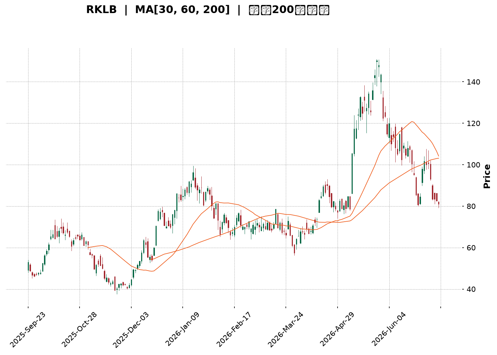
</details>

<html>
<head><meta charset="utf-8" /></head>
<body>
    <div style="height:500px; width:100%;">                        <script>window.PlotlyConfig = {MathJaxConfig: 'local'};</script>
        <script charset="utf-8" src="https://cdn.plot.ly/plotly-3.7.0.min.js" integrity="sha256-jvTGqxNp8AGWEcvNLVuKr+8j5dGe9Yw51LQkmDH+IYA=" crossorigin="anonymous"></script>                <div id="candlestick-chart" class="plotly-graph-div" style="height:100%; width:100%;"></div>            <script>                window.PLOTLYENV=window.PLOTLYENV || {};                                if (document.getElementById("candlestick-chart")) {                    Plotly.newPlot(                        "candlestick-chart",                        [{"close":{"dtype":"f8","bdata":"AAAA4Hp0SkAAAADgUVhIQAAAAOCjUEdAAAAAoEchR0AAAACgR4FHQAAAAOB69EdAAAAAACn8R0AAAAAAKTxKQAAAAOB6FExAAAAAAABATUAAAACgR8FOQAAAAADXU1BAAAAAQOGaUEAAAADgoxBQQAAAAEDhWlBAAAAAgOsBUUAAAACgR1FRQAAAAAAAwFBAAAAAoEeRUEAAAABgZtZQQAAAAKCZWVBAAAAA4FFITkAAAADA9chPQAAAAADXI1BAAAAAIK5nUEAAAAAAAOBPQAAAAIA9ilBAAAAAgMJ1TkAAAACgcH1PQAAAACCFq05AAAAAwPVITEAAAACAwjVMQAAAAIAUzkhAAAAAgOvRSUAAAABAM\u002fNJQAAAAGC4nklAAAAAACn8SEAAAAAAAKBGQAAAAMAexUZAAAAAIK6nRUAAAAAA12NFQAAAACBcz0VAAAAAoHC9Q0AAAABgZiZEQAAAAKCZOUVAAAAAwMxMRUAAAABACvdEQAAAAIDrEUVAAAAAIFwvREAAAABAM\u002fNEQAAAAAApXEZAAAAAIFyvSEAAAABACodIQAAAACCux0lAAAAAQAq3SkAAAABgj8JMQAAAAADXw09AAAAAYLi+TkAAAADgerRLQAAAAGC4vktAAAAAQOH6SkAAAACAwvVNQAAAAKBHoVFAAAAAQDNjU0AAAAAghUtTQAAAACCFS1NAAAAAoJmpUUAAAAAgrodRQAAAAMDMnFFAAAAA4KNwUUAAAAAgXP9SQAAAAMD1iFNAAAAAgOuBVUAAAADAHgVVQAAAAMAexVRAAAAAYGY2VUAAAACgmflVQAAAAMAepVVAAAAAQDPzVkAAAADgo7BWQAAAAEAzE1hAAAAAgD1KVkAAAADgevRVQAAAAGC4\u002flVAAAAAoJk5VkAAAABguB5UQAAAAAAAwFVAAAAA4HokVkAAAAAghWtVQAAAAOB6BFRAAAAAoJmJUkAAAACgR1FUQAAAAEAKR1JAAAAA4HqUUEAAAADgehRSQAAAAIDC9VJAAAAAgOsBUkAAAAAgrmdRQAAAAOCjgFBAAAAAACncUEAAAADA9XhRQAAAAEDhmlJAAAAAwB4lU0AAAABACrdRQAAAAKBwjVFAAAAAgBR+UUAAAADAzIxRQAAAAKCZKVJAAAAAYGZGUUAAAACAFL5RQAAAAOBRiFFAAAAAgD36UUAAAAAAAIBRQAAAAEAKh1FAAAAAYLjeUUAAAAAghTtRQAAAAKBw\u002fVFAAAAAIK4XUUAAAACAPRpRQAAAAADX01FAAAAAgMKlU0AAAABguF5RQAAAACCF+1FAAAAAYLjOUEAAAAAAAABRQAAAAOB6hFBAAAAA4FE4UkAAAAAAKXxQQAAAAEAKd05AAAAA4KOwTEAAAACAFA5QQAAAAKBHYVBAAAAAYLjuUEAAAABA4epQQAAAAOB6lFBAAAAAwB5FUUAAAAAgXK9QQAAAAEAzA1FAAAAAIK6nUUAAAACAFA5SQAAAAGBmZlJAAAAAIIW7VEAAAABAMzNVQAAAAKBwXVZAAAAAwPWoVUAAAABgj4JWQAAAAGBmJlVAAAAAIIXrU0AAAABgj5JUQAAAAIDCpVNAAAAAoEdBU0AAAADgo6BUQAAAAADXs1NAAAAAANcTVEAAAADgo7BTQAAAAKCZKVVAAAAAwB6lU0AAAACAFF5aQAAAAGBmVl1AAAAAANdjXUAAAACgmQlfQAAAAKCZkWBAAAAAoEcxX0AAAADAHmVgQAAAAADX019AAAAAwPXIYEAAAADAzFxfQAAAAOBR+GBAAAAAYGbmYUAAAAAgXMdiQAAAAMD1gGJAAAAAIFzvYUAAAADA9ZheQAAAAOB61F5AAAAAwMysXEAAAADAzPxdQAAAAMAehVtAAAAAoJlpXEAAAABguA5bQAAAAEAzQ1pAAAAAgOuxXEAAAADA9ZhZQAAAAAAAUFtAAAAA4FEoWkAAAABguP5aQAAAACBcz1pAAAAAYI8SWUAAAAAgrsdXQAAAAIA9WlVAAAAAACksVEAAAABgjyJVQAAAAOCjgFhAAAAAoJlpWUAAAADgegRZQAAAAKBwHVlAAAAAgMJFV0AAAACAPdpUQAAAAGBm1lRAAAAAQDOjVEAAAABgj0JUQA=="},"high":{"dtype":"f8","bdata":"AAAAYDkUS0AAAACgcD1KQAAAACBcT0hAAAAA4FHYR0AAAADAzAxIQAAAAGC4\u002fkdAAAAAgMK1SEAAAABAM1NKQAAAACAxeExAAAAAoEehTUAAAAAgrkdPQAAAAAAtIlFAAAAAYI8iUUAAAAAAAGBSQAAAAAApnFFAAAAAQOFqUUAAAACAFH5SQAAAAAAAEFJAAAAAAAAgUUAAAAAghQtSQAAAAGCPAlFAAAAAoEcBUEAAAADAzCxQQAAAACCFi1BAAAAAYGaWUEAAAABgj6JQQAAAAMD12FBAAAAAIIVLUEAAAACgmblPQAAAAMDMjE9AAAAAYLi+TUAAAAAA16NMQAAAAEDhGkxAAAAAwMwMSkAAAAAAAEBLQAAAAEDhekxAAAAAgD2qS0AAAADgo7BIQAAAAAApnEdAAAAAwEvXRkAAAACAFM5FQAAAAADXQ0ZAAAAAoEchR0AAAACAwoVEQAAAAADXQ0VAAAAAQApnRUAAAAAghctFQAAAAKCZWUVAAAAAYGamREAAAABguH5FQAAAAGC4XkZAAAAAQArXSEAAAACgmdlIQAAAACBcL0pAAAAAAADgSkAAAACAPWpNQAAAAKCZCVBAAAAAIIVLUEAAAAAA1yNQQAAAAKBwXUxAAAAA4Hp0TEAAAAAAACBOQAAAAADXo1FAAAAAwMycU0AAAAAghctTQAAAAMAe9VNAAAAAIFw\u002fU0AAAAAgXC9SQAAAAAAprFJAAAAAQItMUkAAAAAgXA9TQAAAAAAAkFNAAAAAAACQVUAAAACgcH1VQAAAACCud1ZAAAAAIIUbVkAAAACAwjVWQAAAAOCnblZAAAAAACkMV0AAAABAYB1XQAAAAMAe5VhAAAAAoEeRWEAAAAAAANBWQAAAAKCZWVZAAAAAwMycV0AAAACAPcpVQAAAAAAAwFVAAAAAQDNzVkAAAAAAAEBWQAAAAOB6VFZAAAAAwMwsVEAAAADgelRUQAAAAGBmVlRAAAAAIFw\u002fUkAAAACAPSpSQAAAAEAzM1NAAAAAQAr3UkAAAACgmVlSQAAAAMDMHFFAAAAAYGZmUUAAAAAgXL9RQAAAAMD18FJAAAAAQApHU0AAAADAzIxTQAAAAAAA0FFAAAAAIIWDUUAAAABgZvZRQAAAACBcL1JAAAAAgMJlUUAAAABgZgZSQAAAAAAAUFJAAAAAYGaGUkAAAAAA1xNSQAAAAEAKx1JAAAAAAAAIUkAAAAAA1ztSQAAAAEAzU1JAAAAAYGYmUkAAAAAA19NRQAAAAOBRGFJAAAAAQOGqU0AAAADgUThTQAAAAGC4LlJAAAAAYLh+UkAAAADAzFxRQAAAAGBmJlFAAAAAANfDUkAAAACAwgVSQAAAAIAUhlBAAAAAgOvRTkAAAADAHiVQQAAAAEDhKlFAAAAAwPVYUUAAAADgepRRQAAAAEAzE1FAAAAAgMBqUkAAAABgj3JRQAAAAADXg1FAAAAAQDPjUUAAAAAAALBSQAAAAIDCpVJAAAAAIFzfVEAAAAAgXL9VQAAAAGBmllZAAAAAwMz8VkAAAABgZkZXQAAAAEAzk1ZAAAAAgD2aVUAAAABguJ5UQAAAAIDrcVRAAAAA4KOAU0AAAACAwuVUQAAAAGCP8lRAAAAA4E91VEAAAAAAAMBUQAAAACCFK1VAAAAAYI8yVUAAAAAgrmdaQAAAAAAp\u002fF5AAAAAIFxfXkAAAAAgXM9fQAAAAIDCpWBAAAAAANdLYEAAAAAAKUxhQAAAAIA9MmBAAAAAQDPrYEAAAAAA11tgQAAAAOBReGFAAAAAAABAYkAAAAAAAOBiQAAAAGCP2mJAAAAAAAAAYkAAAAAAKfRgQAAAAMDMDGBAAAAA4FGgXkAAAADgUaheQAAAAGC4fl1AAAAAAAAQXUAAAABgj\u002fJdQAAAAKBw\u002fVtAAAAAQOHCXEAAAADAIJhdQAAAAIDrsVtAAAAAAAAgW0AAAACAwtVbQAAAAEAzY1tAAAAAoJnZWkAAAABguG5ZQAAAAEAzk1dAAAAAQAqHVUAAAACA65FVQAAAAMAexVhAAAAAgD0KWkAAAABgZuZaQAAAACBcv1pAAAAAYGaGWUAAAAAgXK9WQAAAAAAAoFVAAAAAQDOTVUAAAADAlpBUQA=="},"hovertemplate":"\u003cb\u003e%{x|%Y-%m-%d}\u003c\u002fb\u003e\u003cbr\u003e\u958b: $%{open:.2f}\u003cbr\u003e\u9ad8: $%{high:.2f}\u003cbr\u003e\u4f4e: $%{low:.2f}\u003cbr\u003e\u6536: $%{close:.2f}\u003cextra\u003e\u003c\u002fextra\u003e","low":{"dtype":"f8","bdata":"AAAA4Hr0R0AAAABACjdIQAAAAEDhmkZAAAAAgD3qRkAAAAAgXC9HQAAAAKBHQUdAAAAAIFyPR0AAAACgR0FIQAAAAKBHoUlAAAAAYGbmS0AAAABgj4JMQAAAAEAz009AAAAAQOEaUEAAAADA9QhQQAAAAODOJ1BAAAAA4FEYT0AAAADAHsVQQAAAAEAzm1BAAAAAoJnZT0AAAABAM6tQQAAAAEAKN1BAAAAA4Ho0TUAAAAAAAGBOQAAAAEAz009AAAAAoJkJUEAAAACAFM5PQAAAAKBwvU9AAAAAgOtxTkAAAABAMzNOQAAAAOCjkE1AAAAAoEdBTEAAAAAgXG9LQAAAAOB6tEhAAAAA4M4nR0AAAACgR2FJQAAAAEDhmklAAAAA4HrUSEAAAAAgXC9GQAAAAGBmpkVAAAAAwMwcRUAAAACgcJ1EQAAAAEAKN0VAAAAAwPWoQ0AAAADA9chCQAAAAGBmpkNAAAAA4KMwREAAAADgo7BEQAAAAGBm5kRAAAAAoHD9Q0AAAACAwjVEQAAAAAAAwERAAAAAwPVoRkAAAACgmdlHQAAAAAApnEhAAAAAIIUrSUAAAAAAACBKQAAAAMDMbExAAAAAYGbmTUAAAACAPYpLQAAAAEAKV0pAAAAAQOGKSkAAAAAA1wNMQAAAAMCdX05AAAAAwCAwUkAAAABgj1JSQAAAAKBDs1JAAAAAwPWYUUAAAACgm1RRQAAAAAApnFFAAAAA4FFIUUAAAABgZrZQQAAAAADX01FAAAAAQDODUkAAAABgZnZUQAAAAOCjkFRAAAAAwMycVEAAAADg0NpUQAAAAKCZaVVAAAAAAAAgVUAAAACgmalVQAAAAKCZGVdAAAAAQDMTVkAAAACgcK1UQAAAAMB2VlRAAAAAIK6HVUAAAADgowBUQAAAAAAAgFRAAAAAwMqBVUAAAAAAAMBUQAAAAKBHgVNAAAAAgEF4UkAAAACgR\u002fFSQAAAAEAIJFFAAAAAwMxMUEAAAAAAAMBQQAAAAAAAsFFAAAAAQDPjUUAAAACgR8FQQAAAACBc709AAAAAAABgUEAAAAAAAEBQQAAAAMBLf1FAAAAAYGYWUkAAAACgmVlRQAAAAAAAIFFAAAAAYGamUEAAAADgUThRQAAAAADXM1FAAAAAYGYGUEAAAADAzJxQQAAAAAApjFBAAAAAgBReUUAAAACAwtVQQAAAAOCjCFFAAAAA4Hr0UEAAAACAvidRQAAAAMAeFVFAAAAAgOsRUUAAAAAAKdxQQAAAAEDhKlFAAAAAoEfRUUAAAACgmVlRQAAAAAAAAFFAAAAAwPWYUEAAAABAM4NQQAAAAKBwHVBAAAAAACk8UUAAAACAwmVQQAAAAMDMLE5AAAAAYOUQTEAAAAAA14NNQAAAAEAzU1BAAAAAgBTuTkAAAABgZqZQQAAAAEDh+k9AAAAAYOfzUEAAAABA4aJQQAAAAIDClVBAAAAAgMKlUEAAAABguJ5RQAAAAGBmZlFAAAAAoJk5U0AAAABgZuZUQAAAAGBmJlVAAAAAAABwVUAAAADgo\u002fBVQAAAAAApZFRAAAAAwB7FU0AAAADAdENTQAAAAGBmZlNAAAAAIFx\u002fUkAAAACAFF5TQAAAACCFm1NAAAAAAAAQU0AAAAAA1yNTQAAAAEAKt1NAAAAAIIV7U0AAAAAgrndVQAAAAAAAAFpAAAAAgD0aXEAAAADA9ThdQAAAAADXU15AAAAAQDNzXkAAAACg8WpfQAAAAGC4zlxAAAAAgBQOX0AAAABAM\u002fNeQAAAAIDraWBAAAAAgOtRYUAAAADAHj1hQAAAAADXy2FAAAAAoJnBYEAAAAAAAEBeQAAAAADXo15AAAAAgD1qXEAAAADA9ZhbQAAAAGC4rlpAAAAAAADAW0AAAADAzExZQAAAAIA9GlpAAAAAoJlZWkAAAABACudYQAAAAEAzc1pAAAAA4HrEWUAAAABgjwJaQAAAAKBwPVlAAAAAAAAgWEAAAADgo7hXQAAAAGBmNlVAAAAAAAAAVEAAAABguC5UQAAAAGBmdlZAAAAAwPXoV0AAAAAgrmdYQAAAAIA9elhAAAAAQDMTV0AAAABgZrZUQAAAAAAAQFRAAAAAgD2aVEAAAAAA18NTQA=="},"name":"\u50f9\u683c","open":{"dtype":"f8","bdata":"AAAAQDODSEAAAACAwuVJQAAAAAAAAEhAAAAAYGamR0AAAABAM7NHQAAAAEDhmkdAAAAA4KOwR0AAAACA61FIQAAAAGBmBkpAAAAAYLhuTEAAAACgR4FNQAAAAKCZCVBAAAAAoJk5UEAAAABAM7NRQAAAAOBR+FBAAAAAgMJVUEAAAACgR4FRQAAAAOB6hFFAAAAAwPV4UEAAAADgo0hRQAAAAGCPAlFAAAAAACl8T0AAAAAgrsdOQAAAAADXM1BAAAAAACmMUEAAAABAM2tQQAAAAKBHCVBAAAAAAABAUEAAAABgj+JOQAAAAADXg09AAAAAYGbmTEAAAADgelRMQAAAAEDhGkxAAAAAoBjUR0AAAABguN5KQAAAAAAAAExAAAAAQAr3SUAAAACgR2FIQAAAAEDh2kVAAAAAQDOTRkAAAAAAKRxFQAAAAAAAQEVAAAAAgD0KR0AAAACAPepDQAAAAKBHYURAAAAAANcDRUAAAABguJ5FQAAAAKBHQUVAAAAAQDOTREAAAAAgrkdEQAAAAGCP8kRAAAAAYI\u002fSRkAAAAAAAHBIQAAAAIA9CklAAAAAoHCdSUAAAADgUbhKQAAAAKBHwUxAAAAAAABAT0AAAADgp4ZPQAAAAOBRGEtAAAAAwMwMTEAAAACgmRlMQAAAACBcj05AAAAAACk8UkAAAAAA13NSQAAAAIA9glNAAAAAIIUrU0AAAAAAAGBRQAAAAKCZQVJAAAAAAADgUUAAAADgUahRQAAAACCup1JAAAAA4KNwU0AAAABgZgZVQAAAAAAAYFVAAAAAoJkhVUAAAABguD5VQAAAAMD1SFZAAAAAYGaWVUAAAADA9VBWQAAAAKCZIVdAAAAAwMxsV0AAAACgR4FWQAAAAOBRmFVAAAAAIIVDVkAAAAAgrq9VQAAAAMD1uFRAAAAAgBTOVUAAAAAAKfxVQAAAAAAAQFVAAAAAgD3KU0AAAABgZqZTQAAAAGBmVlRAAAAAYLh+UUAAAAAAAEBRQAAAAKCZAVJAAAAAgBSmUkAAAADgUUhSQAAAAIDr4VBAAAAA4HqsUEAAAABAYIVQQAAAAAAAwFFAAAAAoJk5UkAAAAAg2d5SQAAAAOBRMFFAAAAA4FE4UUAAAACAFMZRQAAAAEDhglFAAAAAgMLlUEAAAAAghatQQAAAAGC4NlFAAAAAANezUUAAAABA4bpRQAAAAOCjCFFAAAAAwPVYUUAAAACAwpVRQAAAAEAzM1FAAAAAwMz8UUAAAACgmUlRQAAAAMDMVFFAAAAAYGbeUUAAAABgjwJTQAAAAOB6NFFAAAAAAAAAUkAAAACgcAVRQAAAAAAAwFBAAAAAACk8UUAAAADAzMxRQAAAAOCjgFBAAAAAoJm5TkAAAABA4dpOQAAAAAAAYFBAAAAAwMwcT0AAAABguO5QQAAAACBcx1BAAAAAAAAAUkAAAAAA10NRQAAAAMDM7FBAAAAAQDPDUEAAAAAghWNSQAAAAKBwZVJAAAAAgBQ+U0AAAADAHgVVQAAAAGBmNlVAAAAAwB6VVkAAAACAwp1WQAAAAGBmdlZAAAAAgMKVVUAAAAAAKexTQAAAAMDMBFRAAAAAQAp3U0AAAABAM2NTQAAAAIDr4VRAAAAAQAqXU0AAAABgZqZUQAAAACCu51NAAAAAoHAtVUAAAACAPYJVQAAAAKBHUVpAAAAA4KMwXEAAAACgR\u002fleQAAAAGBmxl5AAAAAQDMDYEAAAAAAKZhgQAAAAIAUfl9AAAAAYLjeX0AAAADA9YhfQAAAAMAebWBAAAAAQOG+YUAAAABACrdiQAAAAKBwZWJAAAAAgBR+YUAAAAAAKYxgQAAAAIDCVV9AAAAAwB7lXUAAAACgcEVcQAAAAKBHkVxAAAAAQOGqXEAAAACgmZldQAAAAMDM7FpAAAAAgMKlWkAAAACgR4FdQAAAAKBw\u002fVpAAAAAoHDtWkAAAAAgrgdaQAAAAMAeNVtAAAAAIFy\u002fWkAAAACgRwFYQAAAAGBmdldAAAAAQAqHVUAAAABACkdUQAAAAEDh0lZAAAAAwMxMWEAAAADgekxZQAAAACBcP1lAAAAAIIUbWUAAAADgo4BWQAAAAAAAoFVAAAAAQOGSVUAAAACgmYlUQA=="},"x":["2025-09-23T00:00:00-04:00","2025-09-24T00:00:00-04:00","2025-09-25T00:00:00-04:00","2025-09-26T00:00:00-04:00","2025-09-29T00:00:00-04:00","2025-09-30T00:00:00-04:00","2025-10-01T00:00:00-04:00","2025-10-02T00:00:00-04:00","2025-10-03T00:00:00-04:00","2025-10-06T00:00:00-04:00","2025-10-07T00:00:00-04:00","2025-10-08T00:00:00-04:00","2025-10-09T00:00:00-04:00","2025-10-10T00:00:00-04:00","2025-10-13T00:00:00-04:00","2025-10-14T00:00:00-04:00","2025-10-15T00:00:00-04:00","2025-10-16T00:00:00-04:00","2025-10-17T00:00:00-04:00","2025-10-20T00:00:00-04:00","2025-10-21T00:00:00-04:00","2025-10-22T00:00:00-04:00","2025-10-23T00:00:00-04:00","2025-10-24T00:00:00-04:00","2025-10-27T00:00:00-04:00","2025-10-28T00:00:00-04:00","2025-10-29T00:00:00-04:00","2025-10-30T00:00:00-04:00","2025-10-31T00:00:00-04:00","2025-11-03T00:00:00-05:00","2025-11-04T00:00:00-05:00","2025-11-05T00:00:00-05:00","2025-11-06T00:00:00-05:00","2025-11-07T00:00:00-05:00","2025-11-10T00:00:00-05:00","2025-11-11T00:00:00-05:00","2025-11-12T00:00:00-05:00","2025-11-13T00:00:00-05:00","2025-11-14T00:00:00-05:00","2025-11-17T00:00:00-05:00","2025-11-18T00:00:00-05:00","2025-11-19T00:00:00-05:00","2025-11-20T00:00:00-05:00","2025-11-21T00:00:00-05:00","2025-11-24T00:00:00-05:00","2025-11-25T00:00:00-05:00","2025-11-26T00:00:00-05:00","2025-11-28T00:00:00-05:00","2025-12-01T00:00:00-05:00","2025-12-02T00:00:00-05:00","2025-12-03T00:00:00-05:00","2025-12-04T00:00:00-05:00","2025-12-05T00:00:00-05:00","2025-12-08T00:00:00-05:00","2025-12-09T00:00:00-05:00","2025-12-10T00:00:00-05:00","2025-12-11T00:00:00-05:00","2025-12-12T00:00:00-05:00","2025-12-15T00:00:00-05:00","2025-12-16T00:00:00-05:00","2025-12-17T00:00:00-05:00","2025-12-18T00:00:00-05:00","2025-12-19T00:00:00-05:00","2025-12-22T00:00:00-05:00","2025-12-23T00:00:00-05:00","2025-12-24T00:00:00-05:00","2025-12-26T00:00:00-05:00","2025-12-29T00:00:00-05:00","2025-12-30T00:00:00-05:00","2025-12-31T00:00:00-05:00","2026-01-02T00:00:00-05:00","2026-01-05T00:00:00-05:00","2026-01-06T00:00:00-05:00","2026-01-07T00:00:00-05:00","2026-01-08T00:00:00-05:00","2026-01-09T00:00:00-05:00","2026-01-12T00:00:00-05:00","2026-01-13T00:00:00-05:00","2026-01-14T00:00:00-05:00","2026-01-15T00:00:00-05:00","2026-01-16T00:00:00-05:00","2026-01-20T00:00:00-05:00","2026-01-21T00:00:00-05:00","2026-01-22T00:00:00-05:00","2026-01-23T00:00:00-05:00","2026-01-26T00:00:00-05:00","2026-01-27T00:00:00-05:00","2026-01-28T00:00:00-05:00","2026-01-29T00:00:00-05:00","2026-01-30T00:00:00-05:00","2026-02-02T00:00:00-05:00","2026-02-03T00:00:00-05:00","2026-02-04T00:00:00-05:00","2026-02-05T00:00:00-05:00","2026-02-06T00:00:00-05:00","2026-02-09T00:00:00-05:00","2026-02-10T00:00:00-05:00","2026-02-11T00:00:00-05:00","2026-02-12T00:00:00-05:00","2026-02-13T00:00:00-05:00","2026-02-17T00:00:00-05:00","2026-02-18T00:00:00-05:00","2026-02-19T00:00:00-05:00","2026-02-20T00:00:00-05:00","2026-02-23T00:00:00-05:00","2026-02-24T00:00:00-05:00","2026-02-25T00:00:00-05:00","2026-02-26T00:00:00-05:00","2026-02-27T00:00:00-05:00","2026-03-02T00:00:00-05:00","2026-03-03T00:00:00-05:00","2026-03-04T00:00:00-05:00","2026-03-05T00:00:00-05:00","2026-03-06T00:00:00-05:00","2026-03-09T00:00:00-04:00","2026-03-10T00:00:00-04:00","2026-03-11T00:00:00-04:00","2026-03-12T00:00:00-04:00","2026-03-13T00:00:00-04:00","2026-03-16T00:00:00-04:00","2026-03-17T00:00:00-04:00","2026-03-18T00:00:00-04:00","2026-03-19T00:00:00-04:00","2026-03-20T00:00:00-04:00","2026-03-23T00:00:00-04:00","2026-03-24T00:00:00-04:00","2026-03-25T00:00:00-04:00","2026-03-26T00:00:00-04:00","2026-03-27T00:00:00-04:00","2026-03-30T00:00:00-04:00","2026-03-31T00:00:00-04:00","2026-04-01T00:00:00-04:00","2026-04-02T00:00:00-04:00","2026-04-06T00:00:00-04:00","2026-04-07T00:00:00-04:00","2026-04-08T00:00:00-04:00","2026-04-09T00:00:00-04:00","2026-04-10T00:00:00-04:00","2026-04-13T00:00:00-04:00","2026-04-14T00:00:00-04:00","2026-04-15T00:00:00-04:00","2026-04-16T00:00:00-04:00","2026-04-17T00:00:00-04:00","2026-04-20T00:00:00-04:00","2026-04-21T00:00:00-04:00","2026-04-22T00:00:00-04:00","2026-04-23T00:00:00-04:00","2026-04-24T00:00:00-04:00","2026-04-27T00:00:00-04:00","2026-04-28T00:00:00-04:00","2026-04-29T00:00:00-04:00","2026-04-30T00:00:00-04:00","2026-05-01T00:00:00-04:00","2026-05-04T00:00:00-04:00","2026-05-05T00:00:00-04:00","2026-05-06T00:00:00-04:00","2026-05-07T00:00:00-04:00","2026-05-08T00:00:00-04:00","2026-05-11T00:00:00-04:00","2026-05-12T00:00:00-04:00","2026-05-13T00:00:00-04:00","2026-05-14T00:00:00-04:00","2026-05-15T00:00:00-04:00","2026-05-18T00:00:00-04:00","2026-05-19T00:00:00-04:00","2026-05-20T00:00:00-04:00","2026-05-21T00:00:00-04:00","2026-05-22T00:00:00-04:00","2026-05-26T00:00:00-04:00","2026-05-27T00:00:00-04:00","2026-05-28T00:00:00-04:00","2026-05-29T00:00:00-04:00","2026-06-01T00:00:00-04:00","2026-06-02T00:00:00-04:00","2026-06-03T00:00:00-04:00","2026-06-04T00:00:00-04:00","2026-06-05T00:00:00-04:00","2026-06-08T00:00:00-04:00","2026-06-09T00:00:00-04:00","2026-06-10T00:00:00-04:00","2026-06-11T00:00:00-04:00","2026-06-12T00:00:00-04:00","2026-06-15T00:00:00-04:00","2026-06-16T00:00:00-04:00","2026-06-17T00:00:00-04:00","2026-06-18T00:00:00-04:00","2026-06-22T00:00:00-04:00","2026-06-23T00:00:00-04:00","2026-06-24T00:00:00-04:00","2026-06-25T00:00:00-04:00","2026-06-26T00:00:00-04:00","2026-06-29T00:00:00-04:00","2026-06-30T00:00:00-04:00","2026-07-01T00:00:00-04:00","2026-07-02T00:00:00-04:00","2026-07-06T00:00:00-04:00","2026-07-07T00:00:00-04:00","2026-07-08T00:00:00-04:00","2026-07-09T00:00:00-04:00","2026-07-10T00:00:00-04:00"],"type":"candlestick"},{"hovertemplate":"MA30: $%{y:.2f}\u003cextra\u003e\u003c\u002fextra\u003e","line":{"color":"#2196F3","dash":"dash","width":2},"mode":"lines","name":"MA30","x":["2025-09-23T00:00:00-04:00","2025-09-24T00:00:00-04:00","2025-09-25T00:00:00-04:00","2025-09-26T00:00:00-04:00","2025-09-29T00:00:00-04:00","2025-09-30T00:00:00-04:00","2025-10-01T00:00:00-04:00","2025-10-02T00:00:00-04:00","2025-10-03T00:00:00-04:00","2025-10-06T00:00:00-04:00","2025-10-07T00:00:00-04:00","2025-10-08T00:00:00-04:00","2025-10-09T00:00:00-04:00","2025-10-10T00:00:00-04:00","2025-10-13T00:00:00-04:00","2025-10-14T00:00:00-04:00","2025-10-15T00:00:00-04:00","2025-10-16T00:00:00-04:00","2025-10-17T00:00:00-04:00","2025-10-20T00:00:00-04:00","2025-10-21T00:00:00-04:00","2025-10-22T00:00:00-04:00","2025-10-23T00:00:00-04:00","2025-10-24T00:00:00-04:00","2025-10-27T00:00:00-04:00","2025-10-28T00:00:00-04:00","2025-10-29T00:00:00-04:00","2025-10-30T00:00:00-04:00","2025-10-31T00:00:00-04:00","2025-11-03T00:00:00-05:00","2025-11-04T00:00:00-05:00","2025-11-05T00:00:00-05:00","2025-11-06T00:00:00-05:00","2025-11-07T00:00:00-05:00","2025-11-10T00:00:00-05:00","2025-11-11T00:00:00-05:00","2025-11-12T00:00:00-05:00","2025-11-13T00:00:00-05:00","2025-11-14T00:00:00-05:00","2025-11-17T00:00:00-05:00","2025-11-18T00:00:00-05:00","2025-11-19T00:00:00-05:00","2025-11-20T00:00:00-05:00","2025-11-21T00:00:00-05:00","2025-11-24T00:00:00-05:00","2025-11-25T00:00:00-05:00","2025-11-26T00:00:00-05:00","2025-11-28T00:00:00-05:00","2025-12-01T00:00:00-05:00","2025-12-02T00:00:00-05:00","2025-12-03T00:00:00-05:00","2025-12-04T00:00:00-05:00","2025-12-05T00:00:00-05:00","2025-12-08T00:00:00-05:00","2025-12-09T00:00:00-05:00","2025-12-10T00:00:00-05:00","2025-12-11T00:00:00-05:00","2025-12-12T00:00:00-05:00","2025-12-15T00:00:00-05:00","2025-12-16T00:00:00-05:00","2025-12-17T00:00:00-05:00","2025-12-18T00:00:00-05:00","2025-12-19T00:00:00-05:00","2025-12-22T00:00:00-05:00","2025-12-23T00:00:00-05:00","2025-12-24T00:00:00-05:00","2025-12-26T00:00:00-05:00","2025-12-29T00:00:00-05:00","2025-12-30T00:00:00-05:00","2025-12-31T00:00:00-05:00","2026-01-02T00:00:00-05:00","2026-01-05T00:00:00-05:00","2026-01-06T00:00:00-05:00","2026-01-07T00:00:00-05:00","2026-01-08T00:00:00-05:00","2026-01-09T00:00:00-05:00","2026-01-12T00:00:00-05:00","2026-01-13T00:00:00-05:00","2026-01-14T00:00:00-05:00","2026-01-15T00:00:00-05:00","2026-01-16T00:00:00-05:00","2026-01-20T00:00:00-05:00","2026-01-21T00:00:00-05:00","2026-01-22T00:00:00-05:00","2026-01-23T00:00:00-05:00","2026-01-26T00:00:00-05:00","2026-01-27T00:00:00-05:00","2026-01-28T00:00:00-05:00","2026-01-29T00:00:00-05:00","2026-01-30T00:00:00-05:00","2026-02-02T00:00:00-05:00","2026-02-03T00:00:00-05:00","2026-02-04T00:00:00-05:00","2026-02-05T00:00:00-05:00","2026-02-06T00:00:00-05:00","2026-02-09T00:00:00-05:00","2026-02-10T00:00:00-05:00","2026-02-11T00:00:00-05:00","2026-02-12T00:00:00-05:00","2026-02-13T00:00:00-05:00","2026-02-17T00:00:00-05:00","2026-02-18T00:00:00-05:00","2026-02-19T00:00:00-05:00","2026-02-20T00:00:00-05:00","2026-02-23T00:00:00-05:00","2026-02-24T00:00:00-05:00","2026-02-25T00:00:00-05:00","2026-02-26T00:00:00-05:00","2026-02-27T00:00:00-05:00","2026-03-02T00:00:00-05:00","2026-03-03T00:00:00-05:00","2026-03-04T00:00:00-05:00","2026-03-05T00:00:00-05:00","2026-03-06T00:00:00-05:00","2026-03-09T00:00:00-04:00","2026-03-10T00:00:00-04:00","2026-03-11T00:00:00-04:00","2026-03-12T00:00:00-04:00","2026-03-13T00:00:00-04:00","2026-03-16T00:00:00-04:00","2026-03-17T00:00:00-04:00","2026-03-18T00:00:00-04:00","2026-03-19T00:00:00-04:00","2026-03-20T00:00:00-04:00","2026-03-23T00:00:00-04:00","2026-03-24T00:00:00-04:00","2026-03-25T00:00:00-04:00","2026-03-26T00:00:00-04:00","2026-03-27T00:00:00-04:00","2026-03-30T00:00:00-04:00","2026-03-31T00:00:00-04:00","2026-04-01T00:00:00-04:00","2026-04-02T00:00:00-04:00","2026-04-06T00:00:00-04:00","2026-04-07T00:00:00-04:00","2026-04-08T00:00:00-04:00","2026-04-09T00:00:00-04:00","2026-04-10T00:00:00-04:00","2026-04-13T00:00:00-04:00","2026-04-14T00:00:00-04:00","2026-04-15T00:00:00-04:00","2026-04-16T00:00:00-04:00","2026-04-17T00:00:00-04:00","2026-04-20T00:00:00-04:00","2026-04-21T00:00:00-04:00","2026-04-22T00:00:00-04:00","2026-04-23T00:00:00-04:00","2026-04-24T00:00:00-04:00","2026-04-27T00:00:00-04:00","2026-04-28T00:00:00-04:00","2026-04-29T00:00:00-04:00","2026-04-30T00:00:00-04:00","2026-05-01T00:00:00-04:00","2026-05-04T00:00:00-04:00","2026-05-05T00:00:00-04:00","2026-05-06T00:00:00-04:00","2026-05-07T00:00:00-04:00","2026-05-08T00:00:00-04:00","2026-05-11T00:00:00-04:00","2026-05-12T00:00:00-04:00","2026-05-13T00:00:00-04:00","2026-05-14T00:00:00-04:00","2026-05-15T00:00:00-04:00","2026-05-18T00:00:00-04:00","2026-05-19T00:00:00-04:00","2026-05-20T00:00:00-04:00","2026-05-21T00:00:00-04:00","2026-05-22T00:00:00-04:00","2026-05-26T00:00:00-04:00","2026-05-27T00:00:00-04:00","2026-05-28T00:00:00-04:00","2026-05-29T00:00:00-04:00","2026-06-01T00:00:00-04:00","2026-06-02T00:00:00-04:00","2026-06-03T00:00:00-04:00","2026-06-04T00:00:00-04:00","2026-06-05T00:00:00-04:00","2026-06-08T00:00:00-04:00","2026-06-09T00:00:00-04:00","2026-06-10T00:00:00-04:00","2026-06-11T00:00:00-04:00","2026-06-12T00:00:00-04:00","2026-06-15T00:00:00-04:00","2026-06-16T00:00:00-04:00","2026-06-17T00:00:00-04:00","2026-06-18T00:00:00-04:00","2026-06-22T00:00:00-04:00","2026-06-23T00:00:00-04:00","2026-06-24T00:00:00-04:00","2026-06-25T00:00:00-04:00","2026-06-26T00:00:00-04:00","2026-06-29T00:00:00-04:00","2026-06-30T00:00:00-04:00","2026-07-01T00:00:00-04:00","2026-07-02T00:00:00-04:00","2026-07-06T00:00:00-04:00","2026-07-07T00:00:00-04:00","2026-07-08T00:00:00-04:00","2026-07-09T00:00:00-04:00","2026-07-10T00:00:00-04:00"],"y":{"dtype":"f8","bdata":"AAAAAAAA+H8AAAAAAAD4fwAAAAAAAPh\u002fAAAAAAAA+H8AAAAAAAD4fwAAAAAAAPh\u002fAAAAAAAA+H8AAAAAAAD4fwAAAAAAAPh\u002fAAAAAAAA+H8AAAAAAAD4fwAAAAAAAPh\u002fAAAAAAAA+H8AAAAAAAD4fwAAAAAAAPh\u002fAAAAAAAA+H8AAAAAAAD4fwAAAAAAAPh\u002fAAAAAAAA+H8AAAAAAAD4fwAAAAAAAPh\u002fAAAAAAAA+H8AAAAAAAD4fwAAAAAAAPh\u002fAAAAAAAA+H8AAAAAAAD4fwAAAAAAAPh\u002fAAAAAAAA+H8AAAAAAAD4fyIiItLqAE5AREREhIgQTkDNzMy8gzFOQBEREbE6Pk5AZmZmFi9VTkBmZmZGDGpOQGZmZoZBeE5A7+7uDsqATkBERETk+2FOQFVVVQWsNE5A3t3dfdzzTUBmZmZW8qNNQDMzMxNnR01AmpmZaXXUTEAzMzOzOm5MQGZmZlY5DExA7+7u\u002frifS0De3d1tEitLQN7d3a0AwUpAmpmZ+X5SSkCrqqrK6OVJQHd3d7esjUlAq6qqyuhdSUCrqqqK+h9JQERERBSD6EhAiYiIWIC0SEBmZmaG65lIQLy7u9uyjkhAREREdCGRSEDv7u7+1HBIQM3MzDzfV0hAvLu7a7xMSECrqqpaq1tIQFVVVaXitEhAd3d3R28jSUB3d3fHS49JQM3MzCz5\u002fUlAAAAAQDVWSkDNzMzsUcBKQImIiEiaKktAzczMvHSbS0CamZnpJilMQFVVVfVvvExAiYiI+AyDTUCJiIho2D1OQERERDQz605AiYiIeHefT0BERER8zTFQQO\u002fu7qabkFBAq6qqSlP+UEDe3d1dj2ZRQM3MzOyY1FFAq6qqknspUkBmZmZuLnxSQLy7u5vgyVJAVVVV9YsVU0BmZmYuh0ZTQGZmZu6YeFNAiYiIOF6yU0BVVVWt8fJTQCIiIqJhJ1RAEREREXRSVEAzMzMDAIBUQAAAAICGhVRAvLu7a5FtVEBmZmY2M2NUQERERGRXYFRA3t3dDUljVEDNzMz8N2JUQImIiCi\u002fWFRAERERIcxTVEB3d3e3yEZUQJqZmRnZPlRAREREJLAqVEAiIiJCfA5UQFVVVYUH81NA7+7uDknTU0Dv7u5+hq1TQLy7u9vOj1NAERERoWFfU0BmZmamKTVTQGZmZlZV\u002fVJAmpmZiYjYUkARERFxhLJSQJqZmQlljFJAVVVVZTtnUkDe3d2Nl05SQFVVVbWBLlJAERER0WkDUkCJiIgYkt5RQHd3d\u002ffhy1FAvLu7y1rVUUAzMzPjM7xRQDMzM3OvuVFA7+7ubqC7UUAzMzMjabJRQKuqqmqRnVFAERERoWGfUUC8u7vbh5dRQAAAAICxjFFA3t3dZTt3UUCrqqrSImtRQERERDwmWFFAzczM9ERFUUAiIiLKdj5RQM3MzFQqNlFA3t3dRUQ0UUDv7u6m4ixRQImIiHASI1FAiYiIkFAmUUAzMzM7+yhRQImIiFBiMFFAvLu7s+RHUUAiIiJ6d2dRQAAAACi\u002fkFFAERERiRaxUUARERFpH95RQBEREYkW+VFAVVVVTTcRUkCamZmh0y5SQDMzM3tbPlJAVVVVDQI7UkAzMzMrzlZSQImIiJB7ZVJARERE\u002fGKBUkCamZlhV5hSQCIiIor6v1JAiYiIgCPMUkDv7u4meCBTQGZmZv7UmFNAvLu7SzcZVEAREREREZlUQDMzM2MQKFVARERE1L+hVUBmZmbWMSlWQCIiIoJOq1ZAZmZmZmY2V0AzMzPjpbNXQCIiIpIYRFhAzczM7O7eWECJiIjIWoVZQM3MzHwjJFpAvLu720+lWkAiIiICgfVaQFVVVRW9PVtAVVVVlZl5W0De3d1taLlbQImIiOjD71tA7+7uDjw4XEAiIiLCkm9cQDMzM3MFqFxAIiIicpP4XEAzMzOT\u002fCJdQAAAAODsY11AZmZm1s6XXUCrqqraJNZdQBEREQFWBl5A7+7ujqY0XkBEREQUkh5eQFVVVZVu2l1AZmZmpsaLXUDv7u5ORjddQM3MzNyW7VxAMzMzQ0S8XECamZn58HlcQLy7u0upQFxAAAAAEMroW0Dv7u6eGo9bQGZmZsZLH1tAq6qqyuidWkBERETUTQpaQA=="},"type":"scatter"},{"hovertemplate":"MA60: $%{y:.2f}\u003cextra\u003e\u003c\u002fextra\u003e","line":{"color":"#9C27B0","dash":"dash","width":2},"mode":"lines","name":"MA60","x":["2025-09-23T00:00:00-04:00","2025-09-24T00:00:00-04:00","2025-09-25T00:00:00-04:00","2025-09-26T00:00:00-04:00","2025-09-29T00:00:00-04:00","2025-09-30T00:00:00-04:00","2025-10-01T00:00:00-04:00","2025-10-02T00:00:00-04:00","2025-10-03T00:00:00-04:00","2025-10-06T00:00:00-04:00","2025-10-07T00:00:00-04:00","2025-10-08T00:00:00-04:00","2025-10-09T00:00:00-04:00","2025-10-10T00:00:00-04:00","2025-10-13T00:00:00-04:00","2025-10-14T00:00:00-04:00","2025-10-15T00:00:00-04:00","2025-10-16T00:00:00-04:00","2025-10-17T00:00:00-04:00","2025-10-20T00:00:00-04:00","2025-10-21T00:00:00-04:00","2025-10-22T00:00:00-04:00","2025-10-23T00:00:00-04:00","2025-10-24T00:00:00-04:00","2025-10-27T00:00:00-04:00","2025-10-28T00:00:00-04:00","2025-10-29T00:00:00-04:00","2025-10-30T00:00:00-04:00","2025-10-31T00:00:00-04:00","2025-11-03T00:00:00-05:00","2025-11-04T00:00:00-05:00","2025-11-05T00:00:00-05:00","2025-11-06T00:00:00-05:00","2025-11-07T00:00:00-05:00","2025-11-10T00:00:00-05:00","2025-11-11T00:00:00-05:00","2025-11-12T00:00:00-05:00","2025-11-13T00:00:00-05:00","2025-11-14T00:00:00-05:00","2025-11-17T00:00:00-05:00","2025-11-18T00:00:00-05:00","2025-11-19T00:00:00-05:00","2025-11-20T00:00:00-05:00","2025-11-21T00:00:00-05:00","2025-11-24T00:00:00-05:00","2025-11-25T00:00:00-05:00","2025-11-26T00:00:00-05:00","2025-11-28T00:00:00-05:00","2025-12-01T00:00:00-05:00","2025-12-02T00:00:00-05:00","2025-12-03T00:00:00-05:00","2025-12-04T00:00:00-05:00","2025-12-05T00:00:00-05:00","2025-12-08T00:00:00-05:00","2025-12-09T00:00:00-05:00","2025-12-10T00:00:00-05:00","2025-12-11T00:00:00-05:00","2025-12-12T00:00:00-05:00","2025-12-15T00:00:00-05:00","2025-12-16T00:00:00-05:00","2025-12-17T00:00:00-05:00","2025-12-18T00:00:00-05:00","2025-12-19T00:00:00-05:00","2025-12-22T00:00:00-05:00","2025-12-23T00:00:00-05:00","2025-12-24T00:00:00-05:00","2025-12-26T00:00:00-05:00","2025-12-29T00:00:00-05:00","2025-12-30T00:00:00-05:00","2025-12-31T00:00:00-05:00","2026-01-02T00:00:00-05:00","2026-01-05T00:00:00-05:00","2026-01-06T00:00:00-05:00","2026-01-07T00:00:00-05:00","2026-01-08T00:00:00-05:00","2026-01-09T00:00:00-05:00","2026-01-12T00:00:00-05:00","2026-01-13T00:00:00-05:00","2026-01-14T00:00:00-05:00","2026-01-15T00:00:00-05:00","2026-01-16T00:00:00-05:00","2026-01-20T00:00:00-05:00","2026-01-21T00:00:00-05:00","2026-01-22T00:00:00-05:00","2026-01-23T00:00:00-05:00","2026-01-26T00:00:00-05:00","2026-01-27T00:00:00-05:00","2026-01-28T00:00:00-05:00","2026-01-29T00:00:00-05:00","2026-01-30T00:00:00-05:00","2026-02-02T00:00:00-05:00","2026-02-03T00:00:00-05:00","2026-02-04T00:00:00-05:00","2026-02-05T00:00:00-05:00","2026-02-06T00:00:00-05:00","2026-02-09T00:00:00-05:00","2026-02-10T00:00:00-05:00","2026-02-11T00:00:00-05:00","2026-02-12T00:00:00-05:00","2026-02-13T00:00:00-05:00","2026-02-17T00:00:00-05:00","2026-02-18T00:00:00-05:00","2026-02-19T00:00:00-05:00","2026-02-20T00:00:00-05:00","2026-02-23T00:00:00-05:00","2026-02-24T00:00:00-05:00","2026-02-25T00:00:00-05:00","2026-02-26T00:00:00-05:00","2026-02-27T00:00:00-05:00","2026-03-02T00:00:00-05:00","2026-03-03T00:00:00-05:00","2026-03-04T00:00:00-05:00","2026-03-05T00:00:00-05:00","2026-03-06T00:00:00-05:00","2026-03-09T00:00:00-04:00","2026-03-10T00:00:00-04:00","2026-03-11T00:00:00-04:00","2026-03-12T00:00:00-04:00","2026-03-13T00:00:00-04:00","2026-03-16T00:00:00-04:00","2026-03-17T00:00:00-04:00","2026-03-18T00:00:00-04:00","2026-03-19T00:00:00-04:00","2026-03-20T00:00:00-04:00","2026-03-23T00:00:00-04:00","2026-03-24T00:00:00-04:00","2026-03-25T00:00:00-04:00","2026-03-26T00:00:00-04:00","2026-03-27T00:00:00-04:00","2026-03-30T00:00:00-04:00","2026-03-31T00:00:00-04:00","2026-04-01T00:00:00-04:00","2026-04-02T00:00:00-04:00","2026-04-06T00:00:00-04:00","2026-04-07T00:00:00-04:00","2026-04-08T00:00:00-04:00","2026-04-09T00:00:00-04:00","2026-04-10T00:00:00-04:00","2026-04-13T00:00:00-04:00","2026-04-14T00:00:00-04:00","2026-04-15T00:00:00-04:00","2026-04-16T00:00:00-04:00","2026-04-17T00:00:00-04:00","2026-04-20T00:00:00-04:00","2026-04-21T00:00:00-04:00","2026-04-22T00:00:00-04:00","2026-04-23T00:00:00-04:00","2026-04-24T00:00:00-04:00","2026-04-27T00:00:00-04:00","2026-04-28T00:00:00-04:00","2026-04-29T00:00:00-04:00","2026-04-30T00:00:00-04:00","2026-05-01T00:00:00-04:00","2026-05-04T00:00:00-04:00","2026-05-05T00:00:00-04:00","2026-05-06T00:00:00-04:00","2026-05-07T00:00:00-04:00","2026-05-08T00:00:00-04:00","2026-05-11T00:00:00-04:00","2026-05-12T00:00:00-04:00","2026-05-13T00:00:00-04:00","2026-05-14T00:00:00-04:00","2026-05-15T00:00:00-04:00","2026-05-18T00:00:00-04:00","2026-05-19T00:00:00-04:00","2026-05-20T00:00:00-04:00","2026-05-21T00:00:00-04:00","2026-05-22T00:00:00-04:00","2026-05-26T00:00:00-04:00","2026-05-27T00:00:00-04:00","2026-05-28T00:00:00-04:00","2026-05-29T00:00:00-04:00","2026-06-01T00:00:00-04:00","2026-06-02T00:00:00-04:00","2026-06-03T00:00:00-04:00","2026-06-04T00:00:00-04:00","2026-06-05T00:00:00-04:00","2026-06-08T00:00:00-04:00","2026-06-09T00:00:00-04:00","2026-06-10T00:00:00-04:00","2026-06-11T00:00:00-04:00","2026-06-12T00:00:00-04:00","2026-06-15T00:00:00-04:00","2026-06-16T00:00:00-04:00","2026-06-17T00:00:00-04:00","2026-06-18T00:00:00-04:00","2026-06-22T00:00:00-04:00","2026-06-23T00:00:00-04:00","2026-06-24T00:00:00-04:00","2026-06-25T00:00:00-04:00","2026-06-26T00:00:00-04:00","2026-06-29T00:00:00-04:00","2026-06-30T00:00:00-04:00","2026-07-01T00:00:00-04:00","2026-07-02T00:00:00-04:00","2026-07-06T00:00:00-04:00","2026-07-07T00:00:00-04:00","2026-07-08T00:00:00-04:00","2026-07-09T00:00:00-04:00","2026-07-10T00:00:00-04:00"],"y":{"dtype":"f8","bdata":"AAAAAAAA+H8AAAAAAAD4fwAAAAAAAPh\u002fAAAAAAAA+H8AAAAAAAD4fwAAAAAAAPh\u002fAAAAAAAA+H8AAAAAAAD4fwAAAAAAAPh\u002fAAAAAAAA+H8AAAAAAAD4fwAAAAAAAPh\u002fAAAAAAAA+H8AAAAAAAD4fwAAAAAAAPh\u002fAAAAAAAA+H8AAAAAAAD4fwAAAAAAAPh\u002fAAAAAAAA+H8AAAAAAAD4fwAAAAAAAPh\u002fAAAAAAAA+H8AAAAAAAD4fwAAAAAAAPh\u002fAAAAAAAA+H8AAAAAAAD4fwAAAAAAAPh\u002fAAAAAAAA+H8AAAAAAAD4fwAAAAAAAPh\u002fAAAAAAAA+H8AAAAAAAD4fwAAAAAAAPh\u002fAAAAAAAA+H8AAAAAAAD4fwAAAAAAAPh\u002fAAAAAAAA+H8AAAAAAAD4fwAAAAAAAPh\u002fAAAAAAAA+H8AAAAAAAD4fwAAAAAAAPh\u002fAAAAAAAA+H8AAAAAAAD4fwAAAAAAAPh\u002fAAAAAAAA+H8AAAAAAAD4fwAAAAAAAPh\u002fAAAAAAAA+H8AAAAAAAD4fwAAAAAAAPh\u002fAAAAAAAA+H8AAAAAAAD4fwAAAAAAAPh\u002fAAAAAAAA+H8AAAAAAAD4fwAAAAAAAPh\u002fAAAAAAAA+H8AAAAAAAD4f3d3dwdlLEtAAAAAeKIuS0C8u7uLl0ZLQDMzM6uOeUtA7+7uLk+8S0Dv7u4GrPxLQJqZmVkdO0xAd3d3p39rTECJiIjoJpFMQO\u002fu7iajr0xAVVVVnajHTEAAAACgjOZMQERERITrAU1AERERMcErTUDe3d2NCVZNQFVVVUW2e01AvLu7O5ifTUAzMzOzVsdNQN7d3f0b8U1Ad3d3x5InTkAzMzPDg1lOQImIiEhvm05AAAAA+G\u002fYTkC8u7uzKwxPQN7d3SUiPk9AmpmZIcxvT0CamZnxfJNPQERERFzyv09Aq6qq8u76T0BmZmYWrhVQQERERKCoKVBAd3d3I2k8UEBERETY6lZQQFVVVen7b1BAvLu7h6R\u002fUEARERGNbJVQQFVVVf2pr1BA7+7u1jHHUECamZl5MOFQQGZmZiYG91BAvLu7P8MQUUAiIiIWri1RQCIiIoqITlFAREREUBt2UUAzMzM7tJZRQLy7u49QtFFAmpmZZYLRUUCamZn9qe9RQFVVVUE1EFJA3t3dddouUkAiIiKC3E1SQJqZmSH3aFJAIiIiDgKBUkC8u7tvWZdSQKuqqtIiq1JAVVVVrWO+UkAiIiJej8pSQN7d3VGN01JAzczMBOTaUkDv7u7iwehSQM3MzMyh+VJAZmZmbucTU0AzMzPzGR5TQJqZmfmaH1NAVVVV7ZgUU0DNzMwszgpTQHd3d2f0\u002flJAd3d3V1UBU0BERETs3\u002fxSQERERFS48lJAd3d3w4PlUkARERHF9dhSQO\u002fu7qp\u002fy1JAiYiIjPq3UkAiIiKGeaZSQBEREe2YlFJAZmZmqsaDUkDv7u6SNG1SQCIiIqZwWVJAzczMGNlCUkDNzMxwEi9SQHd3d9PbFlJAq6qqnjYQUkCamZn1\u002fQxSQM3MzBiSDlJAMzMz9ygMUkB3d3d7WxZSQDMzMx\u002fME1JAMzMzj1AKUkARERHdsgZSQFVVVbkeBVJAiYiIbC4IUkAzMzMHgQlSQN7d3YGVD1JAmpmZtYEeUkBmZmZCYCVSQGZmZvrFLlJAzczMkMI1UkBVVVUBAFxSQDMzMz\u002fDklJAzczMWDnIUkDe3d3xGQJTQLy7u08bQFNAiYiIZIJzU0BERERQ1LNTQHd3d2u88FNAIiIiVlU1VEARERFFRHBUQFVVVYGVs1RAq6qqvp8CVUDe3d0BK1dVQKuqquZCqlVAvLu7R5r2VUAiIiI+fC5WQKuqqh4+Z1ZAMzMzD1iVVkB3d3frw8tWQM3MzDht9FZAIiIirrkkV0De3d0xM09XQDMzM3cwc1dAvLu7v8qZV0AzMzNf5bxXQERERDi05FdAVVVV6ZgMWEAiIiIePjdYQJqZmUUoY1hAvLu7B2WAWECamZkdhZ9YQN7d3cmhuVhAERER+X7SWEAAAACwK+hYQAAAAKDTCllAvLu7CwIvWUAAAABokVFZQO\u002fu7ub7dVlAMzMzO5iPWUARERFBYKFZQERERCyysVlAvLu722u+WUBmZmZO1MdZQA=="},"type":"scatter"},{"hovertemplate":"MA200: $%{y:.2f}\u003cextra\u003e\u003c\u002fextra\u003e","line":{"color":"#FF6F00","dash":"solid","width":2},"mode":"lines","name":"MA200","x":["2025-09-23T00:00:00-04:00","2025-09-24T00:00:00-04:00","2025-09-25T00:00:00-04:00","2025-09-26T00:00:00-04:00","2025-09-29T00:00:00-04:00","2025-09-30T00:00:00-04:00","2025-10-01T00:00:00-04:00","2025-10-02T00:00:00-04:00","2025-10-03T00:00:00-04:00","2025-10-06T00:00:00-04:00","2025-10-07T00:00:00-04:00","2025-10-08T00:00:00-04:00","2025-10-09T00:00:00-04:00","2025-10-10T00:00:00-04:00","2025-10-13T00:00:00-04:00","2025-10-14T00:00:00-04:00","2025-10-15T00:00:00-04:00","2025-10-16T00:00:00-04:00","2025-10-17T00:00:00-04:00","2025-10-20T00:00:00-04:00","2025-10-21T00:00:00-04:00","2025-10-22T00:00:00-04:00","2025-10-23T00:00:00-04:00","2025-10-24T00:00:00-04:00","2025-10-27T00:00:00-04:00","2025-10-28T00:00:00-04:00","2025-10-29T00:00:00-04:00","2025-10-30T00:00:00-04:00","2025-10-31T00:00:00-04:00","2025-11-03T00:00:00-05:00","2025-11-04T00:00:00-05:00","2025-11-05T00:00:00-05:00","2025-11-06T00:00:00-05:00","2025-11-07T00:00:00-05:00","2025-11-10T00:00:00-05:00","2025-11-11T00:00:00-05:00","2025-11-12T00:00:00-05:00","2025-11-13T00:00:00-05:00","2025-11-14T00:00:00-05:00","2025-11-17T00:00:00-05:00","2025-11-18T00:00:00-05:00","2025-11-19T00:00:00-05:00","2025-11-20T00:00:00-05:00","2025-11-21T00:00:00-05:00","2025-11-24T00:00:00-05:00","2025-11-25T00:00:00-05:00","2025-11-26T00:00:00-05:00","2025-11-28T00:00:00-05:00","2025-12-01T00:00:00-05:00","2025-12-02T00:00:00-05:00","2025-12-03T00:00:00-05:00","2025-12-04T00:00:00-05:00","2025-12-05T00:00:00-05:00","2025-12-08T00:00:00-05:00","2025-12-09T00:00:00-05:00","2025-12-10T00:00:00-05:00","2025-12-11T00:00:00-05:00","2025-12-12T00:00:00-05:00","2025-12-15T00:00:00-05:00","2025-12-16T00:00:00-05:00","2025-12-17T00:00:00-05:00","2025-12-18T00:00:00-05:00","2025-12-19T00:00:00-05:00","2025-12-22T00:00:00-05:00","2025-12-23T00:00:00-05:00","2025-12-24T00:00:00-05:00","2025-12-26T00:00:00-05:00","2025-12-29T00:00:00-05:00","2025-12-30T00:00:00-05:00","2025-12-31T00:00:00-05:00","2026-01-02T00:00:00-05:00","2026-01-05T00:00:00-05:00","2026-01-06T00:00:00-05:00","2026-01-07T00:00:00-05:00","2026-01-08T00:00:00-05:00","2026-01-09T00:00:00-05:00","2026-01-12T00:00:00-05:00","2026-01-13T00:00:00-05:00","2026-01-14T00:00:00-05:00","2026-01-15T00:00:00-05:00","2026-01-16T00:00:00-05:00","2026-01-20T00:00:00-05:00","2026-01-21T00:00:00-05:00","2026-01-22T00:00:00-05:00","2026-01-23T00:00:00-05:00","2026-01-26T00:00:00-05:00","2026-01-27T00:00:00-05:00","2026-01-28T00:00:00-05:00","2026-01-29T00:00:00-05:00","2026-01-30T00:00:00-05:00","2026-02-02T00:00:00-05:00","2026-02-03T00:00:00-05:00","2026-02-04T00:00:00-05:00","2026-02-05T00:00:00-05:00","2026-02-06T00:00:00-05:00","2026-02-09T00:00:00-05:00","2026-02-10T00:00:00-05:00","2026-02-11T00:00:00-05:00","2026-02-12T00:00:00-05:00","2026-02-13T00:00:00-05:00","2026-02-17T00:00:00-05:00","2026-02-18T00:00:00-05:00","2026-02-19T00:00:00-05:00","2026-02-20T00:00:00-05:00","2026-02-23T00:00:00-05:00","2026-02-24T00:00:00-05:00","2026-02-25T00:00:00-05:00","2026-02-26T00:00:00-05:00","2026-02-27T00:00:00-05:00","2026-03-02T00:00:00-05:00","2026-03-03T00:00:00-05:00","2026-03-04T00:00:00-05:00","2026-03-05T00:00:00-05:00","2026-03-06T00:00:00-05:00","2026-03-09T00:00:00-04:00","2026-03-10T00:00:00-04:00","2026-03-11T00:00:00-04:00","2026-03-12T00:00:00-04:00","2026-03-13T00:00:00-04:00","2026-03-16T00:00:00-04:00","2026-03-17T00:00:00-04:00","2026-03-18T00:00:00-04:00","2026-03-19T00:00:00-04:00","2026-03-20T00:00:00-04:00","2026-03-23T00:00:00-04:00","2026-03-24T00:00:00-04:00","2026-03-25T00:00:00-04:00","2026-03-26T00:00:00-04:00","2026-03-27T00:00:00-04:00","2026-03-30T00:00:00-04:00","2026-03-31T00:00:00-04:00","2026-04-01T00:00:00-04:00","2026-04-02T00:00:00-04:00","2026-04-06T00:00:00-04:00","2026-04-07T00:00:00-04:00","2026-04-08T00:00:00-04:00","2026-04-09T00:00:00-04:00","2026-04-10T00:00:00-04:00","2026-04-13T00:00:00-04:00","2026-04-14T00:00:00-04:00","2026-04-15T00:00:00-04:00","2026-04-16T00:00:00-04:00","2026-04-17T00:00:00-04:00","2026-04-20T00:00:00-04:00","2026-04-21T00:00:00-04:00","2026-04-22T00:00:00-04:00","2026-04-23T00:00:00-04:00","2026-04-24T00:00:00-04:00","2026-04-27T00:00:00-04:00","2026-04-28T00:00:00-04:00","2026-04-29T00:00:00-04:00","2026-04-30T00:00:00-04:00","2026-05-01T00:00:00-04:00","2026-05-04T00:00:00-04:00","2026-05-05T00:00:00-04:00","2026-05-06T00:00:00-04:00","2026-05-07T00:00:00-04:00","2026-05-08T00:00:00-04:00","2026-05-11T00:00:00-04:00","2026-05-12T00:00:00-04:00","2026-05-13T00:00:00-04:00","2026-05-14T00:00:00-04:00","2026-05-15T00:00:00-04:00","2026-05-18T00:00:00-04:00","2026-05-19T00:00:00-04:00","2026-05-20T00:00:00-04:00","2026-05-21T00:00:00-04:00","2026-05-22T00:00:00-04:00","2026-05-26T00:00:00-04:00","2026-05-27T00:00:00-04:00","2026-05-28T00:00:00-04:00","2026-05-29T00:00:00-04:00","2026-06-01T00:00:00-04:00","2026-06-02T00:00:00-04:00","2026-06-03T00:00:00-04:00","2026-06-04T00:00:00-04:00","2026-06-05T00:00:00-04:00","2026-06-08T00:00:00-04:00","2026-06-09T00:00:00-04:00","2026-06-10T00:00:00-04:00","2026-06-11T00:00:00-04:00","2026-06-12T00:00:00-04:00","2026-06-15T00:00:00-04:00","2026-06-16T00:00:00-04:00","2026-06-17T00:00:00-04:00","2026-06-18T00:00:00-04:00","2026-06-22T00:00:00-04:00","2026-06-23T00:00:00-04:00","2026-06-24T00:00:00-04:00","2026-06-25T00:00:00-04:00","2026-06-26T00:00:00-04:00","2026-06-29T00:00:00-04:00","2026-06-30T00:00:00-04:00","2026-07-01T00:00:00-04:00","2026-07-02T00:00:00-04:00","2026-07-06T00:00:00-04:00","2026-07-07T00:00:00-04:00","2026-07-08T00:00:00-04:00","2026-07-09T00:00:00-04:00","2026-07-10T00:00:00-04:00"],"y":{"dtype":"f8","bdata":"AAAAAAAA+H8AAAAAAAD4fwAAAAAAAPh\u002fAAAAAAAA+H8AAAAAAAD4fwAAAAAAAPh\u002fAAAAAAAA+H8AAAAAAAD4fwAAAAAAAPh\u002fAAAAAAAA+H8AAAAAAAD4fwAAAAAAAPh\u002fAAAAAAAA+H8AAAAAAAD4fwAAAAAAAPh\u002fAAAAAAAA+H8AAAAAAAD4fwAAAAAAAPh\u002fAAAAAAAA+H8AAAAAAAD4fwAAAAAAAPh\u002fAAAAAAAA+H8AAAAAAAD4fwAAAAAAAPh\u002fAAAAAAAA+H8AAAAAAAD4fwAAAAAAAPh\u002fAAAAAAAA+H8AAAAAAAD4fwAAAAAAAPh\u002fAAAAAAAA+H8AAAAAAAD4fwAAAAAAAPh\u002fAAAAAAAA+H8AAAAAAAD4fwAAAAAAAPh\u002fAAAAAAAA+H8AAAAAAAD4fwAAAAAAAPh\u002fAAAAAAAA+H8AAAAAAAD4fwAAAAAAAPh\u002fAAAAAAAA+H8AAAAAAAD4fwAAAAAAAPh\u002fAAAAAAAA+H8AAAAAAAD4fwAAAAAAAPh\u002fAAAAAAAA+H8AAAAAAAD4fwAAAAAAAPh\u002fAAAAAAAA+H8AAAAAAAD4fwAAAAAAAPh\u002fAAAAAAAA+H8AAAAAAAD4fwAAAAAAAPh\u002fAAAAAAAA+H8AAAAAAAD4fwAAAAAAAPh\u002fAAAAAAAA+H8AAAAAAAD4fwAAAAAAAPh\u002fAAAAAAAA+H8AAAAAAAD4fwAAAAAAAPh\u002fAAAAAAAA+H8AAAAAAAD4fwAAAAAAAPh\u002fAAAAAAAA+H8AAAAAAAD4fwAAAAAAAPh\u002fAAAAAAAA+H8AAAAAAAD4fwAAAAAAAPh\u002fAAAAAAAA+H8AAAAAAAD4fwAAAAAAAPh\u002fAAAAAAAA+H8AAAAAAAD4fwAAAAAAAPh\u002fAAAAAAAA+H8AAAAAAAD4fwAAAAAAAPh\u002fAAAAAAAA+H8AAAAAAAD4fwAAAAAAAPh\u002fAAAAAAAA+H8AAAAAAAD4fwAAAAAAAPh\u002fAAAAAAAA+H8AAAAAAAD4fwAAAAAAAPh\u002fAAAAAAAA+H8AAAAAAAD4fwAAAAAAAPh\u002fAAAAAAAA+H8AAAAAAAD4fwAAAAAAAPh\u002fAAAAAAAA+H8AAAAAAAD4fwAAAAAAAPh\u002fAAAAAAAA+H8AAAAAAAD4fwAAAAAAAPh\u002fAAAAAAAA+H8AAAAAAAD4fwAAAAAAAPh\u002fAAAAAAAA+H8AAAAAAAD4fwAAAAAAAPh\u002fAAAAAAAA+H8AAAAAAAD4fwAAAAAAAPh\u002fAAAAAAAA+H8AAAAAAAD4fwAAAAAAAPh\u002fAAAAAAAA+H8AAAAAAAD4fwAAAAAAAPh\u002fAAAAAAAA+H8AAAAAAAD4fwAAAAAAAPh\u002fAAAAAAAA+H8AAAAAAAD4fwAAAAAAAPh\u002fAAAAAAAA+H8AAAAAAAD4fwAAAAAAAPh\u002fAAAAAAAA+H8AAAAAAAD4fwAAAAAAAPh\u002fAAAAAAAA+H8AAAAAAAD4fwAAAAAAAPh\u002fAAAAAAAA+H8AAAAAAAD4fwAAAAAAAPh\u002fAAAAAAAA+H8AAAAAAAD4fwAAAAAAAPh\u002fAAAAAAAA+H8AAAAAAAD4fwAAAAAAAPh\u002fAAAAAAAA+H8AAAAAAAD4fwAAAAAAAPh\u002fAAAAAAAA+H8AAAAAAAD4fwAAAAAAAPh\u002fAAAAAAAA+H8AAAAAAAD4fwAAAAAAAPh\u002fAAAAAAAA+H8AAAAAAAD4fwAAAAAAAPh\u002fAAAAAAAA+H8AAAAAAAD4fwAAAAAAAPh\u002fAAAAAAAA+H8AAAAAAAD4fwAAAAAAAPh\u002fAAAAAAAA+H8AAAAAAAD4fwAAAAAAAPh\u002fAAAAAAAA+H8AAAAAAAD4fwAAAAAAAPh\u002fAAAAAAAA+H8AAAAAAAD4fwAAAAAAAPh\u002fAAAAAAAA+H8AAAAAAAD4fwAAAAAAAPh\u002fAAAAAAAA+H8AAAAAAAD4fwAAAAAAAPh\u002fAAAAAAAA+H8AAAAAAAD4fwAAAAAAAPh\u002fAAAAAAAA+H8AAAAAAAD4fwAAAAAAAPh\u002fAAAAAAAA+H8AAAAAAAD4fwAAAAAAAPh\u002fAAAAAAAA+H8AAAAAAAD4fwAAAAAAAPh\u002fAAAAAAAA+H8AAAAAAAD4fwAAAAAAAPh\u002fAAAAAAAA+H8AAAAAAAD4fwAAAAAAAPh\u002fAAAAAAAA+H8AAAAAAAD4fwAAAAAAAPh\u002fAAAAAAAA+H+F61FCzzJTQA=="},"type":"scatter"}],                        {"template":{"data":{"barpolar":[{"marker":{"line":{"color":"rgb(17,17,17)","width":0.5},"pattern":{"fillmode":"overlay","size":10,"solidity":0.2}},"type":"barpolar"}],"bar":[{"error_x":{"color":"#f2f5fa"},"error_y":{"color":"#f2f5fa"},"marker":{"line":{"color":"rgb(17,17,17)","width":0.5},"pattern":{"fillmode":"overlay","size":10,"solidity":0.2}},"type":"bar"}],"carpet":[{"aaxis":{"endlinecolor":"#A2B1C6","gridcolor":"#506784","linecolor":"#506784","minorgridcolor":"#506784","startlinecolor":"#A2B1C6"},"baxis":{"endlinecolor":"#A2B1C6","gridcolor":"#506784","linecolor":"#506784","minorgridcolor":"#506784","startlinecolor":"#A2B1C6"},"type":"carpet"}],"choropleth":[{"colorbar":{"outlinewidth":0,"ticks":""},"type":"choropleth"}],"contourcarpet":[{"colorbar":{"outlinewidth":0,"ticks":""},"type":"contourcarpet"}],"contour":[{"colorbar":{"outlinewidth":0,"ticks":""},"colorscale":[[0.0,"#0d0887"],[0.1111111111111111,"#46039f"],[0.2222222222222222,"#7201a8"],[0.3333333333333333,"#9c179e"],[0.4444444444444444,"#bd3786"],[0.5555555555555556,"#d8576b"],[0.6666666666666666,"#ed7953"],[0.7777777777777778,"#fb9f3a"],[0.8888888888888888,"#fdca26"],[1.0,"#f0f921"]],"type":"contour"}],"heatmap":[{"colorbar":{"outlinewidth":0,"ticks":""},"colorscale":[[0.0,"#0d0887"],[0.1111111111111111,"#46039f"],[0.2222222222222222,"#7201a8"],[0.3333333333333333,"#9c179e"],[0.4444444444444444,"#bd3786"],[0.5555555555555556,"#d8576b"],[0.6666666666666666,"#ed7953"],[0.7777777777777778,"#fb9f3a"],[0.8888888888888888,"#fdca26"],[1.0,"#f0f921"]],"type":"heatmap"}],"histogram2dcontour":[{"colorbar":{"outlinewidth":0,"ticks":""},"colorscale":[[0.0,"#0d0887"],[0.1111111111111111,"#46039f"],[0.2222222222222222,"#7201a8"],[0.3333333333333333,"#9c179e"],[0.4444444444444444,"#bd3786"],[0.5555555555555556,"#d8576b"],[0.6666666666666666,"#ed7953"],[0.7777777777777778,"#fb9f3a"],[0.8888888888888888,"#fdca26"],[1.0,"#f0f921"]],"type":"histogram2dcontour"}],"histogram2d":[{"colorbar":{"outlinewidth":0,"ticks":""},"colorscale":[[0.0,"#0d0887"],[0.1111111111111111,"#46039f"],[0.2222222222222222,"#7201a8"],[0.3333333333333333,"#9c179e"],[0.4444444444444444,"#bd3786"],[0.5555555555555556,"#d8576b"],[0.6666666666666666,"#ed7953"],[0.7777777777777778,"#fb9f3a"],[0.8888888888888888,"#fdca26"],[1.0,"#f0f921"]],"type":"histogram2d"}],"histogram":[{"marker":{"pattern":{"fillmode":"overlay","size":10,"solidity":0.2}},"type":"histogram"}],"mesh3d":[{"colorbar":{"outlinewidth":0,"ticks":""},"type":"mesh3d"}],"parcoords":[{"line":{"colorbar":{"outlinewidth":0,"ticks":""}},"type":"parcoords"}],"pie":[{"automargin":true,"type":"pie"}],"scatter3d":[{"line":{"colorbar":{"outlinewidth":0,"ticks":""}},"marker":{"colorbar":{"outlinewidth":0,"ticks":""}},"type":"scatter3d"}],"scattercarpet":[{"marker":{"colorbar":{"outlinewidth":0,"ticks":""}},"type":"scattercarpet"}],"scattergeo":[{"marker":{"colorbar":{"outlinewidth":0,"ticks":""}},"type":"scattergeo"}],"scattergl":[{"marker":{"line":{"color":"#283442"}},"type":"scattergl"}],"scattermapbox":[{"marker":{"colorbar":{"outlinewidth":0,"ticks":""}},"type":"scattermapbox"}],"scattermap":[{"marker":{"colorbar":{"outlinewidth":0,"ticks":""}},"type":"scattermap"}],"scatterpolargl":[{"marker":{"colorbar":{"outlinewidth":0,"ticks":""}},"type":"scatterpolargl"}],"scatterpolar":[{"marker":{"colorbar":{"outlinewidth":0,"ticks":""}},"type":"scatterpolar"}],"scatter":[{"marker":{"line":{"color":"#283442"}},"type":"scatter"}],"scatterternary":[{"marker":{"colorbar":{"outlinewidth":0,"ticks":""}},"type":"scatterternary"}],"surface":[{"colorbar":{"outlinewidth":0,"ticks":""},"colorscale":[[0.0,"#0d0887"],[0.1111111111111111,"#46039f"],[0.2222222222222222,"#7201a8"],[0.3333333333333333,"#9c179e"],[0.4444444444444444,"#bd3786"],[0.5555555555555556,"#d8576b"],[0.6666666666666666,"#ed7953"],[0.7777777777777778,"#fb9f3a"],[0.8888888888888888,"#fdca26"],[1.0,"#f0f921"]],"type":"surface"}],"table":[{"cells":{"fill":{"color":"#506784"},"line":{"color":"rgb(17,17,17)"}},"header":{"fill":{"color":"#2a3f5f"},"line":{"color":"rgb(17,17,17)"}},"type":"table"}]},"layout":{"annotationdefaults":{"arrowcolor":"#f2f5fa","arrowhead":0,"arrowwidth":1},"autotypenumbers":"strict","coloraxis":{"colorbar":{"outlinewidth":0,"ticks":""}},"colorscale":{"diverging":[[0,"#8e0152"],[0.1,"#c51b7d"],[0.2,"#de77ae"],[0.3,"#f1b6da"],[0.4,"#fde0ef"],[0.5,"#f7f7f7"],[0.6,"#e6f5d0"],[0.7,"#b8e186"],[0.8,"#7fbc41"],[0.9,"#4d9221"],[1,"#276419"]],"sequential":[[0.0,"#0d0887"],[0.1111111111111111,"#46039f"],[0.2222222222222222,"#7201a8"],[0.3333333333333333,"#9c179e"],[0.4444444444444444,"#bd3786"],[0.5555555555555556,"#d8576b"],[0.6666666666666666,"#ed7953"],[0.7777777777777778,"#fb9f3a"],[0.8888888888888888,"#fdca26"],[1.0,"#f0f921"]],"sequentialminus":[[0.0,"#0d0887"],[0.1111111111111111,"#46039f"],[0.2222222222222222,"#7201a8"],[0.3333333333333333,"#9c179e"],[0.4444444444444444,"#bd3786"],[0.5555555555555556,"#d8576b"],[0.6666666666666666,"#ed7953"],[0.7777777777777778,"#fb9f3a"],[0.8888888888888888,"#fdca26"],[1.0,"#f0f921"]]},"colorway":["#636efa","#EF553B","#00cc96","#ab63fa","#FFA15A","#19d3f3","#FF6692","#B6E880","#FF97FF","#FECB52"],"font":{"color":"#f2f5fa"},"geo":{"bgcolor":"rgb(17,17,17)","lakecolor":"rgb(17,17,17)","landcolor":"rgb(17,17,17)","showlakes":true,"showland":true,"subunitcolor":"#506784"},"hoverlabel":{"align":"left"},"hovermode":"closest","mapbox":{"style":"dark"},"paper_bgcolor":"rgb(17,17,17)","plot_bgcolor":"rgb(17,17,17)","polar":{"angularaxis":{"gridcolor":"#506784","linecolor":"#506784","ticks":""},"bgcolor":"rgb(17,17,17)","radialaxis":{"gridcolor":"#506784","linecolor":"#506784","ticks":""}},"scene":{"xaxis":{"backgroundcolor":"rgb(17,17,17)","gridcolor":"#506784","gridwidth":2,"linecolor":"#506784","showbackground":true,"ticks":"","zerolinecolor":"#C8D4E3"},"yaxis":{"backgroundcolor":"rgb(17,17,17)","gridcolor":"#506784","gridwidth":2,"linecolor":"#506784","showbackground":true,"ticks":"","zerolinecolor":"#C8D4E3"},"zaxis":{"backgroundcolor":"rgb(17,17,17)","gridcolor":"#506784","gridwidth":2,"linecolor":"#506784","showbackground":true,"ticks":"","zerolinecolor":"#C8D4E3"}},"shapedefaults":{"line":{"color":"#f2f5fa"}},"sliderdefaults":{"bgcolor":"#C8D4E3","bordercolor":"rgb(17,17,17)","borderwidth":1,"tickwidth":0},"ternary":{"aaxis":{"gridcolor":"#506784","linecolor":"#506784","ticks":""},"baxis":{"gridcolor":"#506784","linecolor":"#506784","ticks":""},"bgcolor":"rgb(17,17,17)","caxis":{"gridcolor":"#506784","linecolor":"#506784","ticks":""}},"title":{"x":0.05},"updatemenudefaults":{"bgcolor":"#506784","borderwidth":0},"xaxis":{"automargin":true,"gridcolor":"#283442","linecolor":"#506784","ticks":"","title":{"standoff":15},"zerolinecolor":"#283442","zerolinewidth":2},"yaxis":{"automargin":true,"gridcolor":"#283442","linecolor":"#506784","ticks":"","title":{"standoff":15},"zerolinecolor":"#283442","zerolinewidth":2}}},"xaxis":{"rangeslider":{"visible":false},"title":{"text":"\u65e5\u671f"}},"font":{"size":11},"title":{"text":"RKLB  |  MA(30\u002f60\u002f200)  |  \u6700\u8fd1200\u4ea4\u6613\u65e5"},"yaxis":{"title":{"text":"\u80a1\u50f9 (USD)"}},"hovermode":"x unified","height":500},                        {"responsive": true}                    )                };            </script>        </div>
</body>
</html>

# RKLB 技術分析報告

> **報告日期**：2026-07-11 ｜ **語言**：繁體中文 ｜ **數據來源**：Yahoo Finance ｜ **當前價格**：$81.04

---

## 目錄

| 章節 | 內容 |
|------|------|
| [1. 技術面概覽](#1-技術面概覽) | 訊號儀表板、核心指標、評分卡 |
| [2. 趨勢分析](#2-趨勢分析) | 多時框趨勢、長中短期走勢 |
| [3. 圖表形態分析](#3-圖表形態分析) | 形態識別、K線組合、目標價 |
| [4. 支撐與阻力](#4-支撐與阻力) | 關鍵價位、斐波那契回調 |
| [5. 技術指標深度解讀](#5-技術指標深度解讀) | MA/RSI/MACD/布林/成交量 |
| [6. 動能與波動率](#6-動能與波動率) | 動能評估、ATR、Beta |
| [7. 多時框架總結](#7-多時框架總結) | 時框架評分矩陣 |
| [8. 交易策略建議](#8-交易策略建議) | 多空策略、風險報酬比 |
| [9. 風險提示與監控](#9-風險提示與監控) | 監控指標、風險場景 |

---

## 1. 技術面概覽

### 🎯 技術訊號儀表板

RKLB 目前價格 $81.04 處於近期下跌趨勢中，多數短期動能與趨勢指標呈現空頭訊號。儘管如此，價格已跌至關鍵長期均線上方，並接近重要的斐波那契回調支撐位，暗示潛在的短期反彈或盤整機會。

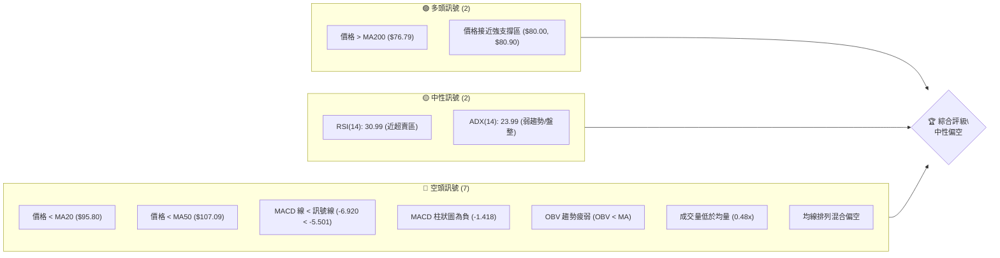

### 📊 核心指標速覽表

| 指標類別 | 指標名稱 | 當前數值 | 訊號 | 解讀 |
|----------|----------|----------|------|------|
| **價格** | 當前價格 | $81.04 | 🔴 | 位於近期下跌趨勢中，遠低於52週高點 |
| **均線** | MA20 | $95.80 | 🔴 | 價格位於MA20下方，短期趨勢看空 |
| **均線** | MA50 | $107.09 | 🔴 | 價格位於MA50下方，中期趨勢看空 |
| **均線** | MA200 | $76.79 | 🟢 | 價格位於MA200上方，長期趨勢受支撐 |
| **動能** | RSI(14) | 30.99 | 🟡 | 接近超賣區 (30以下)，可能出現反彈 |
| **動能** | MACD | -6.920 | 🔴 | MACD線位於訊號線下方，空頭動能強勁 |
| **波動** | ATR | $8.20 | 🟡 | 每日波動中等偏高 (10.11% of price) |

### 🏆 技術評分卡

RKLB 的技術評分顯示，在近期下跌過程中，動能和成交量配合度較差，但價格已抵達重要的支撐區間。

```
技術評分卡 — RKLB (2026-07-11)
════════════════════════════════════════════════════
趨勢強度      ████████░░░░░░░░░░░░  40/100  🟡
動能指標      ██████░░░░░░░░░░░░░░  30/100  🔴
支撐穩定度    ██████████████░░░░░░  70/100  🟢
成交量配合    ██████░░░░░░░░░░░░░░  30/100  🔴
形態完整度    ████████░░░░░░░░░░░░  40/100  🟡
均線排列      ██████░░░░░░░░░░░░░░  35/100  🔴
════════════════════════════════════════════════════
綜合評分      ████████░░░░░░░░░░░░  45/100  中性偏空
════════════════════════════════════════════════════
```
**評分理由：**
*   **趨勢強度 (40/100) 🟡：** ADX (14) 為 23.99，表明趨勢強度不足，市場處於盤整或弱勢趨勢。+DI 16.59 < -DI 31.10，顯示空頭主導。
*   **動能指標 (30/100) 🔴：** RSI(14) 30.99 接近超賣區，但仍處於中性偏空範圍。MACD 線與訊號線均為負值且 MACD 柱狀圖持續為負，顯示空頭動能強勁。Stoch %K/%D 處於超賣區。
*   **支撐穩定度 (70/100) 🟢：** 當前價格 $81.04 位於 S1 $80.00 附近，同時與 52 週斐波那契 61.8% 回調位 $80.90 高度重合，形成強勁的心理與技術支撐區。價格亦位於 MA200 $76.79 上方。
*   **成交量配合 (30/100) 🔴：** 最新成交量 14.33M 遠低於 20 日均量 30.04M (量比 0.48x)，且 OBV 趨勢疲弱，顯示下跌過程中的買盤不積極，但當前支撐區的成交量萎縮可能預示賣壓減輕。
*   **形態完整度 (40/100) 🟡：** 近期走勢為快速下跌後的盤整，尚未形成明確的反轉或持續形態，缺乏高信心度的幾何形態支持。
*   **均線排列 (35/100) 🔴：** 短期均線 (MA5, MA10, MA20, MA50, MA60, MA120) 全數位於價格上方，形成壓力。僅 MA200 位於價格下方提供支撐，整體均線排列呈現空頭趨勢。

---

## 2. 趨勢分析

### 🌐 多時框趨勢分析

RKLB 的多時框架分析顯示，雖然長期趨勢（月線）在過去一年半表現強勁，但在中期（週線）和短期（日線）時間框架內，已進入明顯的調整階段，目前呈現下跌後的盤整格局。

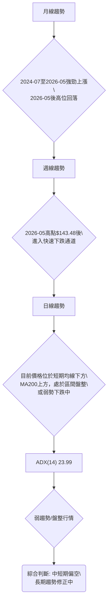

### 📈 長期趨勢 — 12個月走勢圖（Unicode）

RKLB 在過去一年經歷了從 $5.24 到 $143.48 的驚人漲幅，但自 2026 年 5 月高點後，進入了顯著的回調階段。當前價格 $81.04 位於高點回落的 61.8% 斐波那契回調位附近。

```
RKLB 月線走勢圖（過去12個月）
價格軸 ($)
$150 ┤                               ●(2026-05 高點 $143.48)
$125 ┤                               
$100 ┤                     ●             ●
$75  ┤         ●     ● ●       ●       ●←現在 ($81.04)
$50  ┤   ● ● ●
$25  ┤●
     └─────────────────────────────────────────────────────
      2025-07  08  09  10  11  12  2026-01  02  03  04  05  06  07
```

**走勢特徵分析表格**：

| 階段 | 時間段 | 價格區間 | 漲跌幅 | 特徵 | 訊號 |
|------|----------|------------|--------|------------------------------------|------|
| 1 | 2025-07 ~ 2026-01 | $45.92 ~ $80.07 | +74.37% | 穩健上漲，多頭動能強勁，突破多個阻力 | 🟢 |
| 2 | 2026-02 ~ 2026-04 | $69.10 ~ $82.51 | -13.62% (至2月低點) | 區間震盪整理，積蓄動能，未跌破關鍵支撐 | 🟡 |
| 3 | 2026-05 | $82.51 ~ $143.48 | +73.89% | 爆發式上漲，創下歷史新高，成交量放大 | 🟢 |
| 4 | 2026-06 ~ 2026-07 | $143.48 ~ $81.04 | -43.53% | 快速深度回調，賣壓沉重，跌破多條均線 | 🔴 |

### 📊 中期趨勢（週線分析）

從週線圖來看，RKLB 在 2026 年 5 月達到 $143.48 的高峰後，經歷了連續數週的強勁下跌。目前股價已從高點回落超過 40%，且近期週線收盤仍呈現陰線，顯示中期下跌趨勢仍未改變。儘管如此，當前價格已接近 52 週斐波那契 61.8% 回調位 $80.90 及 S1 $80.00，這可能為中期趨勢提供一個潛在的支撐點。如果此支撐能夠守穩，可能會有反彈機會；反之，若跌破則中期趨勢將進一步惡化。

```
RKLB 中期壓力與支撐示意圖
══════════════════════════════════════════════════════════════════
壓力區 ($)
$107.60 ┤               ┌───R3───┐
$99.58  ┤             ┌────R2─────┐
$93.10  ┤            ┌─────R1──────┐
$81.04  ╠═════════════════════════════════════════════════╣ ◄ 現價
$80.00  ┤            └─────S1──────┘
$73.99  ┤             └────S2─────┘
$66.85  ┤               └───S3───┘
支撐區 ($)
══════════════════════════════════════════════════════════════════
```

### ⚡ 趨勢強度評估（ADX 解讀）

ADX 指標用於衡量趨勢的強度，而非方向。當前 RKLB 的 ADX(14) 為 23.99，低於 25 的閾值，這表明市場處於**弱趨勢或盤整行情**。同時，+DI (16.59) 低於 -DI (31.10)，明確指出空頭力量在當前弱勢趨勢中佔據主導地位。

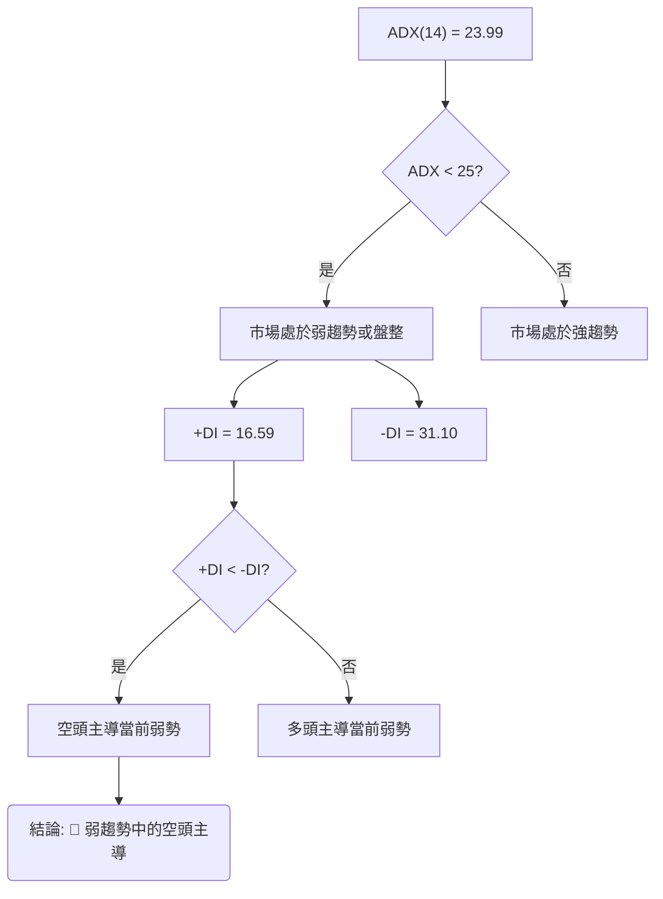

**ADX 強度對照表：**

| ADX 數值範圍 | 趨勢強度 | 建議 | 訊號 |
|--------------|----------|------|------|
| 0-25 | 弱趨勢/盤整 | 適合區間交易，等待突破 | 🟡 |
| 25-50 | 中等趨勢 | 趨勢確立，順勢交易 | 🟢 |
| 50-75 | 強趨勢 | 趨勢非常強勁，注意超買超賣 | 🟢 |
| 75-100 | 極強趨勢 | 趨勢可能接近尾聲，謹慎 | 🟡 |

當前 RKLB 的 ADX 數值落在 0-25 區間，印證了當前市場缺乏明確的單邊趨勢，更傾向於區間震盪或弱勢下跌。

---

## 3. 圖表形態分析

### 🔍 形態識別系統

根據提供的月線數據和近期價格走勢，RKLB 在 2026 年 5 月達到歷史高點 $143.48 後，經歷了快速而深度的回調。目前價格 $81.04 已經接近多個關鍵支撐位。在這種情況下，尚未形成明確且高信心度的複雜反轉或持續形態（如頭肩頂/底、雙頂/底或大型三角形）。相反，當前的價格行為更像是**快速下跌後的潛在盤整或底部嘗試**。

**近期觀察到的價格行為：**
*   **下跌通道/旗形潛力 (Bearish Flag Potential)**：從 $143.48 高點到 $81.04 的下跌，如果後續價格在 $80.00-$95.00 區間內形成一個向上的小幅反彈或橫向整理，則可能形成一個看跌旗形 (Bear Flag)，暗示下跌趨勢的延續。然而，目前缺乏足夠的橫向整理時間和反彈幅度來確認此形態。
*   **潛在的底部築底 (Potential Bottoming Process)**：價格目前位於強勁的支撐區域 ($80.00-$80.90)，如果在此區域能夠形成連續的低點抬高或雙底結構，則可能預示著反彈或反轉。但目前僅有單一低點觸及，尚需觀察後續幾週的價格行為。

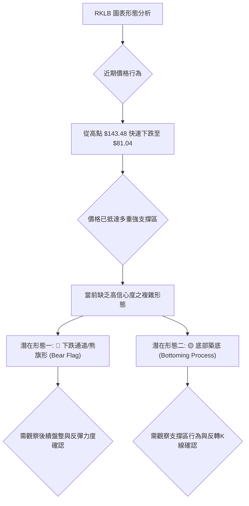

**形態信心度表格**：

| 形態 | 信心度 | 判斷依據（引用數據） | 完成度 | 目標價（附計算式） |
|------|--------|----------------------|--------|--------------------|
| **下跌通道/熊旗形** | 45% | 價格自 $143.48 高點快速下跌，目前處於弱勢反彈或橫向整理，成交量萎縮。若後續無法突破 R1 $93.10，則可能延續下跌。 | 20% | 若熊旗形成立，跌破 $80.00 支撐，理論目標價可能為 $80.00 - ($143.48 - $80.00) = $16.52 (極端情況，僅供參考) |
| **底部築底 (雙底/W底)** | 35% | 價格已跌至 S1 $80.00 和斐波那契 61.8% $80.90 附近。需觀察此處是否能形成有效反彈並再次測試此區，形成第二個低點。 | 10% | 訊號不足，目前無法推算。 |
| **總結** | - | 數據中未偵測到明確且高信心度的幾何形態，目前處於修正後的盤整階段。 | - | - |

### 🕯️ 重要K線形態分析

由於提供的數據為月度收盤價和週度收盤走勢，難以判斷具體的日線K線形態。然而，從近期的週線收盤價來看：

| 月份/週別 | 收盤價 | 週成交量 | K線形態 (推測，基於週線收盤) | 解讀 | 訊號 |
|-----------|--------|------------|--------------------------------|------|------
| 2026-05-31 | $143.48 | 117.45M | **長上影線陰線/吞噬頂 (假定)** | 股價衝高後回落，顯示強大賣壓，為中期頂部訊號。 | 🔴 |
| 2026-06-07 | $110.08 | 124.68M | **長陰線** | 賣盤持續，價格快速下跌，確認中期下跌趨勢。 | 🔴 |
| 2026-06-14 | $102.39 | 139.27M | **中陰線** | 賣壓仍重，但跌速略緩，接近前期支撐。 | 🔴 |
| 2026-06-21 | $107.24 | 155.86M | **短陽線/十字星 (假定)** | 嘗試反彈但未果，顯示多空膠著，但上方壓力大。 | 🟡 |
| 2026-06-28 | $84.54 | 138.16M | **長陰線** | 反彈失敗，價格再次快速下跌，跌破關鍵支撐。 | 🔴 |
| 2026-07-05 | $100.46 | 119.56M | **長陽線** | 嘗試強勁反彈，但未能持續，僅為技術性修正。 | 🟡 |
| 2026-07-12 | $81.04 | 98.08M | **長陰線** | 反彈失敗，價格再次大幅回落，顯示賣壓強勁，且收盤價接近支撐。 | 🔴 |

**解讀**：近期週線K線多為陰線，成交量在中期高點時放大，隨後下跌過程中保持較高水平，但在 $81.04 附近有所萎縮。這顯示賣壓在近期高點後持續，儘管在 $81.04 附近可能出現短期買盤介入，但整體K線形態仍偏空。

### 📉 ASCII 走勢形態示意圖

以下為 RKLB 近期從高點回落至關鍵支撐的示意圖，顯示了當前處於潛在的盤整區域。

```
RKLB 近期走勢形態示意圖
═══════════════════════════════════════════════════════════
$150 ┤                                 ● (2026-05 高點 $143.48)
$140 ┤                                /
$130 ┤                               /
$120 ┤                              /
$110 ┤                             /
$100 ┤                            /
$90  ┤                           /
$80  ┤                          ●─────── 現價 ($81.04) ───────● (S1 $80.00 / Fib 61.8% $80.90)
$70  ┤                         /
$60  ┤                        /
$50  ┤
     └──────────────────────────────────────────────────────────
       (時間軸)      高點回落               潛在盤整區
```
**形態解讀**：從示意圖可以看出，RKLB 股價自 5 月高點 $143.48 之後呈現明顯的下跌趨勢，目前已跌至 $81.04，接近強支撐 S1 $80.00 和斐波那契 61.8% $80.90。此區域是潛在的底部測試區，若能有效支撐，可能形成橫向盤整或小幅反彈；若跌破，則將進一步探底。

### 🎯 形態目標價計算

由於目前沒有高信心度的幾何形態可供精確計算目標價，我們將主要依賴支撐與阻力位以及斐波那契回調位來設定目標。

*   **若形成有效雙底形態 (信心度低)**：假設價格能在 S1 $80.00 附近形成第二個底部，並突破一個假定的頸線 (例如 R1 $93.10)。形態高度約為 ($93.10 - $80.00) = $13.10。則目標價為 $93.10 + $13.10 = $106.20。**此為高度假設，目前無足夠數據支持。**
*   **若熊旗形確認 (信心度低)**：若價格在 $80.00 附近形成短暫盤整後，再次跌破 $80.00，則下跌目標可參考旗杆高度。從 $143.48 跌至 $80.00，旗杆高度約 $63.48。則目標價為 $80.00 - $63.48 = $16.52。**此為極端下跌情況，僅為理論推算，實際市場可能在更強的長期支撐位獲得支撐。**

**結論**：在缺乏明確形態的情況下，應避免過度依賴形態目標價。當前應更關注關鍵支撐阻力位的有效性，並將其作為短線交易的目標參考。

---

## 4. 支撐與阻力

### 🗺️ 關鍵價位分布圖（Unicode）

RKLB 目前價格 $81.04 位於多個關鍵支撐位之上，但同時也面臨上方短期均線和阻力位的壓力。

```
RKLB 價位結構分布圖
═══════════════════════════════════════════════════
$107.60 ║████████████████████████║ 強阻力 R3 (斐波那契38.2%回調位 $107.67)
$99.58  ║████████████████████    ║ 阻力 R2
$94.28  ║████████████████████████║ 斐波那契50.0%回調位
$93.10  ║████████████████████████║ 關鍵阻力 R1
$81.04  ╠════════════════════════╣ ◄ 現價
$80.90  ║▓▓▓▓▓▓▓▓▓▓▓▓▓▓▓▓        ║ 斐波那契61.8%回調位
$80.00  ║▓▓▓▓▓▓▓▓▓▓▓▓▓▓▓▓        ║ 近期支撐 S1
$76.79  ║▓▓▓▓▓▓▓▓▓▓▓▓▓▓▓▓        ║ MA200
$73.99  ║████████████████████████║ 強支撐 S2
$66.85  ║████████████████████████║ 強支撐 S3
═══════════════════════════════════════════════════
```

### 🚧 阻力位分析表

RKLB 上方的阻力位密集，短期均線也構成壓力，顯示反彈阻力較大。

| 阻力級別 | 價位 | 形成原因 | 突破難度 | 重要性 |
|----------|------|----------|----------|--------|
| R1 | $93.10 | 近一年波段高點聚類，同時接近斐波那契 50.0% 回調位 $94.28 及 MA20 $95.80。 | 中高 | 🟢 若能突破此位，短期下跌壓力將大幅緩解，並有機會挑戰更高阻力。 |
| R2 | $99.58 | 近一年波段高點聚類，此位上方有 MA50 $107.09，形成中期壓力。 | 高 | 🟡 突破 R2 需更強勁的買盤推動，將確認短期反彈動能。 |
| R3 | $107.60 | 近一年波段高點聚類，與斐波那契 38.2% 回調位 $107.67 高度重合。 | 甚高 | 🔴 突破此位意味著中期趨勢可能出現反轉，但難度極大。 |

### 🛡️ 支撐位分析表

RKLB 目前位於多重支撐的匯集處，特別是斐波那契 61.8% 回調位，提供了較強的底部支撐。

| 支撐級別 | 價位 | 形成原因 | 守住機率 | 重要性 |
|----------|------|----------|----------|--------|
| S1 | $80.00 | 近一年波段低點聚類，與斐波那契 61.8% 回調位 $80.90 形成強勁共振區。 | 中高 | 🟢 當前最關鍵的短線支撐，決定是否能止跌盤整或反彈。 |
| S2 | $73.99 | 近一年波段低點聚類，同時位於 MA200 $76.79 附近，構成長期趨勢支撐。 | 中 | 🟡 若 S1 失守，S2 將是下一個重要防線，MA200 的支撐作用不容忽視。 |
| S3 | $66.85 | 近一年波段低點聚類，為更深層次的技術支撐。 | 中 | 🔴 若 S2 也被跌破，則空頭趨勢將進一步確立，S3 為最後防線。 |

### 📐 斐波那契回調位分析

RKLB 的 52 週區間 (從低點 $37.57 到高點 $151.00) 斐波那契回調位分析如下：

| 斐波那契比例 | 價位 | 意義 | 當前狀態 |
|--------------|------|------|----------|
| 0.0% (52W High) | $151.00 | 趨勢起始高點 | 遠離 |
| 23.6% | $124.23 | 淺層回調位 | 遠離 |
| 38.2% | $107.67 | 中等回調位，與 R3 $107.60 重合 | 遠離 |
| 50.0% | $94.28 | 關鍵心理回調位，與 R1 $93.10 接近 | 遠離 |
| **61.8%** | **$80.90** | **黃金回調位，通常為強勁支撐區** | **◄ 現價 $81.04 附近** |
| 78.6% | $61.84 | 深度回調位 | 遠離 |
| 100.0% (52W Low) | $37.57 | 趨勢起始低點 | 遠離 |

**解讀**：當前價格 $81.04 位於斐波那契 61.8% 回調位 $80.90 的正上方。這是技術分析中一個極為重要的支撐位，通常被視為一個潛在的反轉點或強勁的買入區域。它與 S1 $80.00 形成了一個強大的支撐區間。若此位能有效守穩，有望觸發技術性反彈；若不幸跌破，則可能進一步下探 $61.84 (78.6% 回調位) 甚至更低。

---

## 5. 技術指標深度解讀

### 🎛️ 指標訊號總覽

RKLB 的技術指標呈現出短期偏空但同時面臨關鍵支撐的複雜局面。

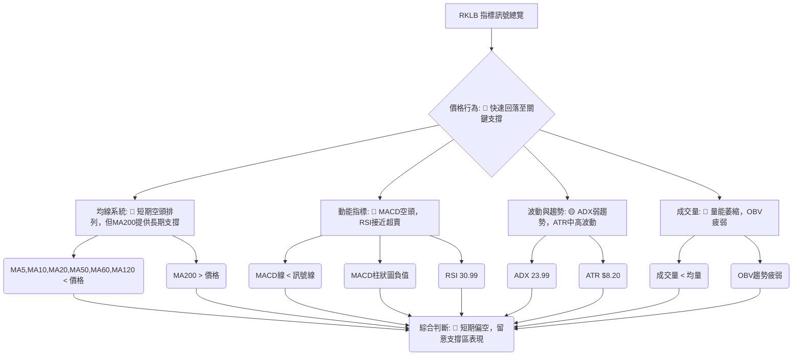

### 📈 移動平均線排列分析

RKLB 的均線系統呈現出明顯的短中期空頭排列，但長期均線 MA200 仍提供重要支撐。

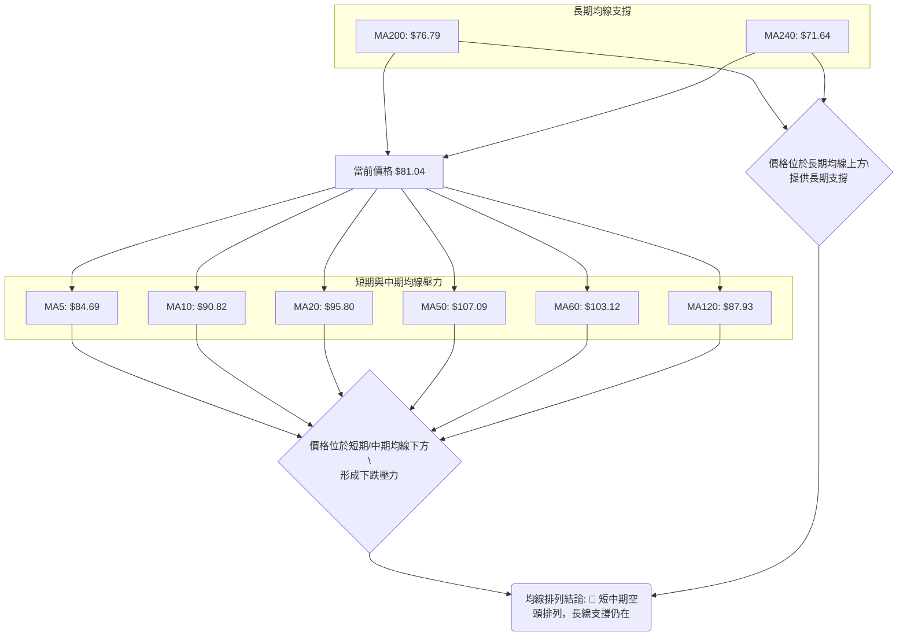
**解讀**：
*   **短期均線 (MA5, MA10, MA20)**: 當前價格 $81.04 遠低於所有短期均線 ($84.69, $90.82, $95.80)，形成強勁的短期下跌趨勢。
*   **中期均線 (MA50, MA60, MA120)**: 同樣，價格也位於這些中期均線 ($107.09, $103.12, $87.93) 之下，表明中期趨勢也偏空。這些均線將在價格反彈時構成重要的阻力。
*   **長期均線 (MA200, MA240)**: 值得注意的是，價格 $81.04 仍位於 MA200 ($76.79) 和 MA240 ($71.64) 之上。這表明儘管近期經歷深度回調，RKLB 的長期牛市結構尚未完全被破壞，MA200 提供了重要的長期趨勢支撐。
*   **均線排列**：目前呈現混合排列，但短期均線明顯向下彎曲並位於價格上方，中期均線也開始向下。這種排列模式在短期內極為看空，暗示除非有強勁買盤介入，否則價格反彈將面臨重重阻力。

### 📉 RSI(14) 分析

**RSI(14) 數值**：30.99
**RSI 強度進度條**：▓▓▓▓▓▓░░░░░░░░░░░░░░ 31% (接近超賣)

**超買超賣區間分析**：
*   RSI 數值 30.99 位於 30-70 的中性區間下沿，非常接近傳統的超賣區 (30 以下)。
*   這表明近期賣壓非常沉重，股價處於相對低位。從歷史經驗來看，RSI 進入超賣區後往往會伴隨技術性反彈。
*   然而，在強勁的下跌趨勢中，RSI 可能會在超賣區徘徊一段時間，直到趨勢真正逆轉。當前 RSI 尚未完全進入超賣，但已處於超賣邊緣，暗示短期內可能出現多頭抵抗或反彈。

**背離判斷**：
*   數據中明確指出「RSI 背離: 無明顯背離」。
*   這意味著在目前的價格下跌過程中，RSI 並未出現底背離 (即價格創新低而 RSI 未創新低)，因此目前缺乏基於 RSI 背離的明確反轉訊號。這也進一步支持了當前仍處於下跌或盤整趨勢的判斷。

### 📊 MACD(12/26/9) 訊號解讀

MACD 是動能指標，用於識別趨勢的強度、方向和潛在反轉點。

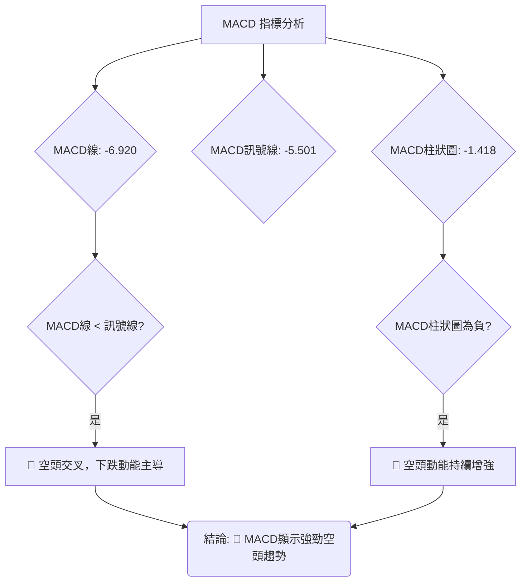
**解讀**：
*   **MACD 線 (-6.920)** 位於 **訊號線 (-5.501)** 下方：這是一個明確的空頭訊號，表明短期動能弱於中期動能，預示著下跌趨勢仍在持續。
*   **MACD 柱狀圖 (-1.418)** 為負值且持續向下：柱狀圖的負值表明空頭動能正在累積或持續釋放。從近 20 週數據來看，MACD 柱狀圖在 2026-05-31 後由正轉負，並持續擴大負值，顯示賣壓沉重。雖然本週 (-1.418) 相較前幾週 (-4.091, -0.335) 有所波動，但仍為負值，整體空頭趨勢未變。
*   **MACD 背離**：數據中未明確指出 MACD 背離。在當前價格快速下跌的情況下，若 MACD 未能同步創出新低，可能存在隱性底背離，但目前數據不足以提供高信心度的判斷。

**綜合判斷**：MACD 指標明確發出空頭訊號，支持 RKLB 目前處於下跌趨勢中的判斷。

### 📦 布林通道分析

布林通道由三條線組成：中軌 (MA20)、上軌和下軌，用於衡量股價的波動範圍。

```
RKLB 布林通道示意圖
═══════════════════════════════════════════════════════════════
$117.39 ┤                     ┌────── 上軌 ──────┐
$110.00 ┤                     │                  │
$100.00 ┤                     │                  │
$95.80  ┤                     ├────── 中軌 (MA20) ──────┤
$90.00  ┤                     │                  │
$81.04  ╠═══════════════════════════════════════════════════╣ ◄ 現價
$80.00  ┤                     │                  │
$74.21  ┤                     └────── 下軌 ──────┘
$70.00  ┤
═══════════════════════════════════════════════════════════════
```
**解讀**：
*   **布林上軌**：$117.39
*   **布林中軌 (MA20)**：$95.80
*   **布林下軌**：$74.21
*   **當前價格**：$81.04
*   **%B 值**：0.16 (0=下軌, 0.5=中軌, 1=上軌)

**分析**：
1.  **價格位置**：當前價格 $81.04 位於布林中軌 $95.80 和下軌 $74.21 之間，並且非常接近下軌。%B 值為 0.16，顯示價格在布林通道的下半部分運行，接近下軌。
2.  **通道寬度**：數據未提供布林帶寬，但從上、下軌和中軌的數值來看，通道具有一定的寬度，表明股價波動性尚可。
3.  **潛在訊號**：價格觸及或接近布林下軌通常被視為超賣訊號，可能預示著短期內會出現反彈或止跌盤整。然而，在強烈的下跌趨勢中，價格可能會沿著下軌運行，甚至跌出下軌，形成「布林帶外運行」的趨勢延續訊號。
4.  **結合 ADX**：由於 ADX(14) 為 23.99 (弱趨勢/盤整行情)，布林通道的意義更傾向於提供區間交易的參考。價格接近下軌，結合 ADX 判斷，可能預示著短期內將在 $74.21 (下軌) 至 $95.80 (中軌) 之間進行盤整或反彈。

### 💹 成交量分析（量價配合度）

成交量是價格走勢的能量。量價配合度對於確認趨勢的有效性至關重要。

*   **最新成交量**：14,330,435 股
*   **20日均量**：30,038,312 股
*   **50日均量**：28,294,097 股
*   **量比 (最新成交量 / 20日均量)**：0.48x
*   **OBV 趨勢**：OBV < MA → 量能疲弱

**解讀**：
1.  **成交量萎縮**：當前成交量遠低於 20 日和 50 日均量，量比僅為 0.48x。這表明在當前價格水平上，市場交投不活躍，買賣雙方都較為謹慎。在下跌趨勢中，成交量萎縮可能意味著賣壓暫時減輕，或者市場缺乏新的賣出動能，但同時也缺乏買入動能。
2.  **OBV 趨勢疲弱**：OBV (On-Balance Volume) 是一種累積成交量指標，其趨勢與價格趨勢的配合度可以確認趨勢的有效性。當前 OBV 趨勢疲弱 (OBV < MA)，表示在價格下跌過程中，累積的買盤壓力不足以支撐股價，或賣盤力量佔據上風。這與價格下跌的趨勢相符，確認了下跌趨勢的有效性。
3.  **量價背離**：目前數據中未偵測到明確的量價背離。如果價格在下跌至支撐位時，成交量顯著放大，而後在反彈時成交量持續放大，則可能預示底部形成。然而，目前的成交量萎縮，雖然可能暗示賣壓減輕，但也未見積極的買盤介入。

**綜合判斷**：成交量分析顯示，RKLB 的量能配合度較差，目前的成交量萎縮可能預示著賣壓的暫時枯竭，但缺乏積極的買盤介入，因此量能訊號整體偏空。

---

## 6. 動能與波動率

### ⚡ 動能評估四象限

根據 ADX 趨勢強度和 ATR 波動率，我們可以將 RKLB 的當前市場狀態定位在動能評估四象限中。

| 象限 | 動能 (ADX) | 波動 (ATR) | 當前狀態 | 評估 |
|------|------------|------------|----------|------|
| Q1 | 強 (ADX>25) | 低 | - | 最佳機會 (趨勢確立，波動穩定) |
| Q2 | 弱 (ADX<25) | 低 | - | 謹慎觀望 (缺乏方向，波動小) |
| Q3 | 強 (ADX>25) | 高 | - | 高風險高收益 (趨勢強但波動大) |
| **Q4** | **弱 (ADX<25)** | **高** | **✓** | **避免進場 / 區間操作 (缺乏方向，波動大)** |

**解讀**：
*   **ADX(14) = 23.99**：低於 25，表明趨勢強度較弱，市場處於盤整或弱勢趨勢。
*   **ATR(14) = $8.20 (10.11% of price)**：相對於 $81.04 的價格，每日波動幅度達到 10.11%，這是一個相對較高的波動率。近期從高點 $143.48 快速下跌，也顯示了其高波動性。

因此，RKLB 目前處於 **Q4 (弱動能 / 高波動)** 象限。這意味著市場缺乏明確的趨勢方向，但價格波動劇烈。對於趨勢交易者而言，這是一個較難操作的環境，因為趨勢不明確，但波動性又增加了風險。對於區間交易者而言，高波動性可能提供交易機會，但需要嚴格的風險控制。

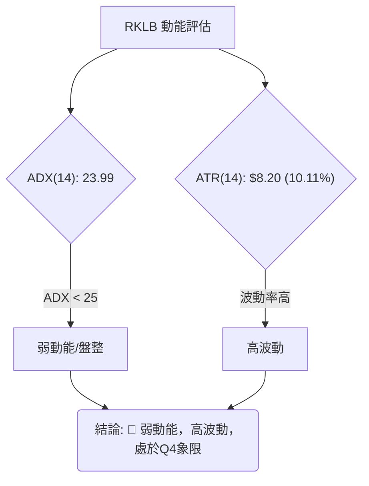

### 📊 ATR 波動率分析

ATR (Average True Range) 衡量資產價格的波動性。RKLB 的 ATR(14) 為 $8.20。

**解讀**：
*   **ATR 數值**：$8.20。這意味著在過去 14 天中，RKLB 的平均每日價格波動範圍為 $8.20。
*   **波動率佔比**：$8.20 / $81.04 = 10.11%。這是一個相對較高的波動率，表明 RKLB 股價的每日變動幅度較大。
*   **交易意義**：
    *   **風險管理**：高 ATR 意味著更高的每日風險。止損點的設定需要考慮到這一點，避免過於緊密而被正常波動掃出。通常，止損可以設置在當前價格下方 1-2 倍 ATR 的距離。
        *   若以 1 倍 ATR 止損：$81.04 - $8.20 = $72.84
        *   若以 1.5 倍 ATR 止損：$81.04 - (1.5 * $8.20) = $81.04 - $12.30 = $68.74
    *   **目標價設定**：高波動性也可能帶來更大的潛在利潤空間，目標價的設定也可以參考 ATR 的倍數。
    *   **進場時機**：在弱勢趨勢中，高波動性可能導致價格快速觸及支撐或阻力，為區間交易者提供進場機會。

### 📐 Beta 與市場相關性

**Beta**：2.553

**解讀**：
*   **高 Beta 值**：RKLB 的 Beta 值高達 2.553，遠高於市場平均水平 (Beta=1)。這表明 RKLB 的股價波動性遠大於大盤。
*   **市場相關性**：當大盤上漲 1% 時，RKLB 理論上平均上漲 2.553%；當大盤下跌 1% 時，RKLB 理論上平均下跌 2.553%。
*   **投資意義**：
    *   **高風險高收益**：高 Beta 股票通常被視為高風險高收益的投資標的。在牛市中，它可能帶來超額回報；但在熊市中，它也可能經歷更劇烈的下跌。
    *   **市場敏感性**：RKLB 對市場情緒和宏觀經濟數據非常敏感。投資者在交易 RKLB 時，需要密切關注大盤走勢，因為大盤的任何變動都可能被放大。
    *   **組合配置**：對於追求穩定收益的投資者，RKLB 的高 Beta 值可能增加投資組合的整體波動性。對於風險承受能力較高的投資者，它則提供了追求更高回報的潛力。

---

## 7. 多時框架總結

### 📋 時框架評分表

| 時框架 | 趨勢方向 | 動能 | 均線排列 | 形態 | 綜合評分 | 建議 |
|--------|----------|------|----------|------|----------|------|
| **月線** | 🟢 上漲後修正 | 🟡 中性偏弱 | 🟢 多頭排列修正 | 🟡 頂部回調 | 60/100 | 監控長期支撐 |
| **週線** | 🔴 下跌趨勢 | 🔴 空頭強勁 | 🔴 空頭排列 | 🔴 下跌通道 | 30/100 | 謹慎看空 |
| **日線** | 🟡 盤整偏空 | 🔴 空頭強勁 | 🔴 短期空頭排列 | 🟡 底部測試中 | 35/100 | 區間交易/等待突破 |

### 🔲 綜合訊號矩陣

RKLB 的多時框架訊號顯示，短期和中期趨勢均偏空，但長期趨勢仍受 MA200 支撐，且價格已跌至關鍵斐波那契回調位。

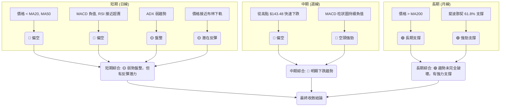

### ⚖️ 多時框收斂結論

根據嚴格要求，我們首先判斷當前市場的趨勢強度。RKLB 的 ADX(14) 為 23.99，**低於 25 的閾值，明確指示目前處於弱趨勢或盤整行情**。因此，我們將主要聚焦於日線級別的區間操作，並以布林通道上下軌作為主要交易參考。

儘管日線和週線指標（MA排列、MACD、OBV）均呈現強烈空頭訊號，但價格已跌至多重強勁支撐位：
1.  **S1 $80.00**
2.  **斐波那契 61.8% 回調位 $80.90**
3.  **MA200 $76.79**

這些支撐位的匯集，加上 RSI 接近超賣區 (30.99) 和價格接近布林下軌 ($74.21)，暗示賣壓可能暫時得到緩解，存在技術性反彈的可能性。然而，由於 ADX 顯示弱趨勢且 MACD 仍處於空頭，任何反彈都可能只是下跌趨勢中的修正，而非趨勢反轉。

**最終結論**：RKLB 目前處於**弱勢盤整行情，且傾向於底部測試**。雖然短期和中期趨勢偏空，但價格已達到關鍵的技術支撐區間。因此，主導策略應為**區間操作，並密切關注支撐位的有效性及突破方向**。若支撐 $80.00-$80.90 區間能有效守穩，則可能出現向布林中軌 $95.80 或 R1 $93.10 的反彈；若此區間不幸跌破，則將確認下跌趨勢的延續，並可能下探 S2 $73.99。

---

## 8. 交易策略建議

### 🗺️ 策略決策流程圖

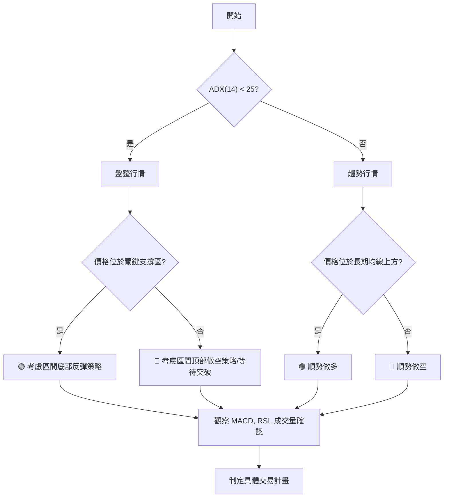

### 🧭 策略路由（依評分卡分流，不得兩頭下注）

根據第 1 章「技術評分卡」的綜合評分 45/100，RKLB 處於**中性偏空**狀態。結合多時框架收斂結論，市場為弱趨勢盤整行情，但價格位於強支撐區。因此，主策略將側重於**在強支撐區尋找短期反彈機會，同時警惕下破風險**。

**當前主策略方向 = 中性偏空，等待區間底部反彈或突破確認（依評分 45/100）**

### 🎯 價格情境階梯（Price Scenarios）

| 觸發條件 | 下一目標 | 後續延伸 | 情境含義 |
|----------|----------|----------|----------|
| **突破 R1 $93.10 並站穩** | R2 $99.58 | R3 $107.60 (斐波那契38.2% $107.67) | **短線轉強**：若能放量突破 R1，將確認短期反彈動能，並可能挑戰更高阻力。 |
| **站穩現價區間 ($80.00-$80.90)** | — | R1 $93.10 (布林中軌 $95.80) | **區間震盪**：若在當前支撐區有效盤整，則可能向區間上沿反彈。 |
| **跌破 S1 $80.00 (特別是斐波那契 61.8% $80.90)** | S2 $73.99 (MA200 $76.79) | S3 $66.85 | **中期轉弱**：若強支撐區失守，將確認下跌趨勢延續，並可能加速下探。 |

### 📊 情境機率分佈

| 情境 | 機率 | 主要依據 |
|------|------|----------|
| **繼續上行 / 反彈 (至 R1/布林中軌)** | 40% | RSI 接近超賣區 (30.99)，價格位於斐波那契 61.8% $80.90 及 S1 $80.00 強支撐區。MA200 提供長期支撐。 |
| **區間震盪 ($80.00 - $95.00)** | 40% | ADX (23.99) 顯示弱趨勢/盤整行情。成交量萎縮，MACD 雖空頭但下跌速度可能放緩。 |
| **回落 / 再探底 (跌破 S1)** | 20% | MACD 持續空頭，均線空頭排列，OBV 疲弱。若強支撐區未能守穩，則下跌趨勢將延續。 |

### 🟢 主策略詳情

基於當前價格位於強支撐區且 ADX 顯示盤整行情，主要策略為**區間底部反彈**，並設有嚴格止損。

| 策略要素 | 策略 A：區間底部反彈 (短線) | 策略 B：等待突破 (中線) |
|----------|------------------------------|--------------------------|
| **進場條件** | 價格在 $80.00-$80.90 區間內出現止跌訊號 (如小陽線、放量止跌)。 | 等待價格明確突破 R1 $93.10 並站穩，或跌破 S1 $80.00。 |
| **進場價格** | $81.00 - $81.50 (在 $80.90 斐波那契支撐上方) | 突破 $93.10 後回踩不破 $93.10 進場 (看多)；跌破 $80.00 後反彈不過 $80.00 進場 (看空)。 |
| **目標價 T1** | $93.10 (R1) | **看多**: $99.58 (R2) <br> **看空**: $73.99 (S2) |
| **目標價 T2** | $99.58 (R2) | **看多**: $107.60 (R3) <br> **看空**: $66.85 (S3) |
| **止損價格** | $79.50 (略低於 S1 $80.00 及斐波那契 61.8% $80.90) | **看多**: $92.00 (略低於 R1) <br> **看空**: $81.50 (略高於 S1) |
| **風險報酬比** | (T1: $93.10 - $81.50) / ($81.50 - $79.50) = $11.6 / $2 = **5.8 : 1** | **看多**: (T1: $99.58 - $93.10) / ($93.10 - $92.00) = $6.48 / $1.1 = **5.9 : 1** <br> **看空**: ($80.00 - $73.99) / ($81.50 - $80.00) = $6.01 / $1.5 = **4 : 1** |
| **成功機率** | 40% | 看多: 35% / 看空: 25% |
| **建議倉位** | 輕倉 (5-10%) | 依突破方向確認後，中等倉位 (10-15%) |

### 🔴 反向風險觸發點（對沖提示）

以下情況可能推翻主策略 (區間底部反彈) 的判斷，需密切監控：
*   **跌破 S1 $80.00 並收盤在 $79.50 以下**：這將嚴重削弱當前支撐區的有效性，可能加速下跌至 S2 $73.99。
*   **MACD 柱狀圖持續擴大負值，且 RSI 跌破 30**：顯示空頭動能進一步增強，短期反彈動力不足。
*   **成交量在跌破支撐時顯著放大**：確認賣壓加劇，趨勢延續。

### ⭐ 整體訊號強度評星

```
做多訊號強度：★★☆☆☆  (2/5星) (短期反彈潛力，但趨勢偏空)
做空訊號強度：★★★☆☆  (3/5星) (中期下跌趨勢，但已至強支撐)
整體可信度：  ★★★☆☆  (3/5星) (市場處於關鍵轉折點，需謹慎)
```

---

## 9. 風險提示與監控

### ✅ 關鍵監控指標 Checklist

以下為 RKLB 投資者應密切關注的關鍵技術指標，以實時調整交易策略：

╔══════════════════════════════════════════════════════════════╗
║                 RKLB 關鍵監控指標清單                          ║
╠══════════════════════════════════════════════════════════════╣
║ [ ] **價格行為**：是否有效守穩 $80.00 - $80.90 支撐區？        ║
║ [ ] **MA200 ($76.79)**：是否被跌破？長期趨勢的關鍵防線。      ║
║ [ ] **RSI(14)**：是否跌破 30 進入超賣區？或從超賣區反彈？     ║
║ [ ] **MACD 柱狀圖**：負值是否持續擴大？或開始縮小轉正？       ║
║ [ ] **成交量**：反彈時是否放量？下跌時是否縮量或放量？       ║
║ [ ] **ADX(14)**：是否突破 25 且 +DI/-DI 趨勢明確？            ║
║ [ ] **布林通道**：價格是否跌破下軌或突破中軌？通道是否收窄？ ║
║ [ ] **斐波那契回調位**：61.8% ($80.90) 是否有效？             ║
╚══════════════════════════════════════════════════════════════╝

### ⚠️ 風險場景分析

RKLB 目前處於關鍵的技術轉折點，存在多種情境發展的可能性。

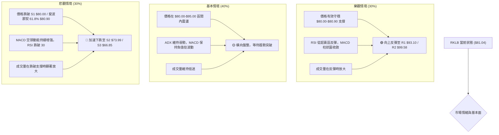

### 🛡️ 風險管理重要提醒

1.  **嚴格止損**：RKLB 具有高 Beta (2.553) 和高 ATR (10.11%)，波動性極大。任何交易都必須設置嚴格的止損點，並嚴格執行，以防範價格劇烈波動帶來的潛在巨額虧損。
2.  **倉位控制**：由於市場趨勢不明且波動性高，建議採用輕倉策略。即使是看好的反彈機會，也應將倉位控制在總資金的 5-10% 之間，避免過度集中風險。
3.  **分批建倉/減倉**：在趨勢不明確時，可以考慮分批建倉或減倉。例如，在支撐位附近少量試探性建倉，待趨勢確認後再逐步加碼。
4.  **多時框確認**：在任何交易決策前，應再次確認日線、週線甚至月線的訊號是否一致。尤其在 ADX 顯示弱趨勢時，長線趨勢的修正可能影響短線反彈的持續性。
5.  **不追漲殺跌**：在盤整行情中，追漲殺跌往往容易被市場震盪出局。應耐心等待價格觸及關鍵支撐或阻力，並結合動能指標確認後再行動。
6.  **密切關注大盤**：RKLB 的高 Beta 值意味著其股價表現與大盤高度相關。大盤的任何大幅波動都可能對 RKLB 產生放大效應，因此需將大盤走勢納入風險考量。
7.  **基本面配合**：雖然本報告為技術分析，但長期投資仍需結合基本面分析。RKLB 目前 P/S 74.5、P/B 20.6，且 EPS (TTM) 為負值，估值偏高，若技術面支撐失效，基本面可能無法提供足夠的緩衝。

---

## 📋 報告總結

```
RKLB 技術分析報告總結
════════════════════════════════════════════════════════
報告日期：2026-07-11
當前價格：$81.04
分析評級：⚖️ 中性偏空，等待區間底部反彈或突破確認

關鍵結論：
├─ 長期趨勢：🟢 經歷大幅上漲後進入修正，但MA200提供長期支撐。
├─ 中期趨勢：🔴 自高點$143.48後快速下跌，中期趨勢偏空。
├─ 短期趨勢：🟡 弱勢盤整，但價格已抵達強支撐區。
├─ 關鍵支撐：$80.00 (S1) 與 $80.90 (斐波那契61.8%)
├─ 關鍵阻力：$93.10 (R1)
└─ 分析師目標：$116.50 (平均目標價，需突破多重阻力)

最優策略組合：
1. 🥇 最佳機會：在 $80.00 - $80.90 區間尋找止跌訊號，輕倉佈局短期反彈至 R1 $93.10。
2. 🥈 次選機會：若價格放量突破 R1 $93.10 並站穩，可考慮追多至 R2 $99.58。
3. 🥉 保守選擇：若價格跌破 S1 $80.00，應立即止損，並考慮等待 S2 $73.99 附近的機會，或觀望。
════════════════════════════════════════════════════════
```

---

> ⚠️ **免責聲明**：本報告為 AI 自動生成之技術分析，所有數據及估算均基於提供的歷史價格資訊。本報告**僅供研究與學術參考**，**不構成任何投資建議**。投資有風險，入市需謹慎。

---

*報告生成時間：2026-07-11 ｜ 數據來源：Yahoo Finance ｜ 分析框架：多時框技術分析*