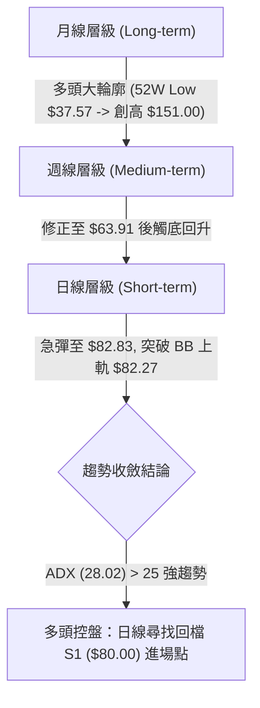
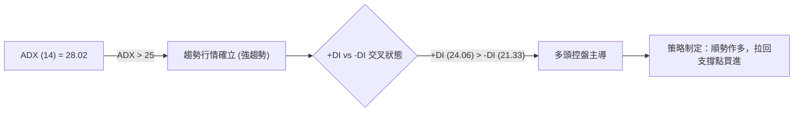
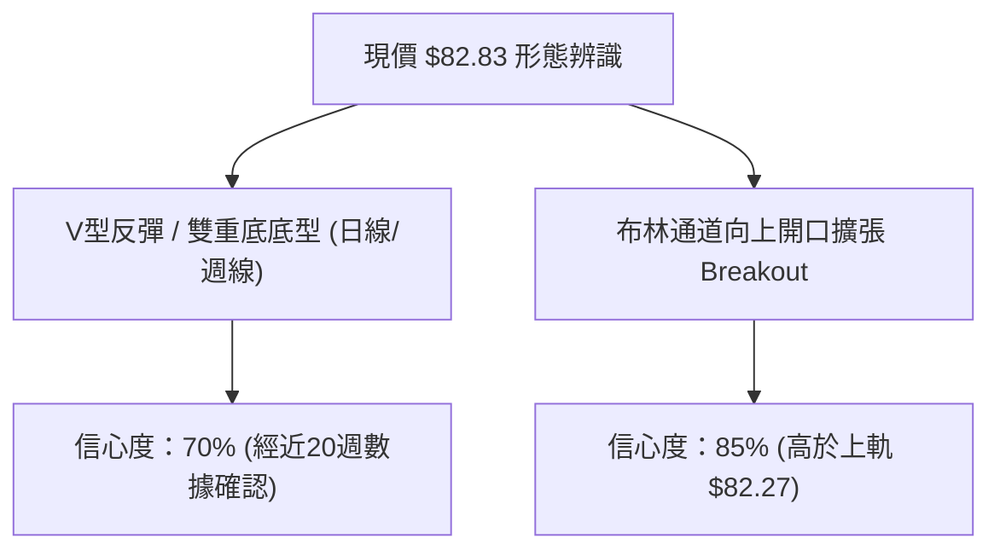
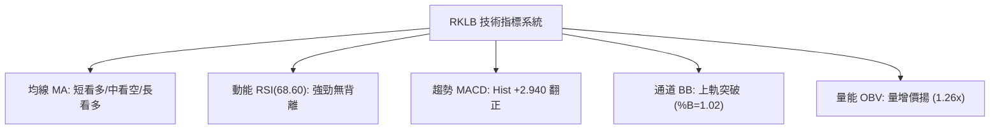
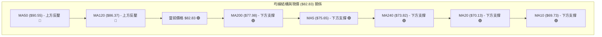
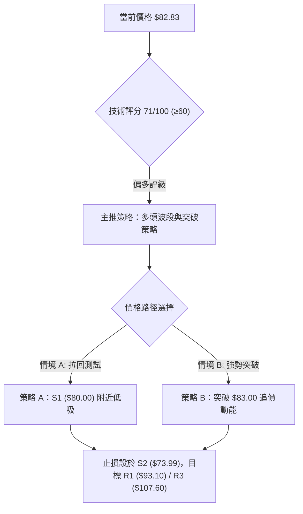
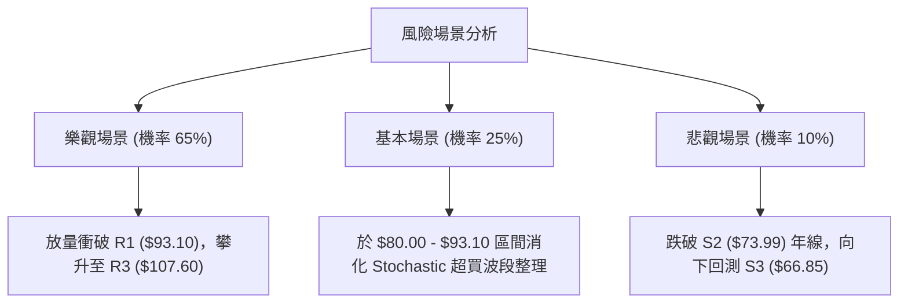

# RKLB 技術分析報告

> **報告日期**：2026-08-07 ｜ **語言**：繁體中文 ｜ **數據來源**：Yahoo Finance ｜ **當前價格**：$82.83

---

## 目錄

| 章節 | 內容 |
|------|------|
| [1. 技術面概覽](#1-技術面概覽) | 訊號儀表板、核心指標、評分卡 |
| [2. 趨勢分析](#2-趨勢分析) | 多時框趨勢、長中短期走勢 |
| [3. 圖表形態分析](#3-圖表形態分析) | 形態識別、K線組合、目標價 |
| [4. 支撐與阻力](#4-支撐與阻力) | 關鍵價位、斐波那契回調 |
| [5. 技術指標深度解讀](#5-技術指標深度解讀) | MA/RSI/MACD/布林/成交量 |
| [6. 動能與波動率](#6-動能與波動率) | 動能評估、ATR、Beta |
| [7. 多時框架總結](#7-多時框架總結) | 時框架評分矩陣 |
| [8. 交易策略建議](#8-交易策略建議) | 多空策略、風險報酬比 |
| [9. 風險提示與監控](#9-風險提示與監控) | 監控指標、風險場景 |

---

## 1. 技術面概覽

### 🎯 技術訊號儀表板

```mermaid
graph LR
    subgraph BULL ["🟢 多頭訊號 (5)"]
        B1["日線突破布林上軌 ($82.27, %B=1.02)"]
        B2["MACD 柱狀圖翻正 (+2.940)"]
        B3["ADX (14) = 28.02 且 +DI (24.06) > -DI (21.33)"]
        B4["站上 MA20 ($70.13) 與 MA200 ($77.98)"]
        B5["成交量放大 1.26 倍 (23.78M vs 18.87M)"]
    end
    subgraph NEUTRAL ["🟡 中性訊號 (2)"]
        N1["RSI(14) = 68.60 (接近超買區)")"]
        N2["斐波那契 61.8% ($80.90) 攻防爭奪"]
    end
    subgraph BEAR ["🔴 空頭訊號 (2)"]
        D1["MA50 ($90.55) 於上方形成均線反壓"]
        D2["Stochastic %K (98.32) 進入極端超買區"]
    end
    BULL --> VERDICT{"🏆 綜合評級：強烈反彈 / 偏多突破 (71/100)"}
    NEUTRAL --> VERDICT
    BEAR --> VERDICT
```

### 📊 核心指標速覽表

| 指標類別 | 指標名稱 | 當前數值 | 訊號 | 解讀 |
|----------|----------|----------|------|------|
| **價格** | 當前價格 | $82.83 | 🟢 多頭 | 走出 7 月低點 $63.91，短線急速V型反彈 |
| **均線** | MA20 | $70.13 | 🟢 看多 | 價格高於 MA20 達 +18.12%，短線主導權由多方掌握 |
| **均線** | MA50 | $90.55 | 🔴 看空 | 價格位於 MA50 下方 -8.53%，屬中期反彈結構 |
| **均線** | MA200 | $77.98 | 🟢 看多 | 成功收復長期年線 MA200，多頭長期基底獲得支撐 |
| **動能** | RSI(14) | 68.60 | 🟢 偏多 | 接近 70 超買界線，動能強勁且無頂背離 |
| **動能** | MACD(12,26,9)| +2.940 (Hist) | 🟢 看多 | MACD 柱狀圖呈急劇擴張態勢，快線向上交叉慢線 |
| **動能** | Stochastic | %K: 98.32 | 🔴 超買 | 高檔超買區，需留意短線拉回整理或鈍化走勢 |
| **趨勢** | ADX(14) | 28.02 | 🟢 強趨勢| ADX > 25 且 +DI (24.06) 蓋過 -DI (21.33)，趨勢明確 |
| **波動** | ATR(14) | $5.78 | 🟡 中高 | 占股價 6.97%，每日平均波幅較大，止損空間需足夠 |
| **通道** | 布林通道 | Upper: $82.27 | 🟢 突破 | 現價收於上軌上方 (%B=1.02)，展現強烈強勢突破特徵 |
| **量能** | 成交量 / 20MA| 1.26x | 🟢 量增 | 今日 23.78M 高於 20日均量 18.87M，量價配合良好 |

### 🏆 技術評分卡

```
╔══════════════════════════════════════════════════════════════════╗
║                 技術評分卡 — RKLB (2026-08-07)                   ║
╠══════════════════════════════════════════════════════════════════╣
║ 趨勢強度 (ADX/DI)   ██████████████░░░░░░  70/100  🟢 看多        ║
║ 動能指標 (MACD/RSI)  ███████████████░░░░░  75/100  🟢 看多        ║
║ 支撐穩定度 (S1/S2)   ██████████████░░░░░░  70/100  🟢 看多        ║
║ 成交量配合 (OBV/VOL) ███████████████░░░░░  74/100  🟢 看多        ║
║ 形態完整度 (V型底)   ██████████████░░░░░░  68/100  🟡 中性偏多    ║
║ 均線排列 (MA系統)    █████████████░░░░░░░  65/100  🟡 中性偏多    ║
╠══════════════════════════════════════════════════════════════════╣
║ 綜合技術評分         ███████████████░░░░░  71/100  🟢 偏多操盤    ║
╚══════════════════════════════════════════════════════════════════╝
```

---

## 2. 趨勢分析

### 🌐 多時框趨勢分析



### 📈 長期趨勢 — 24個月走勢圖（Unicode）

```
RKLB 24個月收盤價走勢圖 (2024-08 至 2026-08)
價格 ($)
$160 ┤                                                 ● $143.48 (2026-05)
$140 ┤                                                / \
$120 ┤                                               /   ● $101.65
$100 ┤                                              /     \
 $80 ┤                                ● $80.07     /       ● $82.83 (現在)
 $60 ┤                   ● $62.98    /  \   ● $82.51      \  /
 $40 ┤          ● $27.28  \  /  ● $69.76 \ /              ● $64.95
 $20 ┤ ● $6.27   \_______/ \_/            v $64.22
   $0 └─────────────────────────────────────────────────────────────────
      2024-08  11   2025-01  05   09   12  2026-01  04   05   07   08
```

#### 走勢特徵分析表

| 階段 | 時間區間 | 收盤價區間 | 變動特徵 | 技術面解讀 |
|------|----------|------------|----------|------------|
| **奠基期** | 2024-08 ~ 2024-10 | $6.27 → $10.70 | 底部蓄勢 (+70.6%) | 底部籌碼收集完成，打築堅實基底 |
| **第一波飆升** | 2024-11 ~ 2025-01 | $27.28 → $29.05 | 主升段一 (+171.8%)| 爆發性買盤湧入，確立多頭主升格局 |
| **中繼修正** | 2025-02 ~ 2025-04 | $20.49 → $21.79 | 箱體洗盤 (-31.6%) | 消化獲利賣壓，於 $17.88 附近打底 |
| **第二波飆升** | 2025-05 ~ 2025-10 | $26.79 → $62.98 | 主升段二 (+135.1%)| 伴隨產業利多一路過關斬將 |
| **高檔震盪** | 2025-11 ~ 2026-04 | $42.14 → $82.51 | 洗籌狂飆 (+95.8%) | 波幅劇烈擴大，多空激烈博弈 |
| **歷史極值** | 2026-05 | $143.48 | 衝高觸頂 (最高$151) | 登峰造極後出現極端超買賣壓 |
| **大幅回檔** | 2026-06 ~ 2026-07 | $101.65 → $64.95 | 深度修正 (-54.7%) | 尋找長線支撐，於 $63.91 築底 |
| **強勢反彈** | 2026-08 (當前) | $82.83 | V型復甦 (+27.5%) | 突破短線降軌，多頭重掌短線發球權 |

### 📊 中期趨勢（週線壓力與支撐分析）

```
週線架構壓力與支撐示意圖
═════════════════════════════════════════════════════════════════
$151.00 ───────────────────────────────────────── 52週歷史高點 (0.0% Fib)
$124.23 ───────────────────────────────────────── 強壓力區 (23.6% Fib)
$107.67 ───────────────────────────────────────── 中期波段壓力 R3 / (38.2% Fib)
$94.28  ───────────────────────────────────────── 50.0% Fib / MA50 ($90.55) 反壓
$82.83  ───────────────── ▲ 當前價格 $82.83 (突破布林上軌 $82.27)
$80.90  ───────────────────────────────────────── 關鍵攻防點 (61.8% Fib)
$80.00  ───────────────────────────────────────── 近期支撐 S1 / MA200 ($77.98)
$66.85  ───────────────────────────────────────── 波段防守 S3
$61.84  ───────────────────────────────────────── 78.6% Fib / 前波低點 $63.91
═════════════════════════════════════════════════════════════════
```

### ⚡ 趨勢強度評估（ADX 解讀）



| 指標名稱 | 當前數值 | 參考臨界值 | 狀態判斷 | 交易意涵 |
|----------|----------|------------|----------|----------|
| **ADX (14)** | 28.02 | > 25.0 | 🟢 強趨勢 | 擺脫盤整區間，具備明確單邊方向動能 |
| **+DI (14)** | 24.06 | - | 🟢 買方占優 | 多方力量持續增強，高於 -DI 2.73 個單位 |
| **-DI (14)** | 21.33 | - | 🔴 賣方退縮 | 空方力量逐漸衰退，無力阻止價格推進 |

---

## 3. 圖表形態分析

### 🔍 形態識別系統



#### 形態信心度與目標價評估表

| 形態名稱 | 信心度 | 判斷依據（引用數據） | 完成度 | 目標價計算公式與精確數值 |
|----------|--------|----------------------|--------|--------------------------|
| **V型強力反彈** | 70% | 2026-07-26 低點 $63.91 迅速止跌，連續兩週急彈至 $82.83 | 75% | 低點 $63.91 + (頸線 S1 $80.00 - 低點 $63.91) = **$96.09**（介於 R1 $93.10 與 Fib 50% $94.28 之間） |
| **布林上軌強勢突破** | 85% | 現價 $82.83 > 布林上軌 $82.27，%B 達 1.02 | 90% | 上軌 $82.27 + ATR($5.78) × 2 = **$93.83**（逼近 R1 $93.10） |
| **雙重底 (Potential)** | 45% | 第一底 2026-03-29 $60.93，第二底 2026-07-26 $63.91 | 35% | 數據尚不足以確立完整頸線，暫僅做指標型突破解讀，不予過度預測 |

### 🕯️ 重要 K 線形態分析

| 週次 / 日期 | 收盤價 | K 線形態 | 解讀 | 訊號強度 |
|-------------|--------|----------|------|----------|
| **2026-05-31** | $143.48 | 避雷針 / 長上影線 | 歷史高點 $151 見頂，多頭動能耗盡，形成極端賣壓 | 🔴 極強看空 |
| **2026-07-19** | $67.62 | 大陰線破位 | 跌破 MA200，恐慌盤拋售，RSI 降至 35.1 | 🔴 看空 |
| **2026-07-26** | $63.91 | 築底錘頭線 / 短實體 | RSI 觸及 15.6 極端超賣區，賣盤出盡，止跌訊號現 | 🟢 強烈看多 |
| **2026-08-02** | $64.95 | 沉澱十字星 | 多空拉鋸平衡，成交量縮至 85.4M，底部蓄勢 | 🟡 中性築底 |
| **2026-08-09** | $82.83 | 長紅大陽線 (當前) | 量增強勢長紅，收復 MA200 及布林上軌，V型反轉成立 | 🟢 強烈看多 |

### 📉 ASCII 走勢形態示意圖（近期 V 型反彈結構）

```
RKLB 日線 V 型反彈與突破示意圖
─────────────────────────────────────────────────────────────────
$93.10 ┤                                        [阻力 R1]
       │                                       /
$82.83 ┤───────────────────────────────● 現價 $82.83 (突破 BB 上軌 $82.27)
$80.00 ┤─────────────────────────● (頸線 / 支撐 S1)
       │                        /
$70.13 ┤                   ●───┘ (MA20 翻揚 $70.13)
       │                  /
$63.91 ┤       ●─────────● (7月26日波段低點 $63.91 / 雙底打築)
─────────────────────────────────────────────────────────────────
```

### 🎯 形態目標價計算詳解

- **突破通道測量目標價**：
  $$\text{目標價} = \text{突破點 (BB Upper)} + (\text{ATR} \times 2) = 82.27 + (5.78 \times 2) = \$93.83$$
  *此數值精確指向阻力位 **R1 ($93.10)** 附近。*

- **形態波段擴展目標價**：
  $$\text{目標價} = \text{低點} + (\text{頸線} - \text{低點}) \times 1.618 = 63.91 + (80.00 - 63.91) \times 1.618 = \$89.94$$
  *此數值與 **MA50 ($90.55)** 形成高度重合。*

---

## 4. 支撐與阻力

### 🗺️ 關鍵價位分布圖（Unicode）

```
RKLB 價位結構分布圖
═════════════════════════════════════════════════════════════════
$151.00 ║████████████████████████████████████████║ 52週最高價
$124.23 ║████████████████████                    ║ 斐波那契 23.6%
$107.60 ║████████████████████████                ║ 阻力 R3 / 斐波那契 38.2% ($107.67)
$99.58  ║████████████████                        ║ 阻力 R2
$93.10  ║████████████████████████                ║ 阻力 R1 / 50.0% Fib ($94.28) / MA50 ($90.55)
$82.83  ╠════════════════════════════════════════╣ ◄ 現價 $82.83 (布林上軌 $82.27)
$80.00  ║▓▓▓▓▓▓▓▓▓▓▓▓▓▓▓▓▓▓▓▓▓▓▓▓                ║ 關鍵支撐 S1 / 斐波那契 61.8% ($80.90)
$73.99  ║████████████████                        ║ 強支撐 S2 / MA200 ($77.98) / MA240 ($73.82)
$66.85  ║████████████████████                    ║ 關鍵防守 S3 / 78.6% Fib ($61.84)
$37.57  ║████████████████████████████████████████║ 52週最低價 (100.0% Fib)
═════════════════════════════════════════════════════════════════
```

### 🚧 阻力位分析表

| 阻力級別 | 精確價位 | 形成原因 | 突破難度 | 重要性 |
|----------|----------|----------|----------|--------|
| **R1** | **$93.10** | 近一年波段高點聚類 / 鄰近 MA50 ($90.55) 與 50.0% Fib ($94.28) | 🟡 中等 | ★★★★☆ 短線多頭試金石 |
| **R2** | **$99.58** | 百元整數心理關卡前哨 / 6月落體下跌解套賣壓區 | 🔴 偏難 | ★★★☆☆ 中期賣壓集中區 |
| **R3** | **$107.60**| 近一年高點聚類 / 斐波那契 38.2% ($107.67) 重合 | 🔴 極難 | ★★★★★ 多空中期分水嶺 |

### 🛡️ 支撐位分析表

| 支撐級別 | 精確價位 | 形成原因 | 守住機率 | 重要性 |
|----------|----------|----------|----------|--------|
| **S1** | **$80.00** | 近一年波段低點聚類 / 斐波那契 61.8% ($80.90) / 頸線突破口 | 🟢 高 (80%) | ★★★★★ 短線多方防禦陣線 |
| **S2** | **$73.99** | 近一年波段低點聚類 / 年線 MA200 ($77.98) 與 MA240 ($73.82) 防線 | 🟢 極高 (90%)| ★★★★★ 中長期牛熊生命線 |
| **S3** | **$66.85** | 近一年波段低點聚類 / 接近 78.6% Fib ($61.84) 與前低 $63.91 | 🟢 極高 (95%)| ★★★★☆ 終極防禦底線 |

### 📐 斐波那契回調位分析

*以 52 週波段區間（最低價 **$37.57** 至 最高價 **$151.00**，波幅 $113.43）計算：*

```
52週波段斐波那契回調層級
┌───────────────────────────────────────────────────────────────┐
│ 0.0%  (52W High)  : $151.00                                   │
│ 23.6% 回調位       : $124.23                                   │
│ 38.2% 回調位       : $107.67  <-- (與阻力 R3 $107.60 精確重合)  │
│ 50.0% 回調位       : $94.28   <-- (與阻力 R1 $93.10 形成密集區) │
│ 61.8% 回調位       : $80.90   <-- [現價 $82.83 向上突破此區]   │
│ 78.6% 回調位       : $61.84   <-- (與前波低點 $63.91 相符)     │
│ 100.0%(52W Low)   : $37.57                                    │
└───────────────────────────────────────────────────────────────┘
```

**解讀**：現價 **$82.83** 已成功收復黃金分割率 **61.8% ($80.90)**。技術面拉回守住 61.8% 為極其強勢的反彈特徵，宣告修正波可能結束，上方目標直接鎖定 **50.0% ($94.28)** 與 **38.2% ($107.67)**。

---

## 5. 技術指標深度解讀

### 🎛️ 指標訊號總覽



### 📈 移動平均線排列分析



- **短期均線 (MA5/10/20)**：MA5 ($75.65) > MA20 ($70.13) > MA10 ($69.73)，短期均線呈多頭排列，且均發揮強烈支撐作用。
- **長期均線 (MA200/240)**：價格重新站上 MA200 ($77.98) 與 MA240 ($73.82)，確定長期牛市基調並未被打破。
- **中期均線 (MA50/60/120)**：MA50 ($90.55) 與 MA60 ($97.60) 仍位於價格上方，為下一階段多頭必須克服的反壓牆。

### 📉 RSI(14) 分析

```
RSI(14) 強度指標進度條
0         30              50              70         100
├─────────┼───────────────┼───────────────┼──────────┤
[░░░░░░░░░░░░░░░░░░░░░░░░░░░░░░░░░░░████████] 68.60 (強勢買盤)
```

- **當前數值**：**68.60**（從 7 月下旬極端超賣區 15.6 快速拉升）。
- **區間評估**：處於 50–70 強勢多頭區間，接近 70 超買界線但尚未出現過熱失控。
- **背離判斷**：日線與週線均**無明顯頂背離**，價格創反彈新高伴隨 RSI 同步創高，顯示動能真實有效。

### 📊 MACD(12,26,9) 訊號解讀

- **MACD 快線**：`-3.663`
- **Signal 慢線**：`-6.603`
- **MACD 柱狀圖 (Histogram)**：**`+2.940`** 🟢

```
MACD 柱狀圖轉折示意圖
-6.0       -4.0       -2.0        0.0       +2.0       +4.0
├──────────┼──────────┼───────────┼──────────┼──────────┤
                                  [█████████] +2.940 (多頭柱狀急增)
```

**分析**：雖然 MACD 快慢線因先前暴跌仍處於零軸下方，但柱狀圖已由負轉正達 **+2.940**，且快線急速向上拉升，形成典型的「零軸下金叉強彈」，為極具爆發力的短多買進訊號。

### 📦 布林通道分析

```
布林通道現價位置示意圖 ($82.83)
═════════════════════════════════════════════════════════════════
Upper BB : $82.27  ───────────────────────────── 突破上軌 (%B=1.02)
                   ▲ 現價 $82.83
Mid BB   : $70.13  ───────────────────────────── (MA20 中軌)
Lower BB : $57.98  ───────────────────────────── 下軌
═════════════════════════════════════════════════════════════════
```

- **通道帶寬**：上軌 $82.27，下軌 $57.98，帶寬 $24.29 (34.6%)。
- **%B 指標**：**1.02**（高於 1.0），代表價格衝破布林通道上軌，展現強烈的波段推升張力，技術上稱之為「布林帶開口擴張突破」（Band Walking）。

### 💹 成交量分析（量價配合度）

- **當日成交量**：`23,781,299` 股。
- **20日均量**：`18,867,985` 股（**量比 1.26x**）。
- **OBV 趨勢**：OBV 向上穿越其移動平均線，且週成交量在反彈週擴大至 96.23M，顯示大資金積極建倉，量價配合極為健康（量增價揚）。

---

## 6. 動能與波動率

### ⚡ 動能評估四象限

| 象限 | 動能狀態 | 波動率狀態 | RKLB 當前定位 | 交易戰術 |
|------|----------|------------|---------------|----------|
| **Q1** | 強動能 (RSI>60) | 低波動 (ATR%<4%) | - | 穩健持股加碼 |
| **Q2** | 弱動能 (RSI<40) | 低波動 (ATR%<4%) | - | 觀望休兵 |
| **Q3** | **強動能 (RSI=68.6)** | **高波動 (ATR%=6.97%)** | **✓ [RKLB 當前定位]** | **高風險高報酬，順勢追擊但嚴格止損** |
| **Q4** | 弱動能 (RSI<40) | 高波動 (ATR%>6%) | - | 避開恐慌殺跌 |

### 📊 ATR 波動率分析

- **ATR(14)**：**$5.78**
- **價格百分比**：`6.97%`
- **風控意涵**：RKLB 每日平均波動幅度近 $6 美元。在設定止損距離時，建議至少保留 **1.5 至 2.0 倍 ATR**（即 $8.67 ~ $11.56），以避免被正常市場噪音掃出場。

### 📐 Beta 與市場相關性

- **Beta 係數**：**2.629**
- **特徵分析**：高 Beta 屬性，波動程度為大盤（S&P 500）的 2.63 倍。在大盤多頭環境下具備顯著的超額收益（Alpha）潛力，但在市場修正時跌幅亦會加倍擴大。

---

## 7. 多時框架總結

### 📋 時框架評分表

| 時框架 | 趨勢方向 | 動能狀態 | 均線排列 | 形態結構 | 綜合評分 | 戰術建議 |
|--------|----------|----------|----------|----------|----------|----------|
| **日線 (Short)** | 🟢 強烈看多 | 🟢 RSI 68.6 / MACD 翻正 | 🟢 MA5/10/20 多頭 | 🟢 突破 BB 上軌 | **82 / 100** | 順勢偏多，拉回進場 |
| **週線 (Medium)**| 🟡 中性偏多 | 🟢 週 MACD 柱狀 +2.94 | 🟡 受制於 MA50 | 🟢 雙底止跌 V 彈 | **68 / 100** | 尋求阻力 R1 ($93.10) 突破 |
| **月線 (Long)**  | 🟢 多頭趨勢 | 🟡 長線高位震盪 | 🟢 站穩 MA200 ($77.98) | 🟢 52W 區間 39.9% 復甦 | **75 / 100** | 中長線偏多續抱 |

### 🔲 綜合訊號矩陣

```
┌──────────────────────────────────────────────────────────────┐
│                    多時框架訊號收斂矩陣                      │
├──────────────┬──────────────┬──────────────┬─────────────────┤
│ 時框架       │ 趨勢指標     │ 動能指標     │ 量能指標        │
├──────────────┼──────────────┼──────────────┼─────────────────┤
│ 日線 (Daily) │ 🟢 (ADX 28)  │ 🟢 (MACD +)  │ 🟢 (量比 1.26x) │
│ 週線 (Weekly)│ 🟡 (MA50壓)  │ 🟢 (RSI 68)  │ 🟢 (週量回升)   │
│ 月線 (Monthly│ 🟢 (MA200上) │ 🟡 (中立)    │ 🟢 (長線籌碼沉澱)│
└──────────────┴──────────────┴──────────────┴─────────────────┘
```

### ⚖️ 多時框收斂結論

依據多時框收斂規則（ADX = 28.02 > 25，屬於**強趨勢行情**）：
- 中長期均線（週線/MA200 $77.98）已確立支撐，日線與週線動能（MACD/RSI）呈現高度一致的看多收斂。
- 最終方向性結論：**明確偏多（Bullish Recovery）**。日線拉回 **S1 ($80.00)** 區域為絕佳的低吸買點。

---

## 8. 交易策略建議

### 🗺️ 策略決策流程圖



### 🧭 策略路由

**當前主策略方向 = 🟢 強烈偏多（依綜合技術評分 71/100）**

### 🎯 價格情境階梯 (Price Scenarios)

| 觸發條件 | 第一目標 | 第二目標 | 情境含義 |
|----------|----------|----------|----------|
| **突破阻力 R1 ($93.10)** | R2 **$99.58** | R3 **$107.60** | 多頭全面主導，挑戰百元大關與 38.2% Fib |
| **站穩 S1 ($80.00) 區間** | R1 **$93.10** | 50.0% Fib **$94.28** | 標準多頭旗形 / 拉回整理後再攻 |
| **跌破 S1 ($80.00)** | S2 **$73.99** | S3 **$66.85** | 多頭遭遇抵抗，退守年線 MA200 重組防線 |

### 📊 情境機率分佈

| 情境劇本 | 估計機率 | 主要技術依據 |
|----------|----------|--------------|
| **情境一：強勢續揚 / 挑戰 R1** | **65%** | MACD 柱狀圖 (+2.940) 強勢擴張，突破布林上軌 (%B=1.02)，成交量放大 1.26 倍 |
| **情境二：S1 區間高檔震盪** | **25%** | Stochastic (98.32) 極端超買需時間拉回消化，受制於 MA50 ($90.55) 反壓 |
| **情境三：回落回測 S2 年線** | **10%** | 大盤整體大幅回檔（High Beta 2.629 影響），或突發產業利空 |

### 🟢 主策略詳情

#### 策略 A：拉回支撐低吸策略（首選 - 風險報酬比最優）
- **進場條件**：價格拉回測試 **S1 ($80.00)** 至 61.8% Fib **($80.90)** 獲得支撐確認時
- **進場價格**：**$80.00**
- **止損價格**：**$73.99**（跌破 S2 強支撐及 MA240 $73.82 止損，風險距離 $6.01 / -7.51%）
- **目標價 T1**：**$93.10**（阻力 R1，獲利空間 $13.10 / +16.38%）
- **目標價 T2**：**$107.60**（阻力 R3 / 38.2% Fib，獲利空間 $27.60 / +34.50%）
- **風險報酬比 (T1)**：**1 : 2.18** 🟢
- **風險報酬比 (T2)**：**1 : 4.59** 🟢
- **建議倉位**：15% - 20%

#### 策略 B：突破動能追買策略（次選 - 順勢動能）
- **進場條件**：日線收盤確認站穩 **$83.00**（確立突破布林上軌 $82.27）
- **進場價格**：**$83.00**
- **止損價格**：**$78.00**（跌破 MA200 $77.98 止損，風險距離 $5.00 / -6.02%）
- **目標價 T1**：**$94.28**（50.0% Fib，獲利空間 $11.28 / +13.59%）
- **目標價 T2**：**$107.67**（38.2% Fib，獲利空間 $24.67 / +29.72%）
- **風險報酬比 (T1)**：**1 : 2.26** 🟢
- **風險報酬比 (T2)**：**1 : 4.93** 🟢
- **建議倉位**：10% - 15%

### 🔴 反向風險觸發點（對沖提示）

若價格未如預期上攻，反向跌破 **S2 ($73.99)** 且 MACD 柱狀圖再度由正轉負，代表 V 型反彈失敗，應立即停止多頭操作並進行多單減碼或套期保值。

### ⭐ 整體訊號強度評星

```
做多訊號強度：★★██☆  (4.0/5星)  🟢 看多
做空訊號強度：★☆☆☆☆  (1.0/5星)  🔴 避開
整體可信度：  ★★██☆  (4.0/5星)  🟢 高可信度
```

---

## 9. 風險提示與監控

### ✅ 關鍵監控指標 Checklist

```
╔══════════════════════════════════════════════════════════════════╗
║               RKLB 每日與每週重點監控 Checklist                  ║
╠══════════════════════════════════════════════════════════════════╣
║ [ ] 每日收盤價是否守穩 S1 ($80.00) 與 61.8% Fib ($80.90)         ║
║ [ ] RSI(14) 是否在 70 超買區出現頂背離或陡峭下彎                 ║
║ [ ] MACD 柱狀圖 (當前 +2.940) 是否持續擴張或出現遞減            ║
║ [ ] 成交量是否保持在 20日均量 (18.87M) 之上 (量價配合)           ║
║ [ ] 上方 MA50 ($90.55) 與 阻力 R1 ($93.10) 衝刺突破力道         ║
║ [ ] 止損價位 S2 ($73.99) 是否遭到無情貫穿                        ║
╚══════════════════════════════════════════════════════════════════╝
```

### ⚠️ 風險場景分析



### 🛡️ 風險管理重要提醒

1. **高 Beta 波動控制**：RKLB Beta 高達 2.629，個股波動劇烈。單筆交易虧損務必控制在總資金的 **1%–2%** 以內。
2. **止損紀律執行**：鑑於 ATR 為 $5.78，若收盤價跌破 **$73.99 (S2)**，代表短期與中期結構轉壞，必須無條件執行止損紀律。
3. **財報與消息面防範**：儘管技術面呈強勢突破，仍需隨時留意航航發射任務進度及航太國防預算等基本面消息對股價之突發干擾。

---

## 📋 報告總結

```
╔══════════════════════════════════════════════════════════════════╗
║                   RKLB 技術分析報告總結                          ║
════════════════════════════════════════════════════════════════════
報告日期：2026-08-07
當前價格：$82.83
分析評級：🟢 強烈反彈 / 偏多突破 (71/100)

關鍵價位與趨勢結論：
├─ 長期趨勢：🟢 看多 (成功站上年線 MA200 $77.98，52W 底步復甦)
├─ 中期趨勢：🟡 中性偏多 (受制於 MA50 $90.55，但雙底反彈成立)
├─ 短期趨勢：🟢 強烈看多 (突破布林上軌 $82.27，ADX 28.02 強趨勢)
├─ 關鍵支撐：S1 $80.00 / S2 $73.99 / S3 $66.85
├─ 關鍵阻力：R1 $93.10 / R2 $99.58 / R3 $107.60
└─ 分析師共識目標價：$111.31 (Mean) / $150.00 (High)

最優交易策略組合：
1. 🥇 首選策略 (策略 A)：拉回 S1 ($80.00) 低吸，止損 $73.99，目標 $93.10 / $107.60
2. 🥈 次選策略 (策略 B)：站穩 $83.00 追價動能，止損 $78.00，目標 $94.28 / $107.67
3. 🥉 風控守則：嚴格遵守 S2 ($73.99) 全面止損出場紀律
╚══════════════════════════════════════════════════════════════════╝
```

---

> ⚠️ **免責聲明**：本報告為 AI 自動生成之技術分析，所有數據及估算均基於提供的歷史價格資訊。本報告**僅供研究與學術參考**，**不構成任何投資建議**。投資有風險，入市需謹慎。

*報告生成時間：2026-08-07 ｜ 數據來源：Yahoo Finance ｜ 分析框架：多時框技術分析*