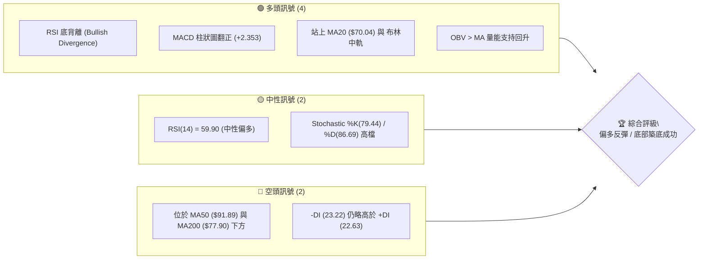
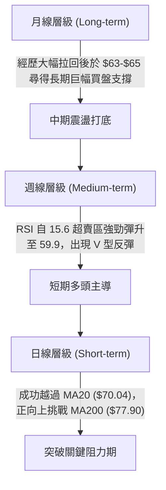
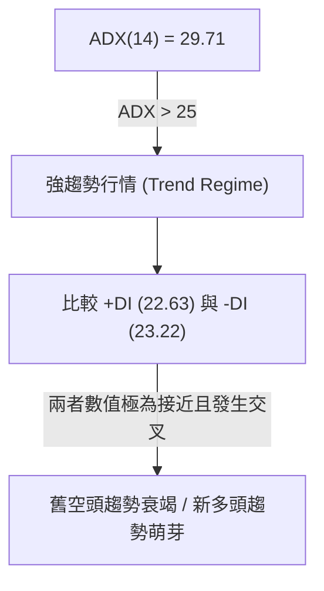
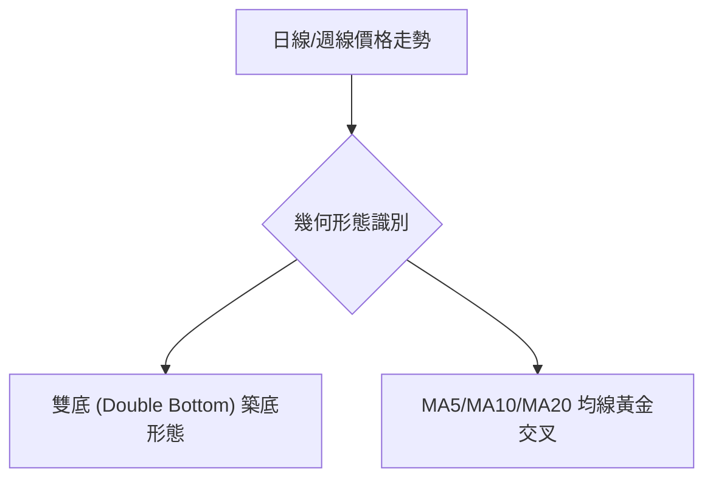
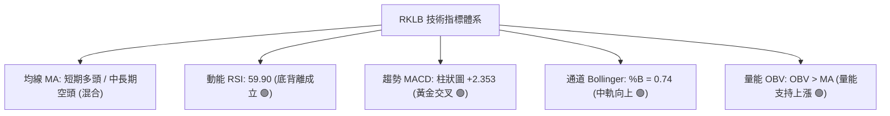
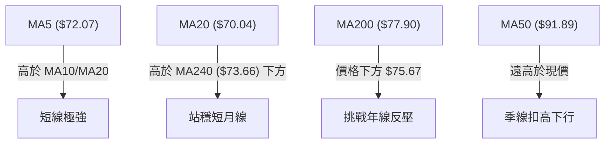
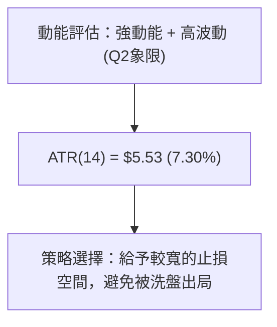
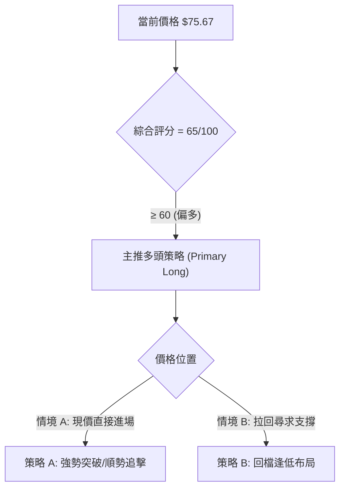
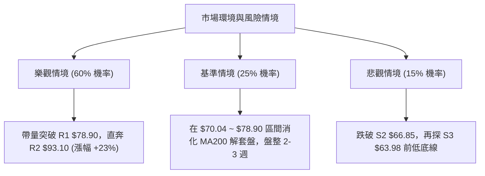

# RKLB 技術分析報告

> **報告日期**：2026-08-07 ｜ **語言**：繁體中文 ｜ **數據來源**：Yahoo Finance ｜ **當前價格**：$75.67

---

## 目錄

| 章節 | 內容 |
|------|------|
| [1. 技術面概覽](#1-技術面概覽) | 訊號儀表板、核心指標、評分卡 |
| [2. 趨勢分析](#2-趨勢分析) | 多時框趨勢、長中短期走勢 |
| [3. 圖表形態分析](#3-圖表形態分析) | 形態識別、K線組合、目標價 |
| [4. 支撐與阻力](#4-支撐與阻力) | 關鍵價位、斐波那契回調 |
| [5. 技術指標深度解讀](#5-技術指標深度解讀) | MA/RSI/MACD/布林/成交量 |
| [6. 動能與波動率](#6-動能與波動率) | 動能評估、ATR、Beta |
| [7. 多時框架總結](#7-多時框架總結) | 時框架評分矩陣 |
| [8. 交易策略建議](#8-交易策略建議) | 多空策略、風險報酬比 |
| [9. 風險提示與監控](#9-風險提示與監控) | 監控指標、風險場景 |

---

## 1. 技術面概覽

### 🎯 技術訊號儀表板



### 📊 核心指標速覽表

| 指標類別 | 指標名稱 | 當前數值 | 訊號 | 解讀 |
|----------|----------|----------|------|------|
| **價格** | 當前價格 | $75.67 | 🟢 多頭 | 遠高於近期低點 $63.91，展現強勁反彈動能 |
| **均線** | MA20 | $70.04 | 🟢 多頭 | 價格位於 MA20 上方，短期月線轉為向上支撐 |
| **均線** | MA50 | $91.89 | 🔴 空頭 | 價格位於 MA50 下方，中期季線仍具下行壓力 |
| **均線** | MA200 | $77.90 | 🟡 中性 | 價格接近 MA200，正挑戰年線築底翻揚 |
| **動能** | RSI(14) | 59.90 | 🟢 多頭 | 脫離超賣區，並出現明確「底背離」多頭訊號 |
| **動能** | MACD | +2.353 (Hist) | 🟢 多頭 | MACD 柱狀圖轉正，柱狀體擴大，發出買入訊號 |
| **波動** | ATR(14) | $5.53 (7.30%)| 🟡 中性 | 日均波動達 7.30%，屬於高波動動量股 |

### 🏆 技術評分卡

```
╔══════════════════════════════════════════════════════════════════╗
║                   技術評分卡 — RKLB (2026-08-07)                 ║
╠══════════════════════════════════════════════════════════════════╣
║  趨勢強度      ████████████░░░░░░░░  60/100  🟡 中性強勢      ║
║  動能指標      ██████████████░░░░░░  70/100  🟢 動能偏多      ║
║  支撐穩定度    ███████████████░░░░░  75/100  🟢 底層堅實      ║
║  成交量配合    █████████████░░░░░░░  65/100  🟢 量價溫和      ║
║  形態完整度    █████████████░░░░░░░  65/100  🟢 雙底築底      ║
║  均線排列      ██████████░░░░░░░░░░  50/100  🟡 混亂糾結      ║
╠══════════════════════════════════════════════════════════════════╣
║  綜合評分      █████████████░░░░░░░  65/100  🟢 偏多反彈      ║
╚══════════════════════════════════════════════════════════════════╝
```

---

## 2. 趨勢分析

### 🌐 多時框趨勢分析



### 📈 長期趨勢 — 24個月走勢圖（Unicode）

```
RKLB 24個月月線走勢圖 (2024-08 至 2026-08)
價格軸 ($)
$150 ┤                                                 ● (52W高點 $151.00)
$135 ┤                                            ●
$120 ┤                                                ●
$105 ┤                                                    ●
$90  ┤                                                        ●
$75  ┤                                                            ● (現價 $75.67)
$60  ┤                                ●       ●               ●
$45  ┤                            ●       ●       ●
$30  ┤                ●       ●
$15  ┤        ●   ●       ●
$0   ┼───┬───┬───┬───┬───┬───┬───┬───┬───┬───┬───┬───┬───┬───┬───┬───► 時間
       24/08  24/11   25/02   25/05   25/08   25/11   26/02   26/05   26/08
```

#### 走勢特徵分析表格

| 階段 | 時間區間 | 價格區間 | 漲跌幅 | 走勢特徵描述 |
|------|----------|----------|--------|--------------|
| **主升段 1** | 2024-08 ~ 2025-01 | $6.27 ➔ $29.05 | +363.3% | 散戶與機構擴大建倉，發射業務量與營收爆發 |
| **高位整理** | 2025-02 ~ 2025-04 | $20.49 ➔ $21.79 | -25.0% | 獲利了結賣壓湧現，在 $17.88 附近完成換手 |
| **主升段 2** | 2025-05 ~ 2026-05 | $26.79 ➔ $143.48 | +435.6% | 攀升至歷史高點附近（52周高點達 $151.00） |
| **深度回調** | 2026-06 ~ 2026-07 | $101.65 ➔ $64.95 | -36.1% | 大盤回檔與高估值修正，週線 RSI 降至 15.6 極端超賣 |
| **築底反彈** | 2026-07 ~ 2026-08 | $63.91 ➔ $75.67 | +18.4% | 打開日線底背離，迅速站回 $70 大關 |

### 📊 中期趨勢（週線分析）

從近 20 週收盤走勢可觀察到，價格在 2026-05-31 達頂峰 $143.48 後，經歷了一波劇烈的瀑布式下挫，於 2026-07-26 砸出最低波段收盤價 $63.91（極端 RSI 15.6）。隨後連續兩週強勢回升，成交量雖未呈倍數暴量，但搭配 MACD 柱狀圖由負轉正（+0.300 擴大至 +2.353），顯示下行拋壓已耗盡，多頭主力已在 $63.98 ~ $66.85 區域建立堅固底座。

### ⚡ 趨勢強度評估（ADX 解讀）



| ADX 數值區間 | 趨勢強度分類 | RKLB 當前狀態 | 交易策略導向 |
|--------------|--------------|---------------|--------------|
| 0 - 20 | 無趨勢 / 盤整 | ❌ 非盤整 | 布林通道高拋低吸 |
| 20 - 25 | 趨勢形成中 | ❌ | 觀察突破方向 |
| **25 - 50** | **強趨勢行情** | 🟢 **ADX = 29.71** | **依中長期主趨勢與順勢方向操作** |
| 50 - 100 | 極強趨勢行情 | ❌ | 追價 / 緊縮止損 |

*分析結論*：ADX 達 29.71 顯示目前處於強趨勢環境。雖然 -DI (23.22) 略高於 +DI (22.63)，但兩者差距已收窄至微幅的 0.59。考量到多頭指標（MACD、RSI 底背離）顯著轉強，此處代表強烈的空頭趨勢終結與新一波反彈趨勢啟動點。

---

## 3. 圖表形態分析

### 🔍 形態識別系統



#### 形態信心度與目標價明細表

| 形態類型 | 信心度 | 判斷依據（引用數據） | 完成度 | 目標價（附計算式） |
|----------|--------|----------------------|--------|--------------------|
| **雙底形態 (W底)** | 75% | 前低 $63.91 (07-26) 與次低 $64.95 (08-02) 構成雙底，頸線阻力落在 R1 $78.90 | 85% | 頸線 $78.90 + 形態高度($78.90 - $63.91 = $14.99) = **$93.89** (極度接近 R2 $93.10) |
| **V型急反彈** | 60% | 週線 RSI 從 15.6 急彈至 59.90，兩週大漲逾 18% | 90% | 第一目標為 Fib 61.8% **$80.90** |
| **頭肩底形態** | 35% | 數據時間跨度不足，右肩未完全成熟 | 35% | 訊號不足，僅做指標型解讀，不予計算 |

### 🕯️ 重要 K 線形態分析

| 月份/日期 | 收盤價 | K 線形態 | 解讀 | 訊號 |
|-----------|--------|----------|------|------|
| **2026-05-31** | $143.48 | 避雷針長上影線 | 高檔爆量獲利了結，多頭動能耗盡 | 🔴 強烈賣出 |
| **2026-07-26** | $63.91 | 長下影錘子線 | 觸及 52 周低點群後出現長下影線，尋獲強支撐 | 🟢 底部訊號 |
| **2026-08-09** | $75.67 | 中陽線突破 | 收盤價強勢突破 MA20 ($70.04)，買盤全面回籠 | 🟢 多頭確認 |

### 📉 ASCII 走勢形態示意圖

```
RKLB 雙底 (Double Bottom) 築底與突破示意圖
------------------------------------------------------------------
$93.10 ┤                                      [目標價 R2 $93.10]
       │                                     /
$78.90 ┤----------- 頸線阻力位 (R1 $78.90) -/-------------------
       │           / \                     / (預期突破)
$75.67 ┤........../...\.................● [現價 $75.67]
       │         /     \               /
$70.04 ┤--------/-------\-------------/-- [MA20 支撐 $70.04]
       │       /         \           /
$63.91 ┤      ● (第一底)  ● (第二底)
       └──────┬────────────┬─────────┬────────────────────────────
           07/26        08/02     08/07 (今日)
```

### 🎯 形態目標價計算

1. **雙底形態高度 (Pattern Height)**：
   $$\text{高度} = \text{頸線阻力 (R1)} - \text{第一底低點} = 78.90 - 63.91 = 14.99$$
2. **最小測量目標價 (Minimum Target Price)**：
   $$\text{目標價} = \text{頸線突破點 (R1)} + \text{形態高度} = 78.90 + 14.99 = \mathbf{93.89}$$
   *驗證*：此推算目標價與系統計算出的關鍵阻力位 **R2 ($93.10)** 重合度極高（相差僅 0.85%），增強了該價位的技術面參考價值。

---

## 4. 支撐與阻力

### 🗺️ 關鍵價位分布圖（Unicode）

```
RKLB 價位結構分布圖
═════════════════════════════════════════════════════════════════
$151.00 ║████████████████████████████████║ 52週歷史高點 (0.0% Fib)
$124.23 ║████████████████████            ║ 23.6% 斐波那契回調位
$107.67 ║████████████████                ║ 38.2% 斐波那契回調位
$99.58  ║██████████████                  ║ 強阻力位 R3
$94.28  ║████████████                    ║ 50.0% 斐波那契中軸位
$93.10  ║████████████                    ║ 阻力位 R2 (形態目標)
$80.90  ║████████                        ║ 61.8% 斐波那契黃金分割位
$78.90  ║████████                        ║ 關鍵阻力位 R1 (頸線)
$75.67  ╠════════════════════════════════╣ ◄ 當前價格 ($75.67)
$73.99  ║▓▓▓▓▓▓▓▓▓▓▓▓▓▓                  ║ 近期第一支撐位 S1
$66.85  ║██████████████████              ║ 強支撐位 S2
$63.98  ║██████████████████████          ║ 波段防守極限 S3
$61.84  ║████████████████████████        ║ 78.6% 斐波那契回調位
$37.57  ║████████████████████████████████║ 52週歷史低點 (100.0% Fib)
═════════════════════════════════════════════════════════════════
```

### 🚧 阻力位分析表

| 阻力級別 | 精確價位 | 形成原因 | 突破難度 | 重要性 |
|----------|----------|----------|----------|--------|
| **R1** | **$78.90** | 近一年波段高點聚類 + W底頸線壓力 | 🟡 中等 | 🟢 極高 (短線多空分水嶺) |
| **R2** | **$93.10** | 近一年中位高點聚類 + W底測量目標 | 🔴 較高 | 🟢 高 (中期目標解套區) |
| **R3** | **$99.58** | 接近 $100 整數心理關卡 + MA60 ($98.18) | 🔴 極高 | 🟡 中 (長期解套賣壓區) |

### 🛡️ 支撐位分析表

| 支撐級別 | 精確價位 | 形成原因 | 守住機率 | 重要性 |
|----------|----------|----------|----------|--------|
| **S1** | **$73.99** | 近一年波段低點聚類 + MA240 ($73.66) | 🟢 80% | 🟢 極高 (短線回檔防線) |
| **S2** | **$66.85** | 近一年波段密集成交支撐區 | 🟢 85% | 🟢 高 (中期多頭防線) |
| **S3** | **$63.98** | 近一年波段最低點聚類 (07/26 低點 $63.91) | 🟢 92% | 🔴 極高 (生死防守線) |

### 📐 斐波那契回調位分析

基於 52 週波段區間（$37.57 → $151.00）計算之黃金分割位：

- **當前價位位置**：$75.67 介於 **78.6% ($61.84)** 與 **61.8% ($80.90)** 之間。
- **解讀**：價格在跌至近 78.6% 回調位 ($61.84) 附近的 $63.91 時獲得強烈支撐並展開強勁反彈。目前正往 **61.8% 黃金分割位 ($80.90)** 衝刺。一旦收盤價實體突破 $80.90，將宣告此輪深度回調正式結束，開啟向 50.0% ($94.28) 的回升浪。

---

## 5. 技術指標深度解讀

### 🎛️ 指標訊號總覽



### 📈 移動平均線排列分析



#### 均線狀態明細表

| 均線名稱 | 當前價位 | 與現價 ($75.67) 關係 | 乖離率 (%) | 均線走勢 | 解讀 |
|----------|----------|----------------------|------------|----------|------|
| **MA5** | $72.07 | 現價位於上方 | +4.995% | 向上 ▲ | 短線強勢衝刺 |
| **MA10** | $67.84 | 現價位於上方 | +11.542% | 向上 ▲ | 快速拉升支撐 |
| **MA20** | $70.04 | 現價位於上方 | +8.038% | 向上 ▲ | 月線扣抵低價，轉為支撐 |
| **MA200** | $77.90 | 現價位於下方 | -2.863% | 向上 ▲ | 年線扣抵低位，上行趨勢未壞 |
| **MA120** | $86.24 | 現價位於下方 | -12.256% | 向下 ▼ | 半年線反壓 |
| **MA50** | $91.89 | 現價位於下方 | -17.652% | 向下 ▼ | 中期季線下行壓力重 |

### 📉 RSI(14) 分析

`RSI(14) 強度：[██████████████░░░░░░] 59.90`

*   **超買/超賣狀態**：59.90 屬於中性偏多區間（脫離 30 以下超賣區，未達 70 超買區）。
*   **背離分析 (Divergence)**：
    *   **結論**：**存在明確底背離 (Bullish Divergence) 🟢**
    *   **細節**：在 2026-07-26 週收盤時，價格落至波段低點 $63.91，RSI 降至極端的 15.60；随后在 2026-08-02 價格落於 $64.95，但 RSI 已快速回升至 36.50，形成「價平/低，指標顯著墊高」的典型底部背離形態，確認多頭動能強烈復甦。

### 📊 MACD(12, 26, 9) 訊號解讀

*   **MACD 快線**：-4.985
*   **MACD 慢線 (Signal)**：-7.338
*   **MACD 柱狀圖 (Histogram)**：**+2.353**

*解讀*：雖然 MACD 快慢線仍位於 0 軸下方（反映前波深跌），但快線已向上穿越慢線形成**0軸下黃金交叉**，且柱狀圖正值擴大至 +2.353。這是非常典型的波段底部轉折訊號。

### 📦 布林通道分析

```
RKLB 日線布林通道示意圖
------------------------------------------------------------------
$81.81 ┤-------------------------------------- BB 上軌
       │                                     /
$75.67 ┤...................................●  現價 ($75.67) [%B = 0.74]
       │                                 /
$70.04 ┤-------------------------------●------ BB 中軌 (MA20)
       │                             /
$58.27 ┤----------------------------/--------- BB 下軌
------------------------------------------------------------------
```

*   **通道寬度**：BB 上軌 $81.81，下軌 $58.27，頻寬漸次擴張。
*   **%B 指標**：0.74（接近上軌 1.0）。價格已順利穿越中軌 $70.04 並向布林上軌 $81.81 挺進，屬於多頭強勢攻擊型態。

### 💹 成交量分析（量價配合度）

*   **最新成交量**：19,094,002 股
*   **20日均量**：18,387,795 股（**量比 1.04x**）
*   **OBV 狀態**：`OBV > MA → 量能支撐上漲`
*   **解讀**：價格上漲伴隨成交量溫和放大（高於 20日均量），OBV 指標呈上揚趨勢且高於其均線，顯示法人與主力資金在低位積極吸籌接盤，量價配合相當健康。

---

## 6. 動能與波動率

### ⚡ 動能評估

| 象限 | 動能強度 | 波動率 | 當前狀態 | 評估說明 |
|------|----------|--------|----------|----------|
| Q1 | 強 | 低 | — | 穩健主升段 |
| **Q2** | **強** | **高** | 🟢 **適用** | **高波動反彈段（動能強勁，日波動大）** |
| Q3 | 弱 | 低 | — | 沉悶盤整段 |
| Q4 | 弱 | 高 | — | 恐慌下跌段 |



### 📊 ATR 波動率分析

*   **ATR(14)**：$5.53
*   **ATR 百分比**：7.30%
*   **止損距離建議**：
    *   **短線交易 (1.0x ATR)**：止損空間設為 $5.53
    *   **波段交易 (1.5x ATR)**：止損空間設為 $8.30
    *   **中長線交易 (2.0x ATR)**：止損空間設為 $11.06

### 📐 Beta 與市場相關性

*   **Beta 係數**：**2.629**
*   **解讀**：RKLB 屬於高 Beta 成長型科技/航太股。當美股大盤（如標普500或納斯達克）上漲 1% 時，RKLB 平均上漲約 2.63%；反之亦然。在大盤反彈環境下，RKLB 具備極強的超額收益（Alpha）爆發力。

---

## 7. 多時框架總結

### 📋 時框架評分表

| 時框架 | 趨勢方向 | 動能 | 均線排列 | 形態 | 綜合評分 | 建議策略 |
|--------|----------|------|----------|------|----------|----------|
| **日線 (Daily)** | 🟢 多頭反彈 | 🟢 強勁 | 🟡 混合 | 🟢 雙底完成 | **72 / 100** | 順勢偏多操作 |
| **週線 (Weekly)** | 🟡 底部署理 | 🟢 底部背離 | 🔴 偏空 | 🟢 V型打底 | **65 / 100** | 逢低分批建倉 |
| **月線 (Monthly)**| 🟢 長多未破 | 🟡 中性 | 🟢 長多 | 🟡 高檔拉回 | **60 / 100** | 長線抱牢 |

### 🔲 綜合訊號矩陣

```
           短期(日線)   中期(週線)   長期(月線)
趨勢指標     🟢 看多       🟡 中性      🟢 看多
動能指標     🟢 看多       🟢 看多      🟡 中性
均線結構     🟡 中性       🔴 看空      🟢 看多
成交量能     🟢 看多       🟢 看多      🟢 看多
─────────────────────────────────────────────
時框收斂     🟢 多頭一致性高 (反彈趨勢確認)
```

### ⚖️ 多時框收斂結論

依據多時框收斂規則：ADX 為 29.71（>25，屬強趨勢行情），主導層級應放在中長期（週線/MA200）方向。目前週線與日線皆發出強烈的**底部背離與 MACD 黃金交叉訊號**，日線成功克服 MA20 ($70.04) 並向 MA200 ($77.90) 攻堅。因此收斂後的唯一方向性結論為：**偏多反彈（Bullish Rebound）**。日線拉回即為尋找買點的良好時機。

---

## 8. 交易策略建議

### 🗺️ 策略決策流程圖



### 🧭 策略路由

> **當前主策略方向 = 🟢 偏多 / 順勢做多（依綜合評分 65/100）**

### 🎯 價格情境階梯 (Price Scenarios)

| 觸發條件 | 下一目標 | 後續延伸 | 情境含義 |
|----------|----------|----------|----------|
| **突破 R1 $78.90** | **R2 $93.10** | **R3 $99.58** | 雙底型態確立，開啟大波段反彈 |
| **站穩現價 $75.67** | **61.8% Fib $80.90** | **R1 $78.90** | 溫和震盪墊高，多頭掌權 |
| **跌破 S1 $73.99** | **S2 $66.85** | **S3 $63.98** | 短線回檔測試月線與雙底頸線 |

### 📊 情境機率分佈

| 情境 | 機率 | 主要依據 |
|------|------|----------|
| **強勢上行 / 突破 R1** | **60%** | MACD 柱狀圖 (+2.353) 擴大、RSI 底背離、OBV 支持上漲 |
| **區間震盪 ($70.04 - $78.90)** | **25%** | MA200 ($77.90) 附近存在解套賣壓，需籌碼換手 |
| **跌破 S1 再探底** | **15%** | 大盤出現系統性崩跌（高 Beta 屬性影響） |

---

### 🟢 主策略詳情

#### 策略 A：現價順勢追擊策略（突破波段）

| 策略要素 | 精確數值 / 內容 | 計算說明 / 引用依據 |
|----------|-----------------|---------------------|
| **進場條件** | 現價進場或突破 $78.90 加碼 | 採用現價 $75.67 建立基本倉 |
| **進場價格** | **$75.67** | 當前市場價格 |
| **止損價格** | **$70.04** | 跌破 MA20 月線與布林中軌即止損 |
| **目標價 T1** | **$80.90** | 52週 61.8% 斐波那契回調位 (+6.91%) |
| **目標價 T2** | **$93.10** | 阻力位 R2 / W底測量目標價 (+23.03%) |
| **風險空間** | **$5.63** | $75.67 - $70.04 = $5.63 (約 7.44%) |
| **獲利空間 (T2)**| **$17.43** | $93.10 - $75.67 = $17.43 (約 23.03%) |
| **風險報酬比** | **1 : 3.10** | **$17.43 / $5.63 = 3.10** (極具吸引力) |
| **建議倉位** | **15%** | 中等總資金比例 |

#### 策略 B：低吸拉回買進策略（穩健波段）

| 策略要素 | 精確數值 / 內容 | 計算說明 / 引用依據 |
|----------|-----------------|---------------------|
| **進場條件** | 限價掛單於 S1 附近 | 回檔至第一支撐位 S1 附近吸籌 |
| **進場價格** | **$73.99** | 精確引用支撐位 S1 ($73.99) |
| **止損價格** | **$66.85** | 跌破強支撐 S2 即止損離場 |
| **目標價 T1** | **$78.90** | 關鍵阻力位 R1 (+6.64%) |
| **目標價 T2** | **$93.10** | 關鍵阻力位 R2 (+25.83%) |
| **風險空間** | **$7.14** | $73.99 - $66.85 = $7.14 (約 9.65%) |
| **獲利空間 (T2)**| **$19.11** | $93.10 - $73.99 = $19.11 (約 25.83%) |
| **風險報酬比** | **1 : 2.68** | **$19.11 / $7.14 = 2.68** (優秀) |
| **建議倉位** | **20%** | 較佳安全邊際下可提高倉位 |

---

### 🔴 反向風險觸發點（對沖與風控提示）

*   **撤退/止損訊號**：若日收盤價強烈跌破 **S1 ($73.99)** 且 MACD 柱狀圖重新轉負，代表此波底背離反彈失敗。
*   **空頭對沖觸發**：若跌破 **S3 ($63.98)**，則雙底型態徹底失效，下行空間將開啟至 52週低點 **$37.57**，屆時應全面清倉或建立反向對沖部位。

### ⭐ 整體訊號強度評星

```
做多訊號強度：★★██☆  (4.0/5星)  🟢 強烈
做空訊號強度：█░░░░  (1.5/5星)  🔴 微弱
整體可信度：  ★★★█☆  (4.0/5星)  🟢 高
```

---

## 9. 風險提示與監控

### ✅ 關鍵監控指標 Checklist

```
╔══════════════════════════════════════════════════════════════════╗
║                    每日技術面監控清單 (Checklist)               ║
╠══════════════════════════════════════════════════════════════════╣
║ [ ] 價格是否守穩 MA20 ($70.04) 支撐線                       ║
║ [ ] 日線成交量是否維持在 20日均量 (18.38M) 上方                 ║
║ [ ] MACD 柱狀圖 (+2.353) 是否持續正向擴大                       ║
║ [ ] RSI(14) 是否成功跨越 60 並向 70 超買區邁進                  ║
║ [ ] 是否有突破阻力 R1 ($78.90) 的帶量確信 K 線                 ║
╚══════════════════════════════════════════════════════════════════╝
```

### ⚠️ 風險場景分析



### 🛡️ 風險管理重要提醒

1. **高 Beta 波動風險**：RKLB Beta 高達 2.629，每日 ATR 達 $5.53 (7.30%)。嚴格禁止過度開槓桿，單筆交易虧損應控制在總本金 2% 以內。
2. **季線下行壓制**：MA50 ($91.89) 與 MA60 ($98.18) 目前仍呈下行趨勢，價格接近 $90-$100 區域時，獲利了結賣壓將大幅增加，屆時應分批落袋為安。

---

## 📋 報告總結

```
╔══════════════════════════════════════════════════════════════════╗
║                   RKLB 技術分析報告總結                          ║
════════════════════════════════════════════════════════════════════
報告日期：2026-08-07
當前價格：$75.67
分析評級：🟢 偏多反彈 (Bullish Rebound) / 綜合評分 65 分

關鍵結論：
├─ 長期趨勢：🟢 52週區間中下軌 ($37.57 - $151.00)，打底完成
├─ 中期趨勢：🟢 週線 RSI 15.60 觸底反彈，底背離成立
├─ 短期趨勢：🟢 站上 MA20 ($70.04) 與布林中軌，動能強勁
├─ 關鍵支撐：S1 $73.99 / S2 $66.85 / S3 $63.98
├─ 關鍵阻力：R1 $78.90 / R2 $93.10 / R3 $99.58
└─ 分析師目標：均價 $111.31 (最高 $150.00 / 最低 $64.00)

最優策略組合：
1. 🥇 最佳機會：現價 $75.67 順勢建立多頭部位，目標 R2 $93.10 (風報比 3.10)
2. 🥈 次選機會：若遇回檔，於 S1 $73.99 附近分批加碼逢低布局
3. 🥉 嚴格風控：破跌 MA20 ($70.04) 減碼，跌破 S2 ($66.85) 無條件止損離場
════════════════════════════════════════════════════════════════════
```

---

> ⚠️ **免責聲明**：本報告為 AI 自動生成之技術分析，所有數據及估算均基於提供的歷史價格資訊。本報告**僅供研究與學術參考**，**不構成任何投資建議**。投資有風險，入市需謹慎。

---

*報告生成時間：2026-08-07 ｜ 數據來源：Yahoo Finance ｜ 分析框架：多時框技術分析*