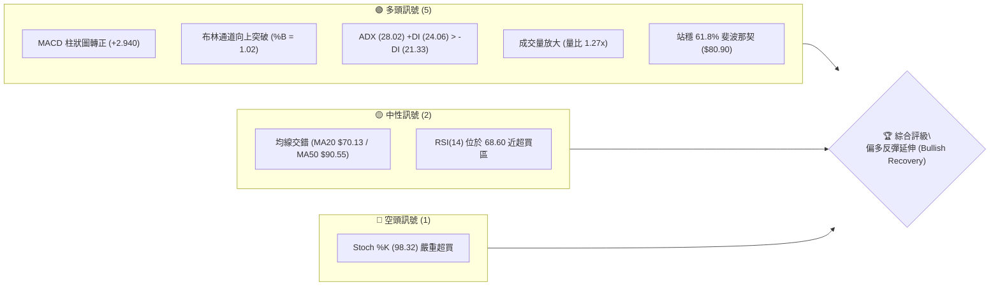
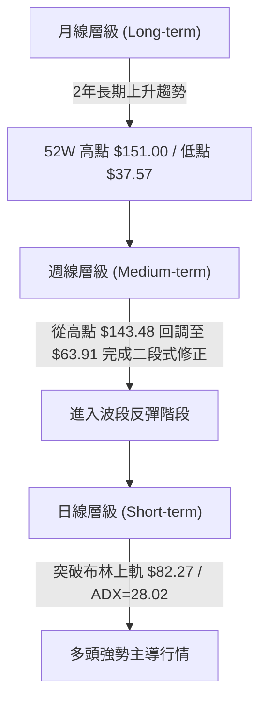
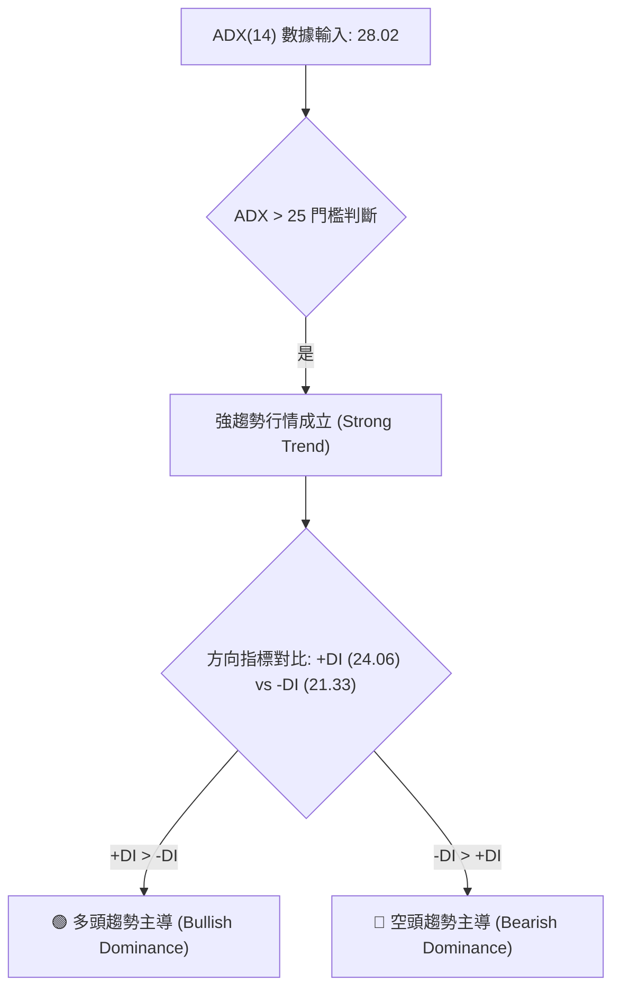
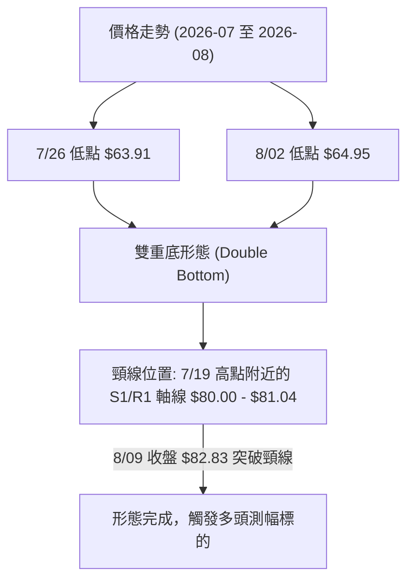
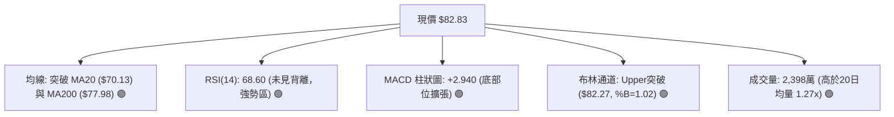
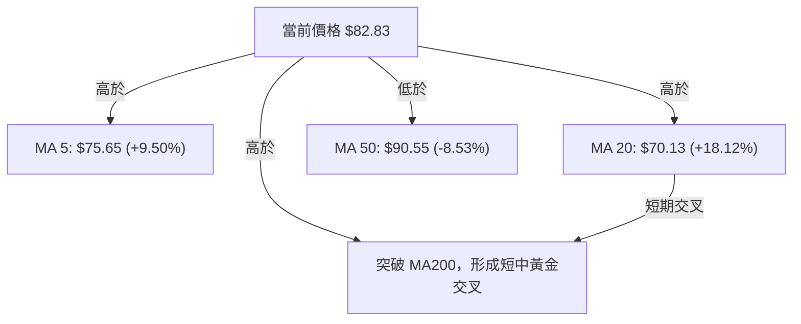
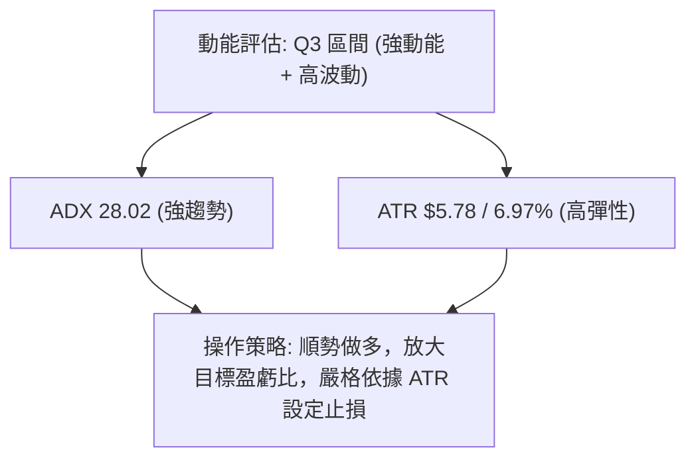
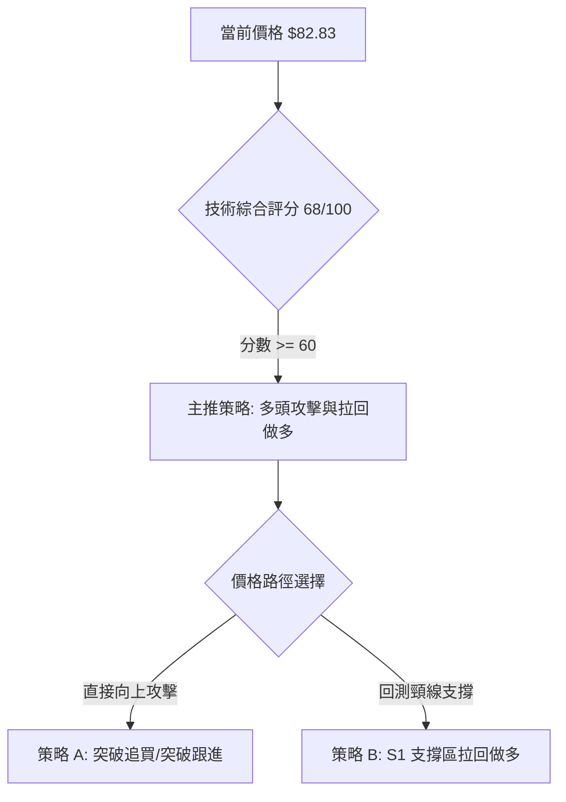
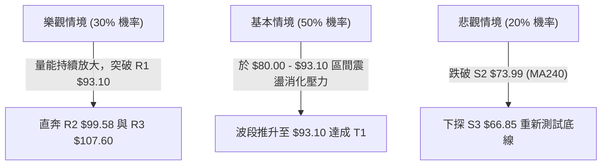

# RKLB 技術分析報告

> **報告日期**：2026-08-08 ｜ **語言**：繁體中文 ｜ **數據來源**：Yahoo Finance ｜ **當前價格**：$82.83

---

## 目錄

| 章節 | 內容 |
|------|------|
| [1. 技術面概覽](#1-技術面概覽) | 訊號儀表板、核心指標、評分卡 |
| [2. 趨勢分析](#2-趨勢分析) | 多時框趨勢、長中短期走勢 |
| [3. 圖表形態分析](#3-圖表形態分析) | 形態識別、K線組合、目標價 |
| [4. 支撐與阻力](#4-支撐與阻力) | 關鍵價位、斐波那契回調 |
| [5. 技術指標深度解讀](#5-技術指標深度解讀) | MA/RSI/MACD/布林/成交量 |
| [6. 動能與波動率](#6-動能與波動率) | 動能評估、ATR、Beta |
| [7. 多時框架總結](#7-多時框架總結) | 時框架評分矩陣 |
| [8. 交易策略建議](#8-交易策略建議) | 多空策略、風險報酬比 |
| [9. 風險提示與監控](#9-風險提示與監控) | 監控指標、風險場景 |

---

## 1. 技術面概覽

### 🎯 技術訊號儀表板



### 📊 核心指標速覽表

| 指標類別 | 指標名稱 | 當前數值 | 訊號 | 解讀 |
|----------|----------|----------|------|------|
| **價格** | 當前價格 | $82.83 | 🟢 | 突破布林上軌 ($82.27)，處於 52 週區間 39.9% 位置 |
| **均線** | MA20 | $70.13 | 🟢 | 價格在 MA20 上方 (+18.12%)，短期趨勢強勁 |
| **均線** | MA50 | $90.55 | 🔴 | 價格在 MA50 下方 (-8.53%)，中期仍具上方壓力 |
| **均線** | MA200 | $77.98 | 🟢 | 價格突破 MA200 長期均線 (+6.22%)，築底回升 |
| **動能** | RSI(14) | 68.60 | 🟡 | 強勢中性，接近 70 超買區但尚未出現頂背離 |
| **動能** | MACD | -3.663 | 🟢 | 柱狀圖 (+2.940) 顯著擴張，雙線形成低位金叉 |
| **動能** | ADX(14) | 28.02 | 🟢 | 強趨勢成立 (>25)，+DI 佔據主導優勢 |
| **波動** | ATR(14) | $5.78 | 🟡 | 日波動率 6.97%，呈現高波動、高彈性特徵 |

### 🏆 技術評分卡

```
╔══════════════════════════════════════════════════════════════╗
║             RKLB 技術評分卡 (2026-08-08)                     ║
╠══════════════════════════════════════════════════════════════╣
║ 趨勢強度      ▓▓▓▓▓▓▓▓▓▓▓▓▓▓░░░░░░  70/100  🟢 看多 (ADX 28) ║
║ 動能指標      ▓▓▓▓▓▓▓▓▓▓▓▓▓▓▓░░░░░  75/100  🟢 強勁 (MACD 擴張)║
║ 支撐穩定度    ▓▓▓▓▓▓▓▓▓▓▓▓░░░░░░░░  60/100  🟡 中等 (S1 $80.00)║
║ 成交量配合    ▓▓▓▓▓▓▓▓▓▓▓▓▓▓░░░░░░  70/100  🟢 增量 (量比 1.27x)║
║ 形態完整度    ▓▓▓▓▓▓▓▓▓▓▓▓▓▓░░░░░░  70/100  🟢 雙底打底完成    ║
║ 均線排列      ▓▓▓▓▓▓▓▓▓▓░░░░░░░░░░  50/100  🟡 混合 (MA20>MA200)║
╠══════════════════════════════════════════════════════════════╣
║ 綜合評分      ▓▓▓▓▓▓▓▓▓▓▓▓▓▓░░░░░░  68/100  🟢 偏多反彈延伸   ║
╚══════════════════════════════════════════════════════════════╝
```

---

## 2. 趨勢分析

### 🌐 多時框趨勢分析



### 📈 長期趨勢 — 12個月走勢圖（Unicode）

```
RKLB 月線走勢圖（2025-09 至 2026-08）
價格軸 ($)
$150 ┤                               ● (2026-05 歷史高點 $143.48 / $151.00)
$130 ┤                             ╱   ╲
$110 ┤                           ╱       ● (2026-06 $101.65)
$90  ┤            ●            ╱           ╲
$70  ┤  ●   ●   ╱   ╲        ╱               ● (現在 $82.83)
$50  ┤   ╲ ╱  ●       ●    ╱                   ╲   ╱
$30  ┤                  ●                        ● (2026-07 低點 $63.91/$64.95)
     └────────────────────────────────────────────────────────────
        M1  M2  M3  M4  M5  M6  M7  M8  M9  M10 M11 M12 (月份)
```

#### 過去 12 個月走勢特徵分析

| 月份 | 收盤價 ($) | MoM 漲跌幅 | 走勢特徵描述 |
|------|------------|------------|--------------|
| 2025-09 | 47.91 | -1.42% | 橫盤積蓄動能，鎖定底部區域 |
| 2025-10 | 62.98 | +31.46% | 突破箱體，成交量顯著放大 |
| 2025-11 | 42.14 | -33.09% | 獲利賣壓湧現，進行深幅洗盤 |
| 2025-12 | 69.76 | +65.54% | 強力反彈，刷新中期高點 |
| 2026-01 | 80.07 | +14.78% | 延續多頭主升段，突破 $80 大關 |
| 2026-02 | 69.10 | -13.70% | 健康回調，測試下方均線支撐 |
| 2026-03 | 64.22 | -7.06% | 震盪打底，形成階段性支撐區 |
| 2026-04 | 82.51 | +28.48% | 再次發動攻勢，向上突破阻力 |
| 2026-05 | 143.48 | +73.89% | 主升段爆發，創下 52 週最高價 $151.00 |
| 2026-06 | 101.65 | -29.15% | 高位見頂，出現強烈獲利了結賣壓 |
| 2026-07 | 64.95 | -36.10% | 恐慌性拋售，跌至波段低點 $63.91 |
| 2026-08 | 82.83 | +27.53% | 底部V型反彈，強勢突破 MA20 與布林上軌 |

### 📊 中期趨勢（週線分析）

```
RKLB 週線壓力與支撐結構示意圖
══════════════════════════════════════════════════════════
$107.60 ────────────────────────────────────────── R3 (Fib 38.2%)
  ▲
  │  上升阻力區間
  ▼
$93.10  ────────────────────────────────────────── R1 (強阻力關卡)
  ▲
  │  目前價格運作區間 ($82.83)
  ▼
$80.00  ────────────────────────────────────────── S1 (Fib 61.8% $80.90 重疊區)
  ▲
  │  築底支撐區間
  ▼
$66.85  ────────────────────────────────────────── S3 (波段雙底區間 $63.91-$64.95)
══════════════════════════════════════════════════════════
```

### ⚡ 趨勢強度評估（ADX 解讀）



*   **ADX 數值**: 28.02（突破 25 關鍵臨界點，表明市場已告別震盪盤整，進入明確的單邊趨勢行情）。
*   **+DI / -DI 分布**: +DI (24.06) 交叉上穿 -DI (21.33)，顯示買盤力量已全面壓過賣盤，多頭掌控市場主導權。

---

## 3. 圖表形態分析

### 🔍 形態識別系統



#### 圖表形態信心度與目標價評估表

| 形態類型 | 信心度 | 判斷依據（引用數據） | 完成度 | 目標價（附計算式） |
|----------|--------|----------------------|--------|--------------------|
| **W底 (雙重底)** | **72%** | 兩次低點 $63.91 (7/26) 與 $64.95 (8/02) 構成雙底，收盤價 $82.83 突破頸線 $81.04 | 100% (已突破) | **$98.17** <br>`頸線 $81.04 + (頸線 $81.04 - 低點 $63.91) = $98.17` <br>*(接近 R2 $99.58)* |
| **布林帶向上突破** | **85%** | 當前價 $82.83 高於 BB 上軌 $82.27，%B = 1.02 | 100% (進行中) | **$93.10** <br>`直指近一年阻力聚類 R1` |

### 🕯️ 重要 K 線形態分析

| 週次/日期 | 收盤價 ($) | K線形態 | 技術解讀 | 多空訊號 |
|-----------|------------|---------|----------|----------|
| 2026-07-26 | 63.91 | 長下影陰線 | 恐慌拋售尾聲，觸及 52 週低點區，低檔出現買盤承接 | 🟡 止跌訊號 |
| 2026-08-02 | 64.95 | 小陽十字星 | 賣壓耗盡，形成二次探底築底，成交量收縮至 8,540 萬 | 🟢 築底確認 |
| 2026-08-09 | 82.83 | 大陽線實體突破 | 放量 (+12.9% 成交量) 長陽突破 MA20 ($70.13) 及頸線 | 🟢 強烈買進 |

### 📉 ASCII 走勢形態示意圖

```
RKLB 日線 W底 (Double Bottom) 形態突破示意圖
══════════════════════════════════════════════════════════
                                              突破目標價 R2 $99.58
                                                ▲
                                               ╱
                                              ╱  (測幅推算 $98.17)
                                             ╱
$82.83 ───────────────────────────────●────╱───── 現價突破 (%B=1.02)
                                     ╱  ╲ ╱
$81.04 ─── 頸線突破位置 ────────────●────┼────── S1 支撐區域
                                  ╱      ╲
                                 ╱        ╲
                                ╱          ╲
$63.91 ─────────────●──────────╱────────────●──── 雙底支撐 (7/26 & 8/02)
                   底 1                    底 2
══════════════════════════════════════════════════════════
```

---

## 4. 支撐與阻力

### 🗺️ 關鍵價位分布圖（Unicode）

```
RKLB 價位結構分布圖
═══════════════════════════════════════════════════════════════════
$107.60 ║████████████████████████████████████████    ║ 強阻力 R3 / 38.2% Fib
$99.58  ║██████████████████████████                  ║ 阻力 R2 / W底測幅區
$93.10  ║████████████████████████████████            ║ 關鍵阻力 R1 / 50% Fib
$82.83  ╠════════════════════════════════════════════╣ ◄ 當前價格 ($82.83)
$80.00  ║▓▓▓▓▓▓▓▓▓▓▓▓▓▓▓▓▓▓▓▓▓▓▓▓▓▓▓▓▓▓              ║ 近期強支撐 S1 / 61.8% Fib ($80.90)
$73.99  ║████████████████████                        ║ 中期支撐 S2 / MA240 ($73.82)
$66.85  ║████████████████████████████████████        ║ 強支撐 S3 / 前波波段低點
═══════════════════════════════════════════════════════════════════
```

### 🚧 阻力位分析表

| 阻力級別 | 價位 ($) | 距離現價 | 形成原因（引用數據區塊） | 突破難度 | 重要性 |
|----------|----------|----------|--------------------------|----------|--------|
| **R1** | **$93.10** | +12.40% | 近一年波段高點聚類；接近 50% 斐波那契回調位 ($94.28) 與 MA50 ($90.55) | 🟡 中等 | ★★★★☆ |
| **R2** | **$99.58** | +20.22% | 近一年波段高點聚類；W底形態目標價 ($98.17) 重疊區 | 🔴 較高 | ★★★★☆ |
| **R3** | **$107.60**| +29.90% | 近一年波段高點聚類；38.2% 斐波那契回調位 ($107.67) | 🔴 極高 | ★★★★★ |

### 🛡️ 支撐位分析表

| 支撐級別 | 價位 ($) | 距離現價 | 形成原因（引用數據區塊） | 守住機率 | 重要性 |
|----------|----------|----------|--------------------------|----------|--------|
| **S1** | **$80.00** | -3.42% | 近一年波段低點聚類；61.8% 斐波那契回調位 ($80.90) 雙重支撐 | 🟢 80% | ★★★★★ |
| **S2** | **$73.99** | -10.67% | 近一年波段低點聚類；MA240 均線 ($73.82) 與 MA200 ($77.98) 支撐帶 | 🟢 85% | ★★★★☆ |
| **S3** | **$66.85** | -19.29% | 近一年波段低點聚類；接近 78.6% 斐波那契 ($61.84) 及雙底低點區 | 🟢 95% | ★★★★★ |

### 📐 斐波那契回調位分析

基於 52 週高低點區間（**$37.57 → $151.00**）計算之精確回調位：

```
斐波那契回調階梯與現價位置
0.0%  (52W High)  $151.00 ─────────────────────────────────────
23.6%             $124.23 ─────────────────────────────────────
38.2%             $107.67 ───────────────────────────── (阻力 R3 $107.60)
50.0%             $94.28  ───────────────────────────── (阻力 R1 $93.10)
-----------------------------------------------------------------
★ 當前價格 $82.83 落在 50.0% ($94.28) 與 61.8% ($80.90) 之間
-----------------------------------------------------------------
61.8% (黃金黃金區) $80.90  ───────────────────────────── (支撐 S1 $80.00)
78.6%             $61.84  ───────────────────────────── (支撐 S3 $66.85)
100.0% (52W Low)  $37.57  ─────────────────────────────────────
```

*   **解讀**：現價 $82.83 成功上穿黃金回調位 **61.8% ($80.90)**，技術面上確認了自低點 $63.91 展開的反彈具備結構性支撐，下一個目標直接指向 **50% 回調位 ($94.28)**。

---

## 5. 技術指標深度解讀

### 🎛️ 指標訊號總覽



### 📈 移動平均線排列分析



*   **短期均線 (MA5, MA10, MA20)**：呈現多頭排列 (MA5 $75.65 > MA20 $70.13 > MA10 $69.73)，短線急漲動能強勁。
*   **長期均線 (MA200, MA240)**：價格已順利站上 MA200 ($77.98) 與 MA240 ($73.82)，確定中長期趨勢轉危為安。
*   **中期均線 (MA50, MA60)**：MA50 ($90.55) 與 MA60 ($97.60) 仍呈下行趨勢，將是多頭反彈攻堅的首要目標區。

### 📉 RSI(14) 分析

*   **當前數值**: `68.60`
*   **強弱狀態**: ▓▓▓▓▓▓▓▓▓▓▓▓▓▓▓░░░░░ 68.60% (強勢買盤區，接近 70 超買警戒)
*   **背離檢測**: **無明顯背離**。RSI 隨價格從 2026-07-26 的 15.6 飆升至 68.60，為健康的動能同步擴張，尚未出現高位頂背離訊號。

### 📊 MACD(12, 26, 9) 訊號解讀

*   **MACD 線**: `-3.663`
*   **Signal 線**: `-6.603`
*   **MACD 柱狀圖**: `+2.940` (🟢 看多)
*   **解讀**: MACD 雙線在零軸下方完成黃金交叉（MACD 線向上穿越 Signal 線），柱狀圖連續數週擴張（-0.618 ➔ +0.300 ➔ +2.940），表明空頭動能衰竭，多頭主導的新一輪反彈波段已經展開。

### 📦 布林通道分析

```
RKLB 日線布林通道示意圖
══════════════════════════════════════════════════════════
$82.27 ─── 布林上軌 ───────────────────────● $82.83 (現價突破，%B=1.02)
                                         ╱
$70.13 ─── 布林中軌 (MA20) ─────────────╱─────────────────
                                       ╱
$57.98 ─── 布林下軌 ──────────────────╱───────────────────
══════════════════════════════════════════════════════════
```

*   **通道狀態**: %B 為 **1.02**，突破布林上軌 ($82.27)。
*   **解讀**: 價格貼著上軌向上打開通道，屬於典型的「布林通道喇叭口擴張 (Bollinger Band Expansion)」強勢攻擊訊號。

### 💹 成交量分析（量價配合度）

*   **最新成交量**: 23,988,300 股
*   **20 日均量**: 18,878,335 股 (量比: **1.27x**)
*   **OBV 趨勢**: OBV > MA，量能指標持續上揚。
*   **量價關係**: 價格大漲 +27.53% 的同時伴隨成交量放大至 2,398 萬股，量價配合極佳，證實本次突破為實質資金買盤推動，而非無量虛漲。

---

## 6. 動能與波動率

### ⚡ 動能評估

#### 四象限動能矩陣表

| 象限 | 動能強度 | 波動率 | RKLB 當前位置 | 評估與策略 |
|------|----------|--------|---------------|------------|
| **Q1** | 強 (ADX>25) | 低 (ATR<5%) | — | 穩定趨勢，適合趨勢追蹤 |
| **Q2** | 弱 (ADX<25) | 低 (ATR<5%) | — | 盤整格局，適合區間高拋低吸 |
| **Q3** | **強 (ADX 28.02)** | **高 (ATR 6.97%)** | **✓ (RKLB 當前象限)** | **爆發性攻擊行情，適合突破追價與嚴設止損** |
| **Q4** | 弱 (ADX<25) | 高 (ATR>5%) | — | 劇烈震盪，避開或減碼觀望 |



### 📊 ATR 波動率分析

*   **ATR(14)**: `$5.78` (占當前股價 **6.97%**)
*   **止損距離建議**:
    *   **緊密止損 (1.0 x ATR)**: $82.83 - $5.78 = **$77.05** (接近 MA200 $77.98)
    *   **標準止損 (1.5 x ATR)**: $82.83 - ($5.78 × 1.5) = **$74.16** (精確貼近 S2 支撐 $73.99)
    *   **寬鬆止損 (2.0 x ATR)**: $82.83 - ($5.78 × 2.0) = **$71.27** (接近 MA20 $70.13)

### 📐 Beta 與市場相關性

*   **Beta 係數**: `2.629`
*   **解讀**: RKLB 具備極高的市場敏感度（高 Beta 屬性）。當美股大盤（如標普 500 或那斯達克）上漲 1% 時，RKLB 平均上漲 2.63%；反之亦然。適合在市場風險偏好回升時作為高 Alpha 攻擊型配置。

---

## 7. 多時框架總結

### 📋 時框架評分表

| 時框架 | 趨勢方向 | 動能指標 | 均線排列 | 形態結構 | 綜合評分 | 建議操作 |
|--------|----------|----------|----------|----------|----------|----------|
| **月線 (Long)** | 🟢 多頭回升 | RSI 中性 | MA200 上方 | 52W 低點強反彈 | **75/100** | 中長線偏多分批佈局 |
| **週線 (Med)** | 🟡 震盪築底 | MACD 金叉 | 混亂 (MA50下方) | W底頸線突破 | **65/100** | 逢回調看多 |
| **日線 (Short)**| 🟢 強勢攻擊 | RSI 68.6 / %B>1 | 短期多頭 | 布林帶上軌突破 | **70/100** | 突破追買 / 順勢做多 |

### 🔲 綜合訊號矩陣

```
╔══════════════════════════════════════════════════════════════╗
║              RKLB 多時框架訊號收斂矩陣                       ║
╠══════════════════╦══════════════╦══════════════╦═════════════╣
║ 維度             ║ 日線 (Short) ║ 週線 (Medium)║ 月線 (Long) ║
╠══════════════════╬══════════════╬══════════════╬═════════════╣
║ 趨勢 (Trend)     ║ 🟢 強力反彈  ║ 🟡 築底回升  ║ 🟢 長期偏多 ║
║ 動能 (Momentum)  ║ 🟢 MACD擴張  ║ 🟢 低位金叉  ║ 🟡 恢復中   ║
║ 支撐/阻力        ║ 🟢 突破 $80  ║ 🟢 守住 $64  ║ 🟢 遠離 $37 ║
╠══════════════════╬══════════════╩══════════════╩═════════════╣
║ 最終一致性判定   ║ 🟢 多頭共振 (ADX 28.02 確立趨勢行情)       ║
╚══════════════════╩═══════════════════════════════════════════╝
```

### ⚖️ 多時框收斂結論

依據多時框收斂規則（ADX = 28.02 > 25，屬於明確趨勢行情）：以中期週線打底完成（W底突破 $81.04）為主導方向，日線布林帶上軌突破（$82.27）提供精確進場觸發點。**多時框最終收斂結論為：強烈偏多反彈延伸**，當前策略應以多頭為主。

---

## 8. 交易策略建議

### 🗺️ 策略決策流程圖



### 🧭 策略路由

**當前主策略方向 = 🟢 多頭攻擊與拉回做多（依綜合評分 68/100 分流）**

### 🎯 價格情境階梯 (Price Scenarios)

| 觸發條件 | 下一目標 | 後續延伸 | 情境含義 |
|----------|----------|----------|----------|
| **突破並站穩 R1 $93.10** | R2 $99.58 | R3 $107.60 | 中期多頭主升段全面展開 |
| **維持在 $80.00–$82.83 震盪** | R1 $93.10 | — | 突破後的高位消化與蓄勢 |
| **跌破 S1 $80.00** | S2 $73.99 | S3 $66.85 | 假突破，重新回測 MA240 均線 |

### 📊 情境機率分佈

| 情境 | 機率 | 主要依據（引用數據區塊指標） |
|------|------|------------------------------|
| **繼續上攻探阻 (R1 / R2)** | **60%** | MACD 柱狀圖 (+2.940) 強勢擴張，%B (1.02) 突破布林上軌，成交量放大 1.27 倍 |
| **高位箱體震盪 ($80 - $88)**| **25%** | RSI (68.60) 與 Stoch %K (98.32) 接近超買區，需要消化短期獲利盤 |
| **拉回重測支撐 (S2 $73.99)**| **15%** | MA50 ($90.55) 下行壓制，若大盤整體回調可能拉回 |

### 🟢 主策略詳情

#### 策略 A：突破跟進策略（ Momentum Breakout ）
*   **進場條件**: 股價站穩布林上軌 $82.27 以上（即當前價 $82.83 直接進場或開盤確認）。
*   **進場價格**: `$82.83`
*   **止損價格**: `$73.99` (精確設定於 S2 支撐位與 1.5x ATR 止損區)
*   **目標價 T1**: `$93.10` (R1 阻力位，獲利空間 +12.40%)
*   **目標價 T2**: `$99.58` (R2 阻力位 / W底形態目標價，獲利空間 +20.22%)
*   **風險報酬比**: 
    *   至 T1 = ($93.10 - $82.83) / ($82.83 - $73.99) = $10.27 / $8.84 = **1.16 : 1**
    *   至 T2 = ($99.58 - $82.83) / ($82.83 - $73.99) = $16.75 / $8.84 = **1.89 : 1**
*   **建議倉位**: **15% - 20%**

#### 策略 B：拉回低吸策略（ Pullback Buying ）
*   **進場條件**: 股價微幅拉回測試 S1 支撐與 61.8% 斐波那契重疊區 ($80.00 - $80.90)。
*   **進場價格**: `$80.00`
*   **止損價格**: `$73.99` (S2 支撐位)
*   **目標價 T1**: `$93.10` (R1 阻力位，獲利空間 +16.38%)
*   **目標價 T2**: `$99.58` (R2 阻力位，獲利空間 +24.48%)
*   **風險報酬比**:
    *   至 T1 = ($93.10 - $80.00) / ($80.00 - $73.99) = $13.10 / $6.01 = **2.18 : 1**
    *   至 T2 = ($99.58 - $80.00) / ($80.00 - $73.99) = $19.58 / $6.01 = **3.26 : 1**
*   **建議倉位**: **20% - 25%**

### 🔴 反向風險觸發點（對沖與避險提示）

*   **觸發條件**: 若股價收盤跌破 **S2 ($73.99)** 且 MACD 柱狀圖轉為縮頭，宣告本輪由 $63.91 發動的反彈結構破壞。
*   **風控動作**: 多頭全面平倉出場，多單止損；保守者可考慮對沖或觀望至 S3 ($66.85) 尋求下一次築底。

### ⭐ 整體訊號強度評星

```
做多訊號強度：★★██☆  (4.0/5星)  — 雙底與布林突破共振
做空訊號強度：█☆☆☆☆  (1.0/5星)  — 缺乏空頭背離訊號
整體可信度：  ★★██☆  (4.0/5星)  — 數據配合度與量能極佳
```

---

## 9. 風險提示與監控

### ✅ 關鍵監控指標 Checklist

```
╔══════════════════════════════════════════════════════════════╗
║               RKLB 每日交易風險監控清單                     ║
╠══════════════════════════════════════════════════════════════╣
║ [ ] 股價是否守住 S1 ($80.00) 頸線支撐關卡                    ║
║ [ ] 成交量是否維持在 20日均量 (1,887 萬股) 以上             ║
║ [ ] RSI(14) 是否在 >70 區間出現頂背離 (價格新高而RSI未新高) ║
║ [ ] MACD 柱狀圖是否持續擴張 (+2.940 以上)                    ║
║ [ ] 向上挑戰 R1 ($93.10) 時是否出現高位爆量長上影線         ║
╚══════════════════════════════════════════════════════════════╝
```

### ⚠️ 風險場景分析



### 🛡️ 風險管理重要提醒

1.  **高 Beta 波動風險**: RKLB Beta 高達 2.629，日均波動 (ATR $5.78) 接近 7%。嚴禁使用過高槓桿，單一倉位建議控制在總資金 15%–25% 以內。
2.  **超買指標修復需求**: Stoch %K (98.32) 已達極端超買區，短線隨時可能出現 1-2 天的技術性回檔（回測 $80.00 附近），操作上宜採取「分批進場」或「拉回掛單」策略，避免追高在當日最高點。

---

## 📋 報告總結

```
╔══════════════════════════════════════════════════════════════╗
║                RKLB 技術分析報告總結                         ║
════════════════════════════════════════════════════════════════
報告日期：2026-08-08
當前價格：$82.83
分析評級：🟢 偏多反彈延伸 (Bullish Recovery)

關鍵技術指標結論：
├─ 長期趨勢：🟢 守住 MA200 ($77.98)，52W 低點 $37.57 築底完成
├─ 中期趨勢：🟢 突破 W底頸線 ($81.04)，目標指向上方 $98.17 / R2
├─ 短期趨勢：🟢 突破布林帶上軌 ($82.27)，ADX (28.02) 強趨勢確立
├─ 關鍵支撐：S1: $80.00  │  S2: $73.99  │  S3: $66.85
├─ 關鍵阻力：R1: $93.10  │  R2: $99.58  │  R3: $107.60
└─ 分析師目標價：均值 $111.31 (極致目標 $150.00)

最優策略組合：
1. 🥇 首選策略：策略 B（拉回 $80.00 做多，止損 $73.99，目標 $93.10/$99.58，風報比 2.18:1）
2. 🥈 次選策略：策略 A（當前 $82.83 直接跟進突破，止損 $73.99，目標 $93.10/$99.58）
════════════════════════════════════════════════════════════════
```

---

> ⚠️ **免責聲明**：本報告為 AI 自動生成之技術分析，所有數據及估算均基於提供的歷史價格資訊。本報告**僅供研究與學術參考**，**不構成任何投資建議**。投資有風險，入市需謹慎。

---

*報告生成時間：2026-08-08 ｜ 數據來源：Yahoo Finance ｜ 分析框架：多時框技術分析*