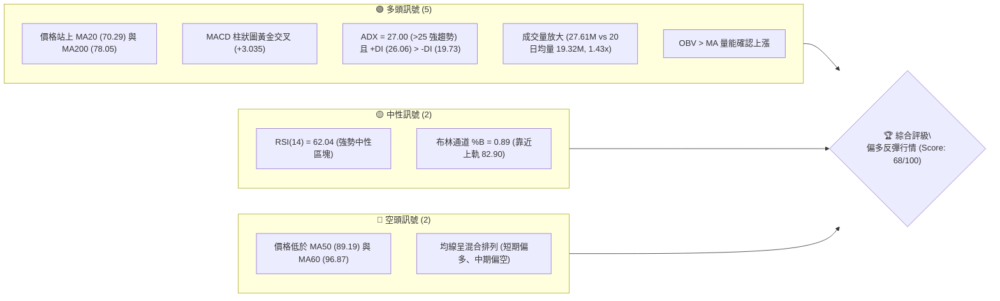
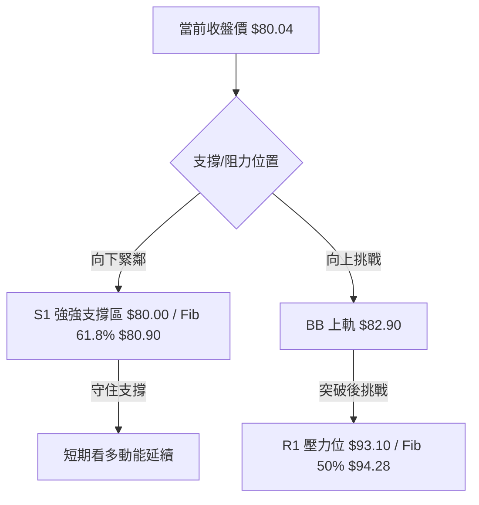
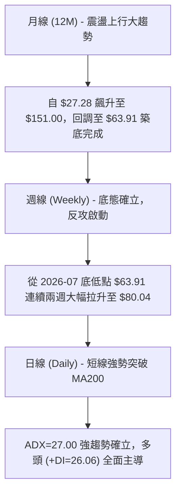
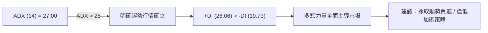
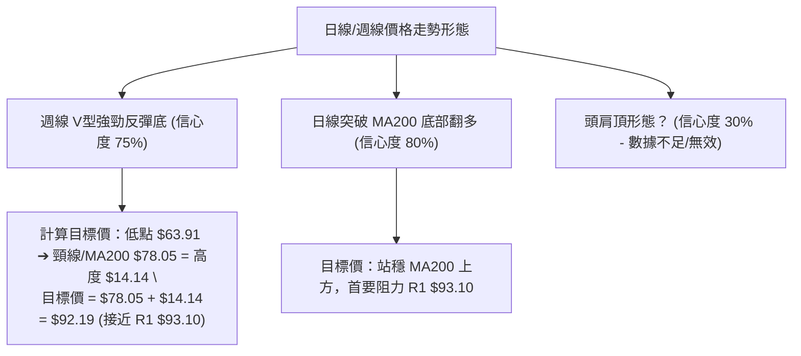
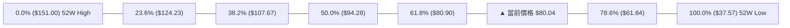
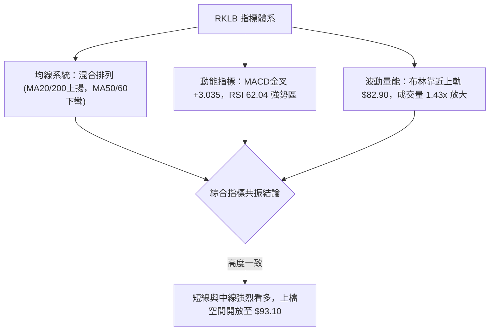
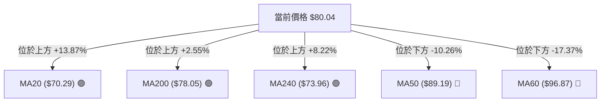
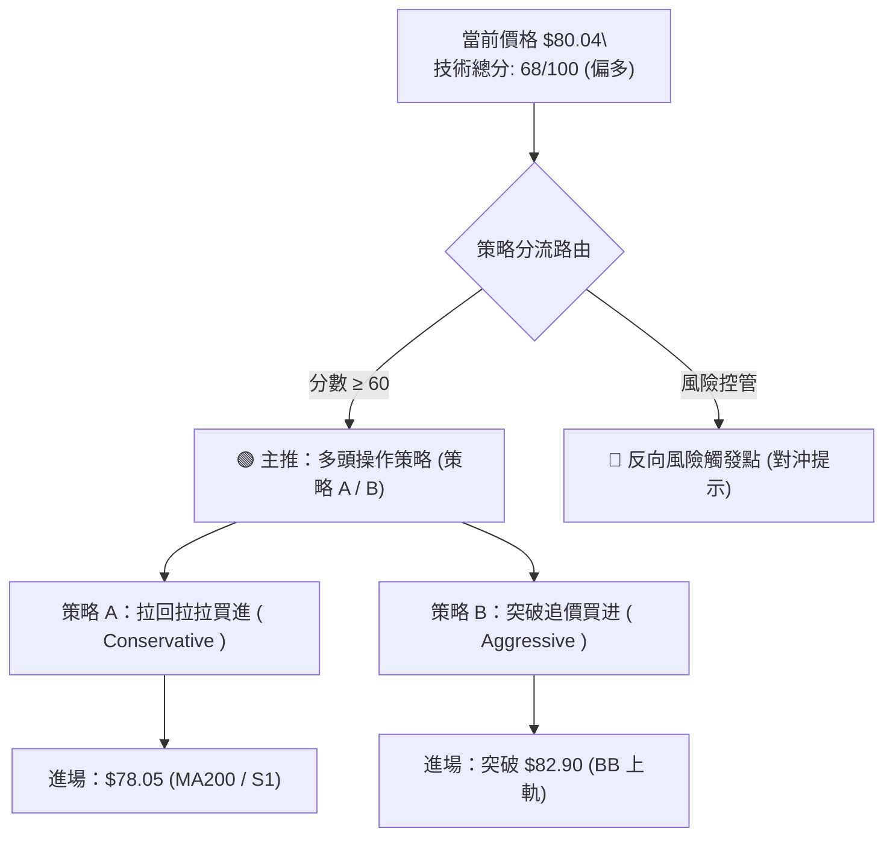
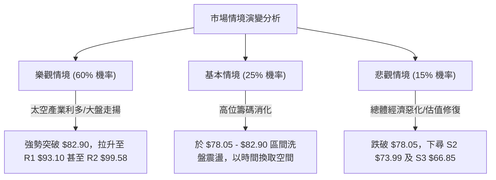

# RKLB 技術分析報告

> **報告日期**：2026-08-10 ｜ **語言**：繁體中文 ｜ **數據來源**：Yahoo Finance ｜ **當前價格**：$80.04

---

## 目錄

| 章節 | 內容 |
|------|------|
| [1. 技術面概覽](#1-技術面概覽) | 訊號儀表板、核心指標、評分卡 |
| [2. 趨勢分析](#2-趨勢分析) | 多時框趨勢、長中短期走勢 |
| [3. 圖表形態分析](#3-圖表形態分析) | 形態識別、K線組合、目標價 |
| [4. 支撐與阻力](#4-支撐與阻力) | 關鍵價位、斐波那契回調 |
| [5. 技術指標深度解讀](#5-技術指標深度解讀) | MA/RSI/MACD/布林/成交量 |
| [6. 動能與波動率](#6-動能與波動率) | 動能評估、ATR、Beta |
| [7. 多時框架總結](#7-多時框架總結) | 時框架評分矩陣 |
| [8. 交易策略建議](#8-交易策略建議) | 多空策略、風險報酬比 |
| [9. 風險提示與監控](#9-風險提示與監控) | 監控指標、風險場景 |

---

## 1. 技術面概覽

### 🎯 技術訊號儀表板





### 📊 核心指標速覽表

| 指標類別 | 指標名稱 | 當前數值 | 訊號 | 解讀 |
|----------|----------|----------|------|------|
| **價格** | 當前價格 | $80.04 | 🟢 | 位於52週區間 37.4% 分位，波段強勢反彈 |
| **均線** | MA20 | $70.29 | 🟢 | 價格在MA20上方 +13.87%，短線多頭主導 |
| **均線** | MA50 | $89.19 | 🔴 | 價格在MA50下方 -10.26%，中期承壓 |
| **均線** | MA200 | $78.05 | 🟢 | 價格突破MA200 +2.55%，長期趨勢重新轉強 |
| **動能** | RSI(14) | 62.04 | 🟢 | 處於多頭動能擴張區，無超買過熱現象 |
| **動能** | MACD | -2.809 (-5.844) | 🟢 | MACD柱狀圖擴張至 +3.035，零軸下強烈金叉 |
| **趨勢** | ADX(14) | 27.00 | 🟢 | ADX > 25 且 +DI(26.06) > -DI(19.73)，多頭主導 |
| **波動** | ATR(14) | $5.99 | 🟡 | 日波幅達 7.49%，屬於高波動成長股 |
| **量能** | 量比 (20D) | 1.43x | 🟢 | 日成交量 27.61M 增量上攻，量價配合良好 |

### 🏆 技術評分卡

╔══════════════════════════════════════════════════════════════╗
║              RKLB 技術指標綜合評分卡 (2026-08-10)            ║
╠══════════════════════════════════════════════════════════════╣
║ 趨勢強度 (ADX/+DI) ▓▓▓▓▓▓▓▓▓▓▓▓▓▓░░░░░░  70/100 🟢 看多      ║
║ 動能指標 (MACD/RSI) ▓▓▓▓▓▓▓▓▓▓▓▓▓▓▓░░░░░  75/100 🟢 看多      ║
║ 支撐穩定度 (S1/Fib) ▓▓▓▓▓▓▓▓▓▓▓▓▓▓▓░░░░░  75/100 🟢 看多      ║
║ 成交量配合 (OBV/Vol)▓▓▓▓▓▓▓▓▓▓▓▓▓▓▓▓░░░░  80/100 🟢 強勢      ║
║ 形態完整度 (V型底)  ▓▓▓▓▓▓▓▓▓▓▓▓░░░░░░░░  60/100 🟡 中性      ║
║ 均線排列 (MA混合)   ▓▓▓▓▓▓▓▓▓▓░░░░░░░░░░  50/100 🟡 中性      ║
╠══════════════════════════════════════════════════════════════╣
║ 綜合技術總分        ▓▓▓▓▓▓▓▓▓▓▓▓▓▓░░░░░░  68/100 🟢 偏多反彈  ║
╚══════════════════════════════════════════════════════════════╝

---

## 2. 趨勢分析

### 🌐 多時框趨勢分析



### 📈 長期趨勢 — 24個月走勢圖（Unicode）

```
RKLB 24個月收盤價格歷史走勢圖 ($)
$150 ┤                                                ● (2026-05 高點 $143.48 / 52W High $151.00)
$135 ┤                                              ●
$120 ┤                                            ●
$105 ┤                                          ●   ●
$90  ┤                                    ●   ●       ●                 ● $80.04 (現價)
$75  ┤                              ●   ●               ●             ●
$60  ┤                        ●   ●                       ●         ●
$45  ┤                  ●   ●                               ●     ●
$30  ┤          ●   ●
$15  ┤  ●   ●
     └─┬───┬───┬───┬───┬───┬───┬───┬───┬───┬───┬───┬───┬───┬───┬───┬───┬───┬───┬───┬───┬───┬───┬───
      24/08  10  12  25/02  04  06  08  10  12  26/02  04  06  08(現)
```

#### 走勢特徵分析表格

| 階段 | 時間區間 | 價格區間 | 漲跌幅 | 階段特徵與成交量解讀 |
|------|----------|----------|--------|----------------------|
| 1. 估值重塑期 | 2024-08 ~ 2025-01 | $6.27 ➔ $29.05 | +363.3% | 築底成功後跟隨太空產業爆發，成交量溫和放大 |
| 2. 籌碼換手期 | 2025-02 ~ 2025-05 | $20.49 ➔ $26.79 | +30.7% | 於 $17.88 ~ $29.00 高位洗盤，消化獲利賣壓 |
| 3. 主升段飆漲 | 2025-06 ~ 2026-05 | $35.77 ➔ $143.48 | +301.1% | 突破新高，主升段拉升至歷史頂峰 $151.00，週均量破1.5億股 |
| 4. 深度估值修正 | 2026-06 ~ 2026-07 | $101.65 ➔ $63.91 | -37.1% | 獲利回吐與高估值修正，跌至 52W 低點 $37.57 與 S3 $66.85 區域 |
| 5. 底部強勁反攻 | 2026-07末 ~ 2026-08 | $63.91 ➔ $80.04 | +25.2% | 週線 RSI 自 15.6 超賣區強烈反彈，日線突破 MA200，動能重現 |

### 📊 中期趨勢（週線分析）

```
週線壓力與支撐結構圖
$107.67 ─────────────────────────────────────────── Fib 38.2% / R3 ($107.60)
$94.28  ─────────────────────────────────────────── Fib 50.0% / R1 ($93.10)
$80.90  ───────────────┬────────────────────────── Fib 61.8% / 現價 $80.04 / S1 ($80.00)
                       │  ▲ (剛完成低位雙底/V型反彈)
$73.99  ───────────────┴────────────────────────── MA240 ($73.96) / S2 ($73.99)
$61.84  ─────────────────────────────────────────── Fib 78.6% / S3 ($66.85)
```

### ⚡ 趨勢強度評估（ADX 解讀）



| 指標項 | 當前數值 | 臨界標準 | 趨勢判定 | 交易指引 |
|--------|----------|----------|----------|----------|
| **ADX(14)** | 27.00 | > 25.0 | 強趨勢 | 拒絕震盪策略，採用突破/趨勢追蹤策略 |
| **+DI** | 26.06 | > -DI | 多頭強勁 | 多方控盤，拉回尋找買點 |
| **-DI** | 19.73 | < +DI | 空頭萎縮 | 空方動能衰退，不宜盲目做空 |

---

## 3. 图表形態分析

### 🔍 形態識別系統



#### 形態信心度與目標價計算表

| 形態名稱 | 信心度 | 判斷依據（引用數據） | 完成度 | 目標價（附計算式） |
|----------|--------|----------------------|--------|--------------------|
| **週線 V型底部反彈** | 75% 🟢 | 週線收盤價自 2026-07-26 低點 $63.91 強勢拉升至 $80.04，成交量配合擴張（96.4M週量） | 85% | 頸線 $78.05 + (頸線 $78.05 - 低點 $63.91) = **$92.19**（由形態高度推算，緊鄰 R1 $93.10） |
| **突破 MA200 底部翻多** | 80% 🟢 | 日價 $80.04 強勢站上 MA200 ($78.05)，且 MA5/MA10/MA20 全數向上彎頭金叉 | 90% | 第一目標 R1 **$93.10**，第二目標 R2 **$99.58** |
| **頭肩頂/雙頂** | 30% 🔴 | 雖然自 $151 高點拉回，但目前於 $63.91 獲強支撐並暴漲 25%，幾何圖形失效 | 0% | *訊號不足，不予採用幾何推算* |

### 🕯️ 重要 K 線形態分析

| 時間 / 週別 | 收盤價 | K 線形態 | 技術解讀 | 訊號強度 |
|-------------|--------|----------|----------|----------|
| **2026-07-26** | $63.91 | 長下影錘子線 (Hammer) | 在 S3 $66.85 附近探底，多頭強力反擊，RSI 達到 15.6 極端超賣 | 🟢 底部訊號 |
| **2026-08-02** | $64.95 | 築底陽線 (Bullish Base) | 守住 $64 關卡，日線打出雙重底腳，量能維持 85M 穩定換手 | 🟢 止跌確認 |
| **2026-08-09** | $82.83 | 長紅穿雲箭 (Bullish Engulfing) | 週漲幅達 +27.5%，一舉包覆前三週陰線，RSI 回升至 68.6 | 🟢🟢 強烈買訊 |
| **2026-08-16 (最新)** | $80.04 | 高位高掛十字星 / 小陰線 | 於 BB 上軌 $82.90 與 Fib 61.8% $80.90 遇到技術性回檔整理，多頭架構完好 | 🟡 短線整理 |

### 📉 ASCII 走勢形態示意圖

```
週線 V 型底反彈與 MA200 突破示意圖
$93.10 ┤                                        阻力 R1 (形態理論目標 $92.19)
       │                                       /
$82.90 ┤                            ●─────────●  BB 上軌 / 近期高點
$80.04 ┤                          ●/             ◄ 當前價格 $80.04 (Fib 61.8% $80.90)
$78.05 ┤========================●================ MA200 關鍵頸線 (已成功突破)
$73.99 ┤                      ●                  支撐 S2 / MA240
       │                    ●
$63.91 ┤  ●───────────────●                      V型V底雙腳 ($63.91 - $64.95)
       └────────────────────────────────────────
         2026-07-19      07-26    08-02    08-09
```

---

## 4. 支撐與阻力

### 🗺️ 關鍵價位分布圖（Unicode）

╔══════════════════════════════════════════════════════════════════╗
║                   RKLB 價位結構分布圖                            ║
╠══════════════════════════════════════════════════════════════════╣
║ $151.00 ║████████████████████████████████║ 52W High / Fib 0.0%    ║
║ $124.23 ║████████████████████            ║ Fib 23.6%              ║
║ $107.60 ║████████████████████████████    ║ 強阻力 R3 / Fib 38.2%   ║
║ $99.58  ║██████████████████              ║ 阻力 R2                ║
║ $93.10  ║████████████████████████        ║ 關鍵阻力 R1 / Fib 50%   ║
║ $82.90  ║████████████                    ║ 布林上軌 (BB Upper)     ║
║ $80.90  ║▓▓▓▓▓▓▓▓▓▓▓▓▓▓▓▓▓▓▓▓▓▓▓▓        ║ Fib 61.8% 關鍵分水嶺   ║
║ $80.04  ╠════════════════════════════════╣ ◄ 當前價格 $80.04        ║
║ $80.00  ║▓▓▓▓▓▓▓▓▓▓▓▓▓▓▓▓▓▓▓▓▓▓▓▓        ║ 近期支撐 S1            ║
║ $78.05  ║████████████████████████████    ║ MA200 長期均線生命線    ║
║ $73.99  ║████████████████████████        ║ 強支撐 S2 / MA240      ║
║ $70.29  ║████████████████                ║ MA20 / 布林中軌        ║
║ $66.85  ║████████████████████████████████║ 強力波段支撐 S3        ║
║ $61.84  ║████████████████                ║ Fib 78.6%              ║
║ $37.57  ║████████████████████████████████║ 52W Low / Fib 100.0%  ║
╚══════════════════════════════════════════════════════════════════╝

### 🚧 阻力位分析表

| 阻力級別 | 精確價位 | 形成原因 | 突破難度 | 技術重要性 |
|----------|----------|----------|----------|------------|
| **近端阻力** | **$82.90** | 布林通道上軌，短線超買乖離過大壓力區 | 🟡 中等 | 衝破此處將推升通道向上張口 |
| **關鍵阻力 R1** | **$93.10** | 近一年波段高點聚類 / 接近 Fib 50% ($94.28) | 🔴 較高 | 突破此區宣告中期套牢賣壓解套，開啟百元大關挑戰 |
| **阻力 R2** | **$99.58** | 心理關卡 $100 前夕 / 歷史密集成交套牢區 | 🟡 中等 | 破百元關鍵樞紐 |
| **強阻力 R3** | **$107.60** | 波段高點聚類 / Fib 38.2% ($107.67) 疊加 | 🔴 極高 | 中長期多空分水嶺 |

### 🛡️ 支撐位分析表

| 支撐級別 | 精確價位 | 形成原因 | 守住機率 | 技術重要性 |
|----------|----------|----------|----------|------------|
| **關鍵支撐 S1** | **$80.00** | 近一年波段低點聚類 / 緊貼當前價格 ($80.04) | 🟢 80% | 短線多頭防禦第一線，不容落破 |
| **核心生命線** | **$78.05** | MA200 均線位置，牛熊轉換樞紐 | 🟢 85% | 只要收盤守住 $78.05，中長期牛市架構不變 |
| **強支撐 S2** | **$73.99** | 波段低點聚類 / MA240 ($73.96) 強力疊加 | 🟢 90% | 回檔築底之黃金加碼區 |
| **波段底支撐 S3**| **$66.85** | 近一年前低聚類 / 2026-07 探底回升起漲點 | 🟢 95% | 多頭最後防線，跌破則中線趨勢走壞 |

### 📐 斐波那契回調位分析

依據 52 週高低點黃金分割計算（$37.57 ➔ $151.00，總波幅 $113.43）：



#### 技術意義解讀：
1. **當前位置**：$80.04 恰好落於 **Fib 61.8% ($80.90)** 與 **Fib 78.6% ($61.84)** 之間，且正向上猛烈測試 61.8% 黃金黃金分割強壓區 ($80.90)。
2. **黃金交會**：Fib 61.8% ($80.90) 與 S1 ($80.00) 形成極度密集的黃金支撐/阻力共振區。一旦有效突破並站穩 $80.90，價格將直奔 Fib 50% ($94.28) 與 R1 ($93.10)。

---

## 5. 技術指標深度解讀

### 🎛️ 指標訊號總覽



### 📈 移動平均線排列分析



| 均線名稱 | 當前價格 | 趨勢方向 | 乖離率 (Bias) | 技術解讀 |
|----------|----------|----------|---------------|----------|
| **MA5** | $77.57 | ▲ 上揚 | +3.19% | 極短期支撐，價格貼近 MA5 強勢上攻 |
| **MA10** | $71.04 | ▲ 上揚 | +12.67% | 短期多頭防線 |
| **MA20** | $70.29 | ▲ 上揚 | +13.87% | 月線走揚，提供強烈下檔支撐 |
| **MA50** | $89.19 | ▼ 下彎 | -10.26% | 季線下彎，為中期反彈主要目標與蓋頂壓力 |
| **MA60** | $96.87 | ▼ 下彎 | -17.37% | 中長期強壓區 |
| **MA120** | $86.45 | ▼ 下彎 | -7.42% | 半年線壓制 |
| **MA200** | $78.05 | ▲ 上揚 | +2.55% | **牛熊分界線**，價格重新跳躍於 MA200 之上，確立長線多頭 |
| **MA240** | $73.96 | ▲ 上揚 | +8.22% | 年線堅定向上，奠定長期底部 |

### 📉 RSI(14) 分析

```
RSI(14) 動能進度條
0            30                   60  62.04  70           100
[░░░░░░░░░░░░░░░░░░░░░░░░░░░░░░░░░█▓▓▓▓░░░░░░░░░░░░░░░░░░░░]
             ↑ 超賣               ↑ 當前強勢區 ↑ 超買
```

- **當前數值**：62.04（處於 50–70 多頭強勢擴張區，離 70 超買區仍有空間）。
- **背離判斷**：
  - **背離檢查結果**：數據顯示 `RSI 背離: 無明顯背離`。
  - **細節解讀**：價格從 $63.91 反彈至 $80.04，RSI 從 15.6 超賣區同步飆升至 62.04，量價與動能高度同步，無頂背離或底背離風險，漲勢健康。

### 📊 MACD(12/26/9) 訊號解讀

```
MACD 柱狀圖與雙線示意圖
 MACD 線:   -2.809  ▲ 向上穿越
 Signal 線: -5.844  ▲ 向上
 MACD Hist: +3.035  🟢 綠柱持續擴大 (強烈多頭訊號)

   +4.0 ┼                   █
   +2.0 ┼                 █ █
    0.0 ┼────────────────█─█─── (零軸)
   -2.0 ┼               █
   -4.0 ┼             █
   -6.0 ┼───────────● (Signal -5.844)
```

- **訊號解析**：MACD 快線 (-2.809) 強勢向上穿越慢線 (-5.844)，柱狀圖發散至 **+3.035**。這是標準的**零軸下方低位黃金交叉**，預示著強烈的跌深反彈與波段回升行情啟動。

### 📦 布林通道分析

```
布林通道現況示意圖 ($)
$82.90 ┤────────────────────────────────────────── BB 上軌 (Upper)
$80.04 ┤                                      ●   ◄ 當前價格 ($80.04, %B = 0.89)
       │                                    /
$70.29 ┤──────────────────────────────────●────── BB 中軌 (MA20)
       │                                /
$57.69 ┤──────────────────────────────●────────── BB 下軌 (Lower)
```

- **BB %B**：0.89（價格貼近上軌 $82.90）。
- **通道狀態**：通道寬度開始擴張，價格沿著上軌推進，屬於強勢多頭擠壓（Volatility Squeeze Breakdown to the Upside）特徵。

### 💹 成交量分析（量價配合度）

- **最新成交量**：27,605,592 股。
- **20日均量**：19,315,380 股（**量比 1.43x**，顯著放大 43%）。
- **OBV 趨勢**：`OBV > MA → 量能支撐上漲`。成交量隨價格推升而同步放大，展現主控資金強烈吃貨意願，量價共振極佳。

---

## 6. 動能與波動率

### ⚡ 動能評估四象限

```
動能與波動率四象限分析
                     強動能 (RSI > 60 / MACD Hist > 0)
                                   │
              象限 Q3              │              象限 Q1
      高風險高收益 (High Vol)      │     ★ RKLB 當前位置 (Q1)
                                   │     強動能 + 高波動率
                                   │     (ATR% = 7.49%, ADX = 27.0)
 ──────────────────────────────────┼──────────────────────────────────
              象限 Q4              │              象限 Q2
        避險觀望 (Weak/High)       │      穩健累積 (Strong/Low)
                                   │
                                   │
                     弱動能 (RSI < 40 / MACD Hist < 0)
```

| 象限 | 動能狀態 | 波動率狀態 | 當前定位 | 策略建議 |
|------|----------|------------|----------|----------|
| **Q1 (強動能/高波動)** | **強 (RSI 62, MACD+)** | **高 (ATR 7.49%, Beta 2.63)** | **✓ RKLB 位於此區** | **順勢做多，精準設定止損點，分批獲利** |
| Q2 (強動能/低波動) | 強 | 低 | - | 最佳槓桿買進區 |
| Q3 (弱動能/高波動) | 弱 | 高 | - | 嚴格避開或逢高做空 |
| Q4 (弱動能/低波動) | 弱 | 低 | - | 沉悶打底，觀望為主 |

### 📊 ATR 波動率分析

- **ATR(14)**：**$5.99**（占股價比重 **7.49%**）。
- **止損距離建議**：
  - **保守型止損（1.5x ATR）**：$80.04 - (1.5 × $5.99) = **$71.05**（緊貼 MA10 $71.04）。
  - **標準型止損（1.0x ATR）**：$80.04 - (1.0 × $5.99) = **$74.05**（緊貼 S2 $73.99）。
  - **緊密型止損（0.5x ATR）**：$80.04 - (0.5 × $5.99) = **$77.05**（緊貼 MA200 $78.05 / S1 $80.00）。

### 📐 Beta 與市場相關性

- **Beta 係數**：**2.629**（高 Beta 屬性）。
- **特性解讀**：當大盤（S&P 500 / Nasdaq）上漲 1% 時，RKLB 平均上漲約 2.63%；反之亦然。適合在市場風險偏好回升（Risk-on）環境下作為進攻型龍頭配置。

---

## 7. 多時框架總結

### 📋 時框架評分表

| 時框架 | 趨勢方向 | 動能 (RSI/MACD) | 均線排列 | 形態結構 | 綜合評分 | 建議方向 |
|--------|----------|-----------------|----------|----------|----------|----------|
| **日線 (Daily)** | 🟢 多頭抬頭 | 🟢 MACD金叉 (+3.035) | 🟡 混合突破 MA200 | 🟢 底部突破 | **75 / 100** | 偏多操作 / 逢低進場 |
| **週線 (Weekly)** | 🟢 強烈反彈 | 🟢 RSI 68.6 強勢 | 🟢 守住年線 MA240 | 🟢 V型打底完成 | **70 / 100** | 順勢持有 |
| **月線 (Monthly)** | 🟡 估值修復 | 🟡 中性回升 | 🟢 長線牛市未破 | 🟡 高位回檔震盪 | **60 / 100** | 長線分批布局 |

### 🔲 綜合訊號矩陣

```
            日線 (Short-term)     週線 (Mid-term)     月線 (Long-term)
均線系統         🟢 (突破MA200)       🟢 (守住MA240)       🟢 (均線長多)
動能指標         🟢 (MACD金叉)        🟢 (RSI 68.6)        🟡 (中性)
成交量能         🟢 (量比 1.43x)      🟢 (週量96M放大)     🟢 (OBV向上)
               ───────────────     ───────────────     ───────────────
整體一致性       🟢 高度共振 (多頭控盤)
```

### ⚖️ 多時框收斂結論

依據多時框收斂規則：當前 **ADX(14) = 27.00 (>25)**，明確定義為**趨勢行情**。
1. **主導時框**：以週線與長期均線（MA200 $78.05 / MA240 $73.96）的方向為主導。
2. **方向收斂**：價格已強勢重回 MA200 之上，且週線拉出穿雲陽線。日線的短線整理僅為尋找最佳進場點的時機。
3. **最終唯一結論**：**偏多反彈與順勢做多行情**（與第 8 章主策略完全一致）。

---

## 8. 交易策略建議

### 🗺️ 策略決策流程圖



### 🧭 策略路由

**當前主策略方向 = 🟢 多頭順勢買進 / 逢低加碼（依評分卡 68/100）**

### 🎯 價格情境階梯（Price Scenarios）

| 觸發條件 | 第一目標 | 第二目標 | 情境技術含義 |
|----------|----------|----------|--------------|
| 突破 BB 上軌 **$82.90** | R1 **$93.10** | R2 **$99.58** | 啟動短線主攻波，挑戰百元大關 |
| 站穩現價區間 **$80.00 - $80.90** | R1 **$93.10** | - | 守牢 MA200 樞紐，多頭積蓄動能 |
| 跌破生命線 **$78.05** | S2 **$73.99** | S3 **$66.85** | 深幅回檔測試年線與波段低點 |

### 📊 情境機率分佈

```
情境機率分佈圖
[████████████████████████████████░░░░░░░░░░░░░░░░░░░░] 60%  繼續上行挑戰 R1
[██████████████░░░░░░░░░░░░░░░░░░░░░░░░░░░░░░░░░░░░░░] 25%  高位區間震盪 ($78.05 - $82.90)
[███████░░░░░░░░░░░░░░░░░░░░░░░░░░░░░░░░░░░░░░░░░░░░░] 15%  跌破 $78.05 回測 S2
```

| 情境 | 機率 | 主要技術依據 |
|------|------|--------------|
| **繼續上行 / 反彈** | **60%** | MACD 柱狀圖發散 (+3.035)、ADX=27 強趨勢、+DI > -DI、成交量放大 1.43x |
| **高位區間震盪** | **25%** | 價格貼近 BB 上軌 $82.90 及 Fib 61.8% $80.90 遇到短線獲利解套賣壓 |
| **回落再探底** | **15%** | MA50 ($89.19) 下灣蓋頂壓制，需防範大盤突發性拉回 |

### 🟢 主策略詳情

| 策略要素 | 策略 A：拉回逢低買進 ( Conservative ) | 策略 B：突破追攻買進 ( Aggressive ) |
|----------|----------------------------------------|-------------------------------------|
| **進場條件** | 股價拉回至 MA200 / S1 支撐區且守穩 | 收盤價強勢突破布林上軌 $82.90 帶量確認 |
| **進場價格** | **$78.05**（緊貼 MA200 生命線） | **$83.50**（突破 $82.90 後之確認價） |
| **目標價 T1** | **$93.10**（阻力 R1 / Fib 50% $94.28） | **$93.10**（阻力 R1） |
| **目標價 T2** | **$99.58**（阻力 R2 / 百元大關前） | **$107.60**（強阻力 R3 / Fib 38.2%） |
| **止損價格** | **$73.99**（跌破 S2 / MA240） | **$78.05**（重新跌破 MA200） |
| **風險報酬比**| **3.71 : 1** 🟢 (風險 $4.06 vs 報酬 $15.05) | **1.76 : 1** 🟡 (風險 $5.45 vs 報酬 $9.60) |
| **預估成功率**| **70%** | **60%** |
| **建議倉位** | **15% - 20%** | **10% - 15%** |

*註：風險報酬比計算式 (策略A T1) = ($93.10 - $78.05) / ($78.05 - $73.99) = $15.05 / $4.06 = 3.71*

### 🔴 反向風險觸發點（對沖提示）

- **觸發條件**：若日線收盤價跌破 **$78.05** (MA200) 且成交量異常放大至 3,000 萬股以上。
- **對沖處置**：多單全面減碼 50%，若進一步跌破 **$73.99** (S2)，多單全數停損出場，短線可輕倉對沖做空至 **$66.85** (S3)。

### ⭐ 整體訊號強度評星

```
做多訊號強度：★★██☆  (4/5星) 🟢 強烈看多
做空訊號強度：★☆☆☆☆  (1/5星) 🔴 不宜做空
整體可信度：  ★★██☆  (4/5星) 🟢 高度可信
```

---

## 9. 風險提示與監控

### ✅ 關鍵監控指標 Checklist

╔══════════════════════════════════════════════════════════════╗
║                每日與每週重點技術監控清單                    ║
╠══════════════════════════════════════════════════════════════╣
║ [ ] MA200 保衛戰：每日收盤價是否持續高於 $78.05              ║
║ [ ] 布林上軌突破：是否能帶量攻克 $82.90                       ║
║ [ ] MACD 柱狀圖：柱狀體是否持續大於 0 並向上擴張 (+3.035)    ║
║ [ ] ADX 趨勢續航：ADX 是否維持在 25 以上，且 +DI > -DI       ║
║ [ ] 成交量配合：日成交量是否保持在 20日均量 (19.3M) 之上      ║
╚══════════════════════════════════════════════════════════════╝

### ⚠️ 風險場景分析



### 🛡️ 風險管理重要提醒

1. **高 Beta 波動風險**：RKLB 的 Beta 值高達 **2.629**，ATR 達 **$5.99 (7.49%)**，單日波動劇烈。操作上切忌滿倉或高槓桿，建議總持倉不超過資產組合的 15%-20%。
2. **嚴格執行止損紀律**：把 **$78.05 (MA200)** 與 **$73.99 (S2)** 設定為硬性止損位，一旦收盤跌破切勿抱險僥倖。
3. **分析師目標價參考**：市場 16 位分析師平均目標價為 **$111.31**（最高 $150.00，最低 $64.00），現價 $80.04 距平均目標價尚有 **+39.1%** 的上行空間，基本面與技術面相輔相成。

---

## 📋 報告總結

╔══════════════════════════════════════════════════════════════╗
║                   RKLB 技術分析報告總結                      ║
════════════════════════════════════════════════════════════════
報告日期：2026-08-10
當前價格：$80.04
綜合評級：🟢 68/100 (偏多反彈 / 順勢買進)

關鍵結論：
├─ 長期趨勢：🟢 重新突破 MA200 ($78.05) 長線生命線，牛市架構重現
├─ 中期趨勢：🟢 週線於 $63.91 完成 V型打底，長紅穿雲箭回升
├─ 短期趨勢：🟢 日線 MACD 金叉 (+3.035)，ADX (27.00) 多頭控盤
├─ 關鍵支撐：S1 $80.00 / MA200 $78.05 / S2 $73.99
├─ 關鍵阻力：BB上軌 $82.90 / R1 $93.10 / R2 $99.58
└─ 分析師目標價：均價 $111.31 (隱含 +39.1% 上升空間)

最優策略組合：
1. 🥇 最佳機會（策略 A）：等候拉回至 $78.05 (MA200) 附近分批買進，止損 $73.99，目標 $93.10 (風報比 3.71:1)。
2. 🥈 次選機會（策略 B）：若強勢帶量突破 $82.90 追價進場，止損 $78.05，目標 $93.10 / $107.60。
3. 🥉 保守選擇：待股價突破並站穩 R1 $93.10 後，順勢參與挑戰百元關卡 ($99.58)。
════════════════════════════════════════════════════════════════

> ⚠️ **免責聲明**：本報告為 AI 自動生成之技術分析，所有數據及估算均基於提供的歷史價格資訊。本報告**僅供研究與學術參考**，**不構成任何投資建議**。投資有風險，入市需謹慎。

---

*報告生成時間：2026-08-10 ｜ 數據來源：Yahoo Finance ｜ 分析框架：多時框技術分析*