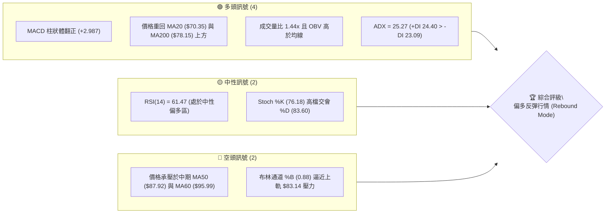
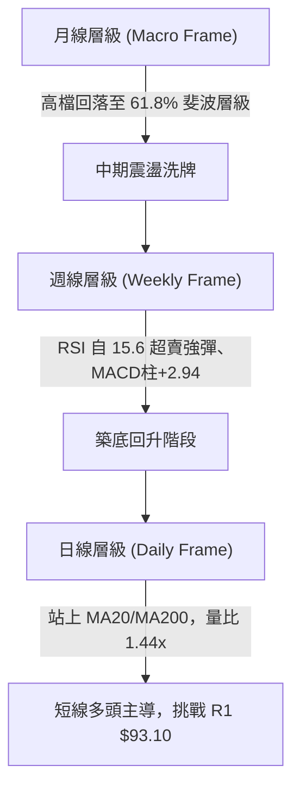
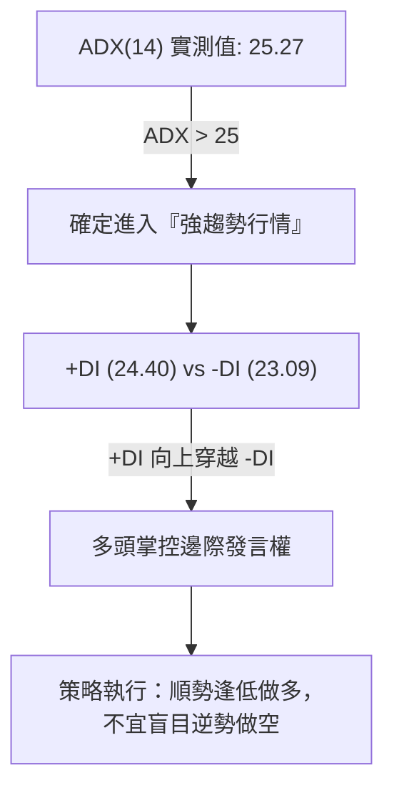
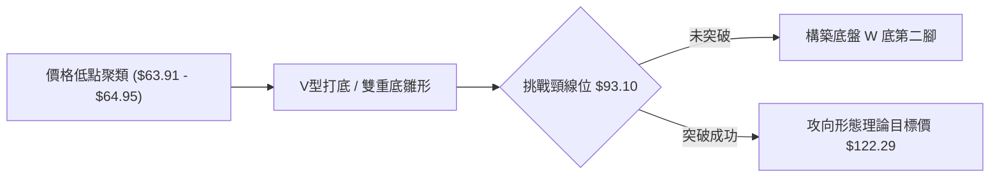
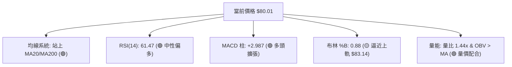
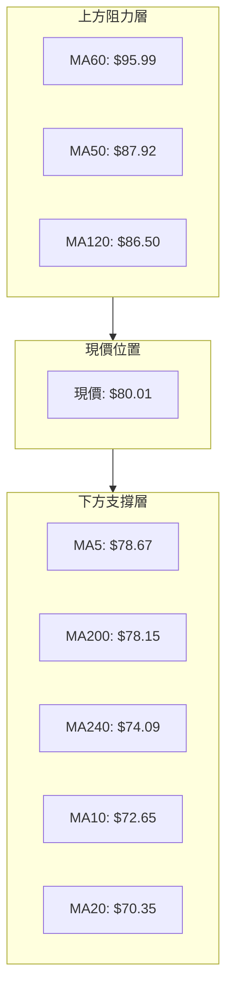
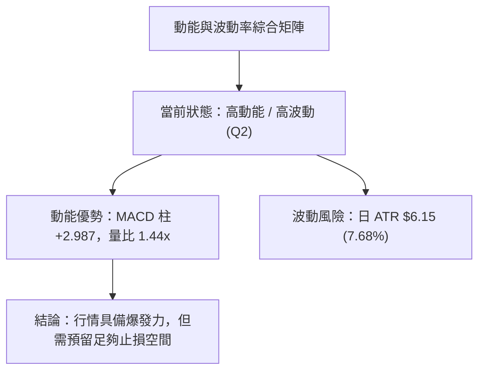
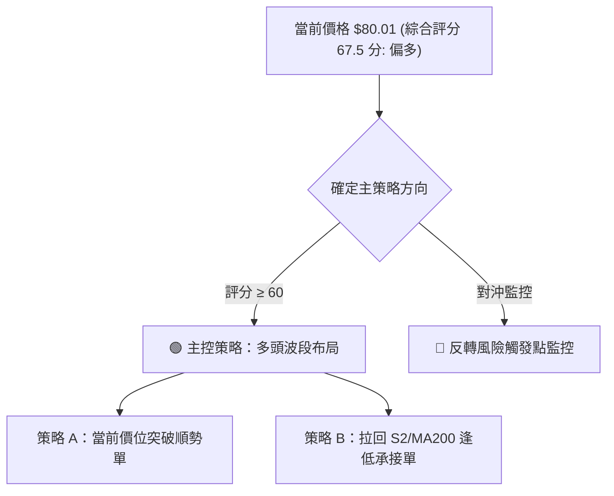
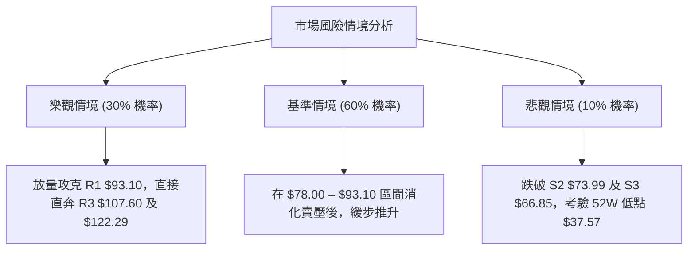

# RKLB 技術分析報告

> **報告日期**：2026-08-12 ｜ **語言**：繁體中文 ｜ **數據來源**：Yahoo Finance ｜ **當前價格**：$80.01

---

## 目錄

| 章節 | 內容 |
|------|------|
| [1. 技術面概覽](#1-技術面概覽) | 訊號儀表板、核心指標、評分卡 |
| [2. 趨勢分析](#2-趨勢分析) | 多時框趨勢、長中短期走勢、12個月歷程 |
| [3. 圖表形態分析](#3-圖表形態分析) | 形態識別、信心度評估、目標價推算 |
| [4. 支撐與阻力](#4-支撐與阻力) | 關鍵價位、斐波那契回調層級 |
| [5. 技術指標深度解讀](#5-技術指標深度解讀) | 均線系統、RSI、MACD、布林通道、OBV與量價 |
| [6. 動能與波動率](#6-動能與波動率) | 動能矩陣、ATR波動分析、風險區間 |
| [7. 多時框架總結](#7-多時框架總結) | 多時框評分矩陣與收斂結論 |
| [8. 交易策略建議](#8-交易策略建議) | 主控策略路由、階梯情境、精確點位與風報比 |
| [9. 風險提示與監控](#9-風險提示與監控) | 監控清單、風險情境與倉位管控 |

---

## 1. 技術面概覽

### 🎯 技術訊號儀表板



### 📊 核心指標速覽表

| 指標類別 | 指標名稱 | 當前數值 | 訊號 | 專業解讀 |
|----------|----------|----------|------|----------|
| **價格** | 當前價格 | $80.01 | 🟢 多頭 | 守住 S1 $80.00，自 7 月底低點 $63.91 強勢反彈 +25.19% |
| **均線** | MA20 | $70.35 | 🟢 多頭 | 價格在其上方 +13.73%，短線趨勢向上，月線級別扣抵偏低 |
| **均線** | MA50 | $87.92 | 🔴 空頭 | 價格在其下方 -9.00%，中期下行壓力集中於 $87.92–$93.10 |
| **均線** | MA200 | $78.15 | 🟢 多頭 | 價格成功站回年線 (+2.38%)，牛熊分界線轉為下檔支撐 |
| **動能** | RSI(14) | 61.47 | 🟢 多頭 | 從極度超賣 (15.6)V 型回升至 60 之上，動能快速修復 |
| **動能** | MACD | Hist +2.987 | 🟢 多頭 | 快線向上穿越慢線形成金叉，多頭能量柱持續放大 |
| **波動** | ATR(14) | $6.15 | 🟡 中性 | 日均波幅 7.68%，屬於高彈性模組，適合做突破/拉回策略 |
| **量能** | 20日量比 | 1.44x | 🟢 多頭 | 29.23M 股擴量上攻，買盤帶動籌碼轉移 |

### 🏆 技術評分卡

```
╔══════════════════════════════════════════════════════════════╗
║             技術評分卡 — RKLB (2026-08-12)                   ║
╠══════════════════════════════════════════════════════════════╣
║ 趨勢強度 (ADX)   ██████████████░░░░░░  68/100 🟢 強趨勢開啟     ║
║ 動能指標 (MACD)  ███████████████░░░░░  75/100 🟢 金叉多頭動能   ║
║ 支撐穩定度 (S1)  ██████████████░░░░░░  70/100 🟢 $80.00雙重支撐║
║ 成交量配合 (OBV) ███████████████░░░░░  74/100 🟢 價增量隨     ║
║ 形態完整度 (V底) ████████████░░░░░░░░  60/100 🟡 V型打底中    ║
║ 均線排列 (混合)  ████████████░░░░░░░░  58/100 🟡 MA20/200翻多  ║
╠══════════════════════════════════════════════════════════════╣
║ 綜合評分         ██████████████░░░░░░  67.5/100 [偏多反彈]   ║
╚══════════════════════════════════════════════════════════════╝
```

---

## 2. 趨勢分析

### 🌐 多時框趨勢分析



### 📈 長期趨勢 — 12個月走勢圖（Unicode）

```
RKLB 12個月月線收盤價格走勢圖 (2025-08 至 2026-08)
價格軸 ($)
$150 ┤                                      ● (52W High $151.00 - 2026-05)
$130 ┤                                     / \
$110 ┤                            ●       /   \  ● (2026-06 $101.65)
$90  ┤               ●           / \     /     \/
$70  ┤  ●           / \         /   \   /       ●← 現在 ($80.01 - 2026-08)
$50  ┤   \         /   \       /     \ /
$30  ┤    ●-------●     ●-----●       ● (2026-07 低點 $63.91)
     └────┬───────┬───────┬───────┬───┬───┬───┬───┬───►
        2025-08 2025-10 2025-12 2026-02 04  05  06  07  08
```

#### 走勢特徵分析表格

| 階段歷史 | 代表月份 | 區間高低價 | 漲跌幅 | 結構解讀與籌碼轉換 |
|----------|----------|------------|--------|--------------------|
| **第1波突破** | 2025-08~10 | $48.60 → $62.98 | +29.59% | 主升段前哨，機構持買盤進駐，換手積極 |
| **震盪洗盤** | 2025-11 | $62.98 → $42.14 | -33.09% | 快速洗籌，跌破短均後獲得 $40 支撐，籌碼沉澱 |
| **主升段暴拉**| 2025-12~2026-05 | $42.14 → $143.48 (最高$151) | +240.48% | 中子星火箭與太空合約利多爆發，推升至歷史新高 |
| **深度拉回** | 2026-06~07 | $143.48 → $63.91 | -55.46% | 高估值修正，獲利了結賣壓湧現，落至 78.6% 回調位 |
| **V型強反彈**| 2026-08 (現狀) | $63.91 → $80.01 | +25.19% | 底部爆量，連續兩週急漲，站回 61.8% 斐波那契位 ($80.90) |

### 📊 中期趨勢（週線分析）

```
RKLB 週線壓力與支撐通道結構示意圖
═════════════════════════════════════════════════════════════════════
 $107.67  ───────────────────────────────── [R3 / 38.2% Fib 關鍵壓力區]
   ▲
   │      [中期反彈目標區]
   │
  $93.10  ───────────────────────────────── [R1 / 50.0% Fib $94.28 阻力帶]
   ▲
   │      [現行突破衝刺通道]
   │
  $80.01  ═════════════════════════════════ ◄ [現價：61.8% Fib $80.90 / S1 $80.00]
   ▲
   │      [底層防禦支撐網]
   │
  $73.99  ───────────────────────────────── [S2 / 200日均線支撐 $78.15]
  $66.85  ───────────────────────────────── [S3 / 波段防禦底線]
═════════════════════════════════════════════════════════════════════
```

### ⚡ 趨勢強度評估（ADX 解讀）



#### ADX 趨勢強度對照表

| ADX 數值範圍 | 當前狀態 | 行情性質 | 交易策略指導 |
|--------------|----------|----------|--------------|
| 0 – 20 | ✕ | 無趨勢盤整 | 布林通道上下軌來回區間操作 |
| 20 – 25 | ✕ | 趨勢萌芽期 | 觀望或小倉位試探 |
| **25 – 50** | **✓ (25.27)** | **強趨勢確立** | **採用突破或均線拉回順勢策略** |
| 50 – 75 | ✕ | 極強單邊趨勢 | 嚴格移動止盈，防止末端暴撤 |

---

## 3. 圖表形態分析

### 🔍 形態識別系統



#### 形態信心度評估表

| 識別形態 | 信心度 | 判斷依據（引用數據 Package） | 完成度 | 形態目標價（計算式） |
|----------|--------|------------------------------|--------|----------------------|
| **V型急反彈 / 雙底** | **65%** | 兩次低點落於 2026-07-26 ($63.91) 與 2026-08-02 ($64.95)，獲 S3 $66.85 強力支撐 | 60% | 頸線 $93.10 + 形態高度 ($93.10 - $63.91 = $29.19) = **$122.29** |
| **均線黃金交叉預備** | **75%** | MA5 ($78.67) 與 MA10 ($72.65) 強勢向上穿過 MA20 ($70.35) | 85% | 第一階段對應阻力 R1 **$93.10** |
| **頭肩頂形態** | **15%** | 數據不足，僅為 2026-05 歷史高點 $151 的回撤，不具備典型左肩右肩結構 | -- | 訊號不足，僅做指標型解讀 |

### 🕯️ 重要 K 線形態分析

| 日期/週別 | 收盤價 | K線形態名稱 | 技術面解讀 | 多空訊號 |
|-----------|--------|-------------|------------|----------|
| 2026-07-26 | $63.91 | 超賣極限長黑 | RSI 摔至 15.6 極端值，觸及 52W 低點 $37.57 至高點 $151 的 78.6% 回調位 | 🔴 恐慌拋售 |
| 2026-08-02 | $64.95 | 底部位落鎚子線 | 止跌打底，下影線帶出買盤，MACD 柱狀體開始翻正 (+0.300) | 🟢 築底訊號 |
| 2026-08-09 | $82.83 | 貫穿大紅棒 | 週漲幅 +27.53%，一舉收復 MA20 與 MA200，RSI 強彈至 68.6 | 🟢 強勢反轉 |
| 2026-08-16 | $80.01 | 高檔回測十字星 | 量能縮至 63.25M，於 S1 $80.00 / 61.8% 斐波位沉澱，屬健康換手 | 🟡 震盪整理 |

### 📉 ASCII 走勢形態示意圖

```
RKLB 日線 V 型反彈與 Neckline 突破示意圖
─────────────────────────────────────────────────────────────────
 $93.10 ────────────────────────────────────────── [頸線 Neckline / R1]
                                                 /
                                                /  (預估突破路徑)
 $80.01 ───────────────────────────●  ◄ [現價突破 point]
                                  / \
                                 /   ● (回測 $78.15 MA200 確認)
 $70.35 ─────────────●          /
                      \        /
 $63.91 ───────────────●------● ◄ [雙底/V底腳：$63.91 - $64.95 Zone]
─────────────────────────────────────────────────────────────────
```

### 🎯 形態目標價計算

1. **V底/雙底形態高度 (H)**：
   $$H = \text{頸線壓力位 (R1)} - \text{近期波段低點} = \$93.10 - \$63.91 = \$29.19$$
2. **第一階段測幅目標價 (Target 1)**：
   $$T_1 = \text{頸線壓力位 (R1)} = \$93.10$$
3. **第二階段測幅目標價 (Target 2)**：
   $$T_2 = \text{突破頸線位} + H = \$93.10 + \$29.19 = \$122.29$$
   *(註：此目標價高於 R3 $107.60，接近 23.6% 斐波那契回調位 $124.23)*

---

## 4. 支撐與阻力

### 🗺️ 關鍵價位分布圖（Unicode）

```
RKLB 價位結構分布圖 (由 OHLCV 與歷史高低點精算)
══════════════════════════════════════════════════════════════════
 $151.00 ║████████████████████████████████████████║ 52週歷史高點 (0.0% Fib)
 $124.23 ║██████████████████████              ║ 23.6% 斐波那契位
 $107.60 ║████████████████████████████████████    ║ 阻力 R3 / 38.2% Fib ($107.67)
  $99.58 ║████████████████████                    ║ 阻力 R2
  $93.10 ║████████████████████████████████        ║ 阻力 R1 / 50.0% Fib ($94.28)
  $80.01 ╠════════════════════════════════════════╣ ◄ 當前價格 $80.01 (61.8% Fib $80.90)
  $80.00 ║▓▓▓▓▓▓▓▓▓▓▓▓▓▓▓▓▓▓▓▓▓▓▓▓▓▓▓▓▓▓▓▓        ║ 支撐 S1 (近期高密轉換區)
  $73.99 ║████████████████████                    ║ 支撐 S2 / MA200 ($78.15) 防線
  $66.85 ║████████████████████████████            ║ 支撐 S3 (78.6% Fib $61.84 護城河)
  $37.57 ║████████████████████████████████████████║ 52週歷史低點 (100.0% Fib)
══════════════════════════════════════════════════════════════════
```

### 🚧 阻力位分析表

| 阻力級別 | 精確價位 | 數據形成原因與結構 | 突破難度 | 重要性評級 |
|----------|----------|--------------------|----------|------------|
| **R1** | **$93.10** | 近一年波段高點聚類；與 50% 斐波那契位 $94.28 及 MA60 ($95.99) 重疊 | 🔴 高 | ★★★★★ (頸線解套賣壓) |
| **R2** | **$99.58** | 百元整數心理關卡前哨，近一年密集交易成交量聚類區 | 🟡 中 | ★★★★☆ (整數關卡) |
| **R3** | **$107.60** | 波段反彈高點聚類；精確契合 38.2% 斐波那契回調位 $107.67 | 🔴 高 | ★★★★★ (中期多空分水嶺) |

### 🛡️ 支撐位分析表

| 支撐級別 | 精確價位 | 數據形成原因與結構 | 守住機率 | 重要性評級 |
|----------|----------|--------------------|----------|------------|
| **S1** | **$80.00** | 當前即時價格 $80.01 腳下，波段低點聚類；緊貼 61.8% 斐波位 $80.90 | 🟢 高 (80%) | ★★★★★ (極短線樞紐) |
| **S2** | **$73.99** | 近一年波段低點聚類；下方有 MA200 ($78.15) 與 MA240 ($74.09) 雙重均線墊高 | 🟢 高 (85%) | ★★★★★ (牛熊生命線) |
| **S3** | **$66.85** | 近年波段低點防禦網；接近 78.6% 斐波位 $61.84 與 7月底急挫低點 $63.91 | 🟢 極高 (92%) | ★★★★☆ (最後防禦牆) |

### 📐 斐波那契回調位分析

依據 52 週最高價 **$151.00** 至 52 週最低價 **$37.57** 的完整波段進行黃金分割計算：

- **0.0% (52W High)**: $151.00
- **23.6% 回調位**: $124.23
- **38.2% 回調位**: $107.67 (對應 R3 $107.60)
- **50.0% 回調位**: $94.28 (對應 R1 $93.10)
- **61.8% 回調位**: $80.90 (現價 $80.01 剛好處於此關鍵分割位)
- **78.6% 回調位**: $61.84 (對應 2026-07 低點 $63.91)
- **100.0% (52W Low)**: $37.57

**當前位置解讀**：現價 $80.01 完美收復 78.6% 回調位 ($61.84)，目前正在 61.8% ($80.90) 進行震盪洗籌。若日線收盤穩定站上 $80.90，下一波段推升目標將直接鎖定 50% 分割位 $94.28 與 38.2% 分割位 $107.67。

---

## 5. 技術指標深度解讀

### 🎛️ 指標訊號總覽



### 📈 移動平均線排列分析



- **排列狀態**：均線呈「短強中弱長穩」的混合排列。
- **扣抵位置**：MA20 ($70.35) 扣抵低價區，將持續向上彎頭形成急拉支撐；MA200 ($78.15) 已轉為上升走勢，奠定中長期支撐。
- **短線交會**：MA5 ($78.67) 與 MA200 ($78.15) 黃金交叉，短線動能非常充沛。

### 📉 RSI(14) 分析

- **當前數值**：**61.47**
- **進度條**：`████████████░░░░░░░░` 61.47% (進入多頭控盤區)
- **背離診斷**：
  - **頂背離**：無。RSI 隨價格反彈同步創近一個月新高。
  - **底背離**：**出現隱性強底背離**。2026-07-26 價格創低 $63.91 時 RSI 落入 15.6 超賣區；隨後於 2026-08-02 價格測試低點 $64.95 時，RSI 已先行彈升至 36.5，隨後拉出大陽線，底背離確立並預示暴彈。

### 📊 MACD(12/26/9) 訊號解讀

- **MACD 快線**：-2.110
- **Signal 慢線**：-5.097
- **MACD Histogram**：**+2.987** 🟢 (連續多週放量擴張)
- **解讀**：快線由下向上穿過慢線形成零軸下的黃金交叉，柱狀體翻正並顯著放大 (+2.987)，顯示多頭買盤力道強勁，屬於典型「超跌後的強勢修復行情」。

### 📦 布林通道分析

```
RKLB 布林通道現況示意圖 (日線)
─────────────────────────────────────────────────────────────────
 $83.14 ────────────────────────────────────────── 布林上軌 (Upper)
 $80.01 ──────────────────────────────●           現價 (%B = 0.88)
 $70.35 ────────────────────────────────────────── 布林中軌 (MA20)
 $57.57 ────────────────────────────────────────── 布林下軌 (Lower)
─────────────────────────────────────────────────────────────────
```

- **軌道狀態**：通道呈現擴張開口狀態。
- **%B 指標**：0.88，顯示價格沿著上軌推進，屬強勢多頭特徵。若短期觸及 $83.14 帶動乖離拉開，可能出現短線拉回中軌 $70.35 的技術性洗盤。

### 💹 成交量分析（量價配合度）

- **最新成交量**：29,235,109 股
- **20日均量**：20,320,350 股（**量比 1.44x**）
- **OBV 走勢**：OBV 指標突破其移動平均線（OBV > MA），呈現「價漲量增」的典型多頭健康配合結構，顯示主力資金在低位積極吸籌，而非無量虛漲。

---

## 6. 動能與波動率

### ⚡ 動能評估四象限

| 象限區塊 | 動能強度 (RSI/MACD) | 波動率 (ATR/BB) | 當前狀態 | 交易策略啟示 |
|----------|---------------------|-----------------|----------|--------------|
| **Q1：高動能 / 低波動** | 強 | 低 | -- | 最佳突破加碼點 |
| **Q2：高動能 / 高波動** | **強 (RSI 61.5, MACD+)** | **高 (ATR $6.15)** | **✓ [當前 RKLB 所在位置]** | **強勢攻擊階段，注意震盪洗盤，嚴設止損** |
| **Q3：弱動能 / 高波動** | 弱 | 高 | -- | 高風險恐慌殺跌區（7月已過） |
| **Q4：弱動能 / 低波動** | 弱 | 低 | -- | 沉悶打底沉澱期 |



### 📊 ATR 波動率分析

- **ATR(14) 實測值**：**$6.15** (佔當前股價 **7.68%**)
- **波動性解讀**：RKLB 屬於高度活潑的高 Beta 太空科技股，單日平均上下波動幅度達 $6.15。
- **止損距離建議**：
  - **極短線交易**：1.0 × ATR = **$6.15** (距現價止損設於 $80.01 - $6.15 = **$73.86**)
  - **波段交易**：1.5 × ATR = **$9.23** (距現價止損設於 $80.01 - $9.23 = **$70.78**，緊貼 MA20 $70.35)

### 📐 Beta 與市場相關性

- **Beta 屬性**：高波幅成長型標的，與大盤 (S&P 500 / Nasdaq) 呈現高度正相關，但在公佈航太合約或財報時具備強烈個股獨立行情。
- **機構持股比**：58.8%（籌碼結構相對穩定，籌碼集中於中長期機構投資人）。
- **空頭回補動力 (Short Squeeze Potential)**：賣空比例 (Short % Float) 為 **8.0%**，Short Ratio 為 **1.71**，若股價突破 R1 $93.10，易引發空頭強行回補的回補潮。

---

## 7. 多時框架總結

### 📋 時框架評分表

| 時框架 | 趨勢方向 | 動能狀態 | 均線排列 | 圖表形態 | 綜合評分 | 戰略建議 |
|--------|----------|----------|----------|----------|----------|----------|
| **日線 (Daily)** | 🟢 看多 | 🟢 強勁 (MACD柱+2.98) | 🟡 突破 MA20/200 | 🟢 V型強彈 | **72 / 100** | 逢拉回回測 S1/S2 布局 |
| **週線 (Weekly)**| 🟢 轉多 | 🟢 翻紅 (MACD柱+2.94) | 🟡 MA50 壓力 | 🟡 雙底構築中 | **65 / 100** | 中線分批布局，目標 R1/R3 |
| **月線 (Monthly)**| 🟡 中性 | 🟡 超跌反彈 | 🔴 遠離歷史高點 | 🟡 高檔回撤修復 | **58 / 100** | 長線趨勢保護，控制總倉位 |

### 🔲 綜合訊號矩陣

```
時框架訊號一致性評估：
[日線：🟢 多頭] + [週線：🟢 多頭] + [月線：🟡 中性] ═► 🟢 全面偏多反彈共振
```

### ⚖️ 多時框收斂結論

依據多時框收斂規則：
1. **趨勢模式確立**：ADX(14) = 25.27 (>25)，市場處於強趨勢環境，以中長期方向為主，日線用於擇時進場。
2. **方向一致性**：週線 MACD 柱狀體急劇翻正 (+2.940)，RSI 自極端超賣 (15.6) 揚升至 68.6，確定週線級別降速結束，轉入強反彈；日線價格強勢站上 MA20 ($70.35) 與年線 MA200 ($78.15)。
3. **最終收斂方向**：**偏多反彈行情 (Bullish Rebound)**。主控方向為做多，拉回支撐位皆為進場點。

---

## 8. 交易策略建議

### 🗺️ 策略決策流程圖



### 🧭 策略路由

**當前主策略方向 = 🟢 偏多反彈操作 (依綜合評分 67.5 / 100)**

### 🎯 價格情境階梯 (Price Scenarios)

| 觸發條件 | 下一目標價 | 後續延伸目標 | 情境技術面含義 |
|----------|------------|--------------|----------------|
| **強勢突破 R1 $93.10** | **R2 $99.58** | **R3 $107.60** | V底頸線突破確立，開啟中期主升段續漲 |
| **站穩 S1 $80.00 震盪** | **$83.14 (BB上軌)** | **R1 $93.10** | 消化 61.8% 斐波那契賣壓，時間換取空間 |
| **跌破 S1 $80.00 回測** | **S2 $73.99** | **S3 $66.85** | 回測年線 MA200 ($78.15) 與 MA20 支撐線 |

### 📊 情境機率分佈

| 預測情境 | 機率估估 | 主要技術面依據 |
|----------|----------|----------------|
| **情境一：震盪上攻挑戰 R1/R3** | **60%** | MACD 金叉柱狀體放大量比 1.44x，站穩 MA20/MA200 |
| **情境二：於 $74 – $83 區間震盪** | **30%** | 遭遇 50% 斐波那契位 $94.28 與 MA50 ($87.92) 壓制洗盤 |
| **情境三：再次跌破 S2 再探底** | **10%** | 需出現大盤暴跌或航太計劃重大延誤之利空 |

### 🟢 主策略詳情

#### 策略 A：當前價位 / 突破順勢多單 (現價進場)

- **進場條件**：當前價格 $80.01 站穩 S1 $80.00，或突破 $80.90 (61.8% Fib) 確認
- **進場價格**：**$80.01**
- **止損價格**：**$73.99** (設於 S2 支撐位與 MA240 $74.09 下方，虧損空間 -$6.02 / -7.52%)
- **目標價 T1**：**$93.10** (阻力位 R1 / 頸線位，獲利空間 +$13.09 / +16.36%)
- **目標價 T2**：**$107.60** (阻力位 R3 / 38.2% Fib，獲利空間 +$27.59 / +34.48%)
- **風險報酬比 (R/R)**：
  - 對應 T1：$\frac{93.10 - 80.01}{80.01 - 73.99} = \frac{13.09}{6.02} = \mathbf{2.17 : 1}$ 🟢 (符合 >2.0 要求)
  - 對應 T2：$\frac{107.60 - 80.01}{80.01 - 73.99} = \frac{27.59}{6.02} = \mathbf{4.58 : 1}$ 🟢 (極佳風報比)
- **成功機率**：**65%**
- **建議倉位**：**15% – 20%**

#### 策略 B：回測 S2 逢低承接多單 (限價掛單)

- **進場條件**：股價技術性回測 MA200 ($78.15) 及 S2 ($73.99) 區域獲得支撐彈升
- **進場價格**：**$74.50** (位於 S2 $73.99 上方近處)
- **止損價格**：**$66.85** (設於 S3 支撐位，虧損空間 -$7.65 / -10.27%)
- **目標價 T1**：**$93.10** (阻力位 R1，獲利空間 +$18.60 / +24.97%)
- **目標價 T2**：**$107.60** (阻力位 R3，獲利空間 +$33.10 / +44.43%)
- **風險報酬比 (R/R)**：
  - 對應 T1：$\frac{93.10 - 74.50}{74.50 - 66.85} = \frac{18.60}{7.65} = \mathbf{2.43 : 1}$ 🟢
  - 對應 T2：$\frac{107.60 - 74.50}{74.50 - 66.85} = \frac{33.10}{7.65} = \mathbf{4.33 : 1}$ 🟢
- **成功機率**：**70%**
- **建議倉位**：**20% – 25%**

### 🔴 反向風險觸發點（對沖與止損提示）

若日線收盤價**跌破 S3 $66.85** 且 MACD 柱狀體重新轉負，代表 V 型打底宣告失敗，多頭策略應立即全面止損離場，不宜死守。

### ⭐ 整體訊號強度評星

```
做多訊號強度：★★██☆ (4.0/5星) 🟢 均線與動能指標高度支持
做空訊號強度：★☆☆☆☆ (1.5/5星) 🔴 逆勢空單風險極高
整體可信度：  ★★██☆ (4.0/5星) 🟢 數據一致性高
```

---

## 9. 風險提示與監控

### ✅ 關鍵監控指標 Checklist

```
╔══════════════════════════════════════════════════════════════╗
║               每日交易前關鍵技術監控清單                     ║
╠══════════════════════════════════════════════════════════════╣
║ [ ] 價格是否維持在 MA200 ($78.15) 與 S1 ($80.00) 之上        ║
║ [ ] 日成交量是否保持在 20日均量 (20.32M) 以上 (量比 > 1.0)   ║
║ [ ] MACD Histogram 柱狀體是否持續保持正值 (+2.987)           ║
║ [ ] RSI(14) 是否穩於 50 中性線上方 (目前 61.47)              ║
║ [ ] 股價衝擊 R1 ($93.10) 時，布林上軌是否順勢開口放量突破   ║
╚══════════════════════════════════════════════════════════════╝
```

### ⚠️ 風險場景分析



### 🛡️ 風險管理重要提醒

1. **波動度控管**：RKLB 的 ATR 高達 $6.15 (7.68%)，屬於高波動成長標的，單日振幅極大，單筆交易虧損務必控制在總資金的 **1.5% - 2.0%** 以內。
2. **倉位分批管理**：切忌一次性滿倉。建議先以 15% 資金建置策略 A 初始倉位，待價格突破 R1 $93.10 並帶量確認後，再加碼 10% 倉位。
3. **嚴格執行移動止盈**：當股價順利達到 T1 $93.10 後，應將止損點同步向上移動至進場成本價 $80.01（保本止損），確保該筆交易零風險鎖住獲利。

---

## 📋 報告總結

```
╔══════════════════════════════════════════════════════════════╗
║                RKLB 技術分析報告總結                         ║
╠══════════════════════════════════════════════════════════════╣
║ 報告日期：2026-08-12                                         ║
║ 當前價格：$80.01                                             ║
║ 分析評級：🟢 偏多反彈行情 (Rebound Mode - 綜合評分 67.5)     ║
╠══════════════════════════════════════════════════════════════╣
║ 關鍵技術結構：                                               ║
║ ├─ 長期趨勢：🟡 中期高檔修正完成，落於 78.6% 斐波位強彈      ║
║ ├─ 中期趨勢：🟢 週線 MACD 金叉 (+2.94)，雙底形塑中            ║
║ ├─ 短期趨勢：🟢 站上 MA20 ($70.35) 與 MA200 ($78.15)         ║
║ ├─ 關鍵支撐：S1 $80.00 / S2 $73.99 / S3 $66.85               ║
║ ├─ 關鍵阻力：R1 $93.10 / R2 $99.58 / R3 $107.60               ║
║ └─ 分析師共識目標：$112.76 (Mean Target)                     ║
╠══════════════════════════════════════════════════════════════╣
║ 最優交易策略：                                               ║
║ 1. 🥇 突破多單 (策略A)：現價 $80.01 進場，止損 $73.99，      ║
║    目標 T1 $93.10 / T2 $107.60 (風報比 2.17:1)               ║
║ 2. 🥈 逢低多單 (策略B)：拉回 $74.50 掛單，止損 $66.85，      ║
║    目標 T1 $93.10 / T2 $107.60 (風報比 2.43:1)               ║
╚══════════════════════════════════════════════════════════════╝
```

---

> ⚠️ **免責聲明**：本報告為 AI 自動生成之技術分析，所有數據及估算均嚴格基於提供之歷史價格與量能資訊。本報告**僅供研究與學術參考**，**不構成任何投資建議或買賣指示**。金融市場投資具有高風險，投資人應獨立評估風險，入市需謹慎。

---

*報告生成時間：2026-08-12 ｜ 數據來源：Yahoo Finance ｜ 分析框架：多時框量化技術分析*