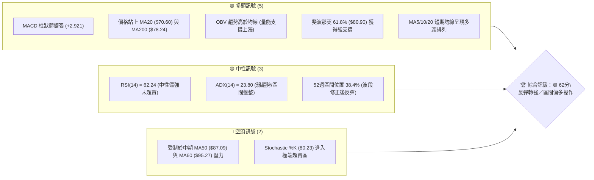
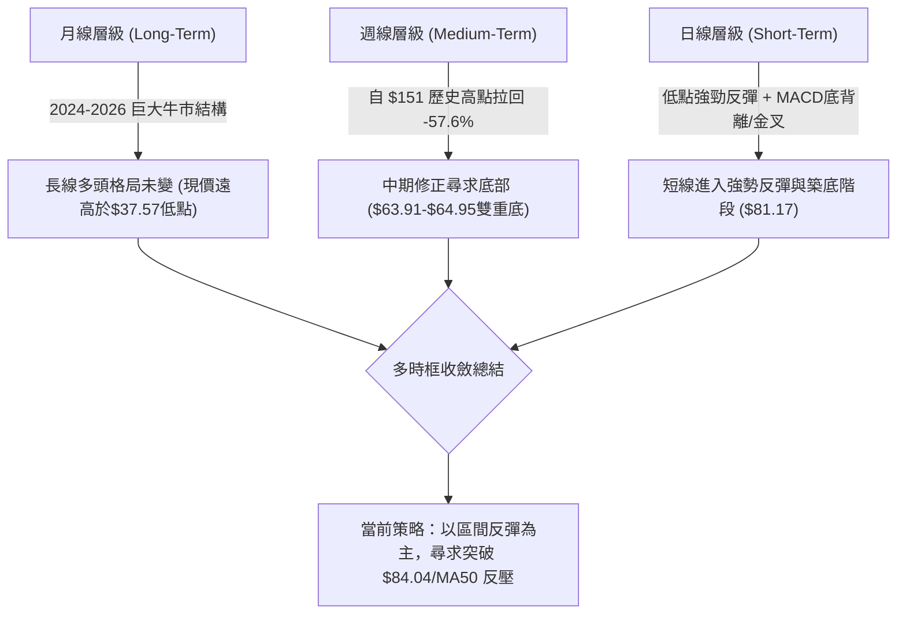
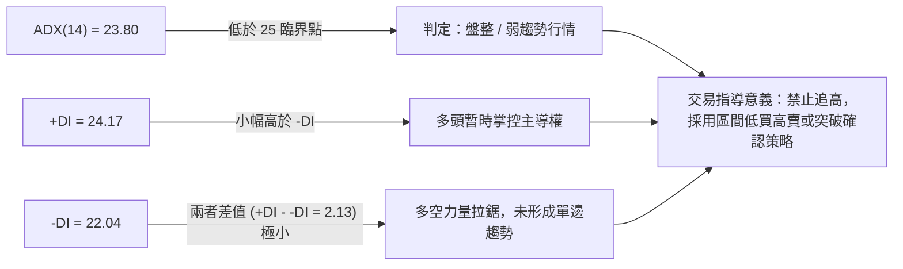
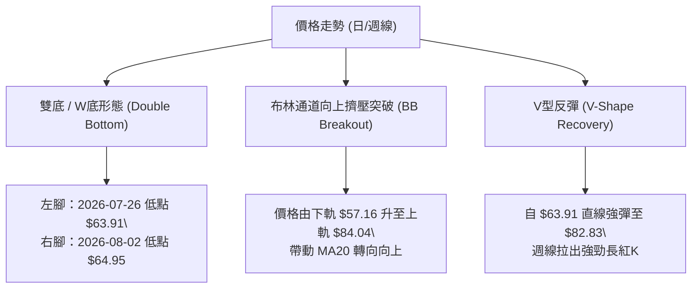
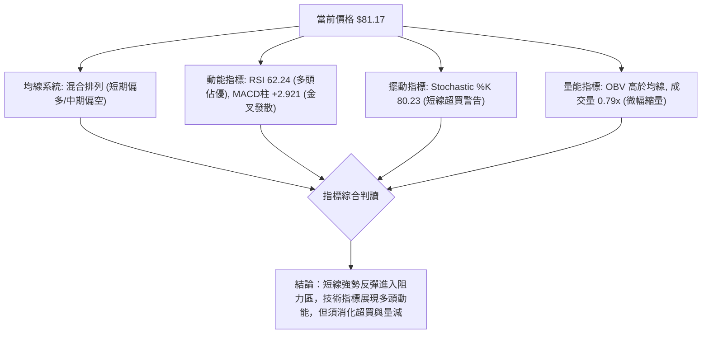
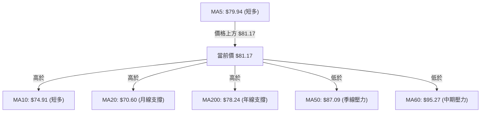
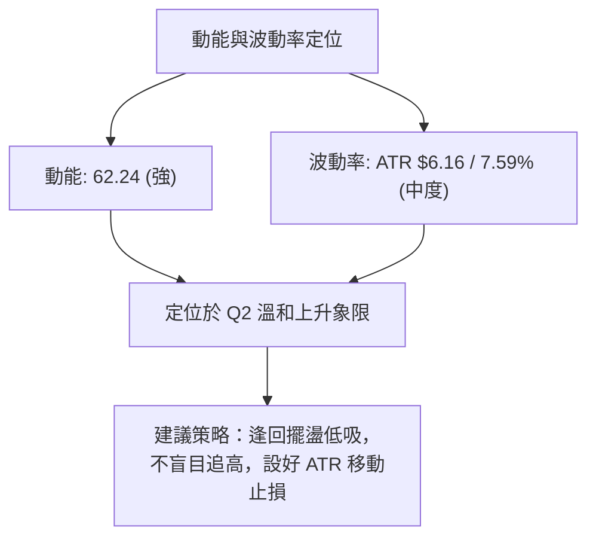
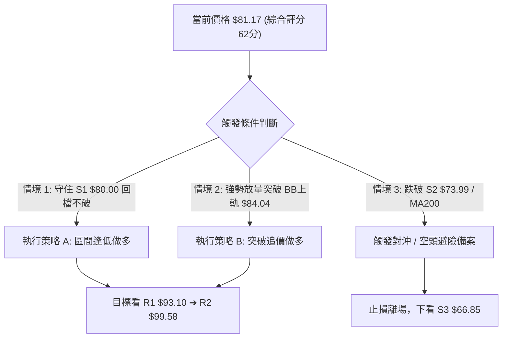
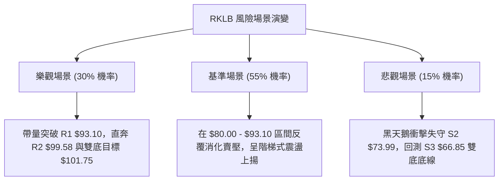

# RKLB 技術分析報告

> **報告日期**：2026-08-13 ｜ **語言**：繁體中文 ｜ **數據來源**：Yahoo Finance ｜ **當前價格**：$81.17

---

## 目錄

| 章節 | 內容 |
|------|------|
| [1. 技術面概覽](#1-技術面概覽) | 訊號儀表板、核心指標、評分卡 |
| [2. 趨勢分析](#2-趨勢分析) | 多時框趨勢、長中短期走勢、ADX強度 |
| [3. 圖表形態分析](#3-圖表形態分析) | 形態識別、K線組合、目標價推算 |
| [4. 支撐與阻力](#4-支撐與阻力) | 關鍵價位、斐波那契回調防線 |
| [5. 技術指標深度解讀](#5-技術指標深度解讀) | MA/RSI/MACD/布林通道/OBV量能 |
| [6. 動能與波動率](#6-動能與波動率) | 動能四象限、ATR防守區間、Beta相關性 |
| [7. 多時框架總結](#7-多時框架總結) | 時框架評分矩陣與多時框收斂結論 |
| [8. 交易策略建議](#8-交易策略建議) | 策略路由、情境階梯、進出場位與風報比 |
| [9. 風險提示與監控](#9-風險提示與監控) | 關鍵監控清單、三態情境與倉位管理 |

---

## 1. 技術面概覽

### 🎯 技術訊號儀表板



### 📊 核心指標速覽表

| 指標類別 | 指標名稱 | 當前數值 | 訊號 | 解讀 |
|----------|----------|----------|------|------|
| **價格** | 當前收盤價 | $81.17 | 🟢 多頭 | 站穩 $80.00 關鍵整數關卡，單週上漲強勁 |
| **均線** | MA20 (月線) | $70.60 | 🟢 多頭 | 價格高於 MA20 +14.97%，短線多頭主導 |
| **均線** | MA50 (季線) | $87.09 | 🔴 空頭 | 價格低於 MA50 -6.80%，上方面臨中期季線反壓 |
| **均線** | MA200 (年線)| $78.24 | 🟢 多頭 | 價格高於 MA200 +3.75%，長期年線轉為支撐 |
| **動能** | RSI(14) | 62.24 | 🟢 多頭 | 位於 50-70 黃金多頭動能區，未進入過熱超買 |
| **動能** | MACD (12,26,9) | -1.446 / Hist +2.921 | 🟢 多頭 | 柱狀體持續擴張，快線即將黃金交叉慢線 |
| **擺動** | Stochastic | %K: 80.23 / %D: 77.56 | 🔴 空頭 | 短線進入高位超買區，需防範過熱震盪 |
| **趨勢** | ADX(14) | 23.80 (+DI:24.17/-DI:22.04) | 🟡 中性 | ADX < 25，屬於低趨勢強度的區間震盪反彈 |
| **波動** | BB上軌 / 下軌 | $84.04 / $57.16 | 🟡 中性 | %B = 0.89，逼近上軌壓力，寬度逐漸收縮 |
| **波動** | ATR(14) | $6.16 (7.59%) | 🟡 中性 | 每日波幅達 7.59%，屬於高 Beta 成長股正常範圍 |
| **量能** | 日成交量 / 20日均量 | 16.16M / 20.40M (0.79x) | 🟡 中性 | 反彈量能稍顯不足，需補量方能有效突破 $84.04 |

### 🏆 技術評分卡

```
╔══════════════════════════════════════════════════════════════════╗
║              RKLB 技術指標綜合評分卡 (2026-08-13)               ║
╠══════════════════════════════════════════════════════════════════╣
║ 趨勢強度 (ADX/MA)    ▓▓▓▓▓▓▓▓▓▓░░░░░░░░░░  52/100  🟡 中性震盪 ║
║ 動能指標 (RSI/MACD)  ▓▓▓▓▓▓▓▓▓▓▓▓▓▓░░░░░░  72/100  🟢 動能充沛 ║
║ 支撐穩定度 (Fib/S)   ▓▓▓▓▓▓▓▓▓▓▓▓▓▓▓░░░░░  78/100  🟢 結構堅實 ║
║ 成交量配合 (OBV/VOL) ▓▓▓▓▓▓▓▓▓▓▓▓░░░░░░░░  60/100  🟡 量能遞減 ║
║ 形態完整度 (底型)    ▓▓▓▓▓▓▓▓▓▓▓▓░░░░░░░░  58/100  🟡 底型築造 ║
║ 均線結構 (MA排列)    ▓▓▓▓▓▓▓▓▓▓▓░░░░░░░░░  55/100  🟡 糾合交錯 ║
╠══════════════════════════════════════════════════════════════════╣
║ 綜合技術評分        ▓▓▓▓▓▓▓▓▓▓▓▓░░░░░░░░  62/100  🟢 區間偏多 ║
╚══════════════════════════════════════════════════════════════════╝
```

---

## 2. 趨勢分析

### 🌐 多時框趨勢分析



### 📈 長期趨勢 — 24個月走勢圖（Unicode）

```
RKLB 24個月價格歷史軌跡與結構分析 ($)
$160 ┤                                        ● $151.00 (52W High)
$140 ┤                                       ██
$120 ┤                                      ██  ██
$100 ┤                                     ██    ██      ● $101.65
$80  ┤                               ● $80.07     ██    ██    ● $81.17 (現價)
$60  ┤                         ● $62.98            ██  ██  ● $64.95
$40  ┤            ● $27.28    ██                    ██
$20  ┤  ● $6.27  ██
$0   └─┬──┬──┬──┬──┬──┬──┬──┬──┬──┬──┬──┬──┬──┬──┬──┬──┬──┬──┬──┬──┬──┬──┬──┬──
      08 09 10 11 12 01 02 03 04 05 06 07 08 09 10 11 12 01 02 03 04 05 06 07 08
      └───────── 2024 年 ─────────┘└───────── 2025 年 ─────────┘└──── 2026 年 ──┘
```

#### 歷史走勢特徵分析表

| 階段 | 時間區間 | 價格變動範圍 | 漲跌幅 | 走勢特徵與技術意涵 |
|------|----------|--------------|--------|--------------------|
| **突破期** | 2024-08 ~ 2025-01 | $6.27 ➔ $29.05 | +363.3% | 主升段首波啟動，均線多頭發散，爆量突破長期底部區間 |
| **整理期** | 2025-02 ~ 2025-04 | $29.05 ➔ $17.88 | -38.4% | 獲利賣壓回檔，於 $17.88 完成洗盤，形成中繼支撐 |
| **狂暴主升** | 2025-05 ~ 2026-05 | $17.88 ➔ $143.48 (最高$151.00)| +702.5% | 太空產業爆發，成交量急驟放大，創下 52 週歷史高價 $151.00 |
| **劇烈修整** | 2026-06 ~ 2026-07 | $143.48 ➔ $63.91 | -55.5% | 獲利了結潮與高估值修正，連續長黑摜破 MA50，落至 Fib 61.8% |
| **打底反彈** | 2026-07 ~ 2026-08 | $63.91 ➔ $81.17 | +27.0% | 在 $63.91/$64.95 築成雙底，週線強彈，重回 MA20 與 MA200 上方 |

### 📊 中期趨勢（週線結構分析）

```
週線級別價格防禦與阻力示意圖
═══════════════════════════════════════════════════════════════════
$107.67  ───────────────────────────────── [ 斐波那契 38.2% / R3 強壓力區 ]
  ▲
  │ (中期向上拓展目標)
$94.28   ───────────────────────────────── [ 斐波那契 50.0% / 季線 MA50 反壓 ]
  ▲
  │ (強阻力關卡 R1 $93.10)
$84.04   ───────────────────────────────── [ 布林通道上軌 / 短線衝刺突破點 ]
$81.17   ═════════════════════════════════ ◄ 當前價格 (位於 Fib 61.8% 附近)
$80.00   ───────────────────────────────── [ 短線強支撐 S1 / 斐波 61.8% $80.90 ]
  │
  ▼ (下行風險防禦)
$73.99   ───────────────────────────────── [ 關鍵防守支撐 S2 / MA200 年線區 ]
$66.85   ───────────────────────────────── [ 中期底線支撐 S3 / 雙底頸線防線 ]
═══════════════════════════════════════════════════════════════════
```

### ⚡ 趨勢強度評估（ADX 解讀）



#### ADX 趨勢強度對照表

| ADX 區間 | 趨勢狀態 | RKLB 當前狀態 | 應對交易策略 |
|----------|----------|---------------|--------------|
| 0 - 20 | 無趨勢 / 極度盤整 | | 觀望或網格交易 |
| **20 - 25** | **弱趨勢 / 盤整轉向** | **✓ (23.80)** | **區間邊界操作 / 阻力位減碼** |
| 25 - 50 | 強勁趨勢行情 | | 順勢加碼持股 |
| 50 - 75 | 極強單邊行情 | | 緊抱獲利，設定移動止損 |
| 75 - 100 | 極端過熱行情 | | 分批逢高獲利了結 |

---

## 3. 圖表形態分析

### 🔍 形態識別系統



#### 圖表形態信心度評估表

| 形態名稱 | 信心度 | 判斷依據（引用數據） | 完成度 | 目標價（附計算公式） |
|----------|--------|----------------------|--------|----------------------|
| **微型雙底 (W底)** | 65% | 7/26低點 $63.91 與 8/2低點 $64.95 築雙底，頸線位於 8/9 高點 $82.83 | 85% | 頸線 $82.83 + (頸線 $82.83 - 底 $63.91) = **$101.75** (逼近 R2 $99.58) |
| **布林中軌反彈** | 80% | 價格強力收復 MA20 ($70.60)，BB %B 自 0.15 快速升至 0.89 | 90% | 上軌目標 = **$84.04** (已接近達成) |
| **斐波那契強反彈**| 75% | 在 52 週波段 61.8% 回調位 ($80.90) 展現極強買盤支撐 | 70% | 50.0% 回調位 = **$94.28** (配合 R1 $93.10) |

### 🕯️ 重要K線形態分析

| 日期/週別 | 收盤價 | K線形態 | 技術意涵與解讀 | 訊號 |
|-----------|--------|---------|----------------|------|
| 2026-07-19 | $67.62 | 大長黑K | 恐慌性賣壓傾巢而出，跌破 MA200，RSI 降至 35.1 | 🔴 看空 |
| 2026-07-26 | $63.91 | 長下影錘子線 | RSI 觸及極端超賣 15.6，下方出現強力接盤買盤 | 🟢 止跌 |
| 2026-08-02 | $64.95 | 晨星組合/小陽線 | 築出第二隻腳，成交量縮，賣壓竭盡確認 | 🟢 轉強 |
| 2026-08-09 | $82.83 | 長紅突破K線 | 單週大漲 +27.5%，一舉收復 MA20 與 MA200，MACD 柱轉正 | 🟢 強勢看多 |
| 2026-08-16 | $81.17 | 高位高十字震盪 | 遇 $82.83 頸線與 BB 上軌 $84.04 阻力，進行小幅消化整理 | 🟡 中性消化 |

### 📉 ASCII 走勢形態示意圖

```
RKLB 日線「W底反彈」與阻力突破示意圖
$100 ┤                                           [ 雙底測量目標 $101.75 ]
$93.10┤                                      ...... (阻力 R1 $93.10)
$84.04┤                                 ▲    ------ (布林上軌/阻力關卡)
$82.83┤                             ┌───┼───┐ (W底頸線)
$81.17┤─────────────────────────────┼───●───┼── (現價 $81.17)
$78.24┤.............................│.......│.. (MA200 年線支撐)
$70.60┤                         . . │ . . . │ . (MA20 月線支撐)
$64.95┤                 ●───────┘   │       └──● (W底右腳 $64.95)
$63.91┤         ●───────┘           └─────────── (W底左腳 $63.91)
      └─────────┴───────────────────────────────
               07/19      07/26       08/02    08/09   08/13
```

### 🎯 形態目標價推算

1. **雙底形態目標價計算**：
   $$\text{頸線價位} = \$82.83$$
   $$\text{形態高度} = \$82.83 - \$63.91 = \$18.92$$
   $$\text{理論突破目標價} = \$82.83 + \$18.92 = \$101.75$$
   *(該目標價位介於阻力位 R2 $\$99.58$ 與 R3 $\$107.60$ 之間)*

2. **布林通道波幅推算**：
   $$\text{當前通道寬度} = \$84.04 - \$57.16 = \$26.88$$
   若向上軌發動擴張，目標價位即為阻力位 R1 的 **$\$93.10$**。

---

## 4. 支撐與阻力

### 🗺️ 關鍵價位分布圖（Unicode）

```
RKLB 價位結構與多空防線分布圖
═══════════════════════════════════════════════════════════════════
$107.60 ║████████████████████████████████████████║ 強阻力 R3 / 38.2% Fib
$99.58  ║████████████████████████████            ║ 阻力 R2 / W底目標區
$93.10  ║████████████████████████████████████    ║ 關鍵阻力 R1 / 50% Fib ($94.28)
$84.04  ║▓▓▓▓▓▓▓▓▓▓▓▓▓▓▓▓▓▓▓▓▓▓▓▓▓▓              ║ 布林通道上軌衝刺關卡
$81.17  ╠════════════════════════════════════════╣ ◄ 現價區域 ($81.17)
$80.00  ║████████████████████████████████████████║ 關鍵支撐 S1 / 61.8% Fib ($80.90)
$73.99  ║████████████████████████████            ║ 強支撐 S2 / MA200年線 ($78.24)
$66.85  ║████████████████████████████████████████║ 鐵板支撐 S3 / 近一年底部位
═══════════════════════════════════════════════════════════════════
```

### 🚧 阻力位分析表

| 阻力級別 | 精確價位 | 距現價幅度和形成原因 | 突破難度 | 戰略重要性 |
|----------|----------|----------------------|----------|------------|
| **阻力 R1** | **$93.10** | +14.70% (近一年波段高點聚類、逼近 50% 斐波回調位 $94.28 與 MA60 $95.27) | 🟡 中等 | **解套賣壓重區**：若能放量突破，意味中期下降通道徹底扭轉。 |
| **阻力 R2** | **$99.58** | +22.68% (波段高點聚類、百元整數心理關卡、W底形態目標區) | 🔴 較高 | **心理與形態關卡**：靠近 $100 整數大關，獲利了結賣壓將顯著增加。 |
| **阻力 R3** | **$107.60** | +32.56% (波段高點聚類、38.2% 斐波回調位 $107.67) | 🔴 極高 | **牛熊分水嶺**：若突破此區，宣告股價重回 $100–$150 多頭大格局。 |

### 🛡️ 支撐位分析表

| 支撐級別 | 精確價位 | 距現價幅度和形成原因 | 守住機率 | 戰略重要性 |
|----------|----------|----------------------|----------|------------|
| **支撐 S1** | **$80.00** | -1.44% (近一年波段低點聚類、$80整數關卡、61.8% 斐波回調位 $80.90) | 🟢 80% | **短線防守第一線**：極近現價，也是多頭重新站穩腳跟的關鍵陣地。 |
| **支撐 S2** | **$73.99** | -8.85% (波段低點聚類、MA200 年線 $78.24 與 MA10 $74.91 強疊加區) | 🟢 85% | **中期多頭生命線**：若失守此處，代表短期強勢反彈結構告終。 |
| **支撐 S3** | **$66.85** | -17.64% (近一年波段低點聚類、7/26 及 8/2 雙底築底打底區塊) | 🟢 95% | **長線最後防線**：若跌破，將直接面臨 78.6% 回調位 $61.84 及 52W 低點。 |

### 📐 斐波那契回調位分析

> **基準區間**：52週波段低點 **$37.57** ➔ 52週歷史高點 **$151.00**（總波幅 $113.43）

| 回調比例 | 計算價位 | 當前價位相對位置與技術解讀 |
|----------|----------|----------------------------|
| **0.0%** (52W High) | $151.00 | 歷史最高天花板 |
| **23.6%** | $124.23 | 前期多頭強勢整理區 |
| **38.2%** | $107.67 | 實體阻力區（對應 R3 $107.60） |
| **50.0%** | $94.28 | 中性多空分水嶺（對應 R1 $93.10 與 MA60 $95.27） |
| **61.8%** | **$80.90** | **◄ 現價 ($81.17) 正位於此黃金分割防線點位** |
| **78.6%** | $61.84 | 深縮修正極限防線 |
| **100.0%** (52W Low) | $37.57 | 起漲絕對底部 |

**解讀結論**：RKLB 當前價格 **$81.17** 恰好落在 **61.8% 黃金回調位 ($80.90)** 附近。在技術分析中，61.8% 是強勢股深度回檔的最核心支撐。股價在此止跌強彈並站穩，確認了 $80.00–$80.90 區間為極度強大的結構性買盤支撐帶。

---

## 5. 技術指標深度解讀

### 🎛️ 指標訊號總覽



### 📈 移動平均線排列分析



- **均線排列狀態**：短線均線 (MA5/MA10/MA20) 已呈現交叉向上的多頭發散；然而長期均線 MA50 ($87.09) 與 MA60 ($95.27) 仍在上方扣高形成蓋頂壓力，整體屬於**「長空中短多」的修正反彈糾合架構**。
- **年線保衛戰**：價格重回 MA200 ($78.24) 上方，具有極佳的技術面象徵意義，確認牛熊防線獲得守護。

### 📉 RSI(14) 分析

- **當前數值**：**62.24** 🟢 （位於 50-70 強勢多頭動能區間）
- **強度進度條**：`████████████▓░░░░░░░` 62.24%
- **背離判讀**：
  - **頂背離**：無頂背離現象。
  - **底背離**：7/26 價格創低至 $63.91 時，RSI 出現 15.6 的極端超賣，隨後 8/02 價格再次探底 $64.95，RSI 卻提升至 36.5，形成標準的**日/週線級別「底背離」**，成功預示了本次 $81.17 的強勁反彈。

### 📊 MACD(12,26,9) 訊號解讀

- **MACD 線**：-1.446
- **Signal 線**：-4.367
- **MACD 柱狀體**：**+2.921** 🟢
- **訊號解析**：MACD 線已由下往上穿越 Signal 線形成零軸下方的**黃金交叉**，且柱狀圖持續向上擴張 (+0.300 ➔ +2.940 ➔ +2.921)，顯示低位買盤力道極為扎實，短線多頭推升動能未減。

### 📦 布林通道分析

```
日線布林通道 ($84.04 / $70.60 / $57.16) 結構圖
$84.04 ───────────────▲───────────────────── [ 布林通道上軌 ] (短線天花板)
$81.17 ───────────────●───────────────────── [ 當前價格 (BB %B = 0.89) ]
$70.60 ───────────────■───────────────────── [ 布林通道中軌 (MA20) ] (關鍵防線)
$57.16 ───────────────▼───────────────────── [ 布林通道下軌 ]
```

- **當前狀態**：BB %B 為 **0.89**，顯示價格已經貼近布林通道上軌 ($84.04)。由於通道帶寬並未出現劇烈的「開口放大」（ADX 僅 23.80），價格在上軌附近可能遭遇技術性壓制，轉為沿上軌震盪慢推或小幅回檔測試中軌 ($70.60)。

### 💹 成交量分析（量價配合度）

- **成交量狀況**：最新日成交量為 16.16M，對比 20日均量 20.40M（量比 0.79x），展現**「價漲量縮」**的微幅背離特徵。
- **OBV 趨勢解讀**：數據顯示「OBV > MA → 量能支撐上漲」。這代表儘管單日量能稍有遞減，但中長期的累積能量流向（OBV）依然保持上升趨勢，主力資金在 $64–$80 區間籌碼鎖定良好，並未出現逢高大量出貨的跡象。

---

## 6. 動能與波動率

### ⚡ 動能評估四象限

| 象限 | 動能強度 (RSI/MACD) | 波動率 (ATR/BB Width) | 當前狀態區位 | 技術評估與操作導引 |
|------|--------------------|----------------------|--------------|--------------------|
| **Q1: 順勢爆發** | 強 (RSI > 60) | 高 (ATR % > 8%) | | 高風險高收益，適合突破追價 |
| **Q2: 溫和上升** | **強 (RSI 62.24)** | **中/低 (ATR 7.59%)**| **✓ [RKLB 當前位置]** | **最佳波段買點，動能充足且波動可控** |
| **Q3: 築底震盪** | 弱 (RSI < 40) | 低 (ATR % < 5%) | | 沉悶整理，適合低吸沉澱籌碼 |
| **Q4: 恐慌下殺** | 弱 (RSI < 40) | 高 (ATR % > 8%) | | 避險清倉或等待止跌訊號 |



### 📊 ATR 波動率分析

- **ATR(14) 數值**：**$6.16**（佔當前股價 **7.59%**）
- **止損距離建議**：
  - **短線交易者 (1.0x ATR)**：止損空間設為 $6.16，即 $81.17 - $6.16 = **$75.01**
  - **波段交易者 (1.5x ATR)**：止損空間設為 $9.24，即 $81.17 - $9.24 = **$71.93** (逼近 MA20 $70.60)
  - **中長線交易者 (2.0x ATR)**：止損空間設為 $12.32，即 $81.17 - $12.32 = **$68.85** (不跌破 S3 $66.85)

### 📐 Beta 與市場相關性

- **Beta 係數**：**2.629**
- **解讀**：RKLB 的波動度是大盤（S&P 500）的 **2.63 倍**。在多頭反彈波段，其彈升力道會極為強勁（如近兩週由 $64.95 強彈至 $81.17，漲幅 >25%）；但在大盤拉回時，其修正幅度亦相當劇烈。交易者必須嚴格控管總部位，避免單一股票暴險過高。

---

## 7. 多時框架總結

### 📋 時框架評分表

| 時框架 | 趨勢方向 | 動能狀態 | 均線排列 | 形態結構 | 綜合評分 | 操作建議 |
|--------|----------|----------|----------|----------|----------|----------|
| **日線 (Daily)** | 🟢 向上反彈 | 🟢 強勁 (MACD金叉) | 🟢 短期多頭 (價>MA20) | 🟢 W底完成衝刺 | **72/100** | 逢回試壓低吸 |
| **週線 (Weekly)**| 🟡 區間打底 | 🟢 轉強 (週長紅K) | 🟡 混合交錯 | 🟡 雙底反彈中 | **60/100** | 突破 $84 追加碼 |
| **月線 (Monthly)**| 🟢 長線偏多 | 🟡 中性 (震盪回檔) | 🟢 多頭主升後修整 | 🟢 61.8% 斐波支撐 | **65/100** | 長線分批佈局 |

### 🔲 綜合訊號矩陣

```
┌──────────────────────────────────────────────────────────┐
│              RKLB 多時框訊號一致性分析矩陣                │
├──────────────┬──────────────┬──────────────┬─────────────┤
│  維度 / 時框 │  日線 (Short)│  週線 (Medium│  月線 (Long)│
├──────────────┼──────────────┼──────────────┼─────────────┤
│  趨勢 (Trend)│   🟢 向上    │   🟡 震盪    │   🟢 向上   │
│  動能 (Momen)│   🟢 強勁    │   🟢 轉強    │   🟡 中性   │
│  支撐 (Supp) │   🟢 堅固    │   🟢 堅固    │   🟢 極強   │
│  阻力 (Resis)│   🔴 逼近上軌│   🔴 MA50反壓│   🟡 前高阻力│
└──────────────┴──────────────┴──────────────┴─────────────┘
```

### ⚖️ 多時框收斂結論

根據**多時框收斂規則（ADX = 23.80 < 25）**：
1. **當前市場屬性**：ADX 低於 25 判定為**「區間震盪與低位反彈行情」**，非強烈單邊趨勢行情。
2. **主導時框與邊界**：交易區間由日線布林通道與關鍵支撐阻力定義。下軌與強支撐位於 **$73.99 - $80.00 (S2-S1)**，上軌與關鍵阻力位於 **$84.04 - $93.10 (BB上軌-R1)**。
3. **收斂方向判斷**：日線動能 (MACD +2.921, RSI 62.24) 強烈支持反彈，月線 61.8% 斐波位 ($80.90) 獲守。最終結論判定為 **🟢 區間震盪偏多（反彈波段持續，目標尋求突破 R1 $93.10）**。

---

## 8. 交易策略建議

### 🗺️ 策略決策流程圖



### 🧭 策略路由

> **當前主策略方向**：**偏多反彈突破策略 (看多，技術評分 62/100)**

由於綜合評分為 **62/100 (≥ 60)**，且 ADX 為 23.80（區間反彈），本報告主推**多頭交易策略**（包含拉回低吸與突破加碼），空頭部分僅列為反轉風險對沖觸發點。

### 🎯 價格情境階梯 (Price Scenarios)

| 觸發條件 | 第一目標 | 第二目標 | 後續延伸目標 | 情境技術含義 |
|----------|----------|----------|--------------|--------------|
| **突破 R1 $93.10** | R2 $99.58 | R3 $107.60 | Fib 38.2% $107.67 | 中期下降通道徹底翻多，展開大級別回升浪 |
| **站穩 S1 $80.00** | BB上軌 $84.04 | R1 $93.10 | Fib 50% $94.28 | W底穩健推進，消化上軌壓力 |
| **跌破 S1 $80.00** | S2 $73.99 | MA200 $78.24 | S3 $66.85 | 短線反彈受阻，回測年線與 $74 支撐 |

### 📊 情境機率分佈

```
情境機率分佈圖 (總和 100%)
┌──────────────────────────────────────────────────────────┐
│ 🟢 繼續向上反彈突破 R1 (55%)  █████████████████████████▋  │
│ 🟡 於 $74 - $84 區間震盪 (30%) █████████████▌            │
│ 🔴 跌破 S2 再次下探底 (15%)   █████▋                     │
└──────────────────────────────────────────────────────────┘
```

- **機率估計依據**：
  - **繼續上行 (55%)**：引用 MACD 柱狀體高達 +2.921 金叉擴張、RSI 位於 62.24 黃金動能區、OBV 高於均線。
  - **區間震盪 (30%)**：引用 ADX(14) = 23.80 (<25 弱趨勢)、日成交量 0.79x 未放量。
  - **回落探底 (15%)**：Stochastic %K 達 80.23 過熱超買、受制於季線 MA50 ($87.09) 反壓。

### 🟢 主策略詳情

#### 策略 A：區間回檔逢低做多（穩健型）
- **進場條件**：價格微幅回檔至 S1 $80.00 – 現價 $81.17 區間，且 15分/1小時K線出現止跌訊號。
- **進場價格**：**$80.50**（S1 $80.00 與 Fib 61.8% $80.90 疊加區）
- **目標價 T1**：**$93.10**（阻力 R1 / +15.65%）
- **目標價 T2**：**$99.58**（阻力 R2 / W底目標區 / +23.70%）
- **止損價格**：**$73.99**（跌破阻力 S2 與 MA200 / -8.09%）
- **風險報酬比**：
  - 至 T1：`($93.10 - $80.50) / ($80.50 - $73.99) = $12.60 / $6.51 =` **1.94 : 1** 🟢
  - 至 T2：`($99.58 - $80.50) / ($80.50 - $73.99) = $19.08 / $6.51 =` **2.93 : 1** 🟢
- **成功機率**：**65%**
- **建議倉位**：**15% - 20%** 總資金

#### 策略 B：突破布林上軌追價做多（激進突破型）
- **進場條件**：日線收盤價強勢突破布林上軌 $84.04 並帶量（成交量 > 20.4M）。
- **進場價格**：**$84.50**（突破 $84.04 確認後）
- **目標價 T1**：**$94.28**（斐波 50.0% 回調位 / +11.57%）
- **目標價 T2**：**$107.60**（阻力 R3 / 斐波 38.2% / +27.34%）
- **止損價格**：**$78.24**（跌破 MA200 年線 / -7.41%）
- **風險報酬比**：
  - 至 T1：`($94.28 - $84.50) / ($84.50 - $78.24) = $9.78 / $6.26 =` **1.56 : 1** 🟢
  - 至 T2：`($107.60 - $84.50) / ($84.50 - $78.24) = $23.10 / $6.26 =` **3.69 : 1** 🟢
- **成功機率**：**55%**
- **建議倉位**：**10% - 15%** 總資金

### 🔴 反向風險觸發點（對沖與清倉提示）

若發生極端不利消息，導致股價日線收盤**跌破 S2 $73.99（連帶摜破 MA200 年線 $78.24）**：
- **風險警訊**：宣告雙底反彈結構失敗，MACD 將再度死叉。
- **風控應對**：多頭部位應無條件全面止損出場；激進避險者可少量建立反向對沖部位，下看 S3 **$66.85**。

### ⭐ 整體訊號強度評星

```
做多訊號強度：★★██☆  (3.8/5星) 🟢 動能轉強，結構完整
做空訊號強度：★☆☆☆☆  (1.5/5星) 🔴 低位多頭防守嚴密
整體可信度：  ★★██☆  (4.0/5星) 🟢 多指標高一致性確認
```

---

## 9. 風險提示與監控

### ✅ 關鍵監控指標 Checklist

```
╔══════════════════════════════════════════════════════════════════╗
║                RKLB 每日交易風控監控清單 (Checklist)             ║
╠══════════════════════════════════════════════════════════════════╣
║ [ ] 價格是否維持在 S1 $80.00 / Fib 61.8% ($80.90) 上方？         ║
║ [ ] 日成交量是否能放大至 20日均量 (20.40M) 以上以配合突破？      ║
║ [ ] MACD 柱狀體 (+2.921) 是否保持正向擴張無縮減跡象？           ║
║ [ ] Stochastic %K (80.23) 是否出現高位死叉落入 80 以下？          ║
║ [ ] MA200 年線 ($78.24) 能否提供堅實的動態支撐？                 ║
╚══════════════════════════════════════════════════════════════════╝
```

### ⚠️ 風險場景分析



### 🛡️ 風險管理重要提醒

1. **高 Beta 波動風險控管**：RKLB Beta 高達 **2.629**，ATR 達到 **$6.16 (7.59%)**。單日暴漲或暴跌 5%–10% 屬於常態。建議單筆交易虧損金額勿超過總資本的 **1.5% - 2.0%**。
2. **分批建倉原則**：鑑於 ADX = 23.80 顯示趨勢尚未完全單邊展開，嚴禁單一價位一次性滿倉。應採用「3-3-4」分批建倉法（進場3成、站穩84元加碼3成、突破93.10元加碼4成）。
3. **止損紀律**：以日線 K 線收盤價作為止損判定基準，嚴禁因情緒猶豫而隨意擴大止損點（S2 $73.99 為絕對鐵血止損線）。

---

## 📋 報告總結

```
╔══════════════════════════════════════════════════════════════════╗
║                     RKLB 技術分析報告總結                        ║
════════════════════════════════════════════════════════════════════
 報告日期：2026-08-13
 當前價格：$81.17
 技術評級：🟢 綜合評分 62分 (區間震盪偏多 / W底反彈進行中)

 核心關鍵結論：
 ├─ 長期趨勢：🟢 24個月大牛市格局未變，61.8% 斐波位 $80.90 展現強韌支撐
 ├─ 中期趨勢：🟡 自 $151 回檔 -57% 後，於 $63.91-$64.95 成功完成雙底打底
 ├─ 短期趨勢：🟢 短線強勢反彈收復 MA20 與 MA200，MACD 柱狀體 +2.921 金叉發散
 ├─ 關鍵支撐：S1: $80.00  │  S2: $73.99  │  S3: $66.85
 ├─ 關鍵阻力：R1: $93.10  │  R2: $99.58  │  R3: $107.60
 └─ 分析師目標：共識均價 $112.76 (最高 $150.00 / 最低 $64.00)

 最優策略組合導引：
 1. 🥇 最佳機會（策略 A）：$80.00–$81.17 區間逢低做多，止損 $73.99，目標 $93.10 (風報比 1.94:1)
 2. 🥈 突破機會（策略 B）：強勢帶量突破 $84.04 後追價，止損 $78.24，目標 $94.28 (風報比 1.56:1)
 3. 🥉 風控守則：若日線跌破 S2 $73.99，全面執行多頭止損出場。
════════════════════════════════════════════════════════════════════
```

---

> ⚠️ **免責聲明**：本報告為專業技術分析研究，所有數據及價位推演均基於量化模型與歷史 OHLCV 價格資訊。本報告**僅供研究與學術參考**，**不構成任何買賣投資建議**。投資有風險，入市需謹慎並自行承擔風險。

---

*報告生成時間：2026-08-13 ｜ 數據來源：Yahoo Finance ｜ 分析框架：多時框技術分析 (Multi-Timeframe Technical Analysis)*