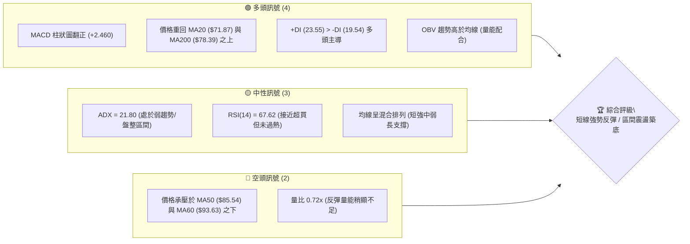
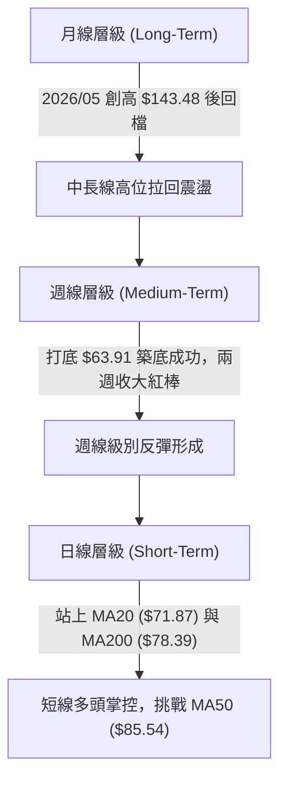
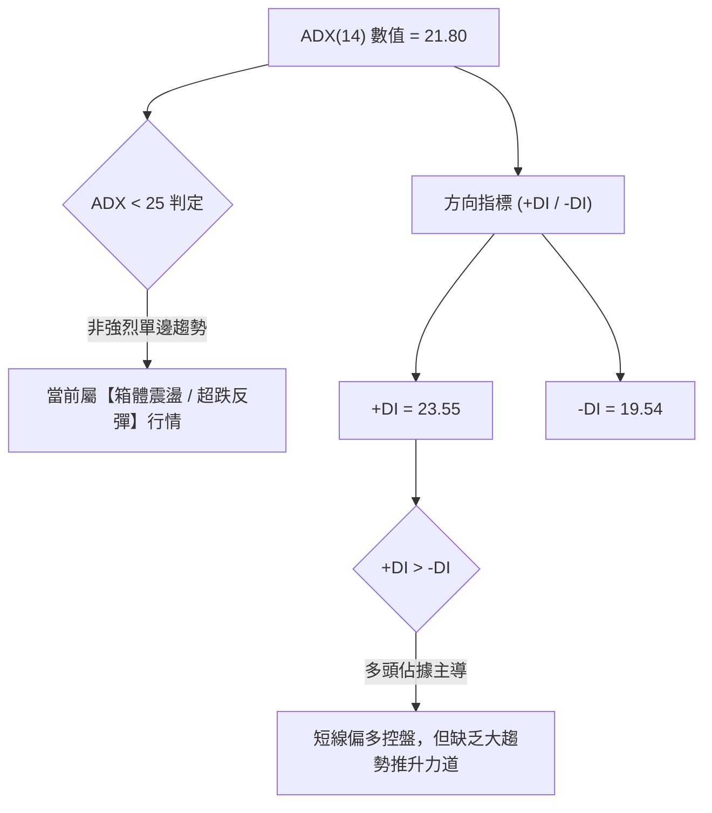
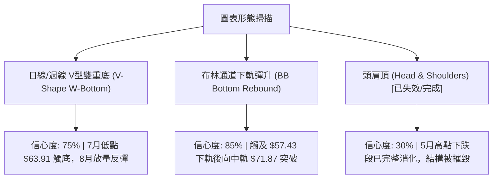
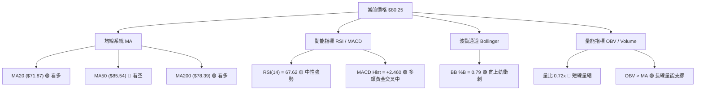
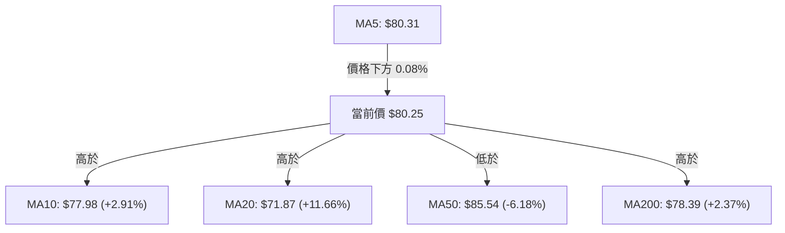
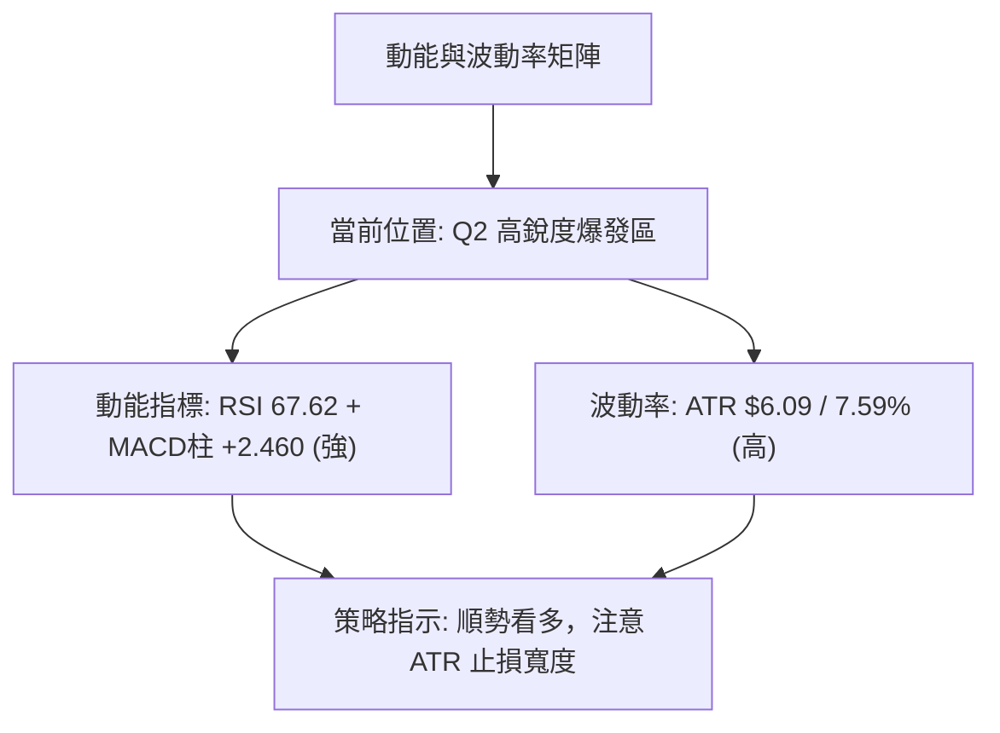
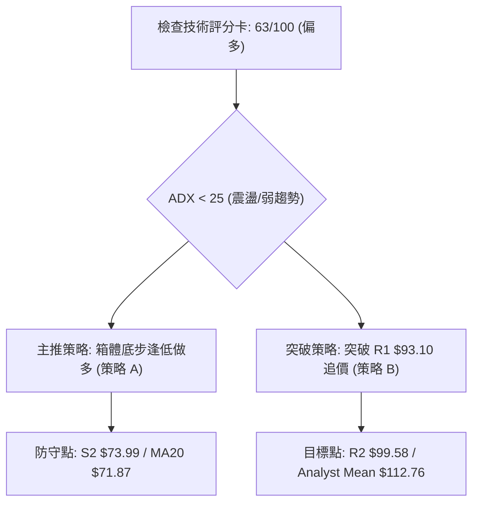
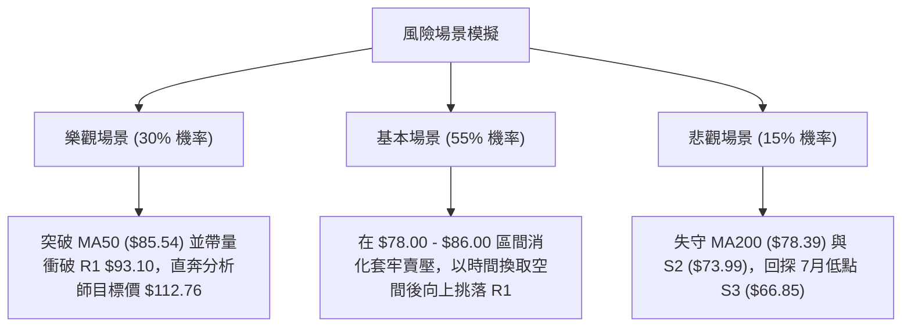

# RKLB 技術分析報告

> **報告日期**：2026-08-14 ｜ **語言**：繁體中文 ｜ **數據來源**：Yahoo Finance ｜ **當前價格**：$80.25

---

## 目錄

| 章節 | 內容 |
|------|------|
| [1. 技術面概覽](#1-技術面概覽) | 訊號儀表板、核心指標、評分卡 |
| [2. 趨勢分析](#2-趨勢分析) | 多時框趨勢、長中短期走勢、ADX強弱判斷 |
| [3. 圖表形態分析](#3-圖表形態分析) | 形態識別信心度、K線組合、目標價計算 |
| [4. 支撐與阻力](#4-支撐與阻力) | 關鍵價位分佈、斐波那契回調結構 |
| [5. 技術指標深度解讀](#5-技術指標深度解讀) | MA/RSI/MACD/布林通道/成交量 |
| [6. 動能與波動率](#6-動能與波動率) | 動能四象限、ATR歷史波動、Beta風險 |
| [7. 多時框架總結](#7-多時框架總結) | 時框架矩陣與多時框收斂結論 |
| [8. 交易策略建議](#8-交易策略建議) | 主策略路由、情境階梯、風報比精算 |
| [9. 風險提示與監控](#9-風險提示與監控) | 關鍵監控清單、極限風險場景 |

---

## 1. 技術面概覽

### 🎯 技術訊號儀表板



### 📊 核心指標速覽表

| 指標類別 | 指標名稱 | 當前數值 | 訊號 | 解讀 |
|----------|----------|----------|------|------|
| **價格** | 當前價格 | $80.25 | 🟢 看多 | 自 7 月低點 $63.91 強勢反彈，位於 52 週區間 37.6% 位置 |
| **均線** | MA20 | $71.87 | 🟢 看多 | 價格高於 MA20 (+11.66%)，短線支撐強勁 |
| **均線** | MA50 | $85.54 | 🔴 看空 | 價格位於 MA50 之下 (-6.18%)，中期季線面臨套牢壓力 |
| **均線** | MA200 | $78.39 | 🟢 看多 | 價格已站回年線 MA200 之上 (+2.37%)，長線趨勢守住 |
| **動能** | RSI(14) | 67.62 | 🟡 中性 | 動能強勁且未出現頂背離，向 70 超買區逼近 |
| **動能** | MACD | Hist +2.460 | 🟢 看多 | 柱狀圖連續擴大，快線 (-0.618) 即將穿過慢線 (-3.078) |
| **趨勢** | ADX(14) | 21.80 | 🟡 中性 | ADX < 25 表示單邊趨勢尚未形成，當前屬箱體反彈 |
| **波動** | ATR(14) | $6.09 | 🟡 中性 | 每日波動率約 7.59%，屬高 Beta 股正常波動範疇 |
| **通道** | 布林 %B | 0.79 | 🟢 看多 | 價格貼近布林上軌 ($86.30)，向上衝刺形態良好 |

### 🏆 技術評分卡

```
╔══════════════════════════════════════════════════════════════════╗
║                   RKLB 技術評分卡 (2026-08-14)                   ║
╠══════════════════════════════════════════════════════════════════╣
║ 趨勢強度 (ADX)     ▓▓▓▓▓▓▓▓░░░░░░░░░░░░  43/100  🟡 弱趨勢/盤整   ║
║ 動能指標 (MACD/RSI) ▓▓▓▓▓▓▓▓▓▓▓▓▓▓▓░░░░░  75/100  🟢 動能強勁      ║
║ 支撐穩定度 (S1-S3) ▓▓▓▓▓▓▓▓▓▓▓▓▓▓░░░░░░  70/100  🟢 底層支撐紮實  ║
║ 成交量配合 (OBV)   ▓▓▓▓▓▓▓▓▓▓▓▓░░░░░░░░  60/100  🟡 量能中等偏弱  ║
║ 形態完整度         ▓▓▓▓▓▓▓▓▓▓▓▓▓▓░░░░░░  70/100  🟢 V型反彈築底   ║
║ 均線結構 (MA20/200)▓▓▓▓▓▓▓▓▓▓▓▓░░░░░░░░  60/100  🟡 混合糾纏排列  ║
╠══════════════════════════════════════════════════════════════════╣
║ 綜合評分           ▓▓▓▓▓▓▓▓▓▓▓▓▓░░░░░░░  63/100  🟢 偏多震盪      ║
╚══════════════════════════════════════════════════════════════════╝
```

---

## 2. 趨勢分析

### 🌐 多時框趨勢分析



### 📈 長期趨勢 — 12個月走勢圖（Unicode）

```
RKLB 月線走勢圖 (2025-09 至 2026-08)
價格軸 ($)
$150.00 ┤                                  ● 2026-05 ($143.48 高點)
$130.00 ┤                                 ╱ ╲
$110.00 ┤                                ╱   ● 2026-06 ($101.65)
$90.00  ┤                      ● 2026-01╱     ╲
$70.00  ┤    ●        ●       ╱ ($80.07)       ╲      ● 現價 ($80.25)
$50.00  ┤●──╱ ╲      ╱ ╲     ╱                  ╲    ╱
$30.00  ┤      ● ───╱   ●───╱                    ●──╱ 2026-07 ($64.95)
        └─┬────┬────┬────┬────┬────┬────┬────┬────┬────┬────┬────┬─
         09   10   11   12   01   02   03   04   05   06   07   08 (月份)
```

#### 月度走勢特徵分析表

| 月份 | 收盤價 ($) | 漲跌幅 (%) | 走勢特徵與技術含義 |
|------|------------|------------|----------------──|
| **2025-09** | $47.91 | -1.42% | 箱體整理末端，蓄勢待發 |
| **2025-10** | $62.98 | +31.46% | 主升段啟動，強勢突破前高 |
| **2025-11** | $42.14 | -33.09% | 劇烈洗盤回溯，尋求低點支撐 |
| **2025-12** | $69.76 | +65.54% | 強力多頭吞噬，V型反轉 |
| **2026-01** | $80.07 | +14.78% | 突破八十美元大關，多頭延續 |
| **2026-02** | $69.10 | -13.70% | 獲利回吐，二次回踩尋求支撐 |
| **2026-03** | $64.22 | -7.06% | 縮量築底，賣壓逐漸掏空 |
| **2026-04** | $82.51 | +28.48% | 攻勢再起，奠定爆發基礎 |
| **2026-05** | $143.48 | +73.89% | 歷史級暴漲，達到 52 週高點 $151.00 區域 |
| **2026-06** | $101.65 | -29.15% | 高位恐慌獲利了結，獲利回吐賣壓吐回 |
| **2026-07** | $64.95 | -36.10% | 主降段尋底，下探 78.6% 斐波那契位 ($61.84) 附近 |
| **2026-08** | $80.25 | +23.56% | 7-8月築底完成，展開 V 型超跌反彈 |

### 📊 中期趨勢（週線分析）

從 20 週歷史數據可清晰觀察到：
1. **高點回落階段**：5 月底創下高點 $143.48 後，RSI 高達 70.6，隨後出現連續 8 週的獲利回吐，於 2026-07-26 當週收在 $63.91 極端超賣區（RSI 觸及 15.6）。
2. **週線築底完成**：2026-08-02 當週開始止跌反彈，2026-08-09 當週拉出長紅棒收於 $82.83，週 MACD 柱狀圖由負轉正（+2.940），確立週線級別二腳築底成功。

```
週線壓力與支撐結構示意圖
阻力區 R1: $93.10  ─────────────────────────────── (MA50 $85.54 上方)
                   ▲
                   │ 短線強勁反彈路徑
                   │
現價:     $80.25  ─┼───────────────────────────── (斐波那契 61.8% $80.90 附近)
                   │
支撐區 S2: $73.99  ─────────────────────────────── (MA20 $71.87 / S2 雙重支撐)
```

### ⚡ 趨勢強度評估（ADX 解讀）



| ADX 數值區間 | 趨勢狀態 | 當前 RKLB 狀態 | 交易策略對策 |
|--------------|----------|----------------|--------------|
| **0 – 20** | 極弱趨勢 / 無方向 | - | 觀望或高拋低吸 |
| **20 – 25** | **弱趨勢 / 箱體震盪** | **✓ (21.80)** | **以布林通道與關鍵支撐阻力進行波段操作** |
| **25 – 50** | 強烈趨勢行情 | - | 順勢突破加碼 |
| **50 – 100** | 極端超強趨勢 | - | 留意趨勢衰竭背離 |

---

## 3. 圖表形態分析

### 🔍 形態識別系統



#### 形態信心度與目標價計算表

| 形態名稱 | 信心度 | 判斷依據（引用數據） | 完成度 | 目標價（附計算式） |
|----------|--------|----------------------|--------|--------------------|
| **雙重底 (W底)** | **75%** | 2026-07-26 低點 $63.91 與 2026-08-02 低點 $64.95 構成雙底，頸線位於 S1 $80.00 附近。 | 85% | 頸線 $80.00 + 形態高度 ($80.00 - $63.91 = $16.09) = **$96.09** (接近 R2 $99.58) |
| **布林通道下軌反轉**| **85%** | 價格自布林下軌 $57.43 強勢彈升突破中軌 $71.87，目標直指上軌 $86.30。 | 90% | 標的為布林上軌 **$86.30** |
| **頭肩頂形態** | **30%** | 數據不足且行情已在 $63.91 止跌，形態已失效。 | 0% | 訊號不足，不予計算目標價 |

### 🕯️ 重要K線形態分析

| 月/週日期 | 收盤價 ($) | K線形態 | 解讀 | 訊號 |
|-----------|------------|---------|------|------|
| **2026-07-26** | $63.91 | 長下影錘子線 (Hammer) | 極端賣壓耗盡，買盤在 78.6% 斐波那契位 ($61.84) 強力進場 | 🟢 底部反轉 |
| **2026-08-09** | $82.83 | 大陽棒貫穿 (Bullish Engulfing) | 一舉吞噬前兩週整理陰線，確立多頭主導權 | 🟢 強烈看多 |
| **2026-08-16** | $80.25 | 高位十字星/小陰星 | 價格受阻於 61.8% 斐波那契位 ($80.90)，短線面臨換手整理 | 🟡 短線消化 |

### 📉 ASCII 走勢形態示意圖

```
RKLB 日線級別雙底 (W-Bottom) 結構示意圖
  $99.58 ┤                                              [形態理論目標 R2 $99.58]
  $93.10 ┤                                        ┌──── [第一阻力 R1 $93.10]
  $85.54 ┤                                 ───────┼───  [MA50 壓力 $85.54]
  $80.25 ┤─────────────  頸線突破點  ───────────●──── [現價 $80.25 / 頸線 S1 $80.00]
         │            ╲                 ╱
  $71.87 ┤─────────────╲───  MA20  ────╱───────────── [MA20 支撐 $71.87]
         │              ╲             ╱
  $63.91 ┤               ●───────────●                   [第一底 $63.91 / 第二底 $64.95]
         └───────────────────────────────────────
                         07/26       08/02
```

### 🎯 形態目標價計算

根據雙底形態推算：
1. **形態深度 (H)** = 頸線價位 ($80.00) - 最低點 ($63.91) = **$16.09**
2. **第一目標價 (T1)** = 頸線 ($80.00) + H × 0.8 = $80.00 + $12.87 = **$92.87** (高度重合阻力位 **R1 $93.10**)
3. **第二目標價 (T2)** = 頸線 ($80.00) + H × 1.0 = $80.00 + $16.09 = **$96.09** (逼近阻力位 **R2 $99.58**)

---

## 4. 支撐與阻力

### 🗺️ 關鍵價位分布圖（Unicode）

```
RKLB 價位結構分佈圖 (2026-08-14)
═══════════════════════════════════════════════════════════════════
$151.00 ║████████████████████████████████████████║ 52W 高點 / Fib 0.0%
$124.23 ║██████████████████████                  ║ Fib 23.6%
$107.67 ║████████████████████████████████        ║ R3 $107.60 / Fib 38.2%
$99.58  ║████████████████████                    ║ R2 $99.58 (強壓力區)
$94.28  ║██████████████████████                  ║ Fib 50.0% $94.28
$93.10  ║██████████████████████████              ║ R1 $93.10 (第一阻力/MA60附近)
$85.54  ║████████████████                        ║ MA50 $85.54 / BB 上軌 $86.30
$80.90  ║▓▓▓▓▓▓▓▓▓▓▓▓▓▓▓▓▓▓▓▓▓▓▓▓▓▓▓▓▓▓▓▓        ║ Fib 61.8% $80.90
$80.25  ╠════════════════════════════════════════╣ ◄ 現價 $80.25
$80.00  ║▓▓▓▓▓▓▓▓▓▓▓▓▓▓▓▓▓▓▓▓                    ║ S1 $80.00 (關鍵支撐轉換位)
$78.39  ║████████████████                        ║ MA200 年線支撐
$73.99  ║████████████████████████                ║ S2 $73.99 (多頭防禦區/MA240 $74.51)
$71.87  ║██████████████                          ║ MA20 $71.87 / 布林中軌
$66.85  ║████████████████████                    ║ S3 $66.85 (強支撐波段底)
$61.84  ║██████████████                          ║ Fib 78.6% $61.84
$37.57  ║████████████████████████████████████████║ 52W 低點 / Fib 100.0%
═══════════════════════════════════════════════════════════════════
```

### 🚧 阻力位分析表

| 阻力級別 | 精確價位 | 形成原因 | 突破難度 | 重要性 |
|----------|----------|----------|----------|--------|
| **R1** | **$93.10** | 近一年波段高點聚類 / 鄰近 MA60 ($93.63) 與 Fib 50% ($94.28) | 🟡 中等 | 短線多空分水嶺，突破方能打開解套空間 |
| **R2** | **$99.58** | 心理整數關卡 $100 前哨 / 波段高點解套密集賣壓區 | 🔴 偏高 | 中期強阻力，雙底形態理論推算目標 |
| **R3** | **$107.60** | 波段高點聚類 / 斐波那契 38.2% 回調位 ($107.67) | 🔴 極高 | 趨勢轉為長線超級多頭的終極考驗位 |

### 🛡️ 支撐位分析表

| 支撐級別 | 精確價位 | 形成原因 | 守住機率 | 重要性 |
|----------|----------|----------|----------|--------|
| **S1** | **$80.00** | 心理整數關卡 / 雙底頸線 / 近年波段低點聚類（現價下方 -0.31%） | 🟢 很高 | 短線多頭陣地，不容有失 |
| **S2** | **$73.99** | 近一年波段低點聚類 / 臨近 MA240 ($74.51) 與 MA20 ($71.87) | 🟢 高 | 中期強防線，跌破則反彈態勢瓦解 |
| **S3** | **$66.85** | 7月波段起漲低點聚類 / 逼近 Fib 78.6% ($61.84) | 🟢 極高 | 長線最後防線，極致洗盤底部 |

### 📐 斐波那契回調位分析

依據 52 週最高點 **$151.00** 至 52 週最低點 **$37.57** 計算之黃金分割率分析：

* **0.0% (52W High)**: $151.00
* **23.6%**: $124.23
* **38.2%**: $107.67
* **50.0%**: $94.28
* **61.8%**: $80.90 ◄ **現價 $80.25 正位於此關鍵卡位點（相差僅 0.81%）**
* **78.6%**: $61.84
* **100.0% (52W Low)**: $37.57

**解讀**：現價 $80.25 剛好逼近黃金分割 **61.8% 回調位 ($80.90)**。61.8% 為極其關鍵的「黃金支撐/阻力轉換點」。若能有效站穩 $80.90，上行空間將快速向 **50.0% ($94.28)** 及 **38.2% ($107.67)** 展開；若受阻回落，則會在 S1 ($80.00) 與 S2 ($73.99) 之間進行消化。

---

## 5. 技術指標深度解讀

### 🎛️ 指標訊號總覽



### 📈 移動平均線排列分析



* **均線結構解讀**：
  * **短期均線 (MA5, MA10, MA20)**：MA5 ($80.31) 與 MA10 ($77.98)、MA20 ($71.87) 呈向上發散，短線趨勢偏多。
  * **中期均線 (MA50, MA60, MA120)**：MA50 ($85.54) 與 MA60 ($93.63) 呈向下壓制（MA60 -14.29%），中期反彈面臨套牢均線交會區阻力。
  * **長期均線 (MA200, MA240)**：MA200 ($78.39) 與 MA240 ($74.51) 均在現價下方，且 MA240 呈上揚趨勢 (+7.71%)，長線牛市基底並未破壞。

### 📉 RSI(14) 分析

* **數值**：67.62
* **進度條**：`███████████████░░░░░ 67.62%`
* **狀態判斷**：處於 50–70 強勢多頭區間，接近 70 超買警戒區。
* **背離檢查**：
  * **週線/日線背離**：7 月低點 $63.91 時 RSI 曾跌至 15.6（極端超賣底背離），隨後價格與 RSI 同步快速飆升，**當前無頂背離現象**，顯示買盤動能純粹且強勁。

### 📊 MACD(12/26/9) 訊號解讀

* **MACD 線**：-0.618
* **Signal 訊號線**：-3.078
* **MACD 柱狀圖 (Histogram)**：**+2.460**
* **分析**：MACD 柱狀圖顯著放大（+2.460），且快線大幅收窄與慢線的距離，即將在零軸下方完成「低位黃金交叉」。在技術分析中，零軸下方的黃金交叉往往是超跌反彈爆發力最強的訊號。

### 📦 布林通道分析

```
布林通道現況示意圖
$86.30 ┤──────────────────────── Squeeze Upper Band (布林上軌 $86.30)
$80.25 ┤════════════════════════現價 $80.25 (%B = 0.79)
$71.87 ┤──────────────────────── Middle Band / MA20 (布林中軌 $71.87)
$57.43 ┤──────────────────────── Lower Band (布林下軌 $57.43)
```

* **通道指標**：
  * **上軌**：$86.30
  * **中軌 (MA20)**：$71.87
  * **下軌**：$57.43
  * **%B 指標**：0.79（接近上軌 1.0）
* **分析**：價格已從下軌 $57.43 強力彈回並突破中軌 $71.87，目前正向布林上軌 $86.30 衝刺。若伴隨成交量放大突破上軌，布林通道將進入「向上開口擴張」之單邊行情。

### 💹 成交量分析（量價配合度）

* **最新成交量**：13,815,360 股
* **20 日均量**：19,320,488 股（量比 **0.72x**）
* **50 日均量**：23,749,615 股
* **OBV 趨勢**：OBV > MA，量能長線趨勢高於均線。
* **解讀**：近期反彈過程中，日成交量稍低於 20 日均量（量比 0.72x），呈現「縮量上攻/籌碼鎖定」特徵。這意味著賣壓顯著沉寂，但若要一舉攻破 R1 ($93.10) 及 MA50 ($85.54) 強阻力區，後續必須補量至 2,000 萬股以上。

---

## 6. 動能與波動率

### ⚡ 動能評估四象限

| 象限 | 動能強度 | 波動率 (ATR) | 當前狀態 | 評估與策略 |
|------|----------|--------------|----------|------------|
| **Q1: 攻守兼備** | 強 (RSI>60) | 低 (ATR<5%) | - | 最佳突破加碼區 |
| **Q2: 高銳度爆發** | **強 (RSI=67.62)** | **高 (ATR=7.59%)** | **✓ RKLB 當前位置** | **高動能高波動，適合拉回支撐點位低吸，設定嚴格止損** |
| **Q3: 沉悶盤整** | 弱 (RSI<50) | 低 (ATR<5%) | - | 箱體高拋低吸 |
| **Q4: 下行風險** | 弱 (RSI<40) | 高 (ATR>7%) | - | 避險離場/觀望 |



### 📊 ATR 波動率分析

* **ATR(14)**：**$6.09**
* **ATR 佔比**：**7.59%**
* **交易應用**：
  * **波段止損距離**：1.5 × ATR = 1.5 × $6.09 = **$9.14**
  * **進場防守底線**：當前價 $80.25 - $9.14 = **$71.11**（剛好落在 MA20 $71.87 與 S2 $73.99 下方，具備極高統計防護力）。

### 📐 Beta 與市場相關性

* **Beta 係數**：**2.629**
* **解讀**：RKLB 的波動性為標普 500 指數的 2.63 倍，屬於極高 Beta 的航太高成長科技股。在大盤多頭環境下具備極高的槓桿爆發力，但在市場避險情緒升溫時，下行回檔亦相當劇烈。

---

## 7. 多時框架總結

### 📋 時框架評分表

| 時框架 | 趨勢方向 | 動能 (RSI/MACD) | 均線排列 | 形態狀態 | 綜合評分 | 交易建議 |
|--------|----------|-----------------|----------|----------|----------|----------|
| **日線 (Short)** | 🟢 向上反彈 | 🟢 RSI 67.6 / MACD+2.46 | 🟡 混合 (高於MA20/200) | 🟢 雙底突破 | **72 / 100** | 偏多操作/逢低買進 |
| **週線 (Medium)**| 🟡 箱體底升 | 🟢 MACD柱擴大 (+2.94) | 🟡 承壓於季線 | 🟢 週線V轉 | **65 / 100** | 區間震盪偏多 |
| **月線 (Long)**  | 🟢 長多未變 | 🟡 高位拉回洗盤 | 🟢 高於MA240 (+7.7%)| 🟡 52W高點拉回 | **60 / 100** | 長線築底持有 |

### 🔲 綜合訊號矩陣

```
           日線 (Short-Term)    週線 (Medium-Term)   月線 (Long-Term)
趨勢方向       🟢 看多               🟡 中性             🟢 看多
動能強度       🟢 強勁               🟢 升溫             🟡 中性
均線支撐       🟢 站上MA20/200       🟡 季線下方         🟢 站上年線
形態架構       🟢 雙底完成           🟢 超跌反彈         🟡 高位震盪
```

### ⚖️ 多時框收斂結論

* **行情性質**：ADX = 21.80 (< 25)，依多時框收斂規則，當前市場定調為 **【箱體震盪中的超跌強勢反彈行情】**。
* **主導時框與關鍵區間**：以日線布林通道 ($57.43 - $86.30) 及均線群 ($71.87 - $85.54) 為核心交易區間。
* **唯一方向性結論**：**🟢 短期偏多，以震盪向上挑戰 MA50 ($85.54) 及 R1 ($93.10) 為主要交易方向。** 綜合評分 **63/100**，全面啟動多頭交易策略分流。

---

## 8. 交易策略建議

### 🗺️ 策略決策流程圖



### 🧭 策略路由

* **當前主策略方向**：**🟢 強勢多頭 / 箱體低吸與突破雙軌策略（評分 63/100）**

### 🎯 價格情境階梯 (Price Scenarios)

| 觸發條件 | 下一目標 | 後續延伸 | 情境含義 |
|----------|----------|----------|----------|
| **突破阻力 R1 $93.10** | R2 $99.58 | Fib 38.2% $107.67 | 中期轉為強烈多頭，雙底目標達成 |
| **站穩現價 $80.25 區間** | BB上軌 $86.30 | R1 $93.10 | 消化 61.8% 斐波那契壓力，向上震盪 |
| **跌破支撐 S1 $80.00** | S2 $73.99 | MA20 $71.87 | 短線回檔測試 MA200 年線與 MA20 支撐 |

### 📊 情境機率分佈

| 情境 | 機率 | 主要依據 |
|------|------|----------|
| **繼續上行 / 反彈突破** | **60%** | MACD 柱狀圖翻正 (+2.460)、RSI 動能強勁 (67.62)、突破 MA200 ($78.39) |
| **區間震盪 (80-86元)** | **25%** | ADX 21.80 顯示弱趨勢，量比 0.72x 需時間換手消化 MA50 ($85.54) 壓制 |
| **回落再探底 (跌破S2)** | **15%** | 高 Beta (2.629) 屬性，若大盤系統性拉回可能回探 S2 ($73.99) |

### 🟢 主策略詳情

```
╔═══════════════════════════════════════════════════════════════════════════════╗
║                             RKLB 交易策略矩陣                                 ║
╠══════════════════╦═════════════════════════════╦══════════════════════════════╣
║ 策略要素         ║ 策略 A：回檔低吸 (主推)     ║ 策略 B：突破加碼 (右側)      ║
╠══════════════════╬═════════════════════════════╬══════════════════════════════╣
║ 進場條件         ║ 回擋至 S1 $80.00 守住不破   ║ 強勢放量突破 R1 $93.10 確認  ║
║ 進場價格         ║ **$80.00** (或現價 $80.25)  ║ **$93.50**                   ║
║ 止損價格         ║ **$73.99** (S2 支撐位)      ║ **$85.54** (MA50 轉支撐位)   ║
║ 目標價 T1        ║ **$93.10** (R1 阻力位)      ║ **$99.58** (R2 阻力位)       ║
║ 目標價 T2        ║ **$99.58** (R2 阻力位)      ║ **$112.76** (分析師平均目標價)║
║ 風險報酬比 (T1)  ║ **2.18 : 1**                ║ **1.86 : 1**                 ║
║ 風險報酬比 (T2)  ║ **3.26 : 1**                ║ **2.42 : 1**                 ║
║ 預估成功機率     ║ **65%**                     ║ **55%**                      ║
║ 建議倉位         ║ **15% - 20%**               ║ **10% - 15%**                ║
╚══════════════════╩═════════════════════════════╩══════════════════════════════╝
```

* **策略 A 風報比精算細節**：
  * **潛在虧損 (Risk)** = $80.00 - $73.99 = **$6.01**
  * **T1 潛在獲利 (Reward 1)** = $93.10 - $80.00 = **$13.10** $\rightarrow$ 風報比 = $13.10 / $6.01 = **2.18 : 1**
  * **T2 潛在獲利 (Reward 2)** = $99.58 - $80.00 = **$19.58** $\rightarrow$ 風報比 = $19.58 / $6.01 = **3.26 : 1**

### 🔴 反向風險觸發點（對沖提示）

* **空頭反轉觸發位**：若價格失守 **S2 ($73.99)** 及 **MA20 ($71.87)**，代表短線 V 型反彈結構失效，多頭應立即停損離場，短線多單對沖點設於 **$71.10**。

### ⭐ 整體訊號強度評星

```
做多訊號強度：★★★★☆  (4.0/5星)
做空訊號強度：★☆☆☆☆  (1.0/5星)
整體可信度：  ★★██☆  (4.0/5星)
```

---

## 9. 風險提示與監控

### ✅ 關鍵監控指標 Checklist

```
╔══════════════════════════════════════════════════════════════════╗
║                   RKLB 每日交易監控 Checklist                    ║
╠══════════════════════════════════════════════════════════════════╣
║ [ ] 價格是否守住 S1 ($80.00) 心理整數與雙底頸線？                ║
║ [ ] 日成交量是否能擴張突破 20 日均量 (19,320,488 股)？          ║
║ [ ] RSI(14) 突破 70 後是否出現高位頂背離？                        ║
║ [ ] MACD 柱狀圖 (+2.460) 是否持續擴大並使 MACD 快線跨越零軸？     ║
║ [ ] 價格衝刺 MA50 ($85.54) 時是否有大陰棒壓制？                  ║
╚══════════════════════════════════════════════════════════════════╝
```

### ⚠️ 風險場景分析



### 🛡️ 風險管理重要提醒

1. **高 Beta 波動控制**：RKLB 的 Beta 達 2.629，每日 ATR 高達 $6.09 (7.59%)。單一持倉建議控制在總投資組合的 **15% 以內**，避免單日劇烈波動衝擊整體資金安全。
2. **止損紀律**：嚴格執行以 **S2 ($73.99)** 作為波段多單止損點，不抱持僥倖心理。

---

## 📋 報告總結

```
╔══════════════════════════════════════════════════════════════════╗
║                     RKLB 技術分析報告總結                        ║
════════════════════════════════════════════════════════════════════
報告日期：2026-08-14
當前價格：$80.25
分析評級：🟢 偏多震盪 (買入 / 逢低布局) | 技術總評分：63 / 100

關鍵結論：
├─ 長期趨勢：🟢 站在年線 MA200 ($78.39) 之上，長多架構完好
├─ 中期趨勢：🟡 築底完成，向季線 MA50 ($85.54) 展開攻勢
├─ 短期趨勢：🟢 站穩 MA20 ($71.87)，MACD 柱狀圖 +2.460 強勢多頭黃金交叉
├─ 關鍵支撐：S1 ($80.00) / S2 ($73.99)
├─ 關鍵阻力：R1 ($93.10) / R2 ($99.58)
└─ 分析師目標：均價 $112.76 (最高 $150.00 / 最低 $64.00)

最優策略組合：
1. 🥇 最佳機會：策略 A (回檔至 $80.00-$80.25 區間低吸，止損 $73.99，目標 $93.10)
2. 🥈 次選機會：策略 B (強勢放量突破 R1 $93.10 後右側追價，目標 $99.58 / $112.76)
3. 🥉 保守選擇：等待價格向上突破並站穩 MA50 ($85.54) 後再行建倉
════════════════════════════════════════════════════════════════════
```

---

> ⚠️ **免責聲明**：本報告為 AI 自動生成之技術分析，所有數據及估算均基於提供的歷史價格資訊。本報告**僅供研究與學術參考**，**不構成任何投資建議**。投資有風險，入市需謹慎。

---

*報告生成時間：2026-08-14 ｜ 數據來源：Yahoo Finance ｜ 分析框架：多時框技術分析*