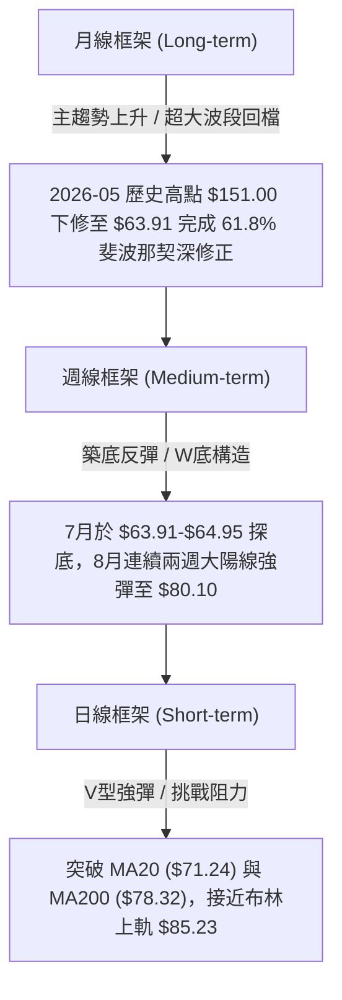
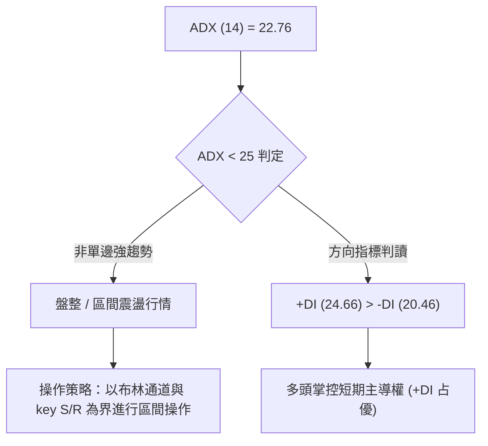
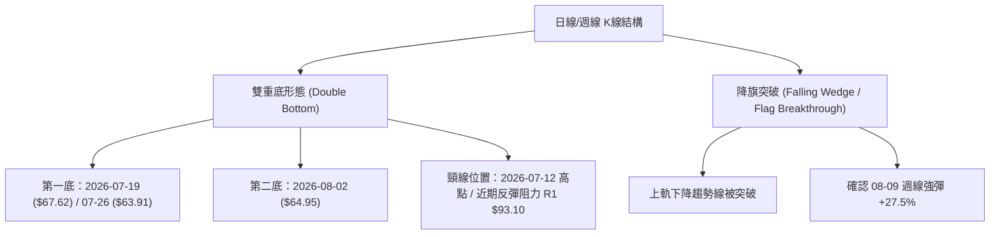
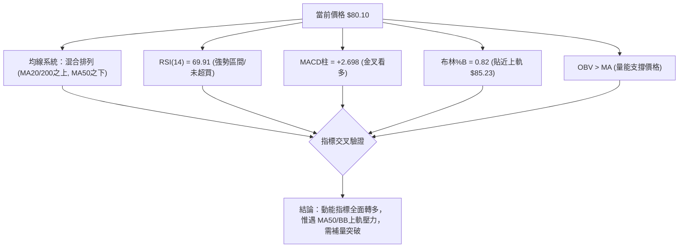
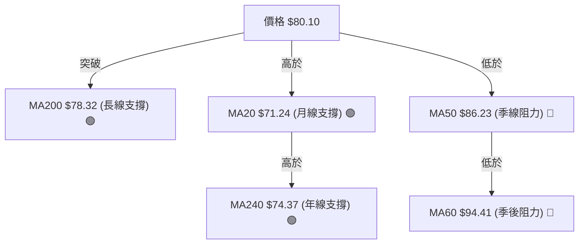
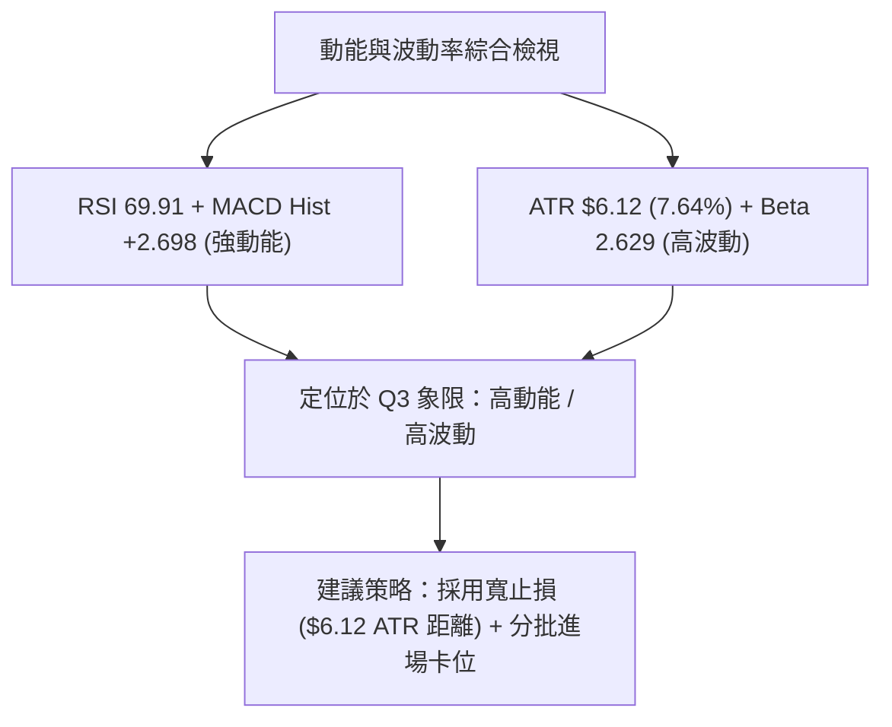
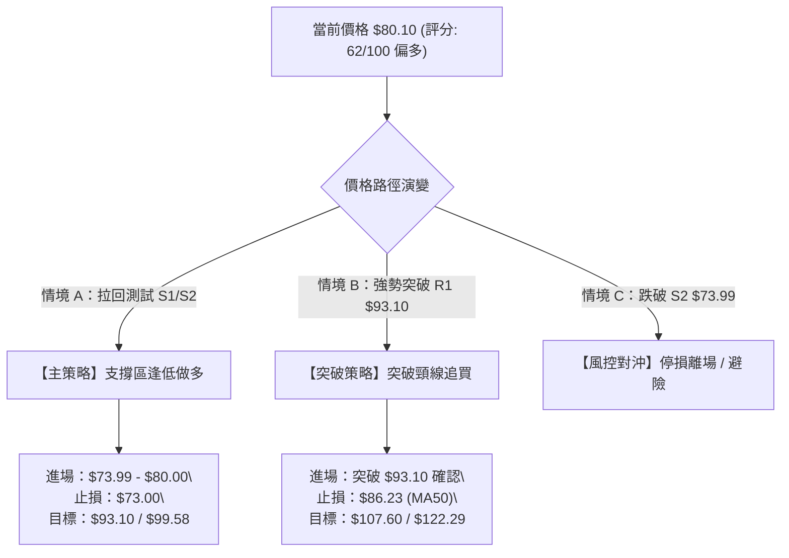
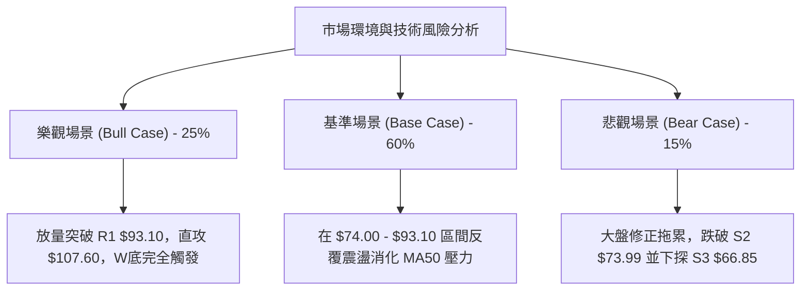

# RKLB 技術分析報告

> **報告日期**：2026-08-14 ｜ **語言**：繁體中文 ｜ **數據來源**：Yahoo Finance ｜ **當前價格**：$80.10

---

## 目錄

| 章節 | 內容 |
|------|------|
| [1. 技術面概覽](#1-技術面概覽) | 訊號儀表板、核心指標、評分卡 |
| [2. 趨勢分析](#2-趨勢分析) | 多時框趨勢、長中短期走勢 |
| [3. 圖表形態分析](#3-圖表形態分析) | 形態識別、K線組合、目標價 |
| [4. 支撐與阻力](#4-支撐與阻力) | 關鍵價位、斐波那契回調 |
| [5. 技術指標深度解讀](#5-技術指標深度解讀) | MA/RSI/MACD/布林/成交量 |
| [6. 動能與波動率](#6-動能與波動率) | 動能評估、ATR、Beta |
| [7. 多時框架總結](#7-多時框架總結) | 時框架評分矩陣 |
| [8. 交易策略建議](#8-交易策略建議) | 多空策略、風險報酬比 |
| [9. 風險提示與監控](#9-風險提示與監控) | 監控指標、風險場景 |

---

## 1. 技術面概覽

### 🎯 技術訊號儀表板

```mermaid
graph LR
    subgraph BULL ["🟢 多頭訊號 (4)"]
        B1["MACD柱狀圖翻正 (+2.698)"]
        B2["價格站上 MA20 ($71.24) 與 MA200 ($78.32)"]
        B3["OBV 趨勢向上高於均線 (量能支撐)"]
        B4["+DI (24.66) 高於 -DI (20.46)"]
    end
    subgraph NEUTRAL ["🟡 中性訊號 (3)"]
        N1["ADX (14) = 22.76 (盤整/弱趨勢行情)"]
        N2["RSI (14) = 69.91 (接近超買臨界點 70)"]
        N3["KD指標 (%K 76.49 / %D 77.63 中性區)")"]
    end
    subgraph BEAR ["🔴 空頭訊號 (2)"]
        D1["MA50 ($86.23) 與 MA60 ($94.41) 下降蓋頂"]
        D2["成交量 (16.71M) 低於 20日均量 (19.72M) 0.85x"]
    end
    BULL --> VERDICT{"🏆 綜合評級\\n中性偏多 (62/100)\\n區間反彈突破中"}
    NEUTRAL --> VERDICT
    BEAR --> VERDICT
```

### 📊 核心指標速覽表

| 指標類別 | 指標名稱 | 當前數值 | 訊號 | 解讀 |
|----------|----------|----------|------|------|
| **價格** | 當前收盤價 | $80.10 | 🟢 | 位於52週區間 $37.57 - $151.00 之 37.5% 分位，自7月低點反彈 |
| **均線** | MA20 | $71.24 | 🟢 | 價格在MA20上方 (+12.44%)，短線呈急升支撐 |
| **均線** | MA50 | $86.23 | 🔴 | 價格在MA50下方 (-7.11%)，上方形成中期動態阻力 |
| **均線** | MA200 | $78.32 | 🟢 | 價格回升至MA200上方 (+2.27%)，重返長線多空分水嶺 |
| **動能** | RSI(14) | 69.91 | 🟡 | 位於強勢區間頂端，接近 70 超買界線，無背離現象 |
| **動能** | MACD(12,26,9) | -0.995 / Hist +2.698 | 🟢 | DIF與DEA於零軸下完成金叉，Histogram 顯著擴大，柱狀看多 |
| **趨勢** | ADX(14) | 22.76 | 🟡 | ADX < 25，顯示當前非強趨勢，屬於波段築底後的反彈盤整 |
| **通道** | 布林通道 %B | 0.82 | 🟢 | 價格靠攏上軌 $85.23，中軌 $71.24 形成支撐 |
| **波動** | ATR(14) | $6.12 | 🟡 | 日波幅達 7.64%，屬於偏高波動標的，需預留較寬止損 |
| **量能** | 20日量比 | 0.85x | 🔴 | 今日 16.71M 對比 20日均量 19.72M 略微縮量，突破需補量 |

### 🏆 技術評分卡

```
╔══════════════════════════════════════════════════════════════════╗
║              RKLB 技術指標綜合評分卡 (2026-08-14)                ║
╠══════════════════════════════════════════════════════════════════╣
║ 趨勢強度 (ADX/MA)   ████████████░░░░░░░░  60/100  🟡 中性盤整   ║
║ 動能指標 (RSI/MACD) ████████████████░░░░  80/100  🟢 動能強勁   ║
║ 支撐穩定度 (S1/S2)  ██████████████░░░░░░  70/100  🟢 雙底確認   ║
║ 成交量配合 (OBV/VOL)██████████░░░░░░░░░░  50/100  🟡 量能中等   ║
║ 形態完整度 (雙底)   ██████████████░░░░░░  70/100  🟢 頸線測試   ║
║ 均線排列 (混合)     ██████████░░░░░░░░░░  50/100  🟡 糾纏分化   ║
╠══════════════════════════════════════════════════════════════════╣
║ 綜合技術評分        ████████████4░░░░░░░  62/100  🟢 中性偏多   ║
╚══════════════════════════════════════════════════════════════════╝
```

---

## 2. 趨勢分析

### 🌐 多時框趨勢分析



### 📈 長期趨勢 — 24個月走勢圖（Unicode）

```
RKLB 24個月收盤價歷史走勢圖 ($)
$160 ┤                                              ● (2026-05: $143.48 / 盤中 $151.00)
$140 ┤                                             ╱ ╲
$120 ┤                                            ╱   ╲
$100 ┤                                  ●        ╱     ● (2026-06: $101.65)
$80  ┤                         ●       ╱ ╲      ╱       ╲          ● (2026-08: $80.10)
$60  ┤                        ╱ ╲     ╱   ╲    ╱         ●─────────┾ (2026-07: $64.95)
$40  ┤            ●          ╱   ●───●     ●──● (2025-11: $42.14)
$20  ┤  ●        ╱ ╲        ╱
$0   └──┴────────┴──┴───────┴────┴─────────┴────┴─────────┴─────────┴─────────
       24-08   24-11  25-01 25-04  25-08  25-10 25-12  26-01  26-05  26-07  26-08
```

#### 走勢特徵分析表

| 階段 | 時間區間 | 起始價 → 終點價 | 漲跌幅 | 走勢結構與技術特點 |
|------|----------|----------------|--------|--------------------|
| **第1階段** | 2024-08 ~ 2025-01 | $6.27 → $29.05 | +363.3% | 初次爆發期，完成底部洗盤後沿 MA20 主升段飆漲 |
| **第2階段** | 2025-02 ~ 2025-04 | $20.49 → $21.79 | +6.3% | 健康中期回檔，築出 $17.88 低點後打底完成 |
| **第3階段** | 2025-05 ~ 2025-10 | $26.79 → $62.98 | +135.1% | 主升段延續，突破歷史高點，法人持股大幅增加 |
| **第4階段** | 2025-11 ~ 2026-01 | $42.14 → $80.07 | +90.0% | 深幅洗盤後再創新高，多頭趨勢堅固 |
| **第5階段** | 2026-02 ~ 2026-05 | $69.10 → $143.48 | +107.6% | 瘋狂主升段，衝至歷史天價 $151.00，RSI 嚴重超買 |
| **第6階段** | 2026-06 ~ 2026-07 | $101.65 → $64.95| -36.1% | 獲利了結拋售潮，深度修正至 61.8% 回調位 ($80.90) 以下 |
| **當前階段**| 2026-07 ~ 2026-08 | $63.91 → $80.10 | +25.3% | 探底成功，回升站上 MA200，展開第 7 階段震盪築底反彈 |

### 📊 中期趨勢（週線分析）

近 20 週數據顯示，RKLB 在 2026-05-31 達到 $143.48 的週收盤高點後，經歷了連續 8 週的劇烈修正，於 2026-07-26 當週創下 $63.91 的波段低點，週線 RSI 一度跌至 15.6（極度超賣）。
隨後兩週（08-02 至 08-16），收盤價由 $64.95 強勁反彈至 $82.83 / $80.10，週線 MACD 柱狀圖由負翻正 (+2.940 / +2.698)，週線 RSI 迅速回升至 69.9。這標誌著中期拋售潮結束，股價進入 $64.00 - $93.00 的寬幅打底震盪區間。

### ⚡ 趨勢強度評估（ADX 解讀）



| ADX 數值區間 | 趨勢狀態 | RKLB 當前狀態 | 交易策略指示 |
|--------------|----------|---------------|--------------|
| 0 - 20 | 極弱 / 無趨勢 | — | 避免趨勢追價，以高賣低買為主 |
| **20 - 25** | **弱趨勢 / 盤整** | **✓ (22.76)** | **區間反彈，留意阻力位回檔，不宜過度槓桿** |
| 25 - 50 | 強趨勢 | — | 順勢操作，拉回找買點 |
| > 50 | 極強趨勢/過熱 | — | 緊盯止損，防止極端反轉 |

---

## 3. 圖表形態分析

### 🔍 形態識別系統



#### 圖表形態信心度與目標價評估

| 形態名稱 | 信心度 | 判斷依據（引用數據） | 完成度 | 形態目標價（附計算式） |
|----------|--------|----------------------|--------|------------------------|
| **雙重底 (W底)** | **70%** | 兩次下探 $63.91與$64.95（守住 S3 $66.85 區域），RSI 產生強烈底背離反彈 | 75% | 頸線 $93.10 + (頸線 $93.10 - 低點 $63.91 = $29.19) = **$122.29** |
| **V型反彈 / 均線糾纏** | **65%** | 兩週內由 $63.91 直攻 $82.83，短線站上 MA20 ($71.24) 與 MA200 ($78.32) | 90% | 第一阻力 $93.10 (R1)，第二目標 $107.60 (R3) |
| **頭肩頂/底** | **20%** | 數據不足以支撐頭肩幾何形態 | 0% | 訊號不足，不予以計算 |

### 🕯️ 重要 K 線形態分析

| 日期 / 週 | 收盤價 | K線形態名稱 | 技術解讀 | 訊號強度 |
|-----------|--------|-------------|----------|----------|
| 2026-07-26 | $63.91 | 長下影小陰線 | 探底 $63.91 後遭遇強烈買盤支撐，過度賣壓衰竭 | 🟢 看多反轉 |
| 2026-08-02 | $64.95 | 錘頭線 (Hammer) | 二度測試 $64.00 關卡成功，確定底部支撐有效 | 🟢 看多確認 |
| 2026-08-09 | $82.83 | 大陽線 (Bullish Long White) | 單週大漲 +27.53%，一舉穿透 MA20 與 MA200，多頭全面反攻 | 🟢強烈看多 |
| 2026-08-16 | $80.10 | 高位震盪十字/小陰線 | 於 61.8% 斐波那契位 ($80.90) 與 MA50 ($86.23) 前遇阻小幅整固 | 🟡 中性整理 |

### 📉 ASCII 走勢形態示意圖

```
RKLB 日線雙底 (Double Bottom) 形態示意圖
══════════════════════════════════════════════════════════════
$100.00 ┼─────────────────────────────────────────────────────
$93.10  ┼─────────────────────────[ 頸線 R1 ]─────────────────
        │                        ╱   ╲
$80.10  ┼───────────────────────● (現價) ╲
        │                      ╱          ╲
$71.24  ┼───────────●────────╱─────────────[ MA20 中軌支撐 ]───
        │          ╱ ╲      ╱
$64.00  ┼─────────●───●────●───────────────────────────────────
                  底1  頸線  底2
               (07-26)      (08-02)
                $63.91      $64.95
══════════════════════════════════════════════════════════════
```

---

## 4. 支撐與阻力

### 🗺️ 關鍵價位分布圖（Unicode）

```
RKLB 價位結構分布圖 (以當前價 $80.10 為中心)
══════════════════════════════════════════════════════════════════
$151.00 ║████████████████████████████████████████████████║ 52週歷史高點 (0.0% Fib)
$124.23 ║████████████████████████████                    ║ 23.6% 斐波那契回調位
$107.60 ║████████████████████████████████████████        ║ 強阻力 R3 / 38.2% Fib ($107.67)
$99.58  ║████████████████████████                        ║ 中期阻力 R2
$94.28  ║████████████████████                            ║ 50.0% 斐波那契回調位 / MA60 ($94.41)
$93.10  ║██████████████████████████████                  ║ 關鍵阻力 R1 (頸線壓力)
$86.23  ║████████████████                                ║ MA50 動態阻力
$85.23  ║██████████████                                  ║ 布林通道上軌
$80.90  ║▓▓▓▓▓▓▓▓▓▓▓▓▓▓▓▓▓▓▓▓▓▓▓▓▓▓▓▓▓▓▓▓▓▓▓▓▓▓▓▓▓▓▓▓▓▓▓  ║ 61.8% 斐波那契回調位 (關鍵交會點)
$80.10  ╠════════════════════════════════════════════════╣ ◄ 當前收盤價 ($80.10)
$80.00  ║▓▓▓▓▓▓▓▓▓▓▓▓▓▓▓▓▓▓▓▓▓▓▓▓▓▓▓▓▓▓▓▓▓▓▓▓▓▓▓▓▓▓▓▓▓▓▓  ║ 近期關鍵支撐 S1 (整數心理關卡)
$78.32  ║██████████████████████                          ║ MA200 長線支撐
$73.99  ║████████████████████████████                    ║ 強支撐 S2
$71.24  ║████████████████                                ║ MA20 / 布林通道中軌
$66.85  ║████████████████████████████████                ║ 關鍵強支撐 S3
$61.84  ║████████████████                                ║ 78.6% 斐波那契回調位
$37.57  ║████████████████████████████████████████████████║ 52週歷史低點 (100.0% Fib)
══════════════════════════════════════════════════════════════════
```

### 🚧 阻力位分析表

| 阻力級別 | 精確價位 | 形成原因與技術交會 | 突破難度 | 重要性 |
|----------|----------|--------------------|----------|--------|
| **R1** | **$93.10** | 近一年波段高點聚類、接近 50% 斐波那契回調位 ($94.28) 與 MA60 ($94.41) | 🔴 高 | ★★★★★ (頸線解套賣壓區) |
| **R2** | **$99.58** | 心理關卡 $100.00 前哨，近一年波段高點聚類 | 🟡 中 | ★★★★☆ (整數關卡卡位) |
| **R3** | **$107.60**| 近一年波段高點聚類、38.2% 斐波那契回調位 ($107.67) | 🔴 高 | ★★★★★ (中長期空頭防線) |

### 🛡️ 支撐位分析表

| 支撐級別 | 精確價位 | 形成原因與技術交會 | 守住機率 | 重要性 |
|----------|----------|--------------------|----------|--------|
| **S1** | **$80.00** | 近一年波段低點聚類、61.8% 斐波那契位 ($80.90)、整數關卡、MA200 ($78.32) | 🟢 高 | ★★★★★ (多頭第一防線) |
| **S2** | **$73.99** | 近一年波段低點聚類、高於 MA20 ($71.24) | 🟡 中 | ★★★★☆ (短線拉回買點) |
| **S3** | **$66.85** | 近一年波段低點聚類、W底雙底區域 ($63.91-$64.95) 上方 | 🟢 極高 | ★★★★★ (中期多空生死線) |

### 📐 斐波那契回調位分析

基於 52 週高低點區間（高點 $151.00，低點 $37.57，總價差 $113.43）：
- **0.0% (52W High)**: $151.00
- **23.6%**: $124.23
- **38.2%**: $107.67
- **50.0%**: $94.28
- **61.8%**: $80.90
- **78.6%**: $61.84
- **100.0% (52W Low)**: $37.57

**解讀**：當前價格 $80.10 **精確貼合於 61.8% 黃金分割回調位 ($80.90)** 附近（僅差 1%）。在技術分析中，61.8% 回調位是判斷強勢修正是否結束的最核心關卡。股價成功在 78.6% ($61.84) 上方的 $63.91 獲得支撐並迅速拉回至 61.8% ($80.90) 關鍵位，說明本次深幅回檔已獲得黃金分割支撐，若能穩定收在 $80.90 之上，下一目標將直指 50.0% 回調位 ($94.28)。

---

## 5. 技術指標深度解讀

### 🎛️ 指標訊號總覽



### 📈 移動平均線排列分析



#### 均線數據詳解

- **短天期均線**：MA5 ($80.83) 與 MA10 ($76.45) 呈多頭排列，MA10 迅速上彎，提供短線推升力道。
- **中天期均線**：MA20 ($71.24) 向上穿透，但 MA50 ($86.23) 與 MA60 ($94.41) 仍向下扣高，形成上方重重壓制。
- **長天期均線**：MA200 ($78.32) 與 MA240 ($74.37) 保持向上上揚走勢。股價重新站上 MA200 代表長線牛市結構未被破壞。

### 📉 RSI(14) 分析

```
RSI(14) 當前數值進度條: [69.91 / 100]
0                30                     70        100
├────────────────┼──────────────────────┼──────────┤
│    超賣區      │        中性區        │  超買區  │
└────────────────┴──────────────────────┴──────────┘
 [██████████████████████████████████████████████████░] 69.91% 🟡
```

- **當前數值**：69.91，位於強勢區頂端（接近 70 超買線）。
- **背離分析**：
  - **頂背離**：無。股價自 $63.91 反彈，RSI 同步從 15.6 飆升至 69.91，屬於正常的強勁動能修復。
  - **底背離**：7 月底股價二次探底 $64.95 時，週線 RSI 由 15.6 上升至 36.5，呈現標準的**週線級別底背離**，隨後引發了 8 月的大幅反彈。

### 📊 MACD(12,26,9) 訊號解讀

- **DIF (MACD線)**: -0.995
- **DEA (Signal線)**: -3.693
- **MACD Histogram**: +2.698 (DIF - DEA)

**解讀**：DIF 已經在零軸下方向上強勢穿越 DEA，形成**低位黃金交叉**。柱狀圖（Histogram）連續數週由負翻正並擴大至 +2.698，顯示空頭動能已徹底枯竭，多頭主導短期市場。目前 MACD 雙線正在向零軸衝刺，若能穿越零軸，將確立中線翻多。

### 📦 布林通道分析

```
RKLB 布林通道位置示意圖
══════════════════════════════════════════════════════════════
$85.23 ┼────────────────────────────── [ 布林通道上軌 ] 
       │                             ● (現價 $80.10, %B = 0.82)
$71.24 ┼────────────────────────────── [ 布林通道中軌 (MA20) ]
       │
$57.25 ┼────────────────────────────── [ 布林通道下軌 ]
══════════════════════════════════════════════════════════════
```

- **通道寬度**：上軌 $85.23 - 下軌 $57.25 = $27.98（帶寬佔中軌約 39%），通道呈現自縮窄後向上張口的初段。
- **%B 指標**：0.82。股價位於中軌與上軌之間，靠近上軌 $85.23。若股價貼著上軌上升（Bollinger Band Walk），屬典型強勢攻擊形態；若於上軌受阻，則可能回測中軌 $71.24。

### 💹 成交量與 OBV 分析

- **最新成交量**：16,706,967 股。
- **20日均量**：19,718,123 股（量比 0.85x）。
- **50日均量**：23,892,919 股。
- **OBV 趨勢**：OBV 指標高於其移動平均線（OBV > MA），呈現「量價配合」。在 7 月底打底期間量能顯著縮減，8 月上旬大陽線反彈時成交量放大至接近 1 億股/週（08-09 週 96.7M），說明主力資金在底部吸籌積極，當前價格上漲有實質資金支撐。

---

## 6. 動能與波動率

### ⚡ 動能評估四象限

| 象限 | 動能 (Momentum) | 波動率 (Volatility) | 當前 RKLB 狀態 | 交易策略指示 |
|------|-----------------|---------------------|----------------|--------------|
| **Q1** | 強 (High) | 低 (Low) | — | 最佳順勢持股區 |
| **Q2** | 弱 (Low) | 低 (Low) | — | 築底盤整，等待突破 |
| **Q3** | **強 (High)** | **高 (High)** | **✓ (當前狀態)** | **高動能高波動：短線爆發力強，需嚴格設定止損與倉位** |
| **Q4** | 弱 (Low) | 高 (High) | — | 恐慌拋售區，避開 |



### 📊 ATR 波動率分析

- **ATR(14)**：$6.12（佔當前股價 $80.10 的 7.64%）。
- **止損距離建議**：
  - **緊密止損 (1.0x ATR)**: $80.10 - $6.12 = **$73.98**（精確對應支撐位 S2 $73.99）。
  - **標準止損 (1.5x ATR)**: $80.10 - ($6.12 × 1.5) = **$70.92**（位於 MA20 $71.24 下方）。
  - **寬鬆止損 (2.0x ATR)**: $80.10 - ($6.12 × 2.0) = **$67.86**（位於 S3 $66.85 上方）。

### 📐 Beta 與市場相關性

- **Beta 係數**：2.629。說明 RKLB 的波動度是大盤（S&P 500）的 2.63 倍，屬於極高 Beta 成長股/航太高科技標的。當大盤上漲 1% 時，RKLB 預期上漲 2.63%；反之亦然。在市場避險情緒升溫時需警惕高 Beta 股票的回撤風險。

---

## 7. 多時框架總結

### 📋 時框架評分表

| 時框架 | 趨勢方向 | 動能狀態 | 均線排列 | 形態結構 | 綜合評分 | 操作建議 |
|--------|----------|----------|----------|----------|----------|----------|
| **月線 (Long)** | 🟢 多頭長牛 | 🟡 修正後修復 | 🟢 MA200之上 | 大波段上升浪回調 | 75/100 | 長線逢低分批布局 |
| **週線 (Medium)**| 🟡 區間打底 | 🟢 金叉反彈 | 🟡 均線糾纏 | 雙底 (W底) 構築 | 65/100 | 中線持股，關注頸線突破 |
| **日線 (Short)** | 🟢 強勁反彈 | 🟢 RSI 69.9 近超買 | 🟢 站上 MA20/200 | V型強彈衝擊阻力 | 60/100 | 短線不宜追高，拉回買進 |

### 🔲 綜合訊號矩陣

```
╔══════════════════════════════════════════════════════════════════╗
║                   RKLB 多時框訊號收斂矩陣                       ║
╠══════════════════════════════════════════════════════════════════╣
║ 時框     短線(日線)        中線(週線)        長線(月線)          ║
║ 趨勢     🟢 上升突破       🟡 區間打底       🟢 牛市主升回檔     ║
║ 均線     🟢 站上MA20/200   🟡 承壓於MA50     🟢 遠高於MA240      ║
║ 動能     🟢 MACD金叉       🟢 柱狀圖翻正     🟡 RSI修復中        ║
║ 支撐/阻力 靠近 R1 $93.10   守住 S3 $66.85    守住 61.8% $80.90   ║
╚══════════════════════════════════════════════════════════════════╝
```

### ⚖️ 多時框收斂結論

**當前市場環境判定**：ADX(14) = 22.76 (<25)，依據收斂規則，當前屬**盤整/寬幅區間震盪行情**。

- **主導時框**：以日線布林通道 ($57.25 - $85.23) 與 key 支撐/阻力區間 ($73.99 - $93.10) 為主要交易範疇。
- **方向收斂**：雖然 MA50 ($86.23) 在上方形成壓制，但週線雙底成形、日線站上 MA200 ($78.32) 與 61.8% 斐波那契位 ($80.90)，且 MACD 剛完成低位金叉。因此，多時框收斂結論為：**偏多區間反彈行情**，主策略以「拉回支撐做多」為主。

---

## 8. 交易策略建議

### 🗺️ 策略決策流程圖



### 🧭 策略路由

> **當前主策略方向：偏多區間操作與突破卡位（綜合評分 62/100 ≥ 60，主推多頭策略）**

### 🎯 價格情境階梯 (Price Scenarios)

| 觸發條件 | 下一目標 | 後續延伸目標 | 情境技術含義 |
|----------|----------|--------------|--------------|
| 突破阻力 R1 **$93.10** | R2 **$99.58** | R3 **$107.60** | W底頸線突破，確立中線大漲行情 |
| 站穩 **$80.00 - $80.90** | R1 **$93.10** | R2 **$99.58** | 61.8% 斐波那契位整固完成，蓄勢上攻 |
| 跌破支撐 S1 **$80.00** | S2 **$73.99** | S3 **$66.85** | 回測 MA20 中軌與 MA200，區間下軌尋求買盤 |

### 📊 情境機率分佈

| 情境劇本 | 機率 | 主要技術依據 |
|----------|------|--------------|
| **繼續震盪上行 / 挑戰 R1** | **60%** | MACD 低位金叉、站上 MA200 與 61.8% 斐波那契位、週線底背離 |
| **區間橫盤震盪 ($74 - $85)** | **30%** | ADX < 25 (22.76) 顯示無強趨勢，MA50 ($86.23) 蓋頂，需時間消化 |
| **深度回撤 / 再探 S3 底點** | **10%** | 若整體美股大盤拉回，受高 Beta (2.63) 拖累回測 S3 $66.85 |

### 🟢 主策略詳情

| 策略要素 | 策略 A：拉回支撐做多 (首選) | 策略 B：突破 R1 追買 (次選) |
|----------|----------------------------|----------------------------|
| **進場條件** | 價格拉回 S1 $80.00 附近或 S2 $73.99 尋求支撐 | 日收盤價實體強勢突破 R1 $93.10 且成交量放大 |
| **建議進場價** | **$80.00** (或 $74.50 附近分批) | **$93.50** (突破確認後) |
| **目標價 T1** | **$93.10** (阻力 R1, 預期收益 +16.4%) | **$107.60** (阻力 R3 / 38.2% Fib, +15.1%) |
| **目標價 T2** | **$99.58** (阻力 R2, 預期收益 +24.5%) | **$122.29** (W底形態目標價, +30.8%) |
| **止損價格** | **$73.00** (跌破 S2 $73.99 與 MA20 $71.24) | **$86.00** (跌破 MA50 $86.23 與前高轉換位) |
| **風險報酬比**| **1 : 1.87** (至T1) / **1 : 2.80** (至T2) | **1 : 1.88** (至T1) / **1 : 3.84** (至T2) |
| **預估成功率**| **65%** | **60%** |
| **建議倉位** | **10% - 15%** 總資金 | **5% - 10%** 追勝倉 |

### 🔴 反向風險觸發點（對沖提示）

- **關鍵反轉破位價**：**$73.99 (S2)**。若日收盤價跌破 $73.99，意味著 short-term V型反彈結束，股價可能再次下探 S3 **$66.85**。
- **對沖應對**：若持有多頭部位，於跌破 $73.00 時應無條件執行止損；高槓桿交易者可考慮小幅建立認售選擇權 (Put Option) 進行避險。

### ⭐ 整體訊號強度評星

```
做多訊號強度：★★██☆  (3.8/5星) 🟢 中性偏多
做空訊號強度：★☆☆☆☆  (1.5/5星) 🔴 避開做空
整體可信度：  ★★██☆  (4.0/5星) 🟢 多時框數據吻合
```

---

## 9. 風險提示與監控

### ✅ 關鍵監控指標 Checklist

```
╔══════════════════════════════════════════════════════════════════╗
║                     RKLB 每日/每週技術監控清單                   ║
╠══════════════════════════════════════════════════════════════════╣
║ [ ] 價格是否穩定站穩 MA200 ($78.32) 與 S1 ($80.00) 之上          ║
║ [ ] 日線 RSI(14) 是否在突破 70 後出現頂背離 (現為 69.91)          ║
║ [ ] 成交量是否增強至 20日均量 (19.72M) 以上以增強突破力道        ║
║ [ ] MACD Histogram 能否持續維持在零軸上方 (+2.698)               ║
║ [ ] 價格衝擊 MA50 ($86.23) 與 R1 ($93.10) 時的 K 線解套賣壓強度    ║
╚══════════════════════════════════════════════════════════════════╝
```

### ⚠️ 風險場景分析



### 🛡️ 風險管理重要提醒

1. **高 Beta 波動風險**：RKLB 的 Beta 高達 2.629，日 ATR 為 $6.12 (7.64%)。單日波動放大至 8%-10% 屬常態，**嚴禁過度使用槓桿**。
2. **財報與事件風險**：航太國防與發射任務標的易受發射窗口延期、火箭測試數據或財報影響，需密切留心公司公告。
3. **資金管理規則**：單一股票頭寸建議控制在總投資組合的 **10-15% 以內**，單筆交易最大虧損額度不得超過總資金的 **1-2%**。

---

## 📋 報告總結

```
╔══════════════════════════════════════════════════════════════════╗
║                    RKLB 技術分析報告總結                         ║
════════════════════════════════════════════════════════════════════
 報告日期：2026-08-14
 當前價格：$80.10
 分析評級：🟢 中性偏多 (技術評分: 62 / 100)

 關鍵評估結論：
 ├─ 長期趨勢：🟢 保持牛市格局，探底 61.8% 斐波那契位 ($80.90) 完成
 ├─ 中期趨勢：🟢 週線底背離，W底築底結構完成 75%，重回 MA200 上方
 ├─ 短期趨勢：🟢 動能強勁，MACD 金叉，正挑戰布林上軌與 MA50 阻力
 ├─ 關鍵支撐：S1 $80.00 / S2 $73.99 / S3 $66.85
 ├─ 關鍵阻力：R1 $93.10 / R2 $99.58 / R3 $107.60
 └─ 分析師共識目標價：Mean $112.76 (High $150.00 / Low $64.00)

 最優策略組合：
 1. 🥇 最佳機會：拉回 S1 $80.00 附近分批建立多頭部位，止損設 $73.00，目標 $93.10。
 2. 🥈 次選機會：待日收盤實體突破 R1 $93.10 後追買，目標 $107.60 / $122.29。
 3. 🥉 保守選擇：等待股價於 $74 - $86 區間震盪築底完成、MA50 走平後再行進場。
════════════════════════════════════════════════════════════════════
```

---

> ⚠️ **免責聲明**：本報告為 AI 自動生成之技術分析，所有數據及估算均基於提供的歷史價格資訊。本報告**僅供研究與學術參考**，**不構成任何投資建議**。投資有風險，入市需謹慎。

---

*報告生成時間：2026-08-14 ｜ 數據來源：Yahoo Finance ｜ 分析框架：多時框技術分析*