# RKLB 技術分析報告

> **報告日期**：2026-08-16 ｜ **語言**：繁體中文 ｜ **數據來源**：Yahoo Finance ｜ **當前價格**：$80.25

---

## 目錄

| 章節 | 內容 |
|------|------|
| [1. 技術面概覽](#1-技術面概覽) | 訊號儀表板、核心指標、評分卡 |
| [2. 趨勢分析](#2-趨勢分析) | 多時框趨勢、長中短期走勢 |
| [3. 圖表形態分析](#3-圖表形態分析) | 形態識別、K線組合、目標價 |
| [4. 支撐與阻力](#4-支撐與阻力) | 關鍵價位、斐波那契回調 |
| [5. 技術指標深度解讀](#5-技術指標深度解讀) | MA/RSI/MACD/布林/成交量 |
| [6. 動能與波動率](#6-動能與波動率) | 動能評估、ATR、Beta |
| [7. 多時框架總結](#7-多時框架總結) | 時框架評分矩陣 |
| [8. 交易策略建議](#8-交易策略建議) | 多空策略、風險報酬比 |
| [9. 風險提示與監控](#9-風險提示與監控) | 監控指標、風險場景 |
| [10. 報告總結](#-報告總結) | 關鍵結論與策略摘要 |

---

## 1. 技術面概覽

### 🎯 技術訊號儀表板

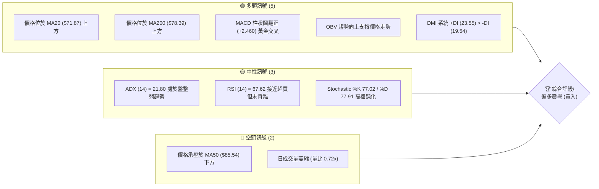

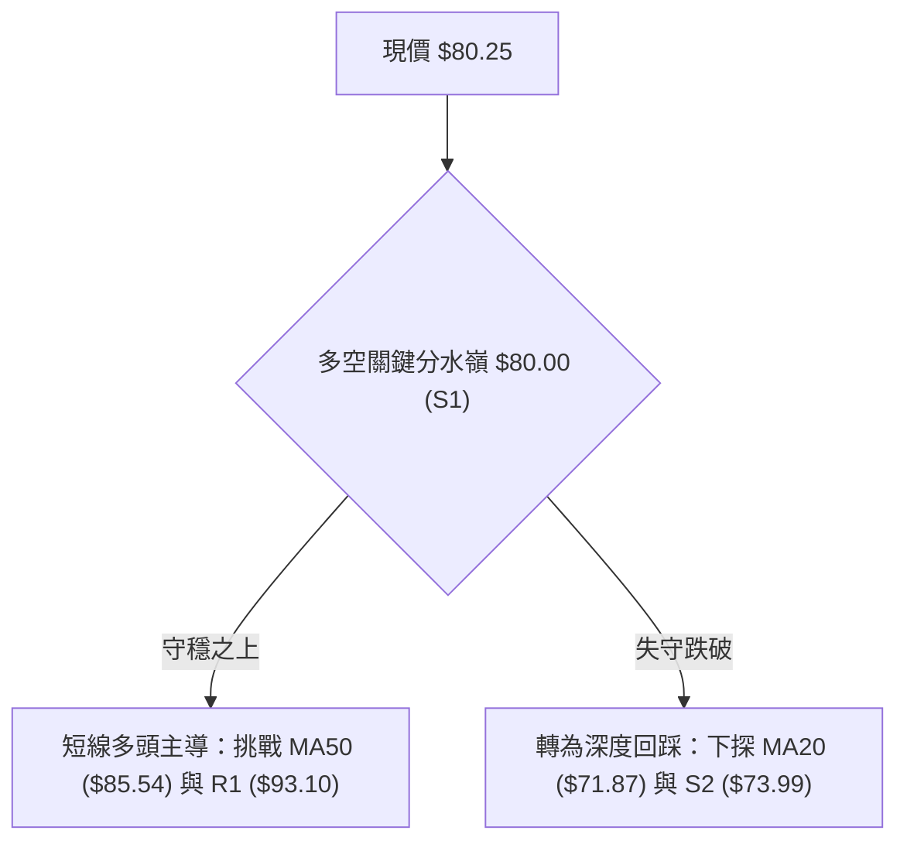

### 📊 核心指標速覽表

| 指標類別 | 指標名稱 | 當前數值 | 訊號 | 解讀 |
|----------|----------|----------|------|------|
| **價格** | 當前價格 | $80.25 | 🟢 | 守穩 S1 ($80.00) 關鍵心理整數關卡 |
| **均線** | MA20 | $71.87 | 🟢 | 現價高出 MA20 達 +11.66%，短期多頭排列 |
| **均線** | MA50 | $85.54 | 🔴 | 現價低於 MA50 約 -6.18%，面臨中期均線壓制 |
| **均線** | MA200 | $78.39 | 🟢 | 站上長期牛熊分界線 MA200 (+2.37%)，長期偏多 |
| **動能** | RSI(14) | 67.62 | 🟡 | 處於強勢中性區間 (50-70)，尚未進入極端超買 |
| **動能** | MACD Hist | +2.460 | 🟢 | 柱狀圖維持正值擴張，低檔黃金交叉動能延續 |
| **動能** | Stoch %K/%D | 77.02 / 77.91 | 🟡 | 進入超買邊界，短期存在技術性休整需求 |
| **趨勢** | ADX(14) | 21.80 | 🟡 | ADX < 25 表明市場處於寬幅震盪整理階段 |
| **通道** | BB %B | 0.79 | 🟢 | 運行於布林中軌與上軌間，多頭控盤通道內 |
| **量能** | 量比 (20日) | 0.72x | 🔴 | 日量 13.85M 低於 20MA 量 19.32M，量能稍嫌不足 |
| **波動** | ATR(14) | $6.09 | 🟡 | 佔股價 7.59%，波動度維持中高水平 |

### 🏆 技術評分卡

```
╔══════════════════════════════════════════════════════════════╗
║              技術評分卡 — RKLB (2026-08-16)                  ║
╠══════════════════════════════════════════════════════════════╣
║ 趨勢強度 (ADX/DMI)   ████████████░░░░░░░░  60/100  🟡 中性偏多 ║
║ 動能指標 (RSI/MACD)  ████████████████░░░░  80/100  🟢 強勁看多 ║
║ 支撐穩定度 (S1/S2)   ██████████████░░░░░░  70/100  🟢 支撐扎實 ║
║ 成交量配合 (OBV/VOL) ████████████░░░░░░░░  60/100  🟡 量能中性 ║
║ 形態完整度 (波段築底) ██████████████░░░░░░  70/100  🟢 形態向好 ║
║ 均線排列 (MA系統)    ████████████░░░░░░░░  60/100  🟡 混合排列 ║
╠══════════════════════════════════════════════════════════════╣
║ 綜合評分             █████████████░░░░░░░  66.7/100 偏多操作 ║
╚══════════════════════════════════════════════════════════════╝
```

---

## 2. 趨勢分析

### 🌐 多時框趨勢分析

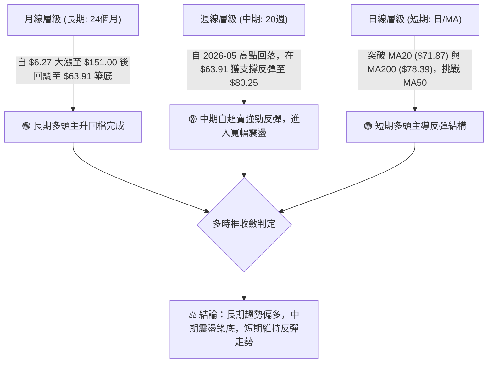

### 📈 長期趨勢 — 12個月走勢圖（Unicode）

```
RKLB 月線收盤走勢圖（2025-08 至 2026-08）
價格軸 ($)
$150 ┤                                      ● ($143.48, 05月)
$130 ┤                                     / \
$110 ┤                                    /   ● ($101.65, 06月)
$ 90 ┤                            ●      /     \
$ 70 ┤                  ● ($69.76) \    ●       \       ● ($80.25, 現價)
$ 50 ┤  ● ($48.60, 08月) \          \  / ($82.51)\     /
$ 30 ┤   \                ● ($42.14) ● ($64.22)    ●---● ($64.95, 07月)
     └──────────────────────────────────────────────────────────
       08  09  10  11  12  01  02  03  04  05  06  07  08 (月份)
```

**12個月走勢特徵分析表格**：

| 階段區間 | 起止月份 | 價格變化 ($) | 漲跌幅 (%) | 形態與量能特徵 | 趨勢判定 |
|----------|----------|--------------|------------|----------------|----------|
| **強勢推升期** | 2025-08 → 2026-01 | $48.60 → $80.07 | +64.75% | 震盪推升，11月快速回踩 $42.14 後突破新高 | 🟢 強勢多頭 |
| **中繼整理期** | 2026-01 → 2026-04 | $80.07 → $82.51 | +3.05% | 在 $64.22 - $82.51 間構築三角形收斂平台 | 🟡 橫盤蓄勢 |
| **主升爆發期** | 2026-04 → 2026-05 | $82.51 → $143.48 | +73.89% | 爆量突破歷史高點 $151.00 衝頂 | 🟢 極度超買 |
| **深度回撤期** | 2026-05 → 2026-07 | $143.48 → $64.95 | -54.73% | 獲利盤湧出，週線連續下挫，回踩斐波那契 78.6% 區域 | 🔴 空頭修正 |
| **築底反彈期** | 2026-07 → 2026-08 | $64.95 → $80.25 | +23.56% | 探底 $63.91 後強力 V 型反彈，收復 MA200 | 🟢 底部確認 |

### 📊 中期趨勢（週線分析）

```
中期週線波段結構與支撐壓力分佈：
$151.00 ════════════════════════════════════════ 52週歷史高點 (天花板)
          \
           \
$107.60 ────\─────────────────────────────────── 阻力位 R3 (前期反彈次高點)
             \        /\
$ 93.10 ──────\──────/──\─────────────────────── 阻力位 R1 / 斐波那契 50.0% ($94.28)
               \    /    \        ▲ 現價 $80.25 (斐波那契 61.8% $80.90)
$ 80.00 ────────\──/──────\───────●───────────── 關鍵支撐 S1 (週線跳空頸線)
                 \/        \     /
$ 63.91 ════════════════════════●═══════════════ 2026-07 波段絕對低點 (強支撐底部)
```

### ⚡ 趨勢強度評估（ADX 解讀）

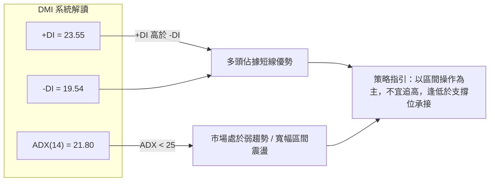

| 指標參數 | 數值 | 臨界標準 | 狀態評估 | 實戰意涵 |
|----------|------|----------|----------|----------|
| **ADX(14)** | 21.80 | < 25 (弱趨勢/震盪) | 🟡 盤整行情 | 趨勢強度不足，價格易在布林通道內來回拉鋸 |
| **+DI** | 23.55 | > -DI | 🟢 多方佔優 | 短線買盤力量大於賣盤，具備反彈動能 |
| **-DI** | 19.54 | < +DI | 🟢 空方受抑 | 賣壓逐步消化，未見連續崩跌式拋售 |
| **ADX 趨勢** | 平緩微升 | 交叉確認 | 🟡 蓄勢階段 | 若突破 MA50 且 ADX 升破 25，將啟動新一輪單邊趨勢 |

---

## 3. 圖表形態分析

### 🔍 形態識別系統

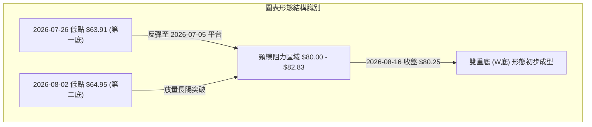

**形態信心度與目標價評估表**：

| 形態名稱 | 信心度 | 判斷依據（引用數據） | 完成度 | 目標價（附精確計算式） |
|----------|--------|----------------------|--------|------------------------|
| **雙重底 (W底)** | 75% | 1. 2026-07-26 低點 $63.91 與 2026-08-02 低點 $64.95 構成堅實雙底<br>2. 頸線取 2026-08-09 收盤價 $82.83<br>3. 現價 $80.25 正在頸線下方強勢蓄勢 | 85% | **形態高度** = $82.83 - $63.91 = $18.92<br>**突破目標價** = 頸線 $82.83 + $18.92 = **$101.75** (高度逼近阻力位 R2 $99.58 與 2026-06 收盤 $101.65) |
| **布林中軌突破反轉** | 80% | 現價 $80.25 顯著站上布林中軌 MA20 ($71.87)，%B 達 0.79 | 90% | 上軌目標價 = **$86.30** (布林通道上軌) |

### 🕯️ 重要K線形態分析

| 週次/月份 | 收盤價 | K線形態特徵 | 技術解讀 | 訊號 |
|-----------|--------|-------------|----------|------|
| **2026-07-26** | $63.91 | 長下影極度超賣陰線 | RSI 驟降至 15.6 極端超賣區，恐慌盤出清，形成波段絕對低點 | 🟢 賣壓竭盡 |
| **2026-08-02** | $64.95 | 低檔十字星/築底線 | MACD 柱狀圖翻正 (+0.300)，確認 $64 附近出現強力逢低承接買盤 | 🟢 築底確認 |
| **2026-08-09** | $82.83 | 大陽線實體包覆 | 週漲幅達 +27.53%，一舉貫穿 MA20 與 MA200，多頭全面爆發 | 🟢 強烈買訊 |
| **2026-08-16** | $80.25 | 高檔微幅回踩陰十字 | 週成交量放大至 112.2M，在 S1 ($80.00) 附近進行良性技術回踩確認 | 🟡 蓄勢待發 |

### 📉 ASCII 走勢形態示意圖

```
雙重底 (W-Bottom) 形態結構解析：
===================================================================
$101.75 ------------------------------------------- [形態理論量度目標價]
                                                  /
$ 93.10 -------------------------------- R1 阻力位 /
                                                /
$ 82.83 ---------------- 頸線位 (Neckline) ────/─── (2026-08-09 高點)
                          /\                  /
$ 80.25 ─────────────────/──\───────────────● 現價 (回踩蓄勢點)
                        /    \             /
$ 71.87 ───────────────/──────\───────────/────── MA20 支撐
                      /        \         /
$ 63.91 ═════════════●          \       ● ═══════ 雙底支撐 (2026-07/08)
                  第一底         \     第二底
                ($63.91)          \   ($64.95)
===================================================================
```

---

## 4. 支撐與阻力

### 🗺️ 關鍵價位分布圖（Unicode）

```
╔══════════════════════════════════════════════════════════════════╗
║                   RKLB 關鍵價位空間結構分布圖                    ║
╠══════════════════════════════════════════════════════════════════╣
║ $151.00 ║████████████████████████████████████║ 52週歷史高點     ║
║ $107.60 ║████████████████████████            ║ 強阻力 R3        ║
║ $ 99.58 ║████████████████████                ║ 波段阻力 R2      ║
║ $ 93.10 ║████████████████████████████        ║ 關鍵阻力 R1      ║
║ $ 85.54 ║▓▓▓▓▓▓▓▓▓▓▓▓▓▓▓▓▓▓▓▓                ║ 動態阻力 MA50    ║
║ $ 80.25 ╠════════════════════════════════════╣ ◄ 現價位置       ║
║ $ 80.00 ║▓▓▓▓▓▓▓▓▓▓▓▓▓▓▓▓▓▓▓▓▓▓▓▓▓▓▓▓        ║ 近期核心支撐 S1  ║
║ $ 78.39 ║▓▓▓▓▓▓▓▓▓▓▓▓▓▓▓▓                    ║ 牛熊分界 MA200   ║
║ $ 73.99 ║████████████████████████            ║ 強支撐 S2        ║
║ $ 66.85 ║████████████████████████████████    ║ 密集支撐 S3      ║
║ $ 37.57 ║████████████████████████████████████║ 52週歷史低點     ║
╚══════════════════════════════════════════════════════════════════╝
```

### 🚧 阻力位分析表

| 阻力級別 | 具體價位 | 形成原因與技術共振 | 突破難度 | 重要性 |
|----------|----------|--------------------|----------|--------|
| **動態阻力** | **$85.54** | 日線 MA50 均線位置，中期空頭防守第一線 | 中等 🟡 | ★★★☆☆ |
| **阻力 R1** | **$93.10** | 近一年波段高點聚類位，逼近 50% 斐波那契位 ($94.28) | 較高 🔴 | ★★★★☆ |
| **阻力 R2** | **$99.58** | 近一年波段次高點聚類，百元心理整數關卡大門 | 高 🔴 | ★★★★☆ |
| **阻力 R3** | **$107.60** | 近一年波段頂部聚類位，共振 38.2% 斐波那契位 ($107.67) | 極高 🔴 | ★★★★★ |

### 🛡️ 支撐位分析表

| 支撐級別 | 具體價位 | 形成原因與技術共振 | 守住機率 | 重要性 |
|----------|----------|--------------------|----------|--------|
| **支撐 S1** | **$80.00** | 心理整數關卡，近一年波段低點聚類，共振 61.8% 斐波那契 ($80.90) | 70% 🟢 | ★★★★★ |
| **動態支撐** | **$78.39** | 日線 MA200 均線，年線級別多空生命線 | 75% 🟢 | ★★★★☆ |
| **支撐 S2** | **$73.99** | 近一年波段密集成交低點聚類，接近 MA20 ($71.87) | 85% 🟢 | ★★★★☆ |
| **支撐 S3** | **$66.85** | 2026-07 築底箱體上沿與密集成交區，防禦底線 | 95% 🟢 | ★★★★★ |

### 📐 斐波那契回調位分析

依據 52 週極值區間（低點 **$37.57** → 高點 **$151.00**，總跨度 $113.43）計算：

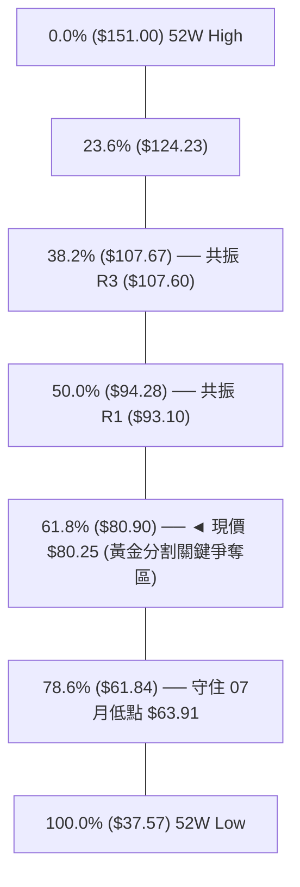

- **位置解讀**：現價 **$80.25** 精準落在 **61.8% ($80.90)** 黃金分割回撤位附近。
- **技術意義**：在經典技術分析中，強勢牛市回檔的極限通常位於 61.8% 水準。RKLB 在 2026-07 跌破此位至 $63.91 觸及 78.6% ($61.84) 獲得強烈承接後迅速拉回並重返 61.8% ($80.90) 之上，確認該次回撤為**假跌破真洗盤**，黃金分割支撐確認有效。

---

## 5. 技術指標深度解讀

### 🎛️ 指標訊號總覽

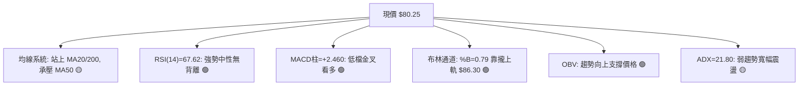

### 📈 移動平均線排列分析

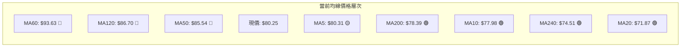

| 均線名稱 | 當前價格 | 與現價距離 | 排列狀態 | 走勢與技術意涵 |
|----------|----------|------------|----------|----------------|
| **MA 5** | $80.31 | -0.08% | 🟡 走平 | 超短線微幅貼合現價，短線橫盤整理 |
| **MA 10** | $77.98 | +2.91% | 🟢 向上 | 短天期均線加速向上穿越，提供短線下檔支撐 |
| **MA 20** | $71.87 | +11.66% | 🟢 向上 | 20日線自低檔翻揚，確立月線級別多頭走勢 |
| **MA 50** | $85.54 | -6.18% | 🔴 下行 | 季線仍處於下行趨勢，為當前多頭反彈主要阻力位 |
| **MA 200** | $78.39 | +2.37% | 🟢 走平 | 成功收復年線，多空分水嶺重新回到多方手中 |
| **均線排列判定** | **混合排列** | — | 🟡 | 長短期均線多空交織，行情呈現**區間震盪築底**特徵 |

### 📉 RSI(14) 分析

- **當前數值**：**67.62**
- **強度進度條**：`█████████████░░░░░░░ 67.62%`
- **超買超賣判斷**：處於 50–70 強勢多頭控盤區，尚未進入 >70 極端超買區。
- **背離分析**：
  - 2026-07-26 最低價 $63.91 時 RSI 達 15.6（嚴重超賣）；
  - 2026-08-02 次低價 $64.95 時 RSI 提升至 36.5（底部墊高）；
  - 隨後價格突破 $80.25，RSI 同步推升至 67.62，形成標準的**價漲指標升**健康多頭格局。
  - **結論：無頂背離現象，底背離修復完成**。

### 📊 MACD(12/26/9) 訊號解讀

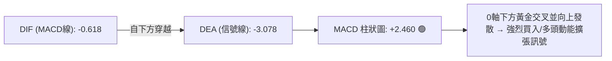

- **MACD 數值**：-0.618
- **Signal 線**：-3.078
- **柱狀圖 (Histogram)**：**+2.460**（連續多週正值擴大）
- **動能評估**：MACD 在零軸下方完成深層金叉，柱狀圖顯著放大，表明中線空頭拋壓已被多頭扭轉，反彈動能充沛。

### 📦 布林通道分析

```
布林通道 (20, 2) 空間分布示意圖：
┌─────────────────────────────────────────────────────────┐
│ $86.30 ═══════════════════════════════ 布林上軌 (阻力)  │
│                                       ▲                 │
│ $80.25 ───────────────────────────────● 現價 (%B: 0.79) │
│                                                         │
│ $71.87 ─────────────────────────────── 布林中軌 (MA20)  │
│                                                         │
│ $57.43 ═══════════════════════════════ 布林下軌 (支撐)  │
└─────────────────────────────────────────────────────────┘
```

- **布林帶寬度**：($86.30 - $57.43) / $71.87 = 40.17%，開口自前期擴張後開始微幅收斂。
- **現價位置 (%B)**：**0.79**（處於中軌至上軌的上半強勢通道中）。
- **走勢解讀**：價格貼近上軌運行，顯示短線動能強勁，但由於接近上軌 $86.30（且共振 MA50 $85.54），短線容易在上軌遭遇壓制進行回踩。

### 💹 成交量分析（量價配合度）

- **最新成交量**：13,855,300 股
- **20日均量**：19,322,485 股（量比：**0.72x**）
- **週量變化**：2026-08-16 週成交量回升至 112,201,900 股，較前一週 (96.69M) 增長 +16.03%。
- **OBV 能量潮趨勢**：**OBV > MA(OBV)**，能量潮維持向上走勢，確認資金在 $65–$80 區間呈現持續淨流入（Accumulation），量能結構有效支撐價格走勢。

---

## 6. 動能與波動率

### ⚡ 動能評估

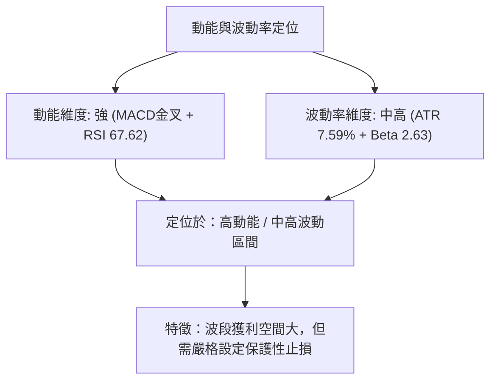

| 維度象限 | 動能狀態 | 波動率狀態 | 當前符合度 | 操作指引 |
|----------|----------|------------|------------|----------|
| **象限 I** | 強動能 (RSI>60, MACD>0) | 低波動 (ATR%<4%) | ── | 穩健突破加碼區 |
| **象限 II** | 弱動能 (RSI<40, MACD<0) | 低波動 (ATR%<4%) | ── | 築底觀望區 |
| **象限 III** | **強動能 (RSI>60, MACD>0)** | **高波動 (ATR%>7%)** | **✓ 當前狀態** | **波段交易最佳進場區（需寬止損防震盪）** |
| **象限 IV** | 弱動能 (RSI<40, MACD<0) | 高波動 (ATR%>7%) | ── | 高風險恐慌拋售區（嚴禁做多） |

### 📊 ATR 波動率分析

- **當前 ATR(14)**：**$6.09**
- **ATR 佔比**：$6.09 / $80.25 = **7.59%**
- **風控參數設置**：
  - **超短線日間噪音過濾**：1.0 × ATR = $6.09
  - **波段保護性止損緩衝**：1.5 × ATR = **$9.14**
  - **進場止損參考點**：現價 $80.25 - $9.14 = **$71.11**（剛好保護在 MA20 $71.87 與 S2 $73.99 之下）。

### 📐 Beta 與市場相關性

- **Beta 係數**：**2.629**
- **特性分析**：RKLB 屬於極高彈性（High-Beta）的成長型太空軍工股，其波動幅度為大盤（標普500指數）的 2.63 倍。在市場風險偏好上升（Risk-on）時期將展現極強的超額爆發力（Alpha），但在市場回調時亦面臨較大回撤壓力。

---

## 7. 多時框架總結

### 📋 時框架評分表

| 時框架 | 趨勢方向 | 動能狀態 | 均線排列 | 形態結構 | 綜合評分 | 交易指引 |
|--------|----------|----------|----------|----------|----------|----------|
| **長期 (月線)** | 🟢 多頭推升 | 🟢 強勁 | 🟢 多頭 (MA200之上) | 24個月大級別主升段回檔 | **80/100** | 逢回檔分批長線佈局 |
| **中期 (週線)** | 🟡 寬幅震盪 | 🟢 金叉發散 | 🟡 混合整理 | 雙重底 (W底) 構築中 | **65/100** | 區間下沿做多，上沿止盈 |
| **短期 (日線)** | 🟢 反彈推升 | 🟢 強勢 | 🟢 站上 MA20/MA200 | 突破後回踩 S1 $80.00 | **70/100** | 守穩 $80.00 積極做多 |

### 🔲 綜合訊號矩陣

```
╔══════════════════════════════════════════════════════════════╗
║                   多時框訊號共振矩陣                         ║
╠═════════════╦══════════════╦══════════════╦══════════════════╣
║ 觀察維度    ║ 短期 (日線)  ║ 中期 (週線)  ║ 長期 (月線)      ║
╠═════════════╬══════════════╬══════════════╬══════════════════╣
║ 趨勢方向    ║ 🟢 偏多向上  ║ 🟡 寬幅震盪  ║ 🟢 牛市結構      ║
║ 均線支撐    ║ 🟢 MA200之上 ║ 🟡 MA50之下  ║ 🟢 遠高於MA240   ║
║ 動能指標    ║ 🟢 MACD金叉  ║ 🟢 柱狀轉正  ║ 🟡 RSI 67.62     ║
║ 量價關係    ║ 🟡 量能稍縮  ║ 🟢 OBV向上   ║ 🟢 底部放量      ║
╠═════════════╬══════════════╬══════════════╬══════════════════╣
║ 時框收斂評級║ 🟢 短期偏多  ║ 🟡 中期蓄勢  ║ 🟢 長期看好      ║
╚═════════════╩══════════════╩══════════════╩══════════════════╝
```

### ⚖️ 多時框收斂結論

依據多時框收斂優先級規則：
1. **行情性質判定**：當前 ADX(14) = **21.80 (< 25)**，表明市場當前處於**中期盤整築底行情**，而非單邊強趨勢行情。
2. **主導維度與取捨**：依規則，在 ADX < 25 的震盪行情中，日線布林通道上下軌 ($57.43 - $86.30) 為主要交易邊界，輔以週線雙底頸線與均線作為關鍵支撐/阻力。
3. **唯一方向性結論**：**【偏多震盪 (買入)】**。
   - 長期多頭架構完好，日線 MACD 金叉且站穩 MA200 ($78.39) 與 S1 ($80.00)。短期回調為進場良機，目標向上挑戰布林上軌 ($86.30) 及阻力位 R1 ($93.10)。

---

## 8. 交易策略建議

### 🗺️ 策略決策流程圖

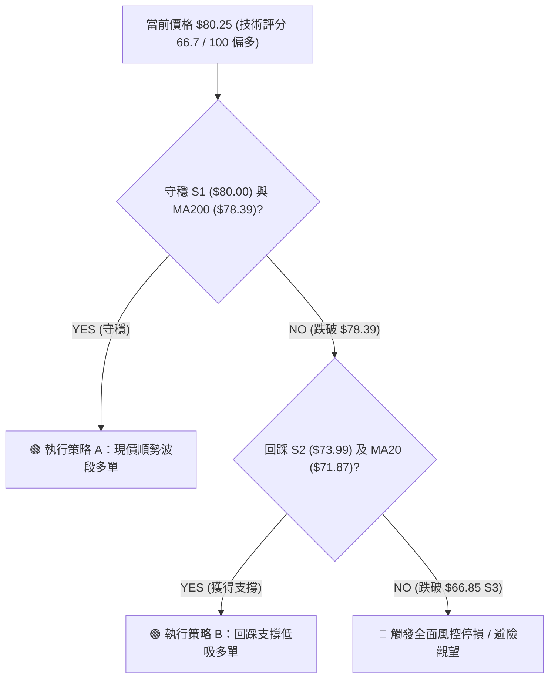

### 🧭 策略路由

> **當前主策略方向 = 偏多操作（依綜合評分 66.7/100，評分 ≥ 60 確立主推多頭策略）**

### 🎯 價格情境階梯（Price Scenarios）

| 觸發條件 | 下一目標 | 後續延伸 | 情境技術含義 |
|----------|----------|----------|--------------|
| **向上突破 MA50 ($85.54) / 布林上軌 ($86.30)** | **R1: $93.10** | **R2: $99.58** | 突破中期壓制，啟動雙底量度目標主升浪 |
| **維持在 $80.00 (S1) ~ $85.54 區間** | — | — | 消化 MA50 解套賣壓，健康橫盤蓄勢 |
| **跌破 S1 ($80.00) / MA200 ($78.39)** | **S2: $73.99** | **S3: $66.85** | 回測日線布林中軌 MA20 ($71.87)，尋求二次築底 |

### 📊 情境機率分佈

| 情境劇本 | 發生機率 | 主要技術依據 |
|----------|----------|--------------|
| **情境一：震盪上行挑戰 R1 / R2** | **60%** | MACD 柱狀圖 (+2.460) 持續擴張，OBV 呈吸籌走勢，站穩 MA200 ($78.39) |
| **情境二：在 S1 與 MA50 間窄幅震盪** | **25%** | ADX = 21.80 顯示趨勢動能偏弱，日成交量 (量比 0.72x) 尚待補量 |
| **情境三：跌破 S1 深幅回踩 S2 / S3** | **15%** | 高 Beta (2.63) 屬性下若遇大盤系統性回檔，跌破 MA200 觸發技術停損 |

### 🟢 主策略詳情（多頭進場方案）

| 策略要素 | 策略 A：現價突破回踩買入 (激進/標準) | 策略 B：回調支撐低吸買入 (穩健/右側) |
|----------|-------------------------------------|-------------------------------------|
| **進場條件** | 現價 $80.25 守穩 S1 ($80.00) 且 MACD 維持金叉 | 價格回踩 S2 ($73.99) 至 MA20 ($71.87) 止跌企穩 |
| **進場價格** | **$80.25** (現價或 $80.00 附近) | **$73.99** (S2 強支撐位) |
| **目標價 T1** | **$93.10** (阻力位 R1，潛在漲幅 +16.01%) | **$85.54** (MA50 均線，潛在漲幅 +15.61%) |
| **目標價 T2** | **$99.58** (阻力位 R2，潛在漲幅 +24.09%) | **$93.10** (阻力位 R1，潛在漲幅 +25.83%) |
| **止損價格** | **$73.99** (嚴格設於 S2 處，風險 -7.80%) | **$66.85** (嚴格設於 S3 處，風險 -9.65%) |
| **風險報酬比** | **2.05 : 1** (目標 T1) / **3.09 : 1** (目標 T2) | **1.62 : 1** (目標 T1) / **2.68 : 1** (目標 T2) |
| **成功機率** | **65%** | **75%** |
| **建議倉位** | **10% - 15%** 總投資資金 | **15% - 20%** 總投資資金 |

### 🔴 反向風險觸發點（對沖與風控提示）

若出現以下訊號，多頭邏輯即刻失效，應嚴格執行減倉或反手避險：
1. **關鍵價位跌破**：收盤價連續 2 日跌破 **MA200 ($78.39)** 與 **S1 ($80.00)**，預示回踩深度加劇。
2. **結構破位點**：若放量摜破 **S2 ($73.99)** 及 **MA20 ($71.87)**，宣告反彈失敗，將直測 **S3 ($66.85)**。
3. **指標翻空**：MACD 柱狀圖快速收斂並於 0 軸下方死亡交叉，RSI 跌破 50 中軸。

### ⭐ 整體訊號強度評星

```
做多訊號強度：★★★★☆  (4/5星) ── 底部形態清晰，均線與動能指標偏多
做空訊號強度：★☆☆☆☆  (1/5星) ── 拋壓已大幅釋放，空頭動能衰退
整體可信度：  ★★★★☆  (4/5星) ── 數據共振良好，量價結構吻合
```

---

## 9. 風險提示與監控

### ✅ 關鍵監控指標 Checklist

```
╔══════════════════════════════════════════════════════════════╗
║               RKLB 每日交易監控 Checklist                    ║
╠══════════════════════════════════════════════════════════════╣
║ [ ] 價格能否持續收在 S1 ($80.00) 與 MA200 ($78.39) 之上？       ║
║ [ ] 上攻 MA50 ($85.54) 時日成交量能否突破 20MA 均量 (19.32M)？ ║
║ [ ] RSI(14) 突破 70 時是否出現頂背離或鈍化現象？             ║
║ [ ] MACD 柱狀圖是否持續維持在正值區間 (+2.460 以上)？         ║
║ [ ] ADX 是否開始從 21.80 向上突破 25，確認單邊趨勢成型？     ║
║ [ ] 布林上軌 ($86.30) 是否順利向上開口打開上行空間？         ║
╚══════════════════════════════════════════════════════════════╝
```

### ⚠️ 風險場景分析

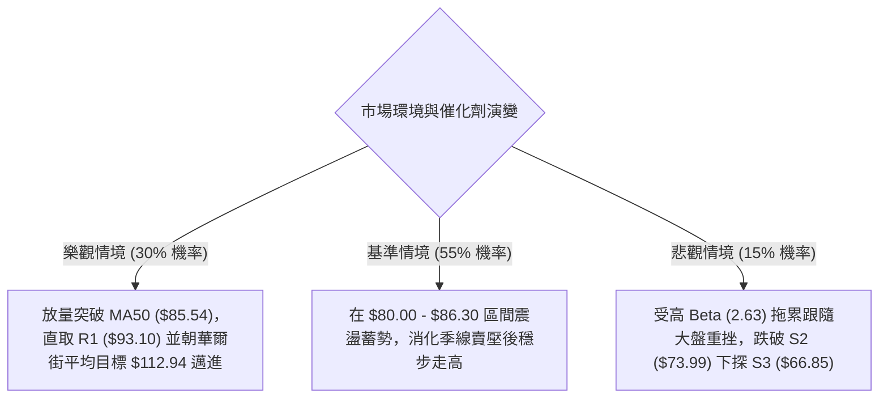

### 🛡️ 風險管理重要提醒

1. **極高 Beta 波動控制**：RKLB Beta 高達 **2.629**，ATR 佔比達 **7.59%**（每日正常震盪空間即達 $6.09）。單筆交易最大虧損嚴格控制在總賬戶資產的 **1.0% - 1.5%** 以內，避免重倉單一標的。
2. **分批建倉與金字塔加碼原則**：
   - 首次進場（現價 $80.25）：建立 **50%** 基礎多頭倉位；
   - 確認放量突破 MA50 ($85.54) 並收穩後：加碼剩餘 **50%** 倉位；
   - 嚴禁在跌破止損點時進行逆勢加碼攤平。
3. **動態移動止損（Trailing Stop）**：當價格達成第一目標價 **R1 ($93.10)** 後，即刻將止損點上移至**保本進場價 ($80.25)**，鎖定無風險交易利潤。

---

## 📋 報告總結

```
╔══════════════════════════════════════════════════════════════════╗
║                   RKLB 技術分析報告總結                         ║
╠══════════════════════════════════════════════════════════════════╣
║ 報告日期：2026-08-16                                            ║
║ 當前價格：$80.25                                                ║
║ 分析評級：🟢 偏多震盪（逢低做多）                               ║
║                                                                  ║
║ 關鍵結論：                                                       ║
║ ├─ 長期趨勢：🟢 偏多（月線級別自歷史高點回調後完成築底）         ║
║ ├─ 中期趨勢：🟡 震盪（ADX=21.80，週線雙底成型蓄勢挑戰 MA50）    ║
║ ├─ 短期趨勢：🟢 偏多（站穩 MA200 $78.39，MACD 柱狀擴張 +2.460） ║
║ ├─ 關鍵支撐：S1 $80.00 ｜ S2 $73.99 ｜ S3 $66.85                 ║
║ ├─ 關鍵阻力：MA50 $85.54 ｜ R1 $93.10 ｜ R2 $99.58 ｜ R3 $107.60 ║
║ └─ 分析師共識目標：$112.94（覆蓋17位分析師，最高 $150.00）      ║
║                                                                  ║
║ 最優策略組合：                                                   ║
║ 1. 🥇 最佳機會：現價 $80.25 建立多單，止損 $73.99，目標 $93.10  ║
║ 2. 🥈 次選機會：突破 MA50 $85.54 後右側追價加碼，目標 $99.58    ║
║ 3. 🥉 保守選擇：回踩 S2 $73.99 逢低掛單低吸，止損 $66.85        ║
╚══════════════════════════════════════════════════════════════════╝
```

---

> ⚠️ **免責聲明**：本報告為 AI 自動生成之技術分析，所有數據及估算均基於提供的歷史價格與市場公開資訊。本報告**僅供研究與學術參考**，**不構成任何形式的投資建議、買賣要約或獲利保證**。金融市場投資具有極高風險，投資人應獨立評估風險，並自負盈虧。

---

*報告生成時間：2026-08-16 ｜ 數據來源：Yahoo Finance ｜ 分析框架：多時框技術分析體系*