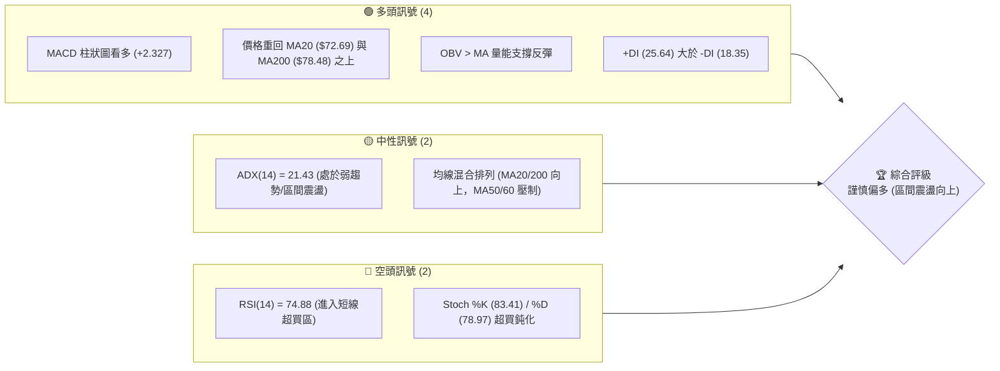
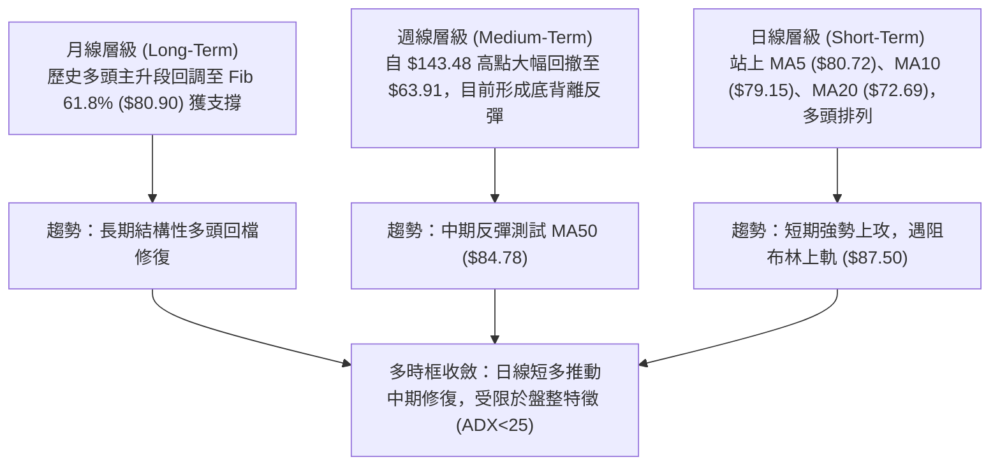
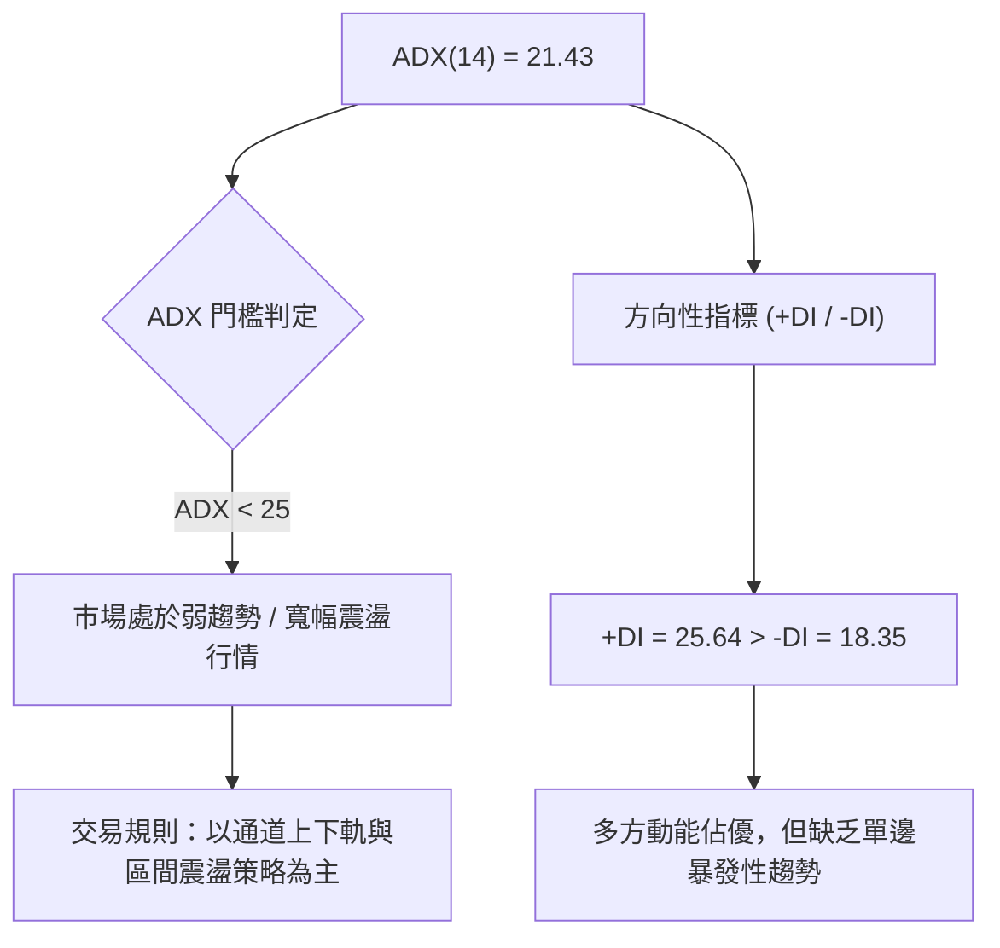
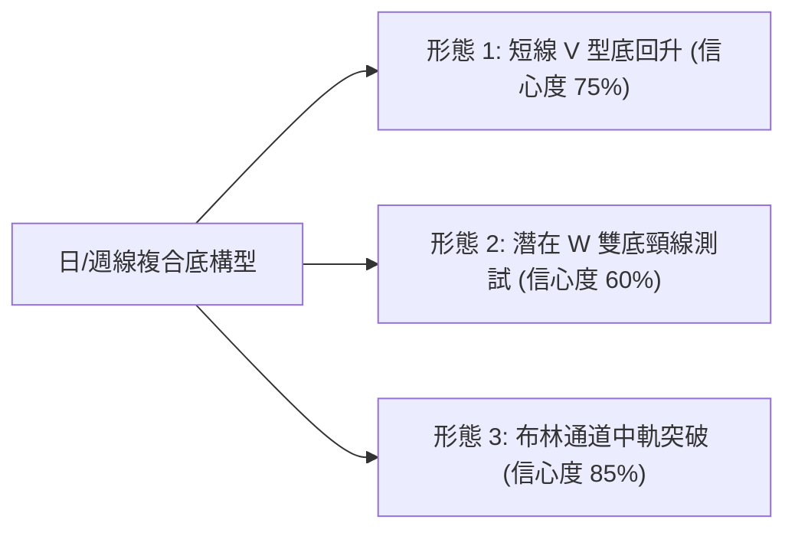
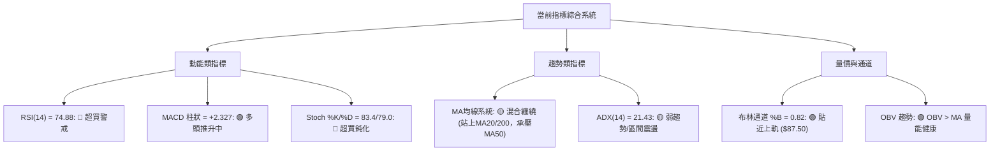
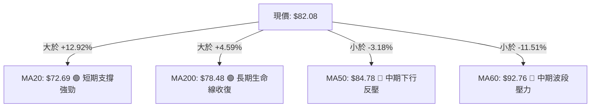
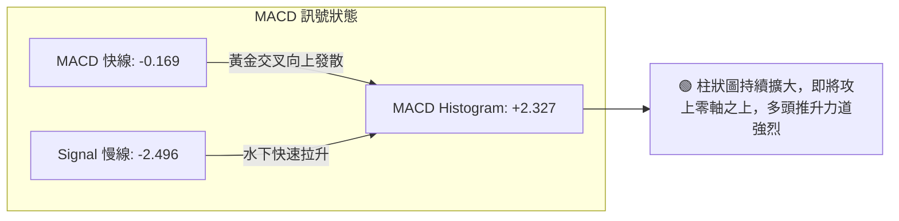
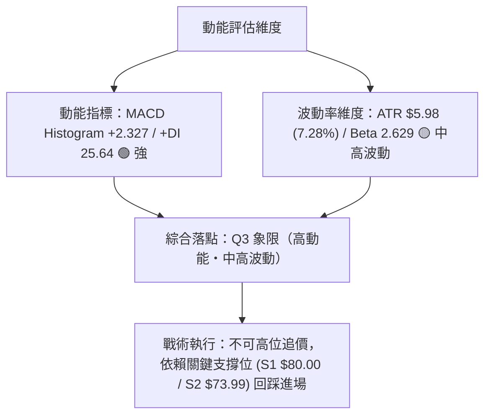
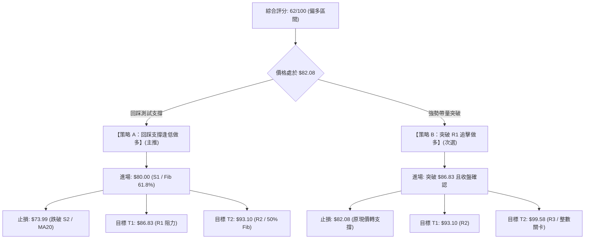
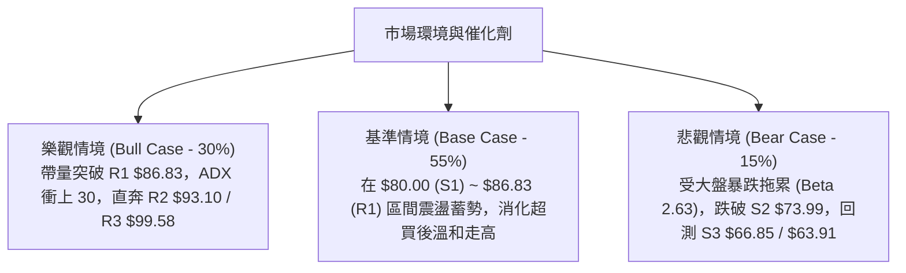

# RKLB 技術分析報告

> **報告日期**：2026-08-17 ｜ **語言**：繁體中文 ｜ **數據來源**：Yahoo Finance ｜ **當前價格**：$82.08

---

## 目錄

| 章節 | 內容 |
|------|------|
| [1. 技術面概覽](#1-技術面概覽) | 訊號儀表板、核心指標、評分卡 |
| [2. 趨勢分析](#2-趨勢分析) | 多時框趨勢、長中短期走勢 |
| [3. 圖表形態分析](#3-圖表形態分析) | 形態識別、K線組合、目標價 |
| [4. 支撐與阻力](#4-支撐與阻力) | 關鍵價位、斐波那契回調 |
| [5. 技術指標深度解讀](#5-技術指標深度解讀) | MA/RSI/MACD/布林/成交量 |
| [6. 動能與波動率](#6-動能與波動率) | 動能評估、ATR、Beta |
| [7. 多時框架總結](#7-多時框架總結) | 時框架評分矩陣 |
| [8. 交易策略建議](#8-交易策略建議) | 多空策略、風險報酬比 |
| [9. 風險提示與監控](#9-風險提示與監控) | 監控指標、風險場景 |
| [10. 報告總結](#10-報告總結) | 核心總結與策略精華 |

---

## 1. 技術面概覽

### 🎯 技術訊號儀表板



### 📊 核心指標速覽表

| 指標類別 | 指標名稱 | 當前數值 | 訊號 | 解讀 |
|----------|----------|----------|------|------|
| **價格** | 當前價格 | $82.08 | 🟢 | 位於52週區間 39.2%，脫離 $63.91 低點強勁反彈 |
| **均線** | MA20 | $72.69 | 🟢 | 價格在MA20上方 +12.92%，短線修復動能充沛 |
| **均線** | MA50 | $84.78 | 🔴 | 價格在MA50下方 -3.18%，面臨中期趨勢壓制線 |
| **均線** | MA200 | $78.48 | 🟢 | 價格在MA200上方 +4.59%，長線多空分水嶺收復 |
| **動能** | RSI(14) | 74.88 | 🔴 | 進入超買區間（>70），短線追高風險加大 |
| **動能** | MACD | -0.169 (柱 +2.327) | 🟢 | 快線即將穿越零軸，柱狀圖持續擴大，動能偏多 |
| **趨勢** | ADX(14) | 21.43 | 🟡 | 數值低於 25，屬於弱趨勢盤整反彈行情 |
| **波動** | ATR(14) | $5.98 | 🟡 | 佔價格 7.28%，屬於中高波動性成長股 |

### 🏆 技術評分卡

```
╔══════════════════════════════════════════════════════════════════╗
║                   技術評分卡 — RKLB (2026-08-17)                  ║
╠══════════════════════════════════════════════════════════════════╣
║ 趨勢強度 (ADX=21.4)     ██████████░░░░░░░░░░  52/100  🟡 中性盤整 ║
║ 動能指標 (MACD/RSI)     ██████████████░░░░░░  68/100  🟢 動能偏多 ║
║ 支撐穩定度 (S1/Fib61.8) ████████████████░░░░  78/100  🟢 底部支撐 ║
║ 成交量配合 (OBV>MA)     ████████████░░░░░░░░  62/100  🟢 量價溫和 ║
║ 形態完整度 (V型/雙底)   ████████████░░░░░░░░  60/100  🟡 構築頸線 ║
║ 均線排列 (混合纏繞)     ██████████░░░░░░░░░░  50/100  🟡 多空交戰 ║
╠══════════════════════════════════════════════════════════════════╣
║ 綜合技術評分            █████████████░░░░░░░  62/100  🟢 謹慎偏多 ║
╚══════════════════════════════════════════════════════════════════╝
```

---

## 2. 趨勢分析

### 🌐 多時框趨勢分析



### 📈 長期趨勢 — 12個月走勢圖（Unicode）

```
RKLB 月線走勢圖（過去12個月：2025-09 至 2026-08）
價格軸 ($)
$150 ┤                                  ● $143.48 (2026-05)
$130 ┤                                 / \
$110 ┤                                /   ● $101.65 (2026-06)
 $90 ┤                      ● $80.07 /     \
 $80 ┤               ● $69.76  \    /       \        ● $82.08 (現價)
 $70 ┤        ● $62.98  \       \  ● $64.22  \      /
 $60 ┤         /         \       \             ● $64.95 (2026-07)
 $50 ┤ ● $48.60           ● $42.14
     └───────────────────────────────────────────────────────────
        09  10  11  12  01  02  03  04  05  06  07  08 (月份)
```

**走勢特徵分析表格**：

| 階段 | 期間 | 起訖價格 | 漲跌幅 | 核心技術特徵 |
|------|------|----------|--------|--------------|
| **第 1 階段：主升推動** | 2025-09 ~ 2026-01 | $47.91 → $80.07 | +67.13% | 突破整理區間，呈現階梯式階梯上揚 |
| **第 2 階段：高位蓄勢** | 2026-01 ~ 2026-04 | $80.07 → $82.51 | +3.05%  | $64.22~$82.51 寬幅箱型洗盤，洗淨浮額 |
| **第 3 階段：噴發派發** | 2026-04 ~ 2026-05 | $82.51 → $143.48| +73.89% | 爆量突破歷史新高，觸發 52W 高點 $151.00 後快速反轉 |
| **第 4 階段：深幅回撤** | 2026-05 ~ 2026-07 | $143.48 → $64.95| -54.73% | 均線空頭排列，週線連收黑K，直探 78.6% 回調位 |
| **第 5 階段：低檔復甦** | 2026-07 ~ 2026-08 | $64.95 → $82.08 | +26.37% | 於 61.8% 斐波那契位 ($80.90) 附近震盪回升 |

### 📊 中期趨勢（週線分析）

```
週線關鍵攻防示意圖：
  $99.58 ─── R3 (前波反彈高點聚類)
  $93.10 ─── R2 / 斐波那契 50.0% ($94.28) 壓制帶
  $86.83 ─── R1 / MA120 ($86.80) / BB上軌 ($87.50)
  $84.78 ─── 中期關鍵壓力：MA50 下降反壓
 ────────────────────────────────────────────────────────── ◄ 現價 $82.08
  $80.90 ─── 斐波那契 61.8% 回調位 / S1 支撐帶 ($80.00)
  $73.99 ─── S2 (MA20 $72.69 / MA240 $74.64 支撐平台)
  $66.85 ─── S3 / 2026-07 探底低點 ($63.91~$64.95)
```

### ⚡ 趨勢強度評估（ADX 解讀）



| 指標變數 | 當前數值 | 門檻區間 | 趨勢判定 | 策略指導 |
|----------|----------|----------|----------|----------|
| **ADX** | **21.43** | < 25.0 | 弱趨勢 / 盤整 | 避免單邊追高，適合區間高拋低吸或回踩逢低佈局 |
| **+DI** | **25.64** | 基準線 | 多頭掌控短線節奏 | 多方佔據主動權，逢拉回支撐可尋找買點 |
| **-DI** | **18.35** | 基準線 | 空頭動能衰退 | 空方下殺動能已大幅削弱 |

---

## 3. 圖表形態分析

### 🔍 形態識別系統



| 形態名稱 | 信心度 | 判斷依據（引用數據） | 完成度 | 目標價（附計算式） |
|----------|--------|----------------------|--------|--------------------|
| **短線 V 型強反彈** | 75% | 自 2026-07-26 低點 $63.91 直拉至現價 $82.08，連續 3 週收陽 | 85% | 測幅低點 $63.91 至突破點 $73.99 (S2) 高度 $10.08，向上等幅推算：$73.99 + $10.08 = **$84.07**（已接近達成） |
| **中期潛在雙底 (W-Bottom)** | 60% | 第一次低點 2026-03 ($64.22)，第二次低點 2026-07 ($63.91)，頸線為 2026-04 ($82.51) | 70% | 頸線 $82.51 + 形態高度 ($82.51 - $63.91 = $18.60) = **$101.11**（需帶量確認突破 R1 $86.83） |
| **均線與通道突破** | 85% | 突破 MA20 ($72.69) 與 MA200 ($78.48)，BB %B 達 0.82 | 90% | 布林上軌測試目標 = **$87.50** |

### 🕯️ 重要K線形態分析

| 月份 | 收盤價 | K線形態 | 解讀 | 訊號 |
|------|--------|---------|------|------|
| **2026-05** | $143.48 | 長上影大陽線（天花板天線） | 衝高至 $151.00 後獲利了結盤湧出，主力出貨信號 | 🔴 強烈見頂 |
| **2026-06** | $101.65 | 大陰線破位 | 跌破短期均線，確認中期下行走勢確立 | 🔴 空頭下殺 |
| **2026-07** | $64.95 | 長下影錘頭線（下影探至 $63.91） | 空頭動能耗盡，長下影線確認長期斐波那契支撐有效 | 🟢 觸底回升 |
| **2026-08 (進行中)** | $82.08 | 大陽實體吞噬線 | 連續收復 7 月跌幅，實體覆蓋前月，多頭重掌短線主導權 | 🟢 強勢反轉 |

### 📉 ASCII 走勢形態示意圖

```
中期走勢形態結構示意：
$151.00 ────────────── 頂部天花板 (52W High)
                      \
                       \
                        \
                         \
$86.83 ───────────────────\────── 阻力 R1 (頸線壓力區間)
                           \     /▲ 現價 $82.08
$73.99 ─────────────────────\───/── 支撐 S2 / 中軌 $72.69
                             \ /
$63.91 ───────────────────────●──── 底點 2 (2026-07 低點 $63.91 / 03月 $64.22)
                              雙底 (W-Bottom) 結構
```

### 🎯 形態目標價計算

1. **短線阻力位測試**：
   - 形態突破第一道強阻力 R1：**$86.83**（距離現價 +5.79%）。
2. **中期雙底完全形態測幅**：
   - 雙底底部基準點：$63.91。
   - 雙底頸線確認位：2026-04 高點 $82.51。
   - 形態垂直高度：$82.51 - $63.91 = $18.60。
   - 形態量度目標價：$82.51 + $18.60 = **$101.11**（與 R3 $99.58 及 2026-06 月線平台聚類）。

---

## 4. 支撐與阻力

### 🗺️ 關鍵價位分布圖（Unicode）

```
RKLB 價位結構分布圖
══════════════════════════════════════════════════════════════════
$151.00 ║████████████████████████████████║ 52週歷史高點 (0.0% Fib)
$107.67 ║████████████████████████        ║ 38.2% 斐波那契阻力帶
$99.58  ║████████████████████            ║ 強阻力 R3 (波段高點聚類)
$93.10  ║████████████████                ║ 阻力 R2 / 50.0% Fib ($94.28)
$86.83  ║████████████████████████        ║ 關鍵阻力 R1 / BB上軌 ($87.50)
$82.08  ╠════════════════════════════════╣ ◄ 當前市價 ($82.08)
$80.90  ║▓▓▓▓▓▓▓▓▓▓▓▓▓▓▓▓▓▓▓▓▓▓▓▓▓▓▓▓    ║ 61.8% Fib / 近期支撐 S1 ($80.00)
$73.99  ║████████████████████████████    ║ 強支撐 S2 / MA20 ($72.69)
$66.85  ║████████████████████████████████║ 關鍵防線 S3 (波段低點聚類)
$37.57  ║████████████████████████████████║ 52週歷史低點 (100.0% Fib)
══════════════════════════════════════════════════════════════════
```

### 🚧 阻力位分析表

| 阻力級別 | 價位 | 形成原因 | 突破難度 | 重要性 |
|----------|------|----------|----------|--------|
| **R1** | **$86.83** | 近一年波段高點聚類、MA120 ($86.80) 匯聚、布林上軌 ($87.50) 重合處 | 中等 | ⭐⭐⭐⭐ (短線多空分水嶺) |
| **R2** | **$93.10** | MA60 均線壓力 ($92.76) 與 50.0% 斐波那契回調位 ($94.28) 密集區 | 高 | ⭐⭐⭐ (中期反彈核心考驗) |
| **R3** | **$99.58** | 心理整數位 $100.00 前哨、近一年波段高點聚類、W底測幅延伸帶 | 極高 | ⭐⭐⭐⭐⭐ (多頭波段完全修復點) |

### 🛡️ 支撐位分析表

| 支撐級別 | 價位 | 形成原因 | 守住機率 | 重要性 |
|----------|------|----------|----------|--------|
| **S1** | **$80.00** | 近一年波段低點聚類、整數心理關卡、61.8% Fib 回調位 ($80.90) | 75% | ⭐⭐⭐⭐ (短線多頭防守底線) |
| **S2** | **$73.99** | MA20 ($72.69) 與 MA240 ($74.64) 密集匯聚支撐區 | 85% | ⭐⭐⭐⭐⭐ (波段強支撐生命線) |
| **S3** | **$66.85** | 近一年波段低點聚類、7月築底平台 ($63.91~$64.95) 上方邊界 | 92% | ⭐⭐⭐⭐⭐ (長線多空生死防線) |

### 📐 斐波那契回調位分析

*基準區間：52週最高價 $151.00 → 52週最低價 $37.57，總垂直價差 $113.43*

| 斐波那契比例 | 關鍵價位 | 技術含義解讀 | 現價相對位置 |
|--------------|----------|--------------|--------------|
| **0.0%** (高點) | **$151.00** | 歷史極限天花板，頂部派發套牢區 | 上方 +83.97% |
| **23.6%** | **$124.23** | 強勢回調目標位，多頭強勢進攻防線 | 上方 +51.35% |
| **38.2%** | **$107.67** | 弱勢反彈極限，前波跳空平台 | 上方 +31.18% |
| **50.0%** | **$94.28** | 多空力量均衡點，緊鄰 R2 ($93.10) | 上方 +14.86% |
| **61.8%** | **$80.90** | **黃金分割關鍵支撐**（黃金回調位） | **現價剛好站穩此位上方 (+1.46%)** |
| **78.6%** | **$61.84** | 深幅修正極限，緊鄰 7 月低點 $63.91 | 下方 -24.66% |
| **100.0%** (低點) | **$37.57** | 52週歷史起漲點 | 下方 -54.23% |

> **解讀**：現價 $82.08 精確落於 **61.8% ($80.90)** 與 **50.0% ($94.28)** 之間。在技術分析中，自高點回撤至 61.8% 處企穩並重新站上，代表本次由 $151.00 至 $63.91 的修正波已完成結構性支撐確認，具備向上挑戰 50.0% ($94.28) 的技術條件。

---

## 5. 技術指標深度解讀

### 🎛️ 指標訊號總覽



### 📈 移動平均線排列分析



- **短均線系統**：MA5 ($80.72) > MA10 ($79.15) > MA20 ($72.69)，短線多頭發散，上攻動能完好。
- **長均線系統**：現價重新站上 MA200 ($78.48) 與 MA240 ($74.64)，排除了中長期崩跌轉為熊市的風險。
- **中期障礙**：MA50 ($84.78) 與 MA60 ($92.76) 呈下行斜率，價格需帶量突破 MA50 才能將均線架構完全由「混合纏繞」扭轉為「多頭排列」。

### 📉 RSI(14) 分析

```
RSI(14) 水平儀錶：
0 ══════════ 30 ══════════════ 50 ══════════════ 70 ════ 74.88 ══ 100
[   超賣區   ] [         中性區間         ] [ 超買區 ] ▲ 當前位置
████████████████████████████████████████████████████████░░░░░░ (74.88%)
```

- **超買超賣評估**：RSI 達 **74.88**，已進入 >70 的超買區間。歷史經驗顯示，RKLB 在無連續暴量推動下，RSI > 75 易引發 3~5 日的乖離修正。
- **背離分析**：
  - **頂背離**：無頂背離。近期價格自 $63.91 快速拉升，RSI 同步自 15.6（超賣極值）上衝至 74.88，指標強度完美配合價格，未出現價格創新高而指標走低的情況。
  - **底背離結論**：2026-07-26 價格探底 $63.91 時 RSI 僅 15.6，隨後 08-02 價格 $64.95 時 RSI 快速回升至 36.5，已成功完成日/週線級別之底背離確認，目前為底背離推動之主升行情。

### 📊 MACD(12/26/9) 訊號解讀



- **數值狀態**：DIF (-0.169) 與 DEA (-2.496) 在零軸下方形成強力黃金交叉，目前快線即將穿越零軸（0 水位），一旦穿越零軸，技術面將從「水下弱勢反彈」升級為「水上強勢主升」。
- **柱狀圖動能**：柱狀圖達 **+2.327**，連續 4 週擴張，顯示多頭動能尚未出現衰竭跡象。

### 📦 布林通道分析

```
布林通道 (20, 2) 結構圖：
$87.50 ─── 上軌 ────────────────────────────────────── (阻力區間)
          │                               ▲ 現價 $82.08 (%B = 0.82)
$72.69 ─── 中軌 (MA20) ─────────────────────────────── (核心支撐)
          │
$57.87 ─── 下軌 ────────────────────────────────────── (極限防線)
```

- **通道帶寬與位置**：上軌 $87.50，下軌 $57.87，中軌 $72.69。帶寬開口擴張，現價位於 **%B = 0.82**，處於中軌至上軌的上半部強勢進攻區。
- **走勢解讀**：現價正逐步向布林上軌 $87.50 靠攏。由於當前 ADX 為 21.43（盤整特徵），股價首次觸及布林上軌 $87.50~$86.83 (R1) 附近時，容易受到通道邊界壓制而出現短線回踩。

### 💹 成交量分析（量價配合度）

- **量比與均量**：最新單日成交量為 17,974,677 股，對比 20日均量 19,324,349 股，量比為 **0.93x**，呈現溫和量增推升格局。
- **OBV 趨勢**：數據顯示 `OBV > MA`，能量潮指標持續走在均線上方，表明自 $63.91 反彈以來的上漲屬於實質機構資金進場吸籌，而非單純的無量空拉，量價配合健康。

---

## 6. 動能與波動率

### ⚡ 動能評估

| 象限 | 動能維度 | 波動維度 | 歷史特徵 | 當前狀態判定 | 交易指引 |
|------|----------|----------|----------|--------------|----------|
| **Q1** | 強動能 (MACD+/RSI高) | 低/中波動 | 穩定單邊趨勢 | — | 順勢加碼持股 |
| **Q2** | 弱動能 | 低波動 | 窄幅橫盤整理 | — | 觀望等待方向 |
| **Q3** | **強動能 (MACD+2.32)** | **中高波動 (ATR 7.28%)** | **波段爆發反彈** | **✓ 當前 RKLB 處於此區間** | **控制部位，逢回做多，嚴守止損** |
| **Q4** | 弱動能 | 高波動 | 破位恐慌下殺 | — | 嚴禁抄底進場 |



### 📊 ATR 波動率分析

```
ATR(14) 波動區間評估：
當前價格：$82.08 ｜ ATR(14)：$5.98 ｜ 波動率佔比：7.28%
├─ 單日正常波動範圍：$76.10 ─── $82.08 ─── $88.06 (±1.0 ATR)
├─ 建議短線止損距離：1.5 × ATR = $8.97 ($82.08 - $8.97 = $73.11，貼合 S2 支撐)
└─ 建議波段防守距離：2.0 × ATR = $11.96 ($82.08 - $11.96 = $70.12)
```

### 📐 Beta 與市場相關性

- **Beta 係數**：**2.629**（高彈性/高 Beta 標的）。
- **解讀**：RKLB 對標普 500 指數與大盤科技股指數之敏感度極高。當大盤上漲 1% 時，RKLB 理論漲幅為 2.63%；反之大盤回檔時其跌幅亦為大盤之 2.63 倍。在操作上必須將大盤系統性風險納入風控考量，倉位規模應較低 Beta 股票適度縮減。

---

## 7. 多時框架總結

### 📋 時框架評分表

| 時框架 | 趨勢方向 | 動能狀態 | 均線排列 | 形態結構 | 綜合評分 | 戰術建議 |
|--------|----------|----------|----------|----------|----------|----------|
| **短期 (日線)** | 🟢 偏多上攻 | 🔴 短期超買 (RSI 74.8) | 🟢 站穩 MA5/10/20 | 🟢 V型反彈強勁 | **72/100** | 待回踩 S1 逢低做多 |
| **中期 (週線)** | 🟡 震盪築底 | 🟢 MACD柱翻紅 (+2.32) | 🟡 承壓 MA50 ($84.78) | 🟡 構築潛在雙底 | **60/100** | 關注 R1 ($86.83) 突破 |
| **長期 (月線)** | 🟢 結構多頭 | 🟡 高位回調企穩 | 🟢 站穩 MA200/Fib61.8% | 🟢 守住主升波回撤底 | **65/100** | 中長線分批佈局 |

### 🔲 綜合訊號矩陣

```
時框訊號一致性交叉檢驗：
短期 (日線)：[ 多頭推升 ] ──┐
中期 (週線)：[ 區間震盪 ] ──┼──► 【收斂結果】：弱趨勢盤整向上行情 (ADX < 25)
長期 (月線)：[ 多頭回檔 ] ──┘     以「回踩支撐做多、阻力位部分停利」為主軸
```

### ⚖️ 多時框收斂結論

依據**多時框收斂規則**：
1. 當前 **ADX(14) = 21.43 (< 25)**，明確定義當前市場處於**盤整/修復型行情**，而非單邊流暢的大趨勢行情。
2. 在盤整格局下，日線級別的 RSI 超買（74.88）與布林上軌（$87.50）具有強烈壓制效果，不可直接追高。
3. **最終收斂方向**：**【謹慎偏多（區間震盪向上）】**。以中長線站穩 MA200 ($78.48) 與 61.8% 斐波那契位 ($80.90) 為依托，短線等待拉回 S1 ($80.00) 附近進行多頭佈局，向上博弈測試 R1 ($86.83) 與 R2 ($93.10)。此結論與第 8 章主推策略完全收斂一致。

---

## 8. 交易策略建議

### 🗺️ 策略決策流程圖



### 🧭 策略路由

> **當前主策略方向 = 【謹慎偏多做多策略】（依綜合評分 62/100，處於 ≥60 偏多區間）**  
> 短線 RSI(14) 進入 74.88 超買區，策略以「逢回踩支撐進場」為最高優先級，嚴禁高位追價。

### 🎯 價格情境階梯（Price Scenarios）

| 觸發條件 | 下一目標 | 後續延伸 | 情境含義與操作指引 |
|----------|----------|----------|--------------------|
| **強勢突破 R1 $86.83** | **R2 $93.10** | **R3 $99.58** | **短線轉強主升**：突破布林上軌與 MA120，啟動波段推升行情，觸發策略 B |
| **站穩 S1 $80.00 ~ 現價 $82.08** | **R1 $86.83** | **R2 $93.10** | **區間蓄勢震盪**：消化短線 RSI 超買賣壓，洗盤後伺機上攻，觸發策略 A |
| **失守 S1 跌破 S2 $73.99** | **S3 $66.85** | **$63.91 (前低)** | **中期轉弱破位**：跌破 MA20 生命線與上升趨勢，多頭策略全數止損離場 |

### 📊 情境機率分佈

| 情境類別 | 發生機率 | 主要技術依據 |
|----------|----------|--------------|
| **情境一：震盪向上反彈** | **60%** | MACD 柱狀圖翻紅 (+2.327)、站穩 MA200 ($78.48) 與 Fib 61.8% ($80.90)、OBV 量能支撐 |
| **情境二：箱型區間震盪** | **25%** | ADX(14) = 21.43 處於弱趨勢盤整、MA50 ($84.78) 壓制、RSI 超買需時間消化 |
| **情境三：深度回落探底** | **15%** | 遭遇 R1 ($86.83) 假突破反噬、高 Beta (2.63) 受大盤系統性回檔拖累 |

### 🟢 主策略詳情

| 策略要素 | 策略 A：支撐回踩低吸（最優） | 策略 B：突破確認追擊（次選） |
|----------|------------------------------|------------------------------|
| **適用場景** | 短線超買拉回，回測 S1 支撐確認企穩 | 買盤強勁直接放量長陽突破 R1 壓力線 |
| **進場價格** | **$80.00**（掛單於 S1 / Fib 61.8% 附近） | **$86.83**（日K收盤突破 R1 確認進場） |
| **止損價格** | **$73.99**（跌破 S2 / MA20 強支撐） | **$82.08**（跌回現價支撐線之下） |
| **目標價 T1** | **$86.83**（前高阻力 R1，預期獲利 +8.54%） | **$93.10**（50% Fib / R2，預期獲利 +7.22%） |
| **目標價 T2** | **$93.10**（MA60 / R2，預期獲利 +16.38%） | **$99.58**（波段阻力 R3，預期獲利 +14.68%） |
| **風險報酬比 (R:R)** | **1 : 2.18**（以 T2 計算：風險 $6.01 / 獲利 $13.10） | **1 : 1.95**（以 T2 計算：風險 $6.75 / 獲利 $12.75） |
| **成功機率** | **65%** | **55%** |
| **建議倉位** | **10% ~ 15% 總資金** | **5% ~ 8% 總資金**（突破加碼倉） |

### 🔴 反向風險觸發點（風控對沖提示）

若出現以下訊號，代表多頭主策略失效，應立即平倉多單或啟動避險對沖：
1. **關鍵支撐破位**：價格實體陰線收盤跌破 **S2 $73.99**（同時跌破 MA20 $72.69 與 MA240 $74.64）。
2. **動能翻空確認**：MACD 柱狀圖由正轉負（跌破 0 軸），且 RSI(14) 快速跌破 50 中軸。
3. **量價異常**：在 R1 $86.83 處出現單日換手爆量、長上影線射擊之星（Shooting Star）K線。

### ⭐ 整體訊號強度評星

```
╔══════════════════════════════════════════════════════════════════╗
║ 做多訊號強度：  ★★★★☆  (3.8/5星 — 結構偏多，但受制於超買與ADX) ║
║ 做空訊號強度：  ★☆☆☆☆  (1.2/5星 — 空頭下殺動能已耗盡)          ║
║ 整體訊號可信度：★★★★☆  (4.0/5星 — 均線與斐波那契高度共振)     ║
╚══════════════════════════════════════════════════════════════════╝
```

---

## 9. 風險提示與監控

### ✅ 關鍵監控指標 Checklist

```
╔══════════════════════════════════════════════════════════════════╗
║                     日常交易監控 CHECKLIST                        ║
╠══════════════════════════════════════════════════════════════════╣
║ [ ] 價格是否成功守住 S1 $80.00（61.8% 斐波那契關鍵防線）         ║
║ [ ] RSI(14) 是否在回調過程中於 50~60 區間獲得支撐並降溫         ║
║ [ ] 日成交量是否能維持在 20日均量 (19.32M) 之上配合推升          ║
║ [ ] 價格能否有效帶量實體突破 MA50 ($84.78) 與 R1 ($86.83)        ║
║ [ ] ADX(14) 是否能自 21.43 向上突破 25.0，展開單邊主升趨勢      ║
║ [ ] 止損單是否已嚴格預埋於 S2 $73.99 下方 ($73.50 附近)          ║
╚══════════════════════════════════════════════════════════════════╝
```

### ⚠️ 風險場景分析



### 🛡️ 風險管理重要提醒

1. **高 Beta 波動性控管**：
   - RKLB 的 Beta 值高達 **2.629**，且 ATR 達 **$5.98 (7.28%)**，屬於極高波動標的。單筆交易承受風險絕對不可超過總帳戶淨值的 **1.5% ~ 2.0%**。
2. **嚴禁盤中隨意追高**：
   - 當前 RSI 為 74.88，追高容易遭遇 1~2 個 ATR ($6~$12) 的劇烈盤中震盪洗盤，應堅持「不回踩、不進場」的紀律。
3. **基本面估值偏高風險**：
   - 公司目前 Forward P/E 高達 1641.6，P/S 達 68.2，且自由現金流為負 ($-251.96M)。技術面反彈主要由成長預期與資金面推動，若市場流動性收緊，高估值成長股易面臨劇烈殺估值風險，必須嚴格執行技術面止損。

---

## 10. 報告總結

```
╔══════════════════════════════════════════════════════════════════╗
║                     RKLB 技術分析報告總結                        ║
╠══════════════════════════════════════════════════════════════════╣
║ 報告日期：2026-08-17                                             ║
║ 當前價格：$82.08                                                 ║
║ 分析評級：🟢 謹慎偏多（區間震盪向上）                           ║
╠══════════════════════════════════════════════════════════════════╣
║ 關鍵結論：                                                       ║
║ ├─ 長期趨勢：🟢 多頭大架構回調完成，站穩 61.8% Fib ($80.90)     ║
║ ├─ 中期趨勢：🟡 構築雙底回升形態，面臨 MA50 ($84.78) 壓制       ║
║ ├─ 短期趨勢：🟢 站穩 MA20 ($72.69)，MACD 柱狀擴張 (+2.327)      ║
║ ├─ 關鍵支撐：S1 $80.00 ｜ S2 $73.99 ｜ S3 $66.85                ║
║ ├─ 關鍵阻力：R1 $86.83 ｜ R2 $93.10 ｜ R3 $99.58                ║
║ └─ 華爾街共識目標價：$112.94 (評級：Buy)                         ║
╠══════════════════════════════════════════════════════════════════╣
║ 最優策略組合：                                                   ║
║ 1. 🥇 最佳機會：策略 A (回踩 S1 $80.00 做多，止損 $73.99，      ║
║                  目標 T1 $86.83 / T2 $93.10，R:R = 1:2.18)       ║
║ 2. 🥈 次選機會：策略 B (帶量實體突破 R1 $86.83 追擊做多，        ║
║                  止損 $82.08，目標 T2 $99.58，R:R = 1:1.95)      ║
║ 3. 🥉 保守選擇：等待股價回踩 MA200 ($78.48) 附近再行分批佈局     ║
╚══════════════════════════════════════════════════════════════════╝
```

---

> ⚠️ **免責聲明**：本報告為技術分析研究，所有數據及估算均基於歷史價格與客觀技術指標計算。本報告**僅供研究與學術參考**，**不構成任何投資建議或買賣邀約**。投資有風險，入市需謹慎並獨立承擔風險。

---

*報告生成時間：2026-08-17 ｜ 數據來源：Yahoo Finance ｜ 分析框架：多時框技術分析體系*